# 第一章. 基本技巧

*GNU 图像处理程序*（或*GIMP*）是世界上最受欢迎的开源项目之一。它允许预算有限的普通用户利用几乎任何计算机的图形能力。开源意味着任何人都可以改进这个程序，并且它是免费下载的。

要安装 GIMP，请访问*[`www.gimp.org/`](http://www.gimp.org/)*并查找您操作系统的下载和安装说明。GIMP 在所有三个主要平台上运行：Mac、Windows 和 Linux。实际上，如果你使用 Linux，它可能已经安装在你的机器上了。你需要运行 GIMP 2.8 才能跟随本书中的教程（尽管教程也适用于较旧的 2.6 版本）。安装完成后，请回来继续！这些教程提供了使用 GIMP 功能的实践和指导，但在程序的基本工具和功能方面提供很少的指导。本书假设你通过实验和组合效果来学习是最好的。如果你是初学者，请仔细阅读每一章的第一部分，如果你感到困惑，可以查看 GIMP 的官方用户手册（*[`docs.gimp.org/en/`](http://docs.gimp.org/en/)*）。

对于从其他图像编辑软件程序过渡过来的读者，以及那些对 GIMP 完全陌生的读者，本书从对 GIMP 界面最重要的元素——工具箱和图像窗口的快速介绍开始。如果你已经是 GIMP 的爱好者，你可能想跳过到 1.1 绘画和绘画。如果你之前没有使用过 GIMP，或者如果你想刷新你的记忆，请继续阅读。

# 多窗口模式与单窗口模式

GIMP 2.8 引入了两种与 GIMP 窗口交互的方式。原始方法为所有内容使用单独的窗口：工具箱、对话框、画布等。在 GIMP 2.8 中，选择“窗口”▸“单窗口模式”将所有窗口放置在一个窗口中。这种新方法对 Windows 用户来说很熟悉，而原始的多窗口模式对 Mac 和 Linux 用户来说很熟悉。在整个章节中，将根据适当和有意义的情况展示两种模式的示例。

### 注意

*在本书中，你会找到可互换的术语*图像窗口*和*画布窗口*。官方的称呼是图像窗口，但由于*图像*这个术语经常被过度使用，因此选择了*画布窗口*这个术语以避免混淆。

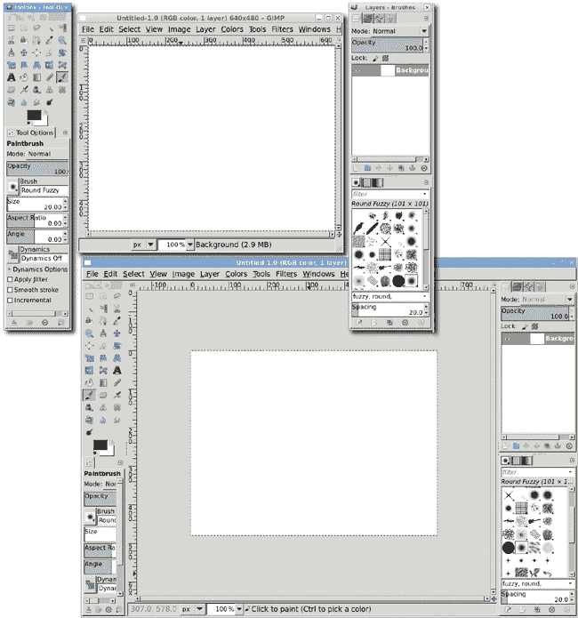

*GIMP 在多窗口模式（左上角）和单窗口模式（右下角）的默认窗口布局*

# GIMP 工具箱

GIMP 的默认布局从左到右包括工具箱、一个空白的画布窗口和默认的停靠窗口。*工具箱*包含 GIMP 的所有核心工具。画布窗口用于绘制、绘画和编辑图像。停靠窗口是包含一个或多个 GIMP 的各种对话框的窗口，例如图层、通道、画笔和路径对话框。

### 注意

*术语*对话框*指的是一种窗口类型，通常是在请求工具或其他功能时打开的窗口。*

下表显示了工具箱中每个工具的图标，并简要描述了该工具的功能。每个工具还有一个工具选项对话框，允许您微调每个工具的应用方式，以达到您期望的精确效果。我们将在稍后讨论工具选项对话框。

| 工具箱图标 |
| --- |
| 工具 |   | 功能 |
| --- | --- | --- |
| 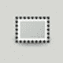 | 矩形选择 | 此工具允许您创建可编辑的矩形选择。使用工具选项指定新选择应如何与现有选择组合。在选择时按住 SHIFT 键可以创建一个完美的正方形。 |
| 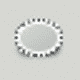 | 椭圆选择 | 椭圆选择工具与矩形选择工具类似，只是选择形状是椭圆形的。按住 SHIFT 键可以创建一个完美的圆圈。 |
|  | 自由选择 | 另一个选择工具是自由选择工具，它允许绘制曲线和多边形轮廓以创建选择。这两种类型的轮廓可以在单个选择中混合使用。 |
|  | 模糊选择 | 模糊选择工具根据颜色相似性和与图像窗口中点击点的距离来选择像素。在工具选项对话框中使用更高的阈值设置会导致选择更多像素。您可以通过按住左鼠标按钮并移动鼠标来更改阈值。勾选样本合并复选框可以选择来自可见画布（即所有图层组合）的像素，而不是仅来自当前图层。 |
|  | 颜色选择 | 颜色选择工具与模糊选择工具类似，但所选像素不需要彼此靠近。 |
|  | 剪刀 | 这是一个智能工具，可以在图像中找到边缘，使得手动绘制不规则形状的轮廓并围绕它创建选择变得更容易。 |
|  | 前景选择 | 此工具允许您使用自由选择和画笔笔触混合，从周围环境中隔离单个图层中的对象。 |
|  | 路径 | 路径是 GIMP 中的矢量组件（a），由一系列通过直线或曲线连接的节点组成。你可以编辑曲线来改变节点的位置和线条的弧度。路径工具允许你创建新的路径或编辑现有的路径。 |
|  | 颜色选择器 | 使用此工具可以更改工具箱中的前景色或背景色。当颜色选择器工具处于活动状态时，只需单击画布上的任何像素即可。 |
|  | 缩放 | 使用缩放工具可以放大或缩小图像的某个部分。拖动一个矩形框来放大该区域。 |
| 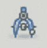 | 测量 | 使用测量工具可以测量图像中的角度和距离。这些测量值与旋转和缩放工具结合使用时非常有用。 |
|  | 移动 | 此工具允许你在图像窗口中移动图像元素，如图层、选区、文本和蒙版。 |
|  | 对齐 | 对齐工具允许交互式地对齐图层。 |
| 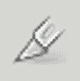 | 裁剪 | 裁剪工具是快速裁剪图像的最佳方式。你还可以用它来裁剪单个图层。 |
|  | 旋转 | 变换工具可以应用于图层、选区和路径。使用旋转工具对这些元素进行旋转。 |
|  | 缩放 | 另一个变换工具，缩放工具用于交互式调整图层、选区和路径的大小。 |
|  | 斜切 | 使用斜切工具在移动框内的像素时保持边界框（图层、选区或路径的边缘）的相对两侧平行。 |
|  | 透视 | 透视工具将边界框拉伸，就像你正正面观看一个方形照片，然后将照片倾斜远离你，使得远处的边缘看起来比近处的边缘短。 |
|  | 翻转 | 使用翻转工具可以水平或垂直翻转图层、选区或路径。 |
|  | 笼形变换 | 一个有趣的扭曲工具，但在这里不会介绍。对于新手和中级用户来说，它的用途不大。 |
|  | 文本 | 如果你想在项目中添加文本，你需要使用文本工具。工具选项对话框允许你指定字体大小和样式，以及对齐选项。 |
|  | 桶填充 | 使用桶填充工具将纯色或图案填充到图层的一部分。 |
| 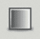 | 混合 | 混合工具将平滑的颜色过渡（称为*渐变*）应用于图层或选择区域。有许多库存渐变可供选择，渐变编辑器允许创建自定义渐变。 |
| 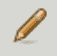 | 铅笔 | 画笔工具使用活动画笔和当前的前景色或背景色。铅笔工具绘制硬边线条，即使画笔本身有软边也不会抗锯齿。 |
|  | 画笔 | 使用画笔工具用软边刷和活动画笔绘制。 |
|  | 橡皮擦 | 橡皮擦工具可以从几乎所有图层中删除像素，并在其位置留下透明像素。当应用于默认情况下没有 alpha 通道的背景图层时，此工具将用背景色替换像素。 |
|  | 空气笔 | 空气笔工具的工作方式与画笔工具类似，但效果更柔和。 |
| 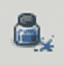 | 墨水笔 | 墨水笔工具专为与 Wacom 等绘图板一起使用而设计。它对压力和绘图板的倾斜功能做出响应。 |
|  | 克隆 | *克隆*是从图层的一个区域复制像素到另一个区域的过程。要使用克隆工具，请按住 CTRL 键并点击鼠标设置要克隆的源点。然后您可以使用画笔绘制来克隆像素。 |
|  | 修复 | 与克隆工具类似但合并附近像素效果更好的工具。此工具的常见用途是从照片中去除皱纹。 |
| 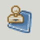 | 透视克隆 | 另一个与克隆相关的工具，可以复制一个具有透视区域的区域，以便在其中克隆。例如，您可以将建筑上的窗户复制到相邻位置，同时保留原始窗户的透视。 |
|  | 模糊/锐化 | 模糊/锐化工具的功能类似于画笔工具，允许您在图层上绘制以锐化或模糊画笔下的区域。 |
|  | 涂抹 | 想象在画布上用手指拖过湿油漆。此工具的功能与此相同，当您在图像窗口中拖动它时。它非常适合小修小补。 |
| 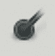 | Dodge/Burn | 与模糊/锐化工具类似，Dodge/Burn 工具可用于加亮（Dodge）或变暗（Burn）画笔下的区域。 |

|

^([a]) 用最简单的话说，*矢量*是包含从一端到另一端路径信息的线条。它们在 GIMP 图像窗口中创建时没有关于用于创建它们的像素的信息。大多数 GIMP 工具都是基于像素的，这意味着它们在像素上操作。*像素*是一个具有红色、绿色、蓝色和透明度级别的点。

|

## 工具选项对话框

*工具选项对话框*提供了访问活动工具的选项和设置的途径。此对话框以标签形式出现在两个初始停靠窗口的顶部。点击 GIMP 工具的图标会执行两个操作：激活该工具，并显示该工具的工具选项对话框。

### **注意**

*除了工具选项对话框外，许多工具箱工具还关联着一个额外的对话框。这些对话框提供了对工具特定功能的便捷访问。点击工具的工具箱图标以访问其工具选项对话框。在画布上点击以打开工具关联的对话框或使用文件菜单来访问它（文件*▸*对话框）。*

*矩形选择工具的工具选项对话框*

## 颜色样本和工具预览

在工具箱底部，你可以找到颜色样本和画笔、图案和渐变预览。如果你在首选项对话框中启用了它，你还会看到活动图像预览。

在样本框中，你可以找到当前的前景色（左上角的框）和当前的背景色（右下角的框）。本书中会参考这些颜色样本。点击其中任何一个都会打开一个对话框，你可以在此调整当前颜色。当备用框当前处于活动状态时，需要双击前景色或背景色框。例如，如果背景色框处于活动状态（在工具箱中它出现在前景色框后面），点击前景色框一次使其变为活动状态，第二次点击会打开更改前景色对话框。

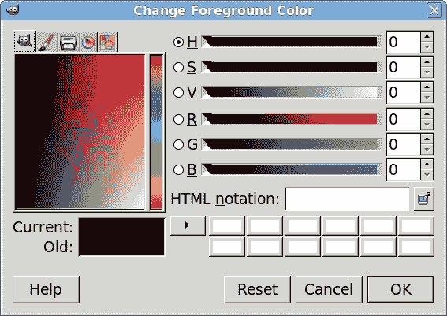

*更改前景色对话框*

样本框右上角的弯曲、双端箭头交换当前的前景色和背景色。点击左下角的小框将前景色重置为黑色，背景色重置为白色。在画布上按 D 键也会重置颜色，而按 X 键则会交换它们。

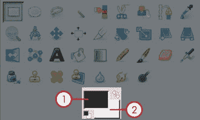

*工具箱底部样本框中的前景色  和背景色 *

## 画笔、图案和渐变预览

笔刷、图案和渐变预览反映了当前活动于“笔刷”、“图案”和“渐变”对话框中的选择。单击任何这些预览以打开相关对话框并更改活动选择。

*工具箱中的笔刷、图案和渐变预览。*

渐变是颜色的变化，通常在应用选择时平滑地模拟光照变化或曲面变化。混合工具常用于应用渐变。您可以将该工具设置为使用当前的前景和背景颜色，从一组预定义的渐变中选择，或创建自己的渐变。

## 活动图像预览窗口

您很快就会发现，同时打开多个图像窗口可能会变得混乱。活动图像预览窗口允许您快速激活您选择的窗口。双击预览以打开对话框以选择活动图像窗口。

此功能默认未启用，因此要使用它，请在“首选项”对话框中将其打开。在工具箱中选择“文件▸首选项”，然后在左侧选择“工具箱”。然后勾选“显示活动图像”复选框。活动图像窗口显示在工具箱的底部。

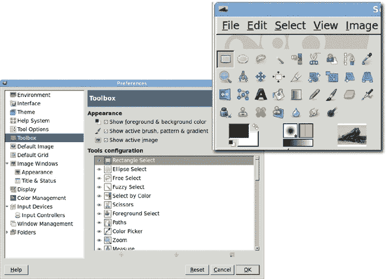

*一旦您在“首选项”对话框中启用了活动图像预览，预览将出现在工具箱的底部。位置将位于其他预览的右侧和/或下方，具体取决于您如何更改工具箱区域的大小。*

## 停靠

*浮动窗口*是一个包含其他窗口的窗口。例如，工具箱在其底部有一个浮动窗口。任何对话框都可以变成浮动窗口。要做到这一点，将一个对话框的标题拖动到另一个对话框中，以将两个对话框停靠在一起，从而产生一系列标签。要将对话框从一个浮动窗口拖出并移动到另一个窗口，请将标签拖动到屏幕的新位置。

*停靠窗口可以节省屏幕空间并减少杂乱（左侧）。在单窗口模式（右侧）中，所有对话框最初都是停靠的，但它们可以在任何时候通过将标签从一个浮动窗口拖动到另一个浮动窗口来移动到不同的浮动窗口。*

# 图像窗口

除了工具箱外，GIMP 的另一个主要窗口是*图像窗口*或*画布*，在这里显示您的工作。GIMP 允许您同时打开多个图像窗口，这在从窗口复制并粘贴到另一个窗口时非常有用。

*多窗口模式（左侧）将每个图像放置在其自己的窗口中。单窗口模式（右侧）在画布区域上方为每个图像添加标签。*

## 菜单

所有菜单都在图片窗口中。在多窗口模式下，每个图片窗口都有这些菜单的副本。大多数菜单项适用于打开菜单的图片窗口。一些菜单，如文件菜单，适用于整个 GIMP 应用程序。在单窗口模式下，顶部的菜单栏适用于活动图片窗口标签或所有标签，视情况而定。

菜单可以通过多种方式访问。第一种是通过菜单栏。另一种是在画布区域右击鼠标。最后一种选项是使用画布左上角的菜单按钮。在本书中，将使用菜单栏，尽管高级用户应该熟悉菜单按钮，因为那是唯一使用可撕离菜单的方式。为什么有这么多做这件事的方法？因为在处理小图像（如网页或计算机应用程序的图标）时，您可能需要放大很多。如果您调整窗口大小以适应这种情况，您可能不会在图片窗口的顶部看到每个菜单选项。如果发生这种情况，请使用指向右边的箭头访问不可见的菜单选项。此菜单还提供访问可撕离菜单的途径，允许您快速访问常用菜单项，而无需反复遍历菜单。例如，当创建指南以开始项目时，您可能会使用此功能。

图片窗口菜单包括文件、编辑、选择、查看、图片、图层、颜色、工具、滤镜、窗口和帮助。Linux 用户可能会在菜单栏中找到一个视频选项，这取决于他们的 Linux 发行版如何打包 GIMP。然而，这个选项不是 Windows 或 Mac 用户的基础 GIMP 包的一部分，本书中不会讨论这个选项。

在本书中，您将使用编辑、查看、图片、图层、颜色和滤镜菜单中的功能。选择菜单也非常有用，但您可以使用鼠标、工具箱和键盘快捷键来访问其大多数选项。不要忘记查看文件菜单，熟悉其创建、保存、导出和打印选项。

*单窗口模式下的图片窗口菜单栏（左），多窗口模式（中间下方）显示从画布左上角的菜单按钮发布的菜单，以及一个可撕离的菜单*

尽管这超出了本书的范围，但您应该知道您可以创建自己的附加工具，这些工具可以添加到任何菜单中。如果您是一位对为 GIMP 开发工具感兴趣的程序员，我建议您查看 GIMP 开发者网站上的材料（[`developer.gimp.org/`](http://developer.gimp.org/)），特别是插件开发部分。

| 图片窗口菜单和功能 |
| --- | --- |
| 菜单 | 功能 |
| --- | --- |
| 文件 | 文件菜单提供打开、关闭、打印、保存和导出等操作。 |
| 编辑 | 编辑菜单为您提供访问剪切、复制、粘贴、填充和描边操作的入口。其中一些操作仅适用于选择项，但如果没有选择项，则这些操作适用于整个活动图层。 |
| 选择 | 选择菜单提供补充工具箱选择工具的操作，包括全选、全不选、反转和保存到通道。选择还可以从该菜单进行羽化、增长、缩小和锐化。 |
| 视图 | 缩放只是视图菜单的选项之一。您还可以使用此菜单在引导线、图层边界、选择和点网格的可见性之间切换。强制图像窗口缩小以适应图像的缩放级别可以帮助您在缩小缩放时在桌面上腾出更多空间。选择视图▸全屏以在全屏模式和普通模式之间切换。 |
| 图像 | 这里可以找到应用于合成图像的操作，包括旋转变换、画布大小调整以及将所有图层合并为单个图层。 |
| 图层 | 此菜单提供专门针对图层的操作。这包括图层排序；活动图层的颜色管理；以及图层变换、蒙版、缩放和对齐。 |
| 颜色 | 菜单中的选项包括调整亮度、对比度、色调、饱和度和白/黑点级别的对话框。任何全局或基于选择的颜色校正都将使用此菜单。 |
| 工具 | 工具菜单提供了访问工具箱工具的入口，但除非你处于全屏模式，否则你很少会使用它。从该菜单选择一个项目会使该工具变为活动状态，就像你在工具箱中点击了它的图标一样。 |
| 过滤器 | 随着您跟随本书中的教程，您将熟悉过滤器菜单。它提供了您以创意方式操作图像所需的工具，包括应用模糊、光照效果、云渲染和扭曲。 |
| 窗口 | 对话框菜单提供了快速访问 GIMP 的许多对话框，包括图层、通道、路径、画笔、图案、渐变和文档历史对话框。 |
| 帮助 | 通过此菜单可以访问基于上下文和编程的帮助，以及已安装或在线的帮助文档。 |

### 注意

*您不必使用文件菜单来访问这些选项。尝试右键单击以显示包含所有这些选项的弹出菜单。这要快得多！*

## 额外功能

有一些其他图像窗口功能你应该了解。每个都标有标签，并在此简要讨论。

*额外的图像窗口功能*

|  | 使用快速蒙版来创建和修改选择。这将在 1.4 选择中进一步讨论。 |
| --- | --- |
|  | 使用标尺可以拉出垂直和水平辅助线。点击其中一个标尺并拖动以创建一个新的辅助线，或者通过选择“图像▸辅助线▸新建辅助线”来更精确地创建一个。辅助线就像网格线，您可以使用它来对齐对象。 |
|  | 使用导航控件在图像周围移动更容易。在查看大图像或放大查看小图像时点击它，以查看其效果。 |
|  | 指针坐标显示光标在您从右侧下拉菜单中选择单位（英寸、像素等）中的确切位置。 |
|  | 缩放下拉菜单允许您快速更改图像视图，但通常您使用键盘快捷键加号（+）和减号（–）来缩放和缩小会更好。按 1 键查看图像的 100%。 |
|  | 状态区域显示有用的信息，包括角度信息，当您拖动以创建直线时。 |
|  | 您还可以使用图像窗口左上角的指向右的箭头访问图像窗口菜单。 |
|  | 图像窗口还包括一个缩放按钮，其形状像一个放大镜，位于窗口的右上角。点击此按钮，然后拖动窗口角落以调整图像大小。画布将缩放以适应新的窗口大小。 |

# 首选项对话框

GIMP 的用户界面非常可配置。您可以更改用于访问工具和滤镜的键盘快捷键，或者为尚未具有快捷键的功能添加快捷键。此外，您可以更改默认的新图像大小，指定对话框在启动时的外观，设置您的资源消耗首选项，等等。这些选项以及许多其他选项都可以通过首选项对话框（文件▸首选项）访问。

## 快捷键

在 GIMP 中工作以节省时间的一个最佳方法就是使用现有的快捷键。如果您喜欢，您也可以自定义它们。打开“首选项”对话框（文件▸首选项），然后在左侧点击“界面”。点击“配置键盘快捷键”按钮允许您单独映射命令。例如，如果您经常需要模糊图像，您可能希望将 CTRL-SHIFT-B 映射到您需要应用的模糊命令。

或者，您也可以交互式地映射快捷键。勾选“使用动态键盘快捷键”复选框以启用此功能。然后点击“确定”以保存您的首选项。

*在首选项对话框中启用动态键盘快捷键*

在工具箱中打开编辑菜单。注意，预设选项旁边没有列出快捷键。要添加快捷键，将光标放在预设选项上，但不要点击它。相反，同时按下 CTRL、SHIFT 和 P 键。现在预设对话框有了快捷键，您可以尝试一下。按 CTRL-SHIFT-P 返回预设对话框。要删除动态快捷键，将鼠标悬停在菜单项上并按 BACKSPACE 键。快捷键是节省时间的巨大工具，也是个性化 GIMP 体验的简单方法。

为了阐明分步说明，本书将专注于菜单选择，而不是快捷键。然而，随着您经验的积累，学习使用快捷键将提高您的创意工作流程。

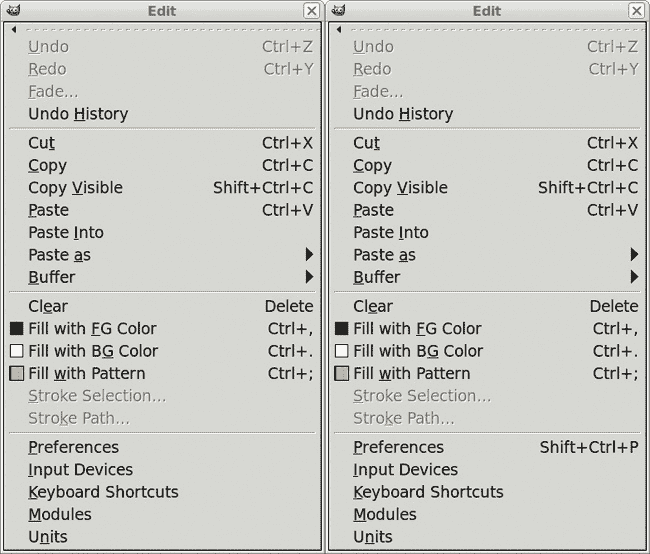

*为预设对话框设置快捷键前后的对比*

## 撤销级别和其他环境选项

预设对话框还可以提高 GIMP 的性能。您可以修改图像缓存大小、撤销级别数量、可用于撤销操作的最大内存以及可用于图像缩略图的最大大小等特性。如果您有足够的内存和意愿，可以随意提高这些值。最常修改的值可能是瓦片缓存大小。较小的值可以减少 GIMP 的内存使用，但会减慢处理大图像的速度。如果您有很多内存并且处理大图像，尝试将值从 128MB 增加到 256MB。如果您内存不足，另一个选项是减少撤销级别。默认的五级已经很低了。如果您想节省内存而减少这个值，请记住经常保存您的作品。

## 资源文件夹

预设对话框还允许您配置存储画笔、图案、渐变、字体等文件的目录。单击“文件夹”旁边的箭头以展开所有资源文件夹。如果您想创建自己的图案或文件，可以使用预设对话框告诉 GIMP 保存和查找这些文件的位置。您也可以通过这种方式添加或删除画笔和图案的集合。

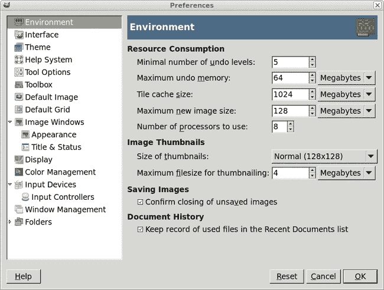

*预设对话框中的环境设置*

*预设对话框中的目录设置*

# 1.1 绘画和绘图

GIMP 可以用于绘画和绘图，尽管它更出名的是图像和照片编辑工具。铅笔、画笔、喷枪、橡皮擦和墨水工具统称为 GIMP 的画笔工具。本书的这一部分将向新用户介绍这些工具。在 1.10 基本教程中的基本教程将帮助您掌握使用这些画笔工具，以便您可以在本书的后面部分进行实验。

## 画笔工具和功能

在讨论每个画笔工具之前，让我们先看看它们共有的某些功能。

+   ****不透明度****。在各个画笔工具的工具选项对话框中，您可以调整要应用的笔触的不透明度。请记住，不透明度是透明度的对立面，因此较高的不透明度值意味着笔触将更不透明。

+   ****模式****。除了橡皮擦之外的所有画笔工具都允许您设置笔触的混合模式。混合模式定义了笔触如何与应用笔触的图层中现有的像素混合。不同的模式有不同的效果。加法模式将画笔的颜色添加到图像中，导致图像变亮。乘法模式使图像变暗。叠加模式可以根据应用的颜色或图案以及图层中现有的内容使图像变亮或变暗。混合模式也用于图层。

    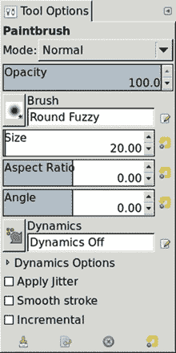

    *在画笔工具的工具选项对话框中将模式设置为正常*

    模式也用于合成图层。您将在 1.2 图层和模式中更详细地探索模式。现在不必过于担心它们。当您进行实验时，请坚持使用正常模式。

+   ****画笔****。全局画笔设置在工具箱中的画笔预览中设置。您还可以从工具选项对话框中选择任何画笔工具的画笔。除了使用自己画笔的墨水工具外，所有画笔工具都需要您选择特定的画笔。画笔工具甚至可以记住画笔；您可以在它们之间切换，而不会丢失任何工具的设置。默认配置是所有画笔工具共享相同的画笔，但可以在偏好设置对话框的工具选项下更改此设置。

    

    *偏好设置对话框显示，画笔设置在 GIMP 的所有画笔工具之间共享（画笔复选框被勾选）。*

    正如你所见，画笔工具的笔触可以设置为在应用时渐变。笔触在渐变前的移动距离也可以在工具选项对话框中使用动态调整。首先，将动态选项设置为**基本动态**。然后点击**动态选项**以显示渐变选项并调整渐变长度值以确定渐变前的笔触长度。将动态选项更改为渐变锥形将为渐变笔触添加锥形末端，如本例所示。墨水工具是唯一不提供此选项的画笔工具。

    

    *使用画笔工具指定如何渐变笔触。请注意，需要选择反向选项才能使笔触渐变而不是渐变进入.*

+   ****间距****。所有画笔都有一个间距设置。这个值以画笔宽度的百分比来衡量，决定了在绘制笔触时画笔图像之间的距离。您可以使用画笔对话框更改任何画笔的默认间距。较高的间距值允许您从普通画笔创建像线框和管道这样的形状。

现在您已经熟悉了基础知识，以下是本书教程中最常用的 GIMP 绘图工具。

### 铅笔工具

铅笔工具应用硬边缘，这一点很重要。充分利用绘图工具需要您了解硬边和软边之间的区别。当您使用软边缘时，画笔中的灰色级别或渐变颜色被认为是部分透明，并与画布中现有的像素合并。这会在笔触周围创建软边缘。当使用硬边缘时，如果笔触中的像素超过 50%的黑色（或超过 50%的彩色），笔触中的像素将替换画布上的像素，而不是与之合并。如果笔触中的像素小于 50%的黑色或彩色，画布上的像素保持不变。

在这里，很容易看出铅笔工具和画笔工具与圆模糊（101）和胡椒画笔一起使用时的区别。铅笔工具使用硬边缘，因此画笔边缘没有抗锯齿，而画笔工具使用软边缘。因此，当处理蒙版或编辑照片时，您可能不会经常使用铅笔工具。

*铅笔工具（顶部）和画笔工具（底部）用于使用圆模糊（101）和胡椒画笔绘制线条。*

### 画笔工具

在整个教程中，这是你将最频繁使用的绘图工具。画笔工具非常适合创建图层蒙版和通过绘制快速蒙版来创建选择。在两种情况下，画笔的软边缘特性使其非常适合紧密匹配曲线。

画笔工具只在给定的点上应用一次画笔。也就是说，如果画笔工具处于活动状态，并且您在画布上按住鼠标按钮并点击，则只应用一次笔触。当您在画布上拖动光标时，会应用更多的笔触。

### 气压喷枪工具

气压喷枪工具与画笔工具非常相似，不同之处在于它根据工具选项对话框中设置的速率和流量值应用更亮或更暗的笔触。如果光标不移动，它还会继续在单个点上应用画笔。因此，气压喷枪工具对于增强图像中的阴影和照明非常有用。

*在喷枪工具的“工具选项”对话框中设置的“速率”和“流量”值决定了当工具应用于画布时笔触的外观。左侧是一个单次点击。右侧，鼠标按钮被按下了三秒钟。*

### 橡皮擦工具

橡皮擦工具是一个软边缘的绘画工具，它以当前笔刷的形状从图层中移除像素。在除了背景层以外的所有图层中，像素被更改为透明（或半透明，取决于使用的笔刷）。在默认情况下不支持透明度的背景层中，被擦除的像素被更改为工具箱中的背景颜色。

*橡皮擦工具可以从图层中移除像素。*

橡皮擦工具是一个破坏性工具；一旦保存文件，它所改变的像素将永远消失。更好的方法是用图层蒙版隐藏这些像素，这样就不会造成破坏。（您将在 1.4 选择中学习更多关于图层蒙版和选择的内容。）您可以在将来任何时候编辑图层蒙版以调整隐藏的内容。橡皮擦工具无法做到这一点，因此您不会经常使用它。

*使用图层蒙版可以达到相同的效果，它保留了图层内容，以便在必要时可以稍后重用。*

### Ink 工具

Ink 工具是专门为与 Wacom 等制造商的绘图板一起使用而设计的。您可以使用 Ink 工具的“工具选项”对话框调整笔尖的形状、应用于笔触的倾斜量、相对于平板笔移动笔的速度，以及更多设置。

这些功能对使用钢笔绘制的用户非常有帮助，例如漫画或类似的艺术作品。不幸的是，笔触绘制不是本作者的强项，因此这些教程中不会使用 Ink 工具。

## 笔刷

GIMP 的库存笔刷适用于大多数项目，您将在本书的教程中多次使用它们。但只要稍加努力，您就可以大大扩展可用的样式选择。创建新笔刷几乎是不需要动脑筋的事情。几乎。

这里讨论了两种类型的 GIMP 笔刷：普通笔刷和彩色笔刷，以及参数化笔刷（这些笔刷是可缩放的，必须使用笔刷编辑器创建）。

### 注意

*创建新笔刷或图案最简单的方法是使用剪贴板。使用任何选择工具选择一个小区域并复制它（编辑*▸*复制或 CTRL-C）。剪贴板在“笔刷”和“图案”对话框的非常第一个框中显示。本节描述了如何更好地控制笔刷创建。*

### 创建普通和彩色笔刷

你可以创建自己的 GIMP 画笔。最简单的是普通或彩色画笔，它由你绘制或导入的图像组成，并将其保存为带有*.gbr*扩展名的画笔文件。任何可以在 GIMP 中打开的图像都可以保存为画笔，尽管有些效果比其他的好。例如，非常详细的图像不适合这个目的。在大多数情况下，图像也应该缩小，因为它将成为画笔尖端。

### 注意

*彩色画笔与普通画笔类似，只是前者有颜色，而后者只是灰度的不同级别*。

普通画笔在画笔图像中的黑色部分用前景色绘制。在画笔中黑色淡化为白色的地方，前景色在混合到画布上的像素之前会与透明度混合。

要创建普通或彩色画笔，只需按照以下步骤操作：

1.  通过选择**文件**▸**新建**来打开一个新的图像窗口。将大小设置为**25** × **25 像素**。

1.  如果你正在创建一个彩色画笔，你需要将背景图层（图层▸透明度▸添加 Alpha 通道）。如果你正在创建一个普通画笔，不要添加 Alpha 通道，而是将图像转换为灰度（图像▸模式▸灰度）。

1.  使用画笔工具在画布上绘制一个*X*形状。如果你创建了一个彩色画笔，它将以颜色绘制；如果你在上一个步骤中将图像转换为灰度，它将以灰度显示。

1.  一旦你完成了图像的创建，将其导出到带有*.gbr*文件扩展名的画笔目录中。（选择**编辑**▸**首选项**以打开首选项对话框，然后在**文件夹**▸**画笔**下查找正确的路径。）

1.  当出现“导出图像为画笔”对话框时，在描述字段中输入画笔名称，并适当地设置间距值。画笔就像在画笔描边过程中反复应用的模板；其间距设置是从一个模板应用的中心到下一个模板应用中心的画笔宽度的百分比。对于大多数用途，你可以接受默认间距。

    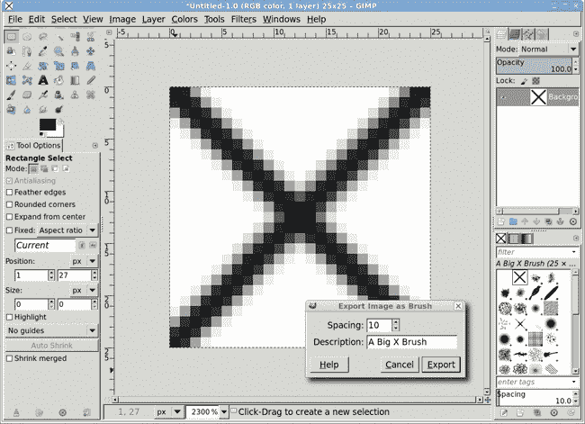

    *显示示例画笔的“导出图像为画笔”对话框。注意更新后的画笔对话框，右下角已选择新画笔*。

1.  打开画笔对话框（**窗口**▸**可停靠对话框**▸**画笔**），点击**刷新**以更新画笔对话框。这会导致 GIMP 重新读取所有可用的画笔文件，并且它应该找到你刚刚保存的那个。你的新画笔应该会出现在调色板中，与内置画笔以及你定义的任何其他画笔一起。你的新画笔现在可以使用了。选择它并开始绘画。

### 注意

*在使用普通和彩色画笔时，创建特定画笔的不同尺寸的多个版本并不罕见。最好的方法是首先创建最大的画笔，然后重复缩小并保存图像以创建几个较小的画笔*。

### 创建参数化画笔

参数笔刷易于修改，并且在使用过程中可以配置以多种方式改变。与普通和彩色笔刷不同，您只能通过使用笔刷编辑器来创建参数笔刷。要打开笔刷编辑器，请点击笔刷对话框中的新建图标（它显示一张空白纸张）。（如果笔刷对话框未处于活动状态，请选择“窗口”▸“可停靠对话框”▸“笔刷”。）

*在画布上多次应用参数笔刷并在笔刷编辑器窗口中显示*

笔刷编辑器窗口允许您设置基本的笔刷形状（椭圆形、正方形或菱形），并通过输入各种选项的值以多种方式调整该形状。半径是笔刷的像素大小。尖刺值是从笔刷中心向外延伸的线条数量。这些线条在正方形和菱形形状中很明显，但在椭圆形形状中直到你增加纵横比之前并不立即可见，纵横比放大了尖刺的效果。

笔刷编辑器中的最后两个选项是角度和间距。角度值以度为单位给出，表示尖刺应该如何围绕笔刷中心旋转。与其他笔刷一样，您可以调整参数笔刷的间距。

参数笔刷的主要用途是它们在工作过程中易于更改。也可以轻松调整特定的笔刷形状以满足非常具体的需求。没有打开画布窗口中的笔刷文件、手动编辑笔刷并将其保存为新笔刷，是无法用其他笔刷类型做到这一点的。

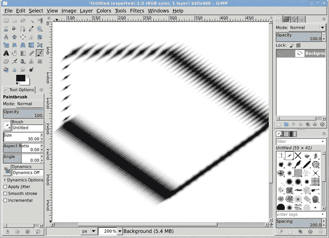

*使用参数笔刷绘制选择项可以让你达到一些有趣的效果。在每一行中，都会改变间距值。*

# 1.2 图层和模式

GIMP 中的图层就像叠放在一起的透明纸张。任何透明的地方，下面的纸张都会显示出来。如果你在投影仪上放置几层透明纸张并打开投影仪的灯光，每张纸的颜色会结合形成新的颜色。这正是堆叠中的图层工作的方式：它们结合在一起，在画布窗口中形成你所看到的效果。对图层所做的更改会立即反映在画布上。

图层是 GIMP 项目的构建块，因为它们允许您一次构建一个图像的一部分，就像在计算机接管之前手工绘制卡通一样。

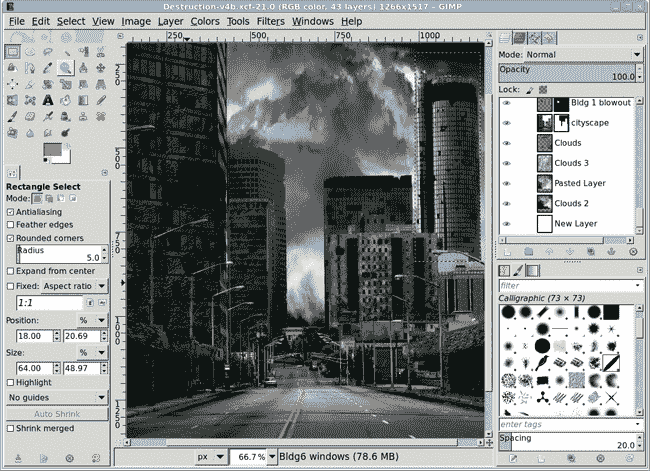

*图层对话框中的图层和画布窗口中的组合图像*

## 图层对话框

您可以使用图层菜单或图层对话框来管理图层。

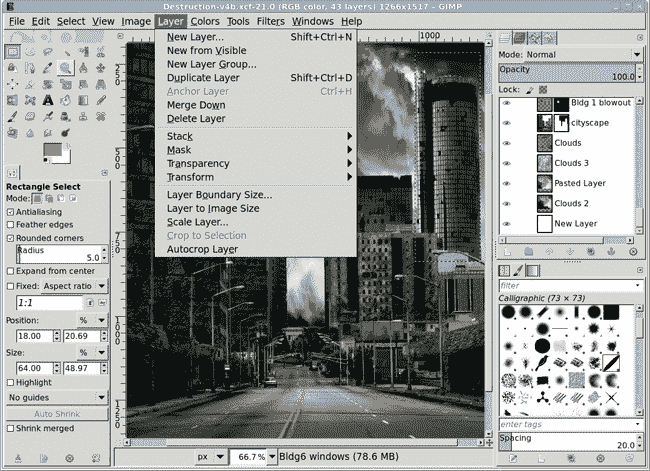

*从画布窗口访问图层菜单*

您可以通过使用图层对话框底部的箭头按钮  来移动图层在堆栈中的上下位置，或者您可以直接点击图层并将其拖动到新的位置。图层对话框底部的其他按钮包括新建图层按钮（单页图标 ）、创建图层组（文件夹图标 ）、复制图层按钮（双页图标 ）、锚定图层按钮（锚图标 ）以及删除按钮（红色圆圈中的 *x* 图标 ）。除了锚定图层按钮外，这些按钮的功能都是显而易见的。

*可以使用按钮栏创建、移动和管理图层。*

图层对话框中的文件夹图标是在 GIMP 2.8 中引入的。这用于创建一个 *图层组*，允许同时对一个以上的图层执行单个操作，例如在画布中移动或关闭可见性。要创建图层组，请点击图层对话框中的文件夹图标。图层组在对话框中看起来就像一个普通图层，除了隐藏按钮，一个位于预览左侧的三角形图标，仅在组中包含一个或多个图层时才可用。点击此按钮将在图层对话框内显示或隐藏组内的图层。如果组可见性和图层可见性都启用（即，两个眼图标都是可见的），组内的图层将包含在画布窗口中。

您可以通过在图层对话框中拖动并将它们放到组图层上，将图层添加到组中。或者，首先选择组图层，然后创建一个新图层。

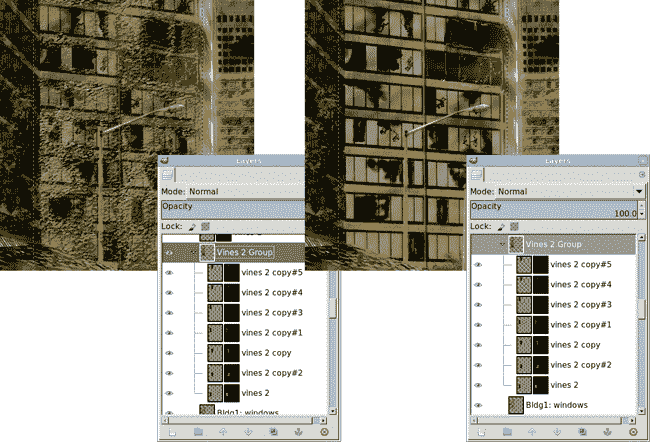

*分组图层在包含大量图层的项目中更容易管理。*

当您将内容复制并粘贴到画布上时，GIMP 会创建一个临时的图层，称为 *浮动选择*。您可以将这个临时图层锚定到当前图层（在您将新选择粘贴到画布上之前激活的图层），或者您可以将其作为一个新图层。锚定图层意味着浮动选择的内容在两者重叠的地方替换现有的图层内容。锚定图层按钮是锚定浮动选择到当前图层的快捷方式。使用新建图层按钮可以将浮动选择作为一个新图层，或者您也可以使用新建图层按钮从头创建一个新图层。

*图层对话框，带有浮动选择*

图层可以有遮罩，可以隐藏图层的一部分，使其在画布上显示的合成图像中不被使用。遮罩将在使用图层遮罩为图像着色中讨论。图层对话框中的所有图层都有一个图层内容预览。遮罩作为第二个预览显示在图层内容预览的右侧。

图层可以是可见的或隐藏的，这取决于其可见性图标的状态，即伴随每个图层的图层对话框中的眼睛图标。点击此图标可以切换图层的可见性。当图层不可见时，其眼睛图标不会显示。

图层不必与画布大小相同。图层边界也可以在画布边界之外。如果是这种情况，任何超出画布的图层部分都不会在画布上显示。要扩展图层以匹配画布大小，只需在图层对话框中右键单击图层，然后选择“图层到画布大小”。

你还可以使用移动工具在画布上移动图层。如果你想要同时移动多个图层，可以通过点击每个图层的链链接图标将它们锚定在一起。在画布上点击并拖动可以同时移动所有图层。请注意，从 GIMP 2.8 及以后的版本开始，你也可以将图层分组，并将组图层设置为活动图层，以便一次移动组内的所有图层。现在，链链接可以用来将不在图层组中的图层分组。

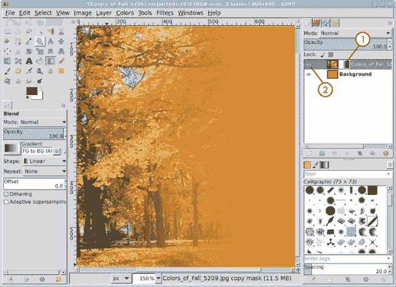

**在这里，图层对话框显示了一个图层及其遮罩。遮罩由图层预览右侧的黑白色预览表示 。可见性图标出现在最左侧 。如果图层被隐藏，这个眼睛图标将不可见。只需点击图标应该出现的位置，就可以恢复图标并使图层再次可见**。

**链链接图标可以将图层链接起来，以便它们可以一起移动**。

你可以通过在图层对话框中选择图层并调整不透明度滑块来使任何图层部分不透明。你为这个不透明度滑块选择的设置将与你使用图层遮罩定义的任何不透明度更改相结合。

GIMP 在透明纸张隐喻的基础上又前进了一步。你可以使用几种方法之一来将图层与下面的图层结合。每种方法都称为**图层模式**。

模式是 GIMP 的重要概念。除了适用于图层外，它们也适用于绘画工具。在返回到图层模式之前，我们将先看看绘画模式，尽管你会看到，这两个 GIMP 功能几乎是相同的。

## 绘画模式

所有绘画工具都可用绘画模式，从混合到桶填充到画笔。绘画模式定义了绘画工具如何将其所绘内容与图层中已有的像素结合。这种将新内容与旧内容混合的过程称为*合成*。

绘画模式是 GIMP 中结合颜色和透明度的数学方法。其想法是，对于每个颜色通道（红色、绿色和蓝色），使用某种组合的加法、减法、乘法和除法，以指定方式将两个不同的像素进行合成。

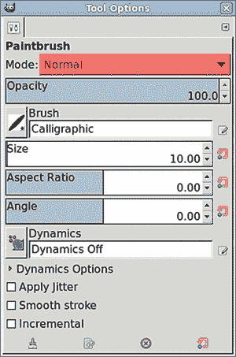

*绘画模式（用红色突出显示）可用于所有绘画工具.*

一个重要的绘画模式概念是，颜色通道只有 256 个可能的值（0 到 255，其中 0 是无颜色，255 是该通道中的全颜色）。这是因为 GIMP 每个颜色通道只使用 8 位：8 位 = 2⁸ = 256。当你结合所有三个通道时，你最终会得到 2563 种可能的颜色（不包括 alpha，或透明度，通道）对于任何单个像素。在某些模式下，添加、减去等操作可能会产生超出此范围的值。在这种情况下，模式要么*限制*（强制）值回到最小值（0）或最大值（255），要么绕到范围的另一侧。

与绘画模式一样，图层模式定义了图层如何进行合成。绘画模式与图层模式之间的区别在于，绘画模式是在绘画操作发生时应用的，因此这些更改是立即的，并且实际上会改变图层中的像素。图层模式指导 GIMP 如何将一个图层与下面的图层结合，但这种合成实际上不会改变像素。它只改变画布的显示方式，因为图层在内部合成并在图像窗口中显示。

GIMP 有 23 种绘画模式，其中 21 种也可以用作图层模式（背景和颜色擦除绘画模式不能用于图层）。下表列出了这些模式，并简要描述了它们的工作原理。在此表中，*现有像素*是当前图层中的像素（及其多个颜色通道），而*新像素*是由绘画工具添加的。对像素进行的操作会影响每个通道（红色、绿色和蓝色）。在下一节学习图层模式时，请记住，这些模式以相同的方式应用，只是现有像素来自当前图层，而新像素来自下面的图层。

| 绘画模式和功能 |
| --- |
| 模式 | 功能 |
| --- | --- |
| 正常 | 正常模式是默认的绘画模式。绘画工具添加的新像素的颜色替换了图层中现有像素的颜色。 |
| 溶解 | 溶解模式的工作方式与正常模式类似，只是在绘制时会在笔触中添加随机空白区域。这类似于用画笔尖端在画布上点涂颜料。 |
| 下方 | 在具有透明度的图层中，此模式仅绘制透明区域。这导致新像素看起来像是应用在现有像素的下方。 |
| 色彩擦除 | 色彩擦除模式类似于橡皮擦工具，不同之处在于它不是擦除完整的画笔形状，而是仅擦除前景色的像素。 |
| 仅加亮 | 如果现有像素小于新像素，仅加亮模式使用新像素。 |
| 屏幕模式 | 屏幕模式从白色（255）中减去每个像素，将结果相乘，然后从白色中减去那个结果，再除以白色。它将颜色限制为 255。结果像素通常要亮得多。 |
| 轻描 | 此模式类似于屏幕模式。它从白色中减去现有像素，反转结果，然后将结果乘以新像素，再乘以白色。它将颜色限制为 255。与屏幕模式一样，结果是较亮的像素。 |
| 加法 | 加法模式将两个像素相加，并限制为 255。 |
| 仅变暗 | 如果现有像素大于新像素，仅变暗模式使用新像素。 |
| 乘法 | 此模式将当前像素乘以新像素，然后将结果除以白色。它将颜色限制为 0。结果通常是较暗的像素。 |
| 烧灼 | 烧灼模式从白色中减去新像素，将结果乘以白色，然后除以现有像素。然后再次从白色中减去结果。结果倾向于是一个较暗的像素。 |
| 叠加 | 叠加模式是乘法和屏幕模式的混合。它使暗区更暗，亮区更亮。 |
| 柔光 | 柔光模式是乘法和屏幕模式的另一种组合，产生的结果类似于叠加模式。 |
| 硬光 | 硬光模式在执行操作之前测试像素，看它们是否更接近黑色或白色。它是乘法和屏幕模式的另一种混合，通常产生与叠加模式相反的结果。 |
| 差异 | 此模式从新像素中减去现有像素，并取结果的绝对值。因为使用了绝对值，所以不需要限制，结果通常看起来类似于彩色负片。 |
| 减去 | 此模式从新像素中减去现有像素，并限制为 0。 |
| 粒度提取 | 此模式从新像素中减去现有像素，然后加 128。在许多图像中，粒度提取模式倾向于产生看起来像是反转的颜色。 |
| 粒度合并 | 粒度合并模式将现有像素添加到新像素中，然后减去 128。这通常在照片中产生更丰富的颜色。 |
| 除法 | 此模式将新像素除以现有像素，然后将结果乘以白色。它将颜色限制为 255。结果通常是较亮的像素。 |
| 色调 | 色调模式通过首先将 RGB 转换为 HSV，然后从现有像素中提取色调，从新像素中提取饱和度和值来处理像素。 |
| 饱和度 | 饱和度模式与色调模式类似，不同之处在于它从现有像素中提取饱和度，从新像素中提取色调和值。 |
| 颜色 | 颜色模式与色调模式类似，不同之处在于它从现有像素中提取饱和度和色调，从新像素中提取值。 |
| 值 | 值模式与色调模式类似，不同之处在于它从现有像素中提取值，从新像素中提取饱和度和色调。 |

## 图层模式

使用绘画工具混合像素是一个本质上具有破坏性的过程，因为以任何模式绘画都会改变图层中的像素。这并不总是坏事，但如果你需要恢复原始像素信息怎么办？使用 GIMP 创作艺术几乎总是涉及实验，这通常意味着放弃一组更改，回到源图像，并尝试不同的方法。如果明天——在你保存并退出 GIMP 之后——你想以不同的方式编辑图像呢？那些像素将永远失去它们的原始设置。

为了保持原始像素设置，请使用图层模式。图层模式通过将当前图层与其下方的像素混合来工作。混合方法与绘画模式相同，但图层模式在画布上显示像素值时组合像素值，而不改变下层像素。例如，使用桶填充工具应用图案然后切换到硬光图层模式不会改变当前图层以下的任何像素。因此，当前图层可以在任何需要的情况下——任何时候——改变，而不会丢失任何其他图层的像素值。

*图层对话框，模式下拉菜单突出显示*

要设置图层模式，请使用图层对话框的“模式”下拉菜单。除了“在下面”和“颜色擦除”模式外，所有可用作绘画模式的模式都可以用作图层模式。并且图层模式可以随时更改。更改图层模式不会物理改变像素（它只影响组合图像在画布上的显示方式），因此它不会消耗任何额外的内存或使用任何撤销级别。

### 注意

*撤销命令允许你回退到最近的变化。你可以回退任意多次，直到你使用了在首选项对话框的环境部分配置的最大撤销内存量。默认的撤销内存量是 16MB，这对于用于网络的较小图像来说相当充足，但对于海报大小的打印可能不足够。你可以通过反复按 CTRL-Z 或选择编辑▸撤销来回退到最近的变化。如果你按下 CTRL-Z 停止撤销步骤，你就知道已经达到了允许的最大撤销内存量。在你达到那个点时，你可能想立即增加最小撤销级别。*

## 使用图层模式着色图像

图层模式在本书的许多教程中都有出现，但这里有一个迷你教程来介绍它们。*着色*图像会在目标区域不是完全黑色的地方添加颜色。在这个过程中，图像被*去饱和*——所有颜色内容都被移除——留下一个仍然在 RGB 模式下的图像，但只包含灰色调。只有在这个时候，你才添加颜色。

1.  打开任何图像，首先通过选择**颜色**▸**去饱和**来去饱和原始图层。点击**确定**。

1.  通过选择**图层**▸**新建图层**并在图层填充类型中设置为**透明度**，在其上方添加一个新的透明图层。

1.  在工具箱中单击前景颜色以更改前景颜色。选择你喜欢的任何颜色，然后将前景颜色拖到画布上以填充新图层为所选颜色。

1.  将此图层的模式设置为**颜色**。

    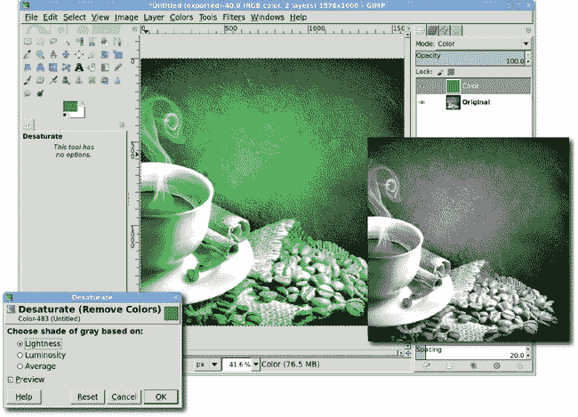

    *首先，去饱和你的图像。然后通过在原始图层上方添加一个图层，填充新图层上的颜色，并将新图层的模式设置为颜色来着色图像。*

因为在更改前景颜色对话框中特别选择了颜色，这种着色方法比其他方法提供了更多的控制。它也不会像颜色化对话框（**颜色**▸**颜色化**）那样过多地洗掉图像。

## 使用图层蒙版着色图像

使用图层模式，你可以通过结合我们刚刚使用的技术和图层蒙版来选择性地给你的图像添加颜色。一个*图层蒙版*阻止图层的一部分显示出来，所以只有它的一部分出现在画布窗口中显示的合成图像中。蒙版中任何白色部分都会使用该图层的一部分。蒙版中的任何黑色部分都会导致该图层的一部分不被使用。

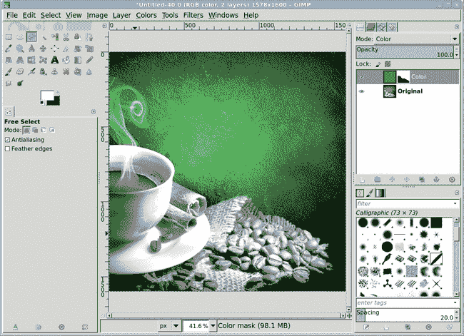

*图层蒙版——在图层预览右侧可见——让我们能够着色图像。在图层对话框中单击蒙版以使其变为活动状态。然后应用绘图工具到蒙版上，以改变其形状以适应你的需求。*

1.  将之前示例中的彩色图层添加图层蒙版（图层▸蒙版▸添加图层蒙版）。

1.  当提示时，点击**白色（全不透明）**单选按钮。

1.  在选择画布的情况下，按**D**键重置默认的前景色和背景颜色。然后将前景颜色（黑色）从工具箱拖到画布上。这将在蒙版中填充黑色，使得彩色图层不可见。

1.  在画布上选择一个区域，然后将背景颜色（白色）拖入选择区域。这将在所选区域内的蒙版中添加白色，使得彩色图层的那部分可以在画布窗口显示的合成图像中使用。

## 层和层模式提示

到现在为止，你应该已经熟悉了层和模式的基础知识。以下是一些在实验时需要注意的提示。

+   屏幕和加法层模式会使图像变亮。乘法和减法模式会使图像变暗。但叠加模式可以两者兼得！

+   记住，白色与红色的差值与从红色中减去白色的结果不同。从另一个图层中减去一个图层会将结果夹在黑色。想象一下，一个图层包含红色值为 100，另一个图层包含红色值为 40。从第一个图层减去第二个图层的结果将是-60，但减法模式不能读取低于 0（黑色）的值。差值模式取绝对值。 

+   为了获得更干净的效果，尝试使用柔光层模式而不是颜色层模式来给图像上色。

+   层模式不会消耗内存。在层模式之间切换不会影响 GIMP 的整体性能，所以大胆尝试！（在即将到来的教程中，你将在层模式上获得大量的实践。）

+   确保给图层起有意义的名字。默认的名字从来不足以描述，当处理十几个或更多图层时很容易迷路。只需在图层对话框中点击图层名字，并输入新的、更描述性的名字。完成更改后按回车键。

+   给图像上色的方法有很多。一种方法是使用上色工具。这是最快的方法，效果几乎和使用了层模式一样好。打开任何图像并去饱和（颜色▸去饱和）。然后打开上色对话框（颜色▸上色），调整色调、饱和度和亮度滑块，直到预览显示所需的结果。但请记住，这会改变图层中的像素。为了保持像素去饱和，在去饱和图层上方添加一个新图层，用颜色填充新图层，并使用层模式将颜色与去饱和图层混合。

    

    *在这里使用上色工具给图像上色。与颜色层模式不同，上色工具实际上会改变像素内容。在使用此工具之前，请确保您确实想要进行更改。*

# 1.3 层模式

当处理图像时，GIMP 使用三种颜色模式之一：RGB、灰度或索引。每种模式代表一种特定的*颜色模型*。颜色是一个非常复杂的话题，但我将尽力为你总结。

颜色模型（你可以显示的颜色集合）是一种用一组数字表示颜色的方式，这些数字定义了颜色的组成部分。不同的颜色模型可以映射到不同的*颜色空间*（定义你看到的颜色）。想象一个颜色空间图，在其中你可以画一个三角形。这个三角形就是模型，其中每个顶点都是三种原色之一：R（红色）、G（绿色）或 B（蓝色）。根据这个模型，当 R = 100，G = 100，B = 100 时，你得到深灰色。如果你将三角形向右滑动，注意保持在图中，你仍然有一个具有三个值为 100 的颜色模型，但那些值定义了不同的颜色。要产生特定的颜色，你需要颜色模型和颜色空间。

### 注意

*说实话，色彩理论比这要复杂得多。其背后的数学在这里不会探讨，但正如你将看到的，基本思想很重要。*

有许多不同的颜色模型和颜色空间。GIMP 仅在使用 RGB、灰度和索引颜色模型的情况下在*sRGB（标准 RGB）*颜色空间内工作。RGB 模型用于在显示器上显示工作，因为它是一种加色模型，其中组件被相加以产生颜色。显示器从黑色（0/0/0）开始，随着你增加每个组件的值，屏幕会变得更亮。如果每个组件的量都完全添加，你会得到白色。

*GIMP 的图像模式：RGB、灰度和索引*

另一个众所周知且流行的颜色模型是 CMYK，主要用于印刷，GIMP 尚未直接支持。与 RGB 相比，CMYK 是一种减色模型。如果 C、M、Y 和 K 的量相等，你会得到黑色。就像你反复在相同的纸上打印一样，墨水会积累直到你得到一个黑色的污点。

你可以理解为什么将一种颜色模型转换为另一种颜色模型是一项相当复杂的任务。你需要知道的不只是你显示器上像素的颜色。

*RGB*是屏幕图像最常用的模式，本书中将一直使用它。字母 R、G 和 B 代表*红色*、*绿色*和*蓝色*，代表 RGB 图像的三个颜色通道。图像中的每个像素都是三个颜色通道中每个像素的合成。每个通道使用 8 位，可以通过一组从 0 到 255 的整数数字定义颜色。这为你提供了可观的 1600 万种颜色来工作。

*RGB 图像的默认颜色通道*

在 RGB 模式（图像▸模式▸RGB）下工作意味着您还可以使用透明度。*透明度*是衡量光线可以通过给定像素的程度。画布上像素的颜色是结合该像素的三个通道，然后将复合像素的颜色与位于图层堆叠中其下方的复合像素的某些百分比混合的结果。透明度也是不透明度的对立面。如果一个像素是 30% 透明的，那么它也是 70% 不透明的。

如果 RGB 图像有一些透明度，那么这些信息将存储在一个第四通道中，称为 *alpha 通道*。当您被要求选择 Alpha 到选择或添加 Alpha 通道时，您将处理图像或图层中的透明度信息。

*默认情况下，单个图层中的透明区域由一个棋盘图案表示。该图案可以在“首选项”对话框中配置.*

*灰度模式*（图像▸模式▸灰度），使用单个通道，具有 256 个灰度级别（无颜色）的图像设置，对于某些艺术项目或黑白照片或扫描件可能很有用。您可以通过切换到灰度模式轻松地降低图像的饱和度，但通道混合器（颜色▸组件▸通道混合器）是转换彩色照片的更好选择。

*索引模式*（图像▸模式▸索引）在将 RGB 图像转换为用于网络的 GIF 文件时很有用。GIF 文件格式只允许图像中有 256 种颜色。每个图像包含一个索引数字表，每个数字代表一种颜色。只有一个索引数字也可以用来指定透明度。例如，如果指定蓝色的索引数字也设置为在 GIF 文件中指定透明度，当程序显示图像时，它将显示透明度而不是显示蓝色。像 GIF 这样的索引格式只有两种透明度级别：开和关。在索引模式下，无法指定像素应该是半透明的。

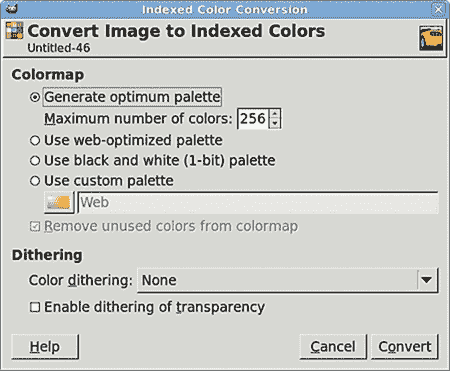

*将图像转换为索引颜色对话框*

将 RGB 模式转换为索引模式允许您从几种 *抖动* 方法中选择一种，这是一种将相似颜色组合成单一颜色的方式，从而将颜色总数减少到 256（GIF 文件允许的最大颜色数）以下。从 RGB 模式转换为索引模式时需要抖动，因为 RGB 图像可以有高达 1600 万种颜色，而索引图像不能超过 256 种颜色。图像中的颜色还可以映射到特定的颜色调色板。颜色调色板和抖动方法都在“索引颜色转换”对话框中选定，该对话框在您选择“图像▸模式▸索引”时打开。

GIF 格式使用单个像素进行透明度处理，这使得将透明区域旁边的圆形边缘与背后的任何东西混合变得困难。GIF 格式不支持 *alpha 混合*，这是一种沿边缘混合像素的技术，需要单个像素的多个透明级别。在 GIF 文件中，像素要么是透明的，要么不是。

GIF 格式的一个好替代品是 PNG 格式，它支持单个像素的多个透明级别，具有较少的许可限制，并且也受到 GIMP 的支持。出于所有这些原因，GIF 文件正在迅速被 PNG 文件取代。我建议将索引图像转换为 RGB 并将其保存为 PNG 文件。

虽然许多网页设计师正在从 GIF 迁移到 PNG 文件，但旧版本的 Internet Explorer (IE) 仍然无法正确显示包含不同透明级别的 PNG 文件。GIMP 可以正确保存具有多个透明级别（半透明区域，旨在与图像放置的背景混合）的 RGB 图像。问题是，旧版本的 Internet Explorer 错误地解释了除完全透明之外的所有内容，并以纯色显示此类图像。这个问题已在 IE 的较新版本中得到纠正。

# 1.4 选择

想要充分利用您的 GIMP 体验？掌握有效创建选择的技艺。没有什么比这更重要。完美的选择可以使一张图片与另一张图片融合，或将一张图片映射到另一张图片上。或者将白天变成夜晚。没有选择，您几乎无法使用图像编辑器做任何事情，本节重点介绍如何尽可能准确和高效地进行选择。

所有 GIMP 选择都由一组移动的破折号勾勒出来，这被称为 *行军蚂蚁*。您可以通过从图像窗口菜单中选择编辑▸首选项并点击图像窗口条目来设置蚂蚁的速度。如果您想切换特定图像窗口内选择项的可见性，请选择查看▸显示选择。

## 选择工具

GIMP 提供了九种不同的工具来创建选择：矩形选择、椭圆选择、自由选择、模糊选择、按颜色选择、剪刀、前景选择、快速蒙版和路径。路径是矢量轮廓，可以转换为选择。或者，选择也可以转换为路径。这两种选项都可以在路径对话框中找到。快速蒙版允许您在启用时在图像窗口中用彩色蒙版进行绘制，然后在关闭时将蒙版转换为选择。快速蒙版将在本节稍后部分详细介绍。

## 编辑选择

矩形选择和椭圆形选择工具包括交互式编辑功能。使用任一工具在图像窗口内点击并拖动。注意，选择被一个边界框勾勒出来。在这个框的边缘有热区，允许调整它的大小，这也会调整选择的大小。在边界框内点击并拖动以移动选择。要移除边界框，按回车键或在选择内单击一次。要重新获取边界框，在选择内单击一次。

这些工具可以编辑任何选择，但使用它们会将原始选择，如自由选择，转换为矩形或椭圆形选择。

*矩形和椭圆形选择创建后可以编辑。角落  改变宽度和高度，而角落之间的更长热区  只改变宽度或高度。*

选择还可以使用任何变换工具（旋转、缩放、剪切、透视、翻转和笼状）进行编辑。创建选择后，选择一个变换工具。变换可以应用于图层、选择或路径。在“工具选项”对话框中，点击选择框以将变换应用于选择。

*要将变换操作应用于选择，必须在执行变换之前在变换工具的“工具选项”对话框中设置选择框。*

## 选择约束

所有选择工具都可以使用“工具选项”对话框进行配置。矩形选择和椭圆形选择工具可以从该对话框以多种方式约束。*选择约束*定义了选择的形状和大小。矩形选择和椭圆形选择工具都有一个*从中心扩展*选项。未约束的选择将一个角落锚定在第一次鼠标点击的点。锚定的角落取决于拖动选择的方向。在“工具选项”对话框中设置从中心扩展，将选择的中心锚定到初始鼠标点击点。

*固定*是这两个选择工具的另一个约束选项。它提供了四种约束选择的方式：宽高比、宽度、高度和大小。选择其中任何一个都会将选项菜单下方输入字段的内容更改，以便设置适当的值，这些值将约束选择。例如，选择大小允许输入宽度乘以高度的值。一旦配置完成，点击图像窗口即可创建该精确大小的选择。在禁用固定选项之前，无法编辑选择。

工具选项约束不是限制选择大小和形状的唯一方法。辅助线和图层边界也可以作为约束工具。

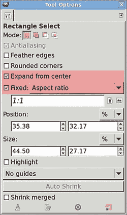

*工具选项对话框中的约束选项仅适用于矩形选择和椭圆选择工具。*

+   ****参考线****。*参考线*是水平或垂直的线，不会出现在你的最终图像中，但可以用来对齐项目元素，如层和选择。你可以从标尺拖出参考线，但这样只能粗略地定位它们。如果你需要将参考线定位在绝对像素偏移（正如你将在本书的几个教程中所做的那样），请使用图像▸参考线菜单中可用的选项。

+   ****层边界****。层边界由黄色和黑色虚线表示。当选择一个层时，无法在其层边界之外绘制任何内容。你可以轻松选择层的角落：从图像窗口内部开始，拖动通过你想要选择的角落并超出层边界。只有选择在层边界内的部分将被选中。

    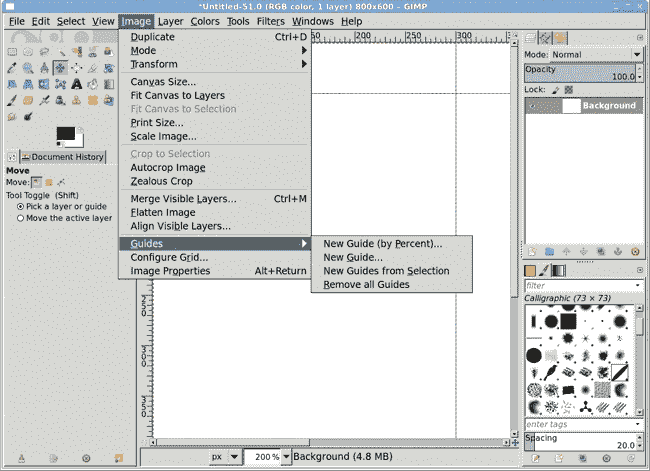

    *从顶部标尺拉出水平参考线或从左侧标尺拉出垂直参考线。使用移动工具逐个将它们拖出窗口，或选择图像*▸*参考线*▸*移除所有参考线*一次性移除所有参考线。图像*▸*参考线菜单允许你通过百分比（新建参考线（按百分比））或通过像素偏移（新建参考线）添加参考线。你还可以将参考线围绕现有选择包裹（从选择新建参考线）。*

你还可以通过按住各种键盘键来改变 GIMP 选择工具的行为。这些键被称为*键盘修饰符*，因为它们会修改活动工具的行为。如果你在画布上点击并拖动以创建选择时按下了键盘修饰符，则修饰符会影响选择约束。

当使用矩形选择或椭圆选择工具时，在鼠标点击后按下 SHIFT 键并保持按住，拖动时将约束选择，使高度和宽度始终相等。这意味着矩形选择是正方形，椭圆选择是圆形。但这只有在你在释放键盘修饰符之前释放鼠标按钮时才成立。如果你首先释放 SHIFT 键，则约束将被移除。

*黄色和黑色虚线表示层边界。如果选择的一部分位于层的边界之外，则该部分实际上不会被选中。*

如前所述，无约束的选择将将其左侧锚定在第一次鼠标点击的点。要从选择的中心锚定，首先点击，按住 CTRL 键，然后拖动选择。与 SHIFT 键一样，必须首先释放鼠标按钮以保持约束。

使用键盘修饰符与选择结合是一种高级技术，不适合教程。因此，本书通常在配置选择工具时参考工具选项设置。

## 选择模式

当选择约束设置选择的大小和形状时，*选择模式*将两个或多个选择组合起来，而不管每个选择应用的约束如何。通常需要做出几个选择，然后以不同的方式将它们组合起来。这种合并选择在例如选择照片中形状不寻常的对象或在使用颜色或图案填充形状之前勾勒形状时非常有用。

*您可以使用键盘修饰符来限制选择形状。您还可以使用每个变换工具的工具选项对话框应用变换到选择中。*

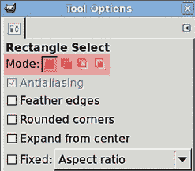

*每个选择工具的工具选项对话框提供了访问四个模式按钮的途径：替换、添加、减去和交集。*

要组合选择，请使用选择工具的工具选项对话框中的模式按钮。从左到右，替换模式创建一个新的选择，替换任何现有的选择，添加模式将新选择添加到现有选择中，减去模式从现有选择中减去与新选择重叠的部分，交集模式仅在新的和现有的选择重叠的地方创建选择。如果没有现有选择，替换和添加模式将单独创建新选择，而减去和交集模式则不执行任何操作。

工具选项对话框中的模式按钮也映射到键盘修饰符。在拖动时按住 SHIFT 键激活添加模式，而按住 CTRL 键激活减去模式。同时按住这两个键拖动激活交集模式。这些键盘修饰符适用于除前景选择外的所有选择工具。注意，只要您按住这些键，相关的模式按钮就会在工具选项对话框中选中。如果没有初始选择，修饰符没有效果，替换模式按钮保持激活状态。

### 注意

*前景选择工具将这些键映射到工具选项对话框中的其他选项。*

当使用各种选择工具模式时，光标会根据激活的模式而改变，如下所示。随着经验的积累，您将学会识别这些光标，但如果是 GIMP 新手，您在处理选择时需要密切关注工具选项对话框。当使用键盘修饰符时，很容易混淆当前的模式与您可能（或可能不是）试图应用于新选择的约束。与选择约束一样，本书中的教程将始终参考工具选项对话框中的模式设置，而不是键盘修饰符。

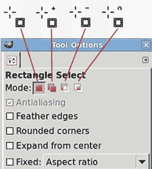

*光标会根据活动模式而改变。*

## 奇形怪状的选择

当处理照片或任何现有数字图像时，你很少需要完美的矩形或椭圆形选择。相反，你需要用奇形怪状的选择来勾勒奇形怪状的形状。当这些形状具有复杂的边缘时，通常你唯一的选择就是手动绘制选择。在 GIMP 中，你可以使用自由选择工具来完成这项工作。

### 自由选择工具

要进行自由手绘选择，从工具箱中选择自由选择工具，点击画布，然后拖动以围绕你想要选择的形状。当你拖动时，会出现一条实线，显示选择边缘。当你完成轮廓绘制后，按回车键。实线将被熟悉的蚂蚁线替换。

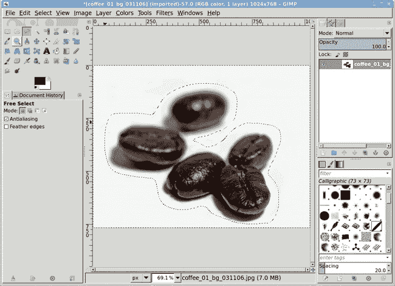

*使用自由选择工具进行自由手绘选择*

要闭合自由选择循环，只需将光标拖回到起点并寻找一个小黄色圆圈。这表示两个端点重叠，选择循环将被闭合。

手绘轮廓并不总是制作选择的最佳方式。幸运的是，GIMP 提供了丰富的替代方案。如果你想要选择的图像部分被实色或其他明显的边缘所包围，工具箱提供了模糊选择、颜色选择、剪刀和前景选择工具。

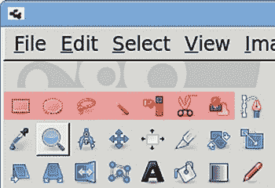

*自由选择工具有几个替代方案，其中包括模糊选择、颜色选择、剪刀和前景选择工具。*

### 模糊选择工具

模糊选择工具在感兴趣的对象周围有实色时效果最佳。

*模糊选择工具允许你通过简单地点击围绕它们的白色区域来选择豆子和它们的阴影。*

在模糊选择工具的工具选项对话框中，最重要的选项是阈值设置。较低的阈值值意味着选择的像素更少。可以通过按住左键移动鼠标来调整阈值。请注意，当你使用模糊选择工具点击画布时，所有在指定距离内（颜色差异）并且相邻的像素都将被添加到选择中。重要的是要记住像素必须是相邻的。注意，模糊选择工具总是创建一个大的选择。它将形状奇特，但只有一个。另一方面，颜色选择工具会创建许多选择。

### 颜色选择工具

选择颜色工具在从图像中根据像素组（这些像素不一定相邻）提取形状方面表现最佳。其工具选项对话框还提供了一个阈值设置，该设置的功能与模糊选择工具的阈值设置类似：选择所有在阈值范围内的像素。然而，在使用选择颜色工具时，像素不必相邻。因此，这个工具可以潜在地创建成千上万的独立小选择。在这个例子中，因为白色背景与豆子和它们的阴影对比非常强烈，所以选择颜色工具只创建了一个选择。使用低阈值设置并点击白色背景创建的选择几乎与模糊选择相同。

只要感兴趣的对象与图像其余部分之间的对比度很高，选择颜色工具和模糊选择工具都可以进行非常精确的选择。对于这种情况不适用的情况，你最好使用剪刀工具或前景选择工具。

### 剪刀工具

当你需要深入操作时，请使用剪刀工具；它通过注意鼠标点击所绘线条附近的颜色变化来找到物体的边缘。

要使用剪刀工具创建选择，请点击画布以在感兴趣的对象周围放置锚点。锚点也被称为*控制点*或*节点*，剪刀工具的锚点与路径工具的锚点类似。当你放置锚点时，GIMP 会绘制一条实线连接每个新锚点到前一个锚点。GIMP 根据颜色变化计算这些线条。在这个例子中，豆子和它们的阴影有明显的颜色差异，所以点击豆子边缘附近会创建一个仅围绕豆子的轮廓，不包括其阴影。要闭合轮廓，请点击你放置的第一个锚点。然后点击轮廓内部以将该区域转换为选择。

在将轮廓转换为选择之前，你可以通过点击任何现有锚点并将其拖动到新位置来编辑轮廓。你甚至可以通过点击任何两个现有锚点之间的线条来添加新的锚点。添加新锚点和移动现有锚点让你在将其转换为选择之前调整轮廓。这可能在你发现 GIMP 选择的分割线不符合你的需求时是必要的。

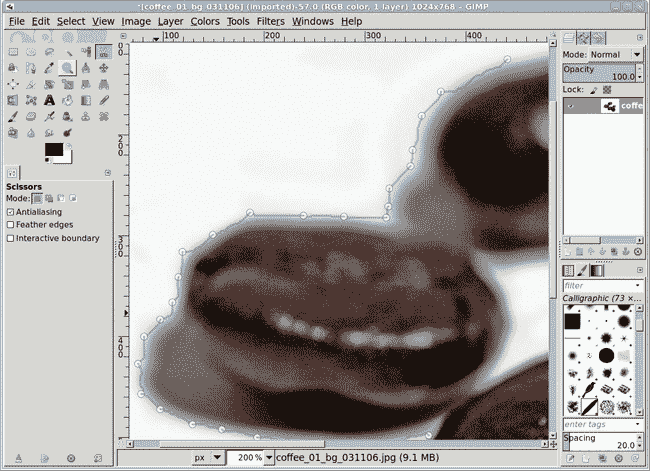

*沿着阴影边缘点击会自动设置与波浪线相连的锚点，当闭合循环时这些波浪线将成为选择。可以使用剪刀工具勾勒出豆子（不包括阴影）以创建更精细的选择，尽管对于这个特定的图像，使用模糊选择并增加阈值设置可能更容易。*

### 前景选择工具

前景选择工具比之前讨论的工具更复杂，但通过实践，它可以成为在杂乱背景上隔离前景形状的最佳工具。前景选择使用多步骤过程来指定图像中的对象作为前景。从工具箱中选择该工具后，在图像窗口中会显示套索指针。将套索拖动到前景对象周围以创建一个粗略的选择。在勾勒出对象后，按回车键完成第一步。默认情况下，蒙版区域（不在选择中）将以蓝色突出显示，尽管这种颜色可以在工具选项对话框中更改。

第二步是绘制前景对象。在此步骤中使用当前前景颜色以及圆形笔刷。按住鼠标左键，在前景对象内部靠近边缘和任何戏剧性的颜色变化（暗到亮或亮到暗）处绘制。对象不需要完全被绘制覆盖。当释放鼠标按钮时，前景选择工具将根据绘制的像素和当前蒙版区域更新蒙版区域。

可以使用重复的笔触来细化选择。工具选项对话框允许设置笔刷大小以选择连续的区域或调整颜色灵敏度。编辑完成后，按回车键将未蒙版区域转换为选择。

前景选择工具在隔离图像中的对象时可以非常精确。然而，在实践中，此工具在创建需要进一步使用快速蒙版（在使用快速蒙版中描述）进行细化的大致选择时表现最佳。

*前景选择比剪刀更快、更准确，但通常需要通过快速蒙版进行修正。*

## 从选择创建蒙版

有时，一个项目需要你在图像中隔离一个对象以创建该对象的蒙版。通常，这个对象本身不容易选择，但它的周围区域却可以。

看这个以白色背景为背景的玫瑰。使用按颜色选择或模糊选择工具隔离白色区域很容易。一旦做出选择，反转它（选择▸反转）以创建仅包括花朵的选择。然后你只需要创建一个黑色蒙版并将其填充为白色。

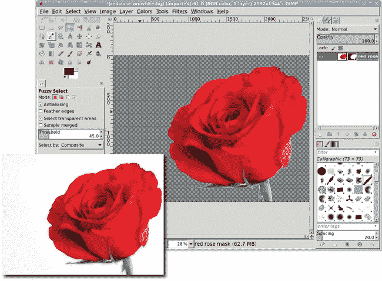

*要创建玫瑰的蒙版，请选择纯白色背景，反转选择，添加黑色图层蒙版，并用白色填充选择区域。*

### **羽化选择**

在照片中创建选择以隔离对象有时需要更多的工作。您可能需要*羽化*选择。在创建选择时，GIMP 提供了使用抗锯齿的功能。如果不使用抗锯齿，GIMP 要么包含像素，要么不包含像素在选择中；没有部分选择像素。

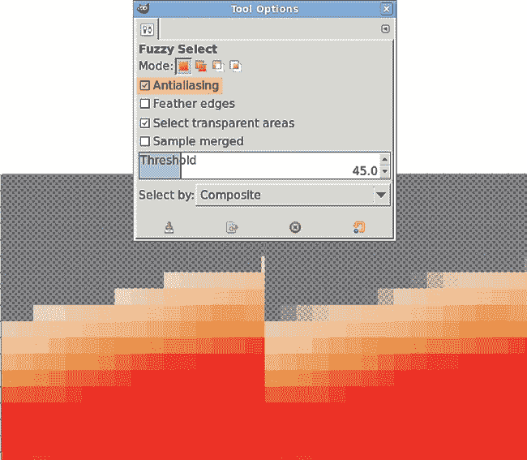

*在启用（左）和未启用（右）抗锯齿的情况下放大玫瑰选择*

通过羽化选择，可以通过允许像素部分选择来软化其边缘。这意味着一些像素实际上是部分透明的，因此当您复制粘贴选择区域时，其边缘与新环境融合得更加容易。

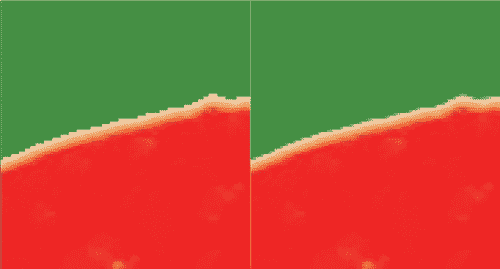

*羽化选择（右）具有柔和的边缘，允许它们在复制粘贴到另一张图片时与背景融合。*

您可以使用羽化选择对话框（选择▸羽化）来羽化您创建的选择区域。默认情况下，羽化深度以像素为单位设置，但您可以从对话框的下拉菜单中选择其他几个单位。羽化过程跨越选择区域的两侧，一半在选择的内部，一半在选择的外部。这个范围的内部边缘是完全不透明的，而外部边缘是完全透明的。当您从羽化范围的内部边缘移动到外部边缘时，像素变得越来越透明。

*羽化选择对话框允许您以几种单位之一指定羽化深度。*

*一个羽化范围被分割以跨越选择边界。这个羽化选择是 6 像素：3 个在选择的内部，3 个在选择的外部。*

### 使用快速蒙版

模糊选择工具与像玫瑰这样的图像效果很好，其中主题出现在单一背景上。但还有一种更直观的方法来选择形状奇特的物体，这在背景不是单一颜色时尤其有用。快速蒙版允许您在图像上绘画以创建选择区域。

要使用快速蒙版，请点击图像窗口左下角的快速蒙版按钮。这样做会给图像添加红色色调。选择任何画笔工具和画笔。通过按 D 键然后 X 键将前景色设置为白色，前提是画布已被选中。开始使用您选择的画笔工具和画笔进行绘画，擦除快速蒙版中的红色。当您揭露出想要选择的区域时，再次点击快速蒙版按钮。在您移除快速蒙版的地方，绘制的区域将被转换为选择区域。这比想象中还要简单！

*快速蒙版按钮位于画布窗口的左下角。当未使用时，按钮图标是一个方块选择符号。当您单击快速蒙版按钮时，图标变为红色方块，所有现有选择区域之外的区域都被着色为红色（除非您已更改默认蒙版颜色）。*

*原始的黄色汽车位于左上角。在左下角，快速蒙版已开启，图像被着色为红色。在右上角，汽车的黄色车身已被涂成白色，蒙版颜色改为深绿色以增强对比度。再次单击快速蒙版按钮将绘制区域转换为选择区域，并允许我们更改汽车车身的颜色。*

## 放弃选择区域

您完成选择后怎么办？您可以通过选择 Select▸保存到通道将选择区域保存到通道，或者您可以放弃选择。选择 Select▸None 将放弃当前选择。或者，您可以按 CTRL-SHIFT-A。

将选择区域保存到通道中，允许您稍后在通道对话框中检索该选择区域（Windows▸可停靠对话框▸通道）。只需单击保存的通道使其变为活动状态，然后单击对话框底部的通道到选择按钮。在本书后面的各种教程中，我们将多次使用此过程。

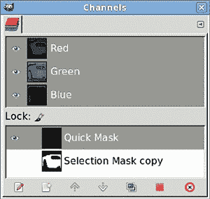

*通道到选择按钮位于对话框的右下角红色方块处。*

## 使用选择区域

一旦您有一个好的选择区域，您几乎可以用它做任何事情。您可以通过简单地从工具箱中拖动前景色或背景色到选择区域来填充颜色。您可以在选择区域内使用任何绘图工具，而不用担心超出选择区域进行绘画。

*将前景色或背景色从工具箱拖动到任何选择区域以填充颜色。*

*在选择区域内绘制，无需担心影响其外的任何内容。*

您还可以使用选择区域来隔离可以应用滤镜的区域。例如，您可以对玫瑰选择区域应用运动模糊，而不会模糊其外的任何内容。

*在不担心模糊其外的任何内容的情况下模糊选择区域。*

您还可以将任何绘图工具与前景色结合使用来绘制选择区域。以这种方式绘制选择区域被称为*绘制选择区域*，通过选择 Edit▸绘制选择区域可以打开绘制选择区域对话框。

*使用软边刷绘制玫瑰选择区域*

## 选择技巧

在练习使用选择时，请记住这些提示：

+   如果你记不住 SHIFT 和 CTRL 键盘修饰符的工作方式，记得使用选择工具的工具选项对话框中的模式按钮来指定新选择如何与现有选择交互要容易得多。你可以在同一个对话框中设置宽高比，所以你完全可以忘记 SHIFT 和 CTRL 键。

+   你可以将快速蒙版与现有选择结合使用。当你第一次点击快速蒙版按钮时，任何现有选择都不会有红色色调。根据需要绘制，然后再次点击按钮以合并选择。

+   用户发现他们无法创建新的选择，往往是因为忘记在工具选项对话框中选择了减去或交集模式，这在选择工具中并不罕见。如果这种情况发生在你身上，只需检查工具选项对话框，确保模式设置为替换。使用模式按钮会将选择工具设置为该模式，直到你手动更改它。这就是为什么经验丰富的用户学会使用键盘修饰符的原因之一。修饰符只适用于创建新选择所需的时间。

# 1.5 路径

GIMP 是一个位图图像编辑器。用简单的英语来说，这意味着它通过改变单个像素的颜色在照片上工作得很好。它最初并不是为了编辑线条或几何形状而设计的，就像专门的矢量图形编辑器（如 Adobe Illustrator 和 Inkscape）那样。当然，矢量编辑器在处理照片中的像素方面并不那么出色。但在当今世界，位图图像编辑器和矢量编辑器之间的界限变得模糊，因为为一种编辑类型编写的图形程序通常提供一定程度的对另一种编辑的支持。GIMP 也不例外。

GIMP 的矢量编辑是通过 *路径* 来处理的。路径由至少两个由直线或曲线连接的点组成。这些点被称为 *锚点*，有时也称为 *控制点*。线和它们的锚点在技术上被称为贝塞尔曲线，以纪念那位推广其在汽车设计中使用的法国工程师。通过从锚点拖出 *手柄*，可以弯曲锚点之间的线。每个锚点有两个手柄，每个手柄都与锚点进入或离开的线相关联。

工具箱中的路径工具是创建路径的主要方法，尽管它们也可以通过将选择转换为路径来创建。工具选项对话框用于设置路径的编辑模式。设计模式用于放置和定位新的锚点。当鼠标光标在图像窗口中位于锚点或不在锚点上时，鼠标光标会发生变化。编辑模式允许在两个现有锚点之间添加新的锚点，分割它们之间的线。使用此模式，也可以通过按住 SHIFT 键来删除锚点。移动模式用于同时移动整个路径及其所有锚点。

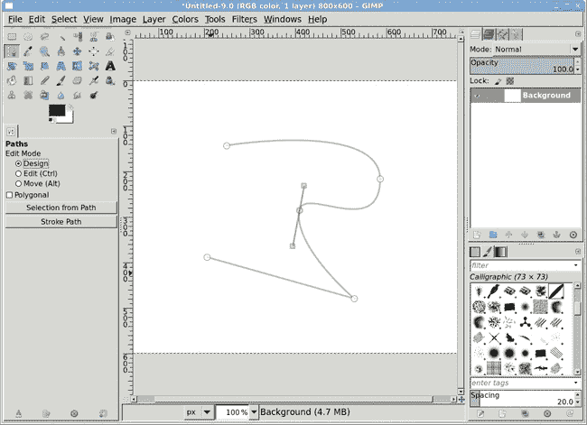

*路径的工具选项对话框提供了多种模式来处理锚点和它们的句柄。它还可以用来从路径创建选择区域或轮廓当前图层上的路径。*

路径以两种方式分组。首先，路径作为一个整体存在，包括所有的锚点。为了亲自体验，请在路径对话框中选择“移动”，点击路径上任何不在直线上的点，然后拖动鼠标。整个路径将会移动。其次，每条线上的所有锚点都是连接的。点击任何一条线并拖动；你会看到连接的点会移动。文本可以被转换为路径，但在这样做时，不连续的路径不会被分组。注意，当你移动一个已经转换为路径的“e”或“a”中的某些路径时，这些字母的内部部分不会移动。

*不连续的路径可以独立移动。*

路径是在路径对话框中独立创建的图层上创建的。路径图层可以被命名并重新排序，就像图像图层一样。然而，路径图层并不与特定的图像图层相关联。单个路径图层可以应用于任意数量的图像图层，并且可以包含单个路径或多个、不连续的路径。

路径对话框允许在以后编辑现有的路径。首先，选择路径工具。然后在路径对话框中点击你想要编辑的路径图层，点击可见性图标以在图像窗口中显示路径，并在图像窗口中点击路径以开始编辑。编辑完成后，关闭路径图层的可见性。

路径要么是开放的，要么是闭合的。闭合路径将最后一个控制点与第一个控制点连接起来。这只能在编辑模式下完成。点击最后一个锚点，然后点击第一个锚点来闭合路径。

*就像它的表亲“图层”对话框一样，路径对话框使用一个眼睛图标来表示可见的路径图层。*

路径可以被转换为选择区域。创建路径后，然后在路径对话框底部点击“路径到选择”按钮。所有选择区域都是闭合的，这意味着当选择区域被创建时，第一个和最后一个锚点通过选择区域连接，即使路径本身没有闭合。选择区域也可以被转换为路径。创建选择区域后，然后在路径对话框底部点击“选择到路径”按钮，位于“路径到选择”按钮的右侧。这里可以找到一个隐藏的 GIMP 对话框。在创建选择区域后，按住 SHIFT 键并点击“选择到路径”按钮。这将打开一个用于将选择区域转换为路径的高级选项对话框。

大多数变换工具（旋转、缩放、剪切、透视和翻转——但不包括笼形变换）可以应用于路径。创建路径后，在路径层对话框中打开其可见性。然后从工具箱中选择变换工具。在工具选项对话框中，顶部有一行影响图标。点击该行末尾的路径图标。在图像窗口中单击以打开变换编辑器并修改路径。路径层可以在路径对话框中链接，以便变换应用于所有链接的路径层，即使路径在图像窗口中不可见。

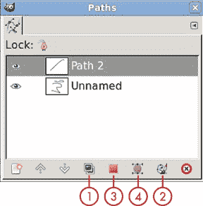

*路径可以被复制  和绘制 ，以及转换为选择 。选择可以反过来转换为路径 。这可以用于创建标志、漫画或漫画。*

### 注意

*需要注意的是，特别是关于路径缩放时，转换路径应用于整个路径层。如果要将路径放大很多，首先缩小图像窗口，然后点击它以打开转换编辑器，并在路径上执行该转换。*

路径在图像窗口中可见，但不会被渲染（即绘制或应用）。必须绘制或转换为选择才能应用于图像窗口。要绘制路径，在路径对话框中选择路径层。然后选择“编辑▸绘制路径”或点击路径对话框底部的绘制按钮，在“从选择到路径”按钮的右侧。将打开绘制路径对话框。路径可以使用指定宽度或样式的实线或图案进行绘制，或者可以使用当前活动的画笔和可用的绘画工具之一进行绘制。

路径对于需要在不同尺寸下渲染的设计非常有用，例如标志或漫画。它们被设计成在 GIMP 中提供可缩放的形状，在通常情况下，层缩放会影响图像质量。

路径是一个高级主题，因此本书的教程不会涉及。

# 1.6 绘制基本形状

新的 GIMP 用户最常问的问题是，“我如何创建基本形状？”在本节中，你将探索两种方法：绘制选择和使用 Gfig 插件。

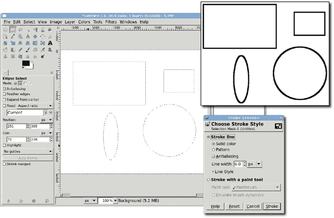

*通过绘制选择来绘制简单形状*

## 绘制直线

直线很容易绘制。选择任何绘图工具，在画布上单击一次以开始绘制线条。按住 SHIFT 键，将光标移动到终点并再次单击。要使线条限制在 7.5 度角的倍数，同时按住 CTRL 键和 SHIFT 键。

## 绘制简单形状

如果你需要绘制的形状相对简单，最佳选择是使用描边选择。

1.  从工具箱中选择**矩形选择**工具或**椭圆选择**工具，然后拖动以创建选择。在拖动时按住 SHIFT 键以约束选择，使其宽度和高度相等（生成一个完美的正方形或圆形），然后释放 SHIFT 键以创建选择。

1.  从画笔对话框中选择**圆形（101）**画笔。在工具选项对话框中选择**画笔**工具，并将大小设置为**2.00**。

1.  选择**编辑**▸**描边选择**，并在描边选择对话框中，点击**使用画笔描边**单选按钮。从画笔工具下拉菜单中选择**画笔**。这会给选择带来漂亮、干净的边缘。

1.  点击**描边**以描边选择。

三角形需要一点特殊处理。

1.  配置图像网格（**图像**▸**配置网格**）。对于这个 800 × 600 的图像，使用宽度为 100 像素、高度为 100 像素的网格。

1.  从工具箱中选择**路径**工具，然后点击网格线的任何三个交点以标记三角形的顶点。

1.  在工具选项对话框中，点击**描边路径**按钮。这将绘制形状。

### 注意

*如果需要旋转三角形，请选择从路径选择而不是描边路径，然后旋转选择，并使用编辑*▸*描边选择*进行描边。*

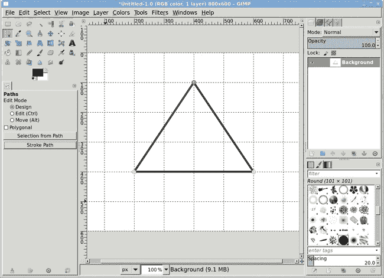

*使用网格或路径中的辅助线绘制三角形。*

## 绘制不规则形状

创建封闭的不规则形状可能很简单，也可能很复杂，这取决于项目。创建此类形状的简单方法是减去和添加到现有选择中。例如，首先创建一个矩形选择。然后按住 CTRL 键以从现有选择中减去，或按住 SHIFT 键以添加到现有选择中。作为替代，您还可以使用选择工具的工具选项对话框，点击适当的模式按钮。

*选择工具工具选项对话框中的模式按钮允许你在描边之前以各种方式组合选择。*

使用路径工具创建不规则选择比简单地添加和减去选择更困难，但也更准确。拉出水平和垂直辅助线，使其在不规则形状的顶点处相交，然后使用路径工具勾勒形状。描边路径或将其转换为选择，然后按需填充。此方法在您需要从照片中隔离多个建筑时效果很好。

*使用路径工具勾勒形状*

## 绘制预定义形状

*Gfig*是一个原始的矢量绘图工具，提供了一系列预定义的形状，包括星星、螺旋、曲线、多边形和弧。对于像正方形和三角形这样的简单形状，使用本节前面讨论的技术会更快，但当你需要创建更复杂的东西时，Gfig 会很有用。不妨试一试：

1.  向图像添加一个新图层（**图层**▸**新建图层**）。

1.  打开 Gfig（**滤镜**▸**渲染**▸**Gfig**）。

1.  点击按钮栏上的**创建星形**按钮。将边数设置改为**5 边**。

1.  点击预览的中间部分，并拖动到预览的右下角。将使用当前选定的笔刷创建星形。

1.  如果你需要在创建星形后移动它，点击**移动对象**按钮（星形右侧三个按钮），然后拖动星形在预览中移动。

1.  根据需要修改笔刷和填充选项，然后点击**关闭**以在画布上渲染你的形状。

在你将它们渲染到画布上之前，你在 Gfig 中创建的对象是矢量格式，并且有堆叠顺序。你可以使用 Gfig 来改变这个顺序，或者你可以在新图层上渲染每个形状，然后通过在图层对话框中移动图层来稍后改变堆叠顺序。

你可以使用 Gfig 编辑你已渲染到图层的形状，即使你已经在那些图层上应用了效果。然而，当你使用 Gfig 编辑形状时，那些效果将会丢失，所以请仔细规划你的工作流程。

*Gfig 允许编辑 Gfig 图层内的形状，直到对该图层应用效果。*

Gfig 的问题在于它是一个非常简单的矢量编辑器。例如，使用 Gfig 创建的规则多边形在其顶点处没有可编辑的点。你只能移动中心点或调整多边形的大小。而且笔刷选择仅限于选择笔刷，而不是其大小、不透明度或其他在其他绘图工具选项中找到的设置。最后，Gfig 也不是最稳定的 GIMP 插件。如果你尝试创建很多对象或重复编辑对象，它有崩溃的趋势。

如果你需要真正的矢量编辑功能，你最好使用像 Inkscape（*[`www.inkscape.org/`](http://www.inkscape.org/)*）这样的工具。只需创建形状，然后将其导出为 PNG 或 SVG 格式，用于你的 GIMP 项目。

## 基本形状技巧

在本节中，你应该记住以下几点智慧。

+   默认情况下，选择项*希望*附着到参考线上！正如你所看到的，这简化了如勾勒城市天际线等任务。但如果你需要，可以禁用此行为；只需切换到视图▸吸附到参考线。

+   想要旋转一个形状？使用选择或路径上的旋转工具。或者你可以在形状渲染后旋转图层。

+   在新的透明图层中绘制形状，而不是覆盖现有图层内容。删除图层总是比恢复被覆盖的像素要容易。确保透明图层的锁定 Alpha 通道选项已关闭。如果不关闭，您将无法绘制图像的透明部分。

    

    *锁定 Alpha 通道（在旧版本中称为保持透明度）选项位于图层对话框中。如果复选框被勾选，您将无法更改图层的透明部分。*

+   使用宽度为 1 像素的画笔和默认前景色（黑色）绘制线条不会产生实心的黑色轮廓，因为画笔的边缘抗锯齿。只需重复这个过程一次或两次，就可以得到更暗的线条。较大的画笔没有这个问题。或者，创建一个类似于正方形或圆形的选择区域，用颜色填充它，然后通过 1 像素缩小选择（选择▸缩小），最后删除它。这将产生一个非常干净的 1 像素宽的形状轮廓。

+   不要忘记，您可以用图案或纯色填充选择区域，而不是用线条填充。使用桶填充工具填充图案，或者将工具箱中的前景色或背景色拖动到选择区域中，以填充纯色。

# 1.7 图案和渐变

*图案*是您可以用来填充选择区域或图层的图像文件。它们最常用于创建像城堡墙壁或鳞片状生物皮肤的纹理。*渐变*是两种或多种颜色混合在一起形成的。您可以使用渐变来实现多种目的，从模拟管子、管道和柱子到将波浪扭曲应用于布料或水。

GIMP 提供了一系列的库存图案和渐变。大多数库存图案适合 Web 图像，但可能对于较大的印刷项目来说太小了。库存渐变种类繁多，您将在本书后面的教程中使用其中几个。

本节是关于创建您自己的图案和渐变的介绍。您不会为本书的教程创建任何图案，但学习如何这样做对您自己独立操作时是有用的。

## 图案

与画笔一样，图案可以从任何图像中创建。设计正确的图案是*可平铺的*——许多图案的副本可以无缝地融合在一起。平铺图案通常用作网页的背景图像和三维项目的纹理。

您可以通过选择“窗口▸可停靠对话框▸图案”来访问图案对话框并查看所有可用的图案。任何图像都可以保存为图案，图案可以是任何大小。图案可以保存为任何文件格式。GIMP 特定的扩展名是*.pat*，但使用一种文件格式而不是另一种没有优势。

如果您想通过图案对话框访问图案文件，它必须保存到 GIMP 的图案目录之一（选择编辑▸首选项并选择左侧的文件夹▸图案）。

如果图案较大，图案对话框将只显示图像的缩略图。点击图案并按住鼠标左键可以全尺寸查看。

新的 GIMP 用户往往低估了图案的有用性。说实话，内置的图案确实有点无聊。但创建可重复使用的、模拟混凝土和布料纹理的图案并不困难。只需一点想象力即可。

*图案对话框显示的缩略图大小一致，但如果您点击缩略图并按住鼠标左键，缩略图将放大。*

### 注意

*图案不必来自图案对话框。GIMP 的渲染滤镜（滤镜*▸*渲染）也能制作出非常好的图案，并且您可以将其保存为图案文件，以便在项目之间使用。本书中的教程经常要求您即时生成图案，但了解有这么多选项是很好的。*

### 混凝土纹理

最容易创建的一种纹理是简单的混凝土背景。这种纹理可以用作将基本盒子变成水泥块，或者将任何平坦表面变成人行道或道路。现在您可以按照以下步骤进行：

1.  通过从图像窗口菜单中选择**文件**▸**新建**来打开一个新的白色画布窗口。

1.  添加一个透明图层（**图层**▸**新建图层**），并使用等离子体过滤器填充它以彩色云朵（**滤镜**▸**渲染**▸**云朵**▸**等离子体**）。默认设置应该足够用于这种纹理。点击**确定**应用滤镜。

    

    *使用等离子体过滤器向画布添加云朵。*

1.  从画布菜单中选择**滤镜**▸**噪声**▸**RGB 噪声**来使用 RGB 噪声滤镜为这张图片添加一些噪声。确保不勾选**相关噪声**和**独立 RGB**复选框。将红色、绿色和蓝色滑块设置为**0.20**，以应用可见但不过量的噪声到图层上。点击**确定**应用滤镜。

    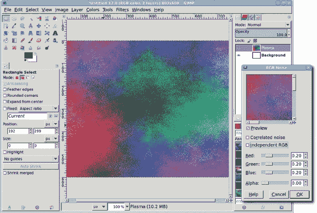

    *向云朵添加噪声。更多的噪声会使图像的纹理更粗糙。*

1.  使用任何可用的选项对图层进行去饱和（**颜色**▸**去饱和**）。这会移除颜色内容，使图像看起来更像混凝土。点击**确定**。

1.  为了给纹理增加深度，打开凹凸贴图滤镜（**滤镜**▸**贴图**▸**凹凸贴图**）。在调整方位角、仰角和深度值时，注意预览窗口。在预览中四处移动以查看每个调整如何影响图像。从贴图类型下拉菜单中选择线性、球形或正弦波形也会改变效果，但这个设置不如其他设置重要。点击 **确定** 将滤镜应用到去饱和层。

    ### 注意

    *这种技术的变体包括使用不同的噪声滤镜和在等离子滤镜的工具选项对话框中增加湍流设置。*

    

    *凹凸贴图滤镜使混凝土纹理获得了一些深度。*

1.  虽然结果是相当逼真的混凝土纹理，但调整对比度和亮度（**颜色**▸**亮度-对比度**）可以软化效果，为你提供创建更复杂纹理（如皮肤）的起点。

    

    *对比度和着色变化可以将混凝土变成皮肤。*

### 模拟布料

创建布料纹理从噪声开始。从一个新的 **300** × **300 像素** 白色画布窗口开始。由于你很快就会旋转其中一个图层，方形图像最为合适。

1.  再次打开 RGB 噪声滤镜（**滤镜**▸**噪声**▸**RGB 噪声**），但这次将红色、绿色和蓝色值增加到 **0.90**。点击 **确定** 应用此滤镜。

    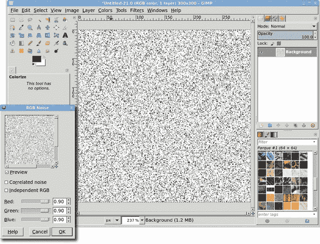

    *布料纹理从随机噪声开始。*

1.  打开运动模糊滤镜（**滤镜**▸**模糊**▸**运动模糊**）。将模糊类型设置为 **线性**，长度设置为 **130 像素** 或更多，角度设置为 **0 度**。点击 **确定** 应用此滤镜层。

1.  重复前面的步骤，这次将角度设置为 **180 度**。这清理了图层的边缘。

1.  复制背景图层（**图层**▸**复制图层**）。复制的图层将成为新的活动图层。

1.  在图层对话框（**窗口**▸**可停靠对话框**▸**图层**）中，将复制的图层模式更改为 **乘法**。这样组合两个图层，使图像看起来更暗。

    

    *运动模糊的噪声使图像中出现了柔和的线条。*

1.  将复制的图层旋转 90 度（**图层**▸**变换**▸**顺时针旋转 90°**）。

    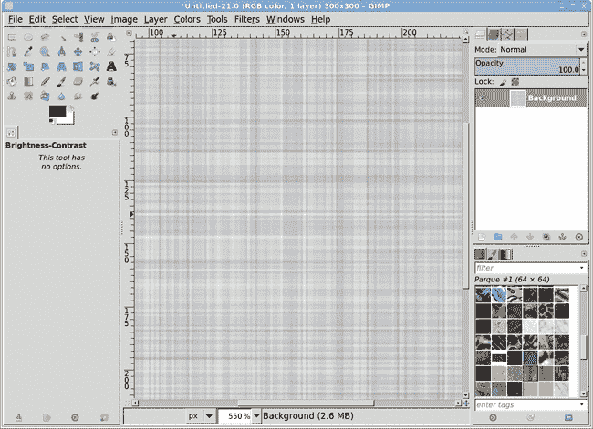

    *布料具有交叉纹理（对比度增强以便在印刷中可见）。*

1.  你现在可以合并图像（**图像**▸**合并图像**）并按你喜欢的方式着色。

    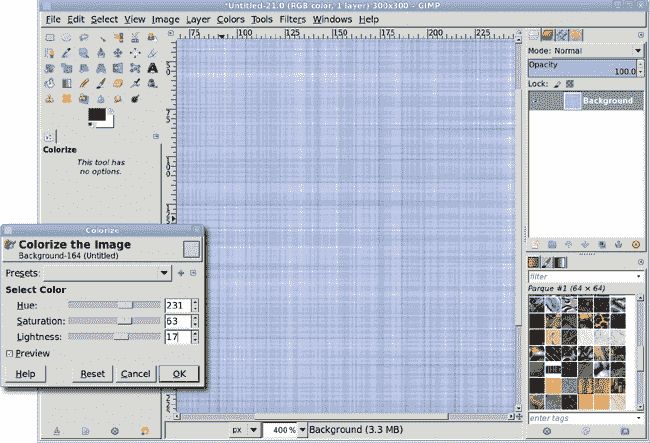

    *使用着色对话框给布料添加颜色很容易。*

### 创建可平铺的图案

要创建可平铺的图案，通过选择图层▸变换▸偏移并点击偏移 x/2, y/2 按钮，将图像偏移其宽度的一半和高度的一半。点击偏移。使用克隆工具修补如这里所示的接缝。要使用克隆工具，首先按住 CTRL 键，然后点击源位置（可以在任何图层中）。克隆工具通过在一点（按住 CTRL 键时点击）获取图像的源副本并将其复制到图像中的其他目的地位置来工作。副本的形状与活动画笔相同。当您点击目的地位置时，按住鼠标左键并拖动，源将被复制到目的地。此外，目的地和源之间的角度和距离保持不变，这意味着源位置会随着您拖动而改变。花点时间玩一下克隆工具，因为它是 GIMP 中最强大的工具之一。

您不必使用克隆工具来创建可平铺的图案。可平铺模糊滤镜（滤镜▸模糊▸可平铺模糊）和无缝拼接滤镜（滤镜▸映射▸无缝拼接）工作得更快，但结果不够精确。

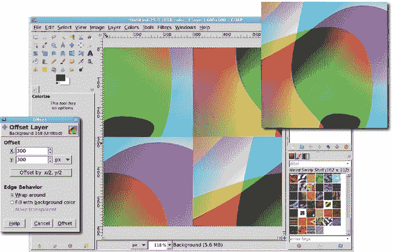

*图层偏移对话框允许您自动将图层偏移其宽度的一半和高度的一半。*

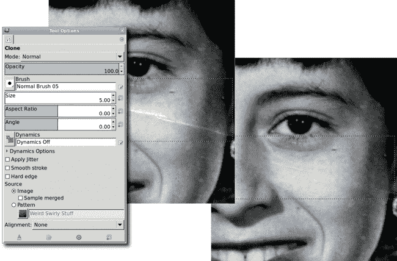

*克隆工具的默认设置显示在工具选项对话框中。克隆工具可以用来修复旧照片中的撕裂。*

## 渐变

渐变文件与图案和画笔文件不同，因为它们不包含图像数据。相反，它们是文本文件，描述了如何在像素范围内应用颜色。渐变对话框（Windows▸可停靠对话框▸渐变）中的渐变预览显示了如果您选择线性形状，颜色将如何混合，但预览只显示渐变的定义。您可以使用混合工具以许多不同的方式应用渐变。

*选择不同的渐变会同时更新混合工具的渐变对话框和工具选项对话框。您还可以直接从混合工具的工具选项对话框中的渐变菜单中选择渐变。*

### 注意

*请注意，术语*渐变*和*混合*经常可以互换使用。*

### 使用形状设置与渐变

混合工具的“工具选项”对话框包括一个重要功能：形状设置。形状下拉菜单允许您定义当应用于图层、蒙版或选择区域时渐变的方向和形状。您将在本书的教程中使用线性、双线和径向渐变。选择线性将应用一个平滑的渐变，从您按下鼠标左键开始拖动的地方开始，到您释放鼠标按钮的地方结束。双线效果类似，但它类似于同时应用两个画笔，每个画笔都向相反方向移动。选择径向将在渐变的起点将颜色应用到左侧，并将颜色辐射到您停止拖动并释放鼠标按钮的点。

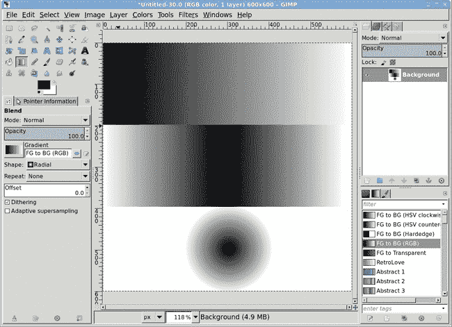

*从形状下拉菜单中选择线性（顶部）、双线（中间）和径向（底部）会产生非常不同的结果，即使您应用相同的前景到背景渐变。*

渐变是颜色过渡。本书中的大多数渐变都是由平滑、逐渐的颜色过渡组成的。但过渡不一定是缓慢而平滑的。它可以是突然的。考虑“径向眼球蓝色”渐变。当您从形状下拉菜单中选择线性并应用此渐变时，效果是从白色到蓝色再到黑色的突然变化。但当你选择径向并应用相同的渐变时，结果看起来像一只眼睛。

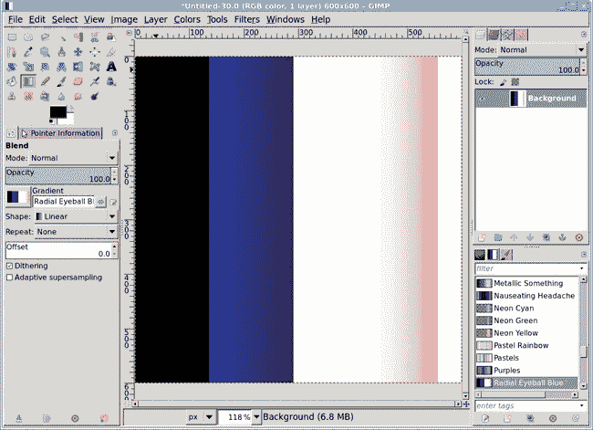

*使用线性形状应用的“径向眼球蓝色”渐变*

*在黑色背景上使用径向形状应用的“径向眼球蓝色”渐变——现在您知道这个渐变是如何得到名字的了！*

通过实验，您会发现您项目如何从渐变中受益的所有方式。您可以从形状下拉菜单中选择径向，并使用前景到背景（RGB）渐变来创建球体或球面。选择线性并使用盲板或王冠装饰线渐变，当用于颜色图层下方的图层时，可以模拟起伏的波浪。

*直接将盲板（顶部）和王冠装饰线（底部）渐变应用到图层上，而不与其他图层混合*

*使用双线形状在彩色图层下方的图层中应用“王冠装饰线”渐变。该图层的混合模式设置为乘法。*

那为什么使用渐变呢？在这本书中，我们主要出于两个原因使用它们：创建图层蒙版并将纹理应用于其他图层。将渐变应用于图层蒙版可以创建从上层图像到下层图像的平滑过渡。在单独的图层中应用渐变后，您还可以使用图层模式之一将其与另一个图层混合。后一种方法用于创建波浪图案，尽管您也可以用它来混合图案中的颜色。

**通过在图层蒙版上应用渐变来混合两个图像**

### 使用渐变编辑器

虽然您不需要在本书的任何教程中这样做，但您仍然可以创建自己的渐变。在渐变对话框的底部有一组图标。点击从左数第二个图标  以打开渐变编辑器并创建一个新的渐变。

**渐变编辑器允许您编辑现有的渐变，例如这里显示的加勒比蓝渐变。使用渐变对话框中的编辑按钮打开渐变编辑器**。

在渐变编辑器窗口的预览窗口下方是一组三角形。这些是控制点。每个段落的两侧各有一个黑色控制点，中间有一个白色控制点。最初预览中只有一个段落。右键点击此段落以打开渐变编辑器菜单。在此菜单中，您可以设置段落的每一边的颜色（右端点和左端点颜色），添加新的段落（分割和复制菜单选项），以及调整颜色在段落中的流动方式（混合菜单选项）。

**渐变编辑器的默认设置如下所示。注意带有两个黑色控制点和一个白色控制点的段落**。

右键点击段落以打开渐变编辑器菜单。

现在，您可以开始为您的项目创建渐变。只需记住，您可以创建尽可能多的渐变，然后使用渐变对话框在不再需要时删除它们。大胆尝试吧。您没有任何损失！

## 图案和渐变设计技巧

你觉得你已经掌握了图案和渐变了吗？这里有一些技巧：

+   您可以使用图案来描边选择区域。创建一个选择区域，选择编辑▸描边选择，然后在描边选择对话框中选择图案选项。

+   除了使用图案填充图层和选择区域外，您还可以将它们用作凹凸贴图的源图像。将一个图层填充上图案，然后通过使用第一个图层作为凹凸贴图图像，将凹凸贴图滤镜（滤镜▸映射▸凹凸贴图）应用于另一个图层。

+   有时与画布相比，图案非常小。将纹理应用到画布上会给你几个图案的平铺版本。想要将图案缩放到适合画布而不在整个图层上平铺？创建一个小选择区域，用图案填充它，然后将选择区域复制并粘贴为新图层，接着将图层缩放到图像的大小。

+   你可以使用桶填充工具的模式将图案与现有图层内容混合。但一个更好、非破坏性的方法是直接在目标图层上方填充图案，然后相应地设置图层混合模式。（参见 1.2 图层和模式以了解更多信息。）

    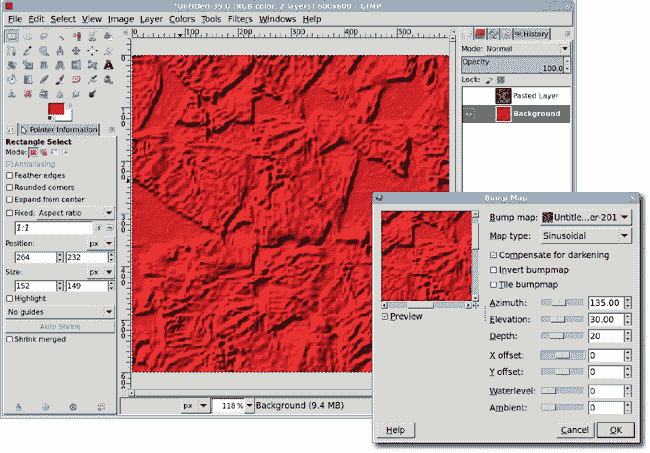

    *使用图案作为凹凸贴图的源图像*

+   正如你在后续章节中制作球体和按钮时将看到的，渐变经常被用来模拟光照，因为它们可以表示从暗到光的逐渐变化。然而，如果你以错误的文件格式保存它，平滑渐变的外观可能会丢失。例如，GIF 文件并不适合具有渐变的图像，因为 GIF 格式会减少颜色数量并可能导致带状（颜色条纹）。如果你正在保存用于网页的渐变图像，尝试使用 JPEG 格式，并使用很少或没有压缩。

+   当使用渐变创建球体时，始终让渐变从左侧的浅色流向右侧的深色。在混合工具的工具选项对话框中，检查以确保渐变选项显示这种方式。如果不是这样，尝试点击位于渐变选项右侧的逆序按钮。

# 1.8 与文本一起工作

这本书的第一版经常使用多个图层来创建多行偏移文本。这种技术是必需的，因为 GIMP 的文本编辑功能有限。虽然通常的字体选择、大小甚至字母间距都是可用的，但无法在单个图层中包含具有不同字体设置的文本。

在 GIMP 2.8 中，所有这些都会改变。一个画布上的编辑框允许你为单个文本字母、单词和短语设置字体特征，包括相对于同一图层中其他文本的位置。这意味着单个图层现在可以容纳整个文本项目，你可以在 3.5 简单标志中尝试这个过程。

## 创建文本

在工具箱中点击文本工具，然后在画布上点击并拖动以打开一个*编辑框*。这个框也称为*边界框*或*文本框架*，会根据你输入的任何文本进行拉伸。但也可以通过在工具选项对话框中设置框值为固定来固定其大小。固定宽度可以用于在图层边界内换行而不需要新行。默认设置动态允许框根据添加到框架中的文本增长。

在编辑框上方是 *样式编辑器*。它有两行选项，用于更改编辑框中选定文本的字体特征。这包括字体、字体大小、基线和字距调整功能。以下是一个示例，看看它是如何工作的。

1.  使用默认大小打开一个新的画布。从工具箱中选择**文本**工具。

1.  在画布上点击并拖动以创建编辑框并打开样式编辑器。

1.  在编辑框中输入短语 *GIMP 很酷*。选择单词**GIMP**。

    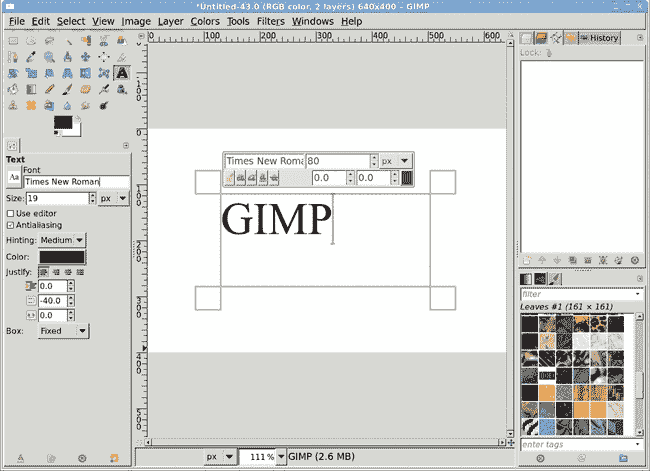

    *编辑框在角落和边缘有手柄，允许在编辑过程中动态调整大小。注意工具选项中的框选项，用于固定编辑框的大小。点击手柄将调整框的大小以适应当前文本*。

1.  在样式编辑器第一行的最左侧框中，输入你系统上已知存在的任何字体的名称的几个字母，例如 Sans Serif 或 Times。在此框下方将显示匹配的字体系列列表。从该列表中选择一个字体。

1.  在此右侧的框中，输入一个数字（或使用鼠标滚轮）来更改字体大小。

在这一点上，选定的字体应该与短语中其余的字体不同。样式编辑器可以用来更改选定单词的颜色，或者可以选择另一个选项来应用不同的设置。

*编辑框中选定的文本是黄色，并且根据样式编辑器的设置，可能不会始终与文本正确对齐*。

样式编辑器可以用来更改工具选项对话框中大多数相同的选项。然而，行距只能在工具选项对话框中更改，并且始终应用于编辑框中的所有行，即使它们当前未被选中。

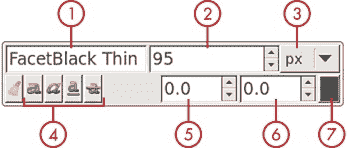

*样式编辑器第一行中的选项用于字体 、字体大小  和字体大小单位 。第二行提供字体样式（粗体、斜体等 ）、基线位置 、字母字距  和颜色选项 。第二行最左侧的按钮可以用来删除编辑框中当前选定的文本*。

基线更改会导致在所选文本下方添加空间。如果您在行上创建一个超大的首字母或单词，并希望将其他字母提升到首字母的顶部边缘，则此功能很有用。字距调整用于调整所选文本中字母之间的间距。

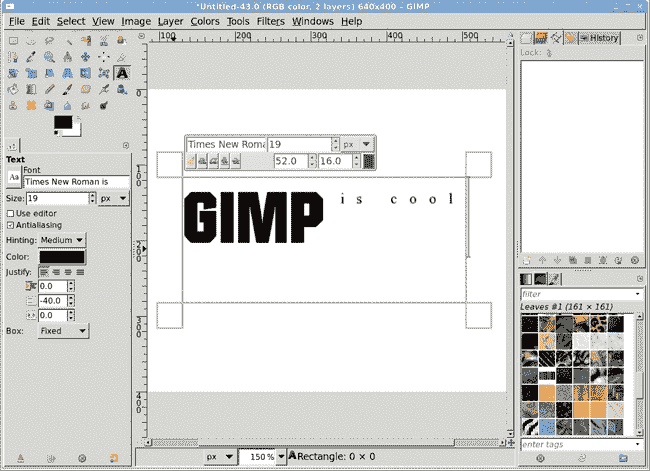

*除了第一个单词的字母之外的所有字母都被选中，基线值增加以使这些字母的顶部与第一个单词对齐。字距增加以使字母适合框的宽度。*

## 工具选项对话框

工具选项对话框提供了一些在样式编辑器中也可用的功能。工具选项会影响所有未使用样式编辑器更改的文本层中的文本。例如，在工具选项对话框中更改字体将更改上一个示例中除“GIMP”一词之外的所有文本的字体。字体大小和颜色也是如此。

某些选项仅在工具选项对话框中可用。这包括诸如抗锯齿、提示和排版等功能。对这些选项的更改会影响编辑框中的所有文本。

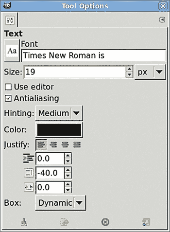

*工具选项可用于对图层中的文本进行全局更改，除非文本之前已经使用样式编辑器进行过编辑。*

## 文本编辑器

在编辑框之前，GIMP 在一个名为“文本编辑器”的对话框中提供了文本编辑功能。此对话框的工作方式与画布内编辑框类似，额外的好处是顶部有一个图标用于加载文件（编辑框需要使用上下文菜单）。对文本编辑器的更改会立即反映在编辑框中。

要打开文本编辑器，请在工具选项对话框中点击“使用编辑器”。要关闭编辑器，请点击其关闭按钮或在工具选项对话框中取消选中“文本编辑器”选项。

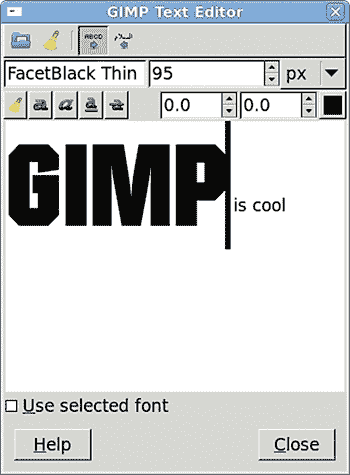

*原始的文本编辑器对话框仍然可用，并提供画布外的所见即所得预览。您目前使用文本编辑器对话框还是编辑框是个人选择，尽管在尝试更改字体类型或大小时，文本编辑器有时可能会表现不佳。*

## 文本、路径和上下文菜单

文本可以与路径对齐，创建沿曲线或框流动的文本。这个功能可能难以找到。当在画布中编辑文本时，右键单击文本以弹出上下文菜单。选择“沿路径文本”选项。这将文本层中的字母转换为一系列形状像字母的路径，并使这些路径流动，使字母的中间与路径对话框中当前活动的路径对齐。要将文本向下移动路径，请在文本前面添加几个空格。

*这些轮廓是使用上下文菜单从文本层生成的路径。沿曲线对齐文本可能需要在文本前面添加空格，以及在工具选项对话框或样式编辑器中调整字母间距。*

由于文本现在是一系列路径，你需要将它们转换为选择，并用颜色填充以恢复字母。

文本到路径选项类似于路径沿文本，但创建的路径与原始文本处于相同的位置。

## 文本提示

+   如果要将文件加载到编辑框中，首先在工具选项对话框中将框设置为固定。如果不这样做，文件中不带回车符的行将作为一行长线流出到右边。

+   使用基线调整来对齐单行上的多尺寸文本。使用行间距调整来对齐多行文本。

+   将文本转换为路径可以使放大标志设计更容易。路径是矢量对象，放大它们不会影响其质量，而放大渲染的文本会导致锯齿边缘。你可以在文本层中增加字体大小，但如果你有很多字体类型和大小，你可能发现放大文本的路径版本然后填充适当的颜色更容易。

+   可以通过将字体安装到任何目录并在首选项对话框中更新字体文件夹来向 GIMP 添加新字体。更改字体配置需要重启 GIMP。

    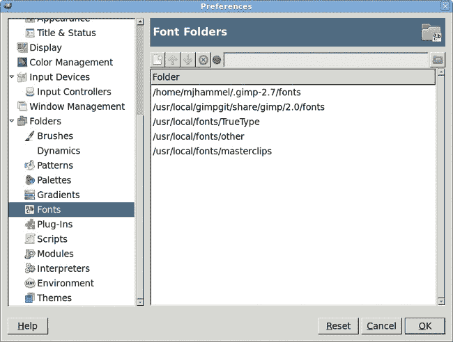

    *字体文件夹允许你向 GIMP 添加新字体。*

# 1.9 数码相机

如果你已经从平板扫描仪毕业，那么你就准备好使用数码相机了。数码相机为你提供了在 GIMP 中使用图像的简化方法。你不再需要担心从胶片转换为数字文件，而是可以直接处理数字文件。不再有打印和底片的盒子。数字生活要容易得多。

然而，随着新技术的出现，也带来了新的流程。扫描仪通常通过 USB 连接。数码相机使用固态设备（SSD），如闪存卡。虽然扫描仪不知道拍摄图像的相机，但数字图像包含元数据，有助于将颜色从一种设备映射到另一种设备。需要考虑新的软件，以及将文件加载到 GIMP 时可能出现的新问题。

今天的相机通过在存储卡上存储数字图像文件来生成 GIMP 就绪的图像。许多手机都集成了可以产生高质量图像的相机。要将这些图像传输到你的电脑上，请从相机中取出存储卡（不要忘记在打开相机时充电），并将其插入电脑或 USB 卡读卡器上的适当插槽。在大多数电脑上，卡将被自动检测到，并打开一个用于组织你的数字文件的应用程序。在 Linux 上，你可以选择 Shot-well、F-Spot、digiKam、Darktable 等。Mac OS X 和 Windows 用户有许多选项可供选择。使用你自己的个人组织方法，如每天一个文件夹或每个事件一个文件夹，将文件复制到你的硬盘上。

如果你仍然使用胶片或者有需要处理的旧照片，你需要一个平板扫描仪将它们导入 GIMP。在 Mac 和 Windows 系统上扫描并不困难，但在 Linux 下可能更复杂。一旦扫描仪连接到你的系统，实验就变得关键。获得高质量的扫描可能需要大量的练习。

## 数码相机入门

大多数现代数码相机提供非常高的分辨率照片。像素数量与宽高比共同决定了照片的实际大小。在具有 1200 万像素分辨率的相机上，4 × 3 的宽高比会产生大约 4000 × 3000 像素的照片。在 250 dpi 的分辨率下，这些照片可以打印成 16 × 12 英寸，比你在当地超市照片亭得到的旧 3 × 5 英寸照片大得多。（使用 GIMP 的裁剪工具更改宽高比非常简单，所以你的相机提供的比例实际上并不重要。）

*多媒体卡有多种形式，尽管大多数数码相机可以直接使用简单的 USB 线访问。*

### 注意

*Linux 用户：如果多媒体卡没有自动挂载，请寻找一个名称类似于* /dev/mmcblk0 *的设备，并尝试手动挂载该设备。*

## 文件格式

现在你已经可以访问相机上的文件了，你应该对它们有一些了解。首先也是最重要的：文件格式。所有数码相机都支持 JPEG 格式的文件。由于它是一种有损格式，因此不适合图像编辑过程。JPEG 图像通过一种考虑人类视觉感知的算法进行压缩。它移除了你无法看到的许多细节。例如，我们的眼睛无法区分天空中的无限蓝色阴影，因此压缩算法将这些阴影减少到更低的数量。但是，当你后来在 GIMP 中更改天空的颜色以获得更戏剧化的图像时，你会在本应渐变的区域得到均匀颜色的带状区域。

如果你想在 GIMP 中处理 JPEG 图像，应将相机设置为中性色彩、低压缩（或更大的文件大小）、低锐化和降噪。你的图像在相机中看起来可能会显得平淡无奇，但这些设置会在 GIMP 编辑时为你提供更多选项。

一些相机支持 TIFF 格式，这是一种无损格式，也可以进行压缩。区别在哪里？无损格式在压缩时不会丢失任何图像信息，因此打开压缩的 TIFF 图像将恢复原始图像。而压缩的 JPEG 图像在解压缩时则不是这样。

但是，这些格式中的任何一个都无法与相机原生文件格式所提供的图像质量相媲美。这种格式的通用术语是 RAW，但 RAW 格式是针对特定相机的。它们具有如 NEF、CR2、RAF 等文件扩展名。只有高端相机才能将 RAW 文件导出到存储卡上。消费级相机则仅在处理完图像后将其存储在相机内存中。

由于大多数相机的处理能力较低，它们从 RAW 到 JPEG 的处理软件不如桌面计算机上的工具复杂。这种从 RAW 格式的处理可能包括你宁愿手动应用（如果有的话）的破坏性过程。这些可能包括降噪、色彩校正或锐化等效果。因此，与 RAW 文件一起工作通常被认为是专业人士的唯一选择——即使是“无损”的 TIFF 也已经被你的相机处理过。

话虽如此，获取 RAW 图像并不总是容易。GIMP 的插件（UFRaw，它基于 dcraw 软件）用于处理这些图像实际上并不从相机中检索图像。此外，RAW 文件比它们的 JPEG 或 TIFF 对应文件大，通常需要更多的内存和更好的处理器。这就是为什么普通桌面消费者可能更适合使用 JPEG 图像，尤其是如果你的相机可以设置这些照片的压缩量。再次强调，JPEG 并非完全理想，但对于低端消费级相机来说，可能是在不修改相机固件的情况下你的唯一选择。

### 注意

*关于使用 UFRaw 和 dcraw 的信息，包括它们支持的相机以及修改相机固件选项，可以在相应的网站上找到：*

**UFRaw** [`ufraw.sourceforge.net/`](http://ufraw.sourceforge.net/)

**dcraw** [`www.cybercom.net/~dcoffin/dcraw/`](http://www.cybercom.net/~dcoffin/dcraw/)

## 相机元数据：EXIF

一旦导入，文件可以直接由 GIMP 打开。大多数相机会在图像文件中记录一些关于照片的文本信息。这通常是以 EXIF（可交换图像文件）格式元数据的形式完成的。其他元数据格式包括 XMP（可扩展元数据平台）和 IPTC（国际新闻电信委员会），其中 XMP 是相机制造商正在努力达到的标准。

通过高级选项卡中的图像属性对话框（文件▸属性）提供对 EXIF 和 XMP 格式的照片元数据的访问，允许查看和编辑元数据。默认情况下，将数据保存到 GIMP 的本地 XCF 格式和 JPEG 文件时，会保存 EXIF 数据，但分辨率可能会根据 GIMP 首选项中的默认设置进行更改。由于并非所有文件格式都支持它，因此 EXIF 数据可能无法保存到其他文件格式。

### 注意

*GIMP 对 EXIF 数据的支持仅限于在构建 GIMP 时使用了所需的库。如果你没有“文件”▸“属性”菜单选项，那么你的 GIMP 版本不支持 EXIF 数据。*

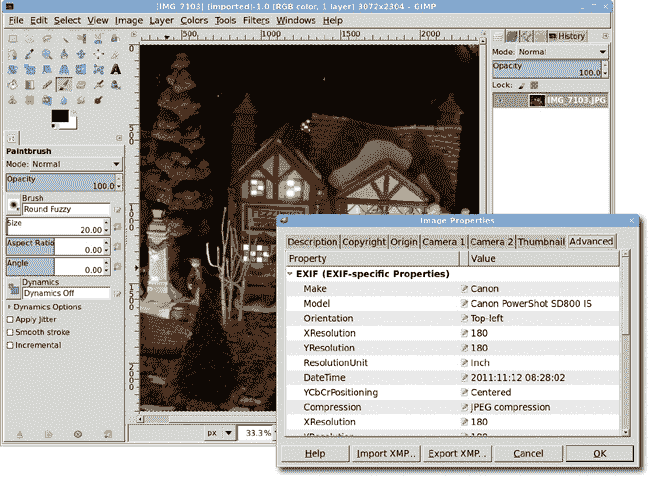

*佳能 PowerShot JPEG 的图像属性对话框包含了大量与拍摄照片相关的信息。*

## GIMP 照片处理

虽然有其他工具可以查看相机图像，但当需要手动颜色修正图像、合并图像或执行深度场或颜色交换等复杂操作时，GIMP 是理想的处理工具。看看在 GIMP 中执行的基本操作。

颜色增强是数字照片的常见需求。本例中的问题是拍摄照片时主题的光线不佳。在原始照片中，颜色有些褪色。通过 F-Spot 的颜色修正运行后，图像得到了改善，但 GIMP 产生的颜色最准确。在这两种情况下，都调整了不同的级别和饱和度，但在 GIMP 中，通过通道混合器进行的额外步骤产生了最佳结果。

*F-Spot 在修正褪色图像方面做得很好，但使用 GIMP 提供的众多颜色修正工具可以获得更好的效果。*

当照片的主题从（可能是想象中的）地平线线倾斜时，图像对齐是必要的。需要旋转来对齐图像，但矩形图像的旋转会产生一个带有背景颜色（或透明度）填充区域的更大图像。因此，对齐需要两个步骤：旋转和裁剪。

GIMP 中的旋转功能通过在图像窗口中显示实时预览得到了改进。在这张图像中，建筑物是倾斜的。你可以通过放置一个水平引导线，使其接触图像左侧屋顶线的较高端，使用测量工具确定旋转角度，然后使用旋转工具使屋顶线与引导线平行来将其校正。旋转后，图像的角落包含透明度，必须裁剪掉。

现在 GIMP 的过滤器直接支持红眼问题。在这张图片中，相机闪光灯反射到眼睛后面，导致瞳孔看起来是红色的。使用自由选择工具在眼睛周围做一个选择，注意不要包括任何皮肤（皮肤也有红色调）。然后打开红眼去除过滤器（过滤器▸增强▸红眼去除）。默认设置对这个图像很适用，所以你不需要做任何额外的调整。

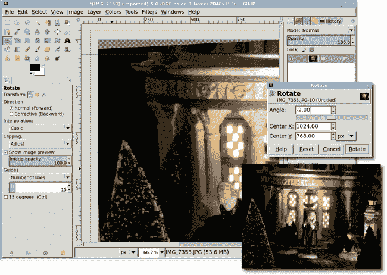

*GIMP 会自动填充旋转区域后原始图像中剩余像素的区域（检查区域，图像左上角）的透明度。*

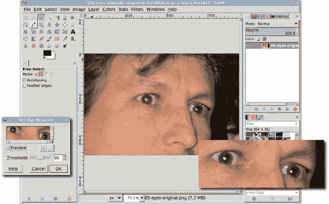

*红眼是由于光线从眼睛后面反射通过瞳孔造成的。这是业余摄影师常见的问题，但使用 GIMP 可以轻松解决。*

## 数码相机技巧

+   Linux 用户：最新的 Linux 发行版，如 Ubuntu、Fedora、OpenSUSE 和 Debian，应该对读卡器有良好的支持。

+   闪存媒体可能访问速度较慢，所以你最好的选择是在处理照片之前，简单地将文件从媒体复制到本地硬盘上。

# 1.10 基础教程

如果你刚开始使用 GIMP，最好的入门方法是熟悉一些可以应用于不同项目的常见过程。这些教程不如书中其他部分的详细，但它们会帮助你掌握适用于所有类型设计的技巧。如果你找不到这里提到的所有菜单项或对话框，不要担心。这些只是快速教程。书中其余部分的教程将更详细地指导你完成这些过程。

## 云彩

一些最富有艺术性的 GIMP 效果涉及以随机方式合并图层。例如，一个粗犷的图像可能会混合几个类似撕页拼贴的纹理图层。在每个图层中创建纹理本身就是一种艺术实验。但如何撕裂这些图层呢？比你想象的要简单。你只需将填充随机形状的图层蒙版应用到每个图层上。图层蒙版会遮挡图层的一部分，使其看起来像是被撕掉了。

哪些随机的形状适合作为图层蒙版？你可以使用画笔在图层蒙版中绘制并产生定制的结果。但这个过程通常很耗时，而且很难用相似的笔触实现随机形状。你需要的是快速且比手工绘制笔触更随机的工具。就像云彩一样。

云是有效的图形设计工具。虽然创建粗糙的纹理可能不是你的专长，但你可以在任何设计项目中通过应用云作为图层蒙版，然后使用它来创建选择性模糊来模拟增加的景深。正如你已经看到的，你还可以将云作为各种纹理的起点，包括皮肤和布料。当然，云也可以简单地作为云使用，从创建轻盈的香烟烟雾，到咖啡杯上升的轻蒸汽，到天空中那些大而洁白的棉球。

GIMP 提供了四个用于创建云的过滤器：差异云、雾、等离子体和纯噪声。虽然你可以单独使用每个过滤器来创建有趣的云形状，但你可能会发现将两个或更多过滤器组合起来会产生更逼真的效果。

### 等离子体过滤器

等离子体过滤器（**滤镜**▸**渲染**▸**云**▸**等离子体**）产生一个彩色烟雾屏幕。在这本书中涉及云的大多数教程都使用等离子体过滤器，正是因为它提供了随机噪声。在这些教程中的许多，你将应用等离子体过滤器到图层蒙版。

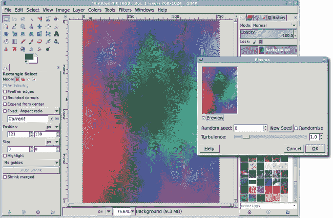

*等离子体过滤器对话框和过滤器渲染的彩色云。与大多数过滤器一样，对话框中的预览与滤镜应用到的图层或选择的形状相匹配。*

然而，滤镜的初始应用不会看起来像云。

1.  为了解决这个问题，首先取消图层的饱和度（**颜色**▸**去色**）。从去色对话框中选择任何选项并点击**确定**。

1.  调整曲线以增加黑色空间（**颜色**▸**曲线**）。曲线调整最初显示为对角线的曲线。点击曲线中间附近并向下拖动以增加层的黑色内容。您也可以点击曲线的其他部分，向下拖动以增加黑色，向上拖动以增加白色。在这个例子中，曲线的一侧（中心左侧）被向下拖动，而另一侧（中心右侧）被向上拖动。

    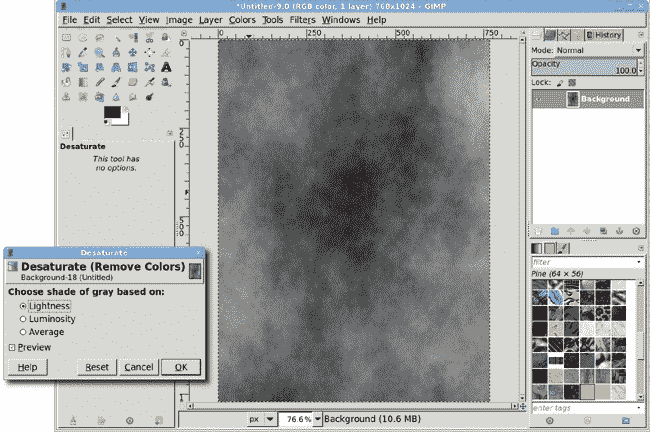

    *在这个阶段，去饱和的等离子体云看起来有点像夜晚的雾。*

1.  添加一个新图层（**图层**▸**新建**），并将其移动到图层对话框中的等离子体图层下方。

1.  用天空蓝色填充新图层，然后将等离子体图层的图层模式更改为**屏幕**。这会创建可以用于其他云效果的细云。

    

    *在两个点上调整曲线对话框。将曲线向下拖动会使灰色更接近黑色，而向上拖动则将灰色变为白色。*

降低等离子体过滤器中的湍流设置会产生更均匀的云层覆盖，结果看起来更像雾而不是云。增加此设置对于实现更复杂的效果很有用，例如模拟火焰（见第 4.12 节）。

### 纯噪声过滤器

天空中的云彩通常会有更多的蓬松感，就像棉花球一样。固态噪声滤镜有助于创建更厚实的云彩。

1.  从天蓝色背景图层开始。

1.  添加一个新图层并应用固态噪声滤镜（**滤镜**▸**渲染**▸**云彩**▸**固态噪声**），使用较低的 X 大小值（大约 1.0）和较高的 Y 大小值（大约 4.0）以水平拉伸云彩。点击**确定**。

1.  调整曲线以增加云图层中的黑色区域。将此图层模式设置为**屏幕**。复制图层以强调效果。

    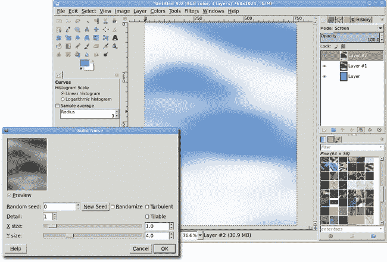

    *固态噪声滤镜产生细丝般的云彩*。

### 差分云彩

当你使用差分云彩滤镜时，你会看到固态噪声对话框出现。这是因为固态噪声是差分云彩滤镜的基础。两者之间的唯一区别是，差分云彩将固态噪声应用到位于活动图层之上的新图层上，将新图层的图层模式更改为差分，并将其与活动图层合并。

### 雾

雾滤镜实际上是一个 Python 脚本，允许你将颜色应用到去饱和的等离子体滤镜上。它还允许你自动命名雾图层，而等离子体滤镜则没有。它基本上是一个方便的滤镜，允许你仅使用一个滤镜就执行通常需要使用等离子体完成的多个步骤。

### 结合滤镜

虽然固态噪声效果很好，但可以更好。

1.  在这些图层之上添加一个去饱和的**等离子体**云图层，并将其图层模式设置为**屏幕**，以向云彩添加一些随机的细丝。

1.  将白色图层蒙版添加到等离子体图层上。然后通过选择**编辑**▸**复制**，**编辑**▸**粘贴**，然后**图层**▸**定位**，将固态噪声图层复制并粘贴到蒙版中。

1.  调整图层蒙版的曲线以增加白色内容。结果，云彩图案应该看起来更蓬松。

    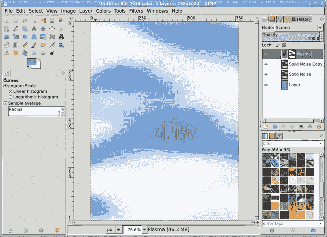

    *除了固态噪声滤镜外，还应用等离子体滤镜，以使其他平滑的云彩看起来像棉花一样。*

### 创建蒸汽效果

要创建类似从咖啡杯中升起的蒸汽，首先使用固态噪声滤镜创建蓬松的垂直云彩。

1.  选择**滤镜**▸**渲染**▸**云彩**▸**固态噪声**，将 Y 大小设置为**1.0**，X 大小设置为**4.0**，然后点击**确定**应用滤镜。

    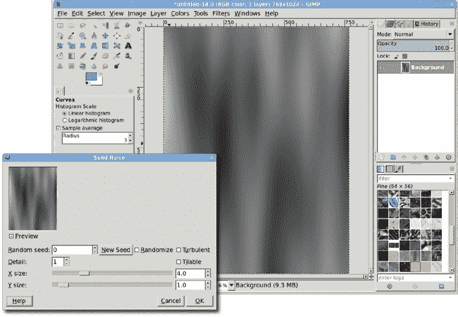

    *使用固态噪声滤镜添加垂直的烟雾云彩*

1.  向云图层添加白色图层蒙版（**图层**▸**蒙版**▸**添加图层蒙版**）。在画布区域中输入**D**以重置前景和背景颜色。

1.  从工具箱中选择**混合**工具。在工具选项对话框中设置形状为**双线性**，模式为**相乘**，然后从图像的中间拖动到右侧边缘。

1.  再次拖动，从近左边缘到左边缘，然后从近右边缘到右边缘。

1.  应用图层蒙版（**图层**▸**蒙版**▸**应用图层蒙版**）。

1.  将噪声层复制并粘贴到咖啡杯图片中（可从在线股票图片档案中获得）。将图层命名为*蒸汽*。

1.  使用**移动工具**将蒸汽丝定位在杯子上方。

1.  使用**缩放工具**调整蒸汽层的尺寸。使用扭曲滤镜（**滤镜**▸**扭曲**）如涟漪或 IWarp 在蒸汽中创建波浪。

1.  向蒸汽层添加图层蒙版，以遮盖杯子外部的蒸汽。

1.  将蒸汽层的图层模式设置为**屏幕**或**颗粒混合**。

    

    *在图层蒙版中使用双线性渐变隔离出少量的水平条纹（如上图所示，使用黑色背景使其在应用图层蒙版后更明显）*

    

    *将蒸汽层应用于咖啡杯上*

### 云层技巧

这些建议将帮助你将云效果提升到下一个层次：

+   使用 IWarp 滤镜（**滤镜**▸**扭曲**▸**IWarp**）为烟雾和云层添加漩涡。此滤镜比 Whirl 和 Pinch 滤镜（**滤镜**▸**扭曲**▸**漩涡和挤压**）提供了更多对漩涡位置的控件。

+   当你创建的烟雾丝被光线或繁忙的背景淹没时，复制烟雾层。将这些层的图层模式设置为屏幕、加法或颗粒混合。

+   你可以将大多数 GIMP 滤镜应用于图层和图层蒙版。在渲染云层之前，请确保在图层对话框中点击适当的缩略图！

## 撕裂和裂缝

撕裂效果很受欢迎，但新 GIMP 用户往往难以复制。实际上，这个技术非常简单，只是小心使用图层蒙版和选择的结果。类似的过程可以向图片添加裂缝（或其他图案）。同样，图层蒙版使这一切成为可能。

### 撕裂图片的边缘

首先创建一个彩色背景层，它将透过撕裂的边缘显示出来。打开你想要练习撕裂的图片（本教程使用的是一张多彩的海滩照片）。这个过程适用于任何尺寸的图片，但请先从不超过 500 × 800 像素的小图片开始练习。

1.  向背景层添加 alpha 通道（**图层**▸**透明度**▸**添加 alpha 通道**）。

1.  添加一个新层（**图层**▸**新建图层**），填充白色，然后将彩色层移动到图层对话框中的背景层下方。

    

    *将彩色层移动到包含照片的层下方。颜色将透过照片的边缘“撕裂”显示出来。*

1.  向原始图片层添加白色图层蒙版（**图层**▸**蒙版**▸**添加图层蒙版**）。

1.  通过选择**图层**▸**透明度**▸**Alpha 到选择**创建整个图像图层的矩形选择。这指示 GIMP 选择图像中的所有不透明像素。因为这张图像完全不透明，这个操作选择了整个图像。（按 CTRL-A 也有效。）

1.  将选择区域缩小**135 像素**。将选择区域的角落圆滑**35%**（**选择**▸**圆角矩形**）。这会在创建图层蒙版时创建一个照片的边界区域，该区域保持不变。

1.  通过**32 像素**对选择区域进行羽化（**选择**▸**羽化**）。这允许撕裂与图像融合。

1.  通过**选择**▸**反转**反转选择，以隔离应用撕裂的区域。

    

    *所需的收缩和羽化量取决于原始图像的大小。较小的图像需要较小的收缩和羽化量*。

1.  在画布中输入**D**以重置前景和背景颜色。

1.  在图层对话框中单击原始图像图层的图层蒙版以使其变为活动状态。通过将工具箱中的背景颜色拖动到画布中来用黑色填充选择区域。

1.  使用**画笔工具**并选择一个画笔在图层蒙版中用黑色进行绘制。（银河（AP）画笔效果很好：将**间距**滑块移动到**60.0 像素**以适应这个尺寸的图像，并根据需要调整工具选项中的画笔大小。）沿着选择区域的内部边缘使用不同大小的画笔进行绘制，对它们的关注较少，而对图像的边缘关注较多。

    由于你正在处理图层蒙版而不是修改实际图像，可以自由地实验。尝试在图层蒙版的边缘使用不同的画笔来改变撕裂边缘的形状。

    

    *原始照片的边缘看起来被撕裂了*。

### 撕裂技巧

认为撕裂可能是你项目所需的东西？这里还有一些额外的技巧：

+   要获得正确的效果，你需要合适的画笔。如果 GIMP 的库存画笔不符合你的需求，考虑创建几个新的。这个过程在 1.1 绘画和绘图中描述。

+   想要用图层蒙版创建文字效果？最快的方法是选择**图层**▸**透明度**▸**Alpha 到选择**以选择文字周围的区域作为图层蒙版区域。用粗糙、刮擦的纹理填充图层蒙版。然后反转文字选择并用白色填充。这仅将效果应用于文字区域内部。
