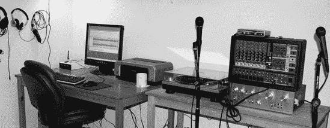
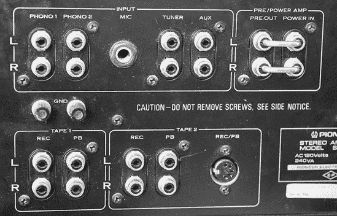
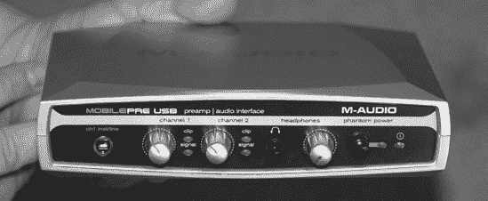
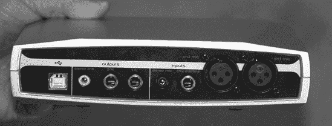
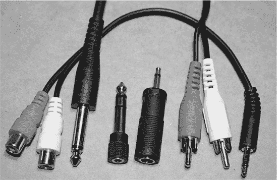
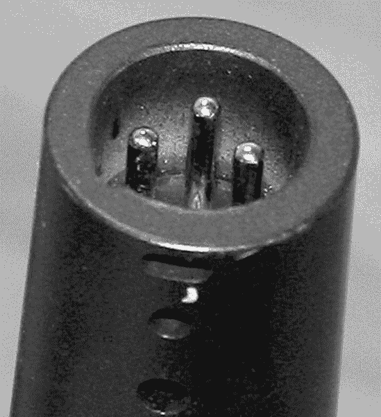
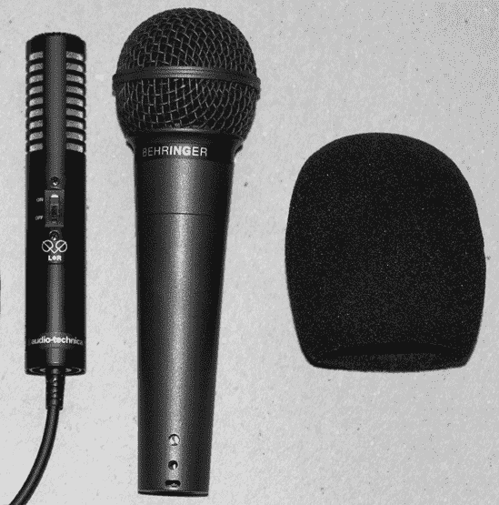
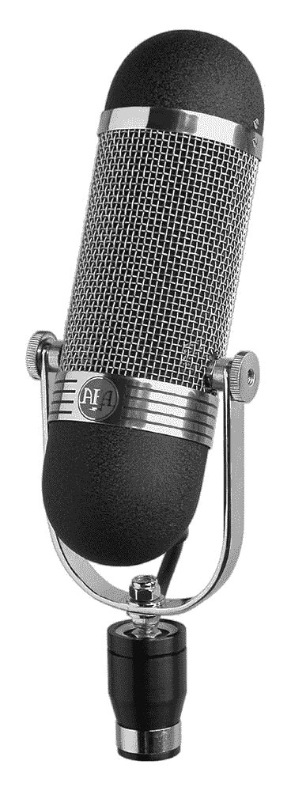
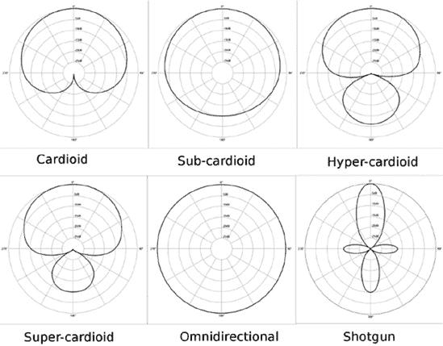
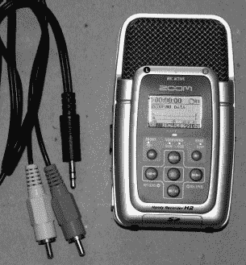

# 第二章. 节省成本建立良好的数字声音工作室

在摄影界有句俗语：相机后面的人比相机更重要。同样的道理也适用于制作优秀的音频录音——设备后面的人比设备更重要。这并不意味着设备不重要，因为它是重要的。但仅仅拥有最昂贵、最精英的音频设备并不能让你成为汤姆·道德或里克·鲁宾或昆西·琼斯或乔治·马丁或你最喜欢的传奇音乐制作人。它也不会将普通音乐家变成明星。

当你在购买音频设备并陷入“更高规格和价格标签就是更好！”的误区时，请退一步，重启你的思维。深呼吸，放慢速度，专注于学习如何从低端设备中获得最佳效果。因为今天的平均数字音频设备比过去的顶级模拟录音室设备更好，具有更高的精度、保真度、更宽的动态范围和更少的噪声，这使得录音、混音、编辑和应用特殊效果变得容易得多。你不必那么费心去学习如何使用你的设备，你可以更多地专注于学习如何以艺术和技术保真度制作好的录音。然后，如果你发现自己渴望更好的前置放大器、更好的麦克风、更好的扬声器或其他设备，你会有充分的理由，当你找到它时，你会了解并欣赏更好的质量。

在本章中，我们将把 PC 变成一个数字音频工作站，而不会花费太多钱。我们还将探讨便携式数字录音机，它们将惊人的保真度和存储容量压缩到小巧的设备中，在各种情况下都非常有用。

# 从计算机中获取声音输入和输出

在基于 PC 的音频制作中最大的挑战之一是确定音频设备。有大量的音频组件，具有各种可想象的功能和价格标签的组合。在本章中，我将讨论小型录音室的基本元素。附录 A 更详细地介绍了硬件，包括不同价格范围内的不同型号和品牌的示例。

有几种方法可以将音频设备与电脑连接起来：台式电脑的 PCI 或 PCI-E 声卡；笔记本电脑的 Cardbus 或 ExpressCard 声卡；任何电脑的 USB 1.1、USB 2.0 或 FireWire 音频接口。您需要其中之一。哪一个？对于单轨或双轨录音，任何一种都行。对于重型多轨录音，USB 1.1 不是一个选择。但它非常适合单轨或双轨录音，您将有很多优秀且价格适中的设备可供选择。对于严肃的多轨录音，您需要更快的协议，尤其是如果您打算以高比特深度和采样率录音，因此我们将探讨它们的优缺点。

数字音频制作中最基本的组件是模拟/数字/数字/模拟转换器。ADC/DAC 就是您如何将模拟音频输入和输出到电脑的方式。它将麦克风或乐器产生的模拟信号转换为数字信号。然后它将数字信号转换为模拟信号以进行播放。ADC/DAC 有多种形式：最低端、最便宜的板载声卡有一个，当然高端音频接口也是如此。有各种 USB 和 FireWire 录音接口，可以将麦克风和乐器连接到电脑上，而且您根本不需要担心内置声卡。还有小巧便携的 ADC/DAC，可以连接唱盘、卡式录音机和立体声音响放大器到电脑上，以及内置 USB ADC/DAC 的 USB 麦克风和唱盘。对于预算充足的录音室爱好者，还有更昂贵的机架式 ADC/DAC。

## 一个录音室示例

让我们从一张基本、中等质量的计算机录音室的照片开始，碰巧这是我自己的。图 2-1 显示了整个系统：电脑在桌子下面。从左到右是各种耳机；然后桌子上有一个外置 USB CD/DVD 刻录机、一个四端口供电 USB 集线器、一个液晶显示器、一台彩色打印机、至关重要的热饮杯、一台唱盘、一台优秀的先锋立体声音响放大器、一台 Behringer 供电混音器和一台 MobilePre USB 前级/模拟/数字转换器。前面有两只动圈麦克风。未显示的是一对安装在墙上的漂亮的 JBL 扬声器。您可以在一个小空间内塞进很多功能。

图 2-1.我的小小录音帝国（麦克风实际上并没有放在放大器和调音台前面；那只是为了拍照摆的姿势）

同样没有展示的是一款优秀的 Focusrite Saffire Pro 26 I/O FireWire 多通道录音接口。Focusrite 制造出色的音频硬件，并支持 Linux、Mac 和 Windows。我们将在第九章（第九章）中看到更多关于 Saffire 的内容。

这就是它们如何组合在一起：

+   录音：麦克风和乐器 > Behringer 混音器 > MobilePre > 电脑

+   播放：电脑 > MobilePre > 先锋立体声功放 > 扬声器

对于录音，Behringer 混音器有一对 RCA 录音输出。这些通过 RCA 配对到两个 1/4 英寸单声道 TRS 适配器发送立体声信号到 MobilePre 上的两个 1/4 英寸 TRS 插座。MobilePre 通过 USB 线缆连接到电脑。然后 Behringer 上所有插入的设备都会被 Audacity 捕获。

### 注意

连接器的术语有些混乱，所以我将把电缆上的连接器称为 *插头*，把混音器、预放大器、放大器等它们插入的插座称为 *插座*。我还会遵循惯例，即使这对我来说听起来很奇怪，也会提到 *公* 和 *母* 连接器。至少 *公* 和 *母* 连接器有精确的含义，不像很多音频术语那样模糊。

对于播放，MobilePre 拥有 1/8 英寸立体声输出。这可以通过立体声迷你插头到 RCA 配对适配器连接到先锋功放的辅助输入。MobilePre 还有一对 1/4 英寸 TRS 输出，因此对于这些输出，我需要 1/4 英寸 TRS 到 RCA 适配器。图 2-2 显示了放大器背面的插头。这样的放大器加上一个好的 ADC/DAC 可以成为一个转换工作室的绝佳中心，因为任何连接到放大器的设备都可以在电脑上录音。

图 2-2。这是一台珍贵的旧但多功能的先锋立体声放大器背面。它可以连接两个唱盘（它甚至为唱盘提供了合适的接地连接器），两个磁带机，一个麦克风，一个调谐器，另一个放大器，一个预放大器，以及一个 CD 播放器或其他输入设备的辅助连接器。

我也可以完全去掉 Behringer，例如用于采访和播客，只使用 MobilePre 与任何电脑结合。

当我复制黑胶唱片到 CD 时，过程是这样的：

+   录音：唱盘 > 先锋功放 > MobilePre > 电脑

+   播放：电脑 > MobilePre > 先锋功放 > 扬声器

黑胶唱机连接到放大器上的唱机端口。放大器通过一对录音输出连接到 MobilePre。我可以使用 RCA 对到两个 1/4 英寸 TRS 适配器或 RCA 对到立体声迷你插头，因为 MobilePre 在连接方面非常灵活。

您可以使用这种设置将任何旧媒体数字化，因为连接到您的 Hi-Fi 放大器或接收器的任何设备都可以复制到您的电脑中。

录音和回放都通过 MobilePre 进行路由，所以我可以在好的扬声器上听到回放，而不是低音质的电脑扬声器。MobilePre 有一个耳机插孔，可以在录音时进行零延迟监听，这是一个很棒的功能。Behringer 混音器（Europower 1280S）并不是真正打算用作录音室混音器；它是用于供电现场表演的，它在这方面做得非常出色，因为它是一个集成的混音器和 1200 瓦的放大器。当我录制现场表演时，我会用笔记本电脑和 MobilePre 连接到它。我还有一个 Zoom H2 便携式数字录音机，可以用它代替笔记本电脑和 MobilePre。现场表演中最好的录音来自直接连接到混音器板。

### 注意

我喜欢听和录制的当地老式乡村乐队有一个相当古怪的声音系统。他们有一个不错的公共广播系统，但不是将每个人都连接到混音器板，只有歌手的麦克风连接到混音器。所有的音乐家都必须自带乐器放大器。这使得舞台显得杂乱无章，录音也变得噩梦般——将录音机插入混音器意味着它只能听到麦克风拾取到的任何乐器。Zoom H2 有一个小巧的适配器，可以安装在麦克风支架上，这样我就可以将其放置在任何位置，但它并不如一个通过声音板路由的完整设置好。 

让我们更仔细地看看 MobilePre，因为它代表了许多 USB 录音接口。MobilePre 为电容式麦克风提供 48v 幻象电源，并具有 XLR 和 TRS 插孔、1/8 英寸立体声输入、两个 1/4 英寸单声道输出和一个 1/8 英寸零延迟耳机插孔用于监听。只要它们有 XLR 连接器，动态和电容式麦克风都可以插入 XLR 插孔。您还可以使用 XLR 到 TRS 适配器将动态麦克风插入 1/4 英寸输入之一。其内置 ADC 支持从 8kHz 到 48kHz 的采样率，以 16 位进行采样，并从您电脑的 USB 总线获取电源，因此不需要自己的电源线。它具有物理增益控制旋钮和耳机音量控制旋钮，因此您不需要在软件控制上浪费时间。（我宁愿转动旋钮，也不愿在某个奇怪的软件界面上摸索。）您应该可以在 150 美元以下找到它。在 16 位/48MHz 的最大录音质量下，它正在变得过时，因为类似设备支持 24 位录音。尽管如此，它是一个很棒的设备，因为它符合 USB 1.1 类规范，所以可以在任何电脑上运行，无需特殊驱动程序。

图 2-3 和 图 2-4 展示了 MobilePre 的正面和背面。

图 2-3。M-Audio MobilePre，正面。从左到右：通道 1 1/4 英寸单声道 TRS 插孔，通道 1 和 2 增益控制，削波 LED，耳机插孔，耳机音量旋钮，幻象电源开关，幻象电源 LED 和电源 LED

图 2-4。M-Audio MobilePre，背面。从左到右：USB 插孔，立体声线路输出，1/4 英寸单声道 TRS 左右输出，立体声麦克风输入，通道 2 1/4 英寸单声道 TRS 输入，通道 2 XLR 麦克风插孔，通道 1 XLR 麦克风插孔

## 排列连接器

TRS 和 XLR 这些术语是从哪里来的？TRS 是*tip-ring-sleeve*，这是 TRS 插头的物理描述。图 2-5 是立体声和单声道 TRS 插孔的标记照片。

XLR 的起源要复杂一些。Cannon Electric 是 XLR 连接器的原始制造商，一些老一辈的人仍然称它为*cannon plug*。它最初是“Cannon X”系列的连接器。后来版本增加了锁定装置，因此有*L*，然后接触点被橡胶封装，形成*R*。图 2-6 展示了一对三针 XLR 插头。

图 2-5。一个立体声 1/4 英寸 TRS 插头（左）和一个单声道（右）。

图 2-6。这里是一个三针公 XLR 插头和一个三针母 XLR 插头。

图 2-7 展示了一系列插头和适配器。你可以找到适配器来使任何设备与任何设备兼容。然而，你必须小心——仅仅因为某物可以安装并不意味着它应该在那里，所以请阅读你的产品手册。立体声 TRS 插头在尖端附近有两个黑色条纹，而单声道 TRS 插头有一个。

图 2-7. 两个立体声 RCA 到 1/8 英寸 TRS 插头，1/4 英寸单声道 TRS 到两个立体声 RCA，1/8 英寸到 1/4 英寸立体声 TRS 适配器，1/4 英寸到 1/8 英寸单声道 TRS 适配器

图 2-8. Behringer 动圈麦克风展示其三针公 XLR 连接器

图 2-8 展示了 Behringer 动圈麦克风上的三针公 XLR 连接器。

# 多声道录音，PCI，USB，FireWire

多声道录音可以通过几种不同的方式进行。一种方式是使用简单的双轨录音接口，如 MobilePre。它一次最多支持六个输入，并将它们路由到两个通道。没有混音控制，因此在录音时需要一些调整以获得良好的平衡。使用像 Pre 这样的双通道接口进行多声道录音的更好方法是同时录制两个轨道，为每个乐器或表演者分配其自己的独立轨道，而不是试图一次性将它们全部通过 Pre。然后 Audacity 就是你的混音器，你可以对每个轨道进行单独控制。另一个双通道录音的选项是高质量的 Emu 1616M PCI 双通道 PCI 声卡，你可以在 200 美元以下的价格找到二手的。它附带一个支持各种插件的分线盒，24 位/192 千赫录音，幻象电源和前置放大器。

当我有更多的朋友来录音时，我的 Behringer 1280S 就会派上用场。只要你有 ADC/DAC 可以连接到它，任何模拟调音台都可以使用。我的设置有点像“黑客”作业，因为 Behringer 并不是真正的录音室调音台，但它工作得很好，听起来也不错，这是在音频的广阔世界中一点小创意就能走得很远的例子。像许多调音台一样，Behringer 输出到双声道立体声，所以我需要在录音时调整好混音——在 Audacity 中我只有两个通道可以工作。我也可以一次用 Behringer 录制一到两条音轨，然后在 Audacity 中将它们拼接起来；没有规定说你必须一次连接所有设备。（尽管管理和组织音乐家可能有点像牧羊，有时你必须接受你能得到的任何东西。）

从版本 1.3.8 开始，Audacity 支持一次录制与你的录音接口支持的音轨数量一样多。旧版本的最大值为 16。这就是 FireWire 和高端 PCI 声卡发光的地方，因为它们允许一次录制多个音轨。Focusrite Saffire Pro 40 是一款大约 500 美元的 FireWire 录音接口中的好价值，它提供了 8 个话筒前级放大器，总共 20 个输入和 20 个输出，24/96 录音，闪烁的 LED 灯，以及每个话筒通道的幻象电源。M-Audio Delta 1010 是一款流行的多通道 PCI 声卡，它连接到一个机架式分线盒。它的价格大约为 600 美元。

一系列酷炫的新设备是 USB 和 FireWire 调音台。这些设备将所有功能集成在一个设备中——前级放大器、幻象电源、调音台板、ADC/DAC，以及直接连接到你的电脑。在 300 到 1000 美元的价格范围内有很多不错的选择。Behringer 的 Xenyx USB 调音台系列价格在 150 到 600 美元之间。它们使用符合标准的 USB 1.1，因此可以插入任何电脑，无需特殊驱动程序。M-Audio NRV10 是一款价格约为 700 美元的不错的 FireWire 调音台/前级放大器。

如何选择使用哪一种？USB 和 FireWire 都是便携式且易于连接的。PCI Express 是最快的。PCI-E 的单条通道同时双向传输大约 250MBps。这是 250 兆字节，而不是兆比特。普通的 PCI 最大传输速度为 133MBps。此外，与 PCI-E 不同，PCI 使用共享总线，因此更多的 PCI 设备意味着更多的带宽竞争。每个 PCI-E 设备都有自己的专用数据管道，所以 PCI-E 设备不需要共享带宽。USB 1.1 的传输速率为 12Mbps（每秒兆比特），而 USB 2.0 的传输速率约为 480Mbps，但这两个数字都是高度理论化的，在现实生活中你很可能只能得到一半的速度。FireWire 的传输速率为 400Mbps。然而，FireWire 提供的持续传输速率和性能优于 USB，这一点将在下一节中更详细地讨论。

内置声卡的常见问题是会从电脑机箱内的硬盘、电源和风扇中拾取噪音和电气干扰。这通常不是像 Emu、M-Audio 和 RME Hammerfall 这样的优质声卡的问题，但对于消费级和游戏级声卡以及低预算的板载声卡来说，这往往是一个更大的问题。如果你遇到了噪音，首先要检查的是所有连接——确保一切连接正确，并且需要接地的部分都已接地。有时将 PCI 卡移动到不同的插槽可能会有所帮助。查看你的主板手册，看看你是否拥有共享的 PCI 插槽；如果你知道另一个插槽已被占用，那么不要使用共享插槽。

# USB 还是 FireWire？

如果你喜欢 USB 音频接口的便利性，你也可能考虑 FireWire 设备。你如何选择 FireWire 或 USB？USB 设备通常比 FireWire 便宜，但代价是性能可能较差，因为两种协议之间的差异。

所有 FireWire 接口都有特殊的控制器芯片，因此它们不会给你的电脑 CPU 增加任何额外的负载。FireWire 是一种对等协议，这意味着 FireWire 设备在不需要主机 CPU 周期的情况下协商总线冲突。FireWire 为你提供了两种操作模式可供选择：异步或同步。异步模式意味着设备可以保留一定部分带宽完全用于自身，其他设备无法使用。因此没有冲突，这转化为高持续吞吐量。

如果你的 PC 没有 FireWire 接口，添加一个也很容易。PCI FireWire 接口大约需要 50 美元，许多笔记本电脑都包括 FireWire 端口。当你购买 FireWire 音频接口时，务必检查硬件兼容性。例如，Presonus FP10 与某些视频芯片组存在已知冲突，并且它只与有限数量的 FireWire 接口兼容得很好。

FireWire 的未来

“FireWire 要完蛋了！”是最近常见的呼声。这可能是真的，尽管它还将与我们相伴数年。USB 2.0 据说具有与 FireWire 性能相媲美的潜力，而 USB 3.0 据说将超越它。音频硬件制造商在发布 USB 2.0 录音接口方面进展缓慢，尽管现在已经有了一些值得尊重的产品。其中许多依赖于非 USB 2.0 兼容的自定义驱动程序，所以购买时请仔细检查，以免购买到无法在电脑上运行的设备。USB 3.0 仍在开发中，音频硬件制造商并不以快速行动著称。如果你喜欢 FireWire 录音设备，那么请毫不犹豫地购买并使用它们，如果 FireWire 最终变得过时，你仍然可以使用你的设备，因为没有人会来把它从你那里拿走。

USB 仅在异步模式下运行。*异步*意味着同一总线上任何设备都可以随时发送数据，因此有时会有冲突，这会导致延迟。USB 依赖于主机，并给 CPU 带来负担，这也可能导致延迟。延迟是高质量音频的敌人。

你会看到很多仍然使用 USB 1.1 的 USB 音频设备。USB 1.1 有两种速度：1.5Mbps 和 12Mbps。后者也称为*全速*。USB 录音接口不太可能降低到 1.5Mbps。你可以同时记录的通道数量取决于你想要记录的质量级别。CD 质量，两个通道的 16/44.1，比特率为 1,411,200Mbps。两个通道的 24/96 等于比特率为 4,608,000Mbps，所以看起来你可以一次记录四个 24/96 通道。然而，那个 12Mbps 的最大值是理论上的，你实际的世界吞吐量将是理论值的一半或更少。最可能的情况是，你最多只能进行两个通道的 24/96 录音。如果你小心谨慎，并且拥有一个性能良好、快速的多核 PC，并且将其调校用于音频制作，那么 16/44.1 或 24/48 的四个通道是可能的。（参见比特率、比特深度和文件大小以了解不同的比特率。）

USB 2.0 音频设备需要仔细挑选，因为其中许多设备不是 USB 类兼容的，而是提供自己的专用驱动程序。即使是 Windows 用户也必须做他们的作业，因为厂商发布新 Windows 版本时的驱动程序发布速度很慢。Mac 的整体支持是不错的，Linux、Unix 和其他平台上的用户通常处于落后地位。一些多轨 USB 2.0 设备获得了良好的评价。例如，M-Audio Fast Track Ultra 8R（八进八出）获得了高分，并且可以在 Mac、Linux 和 Windows 上运行。

# 麦克风

图 2-9 中的麦克风是中等价位的动圈麦克风，每个不到$100。麦克风非常重要——你不能从低质量的麦克风中获得好的录音。有两种常见的麦克风类型：电容式和动圈式。*电容式*麦克风具有更宽的频率响应，更敏感，输出更响亮，并且瞬态响应更快。*瞬态响应*是指任何突然的变化，例如鼓边击打，用力拨弦的吉他，或者歌手发出一些硬辅音（并且可能喷出一点唾沫）。

图 2-9. Audio-Technica 立体声电容麦克风，Behringer 动圈麦克风和风袋

电容式麦克风需要电源。当它通过麦克风电缆传输时，这被称为*幻象电源*，因为没有单独的电源线。它们比动圈麦克风更脆弱。电容式麦克风主要存在于录音室中。它们也用于舞台上，与动圈麦克风一起在鼓组中使用；电容式麦克风悬挂在上方以捕捉钹和瞬态，而动圈麦克风则放置在鼓旁边。图 2-9 展示了 Audio-Technica 立体声电容式麦克风、Behringer 动圈麦克风和风标。（有经验的歌手知道要避免鲜艳的风标，因为它们看起来像小丑的鼻子。）

需要幻象电源的电容式麦克风通常使用 XLR 连接器。动圈麦克风既使用 XLR 连接器也使用 TRS 插头。动圈麦克风不需要幻象电源，所以在将其插入幻象电源 XLR 插孔之前，请确保幻象电源已关闭。这不会损坏麦克风，但会改变其声音。在音频设备上看到这两种类型的麦克风连接器是很常见的，而较新的设备则具有可以接受两种连接器的组合插孔。

在图 2-9 中展示的小型 Audio-Technica Pro 24 立体声电容式麦克风是一种不同类型的电容式麦克风。它由一个小型水银电池供电，内置电缆，并可以插入任何 1/8 英寸 TRS 立体声麦克风插孔，例如笔记本电脑、数字录音机和摄像机。

有两种类型的电容式麦克风：大振膜（LDM）和小振膜（SDM）。它们都能在其整个频率范围内均匀且准确地记录声音，尽管 LDMs 因其“更温暖”的声音而享有盛誉。大振膜麦克风在低频范围上比小振膜麦克风表现更好，但同类型的小振膜麦克风在高频响应上更佳。低音被描述为更温暖，而高音则被描述为更冷且更明亮。你将听到各种对声音品质的描述：温暖、寒冷、脆弱、柔和、坚硬、明亮、暗淡，等等。相信自己的感知，不要担心别人告诉你应该喜欢什么。

图 2-10. 现代 AEA R84 动圈麦克风

*动圈*麦克风具有较窄的频率响应，并且不如电容式麦克风准确。它们坚固耐用，防潮，不需要电源供应，因此动圈麦克风常用于舞台和现场。动圈麦克风通常覆盖人类语音范围再加上一点，这使得它们非常适合歌手。

另一种值得考虑的麦克风类型是带式麦克风，这是一种动圈麦克风。带式麦克风的内部结构是在磁场中悬挂的金属带。这些麦克风价格昂贵，但因其清晰度、空间深度和真实性而备受推崇。它们在 20 世纪 30 年代彻底改变了音频行业；带式麦克风为真实性和准确性设定了新的标准，当时的电容麦克风无法匹敌。随着电容麦克风和动圈麦克风的改进，带式麦克风逐渐失去了人气。它们价格昂贵，金属带脆弱，输出信号非常低，需要比其他类型的麦克风更多的放大。现代带式麦克风更实惠、耐用，并且比它们的祖先产生更大的输出，因此它们绝对值得一试（图 2-10）。

话筒带式麦克风是原生的双向麦克风，这意味着它们对麦克风前后两侧的声音都敏感，以八字形模式。它们在阻挡来自两侧的声音方面非常有效。八字形模式位于水平轴上，因此你可以将它们倾斜以获得不同的效果。将一对匹配的带式麦克风以 90 度角并排放置称为*布卢门林对*，或交叉八字形。这可以创建一个逼真的立体声图像。如果你不想捕捉来自一侧的声音，例如观众一侧，你必须以某种方式阻挡它或找到具有所需捕捉模式的带式麦克风。

## 极化模式

对于麦克风来说，重要的考虑因素是*极化模式*。极化模式描述了麦克风的灵敏度区域，如图 2-11 所示。这些二维图表并没有显示极化模式是三维的，所以请记住，它们不是平坦和水平的；它们包括具有高度和深度的区域。

图 2-11. 一些常见的麦克风极化模式（图片来源：由维基百科用户 Galak76 创建，GFDL 许可发布）

这些是常见的极化模式：

**心形**

从前面拾取声音，从后面拒绝声音。次心形麦克风与全向性类似，但后部的范围较小。超心形和超心形麦克风在前面有更窄的范围，以及后部灵敏度的小瓣。这在舞台麦克风和尤其是歌手的麦克风上很常见。不同的心形麦克风有不同的灵敏度水平。有些麦克风拾音范围较宽，因此适合活动范围较大的表演者，而有些麦克风灵敏度区域较小，因此更擅长不拾取背景噪音。

**全向性**

在球形区域内从所有方向均匀拾取声音。尝试将你的乐队围成一个圈，中间放置一个全向麦克风，以获得宽敞、自然的声音。

**长枪式**

所有麦克风中最具方向性的，前端长而窄，后端拾音范围较小。这些通常与各种电影摄像机一起使用，从电影到数字，从专业到消费级，都是野生动物摄影师的首选。

**双向**

从前后方向都能很好地拾取声音；不会拾取侧面的声音。（图 2-11"))中没有展示。)

**半全向，或半球形**

捕获大约 180 度的半球形区域。使用这种麦克风之一，你可以录制一些很好的现场录音，因为它具有宽阔的前端拾音区域，并且不会拾取后方的噪音。（图 2-11"))中没有展示。)

你可能会想，为什么不直接使用长枪式或心形麦克风来录制所有内容，以便只专注于你想要录制的声音呢？做你想做的；让你的耳朵和品味成为你的指南，并根据场合选择你的麦克风。不同品牌和型号的麦克风具有不同水平和类型的灵敏度。例如，有些麦克风对活动频繁的歌手比较宽容，而有些麦克风只有在近距离时才能很好地捕捉。无线耳机非常适合精力充沛的表演者，无线麦克风意味着没有绊倒电缆的风险。有些麦克风随着你靠近会更多地强调低频，就像广播 DJ 那样夸张地强调低音。这被称为 *近讲效应*。

牛仔摇滚乐队 *Trinity Session* 的专辑是使用一个据说价值约 9000 美元的单个 *环绕声* 麦克风录制的。环绕声指的是旨在产生逼真、空间自然的环绕声录制技术和设备。环绕声麦克风具有多个胶囊，可以捕捉来自不同方向的声音，从四个到几十个不等。这是音频制作中的一个有趣细分市场；如果你对了解更多感兴趣，可以查找 *环绕声* 和 *SoundField 麦克风*。

## 哪种麦克风适用于哪种场合？

适用于各种场合的麦克风种类繁多，例如用于人声、吉他、鼓等。歌手们可能会特别挑剔，因为不同的麦克风会对他们的声音产生不同的色彩。你会在这一主题上发现许多热情的观点。请记住，有许多因素会影响录音对你来说听起来有多好：编辑方式、你正在听到的设备类型、你的听音位置（家、朋友家、音乐厅、户外、车辆）、你的情绪和期望。我们从小听着各种类型的录音音频长大：赛璐珞、黑胶、不同类型的磁带，现在则是数字录音。所以，什么听起来“正确”很大程度上取决于我们习惯听到的声音。有些人仍然怀念着 60 年代那种刺耳的 AM 广播或轰鸣的自动点唱机，或者立体声八轨磁带的声音。有些人认为黑胶听起来比数字录音“更温暖”，而电子管放大器听起来比固态放大器更温暖。

我一直想做一些盲测，看看我生活中的那些挑剔的音响爱好者是否真的能听到区别。我最想做的盲测是电子管放大器与固态放大器的对比，以及冷态电子管放大器与经过 24 小时预热后的电子管放大器的对比，因为一些上述挑剔的音响爱好者坚持认为电子管放大器需要长时间的预热期，否则听起来会“冷”。

电子管和固态之间确实存在真正的差异。电子管放大器系统驱动变压器，变压器再驱动扬声器。变压器抑制了许多瞬态，如尖峰、噼啪声和咔哒声，从而产生更干净的声音。冷态前置放大器比热态前置放大器噪声更多。电子管也有一个独特的噪声源，而半导体设备有多个噪声源，这增加了你可能会听到的噪声量。然而，在高质量的设备上，要检测到差异需要非常敏锐的听力。

定义一个“纯粹”的体验几乎是不可能的，因为即使是现场表演也会受到环境和设备、氛围以及我们大脑处理数据方式的影响。我总是惊讶于我喜欢的本地乐队在我的表演录音中听起来有多糟糕。在表演期间，我玩得很开心，觉得他们听起来很棒。然后后来当我听到回放时，我听到了各种各样的缺陷：节奏不准确、音准不对、缺乏活力，等等。也许我太挑剔了，太专注于在录音中寻找错误；也许在现场表演时，我的大脑太忙于玩乐，而没有注意到缺陷。也许我录制的录音很糟糕。

道理是，音质取决于你自己的耳朵和经验——对你来说什么听起来好和正确才是最重要的。你可以尝试追求最逼真的保真度，或者尝试追求最佳的艺术和创意保真度。这一切都是主观的。

## 麦克风电缆

市面上有众多品牌的麦克风线缆，你可能会在某个高调的品牌名上浪费很多钱。不必花费大量金钱；有许多价格合理、质量上乘的选择。你可能会对*平衡*和*非平衡*线缆感到困惑。在连接麦克风的情况下，非平衡线缆是一种以 TS（针-套）连接器结束的同轴电缆。它由一根被组合屏蔽和接地线包围的单导线组成。这些线缆能有效屏蔽外部干扰，但容易受到感应杂音和噪声的影响，通常比平衡线缆更嘈杂。平衡线缆以三针 XLR 连接器或 TRS 连接器结束。它有两根内部线，一根热线和一根冷线，被一个不构成信号路径的屏蔽包围，因此提供更干净的信号。平衡线缆可以比非平衡线缆运行更长的距离而不会拾取过多的噪声。

请记住，是信号本身是平衡的还是非平衡的，使用平衡线缆并不能使非平衡信号变得平衡。然而，TS 线缆会将平衡信号转换为非平衡信号。你需要根据你的麦克风、前级放大器、放大器、调音台或你可能要插入的任何设备来匹配你的线缆。依赖幻象电源的电容式麦克风很可能使用三针 XLR 平衡线缆，而动圈麦克风则使用带有 XLR 和 TRS 连接器的平衡线缆。平衡信号不关心它所携带的内容，因此你可以根据需要使用 XLR 到 TRS 适配器，只要插入的设备发送正确的信号。

这些天，这不应该是一件需要花费大量时间解决的问题，因为大多数现代音频设备都支持平衡麦克风连接。

麦克风线缆要么是硬的，要么是软的，这取决于它们将被用于何处。软线缆适用于现场表演，而硬线缆通常位于录音室中，那里它们不太经常移动。

如果可能的话，不要将任何音频线缆与电力线交叉，因为你可能会有干扰。如果必须这样做，请以直角交叉以减少重叠。

## 智能麦克风使用

将你的麦克风放置以获得最佳效果本身就是一门艺术，而要精通它，唯一的途径是大量练习。你希望尽可能靠近，但又不能太靠近以至于拾取电子干扰或歌手不希望的声音，如唇音和唾沫。对于歌手来说，泡沫过滤器很有帮助，而防风罩对于户外录音是必不可少的。

“3-1 规则”是一个简单的指南，用于现场表演或在录音棚中放置麦克风，当时你同时在同一房间内设置了多个麦克风和表演者。当麦克风放置得太近时，你可能会得到尖叫声、凹陷和峰值，或其他形式的令人不快的干扰。3-1 规则意味着相邻麦克风之间的距离应该是麦克风与声源之间距离的大约三倍。如果有多个放大器存在，就像我喜欢的当地乐队，每个表演者都带着自己的放大器上台，这些也会造成问题。有时只需将放大器转向不同的方向，就可以解决反馈问题。

麦克风支架是必不可少的——不要依赖手持。鹅颈支架占用空间较小，调整速度快，但时间久了会磨损。三脚架支架可以永久使用，但占用空间较大。有些人更喜欢三脚架脚，但我总是绊倒，所以我更喜欢带重量的底座。减震架和笼子可以很好地隔离你的麦克风免受振动，而且价格不贵。

# 麦克风前置放大器

麦克风前置放大器是音频链中第二重要的设备，仅次于 ADC/DAC。正如我在本章中已经讨论过的，我有一个 M-Audio MobilePre 和一个 Focusrite Saffire Pro 26。有了这些，我就不需要内置计算机声卡或单独的前置放大器，因为它们都有自己的内置麦克风前置放大器。然而，即使你更喜欢使用内置声卡或拥有良好的外部录音接口，你也可能仍然想使用单独的麦克风前置放大器。让我们谈谈为什么前置放大器如此重要。

前置放大器——简称*preamplifier*——放大低电平信号到*线路电平*。麦克风、唱机以及许多乐器拾音器的输出低于线路电平。线路电平是一种标准模拟音频信号电压，旨在连接不同的音频组件。这个电压是多少？嗯，这是一个好问题，因为尽管它被宣传为标准电压，但它取决于制造商。大多数在 1 到 2 伏特之间。前置放大器对音频质量有显著影响：低质量的前置放大器会引入噪声和失真。一个好的前置放大器可以干净地放大信号，不会引入缺陷或色彩。

### 注意

音频术语以各种方式被曲解——你看到的许多家用高保真系统前置放大器并不像麦克风前置放大器，因为它们不做任何放大，只是切换单元，你可以在其中插入所有设备。

预放大器从仅提供增益（放大）和幻象电源的简单模型到装饰华丽、充满各种特殊效果、旋钮和闪烁灯光的设备。许多音频设备都配备了大量的特殊效果，因为添加它们几乎不花什么钱，而且它们让你感觉像是在得到一些特别的东西。如果你喜欢很多特殊效果，这是一个很好的额外好处；只是不要让它分散你对设备真实质量的注意力。至少，有一些物理旋钮是很好的。关于哪种预放大器最好的争论几乎具有宗教性质。专业人士可能会在单个预放大器上花费数千美元。你可以这样做，但在我看来，你最好从廉价的设备开始，投资于完善你的录音技巧。然后当你准备好升级到更好的设备时，你会欣赏这种差异，并知道如何充分利用它。

# 扬声器和耳机

在你的音频链中同时拥有扬声器和耳机，让你能够以不同的方式听到你的录音。专业监听扬声器据说非常平坦和准确，不会添加任何自己的色彩。它们也往往很贵。我自己的录音室扬声器是一套很好的 JBL 三分频扬声器。它们不是真正的专业监听扬声器，只是我喜欢的好扬声器。耳机是必不可少的——你需要这些来监听你的录音。内置零延迟耳机端口的音频接口非常适合监听。我似乎收集耳机：我有一款很好的 Plantronics USB 耳机，非常适合录制播客；一套带有普通 1/4 英寸 TRS 插头的 Sennheiser 耳机；还有无线 Audio-Technica 耳机。我的录音室扬声器由一款很好的先锋 SA 7500 立体声放大器供电。我已经修过两次，我会尽量让它继续工作。它的每个通道功率为 45 瓦，听起来并不多，但它以一些严重的电流来驱动这些瓦特。功率放大器是放大器中真正的功率衡量标准；这就是微弱放大器和强大清洁放大器之间的区别。瓦数并不代表太多——这只是销售人员喜欢关注的数字。

这些都不是超级超级的高保真，至少不是按照挑剔的音响发烧友的标准，但它们都是好的组件，并且让我感到满意。

# 你的电脑必须拥有肌肉和巨大的抽屉

你的电脑应该是一台功能强大的现代机器，拥有高性能的 CPU 和大量的 RAM。我的录音室 PC 配备了一个 AMD Phenom 三核 CPU 和 4GB RAM。多核 CPU 有很大的影响。单核 CPU 对于双轨录音和像播客和采访这样的简单录音应该表现良好。例如，我有一台老式的 ThinkPad，CPU 为 800 MHz，RAM 为 256MB，运行 Linux，作为采访现场录音机表现良好。对于超过两轨的情况，多核是最佳选择。不用担心 AMD 与 Intel 之间的区别；它们都很好，所以使用你最喜欢的那一个。

你需要尽可能多的存储空间。CD 品质的音频（44.1 kHz，16-bit WAV）每分钟每轨大约占用 5MB。别忘了把所有你使用的轨和重录的轨加起来。你可以购买 TB 级硬盘，等你读到这段话的时候，它们可能容量更大了。另一个选择是将多个硬盘的容量组合在一个 RAID（廉价磁盘冗余阵列）中。对音频制作有用的两种 RAID 级别是 RAID 0 和 RAID 10。RAID 0，也称为*条带化*，使得两个硬盘看起来像一个，所以两个 500GB 的硬盘看起来就像一个 TB 的硬盘。RAID 0 非常快，但和单个硬盘一样有同样的弱点——如果阵列中的任何一个硬盘失败，你可能会丢失所有数据。

RAID 10（使用高质量的硬件控制器）是*镜像*加上条带化，因此你既得到速度又得到冗余。使用高质量的硬件控制器；你不想使用一些便宜的控制器，它会给 CPU 带来更多负载，而应该使用能够自己处理负载的控制器。它的磁盘成本比流行的 RAID 5 要高，但它更可靠，速度也更快——你得到更快的读写速度，以及从失败的硬盘恢复得更快。我不会使用 RAID 5 或 6 阵列进行音频录音；实际上，我再也不使用它们了，因为它们太脆弱，写操作太慢，并且容易传播校验错误。

我不会担心为使用 Audacity 进行录音和编辑而构建一个超级 RAID 阵列，除非你发现自己一直在消耗 TB 级的硬盘。我在我的工作室 PC 上使用一个单独的大硬盘，对文件管理非常严格，并且会删除不需要的文件。我使用一个很棒的四个硬盘的 Linux 驱动 RAID 10 服务器进行备份。

# 操作系统

在这本书中，我将涵盖 Linux 和 Windows。每个系统都有其优势和陷阱。如果你是 Windows 用户，尽管 Vista 和 Windows 7 已经发布，XP 仍然是最可靠的版本。你将获得最好的硬件和软件支持以及最佳的性能。Vista 由于其自身的高硬件要求而带来特殊问题——它可能会让你的系统变得缓慢到无法舒适地进行音频录音，而且许多音频设备的驱动程序支持还不成熟。音频硬件制造商似乎对 Windows 7 更感兴趣，但与 XP 相比，它仍然很占用资源。如果你想从 XP 升级，不要考虑 Vista；直接升级到 Windows 7。如果你的音频硬件和软件在 XP 上运行良好，那么尽可能长时间地保留它们。

Linux 用户在硬件制造商面前往往感到烦恼，无论他们购买多少产品，进行多少炒作，提供多少免费支持，这些制造商都假装他们不存在。附录 A 将告诉你在 Linux 中哪些设备工作良好，你还会找到链接到提供 Linux 音频硬件支持最新信息的网站。如果这能给你一些安慰，许多音频硬件供应商也没有发布很好的 Windows 驱动程序。为什么？谁知道；这是一个我浪费太多时间去思考的谜团。他们难道不希望顾客满意吗？

延迟是高质量音频的敌人，因此请参考第十三章和第十四章以获取调整操作系统以获得最佳音频性能的建议。

这里列出了 Audacity 文档中的系统要求。假设 Windows 7 与 Vista 相同：

**Windows 98, ME**

推荐配置为 128MB/500 MHz，最低配置为 64MB/300 MHz

**Windows 2000, XP**

推荐配置为 512MB/1 GHz，最低配置为 128MB/300 MHz

**Windows Vista Home Basic**

推荐配置为 2GB/1 GHz，最低配置为 512MB/1 GHz

**Windows Vista Home Premium/Business/Ultimate**

推荐配置为 4GB/2 GHz，最低配置为 1GB/1 GHz

**Linux**

“Audacity 在至少 64MB RAM 和 300 MHz 处理器上运行最佳，”Audacity 为 Linux 用户的文档中提到。我建议播客、访谈和双轨音乐录音的最低配置为 800 MHz CPU 和 256MB RAM，而对于多轨录音和编辑，我建议您购买最强大的三核或四核 CPU。 

# 便携式录音

有几种很好的现场录音方法。我最喜欢的两种是将笔记本电脑改装成便携式录音室，或者使用便携式数字录音机。笔记本电脑非常酷；自从我发现电脑以来，我就一直希望能有笔记本电脑。普通笔记本电脑也可以工作得很好，而且你会有更强大的 CPU。你拥有与台式计算机相同的所有选项——你的选择包括前级放大器、调音台和其他音频接口、麦克风、软件——你可以在现场完成所有编辑工作，甚至刻录 CD。你还有一个很好的屏幕和键盘，而不是便携式数字录音机上的小屏幕和小按钮。

袖珍式数字录音机工作得非常好，而且很有趣。这些设备从微小的钥匙扣大小的录音设备，相当于音频便签，到用于高质量语音录音的小型录音机，再到高质量的多通道录音机。让我们看看一个高质量录音设备都包含哪些内容。

图 2-12. 使用 RCA-to-1/8″立体声插头适配器连接到调音台或其他任何双通道立体声 RCA 录音或线路输出的 Zoom H2

有大量价格合理的设备，你可以把它塞进口袋，随时随地携带。携带额外的电池和一些额外的存储卡，你就准备好应对任何情况了。我个人最喜欢的设备是 Zoom Handy H2 (图 2-12). 它使用两节 AA 电池，并且还配有交流适配器。它配备了四个内置的高质量麦克风，因此你可以选择以双通道立体声或四通道环绕声进行录音。它没有扬声器，但附带耳机，也可以用作电脑上的 USB 音频接口。它的 1/8 英寸线路输入可以直接连接到音乐会的音响板，并且它也接受外部麦克风。它使用 SD 卡进行存储，支持 WAV 和 MP3 文件格式。它的价格大约为 150 美元。

一些其他受欢迎且优秀的便携式数字录音机包括 Olympus LS10、Marantz PMD 620、Marantz PMD 660、Sony PCM-D50、Yamaha Pocketrak 2G 和 Zoom H4。所有这些设备的价格都低于 600 美元，并且都内置了麦克风。理想情况下，你能在购买之前亲自试用它们，因为它们有一个共同的弱点——小巧的 LCD 控制面板和复杂的菜单。你还需要测试噪音水平，因为有些设备在使用内置麦克风时很安静，但使用外部麦克风时却很嘈杂。大多数设备都接受外部麦克风——有些只有 1/8 英寸迷你插孔，有些则接受全尺寸 XLR 或 TRS 插头。那些有 XLR 插头的设备并不总是为电容式麦克风提供幻象电源。一个不错的选择是使用电池供电的电容式麦克风，这样你就不必担心幻象电源了。

### 注意

提供幻象电源的设备通常会宣传“48v 幻象电源”。但很少有麦克风实际上使用 48 伏。它们通常使用更少的电压——少至 8 到 10 伏。

还有一些其他事项需要考虑，比如电池寿命、存储卡类型和大小。它是否有内置存储，支持哪些音频文件格式？它是否附带有用的配件，如交流适配器、防风罩、耳机和支架？

一个有趣的变体是 M-Audio Micro Track II。它没有内置麦克风，但是一个微型双通道录音室，旨在与高质量的外部麦克风一起使用。它支持动圈麦克风和电容麦克风，并为电容麦克风提供完整的 48v 幻象电源。

我更喜欢使用 USB 卡读卡器将文件从便携式录音机传输到我的电脑。通常这更快，而且不会耗尽录音机的电池。

# 录制自己出色音频的秘诀

制作高质量音频录音的“秘密”并不是什么秘密：最重要的因素是阻挡不想要的噪音。我们的大脑很擅长忽略我们不想要注意到的声音，但麦克风对所有的噪音都给予同样的关注。阻挡不想要的噪音比听起来要困难，因为我们的现代世界非常嘈杂：车辆交通、飞机、家用电器、电视和立体声音响、荧光灯、价值 2000 美元的 120 分贝的功率超低音扬声器在价值 500 美元的汽车中穿梭，建筑工地等等。高频噪音比低频声音更容易阻挡，正如我们都知道的，我们试图逃离那些四轮动力超低音扬声器的徒劳尝试，它们穿过所有障碍物。

计算机也会产生自己的声音——硬盘和风扇噪音是很常见的。所以在你购买昂贵的录音设备之前，首要任务是准备你的录音室：

+   使用一个安静、有吸音墙壁或墙面的房间。旧地毯和毯子与昂贵的吸音泡沫一样有效。

+   将一个好的定向麦克风靠近你要录制的任何东西，并仔细对准。

+   保护你的麦克风远离你的电脑。

+   小心调整你的音量，既不要太低也不要太高。

+   将麦克风安装在减震笼中。

但是，你可能要问，为什么要费那么大的劲？为什么不在之后修复？毕竟，这只是一些软件问题。我亲爱的读者，如果像愚蠢的电视节目和电影所描绘的那样简单，那就没有必要有隔音的音乐录音室，也不会有人大喊“现场安静！”你可以在 Audacity 中多少减轻一些问题，但最好的结果是尽可能制作出高质量的录音，并将修复问题留给那些无法避免的问题。这根本不像犯罪节目那样，顶尖的音频技术人员可以清理任何录音，无论多么混乱，以达到完美的音质。这已经超出了虚构，进入了幻想。

听力范围

生活在所谓原始社会的人们，没有我们所有的现代“便利设施”，他们的听力依然敏锐，直到老年。我想，如果他们想要制作音频记录，就不必那么努力地阻挡不想要的背景噪音。

据报道，美洲印第安人和澳大利亚的土著人的听力范围是 10 Hz 到 25 kHz。普通人的听力范围大约是 32 Hz 到 18 kHz。这本书的优秀技术审稿人阿尔文·山羊的听力范围扩展到大约 22 kHz。但这并不像听起来那么酷，因为大多数高于 18 kHz 的声音都是噪音：风扇、电源供应、扬声器失真等等。他有时因为所有额外的声音掩盖了其他人说话而被指责听力不好。

戈登·赫普顿是一位自称为声音追踪者的杰出艺术家（[`www.soundtracker.com/`](http://www.soundtracker.com/)）。赫普顿先生将职业生涯致力于录制纯粹的自然声音，其中不包含任何人类的声音。在 1992 年，他记录了全球的黎明合唱声。在后来的岁月里，他根据马克·吐温的著作录制了密西西比河的声音，根据约翰·缪尔的著作录制了约塞米蒂国家公园的声音。他使用一个名为弗里茨的 Neumann KU-81i 假人头（ Dummy Head）来尽可能地模拟我们听到的声音。他已经发布了一系列高质量的 CD，让你能够听到一个没有噪音人群的世界听起来是什么样子。

赫普顿先生在 20 世纪 80 年代初开始了他的录音生涯。当时他录制的许多地点现在都太嘈杂，无法录音。

你的 PC 应该专门用于这项工作，不要用于其他任何事情，无论是游戏、上网、发电子邮件还是其他任何事情，因为你希望你的电脑的全部功率都用于录音。如果你不这样做，你可能会产生跳音和卡顿。关闭屏幕保护程序、所有电源管理以及任何防病毒或反恶意软件软件。（Windows 用户，我需要说吗，在这样做之后不要连接到互联网？）关闭所有不必要的服务、计划任务以及所有非必要的事物。

你的麦克风会从出人意料的多处拾取噪音、振动和干扰。如果你仍然有一个老式的阴极射线管（CRT）显示器，请将其更换为现代的平面薄膜晶体管液晶显示器（TFT-LCD），因为 CRT 会发出辐射和噪音。有时它们甚至会与某些声音产生共鸣并产生回声。

你可以通过将一块地毯固定在一块胶合板或颗粒板上，以低廉的成本在麦克风和电脑之间建立一个有效的声音屏障。给它装上脚，让它自己站立，你就拥有了昂贵的高科技声音屏障的一部分。笔记本电脑和台式机都应该放在非共振表面上。在紧急情况下，你可以将笔记本电脑放在一件外套或一个枕头上，同时注意不要阻塞其散热通风口。

不要吸烟

吸烟对你的健康有害，对电脑和音频设备，尤其是麦克风来说也很糟糕。对访问你的工作室的人来说，这也很糟糕——他们可能不会欣赏吸二手烟，并在离开后淋浴和换衣服。

尽管许多指南建议将你的工作室尽可能做成声学上“死”的，没有任何回声或共振，但请随意实验。你可能喜欢某些东西在具有一些硬质表面的空间中的声音。心理声学在专业录音室中发挥作用；它们不会制作完美的无回声室，因为那些地方太平，听起来不愉快。没有声音反射，没有任何给声音增加深度的事物。因此，专业录音室在保留声音深度的同时减少随机噪音。

# 参考附录 A

图 2-13. Layla 和 Firecracker 等待他们的指示

现在您对所需内容有了些想法，请访问附录 A，了解各个价格范围内的优质音频设备。这应该有助于您在庞大的、绚丽的音频硬件世界中导航。

Layla 和 Firecracker，官方工作室的狗狗，祝您好运 (图 2-13).
