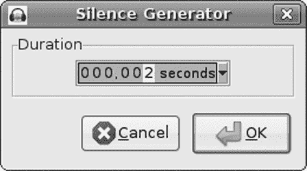
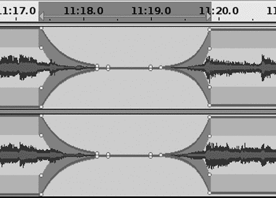
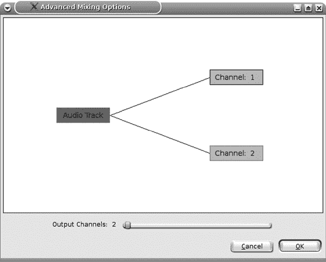
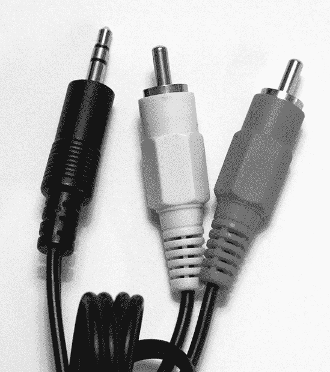

# 第三章。将黑胶唱片（及其他旧式媒体）转移到 CD

保存和欣赏旧录音的一个好方法是将它们从任何旧式媒体——黑胶唱片、磁带、开盘磁带、复古 78 转盘、录像带，甚至八轨磁带——转移到 CD。或者，您可以将它们转移到硬盘、固态硬盘或您偏好的任何数字存储介质上。

将唱片转移到 CD 的需求很大，您甚至可能通过这种方式获得一份不错的副业。许多人仍然保留着他们的唱片收藏，但害怕去欣赏它们，因为黑胶唱片很脆弱。许多优秀的专辑从未在商业 CD 上发行，或者现代 CD 重制做得不好。有些人只是更喜欢他们旧唱片的音质。

虽然您可以复制任何模拟媒体并将其转换为任何数字音频格式，但本章我们将主要讨论将黑胶唱片专辑和单曲转移到 CD。一旦您将旧模拟媒体转换为数字格式，Audacity 就有许多工具可以用来改善音质。您可能无法总是进行完美的修复，但可以将嘶嘶声、点击声、爆裂声和其他缺陷减少到相当可容忍的水平。

您还可以自定义动态范围压缩以满足您的需求，这是一个很好的功能，因为在现代流行 CD 中，动态范围压缩被过度使用，以至于它破坏了音乐。即使他们做得很好，也可能不适合您，所以 Audacity 让您按自己的方式来做。

最后，我们将讨论黑胶唱片与 CD 以及其他媒体的优势，以及如何将您的各种播放设备连接到电脑的细节。如果您需要帮助设置硬件，请先跳转到将旧式设备连接到您的电脑。

对于那些对 16/44.1 CD 不满意的“金耳朵”们，DVD-Audio 格式支持高达 24/196。没错，每秒 196,000 个采样，24 位。DVD-Audio 支持 5.1 环绕声，Audacity 在 1.3.*x*版本中也支持。如果您不感兴趣环绕声，您可以将相当于几个 CD 的音乐以 16/44.1 的格式压缩到一张 DVD 上。我们将在第六章中学习如何制作 DVD-Audio 光盘。

好了，那么让我们深入探讨复制、编辑，然后制作 CD。如果您需要复习 Audacity 的基本使用方法，请查阅第一章。

# 准备黑胶唱片进行复制

首先，尽可能清洁你的黑胶唱片。当然，你可以做很多事情来清理数字音频文件，但那不像电视上的情景，那里的顶尖实验室技术人员可以轻松地完成完美的修复。亲爱的读者们，那只是虚构，我们身处现实世界。最好从尽可能高质量的录音开始；这样工作量更小，而且你得到的结果更好。

我有我那些来自旧时代的 Discwasher 刷子，这很好，因为新的那些质量较差。真正的 Discwasher 刷子有一个定向绒毛——用一种方式清洁唱片，然后在干净的、无绒毛的布上反转你的刷动来清洁刷子。手柄上有一个箭头，指向刷子的前端。你可以干着使用真正的 Discwasher 刷子，或者用它来湿式清洁。用 Discwasher 湿式清洁的正确方法是只将清洁剂涂抹在刷子的前端，其余部分保持干燥。你可以在唱片机上旋转唱片的同时清洁它，但要注意不要施加过多的压力，以免损坏电机。用湿的前端刷子旋转三到四次，然后滚动刷子，让干燥的部分与唱片接触另外三到四次。在播放之前给它足够的时间完全干燥，因为播放湿唱片可能会损坏它。（然而，对于已经处于糟糕状态、无甚可失的唱片，湿着播放可能会让它听起来更好。用蒸馏水或 Discwasher D4 液体小心地湿润它，然后旋转一下。这不会损坏你的唱针。）

对于日常清洁来说，拥有一把碳抗静电刷是个不错的选择。这些刷子总是干着使用，并且很擅长清除灰尘、绒毛和其他试图在你的唱片上安家的颗粒。但它们不适合清洁指纹、粘稠的胶状物或其他需要湿性清洁剂的污渍。

有各种各样的清洁剂、超细纤维布、刷子，甚至湿式高压清洗机。关于如何清洁黑胶唱片的最佳方法的争论是无穷无尽的，声音也很响亮；我将把这个任务留给你，自己做功课，找出你更喜欢的方法。你可以在二手店里以便宜的价格买到一些脏兮兮的、无甚可失的唱片来练习。鉴于关于什么最有效的各种说法，我怀疑黑胶唱片比我们想象的要坚固。

唱片制作的历史

最早的录音是在旋转的蜡质圆柱体上进行的，圆柱体中间有一个针，这个针连接到一个振动的膜片，并附在一个喇叭上，就像一个老式的耳号角。喇叭的功能就像麦克风。针的振动在蜡上切割出不均匀的凹槽。现代单声道录音使用的是同样的原理，即振动的针切割较软的材料，只是这次针是由磁铁驱动的。

当有人实验磁针相对于针尖的角度时，立体声就出现了。他们发现这可以被精确控制到足以切割沟槽的每一侧，从而创建两个立体声通道。即使 CD 和数字音频的出现，生产乙烯基唱片的工艺也在不断改进，一些唱片公司仍在生产高质量的乙烯基录音。有了所有这些进步，录音和播放两个通道仍然是由一个针尖完成的，这导致了一些串扰，因此需要精确调整你的唱盘以获得最佳性能。

### 注意

永远不要在复古 78 转/分钟唱片或任何醋酸或非乙烯基唱片上使用任何类型的酒精，因为这会损坏它们。最早的唱片是由蜡制成的，使用了巴西棕榈蜡、蜂蜡和其他许多不同的蜡质。了解这些的人建议根本不要使用液体清洁剂。如果你有复古唱片，我建议咨询了解如何安全处理它们的专家。含有酒精的溶液适用于现代乙烯基唱片，大多数唱片清洁剂都含有酒精。无论你使用什么清洁剂，都必须是那种不会留下残留物的。

你还应该投资购买一个唱针刷和清洁剂，因为唱针上会积累污垢。这一点不太有争议；我使用 Stanton SC-4 刷和清洁剂，它们的工作效果很好。记住，当你处理唱盘的唱针时，你不可能太小心；只能通过其安装支架轻轻地处理它。永远不要用手指触摸它。

使用唱针量规调整唱针的垂直循迹力。高品质的唱头只需要 0.5 到 3 克。中等品质的唱针，以及为 DJ 设计的唱针，可以达到 5 克。根据你特定硬件的说明设置循迹力。太轻或太重都会造成过多的磨损，所以你真的需要调整得恰到好处。

根据你的唱盘和唱臂，你可能还需要调整防滑、垂直循迹角度和方位角。你的唱盘说明书应该会告诉你这些是什么以及如何调整它们。目的是在不造成不对称磨损的情况下，正确对准接触点。花些时间调整你的唱盘是值得的，你可能会惊讶于微小的调整能带来多大的差异。

# 将唱片转换为 CD 的八步法

首先，让我们列出所有步骤，然后在下一节中详细说明。复古唱片需要一些特殊处理，我们将在复制复古 78 转盘中讨论，在复制复古 78 转盘。如果您不知道如何连接您的唱机，请先访问将旧式设备连接到您的计算机。以下是需要遵循的步骤：

1.  在选择工具栏中将 Audacity 的帧率设置为 CDDA 帧。

1.  将项目速率设置为 32 位浮点/44.1 或 16/44.1。

1.  将您的专辑复制到 Audacity 中，作为一个长轨道。

1.  进行任何修复，例如去除噪音和爆裂声，归一化，压缩和删除不必要的部分。

1.  输入元数据。

1.  将 Audacity 轨道导出为 CD 准备音频文件。

1.  使用您喜欢的 CD 刻录软件将歌曲复制到 CD 上。

1.  将您的新 CD 放入播放器并享受。

最耗时的部分是修复缺陷。本章提供了一些常见修复的技巧，并且第十二章完全致力于修复和清理。

我喜欢将单轨录音的方式与步骤 3 略有不同：我更喜欢将每首单轨录音到其自己的轨道中，使其看起来像图 3-1。

图 3-1。将每首歌曲放入单独的 Audacity 轨道

使用每个轨道上的“跟踪”菜单输入歌曲标题作为轨道名称。在导出时，当所有轨道都导出为 CD 准备文件时，每个文件将采用轨道名称。

使用单个 Audacity 轨道的每个单独的优势在于更容易重新排序它们，并且您可以在一次操作中调整音量级别。当所有歌曲都在一个轨道上时，归一化不会将安静的歌曲提升到与响亮歌曲相同的音量。任何差异都必须逐首歌曲进行纠正。但是当多个轨道归一化时，它们都会在一步之内提升到相同的音量级别。

# Audacity 设置

首先，如图 3-2 所示，在选择工具栏中设置 CD 音频的正确帧率。这确保了您所做的任何分割都将从 CD 帧开始和结束。任何落在这些帧之外的音频将会丢失，并可能产生点击噪音。您可以选择 hh:mm:ss + CDDA 帧（75 fps）或 CDDA 帧（75 fps）。前者显示时间加上 CD 帧，后者仅显示 CD 帧。勾选“吸附到”框以确保停止和开始总是在 CD 帧边界上。

图 3-2. 设置 CD 音频的正确帧率

然后在 **编辑>首选项>质量** 对话框中设置您的质量首选项为采样率为 44,100 Hz 和 32 位浮点数位深。红皮书 CD 音频标准是 16/44.1，但如果您有足够的磁盘空间，以 32 位浮点数工作有许多优点。它提供了最大的动态范围，这意味着更少的噪声和大量的编辑空间，因此您可以进行大量的处理而不会损失质量。

如果您想节省磁盘空间，特别是如果您正在进行最小编辑的直接复制，以 16/44.1 录音是可行的。您进行的操作越多，以 32 位浮点数工作就越好。

当您在首选项菜单中时，也要查看这些选项：

+   在录音选项卡上，取消选中“叠加：录音新曲目时播放其他轨道”和“软件回放：录音或监控新曲目时收听。”

+   在导入/导出选项卡上，选中“导出前显示元数据编辑器。”

+   确保录音通道数设置正确（设备选项卡），这是双声道立体声。即使是老式的单声道黑胶唱片也使用两条轨道。

# 录音

然后点击 **文件 >另存为项目** 并给你的项目命名，启动你的唱机，并设置你的录音电平。你有足够的动态范围，所以给自己留出一些空间以避免削波。使用 32 位浮点数位深意味着您可以记录到 -24 dB 的峰值，并且仍然比您的硬件能使用的动态范围更大；我通常记录到 -9 dB 的峰值，因为唱片不像现场表演那样不可预测。如果它突然出现一个超级响亮的段落让我惊讶，我可以轻松地重新录制它。点击 **视图 >显示削波**，Audacity 将用亮红色的线条突出显示任何削波。

然后点击 **记录** 按钮并开始播放您的唱片。除了在翻到第二面之前放松并享受音乐之外，没有太多的事情要做。点击 **暂停** 按钮在翻唱片时暂停录音。每次您点击 **记录** 时，它都会开始一个新的轨道，所以使用 **暂停** 来保持同一轨道的连续性。如果您不小心按了 **停止**，您可以使用 shift-Record 将其附加到现有轨道上。

记录一些噪声是个好主意，比如在音乐开始之前和音乐停止之后的唱片开头和结尾，这样您可以在之后进行有效的噪声消除。一个没有音乐的纯噪声样本最佳。将其保存在单独的轨道上。

# 修复缺陷

首先进行粗略修剪，删除任何不需要的部分。不要剪得太紧，但要留下一些额外的空间，然后稍后再进行最后的修饰。修剪掉轨道中不需要的部分很容易；只需选择你不需要的部分，然后按删除键，或者点击**剪切**按钮。另一种删除的方法是选择你想要保留的部分，然后点击**修剪**按钮。这会保留你的选择并删除其余部分。

删除轨道的一部分会使它变短，有时你可能不想这样做，而是想保持相同的长度。通过静音而不是删除来实现这一点——选择你想要去除的部分，然后点击**静音**按钮。这会使它变为静音而不是删除它，并且你的轨道长度保持不变。

下一步是修复任何削波或划痕。缺陷只存在于一个通道中是很常见的情况。这更符合黑胶唱片的特点，因为唱针被凹槽推动，所以推动唱针向内的那一侧磨损更严重。磁带也会不均匀磨损，因为一条轨道位于远离磁带边缘的“内侧”。最靠近边缘的轨道会受到磁性、电场和磁带导轨造成的物理损伤的影响最大。

### 注意

*轨道*的定义有点模糊。音频轨道是一个单声道轨道或双声道立体声轨道，或者它是一个长轨道上单首歌曲。

要修复只有一个通道的缺陷，请在轨道面板中使用**分割立体声轨道**命令将你的立体声轨道拆分成两个单独的轨道。然后你可以分别编辑每一个，完成编辑后，你可以使用**制作立体声轨道**将它们重新组合。将它们分开的一个好处是，未损坏的轨道可以掩盖另一个轨道中不太完美的修复。

你知道你可以插入静音吗？如果你需要填充一个轨道并使其变长一点，或者你需要插入一个无声的间隔，首先点击标记你想要插入静音的位置。然后点击**生成 > 静音**，输入你想要多长时间，然后点击**确定**。新的静音部分将被插入到你的标记右侧。图 3-3 展示了如何创建两秒的静音。注意，它包含一个下拉菜单，就像选择工具栏一样，有所有不同类型的值可供使用：秒、小时/分钟/秒、不同的帧率等等。

图 3-3. 插入两秒的静音

## 淡入，淡出

在录音中，淡入和淡出被广泛使用。在图 3-4 中，我删除了一段冗长的无聊掌声，并留下大约三秒的间隔，然后我使用包络工具优雅地淡出至静音，然后再淡入。包络工具为你提供了对淡入淡出和音量级别的很大控制。那些小白点是**控制节点**。通过点击任何位置创建新的节点，将它们拖动到任何方向以提升或降低音量，将它们拖出轨道边界以删除它们。包络工具在几乎所有音频编辑应用中都是标准的。

图 3-4. 使用包络工具淡入至静音，然后返回正常

另一种应用淡入淡出的方法是使用**效果 > 淡出**和**淡入**。选择你想要淡入或淡出的音频部分，点击**效果 > 淡出**或**淡入**，它将自动为你应用一个优雅、均匀的淡入或淡出效果。你只能控制淡入或淡出的长度。

一些 CD 刻录应用会在音频轨道之间自动创建两秒的间隔，所以请注意。你可能不希望在现场表演中的歌曲之间有间隔，或者不希望在 Audacity 中创建的音频中添加间隔。好的 CD 刻录应用允许你控制这种行为。

## 修复扭曲

Audacity 无法修复扭曲的唱片。高质量的唱机比低成本唱机更准确地跟踪扭曲的唱片。许多教程建议通过小心加热唱片以软化它来平整扭曲——在烤箱中、在阳光明媚的窗户旁、在温暖的车辆中——然后将它放入干净的纸套中，并放在重物下面。我尝试过温暖车辆的方法，因为使用烤箱的想法让我感到害怕，而且如果你小心且挑剔地保持一切清洁，有时效果很好。将碎片压入柔软、温暖的乙烯基上不会改善它。

你可以使用 Audacity 减轻扭曲唱片产生的某些不良声音，如点击声、噼啪声和嘶嘶声；请参阅下一节。

## 修复跳音和噼啪声

你可以通过查看波形图来很容易地找到由划痕或扭曲引起的任何跳音或爆音，如图 3-5 所示。它们表现为突然的、细长的峰值。“**效果 > 点击移除**”在批量移除点击而不移除音乐方面相当不错。它寻找波形中典型的由划痕引起的爆音的峰值，删除划痕，然后进行一些插值以重建波形。选择阈值设置决定了判断峰值是否为划痕的灵敏度。较小的选择阈值值更敏感，而较大的值则不太敏感。灵敏度过高意味着你可能想要保留的东西可能会被识别为点击并移除，例如一些打击乐效果。

图 3-5。光标线左侧的区域位于歌曲之间，应该是相对平坦的，但这个例子来自一张有很多小划痕的唱片，所以你看到很多突然的、细长的峰值。

最大峰值宽度值决定了点击移除工具将移除的段的最大长度，以毫秒（ms）为单位。默认值为 20 ms，这比大多数划痕都要长。

选择带有一些划痕的轨道的小段，并尝试一些试错，这得益于点击移除效果的预览按钮而变得迅速。听听预览，如果听起来不对，更改设置并再次尝试。默认设置相当不错，一旦你对设置调整到满意，就可以将其应用到整个轨道上。

### 注意

默认预览长度为三秒。如果太短，请打开**编辑 > 首选项 > 播放 > 预览长度**对话框并使其更长。

你可能想手动修复点击或爆音，特别是如果只有几个的话。这不会花费很长时间。一种方法是选择**效果 > 放大**并将其降低到-50 dB，这将使其静音。另一种方法是使用修复工具，它更为精确。放大直到你可以看到单个样本，选择要操作的段，然后点击**效果 > 修复**。修复工具在最多 128 个样本上操作。就像点击移除工具一样，它使用插值来减少和平滑修复段的边缘，因此不会留下间隙。（图 3-6 显示了修复前后的效果。）

图 3-6. 使用修复工具前后修复一些削波

### 注意

记住缩放工具——你可以放大波形足够大，以便看到单个样本，并给自己留出足够的空间进行精确编辑。当你放大或缩小视图时，点击以在轨道上标记你的位置，缩放工具将自动将视图中心对准你的标记。

## 寻找和修复削波

使用**视图 > 显示削波**快速查找任何削波片段。当你的录音音量超过 0 dB 时，就会发生削波。在数字音频中，削波很糟糕，因为它会导致失真。修复短暂削波片段的一个简单方法是使用放大效果。放大并仔细选择削波片段，然后选择**效果 > 放大**以降低一个或两个等级。放大设置使用负值，例如-3.0。分贝大约是我们能感知的最小变化级别，每 3 分贝将音量翻倍，或者当减少振幅时，将音量级别减半。所以-3 dB 是 0 dB 的一半，-6 dB 是-3 dB 的一半。超过几秒钟的削波段落应该重新录制。

## 噪音消除

即使在最好的系统上，黑胶 LP 唱片也永远不会完全无声。总是有一些背景噪音：嘶嘶声、转盘嗡嗡声、来自静电或压印缺陷的微小刮擦声。打开**效果 > 噪音消除**效果以消除这种不需要的噪音。它并不完美，并且在去除噪音而不对音乐造成太多损害之间总是存在权衡。当你有一个好的噪音配置文件，并且噪音与你想保留的内容明显不同时，效果最好。

首先，你需要建立一个你想要去除的噪音的配置文件，因此选择你轨道上只有噪音的几秒钟，例如在唱针在唱片上移动但不在音乐上时唱片非常开始或结束的地方。噪音样本越长越好，从 5 秒到大约 30 秒。选择你的噪音样本，然后在**效果 > 噪音消除**对话框中，点击**获取噪音配置文件**按钮。接下来，选择你想要应用噪音消除的片段，然后点击**确定**。你可以使用预览按钮确保在点击确定之前它正在正确执行。尽可能精确地应用噪音消除以最小化副作用。嘶嘶声、 wow 和 flutter、嗡嗡声和低级刮擦声都是常见的缺陷，如果你有一个好的干净噪音样本，噪音消除工具效果很好。

如果你不喜欢结果，请按 ctrl-Z 撤销，更改一些设置，然后再次尝试。默认的噪声降低级别是-24 dB，这意味着被识别为噪声的片段会被衰减-24 dB。如果这移除了录音中的太多内容，请降低此值并再次尝试。一种经常有效的方法是回到你的噪声样本，将其幅度降低几 dB，创建一个新的配置文件，然后再次尝试。你不想完全消除噪声，因为这可能会消除你想要保留的东西，只需将其降低到不烦扰的程度即可。

当你将频率平滑和攻击/衰减时间滑块向左移动时，它们会更加激进；而在刻度右侧则不那么激进。频率平滑的值越大，意味着它将更广泛的频率范围视为相同，因此会进行更大的变化。*攻击*是指音符敲击的力度，而*衰减*是指音符消失所需的时间。由于只有一个攻击/衰减时间滑块，攻击和衰减时间将始终相同。较小的值更突然，而较大的值则更平缓。

另一个巧妙的技巧是使用均衡器效果（见第十一章）通过降低 500 Hz 以下和 15,000 Hz 以上的频率幅度来减少嘶嘶声或隆隆声。当然，这也会影响你想要保留的这个范围内的任何声音，所以这并不总是最好的解决方案，但它是一个可以尝试的方法。你可以在包含不需要噪声的任何频率范围内尝试此方法。

限制频率范围的另一种方法是使用*高通*或*低通*滤波器。高通滤波器阻止低频通过，允许高频通过，而低通滤波器则阻止高频。你可能需要安装一些插件来为 Audacity 获取高通和低通滤波器；查看你的效果菜单以了解系统上安装了哪些内容。（第十一章在改变速度中讲述了如何将压缩应用于你的录音。

# 标准化

现在你已经完成了修复，是时候为整个专辑调整音量了。如果你将所有内容复制到一个 Audacity 轨道中，选择整个轨道并应用**效果 > 标准化**。这不会影响动态范围或改变音频质量；它所做的只是提高整体音量水平。将最大振幅设置不超过 0.0，这是数字音频的最大值，并确保“移除任何直流偏移”被勾选。直流偏移指的是平均振幅。如果这不是零，那么标准化将不会正确应用，因为振幅级别将不平衡，甚至可能产生一些失真。当这一步完成后，你就可以继续下一部分了。

如果你将每首歌放入一个单独的 Audacity 轨道中，按 ctrl-A 选择所有轨道，然后应用标准化。然后跳转到导出为 CD 准备好的文件，多个 Audacity 轨道中的导出为 CD 准备好的文件，一个长的 Audacity 轨道。

# 将长轨道分割成单独的歌曲

如果你将所有内容复制到一个长轨道中，你可以将其导出为 16 位 WAV 文件，然后复制到 CD 上。但这样你将没有单独的歌曲；相反，你将得到一条没有歌曲切换方式的完整长轨道。所以，这里是将其分割成单独歌曲的方法。从最开始的地方开始；确保你正好在轨道的开始处，通过按 home 键来实现。然后按 ctrl-B。这将在你的专辑轨道下创建一个新的标签轨道，并且光标将位于一个小文本框内。将第一首歌的名字输入到这个小框中，然后按回车。然后点击你想要在第一首歌和第二首歌之间设置断点的地方，按 ctrl-B，并输入第二首歌的名字。继续这样做，直到所有歌曲都有它们的名称标签（图 3-7）。

图 3-7. 将一条大轨道分割成单独的歌曲轨道并标记它们

# 导出为 CD 准备好的文件，一个长的 Audacity 轨道

如果你已经将所有歌曲复制到一个长的 Audacity 轨道中，这是如何将它们导出为单独的 CD 准备好的音频文件的方法。首先打开**文件 > 打开元数据编辑器**，并输入专辑标题和艺术家名称，以及你想要在轨道元数据中保留的任何其他信息。留空轨道标题和轨道编号字段，因为 Audacity 会为你填写这些信息。

接下来，转到**文件 > 导出多个**并选择导出格式：WAV（微软）签名 16 位 PCM。您将看到一个类似图 3-8 的窗口。我建议导出到单独的目录，不要将导出文件与 Audacity 项目文件混合。选择“根据：标签”拆分文件”和“命名文件：使用标签/曲目名称”单选按钮。只有当您确定要替换同名旧文件时，才勾选“覆盖现有文件”框。点击**确定**，然后继续。

图 3-8。将每首歌曲导出为单独的 CD 就绪音频文件，使用标签名称作为文件名。

如果您像我建议的那样在**编辑 > 首选项 > 导入/导出**对话框中启用了“导出前显示元数据编辑器”，则元数据编辑器将在导出每首歌曲时出现。如果您不需要为每首歌曲审查元数据，可以将其关闭。

# 导出为 CD 就绪文件，多个 Audacity 轨道

如果您将每首歌曲复制到单独的 Audacity 轨道中，这就是您将它们导出为单独的 CD 就绪音频文件的方法。首先打开**文件 > 打开元数据编辑器**并输入所有曲目共有的信息，例如日期、流派或艺术家名称。留空曲目标题和曲目编号字段，因为 Audacity 会为您填写这些信息。

接下来，转到**文件 > 导出多个**并选择导出格式：WAV（微软）签名 16 位 PCM。您将看到一个类似图 3-9 的窗口。我建议使用单独的目录，不要将导出文件与 Audacity 项目文件混合。选择“根据：标签”拆分文件”和“命名文件：使用标签/曲目名称”单选按钮。只有当您确定要替换同名旧文件时，才勾选“覆盖现有文件”框。点击**确定**，然后继续。您将得到每首歌曲单独的文件，您创建的曲目名称将变成文件名。

图 3-9。将每首歌曲导出为单独的 CD 就绪音频文件，使用标签名称作为文件名。

# 将歌曲写入 CD

现在你有一批漂亮的单独的 WAV 文件，每个文件对应一首歌曲。使用你最喜欢的 CD 刻录应用将你的歌曲刻录到 CD 上，然后你就完成了。不要以最大速度刻录，而是将速度减半以确保你得到一张好盘。务必选择“新建音频项目”，或者你特定应用中制作音乐 CD 的任何名称，因为这会创建一个符合 Red Book 音频格式的 CD。不要制作普通的数据 CD，因为那样它将无法在标准 CD 播放器中播放，比如在你的车辆或高保真系统中。标准 CD 播放器无法播放 WAV 文件。（计算机 CD 播放器几乎可以处理任何东西，因为所有操作都是在软件媒体播放器中完成的。）

注意你的歌曲曲目顺序——你的 CD 刻录应用可能会按字母顺序而不是曲目顺序排列你的歌曲。如果你使用的 CD 刻录软件支持按日期排序，这是一个快速排序的方法，因为第一个导出的歌曲总是最老的，最后一个导出的歌曲是最新的。

如果你有一台支持在 CD 和 DVD 上打印的喷墨打印机，你可以购买专门用于打印的 CD 空白。这些 CD 空白有白色或银色的一面，设计用来容纳墨水且不会褪色。另一种新型可打印的 CD/DVD 需要一台特殊的热敏打印机，大约需要 100 美元。第三种可打印的磁盘类型称为*LightScribe*，需要一台特殊的 CD/DVD 刻录机。这些的价格与普通 CD/DVD 刻录机相当，大约 50 美元。

“我需要购买特殊的音频 CD 吗？”

这个经常被问到的问题的答案是：不需要。所有的 CD 都是完全相同类型的。一些国家会对“音频”CD 征收税费，声称这笔税费会支付给音乐家以补偿非法复制造成的收入损失。（如果他们实际上能公平地分得这笔税费的一部分，我会吃掉我最喜欢的黑胶唱片。）它们另一个特殊之处在于一个压印的数据标志，这是序列复制管理系统（SCMS）的一部分，用于控制受保护材料的复制。SCMS 编码控制三种状态：允许复制（00）、单次复制（11）和禁止复制（10）。它不会阻止你复制原始 CD。如果设置了“单次复制”标志，可能会干扰将副本放入连接到你的高保真系统的 CD 刻录机。计算机硬件和媒体不受强制执行 SCMS 的法律的约束。我使用普通的非音频 CD 空白，它们在所有 CD 播放器中都能正常工作。

# 复制复古 78 转唱片

*复古 78 唱片* 78s 是约从 1890 年代到 1950 年代末生产的旧式单声道留声机的简称。这些唱片也被称为*短播放*唱片和*宽纹道*唱片。直到 20 世纪 30 年代初，才真正有了行业标准，因此较老的唱片以 60 到 130 rpm 的速度播放。复古 78 唱片由虫胶混合染料、填料和其他材料制成，尺寸从直径 16 英寸不等。有些是层压的，如果受潮会分离。酒精会溶解虫胶，甚至过多的湿度也会对其造成损害。

演唱机黑胶唱片，无论是单声道还是立体声，转速为 33 1/3 rpm，单曲唱片转速为 45 rpm 或 78 rpm。是的，在很久以前，确实有 78 rpm 的单曲唱片；例如，这些在 20 世纪 60 年代初受到了迪士尼的青睐。您也可能找到一些 45 rpm 的黑胶唱片。这些唱片与复古 78 唱片的主要区别在于，它们是由乙烯基制成而不是虫胶，并且它们是在微纹道而非宽纹道上切割的。粗纹唱片需要 3 毫米的唱针，而微纹唱片使用 1 毫米的唱针。您可以使用现代立体声唱头和唱针播放旧的单声道黑胶唱片和单曲唱片，但不能播放复古唱片。有现代唱头和唱针是为播放这些旧唱片而制作的，例如流行的 Shure M78S。

我不是复古 78 唱片的专家，但如果您需要更多关于正确存储、处理和播放这些老式唱片的资料，网上和现实世界中都有很多优秀的资源。有许多复古留声机唱片专家、爱好者以及交易者，因此找到一些专家指导并不困难。

一旦您整理好所有硬件和安全的处理方法，在 Audacity 中您需要做一些不同的操作。打开**编辑 > 首选项 > 设备**对话框，将录音通道数设置为 1（单声道）。然后转到**编辑 > 首选项 > 导入/导出**，并选择“使用自定义混合”。这样做的原因是将您的单声道轨道混合到两个通道，这样您就可以在立体声系统的两个扬声器上听到音乐。如果您不这样做，您将只从一个扬声器获得回放。图 3-10 显示了 Audacity 的混音面板应该看起来是什么样子：将底部的滑块移动以创建两个输出通道，然后点击“音频轨道”（或您为您的轨道所取的任何名称）和“通道：2”以将它们链接在一起。

图 3-10. 将单声道录音混合到两个通道以在立体声系统上播放

# 将旧式设备连接到您的计算机

有几种方法可以将唱机和其他旧组件连接到电脑。首先让我们谈谈连接器。这些天，“插头、端口、插座”和“插孔”这些术语被随意使用。为了保持清晰和简单，我将把电缆和适配器上的连接器称为“插头”，而它们插入的东西（如放大器上的 RCA 和 TRS 插座）称为“插孔”。此外，为了尊重标准术语，我将根据性别来称呼插头和插孔，即公和母。这对于性别转换器尤为重要，它们是用于从一种连接类型转换到另一种连接类型的适配器。

在过去，每个人都使用 1/4 英寸（6.3 毫米）TRS 插头，生活很简单。然后制造商开始制造 1/8 英寸（3.5 毫米）迷你插孔和插头，以及更小的 3/32 英寸（2.5 毫米）微型迷你插头。你的设备是什么型号的没关系，因为总有适配器可以适应任何情况。实际上，带有迷你插头的设备通常包括 1/4 英寸适配器，你还可以获得适配器，可以将 1/4 英寸插头插入迷你插孔。只需确保你有正确匹配的适配器，无论是单声道还是立体声。单声道 TRS 插头有一个黑色绝缘环，而立体声插头有两个。

RCA 音频插头，幸运的是，它们和以前一样。RCA 插头有彩虹般丰富的颜色，每种颜色都有其含义：红色代表右声道，白色代表左声道或单声道，其他颜色用于不同的环绕声声道。它们都是一样的，所以使用“错误”的颜色也没关系。只有一个尺寸。它们也被称为*唱机*插头。图 2-7 在多声道录音，PCI，USB，FireWire 中展示了一系列 TRS 插孔、适配器、公 RCA 和母 RCA 连接器，以及一个双 RCA 到单立体声插头的适配器。适配器价格低廉，而且你总是需要它们，所以为各种场合准备一个抓包吧。

我最喜欢的将旧媒体数字化方法是连接一个立体声放大器或接收器到模拟-数字/数字-模拟转换器（ADC/DAC），然后它连接到电脑。然后所有连接到放大器的组件——唱机、磁带机、收音机调谐器、录像机、CD、DVD——都可以在 Audacity 中录制。（CD 和 DVD 可以直接在电脑上播放和复制；参见第五章了解如何进行此操作。）

您的电脑上可能已经有一个 ADC/DAC——您的电脑的声卡。如果它有一个线路输入端口，您应该使用它。这些是浅蓝色的 1/8 英寸立体声插头。根据您的功放或接收机，您应该有一对标准 RCA 输出可以连接到您的声卡，通常称为*录音输出*或*线路输出*。翻回到图 2-2 在一个示例工作室中查看我珍爱的旧先锋放大器的背面。

因此，将我的功放连接到内部电脑声卡需要一个两 RCA 到 1/8 英寸立体声迷你插头适配器，如图 3-11 所示。

图 3-11. 由于 1/8 英寸迷你插头的普及，这成为了许多转换工作室的工作马。

在环绕声家庭影院接收机上，请查阅您的手册以确定最佳的录音输出。例如，我有一个 Onkyo 5.1 系统，配有一对 RCA 磁带输出，就像我旧先锋功放一样。您必须使用遥控器选择正确的输出通道，然后它会记录当前播放的内容。

我最喜欢的录音接口是 M-Audio MobilePre USB，它是一种麦克风预放器和 ADC/DAC 的组合。这取代了内部电脑声卡。MobilePre 支持多种不同的连接器，所以我可以使用两 RCA 到 1/8 英寸适配器或两 RCA 到两个 1/4 英寸 TRS 适配器，如图 3-12 所示。

图 3-12. 一个两 RCA 到两个 1/4 英寸 TRS 适配器。注意，Y 适配器（右下角）在将 MobilePre 连接到放大器的录音输出时不需要。当需要为我的录音源使用耳机插孔时，Y 适配器很有用。

## 将唱机连接到您的电脑

除了通过连接到电脑的放大器连接之外，还有几种方法可以将唱机连接到电脑。一种流行的方法是使用 USB 唱机前置放大器，它允许你将任何唱机直接连接到电脑，即使是珍贵的旧唱机。实际上，你可能想寻找一个好的旧唱机而不是现代的，因为没有花费大量金钱很难匹配那些旧唱机的质量。你可以以便宜的价格购买到不错的 USB 唱机前置放大器，例如大约 100 美元的 ART USB Phono Plus V2。它包括增益控制、削波指示器、监控端口、USB 端口、RCA 输入和输出、光端口和 S/PDIF 端口。ADC/DAC 以 16/44.1 和 16/48 运行。它甚至包括唱机接地连接器，这对于有接地线的唱机来说是必不可少的。如果你不接地，你会得到一个讨厌的嗡嗡声。

你需要一个唱机前置放大器，而不仅仅是任何旧的前置放大器，因为唱机前置放大器应用 RIAA 均衡曲线校正。这非常重要。*RIAA 均衡曲线*是衰减黑胶唱片（500 Hz 以下）低频并提升 2,120 Hz 以上频率的行业标准。黑胶唱片必须以这种方式录制，否则低音凹槽将占据大部分专辑，导致播放时间短，高频几乎听不到。当你播放黑胶唱片时，你的集成放大器或接收器通过内置的唱机前置放大器纠正这种不平衡，RIAA 曲线被反转。听起来很尖锐，几乎没有低音，你可以通过关闭你的扬声器并将耳朵靠近唱针在唱片播放时听到这一点。

### 注意

放大器和接收器被称为*集成*的，因为前置放大器是内置的。接受独立前置放大器的放大器和接收器通常仍然具有集成前置放大器。在音频组件的奇怪世界中，你可能会为没有集成前置放大器或收音机调谐器的裸放大器支付更多费用。我见过的最昂贵的立体声放大器有一个完全空白的面板，上面只有一个电源开关、电源 LED 和音量旋钮。

RIAA 均衡曲线从大约 1955 年开始广泛采用，因此那时的唱片可能具有不同的均衡曲线。如果你想自己动手制作手工均衡校正，你可以在 Audacity 中这样做。Audacity 还有许多预制均衡曲线，例如哥伦比亚 LP、AES、德卡和 RCA。使用普通前置放大器而不是唱机前置放大器来获取未校正的信号，将你的专辑复制到 Audacity 中，然后应用你自己的均衡。图 3-13 显示了 Audacity 中的 RIAA 曲线均衡器的外观。

图 3-13。均衡器效果允许您以任何方式精细调整均衡器，并且支持创建自定义预设。

如前所述，将唱盘连接到录音接口的一个好方法是，以通常的方式将唱盘连接到您的立体声接收器或放大器，然后将接收器连接到计算机的录音接口。

另一个可以考虑的选项是购买带有内置唱头放大器的 USB 唱盘。随着越来越多的人想要尝试将他们的专辑转换成 CD，这些唱盘变得越来越受欢迎。这是一个很好的概念和便利性，但其中很多质量并不好，所以请仔细购物。

我的个人唱盘是 Audio-Technica AT-PL120。这不是一个甜蜜的几十年前的唱盘，而是一个带有自身内置唱头放大器的闪亮新直接驱动三速唱盘。没错，33 1/3、45 和 78。它设计成 DJ 唱盘，因此配备了椭圆形唱针，可以正向和反向播放唱片。（恐怖！好像我会对一张完美的黑胶唱片做那样的事情！）它具有可调节的速度、音调、防滑和脚轮调平器，而且重量大、结实，就像一个好的唱盘应该的那样。内部唱头放大器是可切换的，因此您可以将其直接连接到录音接口，或者关闭内部唱头放大器并连接到外部唱头放大器。如果您想播放复古 78 唱片，则需要购买特殊的唱头和唱针，例如 Shure M78S 宽沟单声道唱头。

### 注意

我们优秀的技术顾问 Alvin 指出，电台 DJ 使用直接驱动唱盘，这样他们就可以反向旋转： “您手动调整唱片，以便知道歌曲的开始位置，然后将唱片倒转四分之一圈。当您按下那些唱机上的“播放”按钮时，唱盘在四分之一圈处达到全速。”

图 3-14 展示了我家的个人设置。我既通过 M-Audio MobilePre USB 进行录音，也进行播放。

图 3-14。从右到左：漂亮的旧先锋立体声放大器、Audio Technica 三速唱盘、彩色打印机、M-Audio MobilePre、屏幕、耳机、嵌入回收的 E-Machine 机箱中的三核 CPU

## 连接磁带录音机

磁带播放器可以直接连接到您的电脑。只需将它们的 RCA 输出插头通过适当的适配器连接到您的录音接口。您的录音接口可能已经配备了 RCA 输入。

# 哪个更好：黑胶唱片、磁带还是 CD？

关于哪种介质音质更好，黑胶唱片还是 CD，争论从未停止。我从小就一直是严肃的音乐爱好者，那时还是开盘磁带和黑胶唱片的年代。我的父亲是一位交响乐音乐家和音乐教师，时至今日，我不相信他认可过 18 世纪之后创作的任何音乐。（开个玩笑，爸爸！拥抱！）我认为 CD 是顶级的。

在 CD 出现之前，许多想要保存他们的黑胶唱片的音乐爱好者只会播放一张新黑胶唱片一次，以便将其复制到磁带上。由于它们的质量较差，购买商业录制的磁带是没有用的。他们使用最便宜的磁带，并受到嘶嘶声、狭窄的动态范围和整体糟糕音质的困扰。到 20 世纪 70 年代初，商业录制的开盘磁带基本上从市场上消失了，所以如果你想得到高质量的磁带录音，你必须自己制作。

对于不熟悉磁带和黑胶唱片读者来说，这可能听起来很麻烦，但这两种媒体都存在缺陷，并且没有一个能提供完全令人满意的解决方案。在黑胶唱片上跳过曲目更容易，而且它们比开盘磁带更容易处理，但几乎不可能保持它们干净且无损坏。它们都不存储很多音乐。一张黑胶唱片每面可以容纳 16 到 24 分钟；由于极端的低音震动，现代舞曲黑胶唱片每面只能容纳 12 分钟或更少。不要建议使用转盘换片器——那些是为喜欢损坏唱片的人准备的。一个 1200 英尺、7 英寸的 1/4 英寸磁带开盘，这在家庭录音中很常见，每面以 3.75 英寸每秒（ips）的速度可以存储 64 分钟，以 7.5 ips 的速度可以存储 32 分钟。（相比之下，专业录音是在 15 和 30 ips 的速度下进行的。）它们都不容易携带，而且不能在汽车中播放。

卡带彻底改变了家庭和便携式音频。它们在音质、便携性和成本之间做出了很好的妥协，而且比开盘录音机和黑胶唱片更加坚固耐用。你可以在任何地方停止卡带并从机器中取出它；而开盘录音机则很难做到这一点。家用市场的卡带以 1 7/8 ips 的速度运行，它们的磁带宽度为 0.15 英寸。音质并不等同于黑胶唱片和开盘录音机，但如果你有一个好的录音机和使用高质量的 II 型或 IV 型磁带，音质相当不错。每当我购买一辆新车（对我来说是新车），我做的第一件事就是给它装上一个好的音响系统。我喜欢长途旅行，因为喜欢去各种地方，而一大盒音乐磁带让这些旅行变得更加精彩。卡带有各种尺寸，我喜欢 90 分钟的卡带，因为一张磁带可以放两张黑胶唱片。带有自动倒带的立体声卡带播放器可以提供 180 分钟不间断的音乐。更大的尺寸，如 120 分钟的卡带，太薄太脆弱，不适合使用。较薄的磁带会拉伸；60 分钟的高品质磁带最厚，拉伸最少。

卡带录音机是音乐爱好者的救星。我和我的朋友们喜欢制作和交换混音磁带，因为即使在很久以前，商业广播也相当糟糕，只是反复播放同样的 20 大热门歌曲，广告比音乐多，而且 DJ 们会打断音乐。所以，交换混音磁带是发现新音乐的好方法。另一件酷事是我们可以复制我们想要的任何歌曲，而不用忍受那些困扰许多流行音乐的填充内容。鉴于音乐行业持续未能满足其客户的期望，它竟然还能存活下来，真是令人惊讶。大唱片公司的老板们应该每天感谢那些决心找到解决方案的客户，让他们能够享受商业制作的音乐，而不是完全放弃。

关于卡带的一个小贴士

阿尔文回忆说，磁带制造得非常宽和长：“最外缘和磁带的第一段和最后一段是最差的，用于最低级的音频磁带。更高等级的部分成为高质量音频磁带，最好的部分则成为计算机的数字磁带。正因为如此，你可以使用大多数计算机磁带进行音频，我就是这样做的。已经损坏的大型四分之一英寸盒式磁带（QIC）是出色的开盘录音机。我有一台古老的固态 Ampex 家用音频录音机，大约是 1969 年（晶体管，点对点布线，就像老式真空管一样）。没有降噪，1 7/8 英寸、3 3/4 英寸和 7 1/2 英寸的速度，使用 RadioShack 最便宜的磁带和最慢的速度，它的声音比卡带金属磁带和杜比 C 降噪更好。

卡带也被认为是传播西方流行音乐，尤其是朋克和摇滚音乐，到发展中国家和东欧国家的功臣。

对于卡式磁带，并没有太多的怀旧情绪。它们曾经有过作用，有些人仍然喜欢它们。但现在很难找到好的卡式磁带，因为制造质量已经下降。

磁带和乙烯基都不耐久。磁带是一种磁性介质，因此它可能被杂散的磁场破坏。磁带比乙烯基更不容易积聚灰尘和划痕，但两者都容易受到物理磨损。如果妥善处理和储存，它们可以持续数十年，但令人遗憾的是，你播放和享受它们的次数越多，它们磨损得就越严重。它们不会突然变得无法播放；它们倾向于首先丢失高频，随着时间的推移逐渐减弱，就像洗得太多次的衣物一样。

## 数字优势

黑胶唱片爱好者声称，它听起来更温暖，更真实，动态范围更广、更准确。CD 爱好者则认为，黑胶唱片爱好者怀念的是与播放黑胶唱片相关的所有氛围：唱机的声音、灰尘和划痕带来的表面噪音、翻面以听另一面，以及保持黑胶唱片良好状态所需的所有繁琐。我怀念那些与黑胶唱片一起来的封面艺术、海报和尺寸较大的小册子——你根本无法在小小的 CD 盒子里做太多。但无论你多么小心地保持黑胶唱片清洁、小心地处理它们、保持唱针清洁、保持音臂最佳平衡和跟踪，仅仅通过播放它们，就不可避免地会造成磨损甚至损坏，因为你在用摩氏硬度为 10 的钻石唱针在摩氏硬度为 1 的表面上刮擦。

一些黑胶唱片比其他保存得更好，因为它们的设计更精良。黑胶唱片最初是母带。这些母带被复制到金属或清漆制成的母盘上。刻录唱片是一项妥协的练习。安静的部分不能太安静，否则它们会在噪音中丢失，但如果太响，则沟槽会重叠并产生跳音。更大的音量也会导致播放时间减少，因此工程中的艺术性不亚于音乐本身。不幸的是，并非所有黑胶唱片都是同等质量。随着行业的成熟，对母带录音工程师提出了各种各样的要求，他们经常被告知母带还需要作为卡带的母带，并且为了广播而被破坏。乙烯基本身也变得更薄。换句话说，最低的共同标准显露出了平庸的一面。老黑胶唱片之所以受到喜爱，是因为它们制作得更好。

光盘拥有大部分的技术优势。数字音频最大的优势是复制件与原版相同。这在模拟音频中并不成立，模拟音频每一代都会丢失一些信息。当你得到一个复制件的复制件的复制件时，你就知道它与原版相去甚远。

CD 提供的动态范围高达 96 分贝，而最好的黑胶唱片可能只有 75 分贝，更常见的是 50 分贝左右。因此，CD 提供了更好的信噪比，以及即使是最好的黑胶系统也难以提供的绝对静音，即在静音段落中的绝对静音。诚然，这种绝对静音在很大程度上是理论上的，因为你的音频链中可能某处会创造一些声音——一点嗡嗡声，一点电气干扰——但 CD 本身是绝对静音的。如果设备足够好（这会使你成为一个罕见、富有和精英级的音响爱好者），黑胶在频率范围上胜出——它能够捕捉高达 70 到 75 千赫的频率，那里是蝙蝠飞行的区域。更常见的是，它落在 10 赫兹到 25 千赫的范围内。

在现实世界中，大多数音频硬件的设计上限是 20 到 30 千赫。人耳可以检测到高达 25 千赫的频率，感觉范围是 50 千赫。如果你在 45 千赫的频率上以 115 分贝的声压级播放声音，你会感到疼痛，但不知道为什么。有些人认为非常高的频率仍然以某种方式被感知，并增加了听众的享受。他们可能谈论的是谐波。如果你有一个 100 赫兹的声音，这个声音在 25 赫兹、50 赫兹、200 赫兹等频率上都有谐波。如果你剪掉了谐波，声音在高端听起来可能会有些死板。

我比较了我最喜欢的音乐在 CD 和黑胶唱片上的版本，区别就在于黑胶唱片上的额外噪音。我确实能感觉到交响乐中的差异——CD 上的安静段落没有划痕、嘶嘶声或嗡嗡声的干扰，而响亮的部分则响亮且准确，没有失真。如果你想自己进行比较，确保你拥有那些用技巧和细心录制的黑胶唱片和 CD。其中很多都是垃圾，而现代流行音乐的潮流就是将 CD 上的所有音量都调到最大，而不考虑动态范围、失真、细微差别或平衡。钢琴和风琴非常适合测试你的音频系统质量，因为它们的音色难以准确再现，它们有巨大的动态和频率范围，而且你可以很容易地判断它们是否听起来正确。尝试听一下约翰·塞巴斯蒂安·巴赫的《D 小调托卡塔与赋格》；这涵盖了管风琴的全部范围，那种你在教堂里看到的大管风琴。在某个时刻，低音踏板被长时间按下，你的扬声器可能会出现可见的失真。Pink Floyd 的《月之暗面》中的“Time”练习了左右和真正的中心之间的声音分离。如果你能找到原始的双黑胶唱片而不是一些糟糕的 CD 重制版，Jimi Hendrix 的《Electric Ladyland》是一份令人惊叹的录音室和艺术魔法作品，它将锻炼你的音频系统并回报你仔细聆听。

线路录音

原始的母带“磁带”是在线式录音机上制作的，它们使用钢线作为录音介质。线式录音机在 20 世纪 60 年代之前广泛使用，那时它们被磁带录音机所取代。像 20 世纪 20 年代卡特家族的原始录音这样的老音乐，就是在线式录音机上录制的。钢线会生锈，音质也并不令人兴奋，但它非常耐用。即便如此，大多数那些老录音都已经丢失了。

但不仅仅是这样！*《现场热线：1949 年的伍迪·格思里表演》*赢得了 2008 年的格莱美最佳历史专辑奖。它是从线式录音中恢复的，并被认为是他的唯一一次现场录音。像许多线式录音机一样，这些录音是在一个自制的设备上制作的，这使任何恢复过程都变得复杂。但它们确实被恢复了，现在你可以通过 CD 欣赏到伍迪·格思里的现场表演。

CD 在便利性上胜出。它们坚固耐用，不会因为播放而损坏，你不需要不断麻烦它们，而且它们是便携的。大多数 CD 播放器都有遥控器，你可以按任何顺序播放曲目或随机播放。你可以在 CD 换盘器中加载多个 CD 而不会损坏，并且可以享受数小时的乐趣。

尽管音乐产业试图阻挠我们的公平使用权利和享受音乐的方式，但制作定制混音 CD 和制作我们自己的混音磁带一样容易。而且出于大多数相同的原因：按照我们想要的方式包装音乐，以及发现新艺术家。（第五章讲述了如何制作混音 CD。）然而，我们现在有了两个非常新的选项，而在古时候我们没有这些选项，那就是卫星广播和互联网广播。它们在音质上都不算高，但在多样性和发现新艺术家方面是无与伦比的。商业广播电台比以往任何时候都要糟糕，这我之前不相信是可能的。

CD 在成本上也有优势。一百美元就能买到一个完全令人满意的 CD 播放器。即使在古时候，一个高质量的唱机、唱头和唱针也要花费几百美元，而且价格并没有降低。哦，别忘了防尘罩，它总是价格高昂的附加品。还有唱针跟踪力计、唱头校准工具、特殊清洁配件等等。

CD 播放器

你可以在 CD 播放器上花费很少或很多。理想情况下，你将在购买之前用你自己的音响系统测试它们，特别是如果你在寻找高端型号的话。与所有数字音频一样，数字到模拟转换器的质量决定了它听起来有多好，所以多花点钱可以有所区别。如果你将 CD 播放器连接到具有其自身 DAC（你将看到光或同轴数字输入）的接收器或放大器，这将为你提供两个 DAC 进行尝试。使用数字连接器意味着 CD 播放器将数字信号发送到你的接收器，并且不使用它自己的 DAC。相反，接收器执行转换到模拟。使用你的 CD 播放器的 RCA 连接器意味着你的 CD 播放器将执行转换并发送模拟信号到你的接收器。如果你有一个高端 CD 播放器，你可能不希望你的接收器干扰其输出，所以使用模拟 RCA 连接器。当然，事情并不总是那么简单，因为在一些现代的 A/V 接收器中，集成的预放器不考虑信号是模拟的还是数字的，这很愚蠢，但就是这样。这并不总是有文档记录，所以你可能不得不烦扰你的供应商以了解你有什么。

那么，谁赢了，黑胶唱片还是 CD？简单——你更喜欢哪一个。不要纠结于规格；重要的是音乐和你的享受。

## 寿命

寿命仍然是一个悬而未决的问题。当前数字存储的状态对长期来说并不令人鼓舞，所以你最好计划定期将你的存档转移到新的媒体上。长期数字存储有几个问题：一是物理媒体可能不会超过几年而不退化。二是想想过去 10 年或 20 年中已经出现并消失的封闭、专有文件格式，它们现在已无法读取。三是如果你的媒体幸存下来，文件仍然可读，你将有一个可以读取你的媒体的硬件设备吗？如果有人给你一个 5.25 英寸磁盘、一个 Zip 磁盘、一个 3.5 英寸磁盘或一个超级软盘，你会知道如何处理它吗？目前我们认为 CD、DVD、USB 闪存盘和 3.5 英寸硬盘是理所当然的，但它们都只是几年前的产品，我们不知道未来会怎样。

### 注意

在旧硬盘和软件中可能存在商业机会。阿尔文指出，“对于那些能够从古老媒体转换到当前媒体的人来说，有一个市场。我有一个用于 DC300 磁带的 Viper QIC 磁带驱动器，一个伯努利驱动器，一个 Questech 40MB 驱动器（它是苹果 Macintosh 的宠儿），一个 TEAC 数字音频磁带驱动器（205MB 存储），Zip 和 Jaz 驱动器，250MB 的科罗拉多 QIC，以及其他软盘驱动器。”

商业 CD 是通过压制而不是像家庭制作的 CD 那样烧录的，因此它们的寿命将比大多数家庭烧录的 CD 长，因为它们由更坚固的材料制成，并且有更深的沟槽。CD-R 的寿命将超过 CD-RW；不要将 CD-RW 用于你希望持续一年或两年以上的任何东西。

品牌之间有显著差异。太阳光学工业（Taiyo Yuden）是 CD 和 DVD 空白盘的顶级制造商。Taiyo Yuden 的空白盘以自己的品牌和不同的品牌名称出现，但二级供应商经常更换供应商，因此您不能仅凭名称来判断您将获得什么。真正的 Taiyo Yuden 空白盘仅在日本制造。存在伪造品，因此请在网上搜索如何识别真品的方法。

Verbatim、TDK 和索尼也被认为是好的品牌，尽管它们使用多个供应商。您可以使用 diskDVD Identifier 和 DVDInfo for Windows、DVD Media Inspector for Mac 以及 cdrecord 和 dvd+rw-mediainfo for Linux 在购买后读取光盘 ID。
