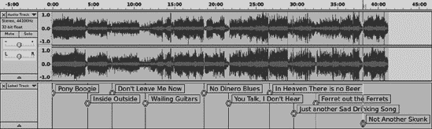
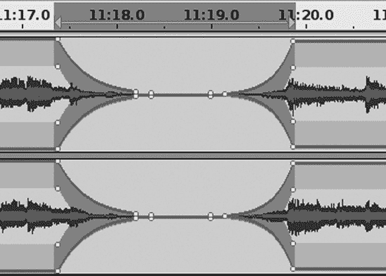
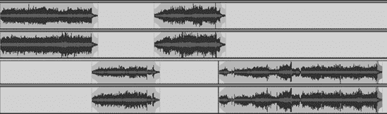
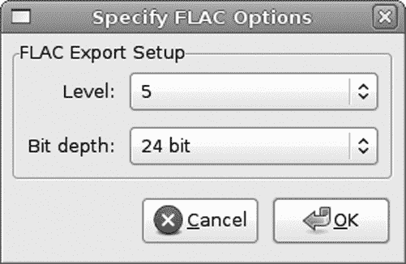
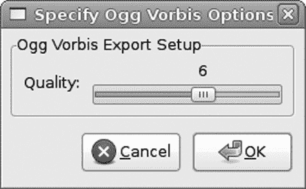
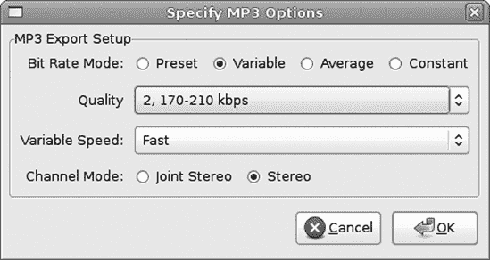

# 第五章。制作混音 CD


你可以制作定制的混音 CD，就像我们过去在旧时代制作定制的混音磁带一样。制作你自己的定制混音光盘有许多原因：制作你自己的歌曲收藏，制作你自己的最佳曲目试听集，组合你最好的现场表演，制作派对光盘，制作你自己的音乐促销 CD，剔除你不需要的歌曲，将几个 CD 或 LP 压缩成更少的磁盘……无论你的原因是什么，使用 Audacity 都很容易做到。

这个新奇的数字时代是最好的：你可以制作完美的原始副本，而且使用电脑编辑文件比在磁带上更快、更容易。创建你自己的定制 CD 是这样的：在 Audacity 中收集你想要使用的音频轨道，进行清理和编辑，编写你的轨道元数据，导出为你的所需格式，刻录到 CD，然后你就完成了。

# 音频 CD

你可以制作两种类型的音频 CD，你选择哪种类型取决于你的播放设备。在所有 CD 播放器上播放的标准 CD 是根据红皮书 CD 音频标准编码的。这就是商业录音 CD 所使用的，这也是你想要用来制作通用播放光盘的。这并不是什么大技术问题，因为你所需要做的只是在你的 CD 刻录程序中选择“创建音频 CD”。你必须始终为红皮书 CD 创建 16/44.1 WAV 文件。

你可以制作的第二种 CD 是根据橙皮书标准编写的，用于在电脑上播放。同样，这也不是什么大技术问题；它只是一个普通的数据 CD，在你的 CD 刻录程序中，你将选择“创建数据 CD”。在这种类型的磁盘上，你可以使用任何你想要的音频文件格式，例如 FLAC 或 24 位 WAV 以获得更高的质量，或者使用有损压缩格式如 Ogg Vorbis 或 MP3 来在磁盘上塞入更多歌曲。你受限于你选择的软件媒体播放器，而如今，几乎所有的软件媒体播放器都支持所有类型的文件。

你应该在 CD 播放器中验证 CD-R 和 CD-RW 的支持情况。CD-RWs 非常适合创建派对和特殊活动的临时收藏，但有些 CD 播放器处理它们并不好。有些甚至处理 CD-R 也不太好，但这种情况现在已经很少见了。一些新的 CD/DVD 播放器支持非红皮书格式，如 MP3、WAV 和 WMA。

### 注意

我们的优秀技术审稿人 Alvin 解释了为什么老式 CD 播放器在读取新光盘时会出现问题。“基于叠氮化物的旧光盘反射率差异很大，播放器的灵敏度被设置为这个大差异。对于 CD-RW 和基于酞菁（银）的光盘，0 和 1（烧录与未烧录）光盘的反射率差异要小得多。”

## 没有特殊的音频 CD

我之前已经说过，现在再说一遍：所有空白光盘都是完全相同的类型；商店里即使看到所谓的特殊音频光盘，实际上并不存在。它们唯一特殊的地方是作为串行复制管理系统（SCMS）一部分的压制数据标志，用于控制复制受保护材料，以及向美国录音工业协会（RIAA）或其在他国的等效机构支付的复制税。SCMS 编码控制三种状态：允许复制（00）、单次复制（11）和禁止复制（10）。如果你尝试使用连接到你的立体声系统的 CD 播放器来复制商业 CD，可能会遇到障碍。但你可以随意复制原始光盘，计算机硬件和媒体不受 SCMS 合规性的约束。

不同品牌之间存在着质量差异，制造光盘使用的材料也不同。太阳公司（Taiyo Yuden）自己制造光盘；它们非常好，并且承诺最长的使用寿命。三井、飞利浦、柯达、Verbatim 和 TDK 都是可靠的。好品牌和不太好的品牌之间的价格差异并不显著。没有必要节省每一分钱，因为使用质量较差的品牌只会产生更多的废盘，这样你实际上并不会省钱。想了解有关 CD 媒体的更多信息，请参阅 Andy McFadden 的 CD-Recordable FAQ（[`www.cdrfaq.org/faq.html`](http://www.cdrfaq.org/faq.html)）。

## 将 MP3 转换为 Red Book CD

常见的问题是“我如何将我的 MP3 复制到任何 CD 播放器都能播放的 CD 上？”它们必须转换为 16/44.1 WAV 文件，然后进行 Red Book 编码。为此，使用 Audacity 将 MP3 转换为 16/44.1 WAV 格式，然后在你的 CD 刻录程序中选择“创建音频 CD”。它不会给你 WAV 质量；它仍然会是低音质的、有损的 MP3 质量。即使文件大小较小，你的光盘上也不会超过 80 分钟的音乐。但你会得到一个标准 CD，可以在任何地方播放。

# CD 刻录机和软件

现在，大多数消费级 CD/DVD 刻录机都相当不错，而且价格并不昂贵，大约 40 到 90 美元。外置 USB 刻录机是便携式的，有些是总线供电的，因此你不需要电源线。

CD 刻录软件到处都是。对于基本的 CD 刻录，你不需要付费，因为有很多免费软件。Windows 内置了 CD/DVD 刻录软件，尽管功能相当有限。Nero 和 Roxio 都相当不错，提供经济版。对于更高级的任务，索尼的 Creative Software CD Architect（仅限 Windows）在不到 100 美元的 CD 母带制作程序中提供了合理的价值，具有诸如交叉淡入淡出、音轨索引、长播放列表预览、抖动、重采样、卡拉 OK 和 DJ 混音等专业功能。

Linux 用户可以从三个优秀的图形开源应用程序中选择：Brasero、Gnome CD Master 和 K3b。它们都是 wodim、cdrdao 以及各种编码器和转换器等强大命令行应用程序的图形前端。当然，它们可以在没有漂亮的图形界面的情况下单独使用。

*无缝刻录*是 DIY 音频圈中常见的问题。这意味着创建一张播放一个长而连续的音轨的 CD，就像现场表演一样，歌曲之间没有间隔。这可以从多个音频文件或单个长 WAV 文件中组合而成。你需要一个支持无缝刻录的 CD 刻录机，现在应该所有 CD/DVD 刻录机都支持。寻找一次会话（SAO）和一次光盘（DAO）的支持。一次音轨（TAO）意味着激光在每个音轨的末尾暂停。SAO 在一次通过中烧录整个会话，没有暂停，并保持 CD 开放以便你可以添加更多音轨，而 DAO 则关闭光盘。使用 SAO 或 DAO 进行音频 CD 的无缝刻录。

对于 CD 刻录软件来说，一个额外的挑战是为一场漫长且不间断的表演创建曲目索引。在 Audacity 中创建一个长的 WAV 音轨，然后在你的 CD 刻录程序中创建 CD 文本和曲目索引，这样你就可以像在多首歌曲的 CD 上一样导航光盘。（你无法在 Audacity 中创建这个。）你应该最终得到两个文件：一个*.bin*文件，其中包含你的音频，以及一个*.cue*或*.toc*文件，其中包含光盘索引。一些 CD 刻录应用程序使用他们自己的奇怪的非标准 cue 表格式；小心这些，因为其他 CD 刻录程序可能无法使用它们，并且它们可能会混淆播放设备。

Roxio、CDRWin、索尼的 Creative Software CD Architect 以及 Steinberg 和 Minnetonka 的高端套件是一些可以为 Windows 用户做这件事的程序。Brasero 和 Gnome CD Master 对 Linux 用户来说做得最好。K3b 可以索引长音轨，但它的界面做这件事相当繁琐。

# 在 Audacity 中制作 CD 汇编的三种方法

在 Audacity 中创建 CD 汇编有几种方法。一种方法是将每首歌曲复制到一个单独的 Audacity 项目中，每首歌曲都在自己的单独音轨上。单独编辑和修复每个音轨，然后对所有音轨进行归一化是一个步骤。给每个音轨起一个自己的名字，这就是你的歌曲标题。这是一个创建典型的音频 CD 的好方法，CD 上有多个歌曲音轨，每首歌曲之间有一个短暂的静音间隔。

另一种方法是将所有歌曲复制到单个立体声 Audacity 音轨中，应用修复和编辑，然后创建一个标签音轨来将它们分成单个歌曲。你可以通过在每首歌之间创建平滑的过渡，并在刻录 CD 时确保歌曲之间没有间隔，来创建看起来像是一个单一长而连续音轨的 CD。

使用前两种方法，你的最终结果是成批的 WAV 文件，每首歌曲一个文件。

第三种方法是将所有歌曲复制到一个单声道 Audacity 轨道中，并应用编辑和修复。将其导出为单个 16/44.1 WAV 文件，然后使用您的 CD 刻录程序创建歌曲标题，并在每首歌曲之间添加两秒的间隔，或者索引轨道以保持其连续性但仍然可导航。

每种方法都有其优点，所以让我们详细看看每一种。

## 每首歌曲一个轨道项目

我喜欢这种方法来创建具有多个歌曲轨道和标准两秒静音间隔的 CD。您可以一次性归一化所有轨道，并单独编辑每个轨道，而不用担心意外更改其他内容。当您的项目中的每首歌曲都在自己的轨道上时，它看起来就像图 5-1。

您的第一步是通过选择**文件** > **另存为项目**来创建一个新的 Audacity 项目。接下来，使用以下设置配置 Audacity 以创建 CD 就绪的 WAV 文件。

在选择工具栏中将帧率设置为 CD 音频，如图图 5-2 所示。这确保了您所做的任何分割都将从 CD 帧开始和结束。任何落在这些帧之外的音频将丢失，并可能产生点击噪音。您可以选择 hh:mm:ss + CDDA 帧（75 fps）或 CDDA 帧（75 fps）。前者显示时间加上 CD 帧，后者仅显示 CD 帧。勾选“吸附到”框以确保停止和开始总是在 CD 帧边界上。将项目速率值设置为 44,100 Hz。


图 5-1. 将每首歌曲放在单独的轨道上


图 5-2. 在选择工具栏中选择 CD 帧率和项目速率

现在打开**编辑** > **首选项** > **录音**对话框，确保“叠加：录制新轨道时播放其他轨道”和“软件回放：录音或监控新轨道时收听”未勾选。

在**编辑** > **首选项** > **设备**对话框中，将通道设置为 2（立体声）。

现在将一些音频文件添加到您的项目中。要添加 WAV、FLAC 或其他格式的音频文件，请选择**文件** > **导入** > **音频**。如果您想从另一个 Audacity 项目复制轨道或剪辑，请在新窗口中打开该项目并复制粘贴。

在轨道菜单中将每个轨道命名为歌曲名称。（在导出时，每个轨道将导出为使用轨道名称作为文件名的单独 WAV 文件。）

接下来，应用编辑和修复。（参见修复和清理中的修复和清理。）我喜欢在每个轨道的开始和结束处放置一秒的静音，并将它们全部归一化到 0 dB。然后，当我构建 CD 级 WAV 集合时，它们都准备好了，不需要在 Audacity 中进行更多处理。

确保你的项目采样率设置仍然是 44,100 Hz。如果你打开或导入的第一个轨道的采样率不同，那么它将成为项目采样率。如果你有混合的采样率，这无关紧要，因为所有内容在导出时都会被重新采样到项目采样率。

在这个阶段，你可以选择通过打开**文件** > **打开元数据编辑器**来输入一些元数据。你可以输入诸如专辑标题、年份、流派和评论等信息。这些信息仅保存在你的 Audacity 项目中，因为 WAV 文件不支持元数据。（其他音频文件格式支持，例如 FLAC、MP3 和 Ogg Theora。）Audacity 将自动填写每个轨道标题、轨道编号以及你在元数据编辑器中输入的所有内容。

如果你想要在导出时查看每首歌曲的元数据，请打开**编辑** > **首选项** > **导入/导出**并勾选“在导出步骤之前显示元数据编辑器”。

现在你已经准备好导出你的轨道以进行 CD 录制。如果你需要复习多轨道导出的方法，请回到最终导出。确保点击**选项**按钮来设置正确的导出格式。

点击**确定**然后**导出**。你将看到每首歌曲的确认信息，完成时将显示摘要，如图 5-3 所示。


图 5-3. 成功的多导出

现在你有一批准备好的 CD 级 WAV 文件。使用你喜欢的 CD 刻录程序创建音频 CD，并确保创建一个音频项目，而不是数据项目。大多数 CD 软件支持 CD 文本和调整歌曲之间的间隔。请注意默认的两秒间隔设置，这将在 Audacity 创建的任何间隔上增加。

## 单个 Audacity 轨道汇编项目

对于这种方法，当你完成编辑并准备好导出时，你的 Audacity 屏幕将看起来像图 5-4。为什么这样做？我认为这样更容易控制歌曲之间的淡入淡出和过渡，而且我喜欢所有内容都在一个轨道中。这是我最喜欢的创建无中断歌曲之间的现场 CD 的方法。


图 5-4。这个汇编包括了来自各种来源的歌曲，所有这些都编织在一个 Audacity 音轨中。

您的第一步，一如既往，是使用**文件** > **另存为**创建一个新的 Audacity 项目。接下来，按照上一节的做法，配置 Audacity 以创建 CD 就绪的 WAV 文件。

在选择工具栏中将帧率设置为 CD 音频，如图图 5-2 所示。这确保您所做的任何分割都将从 CD 帧开始并结束。任何落在这些帧之外的音频都将丢失，并可能产生点击噪音。您可以选择 hh:mm:ss + CDDA 帧（75 fps）或 CDDA 帧（75 fps）。前者显示时间加上 CD 帧，后者仅显示 CD 帧。勾选“对齐到”框以确保停止和开始总是在 CD 帧边界上。将项目速率设置为 44,100 Hz。

现在打开**编辑** > **首选项** > **录音**对话框，确保“叠加：录制新音轨时播放其他音轨”和“软件回放：录制或监控新音轨时收听”没有勾选。

在**编辑** > **首选项** > **设备**对话框中，将通道设置为 2（立体声）。

现在您可以在项目中添加一些音频音轨。如果您想从另一个 Audacity 项目中复制一些音轨，请使用**文件** > **打开**或**文件** > **最近文件**在单独的 Audacity 窗口中打开它，然后复制和粘贴。要添加 WAV、FLAC、Ogg Theora 等音频文件，请选择**文件** > **导入** > **音频**。每个新导入都会在它自己的音轨中打开，因此您必须将其剪切并粘贴到您的汇编音轨中，然后删除多余的音轨。

当您有了所有想要的曲目后，应用编辑和修复（参见修复和清理）。如果您的歌曲音量不同，并且您希望它们都一样，您将不得不使用**效果** > **放大**逐个调整每个曲目。逐个选择每个曲目，然后将它们提升到您想要的峰值幅度，不超过零。

现在创建一个标签音轨。这是每个歌曲获得标题的方式，也是如何将这个长音轨分割成许多单独的歌曲文件。首先按 home 键确保您在非常开始的位置，然后按 ctrl-B 创建标签。输入歌曲标题并按回车键。在第二首歌的开始处点击，创建另一个标签，然后继续，直到您完成所有歌曲的标签(图 5-5).



图 5-5。创建标签音轨

确保在选择工具栏中的项目速率仍然是 44,100 Hz。任何具有不同采样率的剪辑在导出时都会被重新采样到项目速率。

如果你愿意，可以输入一些元数据，但请记住，这些信息仅保存在你的 Audacity 项目中——WAV 文件不支持元数据。要导出你的项目以进行 CD 录制，请参阅最终导出中的最终导出。完成时，你将看到每个歌曲的确认信息以及图 5-3 中的摘要。

## 单个 Audacity 轨道 + CD 刻录程序

这第三种方法需要一个支持 CD 文本、轨道分割和轨道间距控制的优秀 CD 刻录程序。想法是创建一个包含所有歌曲的单个长 Audacity 轨道，并在 Audacity 中进行清理和修复。然后将其导出为单个 16/44.1 WAV 文件，并使用你的 CD 刻录程序来创建歌曲标题，将轨道分割成单个歌曲并调整歌曲间的间隔，或者创建一个索引而不打断轨道。

有许多 CD 刻录应用程序可以做到这一点，例如 Roxio、CDRWin、索尼的 Creative Software CD Architect 以及 Steinberg 和 Minnetonka 为 Windows 用户提供的更高端套件。对于 Linux 用户来说，Brasero 和 Gnome CD Master 是最好的选择。

让我们用 Brasero 来演示如何进行这项操作，因为它拥有最简单的界面。首先，创建你的新音频项目并加载你的音频文件。然后右键点击你的文件并点击**分割文件**。这会打开 Brasero 的分割轨道窗口（图 5-6

图 5-6. 使用 Brasero 分割长轨道

通过拖动播放滑块来快速找到分割点，或者只是放松一下，当合适的断点出现时点击**切片**按钮。

完成后，点击**确定**。这会带到一个类似于图 5-7 的窗口，在那里你可以输入你的轨道标题，然后你可以创建一个可用于任何 CD 刻录应用程序的磁盘镜像和 cue 表，或者直接刻录到光盘。


图 5-7. 输入歌曲标题并准备刻录到光盘，或创建任何 CD 刻录程序都可以使用的.bin 图像和.cue 文件

这个例子创建了一个没有歌曲间隔的长曲目。如果您想插入歌曲间隔怎么办？不用担心：只需右键单击任何曲目以插入两秒的暂停（图 5-8）。


图 5-8. 使用 Brasero 在歌曲之间插入间隔

如果您长曲目是由带有通常静音间隔的歌曲组成的汇编，请尝试选择方法：为每个静音选择分割曲目。然后它会自动分割。

当然，其他 CD 制作应用程序也有自己的方式，但这应该能给您一个基本步骤的概念。

## CD 提示单和 BIN 文件

提示单与*.bin*图像文件一起使用，这些文件包含您的音频，任何 CD 刻录软件都可以使用它来刻录新的 CD。提示单包含光盘的目录表，如下所示，由 Brasero 创建：

```
FILE "/home/alrac/winding-road-1.bin" MOTOROLA
TITLE "Audio disc (26 June 10)"
TRACK 01 AUDIO
      TITLE "Guitar Summit"
      PERFORMER "Winding Road"
      INDEX 01 00:00:00
TRACK 02 AUDIO
      TITLE "Gone Away Again"
      PERFORMER "Winding Road"
      INDEX 01 02:50:24
TRACK 03 AUDIO
      TITLE "Tennessee Waltz"
      PERFORMER "Winding Road"
      INDEX 01 06:45:63
TRACK 04 AUDIO
      TITLE "Montana Two-Step"
      PERFORMER "Winding Road"
      INDEX 01 14:30:72
```

提示单在 CD 和 DVD 上都会使用。如果您喜欢从商业 CD 和 DVD 中抓取，您可能已经了解提示单，因为一些抓取软件可以从 CD 上的目录（TOC）创建它们。您可以自己创建和编辑这些内容，尽管我很懒，更喜欢让一些好的 CD 制作软件为我完成。以下是最常用的字段，包括一些在 Brasero 示例中没有使用的字段：

**表演者**

艺术家或团体

**文件**

对应的磁盘映像文件的名称，包括文件类型。MOTOROLA 是一种二进制文件。其他选项是 BINARY、WAVE、AIFF 和 MP3。

**标题**

光盘标题

**曲目**

轨道号和数据模式，即 AUDIO

**标题**

曲目标题

**索引**

数字 01 标记曲目的开始。时间值是分钟、秒和 CD 帧。 （记住，在 Audacity 中，我们总是在选择工具栏中设置时间参数为 CDDA 帧。）索引值为 00 创建一个隐藏曲目，这可能是您在您自己的某些 CD 上体验过的花招。

**前间隙**

在曲目开始前插入多少秒的静音；例如，00:02:00 是两秒。

**后间隙**

在曲目结束后插入多少秒的静音。

您不必使用提示单。您甚至不必了解任何关于它们的信息。它们只是您 CD 和 DVD 制作工具包中的另一个可选项目，帮助您控制要放入光盘的内容。如果您想了解更多信息，互联网上到处都是各种免费教程。

# 修复和清理

第四章 包含了大量关于清理现场音轨的信息，其中很多也适用于清理汇编 CD。在这里，我们将回顾基本知识，并解释一些其他修复方法，这些方法可能在制作汇编光盘时出现。我们将讨论如何分割立体声音轨以进行更精确的编辑、标准化、调整歌曲之间的间隔以及平滑过渡。参见第十二章 了解更多关于修复和清理的信息，例如噪声消除；动态范围压缩；以及修复点击、爆裂、削波和其他缺陷。第十一章 全部关于应用特殊效果。

## 分割立体声音轨进行手术修复

有时，两个通道立体声音轨中只有一个通道会有缺陷。如果你将其分割成两个音轨，那么你可以只对其中一个通道进行修复，然后将其重新组合。这样做有几个优点：第二个音轨有助于掩盖不太完美的修复，而你应用于缺陷部分的修复可能不会帮助其他通道听起来更好，甚至可能损害音质。

要分割立体声音轨，请转到音轨菜单并点击**分割立体声音轨**。要重新组合音轨，请使用顶部音轨的音轨菜单并点击**制作立体声音轨**。两个音轨必须相邻。

## 标准化

**标准化**，即将所有不同的歌曲提升到相同的音量级别，是 CD 刻录软件中常见的音频编辑任务。但在 Audacity 中，你拥有更多的控制。

在进行标准化之前，你应该检查你的音轨，看看是否有任何异常峰值，这可能表明某种缺陷，例如麦克风碰撞、咳嗽、掉落的东西，或者任何声音太大而不正常的情况。标准化不会改变动态范围，所以一个太响的峰值意味着标准化不会有太大效果，你可能会得到一个整体音量太小的音轨。要降低任何太响的峰值，放大直到你可以精确选择它，然后打开**效果** > **放大**。输入一个负值，如-3 dB，以降低音量。你可以使用预览按钮来帮助调整。当它听起来正确时，点击**确定**，然后继续下一个。

如果你将整个项目放入单个 Audacity 音轨中，你必须仔细选择每首歌并将其提升到所需的最高音量级别。你应该在创建任何淡入淡出之前做这件事。另一种处理方法是使用包络工具，这样你就可以用一个工具修复所有内容。

当每首歌都在自己的单独音轨上时，操作会更简单——选择所有音轨（ctrl-A 或 **编辑** > **全选**），然后点击**效果** > **标准化**。检查“移除任何 CD 偏移”和“标准化最大幅度到”，并输入你的最大音量级别，最高可达 0 dB。

## 制作优雅的淡入淡出和歌曲中断

在 Audacity 中创建歌曲间的中断，带有优雅的淡入淡出，很容易。许多 CD 刻录程序也能做到这一点，但在 Audacity 中你拥有更多的控制。有三个 Audacity 工具我喜欢使用：淡入/淡出效果、包络工具和静音生成器。

淡入/淡出效果快速简单；你所能控制的就是淡入淡出的长度。首先，选择你想要淡入淡出的部分，然后选择**效果** > **淡出**或**效果** > **淡入**。

如果你需要插入一段纯静音，使用选择工具标记你想要静音开始的位置，点击**生成** > **静音**，设置你想要的持续时间，然后点击**确定**。

包络工具让你对淡入淡出的持续时间和程度有更多的控制。图 5-9 展示了它的实际应用，创建了一个大约 2.5 秒的淡出到静音，然后再次淡入。那些小方块是*节点控制点*。通过点击音轨创建这些节点，然后你可以水平或垂直移动它们。要移除一个节点，抓住控制点并将其拖出音轨的边界。包络工具在大多数音频编辑应用中都是标准的。掌握它们需要一点练习，但一旦你弄清楚如何让它们按照你的意愿移动，你就能对淡入淡出和振幅有高度的控制。

你问及交叉淡入淡出如何？交叉淡入淡出是指一个音轨淡出同时另一个音轨淡入，有一定的重叠且没有中断。交叉淡入淡出在音轨和音乐中经常被使用。一些 Audacity 插件用于创建交叉淡入淡出包含在标准附加插件包中，但它们相当有限。我认为使用包络工具更容易且更好。总有一天 Audacity 会拥有一个优秀的交叉淡入淡出工具。同时，图 5-10 展示了我的首选方法。



图 5-9. 使用包络工具和时间移动工具创建淡入和淡出


图 5-10. 使用包络工具创建交叉淡入淡出

这显示了两个 Audacity 立体声轨道。让我们称上面的为 Song1，下面的为 Song2。使用时间移动工具将 Song2 定位到所需的重叠长度；然后使用每个轨道上的包络工具设置淡入淡出的长度和程度。当它正好符合你的要求时，你必须将两个轨道混合成一个单一的立体声轨道。如果你想在项目中创建很多交叉淡入淡出，可以使用两个独立的 Audacity 轨道，如图 5-11 所示。然后你只需要混音一次。



图 5-11. 通过使用时间移动工具和包络工具创建每首歌之间的交叉淡入淡出

点击**轨道** > **混音和渲染**，将你的轨道在 Audacity 项目中混合成一个单一的立体声轨道，替换原始轨道。然后你可以在导出前进行进一步的调整，例如创建标签、进行修复和其他编辑。这将听起来就像 Audacity 中的播放一样，所以当它在 Audacity 中听起来正确时，就可以发布了。通道分配在轨道菜单中控制：左、右和单声道。左是通道 1，右是通道 2，单声道轨道混合到两个通道中。（如果你想让 Audacity 创建一个不替换原始轨道的新立体声轨道，请记住使用 ctrl-shift-M。）

请记住，合并轨道会使它们更响亮，所以点击**视图** > **显示削波**以快速找到任何削波段落。如果混音创建削波，请撤销操作，使用归一化或放大效果（效果菜单）来降低轨道的幅度，然后再次尝试。如果你降低得太低，你总是可以通过使用**效果** > **归一化**或**放大**来提高最终混合轨道的音量。

请参阅第九章以了解更多关于多轨编辑和混音的信息。

# 为橙皮书 CD 配置 Audacity

橙皮书 CD 是普通的数据 CD，没有特殊的音频编码。这些可以在任何电脑上播放，但不能在大多数独立的 CD 播放器中播放，比如你的汽车或立体声音响系统。你可以在这些 CD 上混合不同的音频文件格式，并在 CD 上获得更多的音乐分钟数。

在**编辑** > **首选项** > **设备**对话框中，选择 2 个通道（立体声）。

在**编辑** > **首选项** > **录音**对话框中，取消勾选“覆盖录音：录制新轨道时播放其他轨道”和“软件回放：录音或监控新轨道时监听。”

在选择工具栏中，选择 CDDA 帧（75 fps）并勾选“吸附到”框(图 5-2）。

## 汇编一本橙皮书 CD 收藏集

如果你已经有一批准备复制到 CD 的音频文件，你根本不需要 Audacity。只需打开你的 CD 刻录器，创建一个新的数据 CD 项目。将你的文件复制到 CD 上，如果你想输入 CD 文本，就输入，然后刻录光盘，任务完成。

在 Audacity 中组装 Orange Book CD 项目有几种不同的方法。记住，你的音频文件被视为普通数据文件，因此你可以使用你的媒体播放器支持的任何音频文件格式。如果 CD 将包含所有相同的格式和质量设置，例如所有 FLAC、所有 Ogg Vorbis 或所有 MP3，你可以遵循与 Red Book CD 相同的步骤，即创建一个包含所有歌曲的单一 Audacity 项目。导出为你的所需格式和质量。然后在你的 CD 刻录程序中，选择“创建数据 CD”而不是创建音频 CD。如果你创建了曲目元数据，它将在支持它的 CD 播放器中显示（除了 WAV 文件，它不支持存储元数据）。

你打开的第一个音频文件将设置项目速率。你可以将音频文件重新采样到不同的采样率，但这可能会损害音频质量。上采样不会增加更多质量，只是增加更多位。下采样会丢弃位。一个好的策略是在 Audacity 中不混合文件，而是编辑单个 Audacity 项目中具有相同采样率的文件。导出后，你可以随意混合匹配它们。

你无法在你的 CD 刻录程序中应用标准化或调整曲目之间的间隔，因为它不会将这些文件视为音频文件。在 Audacity 中应用标准化，并确保每首曲目都标准化到相同的水平，如 0 dB 或你喜欢的任何水平。在 Audacity 中按照常规方式调整歌曲之间的间隔，使用淡入淡出和静音。

图 5-12 显示了在 Amarok 中播放 CD 时的元数据外观，Amarok 是一个开源的跨平台媒体播放器。汇编包括 FLAC、WAV 和 MP3 文件的混合，Amarok 可以轻松处理。基本上，任何计算机媒体播放器都应该做同样的事情。FLAC 格式在文件大小为 WAV 的三分之一到一半的情况下提供 WAV 质量，并且支持元数据。


图 5-12. 在 Amarok 中混合 FLAC、MP3 和 WAV CD 汇编

## 文件格式和质量设置

有许多不同的音频文件格式；WAV 和 FLAC 是最高质量的优秀选择，而 Ogg Vorbis 和 MP3 在你需要节省空间时是好的有损压缩格式。

Orange Book CD 支持所有 WAV 文件，因此你可以使用 16 位或 24 位以及你喜欢的任何采样率。

在线音乐服务如 Magnatune、Pristine Classical 和 Grooveshark 提供 FLAC 格式的下载，因为它的质量与 WAV 相当，但文件大小更小。

FLAC 支持从 16 位到 24 位的深度，并拥有九种压缩级别，从 0 到 8 (图 5-13). 默认值为 5，这是一个很好的选择，尽管如果你尝试其他设置，也不会有人介意。不同的设置代表不同的压缩级别，其中 0 是压缩最少，8 是压缩最多。FLAC 是无损格式，因此质量上没有区别，只是文件压缩的程度不同。值 8 相比于 5 需要花费数倍的时间进行编码，但额外的好处并不多。解码最大压缩的 FLAC 文件与解码轻度压缩的文件所需时间相同，因此压缩程度不会影响播放。

Ogg Vorbis 也是一种开放且不受限制的格式。在 Audacity 中有 11 个质量设置，从 0 到 10 (图 5-14). 值 3 大约相当于 128 Kbps 的 MP3，这相当低音质。我认为 6 对音乐来说很好。Ogg Vorbis 在 5 级别及以下使用通道耦合，这意味着两个立体声通道之间的冗余被组合起来以节省带宽，因此你可能会注意到立体声图像的损失。6 级别及以上不使用通道耦合。我认为超过 7 级别没有感知到任何增益，尽管你的耳朵可能会有不同的感受。



图 5-13. FLAC 格式无损且是 Orange Book CD 的绝佳选择。



图 5-14. Ogg Vorbis 是一种高质量的有损、压缩音频格式。

MP3 是一个封闭的、专有的格式，存在专利限制，尽管我没有听说过小规模音乐家因为版税而被起诉。无论如何，没有人会知道你在自己的个人音乐光盘上使用的是什么。

MP3 支持可变和固定比特率。固定比特率最适合网络流媒体。可变比特率的 MP3 对于 Orange Book CD 来说很好，因为它们通常比固定比特率的文件听起来更好。固定比特率意味着整个文件使用相同的固定比特率，即使某些段落需要更多或更少的比特。可变比特率在您选择的范围内运行，根据需要使用更多或更少的比特。对我来说，170 到 210 Kbps 的可变比特率 MP3 听起来和更高比特率的 MP3 一样好，而且比低比特率听起来更好 (图 5-15). 当然，最重要的是你的耳朵感到满意。

# 计算机媒体播放器

软件媒体播放器可以播放你扔给它们的任何音频文件格式。Windows 用户可以尝试使用 Windows Media Player、Winamp 或 VLC。Linux 用户可以从 VLC、Rhythmbox、Mplayer、Songbird、Xmms 或 Amarok 开始。软件媒体播放器有成百上千种，所以你应该能找到你喜欢的一种。



图 5-15.对我来说，170 到 210Kbps 的 MP3 听起来不错，比低比特率更好，和更高比特率一样好。

# 抓取 CD

从你自己的数字音频文件存档中复制粘贴到 Audacity 项目中很容易，但要从 CD 中抓取歌曲怎么办呢？CD 上的音频轨道是使用一种特殊的格式编写的，即 Red Book CD 音频标准，所以你不能直接从 CD 上复制歌曲，而必须使用特殊的数字音频提取器，或称*CD 抓取器*。一些 CD 刻录程序包括抓取器，例如 Nero（Windows 和 Linux）和 K3b（Linux）。所有平台都有大量的独立 CD 抓取器。例如，Windows 用户可以尝试使用 Windows Media Player、Audio Grabber 或出色的 Exact Audio Copy。Exact Audio Copy 有一点点学习曲线，但一旦你为你的系统设置好，它就既快又准确，并且比其他任何一种都能更好地处理损坏的 CD。Linux 用户有，包括许多其他优秀的软件，如 Grip、KAudiocreator 和 VLC 媒体播放器。

CD 抓取器可以直接从 CD 中提取音轨，因此你不需要声卡。这就是制作一个真正的、100%忠实于原始版本的克隆的方法。你也可以通过各种方式截取播放信号并记录下来，例如直接使用其 RCA 连接器将 CD 播放器连接到录音接口，使用立体声放大器的线路或耳机插孔，或者甚至将麦克风放在扬声器前面。但这些技术不会产生完美的副本；它们可能会引入一些缺陷，丢失一些保真度，或者引入一些改变，如不同的高音/低音曲线。这被称为*模拟孔*，这是娱乐行业的人发明的一个愚蠢的怪物，他们似乎对音频技术一无所知。你不需要是音频工程师就能理解，CD 上的数字比特最终命运是转换成我们可以听到的模拟信号，而我们听到的任何东西都可以被记录下来。

人们尝试了不同的策略来“关闭模拟漏洞”，例如引入故意扭曲和信号退化来阻止复制，通过立法削弱音频和视频播放器的功能，将播放与水印绑定，只有带有正确、批准的水印的信号才能播放，以及在设备中设置后门，允许供应商远程关闭它们或以其他方式控制它们。这是一场失败的军备竞赛，因为任何发明都可以被规避，而且顾客不愿意跳过高楼大厦只为听到他们的音乐。

音频 CD 很少受到版权保护，而且已经尝试过的几次都失败了。当发现索尼 BMG 的版权保护秘密安装在 Windows PC 上的 rootkits 违反了多个国家的法律并打开了安全漏洞时，索尼 BMG 相当尴尬。在美国，索尼 BMG 承认它违反了联邦法律，并不得不处理多起民事诉讼。这种所谓的版权保护对除了 Windows PC 以外的任何东西都不起作用，因此 Linux 和 Mac 用户以及独立 CD 播放器和大量 CD 复制机的所有者都没有受到影响。

拷贝器对于从自己的 CD 和即将绝版的商业 CD 中恢复轨道很有用。

### 注意

在这个“知识产权”保护狂热的时代（至少在美国），公平使用原则受到了打击。我不会提供法律建议，因为我没有资格，而且这也会变成一场抱怨。但我确实想提醒大家，忽视版权的另一个极端同样错误，而且不，我们没有权利免费得到一切。一个人在意识到自己正在获取不公平的利益时，并不需要法律天才。

专业的 CD 拷贝器主要针对 MP3 用户群，所以要注意你的文件格式。大多数 CD 和 DVD 拷贝器支持导出到多种不同的音频文件格式，如 Ogg、WAV、FLAC、AAC、WMA 和 MP3。为了获得最佳质量，始终拷贝原生格式，对于 Red Book CD 来说，这始终是 WAV。一旦你拷贝了你的轨道，你就可以像任何其他数字音频文件一样在 Audacity 中编辑它们，并将它们导出为任何你想要的格式。

# 拷贝 DVD

如果你想要从 DVD 中提取音频轨道，那么你需要一个 DVD 拷贝器。一些适用于 Linux 的不错 DVD 拷贝器有 K9copy、K3b、dvd::rip 和 VLC 媒体播放器。HandBrake 和 DVDFab 是不错的 Windows 拷贝器，VLC 也适用于 Windows。先试试 VLC；它是开源的，免费，并且功能最全面。使用 VLC，你可以将 DVD 音频轨道提取并转码成几乎任何格式。再次强调，通过拷贝到原生格式可以获得最佳质量，然后你可以使用 Audacity 将其导出为其他格式，如果你需要这样做的话。
