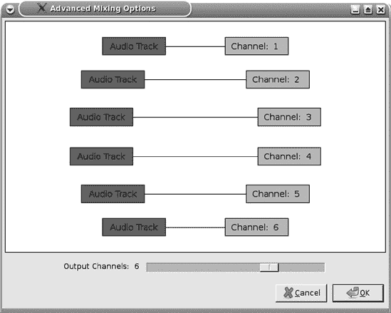
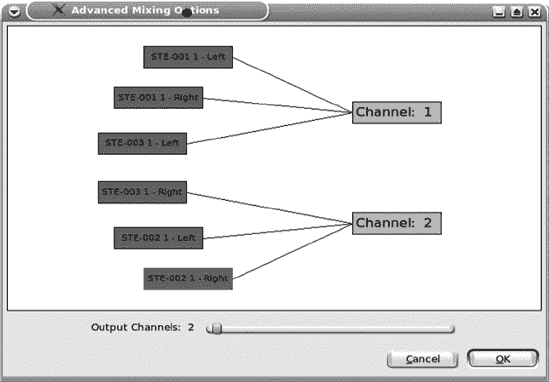

# 第六章。制作超高保真音频 DVD

CD 音频就像黑胶唱片一样，是一种通用的音乐媒介。有大量的播放设备，即使在廉价的 CD 播放器上，音质也非常出色。但是，当您想要比音频 CD 更高的保真度或更大的存储容量时（比如在单个 DVD 上放七张 CD 的内容），您该怎么办呢？

您可能会觉得您被忽视了，因为所有的关注都集中在新的和更好的视频格式上，而唯一得到关注的音频爱好者只是 MP3 消费者。有损格式和低音质耳塞的便携式小设备得到了所有的荣耀，而音频爱好者却只能依赖过时的格式和技术，这些技术和格式多年没有进步。更糟糕的是，不断涌现的无效、敌对的 DRM（代表数字版权管理或数字限制管理——您可以选择）的愚蠢行为，就像白蚁在新房子里一样，侵扰着新的视频和音频播放技术。

幸运的是，对于拥有“金耳朵”的数字音频爱好者来说，有一些选择。在本章中，我们将探讨 DVD 音频。DVD 音频是 DVD 的一种特殊数字音频格式；它与 DVD 电影中使用的音频格式不同。由于它不如 CD 音频得到广泛支持，您将牺牲一些便携性，但许多家用和车载 DVD 播放器都支持它。

CD 音频仅支持双声道 16/44.1 声音。DVD 音频支持非常高的音频分辨率，最高可达 24/192，并支持多达六声道环绕声。从 1.3.3 版本开始，Audacity 也支持这些功能。

如果您不需要超级高保真度，您可以在 DVD 上存储大量音乐。您不需要任何特殊硬件来创建 DVD 音频光盘；您只需要一台普通的计算机 DVD 刻录机和空白 DVD 介质。您确实需要特殊的制作软件来创建正确的 DVD 光盘镜像，并且您必须使用 PCM 类型的音频文件格式，如 FLAC、WAV 和 AIFF。我喜欢 FLAC，因为它是一种开放、高质量的无损压缩格式，创建的文件比 WAV 和 AIFF 小 30%到 50%。

一些 DVD 制作软件的例子包括 DVD-AUDIO Solo Plus（Windows）、Minnetonka Audio Software discWelder（Mac 和 Windows）、Steinberg Wavelab（Windows）和 Linux 的 DVD Audio Tools。有关更多信息，请参阅导出到 16 位中的 DVD 音频制作软件。

### 注意

您可能想回顾第一章和第二章，以刷新使用 Audacity 和录音室基础知识。

# WAV、AIFF 和 FLAC 是什么？

让 iPod 和 Zune 保持它们那些小巧、价格过高的低音质设备，因为还有整个高保真数字音频世界等待探索。正如我们在第三章中讨论的那样，数字音频在许多方面都优于模拟音频。Audacity 对三种高质量的 PCM 音频格式（WAV、AIFF 和 FLAC）提供原生支持。WAV 和 AIFF 几乎是同一件事。

*波形音频格式 (WAV)* 由 IBM 和微软从电子艺界（EA）和 Commodore-Amiga 在 1980 年代中期开发的交换文件格式（IFF）发展而来。IFF 可以携带文本、图像或音频数据，并且原本旨在成为跨不同平台交换不同类型数据的通用包装器。

*音频交换文件格式 (AIFF)* 由苹果公司开发，它也基于 IFF。WAV 和 AIFF 之间有一些小的技术差异，因为它们是为了在不同的操作系统上运行而开发的，但如今它们都得到了大多数软件媒体播放器的良好支持。

*无损音频编解码器 (FLAC)* 是一种高质量的无损压缩格式。它是一个开放且不受限制的标准。像 Magnatune、费城交响乐团在线音乐商店和 Linn Records 这样的在线音乐服务提供 FLAC 格式的下载，因为它的质量与 WAV 相当，但文件大小更小。FLAC 得到良好的支持，并且越来越受欢迎。

FLAC、WAV 和 AIFF 都是线性脉冲编码调制（LPCM）。线性意味着*整数*，我们将在在 Audacity 中创建高质量录音中详细讨论这一点。

这三种格式都是您的工作室主文件和最终输出的优秀选择。您可以制作它们的完美副本以进行存档和备份，并且您可以在有损格式（如 Ogg Vorbis 和 MP3）中生成低分辨率的副本。您的工作流程如下：

1.  源材料，如现场录音或旧媒体副本，在 Audacity 中被转换为高分辨率的主文件。

1.  生成 FLAC、WAV 或 AIFF 格式的播放文件。

1.  使用特殊的制作软件将曲目写入 DVD。

# DVD 音频概述

DVD-Audio 是 DVD 的数字音频格式。它不同于 DVD 电影中使用的音频格式，而是一个仅用于音频的不同格式。DVD 电影使用各种压缩、有损音频格式来节省磁盘空间，即使是在 DVD 上，当结合电影长度的视频和多声道环绕声时，磁盘空间也是宝贵的。DVD-Audio 支持专业录音室母带音频质量，为 24/192。如果您对 CD 音频（16/44.1 立体声）满意，您可以在单个标准 4.7GB DVD 上存储大约七个小时的内容。在 24/192 的情况下，您将在标准 DVD 上获得大约 75 分钟的音频。一些 DVD 制作软件支持写入 8.5GB 双层 DVD，因此您可以真正地堆叠音乐。DVD-Audio 标准还支持静态图片和视频菜单。

### 注意

有时在家烧录的双层 DVD 在不同的播放设备上可能不可靠。请坚持使用高质量的 DVD 空白盘，并确保您的 DVD 播放器支持双层 DVD-R 和 DVD-Audio。您的特定 DVD 刻录机可能与特定品牌的空白盘配合得更好，因此请使用制造商推荐的产品。

DVD-Audio 是一个类似于 WAV 和 AIFF 的 LPCM 格式。它支持 16 位、20 位和 24 位的比特深度，以及高达 192 kHz 的采样率。Audacity 支持 16 位和 24 位的比特深度以及几乎任何您想要的采样率。如果您想要的采样率不在**编辑** > **首选项** > **质量**对话框中，只需在**编辑** > **首选项** > **质量** > **默认采样率** > **其他**中输入自己的值。

DVD-Audio 的理论动态范围为 144 dB，但由于音频硬件的限制，您的最大动态范围始终约为 120 dB。在此上下文中，动态范围并不是指提高音量或用突然的极端峰值冲击听众；极宽动态范围的优势在于为录音和处理提供了大量的余量，并且噪声地板非常低。

DVD-Audio 支持 24 位立体声和环绕声通道组合的多种范围：1.0 单声道和 2.0 立体声，采样率为 44.1 kHz，48 kHz，88.2 kHz，96 kHz，176.4 kHz 和 192 kHz。

这些都支持 44.1 kHz，48 kHz，88.2 kHz 和 96 kHz 的采样率，以 24 位进行采样：

+   2.1 立体声（左，右，低频效果声道）

+   3.0 (左，右，环绕)

+   3.1 (左，右，环绕，低频效果声道)

+   4.0 (左，右，中置，环绕)

+   4.1 (左，右，中置，环绕，低频效果声道)

+   5.0 (左，右，中置，环绕右，环绕左)

+   5.1 (左，右，中置，环绕右，环绕左，低频效果声道)

*低频效果*（LFE）声道需要稍作解释。它通常被认为是低音炮声道，但这并不完全正确。LFE 声道是一个特殊的声道，它携带 3 Hz 到 200 Hz 频率范围内的声音，并且 LFE 信号可以发送到任何能够处理这个频率范围的扬声器。

未压缩的 DVD-Audio 的比特率限制为 9.6Mbps，因此您可以拥有壮丽的 24/192 双声道立体声。但您不会在完全的 24/192 分辨率下获得未压缩的 5.1 环绕声，因为 9.6Mbps 的带宽不足以支持所有这些通道的全分辨率。您能得到的最优解是 5.1 的 24/96。您可以在不同的通道上使用不同的分辨率，例如两个前置通道为 24/96，环绕通道为 16/48。您需要压缩才能为 5.1 提供更高的分辨率，而 DVD-Audio 标准支持的唯一压缩是专有的 Meridian Lossless Packing (MLP)无损压缩。MLP 的许可证费用昂贵，通常超过 2000 美元，并且仅适用于 Windows 和 Mac 的编着软件。

# 在 Audacity 中创建高质量录音

您的起点是您能创建的最高质量的音频文件。这并不一定意味着以最高可能的采样率和比特率进行录音，而是使用良好的录音技术来制作听起来最好的录音。正如我们在第一章和第二章中讨论的那样，许多因素会影响您音频录音的质量：背景噪声、麦克风放置、麦克风的质量、前置放大器、模拟到数字转换器和您计算机的功率。

Audacity 支持高达 32/192 的录音，那么让我们看看使用更高分辨率的优势和劣势。

## 更多功能

您需要一个强大的 CPU 来处理高分辨率录音。我有一台装有 Athlon LE-1620 2.4 GHz 和 4GB RAM 的 PC。这是一颗单核 CPU，在采样率高于 48 kHz 时会变得缓慢。多核 CPU 非常适合音频制作。Audacity 没有设计用来利用多个核心，但您仍然会看到显著的性能提升，因为操作系统会使用那些额外的核心来处理其他任务，从而为 Audacity 释放 CPU 周期。我还有一台配备三核 CPU（AMD Phenom X3）的系统，它可以轻松处理 24/96 的八通道录音（使用 Focusrite Saffire Pro 26 I/O FireWire 录音接口）。

我没有注意到超过 4GB RAM 有任何优势，但内存如此便宜，加载起来也无妨。（参见第十三章和第十四章了解如何调整您的计算机以获得最佳音频性能。）

## 最佳比特深度是多少？

Audacity 文档建议以 32 位浮点录制，然后下采样到您所需的比特深度进行最终导出。因此，即使您的最终产品是 24 位或 16 位，从 32 位浮点开始录制比在 24 位或 16 位整数录制具有更高的质量。即使您的录音接口只支持 16 位，这也是正确的。您总是会下采样，因为没有 32 位播放设备；您必须始终导出为 24 位或更低的整数（也称为*线性*）格式。32 位浮点始终是一个中间步骤，而不是最终结果。

让我们来谈谈 32 位浮点数是什么，因为它被误解得相当严重。整数是整数，而*浮点*意味着浮动的十进制点。32 位浮点数是一个 24 位的尾数加上一个 8 位的指数。32 位浮点意味着极高的精度和非常高的分辨率。在整个模拟到数字转换的范围内，你将获得更平滑、更准确的响应曲线。

比特深度控制动态范围，在音频制作中动态范围非常重要。每个比特等于大约 6 分贝的动态范围。因此，16 位具有 96 分贝的动态范围，24 位是 144 分贝，32 位浮点约为 1,500 分贝；32 位整数是 196 分贝。电子硬件的限制限制了实际动态范围的最大值约为 120 分贝，大多数人不会关心听动态范围大于 50 分贝的音乐，这已经相当多了。那么，拥有非常宽的动态范围有什么意义呢？所有这些动态范围的价值是充足的编辑空间、最低的噪声、更低的削波风险以及无损导出到较低的比特深度。

当您进行大量操作和效果处理时，那额外的八个比特会带来很大的差异。您可以随心所欲地修改您的 32 位文件，完成后制作一个无损的 24 位导出。如果您从一个 24 位文件开始，应用了大量处理，并以 24 位导出结束，您可能会引入一些噪声并经历一些质量损失。

我们这些来自模拟时代的恐龙有一个习惯，就是尽可能地将录音电平推到红线附近，因为这样做有很好的理由。即使是最好的模拟磁带和录音机也会产生一些嘶嘶声，并且动态范围相对较窄，因此我们必须将信号与噪声的界限推到极限以最小化这一点。在模拟音频中，稍微超过红线并没有太大关系，因为这是一个渐进的效果——在+2 或+3 时，失真只会让最挑剔的听众感到烦恼。在+4 或+5 时，你就是一个酷摇滚乐队。在数字音频中，要么全有要么全无——当信号通过 0 dB 时，所有超过零的部分都会被丢弃或削平。你可能会听到可听见的点击声或类似熟悉的模拟失真嗡嗡声。你可以很容易地自己听到。只需插入一个麦克风，提高增益，大声说话。或者使用**生成** > **音调**来创建正弦波，然后使用**效果** > **放大**将其推到零以上。你可以通过选择**查看** > **显示削波**来轻松找到削波段，它会用红色条标记削波部分。

一些文档说明，在 32 位浮点下录音几乎不会有失真，即使你超过 0 dB。但影响任何超过 0 dB 的声音的变量有很多，主要是处理你的声音的软件。不同的 Audacity 插件或你可能使用的任何其他软件将以不同的方式处理超过 0 dB 的声音，所以你仍然可能会遇到削波并产生失真。但因为你有很多动态范围可以消耗，所以没有必要将录音电平推得那么高。

简而言之，16 位、24 位和 32 位深度都提供了比你能够使用的更多动态范围，所以你会有足够的余量。当你以 24 位深度录音时，你可以轻松地丢弃顶部 12 dB。在 16 位时，你可以将峰值设置为-6 或-9 dB 而不用担心。Audacity 的 32 位浮点意味着你可以将峰值记录到-24 dB，这对于现场表演中应对意外的峰值非常有帮助。

当然，在高比特深度和采样率下录音也有缺点。更高的分辨率会消耗更多的磁盘空间，并需要更多的 CPU 功率(表 6-1).

表 6-1. 不同比特深度/采样率组合每分钟立体声所需的磁盘空间

| 比特深度/采样率 | 每分钟立体声所需的磁盘空间 |
| --- | --- |
| 16/44.1 | 10MB |
| 16/48 | 11MB |
| 24/48 | 17MB |
| 24/96 | 33 MB |
| 24/192 | 66MB |

如果你超载了 CPU，你会遇到断点，这听起来很糟糕。如果你喜欢跳音、爆音和模糊音，最好有意地添加它们作为特殊效果。

考虑你正在录制的复杂度。简单的语音录音，如有声书或播客，从超高的分辨率中获益不多。独唱歌手或乐器演奏者或小型乐队可以在 16/44.1kHz 下完美捕捉，而交响乐团会使用你拥有的所有东西。

所以，对于“哪个最好？”这个问题，答案依然是“这取决于”。如果你有足够的计算机功率和存储空间，以 32 位浮点格式以任何采样率进行录音都会给你提供大量的编辑和导出空间。你可以总是向下调整，但无法向上调整。另一方面，如果你小心且技艺高超，你音频链中的所有链接都是高质量的，而且你的耳朵对结果感到满意，那么较低的分辨率也足够好。有趣的是，你可以随心所欲地这样做。

## 什么采样率最好？

既然我们已经彻底讨论了比特深度，那么采样率呢？正如我们在第一章中学到的，采样率决定了频率范围。频率范围大约是采样率的一半。人类最好的听力范围大约是 20 Hz 到 22 kHz，所以 44.1 kHz 的采样率应该覆盖人类听力的范围。更好的音频硬件的上限是 20 到 30 kHz。

但事情并不那么简单。一些研究表明，非常高的频率仍然以某种方式被感知，并增加了听众的享受。他们可能谈论的是谐波。如果你有一个 100 Hz 的声音，那么这个声音在 25 Hz、50 Hz、200 Hz 等频率上都有谐波。当你限制频率范围时，你也限制了谐波。

如果你听力好，对音乐又挑剔，我敢打赌你会更喜欢 24 位而不是 16 位。根据我的经验，比特深度比采样率带来的差异更明显。当我想要最佳质量时，我会以 32 位浮点/48kHz 进行录音，并导出为 24/48kHz。不要提升采样率，因为这只会增加比特数而不增加质量，而且很可能会听起来稍微差一些。

## 保存你的母带

Audacity 项目 (*.aup*) 文件并不完全适合存档，因为每次编辑项目时它们都会改变。它们是快速高效的工作空间。但项目文件已知是脆弱的；如果项目损坏，你只能依靠 Audacity 的自动恢复机制来修复它。如果那失败了，游戏结束。一个存档你的工作室母带的好方法是导出为 WAV 或 FLAC 格式。最高质量是 32 位浮点 WAV。（选择**文件** > **导出** > **选项**。）这样你就不会丢失任何比特，并且始终拥有高质量的母带。FLAC 的最大值是 24 位整数，这仍然有很多比特，而且 FLAC 文件比 WAV 文件小。

多轨录音需要一些注意才能以 WAV 或 FLAC 格式保存，因为 Audacity 的轨道名称和通道映射在导出时会丢失，只保存在您的 Audacity 项目文件中。如果您将大型多轨项目导出为单个文件，您将获得所有轨道，但它们将没有轨道名称。相反，它们都将使用文件名。如果您选择**导出** > **多个**，这将每个轨道导出到单独的文件中，轨道名称将变为文件名。

我保存了 Audacity 项目文件和 32 位浮点 WAV 主文件。保存您的作品在保存您的作品中更详细地介绍了备份的制作。 

## 创建 5.1 环绕

Audacity 1.3.8 及更高版本可以同时录制与您的声卡支持的以及您的计算机可以处理的轨道数量一样多的轨道。较旧的 Audacity 版本一次最多支持 16 个轨道。在**编辑** > **首选项** > **设备**中设置正确的轨道数量。如果您的录音接口支持的声道数量少于您想要录制的数量，您将不得不在多个会话中录制它们（参见第九章“多轨录音”）。

Audacity 1.3.3 及更高版本附带一个简单的多通道混音器界面，用于将您的轨道映射到正确的环绕声道，如图 6-1 所示。请确保底部的滑块设置为正确的输出声道数量。

图 6-1. 简单混音器和通道映射器

如果您打开**编辑** > **首选项** > **导入/导出**对话框并选择“使用自定义混音”，则此混音器会自动出现。不幸的是，Audacity 不会告诉您哪个轨道将映射到哪个声道。因此，请使用此指南，它详细说明了 DVD 音频通道编号约定：

| **通道 1** | 前左 |
| --- | --- |
| **通道 2** | 前右 |
| **通道 3** | 中间 |
| **通道 4** | 低频效果（LFE） |
| **通道 5** | 环绕左 |
| **通道 6** | 环绕右 |

为了避免让您自己发疯，请为您的轨道命名，以便您知道它们是什么（使用轨道菜单），如图 6-2 所示。您可以随意命名它们。

图 6-2. 使用轨道菜单为您的轨道命名有用的名称

然后，你会在混音器中看到音轨名称。然而，在图 6-3 中，两个前声道顺序错误。没问题——只需点击它们，将它们重新映射到正确的声道，并使它们看起来像图 6-4。

图 6-3. 你的音轨名称显示在混音器中。

图 6-4. 修复顺序错误的音轨

如果你想要从多声道项目中获取立体声，怎么办？没问题——只需更改混音器设置。按照图 6-5 中的示例，将六个声道映射到两个立体声声道，首先确保输出滑块设置为两个通道。音轨可以映射到多个声道。

图 6-5. 将六声道离散环绕映射到立体声

## 导出为 16 位

你可能会尝试在从 32 位或 24 位下采样到 16 位时应用一些*dithering*。这可以在**编辑** > **首选项** > **质量** > **高质量转换**下拉菜单中设置。Dither 是有意添加噪声来平滑粗糙边缘，以获得更干净的声音。*Shaped* dither 被认为能给出最佳结果，但它也是最占用 CPU 的。*Triangular*在质量和 CPU 成本之间提供了一个良好的折衷方案，而*rectangular*则轻量级且改动最小。在 24 位文件上不需要 dithering，尽管我不会抱怨如果你想要实验并亲自听一下。

## DVD 音频制作软件

一旦你的 FLAC、WAV 或 AIFF 音频文件都准备好了，可以复制到 DVD 上，你需要的只是普通的空白 DVD，一台普通的计算机 DVD 刻录机，以及特殊的 DVD 音频制作软件。以下是一些示例：

**DVD Audio Tools for Linux**

我所知道的 Linux 只有一个 DVD 音频制作应用程序，那就是 DVD Audio Tools ([`www.dvd-audio.sourceforge.net/`](http://www.dvd-audio.sourceforge.net/))。它既有命令行界面，也有友好的图形界面。它可以在 Linux 和 Windows 上运行，并且是免费软件（根据 GPL 许可）且免费。

DVD Audio Tools 简单且流程化——第一次使用它，你一个小时之内就应该能制作出一个可播放的 DVD。它接受 FLAC 和 WAV 文件。你也可以用它从未加密的 DVD 中“抓取”音频轨道。DVD Audio Tools 只创建磁盘镜像，所以你需要用你通常喜欢的 DVD 刻录应用程序来刻录磁盘。

**DVD-AUDIO Solo Plus**

Cirlinca 的 DVD-AUDIO Solo Plus ([`www.cirlinca.com/products.htm`](http://www.cirlinca.com/products.htm)) 是一款不错的 Windows 程序，支持您想要做的几乎所有事情：它支持多声道环绕声、8.5GB 双层盘、无缝播放和未加密的 CD/DVD 抓取。目前，它的零售价约为 45 美元。Cirlinca 不提供 Meridian Lossless Packing (MLP)许可证。（MLP 是一种用于 DVD-Audio 的无损压缩专利方法。）

**Minnetonka Audio Software discWelder**

discWelder for Windows ([`www.minnetonkaaudio.com/`](http://www.minnetonkaaudio.com/)) 有三个版本：青铜版、铬版和钢版。青铜版售价 99 美元，钢版 595 美元，铬版则需要 2995 美元带您回家。再花上 2000 美元，您就能获得 MLP。青铜版与 DVD-AUDIO Solo Plus 相当。钢版支持 8.5GB 双层盘和幻灯片图形，并让您完全控制混音和映射。按这个价格，Chrome 本应为您做早餐并打扫房子，但它并没有。相反，它增加了对动画图形的支持，让您同时拥有立体声和环绕声流，并支持导出到 DLT 磁带。还有 Mac 版本。

**Steinberg Wavelab**

Steinberg 的 Wavelab 7 ([`www.steinberg.net/en/products/wavelab.html`](http://www.steinberg.net/en/products/wavelab.html)) 有两个版本：Wavelab 7 售价约 500 美元，Wavelab Elements 7 售价约 100 美元。这两个版本都提供了大量音频编辑、母带制作、特殊效果、多声道环绕声和当然还有 DVD-Audio 的功能。

在您花费了所有这些金钱并经历了所有这些麻烦之后，您肯定不想用那些又脏又旧的亲手书写的磁盘标签，对吧？不，您不想，这就是您为什么要花几美元购买一款新的 LightScribe DVD 刻录机。这些刻录机的价格与普通的 DVD 刻录机相同，大约 50 美元或更少，您可以直接在磁盘上烧录花哨的磁盘标签。您必须购买 LightScribe DVD 空白盘，目前这些空白盘的价格略高于普通类型。Linux 和 Windows 都有用于创建标签的软件。

另一个选择是购买可喷墨打印的 DVD 空白盘，然后您就可以制作彩色标签。您需要一个带有特殊 CD/DVD 托盘的喷墨打印机来使用这些空白盘。

一支普通的毛笔也完全可以用来书写您的磁盘标签。

记住，您不想使用粘性纸标签，因为胶水会随着时间的推移损坏磁盘。

# 转移传统媒体

在第三章中，我们学习了如何将旧式模拟媒体转换为数字格式。磁带和黑胶唱片需要跳过一些额外的硬件障碍才能连接一切。CD 和 DVD 更容易，因为你可以用电脑完成所有操作。首先将 CD、DVD 或旧式媒体复制到你的电脑上。复制 CD 和 DVD 的流行术语是*刻录*，这可以通过特殊且容易获得的软件完成。Linux 中一些好的 DVD 刻录器有 K9copy、dvd::rip 和 VLC。你需要*libdvdcss*来刻录加密的 DVD。libdvdcss 在许多 Linux 发行版中可用，应该很容易找到。

HandBrake 是最佳的 Windows DVD 刻录器之一，它甚至有一个仅命令行的 Linux 版本。VLC 也运行在 Windows 上，DVD Fab Platinum 非常好。所有这些都允许你仅选择音频轨道。先尝试 VLC；它是开源的，免费的，并且具有最多的功能。使用 VLC，你可以提取和转码你的 DVD-Audio 轨道到几乎任何格式。

CD 刻录器众多。Linux 用户还可以尝试 K3B、KAudioCreator、Brasero、Asunder、SoundJuicer 和 Grip。Windows 用户还可以尝试 Windows Media Player、Audiograbber 和 Winamp。

将 CD 刻录到硬盘上的良好存档格式是 16 位 FLAC，而对于大多数 DVD-Audio 曲目来说，24 位 FLAC 是合适的。它制作出完美的副本并节省磁盘空间。如果你认为你将要编辑你刻录的曲目，考虑将它们存档为 32 位浮点 WAV 母盘，这样你就可以为未来的编辑留出一些空间。

关于 SACD 有什么说法？

音乐爱好者总是问“关于索尼/飞利浦的超级音频 CD（SACD）怎么样？”SACD 对于家庭或小型工作室来说不是一个选择，因为录音机非常昂贵，而且你必须支付格式许可费和专利费，这真是个遗憾，因为它是一个真正的突破。SACD 以 2.82 MHz 的采样率进行单比特采样。没错，每秒 2.82 百万次。这比标准红皮书 CD 采样率 44.1 kHz 略多。从纸面上看，它比任何其他数字格式更接近模拟波形。SACD 不使用脉冲编码调制（PCM），而是一种称为直接流数字（DSD）的新录音和播放方法。PCM 需要插值和过采样滤波器，而 DSD 采用更直接、更简单的信号路径。SACD 的潜在动态范围约为 100 dB。

看起来，SACD 和 DVD-Audio 的供应商都陷入了 DRM 的荒谬之中，而不是以令人愉悦和吸引人的方式推广这些高质量格式，因此这两种格式在市场上都进展缓慢。我认为它们最终都会逐渐消失。

# 了解更多

请参阅第一章和第二章以了解使用 Audacity 和设置录音室的基础知识，第九章用于多轨录音，以及第十二章用于修复和清理。
