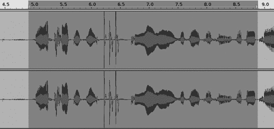
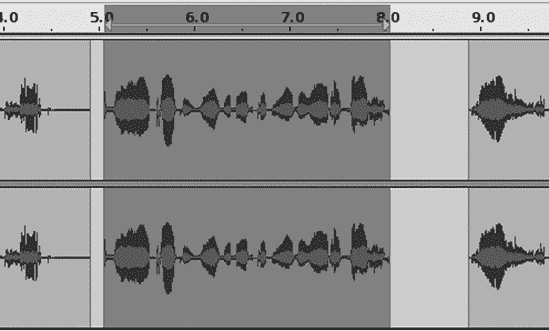
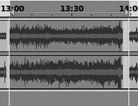
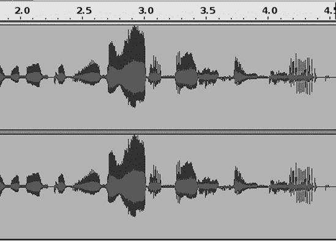
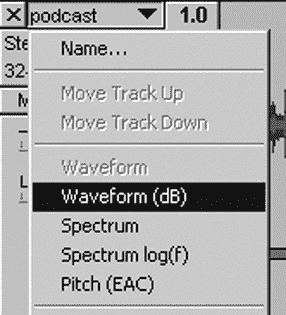
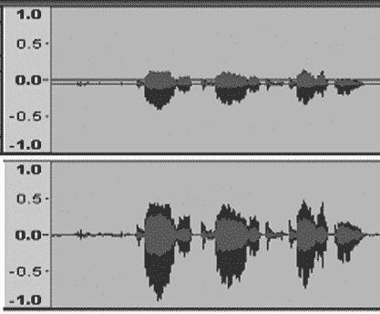
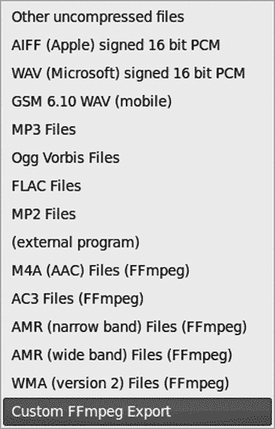
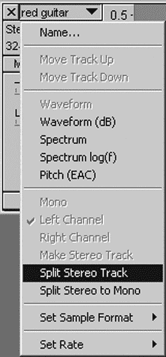
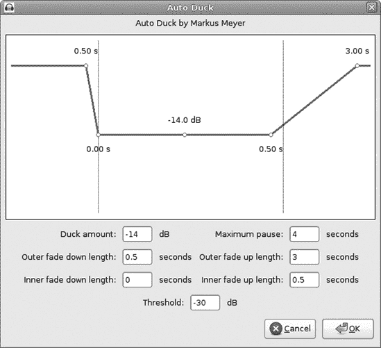

# 第七章。创建播客

多亏了互联网，每个人都在制作播客。现在，任何拥有一点录音设备和互联网连接的人都可以创建音频广播并与世界分享。您可以讲故事、报道新闻、分享教程。您的播客可以是您一个人说话，您采访另一个人，您和合办人，或者您和一群合办人和嘉宾。您可以添加音乐轨道或特殊效果。使用 Audacity 制作播客既简单又有趣。

一旦您创作了您的杰作，您需要一个网站来托管它，并使其对您渴望的观众可用。互联网上充满了免费和低成本的播客托管服务。如果您有足够的带宽，并想成为自己的服务器管理员，您可以通过大量的免费和开源流媒体服务器软件成为自己的托管者。

术语*podcast*曾经指的是为 iPod 下载的 MP3 编码录音。苹果公司曾短暂而猛烈地试图拥有单词*pod*，并对一些敢于使用该词的小企业发起了法律诉讼，例如 TightPod（笔记本电脑保护套）、Profit Pod（自动售货机数据收集器）、Spodradio（德国在线广播电台）和 Podcast Ready（另一家在线广播电台）。幸运的是，攻击律师们似乎已经转向了其他事情，现在可以说“pod”这个词了。所以，这就是我们要做的：豌豆荚、鲸鱼群、外星人。打开舱门，HAL。

Audacity 是制作播客的绝佳工具。您可以使用数字录音机，然后将录音导入 Audacity 进行编辑，或者您可以直接在电脑上录音。连接到上网本的无线电麦克风或耳机可以组成一个出色的轻便便携录音室。或者，您可能喜欢使用整个录音室中的昂贵设备；这完全取决于您。

到目前为止，在这本书中，我一直唠叨着高质量音频，不使用有损，压缩的音频文件格式。在播客中，我们走向了另一个方向：更小的文件大小和有损，压缩的格式。您仍然需要从创建高质量的主文件开始，但不需要像对待终极音响发烧友的音乐录音那样对待您的播客，因为它将被修剪以适应互联网流媒体和快速下载。

您可能需要先回顾第一章和第二章，以了解 Audacity 的基本使用方法和如何设置您的录音设备。

# 短篇小说

制作一个简单的播客只需几个步骤：

1.  进行录音。

1.  在 Audacity 中编辑它：修剪、修复、归一化——常规的清理和修复。

1.  导出为可播放的压缩格式，如 Ogg Vorbis 或 MP3。

1.  将其上传到您的粉丝可以下载和享受播客的网站。

让我们来看看制作优秀播客的细节。

### 注意

当涉及到定义轨道时，音频术语有些混乱。轨道可以是一个单声道轨道，一个立体声轨道，甚至是一个音轨。在 Audacity 中，将轨道视为任何单个可编辑的单位是有帮助的，这可以是任何单声道或立体声轨道。您所做的任何编辑，如删除、添加、特殊效果等，都将同样应用于 Audacity 立体声轨道的左右声道。

# 制作简单的语音播客

最简单的播客只是你在说话。听起来虽然简单，但对着麦克风说话需要一点练习。你可能需要在没有创建不想要的噪音（如拍打声、爆裂声、大声呼吸、咬合声或任何其他不愉快的声音）的情况下练习对着麦克风说话。注意避免口头习惯，如“嗯，啊，你知道。”练习调整你的嘴和麦克风之间的最佳距离，并设置它以便你可以舒适地站立或坐着。使用麦克风支架比手持更好，如果你使用的是领夹式麦克风，请将其夹在衣服不会摩擦到它的地方。我更喜欢高质量的 USB 耳机。对着麦克风说话时，就像你有一个在房间里的观众一样，而不是对着麦克风；这将帮助你使声音充满活力，并以减少不希望产生的副作用的方式投射声音。风屏或泡沫风罩是必不可少的。

你应该以多快的速度说话？这取决于你的个性和材料类型。通常，每分钟 120 个单词被认为是良好的速度，尽管这对大多数英语说话者来说可能感觉较慢。这并不意味着每秒两个单词的速度限制，但意味着放松并使用精心安排的停顿，以便听众有机会吸收你所说的内容。

我使用 Plantronics 立体声 USB 耳机进行语音录音 (图 7-1). 它佩戴舒适，使用方便，音质良好。USB 录音接口有自己的模拟-数字转换器，因此您不需要声卡。它们还可以消除拾取内部计算机噪声的风险，这在内部声卡中有时是一个问题。

图 7-1. 一款好的 USB 耳机是制作语音录音的绝佳工具。

在没有脚本或排练的情况下说话需要大量的练习，所以如果你需要它们，不要感到难过。尽可能制作尽可能干净的录音比清理一个充满糟糕内容的录音要好，你的听众会欣赏清晰、专注的展示。

## Audacity 设置

首先使用 **文件** > **另存为** 创建一个新的 Audacity 项目。

然后在**编辑** > **首选项** > **设备**对话框中设置您的录音和播放设备，并将通道数设置为一次录制的数量。如果您只使用单声道麦克风，则设置一个通道。如果您使用立体声麦克风或耳机，则为两个。小心那些廉价的板载声卡，比如笔记本电脑上使用的那些——即使它们声称是立体声，麦克风输入通常也是单声道的。

在**编辑** > **首选项** > **质量**对话框中，设置默认采样率为 44,100，默认采样格式（实际上是*位深度*；Audacity 有一些术语上的怪癖）为 32 位浮点。（有关位深度和采样率的更多信息，请参阅第一章

图 7-2. 设置录音电平

大多数 USB 耳机都附带 Windows 软件，允许您控制输入和输出音量。Linux 用户可能必须依赖 ALSA（请参阅第十三章

图 7-3. Audacity 混音工具栏

现在，你一直等待的时刻——点击**录音**按钮开始说话！图 7-4 显示了正在进行的语音录音。

点击**暂停**停止录音，点击**录音**将内容附加到现有轨道上。如果你先点击**停止**然后点击**录音**，你将创建一个新的轨道。如果你不小心点击了**停止**，可以使用 shift-Record 从上次停止的地方继续。

## 清理录音

一旦你记录下了你的深刻思考，你可以回过头来清理你的录音。首先，删除你不想保留的内容；在第一次遍历时进行粗略剪辑，并留下一些额外的空间。你总是可以删除更多，但很难轻易恢复。如果你有多个轨道，请注意保持它们同步（尽管如果它们失去了同步，也有简单的方法将它们重新组合在一起）。

然后选择**视图** > **显示剪辑**来用红色突出显示任何被剪辑的片段。如果你发现了一些，有几种方法可以修复它们。

如果是一个非常简短的剪辑，持续时间不到四分之一秒，放大直到你可以精确选择被剪辑的部分并删除它。当它只有几秒钟时，没有人会注意到。

图 7-4. 最后，我们开始录音了！

另一种方法是，在第二个轨道或 Audacity 窗口中重新录制被剪辑的片段到正确的录音水平，然后将其复制到被剪辑的片段上。替换短片段并不容易，所以你可能需要选择一个较长的部分来替换。寻找自然断点，这样你可以优雅地修补新部分，就像图 7-5 中所示。图 7-5 中的选择大约持续了四秒钟，尽管被剪辑的部分（由六秒标记和六秒半标记之间的三个垂直峰值表示）的持续时间不到半秒。

图 7-5. 通过选择在自然断点处替换的片段来制作更平滑的补丁

现在有一个我很喜欢的技巧，因为它帮助我跟踪我在哪里编辑。如果你非常熟悉 Audacity，你知道鼠标的滑动或意外按下快捷键会丢失你的位置，如果是一条长轨道，回到原来的地方会很痛苦。所以，不要删除你的选择，而是使用**编辑**>**拆分删除**。这会将选择替换为一个空隙，就像图 7-6 中所示。这也保持了你的轨道长度不变，如果你有两个或更多轨道需要保持同步，这可能会很有用。

图 7-6. 使用“编辑”>“拆分删除”来留下一个标记删除的间隙

现在你可以继续进行重录。不用担心录音电平与原始项目完全相同，因为使用**效果**>**放大**很容易调整。当它令人满意，没有任何嗝、颠簸或咳嗽时，复制并粘贴到间隙中(图 7-7).边缘可能不会完全匹配，但我们可以修复它。

图 7-7. 将新片段粘贴到删除不良部分时留下的间隙中

有几种方法可以处理新片段两侧的空隙。最简单的方法是删除它们。如果你不想缩短轨道，使用**生成**>**静音**来填充间隙。

另一种方法是使用时间移动工具将所有内容一起移动。当你看到对齐指南出现时，边缘将完全匹配，这是一个黄色垂直线，当边缘完美对齐时出现。点击标记边界连接的地方，然后放大直到你可以使用修复效果来平滑补丁的边缘。这个操作的最大样本大小为 128 个样本，所以放大直到你可以做出如此小的选择。缩放工具以你点击的地方为中心。然后点击**效果**>**修复**，它使用插值来创建无缝连接。

另一个有趣的 Audacity 技巧是使用**效果**>**改变节奏**来减慢补丁的速度而不改变音调。你可以通过选择选择工具栏中的“长度”单选按钮并从补丁的开始到间隙的结束进行选择来测量所需的精确长度。当你正好在边界上时，黄色的对齐指南会出现。图 7-8 中的示例需要 60 秒长。

然后只选择你的补丁，点击**效果** > **更改速度**，并输入新的长度，如图图 7-9 所示。点击**预览**按钮，如果听起来不太奇怪，点击**确定**，你就完成了。

图 7-8。确定你的补丁需要多长时间

图 7-9。使用效果 > 更改速度来拉伸补丁

## 降低过高峰值

你还应该寻找波形中任何不成比例的高峰（图 7-10"))，然后扩大轨道的宽度（用鼠标抓住边框并拖动），直到你看到左边的分贝刻度(图 7-12)。在这个例子中，看起来声音部分可能比 12 分贝还要响亮，所以这给了我一个尝试的起点为-12。记住，Audacity 给你几乎无限的撤销（**编辑** > **撤销**或 ctrl-Z），所以使用试错是安全的。

图 7-10。从 2.7 秒到 3 秒的部分声音太大。

轨道面板中的分贝刻度可以在**编辑** > **首选项** > **界面**对话框中调整，从 0 到-36 到 0 到-145。这让你可以调整显示以适应你的需要。我通常将其保持在-60，因为这给了我足够的细节，同时又不会使刻度太大。

图 7-11。将波形显示更改为波形（dB）

图 7-12。这个选择可能比 12 分贝还要响亮。

## 淡入

有两种控制淡入和淡出的方式。简单的方法是选择您想要淡入或淡出的音轨部分，然后点击 **效果** > **淡入** 或 **淡出**。您所做的只是控制淡入的长度。

为了更精细的控制，请使用包络工具。点击波形以创建控制节点，然后拖动这些节点以使您的音轨的不同部分更响或更轻。将节点拖过音轨边界以删除它们。

## 归一化

当您的音轨都修剪并清理完毕后，最后一步是应用 **效果** > **归一化**。确保归一化对话框中的两个框都勾选了（“移除任何直流偏移”和“归一化最大幅度”）。直流偏移指的是平均幅度；如果这不是零，则归一化将不会正确应用，因为幅度级别将不平衡，甚至可能产生一些失真。图 7-13 显示了直流偏移的示例，在纠正前后。

图 7-13。归一化前（上方）和归一化后（下方）的波形图

# 导出为 MP3 或 Ogg？

现在您的录音已经全部清理完毕，是时候将其导出为压缩有损格式了，无论是 Ogg Vorbis 还是 MP3（MPEG-1 音频层 3，不是 MPEG-3）。（参考第十三章和第十四章了解如何在 Linux 和 Windows 上启用 MP3 支持。）

MP3 是通用的便携式数字音频格式：所有设备都支持 MP3。正如我们在第一章中讨论的那样，Ogg Vorbis 和 MP3 之间存在差异。一些听众声称 Ogg Vorbis 的音质优于 MP3。在低比特率下，对我来说两者听起来都不太好；相反，它们听起来平淡无奇，缺乏特色或深度。在高比特率下，两者听起来都可以接受，尽管我认为 Ogg 提供了更准确、更自然的声音。MP3 的声音听起来有点过于明亮和刺耳。

Ogg Vorbis 支持多声道环绕，而 MP3 只支持一个或两个声道。MP3 受到多个不同国家不同专利持有者的专利限制，最后一个专利将于 2017 年到期。这意味着如果您以 MP3 格式分发您的作品，您会遭到攻击律师的拜访吗？我不知道。似乎许多艺术家将他们的作品作为 MP3 分发，而不支付版税，并且没有遇到麻烦。请咨询在这些问题上专长的律师。

即使你的听众都拥有宽带，保持节俭的态度也是一个好习惯。他们并不都有宽带；美国拨号用户的估计在 25% 到 45% 之间。别忘了互联网是国际性的，所以你的潜在观众包括依赖拨号和低速无线网络的国家。即使是宽带用户，网络拥塞和排队也会影响流媒体，所以结论是流式音频在较低比特率下仍然更可靠。

总是会有权衡。如果你的播客托管商允许，你可以为你的听众提供不同质量级别和流式传输以及可下载文件的收听选项。

## Ogg Vorbis 音质设置

在 Audacity 中导出 Ogg 文件很简单。你可能已经阅读了如何操作的文章，建议使用可变比特率（vbr）而不是固定比特率（cbr）。尽管这是好建议，但这是不必要的，因为 Ogg Vorbis 不支持 cbr。选择 **文件** > **导出** > **保存类型：Ogg Vorbis 文件**，然后点击 **选项** 按钮（图 7-14

图 7-14. 设置 Ogg Vorbis 音质等级

变比特率意味着简单段落将具有较低的比特率，而更复杂的段落将具有较高的比特率。这比固定比特率提供了更好的质量。你将无法精确计算文件大小，但发明 Ogg Vorbis 的那些人并不认为通过比特率来衡量质量很重要。为了提供一个比较的基础，3 的质量设置会导致平均比特率约为 112Kbps，而 Ogg 粉丝声称它比 128Kbps 的 MP3 声音更好。

Ogg Vorbis 使用最高到 5 级的 *有损通道耦合*。左右通道之间的冗余被组合起来以节省空间。这可能会影响立体声图像，所以如果你觉得这很烦人，可以使用 6 或更高的质量设置，因为在这个级别通道耦合被关闭。我使用 6。我的耳朵无法分辨 7 及以上之间的区别。当然，你的耳朵可能会告诉你不同的故事。

对于简单的语音播客，你可以一直降到 0，它仍然听起来可以接受。

## MP3 音质设置

在 Linux 和 Windows 上，你可能需要单独安装 MP3 编码器。使用 LAME MP3 编码器，因为它质量高、免费且开源。Linux 用户可以从他们的常规软件仓库安装它，而 Windows 用户应遵循 Audacity 下载页面上的说明（[`audacity.sourceforge.net/help/faq?s=install&item=lame-mp3`](http://audacity.sourceforge.net/help/faq?s=install&item=lame-mp3)）。

### 注意

Windows 用户应访问 OSSwin 项目([`osswin.sourceforge.net/`](http://osswin.sourceforge.net/))以找到数百个优秀的 Windows 开源应用程序链接。

我不知道音频爱好者是否喜欢为了争论而争论，或者他们只是对一切事物都有强烈的激情，因为 MP3 质量设置是争议的雷区。只需遵循这个简单的规则，你就会没事：我是你的作者，我是对的（除非你的耳朵告诉你不同）。

在 Audacity 中，你可以设置 MP3 比特率的四个类别：预设、可变、平均和恒定。

预设为你提供了 LAME 开发者推荐的四种不同的预制组合：中等、标准、极限和疯狂。标准适合音乐，但你可以降低比特率以进行简单的语音播客。中等、标准和极限都使用*可变比特率(vbr)*。可变比特率意味着比特率根据声音的复杂度而变化，这导致更好的音频质量。在旧时代，可变比特率给 MP3 播放器带来了麻烦，因为它们是为*恒定比特率(cbr)*设计的。但那已经是很久以前的事情了，如今可变比特率不应该带来任何问题。可变比特率总是在一个范围内定义，例如标准预设的 170Kbps 到 210Kbps。

疯狂使用最大的恒定比特率，320Kbps。根据我的经验，标准设置（170Kbps 到 210Kbps）大约是 MP3 可以提供的最佳效果，超过这个范围并不会带来明显的差异。

可变比特率有 10 个质量设置。质量设置 5 是 110Kbps 到 150Kbps，这对于简单的语音播客来说足够了。

平均在我看来，不值得费心。它是可变和恒定比特率之间的折衷。你设置一个恒定比特率，但由于它是平均的，允许有一点波动。所以质量并不完全像可变比特率那样好，但比恒定比特率略好。

恒定比特率应该更适合在互联网上流式传输音频，并且你可以得到一个可预测的文件大小。如果你想要使用恒定比特率，Audacity 为你提供了全范围的选项。

设置可变速度：标准。标准提供更好的质量，编码需要稍微长一点时间。

图 7-15 和图 7-16 显示了 MP3 导出菜单和各种质量设置。

留存通道模式：立体声，因为你必须非常渴望存储空间才会考虑使用联合立体声。如果你非常渴望存储空间，以至于你考虑以 112Kbps 或更低的比特率编码你的 MP3 文件，那么可以尝试一下。*联合立体声*这个术语是一个糟糕的名称，并不能描述它所做的事情。一个普遍的误解是它将两个立体声通道合并并破坏了立体声分离。像音频工程中经常发生的那样，这比那要复杂得多。这里有一个新的音频术语给你：*人类心理声学*。这不是一个疯狂的人拿着大刀的意思，抱歉。它的意思是按照人类耳朵感知声音的方式来处理音频，而不是严格遵循一个数学模型，这个模型并不符合人类听力的实际工作方式。这相当复杂，如果你不喜欢联合立体声的声音，很容易就可以重新做。

图 7-15. Audacity 支持广泛的 MP3 比特率。

图 7-16. Audacity 提供一系列 MP3 质量设置和预设。

联合立体声是什么？在 MPEG-1 音频层 3 标准中，这意味着使用几种技术中的任何一种来降低比特率，同时通过合并左右通道中的冗余来保持可接受的质量水平。这些“冗余”是人类感知为不那么方向性的频率，即高频。这应该会改善低比特率录音的声音，因为牺牲了立体声图像以保留更多的音频数据。

MP3s, 编码器和其他音频格式

LAME 代表“LAME Ain’t an MP3 Encoder”（LAME 不是一个 MP3 编码器）。在其早期，它不是一个编码器；它是一组针对原始 ISO/IEC 演示源代码的补丁，因此（非常严格地）从技术上讲，它不是一个编码器。随着时间的推移，LAME 开发者编写了所有新的代码，直到 LAME 不再需要 ISO 源代码，现在它显然是一个编码器。由于 MP3（MPEG-1 音频层 3）格式周围的专利问题很复杂，已经开发出几种替代格式：Vorbis（开源）、高级音频编码（AAC）和 Windows 媒体音频（WMA）。AAC 和 WMA 都有自己的问题，稍后将会讨论。

没有 MP3 专利持有者曾经追责开源编码器的开发者或个人使用 MP3 进行私人用途。

## 其他有损格式

还有其他一些有损压缩的音频格式，可以生成小文件大小，如 AAC、WMA 和 RealPlayer。Audacity 通过 Linux 和 Windows 上的 FFmpeg 库支持这些格式，并有一些不错的导出预设。你也可以使用你选择的任何外部编码器，你可以在导出对话框中的“另存为类型”下拉菜单中访问它（图 7-17）。

图 7-17. 使用“外部程序”选项使用任何已安装的音频编码器导出。

### 注意

请参阅第十三章和第十四章了解如何安装 FFmpeg 和 MP3。

AAC 最初并不受欢迎，直到苹果将其选为 iTunes Store 及其所有音频设备的默认格式。WMA 是 Windows 媒体格式，而 RealPlayer 则是 . . . 好吧，就是 RealPlayer。AAC、WMA 和 RealPlayer 都是封闭的、专有格式，它们带有各种令人不快的特性，如数字版权管理（DRM）、跟踪软件和专利垃圾。

## 导出您的播客

一旦你决定将播客导出为哪种格式或哪些格式，请选择**文件** > **导出**以进行实际导出。你可以从同一个 Audacity 项目中导出各种类型的文件。请注意，你可以通过选择一部分并然后选择**文件** > **导出选择**来导出轨道的一部分。

# 双人播客

假设你不想成为一个孤独的宣讲隐士，而是想有一个合著者或者想采访另一个人。最简单、最好的方法是每个人都有自己的单声道麦克风，连接到单独的录音通道。这使得编辑和修复变得容易得多。对你的听众要友好，并尽量使两个声音的音量尽可能接近。让你的耳朵成为你的指南，而不是波形，因为即使波形显示两个声音的音量相等，有些人听起来声音更大。（又是那个心理声学的小玩意儿。）

如果你使用的是带有真实立体声麦克风端口的上网本或笔记本电脑，你可以使用一个分线器来插入两个单声道麦克风。

## 将双轨录音作为单声道立体声轨道编辑

当你录制两个通道时，无论你如何设置，Audacity 都会创建一个单声道立体声轨道。图 7-18 显示了这是如何看起来。[注意波形如何表明每个人都有礼貌地轮流发言。]

图 7-18. 使用两个单声道麦克风，一个左一个右，在单个 Audacity 立体声轨道中录音

您可以通过使用全新的混音板来调整左右通道的相对音量，这是 Audacity 1.3.8 版本首次出现（图 7-19）。使用混音板调整轨道的增益或音量级别，并使用平衡滑块调整左右通道的相对音量。这些调整不会改变项目文件；您将在 Audacity 的播放和最终导出中听到变化，但您的 Audacity 项目文件将不会被修改。混音板控件是全有或全无；它们适用于整个轨道，不能仅应用于轨道的某些部分。

图 7-19. 混音板

这相当简单，如果您想要更多控制，可以将您的录音拆分为两个单声道轨道。

## 将双轨道录音作为两个单声道轨道编辑

将您的立体声轨道拆分为两个单声道轨道可以给您带来更多的控制。在轨道菜单中点击下拉箭头，选择**拆分立体声轨道**（图 7-20）。现在您有两个独立的轨道，可以对每个轨道进行所需的任何更改和修复。

图 7-20. 将立体声轨道拆分为两个单声道轨道以便于编辑。

您应该给每个轨道命名（也可以通过使用轨道菜单），这样您就可以始终知道它们是什么。

### 注意

这里有一个关于混音板的技巧：如果您在轨道名称中使用某些词，如*guitar*、*vocals*、*piano*以及一些缩写，图标将与名称匹配。参见自定义混音板以查看关键词的完整列表。

在将立体声轨道拆分为两个单声道轨道后，分别编辑每个轨道，进行常规修复并尽可能匹配两个扬声器的音量。默认情况下，当您按下播放键时，Audacity 会同时播放所有轨道。在混音板上寻找静音和独奏按钮来控制您想要听到的轨道。独奏会自动静音除您想要听到的轨道之外的所有轨道；静音会逐个静音轨道。

如果你们两个人同时说话，你可以通过添加静音来将他们分开。例如，如果他们同时说话有五秒钟的重叠，你可以在一个音轨上添加五秒钟的静音来将他们分开。将光标定位到你想要静音开始的地方，点击**生成** > **静音**，并输入你想要的静音秒数。你可能需要在两个音轨上多次这样做以保持它们对齐，尤其是在做出更改后。

当你清理完一切并准备好导出时，使用上方的音轨菜单重新组合你的音轨，点击**制作立体声音轨**。

# 添加背景音乐音轨

现在你已经精通制作多轨播客，添加音乐音轨就像跌倒一样简单。就像你制作个人播客时一样，即使它是单声道录音，你的音轨也应该是双声道立体声音轨。这样你的听众就会在两个通道中听到音乐。你可以通过复制音轨，将其粘贴在原始音轨下方，并从上方的音轨菜单中选择**制作立体声音轨**来从单声道音轨创建双声道音轨。

你可以通过打开**文件** > **导入** > **音频**对话框或将内容从另一个 Audacity 项目复制粘贴过来，将音乐文件添加到你的播客项目中。

你可以使用增益滑块调整音乐音量。记住，增益滑块不会改变你的项目文件，所以这是一个快速调整混音而不需要做出可能破坏未来编辑的项目的大量更改的方法。另一个选项是使用包络工具来调整它，从愉悦的背景到令人激动的渐强。包络工具会改变项目文件。

管理背景音乐音轨的音量还有一种更酷的方法，那就是使用**效果** > **自动降低音量**。这对于带有背景音乐音轨的录音来说非常完美，因为它会在前景音轨切入时自动降低音量，在前景音轨切出时提高音量。在图 7-21 中我们看到设置：背景音乐音轨在上方，下方音轨是语音音轨。当语音开始时，我希望音乐音量降低，当语音停止时，音乐应该变得更响。音轨的顺序必须是：背景音轨在上方，前景或**控制音轨**在下方。

图 7-21. 使用自动降低音量，你的背景音轨必须在上方，前景或控制音轨在下方。

选择背景音轨，然后点击**效果** > **自动鸭音**。您将看到一个控制面板，类似于图 7-22 中的面板，它显示了我想使用的设置。这些设置创建了一个快速淡出和缓慢淡入的效果。背景音轨快速退出，然后优雅地以微小的重叠与声音音轨缓慢滑回。

图 7-22. 为快速淡出和缓慢淡入推荐的自动鸭音设置

图 7-23 显示了结果。

图 7-23. 已应用自动鸭音；将其与图 7-21 中的音轨进行比较。

鸭音量决定了背景音轨的音量减少量。

最大暂停时间决定了总的淡入和淡出将花费多长时间。外部淡出长度和外部淡入长度的值总和不能超过最大暂停时间。

外部淡出长度设置决定了背景音轨在控制音轨上的声音回来之前会多快地淡出。两条垂直线之外发生的事情是在控制音轨低于阈值时发生的。内部淡出长度设置决定了与控制音轨的重叠程度。

外部淡入长度设置设置当控制音轨上的声音停止时，背景音轨淡回的速度，内部淡入长度设置控制重叠。在声音上轻轻上升半秒的音乐并不多；我认为这使过渡听起来很棒。

阈值设置控制触发自动鸭音效果的音量水平。

当您完成时，您需要将音轨混合并渲染成一个单独的立体声音轨。如果您按下 ctrl-shift-M，这将把您的项目混合成位于原始音轨下方的新的立体声音轨。这是我首选的混音方式，因为它保留了原始音轨，然后我将新的立体声音轨复制到一个新的 Audacity 项目中，进行最后的调整和导出。如果您使用**轨道** > **混合和渲染**，则原始音轨将被新的立体声音轨替换。

有时候，合并多个音轨会使它们声音太大，所以撤销混合和渲染（ctrl-Z 或**编辑** > **撤销**），然后使用增益控件将它们降低一点。然后再次导出。（当您遇到音轨音量问题时，例如不平衡的声音，请检查您的增益滑块。）

现在您的带有背景音乐轨道的播客已经准备好导出了。

访问第十一章了解 Audacity 特殊效果的相关信息，第十二章获取修复和清理的技巧，以及第九章学习更多关于多轨录音和混音的知识。
