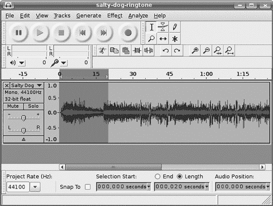
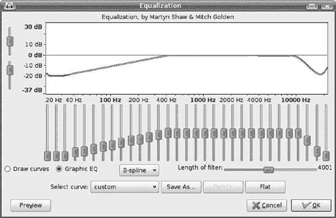
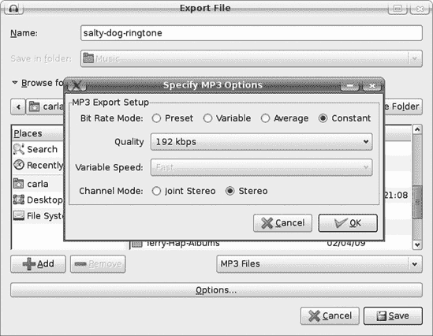
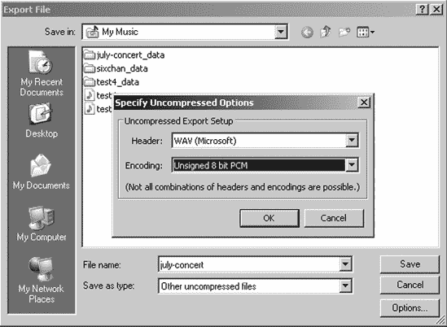
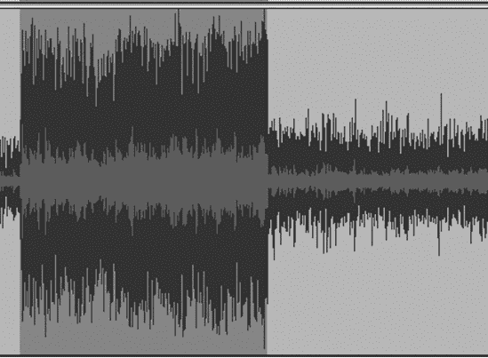
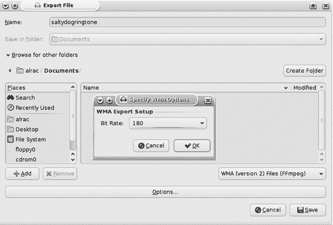

# 第十章. 制作自己的铃声


我是个吝啬鬼，我认为为铃声付钱是愚蠢的。为什么我要付钱，当我已经拥有大量的 CD 和自己的录音音乐时？我甚至不喜欢手机。当我离家时，我不想被电子链束缚。如果我撞进沟里，最终会有人找到我，而且谁能说当我倒挂在扭曲的车辆中时能否接触到电话呢？偶尔不连接一下其实真的没关系。

但幸运的是，对于你们这些优秀的读者来说，这本书不仅仅是我喜欢的内容。手机用户喜欢拥有定制的铃声，并使用他们的手机作为音乐播放器（他们可以在公共场所大声播放这些低音质的扬声器，并让像我这样的坏脾气的人感到烦恼）。大多数移动服务提供商都将向客户收取他们手机上能做的每一件事的费用，包括铃声和文件传输。所以，你可能会对自己说，好吧，我就在网上搜索免费的铃声。小心——大多数所谓的“免费”网站都是付费服务的诱饵，有时还包含恶意软件。有一些合法的在线资源提供免费铃声；其中一些是平庸的业余作品，而有些则很好。在这个狂野的互联网时代，仔细购物并保持警惕。

由于这本书的目的是进行自己的音频制作，制作自己的铃声和适合手机的曲调能有多难呢？一点也不难。制作实际的音频文件很容易。难点在于确定你的手机支持哪些音频文件格式，然后如何将其中的文件传输进去。所以，让我们使用 Audacity 创建适合手机的音频文件，然后探讨不同的文件传输方式。你需要你的手机手册或任何你能找到的相关技术信息。如果你没有手册，请查看手机制造商的网站。

如果你需要复习 Audacity 使用的基础知识，请参阅第一章。

# 为手机定制音频

首先将你想要使用的音频文件导入 Audacity：要么打开一个现有的 Audacity 项目，要么点击**文件** > **导入** > **音频**以使用 WAV、FLAC、MP3、Ogg 或其他音频文件开始一个新的项目。保存为新项目，因为你将进行很多修改。

如果是一个立体声文件，首先使用**轨道** > **立体声到单声道**将其转换为单声道。当然，除非你的手机支持立体声。在**编辑** > **首选项** > **导入/导出**中，确保已勾选“始终将所有轨道混合为立体声或单声道”。

如果你需要创建特定长度的铃声，例如 20 到 30 秒，选择 20 秒或 30 秒的轨道部分来使用。这里有一个精确测量选择长度的技巧：将选择工具定位在剪辑的开始处。转到选择工具栏，选择“长度”单选按钮，确保“吸附到”未勾选，并输入你希望剪辑有多长时间。如果你用鼠标操作不够稳定，可以使用键盘上的箭头键移动光标。图 10-1 展示了如何使用这种方法创建一个精确的 20 秒剪辑。

在剪辑被选中时，选择**编辑** > **修剪**（或按 ctrl-T）来剪除多余的部分。进行任何其他你想要的编辑，例如修复问题、提升音量、应用特殊效果，或任何你想要的。一个不错的技巧是启动 Audacity 的均衡器来缩短音调曲线，因为你的手机扬声器的频率范围有限，这可以在其规格中找到。将音频文件均衡到与手机扬声器频率范围相匹配会使声音听起来更丰满，不那么刺耳。这也使得它在耳机和蓝牙耳机中听起来更好。

例如，假设你的手机扬声器频率范围是 500 到 10,000 Hz。相比之下，人类听觉的全频范围大约是 20 到 22,000 Hz。使用**效果** > **均衡器**将此范围之外的频率降低 24 dB。均衡器有两个控制组；你可以使用图形曲线或类似高保真均衡器的界面。选择“图形均衡器”以显示均衡器（图 10-2)。均衡器滑块的最大范围是 20 dB，而曲线的范围是 120 dB。降低-60 dB 的频率超出了我们能听到的范围，几乎等同于绝对静音。



图 10-1. 使用选择工具栏创建精确时长（例如，20 秒）的剪辑



图 10-2. 图形均衡器视图有用于控制频率的滑块。

在图 10-3 中，我通过点击 500 Hz 以上的线条创建一个控制点，点击 20 Hz 创建另一个控制点，然后将 20 Hz 的控制点向下拖动到-24。然后在另一端从 10,000 Hz 开始做同样的操作。要更改设置，请抓住并移动控制点，您可以在任何方向上移动它们。渐变的曲线听起来比突然的过渡更好。


图 10-3。这里显示了均衡器的绘制曲线视图，展示了一条匹配电话扬声器频率响应的曲线。

您可以垂直和水平放大均衡器窗口；使其变宽可以显示更多的频率刻度。左侧的滑块增加或减少分贝刻度的大小。均衡器没有撤销功能，但如果您无法挽回错误，可以点击“平坦”按钮将其重置为零。通过将控制点拖离图表来移除控制点。

您可以通过超过零来增加振幅，因为这与我们在 Audacity 中录音或播放时使用的零分贝满量程的零不同。它不标记剪辑发生的点。相反，均衡器中超过零的任何内容只是振幅的增加，而低于零的任何内容是振幅的减少。您仍然可能造成剪辑或使声音太响，因此预览按钮可以帮助您。默认情况下，预览按钮将预览剪辑的前三秒。您可以在**编辑** > **首选项** > **播放**对话框中更改此持续时间。

您可以使用“另存为”按钮保存您自定义的铃声均衡器曲线，然后您可以将其应用于所有铃声。

当您处于绘制曲线视图时，“线性频率刻度”复选框将刻度从默认的对数视图更改为线性。当您想更详细地查看低频时，请使用对数视图。

滤波器设置长度控制 Audacity 一次处理多少个样本。默认值为 4,001，大多数情况下应该足够。您可以通过移动鼠标滑块或使用键盘上的箭头键来调整此设置。Audacity 显示一条跟随均衡曲线蓝色线的绿色线是正常的。这显示了 Audacity 实际使用的曲线，它受到均衡算法限制的影响。如果绿色线和蓝色线差异很大，请增加滤波器设置长度或平滑曲线以使过渡更平缓。

当你完成编辑后，你的铃声就准备好导出了，你需要知道你的手机需要什么文件格式和规格。例如，假设你的手机需要 192Kbps 恒定比特率 MP3，采样率为 8,000 Hz。没问题。如果你的项目采样率尚未为 8 kHz，请点击**轨道** > **重采样**将其重采样到正确的速率。然后打开**文件** > **导出** > **MP3 文件** > **选项**对话框。选择比特率模式：恒定和品质：192Kbps (图 10-4)。



图 10-4. 导出到手机所需的 MP3 格式和质量级别

对于支持 WAV 文件的新款手机，要求范围从 8 比特深度 8 kHz 采样率到 16/44.1。如果你需要更改采样率，请在导出之前通过使用**轨道** > **重采样**对话框进行更改。然后使用**文件** > **导出** > **其他未压缩文件** > **WAV**对话框并选择适当的比特深度导出。图 10-5 显示了导出到 8 比特 WAV 的样子。

记住，在导出之前进行重采样，并在导出时设置比特深度。如果你的手机规格指定了比特率，比如 64Kbps，怎么办？比特率总是比特深度乘以采样率乘以通道数，所以 8 比特深度乘以 8 kHz 采样率乘以 1 个通道等于 64Kbps 的比特率。然而，理想情况下，你的手机说明书不会让你做数学题，而是会为你全部列出。



图 10-5. 导出到 8 比特 WAV

请记住你手机上可用的存储空间以及你试图将其塞入低保真播放设备中的高保真音质值。如果你有不同质量级别的选择，尝试使用较低质量设置以找到质量和存储容量之间的良好平衡可能是有益的。

# 应用动态范围压缩

小型手机扬声器无法处理很大的动态范围，因此你应该压缩音频文件的动态范围以平衡音量变化。我更喜欢使用**效果** > **均衡器**，因为它降低了响度较高的频率的增益，并提高了响度较低的频率的增益。均衡器效果往往比较刺耳，但在小型移动设备扬声器上听起来相当不错。图 10-6 展示了我喜欢使用的设置：高压缩级别和低噪声阈值。噪声阈值决定了它将改变哪些频率，所以-80 dB 意味着几乎一切，而-20 dB 则影响-20 dB 及以上的频率。

应用均衡器效果后，你可能需要将音轨归一化以提高音量至尽可能高的水平。选择**效果** > **归一化**，勾选“移除任何直流偏移”，勾选“归一化最大幅度到”，并将分贝值设置为零，这是你能达到的最高值。图 10-7 展示了第一半部分均衡化和归一化，而第二半部分未做处理。

严格来说，均衡器效果并不真正像压缩器那样工作，更像是一个限制器。限制器就像是一个设置为高比率（如 20:1 及以上）的压缩器，所以它不是平滑地降低超过阈值增益，而是最坚定地将其压缩。


图 10-6. 效果 > 均衡器的建议设置用于压缩动态范围



图 10-7. 波形的前半部分已经应用了均衡器和归一化效果。看看高点和低点是否比波形后半部分更均匀。

# 手机音频文件格式

普通音频文件格式并不奇怪；大多数手机还支持一种特殊的铃声格式，称为铃声文本传输语言（RTTTL）。现代手机还支持 MIDI、MP3、WAV 以及许多其他音频文件格式。Audacity 不支持 RTTTL 或 MIDI，但你可以用它来准备音频剪辑，以便在其他软件中进行 RTTTL 或 MIDI 转换。第三章，第七章，第十一章和第十二章讲述了如何清理音频文件、使用不同的音频格式和质量级别以及特殊效果。

## RTTTL

RTTTL 是诺基亚发明的一种文本语言，用于描述铃声，旨在成为通用手机铃声语言的简单铃声传输。以下是其书面形式的样子：

```
AbbaDance:d=4,o=5,b=80:32p,2d,8c.,2d#,32d.,16c.,32a#.4,8c.,8d.,2d.
```

这就是 ABBA 的“Dancing Queen”。不，真的。你可以像下载其他音频文件一样下载 RTTTL 铃声，或者如果你手机上有铃声创作器，你也可以用手机键盘输入它们。它可能被称为 *旋律制作器* 或类似的东西。你的手机手册会告诉你使用哪些按键来输入 RTTTL 字符。AbbaDance 示例显示了三个必需的元素：名称、默认值和数据。

*名称* 字段是歌曲名称，它不能超过 10 个字符或包含冒号，因为冒号标志着名称字符串的结束。

*默认值* 字段定义了默认时值、八度和速度：

| `d` | 时值 |
| --- | --- |
| `o` | 八度 |
| `b` | 速度 |

任何没有分配其自身时值的音符将使用默认时值。例如，AbbaQueen 中的 `d=4` 表示默认时值是四分音符。范围有四个八度，编号从 4 到 7。速度设置每分钟的节拍数。

RTTTL 描述了音乐音符的标准时值：

| `1` | 全音符 |
| --- | --- |
| `2` | 二分音符 |
| `4` | 四分音符 |
| `8` | 八分音符 |
| `16` | 十六分音符 |
| `32` | 三十二分音符 |
| `.` | 一个点等于半拍 |

你可以得到全音符和升音，但没有降音，因为键盘上没有降音符号。但是没关系，因为升音和降音是重叠的——例如，G-sharp 和 A-flat 是同一件事。

| `P` | 暂停 |
| --- | --- |
| `A` | A |
| `A#` | A-sharp 和 B-flat |
| `B` | B |
| `C` | C |
| `C#` | C-sharp 和 D-flat |
| `D` | D |
| `D#` | D-sharp 和 E-flat |
| `E` | E |
| `F` | F |
| `F#` | F-sharp 和 G-flat |
| `G` | G |
| `G#` | G-sharp 和 A-flat |

如果你真的想深入研究 RTTTL，你可以在网上找到规范；只需发挥你强大的“RTTTL 规范”网络搜索能力即可。有许多网站提供可下载的 RTTTL 铃声，供您直接使用。

# 专有音频文件格式

如果你的手机需要 Audacity 原生不支持的自有或非标准音频文件格式，或者你更喜欢使用 AAC、WMA 或其他格式，你可以首先使用 Audacity 创建和编辑你的音频剪辑，将它们导出为 WAV 格式，然后使用文件转换应用程序将 WAV 转换为正确的格式。你在哪里找到转换器？有成千上万种，你只需进行一点网络搜索就可以找到。

另一个选择是安装开源的 FFmpeg 编码器。这是一个高质量的开源多媒体编码器，Audacity 内置了 FFmpeg 集成。FFmpeg 是免费软件，且无需付费。访问 FFmpeg 文档页面([`www.ffmpeg.org/documentation.html`](http://www.ffmpeg.org/documentation.html))了解如何在 Mac 和 Windows 上下载和安装它。Linux 用户可以从他们的软件仓库中安装它。

高级音频编码（AAC）音频格式是一种有损压缩和压缩技术，它包含数字音频和视频，作为 MPEG-2 和 MPEG-4 规范的一部分。AAC 音频应该比 MP3 听起来更好，MP3 也是一种有损压缩格式。AAC 是受专利保护的，任何想要分发 AAC 编码内容的人都可以自由地这样做，不受限制或支付费用。但开发和使用 AAC 编解码器需要专利许可。

AAC 是 iTunes 的默认音频容器格式，尽管 iTunes 也支持 WAV、MP3、AIFF 和 Apple Lossless。AAC 有一些 MP3 没有的能力，例如支持多达 48 个声道，而 MP3 只支持 2 个声道，采样频率范围更广，8 kHz 到 96 kHz，而 MP3 只支持 16 kHz 到 48 kHz。据说 AAC 处理高频和立体声图像的能力更好。还有一些其他对编解码器设计者更有趣的差异；但最终，就像往常一样，关键在于它对你来说听起来如何。

### 注意

弗劳恩霍夫协会（Fraunhofer-Gesellschaft），MP3 的原始开发者之一，也是其众多专利持有者之一，还拥有 5.1 环绕声 MP3 编码器和解码器。正如大多数人听说这个时所说，“为什么还要费心去处理糟糕的六声道环绕声呢？两个糟糕的六声道就足够了。”但对于那些感兴趣的人来说，它可以在 Mac 或 Windows 上免费评估。如果你喜欢它，并想用于除了个人评估以外的任何用途，那么它将需要付费。

AAC 由许多文件扩展名表示—*.m4a*, *.m4b*, *.m4p*, *.m4v*, *.m4r*, *.3gp*, *.mp4*, 和 *.aac*—这些扩展名包括视频和音频。Audacity 使用*.m4a*扩展名，这是苹果用来表示非复制保护音频文件的。*.m4p*是用于加密、复制保护 iTunes 音频文件的扩展名。

在 Audacity 中将文件保存为 AAC 格式很简单，一旦安装了 FFmpeg：点击**导出** > **M4A (AAC) 文件 (FFmpeg**) > **选项**。在选项对话框中，您有一系列从 10 到 500 的质量设置，其中 500 是最高质量。这个范围代表公平、不错、好、更好和最佳。对于更复杂的录音，256 是一个不错的设置。简单的录音，如语音作品，在 50 时听起来还可以，但 100 时明显更好（图 10-8）。


图 10-8. 导出为 AAC 格式（默认 iTunes 格式），创建一个*.m4a*扩展名的文件

WMA 是 Windows Media Audio，是微软发明的一种专有、无损音频压缩技术。WMA 既指编解码器也指音频文件格式。WMA 支持最大 48 kHz 采样率和两个通道。WMA 音频通常封装在高级系统格式（ASF）容器中，其中包含歌曲名称、艺术家名称和曲目编号等元数据。ASF 还支持 Windows Media DRM（数字版权管理）。DRM 和非 DRM WMA 文件的文件扩展名相同，*.wma*；如果您尝试在不支持 Windows DRM 的播放器上播放 DRM 文件，它将将其标记为不可播放。

在 Audacity 中，打开**导出** > **WMA (版本 2) 文件 (FFmpeg**) > **选项**对话框。您唯一的选择是选择比特率（图 10-9）。

# 如何将文件传输到您的手机

大多数美国服务提供商希望您做的是注册他们的在线服务，并从他们那里购买所有铃声和音乐。如果您只想拥有一部手机，而不是一个屏幕很小的网络浏览器/电子邮件客户端怎么办？那么您可以通过短信订购新的铃声。如果您不想为短信服务付费或学习用拇指打字怎么办？那么您可能就是某种怪人。自豪地佩戴这个标签，让我们探索其他将文件移动到手机和从手机中移出的方法。我最喜欢的方法是从 PC——我的 PC，即我控制并且不需要付费才能访问的 PC。

许多手机接受 SD 存储卡，通常是 miniSD 或 microSD 卡。不到 20 美元，您就可以通过 USB SD 卡读卡器或标准 SD 卡读卡器的适配器获得这些卡，这样您就可以将其插入电脑的标准 USB 端口。这些卡具有几个 GB 的存储容量。



图 10-9. 将铃声编码为 WMA 格式

### 注意

第一次在你的手机中安装新的 SD 卡时，你应该使用手机的菜单进行格式化。这为你的手机创建正确的文件系统。你的手机手册会告诉你如何操作。格式化存储卡会删除其上的所有内容。

格式化卡后，只需将其插入适当的卡读卡器，插入电脑，复制你的新铃声，然后将卡放入手机并将文件传输到正确的目录。你的手机甚至可能有一些有用的菜单选项来简化这个过程。

蓝牙是连接手机到电脑的另一种常见选项。这个功能有一个奇怪的名字：非常短距离的无线无线电网络，从 1 到 100 英尺。如果你的电脑没有蓝牙适配器，你可以花不到 30 美元买一个 USB 蓝牙适配器。选择蓝牙 2.0，因为这是最新最快的标准。要建立蓝牙网络连接，请遵循相机手册中的说明。通常，你会在电脑上激活蓝牙，将其设置为*发现*模式，然后从手机菜单中设置与手机的*配对*。如果它要求你输入个人识别号码（PIN），这通常是一个你在发现时随机生成的数字，然后你在电脑上重复该数字以完成连接。

一些手机服务提供商禁用通过蓝牙进行文件传输，因为他们想让你为在线服务支付更多费用，或者提前额外收取*数据连接套件*的费用，这是一种说法，意思是他们想让你为解除手机一些内置功能的功能付费。图 10-10 展示了一张 microSD 卡、一个 USB 蓝牙适配器和配件。

当然，你可以通过购买未锁定的手机来避免支付解锁手机功能的费用。你必须自己决定是选择由服务提供商补贴的品牌手机，这会锁定你一两年，还是支付全价以获得未锁定手机的自由。


图 10-10. 一张 microSD 闪存卡适配器，一个小巧的 Cirago USB 蓝牙接口，另一个适配器，一个可爱的红色 USB microSD 读取器，一张微型 2GB microSD 卡，以及一枚美国 25 分硬币作为参考

我认为在电脑和手机之间传输文件最简单、最好的方式是通过普通的 USB 线缆，并且一些手机支持这种方式。

这些方法中的任何一种都可以用于任何类型的文件传输，而不仅仅是你的铃声。照片、联系人、消息，你手机中存储的任何数据都可以备份到电脑上，或者从电脑传输到你的手机上。有许多 Windows 和 Apple 软件应用程序可以从电脑管理你的手机，这些应用程序通常需要花费几美元。有一个值得尝试的优秀的开源免费应用程序，它可以在 Linux、Mac 和 Windows 上运行：BitPim。引用 BitPim 网站([`www.bitpim.org/`](http://www.bitpim.org/))的话：

> BitPim 是一个程序，允许你查看和操作许多 CDMA 手机上的数据。这包括电话簿、日历、壁纸、铃声（功能因手机而异）和文件系统。

现在你已经知道了如何创建和优化你自己的定制铃声和音频文件，以及如何为你的移动设备添加额外存储空间，这样你就可以随身携带你的整个音乐收藏。别忘了耳机。甚至是一些时尚的高端耳塞式耳机，因为你的手机扬声器可能不太好，但它的声音处理器可能相当不错，只需要一些好的耳机就能发挥出它的潜力。
