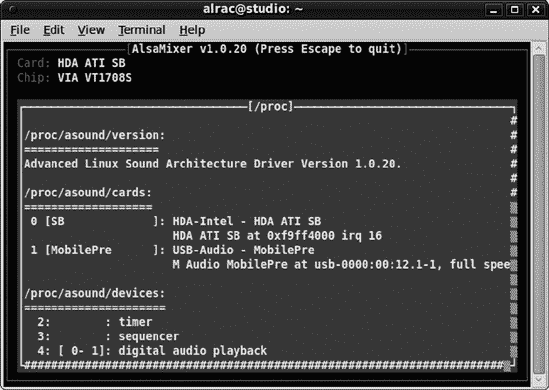
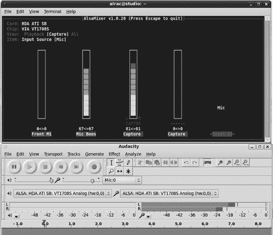
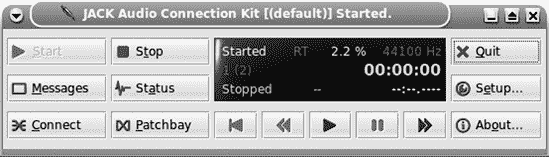
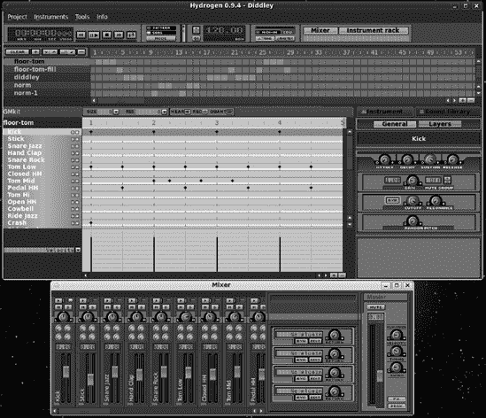
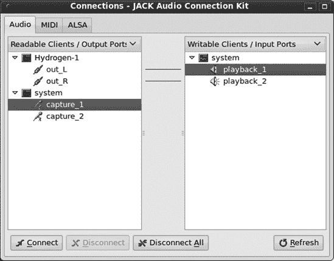
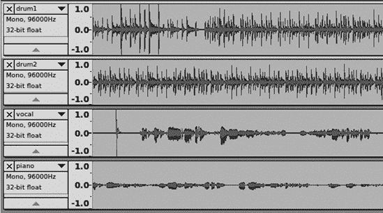
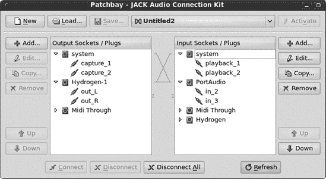

# 第十三章. 配置 Linux 以获得最佳音频质量


Linux 音频虽然杂乱但功能强大。本章是指导如何正确配置一切以适应高端音频制作的指南。Linux 是一个出色的多媒体平台：它稳定，它灵活，如果你使用轻量级的图形环境，你将能从普通硬件中获得更好的性能。尽管 Linux 音频有一些粗糙的边缘，但它正在快速发展，并且拥有自己的复杂音频软件宇宙。

你可以使用你想要的任何 Linux 发行版，因为你可以根据你愿意跳过的环环来定制任何 Linux 发行版，使其成为你的录音室。除了 Audacity 和其他音频软件应用之外，你需要最重要的东西是一个实时可抢占的内核以实现最低延迟，以及一些系统配置调整。你可以配置和调整你最喜欢的 Linux 发行版，或者你可以使用专为多媒体制作而设计的专业 Linux 发行版，它会为你处理细节。

在撰写这本书时，我使用了 Ubuntu，因为它是第一个捆绑 FFADO 驱动程序的 FireWire 录音接口的发行版。（我有一个优秀的 Focusrite Saffire Pro 26 I/O 用于多通道录音。）FireWire 录音接口是出色的性能者，但它们带来了一些特殊的驱动程序问题，所以如果你没有，不要担心寻找包含 FFADO 的发行版。无论如何，你都可以稍后添加它。

### 注意

最重要的一步是仔细选择你的音频接口。选择一个在 Linux 上得到良好支持的接口。生命太短暂，不能浪费在不愿意正常工作的事情上。访问 ALSA 声卡矩阵([`www.alsa-project.org/main/index.php/Matrix:Main`](http://www.alsa-project.org/main/index.php/Matrix:Main))以查找受支持的声音卡。还可以查看附录 A 以获取硬件信息。

# 使用具有实时内核的发行版

如果你的 Linux 发行版打包了*实时内核*，那么就解决了最大的障碍。什么是实时内核？这是一个配置了*实时调度*和*实时抢占*的内核，以优先保证音频记录的最小延迟。延迟是计算机固有的，因为现代 CPU 使用*抢占式多任务处理*；它们一次执行一个任务，但快速地在任务之间切换，以至于看起来它们同时执行多个任务。多核 CPU 平滑了这种切换，但它们仍然需要 Linux 内核的帮助。

由于 Linux 内核以超光速持续发展，有些人说，特殊的实时内核现在其实不再必要，因为实时功能已经集成到主线内核中。如果您将 Linux 系统简化为音频制作所需的基本要素，并使用现代的多核 PC、数 GB 的 RAM 和快速的硬盘驱动器，您就可以不使用它。我目前会坚持使用实时内核，因为它们的行为与通用内核略有不同。

实时抢占控制着任务如何相互中断以获取它们所需的 CPU 时间。这就像一个教室里的孩子们试图引起老师的注意，而老师一次只能处理一个。多核 CPU 就像是拥有更多的老师。中断通常持续数毫秒，当我们正在打字或编辑照片时这并不重要，但足以在录音中引入缺陷。因此，我们可以配置 Linux 将最高调度优先级分配给音频功能。

内核本身的内部工作存在固有的延迟，在现代内核中这些延迟已经变得非常小。因此，可以将 Linux 内核调整为非常低延迟的音频录制，低至 10 毫秒以下。任何低于 20 毫秒的都是优秀的。

Fedora 和 CentOS 用户应使用 Planet CCRMA 包（[`ccrma.stanford.edu/planetccrma/software/planetccrma.html`](http://ccrma.stanford.edu/planetccrma/software/planetccrma.html)）。Planet CCRMA（发音为“karma”）是针对 Fedora 和 CentOS 的特殊 RPM 集合，包括实时内核、各种音频软件和最新的音频驱动程序。只需将 Planet CCRMA 仓库添加到您的系统中，然后使用 Yum 以常规方式安装、更新和删除包。

Arch Linux 是一个优越的音频制作平台，它有自己的特殊音频仓库，ArchAudio。Red Hat、Mandriva 和 openSUSE 都打包了实时内核。

Ubuntu（以及 Kubuntu、Xubuntu 和该系列的所有其他版本）提供实时内核和相关内核模块；要开始使用 Audacity 所需的最小包包括这些：

+   *audacity*

+   *linux-rt*

一旦安装了 rt 内核，将所有将要使用 Audacity 的人类用户添加到*audio*组（在*/etc/group*文件中）。然后向*/etc/security/limits.conf*文件中添加以下行：

+   **`@audio - rtprio 99`**

+   **`@audio - memlock 3000000`**

第一行将最高调度优先级赋予音频组的所有成员。第二个值控制内存的使用方式。

+   `rtprio`（实时优先级）的值从 0 到 99，其中 99 是最高优先级。这是队伍的最前面。

+   `memlock` 决定了音频组锁定多少 RAM 用于自身，以千字节为单位，并防止它写入较慢的交换文件。我的系统有 4GB RAM，所以我将限制设置为 3GB，即 3,000,000KB。有些指南建议将其设置为 *无限制*。这有点有争议，因为似乎常识是应该为系统进程和非音频应用程序留出一些空间。无限制的值也可能导致内存不足错误并中断您的音频会话。一些用户报告说设置任何 memlock 值都没有区别。

许多指南还建议添加一行：`@audio - nice -19`。这并不是必要的，因为 rtprio 函数负责处理调度优先级。自己尝试一下也不会有什么坏处。

然后重新启动到您的新内核。请注意，如果您已经运行了您的 rt 内核，您要激活新的组成员资格和 *limits.conf* 的更改，只需注销然后重新登录即可。然后验证您的音频组成员资格：

```
$ groups
carla adm disk dialout cdrom audio plugdev lpadmin admin
```

确认您的 rt 内核正在运行：

```
$ uname -r
2.6.32-24-rt
```

`rt` 告诉您这是一个实时内核；此示例来自 Ubuntu 10.04。您还应该保留一个库存内核安装。使用不同的内核就像重新启动并从您的引导菜单中选择它一样简单。它还将有助于故障排除，因为您可以使用不同的内核尝试给您带来问题的任务，以查看它们是否表现不同。

## 专业的多媒体 Linux 发行版

有几个完整的 Linux 发行版是为音频和多媒体制作定制的。其中一些可以从 CD、DVD 或 USB 棒运行，并提供硬盘安装选项。您仍然应该验证音频组成员资格、*/etc/security/limits.conf* 设置以及我们在上一节中讨论的实时内核。

这里是一些专业的多媒体 Linux 发行版的样本：

+   64 Studio ([`www.64studio.com/`](http://www.64studio.com/))

+   Ubuntu Studio ([`www.ubuntustudio.org/`](http://www.ubuntustudio.org/))

+   dyne:bolic ([`www.dynebolic.org/`](http://www.dynebolic.org/))

+   pure:dyne ([`www.puredyne.org/`](http://www.puredyne.org/))

+   Musix ([`www.musix.org.ar/en/`](http://www.musix.org.ar/en/))

### 64 Studio

64 Studio 是一个基于 Debian 的发行版，适用于所有数字内容创作，它包括大量的音频、视频、图形和出版软件。它支持 32 位和 64 位架构，并在广泛的 PC 硬件上运行。维护者追求稳定性而不是尖端技术，因此他们保守地发布更新。64 Studio 还构建并支持诸如 Trinity Indamixx 数字音频工作站和 Lionstracs Mediastation 等产品。

### Ubuntu Studio

Ubuntu Studio 与 64 Studio 类似，拥有几乎所有 Linux 多媒体应用程序，但它基于 Ubuntu，而 Ubuntu 又源自 Debian。Ubuntu 不仅仅是 Debian 的翻版；Ubuntu 开发团队维护自己的补丁和定制。Ubuntu Studio 使用比 64 Studio 更新的软件包，因此你将获得更新的软件版本，也许还有新的错误。与所有 Ubuntu 一样，它有一个庞大且热情的用户基础和良好的社区支持。

你还可以将 Ubuntu Studio 软件包添加到常规的 Ubuntu 系统中。运行 **`$ apt-cache search ubuntustudio`** 来查看你的选项。*ubuntustudio-audio* 和 *ubuntustudio-audio-plugins* 元软件包应该会为你提供音频制作所需的一切，但有一个重要的例外：linux-rt 内核不包括在内，因此你将不得不单独安装它。

### dyne:bolic

dyne:bolic 是一个独特的软件项目。dyne:bolic 不是基于任何其他 Linux 发行版，而是从头开始从源代码构建的。这只是开始——dyne:bolic 以其独特的方式进行操作。它只使用自由软件基金会定义的免费软件。这对希望使用不受专有软件束缚的系统用户来说是个好消息。它可以从 CD 运行，并且针对速度和低硬件要求进行了优化，至少需要一台 Pentium II 400 MHz 的计算机或一个 Xbox 游戏机。你可以使用 Linux 或 Windows PC，你可以将你的数据保存到 USB 棒或本地硬盘上，并且它还提供了硬盘安装选项。定制不像使用 Yum 或 Apt 安装新软件包那样简单，因为你必须构建一个新的 CD 映像。它附带良好的文档和友好的用户社区。

dyne:bolic 是 Rasta ([`www.rastasoft.org/`](http://www.rastasoft.org/)) 软件。Jaromil，dyne:bolic 的主要开发者，说道：

> 但请记住，没有正义就没有和平。这款软件是关于在巴比伦世界中抵抗的，它试图越来越多地控制我们沟通和分享信息与知识的方式。这款软件是为那些负担不起最新昂贵硬件来发表他们意识之言和善意的人准备的。这款软件拥有从信息生产到消费的全套应用，它是一个完整的多媒体工作室，并且不输给其他任何专有系统，因为自由和知识共享是进化的坚实基础，这也是这款软件的来源。

### pure:dyne

pure:dyne 最初基于 dyne:bolic，但已演变成 Ubuntu 和 Debian 的混合体。它可以从 CD、DVD、USB 棒或硬盘安装运行。它比 dyne:bolic 更新，并且针对现代 i686 处理器进行了优化，尽管它也可以在旧硬件上运行。它旨在可由用户自定义，并附带创建定制映像的工具。

### Musix

Musix 是基于 Debian 的，适用于 32 位系统。它提供 Live CD 或 Live DVD，还有硬盘安装选项。Musix 也是一个 100%免费的操作系统。它提供了一个基于 IceWM 和出色的 Rox 文件管理器的轻量级桌面环境，因此适合硬件配置较低的计算机。

# 构建实时内核

如果你不想使用多媒体 Linux 发行版，而你喜欢的发行版没有打包实时内核，你可以自己构建。一个完整的内核构建指南将是一个完整的章节，所以我不打算在这个章节中尝试塞入一个。你可以轻松找到好的指南；寻找针对你发行版的特定说明。

你需要安装适当的构建环境、内核源代码以及当前内核的配置文件副本。一旦这些就位，你需要 rt 补丁，可以从 Linux 内核的母体网站[`www.kernel.org/`](http://www.kernel.org/)获取。访问 rt wiki（[`rt.wiki.kernel.org/index.php/Main_Page`](http://rt.wiki.kernel.org/index.php/Main_Page)），寻找“CONFIG_PREEMPT_RT Patch”下载。它必须与你的内核源代码版本相同。一旦你有了它，就将其应用到你的内核源代码上。

在你的内核 makefile 中，将`EXTRAVERSION`设置为表示这是一个实时内核的值，例如`EXTRAVERSION = -rt`。然后，如果你的内核版本是 2.6.33.1，例如，你的新内核名称将是 linux-2.6.33.1-rt。

现在，你已经准备好配置你的新内核了。从现有的内核配置开始，运行**`make oldconfig`**命令；你不需要从头开始配置，只是为了启用实时抢占。检查你的内核配置，并启用处理器类型和功能 > 抢占模式（完全抢占（实时）），以及处理器类型和功能 > 定时器频率（1000 Hz）。

然后完成配置，编译并安装你的新内核。这应该就是全部了，但请查看 rt wiki 以确保无误，因为 Linux 内核开发是一个快速发展的目标。同时也要保留你的旧版内核。你可以在系统上安装任意数量的内核，如果出现任何问题，你将有一个好的内核可以启动。

# 延迟并不可怕

延迟并不是像有时被描述的那样可怕。处理延迟的一种方法是将马力投入其中。现代的多核 CPU、千兆内存和快速的硬盘可以使延迟几乎消失。

如果没有其他选择，了解何时延迟真正是问题，何时不是，会有所帮助。当你进行多轨录音时，这很重要。即使在这里，Audacity 也能帮助你，因为它在**编辑** > **首选项** > **录音**对话框中有一个可配置的延迟校正功能。（参见第十二章了解如何测量和校正延迟。）当你通过电脑上的特殊效果插件播放软件合成器或任何乐器时，这也很重要：当你按下键或弹拨琴弦时，你希望音乐响起，而不是延迟。当你监控录音会话时，这也很重要，因为你不希望听到的声音与实际不符。

在**编辑** > **首选项** > **录音**对话框中，有一个影响延迟的设置，称为“音频到缓冲区”。缓冲区越小，延迟越低，但如果它们对于你的 CPU 来说太小，你将遇到断点。

在混音或多声道录音期间，延迟并不那么重要，因为所有东西都连接到一个好的录音接口，该接口直接连接到 Audacity 而没有绕路。拥有一个稳定且不会在录音会话中途崩溃的设置更为重要。如果你可以接受更高的延迟以换取稳定性，那是一个很好的交易。将延迟水平降低到不稳定是不好的。

当你运行一个干净的系统，除了音频制作所需之外，所有东西都关闭时，中断问题就小得多。（参见 Linux 系统调整中的 Linux 系统调整。）

JACK，即 Jack 音频连接套件，有自己的延迟和缓冲区大小配置选项，你可以在使用 Audacity 与 JACK 中详细了解这些选项。（参见使用 Audacity 与 JACK。）

# 整理 Linux 音频

在这本书中，我们使用 Audacity 配合 ALSA 和 JACK。不使用 PulseAudio、OSS、aRts、ESD 或其他可能潜伏在草丛中的任何东西。

几年来，Linux 音频领域一直很复杂，有多个子系统重叠的功能，现在它正在经历一些重大变化。没有单一的 Linux 音频 API 供开发者针对，而是他们必须处理一群音频服务器和子系统：开放声音系统（OSS）、高级 Linux 声音架构（ALSA）、Gnome 上的启蒙声音守护进程（ESD）、KDE2/3 的模拟实时合成器（aRts）、KDE4 的 Phonon、PulseAudio 和 JACK 音频连接套件。

ESD 和 aRts 正在进入退休，这使群体稍微减少了一些，留下了在任意 Unix 类型操作系统上运行的 PulseAudio（用于控制播放），Phonon（KDE4）以及用于专业音频制作的 JACK。ALSA 为所有这些提供了一个共同的驱动程序基础，它直接与音频硬件交互，并且还提供了一套有用的用户工具，例如混音器、设备发现、简单的播放器和录音机，以及扬声器测试器。PulseAudio 正在进入许多 Linux 发行版，如 Ubuntu 和 Fedora，看起来它将成为主流桌面音频服务器。

PulseAudio 是一个声音守护进程，而 Phonon 是一个支持多个音频框架的多媒体 API，包括 PulseAudio。PulseAudio 和 Phonon 提供播放混音器和路由器以及网络声音。许多 Linux 应用程序没有音频设备选择器。例如，Firefox 网络浏览器只使用默认音频设备。PulseAudio 和 Phonon 让您控制 Firefox 使用哪个音频设备。当我使用 Audacity 时，我喜欢关闭 PulseAudio；关闭 PulseAudio 和 Phonon 中的关闭 PulseAudio 和 Phonon 会告诉您如何操作。

那么，OSS 怎么样？有些人更喜欢它，您可以尝试一下。ALSA 在 Linux 中支持得更好，它包括为希望使用 OSS 的应用程序提供的 OSS 模拟。

### 注意

Adobe Flash Player 音乐播放器存在错误和不稳定的问题。例如，Pandora Radio，这个出色的在线音乐广播电台，完全依赖于 Flash。这是一个伟大的服务，我很高兴成为付费订阅者。但是 Flash Player 是一个持续的问题来源。它定期失去与音频系统的连接，并且不喜欢设备路由的变化，例如从电脑扬声器切换到外部声音系统时。当它出现问题时，需要刷新浏览器或重新启动才能再次启动。如果您需要用于测试的音频源，您应该寻找其他选项。

JACK 是一个专业质量、低延迟（意味着它不会向您的声音链添加延迟）的音频服务器，用于将音频硬件连接到音频生产软件。JACK 不独立运行，但需要*alsa-base*。JACK 支持多个音频后端：OSS；FFADO（以前称为 Freebob）用于在 Linux 上使用 FireWire 录音接口；PortAudio，这是一个简单的跨平台音频 API；以及 CoreAudio，Mac OS X 音频 API。Audacity 使用 PortAudio。

让我们澄清一些关于 PulseAudio 和 JACK 的常见误解。它们针对两种不同的使用场景：PulseAudio 是一个设备选择器和音频流路由器，用于播放和录音，而 JACK 是一个高端音频生产的音频路由器。JACK 允许你以几乎任何你想要的方式路由多个音频应用程序的输出，因此你可以以不同的方式组合不同的合成器并捕获音频流进行录音。尽管 PulseAudio 在成熟的过程中这两个问题都在改善，但它对 CPU 的消耗很大，并且为叠加和其他对延迟敏感的任务创建了过多的延迟。它适用于制作简单的录音，Audacity 和 JACK 都支持 PulseAudio。你需要 pulseaudio-module-jack 插件来支持 JACK，这个插件应该包含在你的发行版仓库中。

你何时使用 JACK？如果你的录音接口处理了录音会话所需的所有连接，你不需要它。如果所有设备都连接到单个录音接口，只需将 Audacity 指向它即可。尽管如此，JACK 仍然可以通过提供灵活的路由选项来帮助你，让你以不同的方式混合音频流，并调整性能。

当你使用 FireWire 录音接口时，你需要 JACK。当你想要将软件音频应用程序集成到 Audacity 录音会话中时，也需要它。（尽管 Audacity 不支持 MIDI，但 JACK 对 MIDI 有很好的支持。）一个简单的例子，我们将在使用 Audacity 与 JACK（使用 Audacity 与 JACK）中详细说明，是将优秀的 Hydrogen 软件鼓机添加到 Audacity 录音会话中。如果你想用 Hydrogen 在 Audacity 中创建鼓轨，你需要 JACK 来连接这两个应用程序。

# 使用 ALSA

ALSA 由两部分组成：低级基础部分，提供声卡驱动程序并与音频硬件直接交互，以及一个高级接口，包含用户空间工具。*alsa-base*及其依赖项应该已经存在，但你可能需要安装*alsa-utils*来获取用户空间工具。*alsa-utils*为你提供了`alsamixer, aplay, speaker-test, arecord`以及用于测试扬声器的多个声音文件。

打开终端并输入**`alsamixer`**以打开混音控制台，如图图 13-1 所示。ALSA 通过 ncurses 界面在控制台运行，这意味着它是完全键盘控制的，不需要 X 服务器。左上角的标题告诉你很多有用的信息：你的声卡和芯片组，你正在查看的功能集，以及高亮设置的值。使用箭头键前后导航。有三个视图：播放、捕获和全部。按 Tab 键在它们之间切换。按 Esc 键关闭`alsamixer`。


图 13-1. 使用`alsamixer`配置板载环绕声。在我的系统中，所有模块都必须处于活动状态——环绕、中心、LFE 和侧面——才能使立体声工作，尽管它们的音量控制没有效果。

按下 F2 键，可以看到所有检测到的音频设备的详细信息，如图图 13-2 所示。注意，它们从零开始编号。使用箭头键上下滚动，并按回车键关闭信息窗口。



图 13-2. `alsamixer`查询*/proc*文件系统以显示音频设备的详细信息。

图 13-3 显示了播放配置屏幕。


图 13-3. `alsamixer`播放屏幕控制播放设备的静音和音量。

## 在 alsamixer 中设置录音和播放级别

`alsamixer`仅显示您的声卡能够执行的功能。以下是基本的`alsamixer`命令：

+   播放菜单中带有 MM 的小方块表示这些功能被静音或禁用。切换 M 键以静音/取消静音，MM 变为 00。

+   00 表示静音，因此请使用上下箭头键调整它。Page Up 增加音量 5，Page Down 减少音量 5，End 将音量设置为 0。

+   当一个滑块上有两个通道时，你可以独立调整每个通道。Q 增加左通道，Z 减少它。E 增加右通道，C 减少它。

+   在捕获屏幕上，按空格键选择活动录音（捕获）设备。可能有超过两个选项，所以按几次以查看你的选择。

+   按 F1 键查看帮助菜单。按 F2 显示你的*/proc*信息，它显示实际检测和工作的内容，以及设备地址。

有时你会遇到由启用不必要的功能引起的静电或音量太低的情况。例如，我的 ATI 板载声卡的播放屏幕显示一个前置麦克风音量控制。当这个功能被启用时，会导致静电。当我使用耳机时，耳机控制需要打开，但改变音量级别几乎没有效果，我需要使用主控和 PCM 音量控制。主控音量控制对于扬声器不是必需的，但耳机控制是。试错是找出这些事情的唯一方法，低端声卡比高质量声卡更麻烦和古怪。

## 主控与 PCM

在主控和 PCM 播放设置上常常存在混淆。你通常需要主控和 PCM 才能启用播放，尽管有时只有 PCM 滑块有影响。如果主控滑块没有效果，这意味着你的声卡中可能没有内置硬件音量控制，或者你的声卡驱动程序缺少此功能。主控是主音量控制，PCM 代表*脉冲编码调制*。记住音频文件格式和质量设置在最终混音中，我们学习了将模拟信号转换为数字表示的方法？ALSA 对 PCM 的定义为我们解决了这个问题：

> 虽然 PCM 的缩写代表“脉冲编码调制”，但我们理解它为在连续时间段内生成音量样本的通用数字音频处理。

所以把 ALSA 的 PCM 通道想象成一个虚拟声卡。

## 多个声卡

如果你有一个以上的音频接口，`alsamixer`从零开始编号。例如，我既有板载声卡也有 M-Audio MobilePre 连接到 USB 端口。MobilePre 是#1，所以为了控制它，我需要用以下命令打开`alsamixer`：

```
$ alsamixer -c1
```

`-c1`意味着“卡号 1”。你怎么知道你的卡号是多少？一种方法是通过查询*/proc*：

```
$ cat /proc/asound/cards

 0 SB             : HDA-Intel - HDA ATI SB
                      HDA ATI SB at 0xf9ff4000 irq 16
 1 MobilePre      : USB-Audio - MobilePre
                      M Audio MobilePre at usb-0000:00:12.1-1, full speed
```

另一种方法是按`alsamixer`中的 F2（图 13-2）。

## 调整音量级别

当你在 Audacity 中调整录音和播放设置时，你可以同时打开 `alsamixer`，如图 13-4 所示。这是一种快速调整音量设置并了解 `alsamixer` 设置实际控制什么的方法。在这个例子中，一些尝试和错误让我发现麦克风增益和第一个捕获滑块控制麦克风录音音量，并且这张声卡有一个真正的立体声麦克风输入，具有两个通道。（记住，Q 和 Z 键提升和降低左通道的音量，而 E 和 C 控制右通道。）



图 13-4。`alsamixer` 捕获窗口控制录音设备上的设备选择和音量。这里它与 Audacity 并排，用于控制录音音量级别。

即使在这样的简单设置中，也有多个录音电平控制，包括 ALSA 和 Audacity。在录音期间保持 `alsamixer` 打开以进行调整。

### 注意

如果你需要一个很好的理由来购买双显示器设置，音频制作是一个很好的理由。你可以在一个屏幕上运行 Audacity、JACK 和 alsamixer，而在第二个屏幕上运行你的其他音频应用程序（如 Hydrogen、其他合成器、特殊效果）。既整洁又方便，你不必总是移动东西。

# 使用 alsa-utils 进行硬件测试

*alsa-utils* 包含一些有用的命令，可以帮助你排除硬件故障并进行测试。在测试声卡时保持 `alsamixer` 打开，这样你可以快速尝试不同的设置。没有声音的最常见原因是它在 `alsamixer` 中被静音了。

### 注意

如果你正在运行 JACK 音频服务器，请关闭它进行这些测试，因为这些命令在 JACK 运行时可能不起作用。在任何情况下，最好尽可能简化测试。

这是一种快速且令人烦恼的验证默认声卡和扬声器是否正常工作的方法。它应该生成一些白噪声：

```
$ cat /dev/urandom > /dev/dsp
```

按下 `ctrl-C` 可以停止它。一种更优雅的方法是使用 `aplay` 播放你选择的 WAV 文件，如下所示：

```
$ aplay -t wav violin-summit.wav
```

`-t` 表示“文件类型”，你的选择有 `voc`、`wav`、`raw` 和 `au`。`wav` 是默认选项。

要查看 PCM 结构和漂亮的 ASCII VU（音量单位）表，请尝试以下操作：

```
$ aplay -vv -t wav -V stereo violin-summit.wav
Playing WAVE 'violin-summit.wav' : Signed 16 bit Little Endian, Rate 44100 Hz, Stereo
Plug PCM: Soft volume PCM
Control: PCM Playback Volume
min_dB: -51
max_dB: 0
resolution: 256
Its setup is:
  stream : PLAYBACK
  access : RW_INTERLEAVED
  format : S16_LE
  subformat : STD
  channels : 2
  rate : 44100
  exact rate : 44100 (44100/1)
  msbits : 16
  buffer_size : 16384
  period_size : 4096
  period_time : 92879
  tstamp_mode : NONE
  period_step : 1
  avail_min : 4096
  period_event : 0
  start_threshold : 16384
  stop_threshold : 16384
  silence_threshold: 0
  silence_size : 0
  boundary : 4611686018427387904
        +############### 46%|48%################+
```

`-V stereo` 表示“显示立体声 VU 表”，它由井号标记表示。这些代表均方根（RMS）音量水平（即时间上的平均音量），百分比值是峰值。你可以看到这是一个立体声 CD 质量文件，或者 2 通道 16 位 44.1 kHz。

如果你有多于一个声卡怎么办？使用 `aplay -l` 显示所有音频接口的原始 ALSA 设备信息：

```
$ aplay -l
**** List of PLAYBACK Hardware Devices ****
card 0: SB [HDA ATI SB], device 0: VT1708S Analog VT1708S Analog
  Subdevices: 2/2
  Subdevice #0: subdevice #0
  Subdevice #1: subdevice #1
card 0: SB HDA ATI SB, device 1: VT1708S Digital VT1708S Digital
  Subdevices: 1/1
  Subdevice #0: subdevice #0
card 1: MobilePre MobilePre, device 0: USB Audio USB Audio
  Subdevices: 0/1
  Subdevice #0: subdevice #0
```

ALSA 设备的命名格式为 *interface:card,device*。声卡从零开始编号。ALSA 接口是一个 PCM 播放或录音设备、一个 MIDI 设备，或者是一个控制设备，如混音器。`hw` 接口直接与内核通信，因此这是测试你的音频硬件的最直接方式。以下示例将一个 WAV 文件发送到第一个 ALSA 接口，即 `hw:0,0` 的 ATI SB 板载声卡：

```
$ aplay -vv -t wav -D hw:0,0 angeline-the-baker.wav
```

有时你会看到这样的错误信息：“警告：速率不准确（请求 = 44100Hz，得到 = 48000Hz），请尝试使用 plug 插件。” 这意味着用 `plughw` 替换 `hw`：

```
$ aplay -vv -t wav -D plughw:0,0 angeline-the-baker.wav
```

`hw` 不进行任何转换——把它看作你的直接播放设备。它只能做硬件支持的事情，所以某些音频文件可能听起来很奇怪或者根本无法播放。`plughw` 是一个特殊的 ALSA 插件，类似于 `hw` 但拥有额外的功能；它可以执行播放你的文件所需的任何转换。`aplay` 只支持 `voc`、`wav`、`raw` 或 `au`，所以你最好坚持使用 WAV 文件。

这个例子在第二个 ALSA 设备上播放文件，在这个例子中是 MobilePre：

```
$ aplay -vv -t wav -D hw:1,0 angeline-the-baker.wav
```

如果有第三个音频接口，它将是 `hw:2,0`。

## 测试扬声器

`speaker-test` 命令可以帮助你确定你的扬声器是否按正确的顺序连接。以下示例测试了两通道立体声：

```
$ speaker-test -t wav -D hw:0,0 -c2 -l1

speaker-test 1.0.20

Playback device is hw:0,0
Stream parameters are 48000Hz, S16_LE, 2 channels
WAV file(s)
Rate set to 48000Hz (requested 48000Hz)
Buffer size range from 64 to 16384
Period size range from 32 to 8192
Using max buffer size 16384
Periods = 4
was set period_size = 4096
was set buffer_size = 16384
 0 - Front Left
 1 - Front Right
Time per period = 2.732753
```

你应该听到一位愉快的女士的声音说：“前左，前右。” `-c2` 表示两个通道，`-l1` 表示只运行一次测试。

这个芯片组支持 5:1 环绕声，所以你也可以测试这个：

```
$ speaker-test -t wav -D hw:0,0 -c6 -l1

speaker-test 1.0.20

Playback device is hw:0,0
Stream parameters are 48000Hz, S16_LE, 6 channels
Rate set to 48000Hz (requested 48000Hz)
Buffer size range from 6 to 5461
Period size range from 3 to 2730
Using max buffer size 5460
Periods = 4
was set period_size = 1365
was set buffer_size = 5460

 0 - Front Left
 4 - Center
 1 - Front Right
 3 - Rear Right
 2 - Rear Left
 5 - LFE
Time per period = 17.801733
```

你可以使用 `-s` 选项测试单个扬声器，如下例测试中置扬声器通道：

```
$ speaker-test -t wav -D hw:0,0 -c6 -s5 -l1

speaker-test 1.0.20

Playback device is hw:0,0
Stream parameters are 48000Hz, S16_LE, 6 channels
WAV file(s)
Rate set to 48000Hz (requested 48000Hz)
Buffer size range from 6 to 5461
Period size range from 3 to 2730
Using max buffer size 5460
Periods = 4
was set period_size = 1365
was set buffer_size = 5460
  - Center
```

注意这个巧妙的陷阱：`speaker-test` 输出从零开始编号扬声器，但对于 `-s` 选项，你必须从 1 开始。

`-t wav` 使用包含的默认 WAV 测试文件；你也可以尝试 `pink`，它生成粉红噪声，以及 `sine`，它听起来像老式电视测试屏幕上的正弦波音调。（现在它们使用电视购物节目。我想念测试屏幕。）你可以指定与 `sine` 选项一起使用的不同频率（以 Hz 为单位），如下例使用 45 Hz 的低音调测试低音炮：

```
$ speaker-test -t sine -f 45 -D hw:0,0 -c6 -s6
```

LFE 表示低频效果通道或低频发射器。这是处理 3 到 200 Hz 范围内低音的通道。这不同于你将低音炮插入的物理端口，因为 LFE 信号可以被路由到任何支持它的扬声器或扬声器组。

## 测试录音

`aplay` 有一个配套命令 `arecord`。记得检查 `alsamixer` 以获取正确的设置，例如捕获设备和音量控制。如果你的电脑有前后麦克风端口，`alsamixer` 应该有一个选项来选择正确的端口。在这个例子中，检测到两个音频设备：

```
$ arecord -l
**** List of CAPTURE Hardware Devices ****
card 0: SB HDA ATI SB, device 0: VT1708S Analog VT1708S Analog
  Subdevices: 2/2
  Subdevice #0: subdevice #0
  Subdevice #1: subdevice #1
card 1: MobilePre MobilePre, device 0: USB Audio USB Audio
  Subdevices: 1/1
  Subdevice #0: subdevice #0
```

这个例子使用 MobilePre 进行测试录音：

```
$ arecord -vv -fcd -V stereo -D hw:1,0 test.wav
Recording WAVE 'test.wav' : Signed 16 bit Little Endian, Rate 44100 Hz, Stereo
Hardware PCM card 1 'MobilePre' device 0 subdevice 0
Its setup is:
  stream       : CAPTURE
  access       : RW_INTERLEAVED
  format       : S16_LE
  subformat    : STD
  channels     : 2
  rate         : 44100
  exact rate   : 44100 (44100/1)
  msbits       : 16
  buffer_size  : 22050
  period_size  : 5513
  period_time  : 125011
  tstamp_mode  : NONE
  period_step  : 1
  avail_min    : 5513
  period_event : 0
  start_threshold  : 1
  stop_threshold   : 22050
  silence_threshold: 0
  silence_size : 0
  boundary     : 6206523236469964800
  appl_ptr     : 0
  hw_ptr       : 0
                   +############## 43%|34%###########+
```

ctrl-C 停止录音。`-fcd` 表示 CD 质量，即 2 通道 16 位 44.1 kHz。`aplay` 播放测试录音：

```
$ aplay -vv -t wav -V stereo -D hw:1,0 test.wav
```

## ALSA 应用程序

ALSA 为你的声卡创建了许多虚拟接口，称为 *应用程序*。你可以使用 `aplay` 查看：

```
$ aplay -L
default:CARD=SB
    HDA ATI SB, VT1708S Analog
    Default Audio Device
front:CARD=SB,DEV=0
    HDA ATI SB, VT1708S Analog
    Front speakers
surround40:CARD=SB,DEV=0
    HDA ATI SB, VT1708S Analog
    4.0 Surround output to Front and Rear speakers
surround41:CARD=SB,DEV=0
    HDA ATI SB, VT1708S Analog
    4.1 Surround output to Front, Rear and Subwoofer speakers
surround50:CARD=SB,DEV=0
    HDA ATI SB, VT1708S Analog
    5.0 Surround output to Front, Center and Rear speakers
surround51:CARD=SB,DEV=0
    HDA ATI SB, VT1708S Analog
    5.1 Surround output to Front, Center, Rear and Subwoofer speakers
surround71:CARD=SB,DEV=0
    HDA ATI SB, VT1708S Analog
    7.1 Surround output to Front, Center, Side, Rear and Woofer speakers
iec958:CARD=SB,DEV=0
    HDA ATI SB, VT1708S Digital
    IEC958 (S/PDIF) Digital Audio Output
null
    Discard all samples (playback) or generate zero samples (capture)
```

这有很多应用程序！在普通使用中，这些对用户或向 ALSA 发送声音流的应用程序来说并不重要，因为所有的事情都在幕后处理。你可以像测试 `hw` 接口一样测试这些：

```
$ speaker-test -t wav -D default:CARD=SB -c2 -l1

$ speaker-test -t wav -D surround71:CARD=SB,DEV=0 -c8 -l1

$ aplay -vv -D surround51:CARD=SB,DEV=0 madbanjos.wav
```

在我的系统中，`aplay` 为 MobilePre 返回了相同的应用程序集合，即使它不支持环绕声，只有双声道立体声。所以，这是有效的：

```
$ speaker-test -t wav -D front:CARD=MobilePre,DEV=0 -c2 -l1
```

但这并不：

```
$ speaker-test -t wav -D surround51:CARD=MobilePre,DEV=0 -c6 -l1
Stream parameters are 48000Hz, S16_LE, 6 channels
WAV file(s)
Broken configuration for playback: no configurations available: Invalid argument
Setting of hwparams failed: Invalid argument
```

# 查询你的声卡

你如何知道你的声卡有什么能力，它支持哪些位深度和采样率，以及有多少通道？如果你没有手册，你可以查询 */proc* 文件系统来找出这些信息。音频设备位于 */proc/asound*。你可以使用任何文件管理器或从命令行浏览这个目录。例如，在我的系统中 */proc/asound/card0* 是集成在主板上的 ATI 芯片组。读取 */proc/asound/card0/codec#0* 会输出大量信息，这个片段显示这个芯片组支持高采样率和位深度：

```
$ less /proc/asound/card0/codec#0
    rates [0x5e0]: 44100 48000 88200 96000 192000
    bits [0xe]: 16 20 24
```

MobilePre 看起来是这样的：

```
$ less /proc/asound/card1/stream0
M Audio MobilePre at usb-0000:00:12.1-1, full speed : USB Audio

Playback:
  Status: Stop
  Interface 1
    Altset 1
    Format: 0x2 (16 bits)
    Channels: 2
    Endpoint: 3 OUT (ADAPTIVE)
    Rates: 8000, 9600, 11025, 12000, 16000, 22050, 24000, 32000, 44100, 48000

Capture:
  Status: Stop
  Interface 2
    Altset 1
    Format: 0x2 (16 bits)
    Channels: 2
    Endpoint: 5 IN (SYNC)
    Rates: 8000, 9600, 11025, 12000, 16000, 22050, 24000, 32000, 44100, 48000
```

我是如何知道该读取哪些 */proc* 文件的呢？我试了所有的。不要尝试编辑 */proc* 文件。*/proc* 是一个仅存在于内存中的伪文件系统，显示内核和操作系统的当前状态。

# 使用 JACK 与 Audacity

JACK 音频连接套件是一个了不起的创造。它的原始创造者是 Paul Davis，现在 Davis 先生和一支开发团队支持 JACK。它是一个专业质量、低延迟的音效服务器，适用于 Linux 和任何 POSIX 兼容的操作系统，如 Mac OS X、Solaris、AIX、HP-UX 和 IRIX。目前它在 Linux、Mac OS X 和 FreeBSD 上运行良好。

### 注意

当你使用 Audacity 时，Phonon（在 KDE4 中）不会妨碍你，但 Pulse-Audio 经常会，所以请参阅 关闭 PulseAudio 和 Phonon 来了解如何禁用它。

JACK 就像一个交换机，可以在你的音频硬件和软件之间路由音频信号，而不会增加延迟。JACK 一次只能与一张声卡接口，但它可以与任何数量的软件音频制作应用程序接口，只要它们是 JACK 感知的。如果你有一个控制所有音频源的硬件设备，那么你不需要 JACK。例如，在我的小型录音室里，我的 MobilePre 可以处理多达 4 个输入，而 Saffire Pro 可以处理多达 26 个。如果我想录制的所有设备都连接到这些设备之一，我就不需要 JACK。但是，假设我想使用 Hydrogen，Linux 的软件鼓组？这是一个出色的、有趣的鼓合成器，大多数发行版仓库中都有，还附带了一系列演示，我可以立即开始使用它。我该如何将 Hydrogen 连接到 Audacity？这就是 JACK 发挥作用的地方。

你启动各种应用程序的顺序很重要。首先让所有东西都运行并连接到 JACK，然后 Audacity 总是最后一个启动。看起来我们可以在 JACK 运行后打开 Audacity，将其连接到 JACK，然后运行我们想要的任何其他东西。有时这可以工作，因为 JACK 会动态更新新的连接。但 Audacity 可能会很挑剔，所以我先启动其他所有东西。通常第一次尝试一切都会正常工作，但有时 Audacity 会抛出一个错误消息，关于错误的音频设备或其他不愉快的事情。关闭并重新打开它通常可以解决这个问题。

让我们使用 MobilePre，因为它简单易用。它连接了两个麦克风，用于声乐和吉他，然后我们将添加一个不错的鼓轨。首先关闭所有其他音频应用程序，然后启动 JACK。JACK 可以从命令行或 Qjackctl 图形界面运行。我们将使用 Qjackctl，它应该出现在你的系统菜单中，作为 JACK 控制（图 13-5）。



图 13-5. Qjackctl，图形 JACK 控制器

如果你打开 Qjackctl 时 JACK 启动了，请停止它，然后点击设置按钮。你会看到一个配置对话框，类似于图 13-6。


图 13-6. 在 Qjackctl 设置对话框中选择你的音频设备并配置 JACK

1.  如果你使用的是实时内核，请在“参数”列中检查“实时”选项。否则，不要勾选。

1.  如果你的录音接口上有监控端口，请勾选“H/W Monitor”以启用它。将第一列中的其他所有选项保持未勾选。

1.  在下一列中，将优先级保留为（默认）。

1.  将帧/时期保持在默认的 1024。

1.  设置您的采样率，并确保它与 Audacity、Hydrogen 和您正在运行的任何其他音频软件相匹配。它必须是您的录音接口支持的速率。

1.  时期/缓冲区默认为 2；目前先保持这个设置。

1.  将端口最大值和超时时间分别保持在它们的默认值 256 和 500。

1.  在第三列，选择“alsa”作为驱动程序。

1.  选择您的输入和输出设备；点击右侧的小箭头以显示所有声音设备。

1.  设置输入和输出通道的数量，这些数量取决于您的音频接口支持的数量。MobilePre 的输入和输出都有两个通道。

1.  点击**确定**，然后点击**开始**按钮。启动时看到一些 xruns 是正常的。点击消息和状态按钮以显示有关您的 JACK 会话所需了解的一切，无论是好是坏。

现在启动 Hydrogen。图 13-7 显示了 Hydrogen 的外观。



图 13-7. 优秀的 Hydrogen 鼓合成器

Hydrogen，像许多优秀的 Linux 合成器一样，允许您选择要使用的音频接口和音频后端。进入**工具** > **首选项** > **音频系统**并选择 JACK。确保“连接到默认输出对”选项未被勾选(图 13-8)。

现在转到**项目** > **打开演示**并选择一个演示来播放。点击（快进按钮右侧的）**循环歌曲**按钮，在您测试时保持其播放。

接下来，在 Qjackctl 中点击**连接**按钮。图 13-9 是结果。系统客户端是 MobilePre 通道；系统客户端始终代表您的音频接口，当然 Hydrogen 被标记为 Hydrogen。您应该在 JACK 中选择的播放设备上听到鼓点。如果您没有听到，将两个 Hydrogen 输出端口连接到两个系统播放端口。您将看到连接它们的线条。

在 JACK 的设置对话框中配置您的播放设备，无论是耳机、外接扬声器还是其他设备。


图 13-8. 配置 Hydrogen 使用 JACK



图 13-9. JACK 和 Hydrogen 正在运行，连接窗口显示 Hydrogen 已连接到您的音频接口的播放端口。

现在打开 Audacity。将 Audacity 配置为使用 JACK 音频连接套件：Hydrogen 作为录制设备，并按下录制按钮。你应该会看到类似图 13-10 的内容。


图 13-10. Audacity 正在通过 JACK 录制 Hydrogen 鼓轨。

哇！Audacity 正在录制 Hydrogen！现在 JACK 连接窗口显示了两个新的 PortAudio 客户端，它们是 Audacity 的录制输入（图 13-11

图 13-11. JACK 连接 Hydrogen 和 MobilePre 到 Audacity。Audacity 由两个 PortAudio 客户端表示。在这个例子中，Hydrogen 通过两个 PortAudio 客户端进行录制，并同时通过两个系统播放端口回放。

通常，连接窗口会打开时带有必要的连接，并且根据需要动态创建新的连接。如果它没有打开或者你想更改它们，只需点击一个可读客户端，然后点击一个可写客户端，然后点击连接按钮（或断开连接）。你可以为每个客户端创建多个连接。

MobilePre 是一个支持多达四个输入的双通道录制接口，所以当我通过麦克风录制东西时，它进入与 Hydrogen 鼓轨相同的两个通道立体声轨道。

在 Audacity 和 JACK 的一些较旧版本中，录制设备选择并不一致。有时选择 JACK 音频连接套件：系统有效，有时我必须使用 JACK 音频连接套件：其他，这取决于我正在使用什么。所以，你可能需要尝试一些试错。

## 连接 FireWire 录制接口

图 13-12 展示了使用 Saffire Pro 与 JACK 和 Audacity 的一个简单示例。您需要 Linux 的 ffado 驱动程序([`www.ffado.org/`](http://www.ffado.org/))来使用 FireWire 录音接口，计算机上的 FireWire 适配器以及正确的电缆来连接您的 FireWire 设备。有两种不同的 FireWire 插头，4 针和 6 针，您必须使用与您的设备匹配的插头。


图 13-12. Focusrite Saffire Pro I/O 26 的 ffado-mixer

这就是我如何让 Saffire Pro 在这个示例中工作。首先我打开了与 ffado 驱动程序一起提供的 ffado-mixer (图 13-12)。

然后，我启动了 Qjackctl，打开设置对话框，将驱动程序更改为“firewire”，并将接口更改为 hw:0。然后我打开了 Hydrogen，将其设置为使用 JACK 作为音频后端，并开始播放演示循环。Saffire 有耳机监听端口，所以我将耳机插入适当的端口，并在 JACK 连接器中创建连接，将 Hydrogen 的回放路由到前两个 Saffire 输入端口，System playback_1 和 playback_2。

然后我最后打开了 Audacity。我确保在 ffado-mixer、JACK 和 Audacity 中采样率相同，并将 Audacity 配置为录制四轨，使用录音设备 JACK Audio Connection Kit：系统。

图 13-13 展示了这一切的样子：有四个 PortAudio 客户端，这意味着 Audacity 中打开了四个录音通道。Hydrogen 使用其中的两个，而我将两个麦克风插入到 Saffire Pro 中，用于其他两个通道的录音。


图 13-13. 一切正常：Hydrogen 既能录音也能回放。两个麦克风插入到 Saffire Pro 中，从 Capture 3 和 4 录制到 PortAudio 16 和 17。

图 13-14 展示了在 Audacity 中的录音会话。



图 13-14. 在 Audacity 中的外观：两个 Hydrogen 轨道录音和两个麦克风轨道

## 创建持久配置

在 JACK 设置对话框中，你可以创建和保存多个配置文件。创建一个配置；然后在第一个选项卡中在预设名称框中为其输入一个名称，然后点击**保存**。要打开一个配置文件，点击预设名称框中的下拉箭头。

连接窗口只显示你的当前设置，并不保存它，因此你必须使用 Patchbay 来创建保存的连接。在连接中按照你喜欢的设置连接好一切，打开 Patchbay，然后点击**新建**按钮。一个小消息会弹出来询问你是否要保存当前的连接配置（图 13-15）。


图 13-15. Patchbay 会询问你是否要保存当前的连接配置。

点击**是**，这将自动在连接窗口中复制当前设置。你可以修改它，或者直接接受并使用保存按钮保存，给它一个独特的名称（图 13-16）。



图 13-16. 你可以编辑 Patchbay 为你捕获的内容，或者直接保存。

## JACK 设置

让我们更详细地看看 Qjackctl 设置窗口中的设置。

+   当你使用实时内核时，应选中“实时”，不使用时则取消选中。

+   当你有充足的 RAM 时，请保持“无内存锁定”未选中，但如果你使用的是低端计算机，并且遇到内存不足错误，请尝试选中它。这将防止 JACK 锁定内存以供其专用，并释放给所有需要它的进程。

+   选中“解锁内存”可以帮助低端计算机通过回收被 Qt 和 GTK 等图形工具包吞噬的内存，特别是如果你在 WINE 下运行 VST 插件时。如果没有遇到问题，请保持未选中状态。

+   选中“软模式”告诉 JACK 忽略 xrun 错误并继续运行。当你希望 JACK 无论发生什么都能继续运行时使用此选项，例如在直播表演期间。最好追踪并修复问题，但并非总是可能，而且 xrun 并不总是意味着你的录音有重大缺陷。

+   当您的音频接口仅支持 16 位录音时，您可以勾选“强制 16 位”。这不是必需的，因为 JACK 内部使用 32 位，并且它会测试输入和输出设备的 32 位、24 位和 16 位设置。如果您的接口仅支持 16 位或您想以 16 位进行录音，这将减少消息窗口中的常规错误消息。

+   “硬件监控”和“硬件计费”功能可以用于支持这些功能的设备进行硬件监控和计费。例如，MobilePre 有一个零延迟监控端口，因此激活了该功能。硬件计费仅适用于 ALSA 设备，并且很少的录音接口支持此功能。

+   默认优先级为 10，最大值为 89。通常默认值就足够了。如果您正在运行实时内核，尝试将其设置为 70 或更高，以查看是否有所改变。

+   每周期帧数控制您在低延迟和较少错误之间的平衡。默认值是每秒从 JACK 发送到您的声卡的 1,024 帧缓冲区，PC 硬件支持的最低值是 64。为了降低延迟，您希望有一个更低的值。如果您在消息窗口中看到很多 xruns，那么将此值增加到更高的数字，直到您没有*xruns*。xrun 可能是缓冲区溢出或未溢出，xruns 听起来像爆裂声和噼啪声。在我的系统中，JACK 在 128 帧时表现良好，这导致非常低的延迟。一个音频帧是样本数乘以通道数，因此双通道录音每帧有两个样本。一个周期是 CPU 处理周期，因此每周期帧数为 128 意味着每个通道的缓冲区大小为 128 样本，对于两个通道总共是 256 样本。要获取缓冲区大小的字节数，将每周期帧数乘以周期/缓冲区数乘以 4。

+   样本率设置必须等于您的 Audacity 样本率，并且由您的录音接口支持。较高的样本率会对您的 CPU 造成更大的负担，可能需要在每周期帧数和周期/缓冲区数中设置更高的值。

+   周期/缓冲区数是内存管理的一个有趣特性。JACK 将内存缓冲区划分为周期，并以周期为单位传输数据。默认值是每个缓冲区两个周期。更多的周期意味着更高的延迟和更大的稳定性。尝试与每周期帧数不同的组合值以降低延迟。例如，如果需要较高的每周期帧数值来降低 xruns，如 2,048，尝试将周期/缓冲区数增加到 3 或 4，并尝试降低每周期帧数。

+   每个输入或输出连接都是一个端口。默认端口数量为 256 个，对于大多数人来说已经足够，您最多可以有 1,024 个端口。

+   超时控制 JACK 在拥堵期间等待多长时间来杀死应用程序。默认值为 500 毫秒。

+   驱动程序设置为你的录音接口使用的任何驱动程序。Freebob 是 FFADO 驱动程序的老版本，用于 FireWire 接口，所以选择“firewire”，因为 Freebob 已经过时（除非你正在运行带有实际旧 Freebob 驱动程序的老系统）。“dummy”是一个用于测试 JACK 的假驱动程序。

+   当你为输入和输出设备选择（默认），即 ALSA 默认选项时，接口下拉菜单是激活的。然后你有一些额外的选择，如`/dev/dsp`和`/dev/oss`。这些在现代 Linux 系统中实际上并不相关，但如果你的系统支持它们，JACK 会支持它们。

+   混响可以使 16 位录音听起来更好；它类似于反锯齿字体或图形图像中的混响。不要为更高的位深度使用混响，因为它是不必要的，而且它们听起来会更差。把它想象成混合粗糙边缘以获得更干净的声音。形状混响被认为是最好的，但它也是最占用 CPU 的。三角形在质量和 CPU 成本之间提供了一个良好的折衷方案，而矩形则轻量级且改动最小。你不必使用混响，但尝试一下也无妨。Audacity 也有混响，所以请确保只使用一个。

+   在音频菜单中，你可以选择全双工、仅捕获和仅回放。通常全双工工作得很好，但你也可以尝试其他设置，看看是否有性能提升。

+   从下拉菜单中选择你的输入和输出设备（右侧的小箭头）。

+   输入延迟和输出延迟用于增加延迟。你可能需要调整这些设置，以便将输入和输出流同步，尤其是在进行多轨录音或应用特殊效果时。

# 关闭 PulseAudio 和 Phonon

PulseAudio 可能是一个固执的小守护进程。手册页说明你可以使用命令`pulseaudio --kill`来关闭它。但根据你的特定 Linux 发行版，它不会一直保持关闭状态；相反，它会重新启动。这是在 Ubuntu 10.04 上的工作方式：它有一个正常的初始化脚本在启动时启动它，`/etc/rc2.d/S03pulseaudio`。但当你尝试以正常方式控制它时，它不起作用，因为运行`/etc/init.d/pulseaudio stop`不会停止它。删除`/etc/rc2.d/S03pulseaudio`不会阻止它在启动时启动。幸运的是，我更加固执，已经找到了控制停止和启动 Pulse 的方法。我不想删除它；我想在我需要的时候运行它。（如果你想删除 Pulse，这样做不会伤害任何东西。）

首先寻找一个带有禁用选项的 Pulse 图形控制面板。在我的 Ubuntu 10.04 安装中缺少这个选项，但在 Fedora 和其他发行版中存在。如果你的系统有这个选项，可能这就是你需要的所有东西。

如果没有图形控制面板带有禁用 pulse 的选项，打开 */etc/pulse/client.conf*，将 `autospawn = yes` 改为 **`autospawn = no`**，并将 `daemon-binary` 设置为 **`/bin/true`**。确保它们没有被注释，如下所示：

```
autospawn = no
daemon-binary = /bin/true
```

接下来，要阻止它在启动时启动，需要几个步骤。首先，删除与你常用运行级别相关的 `/etc/rc*.d/S*pulseaudio` 链接，或者将其重命名为“kill”链接。这可以防止 `init` 启动 Pulse。在我的系统中，看起来是这样的：

```
# mv /etc/rc2.d/S03pulseaudio /etc/rc2.d/K03pulseaudio
```

你如何知道你的运行级别？使用 **`runlevel`** 命令：

```
$ runlevel
N 2
```

这意味着运行级别 2，它由 */etc/rc2.d/* 中的链接控制（这些链接必须是 */etc/init.d* 中的文件链接，而不是文件本身！）！你的发行版可能有一个很好的图形服务管理器，这是一个很好的选择。

在 Ubuntu 10.04 中，还有一个启动文件需要处理：*/etc/X11/Xsession.d/70pulseaudio*。这个文件在 Gnome 会话启动时启动 Pulse。将其移动到不同的目录，比如你的家目录。不要删除它，因为将来你可能还会用到它。

其他发行版以不同的方式定制 Pulse，所以如果这些说明不起作用，那么请寻找针对你发行版的特定帮助。这方面的帮助并不少，因为很多用户都在为此而奋斗。另一个小技巧，当你找到启动 PulseAudio 的脚本时，可以将它们调用的二进制文件从 */usr/bin/pulseaudio* 改为 */bin/true*。这是一个很小的可执行文件，它的唯一任务是“什么都不做，但成功。”这可以让脚本保持满意，并且如果你将来想改回它，它也是一个方便的占位符。

现在你已经清除所有启动脚本，如何停止和启动 PulseAudio？这就像做派一样简单：

```
$ pulseaudio --kill
$ pulseaudio --start
```

Phonon 是另一回事。Phonon 只存在于 KDE4 中，并且无法删除，因为几乎所有的 KDE4 都依赖于它。在任何情况下，没有必要停止或删除 Phonon，因为它只占用很少的系统资源，并且不会给你的音频链增加延迟。它有一个令人烦恼的习惯——当像 Pulse 或 JACK 这样的声音守护进程控制一个声卡时，Phonon 会惊慌失措并发出一个关于该声卡缺失的错误消息，并想要将其从菜单中删除。只需点击 **取消** 来使其安静。

# Linux 系统调整

Linux 是一个相当高效的操作系统，所以你不需要采取过激的措施来让它摆脱自己的阻碍。然而，你可以做一些事情来确保最佳的性能。

高性能的 PC 硬件总是好的，而且比高端音频设备便宜。我的音频工作站配备了一个 AMD Phenom X3 2.4 GHz CPU，4GB 的 RAM，以及一个 TB 的 SATA II 硬盘。那些额外的核心带来了很好的效果，因为尽管 Audacity 没有针对多核处理器进行优化，但这些额外的核心意味着更快速、更流畅的多任务处理。我还有一个配备 1.4 GHz CPU、1GB RAM 和较慢硬盘的旧笔记本电脑。它可以熟练地处理多达四通道 16/44.1 的录音，但在更高的比特深度或采样率下，它往往会停滞。我认为 1 GHz CPU 和 512MB RAM 是音乐录制和编辑的最低要求。对于播客和有声读物录制，你可以低至 128MB RAM 和 500 MHz CPU。

关闭你的屏幕保护程序和所有花哨的视频效果。所有那些 CompizFusion 的闪亮效果虽然很漂亮，但会妨碍良好的音频。实际上，你应该关闭所有绝对不需要的东西：不要运行其他应用程序，关闭不必要的服务。通常不会有太多冗余；蓝牙、无无线设备的系统上的无线守护进程，以及 Wacom 平板电脑守护进程是最常见的默认开启服务，大多数用户并不需要。

KDE 和 GNOME 都是耗资巨大的桌面系统，它们对 CPU 和内存的需求很大，因此你可以通过使用更轻量级的图形环境，如 Xfce、IceWM、LXDE、Fluxbox 或众多其他轻量级 Linux 图形环境来精简你的系统。

视频是 PC 上对系统要求最高的单一组件，因此你可能想要升级到更好的显卡。许多低端系统使用共享的系统内存而不是专门的图形处理单元（GPU）。换句话说，它们使用你的一些系统 RAM 来处理视频，这相当慢，因为它会给你的系统 RAM 和 CPU 增加额外的负载，而这两者的速度都远远慢于 GPU。GPU 的速度如此之快，以至于它们被用来构建用于非常快速、非常强大的高端科学计算的集群。

根据你的发行版，你应该有一个好的图形系统资源监控器，这样你可以看到你的系统资源在哪里被使用。古老的`top`命令仍然是查看活动进程及其使用多少系统资源的有用工具。启动`top`后，按 1 键可以看到多核 CPU 中的所有核心：

```
$ top

Tasks: 232 total,   1 running, 231 sleeping,   0 stopped,   0 zombie
Cpu0  :  3.7%us,  0.7%sy,  0.0%ni, 95.7%id,  0.0%wa,  0.0%hi,  0.0%si,  0.0%st
Cpu1  :  7.6%us,  0.7%sy,  0.0%ni, 90.1%id,  1.7%wa,  0.0%hi,  0.0%si,  0.0%st
Cpu2  :  0.0%us,  0.7%sy,  0.0%ni, 99.3%id,  0.0%wa,  0.0%hi,  0.0%si,  0.0%st

Mem:   4056672k total,  1602700k used,  2453972k free,   171880k buffers
Swap:  7092636k total,        0k used,  7092636k free,   655412k cached

  PID USER      PR  NI  VIRT  RES  SHR S %CPU %MEM    TIME+  COMMAND
17132 alrac     20   0  663m  35m  22m S    8  0.9   0:27.99 audacity
 2208 root      20   0  181m  83m  14m S    3  2.1  32:02.89 Xorg
10683 alrac     20   0  620m 147m  28m S    1  3.7   4:37.10 firefox
 2763 alrac     20   0  212m  10m 8276 S    1  0.3   3:00.33 multiload-apple
```

这表明一切正常。顶部的摘要告诉我们许多信息：有一个进程正在运行，其余的，也就是全部 231 个，都在休眠状态。三个 CPU 核心正在忙碌地工作。

所有这些字段都在`man top`这个友好的手册页中进行了解释。你的`top`版本可能显示不同的字段，但它仍然是同一个`top`命令。顶部部分是摘要，底部部分是任务区域。

在总结中，CPU 状态（详细查看）很有趣，但要注意的主要字段是`us`，即用户字段，它显示每个 CPU 的负载，以及`sy`，即系统字段，它显示来自内核进程的负载。如果你看到`sy`值持续大于 10%，你应该追踪原因，因为通常它应该是单个数字。

`Mem`和`Swap`字段告诉你你的物理 RAM 是否足够。只要`Swap`的使用率为零，并且你的`Mem`没有达到最大值，这对音频处理来说就是理想的，因为 RAM 比硬盘上的交换文件快得多。

在任务区域下方，你可以看到关于你系统上每个进程的信息。再次强调，不要对细节过于着迷，但看看顶部最大的使用者。这很快就能揭示谁是 CPU 和内存的消耗者。在这个网站沉重、脚本和 Flash 繁多的时代，网络浏览器可能非常消耗资源，所以关闭它们。音频处理消耗了很多 CPU 周期，所以这是你要关注的主要事情。如果你持续达到 75%以上，考虑升级你的 CPU。Linux 内核和大多数 CPU 不介意工作得那么努力，但在那个水平上，你可能注意到性能变慢。

你可以稍微调整交换文件的大小以获得更好的性能。如果你有 512MB 或更少的 RAM，将你的交换文件大小至少设置为与你的 RAM 大小相等。如果你有 1GB 或更多的 RAM，将你的交换文件大小不超过你 RAM 的一半。但不要完全删除你的交换文件——笔记本电脑需要它们来挂起和休眠，而且如果你用完了所有的物理内存，那个交换文件可能会救你的录音会话。

如果你使用的是 PCI 声卡，请查阅你的主板手册以找到一个不使用共享中断的插槽。PCI-Express 声卡很棒，因为 PCI-E 使用专用总线，而不是像旧 PCI 2.0 标准那样的共享总线。目前还没有很多 PCI-E 声卡；以 RME HDSPe MADI 系列为例，它是第一流的，并且在 Linux 上运行。

不要使用网络文件共享，除非是存储你的音频文件的备份，因为它们太慢了。

# Linux 音频的错综复杂的历史

原始的 Linux 音频子系统是 Sound Blaster 16，这“只是发生了”因为 SB16 声卡有最好的支持和良好的 API。那些足够老以至于还记得 i386 PC 的人可能也会记得，竞争品牌使用 SB16 模拟，因为这是阻力最小的路径。这演变成了开放声音系统（OSS），它可以在所有 Unix 和 Unix 类型的操作系统上运行。它仍然存在并且得到维护，并且它经常与 ALSA 中的 OSS 兼容模块混淆。

随着声卡变得更便宜，并且更多地依赖软件来处理混音而不是在硬件中混音，OSS 失去了受欢迎的地位。因此，ESD（Gnome）和 aRts（KDE）应运而生；这些在将音频流发送到 OSS 之前负责混音。然而，这使事情变得复杂，因为 Linux 开发者现在必须处理三个不同的声音系统。Simple DirectMedia Layer（SDL）随后被发明为一个可使用任何音频后端的可移植层，但它有一些限制，阻止它成为伟大的 Linux 音频统一者。就像生活中的其他事物一样，它并没有消失，但仍然在一些应用程序中使用。你可能在你的系统上也有它。

然后 OSS 变成了闭源软件，用户必须为此付费。这对坚韧的 Linux 开发者来说是最后一根稻草，他们通过发明 ALSA 来反击。所以，ALSA 就这样成为了标准的 Linux 音频子系统。一个好的引发争论的方法是点燃 OSS 与 ALSA 的辩论——很多人对这个话题仍然有强烈的激情。

OSS 4.*x* 在 2007 年以 GPL 许可发布 Linux 版本时再次成为自由软件，现在有两个版本：GPL 版本和包含一些非自由驱动器的商业版本。一些用户声称他们的音乐听起来更好，而且 OSS 更简单、更好用。我认为这很多都是一厢情愿的想法，但如果你喜欢 OSS，我不会因此而小看你。

我更喜欢朴素的 ALSA。它在几乎所有 Linux 系统中都是默认的，而且它工作得很好。就像 Linux 一样，在购买之前先做做功课，确保你购买的是得到良好支持的硬件。ALSA 项目有一个支持的声音卡矩阵，可以在 [`www.alsa-project.org/main/index.php/Matrix:Main`](http://www.alsa-project.org/main/index.php/Matrix:Main) 找到。

ESD 是旧的 Gnome 和 Enlightenment 声音服务器，它运行在 ALSA 之上。它可以管理多个声音流和网络播放。PulseAudio 已经取代了 ESD 在 GNOME 中的位置。

aRts 也管理多个流和网络播放。不要使用 aRts，因为它会增加超过可接受水平的延迟，并且它注定要失败——它已经有一段时间没有维护，并且过时了。Phonon 在 KDE4 中取代了 aRts。Phonon 不是一个声音服务器或 API，而是旨在成为所有音频和视频播放服务器和子系统的通用接口。Phonon 不会妨碍，所以你可以让它保持原样。

Linux 桌面播放音频的未来是模糊的。PulseAudio 准备成为桌面 Linux 的标准声音管理器，但有人说还有一些更深层的问题需要解决，而 PulseAudio 无法解决。所以，不要对任何事感到惊讶。

# 声音卡

请访问附录 A 了解在 Linux 上得到良好支持的声卡，从低预算到高端。记住，仔细购物并购买在 Linux 上得到良好支持的硬件非常重要。Linux 上有许多高质量的音频硬件可以工作——生命太短暂了，不应该浪费在低质量或支持不佳的音频设备上。
