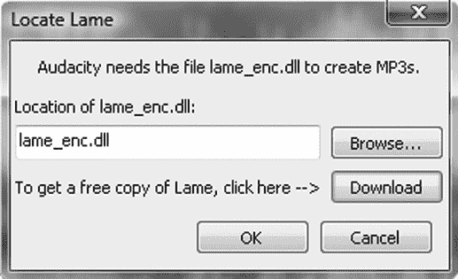
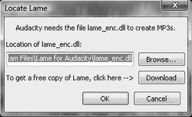
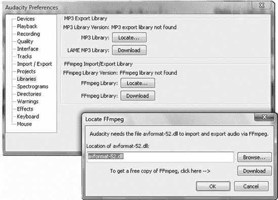

# 第十四章。配置 Windows 以获得最佳音频质量

目前，Microsoft Windows 用户处于一个有趣的位置。尽管 Windows XP 作为 2001 年首次发布时的 Methuselah 在计算机年份中已经相当古老，但它仍然是最受欢迎的 Windows 版本。微软已经尝试多次将其退役，但它不会消失。2010 年 7 月，微软宣布将 XP SP3 的支持延长至 2014 年 4 月。在 Windows 7 的原设备制造商（OEM）生命周期结束之前，XP 将继续作为 Windows 7 购买者的降级选项，而 Windows 7 的原设备制造商生命周期在下一个 Windows 版本发布两年后结束。因此，XP 还将与我们相伴很长时间。

在您的音频制作电脑上坚持使用 XP 有充分的理由。它对系统要求节俭，操作系统和服务包只需不到 5GB，并且使用 1 GHz CPU 和 512MB RAM 也能正常运行。将其安装在拥有 1GB RAM 的双核笔记本电脑上，您就拥有了一个功能强大的便携式录音室。

Windows Vista 在市场上并没有获得太多关注。在撰写本文时，音频硬件制造商终于开始赶上并为其产品发布 Vista 驱动程序。Audacity 1.3.*x*在 Vista 上运行良好。但 Vista 是一个系统资源消耗者，仅自身就需要 12+GB 的硬盘空间。官方要求 Vista Home Basic 至少需要 1 GHz CPU 和 512GB RAM，其他版本至少需要 1GB RAM，但如果您只有这些，那么使用起来就像在深沙中跋涉。仅用于基本任务（如电子邮件和网络浏览）就需要 2 GHz CPU 和 2GB RAM。我建议至少使用 2 GHz 双核 CPU 和 4GB RAM 来在 Vista 上运行 Audacity。

Windows 7 的系统要求也适用于 Vista。它与 Vista 没有太大区别；它更加精致，内存管理略好，用户账户控制不那么烦人，启动速度也略快。声音控制面板有一个很棒的功能，即一个通信选项卡，其中包含为您的播放设备设置简单自动降音的设置。您可以为诸如在接收到 Skype 电话时自动静音所有其他声音等任务进行配置。

# 启用 MP3 支持

由于 MP3 音频格式（更准确地说，MPEG-1 音频层 3）存在专利限制，Audacity 中没有包含 MP3 编码器。然而，您可以轻松地获取 LAME MP3 编码器，这是一个高质量、跨平台的免费软件 MP3 编码器和解码器。获取它的方法之一是遵循 Audacity 下载页面上的说明。另一种方法是在 Audacity 内部，通过将文件导出为 MP3。如果您的系统上没有 LAME，您将看到一个类似于图 14-1 的对话框。

点击**下载**按钮直接进入 LAME 下载页面。您可以下载一个压缩包或未压缩的存档。安装程序是一个标准的 Windows *.exe* 文件；只需下载它，双击下载的文件，然后按照安装步骤进行。它将 LAME 放入*\Program Files\Lame For Audacity*。您可以通过查看**编辑** > **首选项** > **库**对话框来验证它是否安装成功。点击 MP3 库：**定位**，它将显示完整的文件路径（图 14-2）。

图 14-1. 在 Audacity 内部安装 LAME，请点击 MP3 导出对话框中的下载按钮。

图 14-2. 安装 LAME 后，库对话框显示完整的文件路径。

# 启用 WMA、M4A/M4P 支持

Audacity 原生支持开放、不受限制的音频编解码器和格式，如 WAV、AIFF、Ogg Theora 和 FLAC。但就像 MP3 一样，Audacity 不能附带对封闭、专有或受专利限制的格式的支持，如 Windows Media Audio (WMA)、M4A（有损压缩格式）或 M4P（添加了 DRM 的 M4A）。M4A 和 M4P 是苹果 iTunes 商店的默认格式。它们使用高级音频编解码器（AAC）。分发使用 AAC 编解码器的任何形式的录音不需要许可证或付款，但任何制造 AAC 编解码器的人都需要购买专利许可。开源编解码器通过发布源代码而不是现成的二进制应用程序，并在友好的国家托管他们的下载服务器来规避这一点。许多国家不执行美国的软件专利法，甚至不承认软件专利的有效性，并明确允许反向工程。因此，当涉及到弄清楚所有这些时，魔球占卜有最终的答案：“回答模糊，再试一次。”

简而言之，您可以通过安装 FFmpeg 来添加对大量非自由和受限制的音频（和视频）文件格式的支持。Audacity 内置了 FFmpeg 支持，您以与 LAME 相同的方式安装它。就像 LAME 一样，它将被放置在*\Program Files\FFmpeg for Audacity*中。

LAME 和 FFmpeg 都可以安装，您可以通过**编辑** > **首选项** > **库**来验证它们在系统中的位置（图 14-3）。

图 14-3. FFmpeg 和 LAME 也可以从编辑 > 首选项 > 库中安装。

# 低延迟录音和音频驱动程序乐趣

在计算机上录制意味着您必须关注驱动程序。很多。

标准的 Windows 多媒体扩展 (MME) 音频系统支持双通道 16 位 44.1Hz 录音。这是一个从 Windows 3.1 时代就存在的旧系统。然后微软为 Windows 2000 及更高版本开发了 Windows 驱动模型内核流 (WDM/KS) 和增强型 Windows 驱动模型 (EWDM) 驱动程序。Audacity 支持所有这些。如果您想同时录制超过两个通道，您需要具有完整 EWDM 支持的声卡。大多数音频设备声称支持 WDM，但这并不总是意味着 EWDM 或 WDM/KS，因此它们可能不支持同时从超过两个输入进行录音。

Audio Streaming Input/Output (ASIO) 驱动程序是 Windows 的高质量、低延迟音频接口。不幸的是，Audacity 无法提供对它的支持，因为它是一个封闭的、专有的驱动程序。因此，您有两个选择：坚持使用支持 EWDM 或 WDM/KS 的设备，或者自己编译带有 ASIO 支持的 Audacity。为此，您需要 Steinberg 公司提供的 ASIO 软件开发工具包 (SDK)，该公司拥有 ASIO 驱动程序，以及从 SourceForge 上的 CVS 仓库获取的最新 Audacity 源代码。您还需要 Microsoft Visual C++ 8，它是 Visual Studio 的一部分，以便在 Windows 上编译 Audacity。

在您能够下载 ASIO SDK 之前，您需要在 Steinberg.net 上注册一个开发者账户。这是免费的，而且很简单。按照 Audacity 下载页面上的说明获取最新的 Audacity 源代码。然后在 Audacity 源代码树中找到 *win\compile.txt* 文件，因为它提供了使用 ASIO 支持构建 Audacity 的详细说明。

### 注意

您必须注意一些许可问题。您可以为个人使用仅构建带有 ASIO 支持的 Audacity 复制品：您不能分发它们。这将违反 Audacity 的许可（GPL）和 Steinberg 的 ASIO 许可。Audacity 维护者鼓励用户给 Steinberg 发送电子邮件，礼貌地请求它开源 ASIO 驱动程序。

最简单的方法是请一个已经拥有 Microsoft Visual Studio 的朋友帮忙。编译 Audacity 以包括 ASIO 支持可能听起来很麻烦，但对于已经熟悉 Visual Studio 的人来说，这相当简单。您需要在 Audacity 中使用 ASIO 支持吗？不需要，如果您仔细挑选，您可以找到具有高质量 EWDM 或 WDM/KS 驱动程序的录音接口。仅仅拥有 ASIO 驱动程序并不能保证设备性能良好，因为存在糟糕的 ASIO 驱动程序。也有糟糕的 EWDM 和 WDM/KS 驱动程序，所以在购买任何东西之前做好功课。

如果你能在 Audacity 中启用 ASIO 支持，你将拥有更多硬件和配置选项。许多高端声卡支持多个驱动程序，包括 ASIO 和 WDM 系列，因此你可以尝试不同的驱动程序，看看哪个表现最好。

# 调整 Windows 以获得最佳性能

良好的音频录制需要一个干净、性能良好的计算机，不要被不必要的应用程序和服务拖累。Windows 系统因加载无用垃圾而闻名，所以我们将回顾如何给它进行一次彻底的清理。

性能缓慢的常见原因是使用共享系统内存的视频控制器。这些控制器会消耗 CPU 周期和 RAM。如果你有这类控制器，购买一个独立的图形控制器将物有所值；性能差异将很大且明显，因为处理负载将由显卡承担。如果你有廉价的共享内存视频，你应该能够升级，无论是笔记本电脑还是台式机 PC。你的笔记本电脑将有非常具体的要求，你应该能够从手册或制造商的网站上找到这些信息。台式机 PC 应该提供更多的灵活性。

你必须将你的显卡与主板相匹配，因为台式机 PC 显卡有几种不同的 PCI 插槽类型：PCI、AGP 和 PCI-e。你必须匹配插槽和正确的电压。同时确保有足够的空间安装你的新显卡，因为其中一些是带有巨型散热风扇的怪物。这些巨型野兽是为游戏玩家准备的，而不是音频制作设备。便宜且小巧的显卡也能满足需求。如果你已经在使用集成显卡，你可能需要进入系统 BIOS 来禁用它。如果你觉得这些听起来像外语，你可能需要找一个知识渊博的朋友帮忙，甚至支付专业人士的费用。

总是安装最新的 Windows 更新，特别是服务包。确保你有音频设备的最新驱动程序。定期运行磁盘碎片整理和磁盘清理。

关闭所有非录音必需的设备：其他应用程序、屏保、防病毒软件、系统维护应用程序、防火墙、网络浏览器、电子邮件、“娱乐”垃圾软件、广告软件、花哨的特殊效果——所有这些。病毒检查器和 Windows 防火墙是臭名昭著的系统资源消耗者，但显然禁用它们会使你的系统失去保护，所以你将想要断开任何网络连接。不要忘记关闭 Wi-Fi 和蓝牙。一些笔记本电脑有漂亮的物理开关来关闭这些功能；否则，进入网络连接控制面板来禁用它们。如果你需要保持连接，你将不得不保持保护功能开启。

图 14-4. 在任务管理器中提高 Audacity 的优先级

在任务管理器中提高 Audacity 的优先级。要打开任务管理器，请按 ctrl-alt-delete。请只按此组合键一次，否则 Windows 将重新启动。转到任务管理器中的“进程”标签页，右键单击 Audacity 的条目（图 14-4). 默认优先级是正常，你应该能够将其提高到高优先级，而不会使其他进程不高兴。将其提高到实时优先级似乎是一个明显的选择，但它会使我的系统不稳定。你可能会有更好的结果。

你可以安全地禁用许多 Windows 服务，这些服务消耗内存和 CPU 周期，对你几乎没有好处，其中一些甚至还是安全风险。第三方软件供应商喜欢用各种垃圾塞满 Windows。你可以在任务管理器的“进程”标签页中查看哪些进程消耗了最多的 CPU 和内存，然后快速的网络搜索应该会告诉你这个服务是做什么的，以及你是否需要保留或驱逐它。我们将在下一两个部分中详细讨论一些常见的违规行为。

## 调整 Windows XP

图 14-5. 通过关闭不必要的和危险的服务来微调 Windows XP

首先，我们将从一些简单的事情开始：在 Windows XP 中，右键单击我的电脑并选择属性。点击“高级”标签页，然后点击“性能设置”按钮（图 14-5). 在“视觉效果”标签页上，选择“调整以获得最佳性能”。这会关闭基本的 Windows XP 视觉效果。

当你仍在性能选项中时，转到“高级”标签页。默认情况下，Windows 的分页文件是动态的，根据需求改变其大小。在虚拟内存菜单中将其更改为固定大小；这会给你带来一点更快的性能。如果你有 512MB 或更少的 RAM，将你的交换文件大小设置为你的 RAM 的 1.5 倍。对于 1GB 到 4GB，使其为你的 RAM 的一半。对于超过 4GB 的，尝试一个最小大小，如 512MB。你希望 Audacity 使用你快速的 RAM，而不是慢的分页文件。

### 注意

分页文件是虚拟内存。如果 Windows 用完 RAM，它将使用硬盘上的分页文件。读取和写入硬盘比使用 RAM 慢得多，因此总是有更多的 RAM 比有更大的分页文件要好。

现在，离开性能选项并转到系统还原选项卡。我建议通过勾选“关闭所有驱动器的系统还原”复选框来禁用系统还原，尽管如果你想保留它也可以。根据我的经验，它占用了磁盘空间并稍微减慢了系统速度，但并不特别有用，因为似乎失败和问题都会被系统还原忠实地保存。你最好的保护措施，一如既往，是定期在外部媒体上备份数据。

接下来，转到“自动更新”选项卡并关闭它们。这意味着你必须记得手动运行更新——不要忘记！你不想在录音或编辑会话期间启动更新器，因为它会拖慢你的系统，弹出不必要的消息，然后催促你重启。

在“远程”选项卡上，禁用“允许从这台计算机发送远程协助邀请”和“允许用户远程连接到这台计算机”。嘿，这是巨大的安全漏洞，而且它们还占用了一些系统资源。当你知道你需要它们时，你可以随时打开它们；其余时间它们应该被禁用。

我们已经完成了系统属性，准备继续前进。现在你想查看在启动时设置的服务，并将那些不需要一直运行的服务设置为手动或禁用。在 **控制面板** > **管理工具** > **服务** 对话框中执行此操作。许多第三方软件会以各种不必要的附加组件使你的系统变慢。一个例子是我 M-Audio MobilePre 一起提供的 USB 音频接口软件 CD。Windows XP 已经内置了一个非常好的 USB 音频接口，因此你不需要安装任何额外的东西——MobilePre 不需要额外的麻烦就能正常工作，这些麻烦包括驱动程序安装程序和一个基本的音量控制面板。没有什么值得兴奋的，也没有什么特别有用的。许多 USB 音频设备都这样做，所以先尝试不安装任何额外软件。

这里是一个简短的清单，列出了应该禁用的服务，因为它们是不必要的或存在安全风险，或者两者兼而有之。虽然你欢迎这样做，但并不需要追踪并删除每个非绝对必要的服务。TweakHound ([`www.tweakhound.com/`](http://www.tweakhound.com/)) 是一个详尽且可靠的 Windows 系统调整指南，包括好的调整和不好的调整。同时，对特定服务进行网络搜索也是有帮助的。在不知道它做什么的情况下不要更改任何内容；你不想删除必要的 Windows 服务。当你将运行中的服务更改为手动或禁用时，你还需要停止它。双击服务以打开配置对话框。

这些是一些更常见的违规行为：

**Alerter**

发送管理警报。这是无用的，并且默认情况下应该在服务包 2 和 3 中禁用。

**ClipBook**

另一个“谁会认为这是个好主意”类别的赢家——剪贴簿与远程用户共享你的剪贴板内容。在 XP Service Packs 2 和 3 中，它应该默认禁用。

**网络 DDE，网络 DDE DSDM**

这管理着动态数据交换（DDE）网络共享，这些是像剪贴簿这样的讨厌东西。在 XP Service Packs 2 和 3 中，它应该默认禁用。

**路由和远程访问**

将你的计算机变成一个路由器并共享互联网连接。不，在你录制和编辑的时候不要这么做。在 Service Packs 2 和 3 中，它应该默认禁用。

**错误报告服务**

向微软报告各种未知信息。将其禁用。

**索引服务**

虽然在系统上建立文件数据库以加快搜索听起来在理论上是好的，但索引器是一个主要的资源消耗者，我保证它会在你不想它运行的时候运行。我已经尝试过在有和没有索引服务的情况下进行搜索，两种方式都没有太大的区别。将其禁用。

**信使**

与警报服务和一个著名的漏洞相关。始终禁用它。

**红外监控器**

有没有人使用红外设备？如果你有一个红外无线键盘、鼠标或任何通过红外连接的设备，请保持开启。否则，将其禁用。

**智能卡**

有人在 Windows PC 上使用任何类型的智能卡吗？如果他们用了，我就吃我的帽子。将其关闭。

**Telnet**

为什么这个还在？Telnet 完全不安全——你永远永远不想在你的 PC 上启用 telnet 访问，除非在完全安全和可控的条件下，你知道你真的、真的想这么做，而且你可以在完成后将其关闭。将其禁用。

**主题**

“提供用户体验主题管理。”随便吧。这会消耗多达 15MB 的 RAM。将其禁用。

**终端服务**

这允许远程桌面共享和管理。将其禁用，然后只在你想使用它的时候打开。

**WebClient**

“Web 客户端服务允许 . . . 标准 Win32 应用程序通过使用 WebDAV 协议在 Internet 文件服务器上创建、读取和写入文件。”禁用它；这是一个臭名昭著的安全漏洞，没有任何有用的功能。

图 14-6 显示了服务控制面板的外观。

图 14-6. 在 XP 服务控制面板中管理服务

你可能已经安装并启用了 FTP 和万维网发布者服务；在录制和编辑会话期间禁用它们。如果你没有将你的系统用作 FTP 或 Web 服务器，请永久禁用它们。

根据你的系统安装情况，你会发现各种第三方服务正在运行并拖慢你的 Windows PC：Norton、McAfee、TrendMicro、QuickTime、Adobe、Java、Macromedia、奇怪的屏幕保护程序，新闻源，每日可爱的狗狗图片，虚假的系统优化和注册表清理程序等等；背后发生的事情真是令人惊讶。理想情况下，你的电脑将是一个精简、高效、专注于音频制作的机器，尽可能减少冗余。

## 调整 Windows Vista 和 7

图 14-7. 关闭资源密集型特殊效果

Vista 和 7 对布局做了一些调整。要控制显示和特殊效果设置，首先打开控制面板并将其设置为经典视图。然后打开**系统** > **高级系统设置**。这会打开系统属性对话框，其中包含几个标签页。点击高级标签页，点击性能**设置**按钮，通过勾选“调整以获得最佳性能”来关闭所有华丽效果。这会关闭所有特殊效果（图 14-7）。

在高级标签页调整页面文件大小，它位于视觉效果标签页旁边。默认情况下，Windows 页面文件是动态的，根据需求改变其大小。将其更改为固定大小以获得更快的性能；在虚拟内存下点击**更改**按钮。如果你有 1GB RAM 或更少，将交换文件大小设置为 RAM 的 1.5 倍。对于 1GB 到 4GB，设置为 RAM 的一半。对于超过 4GB，尝试一个最小大小，如 512MB。你希望 Audacity 使用你快速的 RAM，而不是缓慢的页面文件。

关闭性能选项并切换到系统保护标签页。我建议在这里关闭系统还原，尽管如果你希望保留它，我也不会抱怨。要禁用它，请取消选中自动还原点框中的所有复选框。根据我的经验，它消耗了大量的磁盘空间，但提供的益处并不多。我更愿意依赖良好的定期数据备份，而不是希望 Windows 在有问题时能自我修复。

现在切换到远程标签页，取消选中“允许远程协助连接到此计算机”。这是一个潜在的安全漏洞，你应该只在知道将要使用它时才开启它。这里的工作已经完成，所以点击**确定**关闭系统属性。

Windows Update、Windows 防火墙和 Windows Defender 都在 **控制面板** > **安全中心** 中配置。为了从 Windows Vista/7 中获得最佳性能，请关闭所有服务。当然，当你这样做的时候，你的系统会变得脆弱，所以在进行音频工作时不要连接到任何网络。自动更新特别麻烦，因为它会在运行时中断你正在做的事情，用提示信息打扰你，然后在大多数情况下要求重启。然后重启可能需要很长时间，因为它需要应用和配置更新。你可以选择在方便的时候手动运行更新程序。

与之前的 Windows 版本相比，Vista 和 7 在不运行大量无用且危险的服务方面做得更好。但你应该仍然逐一检查并进行一些清理。不要在不了解其功能的情况下更改任何设置；你不想破坏关键的 Windows 服务。对特定服务的快速网络搜索应该能告诉你关于它们所需了解的信息，尤其是如果它们是 Windows 服务的话。TweakHound ([`www.tweakhound.com/`](http://www.tweakhound.com/)) 是一个详尽且可靠的 Windows 系统调优指南。

服务在 **控制面板** > **程序和功能** > **启用或关闭 Windows 功能** 对话框中控制。你的系统可能包含或不包含以下服务，这取决于你运行的 Windows 版本以及安装了哪些额外组件。

**索引服务**

为所谓的更快搜索索引你的文件。它会在你不想的时候运行，并干扰一个很好的录音会话。请关闭它。你不会在 Windows 7 中看到它，因为它被 Windows Search 取代。这些服务默认应该关闭。

**Internet Information Services**

你正在运行 SMTP 或 FTP 服务器吗？没有？那么请关闭它。默认情况下应该已经关闭。

**Microsoft.NET 框架**

微软不断地将 .NET 组件塞入每个可用的 Windows 电脑中，无论这样做是否有意义。你可能有一些依赖于它的应用程序，所以请让它保持原样。

**平板电脑可选组件**

你在使用平板电脑吗？没有？那么请关闭它。

**Telnet 客户端/Telnet 服务器**

总是关闭这些服务，除非你真的想使用它们。Telnet 完全不安全，不应该默认开启。

**Windows 会议空间**

这被宣传为一种协作工具，是 NetMeeting 的更新版。它并没有比 NetMeeting 工作得更好。除非你想使用它，否则不要开启它。

# 配置 Windows 音频设备

图 14-8. Windows XP 中的录音设备选择器——不要选择微软声音映射器

我们已经讨论过的古老的 Windows MME 声音系统，在 Audacity 中显示为 MME：Microsoft Sound Mapper（见图 14-8）。如果你选择它作为你的录音设备，你将得到在声音控制面板中设置的默认录音设备。不要选择这个作为你的录音设备——选择你设备的精确驱动程序。我系统的正确选择是 MobilePre 和板载 SoundMAX 音频芯片组。

**控制面板** > **声音**控制面板包括用于调整录音和播放音量的混音面板。你可以在 Audacity 中录音或播放时使用它来调整录音电平。在“播放”选项卡上，选择你的播放设备，点击**配置**以获取一个简单的扬声器测试器。这是一个快速简单的方法来验证你的扬声器是否正确连接并且正常工作（图 14-9）。

注意“录音”选项卡上的简单小 VU 表，显示录音电平（图 14-10）。

图 14-9. 在播放 > 配置对话框中测试你的扬声器。如果这是一个时尚的 5.1 环绕系统，你将能够测试每个通道是否正确路由到正确的扬声器，以及所有扬声器是否正常工作。

图 14-10. 使用 Windows 控制面板调整录音音量

图 14-11 显示了 Vista 中我的 M-Audio MobilePre 的属性对话框。Vista 将其称为“模拟连接器”；幸运的是，如果你想要给它一个更具体的信息性名称，可以更改它。使用这个选项来启用声音设备，控制录音电平和平衡，并设置录音质量级别。确保 Windows 中的质量级别与 Audacity 的设置一致。我对为什么平衡设置需要额外点击并需要自己的特殊对话框感到困惑，因为当在“电平”选项卡上有大片空白空间时。但我知道什么呢；我并不是一个精英软件设计工程师。

图 14-11. Windows 提供了一些简单的播放和录音控制。

请访问附录 A 获取有关声卡和其他音频硬件的信息。
