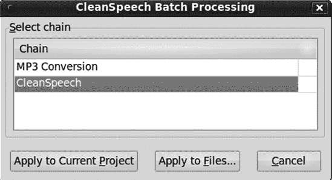
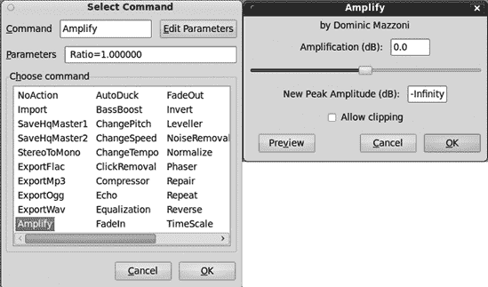
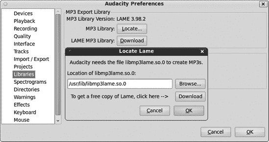
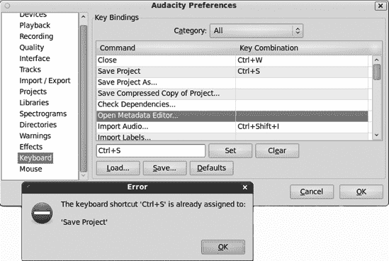

# 第十五章。自定义 Audacity

Audacity 在**编辑** > **首选项**对话框中提供了一些可配置的选项。您可以通过设置 Audacity 的默认选项以适应自己的工作流程来提高效率，因此在本章中，我们将学习所有关于它们的内容。

Audacity 在 1.3 系列中经历了重大变化，这是最终 2.*x*版本的 beta 版。Audacity 的开发者热情高涨，进行了大量优秀的改进和新增。您在本章中看到的内容应该非常接近最终发布版本，但如果有一些差异，请不要感到惊讶。

# 自定义 Audacity 的默认选项

Audacity 的默认选项在**编辑** > **首选项**中设置，您也可以通过按 ctrl-**P**打开。许多这些设置可以在菜单和工具栏中覆盖，这比每次想要临时更改设置时打开首选项对话框要快。图 15-1 显示了 Windows 中主要首选项菜单的外观。

记得在启动 Audacity 之前将任何 USB 或 FireWire 设备插入并打开，否则 Audacity 将无法检测到它们。

让我们从顶部开始，逐步向下进行。

# 设备

在设备对话框中，主机是您操作系统的基本声音系统。对于 Windows，这应该是 DirectSound 而不是 MME。播放和录音设备应该是您的特定设备。在图 15-1 中，我选择了我的 ThinkPad 上的 SoundMAX 集成芯片组。您的声卡可能不同。您还可以选择主声音驱动程序，这意味着默认录音和播放设备在 Windows 控制面板的声音模块中已选择。

图 15-1. 在 Windows 中选择默认录音和播放设备

对于 Linux 用户，主机将是 ALSA、JACK 音频连接套件或开放声音系统（OSS）。播放和录音设备选择器可以使用 ALSA 默认设置或选择特定设备（图 15-2

图 15-2. 对于 Linux 用户来说，看起来是这样的：在我的系统中，默认的录音设备选择器显示内置的 ATI 芯片组、MobilePre USB 和 ALSA 默认设置。

录音通道的数量取决于你的录音接口支持什么。例如，如果你有一个具有 10 个通道的多通道接口，你可以选择 10 个，即使你没有使用那么多。然后 Audacity 将打开 10 个音轨，所以如果你在其中的 6 个上录音，你将有 4 个空音轨。

# 播放

播放对话框（图 15-3

图 15-3. 播放对话框

Audacity 的许多特殊效果（在生成和效果菜单中）都有预览按钮，这样你可以在实际将它们应用到音轨之前听到你的更改。预览长度控制着预览的持续时间。

剪辑预览是一个用于预览当你剪辑音轨的一部分时音轨将如何听起来很酷的工具。默认为 1 秒，但你可以设置为任何你喜欢的。选择你认为想要剪辑的音轨部分，但不要剪辑它；只需选择它。然后按键盘上的 C 键，你将听到选择前后的音频预览，就像你已经进行了剪辑一样。要播放选择，请按空格键。

记得如何更改选定区域的大小吗？确保你有选择工具处于活动状态。将光标移至选定区域的边缘；它应该变成一个小 I 形光标。按住 shift 键，然后点击并拖动。shift-right arrow 或 shift-left arrow 扩展选择，而 shift-ctrl-right arrow 或 shift-ctrl-left arrow 缩小它。

播放时的搜索时间控制着 Audacity 的*跳转前进*功能的长度。当你播放音轨时，按左箭头键或右箭头键可以向前或向后跳转 Short period 设置中的秒数。按住 shift 键，然后按左箭头键或右箭头键可以跳转到 Long period 设置中的长度。

# 录音

录音对话框（图 15-4

图 15-4. 录音窗口

选中“叠加：在录制新音轨的同时播放其他音轨”以在听现有音轨或音轨的同时录制新音轨。例如，你可以首先录制一段优美的提琴音轨。然后启用叠加，提琴音轨将在你录制人声音轨、第二提琴或其他任何你想要的音轨时播放。

“软件播放：在录音或监控新轨道时收听”通过您的播放设备监控您的录音会话。软件播放仅在录音输入和播放位于同一声卡上时才工作。（Linux 用户：如果它们是不同的设备，您可以使用 JACK 创建连接。）这不是监控录音会话的最佳方式，因为可能会出现明显的延迟，并且可能会增加足够的 CPU 负载导致跳音。您的录音接口上的专用监控端口更好。如果您没有，可以尝试使用软件播放。（注意，它说“在录音立体声混音时取消选中”。换句话说，它仅与单声道轨道一起工作。）您还可以从传输菜单中启用和禁用叠加和软件播放。

你可能会在延迟部分花费一些时间，试图在性能和减少延迟之间找到最佳平衡。音频缓冲控制内存中缓冲的音频量。当这个缓冲区更大时，性能更平滑，但延迟增加。当它较小时，延迟减少，但如果音频缓冲区太小，CPU 将无法跟上，会出现跳音和卡顿。当你进行叠加录音或使用软件播放时，较高的延迟是明显的。（有关更多信息，请参阅叠加录音。）

延迟校正补偿了叠加录音中不可避免的延迟。播放时始终存在一些延迟，因此当你进行叠加录音时，新轨道总是落后于播放轨道。（有关更多信息，请参阅叠加录音。）

可以在这里启用声音激活录音，并设置触发录音的分贝水平。您也可以从传输菜单中完成此操作。

# 质量

质量对话框(图 15-5)设置了播放和录音的默认音频质量值。

图 15-5. 质量对话框

样本部分设置了默认的采样率和比特深度，在这个菜单中分别称为采样率和采样格式。这些设置可以在单个轨道菜单和选择工具栏中覆盖。请注意这里的术语混淆——*采样格式*和*比特深度*是同一件事，但比特深度是正确的术语。只有在 Audacity 中比特深度才被称为采样格式。

实时转换设置选择应用于 Audacity 中播放音频文件的采样率和比特深度转换类型。当你的音频文件采样率与项目速率不同时，会发生重采样。如果音频文件的比特深度与项目比特深度不同，它将被转换为项目值。这不会改变文件，因为转换是在播放时即时进行的。最佳 Sinc 插值器执行最高质量的转换。但它很耗 CPU，所以如果播放变慢，尝试中等 Sinc 插值器。快速插值器、零阶保持（ZOH）插值器和线性插值非常快，但不是很好，并且会引入可听见的失真。

*抖动* 是故意添加一些噪声以平滑波形，当 32 位或 24 位音频文件转换为 16 位时。*形状*抖动应该给出最佳结果，并且它是最耗 CPU 的。*三角形*是质量和 CPU 周期之间的折衷，而*矩形*轻量级并且改动最小。你不必应用抖动；你的耳朵会告诉你它是否有所改进。

高质量转换设置与实时转换设置类似，但它们是在混音和导出时应用于音轨的，因此与实时转换设置不同，你的项目文件会发生变化。

# 接口

接口对话框（图 15-6

图 15-6. 接口对话框

**音频输入/输出按钮的 ergonomics 排序**

选中此选项将控制工具栏中的按钮按以下顺序排列：暂停、播放、停止、跳转到开始、跳转到结束、记录。未选中时，它们将按以下顺序排列：跳转到开始、播放、记录、暂停、停止、跳转到结束。

**程序启动时显示“如何获取帮助”消息**

选中此选项将显示一个消息框，其中包含指向 Audacity 帮助资源的链接，例如手册和维基。如果你想要本地副本，可能需要单独安装 Audacity 手册。最新版本将在网上。

**仪表/波形 dB 范围**

这是你在仪表工具栏和波形 dB 视图（轨道菜单）中调整显示比例的地方，从 -36 dB 到 -145 dB。

**语言**

如果你希望 Audacity 会话使用与操作系统默认语言不同的语言，这是一个很好的便利功能。你还需要在系统上安装语言字体。

**手册位置**

使用此功能将 **帮助** > **手册** 编程为查找 Audacity 手册的本地副本，或直接访问在线版本。

**关闭最后一个窗口退出 Audacity**

如果您取消选中此复选框，关闭最后一个打开的项目将使 Audacity 保持打开状态，您将需要选择**文件** > **退出**（或按 ctrl-Q）才能完全关闭。当您正在处理大量项目时，例如将一批黑胶唱片转移到 CD 上，这很有用，因为您可以在完成每个项目后关闭它，而无需关闭 Audacity。

**在完成较长时间的活动后发出蜂鸣声**

选中此选项，当任务完成时间超过一分钟时，Audacity 会发出蜂鸣声。

**清洁语音模式**

清洁语音模式创建了一个定制的、简化的 Audacity 界面，用于快速清理和快速 MP3 导出。在控制工具栏中添加了一个额外的按钮，菜单也被简化了（图 15-7

图 15-7. 清洁语音模式按钮

图 15-8. 清洁语音模式有两个预制操作：清洁语音和 MP3 转换。

MP3 转换只包含两个操作：归一化和导出为 128Kbps MP3。如果您通过点击“应用至当前项目”按钮将 CleanSpeech 或 MP3 转换应用于打开的项目，导出的文件将进入项目目录中名为*cleaned*的目录。您也可以从一个空项目开始，点击“应用至文件”，然后从文件选择器中选择要转换的文件。转换后的文件将被导出到与源音频文件相同的目录中。使用第二种方法，不会创建新的 Audacity 项目。

默认的 CleanSpeech 设置相当严厉，因为它们应用了噪声消除和电平化效果。噪声消除需要一个自定义的噪声配置文件才能有效，而且在这里无法构建自定义配置文件。电平化效果引入了大量的失真。它应用了归一化效果两次，这可能会增加噪声。尽管如此，您仍然可以修改这两个链中的任何一个，或者创建新的链，尽管在撰写本文时，Audacity 的链功能仍然相当不成熟，且文档也不太完善。

选择**文件** > **编辑链**以查看预制 CleanSpeech 和 MP3 转换的确切操作（图 15-9

图 15-9. MP3 转换和 CleanSpeech 选项

即使在其当前未完成的状态下，Audacity 开发者通过通过图形界面使这些自定义批处理作业可定制，也有正确的方法。要创建一个新的链，打开**文件**>**编辑链**对话框(图 15-10)，然后在左侧面板中点击**添加**按钮。一个小消息窗口弹出，要求你为新链命名。在这个例子中，我创建了新的“测试”链。

图 15-10. 创建一个新的自定义链

现在，我可以通过点击**插入**按钮(图 15-11)将一个命令添加到测试链中。这打开选择命令对话框。在正常模式下，它比在 CleanSpeech 模式下有更多的命令。

要找出你是否可以自定义命令参数，首先选择一个命令，然后点击**编辑参数**按钮。在图 15-12 中，我们使用放大效果这样做。这打开它的正常对话框，因此我们可以以通常的方式设置放大参数。

这并不适用于所有命令，但你可能会发现你可以创建一些有用的链来自动化常规任务。

图 15-11. 选择命令对话框

图 15-12. 设置放大效果参数

# 音轨

音轨对话框(图 15-13)控制你的 Audacity 音轨在录音、编辑和播放时的行为：

图 15-13. 设置你的音轨行为默认值

**播放时更新显示**

在播放时自动滚动。如果它使你的电脑运行太慢，你可以禁用它。尽管如此，如果你真的需要这样做，你可能真的需要考虑升级你的电脑。

**自动垂直缩放以适应音轨**

这可能是一个方便的选项：你的音轨会垂直调整大小以适应屏幕。但如果你的项目中有太多音轨，它们会变得非常小。音轨太少，它们会扩大以填充屏幕。

**默认视图模式**

选择你的默认波形显示，它具有与轨道菜单中相同的选项：波形，这是 Audacity 的默认选项；波形 dB；频谱；频谱对数(f)；或音高 EAC。（参见轨道面板以了解更多信息。）

**如果没有选择任何音频，则选择项目中的所有音频**

如果这个选项未选中，所有需要选择的菜单项都将变为灰色，直到你选择某个选项。当它被选中时，当你没有选择任何内容时，所有轨道都将默认选中。

**启用剪切线**

这是一个很好的小功能，可以帮助你跟踪最近的剪切。当你进行剪切时，一条浅蓝色线标记位置。当你将光标移到其他地方时，蓝色线变为红色。

**启用拖动左右选择边缘**

这允许你使用鼠标扩展或减少选择。当这个选项未选中时，你必须使用键盘或选择栏。

**“移动轨道焦点”会重复遍历轨道**

当你有多个轨道时，你可以使用上下箭头键更改焦点，当光标到达顶部或底部轨道时，只要按下键，它就会自动继续循环遍历轨道。

**编辑剪辑可以移动其他剪辑**

当这个选项被选中时，你可以在剪辑之间粘贴，Audacity 会自动为新粘贴创建空间。当它未被选中时，如果没有足够的空间，你将无法在那里粘贴。

**独奏按钮**

这有一个下拉菜单，包含三个选项，用于控制轨道面板和混音板上的独奏按钮的行为：标准、简单、无。在标准模式下，点击多个轨道上的独奏按钮相当于选择它们，并且你可以这样选择多个轨道。在简单模式下，点击一个轨道上的独奏按钮会静音所有其他轨道。无选项移除所有独奏按钮，只留下静音按钮。

# 导入/导出

在这里，你可以设置一些有用的默认值用于导入和导出音频文件（图 15-14)：

图 15-14. 设置默认导入和导出行为：导入/导出

**在导入音频文件时**

你必须选择前两个选项之一：“在编辑前复制未压缩音频文件（更安全）”或“直接从原始文件读取未压缩音频文件（更快）”。

第一个选项增加了冗余，并允许您在不损坏 Audacity 项目的情况下操作或删除源音频文件。第二个选项更快，且更节省磁盘空间。如果您不打算更改源文件，则应使用此选项。例如，假设您有一段您乐队的现场录音，您打算对其进行编辑，并从中制作一些 CD 和下载文件。如果您像我一样，您会保留原始文件完整无缺，包括所有瑕疵，并制作备份副本，因此您不需要 Audacity 为原始文件制作额外的副本。

**在项目中标准化所有轨道**

此设置将在将音频文件导入项目时根据**效果** > **标准化**的当前设置对所有音频文件进行标准化。我更喜欢将标准化作为大多数项目中的最后一步之一，尤其是在我将多个轨道混合到立体声时，因为混合轨道会使它们变得更响亮。但这个选项在您正在进行不需要大量编辑的项目时可能很有用，例如从已经编辑和混合的音频文件中汇编一个汇编。

**在导出轨道到音频文件时**

“始终将所有轨道混合到立体声或单声道通道”是当您主要创建立体声或单声道混合时的合理选择。“使用自定义混合”在导出时打开通道映射器（Audacity 称之为*混音器*），这对于多声道环绕导出以及您想要对立体声导出有更多控制时是必需的。

**在导出步骤之前显示元数据编辑器**

选中此选项意味着在导出时，元数据编辑器将为每个单独的歌曲轨道或文件打开，以便您可以单独验证或编辑每个文件的元数据。如果您正在导出大量单独的歌曲或轨道，这可能是一项庞大的工作。您应该首先在**文件** > **打开元数据编辑器**中输入所有轨道的共同信息，然后 Audacity 将自动为每首歌曲输入这些信息，并自动输入每个轨道编号。

# 项目

项目对话框控制自动保存间隔以及如何管理从其他项目衍生出来的项目（图 15-15)：

**在保存依赖于其他音频文件的项目时**

我认为 Audacity 项目依赖于其他 Audacity 项目不是一个好主意。它们应该是自包含的。如果您需要节省磁盘空间，那么您可能希望您的 Audacity 项目共享依赖项，但我认为这是在寻找麻烦，因为如果任何东西发生变化，它将影响多个项目。安全的选择是“始终将所有音频复制到项目中（最安全）”。如果您想为每个项目单独决定，则“询问用户”是合适的。“检查依赖项”可以通过点击**文件** > **检查依赖项**来检查是否有任何项目具有依赖项。

**自动保存**

如果您希望 Audacity 在您选择的任何间隔自动保存项目副本，请点击此处。副本将放入一个单独的目录，Audacity 使用该目录进行损坏项目的自动恢复。它不会保存数据文件，这些文件具有 *.au* 扩展名，而是保存项目元数据，这些元数据保存在一个 XML 文件中。Linux 用户可以在 */.audacity-data/AutoSave/* 中查看这些自动保存文件；它们就像项目 *.aup* 文件一样。在 Windows XP 和 Vista 上，请查看 *Documents and Settings\<用户名>\Application Data\Audacity*，在 Windows 7 上，请参考 *Users\<用户名>\AppData\Roaming\Audacity*。

图 15-15. 设置默认导入和导出行为：项目

当 Audacity 运行时，您无法保存项目，因此充分利用每个机会通过按 Ctrl-C 或点击 **文件** > **保存项目** 来停止录音并保存项目是个好主意。

# 库

库对话框确认您是否已安装 LAME 和 FFMpeg，显示它们的安装位置，并显示它们的版本 (图 15-16).

图 15-16. 库对话框显示版本号，3.98.2，以及完整文件路径。如果未安装 LAME，则不会显示这些信息。

如果缺少任何这些组件，只需点击下载按钮来查找并安装它们。

# 频谱图

此对话框控制您选择频谱或音高 EAC 视图时轨道显示的详细程度。这些对于深入频率分析非常有用。(第十一章 有关于频率分析的精彩介绍。) 这里有很多数学运算，我不太理解，但我对那些理解数学并改进使数字音频工程成为可能算法的聪明人表示感激。第一个设置，FFT（快速傅里叶变换）窗口，控制显示多少频率细节。较大的 FFT 大小显示更多低音频率，时间分辨率更少。

窗口类型列出了诸如矩形、汉宁、巴特利特、汉明、韦尔奇和高斯等选项。用我能想到的最简单的话来说，不深入数学，这些是数字信号的图形视图，旨在帮助进行详细分析。根据维基百科上的“窗口函数”文章（[`en.wikipedia.org/wiki/Window_function/`](http://en.wikipedia.org/wiki/Window_function/))，Blackman-Harris 是一个低分辨率、高动态范围窗口，而其他所有都是高分辨率和中等分辨率窗口。

最小/最大频率设置在你在有限频率范围内工作（如处理声音或单一乐器）时，可以用来修剪显示。

# 目录

在“目录”对话框（图 15-17

图 15-17. 临时文件位置

如果你使用的是非常慢的电脑，那么“音频缓存”设置是一个相当绝望的选择。选中此选项会将所有录音保留在内存中，直到你停止录音，然后才会写入磁盘。对于硬盘非常慢的电脑，这肯定会提高性能。但是，一旦出现小功率故障或内存不足，你的录音会丢失。在笔记本电脑上风险较小，因为它有电池，你可以设置一个最低内存阈值以触发写入磁盘。Audacity 有一个硬编码的最低 16MB RAM 限制，所以你不能使用低于这个设置的值。

# 警告

这件事非常简单，你可以在睡梦中完成——决定你希望 Audacity 为不同的操作显示哪些警告（图 15-18

图 15-18. 打开或关闭警告

# 效果

此对话框提供了启用或禁用 Nyquist、VAMP、LADSPA 或 VST 效果的选择。（Linux 用户将看不到 VST 效果，因为它们在 Linux 上不工作。）我不知道你为什么想要禁用这些中的任何一个，但如果你想要，你可以这样做。

# 键盘和鼠标

在这两个对话框中，你可以设置自定义键绑定并查看鼠标快捷键。你不能更改鼠标快捷键，但你可以随意自定义键盘快捷键。点击你想要创建快捷键的功能；比如说，是打开元数据编辑器。点击设置按钮旁边的框并按下你想要的快捷键。在图 15-19 中，我输入了 ctrl-S 并点击了设置按钮。然后 Audacity 友好地告诉我 ctrl-S 已经被占用。因为 Audacity 会为你找到任何冲突，所以这个过程很快。

图 15-19. 更改键盘快捷键
