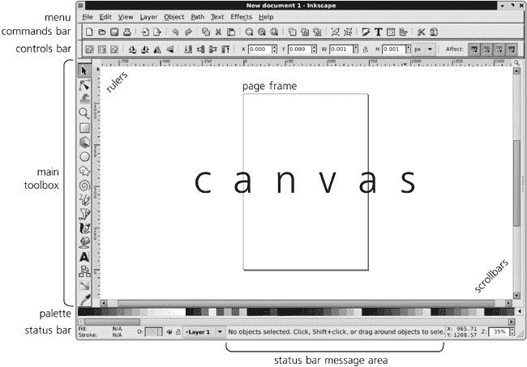
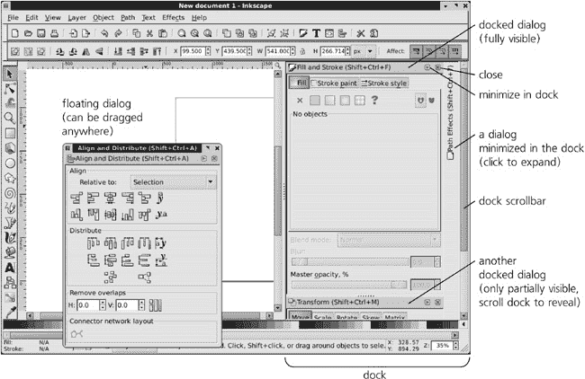
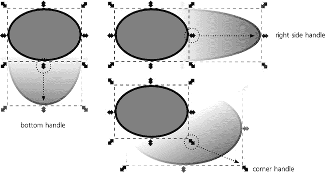
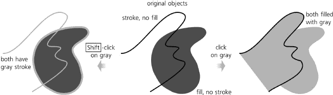
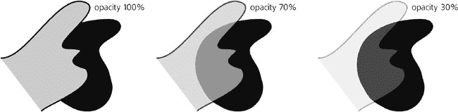
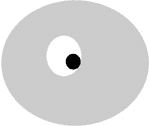

# 第二章. Inkscape 入门

这本入门章节是为那些没有 Inkscape 经验，以及几乎没有其他矢量编辑器经验的人准备的。这是你在新世界中的第一步。如果你已经使用过 Inkscape，并且认为你可以轻松地自己重现本章的最终示例（图 2-24)，那么请随意跳过这一章。

# 2.1 安装 Inkscape

在安装 Inkscape 之前，你需要问自己的第一个问题是，你是否想要一个 *稳定版本* 还是 *开发版本*。稳定版本已经正式发布，并且与它们关联着版本号。将一个版本（例如，版本 0.46.1）称为稳定版本并不意味着它是完美的且从不崩溃；这仅仅意味着这个版本已经接受了相当数量的测试，文档更加完整，并且这是大多数人使用的版本。实际上，除了其稳定性外，运行稳定版本的最大优势是这是其他用户运行的版本，因此，其他 Inkscape 艺术家更有可能帮助你。

总体来说，我建议你从稳定版本开始，但如果发现你喜欢 Inkscape 并想支持其开发，或者你需要自发布以来添加的新功能（访问下一版本的[发布说明](http://wiki.inkscape.org)以查看正在开发的内容）。

使用 *开发版本* 有其独特的优势。首先，这些构建包含所有最新的最佳功能，与最新的稳定版本相比，这些新功能通常非常显著（尤其是如果自上次稳定发布以来已经过去了几个月）。这些新功能通常包括对稳定版本中重要错误的修复。此外，通过运行开发版本，你帮助开发社区发现和解决新的错误。自然地，活跃的开发者对开发版本更感兴趣，因此你更有可能直接从开发者那里获得及时的帮助。

但稳定性如何呢？诚然，开发版本平均来说有更多的错误，崩溃得更频繁。然而，如果你遇到了一个真正让你抓狂的错误——并且如果这个错误没有足够快地得到修复——你总是可以回到最新的稳定版本。（记住，无论使用哪个版本，都要经常保存！）

### 注意

*Inkscape 的稳定版本仍然编号在 1.0 以下，每个版本的增加只是版本号增加 0.01（例如，0.40 之后是 0.41，然后是 0.42，依此类推）。最近，稳定版本之间通常有几个月的时间间隔。通常，一个 0.* xx *稳定版本之后会跟着一个 0.* xx. *1 错误修复版本（例如，0.45 在一个月内被 0.45.1 所跟随），它不会添加新功能，但会修复一些错误。0.* xx *版本之后的开发构建被指定为 0.* xx*+svn（例如，0.46+svn），每个构建都有一个修订号（例如，r20887）。你可以通过打开**帮助** ▸ **关于**（查看**关于**窗口的右上角）或通过带有*`--version`*参数的命令行运行 Inkscape 来查找你的 Inkscape 安装的确切版本号、修订号和构建日期（在 Windows 上不适用，附录 C)。*

幸运的是，稳定版本和开发版本的安装同样简单。只需访问 Inkscape 网站的下载部分(*[`www.inkscape.org`](http://www.inkscape.org)*)，然后根据链接选择适用于你的操作系统的稳定版本或开发版本。

**Windows**

+   你将下载一个*.exe*安装程序。只需运行它，按照提示选择语言、目录和其他选项。最后，你将在桌面上和开始菜单中看到一个可点击的 Inkscape 图标。

### **注意**

*有时，Windows 的开发版本是带有*.7z*扩展名的存档文件。下载免费的解压缩工具[`www.7-zip.org`](http://www.7-zip.org)。使用这种构建版本，你只需要将文件解压缩到某个目录，它就会在那里很好地运行。*

**Linux**

+   有几种选择。如果你只需要一个稳定版本，大多数 Linux 发行版已经包含了一个；只需在你的软件安装应用中选择它（例如，在 Ubuntu 上，启动 Synaptic 或直接从命令行运行`apt-get install inkscape`）。

    然而，这个版本通常相当旧。如果你想下载一个较新的稳定版本或开发版，请下载所选版本的 autopackage。在获取*.package*文件后，使其可执行并运行它。（第一次这样做时，你将提示下载和安装 Autopackage 程序本身；一旦允许，所有操作都将自动完成。）按照提示操作。一旦安装了包，你将在**系统**菜单和/或在桌面上找到 Inkscape（当然，你也可以通过在终端中键入`inkscape`来运行它）。

**Mac OS X**

+   你将下载一个磁盘映像 (*.dmg*) 文件；只需在 Finder 中打开它，并将内容拖到系统上的某个位置。请注意，你需要从 Apple 的 OS X 安装盘中安装 X11，以便 Inkscape 能够运行。

新的开发版本相当频繁地发布，通常每天都会发布。如果您需要最新的 Inkscape，或者由于某种原因上述方法对您不起作用，您可以直接从 SVN 仓库获取 Inkscape 的代码并自行编译。在所有主要平台上都可以编译 Inkscape；然而，它需要高于平均水平的计算机知识，所以我们在这里不讨论它。

# 2.2 Inkscape 的“Hello, World!”

学习一门新的编程语言通常从“Hello, world!”示例开始。这是一个最小化但真实且可运行的程序，它简单地输出字符串“Hello, world!”并在某处退出。让我们通过一个最小化但真实的 Inkscape 编辑会话来了解这个过程，包括启动程序、创建一些对象、编辑它们，并保存结果。

启动 Inkscape 与启动任何其他程序没有不同。根据您的操作系统和个人偏好，您可以点击图标、从菜单中选择它或在命令行中输入`inkscape`。无论您使用什么，最终都会得到一个默认的 Inkscape 界面：

图 2-1. Inkscape 的第一印象

Inkscape 的窗口显示中间的白色工作区域，称为**画布**，以及边缘的一组工具和控制。画布是我们现在感兴趣的部分。它代表 Inkscape 为我们创建的新、空白的文档，因此您不需要选择**文件** ▸ **新建**。我们可以立即开始工作。

在左侧的图标列中，点击带有蓝色方形的图标。这是矩形工具，它允许您创建和编辑矩形。现在，在画布上的任何位置点击鼠标按钮并拖动。会出现一个蓝色矩形；当您释放鼠标时，矩形将作为您文档中的新**对象**创建：

图 2-2. 我们创建了一个矩形。

现在，点击左侧的**A**按钮，这将切换到文本工具。点击（但不要拖动）矩形内部。你会在点击的地方看到一个闪烁的文本光标。输入`Hello, world!`。你刚刚创建了一个文本对象，这是你文档中的第二个对象：

图 2-3. 我们添加了一些文本。

现在，你可能对对象的尺寸、位置或颜色有了更好的了解。简单的修复！在左侧的工具栏中，点击显示箭头的最上面的按钮。这是选择工具。现在您可以通过鼠标拖动将任何对象移动到画布上的任何位置。要更改对象的颜色，只需将颜色从窗口底部的调色板拖动到对象上即可。

调整得足够了。文档看起来完美。唯一的问题是它还没有保存到文件中。只需选择 **文件** ▸ **保存**，导航到您选择的目录，并输入一个文件名。就是这样：您已经创建了一个包含图形和文本的新 SVG 文档。恭喜！

# 2.3 界面概述

现在，让我们更仔细地看看 Inkscape 的界面：

图 2-4. Inkscape 界面元素

当然，您不必使用 Inkscape 默认启动时的小窗口。您可以自由地将其最大化以填充整个屏幕。您甚至可以按  进入全屏模式。

窗口的大部分区域被 *画布* 占据，周围有标尺（顶部和左侧）和滚动条（底部和右侧）。在画布上，您可以看到一个页面的矩形阴影（默认为 A4 纸张大小）。这个 *页面框架* 定义了您文档的边缘。然而，Inkscape 允许您在页面上和页面外自由绘制：页面框架不是限制，而是一个提示。这个框架只有在导出某些矢量格式和在外部查看器中查看 SVG 文件时才有意义；在这两种情况下，您将只能看到与页面矩形重叠的对象。如果您不关心它，可以轻松地隐藏页面框架。

您看到的画布部分远非所有画布。实际上，画布如此巨大，几乎无限。您可以通过缩放或向任何方向滚动来看到更多内容，正如我们将在下一节中看到的。在 Inkscape 中您永远不会缺少空间！（实际上，您甚至可能会在画布的浩瀚中迷失方向；要返回页面框架，只需在任何时候按  键即可。）

在画布左侧，有一个垂直的 *主工具箱*。这个工具箱上的按钮激活各种 Inkscape 工具。每个工具都有自己的目的、功能、控件、键盘快捷键、鼠标光标和其他内容。一些工具创建新对象，其他工具以各种方式编辑它们，还有一些工具帮助您在文档中导航。我们将在本章中简要介绍一些工具，并在本书的其余部分详细探讨它们。

在画布上方，您可以看到另外两个工具栏，都是水平的。其中，顶部的工具栏称为 *命令栏*，是您在许多程序中都能找到的常规工具栏。它有用于 **保存**、**打开**、**撤销** 等操作的按钮。另一个工具栏位于画布上方，更有趣：它被称为 *工具控制栏*（或简称 *控制栏*）并包含适用于当前选中工具的各种选项和控制。点击左侧的一些工具按钮，并观察控制栏的内容如何变化。

在画布下方是*调色板*；它可以通过其自己的滚动条水平滚动。再往下，是*状态栏*，一个杂乱无章的物品袋，其组件我们将在稍后详细探讨。现在，请注意状态栏的*消息区域*，它始终显示与您当前操作相关的某些消息。请注意消息区域的内容；它可能为您节省大量时间和挫折！

最后，在画布右侧是 Inkscape 对话框的*停靠栏*。默认情况下，停靠栏是隐藏的，但如果您调出一个对话框（例如，通过按  打开的**填充和描边**对话框），它将出现在自动展开的停靠栏中：

图 2-5. 几个已停靠的对话框（以及一个浮动对话框）

停靠栏可以包含许多不同的对话框；如果它们太多以至于无法垂直排列，停靠栏会显示滚动条。停靠栏中的每个对话框都可以最小化（带有三角形的按钮）或关闭（带有 X 的按钮）。您可以在停靠栏中拖动对话框以重新排列它们。您还可以将对话框从停靠栏拖出，在这种情况下，它变为*浮动*，可以放置在屏幕上的任何位置。然而，在大多数情况下，使用停靠对话框更为方便。

### 注意

*截至版本 0.47，并非所有 Inkscape 对话框都可以停靠（有关更多信息，请参阅**3.7 对话框**）。*

除了菜单、画布和停靠栏之外，界面的所有元素都可以通过**视图** ▸ **显示/隐藏**子菜单中的命令来显示或隐藏。

# 2.4 平移和缩放

对于无限矢量画布，能够移动画布以及放大和缩小以获得更方便的视图的能力非常重要。Inkscape 提供了大量的平移（滚动）和缩放方法，足以满足每个人的口味。

当然，画布滚动条可以很好地滚动画布到您想要的位置。然而，这些滚动条并不那么方便，所以我通常通过按  隐藏它们。相反，我最常用的方法是*中间拖动*：在画布上的任何一点按下鼠标中间按钮并向任何方向拖动。中间拖动在任意工具或模式下都有效。

### 注意

*如果您认为您的鼠标没有中间按钮，尝试按下（不是滚动）大多数鼠标在左右按钮之间中间的滚轮。在大多数情况下，这个滚轮可以像按钮一样点击。当然，旋转滚轮也可以垂直滚动画布，而使用*  *旋转滚轮则水平滚动。*

然而，很多时候，我的右手在键盘上而不是鼠标上。在这种情况下，最方便的滚动画布的方式是按。例如，如果你按住，画布开始向下滚动（即，你的视图开始向上移动），最初速度较慢，但逐渐加速。当你习惯了，这感觉非常自然。

缩放和缩小也很容易。使用键盘，只需按加号或减号键即可缩放或缩小（注意，与大多数其他程序不同，这些只是普通的加号和减号键，无论是在主键盘还是在数字键盘上；你不需要按或）。使用鼠标，点击中间键来放大，-点击中间键来缩小。或者，切换到缩放工具，你可以使用常规的左键点击来放大，-左键点击来缩小，或者用左键拖动来放大到矩形区域。

要获取更多关于缩放和滚动的信息和技巧，请跳转到**3.8 基本缩放**。

# 2.5 创建对象

现在你可以在画布上导航了，让我们更仔细地看看可用于创建对象的工具。

朝下看主工具箱，第一个创建对象的工具是矩形工具。这个工具和接下来的四个工具——3D 盒子、椭圆、星形和螺旋——统称为*形状工具*，它们创建的对象称为*形状*。

图 2-6. 使用形状工具

*形状*是一种几何对象，你不仅可以移动、缩放或旋转（就像其他任何对象一样），还可以以特定于其类型的方式编辑。例如，矩形可以有圆角；椭圆可以被转换成一段（饼形形状）或椭圆弧；3D 盒子可以在其自己的 3D 空间中移动和调整大小。我们将在第十一章中讨论形状；现在，选择任何形状工具并在画布上开始绘制。每次鼠标拖动，从按下到释放左键，都会创建一个新的形状。

在工具箱的下一部分是*铅笔*和*钢笔*工具。两者都创建任意路径，但方式不同。铅笔工具就像一支真正的铅笔：你在画布上绘制，并留下痕迹。（注意，这个痕迹并不精确；与实际的鼠标轨迹相比，它有点平滑。）

图 2-7. 使用铅笔和钢笔工具

钢笔工具更复杂；它假设你理解路径是由节点通过直线或曲线段连接而成的。现在，只需用这个工具在不同的点点击几次（这会在点击点之间创建直线段），然后点击并拖动几次，最后按下以完成路径。铅笔和钢笔默认创建带有细黑描边的路径但没有填充。我们将在第十四章中讨论这些工具。

接下来的两个工具，*书法笔*和*油漆桶*，也创建路径，但与铅笔和钢笔不同，它们默认产生填充路径而没有描边。书法笔是 Inkscape 中最多才多艺的工具之一；它的许多选项和参数允许它模仿不仅书法笔（这是它的原始目的），还有各种画笔和许多其他绘图工具和行为（其中一些在现实世界中没有对应物）。这是那些使用 Inkscape 来*简单绘图*的人的主要工具（第十四章）。

图 2-8. 使用书法笔和油漆桶工具

油漆桶工具对于漫画家或插画师来说也是一个非常有用的工具。正如你所期望的，它可以填充任何封闭区域，创建一个填充的矢量路径。为了练习，用书法笔在封闭区域内画几笔，然后点击油漆桶工具。 (如果你在一个非封闭区域内点击，工具将无法填充，并在状态栏中提示。)

最后，*文本*工具用于创建和编辑文本对象。创建一个新的文本对象非常简单，只需点击任何位置并开始输入。或者，你可以点击并拖动，在这种情况下，你正在创建一个*流式文本*对象，当你输入到右边时它会自动换行。编辑现有的文本对象同样简单：使用文本工具点击它以定位光标，并使用所有熟悉的文本编辑键（箭头键，，，，等等）。文本工具是第十五章的主题。

图 2-9. 使用文本工具

那么，如果你需要在 SVG 文档中有一个位图对象，比如照片呢？这不是通过工具完成的，而是通过**文件**菜单中的**导入**命令。只需选择任何位图图像文件（JPG、PNG、GIF 和 TIFF 都适用），它就会被插入到你的文档中。然而，它仍然是一个位图；有关将其转换为矢量对象的方法，请参阅**18.6 位图过滤器**。

# 2.6 选择

如你可能已经注意到的，在你创建一个新对象（例如，使用矩形工具或书法笔）后，该对象周围会有一个虚线框。这个框表示对象是*选中*的。

选择是 Inkscape 中的基本概念。几乎所有工具、命令、对话框和快捷键都只对当前选中的对象有效。各种信息显示，如状态栏，总是描述选中的对象。快速准确地选择所需内容，以及快速了解当前选中内容和位置，对于在 Inkscape 中有效工作至关重要。

允许你选择对象的工具被称为，恰如其分地，*选择工具* (图 2-10). 它也是工具箱中的第一个（最上面的）工具，因为选择非常重要。你可以通过点击其按钮或按任意![httpatomoreillycomsourcenostarchimages1735356.png.jpg]、![httpatomoreillycomsourcenostarchimages1735358.png.jpg]或![httpatomoreillycomsourcenostarchimages1735308.png.jpg]来切换到这个工具。你真的不会错过这个工具！

图 2-10. 选择工具和选中的对象

使用选择工具进行基本选择非常简单（在 Inkscape 中任何其他基本事物也是如此）。你只需点击任何对象，voilà，它就被选中了。现在试试看。同时也要注意状态栏消息立即更新，告诉你你确切选中了什么：一个矩形、一个路径、一个椭圆、一个文本对象等等。

任何时候都可以选择多个对象，如图图 2-11 所示。通常，当你已经选中了某个对象时，点击另一个对象会取消第一个对象的选中。然而，如果你![httpatomoreillycomsourcenostarchimages1735338.png.jpg]-点击任何未选中的对象，你会*添加*它到选中对象列表中。（如果你![httpatomoreillycomsourcenostarchimages1735338.png.jpg]-点击一个已经选中的对象，你会*移除*它从选中状态。）注意状态栏关于你新选中的对象的说明。也要注意每个选中的对象都有自己的虚线框。

图 2-11. 多个对象被选中

需要一次性选择 1,000 个对象？无需进行![httpatomoreillycomsourcenostarchimages1735338.png.jpg]-点击 1,000 次。使用选择工具，只需*拖动*（按住鼠标按钮并移动鼠标，同时不释放按钮）穿过你想要选中的所有对象。你会看到一个跟随鼠标的矩形*橡皮筋*。当你释放鼠标时，所有完全位于橡皮筋内的对象将被选中：

图 2-12. 使用橡皮筋选择多个对象

你也可以通过键盘快捷键进行选择。键具有“转到下一个”的通用含义，所以在 Inkscape 中，按会选择下一个对象（通常是创建的顺序）。选择上一个对象。熟悉的，在许多程序中意味着*全选*，也按预期工作。

需要不同的选择？通过按或点击空白画布上的任何地方（不是对象）来取消任何已选择的内容。

这只是 Inkscape 提供的所有选择方法和技巧的一小部分，但应该足以让你开始。让我们继续实际改变我们已选择的内容。

# 2.7 变换

选择工具的另一个功能，除了选择对象外，是*变换*它们。

2.7 变换是一个简单的总称，指的是*移动*、*缩放*（调整大小）、*旋转*和*倾斜*。其中前两项——尤其是移动——在矢量工作中极为常见，因为几乎不可能一次就创建出所需精确位置和大小的大多数对象。你会发现你经常需要移动东西，所以你需要学会如何快速而精确地做到这一点。

### 注意

*所有四种变换模式都将对象视为一个整体*。通过变换，你可以移动、挤压、旋转或倾斜整个对象，但你不能相对于其他部分移动对象的一部分；这是其他工具的任务。例如，如果你的脸部绘画中的鼻子是一个单独的对象，你可以仅使用选择工具将其在脸上放大。但如果鼻子是脸部其余部分的对象的一部分，你需要使用其他工具来放大鼻子，而不会改变脸部。

使用选择工具*移动*选择项非常简单：只需用鼠标拖动所选的任何对象。如果你选择了多个对象，拖动其中的任何一个都会将它们全部移动。

一个非常常见的操作是*复制*对象，或者制作所选内容的精确副本。要这样做，请按；创建一个副本并将其放置在原始选择项的上方（因此看起来没有变化）。只需用选择工具将其拖动到你想要放置副本的位置。你还可以使用传统的复制和粘贴方法来复制对象(, )。

其他类型的变换稍微有些困难。注意，每次你选择任何东西时，选择区域周围都会出现八个箭头标记。拖动这些箭头标记之一执行*缩放*：这就是你如何使选择区域变大、变小、变高、变宽等等。四个角上的箭头可以向任何方向移动，自由调整选择对象的尺寸；其余的四个箭头只能向一个方向移动（顶部中心和底部中心标记垂直移动，左侧中心和右侧中心水平移动）。

图 2-13. 缩放对象

对于剩下的两种变换模式，*旋转*和*倾斜*，你需要点击任何已经选择的对象的任何位置，或者也可以按。注意箭头标记如何变化；现在你的选择处于*旋转模式*，而不是我们之前使用的*缩放模式*（图 2-14。下次选择这些或其他对象时，它们将首先进入缩放模式。

图 2-14. 旋转和倾斜对象

如果你更喜欢通过键盘控制 Inkscape，你可能会惊讶地发现，四个箭头键各自将选择区域移动到相应的方向。更有趣的是，左右尖括号(和)分别将选择区域缩小和放大，而方括号(和)则旋转它。没有倾斜对象的快捷键。

这就是使用选择工具进行对象基本变换的全部内容。再次强调，还有许多其他技巧、快捷方式和经验法则我们将在以后讨论，但到目前为止，这应该足以让你对 Inkscape 的工作方式有一个大致的了解。

# 2.8 样式化

Inkscape 中的任何对象都有一些样式。*样式*是一个复杂的概念，包括许多单独的属性，从填充的颜色到笔画的宽度，再到完全改变对象外观的复杂 SVG 滤镜。让我们看看如何改变对象样式的基础知识。

首先，你现在应该已经猜到了，任何在 Inkscape 中的操作，包括改变样式，都是应用于**当前选择**的。也就是说，在你改变某个对象的样式之前，你必须首先选择那个对象。

一旦你选择了想要样式的对象，最简单的事情就是点击画布底部的调色板。你点击的颜色将成为所有所选对象的新填充颜色。即使对象完全没有填充（比如用铅笔工具创建的路径），它也会被这种颜色填充。（注意，你可以向右滚动调色板以查看屏幕上无法显示的更多颜色。）

图 2-15. 从调色板设置填充或描边

你同样可以轻松地改变所选对象的描边颜色：只需点击而不是点击一个颜色。同样，如果某些对象没有描边，现在它们将会有描边。

现在，请注意 Inkscape 窗口左下角的状态栏左侧的复杂控制。这个控制（如图 2-16 所示）被称为**选择样式指示器**，正如其名，它指示了选择对象的样式（实际上，它只显示了最重要的样式属性；一个对象的样式远不止这个指示器所显示的）。简单来说，在这里你可以看到所选对象的填充和描边颜色。

图 2-16. 选择样式指示器

可能更重要的是，你还可以在这里改变这些样式属性。一个非常常见的操作是从所选对象中**移除**填充或描边。只需在**填充**（顶部）或**描边**（底部）色块上中击，或者右击相应的色块并从弹出菜单中选择**移除**。注意，没有填充和描边的对象是完全不可见的：你无法看到它，也无法点击它来选择（尽管你可以拖动橡皮筋**围绕**它来选择它）。

除了填充和描边颜色之外，一个重要的样式属性是**不透明度**。想象一下有自己颜色的彩色玻璃，但它仍然显示出其背后的东西；这就是在 Inkscape 中不透明度小于 100%的对象的行为。显然，0%的不透明度会使对象变得不可见。不透明度通过选择样式指示器中的**O:**控制来改变。尝试选择一个位于其他对象之上的对象，并输入不同的不透明度值；注意对象如何变得半透明。

图 2-17. 改变不透明度

如果您只想让两个对象具有相同的样式，这很容易做到。选择第一个对象并按 ；这将在剪贴板上放置对象的副本。然后选择其他对象（或多个对象），并通过按  将剪贴板对象的样式粘贴到它们上。这是使多个对象看起来相同的最简单方法。

# 2.9 保存和导出

现在，假设您在 Inkscape 中创建了一些东西，您希望与他人分享。最好的方法是什么？

将文档**保存**为 SVG 如预期那样工作。只需按  或从菜单中选择 **文件** ▸ **保存**，选择目录，输入文件名，然后点击 **保存**。

就分享而言，SVG 并不是一个坏格式；例如，如前所述，它可以在任何现代浏览器中直接显示，展现出所有的矢量魅力（除了微软编写的那个）。然而，由于各种原因，SVG 可能不是您情况下的可行选择。在这种情况下，您需要将文档**导出**为其他格式。再次转到**保存**对话框。注意右下角的下拉列表；现在它显示为 *Inkscape SVG*，但您可以看到还有其他可用的选项。实际上相当多！列出了十几种不同的矢量格式。

尽管如此，不要过于兴奋。这些格式中的几个只是 Inkscape SVG 主格式（普通 SVG、压缩 SVG 等）的变体。其他格式在各个方面都有严重限制，要么是因为目标格式本身与 SVG 相比有限，要么是因为 Inkscape 对该格式的导出器尚未完全开发，或者两者兼而有之。这些导出格式是可用的，但只有在你了解限制并考虑到这些限制来设计文档的情况下。

除了 SVG 之外，也许最安全的导出格式是 PDF (附录 B). 它仍然无法处理一些 SVG 功能（如默认情况下被光栅化的滤镜），但对于您在 Inkscape 学习的早期阶段将要创建的简单文档，它应该完全足够。PDF 的主要优点是，首先，它是矢量格式，其次，Adobe Acrobat Reader 和其他 PDF 查看器的用户比任何能够查看 SVG 的程序都要多。

如您可能已注意到的，**保存**对话框仅列出用于导出的矢量格式。但关于导出为位图图像怎么办？这是在另一个名为**导出位图**的对话框中完成的。^([6]) 通过按  或选择 **文件** ▸ **导出位图** (图 18-16) 来打开它。

在**导出位图**对话框的顶部，有四个按钮用于选择*导出什么*。如果你在绘制图像时尊重页面框架，从而很好地包围了你的艺术作品，请选择**页面**。否则，选择**绘图**以使导出区域覆盖图像中的所有对象，无论它们在哪里。你也可以选择只导出当前选区。

然后，设置你的栅格图像所需的像素大小或位图的分辨率（这两个值显然是相互关联的：增加一个会增加另一个，反之亦然）。最后，输入或**浏览**导出文件名并点击**导出**。（导出后，对话框仍然打开，原因将在**18.9.1 导出位图对话框中变得清晰）。

你完成了！拿出你保存或导出的文件，向世界展示。

* * *

^([6]) 实际上，这个对话框应该正确地称为*导出 PNG*，因为从 0.47 版本开始，它导出的唯一栅格格式是 PNG。尽管如此，在大多数情况下这并不是一个大问题。PNG 可以在所有浏览器中查看（尽管微软的 Internet Explorer 有一些问题，但它*可以*查看 PNG），支持全 RGB 颜色和渐变（alpha）透明度，并且是一个通用的格式，非常适合任何矢量艺术作品的呈现。如果你真的需要 JPG、GIF 或 TIFF，你可以使用任何数量的专用工具将 PNG 转换为所需的格式。

# 2.10 一个最终示例

让我们将我们迄今为止学到的知识应用到稍微复杂一些的插图上：一个愚蠢的，类似《南方公园》风格的男孩的脸。当然，这并不是一个很大的挑战，但它应该有助于巩固你所学到的所有新知识。

要开始，运行一个新的 Inkscape 实例，或者如果你已经在运行 Inkscape，按创建一个新的空文档。

选择椭圆工具并绘制一个椭圆（图 2-18

图 2-18. 一个椭圆

在头部椭圆的上方绘制一个较小的椭圆。发生了什么——它是看不见的吗？！不。椭圆（像大多数其他工具一样）只是记住了你分配给头部的颜色，现在为新的椭圆使用了相同的颜色，所以它看起来合并到了较大的头部椭圆的背景中（尽管你仍然可以看到它周围的选区框）。将调色板滚动到左边，点击白色色块以查看较小的椭圆：

图 2-19. 两个椭圆

这个较小的椭圆应该是男孩眼睛的白色部分。它可能并不完全是你想要的眼睛大小，而且对于眼睛来说位置也很奇怪。切换到选择工具，并将小椭圆拖动到你大致想要的位置。然后拖动角落的箭头标记之一，使其大致达到正确的尺寸，如图图 2-20 所示。

图 2-20. 定位第二个椭圆

现在我们还需要另一个椭圆来绘制眼睛的瞳孔。然而，我们不会回到椭圆工具，而是使用复制。在白色椭圆仍然被选中的情况下，按 。看起来没有明显的变化，但我们知道现在那里有两个椭圆，新的一个被选中。单击黑色色块，然后再次拖动箭头标记使瞳孔更小，并将其拖到合适的位置：

图 2-21. 头部和一个眼睛

眼睛已经准备好了——但我们需要两个相同的眼睛。让我们复制我们创建的整个眼睛。眼睛由两个独立的对象组成，所以在复制之前我们需要选择它们两个。你可以通过围绕眼睛拖动橡皮筋来完成这个操作（但确保从空白区域开始拖动，而不是从头部椭圆开始，否则你会拖动头部，这不是你想要的！），或者只需单击瞳孔，然后 -单击白色。按  并将第二个眼睛向侧面拖动（当你拖动任何一个时，两个对象都会移动）。

图 2-22. 头部和两个眼睛

现在，为了完成绘画，选择书法笔工具并绘制鼻子、嘴巴、耳朵和一些头发(图 2-23). 如果路径出现在某些错误颜色中，请单击调色板上的黑色；之后，所有新的书法路径也将是黑色。如果笔绘制得太宽或太细，请调整工具控制栏上画布上方的**宽度**值。如果某些东西出了问题，请按  撤销。

图 2-23. 欢迎来到这个世界！

图片已经准备好了，但我们还没有完全利用它所提供的所有可能性。你到目前为止所做的一切在位图编辑器中同样容易完成。但我们现在使用的是矢量图，所以让我们利用矢量图的具体优势来玩转结果。使用选择器，选择两只眼睛的白色部分，放大或缩小它们。或者移动瞳孔的位置。或者调整嘴巴的大小、旋转和移动。所有这些操作都能创造出丰富的面部表情。你还可以选择、复制并拖动整个绘制来展示几个例子并排：

图 2-24. 生命及其众多面容

保存或导出结果。这就完成了！
