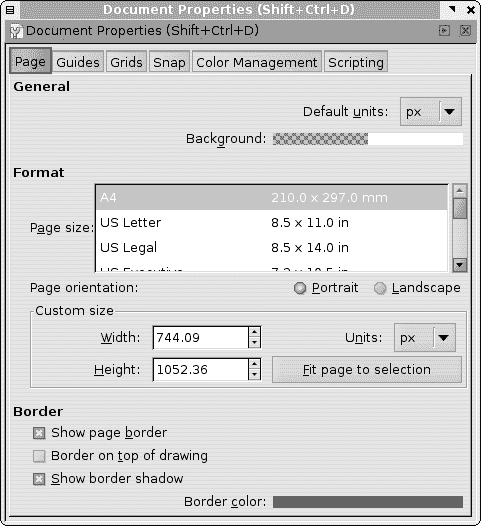
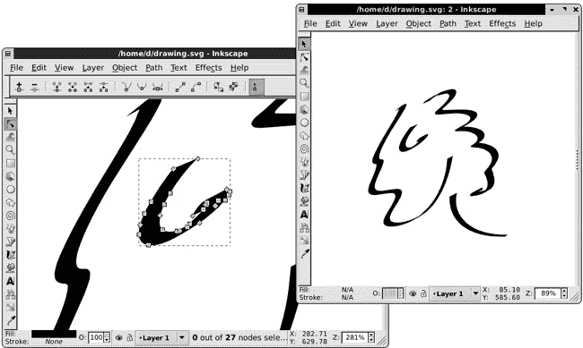

# 第三章. 设置和导航

在第一篇介绍性章节之后，这一章将最终以严肃的方式让您开始使用 Inkscape。从现在开始，我们将以最大程度的细节探讨实际主题，不留任何遗漏。很难预测您会发现哪些功能或技术最有用；这很大程度上取决于您工作的性质和您的个人品味。这就是为什么这本书试图涵盖 Inkscape 提供的所有内容。

在这一简短的章节中，您还不会创建或编辑任何对象。相反，您将准备您的 workspace，讨论一些有用的自定义设置，并学习通过缩放和平移导航文档的技术。

# 3.1 首选项

Inkscape 是一款极其可配置的软件。在这本书的整个过程中，我们将提到您可以通过更改来探索程序功能并更好地适应您工作方式的各类 Inkscape *首选项*。因此，在您开始使用 Inkscape 进行任何重要的事情之前，让我们看看如何在 Inkscape 中设置和存储所有这些不同的首选项。

Inkscape 中的所有用户首选项都属于两大类之一。

## 3.1.1 Inkscape 首选项

*Inkscape 首选项*（有时称为*全局首选项*或简称为*首选项*）影响程序中不依赖于您正在编辑的特定文档的那些方面。这些首选项包括各种工具和快捷键的默认行为、各种对象类型的处理细节、显示和颜色管理选项等。

大多数这些选项都在**Inkscape 首选项**对话框中设置（按或选择**文件** ▸ **Inkscape 首选项**）。然而，一些首选项是通过命令设置的；例如，当您通过按(或从**视图** ▸ **显示/隐藏**子菜单中选择等效命令)隐藏滚动条时，该设置也会作为全局首选项被记住。

图 3-1. Inkscape 首选项对话框滚动页面上的浮动工具提示解释了一个选项。

在整本书中，我们将讨论相关的特定全局选项，并引用**Inkscape 首选项**对话框的相应页面（页面列表显示在对话框的左侧）。对话框中的所有选项都有有用的描述；如果您需要帮助，将鼠标悬停在选项上并阅读浮动工具提示(图 3-1)。

注意，该对话框没有**保存**或**应用**按钮。大多数更改立即生效。少数更改需要您重新启动 Inkscape，这将在选项描述中提及。当您退出程序时，所有全局首选项都会自动保存。

存储全局首选项的文件称为 *preferences.xml*。其位置取决于您的平台；在 Linux 上，它是您家目录中的 *.config/inkscape* 目录；在 Windows 上，它可以在 *Documents and Settings\<your login>\Application Data\Inkscape* 中找到。

### 注意

*一些不常用的选项没有用户界面；设置它们的方法是手动编辑* preferences.xml *文件。这是一个格式简单且大部分可以自我解释的 XML 文件。通常，您将收到指示更改具有特定 ID 的元素的特定名称属性，例如，* `printing`*。然后您将使用文本编辑器打开该文件，搜索字符串* `id="printing"`*，并编辑该元素中指定的属性值，例如通过将* `attribute="old"` *替换为* `attribute="new"` *(请注意，属性值始终在引号中)。*

## 3.1.2 文档属性

另一方面，**文档属性**适用于单个文档。此类选项包括画布的大小和方向、默认测量单位、各种吸附选项、吸附网格和辅助线的状态等。大多数这些选项都在**文档属性**对话框中设置：

图 3-2. 文档属性对话框的页面选项卡

文档属性会自动保存为它们设置的 Inkscape SVG 文档的一部分。这意味着，例如，如果您在一个文档中更改了吸附模式，它们将在您下次加载该文档时被记住，但它们不会影响其他文档。要更改新创建文档的文档属性，您需要编辑创建这些文档所使用的文档模板，正如您将在下一节中看到的。

# 3.2 文档模板

当您运行 Inkscape 时，它会自动为您创建一个基于默认模板的新文档。Inkscape 的窗口在没有加载任何文档的情况下无法存在，因此如果您不提供一些现有文档来加载，它将为您创建一个新的文档。

如果您需要在编辑另一个文档的窗口中创建一个空文档，只需按  或转到**文件** ▸ **新建**子菜单。此子菜单列出了许多用于新文档的文档模板。默认模板——您通过  调用的模板——是列表中的第一个，但还有相当多的其他模板。

*文档模板* 只是一个包含特定页面大小、默认度量单位和其他文档属性的常规 Inkscape SVG 文档。要创建新文档，Inkscape 简单地复制一个模板。通常模板是空的，但它可以包含任何对象，以及显示任何捕捉网格或辅助线。Inkscape 随附了一系列模板，包括标准纸张大小、标准图标和网页横幅大小、桌面大小（用于壁纸）、CD/DVD 封面和名片。例如，这是 16x16 像素图标模板的示例（用于创建网站的 favicon），已启用像素网格：

图 3-3. 加载的 16x16 图标模板

您可以将自己的模板添加到列表中。任何比默认空白画布更好的起始文档都可以转换为模板。为此，只需将文档复制或保存到用户模板目录，Unix 系统中为 *~/.config/inkscape/templates*，Windows 系统中为 Inkscape 应用程序数据目录内的 *share/templates*（*Documents and Settings\<your login>\Application Data\Inkscape*）。如果此目录尚不存在，请创建它。在 Inkscape 的 **保存** 对话框中，左侧面板中有一个名为 **templates** 的快捷方式；双击它将带您到该目录（此快捷方式在 Windows 上不可用）。

如果您为自定义模板使用相同的名称，甚至可以覆盖任何标准模板。例如，默认模板的名称是 *default.svg*；如果您在模板目录下以该名称保存文件，它将作为您运行 Inkscape 或按  时的所有新文档的基础。

# 3.3 键盘设置

Inkscape 的键盘快捷键非常丰富。所有键盘和鼠标快捷键的完整图表（您可以在浏览器中选择 **帮助** 菜单中的 **键和鼠标参考** 命令来查看）包含超过 460 个条目。

通常，键盘快捷键不需要任何设置：它们直接工作。然而，有时您可能想要更改其中的一些快捷键或添加新的快捷键，这可能是因为您习惯了来自其他程序的不同的键盘布局，或者仅仅是因为您的工作习惯没有被现有的快捷键充分覆盖。

大多数（尽管目前并非全部）Inkscape 的键盘快捷键都可以由用户进行配置。您还可以为菜单中显示的任何命令分配快捷键，包括 **Extensions** 菜单中的任何扩展（**13.3 路径扩展**）。甚至还有一些相对不为人知的命令，它们没有被包含在任何菜单中，也没有默认快捷键，但您可以分配快捷键来访问它们。

### 注意

*你目前无法配置的快捷键包括涉及鼠标点击或拖动的快捷键，以及仅限于单个工具或模式的键盘快捷键（即，只有*全局*键盘快捷键可以配置）。*

Inkscape 的所有键盘配置文件都存储在 Inkscape 安装目录下的*keys*目录中。在那里，*default.xml*文件是 Inkscape 启动时读取的唯一文件；这是标准的 Inkscape 键盘布局。

*inkscape.xml*文件只是*default.xml*的一个副本。该目录中的其他文件为所有主要的 Inkscape 竞争对手（Adobe Illustrator、CorelDRAW、Xara Xtreme、Macromedia Freehand）以及一些较小的矢量编辑器（Zoner Draw、ACD Systems Canvas）提供了键盘布局仿真。文件*right-handed-illustration.xml*是标准布局的一个变体，将最常用的命令放在左手下，这样你就可以避免从鼠标或平板上抬起右手。

你可以通过复制相应的文件覆盖*default.xml*并重新启动 Inkscape 来启用任何这些布局而不是标准布局。请注意，替代布局可能不如主布局完整或更新。开发者将非常感激任何有助于改进这些替代布局或添加新布局的帮助。

通过编辑当前使用的键盘布局文件*default.xml*，可以更改现有的快捷键或添加新的快捷键。这个 XML 文件结构相当简单，并包含大量的注释说明，所以这里不再描述。

# 3.4 页面设置

**文档属性**对话框的第一个标签页，称为**页面**（见图 3-2)，包含一些你将经常更改的一般设置，所以我们现在就来看看它们。（所有其他标签页控制网格、参考线和吸附模式；我们将在第七章中详细讨论。）

## 3.4.1 文档单位

首先，你可以为你的文档设置默认单位——例如，`px`（SVG 像素；见**A.6 坐标和单位**)或毫米（毫米）。这个设置将影响你看到或可以指定长度或坐标的所有地方。例如，选择工具的**X**、**Y**、**W**和**H**控制显示的是文档默认单位下的值，尽管它们右边有一个下拉菜单，你可以选择任何其他单位（见图 6-10). 类似地，状态栏提示（例如，使用钢笔工具绘制路径时，**14.1 钢笔工具**)指示的是默认单位下的距离。

## 3.4.2 背景

您还可以更改文档的背景颜色和透明度（默认为完全透明的白色）。只需单击颜色样本并使用弹出颜色选择器菜单：

图 3-4. 选择页面背景颜色和透明度

更改白色背景的透明度在屏幕上没有可见效果，但它会影响导出的 PNG 文件：如果您的 SVG 文档中有透明背景，它们将只有透明背景。

### 注意

*背景颜色和透明度在其他 SVG 查看器中可能不起作用，它们将始终显示透明背景。Inkscape 的背景颜色设置仅限于在 Inkscape 本身中进行显示和位图导出编辑。如果您想要在所有地方都起作用的彩色背景，请创建一个覆盖整个绘图的背景矩形。*

## 3.4.3 页面大小

接下来，您可以更改页面大小——要么从标准尺寸列表中选择，要么指定自定义尺寸——以及方向（纵向或横向）。Inkscape 的画布几乎是无限的（**1.1 向量图形是什么以及为什么它很重要**），您可以在其上绘制任何位置，无论是页面内还是页面外。然而，大多数标准 SVG 查看器只会显示页面上的内容，忽略页面边界之外的所有内容。

因此，如果您正在准备以 SVG 格式发布或共享的艺术作品，您可以使用页面外的画布作为剪贴板或工作区域，但然后将最终的艺术作品放置在页面上。打印或导出大多数矢量格式也会忽略页面之外的所有内容。然而，位图导出可以取页面、实际绘图（所有对象）或仅选定的对象，无论它们位于何处（**2.9 保存和导出**）。

如果您在绘制时没有太多考虑页面边界，但现在希望您的绘图精确地适合页面边界内，一个方便的方法是在“文档属性”对话框中选择“**适合页面到选择**”按钮。只需选择您希望在最终绘图中的所有对象（ 或橡皮筋选择，见 **5.7 使用橡皮筋选择**) 并单击此按钮，使页面边界正好框选选定的对象。

当您调整页面大小时，您的绘图中的对象相对于顶部和左侧保持固定，而右侧和底部则移动。

然而，在其他时候，你可能根本不在乎页面的大小。例如，你可能正在处理一组图标或徽标，它们都在同一个 SVG 文件中，你并不打算分享 SVG 文件，而是将每个图标导出为单独的位图文件。在这种情况下，页面矩形只是一个干扰。在**文档属性**对话框底部的页面边框控件允许你更改这个矩形的颜色和阴影，或者完全隐藏它。你还可以将边框放置在绘图上方，使其在可能遮挡页面边缘的任何对象上方保持可见。

# 3.5 实例、文档、视图

你在屏幕上看到的 Inkscape 窗口（例如图 2-1）。如果该窗口包含一个新且未更改的文档（即，只是一个空画布），它将被打开的文档替换。否则，将为新打开的文档创建一个新窗口。

或者，你可以在调用 Inkscape 时在命令行中列出你想要打开的所有文档的文件名（**C.1 加载文档（向前）或 （向后）。

例如，在一个窗口中，你可以对绘图的小细节进行紧密缩放，同时在另一个窗口中查看整个文档的缩放视图：

图 3-5. 使用同一文档的多个窗口

### 注意

*如果你只是启动 Inkscape 程序两次，你会得到两个 Inkscape 窗口，但这些窗口将属于*不同的 Inkscape 实例*。在这些窗口之间，同一文档视图的自动同步不起作用。*

# 3.6 文档窗口

Inkscape 窗口的主要组件（图 2-4 *以访问控制栏中的第一个可编辑控件。

Inkscape 窗口的各个部分，除了菜单和画布本身，都可以通过**视图**菜单中的**显示/隐藏**子菜单中的命令来隐藏，如图图 3-6 所示。

只留下你需要的东西；隐藏得越多，留给你的绘图空间就越大。我通常隐藏命令栏、标尺和滚动条。大多数时候，我也隐藏调色板，除非我打算使用 Inkscape 进行色彩密集型任务（例如，给卡通上色）。

所有这些选项都会保存在全局首选项中，并在你下次启动 Inkscape 时恢复。此外，Inkscape 的窗口可以切换到全屏模式（按下  或转到**视图** ▸ **全屏**）。在这种模式下，可见的界面元素集可能完全不同。例如，在常规模式下，你可能显示工具栏和工具控件进行所有编辑，但在全屏模式下，你使用它来以最小干扰查看你的艺术品时，则隐藏它们。

图 3-6. 一个最小的 Inkscape 窗口

## 3.6.1 窗口几何形状

“窗口几何形状”这个短语指的是一个非常简单的东西：Inkscape 窗口的大小及其在屏幕上的位置。为了尽可能提供帮助，Inkscape 会记住每个文档窗口的大小和位置，并将这些值与文档一起保存。因此，当你下次打开文档时，窗口将以上次保存文档时的大小和位置打开。

在大多数情况下，这很有帮助。然而，有时这更像是一种烦恼——例如，如果你从具有不同屏幕分辨率的某人那里获取 Inkscape SVG 文件，你的屏幕上的窗口可能最终会出现在奇怪的位置。要禁用此行为，请转到**Inkscape 首选项**对话框的**窗口**选项卡并更改**窗口几何形状**选项：

图 3-7. 窗口几何选项

第一个选项禁用了保存和读取窗口几何形状的功能。第二个选项将窗口几何形状设置为全局而非文档级别的偏好设置，因此每次您更改任何 Inkscape 窗口的大小或位置时，此几何形状将应用于随后打开的所有窗口。最后一个选项——文档级别的窗口几何形状——是默认设置。

例如，如果您希望每个新文档都在最大化窗口中打开，您可能有两种方法。首先，您可以使用空文档最大化窗口，然后将空文档保存为 *default.svg* 到您的模板目录中；窗口的最大化状态将与其一起保存，然后所有新创建的文档都将被最大化。或者，如果您总是最大化所有窗口，只需将窗口几何选项切换到**记住并使用最后一个窗口的几何形状**（第二个选项）。

除了窗口几何形状外，当前的缩放级别和视图区域始终与文档一起保存，因此当您下次将文档加载到 Inkscape 中时，您将看到相同的缩放级别和位置。

# 3.7 对话框

除了主编辑窗口外，Inkscape 的用户界面还包含多个较小的面板，称为**对话框**，每个对话框都有特定的功能。虽然 Inkscape 努力通过工具和快捷键在画布上直接提供大多数编辑操作，但对话框仍然存在并且被频繁使用。

对于每个对话框，通常都有一个菜单命令和一个以  和  （例如， 打开**填充和描边**对话框）开头的键盘快捷键。新打开的对话框会获得键盘焦点，因此您不仅可以使用鼠标与之交互，还可以使用  键进行导航，使用  和  切换选项卡，在字段中输入值，等等。

图 3-8. 浮动和停靠对话框

要关闭对话框，只需点击右上角的“X”或，如果对话框具有键盘焦点，请按 。要移动键盘焦点回画布而不关闭对话框，请点击画布或按 。如果对话框已经打开，选择其命令或再次调用快捷键不会关闭它，而是将键盘焦点移动到它。

到 0.47 版本为止，大多数对话框都是可停靠的（一些不可停靠的对话框将在未来的版本中变为可停靠）。一个可停靠的对话框可以被*停靠*——放置在编辑窗口右侧的停靠区域，或者它可能在自己的小窗口中*浮动*。（不可停靠的对话框始终在单独的窗口中。）此外，浮动对话框可以一起停靠，这样两个或更多对话框就在同一个浮动窗口中。

每个对话框都记得其状态（停靠或浮动），所以当你下次打开它时，它将处于相同的位置。要停靠或取消停靠一个对话框，只需将其标题栏拖到停靠区域或远离它即可。

在图 3-8 中，一个浮动窗口包含两个对话框，另一个包含一个，编辑窗口中的主停靠区域包含另外三个对话框。

如果你不喜欢停靠，请转到**Inkscape 首选项**的**Windows**页面，并将**对话框行为**选项从**Dockable**更改为**Floating**。这将禁用停靠，并使所有对话框浮动。

在 Windows 上，浮动对话框有一个令人烦恼的问题：它们不会保持在主编辑窗口的顶部，当你点击编辑窗口时，所有浮动对话框都会“下沉”到它下面。有一个实验性的修复方案可以解决这个问题，你可以在**Inkscape 首选项**对话框的相同**Windows**选项卡上启用它。

# 3.8 基本缩放

*缩放*（放大或缩小）只是暂时放大你在图纸上的视图，以便你可以检查细节（放大时）或查看整个画面（缩小时）。缩放不会改变图纸本身，只是改变你对它的视图。

向量图形的（几乎）无限可缩放性使得缩放成为向量工作中最常用的操作之一。Inkscape 提供许多不同的缩放方式并不奇怪。

首先，当前缩放级别始终显示在你的编辑窗口的右下角，在**Z:**可编辑字段中，如图图 3-9 所示。你始终可以点击那里，输入所需的缩放级别，然后按。

图 3-9. 状态栏中的当前缩放指示器

使用键盘缩放的最简单方法是按下加号和减号键(和)，相应地。键盘上的键（在大多数台式电脑键盘的最右侧端）与主键盘上的键（在字母键上方）一样有效。此外，等号()，通常与加号键位于同一物理键上，也可以用于放大，下划线()，通常与减号键位于同一键上，用于缩小；换句话说，您永远不需要按来访问缩放键。

使用加号和减号键进行缩放在所有工具和模式下都有效，除了您正在编辑文本时。在文本中，主键盘上的加号和减号键插入相应的字符，但数字键盘上的和键仍然可以用于缩放。

通常，您的手在鼠标或平板电脑笔上，伸手去键盘不方便。使用鼠标缩放的最简单方法是按下中间按钮（在许多鼠标上，这实际上不是一个按钮，而是一个可以点击和滚动的滚轮）。点击的点在缩放后将保持其在窗口中的相对位置，因此通过点击某个小对象，您可以放大到该对象——与加号和减号键的缩放不同，后者将缩放到可见区域的中心。要缩小，请按住键进行中间点击。

此外，使用带有滚轮的鼠标，您可以向上滚动滚轮以放大，向下滚动以缩小。默认情况下，您需要按键才能这样做，因为不带修饰符的滚轮在大多数其他程序中会滚动文档。然而，有一个选项可以使它不带修饰符进行缩放，并使用进行滚动；它在**Inkscape 首选项**对话框的**滚动**页上设置。

您可以调整加号和减号键、中间点击和单次滚轮点击的缩放程度。此值在**Inkscape 首选项**对话框的**步骤**选项卡中设置。默认值为 141%，即 100%乘以大约的平方根 2，这样连续两次缩放键入可以将您放大到 200%。

# 3.9 缩放工具

Zoom 工具（位于左侧工具栏顶部第四个位置）提供了更多放大方法。实际上，在我的工作中，我从不切换到这个工具，因为它的所有命令和模式都可以通过各种快捷键在任何工具中使用。尽管如此，这个工具作为 Inkscape 放大功能的概述仍然很有用。

首先，在 Zoom 工具中，简单的鼠标单击会放大，而（）键单击会缩小。然而，有时你可能已经知道想要放大的区域，并且不想通过所有中间放大级别来达到目标放大。在这种情况下，只需使用工具拖动，在该区域周围创建一个矩形橡皮筋，当释放鼠标时，Inkscape 将直接放大到该区域：

图 3-10. 使用 Zoom 工具放大区域

在几个版本之前，使用 Zoom 工具的放大区域功能是偶尔使用它的主要原因。然而，在最近的版本中，这种放大操作可以在不离开当前工具的情况下完成：在任何工具或模式下，按住鼠标中键（）开始相同的放大区域橡皮筋，并在释放按钮时放大到该区域。

让我们看看 Zoom 工具的控制栏：

图 3-11. Zoom 工具控制栏上的命令按钮

前两个按钮的功能与加号和减号键相同。接下来是三个预定义的放大按钮：100%（也可通过（）键访问），200%（通过（）键访问），和 50%。接下来是“缩放到适合选择”按钮（也可通过按下（）键访问）；它会放大或缩小并滚动视图，以便你的当前选择完全适合窗口。接下来的三个按钮对整个绘图（通过（）键）、页面（通过（）键）和页面宽度（通过（）键）执行相同的操作。

最有趣的可能是最下面的两个按钮。如上所述，放大操作不会改变文档，因此不能通过“撤销”命令撤销。然而，还有一种方法可以“撤销放大”。

每次你更改缩放级别时，Inkscape 都会记住之前的缩放和你正在查看的画布区域。通过工具栏上的最后两个按钮可访问的 **上一个缩放** 和 **下一个缩放** 命令，允许你在缩放的历史记录中来回移动。例如，如果你在查看整个绘图后放大到一个区域，编辑了一些内容，然后想再次查看整个绘图，你不需要反复按减号键。相反，只需按一下回退键 ()，你将立即回到之前的缩放和视图。当按下与  组合的相同  键时，然后会重新缩放回到相同区域。缩放历史记录是无限的——它存储了你整个编辑会话中所有的缩放。

除了 Zoom 工具栏和键盘快捷键之外，所有相同的命令也都在 **视图** 菜单的 **Zoom** 子菜单中可用。

# 3.10 平移

当你在 Inkscape 中平移文档时，你只是移动窗口内的可见区域而不改变缩放。这基本上与 *滚动* 相同，除了滚动假设一个单一轴（例如，上下）而平移可以在任何方向进行。它是，与缩放一样，当你在一个矢量编辑器中工作时最常见的事情之一。

Inkscape 文档窗口具有传统的滚动条，你可以使用它水平和垂直滚动以到达画布上的任何位置。然而，滚动条相当笨拙，所以我通常更喜欢其他平移方法，并关闭滚动条 () 以腾出更多空间用于艺术品。

使用键盘和鼠标都可以简单地平移。使用键盘，按住  并使用箭头键可以滚动到四个方向中的任何一个。这比听起来更方便，因为如果你按住  并与箭头键一起按下，画布的移动会加速。这意味着你可以通过单次点击  和箭头键来稍微移动画布位置，或者如果你按住的话，可以快速将其移开。 和箭头键滚动的速度（即单次按键的距离）可以在 **Inkscape 预设** 对话框的 **滚动** 选项卡中设置。

使用鼠标，最简单平移画布的方法是使用中间按钮拖动它。同样，这适用于任何工具或模式。Inkscape 中没有专门的“手”工具用于平移。您还可以使用鼠标滚轮垂直滚动，以及通过 -wheel 水平滚动。

Inkscape 尽可能使平移自动进行。例如，当您使用选择工具拖动选定的对象并将其推到屏幕边缘时，画布会自动在您下方滚动。此外，当您使用  键选择新的对象或路径节点时，Inkscape 会滚动以使此对象或节点可见。

### AI

*画布平移是 Inkscape 用户界面与其最大竞争对手 Adobe Illustrator 明显不同的领域之一。许多 Illustrator 用户习惯于通过按空格键并使用左鼠标按钮拖动来进行平移。然而，在 Inkscape 中，按空格键在任何工具中都会暂时切换您到选择工具（再次按空格键将切换回您之前使用的工具）。特别为 Illustrator 用户提供了兼容性选项：按住空格键，左鼠标按钮将拖动画布。在 **Inkscape 首选项** 对话框的 **滚动** 选项卡中启用此选项。*

# 3.11 渲染模式

默认情况下，Inkscape 努力将每个文档渲染得尽可能接近根据 SVG 标准应渲染的方式。然而，有时您需要**与**文档**工作**，而不仅仅是查看它，这种完整的渲染可能成为障碍。这就是您切换到轮廓视图模式的时候。在轮廓视图中，没有填充，没有透明度，没有颜色，没有渐变，没有模糊，也没有任何其他过滤器。任何对象都显示为一个细轮廓，其宽度（1 屏幕像素）不依赖于缩放：

图 3-12. 正常视图模式（左）和轮廓视图模式（右）中的几个对象

快速键盘快捷键，用于在正常模式和轮廓模式之间切换，是按  与  上的数字键盘上的键。

切换到轮廓视图模式最常见的原因是为了使处理复杂且渲染缓慢的文档更快。此外，在轮廓视图中，查找和访问不可见对象（那些完全透明或隐藏在其他对象下面的对象）要容易得多。在此模式下，所有内容都可见，您可以通过单击其轮廓来选择任何对象。

大纲模式确实使用除了黑色以外的颜色，但它们并不反映对象的填充或描边颜色。相反，颜色用于区分对象类型。常规路径和形状使用黑色轮廓，位图对象（第十八章**）是绿色，而蒙版（**18.4 剪切和蒙版**）是蓝色。文本对象是唯一一种没有轮廓的对象（它们以黑色填充显示）。

### 注意

*大纲模式不会在全局或文档属性中记住；每次需要时，都必须切换到它。然而，如果你*真的*需要它，你可以强制 Inkscape 始终以大纲模式启动。为此，你需要编辑你的*preferences.xml*文件（见**3.1 预设**），找到具有*`id="startmode"`*的元素，并将其*`outline`*属性更改为*`1`*。*
