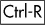
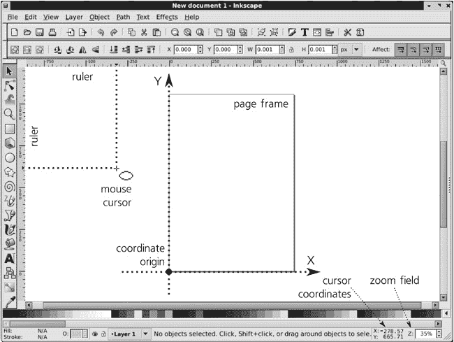
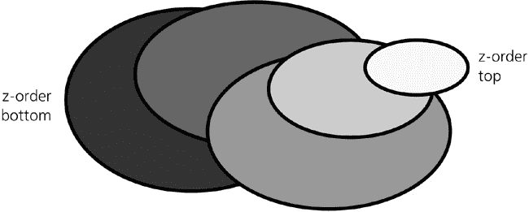
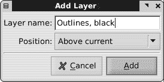
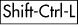
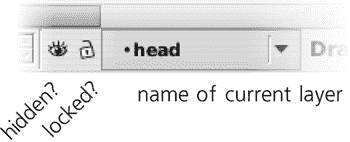
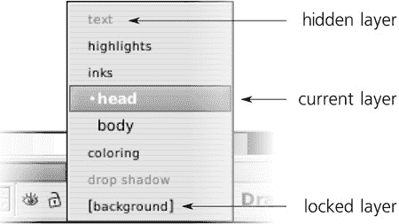
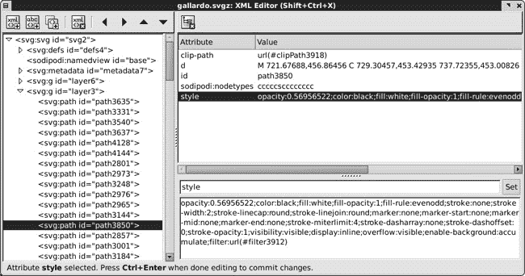

# 第四章. 对象

对象是 Inkscape 图形的基石。本书的大部分内容将致力于各种类型的对象、它们的属性以及处理它们的技术。然而，无论类型如何，所有 Inkscape 对象都有许多共同之处。

本章以及接下来的两章将详细介绍对象和通用对象操作的基础知识。

# 4.1 对象属性

Inkscape 提供了用于操作对象各种属性的多个对话框，但其中只有一个非常通用，可以简单地称为**对象属性**（通过按  或在**对象**菜单中选择命令来访问）。此对话框相当小，如图 图 4-1 所示。

您需要选择 (第五章) 一个单独的对象来在此对话框中查看其属性。对象的*标识符（ID）*是文档 SVG 源中相应元素的`id`属性（附录 A）。其值在此文档中始终是唯一的；Inkscape 自动为所有对象提供唯一的 ID。然而，只要它保持唯一，您仍然可以更改此值。 

图 4-1. 对象属性对话框

为对象分配有意义的名称是组织复杂艺术作品的有用方法。然而，ID 并不是做这件事的最佳位置，因为根据 XML 规则，您只能在元素 ID 中使用一个非常有限的字符集：没有空格，只有拉丁字母、数字、连字符、下划线和点。为了提供一个更人性化的替代方案，请在**标签**字段中设置对象的*标签*（这对应于 SVG 中的`inkscape:label`扩展属性）。在这里，您可以为您对象编写任意标签或描述；它可以有任意长度，可以使用任何字符，且不需要唯一。

### SVG

***标题**和**描述**字段可以包含关于对象的额外自由格式元数据（它们是 SVG 的标准`title`和`desc`元素）。由于这些值存储在元素中，而不是属性中，因此它们甚至可以包含子元素，如文本标记（尽管您不能通过**对象属性**对话框来这样做）。*

*对话框的**交互性**部分（默认情况下折叠；点击三角形标记展开）允许您编辑用于 SVG 中与 JavaScript 一起使用的交互属性值（如`onclick`、`onmouseover`等）。Inkscape 不支持 JavaScript，但如果您想在支持 JavaScript 的查看器中查看您的 SVG，这可能很有用。*

在对话框的底部，两个复选框控制所选对象的锁定和隐藏状态。一个**锁定**的对象是可见的，但大多数选择方法都无法选择它，因此无法更改。一个**隐藏**的对象既不可见也不可选。

我不推荐隐藏或锁定单个对象。通常，对包含要隐藏或锁定对象的图层进行操作要方便得多。通过图层隐藏和锁定不仅因为一次影响多个对象，而且因为即使图层被锁定或隐藏，也可以轻松访问（通过**图层**对话框，见**4.6.4 图层对话框**）并更改其状态。

然而，对于对象，许多用户发现自己陷入了一个陷阱：你需要选择对象来解锁或取消隐藏它，但你无法轻松选择它，因为它被隐藏或锁定。具体到这种情况，**对象**菜单包含两个命令，**取消隐藏所有**和**解锁所有**，这将揭示并使当前图层中的所有对象都可选。

# 4.2 边界框

通常，一个对象只是画布上的一个可见物，是你绘图的一部分。当然，这并不总是那么简单；有时，看起来像是一个独立对象的东西，要么是某个其他对象的一部分，要么是几个对象的组合。识别单个对象可能需要一些工作和 Inkscape 经验。

然而，无论何时对象在画布上可见，我们都可以使用熟悉的矩形坐标系来测量其大小和位置，水平方向为 X 轴，垂直方向为 Y 轴。在 Inkscape 中，坐标原点始终位于页面框架的左下角（通常在画布上可见为灰色框架），Y 值向上增加，X 值向右增加。

### 注意

*然而，在 SVG 中，坐标原点位于页面的*顶部*左角，Y 坐标向下增长。Inkscape 在向用户显示坐标时会移动原点并翻转 Y 坐标，但按照 SVG 规则保存所有内容。在查看或编辑原始 SVG 代码时（例如，在 XML 编辑器中**4.7 XML 编辑器**），你应该始终记住这一点。*

画布区域边缘的标尺是测量坐标的一种方法（如果它们被隐藏，请按  来显示它们）。当你将鼠标移过画布时，标尺上的小三角形标记会反映其当前位置。此外，鼠标指针的 X 和 Y 坐标始终显示在状态栏的右端，位于标记为 **Z** 的缩放字段之前：

图 4-2. Inkscape 的坐标系

刻度尺使用的测量单位与你在**文档属性**对话框中可以设置的文档单位相同（**3.4 页面设置**）。要确定刻度尺当前使用的单位，而不打开对话框，将鼠标光标悬停在刻度尺上，直到出现一个浮动工具提示。

现在让我们创建一些对象；例如，使用椭圆工具绘制一个椭圆。你会看到，当对象被选中时，它被一个虚线矩形所包围（图 4-3 和 ）。

图 4-3. 物体的边界框始终是垂直的。

选中对象的宽度、高度和坐标始终由选择工具控制栏中的四个可编辑字段报告。**X** 和 **Y** 显示框的左下角坐标，而 **W** 和 **H** 表示其宽度和高度。（如果选中了多个对象，则这些值反映整个选择的总体边界框。）测量单位可以在右侧的下拉菜单中选择；最初它是文档单位，默认情况下是 SVG 像素（`px`，见**A.6 坐标和单位**）。

当然，你可以点击这些字段中的任何一个并输入自己的值，这将导致对象移动（对于 **X** 和 **Y**）或缩放（对于 **W** 和 **H**）。如果你想宽度变化导致高度成比例变化或反之亦然，点击 **W** 和 **H** 之间的锁定按钮来将它们锁定在一起。

在 Inkscape 中，对象的边界框可以是两种类型之一：视觉（默认）和几何。程序始终只使用这些类型之一；要从一个类型切换到另一个类型，请转到 **Inkscape 预设** 对话框的 **工具** 选项卡。区别在于，与几何框不同，视觉边界框包括关于对象的*所有可见内容*——最显著的是其整个描边（**9.1 描边宽度**），还包括标记（**9.5 标记**）和滤镜边缘（**17.4.4 滤镜区域**），而几何框仅包含对象路径的*几何轮廓*。

因此，使用几何框时，被描边的对象的边缘会落在边界框的外部；这种类型的框对应于在轮廓模式中可见的对象（**3.11 渲染模式**）。通常，使用 Inkscape 进行技术绘图的人更喜欢几何边界框，而对于几乎所有人来说，视觉选项更有意义。图 4-3 显示了视觉边界框；请注意，它完全包围了椭圆的黑色描边。

# 4.3 Z-Order

术语 *z-order* 指的是对象相互叠加的顺序。在 z-order 中位于上方的对象可能会遮挡其下方的对象，如果它们重叠且上方对象不透明的话。术语 *z-order* 来自于第三坐标轴 Z 的概念，它被想象成垂直于绘图中的 X/Y 平面延伸到观察者。因此，z-order 中较高的对象因此“更靠近”观察者。

你创建的对象总是放置在当前层的 z-order 的最顶层（如果你没有创建任何新层，这将是在整个文档 z-order 的最顶层）。例如，如果你绘制了几个椭圆，每个新的椭圆都会绘制在先前的椭圆之上，如图 图 4-4 所示。

图 4-4. Z-order

### 注意

*在文档的 SVG 源中，z-order 中较高的对象是那些更靠近文档*结尾*的对象。因此，新对象总是添加到现有元素列表的末尾（通常在当前层内）。*

没有选择、变换或样式更改操作会改变对象的 z-order。这意味着你可以在对象保持在其自己的“楼层”上时移动、缩放或绘制它——前提是你已经选择了该对象。（在 **5.9 从下方选择对象** 中，你会看到存在特殊的方法用于选择 z-order 底部的对象，这些对象不能简单地通过点击来选择。）

然而，通常您需要重新排列绘图中的对象堆叠。Inkscape 有四个命令用于在 z-顺序中移动对象，两个是绝对的，两个是相对的。它们经常被使用，因此可以通过选择器控制栏上的按钮、**对象**菜单或简单的键盘快捷键访问。绝对命令是：

**提升到顶部 ()**

+   将选定的对象提升到对象层的顶部。

**降低到底部 ()**

+   将选定的对象降低到对象层的底部。

+   相对命令是：

**提升 ()**

+   将选定的对象提升一个步骤（超过一个其他对象）。

**降低 ()**

+   将选定的对象降低一个步骤（超过一个其他对象）。

图 4-5 展示了这些命令如何作用于位于矩形堆叠中间的选定椭圆。

注意，相对 z-顺序命令仅考虑与选择重叠的对象（更准确地说，那些边界框与选择边界框重叠的对象）。如果您的选定对象或对象没有与其他对象重叠，**提升**和**降低**命令将仅将选择移动到层的顶部或底部。

另一个需要记住的重要事情是，所有 z-顺序命令仅在**层内**工作。如果您在文档中有多个层，这些层形成它们自己的 z-顺序，并且一个低层对象永远不会在比它高的层上的对象之上。为了重新排列层的 z-顺序，请使用如**4.6.2 层菜单**中所述的层命令。

有可能同时选择不同层或组中的对象。在这种情况下，z-顺序命令作用于每个选定对象在其自己的层或组内。例如，一个**提升到顶部**命令可能会改变一个选定对象的 z-顺序，但如果它已经是其层中的最顶层对象，则不会影响其他对象。

# 4.4 复制、剪切、粘贴和复制

Inkscape 支持所有传统的剪贴板操作：复制、剪切和粘贴。

*复制* () 记录了程序剪贴板中选定的对象或对象的副本；*剪切* () 执行与复制相同的操作，但对象随后被删除。最后，*粘贴* () 将剪贴板的内容放回文档中（但同时也保留在剪贴板中，因此您可以多次粘贴相同的对象）。

**粘贴**命令有两个变体。常规的**粘贴**()将对象放置在画布上鼠标光标当前悬停的点。这提供了一种方便的方法，可以将对象移动到文档的完全不同的位置；只需从它原来的位置剪切它，滚动和/或缩放到你想要的位置，将鼠标悬停在确切的位置，然后按。你甚至可以用对象的副本“绘画”，通过移动鼠标并重复按。

### 注意

*另一个将对象置于鼠标光标下的命令是**导入**()；*请参阅**18.1 导入**。

有时候，你可能想要将对象粘贴到其原始位置。这就是**粘贴到原位**()命令的作用。例如，你可以用它来移动一个对象从一个图层到另一个图层，而不改变其在画布上的位置：复制它，切换到目标图层，然后粘贴到原位。

有时候，人们使用**复制**和**粘贴**仅仅作为一种获取一个或多个对象副本的方法。在 Inkscape 中，你不需要使用那个解决方案；有一个方便的**复制**命令()，它创建所选内容的副本并将其放置在画布上的相同位置。这与复制然后粘贴到原位等效，只是**复制**不会改变剪贴板的内容。

图 4-5. 改变 z 轴顺序

所有粘贴和复制命令，就像创建新对象的任何其他方法一样，都将新对象放置在当前图层 z 轴顺序的顶部。

### 注意

*如果你在 z 轴顺序的中间选择了某个对象，并想要复制它，但希望复制件保持在同一级别而不是跳到顶部，这通常意味着你的文档需要使用更多的图层。通过将此类对象放入其自己的图层，你可以确保复制它时，复制件将位于该对象的图层顶部，而不是文档顶部。*

创建对象副本的另一种方法是*冲压*。每次你通过在选择工具中拖动鼠标（移动、缩放、旋转或倾斜）变换一个选择时，都可以按来留下选择的副本，而不会中断交互式变换。例如，如果你抓住并拖动一个椭圆，然后在拖动时按住并保持空格键，被移动的对象将在画布上留下其副本的轨迹。冲压在节点工具中也同样适用，当你拖动节点选择时（**12.5.7 移动节点**）。

到目前为止讨论的所有对象复制方法都创建了新的独立对象，这些对象以任何方式都与原始对象无关。如果你想创建一个*链接副本*，它继承原始对象的一些属性并自动更新，请阅读第十六章中关于克隆的内容（ch16.html "第十六章 克隆"）。

# 4.5 组

*分组*是将多个独立对象组合成一个单一对象的方法。这是一个容易撤销的操作；组合到组中的对象可以被取消组合并再次变得独立。此外，Inkscape 中的许多工具完全忽略分组，允许你直接与单个对象工作，无论它们是否分组。默认情况下，选择工具会选择整个组，但即使在它里面，也有方法在不取消组合的情况下选择组内的对象（**5.10 在组中选择**）。

要组合一些对象，只需选择它们并选择**对象** ▸ **组合** ()。组可以像任何其他对象一样进一步组合。你甚至可以组合一个单一的对象；例如，选择一个矩形并按。现在你有一个包含单个矩形的组（这种组在许多情况下可能很有用，例如模糊剪裁的对象；见**18.4 剪裁和蒙版**）。

当选择单个组时，状态栏会指示该组中有多少成员对象，例如：*背景层中的 3 个对象组*。

要取消组合一个组，选择它并选择**对象** ▸ **取消组合** ()；组不再存在，但所有之前成员现在被释放，仍然保持在画布上的位置（包括对象的坐标和 z 顺序都得到保留）。

你可以选择任意数量的组并将它们一次性取消组合。此外，你可以选择任意数量的不同对象，其中只有*一些*是组，然后按；组将被取消组合，但所有非组对象将保持完整。

### 注意

**取消分组**命令仅移除最顶层的分组。例如，如果你有一个包含两个其他分组的分组，按下**将释放这两个分组——它们将保持选中但不会被取消分组。你需要再次按下**来取消分组。要取消复杂绘图中的所有分组，只需选择所有对象并持续按下**，直到状态栏显示，“选择中没有要取消分组的分组”。

### XML

在 XML 中，**分组是 g 元素**（见**A.5 图层和分组**），它是其成员对象的**父元素**。这意味着，在其他方面，具有未设置样式属性的对象（**8.1.1 绘画**）将从其父分组或从树中的祖先继承这些属性。

## 4.5.1 分组的使用

为什么分组对象？使用分组可能有不同的原因。

+   首先，分组是选择一组对象的一种简单方法：使用选择工具，点击分组中的任何对象，整个分组就会被选中。从这个意义上说，分组是一个“保存的选择”。选中后，你可以像操作多个单独选中的对象一样轻松地移动、缩放或绘制分组。

+   其次，分组是一种快速且简单的方式来**组织复杂的艺术作品**。当你画中有成千上万个对象时，区分哪些对象应该放在一起是困难的。构建这类复杂文档的一种方式是通过图层，我们将在本章后面讨论这一点。然而，图层往往过于繁琐；如果你只想确保你肖像中鼻子和眼睛的对象永远不会相对于彼此意外移动，那么将它们分组在一起是最简单的方法。

+   最后，有时分组允许你实现其他情况下不可能实现的效果。其中最常见的效果是**分组透明度**（见**8.1.2 透明度**了解更多关于透明度的信息）。当你对一个分组应用透明度时，整个分组会变得透明，这可能与对单个对象应用相同级别的透明度产生的效果截然不同（图 4-6）。

    在左侧，两个独立对象完全不透明（零透明度）。在中间，它们作为单独的对象变得 50%透明；注意，矩形的角落透过椭圆显示。在右侧，相同的对象被分组，并且整个分组被设置为 50%透明；注意，现在，棋盘背景透过，但矩形的重叠区域仍然被椭圆遮挡，不会显示出来。

图 4-6. 组透明度

### 注意

*由于组透明度和其他类似效果，一般情况下，取消组合一个组并不能保证文档的外观不会改变。*

## 4.5.2 组和 Z 顺序

需要记住的一个重要事情是，作为一个独立对象，组在你的文档的 z 顺序堆栈中有一个自己的位置，并且组中的所有成员都共享其 z 顺序位置。

这意味着如果对象 A 在 B 之上，而 B 在 C 之上，你不能不改变 z 顺序就将 A 和 C 组合在一起。如果你尝试这样做，C 会跳到 A 下面，你将得到一个包含 A 和 C 的组，它们位于对象 B 之上。

在那种情况下，取消组合一个组不会恢复原始的 z 顺序。如果你取消组合“A 和 C”组，你会得到三个独立的对象，但它们现在将按照 A、C、B（从上到下）的顺序排列。（当然，如果你在组合后立即**撤销**（），组合和 z 顺序的改变都会被撤销。）

由于同样的原因，你不能将来自不同层的对象组合在一起。层和组都是文档 XML 树的分支，你不能让一个分支（组）从多于一个父分支（层）生长出来。如果你尝试组合来自不同层或不同组中的对象，Inkscape 会抱怨（在状态栏中显示消息）并且不执行任何操作。

# 4.6 层

在 Inkscape 中，层基本上就是名字所暗示的：“文档内的“级别”或“楼层”，堆叠在一起并包含其他对象”。每个层都有一个名称；层可以很容易地隐藏、锁定或重新排列。

每个对象只属于一个层。要找出对象属于哪个层，只需选择该对象并查看状态栏：它将显示类似*矩形在层**层 1***（在这里，**层 1**是层的名称）。你可以轻松选择来自不同层的对象，在这种情况下，状态栏将显示，*2 个对象在 2 个层*。

文档中的某一层始终是**当前层**。你创建、粘贴或导入的新对象总是添加到当前层。为了使在复杂绘图中的层切换更容易，Inkscape 遵循选择：也就是说，如果你在层 A 中，并选择层 B 中的某些对象（例如，通过点击它），层 B 将成为你的新当前层。相反，如果你更改当前层，你的选择将被取消。

Inkscape 在保存文档时记住当前层，并在你下次加载时恢复它。一个新的文档模板（见**3.2 文档模板**）通常包含一个初始层，称为*层 1*；当你加载模板时，它被设置为当前层，所以如果你不创建任何新层，你创建的所有对象最终都会在层 1 中。

正如单个对象一样，层也可以被锁定或隐藏。在*锁定*层中，对象是可见的但不能被选择。在*隐藏*层中，对象既不可见也不能被选择。此外，你无法向隐藏或锁定层添加新对象。

通常，当你想要暂时简化复杂艺术品以工作于其某些部分时，层会被隐藏。隐藏复杂的层可以显著加快屏幕重绘，从而使你的工作更加舒适。当你想要某些背景对象可见但不可选择时，锁定层非常有用，这样就可以通过点击或拖动它们来更容易地选择前景对象。

## 4.6.1 层层次结构

在更高级的水平上，Inkscape 中的层与组密切相关。实际上，层只是 Inkscape 以特殊方式处理的一种组。

### XML

在 XML 中，层和组都由相同的元素*`g`*表示。唯一的区别是层有一个属性*`inkscape:groupmode="layer"`*（**A.5 层和组**）。

正如组可以包含其他组作为成员一样，层也可以包含进一步的*子层*。这使得组织复杂艺术品变得更加容易：你可能会拥有一个层次树，其中相关层由一个共同的父层分组，通过提升或降低整个树的分支而不是逐个层来重新排列结构要容易得多。

此外，你可以临时*进入一个组*，即告诉 Inkscape 临时将此组视为子层并将该子层设置为当前。为此，只需选择该组并双击它，或按，或者右键单击它并从弹出菜单中选择**进入组**。

这种技术结合了组的优点（组易于选择、移动、变换、样式、查看其边界框等）与层的优点（层定义了一个可以进入并工作的上下文，例如，通过向其中添加新对象）。特别是，将某些对象*移动到*现有组中而不取消组合的最简单方法是将对象剪切()，进入组，然后在那里粘贴对象(或)。

要离开一个子层——无论是实际的子层还是你进入的一个组——请按，或者在任何画布上右键单击并从弹出菜单中选择**转到父级**。

## 4.6.2 层菜单

最重要的层命令收集在**层**菜单中：

+   **添加图层**、**重命名图层**和**删除当前图层**命令执行它们所描述的操作。后两个命令应用于当前图层；第一个命令创建一个新图层，并要求您提供名称并决定是否将其放置在当前图层的下方（默认）、上方或作为子图层嵌入当前图层（参见图 4-7）。图层名称不必唯一，可以使用任意字符。请注意：删除图层会删除该图层中所有对象！

    

    图 4-7. 创建新图层

    ### XML

    *在 SVG 源中，图层的名称存储在`inkscape:label`属性中。*

+   两个**切换**命令仅将当前图层切换到其下方或上方的图层。这些命令仅定义了其他操作的环境；它们不会在画布上改变任何可见的内容，且不可撤销（只有实际改变文档的命令才能撤销）。

+   下两个命令，**将选择移动到上方图层** ()和**将选择移动到下方图层** ()，将当前选择移动到当前图层的上方或下方图层。如果当前图层上方或下方没有图层，这些命令将不起作用，并在状态栏中显示消息。通过跨越图层边界，这些命令与在同一图层内工作的常规 z 轴顺序更改命令（如**提升**或**降低**（**4.3 Z-Order**））相辅相成。

### 注意

*以下是将对象从一个图层移动到任何其他图层的（不一定是相邻的）方法：剪切对象* ()，*切换到目标图层，并将其粘贴到相应位置* ()。

+   四个 z 轴顺序命令——**提升图层** ()、**降低图层** ()、**图层置顶** ()和**图层置底** ()——与对象的 z 轴顺序命令（**4.3 Z-Order**）等价，但它们作用于当前图层，并将它（及其所有对象和子图层）在同级图层中上下移动。请注意，这些命令的键盘快捷键与对象 z 轴顺序命令相同，但增加了 。

+   最后，**图层 . . .** 命令 () 打开**图层**对话框 (**4.6.4 图层对话框**)。

## 4.6.3 当前图层指示器

Inkscape 有两个主要的 UI 控件用于处理图层：状态栏中的基本当前图层指示器和更强大的**图层**对话框。

**当前图层指示器**显示当前图层的名称，并且通过左侧的两个切换按钮，指示该图层是否被隐藏（眼睛按钮）和/或锁定（锁按钮）：

Figure 4-8. 状态栏中的当前图层指示器

它是一个交互式控件，而不仅仅是显示；你可以切换按钮并使用所有图层的弹出菜单来切换当前图层：

Figure 4-9. 文档中所有图层的弹出菜单

在图层菜单中，当前图层以粗体和项目符号标记。被锁定的图层名称周围有方括号（例如，*[图层 1]*）；隐藏图层的名称为灰色。临时图层（如你进入的组）使用斜体来显示其名称。

## 4.6.4 图层对话框

当前图层指示器的优点是它始终处于活动状态，并且占用的屏幕空间非常小。然而，它仅适用于图层结构小且简单的场合。在更复杂的文档中，它很快就会变得难以管理。这时你应该查看**图层**对话框（），如图 4-10 所示。

在图层列表中，可以通过点击三角形标记来展开和折叠图层内的子图层分支。此外，在这里你可以通过点击图层名称左侧的相应图标来锁定或解锁图层，以及隐藏或显示图层，而无需将其设置为当前图层。

### AI

与 Adobe Illustrator 不同，Inkscape 的**图层**对话框尚不能显示图层内的单个对象。在一定程度上，你可以使用 XML 编辑器（**4.7 XML 编辑器**)来查看文档的整个树结构，包括所有图层和对象。

在图层列表下方，六个按钮对应以下命令，从左到右：**创建新图层**（需要输入名称），**将当前图层提升到顶部**，**提升当前图层**，**降低下图层**，**将当前图层降低到底部**，以及**删除当前图层**。你还可以通过在列表中点击图层名称并输入新名称来重命名图层。

Figure 4-10. 图层对话框

通过右键点击图层名称，将打开一个弹出菜单，包含添加、重命名、降低或提升，以及复制图层的命令。**显示/隐藏其他图层**命令切换除当前图层之外的所有图层的可见和隐藏状态。

在对话框的底部，有一个可以应用于整个当前图层的混合模式列表（有关混合模式的更多信息，请参见**17.2 混合模式**）和一个滑块控件来设置当前图层的透明度。这种透明度会影响图层中的所有对象，并且与组透明度（**4.5.1 分组的用途**）的工作方式相同；它提供了一个方便的方法，通过使图层几乎透明但又不完全隐藏，来查看图层下面的内容。

# 4.7 XML 编辑器

XML 编辑器是 Inkscape 区别于其他矢量编辑器的特点。在这里，你可以看到你文档的整个原始源代码，没有任何隐藏或（错误）解释。简单来说，如果在 XML 编辑器中看不到的东西，那么它就不在你的文档中。

如果你想要学习 SVG 或者只是对文档中某些对象或属性的底层内容感兴趣，XML 编辑器是你的主要工具。在这里，你可以对你的文档做任何事情。有人可能会声称 XML 编辑器是程序中唯一必需的部分，其他所有东西都只是可选的便利性！

XML 编辑器与程序的其他部分完全同步。你在 XML 树中做的任何更改都会立即反映在你的画布上，而你用任何其他工具做的任何更改都会立即在 XML 编辑器中以元素或属性更改的形式显示出来。

图 4-11. XML 编辑器的三个面板

XML 编辑器有三个主要面板，如图图 4-11 所示。底部还有一个自己的状态栏，显示各种状态信息和提示。

**左侧面板**

+   显示你正在编辑的文档的整个树结构。树中的每个节点（列表中的每一行）要么是一个 XML 元素，要么是一个文本节点。在 SVG 中，文本节点仅用于存储文本对象的文本内容；所有其他对象都是元素节点。例如，`svg:rect`是一个矩形，`svg:g`是一个组或一个图层（在这里，`svg`是命名空间前缀；参见**A.2 词汇表和命名空间**）。

    列表中的每个元素并不都是对象；有些元素代表的是你无法在画布上看到的东西（例如元数据）。有关各种 SVG 和 Inkscape 元素的更多信息，请参阅附录 A。

    ### 注意

    *在 XML 编辑器中，所有元素都按照*文档顺序*列出：*在画布上 z 轴顺序中最顶层的对象和图层*是列表中的*最后*。特别是，这意味着 XML 编辑器中图层的顺序与**图层**对话框或当前图层指示器中的顺序相反。

    在文档树中，您可以点击任何元素来选择它。列表中的此选择与 Inkscape 中的常规对象选择同步：如果所选元素对应于可见对象，则该对象在画布上被选中；反之，如果您在画布上选择一个对象，XML 树面板会滚动到相应的元素并突出显示它。这是访问其他方式无法访问的元素的一种方法，例如那些被锁定或隐藏的元素（**4.1 对象属性**）。

    在树面板上方，有一个带有用于通用 XML 操作按钮的小型工具栏：创建新元素或文本节点以及复制或删除所选节点。最后四个按钮用于在树中移动所选节点（及其所有子节点）：上箭头或下箭头重新排序节点（您也可以通过用鼠标拖动所选节点来完成此操作），而左箭头和右箭头则改变它们的嵌套。例如，要将节点从其父节点的子节点转换为兄弟节点，请点击左箭头按钮；相反，右箭头按钮将节点转换为前一个兄弟节点的子节点。

**右上角面板**

+   显示所选元素节点的所有属性。（如果您选择的是文本节点而不是元素节点，则此面板将允许您编辑节点的文本。）每个属性都有一个名称和值，它们在表格的两个列中列出。在 XML 中，属性的顺序无关紧要，因此对话框按字母顺序显示它们。面板上方有一个按钮用于删除所选属性。

**右下角面板**

+   允许您在右上角面板中编辑所选属性。它包括一个用于属性名称的单行字段，一个用于其值的较大面板，以及一个**设置**按钮（在完成编辑后，您可以按  而不是点击**设置**）。

    您可以通过编辑名称和值字段来向元素添加新属性。如果您输入的属性名称与现有属性匹配，则该属性将用您的值替换；否则，将创建一个新属性并将其添加到元素中。

    注意，值编辑面板会自动换行长属性值以方便编辑。这在编辑 `style` 属性时尤其有用，因为它们的值往往相当长（**A.8 样式**）。
