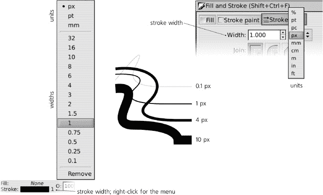
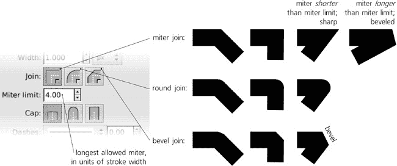
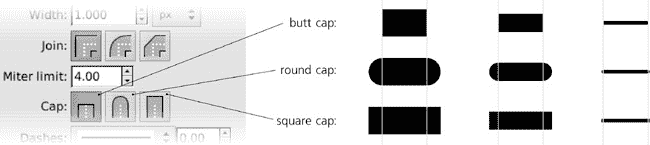
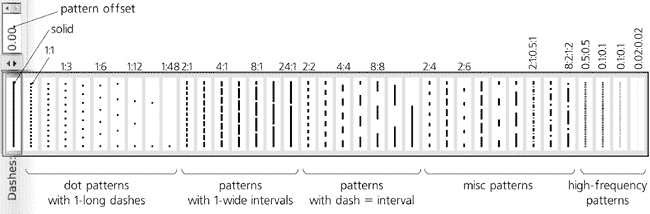
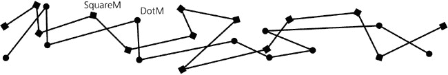
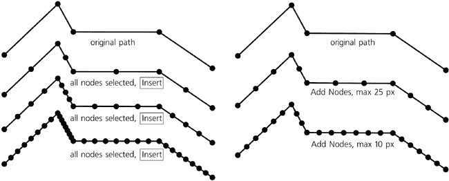

# 第九章. 笔画和标记

虽然在艺术作品中相对较少见，但绘制路径——轮廓、框架、箭头、连接器等——在技术图纸，如草图或流程图中非常常见。所有 SVG 样式属性中相当大的一部分控制笔画的显示效果，因此值得单独成章。

虽然在 SVG 中绘制相当丰富且适用于许多目的，但您可能寻找的一些功能可能根本不存在，或者只能通过变通方法获得。特别是，SVG 笔画始终具有**固定宽度**（它不能沿路径变宽或变窄）；要模拟可变宽度笔画，请使用书法笔（**14.3 书法笔工具**)或路径效果（**13.1 路径效果**)。此外，虽然笔画可以有虚线图案（**9.4 虚线图案**)和附加到其节点上的标记（**9.5 标记**），但您不能使用刷子或重复图案来绘制路径，这些图案会跟随笔画的弯曲——尽管，再次强调，这可以通过路径效果（**13.1.3 沿路径和弯曲的图案**）实现，并且您始终可以应用标准的 SVG 矩形图案（**10.8.1 创建图案**）来精确绘制笔画，就像填充一样（然而，在这种情况下，图案只是叠加的；它不会被扭曲以跟随笔画的轨迹）。*

# 9.1 笔画宽度

笔画最重要的属性是其**宽度**。与 Inkscape 中的任何其他长度值一样，宽度可以用多种不同的单位来衡量。目前 UI 中有两个地方可以查看和更改所选对象的笔画宽度：在状态栏中的所选样式指示器（笔刷样本的右侧末端）和**填充和笔画**对话框的**笔画样式**选项卡：

图 9-1. 所选样式的笔画宽度指示器（左侧；右键单击以打开菜单）和填充和笔画对话框（右侧）

### 注意

*如果**笔画样式**选项卡的内容被禁用（灰色显示），这意味着您所选的对象没有笔画颜料。要启用它，在同一个对话框中转到**笔画颜料**选项卡，并选择一种纯色或任何其他颜料作为笔画颜色。*

在所选样式指示器中，更改笔画宽度的方法之一是直接右键单击旁边显示的数值笔画宽度，并从弹出的菜单中选择一个值。在同一个菜单中，您可以选择用于笔画宽度的单位；默认情况下为 `px`（SVG 像素）。

与通过颜色手势编辑填充或笔触颜色（**8.5 选定样式指示器：颜色手势**）类似，您还可以将选定样式指示器中的笔触宽度值拖放到画布中，以更改选择中的笔触宽度。将鼠标拖动到色板上方和 45 度线的左侧会使选定对象中的笔触变宽（最多是原始宽度的两倍）；将鼠标拖动到色板下方和右侧会使笔触变窄（最多是原始宽度的一半）。例如，如果您从 1 像素的笔触开始，向上和向左拖动将得到 2 像素，而向右和向下拖动将得到 0.5 像素。这样，您可以在不打开任何对话框或菜单的情况下快速精确地调整笔触宽度。

在**填充和笔触**对话框中，有一个常规可编辑字段，您可以在其中输入任何值，以及一个单位选择器。

### 注意

*在概要模式下（**3.11 渲染模式**），笔触宽度被忽略，所有对象都以一个屏幕像素宽的笔触显示，无论缩放如何。然而，这只是一个 Inkscape 特有的编辑便利性；在 SVG 中，笔触宽度始终以绝对单位指定，因此您无法使其与缩放无关。这可能在 SVG 的将来版本中发生变化。如果确实发生变化，Inkscape 最终也将支持这一点。*

当选择包含具有不同笔触的多个对象时，所选样式指示器会*平均*具有任何笔触的对象的笔触宽度。例如，如果两个选定的对象中有一个有 3 像素的笔触，另一个有 1 像素，指示器将显示*2*（并且工具提示将说明这是一个平均值）。现在，如果您通过右键菜单设置任何宽度，则将分配给所有最初具有任何笔触的选定对象相同的宽度。（例如，如果一个对象有 3 像素的笔触而另一个没有笔触，它将显示*3*作为其笔触宽度，并在左侧的色板中显示*不同*，但您设置的任何新宽度将仅分配给最初有 3 像素笔触的对象。）

**填充和笔触**对话框的行为不同。当检测到选择中有不同的笔触宽度时，笔触宽度单位会切换到百分比单位（**%**），显示的值为 100%。现在，如果您将其更改为 200%，然后按，选择中的每个笔触宽度都将比之前宽两倍。之后，所有不同的笔触宽度都将保持不同，显示的值将重置为 100%。

当然，在对话框中，您也可以将单位选择器切换到任何绝对单位，并将相同的笔触宽度分配给任何数量的选定对象。另一方面，即使您只选择了一个对象，您也可以切换到百分比单位，并指定一个相对于旧宽度的百分比宽度。

# 9.2 加入

笔划始终遵循路径，路径可以有尖锐的转弯，称为*尖角*。通常，尖角是一个不光滑的节点（**12.5.5 节点类型**），两个路径段在此处相交，但您甚至不需要节点来创建尖角；在贝塞尔曲线的中间创建一个尖锐的尖角也是可能的（**13.1.7 斯皮罗样条**）。

笔划在尖角处的表现由两个样式属性决定：*接合类型*和*斜接限制*。它们可以通过**填充和笔划**对话框中的**笔划样式**选项卡进行编辑，位于笔划宽度控制下方。三个可能的接合类型，由三个切换按钮表示，是**斜接缝**（默认）、**圆接缝**和**斜接缝**：

**斜接缝**

+   在这种接合中，尖角处的笔划外轮廓由两个直线片段继续，这些直线片段与接合两侧的笔划相切，直到这些直线交叉。结果，接合处装饰有一个尖锐的峰，称为*斜接缝*，随着接合处角度的减小，它变得越来越长、越来越尖锐，远远超出尖角节点的位置。

    然而，这引出了一个新问题。斜接缝可以变得多长？很容易看出，当接合处的角度变为零（这是完全合法的）时，斜接缝应该是无限长的。这显然是不切实际的。为了处理这种情况，**斜接限制**控制允许您设置斜接缝的最大长度，单位为笔划宽度。例如，对于默认的斜接限制 4，任何小于 4 笔划宽度的斜接缝都保持尖锐的尖端，但一旦您减小角度使斜接缝超过这个长度，它将在距离接合处 4 笔划宽度的位置被切割（斜切）。

**斜接缝**

+   这种接合基本上与**斜接缝**相同，但斜接限制设置为 0。这意味着对于任何角度，斜接缝都会被一个*斜切*——垂直于尖角角平分线的直线——切断。

**圆接缝**

+   这模拟了用完美圆形笔绘制接合的效果。它与**斜接缝**相似，但不同之处在于，不是直线斜切，斜接缝被一个以尖角点为中心的圆形弧线切断。这个选项对于大部分曲线路径来说最为自然，偶尔的尖角如果不进行圆滑处理可能会显得不协调。

图 9-2. 填充和笔划对话框中的笔划接合控制

不同的笔划接合设置对笔划文本对象的影响可能最为显著：

图 9-3. 接合设置对笔划文本的影响

### SVG

在 SVG 中，连接由 `stroke-linejoin` CSS 属性控制，该属性可以取 `miter`、`bevel` 和 `round` 等值。斜接限制存储在单独的属性 `stroke-miterlimit` 中。

# 9.3 帽

开放路径需要知道如何绘制描边的末端。对于帽，同样有三个选项可用，它们与三种连接类型有些相似：

**端帽**

+   垂直于描边方向，在路径的末端节点处直接切割描边。

**圆形帽**

+   在描边的末端添加一个半圆形块，使描边端部平滑地圆滑。

**方形帽**

+   在描边的末端添加一个半方形块。

图 9-4. 填充和描边对话框中的描边帽选项

无论是圆形帽还是方形帽都会使开放路径的长度增加其全宽度，并在每个端部添加一个半描边宽度的帽。只有使用端帽（这实际上意味着没有帽），路径的长度才与其端节点之间的距离相同。

连接和帽选项的效果在宽描边上最明显；对于渲染为 1 像素或更窄的描边，它们在视觉上几乎没有差异（可能除了长斜接之外）。

### SVG

*在 SVG 中，路径的描边帽由 `stroke-linecap` 属性控制，该属性可以取 `butt`、`round` 和 `square` 等值。*

# 9.4 虚线图案

描边不需要从路径的起点到终点连续运行。SVG 允许您使用由任何长度间隔分隔的虚线图案描边路径。如果您知道如何编辑原始 SVG（例如，使用 Inkscape 的 XML 编辑器，**4.7 XML 编辑器**），您可以创建任何喜欢的图案。否则，您可以选择 **填充和描边** 对话框提供的许多预定义图案之一，如图 9-5 所示。

按照从最常见到最奇特的顺序大致排列，这些图案包括：

+   由点（即长度等于描边宽度的描边段）组成，间隔为 1、2、3、4、6 等等，直到 48 倍描边宽度（这意味着当您使描边更宽或更窄时，图案按比例缩放或缩小）的虚线图案。

    

    图 9-5. 填充和描边对话框中的虚线图案

+   由长虚线（1、2、3 等等，直到 24 倍描边宽度）和单描边宽度间隔组成的图案。

+   虚线和间隔长度相等的图案，从 2 到 24 倍描边宽度。

+   变化虚线和间隔宽度的图案：2:4、4:2、2:6、6:2、2:8 和 8:2。

+   长虚线后跟短虚线的图案。

+   等长虚线图案，虚线长度短于描边宽度，从 0.5 描边宽度降至 0.02 描边宽度（例如，一个“正方形”路径，其长度等于宽度，将会有 25 次 0.02:0.02 模式的重复）。请注意，使用这种高频图案可能会显著减慢 Inkscape 的速度。

虚线图案选择器旁边的可编辑字段允许您沿着路径移动所选图案，单位为描边宽度。

### SVG

*在 SVG 中，描边的虚线模式由`stroke-dasharray`属性指定。它可以取`none`（实线）或逗号分隔的值列表，其中每个奇数值表示虚线的长度，每个偶数值表示间隔的长度。例如，`stroke-dasharray:2,1,0.5,1`的指定意味着长度为 2 的虚线后面跟着长度为 1 的间隔，然后是长度为 0.5 的短虚线，再接着是长度为 1 的间隔（所有长度都是以描边宽度的单位）*。

*在**填充和描边**对话框中可用的预定义虚线图案列表存储在您的`preferences.xml`文件中，位于具有`id="dashes"`的`group`元素内。通过编辑此元素的子元素，您可以添加、删除或更改 Inkscape UI 中可用的图案*。

注意，描边端点（**9.3 端点**）也会影响虚线。如果您将路径设置为使用圆形或方形端点，它们将被添加到每个虚线的两端。结果，每个虚线与使用默认平头端点时的长度相比，将增加一个完整的描边宽度。例如，具有圆形端点的 1:1 模式将失去所有间隔；相邻虚线的圆形端点，每个端点长度为 0.5 描边宽度，现在相互接触，如图图 9-6 所示。

因此，要创建一个沿着路径的圆形点图案，您需要创建一个具有零长度虚线和圆形端点的虚线图案。不幸的是，Inkscape 在**填充和描边**对话框中没有列出此类图案；您需要手动创建它，首先分配一个具有所需间隔长度的图案，然后编辑相应路径元素的`style`属性中的`stroke-dasharray`属性，将其虚线长度（第一个值）设置为 0。请注意，然而，如果没有圆形或方形端点，此类图案将使路径完全不可见（这也是它不在标准图案中的主要原因——记住默认端点设置是平头）。

图 9-6. 描边端点对虚线的影响

使用非常宽的间隔（如 1:48）的点模式的一个有趣用途是快速创建点的随机分布。使用铅笔工具（**14.2 铅笔工具**）绘制一个快速的螺旋形涂鸦，并将其分配一个 1:48 的虚线图案，使其变成一个看似不相连的点云。

图 9-7. 使用大间隔的虚线数组来模仿点的随机分布

此外，虚线图案的规律性与螺旋形状相得益彰——螺旋形状也是规律的，但由越来越长的转弯组成（**11.6 螺旋**）。等距虚线和逐渐发展的路径的相互作用可以产生有趣的图案：

图 9-8. 虚线螺旋是一种艺术形式。

# 9.5 标记

*标记*是附加到路径上的任意对象（甚至是一组对象），在路径的一些节点上作为路径的一部分显示（**12.1 路径的解剖**）。路径可以在其起始节点、中间（中）节点和末端节点上有三种不同类型的标记。每个标记副本都定位在节点上，并旋转以跟随该节点处的路径方向。标记最常见的使用是在图表和流程图中创建箭头。

在**填充和描边**对话框的**描边样式**标签页底部有三个大下拉列表，您可以在其中为选定的路径选择起始、中间和结束标记。

图 9-9. 选择路径的标记

这三个列表显示了所有相同的标记（换句话说，你可以在任何位置使用任何标记），但是预览缩略图显示了它们应用于水平直线路径的开始、中间和末端，因此你可以了解标记在实际路径上的外观。

让我们看看 Inkscape 标准列表中的标记有哪些：

**箭头**

+   箭头有两种类型：一种是带有直线背部的箭状，另一种是三角形，箭头后面有一个圆形凹弧。每种类型的箭头都有三种尺寸：大、中、小；每种尺寸都有两种方向：开始和结束。

    例如，如果你想使箭头指向路径外部，你应该选择**Arrow1Mstart**（第一种类型，中等大小，起始方向）作为起始标记，并选择**Arrow1Mend**作为结束标记；然而，你也可以反转这个选择，使箭头从路径两端向内指向。或者，你可以为所有三个位置选择**Arrow1Mend**，使路径上的所有箭头都指向路径的末端（有关如何区分路径的起点和终点，请参阅**12.1.1 Subpaths**）。*

**箭头尾部**

+   箭头尾部标记仅有一种大小（与大型箭头匹配）和一种方向（作为一个端点标记是有意义的，即指向路径的起始点）。

**距离测量标记**

+   距离测量标记只是箭头（与**Arrow1M**相同形状，略小）在尖端添加了一条垂直的直线。有两种方向：**DistanceStart**作为起始标记，**DistanceEnd**作为结束标记，这是你通常需要用到的。

**几何形状**

+   有一个几何形状标记的集合：圆形点、正方形、菱形（正方形旋转 45 度）、等边三角形、直线停止、填充和空半圆标记。大多数都有实心黑色和白色填充的变体。就像箭头一样，这些标记有三种大小（大、中、小）；一些还有起始和结束方向（尽管对于对称标记如菱形，方向仅在标记相对于其节点的位置上有所不同）。三角形标记的起始和结束变体可以用作另一种箭头形状。

**其他标记**

+   有几种花哨的标记，其中最显著的是**剪刀**（将其分配给中间标记以创建典型的“切断线”），以及“无限线”省略号结尾。

如果你的文档已经使用了某些标记，这些标记将被添加到下拉标记菜单的顶部，与 Inkscape 提供的标准标记分开。要从路径中删除标记，从列表中选择**无**。

### SVG

*当你将一个标记分配给路径时，Inkscape 会将标记的副本放入文档的* `defs` *(**A.4 Defs, View, and Metadata**)，并使路径引用`defs`中的标记。标记菜单中分隔符上方的标记列表仅仅是`defs`中的标记列表；如果你想要删除不再使用的某些标记，请使用**文件** ▸ **真空 Defs**命令。*

## 9.5.1 中间标记和节点

起始和结束标记很简单：它们在路径上的位置永远不会令人惊讶（尽管有时它们的朝向可能会，如果结束节点有一个非常短的贝塞尔手柄，这对手势曲线的形状影响很小，但可能会在这个节点以一些意想不到的方向旋转标记）。中间标记更有趣：它们位于路径的中间节点（**12.1 路径的解剖结构**）上，这些节点的位置可能不是你需要的，甚至可能不是你预期的。

一个简单的用例是由直线段组成的路径（没有贝塞尔曲线）。在这样的路径上，中间标记将在角落处显示。使用没有结束或开始变体的标记，因此它们在节点周围对称定位——例如，点或方块：

图 9-10. 路径接合处的中间标记

有时，你可能想要用中间标记均匀地“填充”路径，类似于虚线图案沿路径均匀重复的方式。对于简单的直线路径来说，这是微不足道的，你可以添加或删除所需数量的中间节点，而不会改变直线形状。然而，在更复杂的路径中，某些节点对于路径保持其形状可能是必要的，你不能在不扭曲该形状的情况下沿着路径移动这些节点。另一方面，你也不能选择不将这些节点应用于标记；在 SVG 中，中间标记适用于所有中间节点，无一例外。因此，可能无法完美均匀地沿路径分配标记；然而，你想要的标记之间的间隔越短，路径越简单，这种不可避免的非均匀性就越不明显。

你如何在不改变路径形状的情况下添加节点，以便使用中间标记？可以在节点工具（**12.5.3 删除和创建节点**）中通过双击或-点击路径上的任何位置添加一个新节点。然而，为了均匀分布节点，另一个快捷方式更有用：在所选节点之间的每个段落的中间创建一个新节点，并将新节点添加到节点选择中。

例如，选择两条节点路径的两个节点并按  添加一个新节点在中间；现在您有三个节点被选中，它们之间有两个段，因此再次按  添加两个更多节点；另一个  添加四个更多节点，依此类推。在这个简单的情况下，所有节点将始终均匀分布；然而，如果您的路径已经有一些中点节点，选择所有节点并重复按  将在最初节点较多的区域添加更多节点，如图 9-11 所示(Figure 9-11 and by using the Add Nodes extension (right)")).

创建均匀分布节点的另一种方法是**添加节点**扩展(**13.3 路径扩展**)。在其中，您指定路径上节点之间的最大距离（以`px`单位）。在结果中，现有节点可能比这个距离更接近它们的邻居，但没有任何节点可以更远；节点之间的段将由新节点以指定距离均匀填充。

要删除单个节点，在节点工具中点击它，或者选择它并按 (**12.5.3 删除和创建节点**)。删除所有非必要节点（仅为了中点标记且不影响路径形状的节点）的一个好方法是使用**简化**命令(**12.3 简化**)。当然，**简化**并不能真正**知道**哪些节点是必要的，哪些不是；它试图猜测——并且通常表现良好，尽管无法避免不希望的节点和一些形状扭曲。

图 9-11. 通过重复按 （左侧）和使用添加节点扩展（右侧）添加中点节点

## 9.5.2 标记着色

通常，图表和流程图中的连接线是黑色的。因此，Inkscape 提供的所有标准标记要么是实心黑色，要么是黑色带白色填充。不幸的是，即使您为带有标记的路径分配不同的描边颜色，此颜色也仅适用于描边本身，并且不会影响标记。红色描边带黑色箭头很少是您所想的。

### SVG

*这个问题根植于 SVG 本身。在 SVG 1.1 中，没有方法可以强制标记继承它们应用到的路径的样式参数。然而，SVG 1.2 中计划了一个解决方案，因此最终将支持它，这将解决 Inkscape 中的此问题。*

对于这个问题，最简单（尽管仍然有些笨拙）的解决方案是 **Extensions** 菜单中的扩展 **Color Markers to Match Stroke**。只需选择路径后调用它，它就会用路径的当前描边颜色绘制标记。（如果你想在标记上完成更复杂的绘画工作，请参阅下一节，了解如何将标记转换为常规可编辑对象，然后再转换回来。）

描边样式和标记样式的不同步也有其优点。有时你可能只想将路径用作中间标记的不可见字符串——换句话说，看到标记但隐藏描边本身。这很容易：首先将标记分配给描边路径，然后删除描边（通过在选定的样式指示器中的描边样本上中间点击，**8.4 选定样式指示器：绘画命令**）。

注意，标记始终在 z 轴顺序上位于其描边之上。因此，如果你的描边颜色与标记不同，只有在标记透明时，描边颜色才会从下方透过。

## 9.5.3 创建新标记

标记不一定是单一的颜色填充的对象。它可以由任意数量的对象组成，这些对象可以是分组或未分组的，具有任何绘画、不透明度或甚至模糊属性——换句话说，Inkscape 可以绘制的任何内容都可以成为路径上的标记。将此类复杂标记应用于具有许多附加节点（**9.5.1 中间标记和节点**）的路径可以产生惊人的构图。然而，要利用这种多功能性，你需要知道如何从对象创建标记。

通常，这就像选择对象或对象，然后从 **对象** 菜单中选择 **对象到标记**。选定的对象会消失，但如果你现在选择任何路径，打开 **填充和描边** 对话框，转到 **描边样式** 选项卡，并打开标记列表，你将在顶部看到你的新标记，在列出此文档标记的部分。（你可能需要关闭并重新打开 **填充和描边** 对话框以刷新标记列表。）

当创建新的标记时，Inkscape 假设原始对象的方向与它们在从左到右的水平路径上应有的方向一致。例如，如果你创建了一个打算用作端标记的新箭头，在将其转换为标记之前，请将其水平指向右侧。

与标准标记类似，用户创建的标记会随着你更改描边宽度而上下缩放。它的初始大小（你将其转换为标记的对象的大小）对应于 1 像素描边。

每个标记都有一个*锚点*——该点将与该标记附加的节点重合。当你创建一个新的标记时，Inkscape 使用（第一个）选定对象的旋转中心作为该锚点。默认情况下，旋转中心位于对象的边界框中心（**4.2 边界框**），这意味着新创建的标记将围绕其节点居中。如果你移动旋转中心，例如，到对象的某个角落，新标记将通过那个角落接触其节点。

图 9-12. 从选定的对象创建新的标记

我们能否做相反的事情，将路径标记转换为可编辑的对象（可能是在编辑后有意将其再次转换为标记）？是的，尽管这涉及到破坏标记应用到的路径（因此你可能想要先复制路径）。这是通过从**路径**菜单中选择**描边到路径**命令来完成的。它将描边转换为填充路径，如果原始路径有标记，则将转换后的路径与表示以前标记的对象分组。只需取消分组，选择一个以前的标记，将其旋转到默认方向，并根据需要编辑它。

### 注意

*你可以将克隆体（第十六章)转换为标记，然后继续编辑原始对象，标记会实时更新。*

## 9.5.4 标记杂项

SVG 标记还有一些其他选项，这些选项在 Inkscape UI 中尚未提供，但可以通过手动编辑 SVG 来访问，最好是在 Inkscape 的 XML 编辑器中（**4.7 XML 编辑器**）。首先，你需要定位文档中的`defs`中的标记对象。选择使用此标记的对象，并在其`style`属性中找到相应的标记属性——例如，`marker-start:url(#Arrow1Lstart)`。注意它引用的 URL（在我们的情况下，`Arrow1Lstart`）。现在转到根`svg`下的`defs`元素，并找到具有`id="Arrow1Lstart"`的`marker`元素。通过编辑该`marker`元素，你可以做以下事情：

+   默认情况下，标记会旋转以沿路径方向定位。如果你想让你的标记无论路径如何在这个点都保持相同的方向，请移除`orient="auto"`属性。

+   如果你不希望标记在改变笔触宽度时上下缩放，请将具有值`userSpaceOnUse`的属性`markerUnits`添加到`marker`元素中。
