# 第十一章。形状

做任何事，任何时间，以您喜欢的方式的自由是优秀矢量编辑器自豪的一件事。通过一组通用的对象类型和用于操作它们的通用工具，您可以渲染，或者至少近似，任何可想象的图形。

然而，绝对的自由并不总是好事。例如，路径（第十二章将形状转换为路径（或者，在 3D 盒子的情况下，转换为组）。然而，反向转换是不可能的（至少，不是自动的）。这意味着形状是一个比路径*更高层次的抽象*；将形状转换为路径会丢失一些信息，因此这是一个单向的、破坏性的操作。

### AI

*令人惊讶的是，Inkscape 中的形状工具在 Adobe Illustrator 中没有直接对应的功能。AI 在这一领域只有一些“快速形状”工具，可以*创建一些基本形状——但是，一旦创建，对象就会忘记它们的起源，变成没有任何形状特定功能的普通路径。Inkscape 的“自我意识”形状的便利性是其相对于 Illustrator 的一个重要优势。*

### SVG

*Inkscape 的椭圆和星形比 SVG 标准定义的形状元素要灵活得多。因此，Inkscape 使用通用的* `path` *元素来表示这些形状，而不是 SVG 提供的* `ellipse` *和* `polygon` *元素（尽管它也可以读取和显示这些 SVG 形状元素）。对于螺旋形，SVG 根本没有任何元素，因此它们也通过一个* `path` *元素内部表示。唯一使用非*`path` *元素的形状是矩形，它使用* `rect` *元素。*

# 11.1 形状工具

通过使用相应的工具在画布上拖动来创建一个新的形状对象——例如，使用矩形工具拖动可以创建一个新的矩形。新创建的形状保持选中状态，任何选中的形状都会显示其编辑*手柄*（类似于渐变手柄）。通过拖动这些手柄，您可以立即编辑您所创建的内容。

大多数手柄在您拖动它们时，带有或不带有各种键盘修饰符时工作方式不同（, , ）。当您将鼠标悬停在某个手柄上时，状态栏会告诉您在拖动或点击带有不同修饰符的手柄时该手柄会做什么。

与大多数其他工具一样，形状工具具有某些对象选择功能。在任何形状工具中，您可以通过点击来选择一个对象，这就像选择工具中的-点击一样工作（即忽略任何分组，**5.10 在组中选择**）。-点击（选择下方，**5.9 从下方选择对象**)也适用；取消选择。

-点击（添加到选择或从选择中移除）在形状工具中同样适用，但不太有用，因为目前，形状编辑手柄仅在选中*单个*形状时显示；选中的多个形状无法通过手柄进行编辑。这可能在 Inkscape 的未来版本中得到修复。

并非您只能使用矩形工具编辑矩形。*所有*类型的形状都会在*任何*形状工具中显示，并允许您拖动其形状特定的手柄，以及在使用节点工具时（）。

## 11.1.1 形状参数

选中形状的数值参数——如果没有选中任何形状，则为将用于新创建形状的参数——可在每个形状工具的控件栏（**2.3 界面概述**）中访问。通常，那里有几个数值输入字段和切换按钮，以及一个将值重置为默认值的按钮（此按钮放置在所有其他控件右侧）。

对这些控件所做的任何更改都会被记住，并在使用该工具绘制下一个对象时使用，就像您分配给对象的样式属性通常用于下一个创建的对象一样（**11.1.2 新形状的样式**）。例如，在您更改星星的角数后，您绘制的新的星星将具有相同的角数。

此外，即使只是简单地选择一个形状，也会将其参数发送到控制栏，这些参数会被记住，并在以后用于创建此类型的新形状。这使得以类似从对象到对象粘贴样式的类似方式重用形状参数变得容易（**8.1 样式基础**），但无需使用复制和粘贴。例如，如果你的画中有一个略微圆润的九角星，没有随机化，只需选择那个星形就足够了，后续创建的星形将具有完全相同的参数。

## 11.1.2 新形状的样式

下一个你创建的形状将使用什么*样式*？你可以通过查看控制栏最右端来始终得到这个问题的答案。所有形状工具——实际上，所有对象创建工具——都有一个样式样本在那里显示将用于新创建对象的填充、轮廓和透明度：

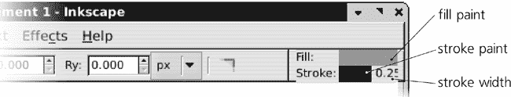

图 11-1. 此样式将用于新创建的形状。

默认情况下，除了螺旋以外的所有形状工具都使用*最后设置的样式*作为它们创建的新对象的样式。这意味着每次你更改对象中的某些样式属性时，Inkscape 都会记住此属性，并将其用于新形状。例如，在你将某物涂成绿色后，所有新的矩形、椭圆、星形等都将出现相同的绿色。或者，如果你将 3 px 的轮廓宽度和 1:1 的虚线图案分配给某些路径或形状，新形状也将具有此轮廓样式。（对于 3D 盒子，这种行为变得更加复杂，因为盒子有六个面，每个面使用六种不同的样式；有关详细信息，请参阅**11.3.5 样式**。）

如果你不喜欢为新对象使用最近设置的样式的想法，你可以更改它。在左侧工具箱中双击形状工具的按钮；这将在**Inkscape 首选项**对话框中打开该工具的页面（**3.1.1 Inkscape 首选项**）。在那里，新对象样式的双向开关可以是*最后使用的样式*或特定于该工具的固定*工具样式*。在后一种情况下，你可以按**从选择中获取**按钮来记住当前选择的样式作为工具的固定样式。

图 11-2. 形状工具的首选项页面

例如，如果你想所有矩形始终以黑色出现且无轮廓线，选择一些无轮廓线的黑色对象，转到**Inkscape 首选项**，将**矩形**工具切换到使用其**自己的样式**，并点击**从选择中获取**。

# 11.2 矩形

*矩形*，虽然听起来可能有些无聊，但却是最常用的形状类型；你几乎找不到一个不被矩形主导的设计。Inkscape 努力使创建和编辑矩形尽可能简单和灵活。

切换到矩形工具（通过点击左侧的工具栏按钮，或按  或 ），然后在画布上的任何位置拖动。使用  拖动以获得正方形或整数比例（2:1、3:1 等等）的矩形；使用  拖动以使起点成为矩形的中心而不是一个角。 和  可以组合使用。

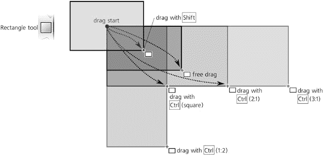

图 11-3. 绘制矩形

新矩形显示四个手柄。其中两个是位于左上角和右下角的*尺寸手柄*，它们是小小的正方形。另外两个，看起来像小圆圈，是*圆角手柄*；它们都位于右上角，因此看起来像是一个手柄，直到你拖动其中一个。

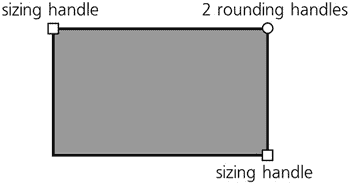

图 11-4. 矩形手柄

## 11.2.1 尺寸调整

使用尺寸手柄，你可以通过简单地*拖动*任意一边的任意方向来调整矩形的大小。当然，使用  拖动会锁定矩形的宽度、高度或宽度/高度比，通过将手柄吸附到其边或对角线上。

### 注意

*与选择工具不同，你不能将，例如，右下角的尺寸手柄移动到比左上角手柄更高的位置或更向左的位置。你最多只能使矩形宽度为零、高度为零或两者都为零（因此不可见）。*

在控制栏中，一些标有 **W** 和 **H** 的数字控件也控制所选矩形的宽度和高度。它们使用在右侧的单位选择器中选择的测量单位。

当你可以使用选择工具同样轻松地调整矩形大小时，为什么还要使用尺寸手柄呢？选择工具的问题在于它总是沿着文档坐标系（即沿页面边缘）水平或垂直缩放事物。相比之下，矩形的手柄会沿着该矩形的*边*进行缩放，即使矩形已经旋转或倾斜。**W** 和 **H** 的值也始终反映矩形的固有宽度和高度，而不是其边界框的尺寸（如果矩形旋转或倾斜，这些尺寸可能会有很大不同）。

图 11-5. 矩形尺寸手柄与选择工具的缩放比较

尺寸手柄的另一个优点是它们始终保留矩形的圆角半径（尽管，正如我们很快就会看到的，选择工具也可以做到这一点）。

与任何其他形状类型一样，矩形的尺寸手柄可以被设置为吸附到网格、参考线和其他对象。如果你从一个特别旋转和/或倾斜的矩形开始，并启用节点到路径、节点和交点的吸附（**7.3 吸附**），使用复制 () 和尺寸手柄来创建紧密贴合、无缝的轴测矩形组合就很容易了，如图 11-6 所示。

### 注意

*吸附的是鼠标点，而不是手柄本身。如果，例如，你正在使用*  *来锁定矩形的宽度或高度，这两个点可能会相距很远。在 图 11-6 中，我想使最左边的矩形变窄但保持其高度，所以我将手柄从 A 移动到 B。然而，我还想使这个矩形紧贴矩形 D 的左边缘（由粗线标记）。因此，在拖动且不释放* *的情况下，我将鼠标光标移动到点 C，使其吸附到所需的边缘（实际的句柄此时在 B），然后在那里释放鼠标。为了实现这一点，请启用节点和手柄作为可吸附对象，以及路径作为吸附目标（**7.3 吸附**）*。

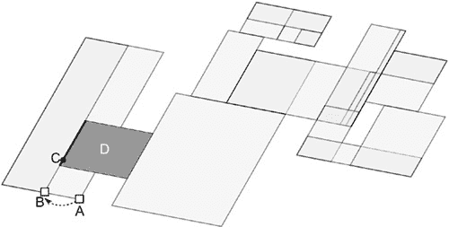

图 11-6. 将斜矩形吸附到一起

## 11.2.2 圆角

现在，抓住一个圆形圆角手柄，并将其沿矩形的侧面拖动。矩形的四个角都通过圆弧变为圆角；此外，现在你可以看到第二个圆角手柄——它保持在角落的原始位置。如果你需要 *圆形* 圆角，你可以保持它不变。如果你想 *椭圆形* 圆角，将另一个手柄沿矩形的另一侧从角落移开：

图 11-7. 矩形圆角手柄

### 注意

*即使矩形倾斜，圆形圆角也可能看起来是椭圆形的（参见 **23.3 圆角**）。*

使用控制栏中的 **Rx** 和 **Ry** 数值字段，您可以显式指定两个圆角半径的绝对单位（通过右侧的单位选择器选择）。如果选择了多个矩形，您输入的值将应用于所有这些矩形（如果选择了任何非矩形，则将忽略）。右侧带有角落图标的按钮将移除所选矩形的任何圆角。

您可以移动圆角手柄的最大距离是相应矩形尺寸的一半。当两个圆角手柄都达到这个最大值时，实际上将正方形变成了圆形，将非正方形变成了椭圆形。

通常，在技术图纸如方案和图表中，整个构图中的圆角的大小和形状必须相同，即使矩形的大小不同。Inkscape 使这变得容易。选择工具栏上的四个 **Affect** 按钮（**6.10 影响哪些变换**）中的第二个，显示两个同心圆角，控制当缩放矩形时圆角是否缩放。为了比较，图 11-8 显示了使用此按钮开启和关闭时缩放的多个圆角矩形。

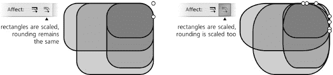

图 11-8. 缩放矩形可能或可能不会影响圆角半径的大小。

这里是矩形圆角手柄的快捷键：

+   使用  拖动来使圆角变为圆形（即，使另一个半径相同）。

+   -点击一个手柄来使圆角变为圆形，而不需要拖动。

+   -点击一个手柄来移除圆角。

# 11.3 3D 盒子

一个 *3D 盒子* 是一个表示三维盒子（矩形棱柱）在绘图平面上的投影的对象。因此，它由六个 *面* 组成，从纯 SVG 视点来看，它只是一个由六个路径组成的组，每个路径有四个节点。然而，Inkscape 以特殊方式处理这些对象，允许您在它们自己的 3D 空间中调整大小和移动它们，重新定位它们的消失点等。

除了 3D 盒子工具之外，大多数其他工具和命令都将 3D 盒子视为一个组。特别是，你可以使用选择工具通过 -点击和 -点击来选择盒子内的任何一面（通常用于更改其样式），就像选择组内的对象一样。在内部选择不会破坏盒子；然而，你也可以通过**取消组合**()或**对象到路径**()命令轻松地将它“取消组合”。这移除了任何 3D 特定的功能，并留下了一个带有路径的常规组。

## 11.3.1 为什么使用 3D 盒子？

什么使得这样一个看似有限的构造，如 3D 盒子，变得有用？

Inkscape 并不打算成为一个功能齐全的 3D 应用程序——它不会模拟一个“真实”的三维空间，在其中你可以放置你的 3D 对象。Inkscape 始终是一个二维绘图工具。然而，它经常被用来绘制三维对象。因此，为了帮助完成这类任务，Inkscape 实现了一个简单、面向 2D 的透视绘图系统，这个系统自从六百年前文艺复兴艺术家完善以来基本上没有改变。

在 Inkscape 中，你并不是“构建一个 3D 世界”，你只是创建一个代表三维场景的二维绘图。Inkscape 的 3D 盒子工具主要是一个辅助工具，它使得创建这种透视绘图变得更加容易。在透视绘图中，一个盒子几乎和矩形对于二维绘图和布局一样重要；通常，正确绘制任何东西的透视都是从绘制其包围盒开始的。因此，Inkscape 的 3D 盒子通常不是出于它们自身的目的而被使用，而是作为快速且 3D 精确的布局指南——用来对齐你的对象并将它们绘制进去（参见第二十一章中的示例）。

另一方面，在 Inkscape 中创建和重塑 3D 盒子的便捷性本身就是一种灵感。一种以 3D 盒子为主导的艺术风格，以 Inkscape 0.46 的关于盒子(**帮助** ▸ **关于**)为例，在这个盒子中这个工具首次亮相：

图 11-9. 使用 3D 盒子的设计构图

## 11.3.2 绘制

要绘制一个 3D 盒子，切换到 3D 盒子工具(或)并在画布上拖动。这将在 X/Y 平面上绘制盒子的正面；盒子沿 Z 轴的深度保持固定。要切换到 Z 轴，使用拖动；这会固定 X/Y 面，但让你调整深度：

图 11-10. 绘制 3D 盒子

一旦创建了一个盒子，它会在每个八个角以及中心显示一个把手。此外，彩色线条从盒子的边缘延伸到消失点。让我们详细看看这些控件。

## 11.3.3 视角和消失点

每个三维盒子都存在于一个特定的 *视角* 中，这个视角由三个 *消失点* 定义，对应于三个空间维度：X（红色引导线）、Y（蓝色引导线）和 Z（黄色引导线）。每个消失点可以是 *有限* 的（在这种情况下，它是一个你可以拖动的实际把手）或 *无限* 的（在这种情况下，它只是指向无限远点的方向；你可以改变这个方向的角度）。

默认情况下，X 和 Z 消失点是有限的，位于你文档页面左右边缘的中间。Y 消失点是无限的，其方向是垂直的：

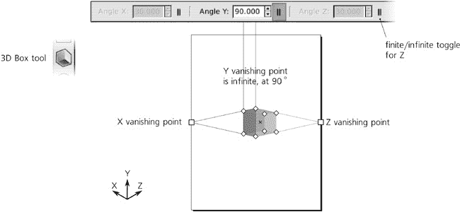

图 11-11. 默认视角

任何维度中消失点的有限/无限状态可以通过工具控制栏中的三个按钮切换。有限的消失点可以简单地自由拖动在画布上。无限消失点的角度可以在控制栏中数值调整，或者通过快捷键：

+    和 旋转 X 消失点方向。

+    和 旋转 Y 消失点方向。

+    和 旋转 Z 消失点方向。

+   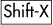，，和 切换相应的消失点从有限到无限，再回到有限。

没有修饰符时，这些键按角度步长旋转（默认为 15 度，**6.3 选择器：旋转和倾斜**）。使用时，它们旋转，使得透视线在当前缩放下最多偏移 1 个屏幕像素。

例如，你可以将所有三个消失点设置为无限，并以 150 度（X）、90 度（Y）和 30 度（Z）的角度旋转它们来绘制没有透视缩短的等距盒子。此外，虽然盒子在位于三个消失点之间时看起来最自然，但它们并不一定要在那里；将盒子从“自然”视角的甜点处移开会使它看起来奇特地扭曲，有时这可能是你想要的。

对于新创建的 3D 盒子，Inkscape 将重用最后选择的 3D 盒子的视角。因此，通常多个盒子会 *共享* 相同的视角。重要的是要注意，当你改变一个视角时，*所有* 使用此视角的盒子——无论是否选中——都会对变化做出反应：

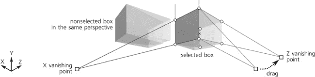

图 11-12. 通过拖动消失点改变视角会影响此视角中的所有盒子。

如果几个盒子共享一个视角，你可以通过按住  并拖动其中一个盒子的有限消失点（仅选择该盒子）来 *取消合并* 它。与不按住  拖动不同，这将只影响所选的盒子。另一种取消合并盒子视角的方法是通过在选择器中移动盒子对象；这将拖动其自己的消失点集与盒子一起移动，而不会影响任何其他盒子。取消合并一个盒子后，改变该盒子的视角将只会影响该盒子。

另一方面，将两个不同的视角合并在一起也同样简单，使它们成为一个。为此，选择具有不同视角的两个盒子，并将一个视角的有限消失点移动到另一个视角上——它们会自动对齐并连接（类似于当渐变手柄拖动足够近时，**10.4.3 移动、合并和自动对齐**），盒子现在将具有相同的视角。（如果视角有任何无限消失点，它们的方向角必须相同才能进行透视合并。）

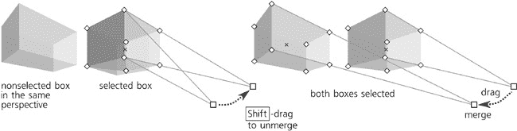

图 11-13. 合并和取消合并消失点

## 11.3.4 手柄

当在任意形状工具或节点工具中选择 3D 盒子时，它会显示八个菱形 *角手柄* 和一个 X 形 *中心手柄*。没有修饰符的情况下，前 X/Y 侧的四个手柄会重塑该侧面，而另外四个则改变盒子的 Z 深度。然而，使用  时，它们的角色会互换，如图 图 11-14 拖动盒子的角手柄") 所示。

 拖动盒子的角手柄

图 11-14. 使用和不使用  拖动盒子的角手柄

使用 ，侧边调整大小手柄会自动对齐到该侧边边缘及其对角线的延续处。（对于改变深度的手柄， 无效。）

图 11-15. 使用  拖动框的角手柄

类似地，不使用修饰符拖动中心手柄会在 X/Y 平面内移动框，而使用  则会将其自动对齐到其 X 和 Y 消失点的方向以及它们之间的平分线。使用 （无论是否使用 ），中心手柄会沿着指向其 Z 消失点的方向移动框：

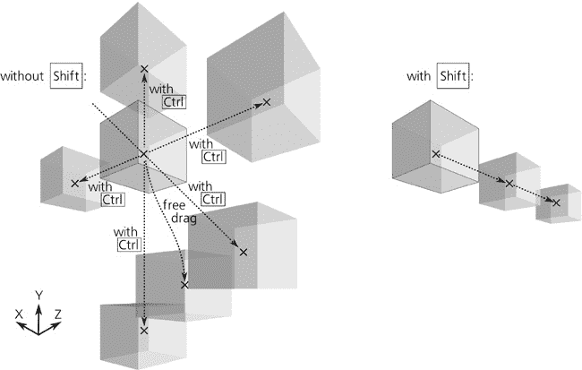

图 11-16. 使用  拖动框的中心手柄，有和无

与矩形一样，如果你启用了节点对路径、节点和交点的自动对齐（**7.3.3 节点和手柄自动对齐**），你的 3D 场景将感觉非常灵敏——你绘制的或调整大小的任何内容都会急切地连接并排列，这使得从多个框中构建无缝的实体结构变得愉快。作为一个简单的例子，要构建多层建筑，先绘制一个单层框，然后通过  和  拖动复制的中心手柄向上移动，直到它自动对齐到下一层：

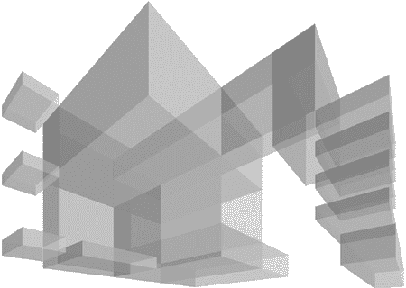

图 11-17. 使用  和自动对齐手柄到路径，使构建复杂场景变得容易。

## 11.3.5 样式化

从样式的角度来看，3D 框与路径组没有区别。默认情况下，新框的六个侧面都有不同的蓝色阴影；你可以用某种颜色涂满整个框（从而消除侧面之间的任何差异），或者你可以  点击并  点击来选择框中的任何单个侧面并单独涂色。

此外，你甚至可以像进入一个组（**5.10 选择组**)一样进入盒子，通过选择它并按下 ；之后，你可以通过简单的点击或通过  和  来选择单个侧面。完成这些操作后，盒子仍然是一个盒子——要移除其 3D 盒子功能，你需要取消组合（）或将其转换为路径（应用到整个盒子或其任何单个侧面。如果你降低 3D 盒子的不透明度，它表现得就像一个半透明组（**4.5.1 组的使用**）：你可以看到盒子下面的内容，但你看不到盒子本身的隐藏侧面。要看到隐藏的侧面，你需要通过单独选择它们来降低单个侧面的不透明度，如图 11-18 所示。

盒子内侧面的 *z-顺序* 总是从 3D 视点自动正确——也就是说，那些应该离你更远的侧面在底部，而正面在 z-顺序的顶部。然而，Inkscape 不会以任何方式强制执行不同盒子的 z-顺序；与其他所有形状工具一样，3D 盒子工具在当前层的 z-顺序之上创建新的盒子（**4.3 Z-顺序**）。这意味着在绘制一个盒子之后，你可能需要相对于其他盒子在 z-顺序堆栈中移动它，以便构图看起来正确。

图 11-18. 整个盒子和各个侧面不透明度的比较

对于新创建的盒子，最后设置的风格和工具自己的风格（**11.1.2 新形状的风格**）的选择也适用，但有一些变化。默认情况下，3D 盒子工具使用最后设置的风格，但它的定义不同：与所有其他工具不同，它记住的是 3D 盒子的*同一侧面*上最后设置的风格，而不是任何对象。例如，如果你将任何盒子的顶部侧面涂成红色，那么之后你创建的所有新盒子的顶部侧面（但不是其他侧面）也将是红色的。

由于 3D 场景通常假设一个单独的光源，这种行为是有意义的：画一个单独的框，并按照从例如左上角照射的样子绘制其侧面。之后，你创建的所有新框将以类似的方式“照亮”。

### 注意

*最后一种样式只有当你将其分配给*“单独的边”*而不是整个框时，这个工具才会记住。例如，如果你只是选择一个框并将其全部涂成红色，新的框将*不会*遵守这一点。所以，假设你希望所有新的框都有轮廓但没有填充（“线框”），最简单的方法是将框作为一个组*()*)输入，选择所有其边()*)，然后一次性为它们分配轮廓并移除填充。*

调整工具在 3D 框上工作的方式与你预期它在多个路径（分组或不分组）上工作的方式完全一样。使用路径调整模式（**12.6 路径调整**），一旦你扭曲了框的边，它就不再是 3D 框，而变成了一个简单的组。然而，颜色绘制和颜色抖动模式却可以在不破坏其 3D 功能的情况下覆盖框。通常，只启用色调和可能饱和度通道，但不启用亮度(**8.7.3 通道**)是有意义的，这样你就可以改变框的颜色，同时保留其边的相对亮度和暗度以产生 3D 效果，如图 9 所示的颜色插入图中。

# 11.4 椭圆

椭圆是一种可以表示椭圆、圆、弧（未闭合）或段（闭合，弧加上从弧两端延伸到中心的两个半径）的形状：

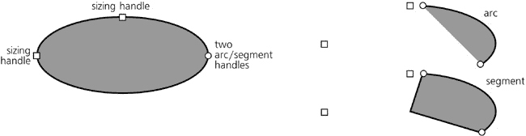

图 11-19. 椭圆、弧和段落的句柄

## 11.4.1 绘制

要切换到椭圆工具，请按  或 。以下是椭圆绘制的快捷键：

+   在画布上拖动会创建一个椭圆，该椭圆内嵌于你拖动所创建的（想象中的）矩形内。

+   当按下  时，那个想象中的矩形首先被限制为正方形或整数比例（1:2、2:1 等），然后椭圆被内嵌其中。

+   当按下  时，绘制从中心开始，因此椭圆的四分之一被内嵌到这个矩形中，而不是整个椭圆。当同时按下  和  时，你会得到一个从中心开始的圆或整数比例的椭圆。

    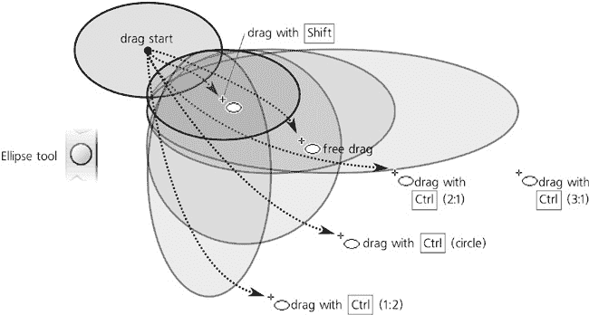

    图 11-20. 不使用  绘制椭圆

+   当按下  时，工具的行为会改变（参见 图 11-21). 现在它绘制一个对角线从鼠标拖动起点到终点延伸的椭圆。换句话说，你可以在椭圆的 10:30 点开始拖动，并在 4:30 点结束，椭圆会根据需要挤压以适应这条对角线。

+   使用 ，工具始终绘制一个完美的圆，其直径从拖动开始到拖动结束。如果你需要一个给定直径的圆，这很方便。

+   将  添加到  和  中，其效果与不使用  时相同，但它将从中心开始绘制。你只需在上面的描述中将“直径”一词替换为“半径”即可。

快速创建固定大小的圆的一种方法是通过在笔工具中的直线或准直模式  -单击（**14.1.4 模式**）。这些圆的大小可以在笔工具的 **Inkscape 预设** 页面上设置。添加  使其大小加倍，或添加  使其大小随机化。

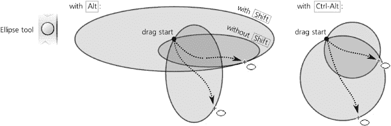 绘制椭圆](httpatomoreillycomsourcenostarchimages1735850.png.jpg)

图 11-21. 使用  绘制椭圆

## 11.4.2 控制柄

创建椭圆时，它会显示三个控制柄：两个方形和一个圆形。就像矩形一样，方形控制柄是尺寸控制柄，而圆形控制柄实际上是叠放在一起的两个控制柄。然而，在椭圆中，圆形控制柄不是用于圆滑，而是用于将椭圆变成弧线或段，正如我们很快就会看到的。

与矩形一样，椭圆的尺寸控制柄改变椭圆的宽度和高度是在椭圆的自身坐标中，而不是文档坐标中。无论你如何旋转或倾斜椭圆，这些控制柄都会记住椭圆两个轴的位置，并允许你相对于这些内在轴拉伸或挤压椭圆，始终保持中心的位置：

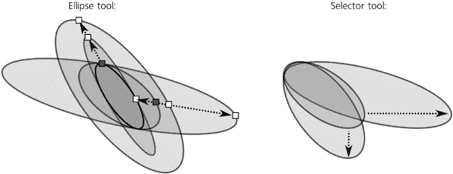

图 11-22. 在选择器和尺寸控制柄中变换椭圆

这里是椭圆尺寸控制柄的快捷键：

+   按  拖动可以将椭圆转换为圆形，方法是使另一个半径相同。

+   -点击一个句柄可以将椭圆转换为圆形，而无需拖动。（注意，由于倾斜，圆形可能看起来是椭圆形的。）

现在，让我们看看弧/线段句柄（圆形的）。要创建线段（弧加上两个半径），请将一个或两个这些句柄*拖出*椭圆；要创建*弧*，请保持*在内部*拖动。当然，句柄本身始终保持在椭圆的边缘上，既不在内部也不在外部；“拖动内部”指的是您抓住该句柄时鼠标的位置。请注意，尺寸句柄保持功能性和与整个椭圆相同的定位，这可能位于您的弧或线段之外。

椭圆工具的控制栏允许您指定弧的精确角度，将其转换为线段，并使椭圆完整：

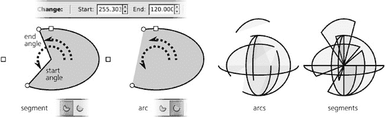

图 11-23. 线段和弧

注意，与线段不同，弧是*未闭合*的形状；换句话说，描边只沿着椭圆的边缘延伸，但不会连接弧的两端。如果您移除填充，只留下描边，就可以清楚地看到这一点。

这里是弧/线段句柄的快捷键：

+   按  时，在拖动时将句柄捕捉到角度增量（默认为 15 度，**6.3 选择器：旋转和倾斜**）。

+   -点击一个句柄可以将弧或线段转换为整个椭圆。

记住，就像所有其他形状参数一样，椭圆的起始和结束角度会被记住并重新用于新创建的形状。当您打算画一个椭圆却得到一个狭窄的饼片时，有时可能会感到惊讶。

# 11.5 星形和多边形

星形工具（ 键或 ）创建两种稍微不同的中心对称形状——多边形和星形。尽管这个想法很简单，但这却是 Inkscape 中最复杂的工具之一，无穷无尽的娱乐性，非常适合让你的朋友惊叹。

一个*多边形*只是位于一个想象中的圆上等距离的点，并通过直线段连接起来。Inkscape 多边形有一个菱形句柄，用于缩放和旋转它。

*星形*是一个更有趣的对象：它包含两个想象中的同心圆上的两套等距点，星形的轮廓在内外圆的点之间来回曲折。使用星形的两个手柄，你可以改变圆的直径，并使圆相对于彼此围绕它们的共同中心旋转，这会产生令人着迷的复杂对称形状。

图 11-24. 多边形和星形

## 11.5.1 绘制

在绘制新形状之前，通过按控制面板上的切换按钮决定你想要绘制的是多边形还是星形，并在数值控制中选择角的数目（凸顶点）。例如，有三个角的多边形是等边三角形，如果转换为路径，将会有三个节点；然而，有三个角的星形将有六个节点。你还可以更改现有形状的多边形/星形类型和角的数目——只需选择它并编辑值。

### 注意

*角的数目可以从 3 到 1000，但设置得太高可能会显著减慢 Inkscape 的速度，除非你使用轮廓模式（**3.11 渲染模式**）。*

绘制形状，再次，就像在画布上拖动鼠标一样简单。星形或多边形始终从其中心开始绘制。只有一个键盘快捷键：使用  拖动可以将形状的一个角相对于其中心的角度固定到 15 度的增量。

## 11.5.2 手柄

多边形的一个手柄只能用来缩放和旋转多边形——你可以在选择器中通过变换做到这一点。星形的两个手柄则更有趣。

首先，通过将其中一个手柄移动到或从星形的中心，你正在改变星形顶点所在的两个圆的直径比例。这个比例被称为 *辐条比*，也可以在控制面板中作为数值参数进行调整（对于多边形不可用）：

图 11-25. 调整 5 边形星的辐条比

你甚至可以将最初的内手柄移动到比外手柄更远的位置。控制面板仍然会显示一个小于 1 的比例，因为它总是将较小的半径除以较大的半径，而不管最初哪个是内手柄，哪个是外手柄。

其次，内手柄（最初位于内圆上）可以沿星形中心的弧线 *切向*（即沿着星形中心的弧线）移动，以扭曲星形的顶点。（旋转外手柄只是旋转整个星形。）

图 11-26. 沿切线移动星形的多边形内手柄

如果你想要保持顶点严格径向（没有切向位移），则拖动内手柄（），或者-单击它以在不拖动的情况下移除任何现有的切向倾斜。

## 11.5.3 圆角

通过圆角星星和正多边形可以实现许多迷人的效果。星星的圆角与矩形的圆角不同；对于星星或正多边形，不仅角变得不再尖锐，星星的所有边都弯曲成优雅的贝塞尔曲线：

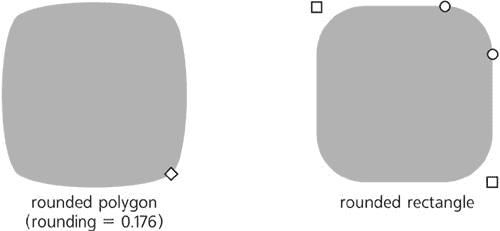

图 11-27. 一个圆角四边形与一个圆角矩形的比较

如你所见，圆角正方形在圆形或椭圆形圆角之间有直线段，而圆角多边形或星星则完全没有直线——所有段都变成了贝塞尔曲线。

星星工具的**圆角**数值控制是贝塞尔手柄长度（**12.1.4 贝塞尔曲线**)与这些手柄影响的正多边形/星星边的长度的比例。此参数可以是负值，这会反转切线的方向。通常，0.2 到 0.4 之间的值会给出最自然的结果。负值或过高的正值往往会造成扭曲、循环和自相交。通过在不同圆角星星中调整手柄位置，你可以得到无限多样的美丽形状：

图 11-28. 玩转圆角星星

除了在控制栏上设置数值圆角参数外，还可以通过-拖动任何手柄进行切向圆角。围绕星星中心的逆时针旋转手柄会导致正圆角；顺时针旋转使其为负。-单击手柄会移除任何圆角。

如果你想要星星的外角尖锐而内角平滑，或者相反，尝试从星星创建一个偏移路径（**12.4 偏移**)。

## 11.5.4 随机化

使星星更有趣的另一种方法是*随机化*它。随机化将星星或正多边形的所有顶点移动到随机的方向和随机的距离。如果星星是圆角的，随机化会保持所有顶点的平滑性。

整体效果的力量由控制栏中的 **随机化** 参数控制，它可以取正值和负值。当你改变这个值——或者简单地 ——每个节点的随机位移方向保持不变，只有距离发生变化；负值只是将顶点移动到相反方向。换句话说，星星以相同的方式保持随机化，但程度不同。

相反，当你简单地拖动随机化星星的把手进行缩放或重塑它，或者当你绘制一个具有非零随机化的新星星时，形状会颤抖和抖动，在鼠标的每一次轻微移动中都会突然改变所有节点的随机位移（在数学术语中，*重新播种* 随机化）。因此，如果你想使星星以相同的整体幅度进行不同的随机化，只需稍微拖动其任意把手：

图 11-29. 随机化星星

随机化星星有什么好处？随机性是自然界的基本力量之一，在设计中的随机性是使形状更加生动和不太僵硬的极好方式。你的艺术感和经验会告诉你在哪里以及多少随机性是合适的。在 Inkscape 中，有许多艺术随机性的来源；你可以轻松地打乱对象的顺序（**7.5.1 随机化、去簇和去除重叠**），创建具有随机位置、缩放和旋转的图案（**10.8.2 编辑图案**），以及随机移动路径中的节点以扭曲它们（**12.6.6 粗糙模式**）。然而，随机化星星在快速且容易地绘制出具有内在对称性强调其随机性的形状方面是独特的。

稍微的随机化使星星更加人性化，有时甚至非常有趣；强烈的随机化会产生各种狂野和不可预测的形状。混乱的毛球、圆润的阿米巴状墨迹、边缘奇妙的景观，以及具有许多顶点和接近 1 的辐条比的大星星——所有这些以及更多都是通过星星随机化实现的。例如，图 11-30 展示了一个星星，未随机化（左）和仅通过 0.005 随机化（右）以看起来更加自然地毛茸茸，并消除未随机化时星星上的摩尔纹。

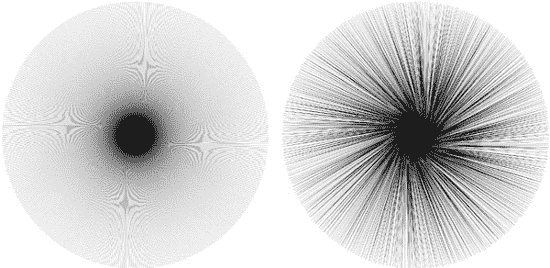

图 11-30. 未随机化（左侧）和通过 0.005 随机化（右侧）的 500 个顶点的星形。

作为另一个例子，这里有一些随机散布且未聚集的五边形，圆角为 0.28，随机化度为 0.15，看起来非常像海滩上的鹅卵石：

图 11-31. 鹅卵石：未聚集（7.5.1）的圆形和随机分布的五边形

# 11.6 螺旋

螺旋工具（键或）创建另一个简单但多功能的形状——**同心螺旋**。虽然它不如星形那么令人兴奋，但有时非常有用。

螺旋，就像星形一样，是从中心绘制的。像往常一样，使用拖动时，拖动点（螺旋的外端）会自动对齐到 15 度的增量（**6.3 选择器：旋转和倾斜**）。

与所有其他形状工具不同，螺旋工具默认使用其自己的样式来创建新的螺旋——无填充，黑色轮廓——而不是最后使用的样式（**11.1.2 新形状的样式**）。

画出螺旋后，螺旋在线的两端各显示两个手柄。只需简单地拖动这些手柄进行圆形滚动，即可将螺旋向内或向外滚动，从内部或外部。这样，例如，您可以创建只有一个转向的螺旋。

控制栏中的**转向**参数反映了您需要完成多少个完整圆周才能到达螺旋的外端。螺旋的最大转向数是 1000。内端由**内半径**值控制，该值显示螺旋开始时的总转向百分比（图 11-32）。例如，**内半径**为 0 表示螺旋从中心开始；0.5 表示它从中心和外围之间的一半开始。

图 11-32. 调整转向和内半径

螺旋的**发散度**是控制螺旋缠绕是否在整个螺旋上等间距（发散度 = 1）、向中心变密集（发散度 > 1）或向外围变密集（发散度 < 1）的参数。您可以通过控制栏中的数字或通过 -拖动内手柄上下移动来更改此参数：

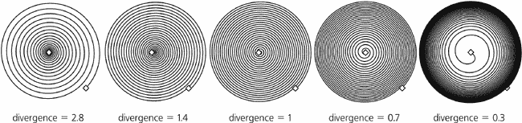

图 11-33. 调整发散度

外手柄的其他快捷方式：

+   -拖动以缩放或围绕中心旋转（无滚动展开，与绘制螺旋时的行为相同）。

+   -拖动以在滚动或展开时锁定半径（即，整个螺旋变得更密集或更稀疏，但整体大小不变）。

内部手柄快捷键：

+   -垂直拖动以调整发散度。

+   -点击以重置发散度至默认值 1。

+   -点击以将内半径重置为 0（即，将内手柄完全移至中心）。

何时使用螺旋是有意义的？螺旋可以以均匀的同心图案填充给定的空间——这可能不容易通过手动或其他工具实现。因此，它可能成为其他对象的载体或指南，例如标记（**9.5.1 中间标记和节点**）、虚线图案（**9.4 虚线图案**）、路径上的文本（**15.2.3 路径上的文本**）或实时路径效果（**13.1 路径效果**）。此外，与椭圆工具一样，螺旋工具可以方便地创建具有平滑变化的曲率的曲线；与普通的贝塞尔曲线不同，通过沿着曲线拖动手柄可以缩短或延长弧或螺旋，而不会影响其形状。
