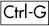
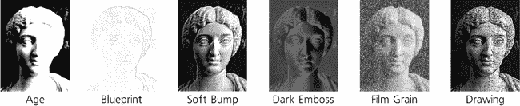
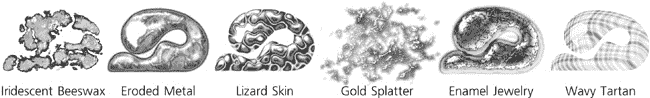
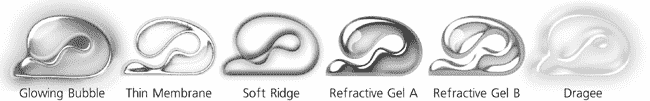
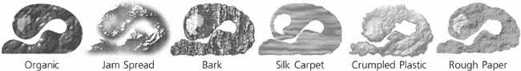
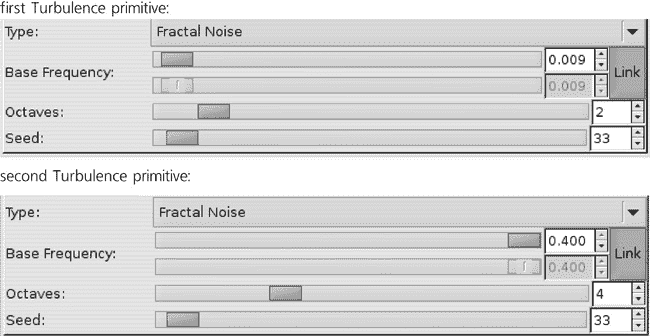
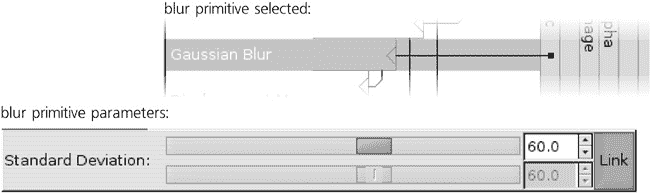
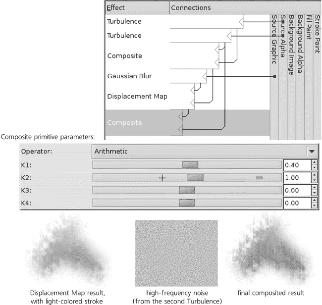
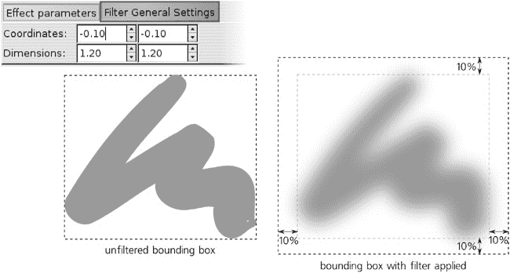
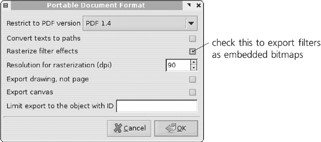

# 第十七章。过滤器

Inkscape 的过滤器是一种将复杂的位图处理算法应用于绘图对象中的方法。忠实于矢量精神，过滤器是非破坏性的：您可以随时更改任何过滤器的参数，原始矢量对象仍然可以完全编辑。过滤器可以做到的事情包括模糊、锐化、颜色调整、添加纹理、各种扭曲、类似于 3D 的斜面效果以及许多其他效果。此外，您可以将过滤器组合成任意复杂的*过滤器堆栈*。

SVG 过滤器（由 SVG 标准定义并由 Inkscape 实现）非常强大；一本整本书都可以写它们的用途和能力。不幸的是，它们也可能相当技术性，尤其是如果您试图自己组合过滤器堆栈。因此，在本章中，我们将首先探讨一些简单使用过滤器的方法，例如**模糊**控制（**17.1 模糊**）和预设过滤器效果（**17.3 预设过滤器**）。然后，对于那些寻求更多灵活性和不怕技术性的人，我们将讨论强大的**过滤器编辑器**对话框（**17.4 过滤器编辑器对话框**），它允许您从标准过滤器原语创建自己的过滤器堆栈。

# 17.1 模糊

我们在本书中多次看到了模糊的使用。正确地称为*高斯模糊*（以德国数学家卡尔·弗里德里希·高斯命名），这种效果平滑地“溶解”了对象，就像通过一个失焦的镜头观看它一样。**模糊**是 Inkscape 支持的 14 个过滤器原语之一——但在所有这些原语中，**模糊**拥有最用户友好的界面：您可以在**填充和描边**对话框中，通过简单的滑块随时调整任何对象：

图 17-1。填充和描边对话框中的模糊滑块

因此，可以说 Inkscape 将模糊视为对象的基本属性之一，就像它的不透明度一样。为什么会有这种特殊处理？一方面，这是因为模糊对象是一种非常自然、基本操作。模糊在物理世界中无处不在：非清晰的阴影、发光以及模糊或移动中的物体都可以通过模糊来渲染。因此，如果您想绘制任何逼真的图像，这个过滤器是绝对必要的。另一方面，模糊不是您可以用常规矢量形状或渐变轻松模仿的东西。因此，通过添加一个易于访问的滑块，Inkscape 的功能得到了极大的扩展。

**模糊**滑块控制模糊的**量**，范围从 0 到 100%；1%的设置几乎不会改变对象的外观，而 100%则将任何对象变成无形状的团块。百分比确保这个比例对任何大小的对象都起作用；换句话说，一个被 10%模糊的大对象有更大的**绝对**模糊量（更大的模糊半径），但它看起来与也被 10%模糊的小对象完全成比例。如果你想在不同大小的对象中获得相同的模糊半径，你需要使用不同的模糊量。

图 17-2. 模糊量（A 和 B 相同）和模糊半径（A 和 C 相同）

你会注意到，模糊一个对象会影响其边界框（只有当使用视觉边界框类型时，**4.2 边界框**）。扩展的边界框将覆盖对象的全部模糊边缘。

每个模糊的对象都是单独处理的，就像它自己的完全透明的层一样，因此它永远不会“涂抹”任何相邻的非模糊对象。由于该对象的每一层本身是透明的，模糊对象的边缘就变得部分半透明。然而，你可以模糊一个组，在这种情况下，组中的所有成员都会一起模糊，就像它们被放置在一个整体模糊的单层上。在图 17-3 中，左侧有两个相邻的矩形，它们之间没有间隙也没有模糊。在中间，每个矩形分别模糊了 20%；正如你所看到的，条纹背景可以通过物体之间的模糊间隙看到。然而，在右侧，相同的两个矩形首先被分组，然后整个组以 20%的百分比模糊；现在没有间隙——模糊只会在边缘添加透明度，但它不能揭示被不透明组中心完全覆盖的内容。

图 17-3. 模糊单独的对象与模糊一个组

此外，分组允许你将多个模糊层应用于同一对象。例如，你可以先模糊对象本身，然后将其分组（可能甚至只是与自身分组，即把单个对象放入组中）并模糊该组。自然地，通过模糊一个组，你可以使任何成员对象比之前更模糊，但不能更模糊。（同样，正如我们在**16.3 样式克隆**中看到的，你可以使克隆比原始对象模糊更多，但不能更少。）

### 注意

*模糊与羽化不同**。模糊影响整个对象；特别是位图对象上的线条或复杂组内的对象边界都会被模糊。另一方面，羽化仅仅是模糊的透明度，它遮盖了对象的边缘（如照片）。Inkscape 也可以使用预定义的复合滤镜进行羽化（**17.3 预设滤镜**）。*

图 17-4. 模糊与羽化

## 17.1.1 模糊和变换

如果你变换一个模糊对象会发生什么？

移动一个模糊的对象并不很有趣：对象只是整体移动，保持与之前一样的模糊。成比例（均匀）缩放也会将对象整体缩放，包括模糊半径，因此模糊量相对于对象大小保持不变（即，**填充和描边**对话框中的百分比指示器不会改变）。

非均匀缩放更有趣。例如，如果你垂直挤压一个模糊对象，它的模糊也会随之挤压并变得**非均匀**——现在对象在水平方向上的模糊比垂直方向上更多。这种非均匀模糊有时被称为**运动模糊**，因为它近似了在快速运动（在这种情况下，水平方向）中捕捉到的对象在照片上的外观。因此，如果你想对原始未挤压的对象应用运动模糊，只需先将其向相反方向拉伸，然后模糊它，最后将其挤压回形状（这仅适用于路径和位图）：

图 17-5. 逐步展示运动模糊

另一种创建非均匀运动模糊的方法是通过调整**滤镜编辑器**对话框中**高斯模糊**滤镜的参数（**17.4 滤镜编辑器对话框**），但这里描述的拉伸/挤压方法通常更容易。

### 注意

*如果你对在 SVG 层面上如何实现这一点感兴趣，关键是要确保模糊应用于具有* `transform` *属性的**对象**（**A.7 变换**），这样可以确保模糊也会受到该变换的影响。当你拉伸一个没有模糊的路径对象时，这种拉伸默认嵌入到路径的点中（**12.5.7.3 节点变换**）；但是一旦应用了模糊，反向挤压将相反地添加* `transform` *属性，影响模糊。*

要在组或文本对象（即不是路径或位图）上创建运动模糊，请使用这个技巧：拉伸对象，然后将其分组（，**4.5 组**），对组应用模糊，然后将其挤压回去。分组步骤确保最终得到一个具有正确比例的对象，同时挤压`转换`属性也会影响模糊效果。

类似的评论也适用于许多其他过滤器在转换时的行为。例如，挤压和/或旋转对象可以使你创建纹理过滤器的透视扭曲变体（**17.3 预设过滤器**），以便应用于 3D 场景中的墙壁和地板（**11.3 3D 盒子**）。当然，通过拉伸和挤压对象来转换过滤器并不像在画布上拖动手柄那样方便——但它有效。

### 注意

*过滤器作用于屏幕上对象的渲染图像——也就是说，它们总是以位图的形式作为输入，这是为当前缩放级别创建的。这就是为什么过滤器可能如此慢的原因：每次你放大或缩小，过滤器都会重新应用于对象的新的渲染。这也解释了为什么某些过滤器可能根据缩放看起来有些不同。例如，当在 100%缩放时应用于位图对象的锐化过滤器，其工作方式正如你所期望的那样。然而，如果你足够接近地放大，你将看到位图对象的像素作为矩形（**1.1 矢量图形是什么以及为什么它很重要**），锐化现在将应用于这些像素矩形的边缘！*

## 17.1.2 模糊调整

调整工具的模糊模式会在画笔下的所选对象上应用更多的模糊（默认情况下）或更少的模糊（当按下时）。添加或移除的模糊量取决于**力量**、笔压（如果你使用的是平板笔）、对象与画笔中心的接近程度以及你应用画笔的时间。

# 17.2 混合模式

混合模式是另一种类型的过滤器，Inkscape 有专门的控件来处理。选择混合模式会影响对象的颜色如何与下方的背景对象混合（即混合）。

然而，与可以应用于任何单个对象的模糊不同，Inkscape 只允许你将混合模式分配给图层（**4.6 图层**）；相应的控件在**图层**对话框中。这在 SVG 处理这些过滤器的方式中有其原因；对你来说，这意味着你只能一次性更改图层中所有对象的混合模式，并且该混合模式将影响该图层中的对象如何与下层的对象混合，而不是它们之间。

五种混合模式包括：正常（默认；切换到此选项以移除任何不寻常的混合），乘法，屏幕，变暗，和变亮。在正常模式下，只有非 100%不透明度才能使顶层中的对象呈现半透明；在其他所有模式下，底层对象即使没有任何透明度也能“透过来”。以下是一个演示：

图 17-6。所有大矩形都在背景层，所有小矩形都在前景层，并设置了各种混合模式；各处的透明度都是 100%。

混合模式最常见的一个应用可能是用于着色位图。例如，想象你有一张彩色照片，但想将其完全或几乎变为单色，例如，使用棕褐色或蓝色色调，以匹配你的构图色彩方案。

当然，你可以在位图上叠加一个半透明的目标颜色矩形，但这并不能完全去除位图本身的颜色；更糟糕的是，位图会褪色并失去对比度。你还可以在外部位图编辑器中调整位图的颜色（如果它尚未嵌入到你的 SVG 中，**18.2 链接与嵌入**），或者你可以使用预定义的合成过滤器，如棕褐色，但这些选项不够灵活。相反，将照片放在一个层上，将着色矩形放在其上方的单独层上，并更改该顶层（见图 13 的颜色插入）的混合模式。

+   **乘法**和**变暗**模式主要对照片的**亮**区域进行着色。因此，如果着色颜色本身较亮，它将很好地着色你的照片同时保留其对比度；如果着色颜色较暗，结果可能会过暗。

    乘法和变暗之间的区别在于，对于每个像素，变暗只是选择背景和前景颜色中较暗的一个，而乘法实际上是将两种颜色结合起来。尝试两者，并选择适合你照片的一个。

+   **屏幕**和**变亮**模式主要对照片的**暗**区域进行着色。因此，如果着色颜色本身较暗，它将很好地着色照片同时保留其对比度；如果着色颜色较亮，它将只是“漂白”照片，使其整体过亮。

    再次，屏幕和变亮之间的区别在于，对于每个像素，变亮只是选择背景和前景颜色中较亮的一个，而屏幕实际上是将两种颜色结合起来。尝试两者，并选择适合你照片的一个。

总结来说，如果你的着色颜色较暗，使用屏幕或变亮模式；如果它较亮，使用乘法或变暗模式。通过调整着色层对象的透明度来调整着色量。

# 17.3 预设过滤器

Inkscape 随附了大量的预设组合过滤器。要将预设过滤器应用于任意数量的选定对象，只需从**过滤器**菜单的子菜单中选择一个命令。大多数过滤器将立即应用；少数过滤器首先会显示一个简单的对话框，您可以在其中调整它们的参数，类似于任何其他扩展效果（见**13.3 路径扩展**；此类过滤器在菜单中的名称末尾有“...”）： 

图 17-7. 预设过滤器效果

要获取单个预设过滤器的简要描述（或任何菜单命令，无论如何），只需将鼠标悬停在菜单中的命令上并阅读状态栏。在此处，我将不会描述所有预设过滤器；它们有数十个，并且每个 Inkscape 版本都会添加更多。相反，这里是对分组相似过滤器的子菜单的简要描述：

+   **ABC**子菜单收集了最常用的简单基本过滤器，通常只包含一个或两个基本形状。它们包括：

    +   类似烟雾的“分形噪声”纹理应用于填充（**噪声填充**）或透明度（**噪声透明度**）。

    +   带有光泽（**镜面光**）或无光泽（**漫射光**）的 3D 斜面。

    +   **羽毛** (图 17-4) 将模糊的不透明度蒙版应用于对象的边缘。

    +   **粗糙化**随机扭曲对象的形状。

    +   **简单模糊**添加少量高斯模糊（**17.1 模糊**）。

    通常，这些过滤器不是单独使用，而是作为更复杂过滤器的组成部分，您只需通过将多个预设过滤器堆叠在一起即可构建这些过滤器。您甚至可以通过多次将过滤器应用于同一对象来大致调整过滤器的数量（对于更精确的过滤器参数调整，您需要访问**过滤器编辑器**，**17.4 过滤器编辑器对话框**）。

    

    图 17-8. ABC 子菜单中的过滤器

+   **斜面**子菜单展示了斜面主题（伪 3D 凸边）的许多变体：在这里，您将找到不透明和半透明的材料，有光泽和无光泽的表面处理，由多个光源照亮的斜面，带阴影和不带阴影，中间有凹槽和凸边等。所有这些过滤器大多保留了对象的原始颜色，尽管它们可能在某些地方使其变亮或变暗以产生 3D 效果。

    

    图 17-9. 斜面子菜单中的过滤器

    ### 注意

    *如果您想改变投射到斜面对象上的光的方向，打开**过滤器编辑器**，选择应用在对象上的过滤器堆栈中的**镜面光**或**漫射光**原语，并调整**方位角**参数。*

+   **模糊**子菜单提供水平和垂直运动模糊，对象后面的柔和模糊光，不同的方法来模糊对象内部的颜色边界同时保持其轮廓清晰（**消逝**，**模糊内容**和**交叉平滑**），**噪点模糊**结合形状扭曲和模糊，以及一些其他过滤器（图 17-10）。

    

    图 17-10. 来自“模糊”子菜单的过滤器

+   **颜色**子菜单包含仅修改应用对象颜色的过滤器。在这里，您可以找到将任何对象转换为灰度的**去饱和度**，**棕褐色**，**反转**和**反转色调**，各种着色过滤器（**着色**，**太阳能化**，**月亮化**），以及其他。

+   **扭曲**过滤器通过水平拉伸抖动扭曲对象的形状，就像水中的反射（**涟漪**），边缘的随机粗糙化（**撕裂边缘**），不连接的块的散射（**粉笔和海绵**），或者与不均匀纹理结合的边缘扭曲（**像素涂抹**）。**粗糙内部**过滤器保持轮廓完整，但粗糙化对象内部的任何颜色边界。

    

    图 17-11. 来自“扭曲”子菜单的过滤器

+   **图像效果**是主要适用于位图的过滤器，例如**锐化**，**边缘检测**，**浮雕**或**油画**。

    

    图 17-12. 来自“图像效果”子菜单的过滤器

+   **遮罩工具**子菜单包含几个使对象部分透明的效果。其中最基本的是**橡皮擦**，它使对象中的所有白色区域透明。例如，如果您在黑色矩形上叠加一个小白圆圈，将它们组合在一起，并应用**橡皮擦**到组上，白色圆圈将变成一个洞，背景将通过这个洞显示出来。

+   **材料**子菜单展示了一系列各种材料的模仿：木材，金色飞溅，大理石，蜡，豹皮，等等。大多数这些过滤器丢弃对象的原始颜色并使用它们自己的颜色。

    

    图 17-13. 来自“材料”子菜单的过滤器

+   **形态学**子菜单包含通过在对象中切割孔洞，添加轮廓等方式处理对象形状的过滤器。

+   **非现实着色器**子菜单中的滤镜将单色对象添加柔和或清晰的阴影，突出某些区域并使其他区域变暗，这可能对卡通很有用。这与厚斜面有点相似，但它更深入，产生更有趣和逼真的形状。

+   **叠加**不会改变对象本身，而是将其视为显示某种纹理的垫子，将其作为叠加添加到对象的原始颜色上。

    

    图 17-14. 来自“叠加”子菜单的滤镜

+   **脊**子菜单中的滤镜将对象变成边缘上的狭窄脊，并以各种方式处理这个脊。

    

    图 17-15. 来自“脊”子菜单的滤镜

+   **散射**子菜单中的滤镜将对象分解成各种形状的碎片——树叶、立方体（看起来更像正方形）、随机的喷溅斑驳，并将这些碎片随机散布。

+   **阴影和发光**子菜单中的滤镜以某种方式处理对象的边缘，通常使用高斯模糊。在这个类别中，最广泛使用的滤镜可能是**投影阴影**和**投影发光**，它们除了前者创建黑色阴影而后者创建白色发光（除非你的对象下面有深色背景，否则不可见）之外，其他都相同。对于这两个滤镜，你可以调整模糊量、阴影或发光的不透明度以及其偏移量。

    

    图 17-16. 来自“阴影和发光”子菜单的滤镜

+   **纹理**子菜单包含各种自然纹理：皱巴巴的塑料、果酱涂抹、树皮、水平条纹地毯，以及许多其他纹理（见图 17-17）。

    

    图 17-17. 纹理子菜单中的滤镜

要移除应用于所选对象的任何滤镜，请使用**滤镜** ▸ **移除滤镜**命令。你还可以通过将它们叠加在一起以任何顺序组合预设滤镜；例如，在你更改对象的纹理之后，你可以向其添加投影阴影。**移除滤镜**命令将移除你应用的所有滤镜，而不仅仅是最后添加的那个。

如果应用过滤器的比例不是您需要的（例如，气泡或羽化边缘对于您的对象来说太大或太小）并且过滤器不允许您通过对话框进行调整，您可以使用这个简单的技巧：将对象放大（或缩小），例如通过按  或  几次，然后应用过滤器，并将结果按相同的倍数缩小（或放大）。

这里所述的说明和插图仅涵盖了预设过滤器的一部分。如果您想查看所有预设过滤器，请从 Inkscape 安装目录的 *share/examples* 目录中加载 *filters.svg* 文件。

### 注意

*您可以轻松地将自己的预设过滤器添加到菜单中——无需编程！一旦您有一个包含您想要重复使用的过滤器的 SVG 文件，只需将该文件放置在 Inkscape 配置目录的* Filters *子目录中（Linux 上的 *~/.config/inkscape*，Windows 上的 *Documents and Settings\<your username>\Application Data\Inkscape*；如果尚不存在，请在那里创建* Filters *子目录）。之后，该文件中定义的所有过滤器都将列在 **过滤器** 下的 **个人** 子菜单中。（所有这些过滤器将立即应用；不幸的是，您目前无法不进行一些编程就创建带有调整对话框的过滤器。）*

### 注意

*Inkscape 附带的自定义过滤器不仅本身很有用，而且也是创建您自己的派生过滤器的起点。一旦您熟悉了过滤器原语和**过滤器编辑器**对话框，选择一个预设过滤器——最接近您想要得到的效果——并从它开始工作通常比从头开始要容易得多。*

# 17.4 过滤器编辑器对话框

现在，让我们看看 Inkscape 的主要过滤器功能：**过滤器编辑器**对话框（如图 17-18 所示 Figure 17-18). 使用 **过滤器** ▸ **过滤器编辑器 . . .** 命令打开它。

图 17-18. 过滤器编辑器对话框的主要区域

## 17.4.1 过滤器列表

对话框左上角列表中包含您文档中定义的所有过滤器。您可以选择任何过滤器，并在对话框中编辑其结构和参数。如果当前选定的对象应用了过滤器，该过滤器将在列表中有一个勾选标记；因此，通过设置或移除勾选标记，您可以为任何对象应用或取消应用任何过滤器。（注意，即使未使用的过滤器也会保留在列表中；要从文档中删除它们，请使用 **文件** ▸ **清除定义** 命令。）

在列表下方，有一个**新建**按钮用于添加新的过滤器。如果你在一个空文档中打开了这个对话框，过滤器列表也是空的；现在，按**新建**来创建一个新的空过滤器，通常称为`filter1`（要重命名，只需在列表中点击选中的名称并输入）。你也可以通过右键点击列表中的过滤器并使用相应的弹出菜单命令来复制或删除过滤器。

之后，你可以在文档中创建或选择某个对象，并勾选你的新过滤器旁边的复选框。没有任何变化——一个空过滤器不会影响对象的渲染。为了让过滤器真正发挥作用，我们需要向其中添加一些原始元素。

## 17.4.2 原语堆栈

将你的注意力转向过滤器列表右侧的区域。这是主要的过滤器构建板，在这里你可以列出、排列和连接构成过滤器的原始元素堆栈。最初，它是空的，因为我们还没有向我们的过滤器添加任何原始元素。

Inkscape 支持的 14 个不同原始元素列在构建板下方的下拉列表中。当你从列表中选择一个原始元素时，它会在下方显示一个简短的描述和插图。你可以在对话框中阅读描述，以获得每个原始元素的基本概念。所有原始元素的详细解释超出了本书的范围；如果你想要所有详细的技术细节，请参考 SVG 规范（*[`w3.org/TR/SVG11`](http://w3.org/TR/SVG11)*）。

相反，让我们逐步创建一个相当复杂的过滤器，它使用几个不同的原始元素来获得对整个工作流程的整体理解。我们将构建的过滤器称为 Sandy Blur；我为玫瑰图像的背景着色设计了它（见图 24-5). 这个过滤器旨在模仿粗糙纸张上的模糊水彩笔触。

简单的高斯模糊不够满意：它太平滑，太像计算机生成的，太无聊了。为了达到可接受的水彩模仿效果，我们需要模拟纸张纹理的小尺度粗糙度和水彩颜料在不同地方流动和粘附不同而产生的较大尺度“斑驳”。对于这两种不均匀性的来源，我们将使用**湍流**原语，它在给定的尺度上创建随机的分形“噪声”。

图 17-19. 两个湍流原语

两个**湍流**原语是我们过滤器的第一个两个组件——堆栈中最顶部的两个盒子。每个过滤器原语都有一个或多个*输入*和一个*输出*；在列表中，输入是通过从右侧水平进入原语框的线条表示的，而输出是从框垂直向下的线条。正如你所见，一些原语的输出是其他原语的输入。

你可以通过拖动来自定义连接；首先从原语框右侧的输入三角形开始拖动。通常，信息在原语堆栈中从上到下流动；最底层原语的输出是你看到在文档窗口中渲染的内容。你也可以通过拖动来重新排列原语；右键菜单允许你复制或删除一个原语。

右侧垂直堆叠的盒子是什么？这些是任何原语都可以用作输入的预定义源。最有用（并且，截至版本 0.47，是唯一完全实现的）是**源图形**和**源 Alpha**。**源图形**，正如其名所示，提供了我们正在过滤的对象的原始渲染图像，以当前缩放的分辨率。**源 Alpha**则不同，它提供了原始对象的不透明度（alpha）遮罩的灰度表示；因此，在**源图形**中完全不透明（无论颜色如何）的点在**源 Alpha**图像上将是完全不透明的黑色，而透明的点将是透明的黑色。

## 17.4.3 原语的参数

让我们再次看看堆栈顶部的两个**湍流**原语。它们都接受**源 Alpha**作为输入，并将它们的输出（随机噪声）传递给其他原语。将它们区分开来的是这些过滤器的参数。

当你在堆栈中选择一个过滤器原语时，其参数将显示在对话框的底部区域。以下是两个**湍流**原语的参数：

图 17-20. 两个湍流原语的参数

正如你所见，这两个原语具有相同的**类型**（**分形噪声**，在我们的情况下比另一个选项**湍流**看起来更好）但在**基本频率**和**八度**上有所不同。**基本频率**参数决定了湍流的尺度；频率越高，结果纹理越小，类似沙子；而频率越低，产生的云越大。**八度**的数量在分形术语中指定了算法的递归深度：增加**八度**会产生更尖锐的不均匀性，具有更多的小细节；减少此值将得到更平滑、更模糊的图像。

现在，我们需要将我们的湍流输出组合在一起。为此，我们将使用另一个名为**复合**的原语：

图 17-21. 复合原语

它有两个输入，并使用多种方法中的一种将它们逐像素组合。在这里，我使用了**算术**方法；使用提供的系数数值（**K1**到**K4**），将大尺度波和细小涟漪组合成具有略微增强对比度的复合图像，如图图 17-22 所示。

图 17-22. 组合两个湍流的結果

### 注意

*请参考 SVG 规范([`w3.org/TR/SVG11`](http://w3.org/TR/SVG11))以获取**复合**过滤器在不同模式下使用的详细公式*。

到目前为止，我们没有使用我们将要应用滤镜的对象的图像——也就是说，没有使用**源图形**。假设那个对象是一种类似宽画笔的路径，可能使用书法笔工具（**14.3 书法笔工具**）创建。当然，我们首先需要做的，是将单色、边缘清晰的路径模糊化，使其更像水彩笔触：

图 17-23. 高斯模糊原语

**高斯模糊**的**标准偏差**参数与你在**填充和描边**对话框中调整的模糊量相似（图 17-1），只不过在这里它是用绝对`px`单位测量的（**A.6 坐标和单位**）而不是对象大小的百分比。

我们如何将模糊的笔触与湍流结合？**复合**在这里不起作用。它的任何模式都只会导致平滑的模糊与湍流的涟漪**叠加**，但底层的平滑性不会消失（试试看）。它看起来根本不像在粗糙的纸上画的水彩画——它看起来更像是通过有斑点的玻璃看到的计算机生成的模糊。

让我们考虑一下当你用真正的画笔在真正的纸上作画时会发生什么。你的笔触模糊是由画笔的柔软性造成的——你在画笔的中间施加的压力比在边缘大。当画笔遇到纸上的凹坑时，这种压力会改变；如果这个区域的纸是凸起，它会被更强烈地涂上颜色，就像它更接近画笔的最大压力点；如果它是凹陷，它会涂上较少的颜料。换句话说，纸张的粗糙度在绘图平面上使模糊的笔触产生抖动，就像随机地将笔触的部分向侧面移动。我们如何通过过滤器实现这一点？

**位移图**原语是这项工作的完美匹配。它根据第二个输入移动其像素。你可以选择第二个输入的哪个通道（红色、绿色、蓝色或 Alpha）将在两个轴方向（X 和 Y）上移动第一个输入，以及缩放这种位移。在我们的情况下，第一个输入是模糊的对象，第二个输入是合成湍流场，我们为两个轴都取 Alpha 通道：

图 17-24. 位移图原语

作为额外的奖励，结果在某些区域看起来较为粗糙，而在其他区域则较为平滑。这是因为，在平滑区域，位移图击中了模糊笔触的几乎平坦的内侧部分，在那里，高频抖动只是在几乎相同颜色的像素之间移动，而不会破坏平滑性。然而，在笔触的边缘，不同颜色的像素混合并抖动，产生了明显的粗糙感。所有这些都被低频噪声进一步调制，从而产生了一个非常令人信服的水彩模拟效果。

然而，如果你将这个过滤器应用于浅色笔触（而不是如图 17-24（ch17s04.html#displacement_map_primitive "图 17-24. 位移图原语"）所示的黑色），结果仍然不是非常完美。当你看着一张真正的粗糙纸张上的水彩笔触时，你所看到的不只是油漆的分布；你还看到粗糙本身，它看起来像是一系列的阴影。没有这种阴影，我们的过滤器仍然使浅色笔触看起来过于不自然地平坦。幸运的是，这很容易解决；我们已经有了一个高频湍流源，如果我们只是将它与我们的位移映射模糊组合，它将很好地作为阴影工作，如图 17-25（ch17s04.html#final_filter_and_the_parameters_of_the_l "图 17-25. 最终的过滤器和最后覆盖阴影的复合原语的参数"）所示。

现在过滤器看起来相当不错，我们可以宣布它完成了。你可以继续工作，添加各种涂抹、水迹、扩散等等；然而，由于我的演示图像只使用了这个过滤器作为背景，我认为它已经足够好了。

图 17-25. 最终的过滤器和最后覆盖阴影的复合原语的参数

## 17.4.4 过滤区域

在**过滤器编辑器**对话框中，过滤器参数区域的第二个标签页被称为**过滤器常规设置**。它包含适用于整个过滤器堆栈的参数，而不是任何单个原始参数。目前，您可以在这里更改的唯一内容是**过滤器区域**——过滤器将要渲染到的区域，以应用过滤器的对象的边界框的单位来衡量。

**坐标**行指定区域的左上角，而**尺寸**行指定右下角。例如，如果您将**坐标**设置为 0/0，将**尺寸**设置为 1/1，则该区域将正好等于边界框。如果您的过滤器以任何方式不超出对象——例如，如果您只是使用**颜色矩阵**原始参数进行颜色更改，这将工作得很好。然而，如果您在过滤器中使用类似模糊这样的功能，它需要超出边界框进行绘制，您必须提供足够的边距以防止裁剪。当您通过**填充和描边**对话框应用模糊时，这些边距会自动为您设置；然而，当从头开始创建新的过滤器堆栈时，您必须自己注意这一点。默认值是**坐标**为 0.1/0.1，**尺寸**为 1.2/1.2，这会在对象的四周产生 10%的边距，如图图 17-26 所示。

图 17-26. 指定过滤器区域

如果使用视觉边界框选项（这是默认设置，见**4.2 边界框**），则过滤对象的边界框——您在选择器中选择时看到的框架——是扩大的过滤器区域。这包括其他事情，这意味着，当将选定的对象导出为位图（**18.9 位图导出**）时，Inkscape 将确保位图包含模糊的边缘而不会裁剪。

# 17.5 过滤器渲染选项

如您现在可能已经注意到的，尽管 Inkscape 中的过滤器功能强大，但它们有一个显著的缺点：它们**很慢**。有时，非常慢。虽然程序的未来版本可能在某种程度上解决这个问题（最有可能的是，通过使 Inkscape 能够使用图形卡处理器进行过滤器计算），但您现在可以做一些事情。

首先，请记住，您始终可以切换到轮廓模式（**3.11 渲染模式**)以加快在文档上工作时渲染的速度。还有无过滤器模式，它与正常模式相同，只是不渲染过滤器；这可能是在过滤器是您速度缓慢的主要来源时最好的选择。

此外，**Inkscape 首选项**对话框中的**过滤器**选项卡（图 17-27**)以及 PS/EPS/PDF 导出中的过滤器光栅化始终使用最高的模糊质量，这也是为什么导出通常比在相同分辨率下渲染屏幕上的相同图像要慢的原因。

第二组单选按钮适用于所有过滤器（包括模糊）。它还提供以降低渲染质量为代价来提高渲染速度的选项，但它的速度优势并不显著，因此这里**最佳质量**选项可能是最佳选择。

图 17-27. Inkscape 首选项对话框中的过滤器选项卡

# 17.6 将过滤器导出到 PS 和 PDF

自从 0.47 版本起，Inkscape 在导出为 PostScript 和 PDF 格式（虽然它们是矢量格式，但不支持 SVG 的过滤器功能）时不再忽略过滤器。现在，任何应用了过滤器的对象在导出文件中默认将被光栅化（即转换为位图对象），完全保留在 Inkscape 中具有的外观（但可能会增加文件大小）。在导出选项对话框中，您可以指定位图的分辨率，以及关闭光栅化，在这种情况下，对象将保持矢量格式但会失去任何过滤效果。

图 17-28. 导出时指定过滤器处理方式

当通过命令行执行导出操作（**[C.2 导出](apcs02.html "C.2 导出"）**）时，相应的选项是`--export-dpi`用于指定分辨率和`--export-ignore-filters`用于关闭光栅化。
