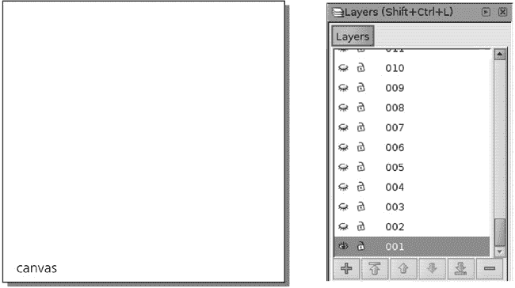
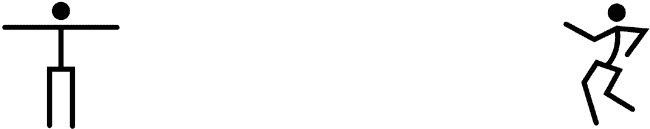
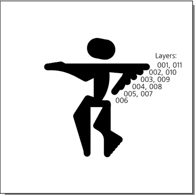
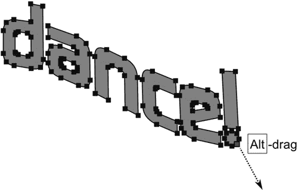
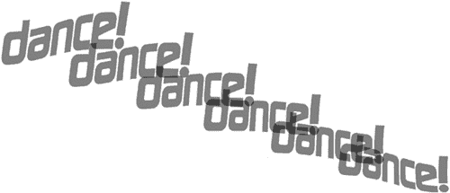

# 第二十章。教程：创建动画

从一开始，SVG 就被设计为一种用于静态和动画矢量图形的语言。一度被称为“Flash 杀手”，它确实适合各种脚本和声明性动画。不幸的是，即使 SVG 介绍了几年后，真正的 SVG 动画（与静态 SVG 相比）在网络上仍然很难找到。这有几个原因，其中最重要的是缺乏一个单一的播放器标准，它将提供比 Adobe（前 Macromedia）的 Flash 显著的竞争优势。目前，网络上几乎所有的动画要么是 Flash 格式，要么是动画 GIF 格式——就像五年前一样。

从 Inkscape 的角度来看，这或许是一件好事。Inkscape 目前还不支持创建动画 SVG 文档（除非你通过 XML 编辑器手动添加动画属性），并且只能静态地显示 SVG 文档。但你可以使用 Inkscape 创建静态帧，然后使用其他软件将它们组合成 GIF 或 Flash 动画。这种方法一开始可能看起来有些笨拙，但实际上是可行的，并且可能产生非常好的效果。为什么这值得麻烦，哪些类型的动画最适合这种技术？

任何包括复杂自然或交互运动的动画可能都超出了本教程中描述的基于 Inkscape 的动画技术所能达到的范围。没有时间轴控制，很难制作除了简单重复动画之外的内容。然而，对于 Web 上的许多动画——横幅、标题、博客头像——这种描述非常合适。

# 20.1 创建模板

在 Inkscape 中表示动画帧最自然的方式是将它们放在单独的图层上（**4.6 图层**）。你可以轻松切换每个图层的可见性，以查看你的帧是如何堆叠的，并控制从一个帧到下一个帧的变化。然而，手动创建许多图层（**图层** ▸ **添加图层**）是非常繁琐的。我编写了一个简单的 Python 脚本，它创建了一个 200x200 像素的文档，包含 100 个空图层：

```
print """<svg width="200" height="200"

  >"""
for i in range(100):
  print '<g inkscape:groupmode="layer" display="none" id="%03d"/>' % (i + 1)
print '</svg>'
```

所有图层都是默认隐藏的（这就是 `display="none"` 的作用），所以在 Inkscape 中，你需要逐个显示它们（**4.6.3 当前图层指示器**)才能在上面绘制。你可以通过脚本创建的图层数量（`range(100)`）以及画布的尺寸（`width="200" height="200"`）来调整。将脚本保存到文件 *generate-layers.py* 中，然后在你的操作系统命令行（或“终端”）窗口中运行它，并将输出捕获到 SVG 文件中。（你需要在你的计算机上安装 Python 语言解释器；你可以在 *[`python.org`](http://python.org)* 获取它。）然后，在这个文件上运行 Inkscape：

```
$ python generate-layers.py > ani.svg
$ inkscape ani.svg
```

您还可以将生成的文件（*ani.svg*）放入您的 *~/.inkscape/templates* 文件夹中，它将作为一个模板使用，因此下次您可以从 **文件** ▸ **新建** 列表中选择它来创建一个空的 100 层文件。以下是 Inkscape 的 **图层** 对话框（**4.6.4 图层对话框**），这对于处理这样的多层文件是必不可少的：



图 20-1. 加载到 Inkscape 中的 100 层动画模板

# 20.2 第一帧

让我们制作一个跳舞人物的动画——既吸引人又足够简单，不需要太多的绘画技巧，并且适合动画的小格式（以及这个简短的教程）。我们英雄的成名之处将在于他的动作，所以我们不需要让他看起来太复杂。像这样的原始棍状人物就足够了：


图 20-2. 我们开始使用的棍状人物，显示节点在节点工具中的情况

它由三条简单的路径（手、腿和身体）和一个椭圆（头部）组成。使用钢笔工具（**14.1 钢笔工具**)和  绘制水平/垂直的直线；然后使用椭圆工具（**11.4 椭圆**)创建头部。然后，为了便于插值，在身体和四肢上执行 **路径** ▸ **合并**，使它们成为一条路径，并在节点工具（**12.5.3 删除和创建节点**)中点击  以在其肘部和膝部关节处添加节点。

# 20.3 缓动

现在通过复制角色（ 选择头部和身体），将其移动到右侧，并调整其节点（在节点工具中），以给我们的男子一个有趣的舞蹈姿势。因此，我们得到两个 *关键帧*，整个动画可以简单到只是在这两个帧之间交替。



图 20-3. 两个关键帧

然而，添加中间帧以使关键帧之间的过渡更平滑会更好。动画师称之为*tweening*（源自*between*），Inkscape 可以在一定程度上自动化此过程：选择两个身体（即，两个路径对象），然后执行**扩展** ▸ **从路径生成** ▸ **插值**。指定**插值步数**（例如，4），选择**插值方法 1**，如果需要，可以使用非零的**指数**值来使运动速度非线性地加快或减慢。然后，可以通过使用相同数量的步骤和相同的**指数**值进行另一个插值，将头部椭圆放置在插值后的身体上（图 20-4）。

如果插值步骤看起来不正确，您可以撤销插值，调整关键帧，然后重新插值，直到您满意为止。**插值方法 1**（**13.3 路径扩展**）与路径上相同位置的节点匹配，因此当其中一个关键帧路径是通过调整另一个路径而没有添加或删除节点（如我们的情况）创建时，它更可取。如果两个路径来自不同的来源并且具有不兼容的节点，则**方法 2**更好。


图 20-4. 插值关键帧

# 20.4 合成和创建帧

现在是时候将我们的动画放置在画布的正确位置，并将帧分布到各个层上。再次取消插值，并将第二个关键帧直接放在第一个上面。（注意，舞者的右脚在两个关键帧中都是一致的，因为它 resting on the floor.) 选择两个重叠的图形并将它们放置在画布上，如果需要，进行缩放，并考虑您计划添加的其他元素（例如，文本标题）。最后，再次在原地插值身体和头部：



图 20-5. 原地插值

在 Inkscape 中接下来要做的任务有点无聊（未来版本可能会自动化）。您需要取消组合插值路径的组，并将每个路径从 002 到 005 手动放置在其层上，关键帧占据 001 和 006 层。然后，以相反的顺序复制帧：从 005 到 001 的帧进入 007 到 011 的范围，使舞者平滑地回到原始位置。

使用和![http://atomoreillycomsourcenostarchimages1735518.png.jpg]将选定的对象向上/向下移动一层，并观察状态栏，它会告诉您选定的对象位于哪一层。或者，您可以将对象剪切()，切换到目标层，并粘贴到原位()。最后，确保所有使用的层都是可见的，并保存 SVG 文件。

# 20.5 导出和生产

您可以手动导出层，但这可能会相当令人沮丧——尤其是如果您在查看结果并对源文件进行更改后需要多次这样做。由于 Inkscape 提供了一组强大的命令行参数，我编写了另一个 Python 脚本来自动化导出。该脚本接受源文件名、要导出的起始和结束层的编号以及结果 GIF 的名称作为参数；然后调用 Inkscape 分别导出每个层。导出后，此脚本调用 ImageMagick 的 convert 实用程序将帧组合成动画 GIF 文件，然后可以在任何图形网页浏览器中查看。

```
import os, sys
for i in range(int(sys.argv[2]), int(sys.argv[3]) + 1):
  os.system("""inkscape --export-png=%s-%03d.png --export-id=%03d \
    --export-id-only --export-dpi=400 --export-area-canvas \
    --export-background-opacity=1 %s""" % (sys.argv[1], i, i, sys.argv[1]))
os.system("convert -loop 0 -delay 10 %s-*.png %s" % (sys.argv[1], sys.argv[4]))
```

保存为*produce-gif.py*并运行：

```
$ python produce-gif.py ani.svg 001 011 stick.gif
Exporting only object with id="001"; all other objects hidden
DPI: 400
Background RRGGBBAA: ffffffff
Area 0:0:100:100 exported to 444 x 444 pixels (400 dpi)
Bitmap saved as: ani.svg-001.png
Exporting only object with id="002"; all other objects hidden
...
Exporting only object with id="011"; all other objects hidden
...
```

我们到目前为止的输出可以在网上查看*[`www.kirsanov.com/inkscape-animation/stick.gif`](http://www.kirsanov.com/inkscape-animation/stick.gif)*。

### 注意

*您可以使用开源的 Gifsicle 程序[`www.lcdf.org/gifsicle`](http://www.lcdf.org/gifsicle)代替 ImageMagick 的 convert 实用程序来将帧组合成动画 GIF 文件。它的优点是它可以优化动画，减小文件大小。*

### 注意

*如果您希望动画以 Flash 格式而不是动画 GIF 格式，一个简单的方法是将您的 SVG 转换为静态 SWF 帧（例如，使用 svg2swf 工具，[`robla.net/1996/svg2swf`](http://robla.net/1996/svg2swf)）然后组合帧以创建动画，我推荐使用 SWF Tools 包[`swftools.org`](http://swftools.org)）。生成的 SWF 文件可能不是非常高效，但它会工作。*

# 20.6 绘制阴影

我们的棍状动画看起来最多只是轻微吸引人。这种平滑的矢量风格适合技术动画，例如演示机器的工作原理，但对于动画舞蹈来说并不太有启发性。我们能做些什么来改善它吗？

隐藏除`001`之外的所有层，选择图形并降低其不透明度。然后，使用书法笔（**14.3 书法笔工具**），选择宽度为 20，颤动为 40，并在棍状图形上绘制，试图使其更加随机、有趣、个性化。在此过程中，您还可以添加更明显的脚和拳头，以及更符合人体形态的身体。


图 20-6. 使用书法笔进行阴影处理

完成后，删除原始的骨架图——它已经完成了蓝图的功能，不再需要。结果还不错，但在洁白的背景上，它的粗糙感显得有些突兀。为了解决这个问题，将笔的宽度减少到 1，并在舞者周围添加一些细的随机线条，暗示他的肢体动作和地板上的阴影。如果你觉得这看起来*太随机*了，不用担心——当你看到他移动时，这种随机性会变得生动而自然。


图 20-7. 移除骨架，添加运动噪声

在这种类型的项目中的主要规则是，*不要复制*。手绘的粗糙感不能回收；无论一帧与另一帧多么相似，你都需要从头开始绘制每一帧，除了用作引导的棍状人物外，不使用任何其他东西。复制自由手绘的线条（即使你移动或缩放它们）会立即杀死粗糙的自然感，使你的动画显得生硬而乏味。不要偷懒；你画得越多，就越容易。 

结果当然值得付出努力：查看*[`www.kirsanov.com/inkscape-animation/rough.gif`](http://www.kirsanov.com/inkscape-animation/rough.gif)*以查看完整的手绘动画。这比插值后的棍状人物更有启发性！

### 注意

*使用相同的技巧，你可以用书法笔手动在导入的位图中绘制轮廓。将位图设置为半透明，并在其上方绘制草图，尝试突出最重要的特征并忽略其余部分。在动画中，源位图可能是视频的帧、静止照片或渲染的 3D 图像。*

如果需要，你可以通过取消隐藏所有图层，选择所有形状，并在画布上根据需要移动/变换它们来移动整个动画——例如，为上面的标题腾出空间。

# 20.7 文本

现在，让我们给我们的动画添加一个文本横幅——只是一个单词，“dance!”。我们能否比将相同的静态文本对象复制到每一帧做得更有趣？

再次强调，我们可以使用书法笔在用作引导的一些文本对象上绘制皱褶的书写字母，从而使整个动画风格统一。然而，为了演示目的，让我们尝试另一种方法：让文本横幅像旗帜一样平滑地飘动。要扭曲文本，可以使用**包络变形**路径效果（**13.1.8 包络变形**）；然而，可能更快的方法是应用一些节点雕刻（**12.5.7.2 节点雕刻**）。

使用一款好看的字体创建一个文本对象，将其转换为路径（），取消组合（），合并（），切换到节点工具（），选择所有节点（），然后-拖动其中一个。整个形状将平滑地弯曲和拉伸。如果字母形状扭曲得太厉害，撤销拖动并按几次，每次加倍节点数量——这通常有助于使你雕刻的路径表现得更加自然。



图 20-8. 文本旗帜上的节点雕刻

现在将文本对象复制两份，分别对每一份进行不同的雕刻，使它们看起来像两面旗帜在风中飘扬，然后在它们之间进行插值。接着，就像我们对舞者形象所做的那样，将插值步骤分配到不同的层级中，将它们放置在画布上的形象上方（图 20-9). 不要担心绝对精确的位置；旗帜轻微的晃动不是问题（甚至还会增加一些个性）。



图 20-9. 插值旗帜

要确定每个对象相对于前一个层的位置，请使用“图层”对话框中的**不透明度**控制，使前一个层临时变为半透明。再次使用`*produce-gif.py*`脚本来组合动画 GIF。到目前为止的结果可以在*[`www.kirsanov.com/inkscape-animation/with-banner.gif`](http://www.kirsanov.com/inkscape-animation/with-banner.gif)*上查看；以下是 001 到 005 帧：


图 20-10. 动画的一半帧（前进运动）

# 20.8 背景

我们动画唯一不令人满意的地方就是它完全没有颜色。你可以通过给每一帧添加不同的背景颜色来解决这个问题，以获得真正的频闪舞池效果。选择这些随机颜色也可以自动化：创建一个未设置颜色的矩形，并使用**创建平铺克隆**对话框（**16.6 平铺克隆**)来对其进行一些色调变化。

用对比鲜明的酸性颜色绘制“舞蹈！”横幅，并且每一帧都有所变化。最后，为了让跳舞的人从背景中脱颖而出，在他身后添加一个椭圆形的渐变“聚光灯”；在每一帧中随机移动、缩放和旋转聚光灯，以增加额外的活力效果。最终版本可在*[`www.kirsanov.com/inkscape-animation/final.gif`](http://www.kirsanov.com/inkscape-animation/final.gif)*查看。请享受吧！
