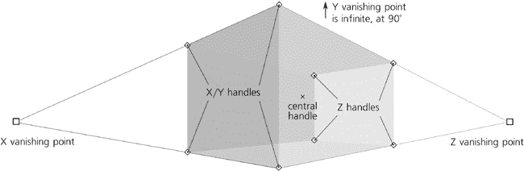
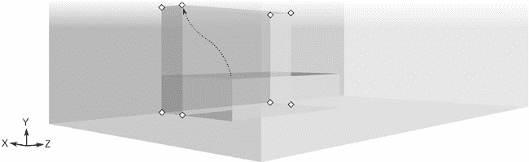
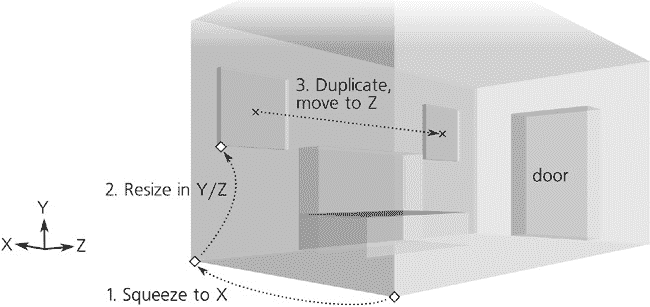

# 第二十一章。教程：绘制 3D-正确卡通

如同在**11.3.1 为什么使用 3D 盒子？**中提到的，Inkscape 的 3D 盒子工具并不是用来替代专业 3D 设计应用的。Inkscape 是一个绘图程序——因此，其 3D 盒子工具最好用作*绘图辅助工具*。这就是我们将在本简单教程中尝试做的事情。

一个“3D-正确”的绘图仅仅是满足了几何透视规则，这些规则已经为艺术家们所熟知，并且被应用了数百年。它不需要表现出完美的真实阴影和纹理；它只需要在角度和尺寸上大致正确地绘制线条和物体。

当然，有些绘图风格甚至不需要正确的透视；有时，故意的透视扭曲可能具有其自身的艺术价值。许多艺术家擅长绘制 3D 正确的艺术作品，而不使用任何技术辅助工具。然而，在许多艺术作品中，你经常会注意到从几乎不明显到令人尴尬的透视错误，这些错误在没有它们的情况下肯定会表现得更好。因此，我认为许多艺术家——不仅仅是初学者——会欣赏一种快速简单的方法来设置绘图的透视，而不需要繁琐的手动测量和辅助线。让我们看看如何在 Inkscape 中完成这项任务。

# 21.1 房间

假设我们想要绘制一个简单的场景，两个人在房间里的会面。切换到 3D 盒子工具()，并在画布中间拖动以绘制房间的盒子：

图 21-1. 创建房间

不要试图一开始就画得正确；相反，只需拖动盒子的手柄，如果需要，调整消失点。角落手柄可以让你调整房间的大小；四个 X/Y 手柄默认在 X/Y 平面内移动，当按下时沿 Z 轴移动，而四个 Z 手柄则相反，在没有按下时沿 Z 轴移动，当按下时在 X/Y 平面内移动。X 形中央手柄将整个房间移动，在没有按下时在 X/Y 平面内移动，当按下时沿 Z 轴移动。在 X/Y 平面内移动手柄时，按下以限制其移动仅限于 X 轴或仅限于 Y 轴。最后，拖动消失点将重新倾斜和调整房间的大小以适应改变后的透视(**11.3.3 透视和消失点**)。

除了 X 和 Z 轴上现有的消失点外，你还可以在 Y 轴上创建第三个消失点（换句话说，使 Y 消失点*有限*）。如果你想让你的图像看起来“更近”并且从更强调的角度观看，就像由房间角落的蜘蛛而不是远处的人类观看一样，请这样做。相反，如果你想要一个更分离、技术性的“远处”外观，你可以使两个或三个消失点无限：

图 21-2. 不同的视角

# 21.2 家具

接下来，让我们添加一些家具——例如，一个沙发。

在创建 3D 盒子组合时，使用对齐（**7.3 对齐**)非常方便，这样盒子可以精确对齐。打开**文档属性**对话框 ()，在**对齐**选项卡上，启用**对齐到路径**和**对齐到节点**。

现在，在较大的盒子内部绘制一个较小的盒子。（我们不需要担心盒子的 z 顺序；它们的默认样式使用部分透明度，这样你总是可以看到你创建的所有盒子的边缘。）请注意，新盒子使用与房间盒子相同的视角（即，相同的消失点）。抓住其左下角的 X/Y 手柄并拖动，使其对齐到房间的左下角 Z 边缘。这将成为沙发的基座；使用其他角落手柄来调整它的高度、宽度和深度：

图 21-3. 沙发的基座

对于沙发的背面，你可以以类似的方式绘制一个新的盒子并将其对齐；或者，更简单的方法是复制沙发底座 ()，并拖动其 X/Y 手柄来调整其大小到正确的形状：

图 21-4. 沙发的背面

现在，假设这是一个地下室，让我们在沙发的两侧放置两个小地下室窗户。在 X 维度上压扁的几个盒子将完美地作为窗户。然而，由于窗户的任何一边都不与任何其他盒子的任何一边对齐，我们如何正确地放置它们呢？

再次，复制然后调整大小的技巧是实现这一点的最简单方法。复制你拥有的最大的盒子（即房间本身）；-将其前 X/Y 手柄向后拖动（沿 X 轴）以将其挤压成薄片；然后，拖动 X/Y 平面上的四个手柄以调整窗户的大小。对于第二个窗户，只需复制第一个，并-将其中央手柄在 Z 方向上拖动；这样，第二个窗户将是第一个窗户的精确透视复制。使用相同的复制和展平技巧，在 Z 轴最远的墙上（即最接近 Z 消失点的墙）添加一个门道盒子，使其突出于房间盒子之外：

图 21-5. 窗户和门

# 21.3 人物

现在，我想画两个人，一个站在沙发上，另一个在门口。你可能会问，3D 盒子工具与画人有什么关系？很多！虽然我不会用平行六面体建模出机器人般的结构，但我仍然想确保人物在绘图中的高度和体积是正确的，而实现这一点的一个简单方法就是使用 3D 盒子工具。

我这样做。首先，我在门口添加了一个又高又窄的盒子——这将是我们的人物 1 号。和之前一样，我只是复制了门口的盒子，在 X/Y 平面上挤压它，并调整大小以获得人物高度和门口高度的逼真比例。（请某人站在真实的门口以获得灵感。）

然后，我复制了第一个人物盒子，并使用中间的 X 形手柄，-将其拖到前面，然后-沿着 X 轴水平拖动一点。这将是我们站在沙发旁的第二个人物。

图 21-6. 两个人

这样，两个人物盒子都具有相同的透视调整高度，并将作为实际绘制人物的有用指南。如果我要尝试达到更好的解剖学精确度，可以为每个人物的腿、身体和头部使用三个盒子堆叠（不幸的是，然而，在 Inkscape 的当前版本中，你无法同时拖动多个选定的盒子。你只能逐个拖动它们）。

# 21.4 绘制和着色

足够的盒子；是时候收起 3D 盒子工具，拿起书法笔，开始在 3D 蓝图上绘制草图了。创建一个新的图层，这样你可以分别显示和隐藏 3D 盒子和实际绘图。

当然，你不需要精确地追踪盒子的边缘。对于非几何物体，如沙发和人物，这几乎是不可能的，但即使是墙壁和窗户，也会从一些手绘的粗糙和不完美中受益。使用 3D 盒子的边缘作为一般指南来保持关注，但除此之外，你应该像没有使用任何指南一样自由地绘制，使用你自己的草图方式和风格。你也不需要追踪*所有*线条；一些可以省略，一些可以通过短的部分笔触来暗示。

图 21-7. 在 3D 蓝图上绘制草图

你会发现，在处理细节的同时，3D 盒子使得记住你绘图的整体构图和空间关系变得容易得多。我在另一篇教程中描述了自己的草图风格，使用了书法笔（**20.6 刮擦**），所以这里不会过多详细说明；因为这个教程的重点是使用 3D 盒子工具，在这幅画中，我的草图甚至比平时还要简略。不要试图模仿我；你应该尝试找出最适合你的风格。完成基本轮廓后，你可以关闭 3D 图层，看看你的图像凭借自身优点如何独立站立，如图 21-8 所示。

图 21-8. 当草图完成时，隐藏 3D 图层。

最后，我给草图上色，再次使用我最喜欢的宽模糊彩色笔触在深色清晰轮廓下进行上色：

图 21-9. 添加颜色
