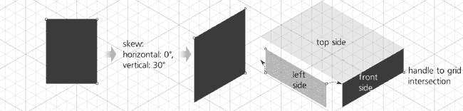
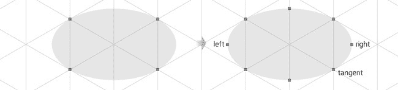
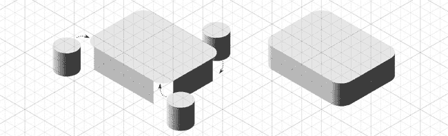
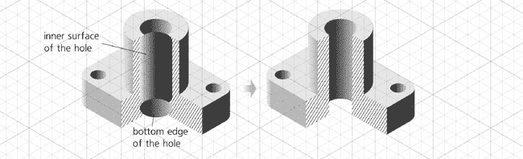

# 第二十三章。教程：技术绘图

除了我们迄今为止看到的一切之外，你还可以使用 Inkscape 创建简单的技术图纸。让我们尝试绘制一个发动机部件横截面的等距图像（图 23-13）。Inkscape 并不打算取代真正的计算机辅助设计（CAD）应用程序。在 CAD 程序中创建此类技术图纸可能更直接——但前提是你拥有它并且知道如何使用它。在大多数其他情况下，由于 Inkscape 的图形能力和多功能性，它是一个自然的选择，可以使你的图纸不仅精确，而且视觉效果令人印象深刻。

在 Inkscape 中创建此类技术图纸的关键是使用网格（**7.2 网格**）、对齐（**7.3 对齐**）、通过数字变换（**6.6 通过数字变换：X, Y, W, 和 H**）和形状，特别是矩形（**11.2 矩形**）。正如你将在本教程中看到的那样，这些功能的组合使得可以在不手动调整任何东西或近似形状或位置的情况下创建整个绘图：每个对象、手柄和节点都紧密精确地“对齐”到其位置。一旦你掌握了这个技巧，你将能够快速而轻松地制作出类似的草图。

# 23.1 设置网格

我们将制作一个**等距**图像，这意味着三个坐标轴之间都有相等的角度（60 度）并且具有相同的比例。这使得它更容易使用；例如，无论你沿着哪个轴测量，立方体的长度都保持不变。

打开**文档属性**对话框（**7.2.1 网格选项**），选择**网格**选项卡，并创建默认的轴测网格，X 轴和 Z 轴的角度都设置为 30 度（从水平方向测量）。你可能希望设置间距（即使网格是等距的，它也会以相同的方式影响所有三个轴）为你的绘图中最小可测量的距离。例如，如果绘图元素的尺寸都必须以毫米为单位，并且精确到第一位小数，则将网格间距设置为 0.1 毫米，这样你就永远不需要在网格线之间放置任何东西。

你也可以更改主要（较暗）网格线的间距；默认情况下，它们每五条常规线出现一次。当你缩小视图时，次要网格线首先消失，以使显示更清晰。

图 23-1. 设置等距网格

# 23.2 制作盒子

在开启网格（默认情况下，对齐到网格）的情况下，让我们先绘制我们物体的底部盒子。使用矩形工具绘制任意大小的矩形（我们稍后会调整大小和放置）。注意，矩形的角落可以轻松地对齐到网格线交点（注意对齐指示器和提示，**7.3.4 对齐首选项**），但矩形不是轴测图。最容易的方法是什么，将其倾斜到等轴测投影，使其正好适合网格？

打开**变换**对话框（，**6.7 变换对话框**），在**倾斜**选项卡中，将**水平**倾斜设置为 60 度，将**垂直**倾斜设置为 30 度。点击**应用**后，矩形被变换，可以用来作为盒子底部平面的顶部。注意，矩形的调整大小手柄现在也可以在轴测投影中移动（**11.2.1 调整大小**），所以你只需要将它们对齐到相应的网格交点，如图 23-2 所示。

盒子的另外两面创建起来甚至更简单：对于正面，你只需要 30 度的**垂直**倾斜，**水平**倾斜设置为 0。盒子的左侧只是正面复制（）并翻转（）。倾斜和翻转后，不到一秒钟就可以将所有三个矩形的角落对齐，形成一个精确、坚固、无缝的 6x8x2 盒子（就我们的目的而言，X 和 Z 轴上的单位数应该是偶数，这样我们就有了一条正好穿过中心的网格线）：

图 23-2. 创建、倾斜和定位盒子的顶部

图 23-3. 创建盒子的正面和左侧

现在你已经有一个盒子了，你可以通过复制其侧面并将角落重新定位到新位置来快速构建复杂的结构。然而，这并不是我们想要做的。我们的下一步是给盒子的角落圆角。

# 23.3 圆角处理

要在矩形中制作圆角（**11.2.2 圆角**），只需抓住圆形手柄并沿着侧面拖动。在箱子的双斜面顶部，圆角工作完全符合预期——矩形在其平面内变得圆润，并具有适当的投影扭曲。在拖动其中一个圆角手柄时，将其对齐到最近的交点，以便圆角半径等于一个网格单位。然后，移动前部和左侧的大小手柄，使它们每侧都窄一个网格单位：

图 23-4. 在箱子的顶部圆角

现在我们需要一些东西来填充箱子角落的垂直间隙。为此，让我们创建一个垂直圆柱体，其副本（或克隆）我们可以放入箱子的三个可见角落，以及以后用于我们发动机部件的大顶部圆柱体。

要制作一个圆柱体，我们需要从一个椭圆开始——但要制作这个椭圆，我们甚至不需要椭圆工具。相反，只需复制箱子的顶部并调整大小为 2x2 网格单位的等距正方形。由于这种调整大小保留了半径为单位的圆角，这给了我们一个完美的等距椭圆：

图 23-5. 从矩形创建椭圆

要创建一个圆柱体，我们可以复制这个椭圆，将其向下移动，并在它们之间绘制一个平坦的非等距矩形。虽然可行，但这种方法并不是“干净”的，因为我们没有在椭圆的端点处有任何网格线来将矩形的左右边缘对齐。因此，这种方法需要关闭对齐并使用手动调整，这不可避免地会牺牲速度和精度。让我们尝试另一种方法。

将椭圆形状矩形的副本转换为路径（）并切换到节点工具（）。注意，在椭圆的左右端点处没有节点，而我们将在那里需要它们。选择所有节点（），并通过按（**12.5.3 删除和创建节点**）在两个选定的节点之间插入新节点：

图 23-6. 在椭圆的端点添加节点

现在，仅选择水平端点的两个节点（上面标记为*左*和*右*）并复制它们（）。通过使用拖动将椭圆下半部分的节点全部添加到选择中。抓住与网格线相切（标记为*切线*）的节点，并-拖动它和其余选定的节点向下，直到它们在两个单位以下的位置对齐，从而创建理想的精确圆柱形状。之后，你只需要将原始椭圆的副本放回顶部，并绘制一个水平渐变（图 23-7）。

图 23-7. 拉伸、着色和封顶圆柱

现在，只需将三个圆柱的副本移动到填充圆角盒子的间隙中——它们将紧密地适应它们的位置。要让盒子看起来像一个完整的整体，你只需要整理 z 顺序并匹配颜色。使用滴管工具（**8.6 滴管工具**)从平面侧面复制颜色到圆柱的渐变停止点或反之亦然。

图 23-8. 盒子准备好了。

# 23.4 制作顶部圆柱

再次复制角落圆柱，并按将其放大两次，然后将其对齐到盒子的中心上方。

复制顶部的椭圆并将其就地缩小到 50%（）。之后，你甚至不需要移动它到任何地方——它已经精确地位于模仿顶部圆柱孔的位置。要使其*看起来*像孔，只需添加一个方向与圆柱相反的水平线性渐变。同时，再制作三个孔的副本，将每个副本对齐到基盒的角落，并再次按缩小——这些将是固定细节的螺栓孔：

图 23-9. 添加顶部圆柱和孔

# 23.5 制作剪切块

现在已经准备好了物体的全等距视图。但是，为了演示一些额外的技术，我决定创建一个物体的剪切块，以展示其两个垂直的横截面。

由于我们迄今为止所做的一切都是对齐到网格的，因此添加切割形状非常容易。切换到钢笔工具（**14.1 钢笔工具**)，并在横截面的左侧角落附近点击。然后，从  按压以创建相同路径的第二个子路径，点击右侧：

图 23-10. 添加切割形状

通常，技术图纸中的切割部分会填充一个代表物体材料的图案。对于金属，使用纯条纹，我们可以通过使用预设图案之一来表示我们的物体是金属的。打开**填充和描边**对话框（**8.1.1 绘画**），在**填充**选项卡上点击**图案**按钮，并选择**条纹 1:8**图案。这个图案的唯一问题是它显示在透明背景上的黑色条纹，但我们需要在白色背景上显示黑色条纹。只需复制形状，将其涂成白色，并将白色副本在 z 轴顺序中移到条纹形状之下。

图 23-11. 绘制条纹

现在我们需要移除切割部分前面的物体部分。拖动并删除最前面的圆滑圆柱。使用矩形大小调整手柄，收缩盒子的顶部和左侧，使其对齐到切割的边缘。至于其余的物体（盒子的顶部和圆柱的顶部椭圆），我们需要实际*切割*它们。

再次使用钢笔工具，绘制一个三角形，并从形状中减去这个三角形（选择两者并按 ，**12.2 布尔运算**），如图图 23-12 所示。

图 23-12. 切割不必要的部分

最后，创建通过切割形状可见的孔的内部：复制圆柱形状，将其缩小 ()，并在 z 轴顺序中将其向下移动，使其位于切割形状和孔椭圆之下；这将形成孔的内表面。使用节点工具，选择并向下拉动该形状的底部节点。然后，复制孔椭圆，将其涂成白色，并将其向下移动以表示孔的底部边缘。选择孔顶部的椭圆并将其复制到剪贴板 ()；然后选择内表面圆柱，并将样式粘贴到其上 () 以将孔的水平渐变扩展到孔的整个内表面：

图 23-13. 创建孔的内表面
