# 附录 D. 键盘快捷键

# D.1 工具

| **,**  | 选择工具 (**5.4 通过点击选择：选择工具**) |
| --- | --- |
|  | 选择工具（临时） |

 切换到选择工具临时；另一个  切换回。您可以通过在 **Inkscape 预设** 中开启 **按下空格键时使用左鼠标键平移画布** 选项来使用 -拖动画布，而不是切换到选择工具。

| 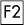**,**  | 节点工具 (**12.5 节点工具**) |
| --- | --- |
| **,**  | 调整工具 (**6.9 使用调整工具进行变换**, **8.7 颜色调整**, **12.6 路径调整**) |
| 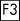**,**  | 缩放工具 (**3.9 缩放工具**) |
| **,**  | 矩形工具 (**11.2 矩形**) |
| **,**  | 3D 箱工具 (**11.3 3D 箱**) |
| **,**  | 椭圆工具 (**11.4 椭圆**) |
| 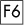**,**  | 铅笔工具 (**14.2 铅笔工具**) |
| 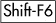**,**  | 钢笔工具 (**14.1 钢笔工具**) |
| 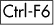**,**  | 草书笔工具 (**14.3 草书笔工具**) |
|  | 橡皮擦工具 (**5.8 触摸选择**, **14.3.6 添加和减去**) |
| 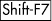**,**  | 油桶工具 (**14.4 油桶工具**) |
| **,**  | 渐变工具 (**10.1 渐变工具**) |
| **,**  | 吸管工具 (**8.6 吸管工具**) |
| **,**  | 文本工具 (第十五章) |
| 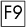**,**  | 螺旋工具 (**11.6 螺旋**) |
| 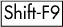**,**  | 星形工具 (**11.5 星形和多边形**) |
| **,**  | 连接工具 (**1.2 你可以用 Inkscape 做什么？**) |

双击工具按钮将打开 **Inkscape 预设** 对话框 (**11.1.2 新形状的样式**)，显示相应工具的页面。

# D.2 对话框

## D.2.1 打开

|  | 填充和描边 (**8.1.1 绘画**) |
| --- | --- |
|  | 调色板 (**8.3 调色板**) |
| 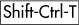 | 文本和字体 (**15.4.2 字体和变体**) |
|  | 变换 (**6.7 变换对话框**) |
|  | 图层 (**4.6.4 图层对话框**) |
| 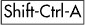 | 对齐和分布 (**7.4 对齐**, **7.5 分布**) |
|  | 对象属性 (**4.1 对象属性**) |
|  | 撤销历史记录 |
|  | XML 编辑器 (**4.7 XML 编辑器**) |
| 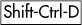 | 文档属性 (**3.1.2 文档属性**) |
|  | Inkscape 首选项 (**3.1.1 Inkscape 首选项**) |
| 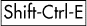 | 导出位图 (**18.9.1 导出位图对话框**) |
|  | 查找 (**5.12 查找对象**) |
|  | 跟踪位图 (**18.8.2 跟踪位图对话框**) |
|  | 路径效果编辑器 (**13.1.2 路径效果编辑器对话框**) |

这些快捷键如果对话框尚未打开，则会打开一个新的对话框窗口；否则，对话框将被激活。

## D.2.2 切换可见性

| 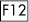 | 切换对话框 |
| --- | --- |

这将暂时隐藏所有打开的对话框；另一个  可以再次显示它们。

## D.2.3 在对话框内

| 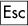 | 将焦点返回到画布 |
| --- | --- |
| **,**  | 关闭对话框 |
|  | 跳转到下一个小部件 |
|  | 跳转到上一个小部件 |
|  | 设置新值 |
|  | 在 XML 编辑器中设置属性值 |

当在 XML 编辑器 (**4.7 XML 编辑器**) 中编辑属性值时， 将写入新值（与点击 **设置属性** 按钮相同）。

| **,**  | 激活当前按钮或列表 |
| --- | --- |
| **,**  | 在多标签对话框中切换标签 |

# D.3 控制栏

## D.3.1 访问

|  | 跳转到第一个可编辑字段 |
| --- | --- |

## D.3.2 导航

|  | 跳转到下一个字段 |
| --- | --- |
|  | 跳转到前一个字段 |

这些操作在控制栏的字段之间导航（你离开的字段中的值如果已更改，则变为接受）。

# D.4 画布 (2.2)

## D.4.1 缩放 (3.8)

| **,**  | 缩放 |
| --- | --- |
|  | 缩小 |

当你正在编辑文本对象时，键盘上的 / 键仍然可以缩放，除非  是开启的。

| **中间点击**， **-右键点击** | 缩放 |
| --- | --- |
| **-中间点击**， | 缩小 |
| **-右键点击** |   |
| **-滚轮** | 缩放或缩小 |

要交换滚轮和 -滚轮的功能，请在 **Inkscape 预设** 中开启 **鼠标滚轮默认缩放** 选项；然后 -滚轮将滚动，而  无滚轮将进行缩放。

| **-中间拖动** | 缩放至区域 |
| --- | --- |
|  | 激活缩放字段 |

窗口右下角的缩放字段允许你精确指定缩放级别。

## D.4.2 预设缩放 (3.9)

|  | 缩放 1:1 |
| --- | --- |
|  | 缩放 1:2 |
|  | 缩放到选择区域 |
|  | 缩放到绘图 |
|  | 缩放到页面 |
| **,**  | 缩放到页面宽度 |

## D.4.3 缩放历史 (3.9)

|  | 前一缩放 |
| --- | --- |
|  | 下一缩放 |

使用这些键，你可以在这个会话中来回穿梭缩放历史。

## D.4.4 滚动 (平移，3.10)

| **,** 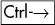**,** 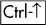**,** 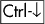 | 滚动画布 |
| --- | --- |

通过按键滚动是 **加速的**—当你连续快速按下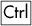-箭头键或按住时，它会加速。

| **中键拖动** | 平移画布 |
| --- | --- |
| **-右拖**，**-右拖** | 平移画布 |
| **轮** | 垂直滚动画布 |
| **-滚轮** | 水平滚动画布 |

当在 **Inkscape 首选项** 中将 **按下空格键时左鼠标按钮平移** 选项开启时，-拖动也会平移画布。

## D.4.5 指南、网格和吸附 (第七章)

| **拖动** | 从标尺拖动以创建指南 |
| --- | --- |

将水平或垂直标尺拖动到画布中创建新的辅助线。将辅助线拖动到标尺上可删除它。

| **拖动** | 拖动指南以移动它 |
| --- | --- |
| **-拖动** | 拖动指南（非锚点附近）以旋转它 |
| **-拖动** | 使用角度吸附旋转指南 |
| **-点击** | 删除指南 |
| **,** 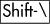 | 切换指南和指南吸附 |

如果你想看到指南但不吸附到它们，请使用全局吸附切换按钮(![图片]). 当你通过拖动标尺创建新指南时，指南可见性会被打开。

| **,** 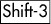 | 切换网格和网格吸附 |
| --- | --- |

如果你想看到网格但不吸附到它们，请使用全局吸附切换按钮(![图片]). 只有主键盘上的键有效，不是数字键盘上的键。

|  | 切换吸附开/关 |
| --- | --- |

此全局切换会影响所有工具中对网格、指南和对象的吸附。

## D.4.6 显示模式 (3.11)

|  | 切换正常/轮廓模式（仅数字键盘） |
| --- | --- |

# D.5 调色板 (8.3)

这些键在浮动 **色板** 对话框和窗口底部的停靠调色板中都可以使用。

| **点击** | 在选择上设置填充颜色 |
| --- | --- |
|  **-点击** | 在选择上设置描边颜色 |
| **右键点击** | 打开弹出菜单 |
| **拖动** | 将填充颜色拖动到对象上 |
|  **-拖动** | 将描边颜色拖动到对象上 |

要通过拖动颜色到对象上来更改对象的填充或描边，该对象无需被选中。您还可以将颜色拖动到状态栏中的**填充**（**F**）和**描边**（**S**）指示器来更改选择。

# D.6 文件

|  | 创建新文档（**3.2 文档模板**) |
| --- | --- |
|  | 打开文档（**3.5 实例、文档、视图**) |
|  | 导出为 PNG（**18.9.1 导出位图对话框**) |
| 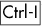 | 导入位图或矢量图（**18.1 导入**) |
| 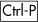 | 打印文档（**B.5 打印**) |
|  | 保存文档（**2.9 保存和导出**) |
|  | 以新名称保存（**B.1 保存与导出**) |
|  | 保存副本（**B.1 保存与导出**) |
|  | 退出 Inkscape |

# D.7 文档窗口（**3.6 文档窗口**）

|  | 切换标尺 |
| --- | --- |
|  | 切换滚动条 |
|  | 切换全屏 |
|  | 主菜单 |

菜单也可以通过 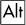 激活，菜单名称下划线的字母。

| 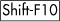**, 右键点击** | 下拉（上下文）菜单 |
| --- | --- |
| **,**  | 关闭文档窗口 |

如果这是唯一打开的文档窗口，这将关闭 Inkscape。

|  | 下一个文档窗口 |
| --- | --- |
|  | 前一个文档窗口 |

这些快捷键会正向和反向循环活动文档窗口。

# D.8 图层 (**4.6 图层**)

|  | 创建新图层 |
| --- | --- |
|  | 移动到上层 |
|  | 移动到下层 |

这些命令将选定的对象从一个图层移动到另一个图层。

|  | 提升图层 |
| --- | --- |
|  | 降低图层 |
|  | 将图层提升到顶部 |
|  | 将图层降低到底部 |

这些命令在当前图层的兄弟图层（通常是其他图层）之间移动当前图层。

# D.9 对象 (第四章)

## D.9.1 撤销/重复 |

| **,**  | 撤销 |
| --- | --- |
| **,** 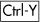 | 重复 |

## D.9.2 剪贴板 (4.4)

|  | 复制选择 |
| --- | --- |
|  | 剪切选择（复制然后删除） |
|  | 粘贴剪贴板 |

这将剪贴板对象放置到鼠标光标处，或者如果鼠标在画布外，则放置到窗口的中心。当使用文本工具编辑文本时，这将把剪贴板中的文本插入到当前文本对象中。

|  | 在当前位置粘贴 |
| --- | --- |

这将剪贴板对象放置到它们被复制的原始位置。

|  | 粘贴样式 |
| --- | --- |

这将（复制的）对象的样式应用到当前选择上。如果选择了渐变句柄（在渐变工具中）或文本范围（在文本工具中），它们将获得粘贴的样式而不是整个对象。

| 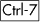 | 粘贴路径效果 |
| --- | --- |

这将复制的路径效果应用到当前选择中的路径/形状。

## D.9.3 复制 (*4.4*)

| 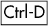 | 复制选择 |
| --- | --- |

新对象将精确地放置在原始对象上方并选中。如果启用了此功能（**16.5 解除链接和重新链接复制对象**），则复制对象可以重新链接。

## D.9.4 复制 (第十六章)

|  | 复制对象 |
| --- | --- |

复制对象将精确地放置在原始对象上方并选中。一次只能复制一个对象；如果您想一起复制几个对象，请将它们组合起来并复制组合。

|  | 断开克隆链接 |
| --- | --- |
| 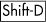 | 选择原始对象 |

## D.9.5 位图 (第十八章)

|  | 创建位图副本 |
| --- | --- |

导入的位图放置在原始选择上方并选中。

|  | 打开 **Trace Bitmap** 对话框 |
| --- | --- |

## D.9.6 图案（10.8）

|  | 对象到图案 |
| --- | --- |

这将选择转换为具有平铺图案填充的矩形。

|  | 将图案应用于对象 |
| --- | --- |

每个具有图案填充的选择对象都被分割成相同的不填充对象和一个单独的图案对象。

## D.9.7 分组（4.5）

| **,**  | 将选择对象分组 |
| --- | --- |
| **,**  | 取消选择分组 |

这只取消一个分组级别；重复按  以取消嵌套分组。

## D.9.8 Z-顺序（4.3）

|  | 将选择提升到顶部 |
| --- | --- |
|  | 将选择降低到底部 |
|  | 将选择提升一级 |
|  | 将选择降低一级 |

# D.10 路径 (第十二章)

## D.10.1 对象到路径

|  | 将选择对象转换为路径 (第十一章) |
| --- | --- |
| 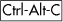 | 将描边转换为路径 (**12.1.3 描边路径**) |

## D.10.2 布尔运算（12.2）

|  | 并集 |
| --- | --- |
|  | 差集 |
|  | 交集 |
| 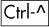 | 排除（异或） |
|  | 分割（剪切） |
|  | 剪切路径 |

**并集**、**差集**、**交集**和**排除**的结果继承 `id` 属性 (**A.9 链接**) 以及底部对象的任何克隆。**分割**和**剪切路径**通常会产生多个对象；其中，一个继承底部源对象的 `id`。

## D.10.3 偏移（12.4）

|  | 将路径向内偏移（朝向中心） |
| --- | --- |
| 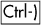 | 将路径向外偏移（远离中心） |

默认偏移距离是 2 像素单位.^([10])

| 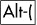 | 将路径向内偏移 1 像素^([a]) |
| --- | --- |
|  | 将路径向外偏移 1 像素 |
| 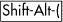 | 将路径向内偏移 10 像素 |
| 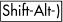 | 将路径向外偏移 10 像素 |

|

^([a]) 一个 *像素* 指的是屏幕上的一个像素点，这是一个相对距离，取决于你的缩放级别（**3.8 基本缩放**）。你可以放大以进行更精细的调整。

|

所有 ,  命令在必要时将对象转换为路径，并生成常规路径。

| 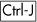 | 创建动态偏移 |
| --- | --- |
|  | 创建链接偏移 |

这些命令生成一个偏移对象（**13.2 动态和链接偏移**），可以通过节点工具进行编辑，可以是独立的或与原始对象链接。

|  | 选择源 |
| --- | --- |

选择链接偏移并给出此命令将选择链接偏移的源路径。

## D.10.4 合并 (12.1.1)

| 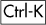 | 合并路径 |
| --- | --- |
|  | 分割路径 |

## D.10.5 简化 (12.3)

|  | 简化 |
| --- | --- |

如果你连续多次快速调用此命令，它将变得越来越激进。暂停后再次调用 **简化** 命令将恢复默认阈值（可在 **Inkscape 首选项** 对话框中设置）。

* * *

^([10]) 一个 *像素单位* 指的是等于 1/90 英寸的绝对单位（**A.6 坐标和单位**）。

# D.11 选择器工具（5.4）

## D.11.1 选择（鼠标，5.4）

| **点击** | 选择对象 |
| --- | --- |

当你左键点击一个对象时，之前的选中状态会被取消。

| **-click** | 切换选择 |
| --- | --- |

如果对象未被选中，则此命令将对象添加到当前选中，否则从当前选中移除对象。

| **双击** | 编辑对象 |
| --- | --- |

这会切换到对象的默认编辑工具（路径的节点工具、相应形状工具和文本工具）。对于组，双击执行**进入组**命令（组成为临时图层，**4.6.1 图层层次结构**）。在空白区域双击将切换到层次结构中的父图层（如果有的话）。

## D.11.2 橡皮筋（5.7），触摸选择（5.8）

| **拖动** | 通过橡皮筋选择 |
| --- | --- |
| **-拖动** | 将对象添加到选择中 |

通常，您需要从一个空白区域开始以启动橡皮筋选择。但是，如果您在拖动之前按下，即使您从对象开始，Inkscape 也会进行橡皮筋选择。

|  **-拖动**， **-拖动** | 通过触摸选择 |
| --- | --- |

-拖动对象会选中路径接触到的对象。要使用开始触摸选择，您必须没有任何选择；否则使用。您可以在拖动时通过按/释放在橡皮筋选择和触摸选择之间切换。

## D.11.3 选择（键盘，5.11）

|  | 选择下一个对象 |
| --- | --- |
|  | 选择上一个对象 |

这些键按其 z 顺序选择对象（ 从下到上循环， 从上到下循环）。这适用于当前图层内的对象（**4.6 图层**）。

| 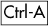 | 选择所有（当前图层） |
| --- | --- |

这适用于当前图层内的对象（除非您在**Inkscape 首选项**中更改此设置）。

| 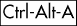 | 选择所有（所有图层） |
| --- | --- |

这适用于所有可见和未锁定图层中的对象。

|  | 反选（当前图层） |
| --- | --- |

这会在当前图层中反选（取消选择所选内容及其相反内容）。

|  | 反选（所有图层） |
| --- | --- |

这会在可见和未锁定图层中反选（取消选择所选内容及其相反内容）。

|  | 取消选择 |
| --- | --- |
| **,**  | 删除选择 |

## D.11.4 在组内选择（5.10），选择下级（5.9）

| **-点击** | 在组内选择 |
| --- | --- |

这将在点击点选择对象，而忽略该对象可能属于的任何分组级别。

|  **-点击** | 在组内切换选择 |
| --- | --- |
| **-点击** | 选择下级 |

-点击选择点击点下方的对象（在 z 轴顺序中）。如果达到底部对象，-点击再次选择顶部对象。因此，多次-点击将在点击点循环 z 轴顺序堆栈。在 Linux 上，-点击和-拖动可能被窗口管理器保留。如果您重新配置窗口管理器以不映射-点击，则它将可供 Inkscape 使用。如果您的键盘有一个键，您可能希望将**修改键**设置为使用它而不是。（有时您也可以使用-点击（在组中选择下级）与-点击相同的效果。）

| **-点击** | 切换到下级 |
| --- | --- |
|  **-点击** | 在组内选择下级 |
|  **-点击** | 在组内切换到下级 |
|  | 进入组 |
|  | 转到父组/层 |

## D.11.5 移动（鼠标，6.1）

| **拖动** | 选择并移动 |
| --- | --- |

拖动对象时，如果它未被选中，则选择它，然后移动选择。

| **-拖动** | 移动所选对象 |
| --- | --- |

这将移动当前选择（不选择光标下的对象），无论您从哪里开始拖动。在 Linux 上，-点击和-拖动可能被窗口管理器保留。重新配置它，以便您可以在 Inkscape 中使用它们。

| **-拖动** | 限制移动到水平或垂直 |
| --- | --- |
| **-拖动** | 临时禁用吸附 |

这将在您使用网格或参考线拖动时临时禁用吸附到网格或参考线。

| **拖动-** | 放置副本 |
| --- | --- |

当使用鼠标拖动或变换时，每个  都会留下所选对象的副本。您可以在拖动时按住  以获得漂亮的“轨迹”。

## D.11.6 移动（键盘，6.1）

| 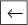**,** 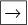**,** 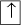**,**  | 通过微调距离移动选择 |
| --- | --- |
| **,** **,** 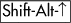**,**  | 通过 10 倍微调距离移动选择 |

默认微调距离为 2 像素单位。

| **,** 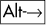**,** 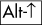**,**  | 通过 1 像素移动选择 |
| --- | --- |
| **,** **,** **,**  | 通过 10 像素移动选择 |

## D.11.7 变换（鼠标，6.2，6.3）

| **点击**， | 切换缩放/旋转手柄 |
| --- | --- |
| **拖动** | 缩放（使用缩放手柄） |
| **拖动** | 旋转或倾斜（使用旋转或倾斜手柄） |

## D.11.8 通过手柄缩放（6.2）

| **拖动** | 缩放 |
| --- | --- |
|  **-拖动** | 保持宽高比缩放 |
| **-拖动** | 对称变换 |

在变换时按住  使变换围绕选择中心对称。

| **-拖动** | 以整数缩放 |
| --- | --- |

在缩放时按住  以限制缩放到 2、3、4 等或初始大小的 1/2、1/3、1/4 等等。

## D.11.9 缩放（键盘，6.5.2）

| **,**  | 以缩放步长放大选择 |
| --- | --- |
| **,**  | 以缩放步长缩小选择 |

默认缩放步长为 2 像素单位。

| **,**  | 将选择缩放到 200% |
| --- | --- |
| **,**  | 将选择缩放到 50% |
| **,**  | 将选择向上缩放 1 像素 |
| **,**  | 将选择向下缩放 1 像素 |

缩放是围绕中心均匀进行的，因此尺寸增量应用于两个维度中较大的那个。

## D.11.10 使用手柄旋转/倾斜（6.3）

| **拖动** | 旋转或倾斜 |
| --- | --- |
|  **-拖动** | 瞬时倾斜角度 |

拖动倾斜（非角落）手柄时按住可以使倾斜角度与角度步长对齐。默认角度步长为 15 度；可以在**Inkscape 首选项**中的**步骤**中更改。

| **-拖动** | 瞬时旋转角度 |
| --- | --- |

拖动旋转（角落）手柄时按住可以使旋转角度与角度步长对齐。

## D.11.11 旋转（键盘，6.5.3）

| **,**  | 通过角度步长旋转选择^([a]) |
| --- | --- |
| **,**  | 将选择旋转 90 度 |
| **,** 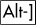 | 将选择旋转 1 像素 |

|

^([a]) 在 Inkscape 中，，，顺时针旋转，，，逆时针旋转。

|

这些命令使用旋转中心，在选择器中可拖动（默认位于几何中心）。

## D.11.12 翻转（6.5.3）

|  | 水平翻转选择 |
| --- | --- |
|  | 垂直翻转选择 |

如果工具处于旋转模式（可见旋转中心），则该中心成为翻转的轴线；否则，它围绕选择的几何中心翻转。

## D.11.13 旋转中心（6.4）

| **拖动** | 移动旋转中心 |
| --- | --- |

拖动中心使其与选择的中心线和边界框边缘对齐。

| **-拖动** | 无吸附移动 |
| --- | --- |
| **-点击** | 重置旋转中心 |

重置旋转中心将其移回到对象或选择的边界框的几何中心。

## D.11.14 取消

|  | 取消橡皮筋、移动、变换 |
| --- | --- |

在鼠标按钮仍然按下时按  取消橡皮筋选择、移动或任何类型的变换。

# D.12 节点工具（12.5）

## D.12.1 选择对象（鼠标）

| **点击** | 选择未选择的对象 |
| --- | --- |
|  **-点击** | 选择下级 |
| **-点击** | 切换选择 |

## D.12.2 选择节点（鼠标）

| **点击** | 选择/取消选择节点 |
| --- | --- |

点击节点以选择它；点击两个相邻节点之间的路径以选择它们。在空白区域中点击取消选择所有选中的节点（下一次点击将取消选择对象）。

| **-点击** | 切换选择 |
| --- | --- |

这会将节点（如果点击在节点上）或两个节点（如果点击在路径上）添加到/从节点选择中。

## D.12.3 橡皮筋选择（12.5.2）

| **拖动** | 选择多个节点 |
| --- | --- |

围绕节点拖动执行橡皮筋选择；取消选择之前的节点选择。

| **-拖动** | 向选择中添加节点 |
| --- | --- |

通常，您需要在路径或节点上方才能启动橡皮筋。但是，如果在拖动之前按 ，即使您从路径开始，Inkscape 也会执行橡皮筋选择。

## D.12.4 选择节点（键盘，12.5.2）

|  | 选择下一个节点 |
| --- | --- |
|  | 选择上一个节点 |

这些键选择所选路径内的节点。

|  | 在子路径中选择所有节点 |
| --- | --- |

如果路径有多个子路径并且已选择一些节点，则仅在已选择节点的子路径中选择所有节点。

|  | 选择路径中的所有节点 |
| --- | --- |

这将选择整个路径中的所有节点。

|  | 在子路径中反转选择 |
| --- | --- |

如果路径有多个子路径并且已选择一些节点，则仅在已选择节点的子路径中反转选择（取消选择已选择的，反之亦然）。

|  | 在路径中反转选择 |
| --- | --- |

这将在整个路径中反转选择。

|  | 取消选择所有节点 |
| --- | --- |

## D.12.5 节点选择放大/缩小（12.5.2）

| **,** **, 轮滚** | 放大/缩小选择（空间） |
| --- | --- |
| **,** **,** | 放大/缩小选择（沿路径） |
| **-wheel** |   |

您的鼠标指针必须位于节点上才能放大/缩小。每次按键或滚轮点击都会选择最近的未选择节点或取消选择最远的已选择节点。

## D.12.6 移动节点（鼠标，12.5.7）

| **drag** | 移动选定的节点 |
| --- | --- |
|  **-drag** | 限制为水平或垂直移动节点 |
|  **-drag** | 沿着选定的节点的句柄移动 |

这将限制移动到节点的句柄方向、它们的延续和垂直线（总共八个对齐点）。如果节点在一侧或两侧有直线，这将将其对齐到这些直线的方向和垂直线。

| **-drag** | 暂时禁用对齐 |
| --- | --- |
| **-drag** | 拖动出句柄 |

如果节点有一个缩回的句柄，请按住  以将句柄从节点中拖出。

| **drag-** | 投下副本 |
| --- | --- |

当用鼠标拖动节点时，每个  都会留下所选对象的副本。

| **-drag** | 拖动以雕塑选定的节点（**12.5.7.2 节点雕塑**) |
| --- | --- |

要在不丢失压力感应轮廓的情况下停止雕塑，请先释放 ，然后抬起笔。

## D.12.7 移动节点（键盘，12.5.7）

| **,** **,** **,**  | 通过微调距离移动选定的节点 |
| --- | --- |
| **,** **,** **,**  | 通过 10 倍的微调距离移动选定的节点 |

默认的微调距离是 2 像素单位。

| **,** **,** **,**  | 通过 1 个像素移动选中的节点 |
| --- | --- |
| **,** **,** **,**  | 通过 10 个像素移动选中的节点 |

## D.12.8 移动节点手柄（鼠标，12.5.7）

| **drag** | 移动节点手柄 |
| --- | --- |
| **-drag** | 将手柄吸附到角度步长 |

这也将吸附到手柄的原始角度、其延伸线和垂直线。

| **-drag** | 旋转两个手柄 |
| --- | --- |
| **-drag** | 锁定手柄长度 |

，，在拖动手柄时可以组合使用。

| **-click** | 收缩手柄 |
| --- | --- |

收缩的手柄长度为零；使用-拖动将其拉回。

## D.12.9 放大手柄（选中一个节点，12.5.6）

| **,**  | 通过刻度步长同时放大/缩小两个手柄 |
| --- | --- |

默认的刻度步长是 2 个像素单位。这可能适用于多个选定的节点。

| 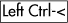**,**  | 通过刻度步长放大左侧手柄 |
| --- | --- |
| **,**  | 通过刻度步长放大右侧手柄 |
| **,**  | 通过 1 个像素放大左侧手柄 |
| **,**  | 通过 1 个像素放大右侧手柄 |

除了和，您还可以分别使用（逗号）和（句号）键。

## D.12.10 旋转手柄（选中一个节点，12.5.6）

| **,**  | 通过角度步长同时旋转两个手柄 |
| --- | --- |

这可能适用于多个选定的节点。

| ,  | 通过角度步长旋转左侧手柄 |
| --- | --- |
| **,**  | 通过角度步长旋转右侧手柄 |
| **,**  | 通过 1 像素旋转左侧手柄 |
| **,**  | 通过 1 像素旋转右侧手柄 |

## D.12.11 缩放节点（选择两个或更多节点，12.5.7.3）

这些命令将选定的节点缩放，就像它们是一个对象。如果鼠标悬停在节点上，该节点将成为缩放的轴；否则，它将围绕选定节点的几何中心缩放。

| **,**  | 通过缩放步长放大节点 |
| --- | --- |
| **,**  | 通过缩放步长缩小节点 |

默认的缩放步长是 2 像素单位。

| **,**  | 通过 1 像素放大节点 |
| --- | --- |
| **,**  | 通过 1 像素缩小节点 |

缩放是均匀围绕中心进行的，因此尺寸增量应用于两个维度中较大的那个。

## D.12.12 旋转节点（选择两个或更多节点，12.5.7.3）

这些命令将选定的节点旋转，就像它们是一个对象。如果鼠标悬停在节点上，该节点将成为旋转的轴；否则，它将围绕选定节点的几何中心旋转。

| **,**  | 通过角度步长旋转节点 |
| --- | --- |
| **,**  | 通过 1 像素旋转节点 |

## D.12.13 翻转节点（选择两个或更多节点，12.5.7.3）

这些命令将选定的节点翻转，就像它们是一个对象，围绕该对象的中心翻转。

|  | 水平翻转节点 |
| --- | --- |
|  | 垂直翻转节点 |

如果鼠标悬停在节点上，该节点将成为翻转的轴；否则，它将围绕选定节点的几何中心翻转。

## D.12.14 更改段（12.5.6）

|  | 创建线 |
| --- | --- |
|  | 创建曲线 |

这些命令要求选择两个或更多相邻的节点。

## D.12.15 更改节点类型（12.5.5）

|  | 创建尖点 |
| --- | --- |

这会改变节点的类型；如果在已经形成尖点的节点上再次进行  操作，它会收缩其手柄。

|  | 创建平滑 |
| --- | --- |

如果尖点节点与线段相邻， 会使其半平滑，其中一个手柄与段平行；另一个  会扩展第二个手柄。

|  | 创建对称 |
| --- | --- |

在创建平滑或对称时，可以通过将鼠标悬停在其中一个手柄上将其位置锁定。

|  | 自动调整 |
| --- | --- |
| **-click** | 切换平滑/尖点/对称/自动 |

## D.12.16 连接/断开（12.5.4）

| 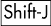 | 连接选定的节点 |
| --- | --- |

这要求在路径内精确选择两个端节点。可以通过将鼠标悬停在其中一个连接节点上将其位置锁定。

|  | 断开选定的节点 |
| --- | --- |

断开连接后，每两个新节点中只有一个被选中。这可能适用于多个选定的节点。

## D.12.17 删除、创建和复制（12.5.3）

| **,**  | 删除选定的节点 |
| --- | --- |
| **,**  | 删除时不保留形状 |

删除时如果不使用 ，则调整剩余节点的手柄以尽可能保留曲线的形状。使用  删除时不会触及剩余节点。

| **-click** | 创建/删除节点 |
| --- | --- |

-click 在节点上删除它；-click 在节点之间的路径上会在点击点创建一个新节点。以这种方式删除节点始终尝试保留曲线的形状（与 / 相同）。

| **双击** | 创建节点 |
| --- | --- |

双击节点之间的路径会在点击点创建一个节点。

|  | 插入新的节点 |
| --- | --- |

这会在选定的段落的中间添加新的节点，因此需要选择两个或更多相邻的节点。

|  | 复制选定的节点（s） |
| --- | --- |

新节点在相同路径上创建；它们正好位于旧节点上方并被选中。

## D.12.18 反向（12.1.1）

|  | 反向路径方向 |
| --- | --- |

## D.12.19 编辑形状

节点工具还可以拖动形状（矩形、椭圆、星形、螺旋）的手柄。单击形状以选择它。查看相应的形状工具，它们的编辑快捷键也适用于节点工具。

## D.12.20 编辑填充和路径效果

节点工具还可以编辑图案填充、渐变填充和路径效果的编辑手柄。

## D.12.21 取消

|  | 取消橡皮筋或移动 |
| --- | --- |

在鼠标按钮仍然按下时按  以取消橡皮筋选择、节点移动或手柄移动。

# D.13 调整工具（6.9，8.7，12.6）

## D.13.1 操作

| **拖动** | 在当前模式下对选定的路径执行操作 |
| --- | --- |
| **-拖动** | 反转当前模式（当适用时） |
| **-拖动** | 临时进入缩小模式 |
| **-拖动** | 临时进入增长模式 |

## D.13.2 模式

|  | 移动模式 |
| --- | --- |
|  | 移动/移出模式 |

拖动将对象向鼠标内部移动，使用  拖动从鼠标外部移动。

|  | 移动抖动模式 |
| --- | --- |
| **,**  | 缩放模式 |

拖动缩放对象向下，使用  拖动向上缩放。

| **,**  | 旋转模式 |
| --- | --- |

拖动顺时针旋转对象，使用  逆时针旋转。

|  | 复制/删除模式 |
| --- | --- |

拖动随机复制对象，使用  拖动随机删除。

|  | 推路径模式（**12.6.3 推模式**) |
| --- | --- |
|  | 增长/缩小路径模式（**12.6.4 缩小/增长模式**) |

拖动内嵌路径，使用  拖动外嵌。

|  | 吸引/排斥路径模式 (**12.6.5 吸引/排斥模式**) |
| --- | --- |

拖动将路径吸引到光标处，使用  拖动则排斥。

| 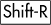 | 粗糙模式 (**12.6.6 粗糙模式**) |
| --- | --- |
|  | 颜色绘制模式 (**8.7.1 颜色绘制**) |
|  | 颜色抖动模式 (**8.7.2 颜色抖动**) |
|  | 模糊模式 |

## D.13.3 参数 (12.6.1)

| **,**  | 通过调整增加画笔宽度 1 |
| --- | --- |
| **,**  | 设置画笔宽度为 1 或 100 |
| **,**  | 调整微调力 |

绘制时可以调整宽度和力度。使用压力感应平板，力度还取决于笔的压力。

# D.14 矩形工具 (11.2)

## D.14.1 绘制

| **拖动** | 绘制矩形 |
| --- | --- |
| **-拖动** | 制作正方形或整数比例的矩形 |

这将限制矩形，使其高度/宽度比是一个整数。

| **-拖动** | 围绕起始点绘制 |
| --- | --- |

这会在鼠标拖动的起始点周围创建一个对称的矩形。

## D.14.2 选择

| **点击** | 选择 |
| --- | --- |
| **-点击**， **-点击** | 选择下方 |
| **-点击** | 切换选择 |

在此工具中，通过点击选择忽略任何分组（即，相当于在选择器中使用  点击）。

|  | 取消选择 |
| --- | --- |

## D.14.3 使用手柄调整大小 (11.2.1)

| **拖动** | 通过拖动方形手柄来调整大小 |
| --- | --- |

初始时，两个调整大小（方形）手柄位于左上角和右下角。调整大小手柄在其自己的坐标系中更改矩形的宽度和高度，在应用任何转换之前。

| **-拖动** | 锁定宽度、高度或比例 |
| --- | --- |

## D.14.4 使用手柄圆滑角落 (11.2.2)

| **拖动** | 通过拖动圆形手柄来圆滑角落 |
| --- | --- |

初始时，两个圆角手柄位于矩形的右上角。

| **-拖动** | 锁定角落圆形 |
| --- | --- |
| **-点击** | 设置角落圆形 |

当圆角时，如果另一个手柄保持在角落，则拖动一个圆角手柄可以保持角落圆形。您可以独立拖动每个手柄以获得椭圆形圆角，或者拖动/点击一个带有  的手柄以使其再次变为圆形。

| **-点击** | 移除角落圆角 |
| --- | --- |

# D.15 3D 盒子工具 (11.3)

## D.15.1 绘制 (11.3.2)

| **拖动** | 绘制 3D 盒子（X/Y 平面） |
| --- | --- |
| **-拖动** | 绘制 3D 盒子（在 Z 方向拉伸） |

## D.15.2 选择

| **点击** | 选择 |
| --- | --- |
| **-点击**，**-点击** | 选择下方 |
| **-点击** | 切换选择 |
|  | 取消选择 |

## D.15.3 使用手柄编辑 (11.3.4)

所有编辑操作都在“视角”内进行，即沿着视角线或在这些线所跨越的平面内。

| **拖动** | 调整大小或移动盒子 |
| --- | --- |

四个前手柄和中心通常在 X/Y 平面内移动，四个后手柄沿 Z 轴移动；带有  时情况相反。

| **-拖动** | 调整大小或移动，手柄吸附到轴或对角线 |
| --- | --- |

## D.15.4 编辑视角 (11.3.3)

| **拖动** | 拖动方形手柄以移动消失点 |
| --- | --- |
| **,**  | 通过角度步长旋转 X 视角线（如果平行） |
| **,**  | 通过 1 像素旋转 X 视角线（如果平行） |
| **,**  | 通过角度步长旋转 Y 视角线（如果平行） |
| **,**  | 通过 1 像素旋转 Y 视角线（如果平行） |
| **,**  | 通过角度步长旋转 Z 视角线（如果平行） |
| 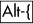**,** 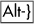 | 通过 1 像素旋转 Z 视角线（如果平行） |

# D.16 椭圆工具 (11.4)

## D.16.1 绘制 (11.4.1)

没有使用时，鼠标拖动的起始点和结束点标记了边界框的角点。使用时，椭圆被放大，使其周长通过这两个点（是一个特殊情况，见下文）。

| **拖动** | 绘制椭圆 |
| --- | --- |
| **-拖动** | 创建圆形或整数比例的椭圆 |

这限制了椭圆，使其高度/宽度比是一个整数。

| **-拖动** | 围绕起始点绘制 |
| --- | --- |

这将在鼠标拖动的起始点周围创建一个对称的椭圆。

| **-拖动** |  |
| --- | --- |

这将创建一个完美的圆形，其直径由鼠标拖动的起始点和结束点定义。

## D.16.2 选择

| **点击** | 选择 |
| --- | --- |
| **-点击**， **-点击** | 选择下方 |
| **-点击** | 切换选择 |

在此工具中，通过点击选择忽略任何分组（即，相当于在选择器中点击）。

|  | 取消选择 |
| --- | --- |

## D.16.3 使用手柄编辑 (11.4.2)

| **拖动** | 调整大小、绘制弧或段 |
| --- | --- |

初始时，两个调整大小手柄位于最顶部和最左侧的点；两个弧/段手柄位于最右侧的点。

| **-拖动** | 锁定圆形（调整大小手柄） |
| --- | --- |
| **-拖动** | 捕捉到角度步长（弧/段手柄） |

调整大小手柄在其自己的坐标系中更改椭圆的宽度和高度，在应用任何转换之前。

| **-点击** | 完整选择（弧/段手柄） |
| --- | --- |

# D.17 星形工具 (11.5)

## D.17.1 绘制 (11.5.1)

| **拖动** | 绘制星形 |
| --- | --- |
| **-拖动** | 将星形捕捉到角度步长 |

## D.17.2 选择

| **点击** | 选择 |
| --- | --- |
| **-点击**， **-点击** | 选择下方 |
| **-点击** | 切换选择 |

在此工具中，通过点击选择忽略任何分组（即，相当于在选择器中点击）。

|  | 取消选择 |
| --- | --- |

## D.17.3 使用手柄编辑 (11.5.2)

| **拖动** | 拖动手柄以改变星形 |
| --- | --- |
| **-drag** | 保持星射线径向（无倾斜） |
| **-drag** | 绕星旋转 |
| **-click** | 移除圆滑 |
| **-drag** | 随机化星形 |
| **-click**，**-click** | 移除随机化 |

# D.18 螺旋工具（11.6）

## D.18.1 绘制

| **drag** | 绘制螺旋线 |
| --- | --- |
| **-drag** | 将螺旋线吸附到角度步长 |

## D.18.2 选择

| **click** | 选择 |
| --- | --- |
| **-click**，**-click** | 选择下方 |
| **-click** | 切换选择 |

在这个工具中，通过点击选择忽略任何分组（即，相当于在选择器中使用进行点击）。

|  | 取消选择 |
| --- | --- |

## D.18.3 使用手柄编辑

| **drag** | 从内部（内部手柄）卷起/展开 |
| --- | --- |

拖动内部手柄调整**内半径**参数。

| **-drag** | 收敛/发散（内部手柄） |
| --- | --- |
| **-click**，**-click** | 重置发散（内部手柄） |

垂直-拖动内部手柄调整**发散**参数；-click 将其重置为 1。

| **-click** | 将内半径设为零（内部手柄） |
| --- | --- |

在内部手柄上-click 使螺旋线从中心开始。

| **drag** | 从外部（外部手柄）卷起/展开 |
| --- | --- |

拖动外部手柄调整**圈数**参数。使用-drag 卷起/展开而不改变半径。

| **-drag** | 缩放/旋转（外部手柄） |
| --- | --- |

使用仅旋转（锁定螺旋线的半径）。

| **-drag** | 将手柄吸附到角度步长 |
| --- | --- |

这对两个手柄都适用。

# D.19 缩放工具（3.9）

| **click** | 放大 |
| --- | --- |
| **-click** | 缩小 |
| **drag** | 缩放至区域 |

# D.20 铅笔工具（14.2）

| **drag** | 绘制自由手绘线 |
| --- | --- |
| **-拖动** | 添加到选定的路径 |

如果选择了路径，-拖动到任何地方将创建一个新的子路径。

| **-拖动** | 暂时禁用吸附 |
| --- | --- |

在带有网格或辅助线的绘图时暂时禁用网格或辅助线的吸附。

| **-拖动** | 平均绘制（草图模式） |
| --- | --- |

# D.21 笔（贝塞尔）工具（14.1）

## D.21.1 创建节点（14.1.1）

| **点击** | 创建一个尖锐的节点 |
| --- | --- |

如果没有创建路径，这将开始一个新的路径。

| **-点击** | 添加到选定的路径 |
| --- | --- |

如果选择了路径，-点击到任何地方将开始一个新的子路径。

| **拖动** | 创建一个带有两个控制点的贝塞尔节点 |
| --- | --- |
| **-拖动** | 只移动一个控制点 |

这只移动一个控制点（而不是两个）以创建节点，使其成为尖点。

| **-拖动** | 将控制点吸附到角度步长 |
| --- | --- |

## D.21.2 移动最后一个节点（14.1.2）

这些命令在创建路径时移动最近创建的节点（红色段开始处）。

| **,** **,** **,**  | 将最后一个节点移动微调距离 |
| --- | --- |
| **,** **,** **,**  | 将最后一个节点移动 10 倍微调距离 |

默认微调距离为 2 像素单位。

| **,** **,** **,**  | 将最后一个节点移动 1 像素 |
| --- | --- |
| **,** **,** **,**  | 将最后一个节点移动 10 像素 |

## D.21.3 创建/修改段

|  | 将最后一个段固定到角度步长 |
| --- | --- |

这将新节点相对于前一个节点的角度固定到角度步长。

|  | 将最后一个段变为直线 |
| --- | --- |
|  | 使最后一段曲线 |

这些命令将路径的最后一个（红色）段变为直线或曲线。

## D.21.4 创建点 (14.1.4)

这些快捷键仅在工具的直线或准平行模式中有效。

| **-点击** | 创建一个点 |
| --- | --- |

这将创建一个大小（相对于当前笔触宽度）可设置的小圆，在**Inkscape 首选项**中设置。

| **-点击** | 创建一个双倍大小的点 |
| --- | --- |
| **-点击** | 创建一个随机大小的点 |

## D.21.5 完成

|  **, 右键单击，双击** | 完成当前线条 |
| --- | --- |

## D.21.6 取消

| **,**  | 取消当前线条 |
| --- | --- |
| **,**  | 删除当前线条的最后一段 |

# D.22 书写笔工具 (14.3)

| **拖动** | 绘制书写笔线条 |
| --- | --- |
| **-拖动** | 添加到选定的路径 |
| **-拖动** | 从选定的路径中减去 |
| **-拖动** | 跟踪引导路径 |
| **,**  | 调整笔宽 1 单位 |
| **,**  | 设置笔宽为 1 或 100 |
| **,**  | 调整笔角度 |

绘制时可以调整宽度和角度。

|  | 取消选择 |
| --- | --- |

# D.23 填充桶工具 (14.4)

| **点击** | 填充封闭区域 |
| --- | --- |
| **-点击** | 添加到选定的路径 |

使用点击会将新创建的填充与之前的选区合并。

| **拖动** | 从每个点填充 |
| --- | --- |

从每个点开始，填充会扩散到颜色与该点相似的所有相邻区域。这可以用来填充当前填充有渐变或模糊效果的区域。

| **-拖动** | 从每个点填充，与初始点相同 |
| --- | --- |

从每个点开始，填充会扩散到颜色与拖动初始点相似的所有相邻区域。这可以通过在一个区域开始并拖动到所有区域来完成，以填充多个不相交的封闭区域。

| **-点击** | 设置填充颜色 |
| --- | --- |
| **-点击** | 设置描边颜色 |

-点击对象将其填充（或描边与）设置为工具的当前样式；对象不必被选中。

# D.24 渐变工具（10.1）

## D.24.1 选择对象

| **点击** | 选择 |
| --- | --- |
| **-点击** | 在下边选择 |
| **-点击** | 切换选择 |

## D.24.2 创建渐变

| **拖动** | 创建渐变 |
| --- | --- |

这将在选定的对象上创建渐变。控制栏允许您选择线性/径向和填充/描边的新渐变。

| **双击** | 创建默认渐变 |
| --- | --- |

这将在点击的对象上创建默认（线性为边缘到边缘，径向为中心边缘到边缘）渐变。

## D.24.3 选择手柄

| **点击** | 选择一个手柄 |
| --- | --- |
| **-点击** | 将手柄添加到选择中 |
| **-拖动** | 通过橡皮筋选择 |
|  | 选择下一个手柄 |
|  | 选择上一个手柄 |
|  | 选择所有手柄 |
|  | 取消所有手柄的选择 |

在所有手柄之外的单击也会取消所有手柄的选择。

## D.24.4 创建/删除中间停止点（10.5.1）

| **双击** | 创建一个停止点 |
| --- | --- |
| **-点击** | 创建/删除一个停止点 |

-点击停止点的手柄将删除该停止点；如果是端点停止点，渐变会缩短；如果留下一个单独的停止点，渐变会消失成纯色。

|  | 插入新的停止点 |
| --- | --- |

这将在选定的段中间添加新的停止点，因此需要选择两个或更多相邻的手柄。

|  | 删除选定的停止点 |
| --- | --- |

## D.24.5 移动手柄/停止点（10.5.2）

| **拖动** | 移动选定的手柄 |
| --- | --- |
| **-拖动** | 以 1/10 的范围增量移动停止点 |

-拖动选定的中间停止点将它们移动，并自动对齐到可用范围的 1/10 步长。

| **-拖动** | 塑造选定的停止点 |
| --- | --- |

塑造移动选定的中间停止点；每个停止点移动的距离取决于它距离被拖动的停止点的距离（类似于节点工具中的节点塑造）。

| **,** **,** **,**  | 通过微调距离移动所选句柄 |
| --- | --- |
| **,** **,** **,**  | 通过 10 倍微调距离移动所选句柄 |

默认微调距离为 2 个像素单位。

| **,** **,** **,**  | 通过 1 个像素移动所选句柄 |
| --- | --- |
| **,** **,** **,**  | 通过 10 个像素移动所选句柄 |

如果至少选择了一个端点句柄，则箭头键可以自由移动端点句柄，从而移动或调整整个梯度线的位置和大小。如果只选择了中间停止点，则箭头键将所选停止点沿梯度线移动。

## D.24.6 反向（10.2）

|  | 反向梯度定义 |
| --- | --- |

这将镜像当前梯度的停止位置，而不移动梯度句柄。

## D.24.7 梯度编辑器

| **双击** | 打开**梯度编辑器** |
| --- | --- |

双击梯度句柄将打开包含该梯度以及所选句柄在停止列表中的**梯度编辑器**。

# D.25 液滴工具（8.6）

| **点击** | 选择填充颜色 |
| --- | --- |
| **-点击** | 选择描边颜色 |
| **拖动** | 平均填充颜色 |
| **-拖动** | 平均描边颜色 |

点击将光标下的颜色应用到当前选择。拖动半径计算圆形区域的平均颜色。如果选择了梯度工具中的梯度句柄，则该句柄将获得颜色，而不是整个对象。

| **-点击** **-拖动** **-点击** **-拖动** | 选择逆色 |
| --- | --- |

如果按下，则通过点击或拖动（带或不带）选择颜色时，将选择颜色的反色。

|  | 复制颜色 |
| --- | --- |

这会将光标下的颜色复制到剪贴板，格式为`RRGGBBAA`（八个十六进制数字）。

# D.26 文本工具（第十五章 | 取消文本对象的选中状态 |
| --- | --- |

## D.26.2 在文本中导航

| **,** **,** **,**  | 移动光标一个字符 |
| --- | --- |
| **,**  | 移动光标一个单词 |
| **,**  | 移动光标一个段落 |
| **,**  | 移动到行的开始/结束 |
| **,**  | 移动到文本的开始/结束 |
| **,**  | 移动光标一个屏幕 |

所有这些命令如果当前有文本选中，将取消选中。使用来扩展选择。

## D.26.3 流动文本（内部框架，15.2.2）

| **拖动** | 创建流动文本 |
| --- | --- |

在空白区域或非文本对象上单击并拖动会创建一个带有内部矩形框架的流动文本对象。

| **拖动** | 调整框架大小 |
| --- | --- |

拖动所选流动文本右下角的手柄可以更改框架的宽度和高度。

| **-拖动** | 锁定框架的宽度、高度或比例 |
| --- | --- |

使用拖动角落手柄可以调整框架大小，同时保持宽度、高度或比例不变。

## D.26.4 流动文本（外部框架，15.2.2.2）

|  | 将文本流动到框架中 |
| --- | --- |

当选择文本对象和形状/路径时，此操作将文本流动到形状/路径中。两者仍然是独立的对象，但相互链接；编辑形状/路径会导致文本重新流动。

|  | 从框架中取消流动文本 |
| --- | --- |

这会切断流动文本与形状/路径的链接，生成一个单行常规文本对象。

|  | 选择外部框架 |
| --- | --- |

要找出流式文本的框架对象，请选择它并按 。框架将被选择。

## D.26.5 路径上的文本（15.2.3）

|  | 从文本中选择路径 |
| --- | --- |

要找出文本所在的路径，请选择它并按 。路径将被选择。

## D.26.6 编辑文本

要输入 + 和 - 字符，请使用主键盘；数字键盘  和  保留用于缩放（除非  是开启的）。

|  | 开始新行或新段落 |
| --- | --- |

 在常规文本中创建新行；在流式文本中创建新段落。

|  | 切换到 Unicode 输入模式（**15.6.1 特殊字符**) |
| --- | --- |

要插入任意 Unicode 字符，请输入 ，然后输入十六进制代码点，然后输入 。要在插入字符后保持 Unicode 模式，请按  而不是 。按  或另一个  来取消 Unicode 模式而不插入字符。

|  | 插入不间断空格 |
| --- | --- |

即使在没有 `xml:space="preserve"` 的文本对象中，不间断空格也是可见的。

## D.26.7 选择文本（15.1.1）

| **拖动** | 选择文本 |
| --- | --- |

左键拖动文本对象可以选择文本范围。

| **,** **,** **,**  | 通过字符选择文本 |
| --- | --- |
| **,** **,** **,**  | 通过单词选择文本 |
| **,**  | 选择到行首/行尾 |
| **,**  | 选择到文本首尾 |
| **,**  | 选择上一屏/下一屏 |
| **双击** | 选择单词 |
| **三击** | 选择行 |
|  | 选择所有文本 |

这将选择当前文本对象中的全部文本。

## D.26.8 样式选择 (15.4.2)

|  | 使选择文本变为粗体 |
| --- | --- |
|  | 使选择文本变为斜体 |

## D.26.9 字母间距 (15.3.4)

|  | 扩展行/段落 1 像素 |
| --- | --- |
|  | 扩展行/段落 10 像素 |
|  | 收缩行/段落 1 像素 |
|  | 收缩行/段落 10 像素 |

这些命令（仅在编辑文本时）调整当前行（常规文本）或当前段落（流式文本）中的字母间距。

## D.26.10 行间距 (15.3.4)

|  | 将文本对象高度增加 1 像素 |
| --- | --- |
|  | 将文本对象高度增加 10 像素 |
|  | 将文本对象高度减少 1 像素 |
|  | 将文本对象高度减少 10 像素 |

这些命令（仅在编辑文本时）调整整个文本对象（常规或流式）的行间距。

## D.26.11 字距和移动 (15.3.3)

| **,** **,** **,**  | 将字符移动 1 像素 |
| --- | --- |
| **,**  **,** | 将字符移动 10 像素 |
| **,**  |   |

这些命令在编辑常规文本对象时有效（不在流式文本中）。没有选择时，它们将光标后的字符（水平或垂直）移动到行尾。有选择时，它们相对于文本的其他部分移动选择（在选择的两侧插入相反的字距）。

## D.26.12 旋转 (15.3.3)

| **,**  | 将字符旋转 90 度 |
| --- | --- |
| **,**  | 将字符旋转 1 像素 |

旋转命令仅在常规文本中有效（非流式文本）。这些命令旋转下一个字符（当没有文本选择时）或选择中的所有字符（当有选择时）。
