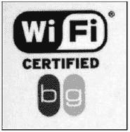
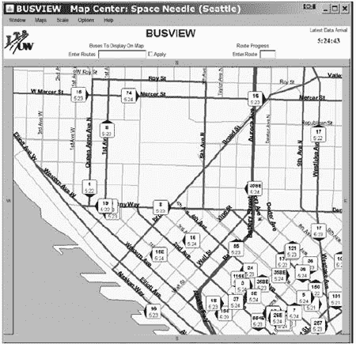

# 第二章. 无线网络简介

在一定程度上，你可以将你的无线网络视为一组黑盒，你可以打开并使用它们，而不必了解它们的工作方式。这就是大多数人对待他们周围的技术的方式。你不必为了放置长途电话或用微波炉加热午餐或连接笔记本电脑到网络而担心技术规格。在一个理想的世界（哈哈！），无线连接会在你打开电源开关后立即工作。

但如今的无线网络正处于 20 世纪 20 年代末广播无线电所处的阶段。这项技术对每个人都是开放的，但那些理解背后 Bakelite-Dilecto 面板（图 2-1

**图 2-1. 每种新技术都会经历调整和摸索的阶段。**

当网络正常运行时，你应该能够使用它而不必考虑所有那些内部管道——只需点击几个图标，你就能连接。但当你设计和构建一个新的网络，或者当你想要提高现有网络的性能时，了解所有这些数据是如何从一个地方移动到另一个地方的是至关重要的。而当网络做了你预料之外的事情时，你需要对这项技术有基本的了解，以便进行任何有用的故障排除。

# 无线网络是如何工作的

通过无线网络传输数据涉及三个独立的元素：无线电信号、数据格式和网络结构。这三个元素彼此独立，因此当你发明一个新的网络时，你必须定义所有三个。在 OSI 参考模型中，无线电信号在物理层操作，数据格式控制几个高层。网络结构包括发送和接收无线电信号的无线网络接口适配器和基站。在无线网络中，每台计算机和基站的网络接口适配器将数字数据转换为无线电信号，并将它们传输到同一网络上的其他设备，同时接收并将来自其他网络元素的传入无线电信号转换回数字数据。

每种宽带无线数据服务都使用不同的无线电信号、数据格式和网络结构的组合。我们将在本章后面更详细地描述每种无线数据网络，但首先，了解一些基本原则是非常有价值的。

## 无线电

使无线电成为可能的基本物理定律被称为麦克斯韦方程，由詹姆斯·克拉克·麦克斯韦在 1864 年提出。不涉及数学，麦克斯韦方程表明变化的磁场会产生电场，而变化的电场会产生磁场。当交流电（AC）通过电线或其他物理导体时，其中一部分能量会以交流磁场的形式逃逸到周围空间。该磁场在空间中产生一个交变的电场，反过来又产生另一个磁场，以此类推，直到原始电流被中断。

这种在电和磁能之间转换的能量形式被称为*电磁辐射*，或*无线电波*。*无线电*定义为通过空间传播的电磁能量。产生无线电波的设备称为*发射机*，而检测空中无线电波并将其转换为其他形式能量的互补设备称为*接收机*。发射机和接收机都使用称为*天线*的特殊形状的设备来聚焦无线电信号到特定的方向或*模式*，并增加有效辐射（来自发射机）或灵敏度（在接收机）的量。

通过调整每个发射机通过天线流向空间的交流电的速率（*频率*），并通过调整接收机使其仅在那种频率下工作，可以发送和接收许多不同的信号，每个信号在不同的频率上，不会相互干扰。频率的总范围被称为*无线电频谱*。无线电频谱的较小部分通常被称为*波段*。

无线电频率和其他交流信号以每秒周期数表示，或称为赫兹（Hz），以纪念第一个发送和接收无线电波的实验者海因里希·赫兹命名。一个周期是从交流信号的峰值到下一个信号的峰值的距离。无线电信号通常在千赫兹、兆赫兹或吉赫兹的频率下运行（分别称为千赫或 KHz、兆赫或 MHz 和吉赫或 GHz）。

最简单的无线电通信类型使用连续信号，发射机的操作员中断信号以将其分为长信号和短信号（点和划线）的接受模式，这些模式对应于单个字母和其他字符。这些模式中最广泛使用的一套是摩尔斯电码，以电报发明者塞缪尔·F·B·摩尔斯命名，其中这种代码首次被使用。

为了通过无线电传输语音、音乐和其他声音，发射机会通过将音频信号与载波混合，如图 2-2 所示（这称为调幅，或 AM）或通过在窄频范围内调制频率，如图 2-3 所示（这称为调频，或 FM）来改变交流信号（载波波）。AM 或 FM 接收器包括一个互补电路，用于将载波与调制信号分离。

**图 2-2. 在调幅信号中，音频调制载波。**

**图 2-3. 在调频信号中，音频调制无线电频率。**

由于两个或多个使用相同频率的无线电信号经常会相互干扰，政府监管机构和国际机构，如国际电信联盟（ITU），已为特定类型的调制保留了某些频率，并向个人用户颁发独家许可证。例如，一个调频广播电台可能被许可在特定地理位置以 92.1 MHz 的频率运行。不允许其他人使用足够接近的频率来干扰该信号。另一方面，某些无线电服务不需要许可证。大多数未授权服务要么限制在非常短的距离内，要么限制在特定的频率范围内，或者两者兼而有之。

AM 和 FM 都是*模拟*方法，因为从接收器输出的信号是输入到发射器的信号的复制品。当我们通过无线电链路发送计算机数据时，它是*数字*的，因为内容在传输之前已经被从文本、计算机代码、声音、图像或其他信息转换为二进制（1 和 0），并在接收后转换回其原始形式。数字无线电可以使用几种不同的调制方法：1 和 0 可以是两种不同的音频音调、两种不同的无线电频率、对载波的定时中断，或者这些和其他技术的组合。

## 无线数据网络

每种无线数据网络都在特定的无线电频率上运行。例如，大多数 Wi-Fi 网络在 2.4 GHz 的特定无线电频率范围内运行，这个频率在世界上大多数地区都已被预留用于未经许可的点对点扩频无线电服务。其他 Wi-Fi 系统使用 5 GHz 的不同未经许可的频段。

### 未经许可的无线电服务

*未经许可*意味着任何使用符合技术要求的设备的人都可以在这些频率上发送和接收无线电信号，而无需无线电发射站许可证。与大多数需要许可证的无线电服务（包括其他宽带无线服务）不同，这些许可证授予特定类型的服务和一到多个特定用户对该频率的独家使用权，未经许可的服务是一个全民共享的环境，每个人都对相同的无线电频谱拥有平等的权利。在理论上，扩频无线电技术使得许多用户（在一定范围内）可以共存而不会产生显著的干扰。

### 点对点

*点对点*无线电服务运行一个通信信道，该信道从发射器向单个接收器传输信息。与点对点相反的是*广播*服务（如广播电台或电视台），它同时向许多接收器发送相同的信号。

### 扩频

*扩频*是一系列使用相对较宽的无线电频谱段来传输单个无线电信号的方法。无线以太网网络使用几种不同的扩频无线电传输系统，这些系统被称为跳频扩频（FHSS）、直接序列扩频（DSSS）和正交频分复用（OFDM）。一些较老的数据网络使用较慢的 FHSS 系统，但第一代 Wi-Fi 网络使用 DSSS，而较新的系统使用 OFDM。表 2-1 列出了每个 Wi-Fi 标准和它们使用的扩频调制类型。

**表 2-1. Wi-Fi 标准和调制类型**

| Wi-Fi 类型 | 频率 | 调制 |
| --- | --- | --- |
| 802.11a | 5 GHz | OFDM |
| 802.11b | 2.4 GHz | DSSS |
| 802.11g | 2.4 GHz | OFDM |

扩频无线电在与其他使用单一窄频道的无线电信号相比时，提供了一些重要的优势。扩频非常高效，因此无线电发射器可以以非常低的功率运行。由于信号在相对较宽的频率范围内运行，它们对其他无线电信号和电气噪声的干扰不太敏感，这意味着它们通常可以在传统窄带信号无法接收和理解的环境中传输。而且，由于跳频扩频信号在多个频道之间切换，未经授权的听众拦截和解码信号内容变得极其困难。

扩频技术有着一段有趣的历史。这项技术是由女演员海蒂·拉玛和美国的先锋派作曲家乔治·安太尔共同发明的，作为一种“秘密通信系统”，用于控制无线电遥控鱼雷，使其不易受到敌方干扰。在海蒂来到好莱坞之前，她曾与一位奥地利军火商结婚，在晚宴上，她通过丈夫的客户了解到了鱼雷制导的问题。多年后，在美国加入第二次世界大战前夕，她提出了改变无线电频率以穿透干扰的概念。《纽约时报》在 1941 年报道说，她的“热门”发明（图 2-4 获取。"))对国家安全至关重要，但政府没有透露任何细节。

获取。](tagoreillycom20090210nostarchimages254618.png.jpg)

**图 2-4. 海蒂·拉玛和乔治·安太尔于 1942 年获得了这项专利，该发明成为扩频无线电通信的基础。在这里，她以她的已婚名字 H.K. Markey 的名字被提及。完整文件可在[`uspto.gov`](http://uspto.gov)获取。**

安太尔最终证明是使这个想法得以实现的理想人选。他最著名的作品是一部名为《机械芭蕾》的狂想曲，为十六台演奏钢琴、两架飞机螺旋桨、四台木琴、四台低音鼓和一个警报器而作。他的设计使用了与之前用于同步演奏钢琴以改变扩频传输中的无线电频率相同的机制。原始的槽孔纸带系统有 88 个不同的无线电频道——每个频道对应钢琴上的 88 个键。

理论上，同样的方法可以用于语音和数据通信，以及鱼雷引导，但在真空管、纸带和机械同步的时代，整个过程过于复杂，实际上无法构建和使用。到 1962 年，固态电子已经取代了真空管和钢琴卷筒，这项技术在美国海军舰艇上用于古巴导弹危机期间的保密通信。如今，扩频无线电被用于美国空军太空司令部的 Milstar 卫星通信系统、数字蜂窝电话和无线数据网络。

### 跳频扩频

拉玛尔和安瑟尔最初为扩频无线电设计的方案使用了*跳频系统（FHSS）*。正如其名所示，FHSS 技术将无线电信号分成小段，并在传输这些段时每秒多次“跳变”到不同的频率。发射机和接收机建立了一个同步跳变模式，以确定它们将使用不同子通道的顺序。

FHSS 系统通过使用每秒多次改变频率的窄载波信号来克服来自其他用户的干扰。额外的发射机和接收机对可以在同一组子频道上同时使用不同的跳变模式。在任何时刻，每个传输可能都在使用不同的子频道，因此信号之间没有干扰。当发生冲突时，系统会重新发送相同的包，直到接收器收到干净的副本，并将确认发送回发射站。

对于一些较老的 802.11 无线数据服务，未授权的 2.4 MHz 频段被分成 75 个子频道，每个子频道宽度为 1 MHz。由于每个频率跳变都会向数据流增加开销，FHSS 传输相对较慢。

### 直接序列扩频

控制着 802.11b 网络的*直接序列扩频（DSSS）*技术使用一个 11 芯片的巴克序列，通过一个单一的 22 MHz 宽频道来扩频无线电信号，而无需改变频率。每个 DSSS 链接只使用一个频道，而无需在频率之间跳变。如图 2-5 所示，DSSS 传输使用更多的带宽，但比传统信号使用更少的功率。左侧的数字信号是集中在一个狭窄带宽内的传统传输，而右侧的 DSSS 信号使用相同数量的功率，但将功率分散在更宽的无线电频率范围内。显然，22 MHz 的 DSSS 频道比 FHSS 系统中使用的 1 MHz 频道宽得多。

DSSS 发射器将原始数据流中的每个比特分解成一系列冗余的比特模式，称为*芯片*，并将它们传输到接收器，接收器将这些芯片重新组装成与原始数据流相同的数据流。因为大多数干扰可能占据比 DSSS 信号更窄的带宽，并且因为每个比特被分成几个芯片，所以接收器通常可以在解码信号之前识别噪声并拒绝它。

**图 2-5. 传统信号（左）使用较窄的无线电频率带宽。DSSS 信号（右）使用更宽的带宽，但信号功率较小。**

像其他网络协议一样，DSSS 无线链路在每个数据包内交换握手消息，以确认接收器可以理解每个数据包。例如，802.11b DSSS Wi-Fi 网络的标准数据传输速率为 11Mbps，但当信号质量无法支持该速度时，发射器和接收器使用称为*动态速率转换*的过程将速度降低到 5.5Mbps。速度可能降低，因为接收器附近的电气噪声干扰了信号，或者因为发射器和接收器相距太远，无法支持全速操作。如果 5.5Mbps 对于链路来说仍然太快，它会再次降低，降至 2Mbps 甚至 1Mbps。

### 正交频分复用

*正交频分复用（OFDM）调制*，用于 802.11a Wi-Fi 网络，比 DSSS 技术复杂得多。物理层将数据流分成 52 个并行比特流，每个比特流使用不同的无线电频率，称为*子载波*。其中四个子载波携带*导频数据*，提供有关剩余 48 个子载波参考信息，以减少由于无线电干扰或相位偏移导致的信号损失。因为数据被分成 48 个独立的流，这些流并行地通过各自的子载波移动，所以总传输速度远大于单个通道的数据传输速度。

OFDM 信号中的子载波频率与每个子载波波形峰值重叠，与重叠信号的基线相匹配，如图图 2-6 所示。这被称为*正交频分*。802.11a 标准指定了总共八个 20 MHz 宽的数据通道。每个通道被分成 52 个 300 kHz 的子载波。

**图 2-6. 在 OFDM 中，重叠频率的峰值不会相互干扰。**

当 Wi-Fi 无线电接收器检测到 802.11a 信号时，它将并行比特流重新组装成单个高速数据流，并使用引导数据来检查其准确性。在理想条件下，802.11a 网络可以以 54Mbps 的速度传输数据，但像 DSSS 调制一样，OFDM 发射器和接收器会自动降低数据速度，因为由于干扰、弱信号或其他不完美的气象条件，无法实现最大传输速率。

更新的 802.11g 规范旨在结合 802.11b（更大的信号范围）和 802.11a（更高的速度）的最佳特性。为了实现这一目标，它使用 2.4 GHz 频段的 OFDM 调制。

### 这为什么重要

伟大的科幻小说家亚瑟·C·克拉克曾观察到：“任何足够先进的技术都和魔法无法区分。”对我们大多数人来说，控制高速扩频无线电的技术可能同样是一种魔法，因为我们不需要理解发射器和接收器内部发生的事情；当我们把电脑连接到互联网时，它们几乎是看不见的。正如本章前面提到的，除非你是无线电电路设计师，否则你不需要了解 Wi-Fi 发射器如何将数据分割成微小的片段并将它们重新组装成数据的这些技术细节。

但是当你知道有一套明确的规则和方法使连接工作（即使你不知道所有细节）时，你就处于控制之中。你知道这不是魔法，如果你仔细想想，你也可能知道当系统不正确工作时应该提出的一些正确问题。如果知识就是力量，那么关于你每天使用的技术的知识就是控制这种技术的力量，而不仅仅是使用它。

# 无线电的优点

无线宽带除了允许网络运营商将他们的网络扩展到有线连接的范围之外，还为移动设备提供互联网接入。就我们的目的而言，双向无线电是无线宽带最合理的途径，但其他方法（如红外光或可见信号）也是可能的。通过无线电将你的电脑连接到互联网（或本地网络）与通过有线连接相同电脑相比，提供了几个优势。首先，无线为便携式电脑提供了便利的接入；不需要找到电缆或网络数据插座。其次，它允许用户从多个位置建立连接，并在用户从一个地方移动到另一个地方时保持连接。对于网络管理员来说，无线连接使得在没有拉线或穿过墙壁打洞的情况下分配网络访问成为可能。

在实际操作中，无需电缆的接入意味着笔记本电脑或其他便携式电脑的所有者可以走进教室、咖啡馆或图书馆，只需打开电脑并运行通信程序，就能连接到互联网。根据你所使用的无线网络类型，你也许还能在移动车辆中保持相同的连接。

当你安装自己的网络时，通常使用 Wi-Fi 链接来扩展你的网络和互联网连接到其他房间更为容易，因为有线系统需要在网络路由器或交换机和每台电脑之间有物理路径来放置电缆。除非你能通过吊顶或其他现有通道来布置这些电缆，否则这几乎总是意味着你必须在你墙上打孔，将数据连接器和馈线穿入墙壁和地板下。穿过这些相同墙壁的无线电信号通常要整洁得多，也容易得多。

# 无线数据服务

由于无线电信号通过空气传播，你可以在网络基站发射器范围内的任何地方建立网络连接；不需要使用电话线、电视电缆或其他专用线路来连接你的电脑到网络。只需打开连接到电脑的无线电，它就会找到网络信号。因此，无线电（或无线）网络连接通常比有线连接方便得多。

这并不是说无线总是最佳选择。有线网络通常比无线系统更安全，因为它更难让未经授权的窃听者和其他间谍监视数据在网络中的移动，而且有线连接不需要在发送者和接收者之间进行许多复杂的协议协商。在一个你的电脑永远不会离开你的办公桌，且电脑和网络接入点之间没有物理障碍的环境中，通常在电脑和调制解调器之间安装数据电缆要容易得多。

因此，我们现在有一堆无线电发射器和接收器，它们都在相同的频率上工作，并使用相同类型的调制。（*调制*是无线电用来向无线电波添加某种内容的方法，例如声音或数字数据。）下一步是将一些网络数据通过这些无线电发送出去。有几种不同的无线数据系统和服务可供连接电脑和其他设备到本地网络和互联网，包括 Wi-Fi、WiMAX 以及基于最新一代蜂窝移动电话技术的几项服务。

## Wi-Fi

IEEE（电气和电子工程师协会）在标题为*IEEE 802.11*的标题下制定了一套无线网络标准和规范，定义了提供 Wi-Fi 服务的相对短距离信号的格式和结构。最初的 802.11 标准（结尾没有字母）于 1997 年发布。它涵盖了多种无线媒体：两种类型的无线电传输和利用红外光的网络。802.11b 标准为无线以太网网络提供了额外的规范。一份相关的文档，IEEE 802.11a，描述了在更高速度的不同无线电频率上运行的无线网络。还有其他带有其他字母的 802.11 无线电网络标准也可供使用或即将公开发布。

目前最广泛使用的规范是 802.11a、802.11b 和 802.11g。它们是几乎所有你可能在办公室、公共场所以及大多数家庭网络中遇到的无线以太网局域网使用的实际标准。关注这些其他标准的进展是值得的，但就目前而言，802.11a 和 802.11g 是用于短距离无线网络的选项，尤其是如果你预期要连接到你自己不控制所有硬件的网络。

### 注意

*许多第一代 802.11b Wi-Fi 网络适配器仍然与今天的网络兼容，但它们的制造商没有提供使它们与最新操作系统（如 Windows XP 或 Windows Vista）兼容所需的设备驱动程序*。

802.11n 标准是下一个即将推出的标准，一旦发布，它将取代 802.11b 和 802.11g，因为它更快、更安全、更可靠。旧标准仍然可以使用，因此新的 Wi-Fi 设备将支持所有三个（通常还包括 802.11a，它使用不同的无线电频率）并自动将你的网络接口匹配到从每个基站检测到的信号。

### 注意

*在新 802.11n 标准正式批准和发布之前，一些制造商提供“预-n”网络适配器和接入点，它们包括最终 802.11n 标准中将包含的许多功能。这些初步版本通常在仅限于单一制造商的设备（适配器和接入点）的网络中表现最佳，尽管它们都与现有的 802.11b 或 802.11g 网络兼容。你最好的选择是在最终标准发布之前升级你的系统，但如果你确实购买了预-n 设备，制造商可能会提供免费固件升级到最终的 802.11n 规范*。

在无线局域网标准的字母汤中，还有两个名字你应该了解：WECA 和 Wi-Fi。*WECA（无线以太网兼容性联盟）*是一个包括所有主要无线以太网设备制造商的行业组织。他们的双重使命是测试和认证他们所有成员公司的无线网络设备可以在同一网络中一起运行，并推广 802.11 网络作为全球无线局域网的标准。WECA 的市场营销天才们为 802.11 规范采用了更友好的名称 Wi-Fi（意为*无线保真度*）。

每年一次或两次，Wi-Fi 联盟会举办一个“互操作性烘焙会”，许多硬件制造商的工程师会确认他们的硬件将能够与其他供应商的设备正确通信。带有 Wi-Fi 标志的网络设备已经通过 Wi-Fi 联盟认证，符合相关标准并通过了互操作性测试。图 2-7 显示了 Wi-Fi 标志的一个版本。

Wi-Fi 最初旨在成为有线局域网的无线扩展，因此 Wi-Fi 基站与通过它们通信的电脑之间的距离限制在大约 100 英尺（35 米）的室内或室外最多 300 英尺（100 米），前提是接入点和电脑之间没有障碍物。当 802.11n 设备可用时，它将支持电脑和基站之间至少与较老版本的 Wi-Fi 一样远的连接。有方法可以扩展 Wi-Fi 信号的范围，但这些技术需要特殊设备和仔细的安装。

**图 2-7. Wi-Fi 标志**

### 注意

*有关长距离 Wi-Fi 操作的更多信息，请参阅法律问题中的“扩展网络”部分*。

因为大多数 Wi-Fi 信号的范围都如此有限，每次你将电脑移动到新的位置时，都必须找到一个新的接入点，或者称为*热点*，并设置一个新的连接。而且由于许多 Wi-Fi 接入点不允许陌生人通过它们连接，你可能需要为每个位置建立单独的账户。

本书描述的 Wi-Fi 网络遵循 802.11a、b 和 g 标准，但其中大部分信息也适用于当它们可用时的新 802.11n 网络。

### 市政 Wi-Fi 服务

在一些城市地区，地方政府机构或私营企业正在安装大量相互连接的 Wi-Fi 基站，以在整个地区或选定社区提供无线服务，作为有线和电话（DSL）服务的经济替代方案。这些服务的基站通常安装在公用事业杆或屋顶上。

这些相同的网络也可能为当地政府和主要用户提供各种特殊数据服务。例如，当地的天然气、电力和水公用事业可以在他们的计量器上添加小型 Wi-Fi 接收器，并使用该系统每月发送读数。城市公交车可能配备有向中央跟踪系统报告其位置的应答器，就像西雅图在 [`busview.org/busview_launch.jsp`](http://busview.org/busview_launch.jsp) 上的那样，如图 图 2-8 所示。

目前尚不清楚这些城市范围内的 Wi-Fi 服务是否能够克服可能的干扰问题和来自其他无线数据替代品的竞争，或者它们是否能够吸引足够的商业活动以保持其可行性。但如果是这样，任何覆盖范围内的具有 Wi-Fi 接口的计算机都应该能够检测到信号，并能够访问宽带互联网连接。

**图 2-8. 无线技术在西雅图追踪城市公交车并在网站上报告位置。**

## 蜂窝移动电话无线服务

几种宽带无线数据服务是蜂窝移动电话技术的扩展。你可能看到它们被描述为 3G 服务，因为它们基于第三代蜂窝电话技术。如果你使用移动电话超过一年或两年，你可能记得最早的手机只能用于语音通话，但随着每一代新技术的推出，你的移动运营商提供了更多更好的功能。表 2-2 描述了各种时代。

对于在家或办公室外使用计算机的人来说，移动宽带服务的巨大优势是它覆盖的领土比任何 Wi-Fi 基站都要广泛；你可以连接你的计算机到互联网，而无需在每个新位置搜索新的热点并使用不同的接入账户，你甚至可以在移动车辆中保持相同的连接。每个主要的无线宽带服务都提供大多数城市地区和城市之间的乡村地区的覆盖。

**表 2-2. 蜂窝移动电话时代**

| 名称 | 功能 |
| --- | --- |
| 1G | 仅模拟语音通信 |

| 2G | 系统可以处理更多通话

数字语音

耗电量更低

更少的背景噪音

数字数据

简单文本消息

电子邮件

|

| 2.5G | 分组交换信号 更快的传输速度（高达 144Kbps）支持相对较慢的互联网连接 |
| --- | --- |
| 3G | 同时处理更多通话更多更快的传输速率（高达 2.4Mbps）宽带互联网视频和音乐 |
| 4G（尚未提供） | 基于互联网技术 | 分组信号 | 非常高速（100Mbps–1Gbps） | 将结合电话、计算机和其他技术 |

当然，计算机技术也在同时不断进步，所以今天的 2.5G 和 3G 移动电话通常拥有足够的计算能力，可以充当口袋大小的互联网终端（以及相机和媒体播放器）。同样重要的是，从本书的角度来看，使用 2.5G 和 3G 技术的宽带数据适配器可以连接到笔记本电脑或其他便携式电脑，并通过提供移动电话服务的同一家蜂窝电话公司直接无线连接到互联网。

今天，大多数蜂窝宽带无线服务提供信用卡大小的适配器，通过笔记本电脑侧面的 PC 卡插槽或台式电脑的前面板或后面板连接到您的电脑。再过一两年，许多新的笔记本电脑将内置适配器和集成天线，用于 Wi-Fi 和 3G 无线或 WiMAX，这些天线直接安装在主板上，就像它们今天包含内置 Wi-Fi 适配器和拨号调制解调器一样。

### 注意

*一些蜂窝服务提供商还提供可以通过 USB 线缆连接到手机的移动电话，以便将电脑连接到互联网，但单独的 PC 卡适配器要方便得多，也容易使用*。

## WiMAX

全球微波接入互操作性（WiMAX）是另一种在广阔地理区域内分配宽带无线数据的方法。它是一种*城市区域网络*服务，通常使用一个或多个基站，每个基站可以为半径 30 英里的用户提供服务。IEEE 802.16 规范包含了 WiMAX 网络的技术细节。

在美国，Clearwire 最早提供 WiMAX 服务，作为一种无线替代方案，用于固定位置的 DSL 和宽带互联网接入（如家庭和企业），但移动 WiMAX 接入并不遥远。到 2008 年初，Clearwire 计划通过 PC 卡适配器提供其无线网络的接入。当这些适配器可用时，WiMAX、3G 蜂窝数据服务和城市 Wi-Fi 网络将争夺相同的商业细分市场：通过覆盖整个城市区域的服务，通过无线方式接入互联网。

每个 WiMAX 服务提供商在 2 GHz 到 11 GHz 之间的某个地方使用一个或多个授权操作频率。一个 WiMAX 链路可以以高达 70Mbps 的速度传输数据（包括握手和其他开销），但大多数商业 WiMAX 服务的速度都显著慢于这个速度。随着越来越多的用户共享单个 WiMAX 塔和基站，一些用户报告说他们的信号质量下降。

与依赖现有移动电话网络的蜂窝宽带无线数据服务不同，WiMAX 是一个独立的无线电系统，旨在补充或取代现有的宽带互联网分配系统。在实践中，WiMAX 与 3G 无线服务和通过电话线和有线电视公用事业向固定位置提供互联网接入的互联网服务提供商竞争。WiMAX 服务的家庭和企业用户通常使用有线局域网或 Wi-Fi 在他们的建筑内分配网络。图 2-9 显示了典型的 WiMAX 网络。

**图 2-9. WiMAX 为家庭和企业提供最后一公里的互联网连接。**

## 蓝牙怎么办？

蓝牙是我们应该描述的另一种无线网络技术。蓝牙使用无线电信号来替代连接计算机或移动电话到外围设备（如键盘、鼠标或一套扬声器）的电线和电缆。您还可以使用蓝牙在计算机和移动电话、智能手机、BlackBerry 或其他 PDA（个人数字助理）之间传输数据。

*蓝牙*是一个跳频扩频（FHSS）系统，将无线电信号分成微小的片段。它在与 802.11b 和 802.11g Wi-Fi 服务相同的未授权 2.4 GHz 频段中，每秒在 79 个不同的频率之间移动 1,600 次。

蓝牙不适用于将计算机连接到互联网，因为它速度慢（最大数据传输率仅为约 700Kbps），并且信号范围非常有限（通常约为 33 英尺，或 10 米，或更少）。

为了防止蓝牙和 Wi-Fi 信号之间的干扰，许多同时使用这两种技术（包括广泛使用的英特尔 Centrino 芯片组）的计算机协调这两个服务。当任一模块激活时，它会通知另一个模块，并且激活的服务具有优先权。这种协调操作比任一服务单独运行略慢，但差异微不足道。

## 频率分配

每种宽带无线服务都使用一组特定的无线电频率。其中一些频率是为特定授权服务提供商的专用服务保留的，而其他则是开放给任何人使用的公共频段。

### Wi-Fi 服务

802.11b、802.11g 和 802.11n Wi-Fi 服务都在或略高于 2.4 GHz 的频段内运行。802.11a 信号使用接近 5.3 GHz 的频段。每个 Wi-Fi 信道的具体中心频率列在表 2-3 中。

除非您是无线电工程师，否则您需要了解不同 Wi-Fi 服务的重要事项是最大数据传输速率和信号范围。表 2-3 显示了每个 Wi-Fi 规范的重要特性。

最大数据速度和典型速度之间的差异是由必须附加到每个数据包上的握手和其他非数据信息造成的。显然，在通过任何类型的 Wi-Fi 网络传输信息时，涉及了大量的开销。

**表 2-3. Wi-Fi 特性**

| 类型 | 无线电频率 | 信号范围 | 最大数据速度 | 典型速度 |
| --- | --- | --- | --- | --- |
| 802.11b | 2.4 GHz | ~30 米（室内） ~100 米（室外） | 11Mbps | 4Mbps |
| 802.11a | 5 GHz | ~35 米（室内） ~110 米（室外） | 54Mbps | 23Mbps |
| 802.11g | 2.4 GHz | ~35 米（室内） ~110 米（室外） | 54Mbps | 20Mbps |
| 802.11n（建议） | 2.4 GHz | ~70 米（室内） ~160 米（室外） | 300Mbps | 120Mbps |

### 其他宽带服务

国家宽带无线数据服务提供商使用不同的扩频技术和不同的无线电频率范围。Sprint、AT&T 和 Verizon 提供的宽带无线服务都共享那些公司数字移动电话网络使用的 800 MHz 和 1,900 MHz 附近的频率。Clearwire 等 WiMAX 服务使用 2.3 到 2.5 GHz 和 3.5 GHz 频段的信号。

2009 年 2 月 17 日之后，当所有现有的模拟电视频道转移到新的数字频道，并且旧 VHF 频道关闭时，美国可能会为移动电话和数据服务开放许多新的无线电频率。新的空闲无线电频谱将可用于新的服务，包括宽带无线数据服务。

### 注意

*不要恐慌。转换后，您仍然可以收看到您喜欢的所有电视频道。您将需要一个便宜的转换盒或新的数字电视来接收它们，但它们仍然会为您服务*。

对于用户来说，WiMAX 和宽带无线数据服务使用的确切频率不如 Wi-Fi 信号的频率重要，因为服务提供商控制基站和接入点。您的计算机中的网络接口设备会自动找到正确的信号并建立连接，而无需您选择特定的频道。

# 选择服务

每种无线接入互联网的方式都提供不同的成本、覆盖区域、可靠性、易用性和安全性组合。您的选择将取决于您的特定需求和您需要无线互联网接入的位置的信号可用性。

例如，如果您只在几个地方使用计算机，并且所有这些地方都在 Wi-Fi 热点的范围内，内置的 Wi-Fi 适配器（或一个廉价的插件适配器）可能是您的最佳选择。很可能您的办公场所、图书馆、咖啡馆、学校和会议中心等您经常花费时间的地方已经存在 Wi-Fi 热点，而且在家中安装一个或多个接入点相对容易且成本低廉。然而，您可能需要为每个 Wi-Fi 网络单独开户登录。这些 Wi-Fi 服务中的一些是免费的，但其他一些按小时、按天或按月收费；如果您在多个地点需要付费账户，总成本可能会超过单一账户的蜂窝服务。

Wi-Fi 还允许您将便携式计算机连接到家中、学校或工作场所现有的局域网。如果成本是首要考虑因素，您可能会选择使用免费公共 Wi-Fi 热点，而不是每月收费的蜂窝或 WiMAX 服务。

另一方面，如果您希望无论走到哪里都能保持互联网连接，那么蜂窝数据服务和 WiMAX 城域网服务是更好的选择。这两个系统都覆盖了广阔的地理区域，并且都允许您在从一个地方移动到另一个地方时保持连接。每次设置连接时，您都可以使用相同的账户、相同的登录名和密码。然而，在您承诺长期合同之前，确保您预期使用它们的所有地方都有可用的蜂窝或 WiMAX 信号是很重要的。大多数无线数据服务提供商都提供免费或低成本试用期，您可以用来测试系统。

随着 WiMAX 和蜂窝数据服务变得越来越普遍，许多笔记本电脑和附加网络适配器将同时支持这两种无线服务。当计算机检测到高速 Wi-Fi 信号时，它会自动尝试连接到该网络。但是，如果没有本地 Wi-Fi 信号，或者您尚未配置计算机使用任何本地信号，它将自动切换到您的 WiMAX 或蜂窝数据账户，并使用该服务连接到互联网。

所有三种无线互联网服务——Wi-Fi、蜂窝和 WiMAX——都提供快速可靠的网络连接，但每种都有其独特的优势和劣势。对于短距离覆盖和访问局域网，Wi-Fi 是显而易见的选择。如果您不在 DSL 或电缆互联网服务的覆盖范围内，WiMAX 与慢速拨号服务相比是一个巨大的改进。但是，当您携带计算机到许多地方时，一个蜂窝或 WiMAX 服务的单一账户将允许您无需搜索新的热点和设置新账户即可连接到互联网。
