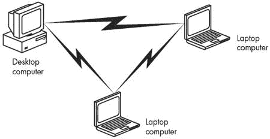
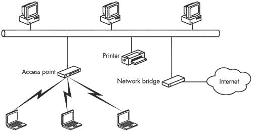

# 第三章 如何工作

无线以太网，更广为人知的 Wi-Fi，使用扩频无线电信号通过局域网分发计算机数据。本章描述了 Wi-Fi 网络的技术细节，包括 Wi-Fi 标准之间的差异以及网络结构。它还包括关于 Wi-Fi 接入点（也称为*基站*）和网络接口适配器的基本信息。

# Wi-Fi 网络控制

Wi-Fi 规范控制数据通过物理层（无线电链路）的方式，并定义了一个媒体访问控制（MAC）层，该层处理物理层与网络结构其余部分之间的接口。

## 物理层

在 802.11 网络中，无线电发射器为每个数据包添加一个 144 位前导码，其中 128 位用于接收器与发射器同步，以及一个 16 位的帧起始字段（一个*帧*是带有附加数据添加到比特串开始或结束的数据包）。随后是一个 48 位的头部，包含有关数据传输速度、数据包中包含的数据长度以及一个错误检查序列的信息。这个头部被称为 PHY 前导码，因为它控制通信链路的物理层（在 ISO 模型中）。

由于头部指定了其后数据的速度，因此前导码和头部始终以 1Mbps 的速度传输。因此，即使网络链路以全速 11Mbps 运行，实际的数据传输速度也会慢得多。实际上，你最多只能期望达到标称速度的大约 85%，而数据包中的其他开销类型还会进一步降低实际速度。

144 位前导码是来自较旧且较慢的 DSSS 系统的遗留物，它保留在规范中以确保 802.11 设备仍然与较旧的标准兼容，但它实际上并没有完成任何有用的任务。有一个可选的替代方案，使用较短的 72 位前导码。在短前导码中，同步字段有 56 位，与长前导码中使用的相同的 16 位帧起始字段相结合。72 位前导码与非常旧的 802.11 硬件不兼容，但在现代 Wi-Fi 网络中这并不重要，因为所有节点都能识别短前导码格式。在其他所有方面，短前导码与长前导码一样有效。

网络处理长前导码所需的最大时间为 192 毫秒，而处理短前导码的时间为 96 毫秒。换句话说，短前导码将每个数据包的开销减半。这在实际数据传输速度上产生了显著差异，尤其是在流媒体音频、视频和互联网语音服务等方面。

一些制造商将长前导作为默认设置，而另一些则使用短前导。通常可以在网络适配器和接入点的配置软件中更改前导长度。

对于大多数用户来说，前导长度是那些你不必理解的技术细节之一，只要网络中的所有设备都相同即可。十五年前，当电话调制解调器是最常见的连接一台计算机到另一台计算机的方式时，我们每次通过调制解调器打电话时都必须担心设置数据位和停止位。你可能从未真正知道停止位是什么（它是老式机械电传打印机在发送或接收每个字节后需要返回空闲状态所需的时间量），但你知道它必须在两端相同。前导长度是同一种神秘的设置：它必须在网络中的每个节点上相同，但大多数人既不知道也不关心它的含义。

## MAC 层

在 ISO 模型中，MAC 层（通常被视为数据链路层的一个子集）控制通过无线电网络移动的流量。它通过使用称为*载波侦听多路访问/碰撞避免（CSMA/CA）*的一组规则来防止数据冲突和冲突，并支持 802.11 标准中指定的安全功能。当网络包含多个接入点时，MAC 层将每个网络客户端与提供最佳信号质量的接入点关联起来。

当网络中的多个节点同时尝试传输数据时，CSMA/CA 指示除一个之外的所有冲突节点退避并稍后重试，并允许幸存的节点发送其数据包。CSMA/CA 的工作方式如下：当一个网络节点准备发送数据包时，它首先监听其他信号。如果没有听到任何东西，它等待一个随机（但短暂）的时间，然后再次监听。如果它仍然没有检测到信号，它就发送一个数据包。接收数据包的设备评估它，如果它完好无损，接收模式返回一个确认。但如果发送节点没有收到确认，它假设发生了与其他数据包的冲突，导致数据混乱，因此它等待另一个随机间隔然后再次尝试。

CSMA/CA 还有一个可选功能，将接入点（无线局域网和骨干网络之间的桥梁）设置为点协调器，可以给尝试发送时间敏感数据类型的网络节点（如语音或流媒体）赋予优先权。

MAC 层可以支持两种认证方式来确认网络设备有权加入网络：开放认证和共享密钥。当你配置网络时，网络中的所有节点必须使用相同的认证方式。网络通过在允许高层发送数据之前交换（或尝试交换）一系列控制帧来支持 MAC 层中的所有这些维护功能。它还在网络适配器上设置了一些选项：

+   网络支持两种电源模式：持续感知模式和省电轮询模式。在*持续感知模式*下，无线电接收器始终开启并消耗电力。在*省电轮询模式*下，无线电大部分时间处于空闲状态，但会定期轮询接入点以获取新消息。正如其名所示，省电轮询模式可以减少便携式设备如笔记本电脑和 PDA 的电池消耗。

+   网络包含访问控制，以防止未经授权的用户进入网络。Wi-Fi 网络可以使用两种形式的访问控制：*SSID*（网络名称）和*MAC 地址*（一个独特的字符字符串，用于标识每个网络节点）。每个网络节点都必须将其 SSID 编程进去，否则接入点将不会与该节点关联。可选的 MAC 地址表可以限制地址在列表中的无线电的访问。它控制有线等效隐私（WEP）或 Wi-Fi 保护接入（WPA）加密功能。WEP 加密可以使用 64 位或 128 位加密密钥对通过无线电链路传输的数据进行编码和解码；WPA 使用 128 位密钥和 48 位初始化向量（有关使用 Wi-Fi 加密的信息，请参阅第十二章显示了几个地点的 2.4 GHz 频率分配。

**表 3-1. 未经许可的 2.4 GHz 扩频频率分配**

| 区域 | ISM 频段 |
| --- | --- |
| 北美 | 2.4000–2.4835 GHz |
| 欧洲 | 2.4000–2.4835 GHz |
| 法国 | 2.4465–2.4835 GHz |
| 西班牙 | 2.445–2.475 GHz |
| 日本 | 2.471–2.497 GHz |

几乎世界上所有其他国家也使用这些频段之一。这些频率分配的微小差异并不特别重要（除非您计划在法国和西班牙或类似的不太可能的情况下跨境传输），因为大多数网络完全在单个国家或地区内运行，正常信号范围通常只有几百英尺。各种国家标准之间有足够的重叠，使得相同的设备可以在世界任何地方合法运行。您的设备可以使用哪些信道通常由其销售的国家决定，并且通常由制造商设置。

## 无线信道

特定无线网络使用的确切频率由其信道决定。在北美，Wi-Fi 设备使用 11 个 802.11b/g 信道。许多其他国家已授权 13 个信道，但日本使用 14 个信道，法国只有 4 个可用。幸运的是，全世界使用相同的信道编号集，因此纽约的 9 信道与东京或巴黎的 9 信道使用的是完全相同的频率。表 3-2 显示了不同国家和地区的信道使用情况。

**表 3-2. 无线以太网信道分配**

| 信道 | 频率 (GHz) | 使用于 |
| --- | --- | --- |
| 1 | 2.412 | 美国、^([a]). EMEA、^([b]). 中国、日本 |
| 2 | 2.417 | 美国、EMEA、中国、日本 |
| 3 | 2.422 | 美国、EMEA、以色列、中国、日本 |
| 4 | 2.427 | 美国、EMEA、以色列、中国、日本 |
| 5 | 2.432 | 美国、EMEA、以色列、中国、日本 |
| 6 | 2.437 | 美国、EMEA、以色列、中国、日本 |
| 7 | 2.442 | 美国、EMEA、以色列、中国、日本 |
| 8 | 2.447 | 美国、EMEA、以色列、中国、日本 |
| 9 | 2.452 | 美国、EMEA、以色列、中国、日本 |
| 10 | 2.457 | 美国、EMEA、法国、中国、日本 |
| 11 | 2.462 | 美国、EMEA、法国、中国、日本 |
| 12 | 2.467 | EMEA、法国、日本 |
| 13 | 2.472 | EMEA、法国、日本 |
| 14 | 2.484 | 日本 |

|

^([a]) 加拿大和一些西半球的其他国家使用与美国相同的信道分配

^([b]) *EMEA* 代表 *欧洲、中东和非洲*。法国是 EMEA 监管区域的一部分，但法国政府只允许在 10 至 14 信道上使用 Wi-Fi。

|

当您将网络适配器带出国时（如果适配器无法自动检测信号），可能需要将其设置为不同的信道编号，但只要您的适配器附近有网络，几乎总有一种连接方式。如果您不确定在另一个国家使用哪些信道，请咨询当地监管机构以获取具体信息。或者，您可以使用 10 和 11 信道，这两个信道在以色列以外的所有地方都是合法的。

## 减少干扰

注意，每个这些频道的指定频率实际上是 22 MHz 频道的中心频率。因此，每个频道与其上方和下方的几个其他频道重叠。整个 2.4 GHz 频段只能容纳三个完全独立的频道，所以如果你的网络运行在频道 4 上，例如，而你的邻居使用频道 5 或频道 6，每个网络都会将另一个网络的信号检测为干扰。两个网络都可以工作，但性能（如数据传输速度所示）将不如频道之间更广泛分离时的性能好。

为了最小化这种干扰，你应该尝试与其他附近的网络管理员（你的邻居运行他们自己的家庭 Wi-Fi 网络也算作网络管理员）协调频道使用。如果可能的话，每个网络应使用至少相隔 25 MHz 或五个频道号的频道。如果你试图消除两个网络之间的干扰，使用一个高频道号和一个低频道号。对于三个频道，你最好的选择是频道 1、6 和 11，如图 3-1 所示。对于超过三个网络，你可能必须忍受一些干扰，但通过在现有对之间分配一个新频道，你可以将其保持在最低限度。

**图 3-1. 频道 1、6 和 11 互不干扰。**

这听起来可能比实际可能发生的要严重。实际上，你可以通过远离附近有人使用的频道来优化你网络的性能，但即使你和你的邻居在相邻的频道上，你的网络可能仍然可以工作，尽管你的连接可能比在更广泛分离的频道上慢一些。除非你的邻居的网络非常繁忙，否则你可能会遇到更多来自使用 2.4 GHz 频段的其它设备的干扰问题，例如无绳电话和微波炉。

802.11a Wi-Fi 规范使用不同的无线电频率范围，如表 3-3 所示。每个频道宽度为 20 MHz，因此关于频道分离的类似规则适用。

**表 3-3. 802.11a Wi-Fi 频率**

| 频道号 | GHz 频率 | 使用于 |
| --- | --- | --- |
| 34 | 5.17 | 日本 |
| 36 | 5.18 | 北美，欧洲，新加坡 |
| 38 | 5.19 | 日本 |
| 40 | 5.20 | 北美，欧洲，新加坡 |
| 42 | 5.21 | 日本 |
| 44 | 5.22 | 北美，欧洲，新加坡 |
| 46 | 5.23 | 日本 |
| 48 | 5.24 | 北美，欧洲，新加坡 |
| 52 | 5.26 | 北美，台湾 |
| 56 | 5.28 | 北美，台湾 |
| 60 | 5.30 | 北美，台湾 |
| 64 | 5.32 | 北美，台湾 |

选择操作频道是网络运营商的责任。当你连接到现有的网络时，你的计算机或网络适配器将自动检测一个或多个 Wi-Fi 信号，并允许你选择你想要使用的信号。大多数 Wi-Fi 适配器和网络接口可以识别多个 Wi-Fi 协议，并为活动信号配置连接。例如，如果你的计算机同时发现 802.11a 信号和 802.11g 信号，你可以选择任何一个，而无需手动更改内部设置。

802.11 规范以及各个国家的监管机构（如美国的 FCC）也设定了 Wi-Fi 设备可以使用发射功率和天线增益的限制。这种限制旨在限制网络链路可以操作的距离，因此它允许更多网络使用相同的频道而不会相互干扰。我们将在第十章（第十章）中讨论绕过这些功率限制和扩展无线网络范围的方法，同时不违反法律。

# 无线网络设备

在定义了数据格式和无线电链接之后，下一步是设置网络结构。计算机如何使用无线电和数据格式来实际交换数据？

Wi-Fi 网络包括两类无线电：网络适配器和接入点。一个*网络适配器*连接到计算机或其他设备，如打印机，这些设备与无线网络交换数据。一个*接入点*是无线网络的基础站，是无线网络与传统有线网络之间的桥梁。

## 网络适配器

Wi-Fi 网络适配器可以采取几种物理形式：

**适合大多数笔记本电脑 PCMCIA 插槽的插件 PC 卡**

为了绕过大多数计算机内部的屏蔽，大多数无线 PC 卡适配器内置的天线和状态灯会伸出约一英寸，超过卡槽的开口。其他 PC 卡适配器有用于外部天线的插槽。

**桌面计算机内部 PCI 卡上的内置网络适配器**

大多数 PCI 适配器实际上是 PCMCIA 插槽，允许用户将 PC 卡插入计算机背面，但少数是直接安装在 PCI 扩展卡上的。作为后面板插槽的替代品，Actiontec 和其他几家制造商提供适合计算机外部前面板驱动器托架的单独 PCMCIA 插槽。

**外部 USB 适配器**

USB 适配器通常比 PC 卡或内置适配器更好，因为它们更容易安装，并且几乎总是更容易将适配器从电缆末端移动到最佳可能的无线电信号路径位置，以便与最近的接入点进行通信。

**笔记本电脑内置的内置无线适配器**

内部适配器是插入到计算机主板的模块。它们向操作系统呈现的外观与外部 PCMCIA 卡相同。内置无线电的天线通常隐藏在计算机的可折叠翻盖屏幕内部。

**用于 PDA 和其他手持设备的插件适配器**

PDA 和其他手持设备通常有可以接受多种类型扩展卡的扩展端口。通常，它们向操作系统呈现的外观与笔记本电脑中较大的扩展卡相同。PDA 和手持设备的适配器很少具有天线插孔。

**内置其他设备中的内部网络接口，例如具有互联网功能的电话机和办公室或家用电器**

今天，打印机、数码相机、互联网收音机、互联网电话（VoIP）、家庭娱乐系统以及许多其他设备都可以使用 Wi-Fi 链路发送和接收图像、音频和其他形式的数据。在未来，复杂的家用电器将在你的衣服干燥或烤肉达到理想温度时使用 Wi-Fi 传输状态信息。

网络适配器应该与任何操作系统一起工作，只要该适配器的驱动程序可用。在实践中，这意味着你可以找到几乎所有设备的 Windows 驱动程序，但如果你使用的是运行 Mac OS、Linux 或 Unix 的计算机，你的选择将更少。你可以在第七章中找到 Linux 和 Unix 驱动程序的来源，以及如何在第八章中使用 Wi-Fi 的信息。

### 多种网络类型适配器

在某些情况下，你可能希望在不同的地方使用不同类型的网络连接。例如，当你的笔记本电脑在你的办公室运行时，你希望它通过 Wi-Fi 链路连接到你的局域网，这样你就可以使用公司的高速互联网账户，与其他本地计算机交换文件和消息。但是当你带着同一台电脑上路时，你希望通过蜂窝数据服务连接到互联网。因此，如果你的电脑能够自动选择最适合你当前位置的连接，那将非常方便。

今天，改变网络类型唯一的方法是手动选择控制每种网络类型的软件；你可能还必须物理移除一个网络适配器并插入另一个。但是笔记本电脑和网络接口适配器的制造商正在解决这个问题，其中一些将在不久的将来提供单一的网络适配器和控制软件，该软件可以检测多种无线服务，并为你提供屏幕上的选择或自动选择最佳连接。

当您安装这些多服务适配器之一时，您可以设置自己的优先级列表；例如，您可能希望它首先查找您的家庭或办公室局域网，如果不可用，则设置连接到您的手机数据账户。

## 接入点

接入点通常与其他网络功能结合使用。完全有可能找到一个独立的接入点，只需通过数据线插入有线局域网即可，但还有许多其他选项。常见的接入点配置包括：

+   简单的基站，通过桥接到互联网端口以连接到局域网

+   基站包括一个带有一个或多个有线以太网端口的交换机、集线器或路由器，以及无线接入点

+   宽带路由器，在电缆调制解调器或 DSL 端口和无线接入点之间提供桥接

+   软件接入点，使用您计算机中的无线网络接口适配器作为基站

+   支持有限数量操作通道的家庭网关

接入点的物理设计因制造商而异。有些看起来像工业设备，旨在放置在地板上或安装在不太显眼的墙上，但其他（尤其是针对家庭网络市场的）具有流畅的、“空气动力学”形状，看起来是为咖啡桌顶部或更可能的是桌面计算机旁边设计的。有些具有内置天线，其他（如图 3-2

**图 3-2. 一个典型的 Wi-Fi 接入点，这个来自 Linksys**

## 构建网络

Wi-Fi 网络以两种模式运行：临时网络和基础设施网络。正如其名所示，临时网络通常是临时的。一个*临时网络*是一个独立的站点组，没有连接到更大的局域网或互联网。它包括两个或更多的无线站点，没有接入点或与世界其他部分的连接。临时网络也称为*对等网络*和*独立基本服务集（IBSS）*。图 3-3 展示了简单的临时网络。

**图 3-3. 一个包含三个站点的临时无线网络**

*基础设施网络*有一个或多个接入点，这些接入点几乎总是连接到有线网络。每个无线站都与接入点交换消息和数据，接入点再将它们转发到无线网络或其他有线局域网上的其他节点。任何需要通过接入点到打印机、文件服务器或互联网网关的有线连接的网络都是基础设施网络。图 3-4 显示了基础设施网络。

**图 3-4. 简单的基础设施网络**

只有一个基站的网络也称为*基本服务集（BSS）*。当无线网络使用两个或更多接入点时，网络结构是*扩展服务集（ESS）*。回想一下，网络 ID 的技术名称是*SSID*。如果你看到它被称为*BSSID*，那么网络只有一个接入点；如果它有两个或更多接入点，则称为*ESSID*。

一个包含多个接入点（一个 ESS）的网络会带来几个新的复杂问题。首先，网络必须有一种方式，只允许一个基站处理来自特定站点的数据，即使该站点位于多个基站的范围内。如果站点在网络会话期间移动，或者如果某种形式的本地干扰出现在第一个接入点附近，网络可能不得不将连接从某个接入点切换到另一个接入点。Wi-Fi 网络通过每次只将一个站点与一个接入点关联，并忽略未关联的站点的信号来处理这个问题。当一个接入点的信号减弱而另一个接入点的信号增强时，或者当流量量迫使网络重新平衡负载时，网络将重新将站点与一个新的接入点关联，该接入点可以提供可接受的服务。如果你认为这听起来很像蜂窝电话系统处理漫游的方式，你完全正确；甚至术语也是一样的——它也被称为*漫游*。

## 公共和私有网络

Wi-Fi 是一种未经许可的无线电服务，这意味着任何人都可以设置一个基站（许可的无线电服务通常需要昂贵的许可证，以便在特定地点以固定数量的年数运营无线电）。其中一些基站限制特定用户集的访问，但其他基站允许任何在无线电信号范围内的计算机建立连接。

当你的计算机搜索 Wi-Fi 信号时，它可能会找到多个活跃的网络；其中一些可能是私有网络，而另一些可能对任何想要使用它们的人都是可访问的。公共接入点，也称为*热点*，允许任何附近的计算机建立连接；一些需要付费账户，但许多其他地方，尤其是在学校图书馆等地方，是免费的（尽管它们可能需要登录名和密码）。

通常情况下，大多数私有网络应该有一个或多个安全功能，例如加密或 MAC 地址限制，以阻止未经授权的用户，但发现家庭和企业网络完全开放的情况并不少见，因为所有者从未麻烦过打开安全工具。我们将在第十二章中解释如何使用 MAC 地址限制和其他安全工具。

# 综合所有内容

无线电链路、数据结构和网络架构是构成 Wi-Fi 网络内部管道的三个基本要素。像大多数其他网络（以及大多数管道系统）的组件一样，这些元素应该对使用网络的人完全不可见——如果用户可以在网络上发送和接收消息、阅读文件以及执行其他活动，他们就不必担心低级细节。

当然，这假设它总是按照预期的方式完美工作，用户永远不会需要拨打网络帮助台询问为什么他们无法阅读电子邮件。现在你已经阅读了这一章，你可能比使用 Wi-Fi 网络的 95%的人更了解你的无线局域网是如何将信息从这里传输到那里的。而且你有很大机会理解那些告诉你确保使用频道 11，或者你需要更改前导长度，或者你的适配器正在基础设施模式下运行的支持人员。
