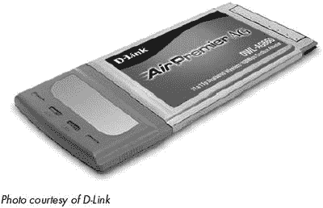
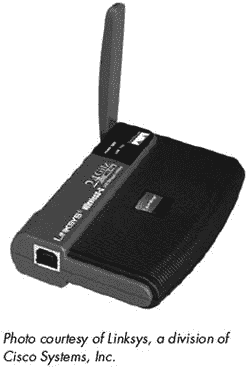
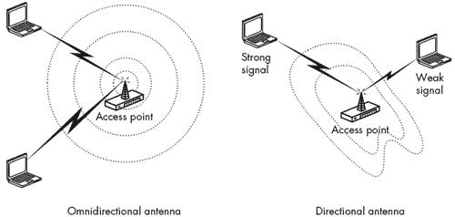
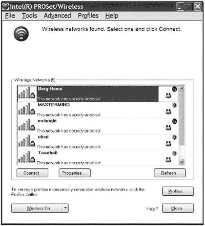
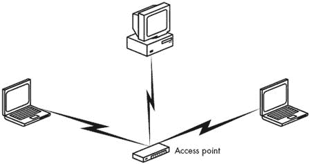
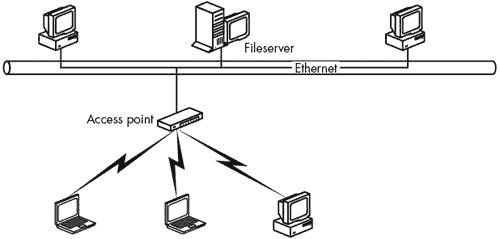
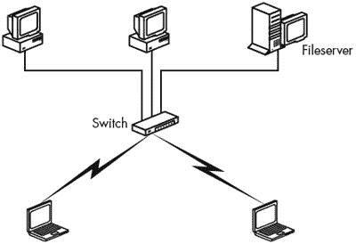
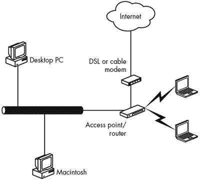
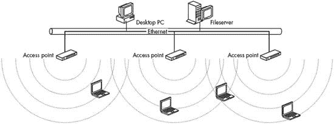

# 第四章：您需要的 Wi-Fi 硬件

无线局域网（LAN）显然需要与传统有线网络略有不同的硬件组件。本章描述了构成无线网络的组件，并提供了关于选择哪些组件最能满足您需求的建议。在阅读接入点、网络适配器和天线中功能和功能的描述时，请记住，无线网络设备的巿场既极端竞争，又快速变化。如果一个制造商提供具有热门新功能的接入点或网络适配器，您可以在几个月或更短的时间内期待在竞争产品中看到同样的功能。因此，本章不讨论特定品牌或型号；到您阅读这本书的时候，任何这样的推荐都会过时。

# 每个人都说同一种语言（或多或少）

在我们讨论具体的功能和特性之前，回顾一下使用来自多个制造商的设备在同一无线网络中的规则和现实情况可能是有用的。虽然可以做到，但这并不像 Wi-Fi 联盟的人所声称的那样简单。

数十家公司生产的设备符合 Wi-Fi 认证标准。为了获得这种认证，每个设备都必须通过联盟独立测试实验室的互操作性测试。如果一个接入点或网络适配器带有 Wi-Fi 标志，那么它已经通过了一系列广泛的测试，以确认它可以与来自几个其他供应商的先前认证硬件兼容。

来自不同制造商的接入点和网络适配器在外观上可能不同，每个制造商都提供自己的配置软件，但内部的无线电电路都相当相似。携带许多品牌名称的适配器实际上是由其他公司根据合同制造的，而且几乎每个人都使用几种标准芯片组中的一种。

换句话说，只要所有设备都遵循相同的规范（例如，802.11b、802.11a 或 802.11g），就可以在同一网络中使用任何组合的 Wi-Fi 认证适配器和接入点。最后一句中的关键词是*可能*。在实践中，认证实际上意味着一群对 Wi-Fi 网络内部工作方式非常熟悉的技术人员可以在严格控制实验室条件下，通过一系列精心设计的测试，使混合供应商的网络正常运行。

这是否意味着一个从未安装过无线网络的家庭主妇或小型企业的 IT 人员可以获取相同的产品组合来使其工作？哦，可能吧，但可能不是第一次尝试就能成功。可能需要花费大量时间和精力来设置所有配置选项为正确的值。几乎可以肯定的是，来自不同制造商的设备将具有不同的默认设置。例如，一些系统使用短的预置作为默认值，而其他系统使用长的预置；一些配置要求加密密钥为 ASCII 字符，但其他可能希望它们是十六进制。你可以让所有这些一起工作，但这可能是一种相当痛苦的经历。

通常情况下，将整个网络配备来自单一制造商的硬件要容易得多，因为配置设置和选项都将相同，但这并不总是可能，甚至可能不是最佳选择。你可以控制你自己的网络中接入点的品牌，你也可以为你的台式计算机购买相同品牌的网络适配器，但最终你的办公室网络中的某个用户（你可能能够预测到是谁，不是吗？）会拿着一个你从未听说过的制造商生产的 Wi-Fi 适配器来找你，并期望它能连接到你的网络。也许这个适配器是在一次车库拍卖或交换会上出现的，或者也许它是随一台闪亮的新笔记本电脑一起来的。或者也许它是你女儿的学校推荐的校园网络适配器。你对笔记本电脑内置的内部适配器或公共热点使用的基站的型号和品牌几乎没有或没有控制权。出于某种原因，你最终必须将来自多个制造商的硬件和软件集成到同一个网络中。

这本书中的信息将帮助你了解你需要做什么才能使一切协同工作，但当你自己构建 Wi-Fi 网络时，你可以通过使用单一来源的设备来减少头痛的数量。

### 注意

*还有一个要点需要在这里提及：当你购买 Wi-Fi 适配器时，你通常得到你所支付的。在大多数情况下，来自主要制造商的昂贵版本比它们成本较低的通用版本更有可能与各种基站兼容。高质量的无线电还可以帮助增强你的信号范围，并使该地区的更多基站可用*。

# 网络适配器

网络适配器是计算机和网络之间的接口。在无线网络中，适配器包含一个无线电发射器，它将数据从计算机发送到网络，以及一个接收器，它检测包含来自网络的数据的无线电信号并将其传递给计算机。计算机的操作系统将无线适配器视为任何其他网络接口一样。

如果你只计划使用 Wi-Fi 通过公共场所现有的 Wi-Fi 热点（如图书馆、咖啡馆等）将计算机连接到互联网，那么网络适配器（以及支持它的软件）是你需要添加到计算机的唯一新硬件。如果你想设置自己的家庭或办公室网络，你还需要一个或多个接入点。

内置 Wi-Fi 适配器是新笔记本电脑的标准功能。如果你的笔记本电脑已经配备了无线接口，那么通常没有必要更换它，直到新的 Wi-Fi 规范，如 802.11n 标准，可用——也许即使如此，如果你对现有设备满意，也不需要更换。因此，对于台式计算机和较老笔记本电脑的拥有者来说，选择新的适配器尤为重要。如果你有一台没有内置适配器的旧笔记本电脑，你可以通过在 PC 卡上安装插件适配器或连接 USB 适配器来添加 Wi-Fi 功能。

大多数新的 Wi-Fi 网络适配器会自动识别使用所有三种 Wi-Fi 规范（或 802.11n 发布后的所有四种规范）的信号。当适配器检测到接入点的信号时，它会识别信号类型，并使用相同的规范与该接入点交换数据。

在选择接口适配器时，你应该考虑几个因素：物理包装（外形尺寸），天线类型（内部还是外部？定向还是非定向？），与网络的接入点和网络中其他节点的兼容性，以及与计算机操作系统的兼容性。当然，你还应该考虑适用于任何计算机硬件或软件的所有标准问题：易用性、安全性、技术支持质量，以及其他用户对产品和公司的体验。

## 外形尺寸

在大多数情况下，无线适配器插入到计算机的一个高速 I/O 端口——无论是内部扩展卡插槽、笔记本电脑主板上的插座、PCMCIA（PC 卡）插座，还是 USB 端口。用于 PDA 的网络适配器通常适合于 CompactFlash 或 SDIO（安全数字输入/输出）插座。

每种类型的适配器都有其自身的优点和缺点。特定包装的选择取决于你将使用该适配器的计算机以及你预期的使用方式。例如，如果你想将笔记本电脑连接到网络，内部适配器或 PC 卡通常是最佳选择，因为它易于安装，占用空间小，且不需要携带特殊电缆。但在台式系统中，USB 适配器通常是一个更好的选择。

### 内置适配器

几乎所有新的笔记本电脑都在主板上安装了一个适配器模块，该模块直接安装在 mini-PCI 卡上，其中包含一个或多个天线，这些天线位于外壳的铰链部分内，该部分还装有显示屏。即使您选择通过订购不带适配器的笔记本电脑来节省金钱，电脑可能也有天线，因此您可以稍后安装 Wi-Fi 模块。

内置适配器的明显优势是它不会强迫用户携带（并且可能忘记或丢失）另一个配件，与电脑一起携带。如果有的话，缺点是当需要维修或更换原始机器时，不实际将相同的适配器移动到另一台电脑上。如果备份单元没有内置适配器（这是可能的，因为它可能比主单元更老），用户或网络管理员将不得不提供单独的 PC 卡适配器，通过 USB 线连接，或者在没有无线访问本地网络和互联网的情况下使用。

内置适配器会增加大约与在独立 PC 卡上购买 Wi-Fi 适配器相当的新笔记本电脑的成本。仅仅为了获得内置无线适配器而更换当前笔记本电脑是没有意义的，但当是时候寻找新电脑时，这是一个值得拥有的特性。

如果您的电脑确实有内置无线适配器，当您不使用它时，有一个简单的方法可以禁用该适配器。大多数笔记本电脑使用物理的开关或一对 FN 键来打开和关闭内置适配器。如果您不关闭它，当不使用时，无线电单元会比必要的更快地耗尽您的电脑电池，并且会产生可能干扰同一未授权 2.4 GHz 频率的其他用户的无线电信号。根据您的电脑使用的软件，无线无线电的持续运行也可能使您面临安全风险，因为您的电脑可能会在您不知情的情况下连接到网络。

内置适配器通过特殊的连接器安装在电脑的主板上，这些连接器用于内部天线。联想称这为*现场可更换单元（FRU）*；其他制造商对易于拆卸和更换的部件有类似的描述。当新的适配器支持 802.11n 规范以及其他适配器支持单张卡上的 Wi-Fi 和 3G 无线或 WiMAX 时，将有可能按照笔记本电脑制造商提供的说明移除现有适配器并安装新的适配器。

大多数笔记本电脑制造商限制您可以使用内部适配器，这些适配器必须经过制造商、FCC 和其他监管机构的认证。当您购买新的内部适配器时，请务必检查手册和您的电脑制造商的网站，以确保该型号适配器与您的笔记本电脑型号兼容，或者从制造您电脑的公司购买适配器。

### PC 卡

如果你的笔记本电脑没有内置 Wi-Fi 适配器，你可以在 PCMCIA 卡上添加一个。几乎每个 Wi-Fi 设备制造商在其产品线中至少有一款 PC 卡适配器。

PC 卡上的无线适配器体积紧凑，不会给便携式电脑增加太多重量，这两个都是重要特性。然而，当你不需要网络连接时，重要的是要从电脑上移除适配器。否则，适配器可能会继续辐射不需要的信号，并可能允许未经你知晓的入侵者连接到你的电脑。不使用的 Wi-Fi 适配器也会对电脑的电池造成微小但不必要的消耗。

PC 卡适配器看起来都差不多，因为它们都必须适合电脑的 PCMCIA 插槽。然而，一些适配器比其他适配器具有更多功能和更好的性能。再次强调，你通常得到的是你所付出的。正如图 4-1 所示，它们的大小大约和信用卡一样，一端有一个多针连接器，另一端有一个塑料盖用于内部天线或用于外部天线的连接器。

**图 4-1. 带有内置天线的 D-Link 无线以太网适配器**

PC 卡主要有两种类型。*PCMCIA*，原始标准，是一种较慢的 16 位卡。在较老的笔记本电脑上找到，PCMCIA 插槽只能支持 802.11b 速度。更现代的笔记本电脑支持*CardBus*，其外观几乎与 PCMCIA 连接器相同，但支持更高速度的 32 位卡，如 802.11a/g/n。从 1990 年代末购买的笔记本电脑应该有 CardBus 支持。2006 年之后的笔记本电脑可能有一个第三种类型的适配器插槽，称为*ExpressCard*，要么作为 PC 卡插槽的替代品，要么作为额外功能。这个高速插槽使用物理上不同的卡，并且与之前的卡不兼容。

大多数 PC 卡适配器在其超出 PCMCIA 插槽末端的适配器部分包含一个或两个指示灯。其中一个指示灯在适配器从电脑接收电源时亮起，另一个指示灯在适配器检测到来自接入点或自组织网络中另一个节点的活动无线链路时亮起。

许多 PC 卡适配器包含两个内部天线和一个分集系统，该系统不断比较来自每个天线的接收信号质量，并自动选择更强的信号。尽管 PC 卡内的两个天线只有一英寸或两英寸的距离，但与单个天线相比，改进可能是显著的。

PC 卡上的网络适配器通常具有内置的全向多天线，但一些制造商也提供带有外部天线连接器的版本。选择内置天线还是外部天线始终是一个权衡。在大多数情况下，内置天线对于便携式计算机来说更容易使用，因为它不会强迫您携带单独的天线和电缆。但调整电缆末端天线的确切位置比调整您必须放置在可以舒适地看到屏幕和触摸键盘的位置的计算机的侧面或背面要容易得多。如果您想从网络覆盖范围的边缘连接到接入点，或者您在干扰很大的位置操作，一个单独的高增益定向天线可以比大多数 PC 卡上的天线提供更好的和更可靠的网络性能。如果您的常用 PC 卡适配器没有外部天线输入连接器，您可能想在尝试从边缘位置连接时将其移除，并使用带有高增益天线的 USB 适配器。

### USB 适配器

如果您的计算机有 USB（通用串行总线）端口，就像自 1999 年以来大多数台式机和笔记本电脑所做的那样，无线 USB 适配器可能是将其连接到 Wi-Fi 网络的最佳方式。适配器通过电缆连接到计算机，或者直接插入计算机本身，因此将整个适配器（包括内置天线）移动到提供最佳网络性能的位置永远不会成为问题。即使最佳位置是在书架或文件柜上，或者在您计算机桌下的地板上，适配器的位置也不会干扰您使用计算机的能力。将 USB 适配器连接到台式计算机比在内部扩展卡上使用适配器要容易得多，因为您不需要拆开计算机来安装 USB 设备。

USB 适配器的形状和尺寸多种多样，这取决于制造商的设计和营销理念。大多数 USB 适配器都有固定天线，通常安装在铰链或万向节上，允许用户对它们的位置进行精细调整。由于 USB 适配器上的天线通常比 PC 卡适配器上的天线更大且更容易操作，因此您可以通过 USB 设备获得更好的信号质量（但请记住，您不会在提供全速连接的阈值以上注意到任何改进）。

图 4-2 展示了由 Linksys 制造的带铰链天线的无线 USB 适配器。与 PC 卡上的适配器一样，大多数 USB 适配器从计算机获取电源，因此不需要单独的电池或外部电源。

其他 USB Wi-Fi 适配器是类似于闪存盘的紧凑模块，如图图 4-3 所示。这些适配器体积小，容易放入便携式计算机的包中，作为 PC 卡的替代品，但它们通常具有较低的最大发射功率，这意味着信号范围不如 PC 卡或更大的 USB 适配器，因此在接收条件较差的情况下，它们比其他适配器更容易断开连接。

**图 4-2. 无线 USB 适配器是独立的设备，通过电缆连接到计算机。**

**图 4-3. 紧凑型 USB Wi-Fi 适配器体积小且方便，但可能不如其他适配器传输距离远。**

### 台式计算机的扩展卡

许多台式机的内部无线适配器实际上是安装在 PCMCIA 插槽中的 PC 卡，这些插槽适合计算机主板上 PCI 扩展槽。适配器安装在计算机背面的一个安装板上。这种方法为制造商提供了几个优点：他们可以使用与笔记本电脑分开销售的相同 PC 卡适配器，并结合从第三方获得并重新标记的插槽，PC 卡的金属外壳提供了一个有效的屏蔽，将无线电信号远离计算机内部。

但找到一个比无线适配器天线位置更差的地方可能很难。如果适配器有内置天线，您无法轻松将其移动到不同的位置以改善信号质量；如果适配器有天线插座，天线电缆（或天线本身）很可能会与计算机的其他电缆纠缠在一起。卡片从计算机机箱背面突出，您无法看到指示灯。大多数台式计算机的背面通常是其他电缆和连接器的混乱之地，所有这些都可能影响无线电的辐射模式。而且，计算机的金属背板可能充当适配器与最近接入点之间障碍物或多径干扰的来源。当然，尽管存在所有这些潜在问题，PCI 适配器可能仍然能够完美无缺地工作，这是完全可能的。但在您在自己的网络中实际尝试之前，不要假设它不会工作，尤其是当适配器与您的计算机一起提供时。但是，当您向现有的台式计算机添加 Wi-Fi 时，USB 适配器几乎总是更好的选择，因为它更灵活且更容易安装。

如果你确实遇到了连接问题，有几种方法可以绕过它们。如果电脑有 USB 端口，移除（或关闭）内置适配器并安装无线 USB 适配器是明显的解决方案。即使电脑外部没有 USB 端口，主板可能也有 USB 端口；如果有，你可以使用一根便宜的电缆和支架将端口引出到背板。对于没有 USB 端口的老式主板，你需要一块带有一个或多个附加 USB 端口的扩展卡。

如果信号质量有问题，请寻找具有外接天线连接器的适配器，而不是适配器本身内置的天线。Buffalo 和 Proxim Wireless 等公司提供带有外接天线连接器的适配器。

如果您坚持使用内置适配器，您可能想考虑在台式机或塔式计算机网络的前面安装一个 PC 卡读卡器或插座，以及一个单独的 PC 卡适配器，而不是背板上的插座。这使得适配器比在电脑后面更容易触及，并且将适配器从电脑后面的一团乱线和其他插头中移开。Actiontec PC750 是最广泛可用的前置 PC 卡读卡器之一。

### 注意

*当你购买 PC 卡读卡器时，请确保它是为与网络适配器一起工作而设计的，而不仅仅是与闪存卡和其他存储设备一起工作*。

## 内置天线与外置天线

大多数无线网络适配器都配备了固定全向天线。对于大多数用户在大多数情况下，这些内置天线在接入点和附近电脑之间发送和接收强大的、干净的数据流。但如果内置天线的网络适配器由于距离、障碍物或其他无线电信号的干扰而无法提供足够的信号，外置天线可能是解决问题的最佳方式。一般来说，您可以期望外置天线提供的信号至少比 PC 卡适配器内置的天线强 15%；特殊的高增益定向天线可以提供更好的性能。这相当于要么数据交换速度更快，要么电脑和接入点之间的最大距离更大。

如果你确定你的覆盖区域内有盲点，对于留在该位置的电脑，使用带有外接天线连接器而不是内置天线的网络适配器可能是正确的选择。但在登录到网络之前设置一个单独的天线要麻烦得多，所以带有内置天线的 PC 卡通常是笔记本电脑和其他便携式设备的最佳选择。

作为外置天线的替代品，可以考虑带有内置天线的 USB 适配器。您可以将适配器放置在 USB 电缆长度内任何位置，并移动它以找到最佳信号。

记住，在基站和无线网络适配器之间有两条天线——一个在接入点，一个在电脑上。两端的高增益天线将对链路产生相同的影响，因此当您操作自己的网络时，更换接入点或网络接口的标准天线将同样有效。然而，方向性天线会将大部分信号集中在单一方向，因此方向性接入点天线可能会降低与其他网络节点之间的链路质量，如图图 4-4 所示。

**图 4-4. 不同方向性和非方向性天线的组合可以改变网络的覆盖范围。**

您可以在本章后面找到有关外部天线的更多信息。

## 兼容性

Wi-Fi 认证本应确保不同制造商的网络适配器和接入点可以无缝协作。但有一些功能和配置选项可能会使某些硬件组合之间的数据交换变得困难或不可能。例如，一些设备配备了 128 位加密密钥，但其他设备使用 64 位密钥。如果一个接入点期望 128 位，它将无法与较小的密钥一起工作。

避免这种情况的最简单方法是购买所有硬件来自同一来源，并确保您没有使用不兼容的型号（例如具有专有“涡轮”功能的网络卡）。否则，仔细阅读规格说明，在收到新组件后立即将其与您的网络（以及一个或多个公共热点）的其他部分进行测试，并确保您的供应商会接受不兼容的退货。

使用新 802.11n（预-n）标准预发布版本的适配器和接入点可能会因为每个公司都在使用其对新版本确切规格的最佳猜测而与来自其他制造商的设备出现兼容性问题。因此，除非您完全控制所有将连接到您的网络的所有电脑，否则最好避免使用预-n 设备。即使您这样做，也要记住，在最终标准被采用后，您可能需要升级或更换您的预-n 设备。那些宣传可升级到最终 802.11n 标准的设备可能比那些不宣传的设备更好，因为这意味着您以后不必购买新硬件。

## 为您的适配器寻找驱动程序

就像你与电脑一起使用的其他任何外围设备一样，无线网络适配器需要特定的驱动软件，这些软件包含允许适配器与电脑中央处理器交换数据的控件和接口。你可以安全地假设适配器提供的软件光盘包括适用于 Microsoft Windows XP 的驱动程序，可能还包括适用于 Windows Vista 的驱动程序，但如果你要连接到网络的电脑使用 Linux 或某种 Unix 变体，这就没有任何帮助了。如果你是 Macintosh 用户，Apple 的 AirPort 系列适配器通常是最佳选择。

如果你没有随网络适配器一起获得正确的驱动软件，你将不得不在其他地方寻找，或者选择一个支持你操作系统的不同适配器。首先应该查看的是制造商的技术支持网站，那里可能提供各种免费下载的驱动程序。如果你在那里找不到任何东西，可以向制造商的技术支持中心发送信息请求；他们可能知道适用于你操作系统的第三方驱动程序，或者邀请你帮助他们测试他们尚未发布的新的驱动程序。如果这也不行，尝试在线搜索 *<适配器制造商和型号> <操作系统> 驱动程序*。

如果你使用的是 Windows 系统，当你从 Windows XP（或更早版本）升级到 Windows Vista 时，你必须安装新的驱动程序。一些驱动程序包含在 Windows Vista 软件包中，但许多其他驱动程序在 Vista 发布时还未可用。再次强调，获取新驱动程序的最佳来源是适配器制造商的网站。如果你的笔记本电脑有内置适配器，请在笔记本电脑制造商或进口商维护的网站上寻找新的驱动程序。

大多数制造商都与微软紧密合作，当有新的驱动程序可用时，他们通常通过 Windows Update 网站分发。这是微软分发其自身更新和补丁的同一网站，但自动更新功能不会加载新的驱动程序，除非你明确请求它们。

要检查新的驱动程序，请按照以下步骤操作：

1.  打开你的 Internet Explorer 网络浏览器。

1.  从工具菜单中选择 **Windows Update**。将出现微软更新网页。

1.  如果你之前没有使用过更新工具，它将提供加载和安装更新软件的选项。请继续加载它。

1.  当出现如图 4-5 所示的欢迎页面时，点击 **自定义** 按钮。

    

    **图 4-5. 使用自定义按钮搜索新的驱动程序。**

1.  更新工具将检查你的系统，并最终显示新更新的列表。

1.  在网页左侧的列中，寻找带有括号内可用更新数量的 *硬件，可选（n）*，点击 **硬件** 链接可以查看网络适配器和其他连接到您计算机的设备的可用更新列表。

1.  在您想要安装的每个更新旁边的框内添加勾选标记。同时，您可以查看 *高优先级* 和 *软件，可选* 列表，并选择您想要安装的选项；它们可能会提高计算机的整体性能。

1.  点击列表顶部的 **审查** 和 **安装** 更新链接，并按照屏幕上的说明下载和安装更新软件。

1.  如果更新工具指示您这样做，请重新启动计算机。

如果适配器制造商或微软都无法帮助您，请不要放弃。许多适配器包含类似的内部电路，因此可能可以使用为不同品牌创建的适配器上的驱动程序。例如，Xircom CWE1100 适配器使用与思科类似适配器相同的驱动程序。请参阅 第七章 以获取用户组和在线存档中的 Linux 和 Unix 驱动程序来源。如果没有驱动程序，您的适配器仅作为镇纸有用。如果您找不到适合您操作系统的正确驱动程序，请寻找不同的适配器。这不应该成为问题，除非您使用的是非常旧或非常便宜的适配器，在这种情况下，新适配器几乎肯定比您旧的低端产品提供更多功能和更好的性能。

## 易用性

每个无线适配器都附带一个实用程序，该程序可以检测附近的 Wi-Fi 信号，并设置操作模式（基础设施或自组织），信道号，以及必须与同一网络上的其他节点设置相匹配的所有其他配置选项。

### 注意

*始终在适配器制造商的网站上寻找最新的软件和驱动程序更新。如果适配器或其附带印刷材料上没有打印网址，请使用 Google 或其他在线搜索工具查找*。

作为适配器制造商配置程序的替代方案，Microsoft 在 Windows XP 和 Windows Vista 中都包含了一个通用的 Wi-Fi 程序，许多笔记本电脑制造商也提供自己的配置软件作为新计算机提供的定制软件包的一部分。因此，您可能有两种或三种不同的方法来完成同一件事。图图 4-6, 图 4-7, 和图 4-8 展示了联想 ThinkPad 笔记本电脑提供的三个程序。

这三个程序执行相同的工作——管理 Wi-Fi 连接，但它们以不同的方式呈现可选设置和状态信息。有些使用一个窗口，所有选项都在一个地方，而有些将内容分成几个独立的部分。有些以数值形式显示信号强度和质量，但有些以图形形式显示相同的数据。

在理想条件下，用户无需查看配置工具的内部工作原理，因为大多数现代 Wi-Fi 软件会自动将适配器的设置与每个接入点或自组织网络接收到的信号相匹配。配置工具和状态显示都应该易于理解和使用。它们都包含相同的信息和选项，因此选择取决于主观评估：您能否通过查看配置窗口来理解如何选择连接？状态显示是否让您一眼就能知道您是否有可用的网络连接？

**图 4-6.** Intel 提供的 Wi-Fi 配置程序与其许多笔记本电脑中的 mini-PCI Wi-Fi 适配器一起提供。

**图 4-7.** Windows XP 中的 Microsoft 网络连接和网络连接属性程序控制 Wi-Fi 配置设置。Windows Vista 中也包含类似的程序。

**圖 4-8. ThinkPad 笔记本电脑還包括另一種查找和使用 Wi-Fi 網絡的方法。**

## 保护您的网络

802.11b 規範包括一種稱為 WEP（線路等價隱私）的安全方案，該方案使用 64 位或 128 位加密鍵。不幸的是，WEP 加密標準充滿漏洞，因此不足以真正保護您的網絡免受未經授權用戶的訪問。較新的 WPA（Wi-Fi 保護訪問）加密方法比 WEP 更安全，但它並不完美。當您購買新的網絡卡或接入點時，請尋找支持 WPA 加密的產品。

第十二章包含更多關於設置和使用無線網絡安全功能的詳細信息。最佳選擇，特別是如果您網絡有多個品牌的網絡卡和接入點時，幾乎總是使用第十二章中描述的附加安全方法之一，與 WEP 或 WPA 加密一起使用。

## 文檔和技術支持

每個生產和銷售 Wi-Fi 硬體的公司都為其用戶提供某種技術支持。然而，這種支持的质量和有用性在不同的供應商之間相差很大。如果您無法從製造商那裡獲得您需要的資訊，您應該尋找另一個供應商。

至少，足够的技術支持應該包括一份準確且清晰撰寫的使用手冊，一個通過電話和電子郵件回答特定問題的客服中心，一個提供常見問題解答的網站，以及一個提供最新版本的設備驅動程式、配置工具和狀態顯示軟件的下載中心。

每個網絡卡和接入點都應該附帶一份詳細的使用手冊，其中包含安裝、配置和使用設備的清晰說明。在購買任何計算機設備之前查看手冊總是一個好主意；對於含有令人困惑的指示或看起來似乎是由某個母語為高爾語的神秘方言的人從當地語言翻譯的文本，沒有任何借口。

即使是最偉大的手冊也無法包含所有可能的問題答案，因此應該也可以通過電話或發送電子郵件到技術支持中心。當技術支持有免費電話號碼時總是令人愉快，但這不是必需的——您可能為了支持這項“免費”服務而支付了更多的產品價格。您應該能在一分鐘或兩分鐘內聯繫到實際的人員技術員，或者如果您在繁忙時段打電話，您應該能在幾小時內留下您的電話號碼以等待回電。永遠沒有理由無休止地等待（無論是否有悅耳的音樂），或者無法理解的自動菜單永遠沒有您特定問題的答案。

当你通过电子邮件发送问题时，你应该在一小时或更短的时间内收到确认，即使只是一个自动的“感谢你的问题。我们将尽快回复完整的答案。”你应该期望在下一个工作日之前得到你的问题的答案。

当然，回答你问题的人应该提供实际解决问题的信息。错误的信息比没有信息更糟。

大多数计算机硬件和软件公司都拥有技术支持网站，这些网站包含了他们从用户那里收到的最常见问题的答案。如果你在需要快速答案时可以访问网络，那么这通常是找到答案最不痛苦的方式。该网站还应包括一个下载中心，你可以在这里找到公司销售过的所有产品的最新驱动程序和相关软件的副本，包括已停产的型号。

## 声誉

在你花费自己的钱之前，了解其他人使用无线适配器（或你打算购买的其他任何东西）的经验几乎总是有帮助的。制造商和想要销售该产品的经销商都乐于告诉你所有积极的特性，但你不能期望他们完全客观。

本地用户组、发布的产品评论和互联网讨论都可以是关于 Wi-Fi 设备信息的有用来源。并不是每个评论和每个恐怖故事都值得全盘接受，但当你看到或听到关于某个驱动程序导致 Windows 崩溃或 PC 卡过热的报告有十几个或更多时，你通常可以假设某种模式正在出现。Practically Networked 网站（[`www.practicallynetworked.com/list.asp`](http://www.practicallynetworked.com/list.asp)）是查找 Wi-Fi 设备评论和用户评价的一个好地方。

至少有一家主要的无线网络设备供应商因技术支持差而声名狼藉——通过电话等待技术支持人员的时间很长，等待电子邮件回复的时间更长，而且经常得到的答案并不有帮助。在竞争如此激烈的 Wi-Fi 市场中，你不需要忍受一个不（或不能）提供良好支持的公司。

# Ad Hoc 网络的适配器

在一个 ad hoc 网络中，每个网络适配器都通过直接链接与每个其他节点交换数据，而不需要一个接入点作为中心节点。Ad hoc 网络适用于小型、孤立的网络和直接的点对点文件共享。例如，一个在出差时使用笔记本电脑，在办公室使用台式电脑的人可以设置一个 ad hoc 网络来在两者之间传输文件。或者，两个笔记本电脑用户可能使用 ad hoc 连接来共享文件。

不使用接入点连接两个或更多网络节点的临时无线网络比基础设施网络要少得多，但它们是 802.11 规范的一部分。因此，几乎每个网络接口适配器和无线配置程序都提供临时网络选项。

通常，任何带有 Wi-Fi 标志的网络适配器在临时网络中都能很好地工作。确保网络中的所有节点都配置为临时操作，并且所有其他配置选项也匹配是很重要的。直接连接到另一台计算机应该不会比连接到接入点更困难。

规范没有为临时网络上的 802.11g 速度提供标准；然而，一些制造商支持更高的速度，而另一些则坚持规范中描述的 11Mbit 限制。一般来说，如果您需要一个永久网络的 802.11g 高速，临时网络不是最佳选择。

# 双用途适配器

Wi-Fi 网络非常受欢迎，但并不是唯一的无线技术。还有其他几个系统可用，包括提供非常短距离连接的蓝牙，用于计算机外围设备和配件，如耳机和键盘，以及我们在第十三章中将要讨论的 3G 移动数据服务。每个都为不同的问题集提供解决方案，并填补不同的市场细分。

几家制造商宣布了将 Wi-Fi 网络接口适配器与其他无线服务接口结合的新产品。一些可以检测并使用 Wi-Fi 网络和蓝牙。还有一些可能将 Wi-Fi 局域网的访问与 3G 蜂窝数据或 WiMAX 结合。组合网络接口的好处很明显——一个设备比两个设备更方便携带和安装，并且它提供了访问更多网络和服务。而且，由于相同的无线电发射器和接收器处理两种服务，干扰的可能性也降低了。

一个理想的两种服务网络适配器会自动检测范围内所有兼容网络的无线电信号，并允许用户设置与其中任何一个的即时连接，无论网络使用的是哪种链接类型。这种组合适配器的成本应该仅略高于仅识别一种网络协议的适配器的价格。这种完美的无线网络设备可能在未来几年内出现。

最新的 PDA 设备，如苹果的 iPhone，几乎达到了这个理想状态。当设备处于高速 Wi-Fi 信号范围内时，它会自动连接。但如果没有 Wi-Fi 信号，设备会使用较慢的 3G 网络。

如果你知道你将使用适配器支持的两种网络服务，那么双模适配器的额外成本可能是合理的。像大多数其他电子设备一样，这些适配器的价格会随着时间的推移而降低，所以除非你立即需要它，否则没有太多理由购买。

# 接入点

大多数无线网络接口适配器仅执行一个功能：它们在计算机和网络之间交换数据。但接入点提供了广泛的功能和特性。它们可以作为简单的接入点提供，也可以与集线器、交换机和路由器结合使用，以便为附近的计算机和其他设备提供有线连接。还有一类针对家庭网络的无线接入点，称为*家庭网关*。

接入点的物理设计不如接口适配器的设计重要，因为接入点不需要适应计算机的卡槽或扩展槽。有些接入点被安装在简单的长方形盒子中，而有些则安装在形状奇特的机箱中，可能看起来更独特。包装的外观不如内部的功能和特性重要，尤其是在接入点将被放置在衣柜或隐藏在假天花板后面时。无论形状如何，大多数接入点都包括用于将设备固定在墙上或架子上的安装板、支架或其他硬件。

在选择接入点时，你可能还希望寻找一些其他的一般特性。如果你的现场调查告诉你需要高增益天线，或者你想要将天线放置在户外或其他隔离位置，你应该使用带有外部天线连接器的接入点，而不是永久安装的固定天线。在一个计划同时使用多个无线电信道的繁忙网络中，一个包含两个无线电模块的单个接入点可以替代两个单独的接入点。如果你的接入点最佳位置不靠近电源插座，请选择提供可选的*以太网供电*或*活动以太网*功能的型号。

选择适合您网络的接入点类型最好的方法是决定您可能需要哪种类型的连接。你是要向现有的有线网络添加无线接入吗？或者你想要在无线服务的同时提供一些新的有线链路？你想要使用无线网络来共享互联网接入吗？所有这些问题的答案都将帮助您选择适合您网络的正确接入点。

## 运行标准

当你为家庭或办公室设计一个新的 Wi-Fi 网络时，你还可以为将连接到网络的每台计算机选择网络适配器，你可以使用只支持 Wi-Fi 标准之一的接入点。但如果你想要为访客或公众提供 Wi-Fi 访问，你的基站应该支持尽可能多的标准。一些制造商提供双频段接入点或路由器，可以产生 802.11a 和 802.11g 信号（802.11g 接入点也可以与 802.11b 适配器一起工作）。例如，图 4-9 中所示的 Linksys 路由器使用所有三种标准提供访问。

**图 4-9. Linksys WRT55AG 双频段无线路由器使用 802.11a 和 802.11g 信号**

## 纯无线局域网

当一个局域网中的所有节点通过无线电交换数据时，接入点充当一个中心控制点，就像图 4-10 所示，起到集线器的作用。严格来说，这种网络中的接入点除了提供对其他无线节点的访问外，不提供任何其他访问。这种无线连接是任何接入点的基本功能之一，因此你应该选择最简单且最经济的模型，以确保覆盖区域内有可用的信号。

**图 4-10. 无任何外部连接的简单无线网络**

这种简单的无线网络是可能的，但几乎没有理由在纯无线局域网中使用接入点。你可以在不需要通过中心集线器的情况下，通过一个对等无线网络完成相同的事情，该网络创建直接点对点链接。纯无线基础设施网络（带有接入点）可能唯一合理的情况是，当你预计将开始使用无线链接，并且后来将网络扩展到包括文件服务器、共享互联网连接或更多计算机和工作站。

## 有线局域网的无线接入

任何接入点都可以作为基站，为现有的有线局域网添加无线链接，就像图 4-11 中所示。接入点对网络其他部分呈现的外观与连接有线节点到网络的辅助集线器或交换机相同。

**图 4-11. 一个无线接入点连接到有线以太网网络**

在这种混合有线和无线局域网中，网络上的每个设备都可以与其他网络节点交换数据，无论其连接方式如何。一个特定设备是否通过有线或无线链路连接到局域网无关紧要，它都是一个无缝的网络。

作为网络有线和无线部分之间桥接点的接入点通常有一个单独的 10Mbps 或 100Mbps RJ-45 以太网端口，用于连接有线局域网的电缆。在高端设备中，通常还有一个额外的串行或 USB 端口，供网络管理员使用以输入配置命令和接收状态信息。

## 将接入点与有线集线器结合

在一个包含有线连接和无线链路的新局域网中，最佳方法可能是一个将无线接入点与有线集线器或交换机的功能结合在一起的单个设备，如图图 4-12 所示。这种类型的接入点有时被称为宽带路由器。

**图 4-12. 一个无线接入点与宽带交换机结合，控制混合网络的无线和有线部分。**

宽带路由器通常具有三种类型的网络连接：

+   用于连接配备无线以太网适配器的计算机的无线电链路

+   一个或多个以太网端口，用于连接具有网络接口卡的计算机的有线连接

+   宽带广域网（WAN）端口，用于将路由器连接到网络骨干或用于将路由器与额外的集线器或交换机堆叠

一些路由器还包括一个可以将文档直接发送到网络打印机的打印服务器。

将接入点和集线器结合使用的主要优点是在家庭办公室或小型企业中方便和经济，在这些地方容易将电缆连接到一些网络计算机。这种组合单元也可能是将现有网络扩展到远程位置的有线和无线节点最快的途径。

## 宽带网关

宽带网关是一个包含用于直接连接到 DSL 或电缆调制解调器的端口的接入点，它提供高速互联网接入，如图图 4-13 所示。一些网关设备还包括几个 RJ-45 以太网端口，用于连接到本地计算机的有线连接。

**图 4-13. 一个与宽带网关结合的接入点支持共享高速互联网连接的无线网络。**

这种方法在家用网络或小型企业中最实用，因为宽带互联网服务的入口一直延伸到办公室，而不是在服务入口或电话间停止，因为接入点必须放置在最佳位置以提供无线网络覆盖。

## 多个接入点

单个接入点可以完全满足在一个开阔、相对较小的空间内支持无线局域网的需求，该空间流量适中。但是，当您的网络必须覆盖一个非常大的区域（直径大于约 100 英尺），或者空间被墙壁、家具或其他物体阻挡，或者受到其他无线电干扰时，您可能需要添加更多的接入点。

Wi-Fi 规范包括一个漫游功能，当通过新接入点的信号质量优于原始连接时，它会自动将网络链接从一点切换到另一点。大多数家庭网络和许多非常小的企业网络只需要一个接入点，因此选择支持漫游的接入点对于大型和复杂网络的管理者来说才是一个问题。

网络客户端与接入点关联后，它会自动调查所有其他无线电频道，以确定是否有其他在另一频道上运行的接入点能提供比当前使用更强的或更清晰的信号。当客户端找到一个可以支持比当前连接更快链接的频道时，它会断开旧的关联，并立即与最佳可用信号源关联。

因此，覆盖区域重叠的接入点应设置为不同的频道号。为了使相邻接入点之间的干扰最小化，任何相邻接入点的频道号应至少相差五个频道。

在大多数情况下，网络客户端不会与不同的接入点关联，除非客户端在网络链接活跃时移动到另一个位置，或者当前频道的流量增加。换句话说，当用户携带笔记本电脑或 PDA 从一个地方移动到另一个地方，并且网络需要在所有可用接入点之间平衡负载时，才会发生切换。

如图 4-14 所示，所有接入点必须通过可能还包括不需要无线连接的额外计算机和服务器的一般有线局域网连接在一起。

在大多数情况下，多个接入点应放置以提供大约 30%的重叠覆盖范围，从一点到下一点的覆盖范围。但是，当你的无线网络必须支持大量同时用户时，平衡负载的最佳方式可能是将两个或更多接入点安装在同一位置，每个接入点设置为不同的、不干扰的无线电频道。

**图 4-14. 有线局域网上的多个接入点允许无线用户在整个更大的覆盖区域内漫游，这个范围是任何单个接入点本身无法实现的。**

漫游由 Wi-Fi 标准覆盖，因此应该可以在同一网络中使用不同品牌的接入点。它们都应该能够协同工作。但是，每个接入点都包含专有的配置实用程序，并且每个可能都有略微不同的设计，因此仅使用一个品牌接入点的网络几乎总是比混合网络更容易配置和使用。构建无线网络已经足够复杂；消除可能的混淆来源总是一个好主意。

## 增强性能接入点

几个制造商提供带有增强功能和特殊特性的接入点和路由器，这些特性可以改善在困难环境中的信号质量或性能。例如，你可能看到宣传为*扩展范围*或*高速*接入点的设备。这些系统通过将数据分成两个或更多并行流，并在同一时间通过多个频道传输这些流来提高性能。

如果这些增强型接入点来自主要制造商，它们可能的表现正如广告所宣称的那样，但在你做出承诺之前，寻找来自杂志和网站的独立评论总是一个好主意。这些接入点承诺的改进性能只有在使用兼容的网络适配器时才会出现，而这个适配器可能只由构建接入点的同一制造商生产。当你尝试从任何其他网络设备连接到增强型接入点时，网络性能不会比没有增强功能的更便宜接入点更好。

# 外置天线

如果你能够使用网络适配器内置的天线和接入点附带的固定天线，在任何网络覆盖区域内的位置建立可靠的高速数据链路，那么你完全没有理由浪费时间、金钱或能量在外部天线上。当你达到最大可能的速度时，更好的天线不会使数据传输更快。

但当接收条件不太理想，并且当你想要尽可能远地推送无线电信号时，一个单独的天线可以穿透干扰，增加数据传输速度，扩大网络的覆盖区域，并在使用普通内部天线的适配器和接入点时，在那些地方几乎只是谣言的地方建立可靠的通信链路。

初看起来，提高无线电信号质量的最简单方法可能是增加发射器输出的功率。为什么不在大多数无线适配器产生的微弱 30 毫瓦（0.030 瓦）的基础上提升到 10 或 20 瓦甚至更多？这不会产生一个更强的信号吗？

当然可以，但联邦通信委员会（FCC）和其他监管无线电服务的全球机构不会允许你这样做。更强大的无线电会产生更强的信号，这将在更广泛的区域内造成更多的干扰，这意味着更少的用户可以共享相同的无线电频谱。相比之下，在纽约市使用频道 4 的电视台以 10 万千瓦的输出功率进行传输，但使用相同频道最近的一个电台在波士顿，距离大约几百英里。另一方面，无线局域网中的无线电使用不到一瓦，所以信号在几百英尺外几乎听不到。

由于你无法增加无线电发射器产生的功率，提高信号质量的最佳方法就是优化天线的性能。

无线天线分为两种类型：全向天线，它们在所有方向上以相同的强度传输和接收信号，以及定向天线，它们将能量和灵敏度集中在特定方向。在无线局域网中，当你想要覆盖广泛区域时，带有全向天线的接入点最有用。带有全向天线的网络适配器可以与任何附近的接入点进行同等良好的通信。如果你想要覆盖的无线局域网区域超出了内部全向天线能够覆盖的距离，你可以预期通过外部天线将覆盖区域增加大约 15%。

换句话说，如果您的链路信号质量在距离网络节点和最近接入点 100 英尺处开始减弱，您可以通过在接入点或网络适配器上使用外部全向天线来将有效信号范围扩展到大约 115 英尺。如果您在两端都使用外部天线，您预计可以达到大约 132 英尺。当然，这个 100 英尺的值只是一个易于计算的例子。一对内部天线的实际信号范围可能会因两个设备之间的障碍物和其他无线电信号的干扰而非常不同，但每个天线的 15%改进率将保持大致相同。

定向天线覆盖区域的形状和增益（发射机的信号强度和接收机的灵敏度）取决于每个天线的确切设计。一些定向天线可以在广泛的模式（如泛光灯）上提供适度的增益，而其他天线则可以在更窄的区域（如聚光灯）上提供三倍或四倍（或更多）的增益。

定向天线可以在一个紧密聚焦的覆盖区域内提供信号质量的巨大提升，并且它们还可以减少该覆盖模式之外的零点干扰。因此，它们在无线局域网中可以有几种用途：

+   它们可以让正常覆盖区域外的用户加入网络。

+   它们可以通过限制覆盖范围到一个方向来增加接入点服务的有效覆盖区域。

+   它们可以减少或消除来自其他无线电信号的偏轴干扰的影响。

+   它们可以减少无线局域网对其他无线电设备产生的干扰量。

方向性天线有多种形状和尺寸。下一节将描述主要的天线类型，并提供一些关于选择最适合您网络的类型的一些建议。

## 天线特性

外部天线有多种形状和尺寸。当您选择天线时，应考虑覆盖模式、增益、形状因素和防水性能。

### 覆盖模式

每个天线的规格表都包含一个显示天线覆盖模式形状的图。一般来说，模式将是全向的（在所有方向上辐射或接收效果相同的天线）、定向的（在一个方向上辐射或接收最强），或者八边形（天线的前后方向覆盖强，而两侧覆盖弱）。

定向天线的目录列表和规格表通常包括以度数表示的孔径角、波束宽度或捕获区域。孔径角是包含天线最大功率覆盖或灵敏度的圆的部分。例如，如果一个天线有 45 度的孔径角，最大覆盖或灵敏度从天线前端向外延伸 45 度角。

大多数制造商会在多个平面上告诉你波束宽度。当你计划将接入点的天线放置在墙壁、屋顶或塔上，并且你想与地面的网络节点交换数据时，这可能是一项重要信息。

### 增益

天线的*增益*是指与标准偶极天线（偶极天线是一种直线、中心馈电、半波长的天线，例如许多 FM 收音机和调谐器附带的 T 形双线天线）相比的发射功率或接收灵敏度之比。增益通常以 dbi（相对于全向天线的分贝）表示。具有高 dbi 值的天线比具有低值的天线增益更大。

天线的主波束宽度和增益之间通常存在权衡。这是因为具有紧密孔径角的天线会将相同数量的功率（或灵敏度）聚焦到更小的区域内。

### 形状尺寸

2.4 GHz 无线电的偶极天线只有大约一英寸长，但增加增益和方向特性的反射器和其他元件可能比这长得多。许多天线都配备有一个保护外壳，这不会影响其性能，但可以保持实际天线干净和干燥，并使其更容易安装在杆或墙上。

全向天线几乎总是直径不超过两三英寸的垂直鞭状天线或杆状天线。一些高增益的全向天线可以达到两三英尺长。对于室内使用，尤其是在有吊顶的房间里，一个特殊的全向吊顶天线可以是一个极好的无线网络选择。

定向天线可以有多种形状，包括抛物面天线和带有天线活动部分后面反射器的面板；类似于屋顶电视天线较短版本的天线；以及带有几个辐射元件的贴片或面板天线，通常在一个类似于烟雾探测器的平面外壳内，或者安装在可以精确对准天线的万向节上。

### 防水

室外天线通常需要某种形式的保护，以防止雨水、雪和可能损坏天线构造材料的紫外线辐射。因此，许多制造商提供带有密封元件的防水外壳的天线。

防水外壳在室内没有任何作用，因为目标应该是尽可能使天线不显眼。一些天线宣传称*适用于室内/室外使用*，但它们对室内安装所做的唯一事情就是增加成本。

当你在室外安装天线时，请记住考虑如果闪电击中你的天线（或靠近你的天线）可能造成的损害。这对于安装在屋顶和杆上的天线尤为重要。有特殊的直通式避雷器可用，可以防止闪电通过网络线传播，损坏你建筑中的其他设备。

## 如何选择天线

重要的是要记住，没有必要安装一个比你实际能用的增益更大的天线。如果你可以用低增益天线建立清晰的连接，你的网络性能不会因为接入点的天线发送和接收更强的信号而有所改善，也不会使数据传输速度更快。事实上，使用更好的天线整体信号质量可能不会那么好，因为它会接收到来自其他网络和其他 2.4 GHz 设备的更多噪声和干扰。

标准的全向天线应该是你的首选，除非你有很好的理由使用其他东西。如果你需要一个定向天线，选择一个尽可能高效覆盖你想要达到的区域的天线。如果你不需要覆盖巨大的区域，不要浪费你的钱在高增益天线上。所需的最小增益足以到达你网络中的所有节点，其效果与一个更大、更昂贵的天线一样好，甚至更好，后者会将信号推送到除了未经授权的用户外无人会接收到的地区。

总是购买与你要使用的无线电相同的供应商的天线是个好主意，以防止当某些东西不正常工作时，两个或多个供应商之间出现不愉快的指责。但如果你需要某种特殊天线，而你无法从制造或销售你的无线电的人那里获得，不要害怕去专业的经销商那里购买。

## 自己动手做

一些无线网络设计师和实验者已经设计了一类用于 2.4 GHz 操作的自制天线，使用像空 Pringles 薯片罐这样的便宜且容易获得的材料。我们将在第十章中更详细地描述这些天线，该章节描述了长距离点对点网络链路。

除非你已经有一个工具和测试设备齐全的工作室，并且你非常喜欢由土豆片制成的咸味小吃，否则这些自制的天线与具有明确性能特性的商用天线相比并没有任何特别的优势。在你计算出材料成本以及组装和测试自制天线所需的时间价值（包括前往当地大型家居中心和硬件精品店，在那里你至少要花 45 分钟寻找合适的安装支架）之后，购买的商用天线的价格似乎并不那么昂贵。例如，你可以从 HyperGain（[`www.hyperlinktech.com/web/antennas`](http://www.hyperlinktech.com/web/antennas)）购买一个比标准 Pringles 版本增益更高的定向天线，大约需要 50 美元。

## 定向天线在哪里使用

使用定向天线有三种方式：在接入点上、在网络适配器上，以及在接入点和网络适配器上同时使用。

### 在接入点上

接入点上的定向天线将为接入点覆盖区域内的所有网络节点提供更强的信号。因此，它将覆盖距离接入点较远的用户，并改善靠近接入点的用户的信号质量，但会牺牲那些不在天线覆盖模式内的用户。

在需要多个接入点才能提供完整覆盖的网络中，在预期覆盖区域一端放置一个定向天线可能比全向天线更有效。如图 4-15 所示，定向天线可以将所有信号集中在将被使用的地方，而不是均匀地向所有方向发射。在这个例子中，定向天线的覆盖角度大约为 90 度，因此它能够覆盖建筑物的内部，但它不会在没有人想要的地方浪费很多功率。

**图 4-15. 定向天线和全向天线的组合可能是覆盖大型或形状不规则区域的最佳方式。**

定向天线还可以在某个方向上扩展覆盖范围，并将信号引导到全向天线接入点无法提供足够信号的盲点和其他地方。

### 在网络适配器上

第二种选择是在无线网络适配器上放置一个高增益定向天线，并将天线指向一个带有全向天线的接入点。这可能是通过接入点添加节点到网络的最佳方式，同时该接入点也在为其他更近的网络客户端提供服务。为了消除安装另一个接入点或为单个孤立用户拉一根以太网电缆的成本和不便，尝试在该用户的网络适配器上使用定向天线。

### 在接入点和网络适配器上

使用两端都装有定向高增益天线的网络链路可以覆盖很大的范围。如果从屋顶到山顶位置之间没有树木或建筑物等障碍物，那么视线清晰的情况下，这种链路可能覆盖几英里或更远。将两个天线对准对方以获得最大信号强度对于长距离链路来说可能非常关键；将一个天线（或两个）仅转动几度就可以在强信号和完全没有信号之间产生差异。碟形天线和抛物面天线的覆盖角度可以非常紧密。

当你将无线电链接的两端分开时，会出现两个额外的复杂问题。地球的曲率和被称为菲涅耳区的电磁现象可能会造成阻碍，除非天线足够高以避免这些问题。在 2.4 GHz 频段，两个天线的平均高度至少需要比地面或其他障碍物高出 13 英尺，才能实现 1 英里的链接。在 5 英里处，最小高度增加到 35 英尺，在 10 英里处，最小高度为 57 英尺。

## 天线是一个全新的世界

长距离链接几乎总是解决不常见问题的方案，例如提供进入没有其他网络服务可用的地方的访问权限，或者将远程建筑中的用户添加到校园或企业网络中。添加一个填充室内网络盲点的定向天线或安装在屋顶或外墙上的面板天线，并不会使你的网络比使用全向天线接入点复杂多少。但是，当你开始考虑具有复杂模式和非常高的增益的天线时，你就超出了无线局域网书籍所能涵盖的范围。你需要专家的帮助。

在你能够安装一个大功率天线之前，你必须（或者你雇佣的人）注意一些事情，比如风载（你不想天线在暴风雨中掉下来），当地的分区条例（许多人认为天线既丑陋又危险，或者两者兼而有之，因此他们有关于你可以在哪里以及如何安装它们的规定），以及防止天气和野生动物的影响（你不想天线在冬天结冰或在春天成为鸟类的宿主）。你可能还希望使用一种昂贵的测试设备，称为频谱分析仪，来调整两个天线对准彼此。

如果你没有这方面的经验，你需要要么找到这方面的帮助，要么花大量时间进行实验。如果你认为这是乐趣，那么就尽情享受吧。你可以在第十章中找到有关长距离点对点链接的更详细信息。

# 是时候购买了

本章描述了连接你的计算机到 Wi-Fi 热点、构建新的无线局域网或向现有的有线网络添加无线访问所需的不同类型的无线网络适配器、接入点和天线。下一步是做出一些选择并收集所有硬件。你已经准备好安装无线硬件了。在下一章中，你可以找到安装不同类型的适配器和接入点以及运行配置实用程序的步骤，这些程序使所有这些部件在网络中协同工作。
