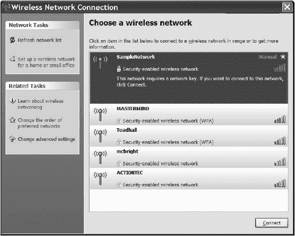
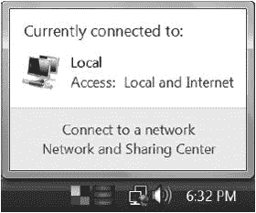
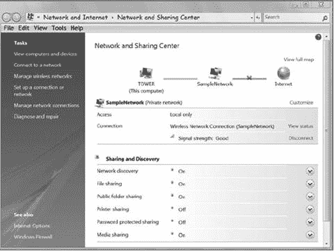
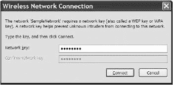
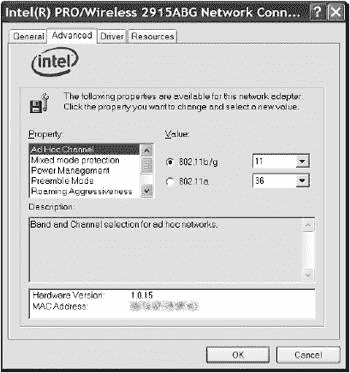
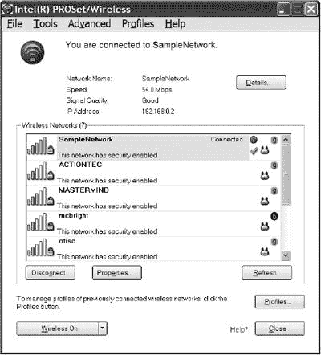
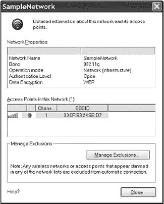
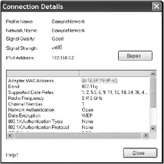
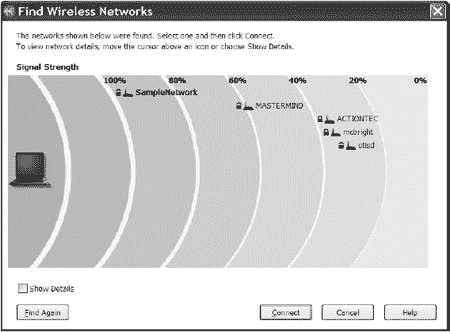
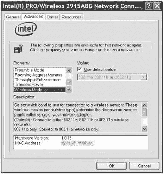

# 第五章. 管理您的 Wi-Fi 连接

通常，安装无线网络适配器很简单，因为大多数网络适配器都是即插即用的设备。一旦将适配器连接到计算机，或者一旦打开内部适配器或计算机，计算机就会自动检测设备并运行控制软件来设置连接。

本章将解释如何为两种用户设置 Wi-Fi 连接：想要一次连接到固定接入点并假设每次都能正常工作的家庭或办公室用户；以及想要在不同地点连接到不同网络的笔记本电脑用户。

# 安装 PC 卡适配器

PC 卡上的网络适配器插入到便携式计算机的 PCMCIA 接口或桌面计算机扩展槽的接口适配器中（是的，这意味着一种适配器有时会插入另一种适配器）。要安装 PC 卡，只需轻轻但牢固地将其插入接口。当它正确就位时，你应该感觉到卡片边缘的孔抓住接口内部的针。

大多数无线 PC 卡适配器包含内部天线，这些天线会从 PCMCIA 接口的外边缘延伸出一英寸或更多。然而，一些适配器配备了外部天线的连接器。如果你正在使用外部天线，请将天线放置在你想操作的位置，并将天线电缆从天线连接到网络适配器的天线连接器。*请小心操作*。通常，笔记本电脑适配器使用的微小连接器很脆弱，损坏连接器或电缆可能会导致信号丢失。

# 安装 USB 适配器

大多数 USB 无线适配器是紧凑的设备，带有一个或多个内部天线或通过一个允许天线元件移动的铰链连接到适配器的外部天线。如图图 5-1 所示。由于适配器通过电缆连接到计算机，因此当第一个位置无法检测到足够的接入点信号时，可以轻松地移动整个适配器。

**图 5-1. 这个 USB Wi-Fi 适配器有一个永久连接的外部天线。**

要安装 USB 适配器，请按照以下步骤操作：

1.  从计算机到计划放置适配器的位置运行 USB 电缆。请注意，USB 电缆的两端有不同的连接器类型，因此请确保电缆计算机端的连接器与计算机的 USB 端口相匹配。

1.  将电缆插入计算机的 USB 端口。将电缆的另一端插入网络适配器。在大多数情况下，Windows 将自动检测适配器并引导您完成加载驱动软件的过程。

1.  如果 Windows 找不到您适配器的设备驱动程序，请在制造商的网站或本章后面列出的其他网站上查找驱动程序，并指示 Windows 使用该驱动程序文件。

1.  运行适配器提供的配置程序或使用 Windows XP 中包含的无线配置工具。

1.  打开信号强度和信号质量显示。

1.  如果信号质量不好或非常好（至少五分之三），请尝试调整天线位置或移动适配器以获得最佳性能。

# 在笔记本电脑中安装内部适配器

大多数新笔记本电脑都内置了安装在计算机主板上迷你 PCI 卡上的内置 Wi-Fi 适配器。如果您订购的计算机没有内置 Wi-Fi 卡，后来决定安装一个，或者如果您想用新的更好型号（例如，当此类卡可用时包括新的 802.11n 规范）替换现有的卡，您必须打开计算机以到达适配器。

在没有针对您特定型号的特定说明的情况下，不要尝试拆解笔记本电脑。笔记本电脑都是设计成尽可能多地挤压部件和功能到非常小的包装中，通常只有一种正确的方法可以到达每个组件。除非您按照正确的顺序找到并移除正确的螺丝和盖子，否则您可能无法到达您想要的部件或插座，但您*将会*创造出一整套全新的问题。

幸运的是，大多数笔记本电脑制造商在服务手册和在线技术支持网站上提供了详细的分步说明，用于拆卸和安装内部 Wi-Fi 卡。在您尝试打开计算机之前，阅读手册或在线的完整程序是绝对必要的。如果有在线视频展示了该程序，请观看整个视频，然后在安装新卡时再次逐步操作（如果您有第二台计算机可以观看的话）。

# 在台式机系统中安装内部适配器

在台式计算机中添加内部适配器稍微复杂一些，因为它需要打开机箱并将适配器插入扩展槽。但这与其他任何扩展卡没有区别，大多数网络管理员和严肃的家用计算机用户可能已经做过很多次了。

您知道常规步骤：拔掉电源线。打开机箱。找到一个空的扩展槽。移除金属背板盖。将适配器插入槽中。拧紧。关闭机箱。将电源线重新插入计算机。重复上述步骤。

许多内部网络适配器实际上是带有 PCMCIA 插槽的 PC 卡适配器，可以插入扩展槽中。除非适配器手册中另有说明，否则在您将插槽安装到计算机中之前，从插槽中移除 PC 卡是个好主意。将插槽正确地安装在扩展槽中通常需要一些旋转和推力，而没有卡片的插槽更加灵活。在重新组装计算机后，将适配器插入插槽并加载无线适配器驱动程序。

# 加载驱动程序软件

不论其物理格式如何，几乎所有无线适配器都是即插即用设备，这意味着 Windows 应该能够在您安装它后自动识别适配器并加载相关驱动程序。然而，有时您可能需要手动安装特定的软件驱动程序，操作系统才能使用适配器发送和接收数据。

驱动程序可以来自三个来源：一些由操作系统提供，或者可能已经包含在带有适配器的磁盘或 CD 中。但获取任何驱动程序最新版本的最好来源是制造商的在线技术支持网站。您也可以从以下这些网络驱动程序目录中找到您适配器的最新 Windows 驱动程序链接：

| *[`www.driverzone.com`](http://www.driverzone.com)* |
| --- |
| *[`www.driverguide.com`](http://www.driverguide.com)* |
| *[`www.drivershq.com`](http://www.drivershq.com)* |
| *[`www.mrdriver.com`](http://www.mrdriver.com)* |
| *[`www.winfiles.com`](http://www.winfiles.com)* |
| *[`www.windrivers.com`](http://www.windrivers.com)* |

在大多数情况下，包含无线网络适配器驱动程序的同一软件磁盘或下载也包含该适配器的配置和控制实用程序程序。在您物理安装或连接适配器之前，您应该安装驱动程序并加载软件。

第一次将 PC 卡插入 PCMCIA 插槽或将 USB 适配器插入计算机的 USB 端口时，Windows 将识别适配器并运行其“发现新硬件”向导，如图图 5-2 所示。假设您已经加载了最新版本的驱动程序和配置实用程序，请选择“自动安装软件”选项。Windows 将自动查找并安装驱动程序。如果找不到驱动程序，请选择“从列表或指定位置安装”选项，以指导 Windows 查找下载文件或 CD 中的驱动程序文件。

### 注意

*当 Windows 检测到新硬件时，会显示一组不同的屏幕，但自动安装过程非常相似。如有疑问，请遵循屏幕上的说明*。

**图 5-2. Windows 首次检测到新硬件时提供加载驱动程序**

安装驱动程序后，Windows 将指示您重新启动电脑。一些配置实用程序在无线适配器激活时自动运行；其他则需要用户从“开始”程序菜单或从 Windows 桌面上的图标启动程序。如果配置程序不在程序窗口中打开，它将在时钟旁边的系统托盘中显示状态图标。

在 Linux 和 Unix 系统中，您可能需要手动安装驱动程序。第七章更详细地描述了 Linux 和 Unix 的驱动程序。

# 选择控制程序

在 Windows 中，您的计算机至少有两个或三个不同的程序可以控制您的 Wi-Fi 适配器并配置网络的无线路由连接。其中之一是 Windows 自带的，另一个是网络适配器附带的。还有另一个程序可能是您笔记本电脑制造商提供的捆绑软件的一部分。所有这些程序执行相同的任务，并且它们都显示类似的信息，但每个程序排列命令和显示的方式都不同。

值得花时间和精力尝试您电脑上安装的所有 Wi-Fi 程序，因为您可能会发现其中一个比其他任何程序都容易使用。也有可能某个程序对边缘信号更敏感。

您使用 Wi-Fi 控制程序的方式取决于您如何使用无线连接。如果您大部分时间都把电脑放在一个地方，通过 Wi-Fi 连接到互联网和您的家庭或办公网络，您应该配置 Wi-Fi 控制程序，以便每次开机时自动找到并使用您自己的网络。另一方面，如果您主要将电脑作为便携式设备使用，从一个地方移动到另一个地方，控制程序应该检测并显示所有附近的 Wi-Fi 信号，并允许您选择您想要使用的信号。我们将在下面介绍这两种情况。

### 注意

*当您不打算将笔记本电脑连接到互联网或本地网络时，请使用电脑上的硬件或软件开关完全关闭无线电*。

## 微软无线网络连接实用程序

Windows 包含一个支持几乎所有无线网络适配器的无线网络连接实用程序。当 Windows 检测到 Wi-Fi 适配器时，它会自动运行无线网络连接实用程序，除非您已指示电脑使用不同的控制程序。

要在控制程序之间切换，只需在系统托盘中右键单击活动的 Wi-Fi 控制程序。图 5-3 显示了 Windows XP 中用于将控制权转移到 Intel PROSet/Wireless 程序的弹出菜单命令。

**图 5-3. 使用系统托盘中的弹出命令将控制权转移到 Intel Wi-Fi 控制程序。**

### 在 Windows XP 中连接到接入点

要在 Windows XP 中使用 Microsoft 程序设置 Wi-Fi 网络连接，请按照以下步骤操作：

1.  从 Windows 桌面，双击屏幕右下角系统托盘中的无线网络连接图标（如图 5-4 所示，[链接](https://ch05s06.html#windows_uses_this_icon_to_control_the_wi "图 5-4. Windows 使用此图标来控制无线网络连接程序。"）所示，位于时钟左侧）。

    

    **图 5-4. Windows 使用此图标来控制无线网络连接程序。**

1.  图 5-5 中显示的无线网络连接程序将显示一个或多个附近的 Wi-Fi 接入点。在这个例子中，程序检测到了五个不同的网络。

    

    **图 5-5. 无线网络连接实用程序显示每个附近无线接入点的信息。**

1.  与移动电话屏幕上的显示类似，无线网络连接窗口使用五个条形（每个列表的右侧）来显示每个接收信号的相对强度。选择您想要加入的无线网络名称，然后点击窗口底部的**连接**按钮。

1.  如果您之前使用过此网络，无线网络连接程序将自动设置无线链接。如果是您第一次连接到此网络，程序可能会要求输入加密密钥或其他安全代码。如果需要，请输入接入点所有者提供的密钥代码。

1.  在程序设置无线链接后，它会在网络列表中识别该连接，如图 图 5-6 所示。在这个例子中，计算机连接到了 SampleNetwork 接入点。

当您的网络连接正常工作时，您可以关闭无线网络连接窗口。

**图 5-6. SampleNetwork 列表中的连接标志告诉您您的计算机已连接到该网络。星号表示这是一个首选网络。**

### Windows Vista 中连接接入点

在 Vista 中设置 Wi-Fi 连接的方式与 XP 类似，但界面不同。按照以下步骤建立无线链接：

1.  如果无线适配器尚未开启，请在您的笔记本电脑上开启无线适配器或将适配器插入 USB 端口。如图 图 5-7 所示的网络连接图标将出现在通知区域（系统托盘）中。

    

    **图 5-7. 点击网络连接图标以打开 Wi-Fi 连接。**

1.  点击网络连接图标以打开如图 图 5-8 所示的信息窗口。

    

    **图 5-8. 网络连接信息窗口会告诉您是否有一个或多个无线网络在范围内。**

1.  选择**连接到网络**选项。如图 图 5-9 所示的选择要连接的网络窗口将出现。

    

    **图 5-9. 选择要连接的网络窗口显示附近所有无线网络列表。**

1.  选择您想要使用的网络名称，并点击窗口底部的**连接**按钮。如果网络是加密的并且出现安全窗口，请输入此网络的正确安全密钥。如果网络未受加密保护，Windows 将立即建立连接。

1.  将鼠标光标移至系统托盘中的网络连接图标。如果弹出窗口显示*访问：仅本地*，点击图标并选择**网络和共享中心**选项以打开图 5-10 所示的窗口。

    

    **图 5-10. 网络和共享中心窗口显示了您的网络连接当前状态。**

1.  要将您的计算机连接到互联网，请点击本地网络和互联网之间的图表中的红色*X*。Windows 将检查您的连接并建立互联网连接。

### 自动连接

我们大多数人使用有限数量的接入点和网络服务来连接我们的计算机到互联网。当您使用无线链路连接到您的家庭或办公网络，或者如果您的连接大多数在咖啡店、图书馆或您经常访问的机场俱乐部，您应该设置控制程序在检测到信号时寻找并使用这些接入点。Windows 将这些称为*首选网络*。

#### 在 Windows XP 中设置首选网络

要创建首选网络配置文件，请按照以下步骤操作：

1.  将您的计算机带到您想要连接 Wi-Fi 网络的位置。

1.  如果计算机具有内置的 Wi-Fi 适配器，请打开适配器。如果计算机使用外部适配器，请将其插入 PC 卡插槽或连接到 USB 端口。无线网络连接程序应检测到一个或多个附近的网络并将它们显示在列表中。

1.  双击您想要设置为首选网络的网络名称。如果网络是加密的，程序将要求输入网络密钥，如图 5-11 所示。在两个字段中输入网络密钥，然后点击**连接**以加入网络。如果网络未加密，程序将立即将您的计算机连接到网络。无论哪种方式，它都会将此网络添加到您的首选网络列表中。

    

    **图 5-11. 当 Wi-Fi 控制程序检测到加密网络时，它将要求输入网络密钥。**

下次你在这个网络范围内打开电脑时，无线网络连接程序将自动建立连接，无需从列表中选择。

如果你已经识别出两个或更多首选网络（用于在不同位置建立连接），程序将按照无线网络连接属性对话框中它们出现的顺序进行连接。

### 注意

*Windows 使用 SSID（每个网络的名称）来识别首选网络。因此，它将自动连接到任何具有该 SSID 的网络。当你在一个连锁咖啡店中使用电脑时，这可能会很方便，但如果你的首选网络的所有者没有更改接入点的默认 SSID，这可能会成为一个问题*。

在大多数情况下，你首选网络列表中的网络顺序不会产生影响，因为它们在物理上彼此分离——一个可能在家庭中，另一个可能在图书馆，还有一个可能在咖啡店。但如果两个或更多首选网络有重叠的覆盖区域，你可能想要改变列表中条目的顺序。要改变顺序，请按照以下步骤操作：

1.  从无线网络连接窗口，点击窗口左侧相关任务列表中的**更改高级设置**选项。

1.  在属性窗口中，选择**无线网络**选项卡以打开图 5-12 所示的对话框。

    

    **图 5-12。使用“上移”和“下移”按钮来改变首选网络列表中条目的顺序。**

1.  在首选网络列表中，选择一个条目并使用“上移”和“下移”按钮来改变其在列表中的位置。重复此操作，直到列表中的所有条目都按照你想要的顺序排列。

#### 在 Windows Vista 中设置首选网络

在 Windows Vista 中，要将当前 Wi-Fi 连接设置为默认连接，该连接将在你的电脑进入该网络信号范围时自动打开，请按照以下步骤操作：

1.  在系统托盘中的网络连接图标上右键单击，并从弹出菜单中选择**连接到网络**。

1.  右键单击你想设置为默认网络的网络名称，从弹出菜单中选择**属性**。选择**连接**选项卡以打开图 5-13 所示的窗口。

    

    **图 5-13。使用连接选项卡中的选项设置默认网络。**

1.  选择**当此网络在范围内时自动连接**选项，并点击窗口底部的**确定**按钮。

1.  关闭所有打开的窗口。

### 从接入点断开连接

要将您的电脑从无线网络断开连接，请按照以下步骤操作：

1.  右键单击系统托盘中的无线网络连接图标。

1.  从弹出菜单中选择**查看可用无线网络**。无线网络连接窗口将出现。

1.  点击当前已连接的网络名称。

1.  点击**断开**按钮。

### 查看技术细节

在几乎所有情况下，无线网络连接实用程序会自动检测附近的接入点，并为您设置 Wi-Fi 连接，无需关注诸如前导长度或无线电发射器使用的功率等技术细节。但当您遇到问题时，或者当您或您的技术支持顾问想要排查一个不稳定的连接时，请按照以下步骤打开无线网络适配器的属性窗口：

1.  在无线网络连接窗口中，点击任务列表中的**更改高级设置**项。

1.  在无线网络连接属性窗口中，点击您的无线网络适配器名称旁边的**配置**按钮，以查看图 5-14 中显示的窗口，您可以在其中查看或更改一些更隐蔽的配置设置。当您滚动属性列表时，描述框中的文本将告诉您每个项目代表什么。

    

    **图 5-14。网络连接属性窗口的高级选项卡控制了几个很少使用的配置设置。**

## Intel PROSet/Wireless 程序

如果您的电脑配备了英特尔迷你 PCI Wi-Fi 适配器，那么系统上可能预装了 Windows 和笔记本电脑制造商的专有软件，以及 PROSet/Wireless 控制和配置程序的一个版本。

PROSet 程序与微软无线网络连接程序的功能相同，但它以不同的方式显示控制面板，并提供有关它与接入点交换的信号的更多信息。您不需要这些信息来设置和使用 Wi-Fi 连接——适配器和软件会自动检测每个接入点使用的信道号和 Wi-Fi 模式——但当您（或您的技术支持）想要排查系统问题时，这可能非常有用。

图 5-15 显示了由计算机的 Wi-Fi 适配器检测到的附近接入点的 PROSet/Wireless 程序的主屏幕。附近接入点的列表显示了每个接入点的信号强度和 Wi-Fi 模式，以及信号是否加密。要连接到网络，请点击名称，然后在列表下点击**连接**按钮。

**图 5-15. Intel PROSet 控制程序的主屏幕类似于 Microsoft 程序。**

当你连接到网络时，PROSet/Wireless 程序将自动为该网络创建一个新配置文件并将其添加到你的已知无线网络列表中。程序将配置文件列表处理得就像 Windows 程序处理其首选网络列表一样；当它检测到配置文件列表上的任何一个网络时，它会自动使用存储的配置文件来设置连接。

到目前为止，Intel 程序看起来就像 Microsoft 实用程序一样工作。但请注意，这个窗口有几个按钮在 Microsoft 屏幕上没有。其中重要的是属性按钮，位于检测到的网络列表下，以及位于窗口顶部附近（详情按钮仅在连接活动时可见）。

属性屏幕，如图图 5-16,提供了有关网络以及每个网络接入点的信息。如果主网络使用多个接入点，属性屏幕将显示有关每个接入点的信息。在这种情况下，它告诉我们（以及其他信息）SampleNetwork 接入点正在使用信道 1。

**图 5-16. Intel 程序的属性窗口提供了接入点接收到的信号信息。**

点击“详细信息”按钮，当有 Wi-Fi 连接到网络时，会打开图 5-17 中所示的连接详细信息窗口。此窗口显示了关于适配器和连接的更多技术细节，包括频道、无线电频率、适配器和接入点的 MAC 地址以及适配器无线电发射器使用的功率（一些这些细节需要向下滚动详细信息列表）。你不会经常使用这些信息，但当你的连接出现问题，这些信息可能非常有价值。

## 其他 Wi-Fi 适配器和控制程序

如果你使用的是不同品牌的 mini-PCI 适配器、PC 卡上的 Wi-Fi 适配器或 USB 适配器，该适配器提供的控制软件可能具有完全不同的布局和不同的控制以及数据显示方式，与微软或英特尔程序不同。许多笔记本电脑制造商提供的程序也非常不同。这些程序基本上与微软和英特尔程序完成相同的事情。

**图 5-17. 英特尔连接详细信息窗口提供了对活动 Wi-Fi 连接的或多或少完整的技术描述。**

正如你在上一章中看到的，联想 ThinkPad 笔记本电脑自带 Wi-Fi 程序，这里再次展示在图 5-18 中。在这种情况下，程序通过图形显示而不是五条横线来显示几个接入点的相对信号强度。在 ThinkPad 软件中（在“显示详细信息”选项后面）还有一个屏幕，显示技术细节。

**图 5-18. ThinkPad 无线控制程序显示了每个附近接入点的信号相对强度。**

布局可能会有很大的不同，但这两个程序在命令和控制方式上与本章中描述的程序相似。如果你无法理解自己适配器的控制程序，可以查阅适配器提供的说明书，或者切换到 Windows 无线连接程序。

# 状态信息

每个 Wi-Fi 控制程序提供的信息集略有不同。你的状态显示可能包含以下一项或多项。

**信号强度**

*信号强度* 是适配器在最近一次扫描期间接收到的无线电信号中的功率量。大多数程序使用熟悉的五条杠显示来显示信号强度，但一些程序可能以 *dBm*（相对于 1 毫瓦的分贝）的形式提供测量的强度。在实践中，信号强度值作为相对测量值最有用，可以显示信号在不同位置的变化。

**模式**

*模式* 是接入点正在使用的 Wi-Fi 规范。它将是 802.11b、802.11a、802.11g 或 802.11n。一些控制程序将模式简单地显示为 *a, b, g* 或 *n*。

**信道**

此字段显示适配器当前正在使用的无线电信道号。

**信号质量**

*信号质量* 是适配器在最近一次扫描期间接收到的数据包的质量。100% 的读数表示接收到的所有数据包都是好的。

**总体质量**

*总体质量* 是基于信号强度和信号质量计算得出的值。它通常表示为优秀、良好、一般或差。

**链路速度或数据速率**

*链路速度* 是适配器和相关接入点当前使用的名义数据传输速度。

**关联**

此字段确认适配器已与无线局域网建立了关联。

**MAC**

此字段标识网络适配器的唯一 MAC（媒体访问控制）地址。MAC 地址由制造商加载，通常打印在适配器的外部。如果你的笔记本电脑有一个内置的 Wi-Fi 适配器，MAC 地址可能也位于计算机底部的标签上。

**SSID**

SSID 是与此设备当前关联的网络名称。无线局域网中的所有节点和接入点都必须使用相同的 SSID。

**网络类型**

如果网络使用一个或多个接入点，网络类型是 *基础设施*。如果是对等网络，类型是 *自组织网络*。

**加密**

此字段显示适配器当前是否正在使用 WEP 或 WPA 加密。

**活动**

活动显示显示了适配器发送和接收的出站和入站数据包的数量。

# 修改适配器的配置设置

在大多数情况下，你的 Wi-Fi 适配器的默认设置将完成你连接计算机到附近网络所需的一切。但是，如果你遇到不寻常的情况，总是可以使用适配器的配置工具进行更改。由于每个适配器型号的具体设置略有不同，配置程序随适配器提供。配置设置即使在连接到不同的网络时也会保持不变。

例如，图 5-19 显示了 ThinkPad 笔记本电脑附带 Intel mini-PCI 适配器的配置工具。要更改适配器的一个属性，请滚动属性列表，并突出显示您想要更改的项目，然后从下拉值菜单中选择新的设置，该设置会根据属性列表中的每个项目而变化。

**图 5-19. Intel 属性窗口是一个典型的 Wi-Fi 配置工具。**

# 配置网络连接

配置整个网络中充满适配器最简单的方法是先配置接入点，然后记录您必须在各个适配器中匹配的无线配置设置。如果您预计用户将自行配置适配器，您将需要准备一份标准信息表或卡片，列出这些设置：

+   网络名称（SSID）

+   网络类型（基础设施或对等）

+   DHCP（自动地址分配）开启或关闭

+   如果 DHCP 关闭，分配给此用户计算机的 IP 地址和子网

+   加密类型（无、WEP 40/64 位或 128 位，或 WPA）

+   WEP 或 WPA 加密密钥（或可以提供该密钥的帮助台电话号码）

+   预设长度

+   网络访问的 URL、登录名和密码（如有必要）

无论您如何清晰地编写说明，总有些人需要帮助才能连接到网络。因此，您的说明单也应包括可以协助设置适配器并指导用户完成配置过程的人员的姓名或电话号码。

如果大多数用户使用相同类型的适配器，您可能希望包括该适配器配置窗口和 Windows 网络设置窗口的屏幕截图，并附上打开这些窗口的逐步说明。

## 移动生活：从一个网络移动到另一个网络

如果您在多个无线网络上使用您的便携式计算机，您可能需要准备自己的速查表，以配置您的网络适配器以与您经常使用的每个网络一起工作：家庭、办公室、咖啡馆、机场等等。一些配置实用程序提供多个预设配置配置文件，但如果您的没有，您每次移动到不同的网络时都必须设置所有选项。

Windows XP 中的无线网络连接实用程序包括一个自动无线配置功能，该功能可以检测到范围内的每个无线网络，并自动配置您的无线适配器。这可以节省大量时间和麻烦，但如果 Windows 没有检测到应该存在的网络，使用像 NetStumbler（[`www.netstumbler.com`](http://www.netstumbler.com)）这样的嗅探工具自行搜索附近的接入点也无妨。

要在 Windows XP 中使用自动无线配置功能，请按照以下步骤操作：

1.  将 Windows 无线连接工具设置为活动的 Wi-Fi 控制程序。

1.  通过点击时钟旁边的系统托盘中的网络图标或打开“开始”设置网络连接，右键单击无线网络连接的图标，并从下拉菜单中选择**属性**来打开无线网络属性窗口。

1.  选择**无线网络**选项卡。

1.  通过选择**使用 Windows 配置我的无线网络设置**选项来启用或禁用自动配置。

1.  点击**高级**按钮以打开图 5-20 中显示的窗口，您可以在其中设置 Windows 将自动检测的网络类型。

    

    **图 5-20. 高级窗口指定 Windows 将自动检测的网络。**

1.  选择您希望计算机检测的网络类型。如果您想指示 Windows 检测并连接到任何附近的网络，即使它不在首选网络列表中，请选择**自动连接到非首选网络**选项。如果您计划使用计算机与公共 Wi-Fi 热点，请激活此选项。

1.  点击**关闭**和**确定**按钮以保存您的选择并关闭打开的配置窗口。

# 超越 Windows

每个适配器制造商都为最流行的 Microsoft Windows 版本提供软件，但您可以使用无线网络适配器的操作系统不仅限于这些——如果您能找到正确的驱动程序。对于不太常见的操作系统，驱动程序可能可以从适配器制造商的技术支持网站或针对该操作系统的用户组获得。

对于 Mac 用户，最佳选择是使用 Apple AirPort 适配器和随附的软件，这些软件与其它 Wi-Fi 网络完全兼容。但某些其他适配器也可以与 Mac 一起使用，如果您有正确的驱动程序。第八章解释了如何使用 AirPort 软件与 Macintosh。

如果您有其他型号的 PC 卡或 USB 无线适配器，不要放弃希望。Cisco 和其他制造商也提供 Mac OS 驱动程序和配置软件。检查适配器制造商的网站以获取最新版本，或者运行网络搜索以查找*Macintosh*加上您的适配器型号。

一些适配器的驱动程序也适用于 Linux、FreeBSD、NetBSD 和其他 Unix 版本，可以直接从制造商（例如，Proxim 无线和思科都通过其网站提供 Linux 驱动程序）或通过用户组获得。一些 Unix 和 Linux 的最新版本包括几个广泛使用的 Wi-Fi 芯片组的驱动程序。第七章包含了更多关于在 Wi-Fi 网络上使用 Linux 和 Unix 的详细信息。

# 信号强度与信号质量

大多数无线工具以条形图或百分比值显示信号强度和质量，但它们不会告诉你 100%强度的信号是 100%的什么。重要的是要理解信号强度和信号质量是两回事；无线适配器不需要以全强度接收信号才能以最大可能的速度传输数据。只要接收器能够捕获干净的信号，网络性能应该是可接受的。但是，即使信号很强，如果接收器还从其他无线网络或其他使用相同无线电频率的设备（如无线电话和微波炉）中接收干扰，信号也可能受到影响。

即使数据传输速度低于最大可能速率，可能也不会有任何实际区别。例如，如果你使用 Wi-Fi 网络通过 DSL 线路（大约 1.5Mbps 或更少）将计算机连接到互联网，那么即使你当地的无线网络速度从 11Mbps 下降到 2Mbps，也不会有任何影响；这仍然比你需要的大量带宽多，因为较慢的 DSL 线路是整个连接中最慢的部分。另一方面，当你使用相同的网络进行计算机到计算机的文件传输时，更快的无线链路将会有明显的区别。

Wi-Fi 网络中使用的扩频无线电信号与 FM 无线电信号不同，但干扰和信号质量问题是相似的。如果你住在或靠近一个大城市，你可能在厨房收音机上收到一打或更多的 FM 广播电台。其中一些电台的发射器可能就在你家附近，而其他电台则从城镇的另一边或更远的地方发射。但是，只要你的收音机能够以最低的有用水平捕捉到一个电台，收音机就能相当好地重现音乐；一英里外的小茶壶大学电台的信号听起来和山上那个拥有更强大发射器的商业电台一样好（这是一个技术讨论——编程是另一个问题）。另一方面，如果你在电台覆盖范围的边缘，或者如果附近有另一个使用相同频率的电台，你想要收听的电台的声音可能会很嘈杂，难以理解。同样，无线网络链路的整体质量受到信号强度和不需要的噪声是否存在的影响。

信息通道中*噪声*的技术定义是*任何不需要的能量或信息*。你希望你的网络适配器接收的只是来自你想要使用的接入点的数字信号；因此，接收器上出现的其他所有东西都是噪声。这可以包括来自其他无线数据网络和在同一频率上使用的其他无线电（如无绳电话、微波炉和医疗电子设备）的干扰，以及来自自然来源的干扰，如闪电。在某种程度上，802.11b 网络中使用的数字技术和扩频无线电系统可以很好地忽略干扰，但当噪声的强度与你想接收的信号一样强时，网络将应用其错误纠正功能，直到它可以确认一个可理解的信号已经从发射器传到接收器。

一串噪声或另一对试图同时使用同一频道的无线电可以降低链路的数据传输速度，但弱信号也可以做到这一点。随着发射器和接收器之间的距离增加，接收器检测到的能量量将减少，直到信号太弱，接收器无法解码数据。如果发射器和接收器之间有吸收一些辐射能量的物理障碍物，有用的信号范围将更短。这就是为什么 Wi-Fi 在户外的接收效果比室内好。

可以使用高增益天线来增加信号强度，并且可以将天线升高到塔顶或高楼顶上来增加其有效传输距离，但信号强度最终会变得太弱而无法使用。这就是为什么大多数无线网络实用程序都会显示信号强度和信号质量的单独读数。当确实出现问题，你可以使用这两个测量值来帮助确定问题的来源：如果信号强度强但质量低，问题可能是由某种干扰引起的，但如果信号质量和信号强度都低，那么你很可能离最近的接入点太远，或者你与接入点之间有某种障碍物。

任何网络未能成功传输数据包时，接收端的设备都会指示发送端设备重新发送相同的包。这可能在链路（无线或有线）上存在噪声或干扰时发生，当其他用户试图同时使用相同的频道时，或者当无线信号太弱以至于接收器无法解码包中的数据时。数据流中的一对重复包不会造成任何真正的差异，但当需要发送几乎每个包多次才能被接收器接受时，实际的数据传输速度将是标称速度的一半或更少。一对 Wi-Fi 无线电可能会通过降低传输速度来补偿信号质量差（这与在嘈杂的电话线上缓慢而清晰地说话的方法相同），但效果通常是一样的：接收数据需要更长的时间。

数据传输缓慢并不总是由网络的无线部分引起的；当服务器上流量很大或有线网络部分存在某种噪声时，也可能发生这种情况。

因此，几个问题都可以产生相同的症状。当数据传输速度看起来变慢时，原因可能在于：

+   无线链路或信号质量

+   服务器

+   网络的其他地方——你本地网络的接入点可能连接到一个嘈杂的有线电话

为了隔离问题的源头，请在客户端计算机上运行 Wi-Fi 状态程序或类似 NetStumbler 的信号监控程序。如果信号强度低，尝试移动到远离您计算机和接入点之间障碍物的不同位置。如果信号强度足够但信号质量差，网络适配器可能正在接收与网络数据一起的噪声；寻找使用不同信道编号的接入点信号。如果可能，将您的网络移动到尽可能远离附近其他网络的信道编号，以找到竞争信号较少的频谱段。并且如果信号强度和信号质量都足够，但数据传输速度慢，原因可能是在服务器或网络的其他地方。
