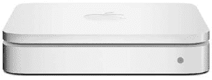
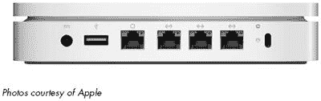
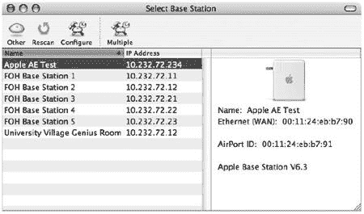
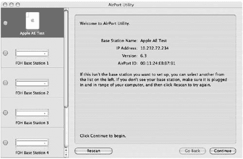

# 第八章。为 MAC 设计的 WI-FI

苹果公司的 AirPort 无线网络产品系列是希望创建无线网络以连接他们的电脑的 Mac 用户以及希望将他们的 Mac 连接到现有无线网络的用户的理想选择。因为苹果控制网络链路的两端——接入点和网络客户端——所以 AirPort 网络比通用 Wi-Fi 网络更容易设置。AirPort Extreme（苹果公司对其接入点的命名）会自动从现有的 Mac 连接加载其互联网配置设置，并将这些设置传输到同一网络上的所有其他电脑。

苹果公司是无线以太网兼容联盟（Wireless Ethernet Compatibility Alliance，WECA）的成员，AirPort Extreme 和 AirPort Extreme Card 都拥有 Wi-Fi 认证。因此，带有 AirPort 卡的 Mac 电脑可以像加入 AirPort 网络一样轻松地加入任何 Wi-Fi 网络。一个混合平台的无线网络，包括 Mac、基于 Windows 的 PC 和 Unix 或 Linux 机器，可以使用一个或多个 AirPort Extreme 作为接入点。

苹果公司对其无线网络中的一些功能和功能使用不同的名称，但设计、配置和使用 AirPort 网络的一般规则与设置通用无线网络的规则相同。AirPort 网络与其他任何 Wi-Fi 网络之间的唯一区别是一些术语和将配置数据从网络客户端移动到基站的软件。

本章解释了如何在 Mac 电脑上设置和使用无线 AirPort 网络，如何将带有 AirPort Extreme 卡的 Mac 电脑添加到不使用 AirPort Extreme 接入点的现有 Wi-Fi 网络，以及如何将运行 Windows 的电脑添加到 AirPort 网络。

# AirPort 组件

AirPort 产品系列包括三个组件：称为 AirPort 和 AirPort Extreme 卡的无线网络适配器，以及称为 AirPort Extreme 的接入点。

*AirPort Extreme 卡* 是一种内部 Wi-Fi 适配器，适用于许多 Mac 电脑型号。新的 MacBook 和 MacBook Pro 笔记本电脑以及许多台式 Mac 电脑都标配内置 AirPort Extreme 卡；如果您的电脑没有配备，您可以在电脑内部安装它，或者使用在“使用非苹果适配器与 Mac”中描述的 OrangeWare 驱动程序的第三方 USB Wi-Fi 适配器。连接 Mac 客户端到其他网络。

AirPort Extreme 是一个独立的接入点，负责管理无线网络。最新版本包括一个以太网 WAN 端口、三个 10/100Base-T 以太网端口和一个 USB 端口，以及无线接入点。图 8-1 显示了一个 AirPort Extreme 基站。

**图 8-1. Apple 的 AirPort Extreme 接入点已针对 Macintosh 计算机使用进行了优化。**

如表 8-1 所示，AirPort Extreme 在机箱上有一个状态灯，显示其当前的操作状态。

**表 8-1. AirPort Extreme 状态灯**

| 颜色 | 状态 |
| --- | --- |
| 暗色 | AirPort Extreme 未连接到电源插座 |
| 闪烁绿色 | AirPort Extreme 正在启动（一秒） |
| 持续绿色 | AirPort Extreme 正在运行 |
| 闪烁琥珀色 | AirPort Extreme 无法连接到有线网络 |
| 持续琥珀色 | 启动序列正在进行中 |
| 红琥珀交替 | 启动问题——AirPort Extreme 将重新启动 |

除了 AirPort 硬件外，Apple 还提供了一些软件工具：

+   AirPort 设置助手是一个自动配置工具，它自动化了设置大多数网络安装的过程。

+   AirPort 实用程序提供了直接访问配置选项，用于设置和更改更复杂的网络选项。Windows 有一个单独的 AirPort 实用程序版本。

+   AirPort 状态菜单是一个简单的工具，用于从主 Macintosh 屏幕的菜单栏监控和控制网络活动。

# 设置 AirPort 网络

大多数 AirPort 用户可以使用 AirPort 设置助手创建和配置他们的网络，而无需担心复杂的配置选项。但是，当本地条件需要直接控制高级设置，以及当网络管理员想要监控网络操作时，AirPort 实用程序提供了对所有网络设置的更完整控制。

使用设置助手创建网络既快又简单：只需配置一个客户端，点击几个按钮，然后让软件为您做出所有决定。设置助手会自动加载所有设置并为您启动网络。

## 安装硬件

许多最新的 Macintosh 型号都内置了 AirPort 适配器和与操作系统捆绑的 AirPort 软件。如果您使用的是尚未安装 AirPort 适配器的旧款 Macintosh，您必须在尝试运行 AirPort 设置助手之前安装 AirPort Extreme 基站。

要安装 AirPort Extreme，请按照以下步骤操作：

1.  将 AirPort Extreme 基站放置在您计划运行它的位置。像任何其他无线网络接入点一样，单个 AirPort Extreme 应该位于您希望网络覆盖的区域中心。如果您要安装多个单元以覆盖较大区域，应均匀分布在整个空间中。

1.  在基站互联网 WAN 端口和现有的有线以太网集线器或宽带互联网网关路由器（如 DSL 调制解调器或电缆调制解调器）之间运行一根电缆。如果您无法访问有线局域网或宽带互联网服务，或者如果您想将电话线作为宽带连接的备份，请从基站 USB 端口运行一根 USB 电缆到电话线的调制解调器。

1.  如果您想通过电缆将一台或多台附近的计算机或其他网络设备连接到网络，请从这些设备运行 CAT5 或 CAT5E 电缆到基站的以太网端口。

1.  将电源线插入基站电源插座和交流电源插座。

基站的天线集成在机箱内，因此无法在不移动整个单元的情况下移动它们。在运行 AirPort 设置助手后，如果您发现信号水平不足以与您的所有计算机和其他网络客户端可靠地交换数据，可能需要将基站移动到不同的位置以获得更好的信号覆盖。H-Squared ([`www.h-sq.com`](http://www.h-sq.com)) 提供了一个可选的 Air Mount 底座，可以将 AirPort Extreme 安装在墙上、天花板上或其他垂直或水平表面上，但您仍然需要确保可以访问电源线和以太网线。

## 运行 AirPort 设置助手

按照以下步骤使用 Mac OS X（版本 10.4 或更高版本）的 AirPort 设置助手，或配置您的计算机与基站的连接：

1.  确认 AirPort Extreme 已连接到电话线、宽带连接或两者，并且电源已连接到接入点。AirPort Extreme 上的指示灯应该亮起。

1.  在应用程序文件夹中打开实用工具文件夹。将显示类似 图 8-2 中的附近 Wi-Fi 网络列表。

    

    **图 8-2. 使用 AirPort 应用程序选择或配置一个基站。**

1.  从列表中选择您的 AirPort Extreme 接入点，并在窗口顶部点击 **配置**。

1.  按照屏幕上的说明逐步操作以配置接入点。

## AirPort 实用工具

AirPort Utility（在 OS X 10.4 及更早版本中称为 AirPort Admin Utility）是苹果公司用于配置基站的工具。图 8-3 显示了 AirPort Utility 窗口。

**图 8-3. AirPort Utility 控制本地计算机的无线网络连接。**

要设置基站，从基站列表中选择该网络，然后点击**继续**。

## AirPort 状态图标

当 AirPort Extreme 应用程序处于活动状态时，AirPort 状态图标会出现在 Macintosh 屏幕顶部。点击此图标可以打开一个菜单，包含切换网络、监控活动网络的信号强度以及开启或关闭无线适配器的命令。

## 使用 AirPort 网络

当 AirPort 网络启动并运行时，Macintosh 会将通过无线链接连接到网络的计算机视为任何其他网络资源。文件传输、互联网访问、远程打印机和其他服务在目录中显示的方式，与它们通过以太网电缆连接时相同。

对于大多数用户来说，唯一表明无线连接处于活动状态的迹象将是屏幕顶部的菜单栏中闪烁的灯光，随着无线信号质量因干扰和网络活动而变化，灯光会亮起和熄灭。

# 将 Macintosh 客户端连接到其他网络

苹果公司希望大多数 Macintosh 用户将使用他们的 AirPort 卡通过 AirPort Extreme 将计算机连接到其他 Mac。但这并不是使用无线网络与 Macintosh 的唯一可能方式。由于设置助手自动化了此过程，因此将 Mac 连接到 AirPort Extreme 网络比构建一个可以使用来自不同来源的接入点、网络适配器和配置软件的混合平台无线网络要容易。AirPort Extreme 卡符合 Wi-Fi 互操作性规范，因此它们也可以与其他许多制造商制造的 Wi-Fi 接入点（以及在点对点网络中与其他 Wi-Fi 适配器）进行通信。因此，在包含运行 Windows 或其他操作系统的网络客户端的新或现有无线网络中使用 Macintosh 计算机不会成为问题。

例如，携带笔记本电脑到由 Wi-Fi 热点服务的办公室和公共场所的 PowerBook 和 MacBook 用户可以像基于 Windows 的笔记本电脑用户一样轻松连接到这些网络，并且办公室或家庭中的无线网络可以在不更改网络配置的情况下为 Mac 和 PC 提供服务。

# 在 Mac 上使用非 Apple 适配器

大多数 Mac 用户可能更愿意使用 AirPort Extreme 卡而不是其他品牌的网络适配器，因为 AirPort 软件与 Mac OS 网络功能紧密集成，但您也可以在找到适用于您计算机使用的 Mac OS 版本的驱动程序和控制软件的情况下安装不同品牌的 USB 无线网络适配器。在许多情况下，其他制造商的 Wi-Fi 适配器成本远低于类似 Apple 的产品。

Apple AirPort Extreme 适配器使用 Broadcom bcm43xx 芯片组（适用于旧型号）或 Atheros 芯片组（适用于基于 Intel 的 Mac 的新型号），因此驱动程序和控制软件可能与包含相同芯片组的其他品牌兼容。您可以使用[`linux-wless.passys.nl`](http://linux-wless.passys.nl)上的搜索工具查找特定的品牌和型号。该工具还会告诉您大多数其他适配器品牌和型号的芯片组。

对于使用 Atheros 芯片组的适配器（包括许多由 3Com、D-Link、NETGEAR、富士通、IBM、Linksys、NEC、三星和索尼制造的适配器；请参阅[`www.orangeware.com/endusers/wirelessformac.html`](http://www.orangeware.com/endusers/wirelessformac.html)上的列表），OrangeWare 无线驱动程序为 Mac 提供 OrangeWare 声称比 Apple 软件更快、更灵活的性能。OrangeWare 驱动程序可在[`www.orangeware.com/endusers/wirelessformac.html`](http://www.orangeware.com/endusers/wirelessformac.html)免费试用 10 分钟；如果它与您的现有硬件兼容，额外成本将低于购买新 AirPort Extreme 卡的成本。

对于使用 PRISM 芯片组的适配器，请访问[`wirelessdriver.sourceforge.net`](http://wirelessdriver.sourceforge.net)寻找驱动程序。

对于使用 Ralink 芯片组的适配器，请从[`www.ralinktech.com/ralink/Home/Support/Macintosh.html`](http://www.ralinktech.com/ralink/Home/Support/Macintosh.html)下载驱动程序和支持软件。

如果你正在使用带有 PCMCIA 插槽的旧款 PowerBook 或带有一个或多个 PCI 扩展插槽的台式 Mac，并且（像我一样）你有一个或多个仅识别 802.11b 网络的旧 Wi-Fi 适配器，IOXperts 的驱动程序软件([`www.ioxperts.com`](http://www.ioxperts.com))可以为许多（现在已过时的）Wi-Fi 适配器添加支持。你可能在 eBay 或二手经销商那里找到一个非常便宜的兼容适配器，但不要浪费你的钱；你最好多花一点钱购买一个新适配器，这个适配器也可以使用本节中其他驱动程序之一，使用更新、更快的 802.11g 和 802.11n 标准。

# 将 AirPort 卡连接到非 AirPort 接入点

当带有 AirPort 卡的 Macintosh 在非 AirPort 接入点的信号范围内时，AirPort 卡应检测到网络信号并在 AirPort 应用程序的“选择网络”菜单和 AirPort 控制条中显示接入点的 SSID。当用户从菜单中选择该网络时，AirPort 卡应与该接入点关联，就像它与 AirPort Extreme 关联一样。控制条和 AirPort 应用程序将以与显示连接到 Apple 基站相同的方式，在其图形显示中显示接入点的信号质量。

在大多数大型企业网络和公共无线服务中，网络管理员可能已经为希望使用便携式计算机和其他设备在无线局域网中使用的员工和访客准备了一份“如何连接到我们的网络”文档。这份文档可能是一张打印的信息单或小册子，或是一个在线网页。无论哪种方式，它都将包括一些用户必须在他们的配置实用程序程序中更改的特定设置。AirPort 适配器的配置程序是 AirPort Utility，但苹果公司选择为一些设置使用不同的名称，包括 *网络名称* 用于 SSID 和 *AirPort ID* 用于网络适配器的 MAC 地址。幸运的是，AirPort 实用程序将自动检测网络名称和 ID，因此不需要手动更改它们。

如果无线网络在接入点或网络的其他位置使用 DHCP 服务器为网络客户端分配 IP 地址，请打开 AirPort Utility 的“互联网”选项卡，并将配置 TCP/IP 选项设置为接受 DHCP 地址。

如果网络不使用 DHCP，网络管理员将提供分配给此客户端的配置设置列表。要将 AirPort 客户端配置为连接到网络，请将配置 TCP/IP 选项设置为手动，并在 AirPort 实用程序的互联网选项卡中输入这些地址。直接将网络管理员提供的 IP 地址、子网掩码、DNS 服务器和域名复制到管理员实用程序中的相应字段。AirPort 称为*路由器地址*的设置在世界上其他地方被称为网络网关。在 AirPort 实用程序的网关地址字段中使用网络管理员提供的网关地址。

# 将其他 Wi-Fi 客户端连接到 AirPort 网络

虽然无线局域网使用 AirPort Extreme 作为其接入点，但这并不意味着网络仅限于 AirPort 客户端。AirPort 网络上的每台客户端计算机不必是 Macintosh。AirPort 网络与其他 Wi-Fi 网络之间绝对没有区别，因此使用某些其他品牌网络适配器和不同操作系统的计算机将不会在检测 AirPort 网络时遇到任何麻烦。

对于使用其他操作系统的计算机，AirPort Extreme 看起来就像一个标准的 Wi-Fi 接入点。适配器将使用 AirPort 网络与其他计算机交换数据，并作为通向互联网的网关。从适配器的角度来看，连接到 AirPort Extreme 就像连接到任何其他品牌的接入点一样。

检测无线电信号是一回事，但配置网络客户端以使用网络要困难一些，因为苹果公司对一些标准网络配置设置使用了不同的名称。如果您不知道如何在 AirPort 和 Wi-Fi 术语之间进行翻译，您可能难以使网络正常工作。不要慌张。我们在这里帮助您。当您在接下来的几页中看到翻译键时，事情并没有看起来那么糟糕。

## 网络属性

在 Windows 中，网络属性窗口包含计算机必须使用以连接到 TCP/IP 网络的设置和选项。在 Macintosh 上，相同的信息在 AirPort 实用程序中。

如果 AirPort 实用程序设置为使用 DHCP 配置 TCP/IP，客户端上的配置实用程序也必须设置为接受 DHCP（在 Windows 中，选择自动获取 IP 地址和自动获取 DNS 服务器选项）。

如果 AirPort 实用程序设置为手动配置 TCP/IP，Windows 客户端的所有者必须输入以下 TCP/IP 属性设置：

| **IP 地址** 使用 LAN 管理员或 ISP 提供的 IP 地址。 |
| --- |
| **子网掩码** 从 AirPort 实用程序的互联网选项卡复制地址。如果您不知道地址，请尝试 255.255.255.0。 |
| **DNS 服务器** 从管理员实用程序的互联网选项卡复制 DNS 服务器地址。 |
| **主机** 从管理员实用程序的 AirPort 选项卡复制网络名称。 |
| **域名** 从管理员实用程序的互联网选项卡中复制域名（如果有）。 |
| **网关** 从管理员实用程序的互联网选项卡中复制路由器地址。 |

# 在 Windows 中配置 AirPort Extreme

苹果的 AirPort Extreme 接入点比许多其他产品都贵，这些产品在没有特殊 Macintosh 配置程序的情况下也能完成相同的工作。因此，很可能大多数使用 AirPort Extreme 的个人和公司网络中都会有一台或多台 Macintosh。因此，Macintosh 管理员实用程序通常是设置 AirPort Extreme 网络的最佳选择。

然而，苹果还提供免费软件，你可以使用它从运行 Windows 的计算机上设置和运行 AirPort Extreme 网络。如图图 8-4 所示，AirPort Express 助手是免费 AirPort for Windows 软件包的一部分，可以从[`www.apple.com/support/downloads/airport42forwindows.html`](http://www.apple.com/support/downloads/airport42forwindows.html)下载。

**图 8-4**。Windows 版本的 AirPort Express 助手提供了一个逐步的过程来设置 AirPort Extreme 网络。

# AirPort 是答案吗？

因为苹果可以控制其 AirPort 设计的两端——接入点和网络客户端——所以它提出了一种系统，该系统自动化了许多其他 Wi-Fi 网络面临的配置难题。一旦你知道秘密握手（以 AirPort 对某些标准功能和功能的古怪名称的形式），你的 Windows 和 Linux/Unix 计算机，即使使用其他制造商的网络适配器，也能在 AirPort 网络上完美运行。

对于大多数计算机都是 Macintosh 的商业或家庭无线网络来说，AirPort 网络确实是明显的选择。对于我们其他人来说，AirPort Extreme 是一个完全足够的接入点，但它比许多其他品牌贵得多，因此其他类型的接入点通常可以在较低的成本下提供类似性能。

请记住，如果你的 PowerBook 或台式 Mac 没有内置 Wi-Fi 适配器，AirPort Extreme 不是你的唯一选择。其他制造商的 PC 卡和 USB Wi-Fi 适配器，结合第三方驱动程序和控制软件，将允许你像更昂贵的 Apple 产品一样，将你的 Macintosh 添加到 Wi-Fi 网络。
