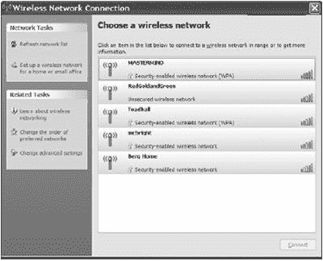
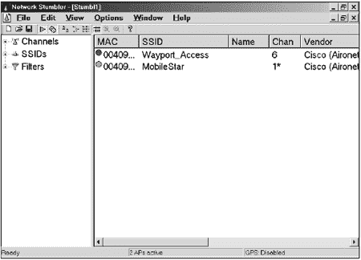
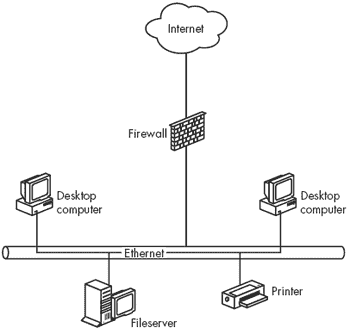
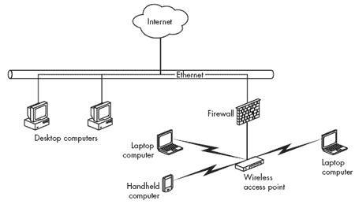
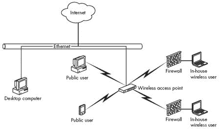

# 第十二章 无线网络安全

无线网络并不安全。让我重复一遍：无线网络并不安全。它们对于许多用户来说在大多数时候是安全的，但不可能建立一个使用无线电交换数据的绝对私密的网络。

无线网络在安全性和便利性之间是一种权衡。无线网络连接的明显好处——从便携式计算机或偏远地点快速轻松地访问网络——是有代价的。对于大多数用户来说，无线操作的便利性超过了潜在的安全威胁。但就像你在街上停车时锁上车门一样，你也应该采取类似的措施来保护你的网络和数据。

简单的事实是，无线网络使用具有明确特征集的无线电信号，因此，任何愿意投入足够的时间和精力来监控这些信号的人，很可能会找到一种方法来拦截并读取其中包含的数据。如果你通过无线链路发送机密信息，窃听者可以复制它。信用卡号码、账户密码和其他个人信息都容易受到攻击。

在互联网上可以轻松找到破解 Wi-Fi 加密方法的整个工具库。3G 宽带和 WiMAX 网络可能比 Wi-Fi 网络更安全（主要是因为从它们那里捕获数据更困难），而 WPA 加密比 WEP 加密更好，但没有任何无线安全是完美的。加密和其他安全方法可以使数据更难被盗，但它们不能完全保护免受真正专注的窃听者的侵害。就像任何警察都会告诉你的那样，锁对于阻止诚实的人来说是很好的，但严重的盗贼知道如何绕过它们。

### 注意

*无线网络加密（如 WPA 或 WEP）发生在 OSI 模型的数据层（在第一章中讨论）。加密是对通过网络发送的所有数据进行执行的。还有其他加密方法可用：VPN（虚拟专用网络）在 TCP 层之上运行，可以提供额外的加密，而 SSL（它保护 HTTPS 网站流量）是针对应用的*。

更糟糕的是，许多网络管理员和家用无线用户没有使用加密和其他内置在每个 Wi-Fi 接入点和网络节点中的安全功能，导致他们的网络门户大开，供入侵者进入。在许多城市和郊区的商业区和令人惊讶数量的住宅区，对未受保护的私有网络的“驾车登录”是可能的。当 Wi-Fi 还是一项新技术时，*《旧金山纪事报》*报道说，一位网络安全专家在旧金山市中心一辆面包车的屋顶上安装了定向天线，每条街区可以登录平均六个无线网络。今天这个数字会更大。一年后，一群微软员工进行了一次“非官方”测试，在西雅图郊区的社区中发现了 200 多个未受保护的接入点。如今，大多数人已经意识到了在家中和办公室网络上使用加密的重要性，但其中太多的人仍在使用较旧的 WEP 加密系统，而不是更安全的 WPA 方法。直到 2007 年中旬，一家主要电话公司 Qwest 的技术支持人员还在建议他们的 DSL 客户使用 WEP 加密。

如果你位于市中心或郊区，你可能自己就能看到这一点。当你使用你的 Wi-Fi 控制程序扫描你所在地区的网络时，你可能会看到除了你自己的接入点之外，还有附近网络的列表。控制程序还会告诉你每个网络使用的是哪种加密（如果有的话）。在图 12-1 所示的示例中，一个网络（RedGoldandGreen）是开放的，其他四个是加密的；其中两个加密网络使用 WPA，而那些被列为“启用安全”但没有加密类型的两个网络使用 WEP。

做个数学题：你的接入点在所有方向上的范围是 150 英尺或更远，因此信号可能超出了你自己的财产线（或公寓或办公室的墙壁）。隔壁或街对面的建筑物中的网络设备可能检测到你的网络。同样，停在街上的汽车内的笔记本电脑或 PDA 也可以检测到。如果你不采取一些预防措施来防止这种情况，该设备的操作员可以登录到你的局域网，从你的服务器窃取文件，并通过流媒体视频或多玩家游戏占用你的互联网连接。

**图 12-1. 本地区域内四个网络在连接前需要加密密钥。**

重要的是要理解，我们正在讨论两种不同类型的无线网络安全威胁。第一种是未经您知情或允许的外部人员连接到您的网络的风险；第二种是专门的窃听者可能在您发送和接收数据时窃取或修改数据的可能性。每种都代表了一个不同的问题，并且每种都需要不同的预防和保护方法。虽然确实，目前可用的所有加密工具都不能提供完全的保护，但它们可以使大多数普通入侵者的生活更加困难。只要它们存在，您最好还是使用它们。

一个未加密的无线网络为攻击者提供了许多机会。不仅网络破解者能够监控通过网络传输的任何数据，他们还可能修改这些数据。例如，如果您的网络浏览器存在漏洞，攻击者可以在您查看图片时替换为利用该漏洞的图片，并在您的计算机上安装木马，允许攻击者窃取存储在计算机上的数据，而这些数据*您从未通过无线网络发送过*。这种攻击可能相对罕见（普通窥探者不太可能花时间在您可能有什么有趣的东西的机会上），但它仍然是一个严重的风险。此外，许多流行的网站使用 HTTPS 通过 SSL 加密登录页面，但他们不会加密后续页面以减少处理能力的消耗——您的密码可能安全，但您通过 Webmail 界面阅读的任何电子邮件可能不安全，攻击者可能能够窃取标识您登录的 cookie（随网页信息一起包含的唯一数据），并直接访问您的邮箱。

# 保护您的网络和数据

作为 Wi-Fi 网络的运营商，您能做些什么来阻止入侵者呢？有一些技巧可以使入侵者感到困难。首先，您应该接受无线网络并不完全安全的事实，并使用内置的网络安全功能来减缓潜在的入侵者；其次，您可以用硬件或软件防火墙（或两者兼而有之）来补充您的无线路由器内置的工具，以隔离无线网络；第三，您可以部署额外的加密，例如 VPN，以保护网络流量。

早期 Wi-Fi 协议（WEP 加密）的安全特性不足以保护数据。WEP 协议存在几个缺陷。基本的加密方法（RC4 算法）在特定应用中已知存在弱点，它要求所有用户都知道密钥，并且没有提供分发新密钥的安全机制。大多数这些不足都被认可并被视为超出提供与标准有线网络用户相同保护目标范围之外，但实际上，结果是无线等效隐私几乎与没有保护一样。最近的攻击（如 aircrack-ptw 工具执行的攻击）进一步削弱了 WEP，因为它们通常能够在分析有限数量的流量后几分钟内披露加密密钥。随着这些发展，WEP 应该被视为一个“请勿打扰”的标志，而不是真正的保护手段。

WPA 和 WPA2 标准试图修复 WEP 的不足，但它们只有在网络的所有用户都拥有现代网卡和驱动程序时才能正常工作。大多数，如果不是全部，近几年来生产的网卡都将支持 WPA 或 WPA2。

对于我们大多数人来说，更严重的危险不是人们会窃听我们的消息，而是他们会在不知情的情况下创建自己的网络连接，要么读取局域网内计算机上存储的文件，要么窃取互联网的宽带连接。然而，商业网络必须采取额外的预防措施来保护他们的（以及他们的客户）的数据。一些大型零售连锁店客户信用卡数据泄露事件已被追踪到网络保护不足。

维护对网络的控制至关重要。以下是一些具体的步骤：

+   不要使用接入点的默认 SSID。这些默认值对于网络破解者来说众所周知。

+   将 SSID 改成不会识别你的业务或位置的东西。如果一个入侵者检测到名为 BigCorpNet 的东西，并且他们环顾四周看到对街的 BigCorp 总部，他们就会直接锁定那个网络。对于家庭网络也是如此；不要使用你的姓氏或街道地址或任何其他容易让人推断出信号来源的信息。

+   不要使用一个听起来像包含某种有趣内容的 SSID——使用一个无聊的名字，比如，*network5*，或者甚至是一个乱码字符串，如 *W24rnQ*。如果一个潜在的破解者看到附近网络列表，你的网络应该看起来是最不有趣的。

+   更改你接入点的 IP 地址和密码。大多数接入点配置工具的出厂默认密码很容易找到（而且它们通常来自同一个制造商——提示：不要使用*admin*），所以它们甚至不足以阻止你的用户，更不用说那些想为自己谋利的未知入侵者了。如果外人进入了接入点的软件，他们可以通过更改密码和加密密钥来将你锁出自己的网络。

+   如果可能，将你的室内接入点放置在建筑物的中间而不是靠近窗户。这将减少你的网络信号超出你自身墙壁的距离。

+   使用 WPA 加密而不是 WEP。WPA 加密要难破解得多，尤其是如果你使用了一个复杂的加密密钥。

+   经常更改你的加密密钥。从数据流中嗅探加密密钥需要时间；每次密钥更改，试图窃取你数据的恶意分子都必须从头开始。在家庭网络中，每月更改一次或两次密钥并不算频繁。办公室局域网应至少每周更改一次密钥。

+   不要在网络中明文存储你的加密密钥。这看起来很明显，但在一个广泛使用的网络中，可能会诱使你在私人网页或文本文件中分发它们。不要这样做。

+   不要使用电子邮件分发加密密钥。即使你没有以明文发送电子邮件，一个已经窃取了账户名和密码的入侵者也会在合法用户之前收到包含你新代码的消息。

+   在无线网络内置的加密之上添加另一层加密，例如 Kerberos。请参阅[`web.mit.edu/kerberos/www`](http://web.mit.edu/kerberos/www)和[`www.isi.edu/~brian/security/kerberos.html`](http://www.isi.edu/~brian/security/kerberos.html)获取下载信息和关于 Kerberos 的更多信息。

+   如果在你的网络中可行，请在你的接入点中开启访问控制功能。访问控制将网络连接限制为具有指定 MAC 地址的网络客户端。接入点将拒绝与不在列表上的任何适配器关联。如果你希望允许访客使用你的网络，这可能不太实用，但在一个家庭或小型商业网络中，这是一个有用的工具，因为你知道所有潜在的用户。MAC 地址过滤不能阻止一个有决心的攻击者复制认证用户的地址，但它可以提供额外的保护层。

+   通过尝试从你自己的建筑物外找到并使用你的网络来测试你网络的安全性。携带一个运行嗅探程序（如 NetStumbler 或你的网络适配器的控制程序）的笔记本电脑，并开始离开建筑物。如果你能在街区外检测到你的网络，入侵者也能。

+   打开安全功能，但将网络视为对公众开放。确保使用网络的所有人都了解他们正在使用的是一个非安全系统。

+   将文件共享限制在你真正想要共享的文件上；不要共享整个驱动器。在每个共享上使用密码保护。

+   使用你在有线网络上使用的相同防火墙和其他安全工具。从最好到最坏，你局域网的无线部分并不比有线部分更安全，因此你应该采取所有相同的预防措施。

+   考虑使用 VPN 以增加安全性。

## 保护您的电脑

网络安全是双向的——网络管理员不希望未经授权的用户干扰网络，而个人用户也不希望任何人访问他们的个人文件。当你登录到公共网络时，你应该采取一些预防措施，以防止网络上的其他人读取你的文件。

在 Windows Vista 和 Windows XP 中，没有中央位置可以关闭文件共享，因此你必须单独关闭每个共享。按照以下步骤关闭共享：

1.  打开 **我的电脑** 窗口。

1.  你的一些或所有共享驱动器和文件夹的图标可能显示一个手“服务”图标。要关闭共享，右键单击图标并从菜单中选择 **共享和安全**。

1.  关闭 **在网络上共享此文件夹** 选项。

1.  点击 **确定** 按钮关闭对话框。当我的电脑窗口出现时，共享手将不再出现在文件夹或驱动器字母的名称下。

1.  对每个共享文件夹或文件重复此过程。不要忘记共享文档文件夹。

当你回到自己的办公室或家庭网络时，你必须反转该过程以再次开始共享你的文件。

那么有人从无线电链路中抓取你的数据有什么危险？即使你使用了加密，这也是可以做到的。你必须假设通过无线网络传输的任何数据都不安全。一个有决心、拥有正确设备和软件的窃听者可以在数据包在空中移动时复制你的数据包。这是可能的，但除非你是政府监控或工业间谍活动的目标，否则这种情况不太可能发生。

要绝对确信没有人正在监控你的无线网络，唯一的方法是停止使用它。但监控厨房中的无绳电话甚至更容易。一般来说，你可以假设通过公共网络建立的连接与连接到你自己网络的连接一样安全或不安全。如果有人真的想窃取你的网络数据包，他们可能会找到方法做到这一点。

# Wi-Fi 安全工具

Wi-Fi 规范中的安全工具并不完美，但总比没有好。即使你选择不使用它们，了解它们是什么以及它们是如何工作的也是至关重要的，至少为了能够关闭它们。

## 网络名称 (SSID)

正如你在第三章中学到的，每个无线网络都有一个名称。在只有一个接入点的网络中，该名称是基本服务集 ID（BSSID）。当网络有多个接入点时，名称变为扩展服务集 ID（ESSID），但你的计算机的控制程序会在同一列表中显示这两种类型。所有网络名称的通用名称是 SSID，这是你将在无线接入点和客户端配置实用程序程序中最常看到的术语。

当你配置网络的接入点时，你必须指定该网络的 SSID。网络中的每个接入点和客户端都必须使用相同的 SSID。

当网络客户端检测到两个或更多具有相同 SSID 的接入点时，它假定它们都是同一网络的一部分（即使接入点在不同的无线电频道上运行），并且它会连接到提供最强或最清晰信号的接入点。如果该信号因干扰或衰减而恶化，客户端将尝试转移到同一网络上的另一个接入点。这种转移被称为*切换*。

如果两个具有重叠信号的不同的网络具有相同的名称，客户端将假定它们都是单个网络的一部分，并且它可能会尝试从一个网络切换到另一个网络。从用户的角度来看，这种误导性的切换看起来就像网络已经完全断开了连接。因此，可能与其他网络重叠的每个无线网络都必须有一个唯一的 SSID。

唯一 SSID 规则的例外是公共和社区网络，这些网络仅提供互联网访问，但不提供局域网上的其他计算机或其他设备的访问。这些网络通常具有一个共同的 SSID，因此订阅者可以从多个位置检测并连接到它们。换句话说，如果你在当地咖啡馆有互联网访问账户，当你访问同一家公司拥有的另一家商店时，你可能会找到并使用完全相同的 SSID。

网络的 SSID 提供了一种非常有限形式的访问控制，因为设置无线连接时必须指定 SSID。接入点的 SSID 选项始终是一个文本字段，可以接受你想要分配的任何名称，但许多网络配置程序（包括 Windows XP 中的无线网络工具以及几个主要品牌网络适配器提供的工具）会自动检测并显示其信号范围内的每个活动网络的 SSID。

在尝试连接之前，您并不总是需要知道网络的 SSID；配置实用程序（或网络监控器或嗅探程序如 NetStumbler）会以列表或菜单的形式向您显示附近每个网络的名称（广播 SSID 功能已被关闭的网络除外）。例如，图 12-2 显示了西雅图-塔科马机场 NetStumbler 扫描的结果，Wayport 为乘客候机楼提供服务，MobileStar 为美国航空公司的 VIP 俱乐部提供覆盖。

**图 12-2. NetStumbler 和许多配置工具显示每个附近无线网络的 SSID**

### 警告

*每个接入点都附带一个默认 SSID 设置。这些默认值在网络安全嗅探者社区中是众所周知的，并且有详细的文档记录（例如，参见[SeattleWireless.net](http://SeattleWireless.net) *在* [`seattlewireless.net/arlan/ssid_defaults-1.0.5.txt`](http://seattlewireless.net/arlan/ssid_defaults-1.0.5.txt) *编译的接入点和默认值列表) *。显然，默认值在任何活动网络中都不应该使用。在您更改接入点的管理登录名和密码的同时，请确保这样做*。

通常，大多数 Wi-Fi 接入点会发送信标信号来广播网络的 SSID。当网络适配器执行无线电扫描时，它会检测到这些信标信号，并在其控制程序中显示附近 SSID 的列表。

然而，可以禁用 SSID 广播，这样网络就不会出现在大多数控制程序扫描中。要连接到一个不可见的网络名称的计算机，您必须指示您的控制程序搜索相关的 SSID。

非广播 SSID 并非完全不可见。嗅探程序（如 NetStumbler）仍然可以检测到它并显示 SSID，并且每次用户连接到网络时，网络适配器都会在数据包中发送 SSID，这些数据包很容易被嗅探。在某些情况下，禁用 SSID 广播可能会使入侵者更容易后来攻击您的用户之一（这对企业或企业网络管理员来说是一个更严重的问题，而不是对运行家庭网络的人来说）。因为笔记本电脑无法知道隐藏的网络是否可用，它必须不断探测它，宣布其存在，并为攻击者提供大量伪造隐藏网络所需的信息。因为隐藏网络必须在笔记本电脑的“首选网络”列表中，它将自动连接到伪造的网络。

## WEP 加密

WEP 加密是每个 Wi-Fi 系统的选项之一，因此了解它是如何工作的很重要，即使你选择不使用它。正如其名所示，有线等效隐私（WEP）协议的原始目的是在无线网络上提供与有线网络相当的安全级别。那是目标，但依赖于 WEP 加密的网络几乎与没有任何保护的网络一样容易受到入侵。它将阻止偶然的窃听者（以及如果你的邻居不特别擅长破解加密，那么你的免费邻居），但它对有意的入侵者并不特别有效。较新的 WPA 加密始终是更好的选择。

WEP 加密旨在执行三个功能：它防止未经授权的网络访问，对每个数据包执行完整性检查，并保护数据免受窃听者侵害。WEP 使用一个秘密加密密钥在客户端或接入点传输数据包之前对其进行编码，并在接收后使用相同的密钥对其进行解码。原始标准使用共享认证，其中接入点发送一个挑战数据包，客户端必须使用正确的 WEP 密钥对其进行加密并发送回来。然而，这种技术通过允许窃听者观察交换的双方并找出密钥，打开了一个重大的漏洞。任何使用 WEP（尽管没有任何网络应该使用它）的网络都应该使用的“开放”认证方法，简单地丢弃无法由网络 WEP 密钥解密的数据包。

因此，网络中每个接入点和客户端适配器的 WEP 设置必须完全相同。这听起来很简单，但因为它变得复杂，因为制造商使用不同的方法来识别 WEP 密钥的大小和格式。功能不会从一个品牌改变到另一个品牌，但相同的设置并不总是有相同的描述。

### 你的加密密钥有多少位？

WEP 密钥可以是 64 位或 128 位。尽管 128 位密钥更难破解（但它们仍然相当不安全），它们也增加了每个数据包传输所需的时间。然而，由于 40 位 WEP 密钥与 64 位 WEP 密钥相同，而 104 位密钥与 128 位密钥相同，因此产生了混淆。标准的 64 位 WEP 密钥是一个字符串，包括一个内部生成的 24 位初始化向量和网络管理员分配的 40 位密钥。一些制造商的规格和配置程序称这为*64 位加密*，但其他人将其描述为*40 位加密*。无论如何，加密方案都是相同的，因此使用 40 位加密的适配器与使用 64 位加密的接入点或另一个适配器完全兼容。

许多网络适配器和接入点还包含一个使用 128 位密钥的**强加密**选项。支持强加密的设备与 64 位加密向下兼容，但这不是自动的，因此在一个混合网络中，所有 128 位和 64 位设备都将以 64 位运行。如果你的接入点和所有适配器都接受 128 位加密，请使用 128 位密钥。但如果你想让你的网络与仅识别 64 位加密的适配器和接入点兼容，请配置整个网络使用 64 位密钥。

实际上，选择 64 位或 128 位 WEP 加密并没有太大的区别。可以轻松获得能够破解这两种类型的工具，尽管破解 128 位密钥可能需要更长的时间。

### 你的密钥是 ASCII 还是十六进制？

设置 WEP 加密时，密钥长度并不是唯一令人困惑的事情。一些程序要求以 ASCII 字符的字符串形式提供密钥，但许多其他程序则希望密钥以十六进制（hex）数字形式提供。还有一些可以从可选的密码短语生成密钥。

每个 ASCII 字符有 8 位，因此 40 位（或 64 位）WEP 密钥包含 5 个字符，而 104 位（或 128 位）密钥有 13 个字符。在十六进制中，每个字符使用 4 位，因此 40 位密钥有 10 个十六进制字符，128 位密钥有 26 个字符。在图 12-3 中，D-Link 接入点的无线设置屏幕，40 位共享密钥安全字段使用十六进制字符，因此它有 10 个字符的空间。D-Link 程序将所有 10 个字符作为一个单独的字符串运行，但有些其他程序将它们分成 5 组 2 位数字或 2 组 5 位数字。无论哪种方式，密钥对计算机来说看起来都一样，但将字符串拆分后更容易复制。

**图 12-3. D-Link 接入点的配置工具接受十六进制格式的 WEP 密钥。**

密码短语是一串文本，适配器和接入点会自动将其转换为十六进制字符。由于人类通常比记住十六进制乱码更容易记住实际的单词或短语，因此密码短语可能比十六进制字符串更容易分发。然而，只有当网络中的所有适配器和接入点来自同一制造商时，密码短语才有用。

### 选项有哪些？

就像 Wi-Fi 配置工具中的其他几乎所有内容一样，加密选项的名称在不同的程序之间并不一致。有些使用一套简单的选项，例如“启用 WEP（或 WPA）加密”，但有些则使用来自正式 802.11 规范的技术术语。

一些接入点还提供可选的共享密钥认证选项，当网络客户端有密钥时使用加密，但与其他网络节点使用未加密的数据。

### 混合十六进制和 ASCII 密钥

当一些网络节点仅使用十六进制而其他节点需要 ASCII 密钥时，设置混合网络变得更加复杂。如果您的网络中存在这种情况，您将希望遵循以下规则来设置加密密钥：

+   将所有 ASCII 密钥转换为十六进制。如果配置程序要求 ASCII 密钥，请输入字符 *0x*（零后跟小写字母 *x*），然后跟十六进制字符串。如果您使用 Apple 的 AirPort 软件，您必须在十六进制密钥的开头输入一个美元符号（$）。

+   确保所有加密密钥的字符数完全正确。

+   如果所有其他方法都失败了，请阅读您网络适配器和接入点的手册中的安全部分。可能您的网络中的某些设备有一些您不知道的神秘专有功能。

### WEP 是否足够安全以使用？

几位学术计算机科学家已经发表了关于 WEP 加密的报告，这些报告反对信任 WEP 来保护机密数据。他们都指出了用于定义 WEP 加密算法的加密理论和实践中的严重缺陷。这些专家在他们的建议上一致：如果您使用 802.11 无线网络，您不能依赖 WEP 进行安全；您应该使用 WPA 来保护您的网络。

加州大学伯克利分校的一个研究小组已经发现了 WEP 算法中的许多缺陷，这些缺陷使其至少容易受到四种不同类型的攻击：

+   使用统计分析来解密数据的被动攻击

+   构建加密数据包以误导接入点接受错误命令的主动攻击

+   分析加密数据包以构建字典，该字典可用于实时自动解密数据的攻击

+   改变数据包头部以将数据重定向到攻击者控制的目标的攻击

您可以在[`www.isaac.cs.berkeley.edu/isaac/wep-faq.html`](http://www.isaac.cs.berkeley.edu/isaac/wep-faq.html)在线阅读的伯克利报告，其结论是一个明确的声明：“有线等效隐私（WEP）并不安全。该协议的问题是一些加密原语理解上的误解，因此以不安全的方式组合它们。”

莱斯大学和 AT&T 实验室的研究人员发布了对 WEP 加密网络的攻击描述([`www.securitytechnet.com/resource/hot-topic/wlan/wep_attack.pdf`](http://www.securitytechnet.com/resource/hot-topic/wlan/wep_attack.pdf))，这使他们得出类似的观点：“802.11 WEP 完全不安全。”他们能够订购并接收必要的硬件，设置测试网络，设计他们的攻击工具，并在不到一周的时间内成功捕获了一个 128 位的 WEP 密钥。

伯克利和 AT&T 实验室的报告都是由具有密码学背景的技术专家撰写和针对技术专家的。他们的结论很明确，但他们的方法假设入侵者具备一些严重的专业技术知识。然而，破解 WEP 加密并不需要网络专家；对于不太复杂的密码破解者来说，工具也容易找到。AirSnort（来自 Shmoo Group，[`airsnort.shmoo.com`](http://airsnort.shmoo.com)）和 WEPCrack（[`sourceforge.net/projects/wepcrack`](http://sourceforge.net/projects/wepcrack)）都是 Linux 程序，用于监控无线网络信号并利用 WEP 算法中的弱点来提取加密密钥。还有许多其他的工具。只需几分钟时间，使用 Google 或其他任何互联网搜索工具就可以找到 WEP 破解工具及其详细使用说明。

最近宣布针对 WEP 的攻击，在工具如 aircrack-ptw 中实现，可以在几分钟内使用非常有限的数据量破解 WEP 密钥——有时只需从单个网络用户那里收集的 10 兆字节的数据和现代笔记本电脑上几秒钟的处理时间。

总结：尽管如此，请继续加密您的网络数据，但如果可能的话，请使用 WPA 而不是 WEP。加密数据比明文传输更安全，破解 WEP 密钥需要时间，因此 WEP 确实增加了另一层（极其薄弱）的安全保障，尤其是如果您经常更改密钥。WEP 加密可能对严重攻击者保护作用不大，但它可能会阻止来自街对面的偶然网络窃听者和随意在网络中窥探的人。破解未加密的网络（而且还有很多）要容易得多，所以检测到您的加密信号的黑客可能会转向保护较少的目标。

## WPA 加密

WPA 加密是为了解决使 WEP 加密不完全安全的某些安全问题而开发的。WPA 比 WEP 安全得多，但破解 WPA 仍然是可能的。

WPA 更安全，因为它使用一种称为*时间密钥完整性协议（TKIP）*的方法，在指定的时间间隔后或系统交换特定数量的数据包后自动更改加密密钥。由于 WPA 频繁更改密钥，破解者很难收集足够的信息来解密其加密代码。

在大型网络中，WPA 使用认证服务器来验证每个网络用户的身份。服务器使用远程身份验证拨号用户服务（RADIUS）和可扩展认证协议（EAP）与连接到无线网络的计算机和其他设备交换加密密钥。

在没有服务器的家庭网络和小型商业网络中，一种称为“预共享密钥（PSK）模式”的方法使用存储在接入点中的密码短语代替身份验证服务器。要连接到网络，用户必须在他们的计算机或其他网络设备上输入相同的密码短语（或将他们的设备设置为自动输入密码短语）。当您设置 WPA 加密时，您必须指定网络是否使用服务器或 PSK 模式。

任何支持 802.11g 或 802.11n 的接入点和网络适配器也应能识别 WPA 加密。如果您使用的是较旧的 802.11b 或 802.11a 接入点，通过安装最新版本的固件和驱动程序，仍然可能添加 WPA 加密。请在制造商网站的“支持”或“下载”部分查找免费升级说明和软件。

### PSK 密码短语

WPA-PSK 密码短语可以是 8 到 63 个 ASCII 字符或 64 个十六进制数字的字符串。您输入到网络设备中的密码短语必须与存储在接入点中的密码短语完全相同。显然，正确输入 64 位数字不是您希望经常做的事情，因此对于大多数用户来说，ASCII 选项是更好的选择。为了最佳安全性，您分配给网络的 ASCII 密码短语应该是至少包含 20 个字符的随机混合，包括字母（大小写）、数字和标点符号。

PSK 网络使用密码短语来设置客户端（如计算机或 PDA）与接入点之间的初始连接。一旦建立连接，TKIP 会为每个数据包或数据包组分配新的加密密钥。

PSK 与您的网络 SSID 结合起来计算最终的密钥值。选择一个独特的 SSID 和强大的密码短语非常重要。攻击者可以构建包含常见网络名称和字典单词的 SSID 和 PSK 对的大表，一旦进行了一周的运算，就可以几乎立即确定任何匹配该对值的网络的密钥。选择强大的密码短语和独特的 SSID 可以减轻此类攻击。

### 使用 WPA 加密

当您设置新的网络时，接入点配置软件的安全部分会询问您是否想使用加密，以及是否想使用 WEP 或 WPA 加密。除非您计划运行开放接入网络，否则您应该选择 WPA。

在许多情况下，接入点将提供两种或更多类型的 WPA 加密。如果您的网络包括 RADIUS 服务器，请选择 EAP。如果网络没有加密服务器，请使用 WPA-TKIP 选项。

对于网络用户来说，提供 WPA 密钥与提供 WEP 密钥一样简单。过去几年中制造的多数网络适配器会自动识别它们检测到的每个 Wi-Fi 信号中嵌入的加密类型，因此控制程序可能会要求输入加密密钥，而不会指定它是 WEP 密钥还是 WPA 密钥。

### WPA 安全性

某人将 WPA 加密中增加的安全功能视为挑战并开发 WPA 破解工具似乎是不可避免的。现在有几种这样的工具，因此 WPA 并不提供一些支持者可能希望您相信的不可穿透的保护。特别是，名为 coWPAtty 和 Aircrack-ng 的程序都使用*字典攻击*来攻击 WPA-TKIP 网络，尝试成千上万或数百万可能的密钥，直到找到正确的密钥。由于密钥中的每个额外的字母、数字或其他字符都会增加密钥的复杂性，因此较长的密钥比较短的密钥破解时间更长。这种破解技术需要时间，因为程序每秒只能尝试大约 50 个不同的加密密钥，但最终它们会找到正确的密码并连接到目标网络。

幸运的是，这些程序或任何旨在破解 WPA 加密的其他程序都不容易使用，并且破解一个网络可能需要花费大量时间，因此对 WPA 的成功攻击并不常见。可能无法或实际上无法完全保护自己免受攻击，但包含随机数字和特殊符号的较长的密码通常比单独的单词或数字字符串要好。换句话说，像*hdt%mzx33wolf$fgilxxq&#smedbxor*这样的密码比*nostarchpressbooks*要好。

## 访问控制（MAC 身份验证）

大多数接入点都包括一个选项，允许网络管理员限制对特定客户端适配器列表的访问。如果一个具有 MAC 地址且未出现在授权用户列表上的网络设备尝试连接，接入点将不会接受与网络关联的请求。这可以防止入侵者连接到无线局域网，但迫使网络管理员保持用户适配器和他们的 MAC 地址的完整列表。每次新用户想要加入网络，以及每次现有用户更换适配器或获得带有内置适配器的新笔记本电脑、PDA 或其他设备时，网络管理员都必须将另一个 MAC 地址添加到列表中。这可能在家或小型办公室网络中是可管理的，但对于大型企业或校园范围内的系统来说可能是一项重大任务，如果实际上可行的话。

MAC 身份验证并不能提供对未经授权用户的无懈可击的保护，因为一个坚定的破解者可以监控授权用户的无线电信号，拦截他们的适配器的 MAC 地址，并将一个授权地址加载到不同的适配器上。但是，与加密和其他安全工具结合使用时，身份验证为网络破解者增加了另一个障碍。

每个接入点配置实用程序都使用不同的格式来定义其访问列表。您接入点提供的手册和在线文档应该提供创建和维护访问控制列表的详细说明。

Wi-Fi 标准没有指定接入点的访问控制列表的最大大小，因此数字各不相同。一些接入点将列表限制在几十个条目，但其他接入点，如 Proxim Harmony AP 控制器，将支持多达 10,000 个单独的地址。还有一些接受无限数量的地址。如果你计划使用地址列表来控制对网络的访问，请确保你的接入点能够与足够大的列表一起工作，以支持所有用户，并留有足够的空间供未来增长。一般来说，接入点应至少接受当前网络上用户数量的两倍 MAC 地址。

一些接入点还包含一个 MAC 地址排除功能，允许网络管理员阻止一个或多个 MAC 地址访问网络。

## 虚拟专用网络

虚拟专用网络可以通过隔离网络节点之间的连接来增加一层有用的安全层，从而避免其他网络流量。VPN 是一个加密的传输通道，通过“数据隧道”连接两个网络端点。许多网络安全专家推荐 VPN 作为保护无线网络免受窃听者和未经授权用户的有效方法。你可以在第十五章中找到有关设置和使用 VPN 的更详细信息。

## 认证：802.1x 标准

由于 WEP 加密规范中的安全漏洞，许多无线网络设备制造商和软件开发者已经采用了另一个 IEEE 标准，即 802.1x，为他们的网络增加另一层安全。802.1x 标准定义了一个结构，可以支持多种额外的认证形式，包括证书、智能卡和一次性密码，所有这些都比 802.11 内置的访问控制提供更多的保护。在 802.11 网络中，一种称为“鲁棒安全网络”的技术建立在 802.1x 框架之上，以限制网络访问仅限于授权设备。

大多数最终用户需要了解关于 802.1x 的两个要点：首先，它集成在一些（但不是所有）Wi-Fi 硬件和软件中，包括随 Windows XP 提供的无线配置实用程序以及许多最近的接入点产品，因此它可以提供另一层潜在的安全保障；其次，它存在严重的缺陷，专业的网络破解者可以利用这些缺陷来破解无线网络。这些不雅的技术细节可以在马里兰大学两位研究人员准备的分析报告中找到，该报告可在[`www.cs.umd.edu/~waa/1x.pdf`](http://www.cs.umd.edu/~waa/1x.pdf)在线查看。

# 防火墙

如果你接受加密和 802.1x 无法为无线局域网提供充分保护的观点，那么下一步合乎逻辑的做法是寻找另一种方法来阻止入侵者进入你的网络。你还需要一个防火墙。

防火墙是一个代理服务器，根据网络管理员设定的规则，过滤所有通过它的数据，无论是从网络进入还是离开网络。例如，防火墙可能会拒绝来自未知来源的数据或匹配特定来源的文件（如病毒）。或者，它可能会允许所有从局域网流向互联网的数据，但只允许某些类型的数据从互联网流向局域网。在局域网中，防火墙最常见的使用是在通往互联网的网关处，如图 12-4 所示。图 12-4. 网络防火墙将局域网与互联网隔离。中的防火墙监控本地网络上的计算机与互联网之间的所有进出数据。这种防火墙旨在保护局域网上的计算机免受来自互联网的未经授权的访问。

**图 12-4. 网络防火墙将局域网与互联网隔离。**

在无线网络中，防火墙也可以放置在无线接入点和有线网络之间的网关处。这个防火墙将网络的无线部分与有线局域网隔离，因此未经授权将计算机连接到网络的入侵者无法使用无线连接访问互联网或有线局域网的任何部分。图 12-5. 无线局域网中的防火墙可以作为通往同一网络有线部分的受保护网关。显示了无线网络中防火墙的位置。

**图 12-5. 无线局域网中的防火墙可以作为通往同一网络有线部分的受保护网关。**

## 防止无线入侵者入侵

大多数试图接入无线网络的人并不关心本地网络上的其他计算机；他们寻找的是免费的高速互联网接入。如果他们不能使用你的网络下载文件或连接到他们喜欢的网页，他们可能会继续寻找其他未受保护的无线热点。但这并不意味着你应该在未受保护的计算机上的文件共享中存储机密数据，但如果你可以限制或限制对互联网的访问，这将使你的无线网络对入侵者来说不那么有吸引力。

无线网络中的防火墙可以执行多个功能：它作为无线网络和有线局域网或直接连接到互联网之间的网关路由器，阻止所有来自无线侧到有线网络的流量，除非这些流量来自经过认证的用户，但它不会干扰来自受信任用户的命令、消息和文件传输。因此，合法用户可以连接到混合局域网的有线部分的网络节点或互联网，但入侵者会在防火墙处被切断。

由于授权用户和入侵者都在防火墙的无保护侧，它并不能隔离无线节点。入侵者仍然可以访问同一无线网络上的另一台计算机并读取共享文件，因此关闭连接到无线网络的任何计算机上的文件共享是一个好主意。

无线网络的防火墙应该使用某种认证来允许合法用户通过网关，但应该拒绝其他人。如果基于 MAC 地址的访问控制内置在 Wi-Fi 网络中，并且 802.1x 中增加的认证不足够，那么外置防火墙应该要求每个用户在连接到互联网之前输入登录名和密码。

如果您的无线网络包括运行多个操作系统的计算机，您的防火墙必须使用在任何平台上都适用的登录工具。实现这一点的最简单方法是使用基于 Web 的认证服务器，例如 Apache 网络服务器中包含的那个([`httpd.apache.org`](http://httpd.apache.org))。

Apache 网络服务器可以作为 Unix 应用程序运行，在老式、慢速的计算机上，比如早期的 Pentium 或 486 CPU 上，因此通常可以将不再日常使用的旧电脑回收利用，用作防火墙。Apache 应用程序和 Unix 操作系统都是开源软件，因此应该可以在极低成本下构建 Apache 防火墙。

如果你更喜欢使用 Windows 而不是 Unix，或者你不想自己组装防火墙，你有很多选择。你可以使用 Apache 的 Windows 版本，或者你可以使用商业工具，例如在[`www.thegild.com/firewall`](http://www.thegild.com/firewall)列出的那些。

## 将您的网络与互联网隔离

无线局域网的攻击并不都是通过空气进行的。无线网络也需要像其他网络一样，对来自互联网的攻击提供相同的防火墙保护。许多接入点包括可配置的防火墙功能，但如果您的接入点没有，网络应包括一个或多个这些防火墙：

+   每台计算机上的防火墙程序

+   一个独立的路由器或作为网络防火墙使用的专用计算机

客户端防火墙程序为抵御来自互联网的外部网络攻击提供了另一道防线。其中一些攻击来自那些试图读取您不想让全世界看到的文件和其他资源的恶意分子。其他人可能想将您的计算机作为垃圾邮件或试图入侵世界另一端的计算机的中继点，以便使真实来源更难识别。还有一些人传播病毒或使用真正令人不快的程序，这些程序会接管 PC 的控制权并显示威胁性信息。拥有大量未使用存储空间的未受保护的系统可能成为黑客的诱人目标，他们想要分发盗版软件、音乐或视频文件（您难道认为他们会将这些东西存储在自己的电脑上吗？）。

互联网上这样的白痴和怪人数量出人意料地多；如果您安装一个在外部计算机尝试连接到您的网络时通知您的防火墙，您可能会每天看到几次入侵尝试。

## 带防火墙的接入点

在无线网络中使用最简单的防火墙是集成在接入点中的防火墙，例如 D-Link DI-524 无线路由器（如图 12-6 所示 Figure 12-6)和其他制造商的类似产品。该型号结合了无线接入点、宽带路由器和以太网交换机的功能，因此它支持有线和无线网络客户端。

**图 12-6. D-Link DI-524 无线宽带路由器包含可配置的防火墙固件。**

正如您所知，网络路由器在识别局域网到互联网的数字 IP 地址和识别本地网络中个别计算机的内部 IP 地址之间提供翻译服务。防火墙通常阻止所有针对网络主机的数据请求，但当你想将本地网络中的一台或多台计算机用作文件服务器时，这会带来问题。因此，防火墙包括一个虚拟服务器，将某些类型的请求重定向到防火墙内部适当的计算机。

每个连接到服务器的请求都包含一个特定的端口号，该端口号标识了服务器的类型。例如，Web 服务器在端口 80 上运行，FTP 服务器使用端口 21，因此这些端口号是访问请求的一部分。为了接受对服务器的访问请求，你必须指导防火墙的 NAT 功能将这些请求转发到 LAN 内的特定计算机。在图 12-7 中，虚拟服务器配置为使用具有本地 IP 地址 192.168.0.177 的计算机作为 Web 服务器，以及 192.168.0.164 作为 FTP 文件服务器。表 12-1 列出了最常见的服务端口号。

**图 12-7. D-Link 接入点将访问文件服务器的请求定向到网络内的特定计算机。**

已经分配了数百个其他端口号，但在实际使用中你永远不会看到它们中的大多数。端口号分配的官方列表可在[`www.iana.org/assignments/port-numbers`](http://www.iana.org/assignments/port-numbers)在线找到。

NAT 转换假设每个虚拟服务器的 IP 地址在每次请求之间不会改变。今天在 192.168.0.23 上的 web 服务器不会迁移到下周的 192.168.0.47。这在有线网络中通常不是问题，但在无线环境中，网络客户端不断加入和离开网络，DHCP 服务器会自动为每个新客户端分配下一个可用的地址。如果这些客户端中的任何一个也是网络服务端口的所在地，NAT 可能找不到它。这不是一个常见问题，因为大多数网络不会使用便携式计算机作为服务器，但这可能发生。解决方案是关闭 DHCP 服务器并给每个客户端分配一个永久 IP 地址，或者将服务端口移动到有有线网络连接的计算机上，并分配一个位于 DHCP 范围高端的固定 IP 地址（例如，如果 DHCP 分配的地址范围是从 192.168.1.100 到 192.168.1.200，则将服务器的地址设置为 192.168.1.199）。

**表 12-1. 常见 TCP/IP 服务端口号码**

| 端口号 | 互联网服务 |
| --- | --- |
| 20 | FTP-数据（FTP 默认数据） |
| 21 | FTP（文件传输） |
| 23 | Telnet |
| 25 | SMTP（发件人邮件） |
| 37 | 时间 |
| 53 | DNS（域名系统） |
| 70 | Gopher |
| 79 | Finger |
| 80 | HTTP（Web 服务器） |
| 88 | Kerberos |
| 110 | POP 3（收件人邮件） |
| 119 | NNTP（网络新闻） |
| 1863 | 微软 MSN 即时消息 |
| 5190 | AOL 即时消息 |
| 7070 | 真实音频和视频 |

## 防火墙软件

在接入点和你的有线 LAN 部分之间的接口处的无线网关防火墙将阻止入侵者使用你的网络访问互联网，并且互联网连接处的防火墙将拒绝来自互联网连接到你的网络的尝试，但在无线网络中还需要一种额外的保护形式。如果有人未经许可访问你的无线局域网，你希望阻止他进入同一网络上的其他合法计算机，因此需要在每个网络节点上安装客户端防火墙程序。

客户端防火墙在计算机的网络接口上执行的功能与局域网或企业防火墙在整个网络中执行的功能相同；它检测尝试连接到 TCP 服务端口的尝试，并且除非它们与防火墙程序的配置设置之一或多个匹配，否则将拒绝它们。

几个优秀的防火墙产品作为共享软件提供，其他对非商业用户免费。很容易在自己的系统上尝试它们，并选择你最喜欢的一个。Windows XP 和 Windows Vista 中也内置了防火墙，对于大多数家庭和小型商业网络来说已经足够。

这里有一些 Windows 程序：

| **ZoneAlarm** [`www.zonealarm.com`](http://www.zonealarm.com) |
| --- |
| **LANguard** [`www.languard.com`](http://www.languard.com) |

Unix 和 Linux 用户也有许多防火墙选项。其中大多数是为用作网络网关的独立防火墙计算机编写的，这些计算机通常用作网络网关，但它们也可以作为单个网络客户端的保护措施同样适用。

在 Linux 中，iptables 防火墙是内核的一部分。它在 [`www.netfilter.org/projects/iptables/index.html`](http://www.netfilter.org/projects/iptables/index.html) 上有很好的文档记录。Portsentry 是一个端口扫描检测工具，它集成到几个广泛使用的 Linux 发行版中。它可以从 [`linux.cudeso.be/linuxdoc/portsentry.php`](http://linux.cudeso.be/linuxdoc/portsentry.php) 下载。

IP Filter 是一个为 FreeBSD 和 NetBSD 系统提供防火墙服务的软件包。官方 IP Filter 网站是 [`coombs.anu.edu.au/~avalon`](http://coombs.anu.edu.au/~avalon)，并且有一个优秀的 HOWTO 文档位于 [`www.obfuscation.org/ipf/ipf-howto.txt`](http://www.obfuscation.org/ipf/ipf-howto.txt)。该程序可以拒绝或允许任何数据包通过防火墙，并且可以根据子网掩码或主机地址进行过滤，建立服务端口限制，并提供 NAT 转换服务。

OpenBSD、FreeBSD 和 NetBSD 都可以使用 PF（或数据包过滤器）功能来执行防火墙功能。更多信息可以在 [`www.openbsd.org/faq/pf.`](http://www.openbsd.org/faq/pf.) 找到。

NetBSD/i386 防火墙是另一个免费的 Unix 防火墙。它可以在任何具有 486 或更高 CPU 的 PC 上运行，并且使用尽可能少的 8MB 内存。NetBSD/i386 防火墙项目的首页是 [`www.dubbele.com`](http://www.dubbele.com)。

# 关闭 DHCP

访问点或路由器中的 DHCP 服务器会自动为连接到网络的每台计算机分配一个数字 IP 地址。因此，它也会为通过您的加密和其他安全工具的未经授权的计算机分配一个 IP 地址。

另一方面，如果您的网络为每台计算机使用固定的 IP 地址，并且访问点或路由器被设置为仅识别那些特定的地址，那么除非计算机或其他设备设置为正确的地址，否则访问点或路由器将拒绝连接尝试。

局域网中最常见的 IP 地址范围是：

+   192.168.0.0 到 192.168.0.255

+   192.168.1.0 到 192.168.1.255

如果您使用的是不太常见的固定 IP 地址范围，那么外部人员猜测正确地址会更困难。还有其他几个范围也被保留用于局域网，包括：

+   10.0.0.0 到 10.255.255.255

+   172.16.0.0 到 172.31.255.255

+   192.168.0.0 到 192.168.255.255

+   169.254.0.0 到 169.254.25.255

例如，如果您家庭网络中有 10 台计算机，您可以设置可接受 IP 地址的范围为 172.16.234.20 到 172.16.234.40，并在此范围内为每台计算机分配一个静态 IP 地址。

当然，这在用户来来去去的公共网络中并不实用，但在您控制所有网络节点的家庭网络中很有用。

不要混淆使用静态 IP 地址与 MAC 认证。这两种方法都限制了特定一组计算机的访问，但它们使用连接过程中的不同部分来实现这一目标。虽然两者都提供额外的安全层，但它们并不完美。这两种方法都不应该是您保护网络的唯一手段。

# 关闭电源

如果访问点和您所有的计算机都关闭，入侵者就无法入侵您的无线网络。如果您和您的家人，或者您办公室的人没有使用您的 Wi-Fi 网络，通常没有理由让其他人使用它，尤其是没有得到您的许可或知情的情况下。当您外出几天，甚至几个小时，或者当您晚上完成计算机工作后，您可以通过断开访问点的电源连接器或使用电源插座关闭所有计算机和外设的电源来关闭无线网络，包括网络访问点。当您想要再次使用计算机和网络时，重新连接电源连接器或打开电源插座。记住，在尝试使用网络之前，要等到您的 DSL 或电缆调制解调器和无线访问点的指示灯停止闪烁。

这种技术还有一个额外的好处，就是可以减少接入点和其它设备消耗的电量。接入点以及你的其它设备在闲置时不会超过一两个瓦特，但如果你将这个数字降到零，你可能会看到你每月的电费有所减少。

# 物理安全

到目前为止，我们一直在谈论如何防止电子入侵者进入你的无线网络。使用现成的、尚未配置该网络的设备进入网络很容易；如果入侵者从授权用户那里偷了一台笔记本电脑，那就更容易了。丢失一台笔记本电脑给小偷已经够糟糕的了。让小偷使用被盗电脑登录网络则更糟糕。作为网络管理员，你应该提醒你的用户，他们的便携式设备是窃贼眼中的诱人目标，并提供一些保护它们的指南。作为你自己也是用户，你应该遵循同样的预防措施。

第一条规则很简单：不要忘记你携带了电脑。这似乎很明显，但伦敦出租车司机在六个月期间发现大约有 2900 台笔记本电脑（以及 62,000 部手机！）被遗忘在他们的出租车里。不计其数的其它设备也被遗弃在飞机上、酒店房间、通勤火车和会议中心。如果主人只是走开了，小偷不需要做太多就能将电脑从主人手中夺走。

不要宣传你携带电脑的事实。那些侧面印有*IBM*或*COMPAQ*的大号字母的尼龙包可能很方便，但它们并不比一个普通的公文包或保守的购物袋安全。

接下来，无论何时笔记本电脑不在衣柜或储物柜中上锁，都要将其握在手中或放在肩上。如果你离开一分钟，一个熟练的小偷就能将其拿走。机场候机楼、火车站和酒店大堂是常见的快速抢夺地点。如果你必须在公共场所使用电脑，请使用带有钢缆的锁将其固定在不可移动的物体上。

不要在办公室过夜时留下未加锁的笔记本电脑。

小心机场安检仪。确保你能在电脑从传送带上取下来后立即取回它。两个人合作可以很好地拖延你的时间，在你到达之前抢走电脑。如果有人试图在安检时偷你的电脑，大声呼喊并寻求保安人员的帮助。

确保您的电脑和像 PC 卡这样的松散组件内外都有财产标签。在网络接口卡和其他可拆卸部件上刻上您的名字或公司名字和电话号码。一家名为 Security Tracking of Office Property ([`www.stoptheft.com`](http://www.stoptheft.com)) 的公司提供带有氰基丙烯酸酯粘合剂的注册安全标签，需要大约 800 磅的压力才能移除，并且如果有人移除标签，会出现不可擦除的化学文身标记“被盗财产”。

如果您能说服您的用户在他们的电脑上使用警报设备，这可能会提高找回它们的机会。Caveo Anti-Theft PC Cards ([`www.caveo.com/products/anti-theft.htm`](http://www.caveo.com/products/anti-theft.htm)) 是一种运动探测器，它分析电脑的运动，并在电脑被携带到预设距离之外时发出响亮的警报，并阻止访问电脑的操作系统。其他制造商也提供类似的警报产品。

追踪软件是笔记本电脑安全性的另一种方法。如 LoJack for Laptops ([`www.lojackforlaptops.com`](http://www.lojackforlaptops.com))、Computrace ([`www.absolute.com`](http://www.absolute.com))、CyberAngel ([`thecyberangel.com`](http://thecyberangel.com)) 和 XTool Laptop Tracker ([`www.stealthsignal.com`](http://www.stealthsignal.com)) 这样的订阅服务使用电脑的通信软件发送一个“我在这里”的信号回服务端。当订阅者报告电脑被盗时，服务使用定位信号协助执法机构找到它。

最后，将型号和序列号列表与设备本身分开保存。您将需要这些信息来填写警察报告和保险索赔。

当您发现使用您无线网络的其中一台电脑丢失或被盗时，保护网络的其他部分至关重要。如果可能的话，尽快更改网络的密码和加密密钥。如果您的网络使用 MAC 地址列表来控制访问，请从授权连接列表中移除被盗设备的 MAC 地址。一些工具（如 Linux 的 ArpWatch）提供了一种监视特定 MAC 地址并在检测到这些地址之一时发出警报的机制。

# 将您的网络与世界共享

如果您使用无线网络向您的社区或校园提供互联网公共接入，或者如果您想允许客户和其他访客连接到您的无线网络，您可能不想使用加密或其他安全工具来限制对已知用户的访问，但您仍然应该考虑安全问题。仅仅因为您想让人们直接连接到互联网，并不意味着您想让他们在您的网络连接的其他计算机中随意操作，因此有必要将无线接入点与其他网络部分隔离开。

如果您的局域网上的所有本地节点都通过有线连接，最佳做法是在无线接入点和仅允许接入点（以及通过无线链路连接到它的计算机）与互联网通信但不与有线局域网上的任何本地节点通信的有线局域网之间放置一个防火墙，如图图 12-8 所示。

**图 12-8. 防火墙将无线段与网络的其他部分隔离开。**

如果您的内部计算机中有一台或多台使用无线连接，您必须保护它们免受使用您网络公共部分的外部用户的访问。有几种方法可以实现这一点：图 12-9 显示了一个在每个内部计算机中都有软件防火墙的无线网络；图 12-10 显示了一个使用两个不同 SSID 的独立无线网络系统，这两个 SSID 都连接到相同的互联网连接。一般来说，基本规则是使用一个或多个防火墙将您的网络公共部分与您不希望向全世界开放的计算机隔离开。

**图 12-9. 每台内部计算机都包括一个软件防火墙。**

**图 12-10. 公众无线接入点与内部用户接入点的 SSID 不同。**

# 关于 Wi-Fi 安全的一些最后思考

看起来似乎出现了一种模式，不是吗？来自感兴趣硬件和软件公司的工程师们在 IEEE 任务组的旗帜下聚集，开发另一套新的网络安全工具，以使他们的产品免受黑客、破解者、窃听者和其他不良分子的侵害——几个月后，某大学或政府机构的独立研究人员发现，这些新工具存在严重的自身问题，暴露了“受保护”的数据容易受到入侵和泄露，而且互联网上又出现了一个破解程序，“只是为了展示这个概念。”与此同时，全球的普通用户尽可能快地奔跑，但他们的无线网络仍然并不完全安全。

如果你将无线安全看作是一场猫捉老鼠的游戏，那么很明显，老鼠（或者说是猫？）需要一些复杂的知识和设备来绕过现有的加密和认证工具。另一方面，一些最先进的工具对任何有互联网连接的人都是免费可用的。

该怎么办呢？一个安全的无线网络是不是一个遥不可及的目标？不要放弃希望。WPA 加密已经足够安全，可以阻止大多数入侵者进入绝大多数 Wi-Fi 网络，而新 802.11n 规范中包含的额外安全特性将提供更多的保护。如果这还不够好，你还可以添加 VPN 来为你的数据提供另一层安全保护。

将无线安全比作你家的前门：如果你把门敞开，任何人都可以进来偷你的东西。但是当你锁上门并闩上所有窗户时，窃贼进入将会变得*更加困难*。专家可以撬锁，但这需要花费大量的时间和精力，而且大多数盗贼会寻找没有保护的房屋。
