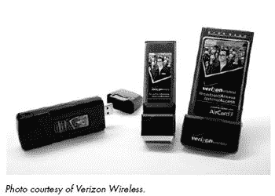
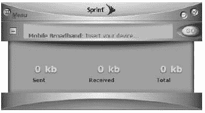

# 第十三章。Wi-Fi 的替代方案：无线宽带数据

Wi-Fi 并非连接电脑到互联网的唯一方式。还有其他几种方法，每种方法都提供独特的优点和缺点组合。对于固定安装，如家庭和办公网络，有线局域网和通过电力线的连接通常比 Wi-Fi 更快、更方便；其他无线电服务可能更适合连接智能手机、笔记本电脑或 PDA。

每种连接方法都是数据传输速度、访问便捷性、成本和其他特性之间的权衡。对于许多用户来说，无需搜索接入点即可使用的单一连接带来的额外便利性值得额外的成本和数据传输速度的牺牲。

本章介绍了目前可用的无线服务，并提供了关于选择最适合你特定需求的建议。

# Wi-Fi 有什么问题？

数千个 Wi-Fi 网络覆盖了北美和欧洲的大部分城市和郊区。几乎每台新的笔记本电脑都配备了 Wi-Fi 适配器，单独的插件适配器既便宜又容易安装。接入点既便宜又方便。Wi-Fi 网络连接通常快速且可靠。那么，有什么不喜欢的呢？

尽管 Wi-Fi 具有许多吸引人的特性，但它并非所有场合的理想无线服务。Wi-Fi 网络有以下缺点：

+   每次你移动到新位置时，你必须设置一个新的 Wi-Fi 连接，通常是通过不同的网络，该网络需要不同的账户。

+   公共 Wi-Fi 网络并非无处不在。仅仅因为你的电脑检测到几个 Wi-Fi 接入点的信号，并不意味着你可以连接到它们；其中许多可能是加密的私有网络。

+   Wi-Fi 网络的信号范围有限。除非你使用某种高增益天线，否则单接入点的网络通常在室外无法超过 300 英尺（100 米），如果电脑和基站之间有墙壁，那么可能更少。

+   广域校园网或更大的网络需要多个接入点，这可能会很昂贵，安装和维护也可能会很复杂。

+   每个 Wi-Fi 网络都需要单独的登录、密码和加密密钥。

+   Wi-Fi 网络的安全性不如大多数有线局域网；即使网络使用加密和地址过滤，一个有决心的窥探者也可能捕获并读取 Wi-Fi 数据。

+   使用 Wi-Fi 网络适配器可能会使你的电脑暴露给其他用户，他们可能读取你的文件并窃取你的身份。这种情况并不常见，但有可能发生。

这些问题中的任何一个都不应该阻止您使用 Wi-Fi；它通常比任何其他无线服务都快更便宜，有时它是唯一可用的选项。但仅仅因为笔记本电脑中内置了 Wi-Fi 适配器，并不意味着它总是连接到互联网的最佳方式。

# 宽带数据服务

每种宽带无线服务类型都使用一组不同的无线电频率和不同类型的调制方式，但从用户的角度来看，它们都非常相似。内置的网络适配器或外置的 PC 卡或 USB 适配器与覆盖整个大都市区、高速公路走廊或其他大型地理区域的基站网络交换数据。与 Wi-Fi 不同，在将计算机连接到互联网之前，无需搜索接入点；在服务区域内，您可以假设无论您在哪里，总会有可用的信号。将每种服务与其竞争对手区分开来的特性包括具体的覆盖范围、每月订阅费用、专有控制软件和数据传输速度。

广域宽带服务相对于 Wi-Fi 具有以下优势：

+   每个服务在整个区域内提供覆盖；从一个地点漫游到另一个地点没有问题。

+   不需要为多个热点或服务提供商维护单独的订阅。

+   您只需要一个连接配置文件就可以连接到任何地方；无需为每个接入点或服务提供商设置不同的配置文件。

+   服务提供商运营和维护接入点。

+   这些服务在授权频率上运行，因此与其他无线电信号源的干扰不是严重问题。

+   每个服务提供商都提供已经配置好其频率和调制类型的网络适配器硬件；无需（或可能）单独购买硬件。

实际上，如果您处于宽带无线服务提供商信号覆盖范围内，您可以打开无线适配器并期望连接到互联网。然而，许多广域宽带网络通常比 Wi-Fi 慢得多，而且每月订阅费用仍然相对较高（尽管这些条件可能在接下来的几年内发生变化）。直到宽带提供商扩大其服务区域并与其他运营商扩展漫游协议，没有任何单一服务提供接近于普遍的覆盖范围。

通常情况下，无线互联网服务的速度会随着单个接入点覆盖范围的扩大而降低，因此 Wi-Fi 链路几乎总是比蜂窝数据服务快得多。然而，也有一些例外：当 WiMAX 网络可用时，它们可能与 Wi-Fi 链路一样快。较老的移动电话调制解调器甚至更慢，但它们使用的是过时的技术（如 GPRS），因此它们不属于这次讨论的范围。

Wi-Fi 和宽带无线之间的速度差异可能非常明显，因此一些宽带控制程序可以在范围内选择 Wi-Fi 信号，并在只有该信号可用时切换到较慢的宽带服务。当苹果公司推出 iPhone 时，许多用户抱怨 AT&T 的宽带 EDGE 连接比 Wi-Fi 信号慢得多。

在未来，我们可以期待在新笔记本电脑中内置调制解调器，它们将自动在任何位置找到并使用最快的可用无线互联网连接；如果附近有快速的 Wi-Fi 热点，计算机将捕获并使用该信号，但如果找不到可用的 Wi-Fi 网络，它将通过您的蜂窝网络的较慢宽带服务连接。今天，一些宽带控制程序（如图 13-1 所示的 T-Mobile 连接管理器）允许您从同一窗口手动选择连接类型。

**图 13-1. T-Mobile 连接管理器控制 Wi-Fi 和宽带网络连接。**

在 T-Mobile 程序中，窗口右侧的面板显示了它检测到的 Wi-Fi 和 EDGE/GPRS 信号的相对信号强度。*EDGE/GPRS（增强型数据速率 GSM 进化/通用分组无线服务）*是 T-Mobile 用于其宽带无线服务的技术。如果较快的 EDGE 服务可用，程序将自动使用它；否则，它将降低到较慢的 GPRS 数据链路。当您选择要使用的服务类型时，您可以选择点击窗口中央的“连接”按钮或点击服务类型名称以查看可用信号列表。在下一代无线控制程序中，这一切都将自动完成；程序将选择最佳信号并自动将您的计算机连接到该网络。

# 技术比较

今天的宽带无线数据服务使用了几种不同的传输规范：其中一些，包括 EDGE（增强型数据 GSM 进化）和 EV-DO（优化数据进化），是最新一代蜂窝电话网络的一部分。其他则使用专用仅数据无线技术，如 WiMAX（全球微波接入互操作性）。

在北美，蜂窝服务提供商提供 EDGE 或 EV-DO 服务。如果您的蜂窝运营商使用 CDMA（码分多址）技术，其宽带无线数据服务使用 EV-DO；如果蜂窝服务使用 GSM（全球移动通信系统），其数据服务使用 EDGE。EDGE 和 EV-DO 有时被称为*3G（第三代蜂窝）*服务，但 EDGE 在技术上并不是真正的第三代技术。

这两种系统都提供可以覆盖大范围的数据网络，但各种蜂窝服务提供商仍在扩大他们的覆盖范围。在您承诺使用特定服务之前，测试您最常使用的特定位置是绝对必要的。

在 EDGE 和 EV-DO 之间可能存在相当大的速度差异；EDGE 的速度限制在平均 400 到 700Kbps。原始（修订版 0）EV-DO 网络的最大速度仅为大约 300 到 700Kbps，与 EDGE 相似，但较新的 EV-DO 修订版 A（通常称为*Rev. A*）网络在理想条件下可以以高达约 2.4Mbps 的最大下载速度运行（但平均速度通常在 1.0 到 1.5Mbps 左右，或者可能略快）。因此，您应该确保您的调制解调器和您的本地服务提供商都能够使用 Rev. A 信号。

Rev. A 并不是 EV-DO 发展的终点。硬件制造商高通已宣布，它已准备好开始生产修订版 B 芯片组（调制解调器、适配器和基站内部的必要集成电路），这将允许数据同时通过两个或三个无线电载波（类似于频道）传输。考虑到握手和其他网络开销，Rev. B 应该提供大约 4.5Mbps 的数据传输速度。等到宽带服务提供商完成他们的产品开发和市场营销，可能还需要几年时间，商业 Rev. B 服务才会可用。

无论是哪种网络类型（EDGE 或 EV-DO），都比拨号连接或 GPRS 连接有显著的改进，但与 Wi-Fi 或 EV-DO（Rev. A）网络相比，EDGE 网络连接相当慢。

EDGE 和 EV-DO 都提供比它们的上传速度（从您的计算机到互联网）快几倍的下载数据速度（从互联网到您的计算机）。除非您在玩多人游戏，发送大型音乐或视频文件，或者传输其他类型的大型文件，否则这可能对您的实际性能影响不大。

在美国或加拿大，通过 EDGE 或 EV-DO 网络提供的无线数据服务的价格大致相同（通常在 2007 年中期约为每月 60 美元），但你通常可以找到促销和特别优惠，可能会降低成本。至少，寻找包括免费网络适配器的优惠。当 WiMAX 和其他竞争性服务可用时，可以预期 EDGE 和 EV-DO 接入的价格将下降。

### 注意

*如果你选择低成本的按量宽带服务（而不是无限量的“任意吃”账户），请记住，价格是基于通过网络到和从你的电脑传输的总比特数。每次你的电脑检查新电子邮件或即时消息时，比特计数都会增加一小部分，即使你没有发送或接收新消息。所有这些无新消息的交换在一个月内可能会累积起来*。

许多宽带无线运营商提供选择网络适配器作为 PC Card 或 USB 设备。两者都包含类似的无线电，所以两种类型的性能可能相同。如果你的电脑有 PCMCIA 插槽，PC Card 通常比 USB 单元更方便，但当你在一个信号弱的位置使用电脑时，你可能会通过移动 USB 设备找到更强的信号。如果你在室内，有时通过将 USB 盒子靠近窗户或使用第三方信号增强器可以改善性能。图 13-2 显示了三种典型的宽带网络适配器。

**图 13-2. 宽带网络适配器有 USB、ExpressCard 和 PC Card 三种类型。**

与单独出售的 Wi-Fi 适配器不同，几乎所有的宽带无线设备要么是由网络服务提供商直接供应给新客户，要么是集成在新笔记本电脑和其他便携式设备中（通常作为额外付费选项）。可能直接从硬件制造商那里购买网络适配器，但这有几个原因是不明智的：它几乎肯定比随网络合同提供的适配器贵，一个通用的适配器不会包含每个服务提供商要求的特定固件，而且服务提供商的技术支持中心可能不愿意与你交谈。

### 注意

*当宽带适配器集成到新笔记本电脑中时，该适配器通常仅限于与笔记本电脑制造商或分销商有营销协议的单个服务提供商。大多数笔记本电脑供应商仅提供一到两个宽带服务提供商的接入，因此选择你想要使用的服务提供商非常重要。如果你的笔记本电脑没有你首选服务提供商的适配器，请订购不带内置宽带适配器的电脑，并使用你想要使用的运营商提供的单独 PC 卡*。

# 选择服务提供商

通常情况下，在你所在城镇或城市提供蜂窝移动电话服务的公司也提供宽带无线数据服务。

AT&T 是美国主要的国家级 EDGE 服务提供商。它的适配器可以作为低成本选项在许多品牌的笔记本电脑中找到，包括戴尔、联想、惠普和索尼，它也是苹果 iPhone 的专属宽带服务提供商（尽管快速的网络搜索应该会指向解锁 iPhone 的说明）。T-Mobile 的宽带网络也使用 EDGE。除非你居住在一个没有更快 EV-DO 服务的地区，否则较慢的 EDGE 网络服务可能不是最佳选择，因为 EV-DO 连接将明显更快。

美国主要的 EV-DO 服务提供商是 Verizon、Sprint 和 Alltel。几家其他蜂窝服务和电话公司也提供访问 EV-DO 无线数据网络，但其中大多数是三大运营商之一的服务转售商。例如，Qwest Wireless 提供自己的品牌 EV-DO 服务，但它使用 Sprint 网络。在阿拉斯加，主要的 EV-DO 提供商是 ACS 无线。在加拿大，TELUS 和 Bell Mobility（贝尔加拿大的一部分）在全国主要人口中心提供 EV-DO 服务，一些较小的运营商在特定省份提供自己的服务。

所有使用相同技术的服务提供商都从同一两个或三个制造商那里获取无线网络适配器和基站硬件，因此它们的性能和可靠性几乎相同。不同服务提供商之间最重要的区别通常是它们无线电塔的位置以及公司技术支持和计费人员的质量。

最佳的做法是对比两个或三个提供商的报价。每月的总费用、网络适配器的费用以及你预期访问的所有地点的覆盖范围都应该是你选择过程中的考虑因素。如果你出国旅行，寻找包含国际漫游的套餐。也可能有必要拨打每个公司的技术支持电话，看看你需要等待多长时间才能与现场技术人员取得联系，以及技术人员是否精通英语（或你的母语）。如果可能的话，要求对新服务进行简短的试用。大多数公司如果无法提供可接受的网络连接，都会让你在几天内退回适配器并取消账户。

许多移动电话公司提供宽带无线和移动电话服务的套餐，有时还包括长途电话和卫星电视等其他服务作为套餐的一部分；请致电你的账户代表或访问他们的零售店以获取具体详情。

## 覆盖范围

当你购买宽带无线数据服务时，首先要考虑的最重要的问题是服务提供商的信号是否覆盖了你可能使用的所有地点。如果覆盖区域（有时称为 *足迹*）不包括你小镇客户的商业场所或你旅行的公路走廊，那么在芝加哥或丹佛市中心的服务有多好都没有关系。

所有服务提供商都在不断向他们的覆盖区域添加新的地点，因此你不能总是相信销售员可能给你的印刷覆盖图。最可靠的覆盖图是每个运营商网站上的那些：

| **Sprint** [`www.sprint.com`](http://www.sprint.com) |
| --- |
| **T-Mobile** [`www.t-mobile.com/coverage`](http://www.t-mobile.com/coverage) |
| **Verizon** [`www.verizonwireless.com`](http://www.verizonwireless.com) |
| **AT&T** [`www.wireless.att.com/coverageviewer`](http://www.wireless.att.com/coverageviewer) |
| **Alltel** [`content.alltel.com/business/enhanced/mobilelink_coverage.jsp?state=nat`](http://content.alltel.com/business/enhanced/mobilelink_coverage.jsp?state=nat) |

如果你能让服务提供商让你在最可能使用服务的地方试用其服务，那将是最好的测试。寻找在购买前试用或满意保证的报价，允许你在一周或两周内退回网络适配器并取消订阅以获得全额退款。

## 数据速度

假设在你想要使用服务的地点，有多于一个服务提供商可以提供服务，那么提供最高数据传输速度的服务就是最佳选择。因此，EV-DO (Rev. A) 服务比 EV-DO (Rev. 0) 或 EDGE 服务更可取，任何类型的宽带服务都比老式的 GPRS 服务要好。

许多服务提供商正在逐步提高他们的高速覆盖范围，因此销售人员可能会告诉你，你的社区可能现在还没有高速服务，但很快就会到来。即使这个说法是真的，如果竞争对手今天就能提供宽带服务，那么这项服务应该是你的首选（至少目前是这样；当你的初始合同到期时，你可能需要重新考虑）。

如果你使用连接来接收高带宽网络内容，如流媒体音频和视频以及图像丰富的网页，选择能够提供最快连接的宽带数据服务尤为重要。另一方面，如果你仅使用无线互联网服务来发送电子邮件、即时消息和查看仅限于文本的网站，数据传输速度可能不如成本和良好的接收重要。

## 成本

与有线 DSL 或电缆调制解调器服务相比，宽带无线服务成本较高，而且与图书馆或咖啡店中的免费 Wi-Fi 访问相比，更是奢侈。因此，花时间和精力比较你所在地区所有服务提供商的报价是值得的。

假设当地无线服务都使用相同的技术（如果可能的话是 EV-DO Rev. A）并且每个服务的覆盖范围包括你预期携带电脑的所有地方，寻找最便宜的报价，无论是启动成本还是月费。

许多电话公司如果你从他们那里购买超过一项服务，会提供折扣套餐。如果你从同一家公司订购有线家庭或商业电话服务、长途、蜂窝移动语音和无线数据的一些组合，服务提供商可能会提供实质性的折扣。

### 注意事项

*一些服务提供商可能会提供更低的价格或免费的网络适配器，如果你承诺长期合同，通常是两年或更长时间。在你签署超过一年的合同之前，请阅读协议的条款和条件——今天的大甩卖可能比明年的竞争性交易更贵。随着无线技术的持续改进，你可能会后悔将自己锁定在相对较慢的网络服务中*。

## 选择网络适配器

一些宽带服务提供商将它们称为 *调制解调器* 而不是网络适配器，但几乎每个人都使用类似的 PC 卡和 USB 适配器。每个公司都加载了自己的授权无线电频率和固件，但基本调制解调器几乎都是一样的。

每个主要服务提供商都为新用户提供免费或非常低成本的调制解调器，以及一个或多个额外付费的替代方案。在选择适配器之前，仔细阅读规格说明，以确保调制解调器支持服务提供商的技术，无论是 EDGE 还是 EV-DO（Rev. A）。EV-DO（Rev. 0）和 GPRS 是较老、较慢的系统。

除非你需要 USB 适配器的额外灵活性或你的电脑需要 ExpressCard，否则请选择服务提供商的免费或最便宜的 PC 卡调制解调器。记住，PC 卡将在你的电脑内部运行，所以你不必关心它的外观——一个闪亮的昂贵调制解调器可能并不比便宜 50 美元或 100 美元的调制解调器工作得更好。

## 服务和支持

除了 Clearwire 之外的所有无线宽带服务提供商也都是蜂窝移动电话公司，因此你可以期待他们将以对待他们的手机用户相同的方式对待他们的无线数据客户。不幸的是，这不是好消息——在客户满意度方面得分低于蜂窝公司的行业只有航空公司、新闻媒体和有线电视公司（参见[`www.theacsi.org`](http://www.theacsi.org)的美国客户满意度指数）。

然而，最高和最低评分的服务提供商之间存在很大的差距，因此询问你的朋友和同事他们的经历，并在互联网和消费者出版物上寻找报告和评估通常很有帮助。在你阅读了两三个这样的比较之后，你将开始看到一种模式：所有运营商都有批评者，但其中一些似乎提供的服务比其他运营商更一致地好。

观察那些“我恨*运营商名称*”或“*公司*很糟糕”的网站和论坛也可能很有教育意义，但不要依赖它们获得客观报告。那些网站上发布关于他们糟糕经历报告的人是那些有过糟糕经历的人；他们可能不是公司客户的随机横截面。然而，当同样的投诉反复出现时，这可能是一个迹象，表明公司确实存在问题。而且，看到公司本身如何回应这些投诉也是有用的。

### 注意

*至少有一家公司试图通过在其他人之前抢注批评性的互联网域名来保护自己*。[Verizonsucks.com](http://Verizonsucks.com)、[verizonwirelesssucks.com](http://verizonwirelesssucks.com)、[verizonblows.com](http://verizonblows.com)、*以及* [verizonwirelessblows.com](http://verizonwirelessblows.com) *都注册给了 Verizon Trademark Services LLC*。

## 全球宽带无线服务

就像它们之前的蜂窝移动电话服务一样，EDGE 和 EV-DO 宽带无线数据服务在大多数工业化国家都是可用的。当你旅行时，可能找到你的服务提供商和一家或多家当地公司之间的漫游协议，但费用可能非常高。在你离开家之前，询问你的账户代表关于国际服务和漫游费用，或者咨询这个网站：[`www.gsmworld.com/roaming`](http://www.gsmworld.com/roaming)。

作为昂贵的国际漫游的替代方案，到达后通常在本地公司开设一个单独的账户会更便宜。到达机场后，寻找商店或亭子，或者尝试从这些网页中的链接之一：

| [`www.novatelwireless.com/regions`](http://www.novatelwireless.com/regions) |
| --- |
| [`www.gsmworld.com/roaming`](http://www.gsmworld.com/roaming) |
| [`en.wikipedia.org/wiki/List_of_Evolution-Data_Optimized_service-providers`](http://en.wikipedia.org/wiki/List_of_Evolution-Data_Optimized_service-providers) |
| [`www.3gtoday.com/wps/portal`](http://www.3gtoday.com/wps/portal)（点击**运营商**获取列表） |

# 连接到无线宽带网络

每个宽带服务提供商都与其网络适配器一起提供专有控制软件，但它们基本上都做同样的事情。例如，图 13-3 显示了威瑞森宽带和斯普林特移动宽带控制程序。图 13-1 中有一张 T-Mobile 控制程序的图片。其他运营商的控制程序提供类似的功能组合。

所有这些程序都提供通过点击连接或前往按钮手动设置连接或自动在每次运行程序时建立实时连接的选择。建立连接后，您可以使用网络浏览器、电子邮件或即时消息程序，以及任何其他互联网应用程序，就像您使用任何其他类型的互联网连接一样。

当您不使用互联网时，通常关闭无线适配器或将其从计算机的 PC 卡插槽中拔出是个好主意，尤其是如果您正在使用电池供电的计算机。当适配器关闭且互联网链接关闭时，您不会发送或接收无线电信号，无线入侵者没有机会（无论多小）捕获您的信号并窃取您的数据或读取您的文件。

**图 13-3. 两者都提供与无线网络适配器一起的控制软件。**

# 使用多台计算机

每个宽带无线账户都与一个单独的调制解调器或网络适配器绑定。如果您有多台便携式计算机，您可以选择将调制解调器从一个机器移动到另一个机器，或者获取多个账户，每个账户配备一个单独的调制解调器。然而，只要计算机上安装了控制软件，您就可以使用任何可移除的适配器连接到任何计算机；您不需要将适配器绑定到单个计算机。

如果您的家庭或企业拥有并使用多台计算机，您有多种选择：

+   您可以为每台计算机购买一个宽带账户和适配器。

+   您可以只购买一个账户，并将适配器移动到您当前使用的计算机上。如果您想在家庭或办公室的台式计算机和您在路上的笔记本电脑之间共享宽带账户，这可能是一个不错的选择。

+   您可以购买两个或更多账户，并为每个账户配备一个适配器。每次您或家庭成员（或同事）需要宽带服务时，您都可以从池中取一个适配器，用完后归还。

如果您或您的企业预计将使用超过一个宽带账户（每个账户配备一个适配器），请寻找套餐优惠。这可能不会列在宣传册中，但每个服务提供商可能都有各种家庭计划以及针对大中小企业提供的特殊优惠，包括免费适配器、较低的月费，甚至可能还有免费的月份或更多。继续询问“这是您最好的优惠吗？”直到您确信您得到了一个真正的好优惠。请记住，您是一个潜在的重要客户，代表着服务提供商的持续收入和销售人员的佣金。

# 宽带安全

没有无线网络是完全安全的，但宽带技术比 Wi-Fi 更接近，因为服务不与其他无线电服务共享其操作频率，并且服务提供商控制网络连接两端的硬件。EDGE 和 EV-DO 系统都使用与移动电话相同的方法，为每个调制解调器分配一个唯一的电子序列号（ESN），并限制对网络（和互联网）的访问仅限于与活动账户对应的 ESN。此外，宽带连接到互联网不会通过局域网，因此入侵者使用宽带调制解调器作为访问您计算机上存储的数据的网关的风险很小或没有。

理论上，使用微波扫描仪监控宽带无线电信号或创建一个欺骗宽带基站的收发器是可能的，但我们谈论的是昂贵的设备和复杂的解码软件。这可能可以做到，但它需要比破解 Wi-Fi 信号多得多的努力。

加密不是一种选择，但如果你使用宽带账户连接到文件服务器、电子邮件服务器或企业网络，你可以使用与通过 Wi-Fi 链接相同的 VPN。第十五章（ch15.html "第十五章。虚拟专用网络"）解释了如何设置和使用 VPN。

# 清洁无线、Sprint 及其他预 WiMAX 服务

WiMAX 是另一种宽带技术，它将 Wi-Fi 网络的速度和 EDGE 和 EV-DO 的便利性结合在一个网络服务中。当它们可用时，WiMAX 网络预计将以大约 70Mbps 的最大速度传输数据。即使你允许大量的开销，这显然比当前一代宽带蜂窝服务能提供的任何东西都要快得多。

然而，完整的 WiMAX 服务最早要到 2008 年中旬才能广泛可用，而且服务提供商可能需要在那之后几年内安装基站并在全国范围内提供全面覆盖。到那时，今天的 EDGE 和 EV-DO 网络可能会被更快的 EV-DO（Rev. B）和其他高速宽带方法所取代。与此同时，美国两大 WiMAX 运营商清洁无线和 Sprint 宽带正在使用一种较慢的预 WiMAX 技术，其速度最高约为 1.5Mbps（许多用户报告说，根据他们与最近无线电塔的位置关系，连接速度甚至更慢）。在两家公司之间，预 WiMAX 正在越来越多的地点提供。预 WiMAX 服务最初作为办公室、家庭和其他固定位置的无线替代 DSL 和电缆互联网服务提供，但清洁无线还提供可插入的 PC 卡，并且最终，Clearwire 和 Sprint 的 Xohm 服务将作为新笔记本电脑的选项内置。当这些变得广泛可用时，它们很可能会成为无线网络市场的竞争者。

预 WiMAX 系统与有线 DSL 或电缆调制解调器连接到互联网一样容易使用。在你将账户信息输入调制解调器后，它会将这些详细信息存储在其固件中，因此它是即插即用：每次你打开电脑和调制解调器时，你都有一个活跃的宽带互联网连接。

如果清洁无线固定位置预 WiMAX 调制解调器有任何指示（当这本书编写时 PC 卡尚未可用），使用相同技术的 PC 卡和笔记本电脑在基站范围内将提供干净和可靠的互联网连接。然而，一些用户报告说，当塔楼太远或者在塔楼和他们的调制解调器之间有茂密的植被时，会出现接收问题。

Clearwire 建议将调制解调器（带内置内部天线）放置在窗户旁边以获得最佳性能，而 Sprint 则使用安装在屋顶或外墙上的独立收发天线。在固定无线系统（如家庭或办公室网络）中修复信号质量通常是可能的，但当你使用笔记本电脑在多个位置使用相同的技术时，这就不太实用了。目前尚不清楚预 WiMAX 作为任何地点无线互联网接入方法是否可行。当真正的 WiMAX 可用时，现有的预 WiMAX 服务提供商将为所有订阅者提供免费或低成本的新硬件和软件。

我们可以期待“真正的”WiMAX 服务将更加可靠，因为它使用了一种完全不同的无线电调制类型，并且（可能）使用了一组不同的频率。WiMAX 信号将比当前一代的预 WiMAX 服务更容易接收，并且对干扰的敏感性更低。从长远来看，WiMAX 可能会提供几乎理想的宽带和广泛覆盖的组合，无需在每个新地点寻找新的信号和账户。如果 WiMAX 实现了其技术潜力，如果商业模式产生了足够的资金来建设广泛的网络，并且如果 WiMAX 提供商不从有线电视和移动电话公司那里学习到糟糕的客户服务经验，它可能会成为无线互联网接入的明显选择。与此同时，预 WiMAX 值得一看，但不要期望过高。

# 汽车和其他车辆中的宽带无线

随着宽带互联网接入变得可行，许多人开始在他们汽车、卡车和其他车辆中使用在线服务和资源是不可避免的。今天，许多通勤铁路、公交线和渡轮提供车载 Wi-Fi，类似的服务也即将出现在商用客机上，但这主要是乘客从他们的座位上使用笔记本电脑和其他便携式设备。为私人车辆提供的移动互联网服务开辟了一个全新的可能性世界。

在其他方面，车载实时互联网连接可以提供即时消息、电子邮件以及某种形式的有限访问万维网，以及实时交通报告和更新 GPS 接收器和车载导航显示屏中的地图和数据库。作为车载收音机的补充或替代品，互联网接收器还可以让驾驶员和乘客收听来自世界各地的流媒体广播电台和其他音频服务；当当地电台没有值得你注意的内容时，你可以切换到互联网，并从更广泛的音乐或谈话节目中进行选择，即使它来自数千英里之外的电台。

任何移动互联网连接都需要以下这些元素：

+   来自无线互联网服务提供商的信号

+   用于发送和接收无线信号的天线

+   计算机中的无线网络接口、PDA 或特殊的互联网设备

在车辆中，这些元素中的每一个都有特殊的要求，这些要求通常不适用于固定连接。信号必须在足够大的区域内可访问，这样在以相对较高的速度（意味着任何比步行快的速度）从一个地方移动到另一个地方时不会消失；天线必须有绕过车辆金属外壳产生的屏蔽的方法；电脑或其他设备必须紧凑且易于使用，尤其是如果驾驶员在车辆行驶时必须操作它。

今天，在汽车中建立互联网连接的最简单方法就是使用笔记本电脑、PDA 或其他带有宽带无线适配器的便携式设备，可能通过 USB 接口连接到仪表盘上的收音机/CD 播放器。如果汽车停在一个公共 Wi-Fi 信号范围内，你可以使用 Wi-Fi 代替宽带适配器。当然，除非汽车停着，否则驾驶员不应尝试使用电脑。

显然，便携式计算机中的控制和连接软件以及网络浏览器程序并不仅仅因为设备坐在汽车的乘客座位上而改变。它仍然以完全相同的方式工作，无论是你的笔记本电脑在咖啡馆的桌子上还是机场候机区的膝盖上。最大的区别是，你和电脑可能以相对较高的速度移动，因此网络可能会将你的连接从一座基站或无线电塔转移到另一座。

宽带无线和 WiMAX 网络被设计来处理这种类型的切换，所以当你移动时，你可能不会注意到任何变化。然而，如果你移动到一个网络有很多活跃用户的位置，你可能会注意到你的连接速度有所下降。

当然，如果你开车去偏远的地方，那里没有附近的塔，你可能会完全失去连接。如果你留在主要公路上，这种情况不太可能发生，因为网络服务提供商沿那些道路有相当好的覆盖范围，但如果你决定走风景路线，那就得自己负责了。如果你绝对需要保持连接，在离家之前，请咨询服务提供商的网站以获取他们当前的覆盖图。

只要你处于服务提供商信号范围内，你也可以使用宽带无线服务从休闲车或船上连接，只要你的设备在服务提供商的信号范围内。处理这种连接的最简单方法是使用笔记本电脑和电源适配器，该适配器直接从船或汽车的电气系统中获取电力。为了获得最佳性能，你希望在车辆的屋顶或船的桅杆上安装一个外部天线。

## TracNet

一种便携式计算机的替代方案是 KVH TracNet 100 移动互联网接收器([`www.kvh.com/Products/product.asp?id=123`](http://www.kvh.com/Products/product.asp?id=123))，如图图 13-4 所示。它是一款专用网络路由器，带有 PC 卡插槽用于 EV-DO 适配器，可选的外部天线适用于汽车、船只或休闲车辆，输出音频和视频连接到汽车的内置娱乐系统，以及一个 Wi-Fi 热点，可以连接到您的笔记本电脑或 PDA。整个设备使用 12 伏直流电源，因此可以在汽车的电气系统上运行。

**图 13-4. KVH TracNet 100 通过车载视频监控器提供互联网的移动接入。**

TracNet 系统附带 Kyocera EV-DO 适配器，已配置为 Verizon 无线网络；然而，如果您有不同服务提供商的账户，如果您将 Verizon 适配器更换为任何其他使用相同型号适配器卡的 EV-DO 服务提供商的适配器，它应该同样有效（请参阅[`www.kyocera-wireless.com/wireless/where-to-buy.htm`](http://www.kyocera-wireless.com/wireless/where-to-buy.htm)以获取服务提供商列表）。如果您已经拥有 Verizon 的宽带无线账户，您可以在笔记本电脑和 TracNet 路由器之间移动适配器卡。

TracNet 系统并不便宜；路由器、天线、键盘和遥控器的成本约为 2000 美元，加上对 MSN TV 和 Verizon 无线宽带接入服务的单独月度订阅，因此它并非适合所有人。但作为移动互联网接入的演示，它是一个合法的起点，并且现在就可以使用。在未来，我们可以期待看到更简单、成本更低的系统，既作为新车的选项，也作为售后配件。

## 外部天线

无论您使用的是车内内置无线系统还是便携式单元，您可能都需要在车辆的车顶或后甲板上安装外部天线，或者用某种粘合剂固定在车窗上，因为车辆的金属外壳通常是一个有效的屏蔽体，会阻挡无线电信号。宽带无线数据服务使用与蜂窝移动电话相同的无线电频率，因此只要您能找到一根电缆将电话或适配器连接到天线，相同的天线就可以在两者上使用。

不同无线适配器的天线连接器的确切类型和位置各不相同，因此使用带有正确匹配连接器的天线电缆至关重要。寻找具有正确类型电缆连接器的车载天线的第一处地方是当地专门安装车载移动电话的电子产品经销商。即使他们没有现货中恰好正确的天线，他们也可能知道在哪里为你找到。如果你在当地找不到天线和电缆，可以尝试在线经销商，如[wpsantennas.com](http://wpsantennas.com) ([`www.wpsantennas.com`](http://www.wpsantennas.com))或 Wilson Electronics ([`wilsonelectronics.com`](http://wilsonelectronics.com))。这两家公司都有常见无线适配器和移动电话的在线列表，以及匹配天线电缆的交叉引用。

## 安全问题

在驾驶时操作电脑可能比使用移动电话更具干扰性。同时安全地使用键盘或数字键盘，或查看电脑显示屏，并集中注意力在您面前的道路上是不可能的。甚至不要考虑这样做。要么让乘客操作电脑，要么在你尝试自己操作之前，将车驶到路边。

这本应该是不言而喻的，但开车时使用移动电话的人数似乎暗示了相反的情况。请不要通过任何分散你注意力的行为来危及你自己、你的乘客以及附近的行人或其他驾驶员，这些行为可能会让你无法控制那辆庞大、昂贵、沉重的汽车或卡车。这真的不值得冒这个风险。

还重要的是要记住，放在停驶车辆座椅上的笔记本电脑或个人数字助理可能会吸引窃贼的注意，他们可能会闯入车辆并偷走它。记住，无论何时离开车辆，都要将电脑和其他贵重物品放在隐蔽处或视线之外。
