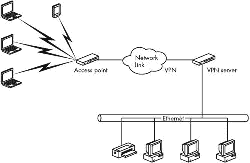
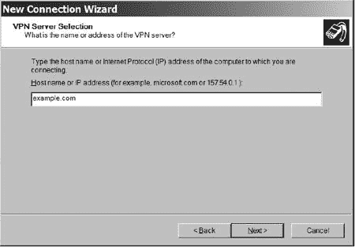
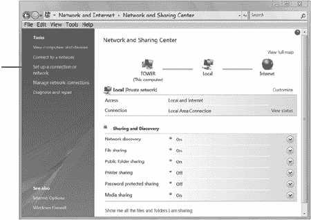
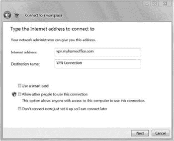
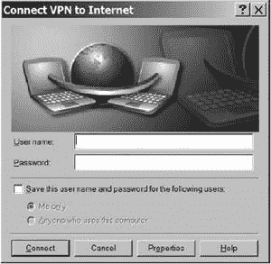
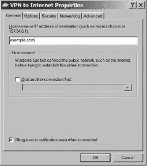
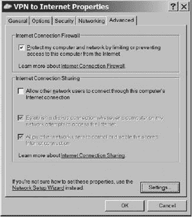
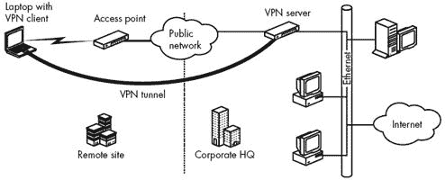

# 第十五章：虚拟专用网络

Wi-Fi 规范中的安全工具不足以保护通过无线网络传输的数据。有什么解决办法？虚拟专用网络（VPN）可以为从无线网络客户端到任何有网络连接的主机传输的数据增加另一种有效的安全形式。

VPN 使用*数据隧道*通过加密通道连接网络上的两个点。端点可以是一个网络客户端和一个网络服务器、一对客户端计算机或其他设备，或者一对局域网的网关。通过公共网络（如互联网）传输的数据与其他网络流量完全隔离。它使用登录和密码认证来限制对授权用户的访问；它加密数据，使其对拦截它的入侵者来说难以理解；并且它使用数据认证来维护每个数据包的完整性，并确保所有数据都来自合法的网络客户端。

### 注意

*VPN 功能在 ISO 模型中的 IP 或网络层运行。因此，它们可以在物理层运行的 Wi-Fi 或其他无线协议之上运行。VPN 还可以跨越包含多个物理介质（例如，将数据传递到有线以太网网络的无线链路）的网络连接传输数据。换句话说，VPN 是一种端到端服务；数据使用无线链路、以太网电缆、普通电话线，或者这些以及其他传输媒体的组合，这都无关紧要。这为（或提供了 WEP 或 WPA 加密的替代方案）增加了另一个安全层，后者仅适用于网络的无线部分*。

在传统的 VPN 中，远程用户可以登录到远程局域网，并获取与本地客户端可用的所有相同网络服务。VPN 通常用于将企业网络扩展到分支机构，以及从家中或从现场位置（如客户或客户的办公室）连接用户到局域网。

通过 VPN 服务器建立的连接对网络中的其他设备来说，看起来就像是一个直接连接到局域网的客户端设备。唯一的区别是，VPN 中的数据通过 VPN 驱动器和公共网络传输，而不是直接从网络适配器传输到局域网。图 15-1 展示了远程网络到 VPN 的典型连接。

**图 15-1. 通过 VPN，远程网络可以连接到局域网。**

所有相同的安全优势也适用于通过无线链路隧道传输的短距离 VPN 和从无线网络开始并转发数据到远程服务器的长距离 VPN。VPN 有两种不同的用途：一种是在客户端设备和接入点之间仅扩展到无线网络部分的*本地*VPN，以及一种将 VPN 编码数据通过公共网络（如互联网或拨号电话连接）传输到 VPN 服务器之外的*扩展网络*。

本地、短距离的 VPN 对无线网络操作者来说很有趣，因为它们为无线链接增加了另一层安全性。由于无线客户端和网络接入点之间的数据是加密的（使用比 WPA 加密更安全的算法），因此任何可能正在监听无线电信号的第三方都无法理解这些数据；因为接入点的 VPN 服务器不会接受未使用正确 VPN 驱动程序和密码的无线客户端的数据链接，入侵者无法通过将恶意客户端与接入点关联来入侵网络。

无线 VPN 的目标是保护客户端与接入点之间的无线连接，并阻止未经授权的用户访问。因此，隔离和加密的数据只能在一个房间内移动，而不是数百或数千英里。当然，接入点也可能通过互联网将 VPN 编码的数据转发到另一个位置的网络上。

图 15-2 展示了无线网络连接到 VPN 的情况。VPN 服务器位于无线接入点和主机局域网之间，因此所有通过网络无线部分传输的数据包都被编码。为了清晰起见，该图将 VPN 服务器显示为一个独立的组件，但将 VPN 安全添加到无线局域网的最实用方法是使用集成了 VPN 支持的路由器或网关。提供 VPN 功能的路由器可以从多个供应商处获得，包括思科（Cisco）、网件（NETGEAR）和腾达（TRENDnet）。

**图 15-2. VPN 提供无线网络与互联网网关或本地局域网之间的安全连接。**

# VPN 方法

VPN 通过一个或多个中间网络将数据传输到另一个网络上的目的地。VPN 的隧道客户端通过添加一个带有路由信息的新头，将现有的数据包或帧封装起来，指示它们如何到达 VPN 的终点。通过中间网络的传输路径被称为隧道。在隧道的另一端，VPN 服务器移除隧道头，并将数据转发到由下一层头指定的目的地。隧道的具体形式对数据没有影响，因为数据将隧道视为点对点连接。

隧道头可以有多种形式。在 VPN 中最广泛使用的方法是点对点隧道协议（PPTP）、第二层隧道协议（L2TP）和 IP 安全（IPsec）模式。PPTP 和 L2TP 可以通过 IP、IPX 和 NetBEUI 网络传输数据；IPsec 仅限于 IP 网络。客户端和服务器必须使用相同的协议。

在 PPTP 和 L2TP 中，客户端和服务器必须在开始交换数据之前为每次传输配置隧道。配置参数包括通过中间网络的路径以及加密和压缩规范。当传输完成后，客户端和服务器终止连接并关闭隧道。不幸的是，一些数据安全分析师已经发现了 PPTP 的重大缺陷，这可能会允许入侵者突破基于 PPTP 的 VPN，窃取密码，解码加密，读取数据或对网络服务器造成损害。因此，PPTP 头不是安全的，不应使用。

在 IPsec 网络链路中，客户端和服务器必须在开始交换数据之前通过一个单独的事务在中间网络中建立隧道。

L2TP 和 IPsec 都各有其特定的优缺点，但它们都足够好，可以创建一个无线网络客户端和接入点之间的安全链接。三者之间的差异主要是技术性的，而不是实际性的。您可以在微软的白皮书《Windows 2000 中的虚拟专用网络：概述》中找到对这三个协议内部操作的优秀解释，该白皮书可在网上找到，网址为[`www.microsoft.com/windows2000/docs/VPNoverview.doc`](http://www.microsoft.com/windows2000/docs/VPNoverview.doc)（但请记住，在撰写该白皮书之后才发现了 PPTP 网络中的缺陷）。

# VPN 服务器

VPN 服务器（或主机）可以是 Unix 或 Windows 服务器的一部分，或者可以集成到独立的网络路由器或网关中。如果您的网络已经使用一台单独的计算机作为专用服务器，则可以使用该计算机作为 VPN 服务器。如果您的网络尚未拥有完整的网络服务器，那么单独的硬件可能是一个更好的选择。

数十家 VPN 设备制造商提供路由器、网关和其他支持一个或多个 VPN 协议的产品。这些产品各自具有不同的功能集，因此在您决定使用它们之前，测试您自己网络中打算使用的客户端和服务器特定的组合是至关重要的。虚拟专用网络联盟（VPNC）正在朝着一系列互操作性测试和认证标准迈进（类似于无线以太网设备的 Wi-Fi 标准）。VPNC 网站[`www.vpnc.org`](http://www.vpnc.org)列出了通过互操作性测试的产品，并提供有关大量 VPN 产品的信息来源链接。

## 配置无线 VPN 的 Windows 服务器

如果您决定使用 Windows 服务器，您可以使用 L2TP 或 IPsec 与 Windows Server 2003 或 Windows Server 2008 一起使用；如果您的服务器运行的是较旧的 Windows NT Server 4.0 或 Windows 2000 Server 软件，您将限于使用 L2TP（或严重有缺陷的 PPTP）。服务器还需要两个网络接口卡：一个连接到有线 LAN 或互联网网关，另一个连接到无线网络。连接到无线端口的接口卡通常直接连接到无线接入点的以太网端口。在 Windows 服务器上安装 L2TP 主机的确切过程在每个 Windows 版本中都略有不同，但一般步骤是相同的。有关配置特定操作系统的具体信息，请参阅在线帮助屏幕和 Microsoft 为您的服务器操作系统提供的资源包和其他在线文档。以下各节以一般术语描述配置步骤。

### 注意

*有关使用 Microsoft 服务器部署和配置 VPN 的更多信息，请参阅从[`technet.microsoft.com/en-us/network/bb545442.aspx`](http://technet.microsoft.com/en-us/network/bb545442.aspx)链接的 Microsoft TechNet 文章*。

### 配置有线网络连接

到局域网或其他网络的链接是通过网络适配器的一个专用连接。此连接的网络连接配置文件必须包括分配给此连接的 IP 地址和子网掩码，以及分配给网络网关的默认网关地址。

### 配置 VPN 连接

VPN 连接通常是一个以太网链路，连接到一个或多个接入点。服务器上用于 VPN 连接的连接配置文件必须包括分配给此端口的 IP 地址和子网掩码，以及此网络使用的 DNS 和 WINS 名称服务器的地址。

### 将远程访问服务器配置为路由器

服务器必须使用静态路由或使每个无线客户端从有线网络可到达的路由协议。

### 启用并配置服务器以支持 L2TP 客户端

Windows 使用远程访问服务（RAS）和点对点协议（PPP）来建立 VPN 连接。路由和远程访问服务启用 RAS。VPN 连接需要以下 RAS 配置选项：

| **身份验证方法** 加密 PPTP 连接使用 MS-CHAP 或 EAP-TLS 身份验证方法。 |
| --- |
| **身份验证提供者** 可以使用 Windows 2000 安全或外部 RADIUS 服务器来验证网络客户端。 |
| **IP 路由** IP 路由和基于 IP 的远程访问必须处于激活状态。如果有线网络作为无线客户端的 DHCP 服务器，DHCP 必须处于激活状态。 |

### 配置 L2TP 端口

将每个 L2TP 端口设置为接受远程访问。

### 配置网络过滤器

输入和输出过滤器阻止远程访问服务器发送和接收非 VPN 客户端起源的数据。这些过滤器将拒绝来自或发送到未经授权用户的数据，因此入侵者将无法通过无线网络获得互联网连接（或有线局域网的连接）。

### 配置远程访问策略

每个无线客户端的远程访问权限必须设置为允许访问 RAS 服务器。端口类型必须设置为正确的 VPN 协议（例如，PPTP 或 L2TP），并且每个连接的配置文件必须包括使用的加密类型。在 Windows 中，有三个加密强度选项：

| **基本** 使用 40 位加密密钥 |
| --- |
| **强** 使用 56 位加密密钥 |
| **最强** 使用 128 位加密密钥 |

## Unix VPN 服务器

所有的 BSD 变体（包括 FreeBSD、NetBSD、OpenBSD 和 Mac OS X）都将 IPsec VPN 客户端和服务器作为发布包的一部分。

Linux FreeS/WAN 是 Linux 上最流行的 IPsec 实现。请访问[`www.freeswan.org`](http://www.freeswan.org)下载、文档和访问 FreeS/WAN 用户社区。

OpenVPN 是 Linux、BSD、OS X 和 Windows 的基于 SSL 的 VPN 解决方案。它易于配置，提供路由 VPN（特定目的地的流量通过 VPN 发送）和隧道虚拟接口（模拟物理层以太网设备，可以非 IP 流量通过 VPN 传输）。OpenVPN 可以在[`openvpn.net`](http://openvpn.net)找到。

如果您正在使用 Linux 防火墙，您可能需要考虑 VPN 伪装。Linux 使用 Linux 内核中的 IP 伪装功能，在多个客户端之间共享单个互联网连接。VPN 伪装是支持 IPsec 客户端的 IP 伪装部分。Linux VPN 伪装的 HOWTO 可以在[`tldp.org/HOWTO/VPN-Masquerade-HOWTO.html`](http://tldp.org/HOWTO/VPN-Masquerade-HOWTO.html)找到。

## 带内置 VPN 支持的网络硬件

运行 Linux 或 Unix 的 BSD 版本的专用计算机可以是一个低成本的 VPN 服务器；如果您正在使用 Windows 服务器进行其他目的，它也可以以较低或没有额外成本提供 VPN 支持。但完整的网络服务器通常是针对相对简单问题的更大、更复杂的解决方案。它们并不总是最佳选择。许多交换机、路由器、网关和防火墙设备也包含 VPN 支持。思科、3COM、英特尔和其他许多制造商制造的 VPN 产品通常比单独的计算机更容易安装和维护。

在无线网络中，VPN 服务器不需要像大型企业网络中的服务器那样拥有所有相同的铃声和哨声。如图 15-3 所示，位于无线接入点和企业网络有线部分之间的路由器可以很容易地充当 VPN 服务器。在家庭网络中，VPN 服务器可以在接入点和 DSL 或电缆调制解调器之间运行。

**图 15-3. 网络路由器也可以作为无线网络的 VPN 服务器。**

独立的 VPN 客户端硬件位于计算机和网络之间，但它在无线网络中并不那么实用，因为无线网络适配器几乎总是直接插入到计算机本身。

# VPN 客户端软件

无线客户端通过其无线以太网链路连接到网络接入点，操作系统将其视为 LAN 连接。要通过该连接设置 VPN 隧道，您必须将隧道协议作为网络服务安装。

## 配置 Windows 以支持 VPN

Windows XP 和 Vista 包括对 VPN 的支持，但它不是默认安装的一部分，因此设置 VPN 客户端的第一步是安装协议。

在 Windows XP 和 Windows Vista 中，向导使整个过程变得简单。在 XP 中，按照以下步骤设置 VPN 连接：

1.  从控制面板中打开**网络连接**。

1.  双击**新建连接向导**图标。

1.  当出现如图 15-4 所示的“网络连接类型”窗口时，选择**连接到我的工作场所的网络**选项。

    

    **图 15-4. 创建 VPN 链接的选项指定连接到工作场所网络，但也适用于无线 VPN。**

1.  在网络连接窗口（如图 15-5 所示），选择**虚拟专用网络连接**选项并点击**下一步**按钮。

1.  在连接名称窗口中，为无线 VPN 连接输入一个名称。此名称将显示在此连接的桌面快捷方式上。点击**下一步**按钮。

    

    **图 15-5. 选择虚拟专用网络连接选项以创建 VPN 连接。**

1.  在公共网络窗口（如图 15-6 所示），选择**不拨初始连接**选项，因为您不需要通过电话线连接。点击**下一步**按钮。

    

    **图 15-6. 在无线网络中，VPN 不需要拨号连接。**

1.  在如图 15-7 所示的 VPN 服务器选择窗口中，输入 VPN 服务器的 IP 地址。

    

    **图 15-7. 主机名或 IP 地址标识了无线链路另一端的 VPN 服务器。**

1.  点击**下一步**按钮，然后点击**完成**按钮以完成向导。

在 Vista 中，按照以下步骤操作：

1.  打开**控制面板**。

1.  打开**网络和共享中心**。

1.  在网络和共享中心左侧的任务列表中（如图 15-8 所示），选择**设置连接或网络**选项。将打开选择连接选项窗口。

1.  选择**连接到工作场所**选项并点击**下一步**按钮。向导将询问您是否要使用现有连接。

1.  选择**否，创建新的连接**选项。向导将询问您是否要使用 VPN 或拨号连接。

    

    **图 15-8. 使用设置连接或网络选项来创建 VPN 链接。**

1.  选择**互联网连接（VPN）**选项。向导将在如图 15-9 所示的屏幕中要求详细信息。

    

    **图 15-9. 使用此屏幕配置您的 VPN。**

1.  在互联网地址字段中输入网络管理员提供的 VPN 服务器地址。这可以是数字地址或名称。

1.  在目标名称字段中输入您想在您的计算机上使用的 VPN 连接名称。

1.  如果您想测试连接，请点击**下一步**按钮。如果您不想连接，请选择**现在不连接**选项并点击**下一步**。向导将要求您输入姓名和密码。

1.  输入您用于此 VPN 账户的名称和密码。如果您想让您的计算机自动发送您的密码，请启用**记住此密码**选项。点击**创建**按钮以建立 VPN 连接并关闭向导。

要在 Windows 中桌面创建 VPN 的快捷方式，请按照以下步骤操作：

1.  在 XP 中，打开控制面板并选择**网络连接**。在 Vista 中，打开控制面板，选择**网络和共享中心**，然后从任务列表中选择**管理网络连接**。

1.  在网络连接窗口中，右键单击 VPN 的图标或列表，从弹出菜单中选择**创建快捷方式**。

1.  将会弹出一个窗口询问您是否要将快捷方式放置在桌面上。点击**是**按钮。桌面将出现一个快捷方式。

## 微软 L2TP/IPsec VPN 客户端

微软在 Windows 2000、Windows XP 和 Windows Vista 中包含了一个用于具有互联网协议安全（IPsec）的层二隧道协议（L2TP）连接的客户端。对于 Windows 98、Windows Me 和 Windows NT Workstation 4.0，可以从[`download.microsoft.com/download/win98/Install/1.0/W9XNT4Me/EN-US/msl2tp.exe`](http://download.microsoft.com/download/win98/Install/1.0/W9XNT4Me/EN-US/msl2tp.exe)免费下载类似的客户端程序。

## 在 Windows 中建立连接

当 VPN 连接配置文件就绪后，连接 Windows 客户端到主机 LAN 或通过无线 VPN 链接连接到互联网变得容易：只需双击连接配置文件的图标。Windows 将要求输入登录名和密码，然后建立连接。

如果您的无线连接是您最常用来连接互联网的方法，您可以将其设置为默认连接，这样每次您运行网络应用程序（如网页浏览器或电子邮件客户端程序）时都会打开。要将 VPN 配置文件设置为默认，请按照以下步骤操作：

1.  从控制面板打开**互联网属性**窗口。

1.  选择**连接**选项卡。

1.  在拨号设置部分，从列表中选择 VPN 连接配置文件并点击**设置默认**按钮。

1.  点击**设置**按钮。在拨号设置部分，在 VPN 服务器上输入您的登录名和密码。

1.  选择**在没有网络连接时拨号**选项。

## Windows XP 选项

Windows XP 和 Windows Vista 提供了许多在早期 Windows 版本中不可用的 VPN 选项。要设置这些选项，请按照以下步骤操作：

1.  从控制面板打开 **网络连接** 窗口。如果您在桌面上有 VPN 连接的快捷方式，您可以跳过此步骤。

1.  双击 VPN 图标。将出现一个类似于 图 15-10 中的“连接 VPN 到 Internet”窗口。

    

    **图 15-10. 使用“连接 VPN 到 Internet”窗口在 Windows XP 中配置 VPN。**

1.  点击 **属性** 按钮。您的 VPN 客户端属性窗口将出现。图 15-11 显示了“连接 VPN 到 Internet”属性窗口的通用选项卡。

    

    **图 15-11. 通用选项卡控制 VPN 连接的目标。**

1.  VPN 服务器的 IP 地址应该已经在“目标的主机名或 IP 地址”字段中可见。**先拨号连接另一个连接**选项应该被禁用。点击 **网络** 选项卡以查看 图 15-12 中显示的对话框。

    

    **图 15-12. 网络选项卡控制 VPN 的网络配置选项。**

1.  从 VPN 服务器类型菜单中选择您的网络将使用的 VPN 服务器类型。如果您不知道 VPN 类型，请选择自动选项。

1.  从连接项目列表中选择 Internet 协议 (TCP/IP) 或 Internet 协议版本 4，然后点击 **属性** 按钮以更改网络设置，包括使用 DHCP 服务器或手动设置 IP 地址和 DNS。

1.  点击 **高级** 选项卡以打开 图 15-13 中显示的对话框。如果您的网络尚未由防火墙保护，请选择互联网连接防火墙选项。这将保护无线客户端免受通过互联网发起的攻击。

    

    **图 15-13. 高级选项卡控制 VPN 上的防火墙使用。**

VPN 到互联网属性窗口中的“选项”和“安全”选项卡控制通常不会从默认设置更改的连接选项。希望更改安全设置的网管应指导用户如何配置这些选项以满足网络的特定要求。

## Unix VPN 客户端

在运行 Unix 的计算机上使用 VPN 客户端比从 Windows 机器上运行 VPN 更复杂，因为客户端没有集成到内核中。因此，您必须找到一个与您要使用的 Unix 版本和 VPN 协议兼容的客户端程序。没有单个程序提供通用的 VPN 客户端，而且某些组合，如 BSD Unix 版本上的 PPTP，似乎根本不存在。

### IPsec 客户端

Linux 用户可以从几个 IPsec 实现中进行选择：

| **FreeS/WAN** [`www.freeswan.org`](http://www.freeswan.org) |
| --- |
| **pipsec** [`perso.enst.fr/~beyssac/pipsec`](http://perso.enst.fr/~beyssac/pipsec) |
| **NIST Cerberus** [`w3.antd.nist.gov/tools/cerberus`](http://w3.antd.nist.gov/tools/cerberus) |

IPsec 包含在 OpenBSD 发行版中。您可以在[`www2.papamike.ca:8082/tutorials/pub/obsd_ipsec.html`](http://www2.papamike.ca:8082/tutorials/pub/obsd_ipsec.html)找到解释如何使用它的教程。

FreeBSD 的 IPsec 实现位于[`www.r4k.net/ipsec`](http://www.r4k.net/ipsec)。

关于 NetBSD IPsec 的信息，请参阅[`www.netbsd.org/Documentation/network/ipsec`](http://www.netbsd.org/Documentation/network/ipsec)。

# 使用无线 VPN

当你设计 VPN 以保护通过无线链路传输的网络数据时，了解 VPN 隧道端点的确切位置非常重要。如果 VPN 仅通过无线链路进行隧道，如图 15-14 所示，网络看起来将与没有 VPN 时完全相同。图 15-14. 在接入点处服务器的无线 VPN 通过无线链路保护数据，但它不会扩展网络。

**图 15-14. 在接入点处服务器的无线 VPN 通过无线链路保护数据，但它不会扩展网络。**

如果 VPN 扩展到无线接入点之外，通过广域网（如互联网）传输，如图 15-15 所示，无线网络客户端似乎可以成为另一栋楼或大陆另一端的局域网的一部分。[图 15-15. VPN 可以包括无线链路和通过互联网到企业网络的城际连接。]

那么，您的无线 VPN 应该扩展多远？这取决于您希望网络实现什么目标。如果您的无线网络是为了在办公室、工厂或校园支持笔记本电脑和其他便携式计算机，那么将服务器放置在接入点网络和您的企业局域网连接之间是有意义的。这将保护无线用户的数据，并阻止未经授权的用户进入网络，但不会影响通过有线电缆连接到局域网的其它用户。

**图 15-15. VPN 可以包括无线链路以及通过互联网到企业网络的城际连接。**

在家庭或小型企业网络中，接入点可能连接到提供办公室或房屋中所有计算机互联网接入的互联网网关路由器。如果接入点和网关是独立的设备，您可以在两者之间放置 VPN 服务器。如果接入点和网关在同一盒子里，您将不得不在所有计算机上使用 VPN 客户端，包括连接到网关的有线桌面计算机，并将客户端放置在网关和互联网调制解调器之间，就像图 15-16 中的网络一样，或者您将不得不忽略网关上的有线以太网端口，并在 VPN 服务器和互联网调制解调器之间添加一个新的集线器或交换机，如图 15-17](ch15s04.html#in_this_network_the_vpn_only_protects_th "图 15-17. 在这个网络中，VPN 仅保护无线链路。")所示。

**图 15-16. 在小型局域网中，您可以在每台计算机上使用 VPN 客户端。**

**图 15-17. 在这个网络中，VPN 仅保护无线链路。**

## 建立连接

如果您大部分时间使用带有 VPN 保护的无线局域网，您应该将 VPN 配置文件设置为默认连接。每次运行网络应用程序时，计算机都会尝试通过 VPN 连接，除非您首先打开不同的连接（例如拨号电话线）。

在 Windows 中设置连接配置文件为默认，请打开**网络连接**窗口。右键单击您想要选择的配置文件的图标，然后从菜单中选择**设置为默认**选项。

要连接到非默认的 VPN，双击 VPN 连接配置文件的图标。你将看到一个登录窗口，类似于图 15-18。输入你的用户名和密码，然后点击**连接**按钮。如果 VPN 服务器识别到你的账户，它将建立连接。

**图 15-18. VPN 连接通常需要用户名和密码**

## 绕过 VPN

尽管你通常使用 VPN 来保护你的无线数据，但你有时可能想要在不使用 VPN 的情况下发送明文数据。例如，你可能在办公室或家中使用本地 VPN 连接你的计算机和互联网网关路由器，但当你在一个机场、咖啡馆或其他不受 VPN 保护的地点使用同一台计算机和网络适配器时，你可以直接连接到互联网。

如果你是一名网络管理员，你可能偶尔需要更改 Wi-Fi 网络的内部设置。控制 Wi-Fi 网络操作频道、SSID 和其他选项的配置程序是基于 Web 的实用程序，它们源自接入点。因为接入点位于 VPN 隧道内，所以无法通过 VPN 向接入点发送命令。重要的是要记住，当你需要时可以使用 VPN，当你想要直接连接时可以绕过它。

## 通过公共网络使用 VPN

当你在机场或会议中心通过公共网络连接到你的公司局域网，或者如果你正在使用宽带无线服务时，你可以通过他们的网络连接到互联网，并进一步连接到你的公司 VPN 服务器。因为在你发起 VPN 连接之前，你必须登录到公共网络，所以你应该创建一个额外的**通过公共网络 VPN**连接配置文件，除了你在办公室使用的那个。该配置文件应指向你的公司 VPN 服务器，但不应该是你的默认连接。

要在运行 Windows 的计算机上通过公共网络连接，请按照以下步骤操作：

1.  打开带有无线网络适配器的计算机。

1.  使用你的无线配置实用程序选择你想要使用的公共网络。

1.  启动 Internet Explorer、Netscape Navigator 或其他 Web 浏览器。你将看到公共网络的登录屏幕。

1.  如果计算机没有自动完成，请输入你的账户名和密码。公共网络将确认你的登录。

1.  最小化浏览器窗口并打开**网络连接**窗口或找到桌面上的 VPN 快捷方式。

1.  双击通过公共网络配置文件中的 VPN 图标。计算机将通过互联网连接到你的公司局域网。

1.  输入您企业网络的登录名和密码。

如果此程序对您的 VPN 不起作用，请向您的网络管理员寻求帮助。

VPN（虚拟私人网络）是许多网络为远程用户制定的安全计划的重要组成部分。当 VPN 运行时，它也是连接到您的局域网（LAN）的一种极其方便的方式。只需几键或几点击，您就可以从任何有互联网接入的地方获得与您在办公室相同的网络资源访问权限。如果任何互联网技术可以消除您与局域网、办公室和同事之间的明显距离，那么 VPN 就是这种技术。
