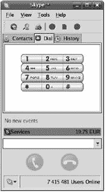
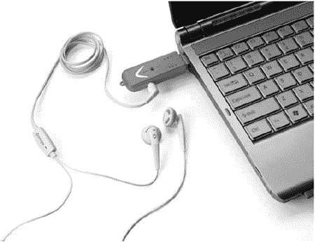
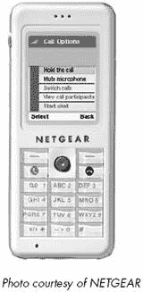

# 第十六章。使用宽带进行电话通话

超过一个世纪以来，被称为*公用电话交换网络（PSTN）*的一套专用电缆、交换机和无线电链路连接了全世界的电话。当你打电话时，PSTN 会在你的电话和分配给请求的唯一电话号码的电话之间创建一个直接连接。电话行业将这种基本连接称为 POTS（普通老式电话服务，发音类似于*pots*和*pans*）。互联网是一个独立的系统，它使用不同的规则和方法将电脑连接起来。计算机数据（包括数字音频）不需要持续连接，因此互联网连接可以使用数据包交换（如第一章中所述）比旧式的 PSTN 更快、更有效地传输数据。

当你将电话或麦克风连接到电脑并将你的声音转换为一系列数字数据包时，你可以通过互联网将这些数据包发送到特定的目的地，在那里接收者的电脑将数据包转换回模拟音频流并通过扬声器或电话听筒播放音频。通过互联网移动语音通信的技术被称为*VoIP（互联网协议语音）*。

如果你的通话接收者有一个连接到互联网的电脑，你可以完全绕过 PSTN 并通过互联网路由通话，使用接收者的互联网地址来识别通话的目的地。但也可以在互联网和 PSTN 之间双向转接通话。你可以在互联网上发起通话并将其路由到 PSTN，或者你可以使用你的 POTS 线路拨打连接到电脑的电话。

使用 VoIP 有几种可能的方式：

+   完全通过互联网进行电脑到电脑的通话。

+   在连接到互联网的电脑上发起通话，并将其尽可能接近目的地地转接到公用电话交换网络（PSTN），然后完成到接收者电话线的通话。

+   在电话线上发起通话，并拨打本地 VoIP 服务提供商，然后通过互联网连接到接收者的电脑。

+   在电话线上发起通话，连接到本地 VoIP 服务提供商，然后通过互联网将通话连接到远端的 VoIP 中心，在那里通话被转接到公用电话交换网络（PSTN）并继续到接收者的电话线。

VoIP 相对于传统电话系统通话具有几个可能的优点。首先，它通常要便宜得多，因为长途电话没有长途通话费用。其次，在电话服务不可靠的地方，互联网的错误纠正数据包交换有时可以提供比糟糕的电话线路更好的声音和更少的掉话（但强调的是*有时*——同样经常，POTS 电话会比 VoIP 更清晰）。第三，在传统电话线路或移动电话信号可能不可用的地方，可以通过 Wi-Fi 或宽带无线链路使用 VoIP。

另一方面，VoIP 通常不如 PSTN 可靠和一致，因为 VoIP 数据包（以及其他实时音频或视频流）可能会被所有其他数据忽略的干扰和噪声源中断或延迟。如果你的电子邮件消息需要几分钟才能到达，但你期望电话立即接通接收者，这毫无区别。VoIP 通话的声音质量有时可能明显比通过 PSTN 的通话差。实际上，长途通话成本的降低通常是使用 VoIP 的最有说服力的理由。

数十家服务提供商提供使用 VoIP 而不是老式 PSTN 的本地或长途电话服务。有些被宣传为本地拨号音公司的替代品，有些是低成本的全局长途服务，还有一些在多个偏远地点提供本地电话号码，这样当你打电话时，对方就不必支付长途电话费用。你可以在多个网站上找到 VoIP 服务的目录和用户评价，包括[`www.voipreview.org`](http://www.voipreview.org)、[`www.voip-info.org`](http://www.voip-info.org)和[`www.voipmonitor.net/VoIP+Providers.aspx`](http://www.voipmonitor.net/VoIP+Providers.aspx)。

### 注意

*与 VoIP 电话通话相关的有两个重要的安全问题。即使你的 VoIP 电话或便携式计算机使用电池供电，接入点和互联网网关几乎肯定使用国内交流电；如果你的电力中断，你将无法使用 VoIP 电话，但传统电话可能仍然可以继续工作。而且，在紧急情况下拨打 911（或你国家相应的电话号码）时，VoIP 网络会带来特殊的挑战，因为 VoIP 拨打 911 可能无法将你连接到最近的公共安全应答点（PSAP），或者即使连接上了，也可能无法准确地将你的电话号码和地址传输给 PSAP 操作员*。

使用 VoIP 的方式有很多，但本书主要讨论宽带无线技术，因此我们将讨论范围限制在那些使用 Wi-Fi 或宽带数据服务连接到互联网的 VoIP 服务上。这些服务可以分为两大类：允许用户通过 Wi-Fi 或宽带无线数据网络从便携式计算机或 PDA 发起电话通话的软件和服务，以及使用 Wi-Fi 链路通过互联网发送和接收 VoIP 通话的无线 Wi-Fi 电话。您不需要 Wi-Fi 或宽带无线网络来使用 VoIP，但如果无线网络是您互联网连接工具的一部分，您应该知道 VoIP 是可用的，并且这两种技术可以协同工作。

# 宽带无线和 WiMAX 上的 VoIP

任何可以通过互联网发起电话通话的 VoIP 服务都可以使用具有宽带无线连接的便携式计算机发起这些通话。

通常，这个过程大致如下：

1.  将麦克风和扬声器或耳机连接到计算机（或使用计算机的内置麦克风和扬声器）。

1.  打开无线网络连接到互联网。

1.  使用网页浏览器或无线服务提供商的控制程序登录。

1.  使用 VoIP 服务提供商的软件发起电话通话。

计算机建立互联网连接后，VoIP 软件会将该连接视为任何其他互联网链接。例如，图 16-1 显示了 Windows、Macintosh 和 Linux 的 Skype 通话界面。要拨打一个电话号码，选择**打电话**或**拨号**标签页，点击绿色的电话按钮连接到 Skype，然后输入电话号码或使用鼠标在屏幕键盘上输入号码。您可以在[`www.skype.com`](http://www.skype.com)注册 Skype 账户并下载软件。

Skype 的软件还包括个人电话簿，因此您可以使用程序的联系人数组发起通话，而无需重新输入电话号码。

**图 16-1. Skype 为 Windows、Mac OS X 和 Linux 提供通话软件**

Vonage ([`www.vonage.com`](http://www.vonage.com)) 提供类似的服务，但它使用一个预装了其呼叫软件的特殊 USB 闪存驱动器（如图 16-2 所示），并附带一个麦克风插座和立体声耳机。要拨打电话，将闪存驱动器插入 USB 插座，将耳机插入耳朵，等待 Vonage Talk 软件启动。

**图 16-2. Vonage 的 USB 闪存驱动器包括呼叫软件和耳机麦克风线。**

许多其他 VoIP 服务提供商提供类似的服务。他们各自组织了不同的呼叫发起软件，并且每个都有不同的定价计划，因此在您承诺长期订阅之前，您可能想要比较几个服务。在[`www.voipreview.org`](http://www.voipreview.org)上的评论可以告诉您许多提供商的其他用户的体验。

要通过您的 VoIP 账户接收来电，您必须从您的 VoIP 服务提供商的网站上选择一个区号和电话号码，并遵循他们的说明来设置入站账户。VoIP 电话号码就像任何其他电话号码一样，所以任何有电话的人都可以使用该号码给您打电话。大多数服务提供商要么对无限入站通话收取固定费用，要么按分钟或按通话收费几便士。

您不必根据您当地的区号或甚至您自己的国家选择电话号码。如果您在遥远的地方有客户或朋友（或两者都有），您可以选择一个或多个号码，让他们通过本地通话联系到您。例如，如果您住在加利福尼亚州，您在香港、英格兰和加拿大有家人，您可以为您的 VoIP 账户选择香港、伦敦和温哥华的本地电话号码，并允许您的亲戚无需拨打昂贵的国际长途电话就能联系到您。

请记住，只有当链接处于活动状态时，您才能通过无线链接接收来电。与有线 DSL 或电缆调制解调器连接不同，您的 Wi-Fi 或宽带数据连接只有在无线控制程序运行时才是活跃的。因此，如果您期望接收 VoIP 号码的来电，您可能需要订阅服务提供商的语音信箱服务。

### 注意

*务必比较 VoIP 服务的实际成本与您现有的手机费用。如果您已经从同一服务提供商那里获得了移动电话和宽带数据账户，那么使用 VoIP 而不是手机可能没有真正的优势。移动服务提供商为这两种服务使用相同的基站，因此您可能不会在手机无法工作的地区找到无线数据覆盖。而且如果您的移动电话计费计划包括免费的长途通话，VoIP 可能不会提供任何真正的节省*。

# Wi-Fi 语音

Wi-Fi 电话是无绳电话，它们通过 Wi-Fi 接入点或热点以及 VoIP 发送和接收电话通话。当你将 VoIP 电话设备和 VoIP 账户与 Wi-Fi 网络结合时，你可以创建一个不需要专用电话线路或蜂窝电话账户的电话连接。你还会得到一个真正丑陋的缩写：要么是 VoWiFi，要么是 wVoIP，这取决于你查看的位置。

大多数 VoIP 服务使用会话初始化协议 (SIP) 规范来控制互联网电话通话和其他多媒体服务。SIP 与控制万维网的超文本传输协议 (HTTP) 相当。VoWiFi 电话必须支持 SIP 或连接到支持 SIP 的计算机或路由器。VoWiFi 电话通话使用 SIP 来控制通过连接到互联网的 Wi-Fi 基站发送和接收电话的无线电话。SIP 配置设置包括 VoIP 服务提供商的 IP 地址和分配给 VoIP 账户的电话号码。

图 16-3 展示了使用 D-Link VoIP 电话的典型 VoWiFi 连接。无线电话在家或路上使用 Wi-Fi 链接连接到 VoIP 服务提供商，服务提供商将通话转接到 VoIP 订户或 PSTN 电话号码。

Skype 是最早提供 VoWiFi 电话的 VoIP 提供商之一。NETGEAR SPH101 Wi-Fi 电话（如图 图 16-4

**图 16-3. 通过 Wi-Fi 连接的 VoIP 电话可以通过家庭网络或 Wi-Fi 热点连接到互联网。**

**图 16-4. NETGEAR 的 SPH101 Skype Wi-Fi 电话通过互联网处理电话呼叫。**

纽扣 N800 互联网平板电脑（如图图 16-5)，也提供预配置的 VoWiFi 电话。其他电话不仅限于单一 VoIP 服务。这些电话具有 SIP 配置屏幕，允许用户通过电话键盘或通过连接到电话的 USB 端口连接的计算机指定 VoIP 服务提供商、账户信息和其他设置。

**图 16-5. 纽扣 N800 互联网平板电脑包括 Skype 电话服务以及其他互联网功能。**

例如，图 16-6 显示了 D-Link DPH-540S VoIP 电话的 SIP 设置网页屏幕。每种品牌和型号的 VoIP 电话似乎都以不同的方式组织配置屏幕，因此您需要查阅用户手册以获取适用于您电话的具体说明。您的 VoIP 服务提供商将提供每个配置字段所需的具体信息。

**图 16-6. SIP 设置屏幕包含您的 VoIP 电话连接特定服务提供商所需的信息。**

### 注意

*当您评估用于 VoWiFi 电话的 VoIP 服务提供商时，请确保服务提供商不需要基于 Web 的登录，因为您将无法使用您的电话登录到该服务。VoWiFi 电话的另一个缺点是您将无法使用需要基于 Web 登录的 Wi-Fi 网络，包括许多机场和酒店的热点*。

在大多数情况下，通过电脑或 VoWiFi 手机进行 VoIP 电话通话并不足以成为设置新的 Wi-Fi 接入点或宽带无线数据账户的充分理由，但如果你已经拥有某种无线连接，VoIP 可能成为电子邮件、即时消息和其他互联网通信渠道的便捷补充。如果你没有携带传统的移动电话与笔记本电脑或 PDA 一起使用，VoIP 可以在你处于 Wi-Fi 信号范围内时提供一种方便且经济的发送和接收电话通话的方式。
