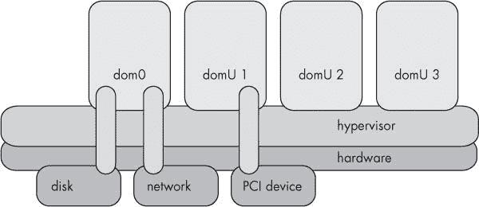
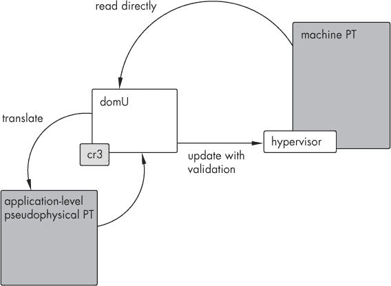
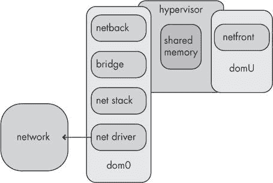
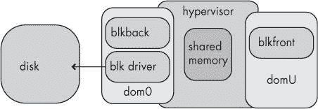

# 第一章。XEN：高级概述

我们将首先解释 Xen 与其他虚拟化技术不同的地方，然后提供一些关于 Xen 如何工作以及其组件如何组合的底层细节。

# 虚拟化原理

首先，我们可能需要提到，即使是配备现代多任务操作系统的最新、最快的计算机，一次也只能执行一条指令.^([8]) 现在，你说，“但是我的计算机正在同时执行许多任务。甚至现在，我可以看到时钟在运行，听到音乐在播放，下载文件，和朋友们聊天，所有这些都在同一时间进行。”这是真的。然而，实际上发生的情况是，计算机在这些不同任务之间切换得如此之快，以至于延迟变得难以察觉。就像电影是由一系列静态图像组成，给人以运动错觉一样，计算机执行的任务交织得如此紧密，以至于看起来是同时进行的。

虚拟化只是将这个比喻扩展了一点点。通常，这种多路复用是在操作系统的指导下进行的，操作系统的作用是监督任务并确保每个任务都能获得其公平的 CPU 时间。因为操作系统必须因此对任务进行*调度*以在 CPU 上运行，所以操作系统的这个方面被称为*调度器*。在 Xen 虚拟化中，发生的过程相同，整个操作系统取代了任务的位置。调度方面由 Xen 内核处理，该内核在“监督”客户操作系统之上运行，因此我们称之为*管理程序*。

当然，事情并不那么简单——操作系统，即使是经过修改以适应 Xen 的操作系统，也比应用程序使用更不同、更全面的假设集，并且在这些假设之间切换几乎必然涉及更多的复杂性。

因此，让我们看看传统上是如何进行虚拟化的，以及 Xen 的设计是如何新颖和不同的。传统的虚拟机旨在以任何方式模仿真实机器，以至于在虚拟机内部无法判断它不是真实的。为了保持这种错觉，完全虚拟化的机器会拦截尝试访问硬件的尝试，并在软件中模拟该硬件的功能——从而与虚拟机内的应用程序保持完美的兼容性。这一层间接性使得虚拟机非常慢。

Xen 通过一种称为*Para 虚拟化*的方法绕过这种减速——*Para*作为前缀意味着*类似*或*并行*。正如其名所示，它不是传统意义上的“真实”虚拟化，因为它不试图提供一个无缝的机器幻觉。Xen 仅向托管操作系统呈现底层硬件的部分抽象，将机器的一些方面作为*限制*暴露给客户操作系统，客户操作系统需要知道它在 Xen 上运行，并相应地处理某些硬件交互。

### 注意

*较新的处理器集成了对硬件虚拟化的支持，允许未经修改的操作系统在 Xen 下运行。有关详细信息，请参阅第十二章*。

这些限制中的大多数——出于设计考虑——对系统用户来说并不明显。为了在 Xen 下运行，客户操作系统内核需要修改，以便例如，它向 Xen 请求内存而不是直接分配。Xen 的设计目标之一是在客户操作系统的硬件相关部分进行这些更改，而不改变内核与用户级软件之间的接口。

这个设计目标通过确保现有的二进制文件在 Xen 客户操作系统上无需修改即可运行，并且虚拟机在大多数方面将表现得与真实机器完全一样，至少从系统最终用户的角度来看是这样。

因此，Xen 以高性能的 Para 虚拟化环境为代价，换取了无缝虚拟化。原始 Xen 开发者最初提出这个项目的论文，“Xen 与虚拟化艺术”，^([9]) 强调了这一点，说“Para 虚拟化对于在 x86 等不合作的机器架构上实现高性能和强资源隔离是必要的。”这并不像“Para 虚拟化使计算机变快”那么简单——例如，I/O 可能会导致昂贵的上下文切换，但它通常比其他方法快。我们通常假设 Xen 客户在物理硬件上的运行速度大约是其原生速度的 95%，假设机器上的其他客户空闲。

然而，虚拟化并非仅通过 Para 虚拟化一种方式来运行虚拟机。存在两种竞争性的方法：全虚拟化和操作系统级别的虚拟化。

* * *

^([8]) 当然，SMP 和多核 CPU 使得这一点并不完全成立，我们在流水线、超标量执行等方面做了极大的简化，但原则仍然适用——在任何时刻，每个核心只做一件事。

^([9]) 请参阅[`www.cl.cam.ac.uk/research/srg/netos/papers/2003-xensosp.pdf`](http://www.cl.cam.ac.uk/research/srg/netos/papers/2003-xensosp.pdf)。

# 虚拟化技术：全虚拟化

并非所有虚拟化方法都使用 Xen 的方法。虚拟化软件有三种类型。在一种极端情况下，你有*完全虚拟化*，或仿真，其中虚拟机是硬件的软件模拟，无论是真实的还是虚构的——只要存在驱动程序，这并不重要。这类产品包括 VMware 和 QEMU。

### 注意

*你可能会问，这种虚构的硬件是什么？除了明显的“不真实”答案之外，一个很好的例子是 VTPM 驱动程序。TPM（可信平台模块）硬件相对不常见，但它有一些潜在的代码签名应用——例如，确保正在运行的内核是正确的，而不是由 rootkit 或病毒放置的假内核。因此，Xen 为 domUs 提供了一个虚拟 TPM*。

在完全虚拟化的情况下，未经修改的^([10]) 操作系统“托管”一个用户空间程序，该程序模拟一个“客户”操作系统运行的机器。这是一种流行的方法，因为它不需要以任何方式修改客户操作系统。它还有这样的优势，即虚拟化架构可以与主机架构完全不同——例如，QEMU 可以在 IA-32 主机上模拟 MIPS 处理器以及一系列其他芯片。

然而，这种程度的硬件独立性是以巨大的速度惩罚为代价的。未经加速的 QEMU 比本地执行慢一个数量级，而加速的 QEMU 或 VMware ESX 服务器只能在模拟机器与底层硬件相同架构的情况下加速。在这种情况下，对于正常使用来说，全仿真器的硬件多功能性增加并不比 Xen 有显著优势。

VMware 是目前最知名的完全虚拟化产品供应商，拥有强大的工具集、广泛的支持和强大的品牌。VMware 的最近版本通过尽可能在原地运行指令并在必要时动态转换代码来解决速度问题。尽管这种方法很优雅，并且不需要修改客户操作系统，但它不如 Xen 快，因此在生产环境或全职工作环境中不太受欢迎。

* * *

^([10]) 或者稍微修改过的操作系统——例如，QEMU 具有 KQEMU 内核模块，它通过允许在可能的情况下直接在处理器上运行来加速模拟代码。

# 虚拟化技术：操作系统虚拟化

在另一种极端情况下是*操作系统级别的虚拟化*，其中被虚拟化的是操作系统环境，而不是完整的机器。FreeBSD 监狱和 Solaris 容器采用这种方法。

操作系统虚拟化认为操作系统已经提供，或者至少可以被配置为提供足够的隔离来执行正常虚拟机用户期望的一切——在全局范围内安装软件、在客户机中升级系统库而不影响主机中的库，等等。因此，操作系统虚拟化不是模拟物理硬件，而是使用操作系统功能模拟一个完整的操作系统用户空间。

FreeBSD 监狱和 Solaris 容器（或区域）是两种流行的操作系统级别虚拟化实现。两者都源自经典的 Unix `chroot`监狱。其想法是，被监禁的进程只能访问位于某个目录下的文件系统的一部分——对于这个进程来说，文件系统的其余部分，简单地讲，是不存在的。如果我们把操作系统安装到那个目录中，它就可以被认为是一个完整的虚拟环境。监狱和区域通过限制某些系统调用并提供虚拟网络接口来扩展这个概念，以增强虚拟机之间的隔离。尽管这非常有用，但它既不如完整的虚拟机有用，也不如灵活。例如，由于监狱共享内核，因此内核恐慌将导致硬件上的所有虚拟机崩溃。

然而，由于它们绕过了虚拟化硬件的开销，虚拟化机器可以与本地执行一样快——事实上，它们就是本地的。

操作系统虚拟化和 Xen 相互补充，在不同的情境下都很有用，甚至可能同时使用。例如，可以想象给用户分配一个单独的 Xen 虚拟机（VM），然后他可以将它分区成多个区域（Zones）供自己使用。

# 虚拟化：Xen 的方法

最后，在两者之间，有一种叫做*半虚拟化*的技术，它依赖于操作系统被修改以与一种“超级操作系统”协同工作，我们称之为*虚拟管理程序*。这正是 Xen 所采用的方法。

## 半虚拟化的工作原理

Xen 通过引入一个非常小、非常紧凑且专注于硬件的软件片段来工作，该软件直接在硬件上运行并为虚拟化操作系统提供服务。¹¹

Xen 对虚拟化的方法消除了主机操作系统和客户操作系统之间的大部分分裂。全虚拟化和操作系统级别的虚拟化有一个明显的区别——主机操作系统是拥有完全权限的那个。在 Xen 中，只有虚拟管理程序（hypervisor）拥有完全权限，并且它被设计得尽可能小和有限。

与这种“主机/客人”的划分不同，虚拟机管理程序依赖于一个受信任的客人操作系统（domain 0，*驱动域*，或者更非正式地，*dom0*）来提供硬件驱动程序、内核和用户空间。这个特权域被独特地区分开来，是虚拟机管理程序允许访问设备并执行控制功能的域。通过这样做，Xen 的开发者确保虚拟机管理程序保持小巧且易于维护，并且尽可能占用最少的内存。图 1-1 展示了这种关系。

Figure 1-1. 这里展示了带有域的虚拟机管理程序。注意虚拟机管理程序直接在硬件上运行，但它本身并不中介对磁盘和网络设备的访问。相反，dom0 直接与磁盘和网络设备交互，为其他域提供服务。在这个图中，domU 1 还充当一个未命名的 PCI 设备的驱动域。

### 注意

*另请参阅“使用 Xen 虚拟机监控器安全访问硬件”，Fraser 等人.^([12]) 此外，还可以存在非-dom0 的驱动域——然而，在没有 IOMMU（I/O 内存管理单元）的情况下，它们在当前硬件上不被推荐，因此这里不会涉及。有关 IOMMU 开发的更多信息，请参阅第十二章*。

Domain 0 的特权操作大致分为两类。首先，dom0 作为一个区域，用于管理 Xen。从 dom0 出发，管理员可以控制机器上运行的其它域——创建、销毁、保存、恢复等。网络和存储设备也可以被操作——创建、呈现给内核、分配给 domUs 等。

第二，dom0 对硬件具有独特的特权访问权限。domain 0 的内核拥有通常的硬件驱动程序，并使用它们将硬件设备的抽象导出给虚拟机管理程序，然后传递给虚拟机。想象一下这台机器就像一辆车，dom0 就像是司机。他也是一个乘客，但拥有其他乘客没有的特权和责任。

* * *

^([11]) 有些人可能会称 Xen 虚拟机管理程序为微内核，而有些人则不会。

^([12]) 查看 [`www.cl.cam.ac.uk/research/srg/netos/papers/2004-oasis-ngio.pdf`](http://www.cl.cam.ac.uk/research/srg/netos/papers/2004-oasis-ngio.pdf)。

# Xen 的底层：详细情况

因此，牢记这个虚拟设备的概念，问题变成了：计算机在最低级别需要提供什么？Xen 的开发者深入考虑了这个问题，并得出结论，Xen 必须管理**CPU 时间、中断、内存、块设备**和**网络**。

虚拟机管理程序的工作方式与传统操作系统的核心非常相似，将 CPU 时间和资源分发给在其下运行的操作系统，这些操作系统再将其分配给各自的进程。正如现代操作系统可以透明地暂停一个进程一样，Xen 虚拟机管理程序可以暂停一个操作系统，暂时将控制权交给另一个操作系统，然后无缝地重新启动暂停的系统。

由于 Xen 被设计成小巧简单，虚拟机管理程序与其下运行的操作系统使用非常少数量定义良好的接口进行交互，Xen 团队将这些接口称为**超调用**。

这些超调用取代了标准操作系统的系统调用，具有类似的接口。实际上，它们具有相同的功能——允许用户代码以受信任代码可以控制和管理的的方式进行特权操作。

超调用有几个设计目标和要求。首先，它们是**异步的**，这样超调用就不会阻塞其他进程或其他操作系统——当一个域等待超调用完成时，另一个域可以获取一些 CPU 时间。其次，它们很小、简单且定义明确——与 Linux 的 300 多个系统调用相比，Xen 只有大约 50 个超调用。最后，超调用使用一个通用的通知系统与 Xen 虚拟机管理程序进行交互。

## 调度

无论是否进行 Xen 虚拟化，CPU 仍然是一个物理对象，受所有混乱和难以处理的物理现实法则的约束。它一次只能执行一条指令，因此对它注意力的各种需求必须进行调度。Xen 根据客户操作系统发出的指令在 CPU 上调度进程运行，同时根据其自己的计算，确定在任何给定时间哪个客户机应该有权访问 CPU。

每个客户机维护自己的内部队列，指定下一个要运行的指令——本质上就是哪个进程获得 CPU 时间片。在一个普通机器上，操作系统会在物理 CPU 上运行队列头部的进程。（在 Linux 中，是运行队列。）在虚拟机上，它反而会通知 Xen 运行该进程一定时间，以域虚拟术语表示。

客户机还可以与 Xen“预约”时间，根据域虚拟定时器或系统定时器，在稍后请求中断和 CPU 时间。

域虚拟定时器主要用于进程之间的内部调度——domU 内核可以请求虚拟机管理程序在经过一定量的虚拟时间后抢占一个任务并运行另一个任务。请注意，域实际上并不直接在 CPU 上调度进程——这种硬件交互必须由虚拟机管理程序处理。

系统定时器用于对现实世界时间敏感的事件，例如网络。使用系统定时器，域可以暂时放弃 CPU 并请求在适当的时间醒来以填充网络缓冲区或发送下一个 ping。

管理员还可以调整 Xen 用于向域分配资源的调度参数。有几种不同的算法，其有用程度各不相同。有关调度的更多详细信息，请参阅第七章。

## 中断

在计算机术语中，*中断*是请求注意的信号。中断通常发生在某些硬件需要与其控制软件（即驱动程序）交互时（即，驱动程序）。传统上，中断必须立即处理，并且所有其他进程都必须等待直到中断处理程序完成。在虚拟化的上下文中，这是明显不可接受的。

因此，Xen 会拦截中断，而不是直接将它们传递给客户域。这允许 Xen 保持对硬件的控制，*调度*中断服务，而不是仅仅做出反应。域可以提前向虚拟机管理程序注册中断处理程序。然后，当中断到来时，Xen 通知适当的客户域并为其安排执行。在域等待执行时发生的中断会被合并成一个漂亮的包，避免不必要的通知。这也为 Xen 的性能做出了贡献，因为域之间的上下文切换是昂贵的。

## 内存

虚拟机管理程序对本地化和绝对化的内存都拥有权限。它必须为所有域分配内存，但它只处理物理内存和页表——客户操作系统处理所有其他内存管理功能。

结果证明，这几乎满足了任何明智的实现者的需求。在 x86 架构下，内存管理既困难又晦涩。Xen 的作者以一种经典的低调方式指出，“x86 处理器使用了一种复杂的混合内存管理方案。”图 1-2

图 1-2. 让我们以翻译应用程序给出的地址为例。首先，在左侧，我们有给出的地址。这由段选择器和偏移量组成。MMU 在 GDT（全局描述符表）中查找段选择器，以找到该段在线性地址空间中的位置，这是进程可访问的完整地址空间（通常是 4GB）。然后，偏移量在该段内充当地址。这给处理器提供了一个相对于进程地址空间的线性地址。然后 MMU 将该地址分解为两个索引和一个偏移量——首先它通过页目录找到正确的页表，然后它在页表中找到正确的页，最后它使用偏移量返回一个机器地址——实际的物理内存。

与物理内存一样，虚拟内存是逐字访问的，通过编号的地址。物理地址和虚拟地址之间的映射由 *页表* 处理，它们将物理内存块与虚拟内存页关联起来。

这种抽象级别甚至适用于机器上只运行一个操作系统的情况。它是虚拟化的基本形式之一，如此普遍以至于大多数非程序员都未注意到。

Xen 在这一点上介入，作为页表的唯一守护者。因为应用程序必须通过 Xen 来更新它们在虚拟内存和物理内存之间的映射，因此虚拟机管理程序可以确保域只能访问其预留的内存——域无法访问的内存不会被映射到任何页面上，因此从域的角度来看，这些内存不存在。图 1-3 展示了虚拟机管理程序、物理内存和伪物理映射之间的关系。

到目前为止一切顺利。x86 通过硬件部分处理这个问题，使用处理器中的一个区域，称为*MMU*，或*内存管理单元*。

虽然这种映射应该足以提供内存保护和连续虚拟内存的*错觉*，但 x86 架构也使用分段来保护内存并增加可寻址内存的数量.^([13]) 应用级地址是*逻辑地址*，每个地址包括一个 16 位的段选择器和 32 位的段偏移量，处理器然后将这些地址映射到虚拟（或*线性*）地址，这些地址最终被转换为物理地址。

图 1-3. 虚拟机管理程序的主要作用是验证 domU 对页表的更新，确保 domU 只映射分配给它的内存。domU 直接使用物理页来处理内存，在必要时生成伪物理地址。

然而，在实践中，现代软件通常尽可能避免使用段寄存器——段被简单地等同于整个地址空间，这在实际效果上允许进程忽略它们的实际存在。然而，未使用的分段模型为 Xen 提供了保护其内存预留的完美方式。Xen 虚拟机管理程序在每个域的分配开始处预留一小块内存，并安排域的段，使它们不包含虚拟机管理程序的内存区域。

### 注意

*这导致了常见的* /lib/tls *问题。更多信息请见第十五章*。

但等等！还有更多。每个内存段也可以通过*环*系统来保护，该系统指定了允许按进程访问内存的特权级别。Xen 通过允许虚拟机管理程序在特权环 0 中运行来保护虚拟机管理程序，而客户操作系统使用特权环 1 到 3。这样，处理器可以捕获对保护段开始的访问尝试。

最后，Xen 给这个内存管理塔又增加了一层。因为分配给域的物理内存很可能会碎片化，而且大多数客户操作系统都不期望必须处理这类事情，因此它们必须修改以在硬件和虚拟机之间建立映射，即*真实物理*和*伪物理*地址之间的映射。这个映射用于客户操作系统的所有其他组件，以便它们有在连续地址空间中操作的错觉。

因此，客户操作系统页表仍然包含真实机器地址，客户本身将其转换为伪物理地址以供应用程序使用。这有助于 Xen 保持快速，但这也意味着客户不能被信任直接操作页表。

内部更新机制被两个超调用所取代，这些超调用请求 Xen 代表域操作页表。

## I/O 设备

显然，domUs 不能被信任独立处理设备。Xen 模型的一部分是，即使是积极恶意的主机域也不应该能够干扰硬件或其他域。所有设备访问都通过虚拟机管理程序进行，dom0 提供辅助。

Xen 通过使用*设备通道*和*虚拟设备*来处理域 I/O。这些是在 domU 的前端设备与 dom0 的后端设备之间建立的点对点链接，实现为*环形缓冲区*，如图图 1-4 所示。（注意，这些与 x86 特权环不同。）

图 1-4。环形缓冲区是一种简单的数据结构，由预分配的内存区域组成，每个区域都带有描述符。当一个实体向环形缓冲区写入时，另一个实体从其中读取，每个实体在过程中更新描述符。如果写入者达到“已写入”块，环形缓冲区已满，它需要等待读取者标记一些块为空。

这些环形缓冲区的重要特性是它们具有固定大小和轻量级——域直接在物理内存上操作，无需虚拟机管理程序的不断干预。在适当的时机，虚拟机会通知虚拟机管理程序它已更新了环形缓冲区，然后虚拟机管理程序采取适当的行动（发送数据包，用数据回复等）。

由于性能原因，环形缓冲区通常包含 I/O 描述符而不是实际数据。数据保存在通过 DMA 访问的单独缓冲区中，Xen 使用类似于内存分配的原则来维护对这些缓冲区的控制。虚拟机管理程序还锁定相关页面，确保应用程序不会尝试将它们赠送或错误使用。

当读取环形缓冲区的内容时，它们会被空描述符替换，这表明缓冲区有空间存储更多数据。同时，读取过程继续到下一个缓冲区条目。在缓冲区末尾，它简单地循环回来。

当环形缓冲区填满时，后端设备会静默地丢弃分配给它的数据。这类似于网络卡或磁盘填满其缓冲区，通常会导致在更方便的时间重新请求数据。

## 网络

Xen 的网络架构（如图 1-5）设计得尽可能重用代码。Xen 通过设备通道为域和功能提供虚拟网络接口，作为数据包可以从虚拟机域的虚拟接口移动到驱动程序域的虚拟接口的媒介。其他功能留给标准网络工具处理。

图 1-5。domU 使用 netfront 或网络前端驱动程序作为其网络设备，该设备然后将数据包透明地转发到 dom0 中的 netback 驱动程序。数据包随后通过 Linux 软件桥，穿越 Linux 的网络堆栈（包括与 iptables 和其他工具的交互），并最终通过 Linux 的网络驱动程序进入网络。

虚拟机管理程序仅作为数据通道，通过该通道数据包可以从物理网络接口移动到 domU 的虚拟接口。它调解域之间的访问，但不验证数据包或执行会计——这些由 dom0 中的 iptables 规则处理。

因此，虚拟网络接口相对简单——一个用于接收数据包的缓冲区，一个用于发送数据包的缓冲区，以及一个超调用来通知虚拟机管理程序有变化。

另一方面，Xen 的网络配置有很多可定制性，因为你可以使用所有标准的 Linux 工具对虚拟接口进行操作。有关网络信息和如何使用这种几乎无限的力量的建议，请参阅第五章。

## 块设备

在实际应用中，*块设备*是指磁盘或类似磁盘的设备。MD 数组、文件系统镜像和物理磁盘都属于块设备的总类别。

Xen 处理块设备的方式与网络设备非常相似。虚拟机管理程序导出*虚拟块设备*（通常称为 VBDs）到 domUs，并依赖于 dom0 提供后端驱动程序，将真实块设备的函数映射到 VBD。环系统和有限的超调用系统也类似，如图 1-6 所示图 1-6。

图 1-6。domU 请求块设备从 blkfront 或块前端驱动程序开始，该驱动程序在虚拟机管理程序中使用缓冲区与域 0 中的块后端驱动程序交互。然后 Blkback 通过 dom0 的块设备驱动程序（可以是 SCSI 驱动程序、IDE、光纤通道等）读取或写入请求的块。

Xen 依赖于 dom0 创建块设备并提供将物理设备映射到 Xen 虚拟设备的设备驱动程序。

更多关于这方面的信息，请参阅第四章。

* * *

^([13]) 对于 AMD64 来说，这是不真实的，因为它完全取消了分段。相反，Xen 在 x86_64 上使用页级保护来保护其内存区域。天地间还有更奇怪的事情，哈罗特。

# 组合起来

通常，所有这些实现细节都表明 Xen 关注简单性和代码重用。在可能的情况下，Xen 开发者选择专注于提供和管理物理设备与虚拟设备之间的通道，让 Linux 用户空间工具和内核机制处理仲裁和设备访问。此外，实际工作尽可能多地卸载到 dom0，以减少虚拟机管理程序的复杂性并最大化设备支持。

对于管理员来说，这意味着 Xen 可以通过标准工具进行管理和监控，大多数与 Xen 的交互都发生在 dom0 级别。当 Xen 安装并运行域时，Xen 域就像正常的物理机器一样运行，运行未经修改的用户空间程序，但有一些注意事项。让我们继续下一章，看看如何在实践中设置它。
