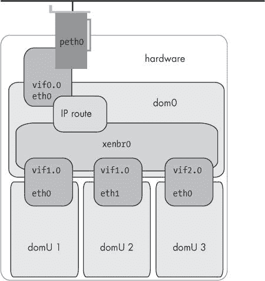

# 第五章 网络


因此，您已经拥有了一个漂亮、闪亮的 Xen 盒子，并且现在您希望它能够与外界通信。这似乎是理所当然的。毕竟，Xen 的主要用途是服务器整合——一个没有网络的服务器在术语上就是矛盾的。好吧，您很幸运。Xen 有一个强大且经过充分测试的网络基础，它既灵活又易于设置。

就像 Xen 的许多其他部分一样，网络基础设施尽可能地重用标准工具。在这种情况下，Xen 使用标准的桥接工具和`ip`命令^([33])，所有这些都被一些巧妙的 bash 和 Python 脚本粘合在一起，以处理 dom0 和 domU 网络接口之间的流量。

作为管理员，您与 Xen 虚拟网络设备的主要交互是通过各种配置文件。正如您所预期的，全局参数和初始设置主要由*xend-config.sxp*中的指令处理。特定域的配置是在域的配置文件中完成的。

可以通过修改存储在*/etc/xen/scripts*中的 Xen 网络脚本来进行更高级的配置。

如果您是那种不惜一切代价避免重启的人，您可以在 VM 运行时通过`brctl, iptables`和`xm`命令直接操作 Xen 的网络基础设施，但这些更改并不总是成功传播到 domU。我们将重点关注“操作配置文件并重启 domU”的方法，因为它在所有情况下都有效。

# Xen 的网络设置过程

Xen 在其网络脚本的两个点上运行：在`xend`启动时和在域启动时。（有对应于域关闭和`xend`停止的脚本。）

在`xend`启动时运行的脚本（通常是`network-bridge`或`network-route`）的作用是将标准、非 Xen 网络切换到基于 Xen 的网络。例如，在`network-bridge`的情况下，此脚本创建一个桥接并分配物理以太网设备给它。然后它初始化 dom0 的网络，创建一个虚拟接口，将其添加到桥接中，并将配置复制到桥接网络设备上。

当 Xen 启动一个域时，它会执行适当的`vif-*`脚本——例如，在`network-bridge`的情况下，执行`vif-bridge`。以下显示了默认设置下将运行的各个脚本。

```
(xend startup)
    |
    |- network-bridge 
        |
        |-xen-script-common.sh
        |-xen-network-common.sh

(xm create)
    |
    |-vif-bridge 
        |
        |-vif-common.sh
            |
            |-xen-hotplug-common.sh
            |   |
            |   |-logging.sh
            |   |-xen-script-common.sh
            |   |-locking.sh
            |
            |-xen-network-common.sh
```

这些脚本中的大多数对我们目前的目的并不是非常重要。例如，*logging.sh*只是被源引用以提供`log()`函数。我们感兴趣的主要点是标记为的地方。这些是编辑的好脚本或引入包装脚本的好地方。

这些脚本都是 bash shell 脚本（而不是像许多其他 Xen 配置文件那样是 Python）。它们默认都位于 */etc/xen/scripts* 目录中，与支持其他类 Xen 虚拟设备的脚本放在一起。

* * *

^([33]) IP 命令 */sbin/ip* 是现代（不幸地命名）的 `ifconfig` 替代品。它是 iproute2 工具集的一部分，提供了与 net-tools 类似的功能，但增加了额外的功能。

# 定义虚拟接口

所有的 Xen 网络选项都是通过在 dom0 中创建虚拟接口来实现的，这些虚拟接口作为网桥、`iptables` 规则等的目标。每个虚拟接口都由配置文件中 `vif=` 行的一个部分定义，由一对单引号分隔。

Xen 3 支持每个域最多八个虚拟接口（3.1 之前是三个）。例如，

```
vif=['','','']
```

定义了三个虚拟接口，并告诉 Xen 使用合理的默认值来配置它们。请注意，它们是逗号分隔的，并且与 Python 数组语法一致。

你可以通过在 dom0 中输入以下命令来检查这些虚拟接口

```
# ifconfig -a
```

这将输出一系列设备的详细信息

```
vif*`x`*.*`y`*
```

其中 *`x`* 和 *`y`* 是数字。（如果你在使用 HVM，你可能会看到 `tap` 设备。现在先将其视为 vifs 处理。）

### 注意

在最近的基于 Red Hat 的发行版（包括 CentOS 5.1 和 Fedora 8）中，libvirt 将创建另一个名为 *`virbr0`* 的网桥。*这个网桥默认设置为 NAT，应被视为 libvirt 的一部分，而不是 Xen。它的工作方式与 Xen 的 *`network-nat`* 实现非常相似：dom0 在 *`virbr0`* 上运行 dnsmasq 服务器并为 domUs NAT 数据包。这对于桌面系统来说是一个合理的默认设置，但可能不适合服务器。要使用 Xen 的网桥而不是 libvirt 的，请指定 *`bridge=xenbr0`*。对于好奇者，*`virbr`* 是通过 /etc/libvirt/qemu/networks/default.xml 配置的。*你可以通过删除 /etc/libvirt/qemu/networks/autostart 中的符号链接来禁用 *`virbr`* 设备。*

Xen 的默认行为是为每个虚拟接口分配一个基于域编号的名称，其中 *`x`* 是域编号，*`y`* 是 domU 中接口的顺序编号。例如，`vif2.0` 是域 2 中的 `eth0`；`vif2.1` 是域 2 中的 `eth1`。此外，机器中的每个物理网卡都会显示为一个 `peth` 设备（代表 *物理以太网*）。`xend` 在域启动时代表域创建这些虚拟接口。因此，你会看到不同数量的它们，这取决于运行了多少个域以及它们有多少个网络设备。

正如我们之前所述，dom0 是一个与其它一样的主域，只是它具有执行控制平面功能的能力以及访问 PCI 设备的能力。因此，`vif0.0` 是 dom0 的虚拟 `eth0` 接口，而 `vif0.1` 是 dom0 中的 `eth1`。（Xen 便利地通过将 `eth`*`X`* 映射到 `vif0.`*`x`* 来创建别名。）

### 注意

*`veth`* 设备也会出现在 dom0 中。不用担心它们。它们只是作为 *`xend`* 复制信息时的草稿纸。

通常在与 dom0 交互时可以忽略 vifs。然而，有几个需要注意的事项：因为 dom0 中的 `eth0` 实际上是虚拟接口的别名，它只能看到指向 dom0 的流量——domU 流量永远不会到达这个别名。如果你想在 dom0 中使用 `tcpdump` 或类似工具查看发送到 domUs 的流量，你必须查看物理以太网卡——即适当的 `peth` 接口。

此外，`peth` 可能有一个奇怪的 MAC 地址，通常是 FF:FF:FF:FF:FF:FF。因为没有任何数据包实际上在 `peth` 设备上起源或终止，所以它不需要实际的 MAC 地址。

最后，虚拟设备由 netloop 驱动程序提供，默认情况下一次只允许八个虚拟设备。可以通过增加 `nloopbacks` 参数的值来提高这个值：

```
# modprobe netloop nloopbacks=128
```

如果它是内置于内核中的，你可以使用更高的 `loopback.nloopbacks` 值来引导 dom0 内核。只需将 `netloop.nloopbacks=128`（或类似的大值）追加到 */boot/grub/menu.lst* 中的加载 Linux 内核的 `module` 行即可。

## 虚拟接口命名

使用这种复杂的虚拟接口方案来计算带宽使用情况可能很棘手。因为接口名称基于域编号，而域编号每次域重新启动时都会改变，所以简单地使用 dom0 的内部计数器来监控带宽是不切实际的——你最终会得到类似这样的东西：

```
vif58.0 RX bytes:12075895 (11.5 MiB)  TX bytes:14584409 (13.9 MiB)
```

重新索引名称

如果你决定使用 vifnames，你可能需要注意，尽管符号名称保持不变，但接口的 `mib` 数字在 domU 的每次重新启动时可能会改变。

一些 SNMP 监控软件期望 mib 数字保持不变。当它们改变时，软件将其解释为具有相同名称的新接口，这使得收集累积统计信息……变得困难。你通常可以通过配置你的 SNMP 软件以积极重新索引名称到数字，而不是依赖其缓存来解决这个问题。这只是需要注意的一点——不是无法修复，但很烦人。请查看您特定的监控软件的详细信息。

一种解决方法是命名虚拟接口，使得名称与域编号无关。你可以在 domU 配置文件中通过指定 `vifname` 参数作为 `vif=` 配置指令的一部分来命名虚拟接口。例如，

```
vif=['vifname=http']
```

这将导致 dom0 中的 `vif` 变为 `http` 而不是 `vif`*`x`*`.`*`y`*。（当然，在域内部，它只显示为 `eth0`。）如果域有多个接口，可以按照以下方式指定它们：

```
vif=['vifname=http1', 'vifname=http2']
```

到目前为止，你需要停止和启动域以强制它重新读取配置文件；简单的重启不起作用。

指定了 `vifname` 后，我们可以停止和启动域。这里我们关闭一个域：

```
# xm list http.xen
Name ID Mem(MiB) VCPUs State Time(s)
http.xen 6 96 1 -b---- 11358.0
# xm shutdown http.xen
xenbr0: port 8(vif6.0) entering disabled state
device vif6.0 left promiscuous mode
xenbr0: port 8(vif6.0) entering disabled state
```

注意，设备只是`vif6.0`。现在启动它。

```
# xm create http.xen
Using config file "http.xen".
device http entered promiscuous mode
xenbr0: port 8(http) entering learning state
xenbr0: topology change detected, propagating
xenbr0: port 8(http) entering forwarding state
Started domain http.xen.prgmr.com

# cat http.xen.prgmr.com | grep vifname
vif = [ 'vifname=http, bridge=xenbr0' ]
```

截断的 VIF 名称

Linux 会静默地将`vifname`截断为 15 个字符——它将忽略任何超出该长度的输入而不会引发错误。因此，对于一个名为`wiki.xen.prgmr.com`的`vif`，

```
# ifconfig wiki.xen.prgmr.
```

前面的 15 个字符（包括点）或

```
# ifconfig wiki.xen.prgmr.com
```

或

```
# ifconfig wiki.xen.prgmr.foo.bar.baz
```

将会工作，但

```
# ifconfig wiki.xen
```

将会失败，并返回一个`ENODEV`（一个“没有这样的设备”或“设备未找到”错误）。

注意，15 个字符的 vifnames 会导致某些 iptables 版本出现问题。为了安全起见，请将 vifnames 限制为 8 个字符。

## 自动配置

你可以只留下`vif=`行为空，并让`xm`自动生成整个配置，如下所示：

```
vif = ['']
```

这种场景的优点是允许 domU 管理员在 domU 内部完全自由地配置网络，使用最方便的工具。这是模拟物理机器最准确的方法。如果需要，Xen 可以自己生成 IP 和 MAC 地址，并配置它们以无需管理员干预的方式工作。

然而，我们不推荐这样做，因为它将网络接口的配置留给了用户。至少，你应该指定 IP 地址，以便 Xen 可以设置反欺骗规则来防止 Xen 实例的攻击者伪造其 IP 头中的源或目标地址，并指定 MAC 地址以避免冲突的可能性。IP 或 MAC 地址冲突可能会使你的网络崩溃！尽可能避免。

神秘递增的接口编号

通过指定 MAC 地址可以避免的一个其他问题是，在每次启动时地址改变时 domU 会变得困惑——在某些系统上，它会认为每个新的地址是一张新卡，因此在第二次启动时使用 eth1，第三次启动时使用 eth2，依此类推。当看到新的 MAC 地址时，udev 认为它找到了一张新卡。

简单的解决方案是在域配置文件中指定 MAC 地址，并清除 udev 的缓存，在`/etc/udev/rules.d/z25_persistent-net.rules`中。这应该会导致设备在下次启动时以 eth0 出现，并保持 eth0，因为它不再获得随机地址了。

## 指定 MAC 地址

通常情况下，在没有虚拟化的情况下，硬件制造商会确保每个以太网设备都有一个唯一的 MAC 地址。然而，在使用 Xen 的情况下，确保每个虚拟接口都有一个唯一的硬件地址就变成了管理员的责任。

首先，回想一下 7 层 OSI 网络模型。Xen 在 2 层和 3 层与该模型交互；也就是说，它提供了一个带有`network-bridge`的虚拟层 2 交换机，并作为带有`network-route`的 IP 路由器。这两个层次都需要 Xen 域有一个唯一的地址。反欺骗规则和`ip`指令可以处理第 3 层；然而，你也可能想要指定一个 MAC 地址。

Xen 可以简单地创建一个，但这会导致相对较高的冲突概率。当 Xen 为您选择 MAC 地址时，它从 IEEE 注册机构分配给 Xen 的 00:16:3e 前缀开始，并随机选择剩余的三个字节；这意味着您有 3 个字节的熵。在一个网络上的 1,000 个主机（大多数是 /22 的部分）中，这给您大约 3% 的冲突概率。（您可以使用生日悖论来计算这一点——这是您那些不为人知的数学趣闻的绝佳用途。）考虑到 MAC 地址冲突的巨大问题，我们建议始终手动指定 MAC 地址。这样做是通过更改您的 `vif=` 行以包含一个 `mac=` 部分，如下所示：

```
vif= ['ip="10.0.0.1",mac="ae:00:01:02:03:04"']
```

在 prgmr.com，我们选择一个 2 字节前缀，并以十六进制形式附加 IP 地址，因为 IP 地址已经唯一。尽管如此，在进行此操作时还有一些重要的规则：首先，最高有效位应该是零；其次，地址应该是“本地分配”块的一部分，以避免与真实以太网硬件可能发生的冲突。幸运的是，这些规则可以简化为一个基本公式：将第一个八位字节（如上例中的 *e*）的第二十六进制位设置为 2、6、A 或 E。（当然，您可以通过使用上面提到的 Xen 前缀来避免担心这一点。）

# 使用 xm 操作 vif

尽管我们通常通过配置文件间接修改网络设置，但也可以直接使用 `xm` 进行更改。

相关的命令是 `network-attach` 和 `network-detach`。使用 `network-attach`，您可以通过命令行指定选项来创建一个新的虚拟网卡，就像它在配置文件中指定过一样。例如，

```
xm network-attach wiki.xen.prgmr.com script=network-bridge mac=00:16:3e:02:ac:7d bridge=xenbr0
```

如果您没有指定各种参数，Xen 将提供默认值，就像它们在配置文件的 `vif=` 行中未指定一样。

类似地，`network-detach` 将从 domU 中断开一个 `vif` 并将其销毁。

```
xm network-detach wiki.xen.prgmr.com 0
```

上述命令将从域 [wiki.xen.prgmr.com](http://wiki.xen.prgmr.com) 中移除 `eth0`。

# 保护 Xen 的虚拟网络

从安全角度来看，Xen 网络有两个方面值得注意。首先，我们想确保用户不能假装成他们不是的人。这通过指定 IP 地址和启用反欺骗规则来解决。其次，我们想保护 dom0 同时允许流量通过到 domUs。这可以通过适当的 `iptables` 规则轻松处理。

## 指定 IP 地址

防欺骗规则使用`iptables`确保 Xen 盒子会丢弃不匹配来自`vif`的预期地址的数据包，从而保护您的网络免受恶意 domU 的侵害。网络脚本使用`iptables`添加规则到 FORWARD 链，允许匹配该 IP 地址的数据包通过到 domU 的网络设备。（执行此操作的功能在*vif-common.sh*中，供好奇者参考。）为了使其工作，您的 FORWARD 链应该有一个 DROP 策略——`network-bridge`应该自动处理这一点。

我们使用防欺骗功能，`network-route`通过添加类似规则来实现。已知它不与`network-nat`一起工作。

将以下内容添加到*/etc/xen/xend-config.sxp*：

```
(network-script 'network-bridge antispoof=yes')
```

并在域配置文件中设置以下内容：

```
vif=['ip=10.0.0.1',bridge=xenbr0]
```

(显然，为您的站点使用合适的 IP 和网桥。)

您还可以指定 CIDR 格式的 IP 地址范围（*CIDR*代表*无类别域间路由*）；即，使用斜杠和设置在子网掩码中的位数，以十进制表示。例如，要允许 10\. anything，上一行可以重写为

```
vif=['ip=10.0.0.1/8']
```

这并不能阻止 domU 管理员更改 domU 的 IP 地址，但它确实阻止了来自该更改 IP 地址的任何数据包。

## 防火墙 Dom0

在 Xen 的网络中，INPUT 和 OUTPUT 链不会影响针对 domUs 的数据包。因此，标准防火墙的 INPUT 链，如 Red Hat 的，不会影响 domU 数据包。（当然，domUs 本身可以根据需要防火墙自己的虚拟网络设备。）

### 注意

*许多系统默认情况下不会像预期的那样将桥接流量发送到 FORWARD 链——RHEL/CentOS 5.1 就是这个问题的一个例子。这导致防欺骗规则无法工作。简单的* *`echo 1 > /proc/sys/net/bridge/bridge-nf-call-iptables`* *可以解决这个问题。将该行添加到* /etc/xen/scripts/network-bridge *以使其在 Xen 设置其网络时自动运行*。

我们在通过 FORWARD 链发送 domU 数据包时遇到的问题仅在于，默认情况下，dom0 会将它们包含在其连接跟踪中。在负载很重的机器上，连接表会填满，机器会丢弃数据包。我们的解决方案是编辑`vif-bridge`中的`frob_iptable()`函数，添加如下规则：

```
iptables -t raw "$c" PREROUTING -m physdev --physdev-in "$vif" "$@" -j NOTRACK
```

这使得防欺骗功能可以正常工作，同时阻止 domU 流量干扰 dom0，同时允许 domUs 无障碍地访问其数据包。

# 使用 network-route 进行网络连接

`network-route`是 Xen 团队最初选择的原选项（并且自那时以来很少有人使用）。它通过创建一个内部 IP 路由器来实现，该路由器将流量转发到和从客户域。请注意，它不执行地址转换——为此您需要`network-nat`或`virbr`。它已被`network-bridge`取代，这提供了更多的灵活性。

然而，`network-route`确实有其用武之地。一方面，它与上游网络硬件相比是透明的，与`network-bridge`不同。另一方面，它要简单得多。`network-route`只是启用 IP 转发，然后在 dom0 中创建`iptables`规则以将流量转发到正确的虚拟接口。

要使用`network-route`，只需取消注释相应的行

```
(network-script network-route)
(vif-script vif-route)
```

并取消注释相应的`network-bridge`和`vif-bridge`行。这就是全部内容。重新启动`xend`，`iptables`将显示一个新的规则来处理转发到`vif`：

```
# iptables -L FORWARD
Chain FORWARD (policy ACCEPT)
target prot opt source          destination
ACCEPT 0    --  192.168.42.190  anywhere PHYSDEV match --physdev-in n1
ACCEPT udp  --  anywhere        anywhere PHYSDEV match --physdev-in n1 udp spt:bootpc dpt:bootps
```

`network-route`的一个常见“陷阱”是它只有在`vif=`行中指定了 IP 地址时才起作用——否则脚本不知道要添加哪些规则。因此，至少，上述示例的接口定义应该如下所示：

```
vif = ['ip="192.168.42.190",vifname="n1"']
```

# 使用`network-bridge`进行网络连接

`network-bridge`是处理 Xen 中虚拟域网络的标准方式。它使用 Linux 中的桥接工具创建一个虚拟的第二层交换机，并将 Xen 虚拟接口“插入”其中，如图图 5-1 所示。它具有与期望未受污染的以太网帧的协议一起工作的优势。这包括 AoE、TCP/IP 之前的 AppleTalk 版本、NetBEUI、IPX 以及许多来自黑暗时代的其他协议。它还将无缝地与 DHCP 一起工作，DHCP 依赖于广播数据包。它简单、逻辑性强且稳健。

`network-bridge`（除了其复杂性之外）的最大缺点是当`xend`启动时，它会拆解并重建真实的网络接口。在某些场景下（例如，当 dom0 有 NFS 根时），这可能是不被接受的。这并不是桥接本身的限制，而是使用 Xen 脚本将桥接附加到 dom0 网络设备时的限制——如果为桥接使用专用物理设备，问题就会消失。

`network-bridge`的另一个问题是它将物理以太网设备置于混杂模式。在繁忙的网络中，这可能会极大地消耗资源，因为 CPU 必须拦截所有数据包，而不仅仅是那些针对其地址的数据包。最后，出站数据包将具有与物理卡上不同的 MAC 地址，这可能导致与某些无线网络硬件的问题。这也使许多第二层 HTTP 负载均衡器陷入循环——任何只期望每个以太网端口只有一个 MAC 地址的东西都会感到非常困惑。


图 5-1. `network-bridge`的一些功能

即使有这些注意事项，我们仍然推荐在大多数 Xen 服务器上使用`network-bridge`。

如果你喜欢，可以手动启动`network-bridge`脚本。例如，要手动创建一个名为`xenbr0`的桥接器，并将其附加到`eth0`，请输入以下内容：

```
/etc/xen/scripts/network-bridge {start|stop} vifnum=0
```

### 注意

*如果你将* *`vifnum`* *设置在* *`nloopbacks`* *之上* *，即使你只有一个桥接，Linux 也会抱怨好像你有比回环更多的桥接。这是因为 Xen 使用 *`vifnum`* 来确定它用于前端虚拟设备的数量，这假设了前面虚拟设备的存在。增加 *`nloopbacks`*，*这样每个人都会满意*。

`network-bridge` 是默认的网络选项，因此 `xend` 不需要任何配置即可使用。然而，为了完整性——要配置 Xen 使用 `network-bridge`，修改 *xend-config.sxp* 以包含以下行

```
(network-script network-bridge)
```

### 注意

*OpenSUSE 用户可能会发现 NetworkManager 会干扰 Xen 的桥接。要解决这个问题，请前往* YaST ► 网络设备 ► 网络卡 *并选择* 使用 ifup 的传统方法 *选项*。

此脚本导致 Xen 使用类似于以下设置的桥接：

```
# brctl show
bridge name   bridge id           STP enabled  interfaces
xenbr0        8000.feffffffffff   no           vif0.0
                                               peth0
                                               vif9.0
```

`xenbr0` 显然是桥的名字。它连接了 dom0 的虚拟以太网接口 (`vif0.0`)、物理以太网卡和一个 domU 的虚拟接口。我们还可以看到 STP（生成树协议）已被禁用。在默认配置中，进一步的 domUs 将简单地将其接口添加到该桥上。

STP 的目的是防止网络中的环路。如果你在使用虚拟桥接进行任何复杂操作，你可能需要开启 STP。如果你有多个桥接和多个你与 Xen 一起使用的网络端口，这可能是个好主意。

要重命名桥，你可以在 `network-bridge` 脚本中指定桥名作为选项：

```
(network-script 'network-bridge bridge=foo')
```

还要注意，`network-bridge` 默认将 `eth0` 绑定到桥接。要更改物理网络卡，请使用

```
(network-script 'network-bridge bridge=foo netdev=eth1')
```

然后桥接设置变为

```
# brctl show
bridge name   bridge id          STP enabled   interfaces
foo           8000.feffffffffff  no            vif0.01
                                               peth01
                                               vif9.0
```

# 使用 network-nat 进行网络连接

`network-nat` 是 `network-route` 的扩展，它包含了网络地址转换（简称 NAT，或在某些情况下称为 IP 伪装）。

Xen 伴随提供的 `network-nat` 脚本以两种方式绕过 `network-route` 的 DHCP 问题。首先，它可以启动一个本地 DHCP 服务器（因此虚拟域可以获得地址，因为它们现在位于路由器后面）。如果这不可取，它可以使用域 ID 创建本地唯一的 IP 地址。然后它设置一个标准的 `iptables` 规则用于 IP `masq`：

```
Dom0 # iptables -t nat -n -L
Chain POSTROUTING (policy ACCEPT)
target prot opt source destination
MASQUERADE 0 -- 0.0.0.0/0 0.0.0.0/0
Dom0 # iptables -L FORWARD
Chain FORWARD (policy ACCEPT)
target prot opt source destination
ACCEPT 0 -- 10.0.0.0/16 anywhere PHYSDEV
match --physdev-in n1
ACCEPT udp -- anywhere anywhere PHYSDEV
match --physdev-in n1 udp spt:bootpc dpt:bootps
```

当域启动时，它会获得一个 IP 地址并为自身添加适当的 `iptables` 规则。Xen 在引导时使用内核级 IP 自动配置机制将地址传递给内核（这不是很复杂吗）。`network-nat` 也可以与你的 DHCP 服务器集成。

```
DomU # ifconfig eth0 10.0.2.1/16
DomU # route add default gw 10.0.2.1
DomU # ping 192.168.42.60
PING 192.168.42.60 (192.168.42.60) 56(84) bytes of data.
64 bytes from 192.168.42.60: icmp_seq=1 ttl=63 time=1.94 ms
```

这显示了域 2 中 `eth0` 的默认配置 IP 地址。实际数字当然会根据你的设置而变化。

# 配置变量

正如我们提到的，管理员与 Xen 网络交互的两个基本地方是在 */etc/xen/xend-config.sxp* 和域配置文件中。在这些文件中，你关注的是一行：前者的 `(network-script)` 行和后者的 `vif=` 行。

这些都会因为语法上的微小错误而严重失败，没有任何解释。（毕竟，这是 Python。如果你喜欢，你可以在配置文件中直接放置任意 Python 代码。配置文件应该始终使用一种 Turing 完整的语言编写。问问埃里克·奥勒曼就知道了。）

`network-script`行被括号包围，参数用引号括起来，并用空格分隔。例如，以下是一个有效的示例：

```
(network-script 'network-bridge bridge=xenbr1')
```

我们已经讨论了`vif=`行。请注意，`vif`配置使用与网络脚本设置完全不同的语法，即参数之间用逗号分隔的括号。

```
vif = ['','bridge=xenbr1','bridge=xenbr2,ip="10.1.2.6"']
```

这行配置了三个接口，第一个使用默认参数，第二个使用桥接参数，第三个使用桥接和 IP。注意两个单独接口和单独参数之间的逗号。

最后，在一些示例中，你会看到一个`dhcp=yes`行。除非内核在启动时需要获取其地址（例如，如果它正在通过 NFS 挂载其根文件系统），否则`dhcp=`行不是必需的。

# 自定义网络脚本

你可能此时会想，在 Xen 配置文件中指定配置脚本而不是简单地选择内置选项是过度杀鸡用牛刀。但请相信我们：指定自己的网络脚本的能力非常实用。因为 Xen 的网络建立在标准工具之上，所以脚本易于理解并可以根据你的特定需求进行定制。

做这件事最简单的方法，也是大多数配置的足够方法，是创建一个小的包装脚本，该脚本使用适当的参数调用标准 Xen 脚本。你也可以修改标准脚本以源额外的函数并在需要时调用它们——例如，修改防火墙规则或附加监控脚本。

## 多桥配置

考虑一个场景，你希望在纯虚拟网络上进行跨域 U 通信，每个域都有一个单独的接口与外界通信。

在那种情况下，你需要创建一对桥梁，一个使用默认的 Xen 设置，将物理接口与虚拟接口桥接，另一个只桥接虚拟接口。然后你需要在域配置文件中指定这两个接口，并在域内或配置文件中正常配置它们。

包装器可能看起来像这样：

```
#!/bin/sh
dir=$(dirname "$0")
"$dir/network-bridge" "$@" vifnum=0
"$dir/network-bridge" "$@" vifnum=1 netdev=dummy0
```

这会调用`network-bridge`两次，第一次是正常调用，第二次带有`netdev`参数，导致`network-bridge`使用虚拟网络设备而不是真实设备。

要让`xend`在启动时运行此脚本，请按照以下方式更改`xend-config.sxp`中的`network-script`行：

```
(network-script my-wrapper)
```

确保`my-wrapper`脚本可执行，否则将无法正常工作。

要从 domUs 使用这些桥梁，请在`vif=`行中指定正确的桥梁：

```
vif= ['mac="aa:0:1:2:3:4",bridge="xenbr1"']
```

## 桥接和路由

对这个场景进行轻微修改，将 domU 通信放在自己的桥接器上，然后通过 dom0 中的`iptables`规则进行路由，如图图 5-2 所示。（编写了执行此操作的脚本的 Arjen Runsink 称这为*brouter*——桥接和路由的组合。）



图 5-2. 结合桥接和路由

这创建了一个标准桥接器，但它并没有将物理设备附加到它上。相反，桥接器获得了一个 IP 地址和路由。当 domU 启动时，它的`vif`通过普通的`vif-bridge`脚本附加到桥接器上。

忽略标准函数等，脚本看起来大致如下：

```
#!/bin/sh
dir=$(dirname "$0")
. "$dir/xen-script-common.sh"
. "$dir/xen-network-common.sh"

findCommand "$@"
evalVariables "$@"

op_start () {
    if [ ""${bridge}" = "null" ] ; then
         return
    fi

    create_bridge ${bridge}
    if link_exists "${bridge}" ; then
        ip address add dev $bridge $bridgeip
        ip link set ${bridge} up arp on
        ip route add to $brnet dev $bridge
    fi

    if [ ${antispoof} = 'yes' ] ; then
         antispoofing
    fi
}

op_stop () {
    ip route del to $brnet dev $bridge
    ip link set ${bridge} down arp off
    ip address del dev $bridge $bridgeip
    brctl delbr ${bridge}
}

case "$command" in
    start)
        op_start
        ;;
    stop)
        op_stop
        ;;
    *)
        echo "Unknown command: $command" >&2
        echo 'Valid commands are: start, stop' >&2
        exit 1
esac
```

我们删除了`show_status`函数以节省空间；此脚本的完整版本可在[`en.opensuse.org/Xen3_and_a_Virtual_Network`](http://en.opensuse.org/Xen3_and_a_Virtual_Network)找到。我们还删除了像`$bridgeip`这样的参数的默认值，因为那是特定于站点的，并且我们删除了`create_bridge`和`add_to_bridge`的声明，因为这些由`xen-network-common`提供。

在*/etc/xen/xend-config.sxp*中使用以下两行调用此脚本：

```
(network-script 'network-virtual bridgeip="10.0.0.1/24" brnet="10.0.0.1/24"')
(vif-script vif-bridge)
```

# 进一步思考

这种技术的变体可以用于在特定域的基础上提供日志记录和会计功能，或者只需编辑网络脚本即可设置特定域的防火墙规则。最终，Xen 的网络基础设施非常灵活，你能够对 domU 做任何你能在 dom0（或者，就事论事，在非 Xen 系统）上做的事情，而且有足够的脚本钩子来实现自动化操作。
