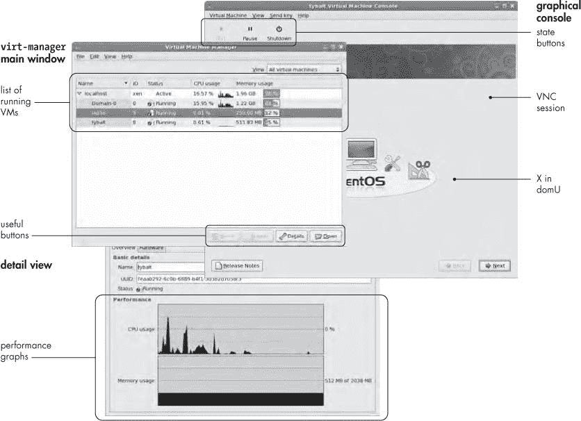

# 第六章。DOMU 管理：工具和前端


本书的大部分内容都集中在相对低级的行政任务上。我们关注这个方向有几个原因：首先，因为我们觉得在信任 GUI 工具处理数据之前，先了解它们在做什么会更好，^([34]) 其次，因为附加工具尚未完全开发。

然而，Xen 的真正好处是它允许你做一些事情，这些事情你用简单的物理机集合是无法做到的，或者很难做到。更先进的管理工具的主要优势是它们利用 Xen 虚拟化来提高灵活性。

此外，总是从基础原理开始做所有事情会变得有点单调乏味。在本章中，我们将从我们通常对尽可能繁琐的方式做事的执着中抽身出来，看看 Xen 可用的节省劳动的创新。

广义上，我们可以根据目标受众对各种前端软件包进行分类；一些工具是为 dom0 管理员设计的，而另一些是为 domU 管理员设计的（即在 Xen 的计算服务模型中的*客户*）。第一组通常专注于提供和销毁虚拟机，而第二组允许用户在没有访问 dom0 的情况下以更高的级别控制自己的虚拟机，例如，给域进行硬重启或在 domU 完全无法启动时恢复。

尽管这种 neat 和理论上有用的劳动分工，我们几乎会完全忽略第二类。有两个原因：首先，大多数最终用户不会想要对他们的 Xen 实例进行任何特别复杂的操作。在我们看来，大多数 Xen 控制面板都是寻找问题的解决方案。其次，截至本文撰写时，我们尝试过的这个类别的几乎所有工具似乎都没有稳定下来.^([35]) 相反，我们将专注于第一类：简化服务提供商生活的软件，从简单到复杂不等。我们将以简要讨论 Xen-shell 结束，这是一个有用的最小客户界面工具。

# 虚拟机提供商的工具

当寻找管理工具时，就像任何软件一样，首先要问自己的问题是，我需要哪些功能？Xen 管理工具的范围从简单的配置脚本，如 Xen-tools，到面向数据中心的数据包，如 OpenQRM。

假设多个前端都提供了必要的功能，影响您选择前端的最大因素可能是 dom0 操作系统。一些前端，如 Xen-tools，是针对 Debian 设计和构建的。一些与 Red Hat 配合得最好。Slackware 用户，您仍然需要自己动手。尽管您可以在 Debian 上安装`virt-manager`，但这将是一个困难的过程，与自然法则相悖.^([36]) 在本章中，我们将重点关注每个工具在其原生环境中，从 Debian 的 Xen-tools 开始。

## Xen-tools

Xen-tools 在本质上是一个跨平台的 Perl 脚本集合，用于自动化安装，因此它对发行版的选择并不敏感。尽管作者在 Debian 上开发，分发*.deb 包，并有一个 Apt 仓库，但 Xen-tools 在其他系统上安装相对容易，所以我们鼓励您尝试它，无论您运行的是哪个发行版。请从[`xen-tools.org/`](http://xen-tools.org/)下载 tar 包。

### 安装 Xen-tools

为了保持一切顺利进行，我们在 Debian 机器上使用 Debian 的 Apt 系统安装了 Xen-tools。因为，就像所有与 Xen 相关的东西一样，Xen-tools 正在经历快速的开发，我们选择从作者的仓库中获取包，以避免得到一个旧版本。

要做到这一点，请将他的仓库添加到您的*/etc/apt/sources.list*中。对于 Etch，我们附加了：

```
#
#  Steve Kemp's repository:  Etch
#
deb     http://apt.steve.org.uk/etch etch main non-free contrib
deb-src http://apt.steve.org.uk/etch etch main non-free contrib
```

### 注意

*有时 Apt 中的版本也不如网站上的版本新。如果所有其他方法都失败了，请下载 tar 包，解压它，然后运行 make install 来安装它*。

然后像往常一样运行：

```
# apt-get update
# apt-get install xen-tools
```

然后，Apt 将执行其习惯性的魔法，安装 Xen-tools 脚本并创建一个配置目录，*/etc/xen-tools*。

对于使用信息，如果您有`perldoc`，您可以通过运行带有`--manual`选项的程序来访问任何程序的嵌入式手册页面。例如：

```
# xen-create-image --manual
```

将会打印出一个长而令人畏惧的 man 页面。不要气馁；这只是暴露了 Xen 本身提供的令人眼花缭乱的选项集。您可以通过在 Xen-tools 配置文件中提前指定这些选项中的大多数，而不是通过命令行选项来简化事情。

### 配置 Xen-tools

因此，让我们创建一个配置文件。请相信我们，花点时间设置一些默认值比每次使用命令时指定全局选项要愉快得多.^([37]) 将您首选的选项放入*/etc/xen-tools/xen-tools.conf*。我们会使用类似以下的内容：

```
lvm = verona
size = 2Gb
image = full
memory = 128Mb
swap = 128Mb
fs = ext3
dist = sarge

initrd = /boot/initrd.img-2.6.16-2-xen-686
kernel = /boot/vmlinuz-2.6.16-2-xen-686

install-method = debootstrap
```

填写适当的值，就像往常一样，并随意从注释丰富的示例配置中添加任何您喜欢的选项。其中一些选项，如`initrd`和`kernel`，指定了最终 domU 配置文件中的直接指令。其余的选项大多数都是不言自明的；`size`指定了文件系统大小，`swap`是域将拥有的交换空间量，等等。

由于我们指定了 LVM 组，域将使用 LVM 卷作为后端存储。您也可以通过指定`dir = /path/`而不是 LVM 组来使用文件系统镜像。如果您这样做，请确保该目录存在，否则镜像创建步骤将静默失败，`xen-create-image`将填充文件系统应该挂载的目录。这几乎肯定不是您想要的。

还请注意`dist=`行；这指定了`xen-create-image`将运行哪个集合的后安装*钩子*脚本以配置新域。如果没有在`/usr/lib/xen-tools`下对应于`dist`值的目录，`xen-create-image`将带有一个指导性的错误信息退出。如果您不想在创建时配置域，您可以创建一个空目录——比如`/usr/lib/xen-tools/plan9`——并将发行版的名称（在这种情况下为`plan9`）作为 dist 值传递。

当您已经填充了配置文件后，实际上创建域变得非常简单，几乎可以说是平淡无奇的。只需在命令行上指定一个主机名，最好是完全限定名称，以便安装后脚本可以正确配置镜像，然后工具会完成剩余的工作。例如：

```
# xen-create-image mercutio.prgmr.com
```

### 注意

*尽管设置完全限定域名允许安装后脚本处理域名配置，但在某些 Red Hat 衍生版本上，它可能会与 xendomains 脚本发生冲突，因为该脚本假设 domU 名称不超过 18 个字符*。

使用之前显示的配置文件，这将创建两个逻辑卷，`/dev/verona/mercutio.prgmr.com-disk`和`/dev/verona/mercutio.prgmr.com-swap`。然后挂载磁盘卷，并使用`debootstrap`安装 sarge（Debian 3.1）。

容易。

### Xen-tools 和基于 RPM 的 DomU 镜像

Xen-tools 的第一版是为考虑使用`debootstrap`安装 Debian 而开发的。然而，这个包已经走了很长的路，并且它已经被推广到支持几乎所有的系统。基于 RPM 的发行版通过类似`debootstrap`的工具得到支持。其他系统——甚至是非 Linux 系统——可以通过复制原始文件系统镜像或提取 tar 包来安装。

尽管 Xen-tools 的旧版本使用了 RPMstrap，我们过去曾成功使用过它，但 RPMstrap 的作者已经停止了开发。因此，Xen-tools 的作者一直在开发一个名为`rinse`的替代品。这是使用 Xen-tools 安装 CentOS 和 Fedora 的推荐方式，并且它本身也是一个相当整洁的包。

`rinse`的首页位于[`xen-tools.org/software/rinse/`](http://xen-tools.org/software/rinse/)。您可以从该网站的下载页面下载，或者通过添加他的`apt`仓库并通过您的包管理器下载。

对`rinse`配置选项的全面讨论可能在这里不合适。我们敦促您阅读精美的手册。然而，它默认情况下与`xen-create-image`的安装方法配合使用，使用以下简单的命令行：

```
# xen-create-image --hostname tybalt.prgmr.com --install-method=rinse
dist=centos-5
```

没问题。

### Xen-tools 安装后操作

在镜像安装后，但在它第一次启动之前，`xen-create-image`会做一些安装后工作。首先，它在挂载的 domU 文件系统中运行一些脚本以执行设置任务，例如设置主机名和禁用不需要的 getty。最后，它创建一个配置文件，以便您可以启动域。

在这个阶段，您也可以让机器通过角色来自行配置——指定`--role <script>`命令行选项，在安装结束时运行位于`/etc/xen-tools/role.d`中的相应脚本，以 domU 根文件系统的挂载点作为参数。您需要的角色将取决于您的需求。例如，您可能需要区分 Web、邮件和 DNS 服务器角色的角色。Xen-tools 发行版附带了一些您可以在此基础上构建的示例。

在填充 domU 镜像后，`xen-create-image`脚本将基于`/etc/xen-tools/xm.tmpl`中的模板创建一个配置文件。您也可以使用`--template`选项在命令行上指定一个模板。

### 扩展配置文件模板

您可以像您所想象的那样自由地编辑模板。Xen-tools 通过读取环境变量将选项传递给设置脚本，这使得通过传递新变量并添加解释它们的代码来扩展模板变得容易。

例如，因为我们喜欢使用 PyGRUB，我们可能会通过在`kernel`和`initrd`部分下方添加一个`bootloader`选项来编辑模板：

```
{ if ( $bootloader )
  {
    $OUT.= "bootloader        = '$bootloader'";
  }
}
```

现在我们可以通过指定环境变量中的附加值来创建镜像：

```
# bootloader=/usr/bin/pygrub xen-create-image --hostname tybalt.prgmr.com
--install-method=rinse --dist=centos-5
```

就像魔法一样，配置文件将会有一个`bootloader`条目。

我们还可以更新解析配置文件的脚本，让它将值作为环境变量传递，就像其他选项一样。

### xen-list-images

在使用`xen-create-image`或其他方式创建了一些域之后，您可能会想查看机器上存在的域的摘要。因此，Xen-tools 套件还包括一个列出现有域的工具，即`xen-list-images`。在我们的测试系统上运行它将显示：

```
# xen-list-images
Name: mercutio.prgmr.com
Memory: 128
DHCP

Name: benvolio.prgmr.com
Memory: 96
IP: 192.168.1.93

Name: tybalt.prgmr.com
Memory: 128
DHCP
```

工具解析 Xen 配置文件——无论是 Xen-tools 创建的还是其他方式创建的——并打印一些信息。

### xen-delete-image

最后，我们有`xen-delete-image`，它确实如名称所暗示的那样工作。它只适用于遵循`xen-create-image`使用的命名约定的镜像，也就是说，它没有解析任意域定义所需的智能。尽管如此，如果您已经标准化了 Xen-tools 或使用 Xen-tools 使用的格式命名磁盘，它可能很有用。

### 警告

*当以 root 身份运行此命令时，即使您已指定* *`--test`* *选项，它也会不确认地销毁数据*。

按照这种方式运行`xen-delete-image`，但请非常小心：

```
# xen-delete-image --lvm verona mercutio.prgmr.com
```

这将删除 *mercutio.prgmr.com-disk* 和 *mercutio.prgmr.com-swap* 从 *verona* VG，并删除配置文件。如果未指定数据源选项，则默认为 */etc/xen-tools/xen-tools.conf* 中的值。

## libvirt、virsh 和 virt-manager

在 RPM 方面，包括 SUSE、CentOS 和 Fedora，我们有一套基于 libvirt 的工具。尽管 Debian 基础发行版和 Solaris 也提供了相应的包，但 libvirt 主要是在 Red Hat 上、为 Red Hat 开发并由 Red Hat 大量贡献的，这在项目焦点上有所体现。

libvirt 本身不是一个管理工具，但在这里提一下作为 Xen 前端，它是位于 Xen 前面的框架的一部分，使得管理工具的开发更加容易。libvirt 项目（在 [`libvirt.org/`](http://libvirt.org/)）的既定目标是“提供一个长期稳定的 C API 用于虚拟化。”换句话说，libvirt 的目标是允许单个工具控制 libvirt 支持的任何类型的虚拟化，包括 Xen。这听起来很棒。然而，基于 libvirt 的工具仍然不完整。特别是，它们对 Red Hat 的关注有时会带来不便。

libvirt 的主要优势是它与 Red Hat 的工具集成非常紧密，并且管理工具 `virt-manager` 对于与实时虚拟机交互来说非常出色。

基本的基于 libvirt 的工具——或者至少是这个工具的第一代、概念验证版本——是 `virsh`，或称为 *虚拟化外壳*。目前它可以在 Xen、QEMU、KVM 或 OpenVZ 域上执行与 `xm` 相同的大多数操作。

这里不是提供 `virsh` 的完整指南的地方；我们正在撰写关于 Xen 的文章，因此我们专注于 `xm`。然而，`virsh` 是 Red Hat 的首选前端，因此我们将提供一些讨论和示例，但我们将坚持使用 Xen 和 `virsh` 作为 `xm` 替代品的特性，而不是强调 `virsh` 引入的新功能。

关于 `virsh` 的第一点要提到的是，它在域定义方面使用与 `xm` 完全不同的语法。`virsh` 有一个 `create` 命令，就像 `xm` 一样，但它期望一个 XML 文件作为参数。

幸运的是，`virsh` 允许您从 Xen 域创建 XML 定义。例如，要获取正在运行的域 *ophelia* 的 XML 定义：

```
# virsh dumpxml ophelia
<domain type='xen' id='8'>
<name>ophelia</name>
<uuid>162910c82a0c03332349049e8e32ba90</uuid>
<bootloader>/usr/bin/pygrub</bootloader>
<os>
  <type>linux</type>
  <kernel>/var/lib/xen/vmlinuz.8gmQDM</kernel>
  <initrd>/var/lib/xen/initrd.H3wHj2</initrd>
  <cmdline>ro root=/dev/VolGroup00/LogVol00 rhgb quiet</cmdline>
</os>
<memory>105472</memory>
<vcpu>1</vcpu>
<on_poweroff>destroy</on_poweroff>
<on_reboot>restart</on_reboot>
<on_crash>restart</on_crash>
<devices>
  <interface type='bridge'>
    <source bridge='xenbr0'/>
    <mac address='00:16:3e:4b:af:c2'/>
    <script path='vif-bridge'/>
  </interface>
  <graphics type='vnc' port='5900'/>
  <disk type='file' device='disk'>
    <driver name='tap' type='aio'/>
    <source file='/opt/xen/images/ophelia.img'/>
    <target dev='xvda'/>
  </disk>
  <console tty='/dev/pts/6'/>
</devices>
</domain>
```

您可以看到这个 XML 定义与域配置文件之间的对应关系；它以不同但仍然可识别的格式定义了相同的基本资源。我们可以将其重定向到文件，例如 *ophelia.xml*，关闭原始的 *ophelia*，并创建一个域：

```
# virsh dumpxml ophelia > ophelia.xml
# virsh shutdown ophelia
# virsh create ophelia.xml

```

`virsh` 也可以列出域，就像 `xm` 一样：

```
# virsh list
 Id Name                State
----------------------------------
  0 Domain-0            running
  4 ophelia             blocked
```

最后，就像 `xm` 一样，`virsh` 可以使用明显的命令来 `shutdown`、`restart` 或 `destroy` 一个域。

### virt-manager

除了我们在第三章中讨论的`virt-install`之外，套件中最有用的工具可能是`virt-manager`。它相当不错，在 Xen-tools 脚本未覆盖的领域表现得很出色：与实时虚拟机交互。如图 6-1 所示，`virt-manager`提供了一个集中位置，可以查看性能数据、虚拟帧缓冲和控制台。它还提供了资源分配的快速概述。像大多数 GUI 工具一样，`virt-manager`可能需要更多的手动操作和对话框点击，比您用于日常 domU 创建的要多。尽管如此，它支持 Xen 的基本生命周期：创建和销毁。它还与 Red Hat 的 Kickstart 部署方法集成，方便半自动化安装；您只需在安装对话框中指定一个*.ks*文件即可。

### virt-manager 入门

由于`virt-manager`随 Red Hat 系列发行版中的操作系统一起提供，假设您在安装过程中选择了*虚拟化*目标，您可以在不按键盘的情况下调用它。从默认的 GNOME 桌面，点击左上角的**应用程序**菜单，然后**系统工具 >> 虚拟机管理器**。当提示时，输入您的 root 密码，并选择**本地虚拟机管理程序**以连接到`xend`的本地实例。^([38]) 您将看到一个看起来有点像图 6-1 的东西。



图 6-1。这里可以看到 virt-manager 的用户界面。它有一个主屏幕，列出了虚拟机；一个详细视图，显示了虚拟机资源、性能和统计信息；以及一个帧缓冲控制台和文本控制台界面。

要使用`virt-manager`创建镜像，请点击**文件**菜单，然后选择**新建虚拟机**。`virt-manager`随后将引导您通过一系列友好的对话框。

第一个提示要求输入机器的名称。输入一个合适的名称，但请确保它只包含字母、数字和下划线——完全合格的域名将不起作用。

选择新域应该是半虚拟化还是完全虚拟化。如果你没有 HVM，对话框会责备你硬件不足，并将完全虚拟化选项变灰。在这个示例中，我们选择半虚拟化。

然后 `virt-manager` 会要求安装媒体。因为它在后台调用 `virt-install`，所以适用相同的约束；输入一个可网络访问的 Red Hat 风格目录树。例如，[`archive.fedoraproject.org/pub/archive/fedora/linux/releases/7/Fedora/i386/os/`](http://archive.fedoraproject.org/pub/archive/fedora/linux/releases/7/Fedora/i386/os/) 将从 HTTP Fedora 镜像安装 Fedora 7。

在这个阶段，你也可以使用相同的语法指定一个 Kickstart 文件。这是一种方便的自动化安装过程的方法。例如，为了复制 dom0 的安装配置，你可以将你的 */root/anaconda-ks.cfg* 文件上传到某个方便的地方，并指定它。

选择为新虚拟机选择存储后端。这两个选项映射到 `phy:` 和 `tap:aio:` 设备。GUI 还提供了创建稀疏文件选项，但我们不建议这样做，原因我们在 第三章 中详细描述过。

选择一个网络选项。这两个选项对应于 `network-nat` 工作类似和标准的 `network-bridge`。

最后，选择内存和 CPU 分配。

最后，`virt-manager` 将列出你的配置，并给你一个退出的机会。确保一切看起来正确，然后点击 **完成**。它将验证你的选择，然后使用 `virt-install` 开始创建域。

域的创建本身可能是 libvirt 套件中最酷的功能。它不是从 dom0 中填充文件系统然后启动一个 Xen 实例，而是下载一个 Xen 兼容的 net 安装镜像，立即从安装内核启动域，然后使用该内核下载软件包并填充系统。安装看起来就像一个正常的安装，使用帧缓冲控制台提供完全普通的 Red Hat 安装体验。因为 `virt-manager` 集成了 VNC 查看器，你可以在管理应用程序内观看安装过程。

当域正在运行时，你可以暂停它，关闭它，或从主 `virt-manager` 窗口中检查其配置。右键单击域名以获取一个包含操作列表的上下文菜单，或者通过单击它来选择域，并使用顶部按钮栏。

### 注意

*早期版本的* *`virt-manager`*，包括与 Red Hat Enterprise Linux 5.0 一起发布的版本，存在一个疏忽，即当域停止时，它将从 GUI 列表中消失，因此无法在没有降级到命令提示符的情况下重新启动。如果你有一个受影响的版本，你可以很容易地使用 *`xm`* 以正常方式重新启动由 *`virt-manager`* 配置的域。

然而，`virt-manager`对于大型安装来说交互性太强且限制太多，不适合使用。为了解决这个问题，红帽的先进技术组([`et.redhat.com/`](http://et.redhat.com/))也在开发一个名为 oVirt 的工具，该工具旨在在整个数据中心内扩展基于 libvirt 的管理。另一个工具，Puppet Recipe Manager，强调虚拟化的*软件设备*方面。它允许管理员构建软件配方并在虚拟机上自动安装它们。我们还在第三章中提到了 Cobbler，这是一个可以自动配置虚拟机的自动化工具。

你可能还想看看的一个基于 libvirt 的工具是`virt-clone`，它能够在改变必须唯一的任何项目（如 MAC 地址）的同时，复制一个 domU 镜像及其配置文件——在便利性和控制之间取得了很好的平衡。

它运行起来很简单，大部分输入都来自命令行选项。例如，要将机器`sebastian`克隆为`viola`：

```
# virt-clone -o sebastian -n viola -f /opt/xen/viola-root.img -f /opt/xen/
viola-swap.img preserve-data
```

* * *

^([34]) 一个不太可能引起系统管理员太多争议的位置。

^([35]) 我们责备 Python 对兼容性的焦土政策。

^([36]) 当然有软件包，但它们的集成程度较低。

^([37]) 有没有人知道 Cdrecord？

^([38]) 嗯，如果你是以 root 身份登录的，你就不需要输入任何内容了。当然，我们并不推荐这样做。

# 虚拟化数据中心的管理

这些前端的主要好处在于执行那些对于简单工具来说太大或太复杂的任务，尽管有些人认为没有问题对于编写良好的 shell 脚本来说太大。这些工具中最大和最好的能够让 Xen 真正发挥其能力，从而产生像我们在亚马逊的 EC2 中看到的那样的大型自动化系统。在这个类别中包括几个软件包，如 OpenQRM、ConVirt 和 Enomalism。这三个都有其支持者。然而，我们选择在更高级的管理前端稳定下来之前，专注于更低级别、更常见可用的工具。

# 虚拟机客户管理

尽管有许多软件包旨在允许客户管理他们的虚拟机，但我们认为在这个上下文中控制平面操作并不是真正必要的。此外，大多数面向客户的工具仍在变化之中。在这个阶段，我们很难推荐它们。

至少目前，最好的解决方案似乎是通过一个合理简单的菜单，让客户可以连接到控制台、重启他们的机器、关闭他们的机器以及重新创建他们的 domU 镜像。有很多种方法可以做到这一点。我们最喜欢的方法是允许客户 SSH 到一个控制服务器，并拥有严格限制的账户。

## Xen-shell

虽然我们喜欢在第七章（第七章. 在 XEN 下托管不受信任的用户：来自战壕的经验教训）中描述的管理方法，但对于那些认为即使他们没有亲自编写软件，软件也可以完全足够的人来说，还有其他选择。在这些选择中，我们最喜欢的是 Xen-shell。它是 Xen-tools 的作者编写的，也是他无装饰风格的另一个例子。我们推荐它，不仅仅是因为我们喜欢 Xen-tools 或因为它有一个好的功能集，而是因为它没有庞大的依赖列表。这是一个简单但能很好地完成工作的产品。

它可以在 [`xen-tools.org/software/xen-shell/`](http://xen-tools.org/software/xen-shell/) 找到。下载后，使用标准的 unpack && make install 过程进行安装。

到目前为止，还有一些配置需要完成。Xen-shell 通过接收用户命令并对其输入做出 `sudo xm` 的响应来工作。您需要将 `xm` 添加到它们的路径中，或者相反，修改它们的路径以包含 `xm`。我们采取了前者方法：

```
# ln -s /usr/sbin/xm /usr/bin
```

我们还需要配置 */etc/sudoers*，以确保用户可以使用 `sudo` 在他们的域名上运行 `xm`（并且仅限于他们的域名）。这涉及到对文件的大量添加，每个命令一个：

```
marlowe ALL=NOPASSWD:/usr/sbin/xm create goneril
marlowe ALL=NOPASSWD:/usr/sbin/xm create -c goneril
marlowe ALL=NOPASSWD:/usr/sbin/xm destroy goneril
marlowe ALL=NOPASSWD:/usr/sbin/xm shutdown goneril
marlowe ALL=NOPASSWD:/usr/sbin/xm list goneril
marlowe ALL=NOPASSWD:/usr/sbin/xm console goneril
marlowe ALL=NOPASSWD:/usr/sbin/xm reboot goneril
```

然后将适当用户的 shell 更改为 Xen-shell。例如：

```
# chsh -s /usr/local/bin/xen-login-shell marlowe
```

要标记一个用户有权管理一个域名，只需将该用户添加到域名配置文件中的一行——这是一个优雅且巧妙的解决方案。我们将以域名 *goneril* 为例：

```
name = 'goneril'
xen-shell = 'marlowe'
```

现在，当 marlowe 登录时，他将看到 Xen-shell 接口，他可以从该接口执行各种命令（通过输入 **`Help`** 获取列表）。

### 注意

*尽管 Xen-shell 读取域名配置文件以查找用户可以管理的域名，但它实际上并没有跟踪配置文件的名称，截至本文写作时。为了与 Xen-shell 的 *`boot`* 命令一起工作，域名配置文件名必须采用以下形式* *`<domU name>.cfg`*。*因此，goneril 的配置文件必须是* /etc/xen/goneril.cfg。

为了扩展这个例子，假设 marlowe 可以管理多个域名。只需将用户名添加到这两个域名中，并使用 Xen-shell 中的 `control` 命令在它们之间切换。Xen-shell 的一个优点是，只有当命令必要时才会显示。

```
xen-shell[goneril]> control regan
Controlling: regan
xen-shell[regan]>
```

方便，不是吗？

然而，这仅仅是开始。Xen 的客户端软件仍然处于混乱之中，由多个派系不断开发。

你可能已经注意到我们遗漏了一些突出的前端。一方面，我们甚至没有提到思杰的产品，因为我们已经在第十一章中对其进行了介绍。同样，我们也没有涉及亚马逊的 EC2，这可能是目前最接近*实用计算*的服务。一如既往，工具领域广阔无垠，我们的目标只是让它们看起来易于管理，并讨论对我们有效的方法。
