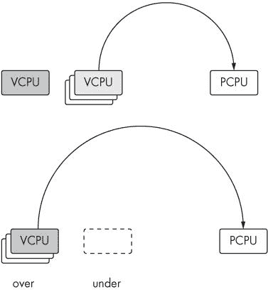
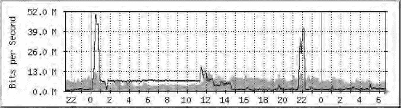

# 第七章。在 Xen 下托管不受信任的用户：来自战壕的经验教训


现在我们已经了解了 Xen 管理的基础——存储、网络、配置和管理工作——让我们看看如何在实践中应用这些基础知识。本章主要是一个案例研究，关于我们的 VPS 主机公司 prgmr.com，以及我们从向公众出租 Xen 实例中学到的经验教训。

公共 Xen 主机托管最重要的教训是，用户不能被信任与他们或彼此合作。有些人总是会试图尽可能多地获取资源。我们的重点将在于防止这种公共资源的悲剧。

# 用户优势

用户想要使用 Xen VPS 而不是支付在您的数据中心共同放置一个盒子的费用，只有一个基本原因：它便宜，尤其是对于那些只对一些基本服务感兴趣的人，而不是对大量原始性能感兴趣的人。

网格计算与虚拟化

与 Xen 相关的一个经常听到的术语是 *网格计算*。网格计算背后的基本思想是你可以快速自动地配置和销毁节点。亚马逊的 EC2 服务是一个很好的网格计算平台示例，允许你按小时租用 Linux 服务器。

网格计算不需要虚拟化，但这两个概念非常紧密地联系在一起。一个人可以设计一个使用物理机器和 PXEboot 的系统，以实现快速、简单、自动化的配置，而不使用 Xen，但虚拟化系统会使设置更加轻量级、灵活和高效。

有几个开源项目正在尝试创建一个标准且开放的接口来配置“网格计算”资源。其中一个这样的项目是 Eucalyptus ([`www.eucalyptus.com/`](http://www.eucalyptus.com/))。我们觉得像这样的标准框架——允许你轻松地在网格计算提供商之间切换——如果“网格”要生存下去，是必不可少的。

Xen 还为用户提供与在数据中心共同放置一个盒子几乎相同的所有优势：他们自己的公开路由网络接口、他们自己的磁盘、root 访问等等。使用 128MB 的虚拟机，他们可以运行 DNS、轻量级邮件服务、Web 服务器、IRC、SSH 等等。对于这些轻量级服务，盒子的功率远不如其基本存在重要——仅仅有东西可用并且公开可访问就使生活更加便利。

您还有虚拟化的基本优势，即，托管一个具有 32GB RAM 的服务器比托管 32 个每个 1GB RAM 的服务器（或者甚至 4 个每个 8GB RAM 的服务器）便宜得多。实际上，考虑到 RAM 的价格，我认为即使是经济上证明托管一个小于 32GB RAM 的一般用途服务器也是困难的。

Xen 的最后一个重要特性是，与其他虚拟化系统相比，它拥有轻量级、强大分区和稳健资源控制的良好组合。与一些其他虚拟化选项不同，它是连贯的——用户可以依赖获得他注册的确切数量的内存、磁盘空间和网络带宽，以及大约相同数量的 CPU 和磁盘带宽。

# 共享资源及其保护

Xen 的设计与良好的安全性相一致。

— Tavis Ormandy *[`taviso.decsystem.org/virtsec.pdf`](http://taviso.decsystem.org/virtsec.pdf)*

在安全专家的标准下，这是一个响亮的认可。总的来说，使用 Xen，我们不必担心人们从虚拟机中逃逸——Xen 本身应该提供适当的隔离级别。在半虚拟化模式下，Xen 不会将硬件驱动程序暴露给 domUs，这消除了一个主要的攻击向量.^([39]) 在大多数情况下，保护 dom0 就像保护任何其他服务器一样，除了在一个领域。

那个可能引起关注的领域是共享资源的访问控制，它们并不完全万无一失。主要担忧是恶意用户可能会获得比他们应得的更多资源，或者在极端情况下，通过利用 Xen 的会计漏洞来造成拒绝服务攻击。换句话说，我们是在执行性能隔离的业务，而不是特别试图通过 domUs 保护 dom0 免受攻击。

我们在这里展示的大多数资源控制都是针对那些不一定是有恶意——只是可能过于热情——的用户。

## 调整 CPU 使用率

最感兴趣的第一个共享资源是 CPU。虽然内存和磁盘大小很容易调整——你可以在配置文件中指定内存，而磁盘大小由后端设备的大小决定——细粒度 CPU 分配需要你调整调度器。

### 调度器基础

Xen 调度器在运行域之间充当裁判。在某种程度上，它很像 Linux 调度器：它可以在需要时抢占进程，它尽力确保公平分配，并确保 CPU 尽可能少地浪费周期。正如其名所示，Xen 的调度器负责在物理 CPU 上调度域。这些域反过来，从它们内部的运行队列中调度和运行进程。

由于 dom0 在 Xen 看来只是另一个域，因此它受到与 domUs 相同的调度算法的影响。如果它没有被分配足够高的权重，这可能会导致问题，因为 dom0 必须能够响应 I/O 请求。我们将在描述调整域权重的通用程序之后，稍后更详细地讨论这个话题。

Xen 可以使用各种调度算法，从简单的到复杂的。尽管 Xen 过去已经附带了许多调度器，但我们将专注于*信用调度器*；它是当前默认且推荐的选择，也是 Xen 团队表示有兴趣保持的唯一调度器。

`xm dmesg`命令会告诉您，包括但不限于 Xen 正在使用哪个调度器。

```
# xm dmesg | grep scheduler
(XEN) Using scheduler: SMP Credit Scheduler (credit)
```

如果您想更改调度器，可以将它设置为引导参数——例如，要将调度器更改为 SEDF 调度器，请将`sched=sedf`附加到 GRUB 中的内核行。（这是 Xen 内核，而不是由第一个`module`行加载的 dom0 Linux 内核。）

### 虚拟 CPU 和物理 CPU

为了方便起见，我们认为每个 Xen 域都有一个或多个虚拟 CPU（VCPUs），这些虚拟 CPU 定期在物理 CPU 上运行。这些是在运行时消耗信用点的实体。要检查虚拟 CPU，请使用`xm vcpu-list <domain>`：

```
# xm vcpu-list horatio
Name                             ID VCPUs   CPU State   Time(s) CPU Affinity
horatio                          16     0     0   ---  140005.6 any cpu
horatio                          16     1     2   r--  139968.3 any cpu
```

在这种情况下，该域有两个虚拟 CPU（VCPUs），0 和 1。虚拟 CPU 1 在（物理）CPU 1 上处于*运行*状态。请注意，Xen 会尽可能地将虚拟 CPU 分散到各个 CPU 上。除非您手动固定，否则虚拟 CPU 有时会切换到其他物理 CPU，具体取决于可用的物理 CPU。

要指定域的虚拟 CPU 数量，请在配置文件中指定`vcpus=`指令。您还可以在域运行时使用`xm vcpu-set`更改虚拟 CPU 的数量。但是，请注意，您可以通过这种方式减少虚拟 CPU 的数量，但不能增加超过初始计数的虚拟 CPU 数量。

要设置 CPU 亲和性，请使用`xm vcpu-pin <domain> <vcpu> <pcpu>`。例如，要切换域*horatio*中的 CPU 分配，使 VCPU0 在 CPU2 上运行，VCPU1 在 CPU0 上运行：

```
# xm vcpu-pin horatio 0 2
# xm vcpu-pin horatio 1 0
```

同样，您可以在域配置文件中固定虚拟 CPU（*/etc/xen/horatio*，如果您使用我们标准的命名约定）如下：

```
vcpus=2
cpus=[0,2]
```

这为域提供了两个虚拟 CPU，将第一个虚拟 CPU 固定在第一个物理 CPU 上，并将第二个虚拟 CPU 固定在第三个物理 CPU 上。

### 信用调度器

Xen 团队设计了信用调度器以最小化浪费的 CPU 时间。这使得它成为一个*节能*调度器，因为它试图确保 CPU 在有任何工作要做时始终在工作。

因此，如果有比 domUs 需求更多的真实 CPU 可用，所有 domUs 都将获得它们想要的全部 CPU。当存在竞争时——也就是说，当 domUs 总体上需要的 CPU 比实际存在的 CPU 多时——调度器将在需要 CPU 的域之间公平仲裁。

Xen 尽力做到公平分配，但调度并不完美。特别是，由域 0 服务 I/O 所花费的周期不计入责任域，导致 I/O 密集型客户端获得不成比例的 CPU 使用量。尽管如此，在非病态情况下，您可以得到相当好的分配。（此外，根据我们的经验，CPU 大部分时间都是空闲的。）

信用额调度器为每个域分配一个*权重*和可选的*上限*。权重表示域的相对 CPU 分配——如果 CPU 稀缺，权重为 512 的域将比权重为 256（默认值）的域获得两倍的 CPU 时间。上限设置了一个域可以使用的 CPU 时间的绝对限制，以 CPU 的百分之一表示。请注意，在多处理器主机上，CPU 上限可以超过 100。

调度器将权重转换为每个 VCPU 的*信用额*分配，使用一个单独的会计线程。随着 VCPU 的运行，它会消耗信用额。如果一个 VCPU 耗尽了信用额，它只有在其他更节俭的 VCPU 执行完毕后才能运行，如图图 7-1 所示。定期地，会计线程会遍历并给每个人更多的信用额。



图 7-1. VCPUs 等待在两个队列中：一个用于有信用额的 VCPUs，另一个用于超出分配额的 VCPUs。一旦第一个队列耗尽，CPU 将从第二个队列中获取。

在这种情况下，细节可能不如实际应用重要。使用`xm sched-credit`命令，我们可以根据每个域调整 CPU 分配。例如，这里我们将增加域的 CPU 分配。首先，列出域 horatio 的权重和上限：

```
# xm sched-credit -d horatio
{'cap': 0, 'weight': 256}
```

然后，为了修改调度器的参数：

```
# xm sched-credit -d horatio -w 512
# xm sched-credit -d horatio
{'cap': 0, 'weight': 512}
```

当然，"512"这个值只有相对于机器上运行的其它域才有意义。确保适当地设置所有域的权重。

要为域设置上限：

```
# xm sched-credit -d domain -c cap
```

## 提供商的调度

我们决定按照可用的 RAM 来划分 CPU——从逻辑上讲，支付盒子一半 RAM 的用户会比拥有 64MB 域的用户需要更多的 CPU。因此，在我们的设置中，拥有 25%RAM 的客户也至少拥有 25%的 CPU 周期。

做这件事的简单方法是为每个 CPU 分配一个等于其内存兆字节的权重，并留空上限。然后，调度器将处理将其转换为公平的比例。例如，我们之前提到的拥有半数 RAM 的用户将获得与其他用户加在一起相当的 CPU 时间。

当然，这是最坏的情况；这就是用户在 CPU 不断争夺的环境中会得到的结果。空闲域会自动释放 CPU。如果除了一个域之外的所有域都空闲，那么这个域可以独占整个 CPU。

### 注意

*确保 dom0 有足够的 CPU 来处理 I/O 请求是至关重要的。你可以通过为 dom0 分配一个 CPU 或者给 dom0 一个非常高的权重来实现这一点——足够高以确保它永远不会耗尽信用额度。在 prgmr.com，我们通过为每个 domU 根据其 RAM 量分配权重，并将 dom0 的权重设置为 6000 来解决这一问题*。

当处理多处理器系统时，这个简单的权重=内存公式会变得稍微复杂一些，因为独立的 CPU 分配系统开始发挥作用。一个好的规则是按内存比例（因此按权重比例）分配 VCPUs。例如，在一个具有四个核心（且关闭超线程）的机器上，拥有半数 RAM 的域至少应该有至少两个 VCPUs。另一个解决方案是给所有域分配与机器中物理处理器数量相等的 VCPUs——这将允许所有域达到物理机器的完整 CPU 容量，但可能会导致上下文交换带来的开销增加。

## 控制网络资源

网络资源控制对于任何类型的共享托管操作来说都是至关重要的。我们从 Xen 托管中学到的许多经验之一是，如果你提供免费带宽，一些用户会充分利用它。这不是 Xen 特有的观察结果，但在 Xen 易于提供的廉价 VPS 托管中尤为明显。

我们更喜欢使用`network-bridge`，因为这是默认设置。要更深入地了解`network-bridge`，请参阅第五章。

### 监控网络使用

由于一些用户可能会尽可能多地消耗带宽，因此拥有一种监控网络流量的方式至关重要.^([40])

为了监控网络使用情况，我们在物理 SPAN 端口上使用 BandwidthD。这是一个简单的工具，用于计算通过交换机的字节数——这里没有 Xen 特有的内容。我们对此感到放心，因为我们的提供商只允许进出 IP 数据包，并且我们的反欺骗规则足够强大，足以保护我们免受用户在出站数据包上欺骗 IP 的侵害。

一种类似的方法是扩展*dom0 是一个交换机*的类比，并使用 SNMP 监控软件。如第五章中所述，如果你这样做，为每个域指定一个`vifname`是很重要的。无论如何，我们将带宽监控的细节留给你。

ARP CACHE POISONING

如果你使用默认的`network-bridge setup`，你将像在任何二层交换机上一样容易受到 ARP 缓存中毒的攻击。

想法是，第二层交换机（如`network-bridge`使用的虚拟交换机）上的接口计数器在流量通过特定端口时监控流量。每当交换机看到一个以太网帧或 ARP is-at 时，它会记录它来自哪个端口和 MAC 地址。如果它收到一个目的地为缓存中 MAC 地址的帧，它会将那个帧发送到正确的端口（并且只有正确的端口）。如果桥接器看到一个目的地为不在缓存中的 MAC 地址的帧，它会将那个帧发送到所有端口。41]

聪明吗？在大多数情况下，这意味着你几乎从未看到目的地为其他 MAC 地址的以太网帧（除了广播等）。然而，这个特性纯粹是为了优化，而不是安全措施。正如那些有电缆提供商并且对 MAC 地址验证非常了解的人所知，伪造 MAC 地址相当简单。这意味着恶意用户可以用虚假的 MAC 地址填满（大小有限的）ARP 缓存，驱逐好的数据，并迫使所有数据包通过所有接口。此时，交换机基本上变成了一个集线器，所有端口的计数器都会显示任何端口的流量。

我们已经找到了两种绕过这个问题的方法。你可以使用 Xen 的`network-route`网络模型，它不使用虚拟桥接。另一种方法是忽略接口计数器，并使用类似 BandwidthD 的东西，它基于 IP 数据包进行计费。

一旦你能够快速检查流量，下一步就是塑造用户。网络流量整形和监控的原则与独立盒子相同，只是你还可以在 Xen 主机上实施策略。让我们看看如何限制特定接口的入站和出站流量——比如说，你有一个客户超出了他的带宽配额。

### 网络整形原则

关于整形，首先要知道的是，它只适用于出站流量。尽管可以对入站流量进行监控，但效果并不理想。幸运的是，在它们通过 dom0 的过程中，两个方向的流量在某个时刻看起来都像是出站流量，如图图 7-2 所示。（在以下描述中，当我们提到出站和入站流量时，我们是指从 domU 的角度来看。）


图 7-2. 入站流量来自互联网，通过虚拟桥接，并由一个简单的非层次化过滤器进行整形。另一方面，出站流量需要通过一个将数据包分配到层次队列纪律类别的过滤系统。

### 调整入站流量

我们将从入站流量开始，因为它比出站流量更容易限制。调整入站流量的最简单方法可能是**令牌桶过滤器**队列纪律，这是一种简单、有效且轻量级的方法来降低接口速度。

令牌桶过滤器，或 TBF，其名称来源于令牌桶的隐喻。令牌以定义和恒定的速率流入桶中。发送的每个数据字节从桶中取走一个令牌并立即出去——当桶为空时，数据只能以令牌流入的速度传输。桶本身具有有限的容量，这保证了只会一次性发送合理数量的数据。要使用 TBF，我们需要添加一个 `qdisc`（队列纪律）来执行实际的流量限制工作。要将虚拟接口 `osric` 限制为每秒 1 兆比特，突发速率最高为 2 兆比特，最大允许延迟为 50 毫秒：

```
# tc qdisc add dev osric root tbf rate 1mbit latency 50ms peakrate 2mbit maxburst 40MB
```

这将在设备 `osric` 上添加一个 `qdisc`。下一个参数指定了添加的位置（`root`）以及它是什么类型的 `qdisc`（`tbf`）。最后，我们指定了速率、延迟、突发速率和可以以突发速率传输的量。这些参数对应于令牌流量、数据包允许的延迟量（在驱动程序向操作系统发出其缓冲区已满的信号之前），桶可以清空的最大速率以及桶的大小。

### 调整出站流量

在调整入站流量后，我们可以专注于限制出站流量。这稍微复杂一些，因为所有域的出站流量都通过单个接口，所以单个令牌桶不起作用。警察过滤器可能有效，但它们通过丢弃数据包来处理问题，这是……不好的。相反，我们将对出站物理以太网设备 peth0 应用流量整形，使用**层次令牌桶**，或 HTB `qdisc`。

HTB 纪律类似于简单的令牌桶，但具有桶的层次结构，每个桶都有自己的速率，以及一个将数据包分配到桶的过滤系统。以下是设置方法。

首先，我们必须确保 Xen 虚拟桥上的数据包通过 `iptables`：

```
# echo 1 > /proc/sys/net/bridge/bridge-nf-call-iptables
```

这样我们就可以根据哪个 domU 发射的数据包来标记数据包。还有其他原因，但就我们的流量整形设置而言，这是重要的一个。接下来，对于每个 domU，我们添加一个规则来标记来自相应网络接口的数据包：

```
# iptables -t mangle -A FORWARD -m physdev --physdev-in baldr -j MARK --set-mark 5
```

这里数字 5 是一个任意的标记——数字本身并不重要，只要数字与域之间有一个有用的映射即可。我们使用域 ID。我们也可以直接使用匹配源 IP 地址的`tc`过滤器，但将所有内容与域的物理网络设备相关联感觉更优雅。请注意，我们使用`physdev-in`——从 domU 出去的流量进入 dom0，正如图 7-3 所示。


图 7-3. 我们将物理设备进入 dom0 的流量形状为 domU 的流量，并将 domU 离开的流量形状为在虚拟设备上进入 dom0 的流量。

接下来我们创建一个 HTB `qdisc`。我们不会过多地介绍 HTB 选项——有关更多详细信息，请参阅[`luxik.cdi.cz/~devik/qos/htb/manual/userg.htm`](http://luxik.cdi.cz/~devik/qos/htb/manual/userg.htm)上的文档：

```
# tc qdisc add dev peth0 root handle 1: htb default 12
```

然后我们创建一些类别来放置流量。每个类别将从一个 domU 接收流量。（如 HTB 文档所述，我们还在创建一个父类别，以便它们可以共享多余的带宽。）

```
# tc class add dev peth0 parent 1: classid 1:1 htb rate 100mbit
# tc class add dev peth0 parent 1:1 classid 1:2 htb rate 1mbit
```

现在我们已经为 domU 的流量定义了一个类别，我们需要一个过滤器来将数据包分配给它。

```
# tc filter add dev peth0 protocol ip parent 1:0 prio 1 handle 5 fw flowid 1:2
```

注意，我们正在匹配之前使用`iptables`设置的“处理”方式。这会将数据包分配到 1:2 类别，我们之前将其限制为每秒 1 兆比特。

到目前为止，目标 domU 的进出流量基本上已经被形状，如图 7-4 所示。你可以轻松地将这些命令添加到你的`vif`脚本末尾，无论是`vif-bridge`、`vif-route`还是包装器。我们还想强调，这只是一个示例，而且[`lartc.org/`](http://lartc.org/)上的 Linux 高级路由和流量控制指南是一个寻找进一步文档的优秀地方。`tc`手册页也是信息丰富的。



图 7-4. 形状过滤器的影响

* * *

^([39]) 在 HVM 模式下，模拟的 QEMU 设备有一定的风险，这也是我们不提供 HVM 域的部分原因。

^([40]) 在这种情况下，我们谈论的是带宽监控。你也应该运行某种类型的入侵检测系统（IDS），例如 Snort，以监视外出滥用（我们确实这样做），但这与 Xen 没有特定关系。

^([41]) 在这里，我们使用“端口”和“接口”这两个词可以互换。在具有 SNMP 功能的交换机上的接口计数器上下文中，这是一种合理的简化。

# 共享托管环境中的存储

就像系统管理中的许多其他事情一样，一点规划可以避免很多麻烦。事先想清楚你将存储原始文件系统镜像的位置，配置文件将放在哪里，客户数据将存放在哪里。

对于原始镜像，有很多约定——有些人使用`/diskimages`，有些人使用`/opt/xen, /var/xen`或类似路径，有些人使用`/home`的子目录。选择一个并坚持下去。

配置文件应该无一例外地放在`/etc/xen`中。如果你没有为`xm create`提供一个完整路径，它将在`/etc/xen`中查找文件。不要让它失望。

至于客户数据，我们建议严肃的托管提供商使用 LVM。这比 blktap-mapped 文件提供了更大的灵活性和可管理性，同时保持了良好的性能。第四章涵盖了与 LVM（或至少足够开始）一起工作的细节，以及许多其他可用的存储选项及其优点。在这里，我们只关注我们从共享托管冒险中学到的经验教训。

## 使用`ionice`调节磁盘访问

VPS 托管的一个常见问题是客户——或者你自己的维护过程，如备份——会使用足够的 I/O 带宽来减慢机器上所有人的速度。此外，I/O 实际上并不受前面讨论的调度器调整的影响。一个域可以请求数据，交出 CPU，并保存其信用额度，直到它被通知数据到达。

虽然你不能像网络 QoS 那样设置磁盘访问速率的硬限制，但你可以使用`ionice`命令将不同的域优先级划分为子类，语法如下：

```
# ionice -p <PID> -c <class> -n <priority within class>
```

在这里，`-n`是你通常会调整的旋钮。它可以从 0 到 7 不等，数字越小优先级越高。

*我们建议始终指定类为 2*。其他类也存在——3 是空闲，1 是实时——但空闲非常保守，而实时则非常激进，有可能锁定系统。类内优先级旨在实现比例分配，因此更有可能是你想要的。

让我们看看`ionice`的实际应用。在这里，我们将使用两个不同的域来测试`ionice`，一个具有最高的正常优先级，另一个具有最低的优先级。

首先，`ionice`只与 CFQ I/O 调度器一起工作。为了确认你正在使用 CFQ 调度器，请在 dom0 中运行以下命令：

```
# cat /sys/block/[sh]d[a-z]*/queue/scheduler
noop anticipatory deadline [cfq]
noop anticipatory deadline [cfq]
```

括号中的词是选定的调度器。如果不是`[cfq]`，请使用参数`elevator =cfq`重新启动。

接下来，我们找到我们想要`ionice`的过程。由于在这个例子中我们使用`tap:aio`设备，dom0 进程是`tapdisk`。如果我们使用`phy:`设备，它将是`[xvd <domain id> <device specifier>]`。

```
# ps aux | grep tapdisk
root      1054   0.5   0.0   13588   556   ?   Sl   05:45   0:10   tapdisk 
/dev/xen/tapctrlwrite1 /dev/xen/tapctrlread1
root      1172   0.6   0.0   13592   560   ?   Sl   05:45   0:10   tapdisk 
/dev/xen/tapctrlwrite2 /dev/xen/tapctrlread2
```

现在我们可以对域进行`ionice`处理。请注意，`tapctrl`设备的数量对应于域启动的顺序，而不是域 ID。

```
# ionice -p 1054 -c 2 -n 7
# ionice -p 1172 -c 2 -n 0
```

为了测试`ionice`，让我们运行几个 Bonnie++进程并计时。（在 Bonnie++完成后，我们`dd`一个负载文件，只是为了确保其他域的条件保持不变。）

```
prio 7 domU tmp # /usr/bin/time -v  bonnie++  -u 1 && dd if=/dev/urandom of=load
prio 0 domU tmp # /usr/bin/time -v  bonnie++  -u 1 && dd if=/dev/urandom of=load
```

最后，根据墙上的时钟，优先级为 0 的 domU 花费了 3:32.33 来完成，而优先级为 7 的 domU 需要 5:07.98。如您所见，`ionice`优先级提供了一个有效的方法来进行比例 I/O 分配。

应用`ionice`的最佳方式可能是查看 CPU 分配并将它们转换为优先级类别。CPU 分配最高的域获得优先级 1，其次是优先级 2，依此类推。dom0 中的进程应根据适当的方式进行 ionice 处理。这将确保合理的优先级，但不会允许大 domU 占用全部 I/O 带宽。

## 备份 DomUs

作为服务提供商，人们很快就会了解到客户不会自己进行备份。当磁盘失败（不是*如果——而是当*），客户会期望您有他们数据的完整备份，如果您没有，他们会非常难过。所以让我们来谈谈备份。

当然，您已经对如何备份物理机器有了很好的了解。备份 Xen 域有两个方面：首先，是域的虚拟磁盘，我们希望像备份真实机器的磁盘一样备份它。其次，是域的运行状态，可以从 dom0 中保存和恢复。通常，我们所说的*备份*纯粹是指磁盘，就像物理机器一样，但有一个优势，即我们可以使用域快照来暂停域足够长的时间，以获取一个干净的磁盘镜像。

我们使用`xm save`和 LVM 快照来备份域的存储和运行状态。LVM 快照不是实现全写时复制的良好方式，因为它们处理“快照空间不足”的情况不佳，但如果您想保留足够长的文件系统状态以进行一致的备份，它们是非常好的。

我们的实现使用普通的`cp`（在基于文件的 domU 的情况下）或`dd`（对于`phy:`设备）来复制整个磁盘镜像。这是因为我们非常希望避免在 dom0 中挂载可能不干净的文件系统，这可能导致整个机器恐慌。此外，如果我们进行原始设备备份，domU 管理员将能够使用 dom0 无法读取的文件系统（例如 OpenSolaris domU 上的 ZFS）。

一个适合我们描述的适当脚本可能是：

```
#!/usr/bin/perl
my @disks,@stores,@files,@lvs;

$domain=$ARGV[0];

my $destdir="/var/backup/xen/${domain}/";
system "mkdir -p $destdir";

open (FILE, "/etc/xen/$domain") ;
while (<FILE>) {
        if(m/^disk/) {
                s/.*\[\s+([^\]]+)\s*\].*/\1/;
                @disks = split(/[,]/);

                # discard elements without a :, since they can't be
                # backing store specifiers
                while($disks[$n]) {
                        $disks[$n] =~ s/['"]//g;
                        push(@stores,"$disks[$n]") if("$disks[$n]"=~ m/:/);
                        $n++;
                }
                $n=0;

                # split on : and take only the last field if the first
                # is a recognized device specifier.
                while($stores[$n]) {
                        @tmp = split(/:/, $stores[$n]);
                        if(($tmp[0] =~ m/file/i) || ($tmp[0] =~ m/tap/i)) {
                                push(@files, $tmp[$#tmp]);
                        }
                        elsif($tmp[0] =~ m/phy/i) {
                                push(@lvs, $tmp[$#tmp]);
                        }
                        $n++;
                }
        }
}
close FILE;

print "xm save $domain $destdir/${domain}.xmsave\n";
system ("xm save $domain $destdir/${domain}.xmsave");

foreach(@files) {
    print "copying $_";
        system("cp $_ ${destdir}") ;
}

foreach $lv (@lvs) {
        system("lvcreate --size 1024m --snapshot --name ${lv}_snap $lv");
}

system ("xm restore $destdir/${domain}.xmsave && gzip $destdir/${domain}.xmsave");
foreach $lv (@lvs) {
    $lvfile=$lv;
    $lvfile=~s/\//_/g;
    print "backing up $lv";
        system("dd if=${lv}_snap | gzip -c > $destdir/${lvfile}.gz" ) ;
        system("lvremove ${lv}_snap" );
}
```

将其保存为，比如说，`/usr/sbin/backup_domains.sh`，并告诉`cron`在适当的间隔执行脚本。

该脚本通过保存每个域，复制基于文件的存储，并快照 LVs 来实现。当这些操作完成后，它将恢复域，备份保存文件，并通过`dd`备份快照。

注意，当域暂停并快照时，用户将看到服务出现短暂的故障。我们测量了不到三分钟的停机时间，以获取一个具有千兆内存的域的一致备份——这对于大多数应用程序来说都在可接受的参数范围内。然而，对整个磁盘进行位对位复制可能会在一定程度上降低性能。^([42)] 我们建议在非高峰时段进行备份。

要查看 prgmr.com 上使用的其他脚本，请访问 [`book.xen.prgmr.com/`](http://book.xen.prgmr.com/)。

* * *

^(42)) 幽默的夸张。

# 对 DomU 的远程访问

对于 VPS 用户来说，正常访问的故事表面上很简单：Xen 虚拟机与托管设施中的普通机器完全一样。他们可以 SSH 进入它（或者如果你提供 Windows，可以使用 `rdesktop`）。然而，当出现问题时，用户将需要一种方式来以更低级别访问该机器，就像他们坐在 VPS 的控制台前一样。

为此，我们提供了一个他们可以 SSH 进入的控制台服务器。最简单的方法是将 dom0 作为他们的控制台服务器，并严格限制他们的账户。

### 注意

*类似地，我们认为任何托管机器都应该连接一个串行控制台。^([43)] 我们在 第十四章 中讨论了我们的理由和使用 Xen 与串行控制台的具体细节*。

## 模拟串行控制台

Xen 通过 `xm` 提供了基本的串行控制台功能。您可以在 dom0 内通过输入 `xm console <domain>` 访问一个虚拟机的控制台。输入命令后，完成操作时按 ctrl-] 退出串行控制台。

这种方法的缺点是 `xm` 必须以 dom0 的有效 UID 0 运行。虽然这在有信任的 domU 管理员的环境中是合理的，但当您给任何拥有 5 美元的人提供账户时，这并不是一个好主意。在 VPS 托管环境中处理不受信任的 domU 管理员，需要做一些额外的工作来限制使用 `ssh` 和 `sudo` 的访问。

首先，配置 `sudo`。编辑 `/etc/sudoers` 并为每个用户追加：

```
<username> ALL=NOPASSWD:/usr/sbin/xm console <vm name>
```

接下来，为每个用户，我们创建一个类似于这样的 *~/.ssh/authorized_keys* 文件：

```
no-agent-forwarding,no-X11-forwarding,no-port-forwarding,command="sudo xm
console <vm name>" ssh-rsa <key> [comment]
```

这行允许用户使用其密钥登录。一旦登录，`sshd` 将连接到命名的域控制台并将其自动呈现给用户，从而将 domU 管理员排除在外。此外，请注意以 `no` 开头的选项。它们很重要。我们不是提供 shell 账户的业务。这是一个纯控制台服务器——我们希望人们使用他们的 domU 而不是 dom0 来处理标准的 SSH 事务。这些设置将允许用户通过 SSH 访问其域控制台，同时将他们对 dom0 的访问降到最低。

## 为用户提供的菜单

当然，让每个用户访问他的控制台只是开始。通过将 `authorized_keys` 中的 `command` 字段更改为自定义脚本，我们可以提供一个具有令人惊讶的功能系列的菜单！

这里是一个我们称之为 *xencontrol* 的示例脚本。将其放置在文件系统中的某个位置——比如 `/usr/bin/xencontrol`——然后在 `authorized_keys` 文件中设置一行来调用 `xencontrol` 而不是 `xm console`。

```
#!/bin/bash
DOM="$1"
cat << EOF
`sudo /usr/sbin/xm list $DOM`

Options for $DOM
1\. console
2\. create/start
3\. shutdown
4\. destroy/hard shutdown
5\. reboot
6\. exit
EOF
printf "> "
read X
case "$X" in
*1*) sudo /usr/sbin/xm console "$DOM" ;;
*2*) sudo /usr/sbin/xm create -c "$DOM" ;;
*3*) sudo /usr/sbin/xm shutdown "$DOM" ;;
*4*) sudo /usr/sbin/xm destroy "$DOM" ;;
*5*) sudo /usr/sbin/xm reboot "$DOM" ;;
esac
```

当用户通过 SSH 登录时，SSH 守护进程会代替用户的登录 shell（我们建议将其设置为 `/bin/false` 或您平台上的等效项）运行此脚本。脚本随后会输出一些状态信息、一条信息性消息和一系列选项。当用户输入一个数字时，它会运行相应的命令（我们已经通过配置 `sudo` 允许用户运行这些命令）。

* * *

^([43]) 我们使用其他远程控制台工具的经验总体上并不愉快。串行重定向系统工作得相当好。IP KVM 几乎比在前面面板上的代码切换更可取。在好日子里。

# PyGRUB，一个 DomUs 的引导加载程序

到目前为止，我们描述的配置基本上都在配置文件中指定了 domU 的引导配置，使用 `kernel`、`ramdisk` 和 `extra` 行。然而，还有一种替代方法，即在配置文件中指定一个 `bootloader` 行，然后使用它来从 domU 的文件系统加载内核。

最常用的引导加载程序是 PyGRUB，或 Python GRUB。解释 PyGRUB 的最佳方式可能是回顾它基于的程序，GRUB，即 GRand Unified Bootloader。GRUB 本身是一个传统的引导加载程序——一个程序，它位于硬盘上的某个位置，BIOS 可以加载并执行它，然后它自己加载并执行内核。

因此，PyGRUB 就像 domU 的 GRUB。Xen 域构建器通常在虚拟机启动时直接从 dom0 文件系统加载操作系统内核（因此本身就像一个引导加载程序）。相反，它可以加载 PyGRUB，然后充当引导加载程序并从 domU 文件系统加载内核。^([44)]

PyGRUB 很有用，因为它允许 dom0 和 domU 的管理职责之间有更完美的分离。在虚拟化数据中心时，您希望将虚拟硬件交给客户。PyGRUB 更有效地虚拟化了硬件。特别是，这意味着客户可以更改自己的内核，而无需 dom0 管理员的干预。

### 注意

*PyGRUB 被提及为可能的安全风险，因为它直接从 dom0 读取未信任的文件系统。PV-GRUB（见“PV-GRUB：PyGRUB 的一个更安全的替代方案？”PV-GRUB：PyGRUB 的一个更安全的替代方案？)，它从 dom0 加载一个可信的半虚拟化内核，然后使用它来加载和跳转到 domU 内核，应该会改善这种情况*。

PV-GRUB：PyGRUB 的一个更安全的替代方案？

PV-GRUB 是升级到 Xen 3.3 的绝佳理由。PyGRUB 的问题在于，虽然它是一个很好的引导加载程序的模拟，但它必须在 dom0 中挂载 domU 分区，并且与 domU 文件系统交互。这至少导致了至少一个远程执行漏洞。PV-GRUB 通过加载一个实际上是 GRUB 引导加载程序的虚拟化版本的可执行文件来避免这个问题，然后它完全在 domU 中运行。

这还有一些其他优点。您实际上可以在 domU 内部加载 PV-GRUB 二进制文件，这意味着您可以从只读分区加载您的第一个`menu.lst`文件，然后它将传递到用户分区，这意味着与我的 PyGRUB 设置不同，用户永远不可能将他们的`menu.lst`搞到无法进入救援镜像的程度。

注意，Xen 可以在 32 位或 64 位模式下创建域，并且之后无法切换。这意味着 64 位的 PV-GRUB 无法加载 32 位 Linux 内核，反之亦然。

我们在`prgmr.com`的 PV-GRUB 设置从正常的`xm`配置文件开始，但没有引导加载程序，并且有一个指向 PV-GRUB 的`kernel=`行，而不是 domU 内核。

```
kernel = "/usr/lib/xen/boot/pv-grub-x86_64.gz"
extra = "(hd0,0)/boot/grub/menu.lst"
disk = ['phy:/dev/denmark/horatio,xvda,w','phy:/dev/denmark/rescue,xvde,r']
```

注意，我们调用 PV-GRUB 的架构特定二进制文件。32 位（PAE）版本是`pv-grub-x86_32`。

这足以加载一个常规的`menu.lst`，但关于我所说的那个坚不可摧的救援镜像怎么办？这是我们在新的`prgmr.com` Xen 3.3 服务器上这样做的方法。在`xm`配置文件中：

```
kernel = "/usr/lib/xen/boot/pv-grub-x86_64.gz"
extra = "(hd1,0)/boot/grub/menu.lst"
disk = ['phy:/dev/denmark/horatio,xvda,w','phy:/dev/denmark/rescue,xvde,r']
```

然后，在救援磁盘上的`/boot/grub/menu.lst`文件中：

```
default=0
timeout=5

title Xen domain boot
        root (hd1)
        kernel /boot/pv-grub-x86_64.gz (hd0,0)/boot/grub/menu.lst

title CentOS-rescue (2.6.18-53.1.14.el5xen)
        root (hd1)
        kernel /boot/vmlinuz-2.6.18-53.1.14.el5xen ro root=LABEL=RESCUE
        initrd /boot/initrd-2.6.18-53.1.14.el5xen.img

title CentOS installer
        root (hd1)
        kernel /boot/centos-5.1-installer-vmlinuz
        initrd /boot/centos-5.1-installer-initrd.img

title NetBSD installer
        root (hd1)
        kernel  /boot/netbsd-INSTALL_XEN3_DOMU.gz
```

第一个条目是正常引导，使用 64 位的 PV-GRUB。其余的是各种救援和安装引导。请注意，我们为救援条目指定了`(hd1)`；在这种情况下，第二个磁盘是救援磁盘。

正常引导加载 PV-GRUB 和用户的`/boot/grub/menu.lst`文件，从`(hd0,0)`加载。我们的默认用户可编辑的`menu.lst`看起来像这样：

```
default=0
timeout=5

title CentOS (2.6.18-92.1.6.el5xen)
        root (hd0,0)
        kernel /boot/vmlinuz-2.6.18-92.1.6.el5xen console=xvc0
root=LABEL=PRGMRDISK1 ro
        initrd /boot/initrd-2.6.18-92.1.6.el5xen.img
```

PV-GRUB 仅在 Xen 3.3 及以上版本上运行，并且看起来 Red Hat 没有计划将 PV-GRUB 回滚到 RHEL 5.*x*使用的 Xen 版本。

## 使 PyGRUB 工作

域的文件系统需要包含一个包含适当文件的`/boot`目录，就像常规的 GRUB 设置一样。我们通常为`/boot`创建一个单独的块设备，并将其作为配置文件中的第一个磁盘条目提供给 domU。

要尝试 PyGRUB，请向 domU 配置文件中添加`bootloader=`行：

```
bootloader = "/usr/bin/pygrub"
```

当然，由于这是 Xen，可能不会这么简单。如果您使用 Debian，请确保您已安装`libgrub, e2fslibs-dev`和`reiserfslibs-dev`。（Red Hat Enterprise Linux 和相关发行版使用默认的 Xen 设置中的 PyGRUB，并且它们将必要的库包含在 Xen 软件包中。）

即使安装了这些库，也可能在没有人工干预的情况下无法工作。较旧的 PyGRUB 版本期望虚拟磁盘有一个分区表而不是原始文件系统。如果您遇到问题，这可能就是原因。

在 PyGRUB 的现代版本中，在 domU 的虚拟磁盘上不需要分区表。

### 使用 PyGRUB 进行自我支持

在 prgmr.com，我们给 domU 管理员提供修复和自定义他们自己的系统的能力，这也为我们节省了大量安装和支持不同发行版的工作。为了实现这一点，我们使用 PyGRUB 并确保每位客户都有一个可引导的只读救援镜像，如果他们的操作系统安装出现问题，他们可以引导进入。不想让我们进行镜像的客户域配置文件看起来如下。

```
bootloader = "/usr/bin/pygrub"

memory = 512
name = "lsc"
vif = [ 'vifname=lsc,ip=38.99.2.47,mac=aa:00:00:50:20:2f,bridge=xenbr0' ]

disk = [
        'phy:/dev/verona/lsc_boot,sda,w',
        'phy:/dev/verona_left/lsc,sdb,w',
        'phy:/dev/verona_right/lsc,sdc,w',
        'file://var/images/centos_ro_rescue.img,sdd,r'
]
```

注意，我们现在正在向虚拟主机导出四个磁盘：虚拟 sda 上的 */boot* 分区，为 PyGRUB 保留；两个用于用户数据的磁盘，sdb 和 sdc；以及作为 sdd 的只读 CentOS 安装。

一个技术足够的用户，有了这个设置和控制台访问权限，几乎不需要从 dom0 管理员那里获得帮助。他或她可以更改操作系统，引导自定义内核，设置软件 RAID，如果出现问题，可以引导 CentOS 安装来修复设置。

### 设置 PyGRUB 的 DomU

使其工作唯一重要的其他部分是有效的 */grub/menu.lst*，它看起来非常像常规 Linux 安装中的 *menu.lst*。我们的默认设置如下，并存储在作为 sda 导出的磁盘上：

```
default=0
timeout=15

title centos
        root (hd0,0)
        kernel /boot/vmlinuz-2.6.18-53.1.6.el5xen console=xvc0 root=/dev/sdb ro
        initrd /boot/initrd-2.6.18-53.1.6.el5xen.XenU.img

title generic kernels
        root (hd0,0)
        kernel /boot/vmlinuz-2.6-xen root=/dev/sdb
        module /boot/initrd-2.6-xen

title rescue-disk
        root (hd0,0)
        kernel /boot/vmlinuz-2.6.18-53.1.6.el5xen console=xvc0 root=LABEL=RESCUE

ro
        initrd /boot/initrd-2.6.18-53.1.6.el5xen.XenU.img 
```

### 注意

/boot/grub/menu.lst *通常被链接到* /boot/grub/grub.conf *或* /etc/grub.conf。/boot/grub/menu.lst *仍然是重要的文件*。

与原生 Linux 一样，如果你为 */boot* 分区使用单独的分区，你需要要么在 */boot* 的根目录下创建一个指向 `.` 的符号链接，要么使你的内核名称相对于 `/boot`。

在这里，第一个和默认条目是 CentOS 发行版的内核。第二个条目是一个通用的 Xen 内核，第三个选择是只读救援镜像。就像在原生 Linux 中一样，你也可以通过标签而不是磁盘号来指定设备。

在虚拟磁盘上处理分区

在标准配置中，分区 1 可能是 */boot*，分区 2 是 */*。在这种情况下，分区 1 将具有与正常 GRUB 相同的配置文件和内核格式。

使用 `fdisk` 在 LVM 设备上创建这些分区很简单。对于文件来说，这样做要困难一些。首先，使用 `losetup` 将文件附加到循环：

```
# losetup /dev/loop1 claudius.img
```

然后以通常的方式创建两个分区，使用你喜欢的分区编辑器：

```
# fdisk /dev/loop1
```

然后，无论你是使用 LVM 设备还是循环文件，都使用 `kpartx` 从该设备的分区表中创建设备节点：

```
# kpartx -av /dev/loop1
```

设备节点将在 */dev/mapper* 下以 *devnamep#* 的格式创建。在新分区上创建你喜欢的文件系统类型：

```
# mke2fs /dev/mapper/loop1p1
# mke2fs -j /dev/mapper/loop1p2

# mount /dev/mapper/loop1p2 /mnt
# mount /dev/mapper/loop1p1 /mnt/boot
```

将你的文件系统镜像复制到 */mnt*，确保有效的 GRUB 支持文件在 */mnt/boot* 中（就像常规的 GRUB 设置一样），然后你就完成了。

* * *

^([44]) 这是一个过于简化的说法。实际上发生的情况是 PyGRUB 从 domU 文件系统复制一个内核，将其放在 */tmp* 目录下，然后写入适当的域配置，以便域构建者能够完成其工作。但这个区别通常并不重要，所以我们选择将 PyGRUB 视为它假装的引导加载程序。

# 总结

本章讨论了我们多年来依赖 Xen 所学到的内容。主要涉及如何在独立、不合作的虚拟机之间分区和分配资源，特别是针对 VPS 托管。我们描述了为什么你可能会在 Xen 上托管 VPS；针对 CPU、磁盘、内存和网络访问的具体分配问题；备份方法；以及让客户通过脚本和 PyGRUB 进行自助服务。

注意，本章与其他章节之间有一些重叠。例如，我们提到了一些关于网络配置的内容，但在 第五章 网络中，我们对此进行了更详细的讨论。我们在备份的上下文中描述了 `xm save`，但在 第九章 中，我们对其进行了更多讨论，并探讨了它与迁移的关系。Xen 主机托管非常有趣。它并没有让我们变得富有，但它带来了一系列挑战，并给了我们机会做一些有趣的事情。
