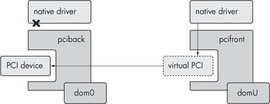

# 第十四章。提示


到现在为止，你已经成为某种 Xen 专家，我们想象。^([81]) 因此，现在我们想要用一章的篇幅来探讨与 Xen 一起工作的更神秘方面。这里有一些似乎不适合其他地方的东西——比如帧缓冲区、转发 PCI 设备，或者将附加功能构建到 XenStore 中。换句话说，就是提示。

在这里的工作示例中，第十五章 中的一些主题也可能很有用。这里讨论的一些软件甚至比 Xen 本身还要前沿，而 Xen 本身就像一把*天剑*，凶猛而鲜艳。我们试图说明的是，本章中的材料可能不会立即生效。

# 编译 Xen

尽管我们大部分时间都依赖于发行版维护者提供的 Xen 软件包，但我们认为从头开始编译 Xen 通常是有价值的。这将允许你使用比发行版中提供的版本更新的 Xen 版本。这也让你能够启用发行版维护者可能已禁用的选项。

如果你喜欢冒险，能够玩弄代码——稍作修改，或者添加一些 `printk` 消息以帮助调试，也是很不错的。

编译的最简单方法是检查 Mercurial 仓库的最新源代码。首先确保你有 Mercurial 和一系列构建依赖项。在 CentOS 5 上，我们使用 `yum` 安装了这些软件包：^([82])

+   mercurial

+   zlib-devel

+   gcc

+   libX11-devel

+   openssl-devel

+   ncurses-devel

+   bridge-utils

+   python-devel

+   git

+   dev86

+   glibc-devel

如果你想要成功构建文档，你还应该安装以下软件包：

+   texinfo

+   tetex-latex

+   pstoedit

+   transfig

考虑到在线和其他来源提供的 Xen 文档数量庞大，所包含的文档相当可选。

当这些软件包安装完成后，克隆开发仓库。这里我们使用 *xen-unstable*，但如果你想要使用一个不那么不稳定的仓库，你可能想尝试像 *xen-3.3-testing.hg* 这样的东西。截至 2009 年初，prgmr.com 运行 *xen-3.3-testing.hg*。它相当稳定。

```
# hg clone http://xenbits.xen.org/xen-unstable.hg
```

RPMFORGE 仓库

如果你想要使用 `yum` 安装之前列出的所有软件包，你必须使用 RPMForge 仓库。为了安全地这样做，请安装 `yum-priorities`。在 CentOS 5 上：

```
# yum install yum-priorities
```

编辑 `/etc/yum.repos.d/*` 下的每个文件，并添加行 `priority=N`，其中 `N` 是 1 到 99 之间的数字（数字越小，优先级越高）。你希望 `base`、`addons`、`updates` 和 `extras` 的优先级为 `1`；`centosplus` 和 `contrib` 的优先级为 `2`；其他所有内容的优先级为 `10` 或更高。

现在，安装 RPMforge：

```
wget
http://apt.sw.be/redhat/el5/en/i386/RPMS.dag/rpmforge-release-0.3.6-1
.el5.rf.i386.rpm
```

当然，如果你的机器是 x86_64，请替换为适当的架构：

```
rpm --import http://dag.wieers.com/rpm/packages/RPM-GPG-KEY.dag.txt
```

然后使用以下命令安装 `rpmforge`：

```
rpm -K rpmforge-release-0.3.6-1.el5.rf.*.rpm
```

最后，编辑 */etc/yum.repos.d/rpmforge.repo* 并添加 `priority=10`。

这将把仓库下载到本地目录（在本例中为*xen-unstable.hg*）。接下来，`cd`进入该目录并运行`make world`：

```
# cd xen-unstable.hg
# make world && make install
```

这将构建和安装 Xen 虚拟机管理程序、其支持工具以及一个用于 dom0 的 Linux 内核。DomUs 也可以使用它。通常，这将是你需要的一切。然而，如果你想更改你的内核配置，你可以。要配置 Linux 内核，请运行：

```
# make linux-2.6-xen-config configmode=MENUCONFIG
```

这将打开标准的 Linux 内核配置器。像往常一样配置内核。

### 注意

*你可能想禁用 dom0 的 8250 串行驱动程序，因为它与 Xen 串行控制台冲突。像往常一样，不要忘记你的启动设备的驱动程序*。

然后运行：

```
# make linux-2.6-build
# make linux-2.6-install
```

这将构建和安装内核。现在，如果你在使用 CentOS，你可能想创建一个 initrd：

```
# mkinitrd /boot/initrd-2.6.18.8-xen.img 2.6.18.8-xen
```

### 注意

*RHEL 5.3 早期版本中存在一个 bug，会导致这个问题。有关详细信息，请参阅[`bugzilla.redhat.com/show_bug.cgi?id=488991`](https://bugzilla.redhat.com/show_bug.cgi?id=488991)。解决方案是在* *`mkinitrd`* *命令行中添加* *`--allow-missing`* *，因此：* *`# mkinitrd /boot/initrd-2.6.18.8-xen.img 2.6.18.8-xen --allow-missing`*。

现在，你需要修复*/boot/grub/menu.lst*。添加如下段落，但请记住使用适当的设备、路径，以及可能还有文件名：

```
title Xen.org 2.6.18.8-xen-3.3
        root (hd0,0)
        kernel /boot/xen-3.3.gz
        module /boot/vmlinuz-2.6.18.8-xen ro root=/dev/md0
        module /boot/initrd-2.6.18.8-xen.img
```

重启并享受你的新 Xen 安装。

* * *

^([81]) 或者至少，任何没有把这本书扔出窗户的人一定非常擅长填补模糊的方向。

^([82]) 我们还在备用内核（Dom0 和 DomU）")paravirt_ops Dom0 和 paravirt_ops DomU 中包含了一套更以 Debian 为中心的编译指令。

# 编译时调整

这就是构建 Xen 的快速简单方法，但基本的编译`make world`只是开始。编译代表了我们有配置 Xen 的第一个机会，而且现在我们已经有所实践，我们可以做更多的事情。

大部分的编译时调整可以通过在 Xen 源树的顶层*Config.mk*文件中调整变量来完成。这个文件有相当多的注释，并且易于编辑——看看。你会发现有一个简短的段落，你可以决定要构建哪些可选的 Xen 组件。

我们通常打开所有可选组件，除了虚拟可信平台模块（VTPM）工具，导致出现如下部分：

```
XENSTAT_XENTOP     ?= y
VTPM_TOOLS         ?= n
LIBXENAPI_BINDINGS ?= y
XENFB_TOOLS        ?= y
PYTHON_TOOLS       ?= y
```

### 注意

*Xen 的 VTPM 工具很有趣。它们一直是重点开发对象，对于签名代码有一些有趣的含义，还有 DRM 的阴影，但我们还没有深入研究。如果你决定构建它们，你可以在域配置中的* *`vtpm=`* *选项中添加虚拟 TPM*。

如果你遇到麻烦（相信我们，你可能在某个时候会遇到），制作一个调试版本可能是个好主意。为此，在文件顶部设置 `DEBUG` 变量：

```
DEBUG              ?= y
```

别担心：Xen 不会在调试模式下运行，除非你在运行时明确指示它这样做。

这些可选的 Xen 组件有一系列未记录的依赖项，其中一些在 Makefiles 中没有被检查。特别是，LIBXENAPI_BINDINGS 需要安装 libxml2 和 curl 或这些软件包的 -devel 版本，如果你使用的是 Red Hat 衍生版本。

此外，如果在构建工具时出现问题，为了避免再次运行 `make world`（因为这需要一段时间），可能是一个好主意。很可能会发现，只需运行 `make tools` 就可以解决问题。

## 替代内核（Dom0 和 DomU）

默认的 Xen Makefile 会构建一个可以在 dom0 和 domU 中使用的单个内核。如果你将节省内存作为高优先级，可以为每个构建一个单独的内核。这些内核将各自有一组合理的配置选项：domU 的配置最小化，dom0 的配置模块化。在 `make` 命令行上指定 `KERNELS` 变量：

```
# make KERNELS="linux-2.6-dom0 linux-2.6-domU"
```

当然，这样做的主要原因是你可以从 domU 内核中移除所有非 Xen 设备驱动程序。这节省了内存，如果你碰巧在测试大量内核，还可以节省编译时间。

# paravirt_ops Dom0

要理解为什么 paravirt_ops 被视为一个单独的部分，我们必须回忆起许多早期的 Xen 开发是在虚拟化成为主流之前进行的。为了对 Linux 内核进行 para-virtualization，Xen 开发者进行了广泛的更改，这些更改证明很难与主线内核开发合并。

paravirt_ops 是解决这个问题的通用解决方案。它是一个内核级框架，用于添加代码以使 Linux 能够在各种虚拟机管理程序下运行，包括 Xen。想法是，通过将这些接口作为官方内核的一部分，我们可以使 Xen 更少侵入性，更容易维护。

Xen 自 3.1 版本以来支持 paravirt_ops domUs，官方 Linux 内核自 2.6.23 版本以来对 i386 支持 domU，自 2.6.26 版本以来对 x86_64 支持 domU。不幸的是，截至本文撰写时，kernel.org 内核只支持客户机。

但隧道尽头有光。通过 Jeremy Fitzhardinge 的 paravirt_ops dom0 工作的最新补丁和 Xen 3.4 虚拟机管理程序，实际上可以在基于 Linux 内核版本 2.6.30 的 paravirt_ops dom0 上运行。

这些说明代表了一个非常长的开发过程的快照。它们对我们今天有效。URL 可能会改变。软件的状态肯定也会改变。然而，考虑到这一点，以下是设置一个功能性的 paravirt_ops dom0 的方法。

首先，你需要一些开发包。这次我们使用的是 Debian 软件包名称：

+   mercurial

+   build-essential

+   libncurses5-dev

+   gawk

+   openssl

+   xorg-dev

+   gettext

+   python-dev

+   gitk

+   libcurl4-openssl-dev

+   bcc

+   libz-dev

+   libxml2-dev

接下来，使用 Mercurial 检出 Xen-unstable。我们警告过你，这些功能仍在开发中。

```
# hg clone http://xenbits.xensource.com/xen-unstable.hg
# cd xen-unstable.hg
# make xen
# make install-xen
# make tools
# make install-tools
```

然后从 Jeremy Fitzhardinge 的 git 仓库检出当前的 Linux 补丁：

```
# git clone git://git.kernel.org/pub/scm/linux/kernel/git/jeremy/xen.git linux-2.6-xen
# cd linux-2.6-xen
# git checkout origin/push2/xen/dom0/master -b push2/xen/dom0/master
```

配置内核。我们将 Ubuntu 的配置复制到 *.config* 并以此为基础。

```
# cp /boot/config-2.6.26-11-server .config
# make menuconfig
```

由于我们正在构建 paravirt_ops dom0，请确保启用适当的支持：

```
Processor type and features
    -> Paravirtualized guest support
........-> Enable Xen privileged domain support
```

确保在以下位置启用 Xen 块设备前端支持：

```
Device Drivers
    -> Block devices
```

接下来，构建内核。

```
# make
# make modules_install install
# depmod 2.6.30-tip
# mkinitramfs -o /boot/initrd-2.6.30-tip.img 2.6.30-tip
```

将 */proc/xen* 添加到 `fstab` 并挂载它，以便 `xend` 等工具能够与虚拟机管理程序通信：

```
none /proc/xen xenfs defaults 0 0
```

创建一个 GRUB 条目来引导你的新 Xen paravirt_ops dom0：

```
title Xen 3.4 / Ubuntu 8.10, kernel 2.6.30-tip
kernel /boot/xen-3.4.gz
module /boot/vmlinuz-2.6.30-tip root=/dev/sdb2 ro console=tty0
module /boot/initrd-2.6.30-tip.img
```

当然，请确保这些值适合你的设置。这就是全部内容。

# paravirt_ops DomU

“但是，”你可能会问，“所有这些关于在 domU 中使用 kernel.org 内核是什么意思？”如果你只是想制作自己的 domU 内核，这个过程要简单得多，自 2.6.23 版本以来无需树外补丁即可支持。所有这些说明都是从使用 PV-GRUB 或 PyGRUB 启动的 domU 内部提供的——不需要 dom0 管理员的干预。

首先，下载你偏好的内核源代码：

```
# wget http://kernel.org/pub/linux/kernel/v2.6/linux-2.6.29.3.tar.bz2
```

接下来，安装构建内核通常所需的软件包。这个例子是为 Debian 定制的，但应该很容易找到你喜欢的发行版构建内核所需的软件包。

```
# apt-get install build-essential libncurses5-dev
```

解包并配置内核。我们个人喜欢 `menuconfig`，但这只是个人喜好问题：

```
# tar -jxf linux-2.6.29.3.tar.bz2
# cd linux-2.6.29.3
# make menuconfig
```

不要忘记启用 Xen 支持：

```
-> Processor type and features
  -> Paravirtualized guest support
    -> XEN
```

不要忘记你的网络驱动程序：

```
-> Device Drivers
  -> Network device support
    -> XEN_NETDEV_FRONTEND
```

或者你的磁盘驱动程序：

```
-> Device Drivers
  -> Block devices
    -> XEN_BLKDEV_FRONTEND
```

Xenfs，它允许你访问 XenBus，有时很有用：

```
-> Device Drivers
  -> XENFS
```

然后随心所欲地进行自定义。记住，你现在可以移除几乎所有硬件的支持。我们还省略了气球驱动程序。RAM 很便宜，我们喜欢有明确的内存分配。

现在，像往常一样构建内核：

```
make -j4 ; make install modules_install
```

按照常规内核构建方式制作你的 initrd。由于我们在这个例子中使用 Debian，这意味着使用 `mkinitramfs`。如果你将 `xenblk` 编译为模块，请确保将其包含在内。

```
mkinitramfs -o /boot/initrd-2.6.29.3.img 2.6.29.3
```

按照常规设置 GRUB：

```
title kernel.org paravirt DomU
  root (hd0,0)
  kernel /boot/vmlinuz-2.6.29.3  root=LABEL=DISK1 ro
  initrd /boot/initrd-2.6.29.3.img
```

在重启之前，最后一件事情：请注意，你的控制台设备名称将是 hvc0，即 *虚拟机管理程序控制台*。这取代了 Xen 特定的 xvc0。如果你的发行版还没有这样做，你可能想设置域以在 hvc0 上启动 `getty`。现在，只需重新启动你的域（如果你使用 PyGRUB，请先停止再启动）并享受你的现代内核。

```
# uname -a
Linux sebastian.xen.prgmr.com 2.6.29.3 #1 SMP Tue May 12 06:32:52 UTC 2009 x86_64 GNU/Linux 2009
```

# Xen API：未来的道路

Xen API 是一个 XML-RPC 接口，用于替代与虚拟机管理程序通信的旧接口。它承诺提供一个标准、稳定的接口，以便人们可以构建 Xen 前端而不用担心接口会发生变化。它还扩展了之前的 Xen 命令集，以便在标准化的工具中利用更多 Xen 的功能。

在当前版本的 Xen 中，API 是一个可选组件，但这不应该阻止你使用它；例如，最新的 Citrix Xen Server 产品完全依赖于 API 来实现管理前端和虚拟化主机之间的通信。

Xen API 是通过在*Config.mk*文件顶部设置 LIBXENAPI_BINDINGS 标志来启用的：

```
LIBXENAPI_BINDINGS ?= y
```

当你用支持 Xen API 的方式构建 Xen 时，API 的使用由*/etc/xen/xend-config.sxp*中的`(xen-api-server)`指令控制。

```
(xen-api-server ((9363 none) (unix none)))
```

这个指令开启了 API 服务器并指定了如何连接到它。括号中的每个列表都是一个连接方法。在这种情况下，我们使用 TCP 端口 9363 和一个本地 Unix 套接字，每个都没有任何身份验证。

要指定我们想要使用 PAM 进行身份验证，我们可以稍微修改一下这个配置：

```
(xen-api-server ((9363 pam '192.0.2.*'))
```

通常，即使在开发 Xen 客户端时，你也不需要以低级别与 Xen API 交互。大多数流行语言都有绑定，包括 C 和当然还有 Python。Xen.org API 文档，可通过[`wiki.xensource.com/xenwiki/XenApi/`](http://wiki.xensource.com/xenwiki/XenApi/)访问，是关于这个主题的最后一言。

# 使用气球驱动程序管理内存

从编译时间和安装问题转向运行 Xen 的日常业务，我们遇到了内存问题。正如我们提到的，大多数 Xen 安装实际上受限于物理内存。

Xen 在虚拟化内存上投入了大量的努力；其方法是半虚拟化的一个定义特征，通常“只需工作”，在足够低的级别上可以完全忽略。然而，有时管理员的一点点关注可能会带来好处。

我们已经围绕内存超订阅的主题绕来绕去很长时间了，我们最好坦白：可以为 domU 分配一定量的动态内存，但我们没有这样做，因为它不适合我们的*虚拟专用服务器*模式。此外，开发者们从历史上就对这个建议用于生产持谨慎态度。然而，它确实存在，而且有一些很好的理由去使用它，我们相信你能想象到。

Xen 对虚拟机内存重新分配的控制是间接的。首先，domU 配置文件中内存的值是一个*最大值*——从概念上讲，这是虚拟机可以物理访问的内存量。配置文件中的内存量是内核在启动时看到的。增加内存需要重启。这项工作正在进行中，主要来自 Linux 的内存热插拔方向。我们相信很快会有人提供补丁。

在这个不灵活的最大值内，Xen 可以使用*气球驱动程序*来减少内存，这只是一个位于 domU 中并*膨胀*以消耗内存的模块，然后将其归还给虚拟机管理程序。

因为 dom0 也是一个 Xen 域，它也可以拥有一个内存气球，Xen 使用它来回收 dom0 内存以分配给 domUs。

### 注意

*我们倾向于使用* *`dom0_mem`* *引导选项直接设置 dom0 内存，这会主动隐藏内存以防止 dom0 使用。通过在* *xend-config.sxp* *中设置* *`(dom0-min-mem 0)`* *和* *`(enable-dom0-ballooning no)`* *，我们可以确保 dom0 不会膨胀，从而保持一致的内存预留。^([83])

您可以使用`xm`手动调整气球使用的内存量：

```
# xm mem-set sebastian 112
```

该域将其视为目标，当内存空闲时，会将其分配给气球.^([84]) 因此，一个负载较重的域可能需要一段时间才能将内存释放给气球。

您可以在虚拟机列表中看到气球的效果：

```
# xm list sebastian
Name                                      ID Mem(MiB) VCPUs State   Time(s)
sebastian                                 71      111     1 -b----     38.4
```

您也可以通过*/proc/xen/balloon*从 domU 内部查看与气球相关的信息：

```
# cat /proc/xen/balloon
Current allocation:   114688 kB
Requested target:     114688 kB
Low-mem balloon:       24576 kB
High-mem balloon:          0 kB
Driver pages:            136 kB
Xen hard limit:          ??? kB
```

### 注意

*气球相当积极；它可能导致 domU 出现内存不足的情况。请谨慎使用*。

* * *

^([83]) 在 Xen 的新版本中，您实际上只需要设置* *`(enable-dom0-ballooning no)`* *，但这在旧版本中没有效果。在`enable-dom0-ballooning`选项启用之前，将`dom0-min-mem`设置为 0 将禁用气球。实际上，您只需将`dom0-min-mem`设置为 0 即可；我在在 xen-devel 列表上出丑之后测试了它，它有效，但`(enable-dom0-ballooning no)`既清晰又简洁，这类事情足够重要，值得两次指定。

^([84]) 尽管 Linux 尽力在所有时间都保持内存的使用，但它会将内存分配给气球，而不是用于缓冲区或缓存。

# PCI 转发

您可以允许 domU 访问任意 PCI 设备并使用它们，具有完全的权限。当然，没有免费的午餐；Xen 不能神奇地复制 PCI 硬件。为了使 domU 使用 PCI 设备，它必须从 dom0 中隐藏，并且不会转发到任何其他 domUs。



图 14-1. Xen PCI 设备转发

如图 14-1 所示，PCI 转发使用客户端/服务器模型，其中*pcifront 驱动程序*在 domU 中运行，并直接与绑定到 PCI 设备的*pciback 驱动程序*通信。

首先，考虑您想要转发到 domU 的设备。我们坐在这台测试机前的设备似乎有七个(!) USB 控制器，所以我们只取其中几个。

使用`lspci`确定总线 ID：

```
# lspci

00:1a.0 USB Controller: Intel Corporation 82801H (ICH8 Family) USB
UHCI #4 (rev 02)
00:1a.1 USB Controller: Intel Corporation 82801H (ICH8 Family) USB
UHCI #5 (rev 02)
00:1a.7 USB Controller: Intel Corporation 82801H (ICH8 Family) USB2
EHCI #2 (rev 02)

(&c.)
```

我们将转发`00:1a.1`和`00:1a.7`，这是 USB1 控制器列表中的第二个和 USB2 控制器。您的设备名称可能与这个示例中的不同。

如果 pciback 编译进内核，您可以在内核命令行上使用 `pciback.hide` 选项来引导 dom0。对于这两个控制器，选项看起来是这样的：

```
pciback.hide=(00:1a.1)(00:1a.7)
```

如果 pciback 是一个模块，那么会稍微困难一些。我们需要将 PCI 设备从其驱动程序中分离出来，并将其连接到 pciback 透传。

```
# insmod pciback hide=(00:1a.1)(00:1a.7)
# echo -n 00:1a.1 > /sys/bus/pci/drivers/uhci_hcd/unbind
# echo -n 00:1a.1 > /sys/bus/pci/drivers/pciback/new_slot
# echo -n 00:1a.1 > /sys/bus/pci/drivers/pciback/bind
```

现在将这些设备放入 domU 配置文件中：

```
pci = [ '00:1a.1', '00:1a.7' ]
```

在下一个 domU 引导时，这些 USB 控制器应该会出现，并可供 domU 中的本地驱动程序使用。在无 IOMMU 的平台上，硬件设备可以 DMA 到任意内存区域。如果您将 PCI 访问权限授予任意域，这可能会成为安全问题。道德是，将所有具有 PCI 总线访问权限的域视为特权域。确保您可以信任它们。

# GRUB 配置

当然，我们只是顺便提到了 GRUB，因为它是 Xen 的基本先决条件之一。然而，还有几个关于 GRUB 的方面值得深入探讨。Xen 的许多行为旋钮可以在引导时通过调整传递给虚拟机管理程序的命令行参数来调整。

例如，已经提到的 `dom0_mem` 参数调整了 Xen 允许 dom0 看见的内存量：

```
kernel /boot/xen.gz dom0_mem=131072
```

为了防止系统在内核恐慌时重启，这种情况比我们希望的更常见，尤其是在尝试设置机器时，请将 `noreboot` 添加到 `kernel` 行：

```
kernel /boot/xen.gz dom0_mem=131072 noreboot
```

以及将 `panic=0` 添加到 Linux 的 `module` 行：

```
module /boot/vmlinuz-2.6.18-53.1.21.el5xen panic=0
```

这当然是在 Linux 内核支持的众多选项的基础上，您可以根据需要将其添加到 `vmlinuz` 的 `module` 行。

# 串行控制台

另一个重要的与 GRUB 相关的任务是设置您的串行控制台。如前所述，我们认为串行控制台是任何类型服务器控制台访问的黄金标准。它比任何图形界面都要简单得多，可以通过各种设备轻松访问，并且在机器崩溃时最有可能提供有用的信息。此外，由于系统固有的客户端/服务器架构，任何崩溃的机器成功打印的内容都会发送到另一台物理上独立的机器，在那里可以随意分析。

Xen 随带 miniterm，这是一个用于此类操作的简化串行客户端，以防您无法访问串行客户端。这种情况不太可能发生，但客户端很小，为什么不试试呢？

Miniterm 位于 Xen 源树的 *tools/misc/miniterm* 子目录中。如果您已经使用 Xen 构建了所有工具，它可能已经构建并可能甚至安装了；如果没有，您只需在那个目录中输入 **`make`** 并运行生成的可执行文件。

## 启用串行输出

有四个组件需要将它们的输出重定向到串行端口：GRUB、Xen、Linux 内核和 Linux 的用户空间。前三个组件只需在 GRUB 的 *menu.lst* 中添加一个指令即可。

首先，在文件顶部附近，添加以下几行：

```
serial --unit=0 --speed=115200 --word=8 --parity=no --stop=1
terminal --timeout 10 serial console
```

编辑 Xen 内核行，告诉虚拟机管理器使用第一个串行端口进行输出：

```
kernel /boot/xen.gz-2.6.18-53.1.21.el5 console=com1 com1=115200,8n1
```

告诉 Linux 内核在`ttyS0`上打印其消息：

```
module /boot/vmlinuz-2.6.18-53.1.21.el5xen ro root=/dev/md0
console=ttyS0,115200n8
```

最后，编辑*/etc/inittab*并添加以下类似的行：

```
7:2345:respawn:/sbin/agetty 115200 ttyS0
```

你可能还想将`ttyS0`添加到*/etc/securetty*中，这样 root 就可以像传统控制台一样登录。

## Xen 虚拟机管理器控制台

Xen 通过使用它来访问额外的虚拟机管理器功能，为串行控制台添加了另一层。首先，在串行控制台上按 CTRL-A 三次进入虚拟机管理器控制台。这不会在 VGA 控制台上工作。你会得到一个(XEN)提示。

当你在虚拟机管理器控制台上时，你可以给 Xen 提供几个有用的（或者至少有趣的）命令。尝试输入**`h`**以获取帮助或使用其中一个信息性命令，如**`m`**。你还可以使机器崩溃、重新启动或转储各种信息。探索并尝试它。

要退出虚拟机管理器控制台，请按 CTRL-A 三次。

# Xen 和 LILO

这个部分仅适用于真正的恐龙们，但我们表示同情。为了保持你仿佛消失在神秘过去的感受，我们将使用 Xen 3.0 来展示这个示例。

如果你坚决要使用 LILO 而不是 GRUB，你会很高兴地得知这是可能的。尽管一般认为 LILO 缺少 GRUB 的`module`指令的等价物，这使得它无法引导 Xen，但可以通过使用`mbootpack`将虚拟机管理器、dom0 内核和 initrd 合并到一个文件中，来绕过这个问题。

考虑*grub.conf*中的以下条目：

```
title slack-xen
        root (hd0,0)
        kernel /boot/xen.gz
        module /vmlinuz-2.6-xen ro root=/dev/hda1 ro
        module /initrd-2.6.18-xen.gz
```

它将虚拟机管理器*xen-3.0.gz*作为内核加载，然后解压缩*vmlinuz-2.6-xen*和*initrd.gz*到内存中。要合并这些文件，首先解压缩：

```
# cd /boot
# gzcat xen-3.0.gz > xen-3.0
# gzcat vmlinuz-2.6-xen0 > vmlinux-2.6-xen0
# gzcat initrd.gz > initrd.img
```

注意从*vmlinuz*到*vmlinux*的变化。这并不重要，除非它防止你在`gzcat`过程的开始处覆盖内核。

然后使用`mbootpack`合并这三个文件：

```
# mbootpack -o vmlinux-2.6-xen.mpack -m vmlinux-2.6-xen0 -m initrd.gz
  -m initrd.img xen3.0
```

*grub.conf*条目随后变为*lilo.conf*条目：

```
image=/boot/vmlinux-2.6-xen.mpack
   label=xen
   root=/dev/ram0
```

最后，运行`lilo`命令。

```
# /sbin/lilo
```

# 虚拟帧缓冲区

尽管纯粹主义者可能会声称所有管理都应该通过串行端口完成，但我们对于过去 25 年左右一直在使用的这种新奇的图形技术也有话要说。Xen 通过包含一个用于*虚拟帧缓冲区*的功能，对这些前瞻性信念做出了让步。

你需要编辑你的*Config.mk*文件来构建 VFB：

```
XENFB_TOOLS        ?= y
```

在这一点上，你还需要安装 libvncserver 和 libsdl-dev。以你选择的方式安装它们。我们安装了 CentOS 的 SDL-devel 包，并从源代码安装了 libvncserver。然后我们构建了 Xen，并以通常的方式安装它。

要在域内实际使用 framebuffer，你需要在配置文件中指定它。Xen 的最近版本在语法上有所改进。`vfb=`选项控制虚拟 framebuffer 的所有方面，就像`vif=`和`disk=`行控制虚拟接口和虚拟块设备一样。例如：

```
vfb = [ 'type=vnc, vncunused=1' ]
```

在这里，我们指定了一个 VNC VFB，并告诉 VNC 服务器在给定数字之上的第一个未使用端口上监听。（我们将在附录 B 中详细介绍可用的选项。）或者，如果你喜欢冒险，还有 SDL 版本：

```
vfb = [ 'type=sdl' ]
```

简单。

# XenStore 的有趣和有利可图的用途

XenStore 是 Xen 存储运行中的 domUs 信息的配置数据库。尽管 Xen 在设置虚拟设备等关键事务内部使用 XenStore，但你也可以从 domUs 以及 dom0 写入任意数据到其中。将其视为某种跨域套接字。

这打开了许多可能性。例如，理论上，域之间可以协商以获取对共享资源的访问权限。或者，你可以有像过去共享 UNIX 机器上的*talk*系统一样的东西——在同一主机上运行的人之间的多用户聊天。你可以用它来传播特定于主机的消息，例如，警告人们即将进行的备份或迁移。不过，大多数这样的应用仍然有待编写。

由于没有人提供方便的 shell 样式界面，手动与 XenStore 交互有点不方便。在此期间，我们只能使用查询单个键的工具来凑合。

要查看 XenStore，可以使用`xenstore-list`命令。以下是从 Xen wiki 中摘录的一个 shell 脚本，它使用`xenstore-list`递归地导出 xenstore 中的键：

```
#!/bin/sh

function dumpkey() {
   local param=${1}
   local key
   local result
   result=$(xenstore-list ${param})
   if [ "${result}" != "" ] ; then
     for key in ${result} ; do dumpkey ${param}/${key} ; done
   else
     echo -n ${param}'='
     xenstore-read ${param}
   fi
}

for key in /vm /local/domain /tool ; do dumpkey ${key} ; done
```

你会看到我们有三个硬编码的顶级键：`vm`、`local/domain`和`tool`。这些键对虚拟机管理程序都有明确的用途：`vm`通过 UUID 存储域信息；`local/domain`通过 ID 存储域信息（可以说`vm`以适合迁移的形式导出域数据，而`local/domain`则用于本地存储）；`tool`存储特定工具的信息。

探索一下，看看键是如何映射你从其他来源（如`xm list --long`）已知的关于域的信息的。例如，要获取域的内存使用目标，请运行：

```
# xenstore-read /local/domain/15/memory/target
1048576
```

XenStore 中的许多键也是可写的。尽管我们不推荐通过写入 XenStore 来调整内存使用，但下一节将给出通过可写 XenStore 键进行跨域通信的示例。

## 在域启动时自动连接到 VNC 控制台

Xen LiveCD 的一个巧妙特性是，当 Xen 域启动时，它们在完成引导后会自动弹出一个 VNC 窗口。使这一功能成为可能的基础设施是一个位于 domU 中的脚本、一个位于 dom0 中的监听器以及它们之间的 XenBus。

位于 domU 中的脚本*vnc-advertiser*从 domU 启动脚本中触发，并等待一个 Xvnc 会话开始。当它找到一个会话时，它会写入 XenStore：

```
xenstore-write /tool/vncwatch/${domid} ${local_addr}${screen}
```

在 dom0 中，一个相应的脚本会监视对 XenStore 的写入操作。在 LiveCD 上，它被命名为*vnc-watcher.py*。这个脚本是 XenStore 通用用途的好例子，所以我们将其完整复制在此，并附上详尽的注释：

```
#!/usr/bin/env python
###
# VNC watch utility
# Copyright (C) 2005 XenSource Ltd
#
# This file is subject to the terms and conditions of the GNU General
# Public License.  See the file "COPYING" in the main directory of
# this archive for more details.
###
# Watches for VNC appearing in guests and fires up a local VNC
# viewer to that guest.
###

# Import libraries necessary to interact with the xenstore.  Xswatch
# watches a xenstore node and activates a script-defined function
# when the node changes, while xstransact supports standard read and
# write operations.

from xen.xend.xenstore import xswatch
from xen.xend.xenstore.xstransact import xstransact
from os import system

def main():
   # first make the node:
   xstransact.Mkdir("/tool/vncwatch")
   xstransact.SetPermissions("/tool/vncwatch",
                             { "dom" : 0,
                               "read" : True,
                               "write" : True })
   active_connections = {}

# The watchFired method does the actual work of the script.  When the
# watcher notes changes to the path "/tool/vncwatch/", it calls
# watchFired with the path (and arguments, which are unused in this
# script).

   def watchFired(path, *args, **nargs):
       if path == "/tool/vncwatch":
           # not interested:
           return 1

# If we reach this point, something's changed under our path of
# interest.  Let's read the value at the path.

       vncaddr = xstransact.Read(path)
       print vncaddr

# When the vnc-advertiser notices that Xvnc's shut down in the domU,
# it removes the value from the xenstore.  If that happens, the
# watcher than removes the connection from its internal list (because
# presumably the VNC session no longer exists).

       if vncaddr == None:
           # server terminated, remove from connection list:
           if path in active_connections:
               active_connections.remove(path)
       else:
           # server started or changed, find out what happened:
           if (not active_connections.has_key(path)) or
              active_connections[path] != vncaddr:

# Recall that the vnc-advertiser script writes ${domid}
# ${local_addr}${screen}  to the patch /tool/vncwatch/.  The watcher
# takes that information and uses it to execute the vncviewer command
# with appropriate arguments.

        active_connections[path] = vncaddr system("vncviewer
-truecolour " + vncaddr + " &") return 1

# Associate the watchFired event with a watcher on the path
# "tool/vncwatch"

   mywatch = xswatch.xswatch("/tool/vncwatch", watchFired)
   xswatch.watchThread.join()

if __name__ == "__main__":
   main()

===
```

我们本希望在这里包含一些其他部分，但截至撰写本文时，它们尚未准备好，例如，目前正在进行的开源努力以构建 Amazon EC2 的克隆或 Project Kemari 正在进行的高可用性工作。

无论如何，请访问我们的网站([`prgmr.com/xen/`](http://prgmr.com/xen/))，了解更多关于我们用 Xen 做的酷炫但令人畏惧的日常事情。

此外，如果你在尝试从源代码升级 Xen 时破坏了系统，那么现在正是查看下一章的好时机。
