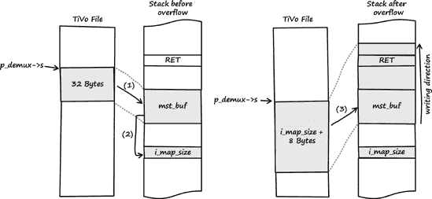
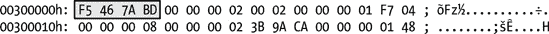
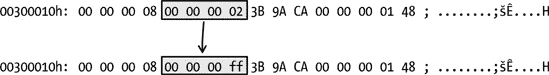
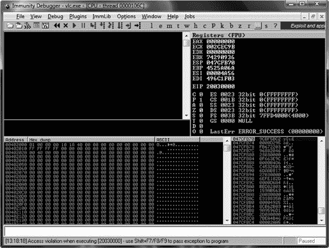
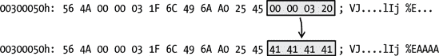
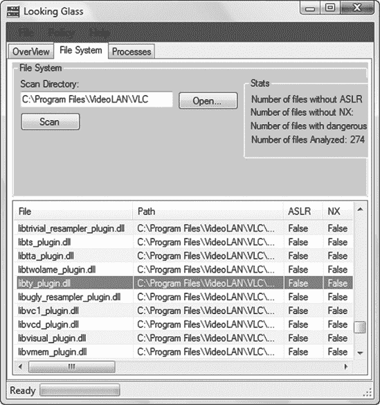

# 第二章。回到 90 年代

### 备注

*星期日，2008 年 10 月 12 日*

*亲爱的日记*，

我今天查看了 VideoLAN 的流行媒体播放器 VLC 的源代码。我喜欢 VLC，因为它支持所有不同类型的媒体文件，并且在我的所有喜欢的操作系统平台上运行。但是支持所有这些不同的媒体文件格式也有缺点。VLC 做了很多解析，这通常意味着有很多等待被发现的问题。

### 备注

根据 Dick Grune 和 Ceriel J.H. Jacobs 所著的《解析技术：实用指南》，“解析是根据给定的语法对线性表示进行结构化的过程。”解析器是一种软件，它将原始的字节串分解成单个单词和语句。根据数据格式，解析可能是一个非常复杂且容易出错的任务。

在我熟悉了 VLC 的内部工作原理后，找到第一个漏洞只花了大约半天时间。这是一个经典的堆栈缓冲区溢出（见附录 A.1）。这个漏洞发生在解析一个名为 TiVo 的媒体文件格式时，这是 TiVo 数字录制设备的本地格式。在发现这个错误之前，我从未听说过这种文件格式，但这并没有阻止我利用它。

# 2.1 漏洞发现

这里是我发现漏洞的方法：

+   第 1 步：生成 VLC 解复用器的列表。

+   第 2 步：识别输入数据。

+   第 3 步：追踪输入数据。

我将在以下几节中详细解释这个过程。

## 第 1 步：生成 VLC 解复用器的列表

### 备注

*我在以下所有步骤中使用了 Microsoft Windows Vista SP1 (32-bit)平台上的 VLC 0.9.4*。

在下载并解压缩 VLC 的源代码后，我生成了媒体播放器可用的解复用器列表。

### 备注

在数字视频中，“解复用”或“解复用”是指将音频和视频以及其他数据从视频流或容器中分离出来的过程，以便播放文件。解复用器是一种提取此类流或容器组件的软件。

生成解复用器的列表并不太难，因为 VLC 将大多数解复用器分开在不同的 C 文件中，位于目录*vlc-0.9.4\modules\demux\*（见图 2-1）。


图 2-1. VLC 解复用器列表

## 第 2 步：识别输入数据

接下来，我试图识别由解复用器处理的输入数据。在阅读了一些 C 代码后，我偶然发现了一个结构，它在每个解复用器包含的头文件中声明。

**源代码文件**

*vlc-0.9.4\include\vlc_demux.h*

```
[..]
`41    struct demux_t`
42    {
43       VLC_COMMON_MEMBERS
44
45       /* Module properties */
46       module_t    *p_module;
47
48       /* eg informative but needed (we can have access+demux) */
49       char        *psz_access;
50       char        *psz_demux;
51       char        *psz_path;
52
`53       /* input stream */`
`54       stream_t    *s;     /* NULL in case of a access+demux in one */`
[..]
```

在第 54 行，结构元素`s`被声明并描述为`输入流`。这正是我所寻找的：一个指向由解复用器处理的输入数据的引用。

## 第 3 步：追踪输入数据

在我发现`demux_t`结构和它的输入流元素后，我在解复用器文件中搜索对它的引用。输入数据通常通过`p_demux->s`来引用，如下面的第 1623 行和第 1641 行所示。当我找到这样的引用时，我在寻找编码错误的同时追踪输入数据。使用这种方法，我发现了以下漏洞。

**源代码文件**

*vlc-0.9.4\modules\demux\Ty.c*

**函数**

`parse_master()`

```
[..]
1623    static void parse_master(`demux_t *p_demux`)
1624    {
1625        demux_sys_t *p_sys = p_demux->p_sys;
`1626        uint8_t mst_buf[32];`
`1627        int i, i_map_size;`
1628        int64_t i_save_pos = stream_Tell(p_demux->s);
1629        int64_t i_pts_secs;
1630
1631        /* Note that the entries in the SEQ table in the stream may have
1632           different sizes depending on the bits per entry.  We store them
1633           all in the same size structure, so we have to parse them out one
1634           by one.  If we had a dynamic structure, we could simply read the
1635           entire table directly from the stream into memory in place. */
1636
1637        /* clear the SEQ table */
1638        free(p_sys->seq_table);
1639
1640        /* parse header info */
`1641        stream_Read(p_demux->s, mst_buf, 32);`
`1642        i_map_size = U32_AT(&mst_buf[20]);  /* size of bitmask, in bytes */`
1643        p_sys->i_bits_per_seq_entry = i_map_size * 8;
1644        i = U32_AT(&mst_buf[28]);   /* size of SEQ table, in bytes */
1645        p_sys->i_seq_table_size = i / (8 + i_map_size);
1646
1647        /* parse all the entries */
1648        p_sys->seq_table = malloc(p_sys->i_
seq_table_size * sizeof(ty_seq_table_t));
1649        for (i=0; i<p_sys->i_seq_table_size; i++) {
`1650             stream_Read(p_demux->s, mst_buf, 8 + i_map_size);`
[..]
```

第 1641 行的`stream_Read()`函数从 TiVo 媒体文件（通过`p_demux->s`引用）中读取 32 字节用户控制的数据并将其存储在堆栈缓冲区`mst_buf`中，该缓冲区在第 1626 行声明。第 1642 行的`U32_AT`宏随后从`mst_buf`中提取一个用户控制值并将其存储在有符号整型变量`i_map_size`中。在第 1650 行，`stream_Read()`函数再次将媒体文件中的用户控制数据存储在堆栈缓冲区`mst_buf`中。但这次，`stream_Read()`使用用户控制的`i_map_size`值来计算要复制到`mst_buf`中的数据的大小。这导致了一个直接的堆栈缓冲区溢出（见第 A.1 节），它很容易被利用。

这里是漏洞的解剖结构，如图 2-2 所示图 2-2。

1.  将 32 字节用户控制的 TiVo 媒体文件数据复制到堆栈缓冲区`mst_buf`中。目标缓冲区的大小为 32 字节。

1.  从缓冲区中提取了 4 字节用户控制的数据并存储在`i_map_size`中。

1.  用户控制的 TiVo 媒体文件数据再次被复制到`mst_buf`中。这次，复制数据的尺寸是通过`i_map_size`计算的。如果`i_map_size`的值大于 24，将发生堆栈缓冲区溢出（见第 A.1 节）。

# 2.2 利用

为了利用这个漏洞，我执行了以下步骤：

+   第 1 步：找到样本 TiVo 电影文件。

+   第 2 步：找到到达有漏洞代码的代码路径。

+   第 3 步：操纵 TiVo 电影文件以使 VLC 崩溃。

+   第 4 步：操纵 TiVo 电影文件以控制`EIP`。



图 2-2. 从输入到堆栈缓冲区溢出的漏洞概述

利用文件格式漏洞的方法不止一种。你可以从头开始创建具有正确格式的文件，或者你可以操纵一个有效的现有文件。在这个例子中，我选择了后者。

## 第 1 步：找到样本 TiVo 电影文件

### 注意

*该网站* [`samples.mplayerhq.hu/`](http://samples.mplayerhq.hu/) *是搜索各种多媒体文件格式样本的好起点*

首先，我从以下网址下载了以下 TiVo 样本文件：[`samples.mplayerhq.hu/`](http://samples.mplayerhq.hu/)。

```
`$ wget http://samples.mplayerhq.hu/TiVo/test-dtivo-junkskip.ty%2b`
--2008-10-12 21:12:25--  http://samples.mplayerhq.hu/TiVo/test-dtivo-junkskip.ty%2b
Resolving samples.mplayerhq.hu... 213.144.138.186
Connecting to samples.mplayerhq.hu|213.144.138.186|:80... connected.
HTTP request sent, awaiting response... 200 OK
Length: 5242880 (5.0M) [text/plain]
Saving to: `test-dtivo-junkskip.ty+'

100%[=========================>] 5,242,880    240K/s   in 22s

2008-10-12 21:12:48 (232 KB/s) - `test-dtivo-junkskip.ty+' saved [5242880/5242880]
```

## 第 2 步：找到到达有漏洞代码的代码路径

我找不到有关 TiVo 文件格式规范的文档，因此我阅读了源代码以找到到达 `parse_master()` 中易受攻击代码的路径。

如果 VLC 加载了 TiVo 文件，则会采取以下执行流程（所有源代码引用均来自 VLC 的 *vlc-0.9.4\modules\demux\Ty.c*）。首先调用的相关函数是 `Demux()`：

```
[..]
`386    static int Demux( demux_t *p_demux )`
387    {
388        demux_sys_t  *p_sys = p_demux->p_sys;
389        ty_rec_hdr_t *p_rec;
390        block_t      *p_block_in = NULL;
391
392        /*msg_Dbg(p_demux, "ty demux processing" );*/
393
394        /* did we hit EOF earlier? */
395        if( p_sys->eof )
396            return 0;
397
398        /*
399         * what we do (1 record now.. maybe more later):
400         * - use stream_Read() to read the chunk header & record headers
401         * - discard entire chunk if it is a PART header chunk
402         * - parse all the headers into record header array
403         * - keep a pointer of which record we're on
404         * - use stream_Block() to fetch each record
405         * - parse out PTS from PES headers
406         * - set PTS for data packets
407         * - pass the data on to the proper codec via es_out_Send()
408
409         * if this is the first time or
410         * if we're at the end of this chunk, start a new one
411         */
412        /* parse the next chunk's record headers */
413        if( p_sys->b_first_chunk || p_sys->i_cur_rec >= p_sys->i_num_recs )
414        {
`415               if( get_chunk_header(p_demux) == 0 )`
[..]
```

在第 395 行和 413 行进行了一些合理性检查后，在第 415 行调用了函数 `get_chunk_header()`。

```
[..]
 `112    #define TIVO_PES_FILEID   ( 0xf5467abd )`
[..]
1839    static int get_chunk_header(demux_t *p_demux)
1840    {
1841        int i_readSize, i_num_recs;
1842        uint8_t *p_hdr_buf;
1843        const uint8_t *p_peek;
1844        demux_sys_t *p_sys = p_demux->p_sys;
1845        int i_payload_size;                /* sum of all records' sizes */
1846
1847        msg_Dbg(p_demux, "parsing ty chunk #%d", p_sys->i_cur_chunk );
1848
1849        /* if we have left-over filler space from the last chunk, get that */
1850        if (p_sys->i_stuff_cnt > 0) {
1851            stream_Read( p_demux->s, NULL, p_sys->i_stuff_cnt);
1852            p_sys->i_stuff_cnt = 0;
1853        }
1854
1855        /* read the TY packet header */
`1856        i_readSize = stream_Peek( p_demux->s, &p_peek, 4 );`
1857        p_sys->i_cur_chunk++;
1858
1859        if ( (i_readSize < 4) || ( U32_AT(&p_peek[ 0 ] ) == 0 ))
1860        {
1861            /* EOF */
1862            p_sys->eof = 1;
1863            return 0;
1864        }
1865
1866        /* check if it's a PART Header */
`1867        if( U32_AT( &p_peek[ 0 ] ) == TIVO_PES_FILEID )`
1868        {
1869            /* parse master chunk */
`1870            parse_master(p_demux);`
1871            return get_chunk_header(p_demux);
1872        }
[..]
```

在 `get_chunk_header()` 的第 1856 行，从 TiVo 文件中获取的用户控制数据被分配给指针 `p_peek`。然后，在第 1867 行，进程检查由 `p_peek` 指向的文件数据是否等于 `TIVO_PES_FILEID`（在第 112 行定义为 `0xf5467abd`）。如果是这样，易受攻击的函数 `parse_master()` 就会被调用（见第 1870 行）。

要通过此代码路径到达易受攻击的函数，TiVo 示例文件必须包含 `TIVO_PES_FILEID` 的值。我在 TiVo 示例文件中搜索 `TIVO_PES_FILEID` 模式，并在文件偏移量 `0x00300000` 处找到它（见 图 2-3）。



图 2-3. TiVo 示例文件中的 `TIVO_PES_FILEID` 模式

根据 `parse_master()` 函数的信息（见以下源代码片段），`i_map_size` 的值应该位于相对于在文件偏移量 `0x00300000` 找到的 `TIVO_PES_FILEID` 模式的偏移量 20 (`0x14`) 处。

```
[..]
1641     stream_Read(p_demux->s, mst_buf, 32);
1642     i_map_size = U32_AT(&mst_buf[`20`]);  /* size of bitmask, in bytes */
[..]
```

在这一点上，我发现我下载的 TiVo 示例文件已经触发了易受攻击的 `parse_master()` 函数，因此不需要调整示例文件。太好了！

## 第 3 步：操纵 TiVo 电影文件以使 VLC 崩溃

### 注意

*从以下链接获取易受攻击的 Windows 版本 VLC* [`download.videolan.org/pub/videolan/vlc/0.9.4/win32/`](http://download.videolan.org/pub/videolan/vlc/0.9.4/win32/).

接下来，我尝试操纵 TiVo 示例文件以使 VLC 崩溃。为了实现这一点，我只需更改示例文件偏移量 `i_map_size` 处的 4 字节值（在这个例子中是 `0x00300014`）。

如 图 2-4 所示，我将文件偏移 `0x00300014` 处的 32 位值从 `0x00000002` 更改为 `0x000000ff`。新的 255 字节（`0xff`）值应该足以溢出 32 字节栈缓冲区，并覆盖在栈上缓冲区之后存储的返回地址（见附录 A.1）。接下来，我在使用 Immunity Debugger 调试媒体播放器的同时，用 VLC 打开了修改后的样本文件。8] 电影文件像以前一样播放，但几秒钟后——一旦处理了修改后的文件数据——VLC 播放器崩溃，结果如 图 2-5 所示。



图 2-4. TiVo 样本文件中 `i_map_size` 的新值



图 2-5. 在 Immunity Debugger 中的 VLC 访问违规

如预期的那样，在解析格式错误的 TiVo 文件时，VLC 发生了崩溃。这次崩溃非常有希望，因为指令指针（`EIP` 寄存器）指向了一个无效的内存位置（在调试器的状态栏中显示为“执行[20030000]时访问违规”）。这可能意味着我可以轻易地控制指令指针。

## 第 4 步：操纵 TiVo 电影文件以控制 EIP

我的下一步是确定样本文件中哪些字节实际上覆盖了当前栈帧的返回地址，以便我可以控制 `EIP`。调试器指出，在崩溃时 `EIP` 的值为 `0x20030000`。为了确定这个值所在的偏移量，我可以尝试计算确切的文件偏移量，或者我可以简单地搜索文件以查找字节模式。我选择了后者，并从文件偏移 `0x00300000` 开始。我在文件偏移 `0x0030005c` 找到了所需的字节序列，以小端表示法表示，并将这 4 个字节更改为值 `0x41414141`（如 图 2-6 所示）。



图 2-6. TiVo 样本文件中 `EIP` 的新值

然后，我在调试器中重新启动了 VLC 并打开了新文件（见 图 2-7）。


图 2-7. VLC 播放器的 `EIP` 控制

`EIP = 41414141` . . . 任务 `EIP` 控制[完成]！我能够构建一个工作漏洞利用程序，旨在实现任意代码执行，使用了众所周知的 `jmp reg` 技术，如 David Litchfield 在“Linux 和 Windows 之间漏洞利用方法的变化”中所述。^([9])

由于德国对此有严格的法律，我不会提供完整的漏洞利用程序，但如果您感兴趣，您可以观看我录制的一段简短视频，展示漏洞利用程序的实际操作。^([10])

# 2.3 漏洞修复

### 注意

*星期六，2008 年 10 月 18 日*

既然我已经发现了一个安全漏洞，我可以通过几种方式来披露它。我可以联系软件开发者，并“负责任地”告诉他我所发现的内容，并帮助他创建补丁。这个过程被称为*负责任披露*。由于这个术语暗示其他披露方式是不负责任的，这并不一定正确，它正在逐渐被*协调披露*所取代。

另一方面，我可以将我的发现卖给一个*漏洞经纪人*，让他通知软件开发者。今天，商业漏洞市场的两个主要参与者是 Verisign 的 iDefense Labs，拥有其漏洞贡献计划（VCP），以及 Tipping Point 的零日漏洞计划（ZDI）。VCP 和 ZDI 都遵循协调披露实践，并与受影响的供应商合作。

另一个选项是*完全披露*。如果我选择完全披露，我将不会通知供应商，而是将漏洞信息公开发布。当然，还有其他的披露选项，但它们背后的动机通常并不涉及修复漏洞（例如，在地下市场中出售发现的结果）。^([11])

在本章所述的 VLC 漏洞的情况下，我选择了协调披露。换句话说，我通知了 VLC 维护者，向他们提供了必要的信息，并就公开披露的时间与他们进行了协调。

在我通知 VLC 维护者关于这个漏洞之后，他们开发了以下补丁来解决这个问题：^([12])

```
--- a/modules/demux/ty.c
+++ b/modules/demux/ty.c
@@ −1639,12 +1639,14 @@ static void parse_master(demux_t *p_demux)
     /* parse all the entries */
     p_sys->seq_table = malloc(p_sys->i_seq_table_size * sizeof(ty_seq_table_t));
     for (i=0; i<p_sys->i_seq_table_size; i++) {
`-        stream_Read(p_demux->s, mst_buf, 8 + i_map_size);`
`+        stream_Read(p_demux->s, mst_buf, 8);`
         p_sys->seq_table[i].l_timestamp = U64_AT(&mst_buf[0]);
         if (i_map_size > 8) {
             msg_Err(p_demux, "Unsupported SEQ bitmap size in master chunk");
`+            stream_Read(p_demux->s, NULL, i_map_size);`
             memset(p_sys->seq_table[i].chunk_bitmask, i_map_size, 0);
         } else {
`+            stream_Read(p_demux->s, mst_buf + 8, i_map_size);`
             memcpy(p_sys->seq_table[i].chunk_bitmask, &mst_buf[8], i_map_size);
         }
     }
```

这些更改相当直接。之前易受攻击的 `stream_Read()` 调用现在使用一个固定大小的值，并且当 `i_map_size` 的用户控制值小于或等于 8 时，它仅作为 `stream_Read()` 的大小值使用。这是一个明显的漏洞的简单修复。

但是等等——漏洞真的消失了吗？变量 `i_map_size` 仍然是 signed int 类型。如果为 `i_map_size` 提供一个大于或等于 `0x80000000` 的值，它将被解释为负数，并且补丁中 `else` 分支的 `stream_Read()` 和 `memcpy()` 函数中仍然会发生溢出（有关 unsigned int 和 signed int 范围的描述，请参阅第 A.3 节）。我还向 VLC 维护者报告了这个问题，导致另一个补丁的产生：^([13])

```
[..]
@@ −1616,7 +1618,7 @@ static void parse_master(demux_t *p_demux)

 {
     demux_sys_t *p_sys = p_demux->p_sys;
     uint8_t mst_buf[32];
`-    int i, i_map_size;`
`+    uint32_t i, i_map_size;`
     int64_t i_save_pos = stream_Tell(p_demux->s);
     int64_t i_pts_secs;
[..]
```

现在，`i_map_size` 是无符号整型的类型，这个漏洞已经修复。也许你已经注意到 `parse_master()` 函数中还存在另一个缓冲区溢出漏洞。我也向 VLC 维护者报告了该漏洞。如果您找不到它，请仔细查看 VLC 维护者提供的第二个补丁，该补丁也修复了这个漏洞。

令我惊讶的一件事是，Windows Vista 所赞誉的利用缓解技术都无法阻止我通过 `jmp reg` 技巧控制 `EIP` 并从堆栈中执行任意代码。安全 cookie 或/GS 功能本应阻止返回地址的操纵。此外，ASLR 或 NX/DEP 本应阻止任意代码执行。（有关所有这些缓解技术的详细描述，请参阅 C.1 节。）

为了解开这个谜团，我下载了 Process Explorer^([14]) 并将其配置为显示进程的 DEP 和 ASLR 状态。

### 注意

要将 Process Explorer 配置为显示进程的 DEP 和 ASLR 状态，我在视图中添加了以下列：**视图** ▸ **选择列** ▸ **DEP 状态** 和 **视图** ▸ **选择列** ▸ **ASLR 启用**。此外，我将下窗格设置为查看进程的 DLL，并添加了“ASLR 启用”列。

Process Explorer 的输出，如图 图 2-8 所示，表明 VLC 及其模块既不使用 DEP 也不使用 ASLR（这由 DEP 和 ASLR 列中的空值表示）。我进一步调查了为什么 VLC 进程不使用这些缓解技术。


图 2-8. Process Explorer 中的 VLC

DEP 可以通过系统策略和特殊的 API 以及编译时选项进行控制（有关 DEP 的更多信息，请参阅微软的安全研究博客^([15]))。客户端操作系统（如 Windows Vista）的默认系统级 DEP 策略称为 OptIn。在这种操作模式下，只有明确选择加入 DEP 的进程才会启用 DEP。因为我使用的是默认安装的 32 位 Windows Vista，所以系统级 DEP 策略应设置为 OptIn。为了验证这一点，我使用从提升命令提示符中的 `bcdedit.exe` 控制台应用程序：

```
C:\Windows\system32>`bcdedit /enum | findstr nx`
nx                      OptIn
```

命令的输出显示，系统确实配置为使用 DEP 的 OptIn 操作模式，这解释了为什么 VLC 不使用这种缓解技术：进程根本未选择加入 DEP。

有不同的方法可以将进程加入 DEP。例如，您可以在编译时使用适当的链接器开关 (/NXCOMPAT)，或者可以使用 `SetProcessDEPPolicy` API 以编程方式允许应用程序加入 DEP。

为了了解 VLC 使用的与安全相关的编译时选项的概述，我使用 LookingGlass 扫描了媒体播放器的可执行文件（见图图 2-9).^([16])

### 注意

2009 年，Microsoft 发布了一个名为 BinScope 二进制分析器的工具，它具有非常直观且易于使用的界面，用于分析二进制文件中的各种安全保护.^([17])

LookingGlass 显示，用于 ASLR 或 DEP 的链接器选项都没有用于编译 VLC.^([18]) VLC 媒体播放器的 Windows 版本是使用 Cygwin^([19])环境构建的，这是一个旨在在 Windows 操作系统中提供类似 Linux 外观和感觉的一组实用程序。由于我提到的链接器选项仅由 Microsoft 的 Visual C++ 2005 SP1 及更高版本支持（因此 Cygwin 不支持），它们不被 VLC 支持并不令人惊讶。

*Microsoft Visual C++ 2005 SP1 及更高版本的利用缓解技术*：

+   */GS 用于堆栈 cookie/卡*

+   */DYNAMICBASE 用于 ASLR*。

+   */NXCOMPAT 用于 DEP/NX*

+   */SAFESEH 用于异常处理程序保护*



图 2-9. LookingGlass 对 VLC 的扫描结果

请参阅以下 VLC 构建说明的摘录：

```
[..]
Building VLC from the source code
=================================
[..]
- natively on Windows, using cygwin (www.cygwin.com) with or
 without the POSIX emulation layer. This is the preferred way to compile
 vlc if you want to do it on Windows.
[..]
UNSUPPORTED METHODS
-------------------
[..]
- natively on Windows, using Microsoft Visual Studio. This will not work.
[..]
```

在撰写本文时，VLC 没有使用 Windows Vista 或更高版本提供的任何利用缓解技术。因此，在 Windows 下的每个 VLC 漏洞今天都像 20 年前一样容易利用，那时这些安全功能并没有广泛部署或得到支持。

# 2.4 经验教训

作为程序员：

+   永远不要相信用户输入（这包括文件数据、网络数据等）。

+   永远不要使用未经验证的长度或大小值。

+   在可能的情况下，始终使用现代操作系统提供的利用缓解技术。在 Windows 下，软件必须使用 Microsoft 的 Visual C++ 2005 SP1 或更高版本的编译器进行编译，并必须使用适当的编译器和链接器选项。此外，Microsoft 还发布了*增强缓解体验工具包*，^([20]) 允许在不重新编译的情况下应用特定的缓解技术。

作为媒体播放器的用户：

+   永远不要相信媒体文件扩展名（见下文第 2.5 节）。

# 2.5 补充说明

### 注意

*2008 年 10 月 20 日星期一*

由于漏洞已修复并且现在有了一个新的 VLC 版本，我在我的网站上发布了一份详细的安全警告(图 2-10 显示了时间线).^([21]) 该漏洞被分配了 CVE-2008-4654。

### 注意

根据 MITRE 提供的文档，^([22]) *常见漏洞和暴露标识符*（也称为*CVE 名称*、*CVE 编号*、*CVE-IDs*和*CVEs*）是“公开已知信息安全漏洞的唯一、通用标识符。”


图 2-10. 漏洞时间线

### 备注

*星期一，2009 年 1 月 5 日*

针对漏洞和我的详细警告，我收到了许多来自担忧的 VLC 用户的邮件，他们提出了各种问题。有两个问题我反复看到：

> 我以前从未听说过 TiVo 媒体格式。我为什么要打开这样一个不为人知的媒体文件？
> 
> 如果我不再在 VLC 中打开 TiVo 媒体文件，我是否安全？

这些是有效的问题，所以我问自己，如果我只知道下载的媒体文件的扩展名，我通常会怎样了解该媒体文件的格式。我可以启动一个十六进制编辑器并查看文件头，但说实话，我认为普通人不会去麻烦这样做。但是文件扩展名是可信的吗？不，它们不可信。TiVo 文件的常规文件扩展名是*.ty*。但是，有什么能阻止攻击者将文件名从*fun.ty*改为*fun.avi*、*fun.mov*、*fun.mkv*或她喜欢的任何其他名称？由于 VLC 和其他几乎所有的媒体播放器一样，不使用文件扩展名来识别媒体格式，该文件仍然会被媒体播放器以 TiVo 文件的方式打开和处理。

## 备注

^([6])

^([7])

^([8])

^([9])

^([10])

^([11])

^([12])

^([13])

^([14])

^([15])

^([16])

^([17])

^([18])

^([19])

^([20])

^([21])

^([22])

* * *

^([6]) 参见迪克·格鲁恩和西里尔·J.H.雅各布斯所著的 *解析技术：实用指南*，第 2 版（纽约：Springer Science+Business Media，2008 年），第 1 页。

^([7]) 可下载受漏洞影响的 VLC 源代码版本，请访问 [`download.videolan.org/pub/videolan/vlc/0.9.4/vlc-0.9.4.tar.bz2`](http://download.videolan.org/pub/videolan/vlc/0.9.4/vlc-0.9.4.tar.bz2)。

^([8"]) Immunity Debugger 是基于 OllyDbg 的优秀的 Windows 调试器。它附带了一个漂亮的 GUI 以及许多额外的功能和插件，以支持漏洞挖掘和利用开发。可以在 [`www.immunityinc.com/products-immdbg.shtml`](http://www.immunityinc.com/products-immdbg.shtml) 找到它。

^([9]) 请参阅 David Litchfield 的著作，“Linux 和 Windows 之间漏洞利用方法的差异”，2003 年，[`www.nccgroup.com/Libraries/Document_Downloads/Variations_in_Exploit_methods_between_Linux_and_Windows.sflb.ashx`](http://www.nccgroup.com/Libraries/Document_Downloads/Variations_in_Exploit_methods_between_Linux_and_Windows.sflb.ashx)。

^([10]) 请参阅 [`www.trapkit.de/books/bhd/`](http://www.trapkit.de/books/bhd/)。

^([11]) 关于负责任的、协调的、完全披露以及商业漏洞市场等信息，请参考 Stefan Frei、Dominik Schatzmann、Bernhard Plattner 和 Brian Trammel 的著作，“建模安全生态系统——（不）安全的动态”，2009 年，[`www.techzoom.net/publications/security-ecosystem/`](http://www.techzoom.net/publications/security-ecosystem/)。

^([12]) VLC 的 Git 仓库可以在 [`git.videolan.org/`](http://git.videolan.org/) 找到。针对此漏洞发布的第一个修复程序可以从 [`git.videolan.org/?p=vlc.git;a=commitdiff;h=26d92b87bba99b5ea2e17b7eaa39c462d65e9133`](http://git.videolan.org/?p=vlc.git;a=commitdiff;h=26d92b87bba99b5ea2e17b7eaa39c462d65e9133) 下载。

^([13]) 我发现的后续 VLC 漏洞的修复程序可以从 [`git.videolan.org/?p=vlc.git;a=commitdiff;h=d859e6b9537af2d7326276f70de25a840f554dc3`](http://git.videolan.org/?p=vlc.git;a=commitdiff;h=d859e6b9537af2d7326276f70de25a840f554dc3) 下载。

^([14]) 要下载 Process Explorer，请访问 [`technet.microsoft.com/en-en/sysinternals/bb896653/`](http://technet.microsoft.com/en-en/sysinternals/bb896653/)。

^([15]) 请参阅 [`blogs.technet.com/b/srd/archive/2009/06/12/understanding-dep-as-a-mitigation-technology-part-1.aspx`](http://blogs.technet.com/b/srd/archive/2009/06/12/understanding-dep-as-a-mitigation-technology-part-1.aspx)。

^([16]) LookingGlass 是一个方便的工具，用于扫描目录结构或正在运行的过程，以报告哪些二进制文件没有使用 ASLR 和 NX。它可以在 [`www.erratasec.com/lookingglass.html`](http://www.erratasec.com/lookingglass.html) 找到。

^([17]) 要下载 BinScope 二进制分析器，请访问 [`go.microsoft.com/?linkid=9678113`](http://go.microsoft.com/?linkid=9678113)。

^([18]) 关于 Microsoft Visual C++ 2005 SP1 及以后版本引入的漏洞缓解技术的优秀文章：Michael Howard，“使用 Visual C++ 防御保护您的代码”，*MSDN 杂志*，2008 年 3 月，[`msdn.microsoft.com/en-us/magazine/cc337897.aspx`](http://msdn.microsoft.com/en-us/magazine/cc337897.aspx)。

^([19]) 请参阅 [`www.cygwin.com/`](http://www.cygwin.com/)。

^([20]) 增强缓解体验工具包（Enhanced Mitigation Experience Toolkit）可在[`blogs.technet.com/srd/archive/2010/09/02/enhanced-mitigation-experience-toolkit-emet-v2-0-0.aspx`](http://blogs.technet.com/srd/archive/2010/09/02/enhanced-mitigation-experience-toolkit-emet-v2-0-0.aspx)获取。

^([21]) 我关于 VLC 漏洞详细信息的安全咨询可以在[`www.trapkit.de/advisories/TKADV2008-010.txt`](http://www.trapkit.de/advisories/TKADV2008-010.txt)找到。

^([22]) 请参阅[`cve.mitre.org/cve/identifiers/index.html`](http://cve.mitre.org/cve/identifiers/index.html)。
