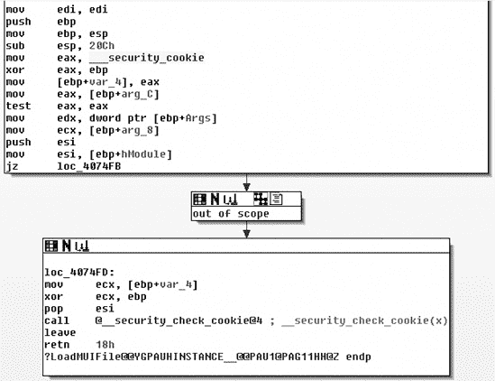

# 附录 C. 缓解

本附录包含有关缓解技术的信息。

# C.1 利用缓解技术

目前可用的各种利用缓解技术和机制旨在尽可能使利用内存损坏漏洞变得困难。最常见的是这些：

+   地址空间布局随机化 (ASLR)

+   安全 cookie (/GS)、栈破坏保护 (SSP) 或栈 canary

+   数据执行预防 (DEP) 或 No eXecute (NX)

还有其他与操作系统平台、特殊的堆实现或文件格式（如 SafeSEH、SEHOP 或 RELRO）相关的缓解技术。还有各种堆缓解技术（堆 cookie、随机化、安全解除链接等）。

许多缓解技术可以轻易地填满另一本书，所以我将专注于最常见的一些，以及一些用于检测它们的工具。

### 注意

利用缓解技术和绕过它们的方法之间存在着持续的竞争。即使使用所有这些机制的系统，在特定情况下也可能被成功利用。

## 地址空间布局随机化 (ASLR)

ASLR 随机化进程空间中关键区域的位置（通常是可执行文件的基址、栈的位置、堆、库等）以防止攻击者预测目标地址。比如说，你发现了一个*write4 原始漏洞*，这给你提供了将 4 个字节写入你选择的任何内存位置的机会。如果你选择一个稳定的内存位置来覆盖，这将是一个强大的利用。如果启用了 ASLR，找到可靠的内存位置来覆盖就变得困难得多。当然，ASLR 只有在正确实现时才有效。^([[100)]）

## 安全 cookie (/GS)、栈破坏保护 (SSP) 或栈 canary

这些方法通常会在栈帧中注入一个 canary 或 cookie 来保护与过程调用相关的函数元数据（例如，返回地址）。在处理返回地址之前，会检查 cookie 或 canary 的有效性，并将栈帧中的数据重新组织以保护函数的指针和参数。如果你在一个受此缓解技术保护的函数中找到一个栈缓冲区溢出，利用可能会变得困难。^([[101)]）

## NX 和 DEP

*不可执行（NX）*位是 CPU 的一项功能，有助于防止从进程的数据页面执行代码。许多现代操作系统都利用了 NX 位。在 Microsoft Windows 中，硬件强制执行的*数据执行保护（DEP）*在兼容的 CPU 上启用 NX 位，并将进程中的所有内存位置标记为不可执行，除非位置明确包含可执行代码。DEP 是在 Windows XP SP2 和 Windows Server 2003 SP1 中引入的。在 Linux 中，NX 由内核在 AMD 和 Intel 的 64 位 CPU 上强制执行。ExecShield^([102)]和 PaX^([103)]在 Linux 的较老 32 位 x86 CPU 上模拟 NX 功能。

## 检测利用缓解技术

在尝试绕过这些缓解技术之前，您必须确定应用程序或正在运行的进程实际使用了哪些。

缓解措施可以通过系统策略、特殊 API 和编译时选项进行控制。例如，Windows 客户端操作系统的默认系统级 DEP 策略称为 OptIn。在这种操作模式下，只有明确选择加入 DEP 的进程才会启用 DEP。有几种方法可以将进程加入 DEP。例如，您可以在编译时使用适当的链接器开关(/NXCOMPAT)，或者可以使用`SetProcessDEPPolicy` API 以编程方式允许应用程序加入 DEP。Windows 支持四种系统级硬件强制 DEP 配置。^([104)]在 Windows Vista 和更高版本中，您可以使用*bcdedit.exe*控制台应用程序来验证系统级 DEP 策略，但必须从提升的 Windows 命令提示符执行此操作。要验证应用程序的 DEP 和 ASLR 设置，您可以使用 Sysinternals 的进程查看器。^([105)]

### 注意

要配置进程查看器以便显示进程的 DEP 和 ASLR 状态，请将以下列添加到视图中：**视图** ▸ **选择列** ▸ **DEP 状态** 和 **视图** ▸ **选择列** ▸ **ASLR 启用**。此外，将下窗格设置为查看进程的 DLL，并将“ASLR 启用”列添加到视图中（见图 C-1）。

Windows 的新版本（Vista 或更高版本）默认支持 ASLR，但 DLL 和 EXE 必须通过使用/DYNAMICBASE 链接器选项来选择支持 ASLR。需要注意的是，如果进程的所有模块没有全部选择支持 ASLR，那么保护将显著减弱。在实践中，缓解措施（如 DEP 和 ASLR）的有效性在很大程度上取决于每个缓解技术被应用程序完全启用的情况。^([106)]

图 C-1 展示了使用 Process Explorer 观察 Internet Explorer 的 DEP 和 ASLR 设置的示例。请注意，已加载到 Internet Explorer 上下文中的 Java DLL 没有使用 ASLR（在下窗格的 ASLR 列中用空值表示）。微软还发布了一个名为*BinScope Binary Analyzer*^([107]) 的工具，该工具具有直观、易于使用的界面，用于分析具有各种安全保护的二进制文件。

如果 DEP 和 ASLR 都正确部署，漏洞开发将变得非常困难。

要检查 Windows 二进制文件是否支持安全 cookie (/GS) 缓解技术，你可以使用 IDA Pro 反汇编二进制文件，并在函数后导和前导中查找对安全 cookie 的引用，如图 C-2 所示。


图 C-1. Process Explorer 中显示的 DEP 和 ASLR 状态



图 C-2. 函数前导和后导中的安全 cookie (/GS) 参考（IDA Pro）

要检查 Linux 系统的系统级配置以及 ELF 二进制文件和进程的不同漏洞缓解技术，你可以使用我的`checksec.sh`^([108]) 脚本。

# C.2 RELRO

RELRO 是一种通用的漏洞缓解技术，用于强化 ELF^([109]) 二进制文件或进程的数据部分。ELF 是用于可执行文件和库的常见文件格式，被各种类 UNIX 系统使用，包括 Linux、Solaris 和 BSD。RELRO 有两种不同的模式：

**部分 RELRO**

+   编译器命令行：`gcc -Wl,-z,relro`。

+   ELF 部分被重新排序，以便 ELF 内部数据部分（`.got`, `.dtors`, 等）位于程序的.data 和.bss 数据部分之前。

+   非 PLT GOT 为只读。

+   PLT 相关的 GOT 仍然是可写的。

**完全 RELRO**

+   编译器命令行：`gcc -Wl,-z,relro,-z,now`。

+   支持部分 RELRO 的所有功能。

+   奖励：整个 GOT 被（重新）映射为只读。

部分和完全 RELRO 都会重新排序 ELF 内部数据部分以保护它们，防止在程序数据部分（`.data`和`.bss`）的缓冲区溢出时被覆盖，但只有完全 RELRO 缓解了修改 GOT 条目以控制程序执行流的流行技术（参见第 A.4 节）。

为了演示 RELRO 缓解技术，我创建了两个简单的测试用例。我使用了 Debian Linux 6.0 作为平台。

## 测试用例 1：部分 RELRO

Example C-1") 中的测试程序接受一个内存地址（见第 6 行），并尝试在该地址写入值 `0x41414141`（见第 8 行）。

Example C-1. 示例代码用于演示 RELRO (*testcase.c*)

```
01    #include <stdio.h>
02
03    int
04    main (int argc, char *argv[])
05    {
06      size_t *p = (size_t *)strtol (argv[1], NULL, 16);
07
08      p[0] = 0x41414141;
09      printf ("RELRO: %p\n", p);
10
11      return 0;
12    }
```

我使用部分 RELRO 支持编译了程序：

```
linux$ `gcc -g -Wl,-z,relro -o testcase testcase.c`
```

我随后使用我的 `checksec.sh` 脚本检查了生成的二进制文件:^([110])

```
linux$ `./checksec.sh --file testcase`
RELRO           STACK CANARY      NX            PIE                     FILE
Partial RELRO   No canary found   NX enabled    No PIE                  testcase
```

接下来，我使用 `objdump` 收集了 Example C-1") 中第 9 行使用的 `printf()` 库函数的 GOT 地址，然后尝试覆盖该 GOT 条目：

```
linux$ `objdump -R ./testcase | grep printf`
0804a00c R_386_JUMP_SLOT   printf
```

我在 gdb 中启动了测试程序，以便确切地看到发生了什么：

```
linux$ `gdb -q ./testcase`

(gdb) `run 0804a00c`
Starting program: /home/tk/BHD/testcase 0804a00c

Program received signal SIGSEGV, Segmentation fault.
0x41414141 in ?? ()

(gdb) `info registers eip`
eip            0x41414141     0x41414141
```

结果：如果仅使用部分 RELRO 来保护 ELF 二进制文件，仍然有可能修改任意的 GOT 条目以控制进程的执行流程。

## 测试用例 2：完全 RELRO

这次，我使用完全 RELRO 支持编译了测试程序：

```
linux$ `gcc -g -Wl,-z,relro,-z,now -o testcase testcase.c`

linux$ `./checksec.sh --file testcase`
RELRO           STACK CANARY      NX            PIE                     FILE
Full RELRO      No canary found   NX enabled    No PIE                  testcase
```

然后，我再次尝试覆盖 `printf()` 的 GOT 地址：

```
linux$ `objdump -R ./testcase | grep printf`
08049ff8 R_386_JUMP_SLOT   printf

linux$ `gdb -q ./testcase`

(gdb) `run 08049ff8`
Starting program: /home/tk/BHD/testcase 08049ff8

Program received signal SIGSEGV, Segmentation fault.
0x08048445 in main (argc=2, argv=0xbffff814) at testcase.c:8
8          p[0] = 0x41414141;
```

这次，执行流程在源代码的第 8 行被 `SIGSEGV` 信号中断。让我们看看原因：

```
(gdb) `set disassembly-flavor intel`

(gdb) `x/1i $eip`
0x8048445 <main+49>:    mov    DWORD PTR [eax],0x41414141

(gdb) `info registers eax`
eax            0x8049ff8        134520824
```

如预期，程序试图在指定的内存地址 `0x8049ff8` 写入值 `0x41414141`。

```
(gdb) `shell cat /proc/$(pidof testcase)/maps`
08048000-08049000 r-xp 00000000 08:01 497907     /home/tk/testcase
`08049000-0804a000 r--p 00000000 08:01 497907     /home/tk/testcase`
0804a000-0804b000 rw-p 00001000 08:01 497907     /home/tk/testcase
b7e8a000-b7e8b000 rw-p 00000000 00:00 0
b7e8b000-b7fcb000 r-xp 00000000 08:01 181222     /lib/i686/cmov/libc-2.11.2.so
b7fcb000-b7fcd000 r--p 0013f000 08:01 181222     /lib/i686/cmov/libc-2.11.2.so
b7fcd000-b7fce000 rw-p 00141000 08:01 181222     /lib/i686/cmov/libc-2.11.2.so
b7fce000-b7fd1000 rw-p 00000000 00:00 0
b7fe0000-b7fe2000 rw-p 00000000 00:00 0
b7fe2000-b7fe3000 r-xp 00000000 00:00 0          [vdso]
b7fe3000-b7ffe000 r-xp 00000000 08:01 171385     /lib/ld-2.11.2.so
b7ffe000-b7fff000 r--p 0001a000 08:01 171385     /lib/ld-2.11.2.so
b7fff000-b8000000 rw-p 0001b000 08:01 171385     /lib/ld-2.11.2.so
bffeb000-c0000000 rw-p 00000000 00:00 0          [stack]
```

进程的内存映射显示，内存范围 `08049000-0804a000`，包括 GOT，已成功设置为只读 (`r--p`)。

结果：如果启用完全 RELRO，尝试覆盖 GOT 地址会导致错误，因为 GOT 部分被映射为只读。

## 结论

在程序的数据部分（`.data` 和 `.bss`）发生缓冲区溢出时，部分和完全 RELRO 都能保护 ELF 内部数据部分不被覆盖。

使用完全 RELRO，可以成功防止修改 GOT 条目。

对于不支持 RELRO 的平台，也有一种通用的方法来实现类似的缓解技术，该技术适用于这些平台.^([111])

# C.3 Solaris Zones

Solaris Zones 是一种用于虚拟化操作系统服务并为运行应用程序提供隔离环境的技术。*区域* 是在单个 Solaris 操作系统实例内创建的虚拟化操作系统环境。当你创建一个区域时，你产生了一个应用程序执行环境，其中进程被隔离于系统其余部分。这种隔离应防止运行在一个区域中的进程监视或影响运行在其他区域中的进程。即使以超级用户凭证运行的进程也不应能够查看或影响其他区域的活动。

## 术语

有两种不同类型的区域：*全局*和*非全局*。全局区域代表传统的 Solaris 执行环境，并且是唯一可以从其中配置和安装非全局区域的区域。默认情况下，非全局区域无法访问全局区域或其他非全局区域。所有区域都有围绕它们的安全边界，并且被限制在文件系统层次结构的自己的子树中。每个区域都有自己的根目录，有独立的进程和设备，并且以比全局区域更少的权限运行。

当 Sun 和 Oracle 推出 Zones 技术时，他们对该技术的安全性非常自信：

### 注意

*我在本节中使用的平台是 Solaris 10 10/08 x86/x64 DVD 完整镜像（sol-10-u6-ga1-x86-dvd.iso），被称为 Solaris 10 Generic_137138-09*。

> 一旦进程被放置在全局区域之外的区域，该进程及其后续的所有子进程都不能更改区域。
> 
> 网络服务可以在区域中运行。通过在区域中运行网络服务，您可以在安全违规事件中限制可能造成的损害。成功利用区域中运行的软件中的安全漏洞的入侵者将被限制在该区域可能执行的限制性操作集中。区域内的权限是系统整体权限的一个子集。 . .^([112])
> 
> 进程被限制在权限的子集。权限限制防止区域执行可能影响其他区域的操作。权限集限制了区域内部特权用户的权限。要显示区域内部可用的权限列表，请使用`ppriv`实用程序.^([113])

Solaris 区域很棒，但有一个弱点：所有区域（全局和非全局）共享相同的内核。如果内核中存在允许任意代码执行的漏洞，则可能跨越所有安全边界，逃离非全局区域，并损害其他非全局区域或甚至全局区域。为了演示这一点，我录制了一个视频，展示了第三章中描述的漏洞的实际利用。该利用允许非特权用户逃离非全局区域，然后损害所有其他区域，包括全局区域。您可以在本书的网站上找到该视频.^([114])

## 设置一个非全局的 Solaris 区域

为了设置第三章的 Solaris 区域，我执行了以下步骤（所有步骤都必须在全局区域中以特权用户身份执行）：

```
solaris# `id`
uid=0(root) gid=0(root)

solaris# `zonename`
global
```

我首先为新的区域创建了一个文件系统区域：

```
solaris# `mkdir /wwwzone`
solaris# `chmod 700 /wwwzone`
solaris# `ls -l / | grep wwwzone`
drwx------   2 root     root         512 Aug 23 12:45 wwwzone
```

然后，我使用`zonecfg`创建新的非全局区域：

```
solaris# `zonecfg -z wwwzone`
wwwzone: No such zone configured
Use 'create' to begin configuring a new zone.
zonecfg:wwwzone> `create`
zonecfg:wwwzone> `set zonepath=/wwwzone`
zonecfg:wwwzone> `set autoboot=true`
zonecfg:wwwzone> `add net`
zonecfg:wwwzone:net> `set address=192.168.10.250`
zonecfg:wwwzone:net> `set defrouter=192.168.10.1`
zonecfg:wwwzone:net> `set physical=e1000g0`
zonecfg:wwwzone:net> `end`
zonecfg:wwwzone> `verify`
zonecfg:wwwzone> `commit`
zonecfg:wwwzone> `exit`
```

之后，我使用`zoneadm`检查了我的操作结果：

```
solaris# `zoneadm list -vc`
  ID NAME             STATUS     PATH                           BRAND    IP
   0 global           running    /                              native   shared
   - wwwzone          configured /wwwzone                       native   shared
```

接下来，我安装并启动了新的非全局区域：

```
solaris# `zoneadm -z wwwzone install`
Preparing to install zone <wwwzone>.
Creating list of files to copy from the global zone.
Copying <8135> files to the zone.
Initializing zone product registry.
Determining zone package initialization order.
Preparing to initialize <1173> packages on the zone.
Initialized <1173> packages on zone.
Zone <wwwzone> is initialized.

solaris# `zoneadm -z wwwzone boot`
```

为了确保一切正常，我 ping 了新非全局区域的 IP 地址：

```
solaris# `ping 192.168.10.250`
192.168.10.250 is alive
```

要登录到新的非全局区域，我使用了以下命令：

```
solaris# `zlogin -C wwwzone`
```

在回答了有关语言和终端设置的问题后，我以 `root` 身份登录并创建了一个新的非特权用户：

```
solaris# `id`
uid=0(root) gid=0(root)

solaris# `zonename`
wwwzone

solaris# `mkdir /export/home`

solaris# `mkdir /export/home/wwwuser`

solaris# `useradd -d /export/home/wwwuser wwwuser`

solaris# `chown wwwuser /export/home/wwwuser`

solaris# `passwd wwwuser`
```

我随后使用这个非特权用户来利用第三章中描述的 Solaris 内核漏洞 Chapter 3。

## 备注

^([100])

^([101])

^([102])

^([103])

^([104])

^([105])

^([106])

^([107])

^([108])

^([109])

^([110])

^([111])

^([112])

^([113])

^([114])

* * *

^([100]) 参见 Rob King 的文章，“新豹安全特性——第一部分：ASLR”，*DVLabs Tipping Point* (博客)，2007 年 11 月 7 日，[`dvlabs.tippingpoint.com/blog/2007/11/07/leopard-aslr`](http://dvlabs.tippingpoint.com/blog/2007/11/07/leopard-aslr).

^([101]) 参见 Tim Burrell 的文章，“GS Cookie 保护——有效性和局限性”，Microsoft TechNet 博客：安全研究 & 防御 (博客)，2009 年 3 月 16 日，[`blogs.technet.com/srd/archive/2009/03/16/gs-cookie-protection-effectiveness-and-limitations.aspx`](http://blogs.technet.com/srd/archive/2009/03/16/gs-cookie-protection-effectiveness-and-limitations.aspx)；“Visual Studio 2010 中增强的 GS”，Microsoft TechNet 博客：安全研究 & 防御 (博客)，2009 年 3 月 20 日，[`blogs.technet.com/srd/archive/2009/03/20/enhanced-gs-in-visual-studio-2010.aspx`](http://blogs.technet.com/srd/archive/2009/03/20/enhanced-gs-in-visual-studio-2010.aspx)；IBM 研究部门，“用于防止堆栈破坏攻击的应用程序保护 GCC 扩展”，最后更新于 2005 年 8 月 22 日，[`researchweb.watson.ibm.com/trl/projects/security/ssp/`](http://researchweb.watson.ibm.com/trl/projects/security/ssp/).

^([102]) 参见 [`people.redhat.com/mingo/exec-shield/`](http://people.redhat.com/mingo/exec-shield/).

^([103]) 参见 PaX 团队的主页 [`pax.grsecurity.net/`](http://pax.grsecurity.net/) 以及 grsecurity 网站 [`www.grsecurity.net/`](http://www.grsecurity.net/).

^([104]) 参见 Robert Hensing 的文章，“理解 DEP 作为缓解技术（第一部分）”，Microsoft TechNet 博客：安全研究 & 防御 (博客)，2009 年 6 月 12 日，[`blogs.technet.com/srd/archive/2009/06/12/understanding-dep-as-a-mitigation-technology-part-1.aspx`](http://blogs.technet.com/srd/archive/2009/06/12/understanding-dep-as-a-mitigation-technology-part-1.aspx).

^([105]) 参见 [`technet.microsoft.com/en-en/sysinternals/bb896653/`](http://technet.microsoft.com/en-en/sysinternals/bb896653/).

^([106]) 更多信息，请参阅 Alin Rad Pop 的 Secunia 研究报告，“流行第三方 Windows 应用程序中的 DEP/ASLR 实现进展”，2010 年，[`secunia.com/gfx/pdf/DEP_ASLR_2010_paper.pdf`](http://secunia.com/gfx/pdf/DEP_ASLR_2010_paper.pdf)。

^([107]) 下载 BinScope 二进制分析器，请访问[`go.microsoft.com/?linkid=9678113`](http://go.microsoft.com/?linkid=9678113)。

^([108]) 请参阅[`www.trapkit.de/tools/checksec.html`](http://www.trapkit.de/tools/checksec.html)。

^([109]) 请参阅 TIS 委员会的*工具接口标准（TIS）可执行和链接格式（ELF）规范*，版本 1.2，1995 年，[`refspecs.freestandards.org/elf/elf.pdf`](http://refspecs.freestandards.org/elf/elf.pdf)。

^([110]) 请参阅上方的注释 9。

^([111]) 请参阅 Chris Rohlf 的“自我保护全局偏移表（GOT）”，草案版本 1.4，2008 年 8 月，[`code.google.com/p/em386/downloads/detail?name=Self-Protecting-GOT.html`](http://code.google.com/p/em386/downloads/detail?name=Self-Protecting-GOT.html)。

^([112]) 请参阅“Solaris Zones 简介：非全局区域提供的功能”，*系统管理指南：Oracle Solaris 容器—资源管理和 Oracle Solaris Zones*，2010 年，[`download.oracle.com/docs/cd/E19455-01/817-1592/zones.intro-9/index.html`](http://download.oracle.com/docs/cd/E19455-01/817-1592/zones.intro-9/index.html)。

^([113]) 请参阅“Solaris Zones 管理（概述）：非全局区域的权限”，*使用 Solaris 操作系统的虚拟化系统管理指南*，2010 年，[`download.oracle.com/docs/cd/E19082-01/819-2450/z.admin.ov-18/index.html`](http://download.oracle.com/docs/cd/E19082-01/819-2450/z.admin.ov-18/index.html)。

^([114]) 请参阅[`www.trapkit.de/books/bhd/`](http://www.trapkit.de/books/bhd/)。
