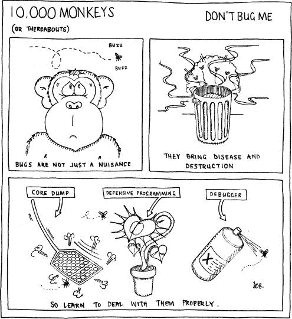
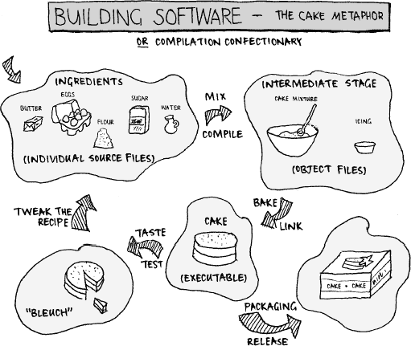

# 第二部分. 代码的秘密生活

这一节探讨了开发代码的艺术和工艺——编程生活的日常活动。尽管这些话题并不是严格保密的秘密，但你很少听到专家的讨论或看到很多关于它们的写作。即便如此，掌握每一项实践对于编写好的程序至关重要；代码工匠对这些主题有全面的理解。

我们将探讨：

第七章

对我们行业工具的调查以及如何使用它们。

第八章

任何代码在未经证明适合其用途；未经测试之前都是不完整的。在这里，我们探讨如何进行测试的技术。

第九章

应对不可避免的事情：如何在你的代码中找到并移除错误。

第十章

"构建"代码：将源代码转换为可执行程序的过程。

第十一章

对代码优化的细节进行探讨。是什么、为什么、何时以及如何。

第十二章

软件安全这个棘手的话题——如何保护你的代码免受恶意滥用和恶意攻击。

这些是代码构建的基本方面。在软件工厂的压力和时间限制下，这些不仅仅是基本技能——它们是生存策略。随着经验的积累，它们变得习以为常，这样你就可以把宝贵的时间集中在更紧迫的问题上：你下一个系统的架构、客户不断变化的需求，以及谁会为你拿下一杯浓缩咖啡。

# 第七章. 程序员的工具箱

### *使用工具构建软件*

对于我们所有人来说，那些超越我们自身能力的艺术手段是危险的。

--J.R.R. 托尔金

要成为一个高效的工匠，你需要一套好的工具。水管工工具箱的内容将支持他在遇到任何任务时，否则你下次水龙头爆裂时就不会再找他。

这些工具的*存在*和*质量*同样至关重要；一个优秀的工匠可能会因为工具的糟糕而受挫。如果压缩阀坏了，无论你的水管工多么出色，到处都会漏水。

当然，是你对这些工具的使用让你区别于其他工匠。工具本身并不能完成任何事情。在动力工具出现之前，木匠完全能够制作出精美的家具。工具更为基础，但他们对工具的熟练使用产生了美丽的东西。

同样适用于编程。要做好工作，你需要一套合适的工具支持；你对其有信心、知道如何使用，并且适合你将要遇到的工作。这需要一位技艺高超的工匠、好工具，*以及*对这些工具的精通，才能编写出优秀的代码。

这是严肃的事情。你如何使用你的工具可以让你成为一个真正高效的程序员。在极端情况下，这些工具可能提供决定项目成功或失败的捷径。软件工厂的持续节奏意味着你应该紧紧抓住任何能帮助你更快、更可靠地产生更好代码的东西。

其他章节涵盖了与特定工具相关的问题。在这里，我们将探讨**软件工具**的整体问题。编程是一个无法没有工具的学科。从日常到日常，我们使用工具而不多加思考，就像你理所当然地使用罐头开启器一样——只要它工作就好，但一旦它出问题（或者你需要打开一个形状奇特的罐头）你就陷入了困境，不管罐头开启器多么花哨。

# 什么是软件工具？

我们使用各种工具来构建软件；它们是**构建程序的程序**——如果这不算太哲学的话。我们用来创建软件的每一件事都是以某种形式存在的工具。有些工具帮助你编写代码。有些帮助你编写**好的**代码。有些帮助你整理你刚刚创建的代码混乱。

它们形状各异，大小不同，工作方式也不同。显然，它们所在的平台和环境是一个因素，但它们在以下方面也存在差异：

**复杂性**

一些工具是功能丰富且可配置性极强的高级环境。有些则是针对单一任务的微小实用程序。每种方法都有其优缺点：

+   当你终于学会如何让它同时煮咖啡并给你带来甜甜圈时，一个功能丰富的工具很酷。但如果许多神奇的功能使其难以使用，那么它就变得不那么有帮助了。

+   简单的工具更容易学习；它们做什么很明显。你最终会拥有很多这样的工具，每个任务一个。但如果你将它们串联起来，会有很多界面点，因此它们并不总是无缝协作。

不同的工具有不同的范围，从非常具体的任务（搜索文件中的文本字符串）到整个项目（协作项目管理环境）。

**使用频率**

有些工具被不断使用；我们无法没有它们生活。而有些工具则很少被使用，但当你需要它们时却非常宝贵。

**界面**

一些工具拥有相当漂亮的**图形用户界面（GUI**）。有些则更为基础，由**命令行界面（CLI**）驱动，并将输出定向到文件。你更喜欢哪一种取决于你的大脑是如何连接的以及你习惯了什么。

Windows 实用程序通常具有图形界面，没有命令行访问。标准的 Unix 实用程序则相反，这使得它们更容易通过脚本自动化并集成到更大的工具中。界面改变了你利用工具力量的方式。

**集成**

一些工具可以集成到更大的工具链中，通常被包含在图形化的*集成开发环境（IDE）*中。独立的命令行实用程序倾向于生成适合作为其他工具输入的纯文本输出，主要作为数据过滤器。

单一的 GUI 界面可以非常舒适地使用，并且集成可以使你极其高效。另一方面，它们需要花费时间来设置，就像你希望的那样，而且它们很少提供比手动命令行工具更全面的功能。但尽管它们非常强大，离散的 Unix 工具都有不同的难以理解的界面，这使得它们难以使用。

**成本**

有许多优秀的免费工具.^([1]) 然而，你得到的往往是你所付出的。免费工具通常具有较差的文档、较少的支持或较小的功能集。但这并不总是如此。一些免费工具远优于它们的商业版本。

你可以为任何类型的工具支付你想要的任何费用，但更高的价格标签并不保证更好的产品。我曾使用过一些极其昂贵的工具，它们的表现极其糟糕。这引出了……

**质量**

有些工具非常好。有些工具非常糟糕。我有几个关键的工具，我愿意永远不再看到它们；它们能完成工作，但只是勉强，并且永远处于崩溃的边缘。但如果没有它们，我就无法编写我需要付费的代码。我有多经常被诱惑自己重写它们？我可以继续做梦。

你将根据这些特性选择工具，做出适当的妥协。虽然习惯于你常用的工具集、学习它并使用它提高生产力很重要，但避免对其产生宗教般的执着。大多数 Windows 用户讨厌 Unix 风格的开发，而 Unix 黑客看不起 Windows 程序员，因为他们无法处理命令行。克服它。

我挑战你尝试在一个合理的大型项目中在一个不同的环境中工作。这将帮助你完全理解什么是好的工具链，并帮助你获得真正的“世界观”软件工具。

* * *

^([1]) 在软件世界中，“免费”有两个含义：免费就像*啤酒*（这个工具获取不会花费你任何费用）和免费就像*言论*（开源软件，你可以查看和修改其代码）。哪个“免费”更重要取决于你有多理想主义。参见第 361 页的“LICENSES”。

# 为何要担心工具？

没有核心软件工具集就无法创建程序；你会被困在没有编辑器或编译器的情况下。还有一些工具你可以没有，但仍然非常有用。为了提高你的生产力、代码质量和工艺，关注你目前正在使用的工具，并了解它们真正能做什么是很好的。

当你了解你的工具如何工作以及为哪种工作使用哪种工具时，你就能更好地产生正确工作的代码——并且更快地完成它。更聪明的工具使用会使你成为更聪明的程序员。

**关键概念**

*深入了解你常用的工具。花一点时间掌握它们，很快就能得到回报*。

让我们明确我们为什么实际上使用工具：工具不是为我们做工作——它们*使我们能够*做工作。软件的质量始终由其程序员的技能决定。下次当你编译器吐出错误信息时，提醒自己这一点。是你写了代码，笨蛋！

程序员在选择和使用工具方面有着截然不同的态度。这背后可能有一些深层的心理原因——可能与你是否是邪恶天才有关。在遇到一个新的大任务时：

+   一些程序员费力地手动完成它。

+   其他程序员编写一个脚本语言工具来自动完成工作。

+   其他人在寻找一个预先编写的工具来做这项工作，花费数小时。

给定一个可能解决问题的工具：

+   一些程序员不断尝试，直到得到接近他们想要的结果。

+   其他程序员仔细阅读文档，找出确切可以做什么，然后才开始使用它。

哪种方法才是正确的？嗯，这取决于。成为一名成熟程序员的组成部分是理解不同情况需要不同的解决方案，并针对不同的工作应用正确的工具。每个人都是不同的，每个人工作方式也不同——你的同事可能使用你最喜欢的工具之外的工具来提高生产力。但如果你看到有人每天都在手动将 C 代码转换为汇编代码，你会质疑他的理智。

实际上投资你的时间和金钱在工具上。考虑你将如何使用一个工具。只有在这样做所需的时间会得到回报时，才去寻找或编写一个新工具。不要花一周时间编写一个每月只能为你节省一小时的工具。但确实花一周时间编写一个每天能为你节省一小时的工具。

**关键概念**

*采取务实的软件工具方法——只有在它们能让你生活更轻松时才使用它们*。

# 功率工具

由于编程和工具密不可分，为了成为一名超级程序员，你需要成为一名超级工具用户。这意味着什么？

首先，了解周围有哪些工具是很重要的。在下一节中，我们将列出每个程序员都应该随身携带的常见工具列表。你不需要了解市场上每个工具；毕竟，这会让晚宴上的谈话变得极其乏味。仅仅了解存在的工具的一般类别，而不是具体产品，是向前迈出的重要一步。这将帮助你选择是找到一个特定任务的工具，自己编写工具，还是手动完成这项任务。

抽出时间来获取信息。查看你可以在哪里获得这些工具——有一些商店专门销售软件工具，互联网上也有大量的下载网站。也许你已经有了一些安装好的工具，但从未使用过，或者你没有意识到它们有多有用。了解工具能为你做什么；这将帮助你更好地使用工具。

**关键概念**

*了解可用的工具种类。确保你知道在哪里可以获取它们，即使你现在不需要它们*。

准备尝试新的工具，并花时间学习它；这是一种健康的态度。如果你开始一个新的项目，迁移到新的平台，遇到新的问题，或者发现你的旧工具已经过时，你可能被迫寻找新的工具。但不要等到被推动——确保现在，你正在使用你能得到的最好的工具。

投入一部分时间来磨练你的工具技能——就像你花时间阅读技术书籍或杂志，或者参加专业培训课程一样。这些东西很重要，所以相应地投资于它们。

这里有一些简单的步骤，帮助你成为工具高手。对于你软件构建武器库中的每一件武器 . . .

## 理解它能做什么

了解功能集——它 *真正* 能做什么，而不是你认为它 *应该* 能做什么。即使你不知道如何榨取每一滴好处（可能你需要查找更神秘的命令行参数），了解它的能力将是有帮助的。

工具 *不能* 做的事情有哪些？也许它不支持其竞争对手提供的某些功能。了解这些限制，这样你就知道何时寻找更好的替代品。

## 学习如何驾驭它

即使你在运行工具时没有产生错误，并不意味着它已经 *完全* 做了你想要它做的事情。你必须知道如何正确使用它，并自信地相信你可以让它按照你的意愿行事。

这个工具如何融入整个工具链？这将影响你如何使用它。例如，Unix 工具可以通过 *管道* 连接在一起，作为顺序过滤器——将小型单个工具拼接成更大的实用工具.^([2]) 了解如何利用每个工具的力量，以及了解它们如何相互协作，可以提高你的工具使用水平。

确定使用每个工具的最佳方式——这不一定是通过直接调用它或在 GUI 界面中点击某个地方。它可以自动触发吗？编译器通常是通过构建系统调用的，而不是手动调用。

## 了解它适合哪些任务

了解每个工具如何在其他可用工具的上下文中发挥作用。例如，我可以在我的文本编辑器中设置按键记录宏，这样我就可以在重复操作上节省时间。其中一些更改也可以使用魔法 sed 调用完成。^([3)] 然而，在这种情况下使用按键宏会更好——我已经在使用编辑器了，所以触发它们会更快。

你可能不知道如何使用 yacc，^([4)) 但如果你需要编写解析器，知道它的存在会为你节省大量的精力。

**关键概念**

*使用正确的工具来完成正确的任务。不要用大锤砸核桃*。

## 检查它是否正常工作

每个人在某个时候都会成为糟糕工具的受害者。你的代码可能无法工作，但无论你如何搜索错误行为，都没有解释。在绝望中，你会测试随机的事情——检查风向是否正确，灯具是否固定正确。几个小时后，你会发现一个不稳定的工具正在做奇怪的事情。

编译器可能会生成错误的代码。构建系统可能会出错。库中可能存在错误。在你拔掉太多自己的头发之前，学习如何在明显失败之前进行检查。

能够访问你工具的源代码对于诊断你遇到的问题非常有帮助，这允许你确切地了解工具正在做什么。这可能是你选择工具集的决定性因素。

## 明确的途径来获取更多信息

你不必知道所有的事情。诀窍是知道有人知道！

查找工具的文档在哪里。谁提供支持？如何获取更多信息？寻找手册、发布说明、在线资源、内部帮助文件和手册页。了解它们的位置以及如何按需访问它们。在线版本是否有有用的搜索工具和良好的索引？

## 了解新版本何时出现

工具似乎以惊人的速度发展——在这个行业中，技术变化很快。有些工具的发展速度比其他工具快得多。你刚刚安装了最新的 widgetizer，作者就发布了带有更长红色条纹的新版本。

了解你使用的工具非常重要，这样你就不会过时，最终得到一个可能存在错误且不受支持的工具套件。但这样做应该谨慎；不要盲目追求最新版本。前沿技术可能会带来痛苦！

新版本可能会有新的错误和更高的价格。如果它们提供了显著的修复并且已被证明是稳定的，就采用升级。先测试一下——在旧代码上对新的工具进行合理性检查，以确保它表现良好。

**关键概念**

*跟上你工具的最新发展，但不要随意升级*。

* * *

^(2)) 如果你对这个不太了解，我强烈建议你阅读相关内容。Unix 命令`man bash`是一个很好的起点；在手册页中搜索*pipelines*。

^([3]) `sed` 是一个流编辑命令行实用程序，将在下一节中解释。

^([4]) 解析器生成器。不用担心——稍后也会解释。

# 哪些工具？

软件开发工具种类繁多。多年来，它们被开发出来以满足特定的需求，这些需求经常出现。当一项任务被多次执行时，你可以确信有人已经为它编写了一个工具。

你的工具包具体包含什么将取决于你的工作领域。嵌入式平台可用的工具通常不如桌面应用程序丰富。以下我们将考虑常见组件。有些非常明显；有些则不那么明显。

虽然我们将分别查看每种工具类别，但不要忘记现代 IDE 将这些不同的程序集成到一个单一、流畅的界面中。这无疑很方便，但了解每个工具独立存在的意义很重要，原因如下：

+   你将知道如何充分利用每个可用的功能。

+   你将知道你的集成开发环境（IDE）缺少哪些有用的功能。

大多数 IDE 都是模块化的——你可以用更好的替代品替换一个组件，并插入那些出厂时不可用的功能。了解周围有哪些工具种类，你将提高你的 IDE 体验。

## 源代码编辑工具

陶艺家的媒介是粘土；雕塑家的，是石头；程序员的，是代码。这是我们工作的基本东西，因此选择优秀的工具来帮助我们编写、编辑和调查源代码非常重要。

### 源代码编辑器

编辑器可能是你最重要的工具，甚至比编译器更重要。编译器面对的是计算机，而编辑器面对的是*你*。而你才是驾驶员。这就是你将在编程生活中花费大部分时间的地方，所以选择一个好的编辑器，并学会如何真正地使用它。使用文本编辑器提高生产力将极大地改善你的编码方式。

**关键概念**

*你选择的代码编辑器至关重要：它对你的编码方式有着巨大的影响*。

“真正的源代码编辑器”是一个古老的争论，这里不需要再引起波澜，但你应该选择一个你感到舒适并且能满足你需求的编辑器。仅仅因为编辑器嵌入在你的可视化 IDE 中，并不意味着它就是最适合你的编辑器。另一方面，你可能会发现将其集成是一个巨大的好处。对于源代码编辑，我要求我的编辑器至少具备以下功能：

+   综合语法高亮显示（支持*许多*语言——因为我使用许多语言）

+   简单的语法检查（例如，突出显示不匹配的大括号）

+   良好的*增量搜索*功能（一种在输入时搜索的交互式查找形式）

+   键盘宏录制

+   高度可配置

+   在我使用的每个平台上都能工作

我的要求和编辑器的选择可能与你不同，但这似乎是一个相当合理的最重要的功能列表。我不介意花点时间学习如何充分利用所有这些功能。如果它能让我更有效率，那就值得了。

根据你正在进行的类型的工作，你可能会发现其他类型的编辑器很有用。有二进制文件编辑器（通常以十六进制显示文件内容；它们通常被称为*十六进制编辑器*）和针对特定文件格式的编辑器，例如 XML 文件编辑器。

Vim 和 Emacs 是臭名昭著的 Unix 编辑器，现在几乎可以在任何平台上找到（可能甚至包括你的电烤箱）。这些与 IDE 捆绑的默认编辑器形成对比。

### 源代码操作工具

Unix 哲学的特点是拥有大量的小型命令行工具。每个工具都有对应的 GUI 环境，但它们通常没有这么强大或容易组合。GUI 版本的学习要简单得多。

以下 Unix 命令提供了强大的机制来调查和修改源代码：

**`diff`**

比较两个文件并突出显示它们之间的差异。基本的 diff 将输出到控制台，但更复杂的图形版本也存在。甚至还有编辑器允许你在比较的文件上工作，将它们并排显示，并随着你输入更新差异。奇特的 diff 可以一次性比较三个文件。

**`sed`**

代表*流编辑器*。Sed 逐行读取文件，应用指定的转换规则。Sed 可以用作重新排序项目、全局搜索和替换工具，或者将模式插入到行中。

**`awk`**

想象一下加强版的 sed。Awk 是另一个可以处理文本文件的匹配程序。它为此任务实现了一个完整的编程语言，因此你可以编写相当高级的 awk 脚本来执行复杂的操作。

**`grep`**

在文件中搜索字符模式。这些模式由*正则表达式*描述，这是一种允许通配符字符和灵活匹配标准的迷你语言。

**`find`**/**`locate`**

这些工具有助于在文件系统中查找文件。它们可以通过名称、日期或其他许多标准来追踪它们。

这些只是冰山一角，还有许多其他工具。例如，`wc`执行单词/字符计数。对于更多宝石，请查看`sort`、`paste`、`join`和`cut`。

### 源代码导航工具

真正的大型项目拥有像城市一样的代码库。甚至城镇规划者也不太了解每一条后街。少数出租车司机知道最佳路线。普通市民对自己的社区相当熟悉。游客一离开公交车就会迷路。

有一种工具可以帮助你深入理解和映射代码，进行简单的搜索、导航和交叉引用。一些工具会生成调用图树，这样你可以看到控制流在系统中的流动。它们可能会生成图形映射或与你的编辑器集成，提供自动完成、函数调用帮助等。这对于大型代码库或进入一个已经建立的项目非常有价值。

一些免费可用的工具的好例子是 LXR、Doxygen 和备受尊敬的 ctags。

### 版本控制

在这里我们不会过多地讨论源代码控制工具，因为我们在第 351 页的"源代码控制"中已经涉及了它们。简单来说：你*必须*使用一个，否则可能会被迫强行截肢。

### 源代码生成

许多工具会自动生成源代码。有些很好；有些让我感到害怕。

一个例子是 yacc，一个 LALR(1)^([5])解析器生成器。你定义输入语法规则，然后使用它来生成可以解析符合这些规则的正确输入的程序。它会生成一个 C 代码解析器，并提供钩子供你在解析项目时添加功能。Bison 是一个类似工具。

有一种代码生成工具类别可以帮助你设计用户界面，生成工作后端代码。这些工具特别用于像 MFC 这样的复杂 GUI 工具包。如果一个库需要工具来做*这么多*基础工作，那么这表明该库本身可能过于复杂（或从根本上来说是损坏的）。小心行事！

编写大量脚手架代码的向导应该也受到谨慎对待。在开始修改之前，你必须真诚地理解生成的代码，否则你可能会被自己的无知所咬。如果你在修改任何生成的代码后重新运行向导，所有的手动编辑都将被无声地覆盖。哎呀。

你甚至可以编写自己的脚本来生成重复的代码段。有时这表明你的代码可能设计得更好。有时它*确实是*正确的技术方法。在过去，我编写了 Perl 脚本来自动生成代码。编写了生成器后，我信任它生成的代码。另一位程序员可能会怀疑地看着它，就像任何其他代码向导一样。

### 源代码美化器

这些工具使源代码格式统一，创建了一个统一的*最低公倍数*布局。我真诚地认为它们带来的麻烦比它们的价值大——它们可以破坏与它们修复的一样多的重要和有用的格式。

## 代码构建工具

我们不想整天盯着漂亮的源代码。有趣的部分是让它做些事情。我们做这件事太频繁了，以至于我们理所当然地认为这些工具都会正常工作，而没有去思考幕后的情况。

### 编译器

除了源代码编辑器之外，这是最常用的软件工具。编译器将你的源代码转换为可执行文件，这样你就可以惊叹于你的程序失败的方式。由于这个工具经常被使用，因此确保你能正确地使用它很重要。你真的了解它所有的选项和功能吗？许多公司都有一个专门的*buildmaster*，确保构建工具被正确使用，但这并不是不了解你的编译器的借口。

+   你是否了解应该采用哪种级别的优化以及这可能会如何影响生成的代码？这很重要——在其他事情中，它将决定代码在调试器中的运行方式有多么令人惊讶，甚至可能激活哪些编译器错误！

+   你是否在所有警告都开启的情况下编译？真的没有借口不这样做（也许只有当你维护的是已经充满警告的遗留代码时）。警告突出显示潜在的错误，它们的缺失让你对代码有额外的信心。

+   编译器默认是符合标准的吗？C++ ISO 标准是（ISO 98），1999 年的 C 标准是（ISO 99），Java 语言由（Gosling et al. 00）定义，C#由 ISO 标准定义。（ISO 05）。编译器是否有任何非标准扩展；如果是，你知道它们是什么以及如何避免它们？

+   它是否为正确的 CPU 指令集生成代码？当你只会在最新的英特尔芯片上运行时，你可能会在生成 386 兼容的代码。让你的编译器输出尽可能合适的代码。

**我需要工具……**

你需要执行一项任务。这是一项枯燥的任务。它是重复的。这是那种计算机应该做得更好的事情；它将减少错误，减少乏味，并且更快。这正是计算机被发明出来的原因！你如何找出是否有东西可以为你完成这项工作？

+   如果它在这个列表中提到，你已经知道有工具可用。

+   如果它不在列表中，但你确信你不是第一个遇到这种问题的人，那么可能有一个工具“**某处**”可以帮到你。你可能会对快速网络搜索带来的随机程序感到惊讶。

+   如果你的问题看起来很独特，你可能不得不为它编写自己的程序。参见第 126 页的“自己动手做”了解更多信息。

当寻找一个工具时，尽可能多地获取建议：

+   向团队中的其他人询问他们是否有任何经验。

+   在网上搜索，并阅读适当的新组。

+   去工具供应商那里。

在可用的工具选择中，你需要根据我们在第一部分看到的准则做出明智的选择。为了做出这个决定，你必须确立你的需求。工具是否免费重要吗？或者，现在能获取它更重要吗？它是否应该对团队中的每个人来说都易于使用？你将多久使用一次——它是否足以证明其费用合理？

**交叉编译器**针对的是与开发机器不同的平台。这主要用于编写嵌入式软件（毕竟，在洗碗机上运行 Visual C++是很困难的）。

编译器是更大工具链的一部分，包括链接器、汇编器、调试器、性能分析器和其他对象文件操作工具。

一些流行的编译器包括 gcc、微软的 Visual C++和博兰德的 C++ builder。

### 链接器

链接器与编译器紧密相关。它将编译器输出的所有中间**对象文件**粘合在一起，形成一个单一的、可执行的代码块。C 和 C++链接器与编译器结合得如此紧密，有时同一个可执行文件会执行这两个任务。对于 Java 和 C#，链接器与运行时环境相关联。

当使用你的链接器时，确保你知道：

+   它是否**剥离**了二进制文件？也就是说，它是否移除了调试符号，如变量和函数的名称？这些可以被调试器用来显示有用的诊断信息，但它们也可能显著增加可执行文件的大小，并使它们加载变慢。

+   它是否消除了重复的代码部分？

+   你能让它输出库对象而不是可执行文件吗？你对库有什么控制权——你能让它**静态地**或**动态地**加载吗？

### 构建环境

整个构建环境不仅仅是编译器和链接器。我们使用的构建工具是 Unix 的 make 程序或 IDE 的构建部分。它们自动化了编译过程。许多开源 Unix 项目使用 autoconf 和 automake 工具来简化构建。

学习如何充分利用你的集成构建环境，但不要以牺牲了解如何使用每个单独的构建工具为代价。我们将在第十章（第十章：杰克建造的代码"中更详细地探讨它们。

### 调试器

拥有一个高质量的调试器并理解如何使用它可以在追踪令人惊讶的行为上为你节省数小时的开发时间。它允许你调查程序中的执行路径，中断程序，调查变量值，设置断点，并通常剖析运行中的代码。这比在程序中散布`printf`日志语句要复杂一个数量级！

`gdb`是 GNU 的开源调试器；它已被移植到几乎每个可想象的平台。`ddd`是它的一个成熟的图形界面。每个 IDE 和工具链都有自己的调试器。

### 性能分析器

当你的代码运行速度不令人满意时，使用此工具。性能分析器测量运行代码的各个部分并确定瓶颈。它用于找到*合理*优化的目标；有了它的结果，你不会浪费精力加速很少执行的代码。

### 代码验证器

代码验证器分为两种类型：*静态*和*动态*。前者以类似编译器的方式处理代码，检查你的源文件以识别可能的问题区域和语言使用上的缺陷。`lint`是一个著名的例子；它在 C 中执行一系列常见编码错误的静态检查。其大部分功能已集成到现代编译器中，但仍有一些独立的工具可用于额外的检查。

动态验证器在代码编译时对其进行修改和测量，然后在运行时执行检查。内存分配/边界检查器是一个很好的例子——它们确保所有动态分配的内存都得到适当的释放，并且数组访问不会超出范围。⁶ 这些工具可以节省寻找难以捉摸的错误所需的大量时间。在大多数情况下，它们比调试器更有用，因为它们像预防机制而不是治疗手段：它们会在程序崩溃之前找到错误。

### 性能工具

这些工具执行代码检查，通常是静态分析器的一种形式（尽管也存在动态度量工具）。它们对你的代码质量进行统计分析。虽然统计数据很容易误导，但这些工具可以有效地突出最脆弱的区域。这些信息可以帮助你选择代码审查的具体目标。

指标通常按函数基础收集。最基本的指标是*代码行数*，其次是*注释与代码的比例*。这两者都不能真正告诉你什么特别有用的信息，但有许多更有趣的指标。*循环复杂度*是考虑决策点和潜在控制流数量的代码复杂度的度量。高循环复杂度意味着难以理解的代码，这更可能是不稳定且容易隐藏错误的。

### 反汇编器

这可以深入到可执行文件中，让您检查机器代码。调试器确实包含这种支持，但高级反汇编器可以尝试在没有符号存在的地方重建代码，生成对二进制程序文件的高级语言重新解释。

### 故障追踪

一个好的故障追踪系统提供了一个共享数据库，用于跟踪系统中发现的错误。它允许同事报告故障、查询、分配或评论它们，并最终将故障标记为已修复。这是确保产品质量的必要工具——您需要系统地管理故障，否则它们会从您手中溜走，您会发布一个有缺陷的产品。在回顾项目历史时捕获和存储这些信息也是有用的。

## 语言支持工具

要用高级语言编写，您需要大量的支持。语言实现提供了使编码成为可能所需的一切，使其比在机器代码的沼泽中挣扎更容易。

### 语言

语言本身*就是工具。一些语言提供了其他语言中不存在的功能。这些差距可以通过运行在程序源上的单独工具来填补。例如，C 语言备受诟病的预处理器可以非常有用，其他语言也有文本处理包。通用的代码功能（如 C++的模板）和前/后条件检查是其他类似有用的语言工具。

拥有一系列语言技能是非常有价值的。了解它们之间的差异，它们适合的任务以及它们的弱点。然后您可以选择任何给定任务的最佳语言。

**关键概念**

*学习几种语言；每种语言都会教会你不同的解决问题的方法。把它们当作工具，并为每个任务选择最合适的语言*。

### 运行时和解释器

大多数语言没有必要的运行时支持是无法使用的。解释型语言依赖于它们的解释器（或*虚拟机*），但直接编译的语言仍然依赖于它们的支持库。这些库通常与语言本身紧密相连，因此两者无法分离。

就像你可以选择不同的编译器一样，你可能能够选择具有不同特性的不同语言运行时。

Java 的 JVM（*Java 虚拟机*）是一种常见的语言解释器。C++标准库支持该语言，为一些核心语言特性提供默认处理程序。同样，C#语言依赖于.NET 环境的运行时支持。

### 组件和库

是的，这些也是工具！重用软件组件和寻找执行所需功能的库可以避免重新发明轮子。一个好的库可以提高生产力，就像任何其他软件工具一样。

这些库的范围各不相同——有些是整个操作系统的庞大抽象层，而有些则只做非常简单的工作，提供一种谦逊的*日期*类。它们负责处理细节，隐藏复杂性，这样你就不必担心它。你不必花时间编写、测试和调试自己的版本。

当今的所有语言都提供了一定程度的库支持。C++ STL 是一个功能强大的可扩展库的绝佳例子。Java 语言和.NET 环境提供了比你能挥动的棍子还要多的标准库。许多第三方库存在，既有商业的也有免费的。

## 杂项工具

故事还没有结束。你还会遇到更多工具。"见 Also"(ch06s08.html "See Also")在第 127 页指出，我们将在其他地方讨论软件工具。

以下是一些其他有趣的工具种类。

### 文档工具

良好的文档是无价的；它是精心设计的代码的关键部分。各种工具可以帮助你编写它，无论是在源代码本身还是在单独的文档中（我在第 66 页的"实用自我文档方法"中描述了一些工具）。永远不要低估一个好的文字处理器的重要性。

文档不仅需要阅读，还需要编写。良好的在线帮助系统（辅以高质量的书籍）至关重要。

**ROLLING YOUR OWN**

当你找不到适合工作的工具，而且手动完成将花费很长时间时，自己编写工具（"ROLLING YOUR OWN"）并没有什么不妥。实际上，如果这项任务会反复出现，短期的工具开发可能会在长期内为你节省数小时。

有些任务天生比其他任务更适合使用工具。确保你尝试的是现实可行的，并检查这种努力是否是成本效益的投资。

这些是创建工具的常见方法：

+   以新的方式组合现有工具，通常使用 Unix 管道机制，也许需要写一点连接胶水。你可以将复杂的命令行咒语放入*shell 脚本*（或在 Windows 环境中是*批处理文件*），这样你就不必每次都输入它们。

+   使用*脚本语言*。大多数小型自建工具都是用某种形式的脚本语言编写的，通常是 Perl。它们使用起来既快又简单，同时足够强大，可以提供编写工具所需的支撑。

+   从头开始创建一个完整的程序。你只有在它是一个你将反复使用的严肃工具时才真正想这么做。否则，这种努力可能是不合理的。

在编写工具时考虑：

+   观众——工具需要多么精致？一些粗糙的边缘是否可以接受？如果只有你和另一个技术专家在使用它，你可以应对。如果其他更细腻的人可能有一天需要它，也许你应该优雅地给它加上装饰。

+   你能否扩展现有的工具（将其命令包装起来，或者可能为它创建一个插件）？

### 项目管理

管理和工作协作工具允许你根据时间表报告和跟踪工作，管理故障，并监控团队绩效。根据管理工具的范围，谦逊的程序员可能不需要接近它。但更异类的系统可能成为项目活动的中心枢纽，吸引所有用户。

* * *

^([5]) 一种晦涩的技术专家（和无聊）的说法，指的是*相对复杂的语法*。

^([6]) 更具社会责任感的语言，如 Java，在语言设计中避免了这类问题。

# 简而言之

给我们工具，我们将完成这项工作。

--温斯顿·丘吉尔爵士

工具使软件开发成为可能。好的工具使它变得容易得多。

一定要评估你使用的工具集。你真的知道如何正确使用它们吗？有没有你本应拥有的缺失工具？你是否从你所拥有的工具中获得了最大价值？

工具的价值永远取决于其用户。谚语“拙匠常怪工具不利”包含了很多真理。糟糕的程序员会编写糟糕的代码，无论他们使用多少工具。事实上，工具可以帮助产生极其糟糕的代码。培养对工具箱的专业、负责任的态度将使你成为一个更好的程序员。

| 好程序员…… | 次程序员…… |
| --- | --- |

|

+   更愿意学习一次如何使用合适的工具，而不是一次又一次地重复乏味的工作

+   理解不同的工具链模型，并对每个都感到舒适

+   使用工具使他们的生活更轻松，但不要成为它们的奴隶

+   将他们使用的每件事都视为一个工具，一个可替换的实用工具

+   他们是高效的，因为使用他们的工具对他们来说就像第二本能一样

|

+   知道如何使用一些工具，并以它们为标准看待每个问题

+   害怕花时间去学习新工具

+   开始使用一个开发环境，现在虔诚地使用它，从未尝试过或调查过替代方案

+   当他们遇到一个有价值的新工具时，不要将其添加到他们的工具箱中

|

# 参考内容

第十章

软件构建过程是由工具驱动的。想象一下手动编译代码！

第十三章

包含一个讨论特定**设计工具**的部分。

第十八章

一章专门讨论**版本控制工具**的使用。


# 激发思考

关于这些问题的详细讨论可以在第 491 页的"附录 A"部分找到。

## 深思熟虑

1.  对于开发团队中的每个人来说，使用相同的 IDE 是否更重要，还是每个人选择最适合他们的 IDE 更重要？不同的人使用不同的工具有什么影响？

1.  任何程序员应该拥有的最小工具集是什么？

1.  命令行工具或基于 GUI 的工具哪个更强大？

1.  有没有不是程序的构建工具？

1.  工具最重要的因素是什么？

    1.  互操作性

    1.  灵活性

    1.  定制化

    1.  权力

    1.  易用性和学习

## 个性化

1.  你工具箱中的常用工具是什么？你每天都用哪些？你每周用几次？你偶尔才用哪些？

    1.  你对如何使用它们的了解程度如何？

    1.  你是否从每个工具中获得了最大收益？

    1.  你是如何学会使用它们的？你是否花时间提高使用它们的技能？

    1.  这些是你能使用的*最好*的工具吗？

1.  你的工具有多新？如果它们不是最新的尖端版本，这有关系吗？

1.  你是否更喜欢集成工具集（如可视化开发环境）还是离散的工具链？另一种方法的优点是什么？你对这两种工作方式有多少经验？

1.  你是“默认丹”还是“调整汤姆”？你接受编辑器的默认设置，还是将其调整到极致？哪种方法是“更好”的？

1.  你是如何确定软件工具的预算的？你如何知道一个工具是否物有所值？

# 第八章. 测试时代

### *测试代码的黑色艺术*

测试一切。保留好的。

--帖撒罗尼迦前书 5:21

随意编写尽可能多的代码——你可以确信的一件事是：它第一次肯定不会完美工作。无论你花了多少时间精心设计它；软件错误有一种令人毛骨悚然的能力，能够渗透到任何程序中。你编写的代码越多，引入的错误就越多。你写得越快，引入的错误就越多。我还没有遇到一个真正多产的程序员能够创造出几乎无错误的代码。

我们该如何解决这个问题？我们*测试*我们的代码。我们这样做是为了找出任何存在的问题，一旦我们修复了它们，我们就使用测试来保持对代码质量的信心，因为我们继续对其进行修改。无论你认为你是一个多么好的程序员，发布未经测试的软件都是自杀。未经测试的软件*注定*会失败；测试是我们工艺的一个基本部分。太多的软件工厂低估了彻底测试的重要性，或者试图在软件发货前的最后一刻将其压缩进去。这是显而易见的。

测试不是开发过程末尾的一项任务，用于证明你的最终程序是好的。如果你只是试图做这件事，你将产生非常糟糕的代码。测试是一种核心构建技术。只有通过测试，你才能证明每一块代码都能正常工作，这然后告诉你何时完成。否则你怎么能知道呢？为什么这么多软件工厂认为他们可以不进行适当的测试就逃脱呢？

**条款和条件**

术语 *bug* 非常具有表现力，但非常不精确。很容易随意使用词汇而不真正理解它们的含义。使用更具体的术语有助于我们定义我们在做什么。这些定义受到了 IEEE 文献（IEEE 84）的启发：

**错误**

一个 *错误* 是你做错的事情。它是一种特定的人类行为，导致软件中包含 *故障*。例如：忘记检查你的代码中的条件（比如在索引 C 数组之前检查数组的大小）是一个错误。

**故障**

一个 *故障* 是一个错误的后果，体现在软件中。我犯了一个错误，这导致了代码中的故障。起初，这是一个 *潜在* 的问题。如果我所写的代码从未被执行，那么这个故障将永远不会有机会引起问题。如果执行经常通过有缺陷的代码，但从未以触发故障的特定方式执行，我们就永远不会注意到有故障。

这个微妙之处使得调试变得极其困难。一条有缺陷的代码行可能看起来在多年内都很正常，然后有一天它会导致你见过的最奇怪的系统崩溃；你不会怀疑这个老代码，因为它已经可靠了这么久。

你可能在代码审查中会发现一个故障，但你不能从运行中的程序中识别出一个故障。

**故障**

当遇到时，一个故障可能会导致 *故障*。它可能不会。故障，故障的表现，是我们真正关心的。这可能是我们唯一会注意到的事情。故障是程序操作与其要求、预期行为之间的偏离。这就是我们接近哲学的地方。如果一棵树在森林中倒下，它会发出声音吗？如果运行中的程序没有执行 bug，错误仍然是故障吗？这些定义有助于回答这些问题。

**bug**

术语 *bug* 是一种口语，通常用作 *故障* 的同义词。根据传说，第一个计算机 *bug* 是一个 *实际* 的虫子。它是由海军上将 Grace Hopper 在 1947 年于哈佛发现的。一只被困在 Mark II Aiken Relay Calculator 的两个电继电器之间的蛾导致整个机器关闭。

# 现实检查

两个简单的问题*什么是测试？*和*你为什么要测试？*看起来很明显。然而，往往在生产的适当阶段没有进行足够的软件测试，或者没有进行测试。良好的测试是一种技能。实际上*进行*一些测试比许多程序员所达到的要多；仅仅提到测试就足以让大多数程序员大汗淋漓。“测试最重要的规则是去做。”（Kernighan Pike 99）

测试与调试是两个不同的独立活动，尽管它们的界限模糊，两者经常被混淆在一起。*测试*是证明软件中存在或不存在错误的方法论过程。*调试*是追踪这种错误行为原因的行为。测试导致调试，调试导致修复，修复导致更多测试（我们再次测试以证明修复有效）。

**关键概念**

*测试不是调试。不要混淆这两个概念。它们需要不同的技能。确保你知道你在测试和调试的时候*。

如果你编程得好，你将进行*大量*的测试而不是调试。这就是为什么这一章在调试章节之前的原因。

在整个软件开发过程中，各种事物都会被测试：

+   大量的*文档*将经过一个测试阶段（更常见的是称为*审查*过程）。这样做可以确保，例如，需求规范正确地模拟了客户的需求，功能规范实现了需求规范，各种子系统规范足够完整以实现功能规范，等等。

+   自然地，实现*代码*在开发者的机器上被测试。它被测试在几个层面上，从逐行测试每个函数的编写，到测试单个模块，到集成测试，当代码部分被粘合在一起时。

+   最后，最终*产品*将被测试。虽然这一级别的测试将（或*应该*）间接测试所有已开发的代码组件，但这不是这些测试的重点。在这里，我们关心的是程序作为一个整体是否按指定的工作。

    产品测试可能涉及许多事情。最重要的是，它们检查系统是否按预期工作。它们还检查它是否正确安装（如果它是包装好的 PC 软件）以及它是否可用。

    这是 QA 部门执行的那种测试。这个部门的任务是理解产品应该如何工作，并确保它确实如此，同时满足为其设定的任何质量标准。

在本章中，我们将关注中间点——作为软件开发者，我们如何测试我们的代码。其他测试活动是大型且独立的主题，超出了本书的范围。

**质量保证**

QA：*质量保证*。听起来很痛苦，不是吗？但*谁*或*什么*是它？这个名字既给了一群软件工厂居民，也给了开发实践。为了正确理解 QA，重要的是将俚语和误解与真实定义分开。

人们错误地将 QA 与*测试*捆绑在一起，但两者有显著区别。测试旨在检测错误行为，即软件与其规范不符；它实际上是*检测*。真正的 QA 是*预防*。它确保我们的流程和开发实践将产生高质量的软件。测试只是 QA 的一部分——软件质量不仅包括低错误率。这意味着软件按时、按预算交付，并满足所有要求和期望（这两个不一定相同）。遗憾的是，今天软件工厂中仍然没有很多高质量的软件。

谁负责软件质量？一个组织的测试部门（通常称为 QA 部门）是一群致力于*产品*测试的人。他们有权决定你的程序是否足够好以发布。这是质量拼图中的重要一块，但不是全部。开发过程中的每个人都参与生产高质量的软件——这不是代码完成后可以附加的东西。

监控软件质量的职责通常落在执行产品测试的同一组人身上。否则，整体质量保证（QA）是项目经理的责任，而测试人员则负责进行测试。

* * *

^([1]) 因为，显然，正确的行为已经事先仔细指定了，对吧？

# 谁，什么，何时，为什么？

为了使我们的软件测试有效，我们需要了解*为什么*我们要测试，*谁*来进行测试，*测试内容是什么*，以及*何时进行测试*。

## 为什么进行测试

作为软件开发人员，我们的测试程序存在几个原因：帮助我们找到错误并修复它们，并确保相同的错误不会在后续版本中再次出现。

注意，测试永远不会揭示错误的缺失，只会揭示其存在。如果你的测试没有发现任何错误，这并不意味着它们不存在；只是意味着你还没有找到它们。

**关键概念**

*测试只能发现错误的*存在。它不能证明错误的*不存在*。不要被通过一系列不充分的测试的代码所误导，从而产生错误的安全感。

开发周期末的软件测试可能还有另一个动机。除了*验证*软件组件是正确的且不包含错误之外，你可能还需要*验证*它——确保它满足最初设定的要求——以证明它足够好以发布。验证是验收测试的一种形式。

## 谁进行测试

编写源代码的程序员有责任测试他或她编写的代码。每天早上对着镜子将这句话倒过来文身，并凝视 10 分钟。

太多的开发者，由于软件工厂的考验而感到失望，草率地编写代码并发布给 QA 部门，而没有自己进行测试。这是不负责任和不专业的。从长远来看，这会比你正确测试花费更多的时间和精力。在产品中发布未经测试的代码是愚蠢的，向 QA 部门提供未经测试的代码几乎同样糟糕。它的工作*就是*测试，但测试的是产品，而不是你新编写的代码。它可能会发现你留下的愚蠢的编码错误，可能以隐晦和看似无关的方式表现出来；但它的任务是寻找更基本的错误，这些错误在之前无法被发现，而不是清理马虎程序员的遗留问题。

**关键概念**

*你必须测试你编写的每一行代码。不要期望其他人会为你做这件事*。

## 测试涉及的内容

在编写软件时，我们创建单个函数、数据结构和类，并将它们粘合在一起形成一个工作系统。我们主要的测试策略是通过编写更多代码来测试所有这些代码，并通过编写*测试代码*来验证其行为。这形成了一个围绕测试对象的框架，对其进行刺激、戳击和驱动，以激发其响应并检查其响应是否正确。

我们为系统的每个级别编写测试代码，测试每个重要的类和函数，直至由这些较小部分组成的超结构。对于每个测试，你必须清楚以下内容：

+   你正在测试的确切代码片段。清晰的模块和定义良好的边界有助于此；接口是你的测试点。模糊或复杂的接口会使测试变得模糊和复杂。

+   你正在使用的测试方法（参见第 138 页的"测试类型]) 因此，尽早开始测试代码至关重要——在（或可能在）严肃的软件开发期间。敏捷程序员普及的*测试驱动开发*方法主张将测试作为核心构建技术；你在编写被测试的代码之前编写测试代码！

**关键概念**

*有效的代码测试应尽早开始，这样你就可以在错误最无害时捕捉到它们。你可以在编写代码之前*编写测试！*

这是一个关键点，并且将这一点吸收到你的编程习惯中至关重要。对于你写的每一行代码，*立即*编写一个测试。或者先编写测试。证明你的代码是可行的，这样你就知道可以安全地继续前进。如果你在这个时候不编写测试，你将留下未经证明、可能存在错误的代码。这会破坏你的代码库的稳定性：当你遇到错误时，你不知道是哪一段代码（自从你上次编写测试以来积累的大量代码）导致了问题。所以你最终会陷入调试器，这是巨大的时间浪费。

事后编写测试意味着你将从一个距离测试——要么太晚，当你已经忘记了代码应该做什么，要么作为测试一个单独代码模块的结果。这不会是一个有效的测试。你也更有可能忘记编写测试。

这种测试策略有深远的影响：当你开始思考编写一些代码时，你必须同时考虑测试它。这将塑造你设计代码的方式，使其变得更好；我们将在第 144 页的"为测试而设计"中看到原因。

每当你发现一个成功绕过现有测试的错误时，你必须在你测试套件中添加一个新的测试（在责备自己最初没有注意到它之后）。新的测试将有助于证明你的错误修复是正确的。它还将捕捉到任何后来再次出现的相同错误；错误可能会意外地复活——这通常发生在你的代码后来被修改时。

**关键概念**

*为每个发现的错误编写一个测试*。

因此，我们尽早编写测试，但我们多久运行一次？尽可能频繁地运行，如果不是更频繁的话（使用计算机支持）。我们运行测试的次数越多，我们检测到问题的可能性就越大。这体现在一种*持续集成*策略中（参见第 190 页的"自动构建"），并开始展示为什么程序性测试（易于重复运行）如此强大。

**关键概念**

*尽可能频繁地运行你的测试*。

* * *

^([2]) 更多关于错误成本的信息，请参阅第 157 页的 "失败的经济学"。

# 测试并不难……

除非你做得不好，否则这真的很困难。但这确实需要深思熟虑的努力。为了测试特定代码片段是否工作，你需要一个测试框架来演示：

+   对于所有有效的输入，都生成了正确的输出。

+   对于所有无效输入，都生成了适当的失败行为。

这听起来可能并不严重，但对于除了最简单的函数之外的所有函数，全面进行这种测试实际上是不切实际的。有效的输入集通常非常大，不可能单独测试每个输入。您必须选择一组较小的代表性输入值。无效输入集几乎总是比有效输入集大得多，因此您必须选择一些代表性的错误值。

为了说明这一点，这里有两个例子。第一个函数很容易测试：

```
bool logical_not(bool b)
{
    if (b)
        return false;
    else
        return true;
}

```

有效输入集的大小为两个，没有无效输入。这意味着函数的测试框架很简单。它可能看起来像这样：

```
void test_logical_not()
{
    assert(logical_not(true)  == false);
    assert(logical_not(false) == true);
}

```

函数并没有做什么特别令人兴奋的事情。现在考虑以下函数（让我们暂时不要评论它的优雅）。测试它有多难？

```
int greatest_common_divisor(int a, int b)
{
    int low  = min(a, b);
    int high = max(a, b);

    int gcd = 0;
    for (int div = low; div > 0; --div)
    {
        if ((low % div == 0) && (high % div == 0))
            if (gcd < div)
                gcd = div;
    }
    return gcd;
}

```

这仍然是一小段代码，但由于以下原因，测试它要困难得多：

+   尽管只有两个参数，但有效的输入集非常大。你不可能测试所有可能值的组合；这将花费很长时间.^([3]) 向函数添加更多参数会使这个问题呈指数级增长。

+   它包含一个循环。任何形式的分支（包括`for`循环）都会增加复杂性和更多潜在的错误。

+   有几个条件语句。现在你必须安排运行代码，以检查每个条件组合的每一侧是否工作。

这只是一个单一的小函数。你注意到那里的错误了吗？你能找到它吗？如果你能找到，就有 10 分和一颗金牌.^([4])

**关键概念**

*很容易相信你读到的代码，并相信它是正确的。当你刚刚编写了一些代码时，你会读你所*打算*写的，而不是你实际写的。学会多看一眼——带着怀疑的眼光读*所有*代码*。

这三个问题并不是软件测试变得困难的唯一原因。还有许多其他方法可以增加测试的复杂性。

**代码大小**

代码越多，潜在的错误空间就越大，必须追踪的执行路径就越多，以检查其有效性。

**依赖关系**

测试一小段代码应该是容易的。但如果测试工具在执行任何操作之前必须附加其余的代码库，那么编写任何测试都变得非常痛苦（并且耗时），因为很难协调所有附加的代码组件。这是一个**不可测试的设计**的例子。我们将在稍后（在“为测试而设计”第 143 页）探讨解决方法。

下面的两个部分也是代码之间依赖关系的例子。

**外部输入**

任何对外部系统状态的依赖本质上都是另一个输入。与函数参数不同，很难安排这些外部输入采取某些测试值。共享的全局变量不能随意设置值，否则会损害运行程序的其他部分。

**外部刺激**

代码可能会对除了函数调用之外的其他刺激做出反应。当它们可能异步（在任何时间）发生，并且以任何频率发生时，这尤其麻烦。

+   一个类可以响应来自系统其他部分的回调，这些回调可能随时出现。

+   硬件接口代码对物理设备状态的变化做出反应。

+   与其他系统的通信可能需要任何长度的时间。物理连接容易受到干扰，因此它们可能会退化，网络连接也可能不可靠。

+   用户界面代码由用户的鼠标手势驱动。在测试条件下，很难在物理上自动化 GUI。

这些条件在人工测试环境中很难模拟，并且它们可能对时间非常敏感（例如，鼠标双击的速度或硬件生成的中断频率）。

一些外部影响是未计划的：内存可能不足，磁盘空间可能耗尽，网络连接可能失败。你必须确保你的代码在所有**现有**的环境条件下都是健壮的。

**线程**

多个控制线程使得测试更加复杂，因为并发代码可能以任何任意的顺序交织在一起。执行路径的复杂交互意味着任何给定的测试运行可能永远无法重复。导致死锁或饥饿的线程故障可能难以触发，但一旦出现，它们会引发严重问题。

程序的线程行为在真正的并行多处理器系统上与在单处理器时间切片环境下的模拟并发行为不同。

**进化**

软件会进化。这种进化往往会导致测试失败。如果需求没有确定下来，你的早期测试在你交付时可能已经无效，因为 API 已经改变，功能完全不同，而且由于开发从未长时间停止，因此可能没有创建完整的测试套件。

我们需要在我们自己的代码和任何我们依赖的外部代码中都有稳定的接口。在现实世界中，这是一个不切实际的理想——代码永远不会静止——因此我们必须编写小型、可塑的测试，这些测试可以很容易地与代码一起修改。

**硬件故障**

故障存在于硬件和软件中。在嵌入式环境中工作通常更容易遇到硬件错误，因为你更接近底层。硬件故障可能比诊断和修复它们困难一个数量级；它们很少可重复，你自然会首先怀疑你的软件。

**糟糕的故障模式**

代码可能会以多种令人兴奋和奇特的方式崩溃。程序故障不仅会导致*不正确的输出*——还有更多需要应对的问题：无限循环、死锁、饥饿、程序崩溃、操作系统锁定，以及其他潜在故障会露出它们丑陋的脑袋，使测试变得多样化和令人兴奋。病态的软件故障甚至可能导致硬件损坏！^([5]) 编写一个测试框架来检查*那个*。

编写测试框架不是一件小事。当组件粘合在一起并开始相互依赖时，软件的复杂性会呈指数级增长。所有这些问题都会使你的生活变得非常复杂。这时，不仅困难，而且在技术上不可能编写出能够全面测试软件的框架。没有足够的时间和资源来生成所有必要的测试数据，以及运行软件对所有输入和刺激的集合。暴力方法迅速变得不切实际，似乎更方便忽略测试，只希望没有错误。

无论你测试得多仔细，你仍然无法生产出无故障的软件——编写测试代码与编写常规代码一样困难，并且需要同样的技能。一些错误不可避免地会从最严格的测试中漏出（研究表明，最仔细测试的软件每 1000 行代码仍然包含 0.5 到 3 个错误）。（Myers 86）在现实世界中的测试很少能证明软件是坚不可摧的——仅仅证明它是*足够的*。

考虑到这一点，我们需要关注那些可能捕捉到大多数软件缺陷的关键测试，以实现最有效的测试。我们稍后会看到如何选择这些测试。

* * *

^([3]) 输入值越高，`for` 循环所需的时间就越长。假设一个 `int` 是一个 32 位值（意味着有 2⁶⁴ 种输入组合）并且你有一个性能良好的机器（让我们假设每个函数调用将花费一毫秒——*那可是一个相当不错的处理器缓存*），暴力测试将需要近 6 亿年！而且这还没有打印出任何测试结果……

^([4]) 查看本章第一个 "Mull It Over" 问题的答案（第 494 页）以了解它是什么。

^([5]) 这不是玩笑。68000 处理器有一个未记录的*停止并引发火灾*指令——一个快速循环地址线的总线测试操作，导致电路板过热并着火。

# 测试类型

软件测试有很多不同的种类，没有一种是比其他更好的。每种方法都是从不同的方向接近代码，并且会捕捉到不同类别的错误。所有这些都是必需的。

**单元测试**

术语*单元测试*通常用来表示测试代码的*模块*（比如库、设备驱动程序或协议栈层），但它实际上描述的是对原子单元的测试：每个类或函数。

单元测试是在严格隔离的情况下进行的。与单元接口的任何不受信任的外部代码都被替换为存根或模拟器——这确保你只捕获*这个*单元的缺陷，而不是由外部影响引起的缺陷。

**组件测试**

单元测试的进一步发展，这验证了一个或多个单元组合成一个完整的组件。通常这就是人们所说的*单元测试*。

**集成测试**

这测试了组件在系统中组合在一起时的组合，确保它们能够正确互联。

**回归测试**

这是对软件或其环境进行修复或修改后的重新测试。你运行回归测试以确保软件仍然像以前一样工作，并且你的修改没有在过程中破坏任何东西。当你与脆弱的软件一起工作时，一个地方的变化可能会在其他地方引起奇怪的故障。回归测试有助于防止这种情况发生。

确定需要多少重新测试可能很困难，尤其是在开发周期的后期。自动测试工具对于这种类型的测试特别有用。我将在第 144 页的"看！没有手！"中详细讨论这一点。

**负载测试**

你执行负载测试以确保你的代码可以处理预期的数据量。编写生成良好答案的代码很简单，但及时这样做是另一回事。这可能会揭示与系统效率相关的问题，可能是由于缓冲区大小不正确、内存使用不当或数据库设计不足。负载测试检查程序是否“按预期扩展”。

**压力测试**

压力测试在短时间内向代码内投掷大量数据，以查看它会如何反应。它与负载测试类似，通常用于高可用性系统。压力测试检查系统的特性：它对过载的容忍度。负载测试是为了证明代码可以满足其*预期*的需求；压力测试确保它不会在受到真正的打击时只是堆叠在一起。代码不必一直完美工作；它只需要优雅地失败并很好地恢复。

压力测试有助于确定软件的容量——在它崩溃之前你能施加多大的压力。这在线程或实时系统中尤为重要。

**Soak 测试**

Soak 测试与压力测试类似。重点是长时间在高负载下运行——几天、几周甚至几个月，以识别在执行了大量操作后出现的任何性能问题。Soak 测试揭示了可能被忽视的故障：可能导致程序崩溃的小内存泄漏或随着内部数据结构逐渐变得碎片化而导致的性能下降。

**可用性测试**

确保你的软件可以被短视的仓鼠轻松使用。有各种形式的最终用户测试，通常在*可用性实验室*中进行，条件非常受控和脚本化。我们还在*实地试验*中测试软件，将其置于真实世界环境中，看看用户有什么看法。

**ALPHA, BETA, GAMMA . . .**

关于*alpha*和*beta*测试呢？它们是常见的术语，但并不完全等同于我们在这里讨论的其他测试。它们更侧重于最终*产品*测试，而不是特定代码片段的实现。尽管如此，它们仍然值得解释。

幸运的是，这些术语没有正式的定义。每家公司都会对其*alpha*或*beta*状态的软件有自己的看法。据你所知，alpha 软件可能是由柠檬果冻制成的，在暴露于光线时会爆炸。Alpha 或 beta 软件通常作为预览版对外发布，这是一个早期收集反馈和建立信心的机会。

这些是对这些术语的常见解释：

**Alpha 软件**

这是第一个“代码完成”阶段。它可能仍然存在许多、许多错误，并且完全不可靠。Alpha 软件提供了对最终产品将如何的很好展示，如果你能忽略明显的缺陷。

**Beta 软件**

超过 alpha 阶段，beta 软件*基本上*没有错误；剩余的问题非常少。它离最终产品不远。Beta 测试（即测试*beta*软件）用于最终发布候选版本，以解决剩余的问题。Beta 测试通常涉及真实世界的实地试验。

**发布候选版本**

这是正式软件发布前的最后阶段。候选版本在正式发布前会经过验证和*保证测试*（验证）。

如果 alpha 和 beta 版本进入外部世界，它们可能有一些形式的限制（例如时间限制的操作）。发布候选版本是“纯”构建，没有任何这些限制。

当我们编写单元和组件测试时，有两种主要方法来设计测试用例：*黑盒*和*白盒*测试。

**黑盒测试**

这也被称为**功能测试**。黑盒测试将实际功能与预期功能进行比较。测试者不知道代码的内部工作原理；它被视为一个**黑盒**。设计者和测试者可以是独立的。

黑盒测试不关心是否每行代码都被测试，只关心它是否符合软件的规格——即如果你把正确的东西放入盒子的一个端，正确的东西就会从另一个端出来。因此，如果没有明确的规格和文档化的 API，设计黑盒测试是非常困难的。

黑盒测试用例可以在软件规格完成后设计。它们依赖于规格首先正确，并且在测试设计之后没有发生根本性的改变。

**白盒测试**

这也被称为**结构测试**。它是一种基于代码覆盖的方法。每一行代码都会被系统地审查以确保正确性。在你之前无法看到黑盒内部的情况下，你现在可以并且确实可以看到。因此，白盒测试有时被称为**玻璃盒**测试。它实际上只关注测试生成的代码行，并且不能保证它们符合其规格。

白盒测试有**静态**和**动态**两种方法。静态测试不运行代码；相反，它被检查并逐步执行以确保它代表一个有效的解决方案。动态测试运行代码，并关注路径和分支测试——尝试访问每一行代码并执行每一个决策。这可能需要修改代码以强制控制流下某些路径。这种修改可能比为所有行为组合设计测试用例要容易。^([7])

白盒测试既费时又比黑盒测试昂贵得多；因此，它做得很少。在计划白盒测试之前，需要完成代码。黑盒测试通常在白盒测试开始之前进行。这个阶段的失败代价更大。你将不得不编写修复代码，再次进行黑盒测试，然后设计和运行新的白盒测试。

存在工具可以对代码进行仪器化并测量测试覆盖率。没有工具支持，白盒测试可能会让你的头爆炸。

黑盒测试关注的是**遗漏**（软件遗漏了部分指定的行为）的故障，而白盒测试发现的是**错误**（实现的部分有缺陷）。为了完全测试一个软件单元，需要同时进行黑盒和白盒测试。

**测试时间**

这些测试方法在不同的开发阶段被使用。以下表格说明了这一点，显示了在每个阶段哪些测试最重要。

| 开发阶段 | 是否适合黑盒或白盒测试？ | 此开发阶段的常见测试方法 | 谁执行测试？ |
| --- | --- | --- | --- |
| 收集需求 | 黑色 | 设计的黑色盒测试 | 开发者，QA |
| 代码设计 | 黑色 | 设计的黑色盒测试 | 开发者，QA |
| 代码构建 | 黑色，白色 | 单元，组件，回归 | 开发者 |
| 代码集成 | 黑色，白色 | 组件，集成，回归 | 开发者 |
| 预发布状态 | 黑色，白色 | 回归，负载，压力，浸泡，可用性 | 开发者，QA |
| 测试候选状态 | 黑色，白色 | 回归，负载，压力，浸泡，可用性 | QA |
| 发布候选 | 黑色，白色 | 回归，负载，压力，浸泡 | QA |
| 发布 | 黑色，白色 | 现在太晚了…… | 用户（祝你好运） |

* * *

^([6]) 然而，这并不一定是一个好主意——程序员通常是编写他或她创建的代码单元测试的最佳人选。

^([7]) 如果你修改了源代码，那么你实际上并没有测试最终的可执行文件，这是令人担忧的。

# 选择单元测试用例

如果测试是必要的，但全面测试是不可能的，你必须明智地选择最有效的测试集。为此，你需要一个深思熟虑且有条理的计划。你可以采取一种*散弹枪*的方法——只是把代码靠在墙上，然后用手头的任何东西向它射击……


这样你*可能*会发现一些缺陷。但没有一个合理的、分阶段的测试方法，你永远不会得到那些能让你对代码有充分信心的质量测试。与其使用散弹枪，不如拿起一把带有精确瞄准器的步枪，对代码进行仔细瞄准，击中经过良好判断的目标，以查看其表现如何。

你瞄准哪里？你如何确定要发射的测试数据？由于你不能尝试每个可能值，你需要选择一些相关的输入。你必须选择最有可能揭示软件缺陷的测试，而不是运行只是重复展示相同几个问题的测试。

**关键概念**

*编写一套全面的测试套件，每个测试用例都针对代码的不同方面进行测试。十五次重复展示相同错误的测试不如十五次展示十五种不同错误的测试有用*。

要做到这一点，你必须了解你那部分代码的需求。除非你知道它应该做什么，否则你无法编写准确的测试用例。它可能做得非常出色，但做的事情是错误的。

在进行黑盒测试时，一些测试用例将包括：

**一些良好输入**

选择一些精心挑选的*良好*输入以确保软件在正常情况下能正常工作。

覆盖所有有效的输入值范围；包括一些中间值，一些来自可接受输入下限附近的值，以及一些来自上限的值。

**一些不良输入**

同样重要的是一定数量的精心选择的*不良*输入。这确保了软件的鲁棒性，并且不会对无效输入给出误导性的答案。

你必须考虑各种不良数据，包括：

+   数值上过大或过小的值（处理负值常常被忽视）

+   过长或过短的输入（字符串长度是一个经典例子——尝试发送一个空字符串看看会发生什么，或者尝试不同大小的数组和列表）

+   数据值内部不一致（这具体意味着什么将取决于函数的合约；可能它期望值按照某种顺序）

**边界值**

测试所有边界情况——它们是错误来源的丰富资源。确定最高和最低的有效输入，或者自然输入边界在哪里（可能是在行为改变的地方）。对于这些位置中的每一个，测试代码在以下位置的行为：

+   边界值本身

+   高于它的值

+   低于它的值

这确保了你的软件能够在边缘正确运行，并且当预期时能够准确放弃。

边界测试可以捕捉到过于简单的错误，比如输入`>`而不是`>=`，或者循环计数基数错误（你是从零开始计数还是从一？）。所有三个边界测试都是必要的，以检查这些类型的错误。

**随机数据**

测试随机生成的输入数据集以避免猜测。这是一个出人意料有效的测试策略。如果你能编写一个自动测试框架，它可以重复生成并应用随机数据，你就有很大机会发现你从未考虑过的微妙错误。

**零**

如果输入是数值型的，总是要测试零的情况。由于某种原因，程序员们往往没有正确考虑零，这是他们推理中的一个盲点。

C/C++指针通常被赋予零值以表示*未设置*或*未定义*。尝试将零指针抛向你的代码，看看它是否正确反应。在 Java 中，你可以发送`null`对象引用以产生类似的效果。

# 测试设计

你能编写的单元测试质量很大程度上取决于你要测试的接口质量。当你的代码被深思熟虑地编写，并且专门设计以适应检查和验证时，测试会更简单。你通过构建清晰的 API、减少对其他代码的依赖，并打破与其他组件的硬编码链接来实现这一点。这样，将组件放入测试环境并刺激它就变得容易了。相反，如果它与代码的其他部分紧密相连，你必须将所有这些代码拖入测试环境，并安排它们以适当的方式与你的单元交互。这并不总是容易，有时甚至不可能，这限制了可能测试的范围。

**关键概念**

*设计你的代码以便于测试*。

这个规则有一个有用的副作用：当你为可测试性结构化代码时，你将按照合理、可理解和可维护的方式进行结构化。你会减少组件耦合并增加内聚性。你会使其更加灵活、易于使用，并更容易在不同配置中进行连接。你的代码会更好。

由于你已经很好地进行了测试，代码更有可能是正确的。

你必须从一开始就为测试而设计。你不可能轻易地返回到旧组件并在其上安装一个“可测试”的接口。如果大量其他代码依赖于现有的接口，那么这样的修改很困难。记住：如果你在编写代码的同时编写单元测试，你最有可能会设计出真正可测试的代码。

一些简单的设计规则可以导致高度可测试的代码：

+   让每一部分代码都自成体系，不要对外部世界有未记录的、脆弱的依赖。不要将链接硬编码到系统的其他部分；依赖于可以被系统组件或测试模拟器实现的抽象接口。

+   不要依赖于全局变量（或*单例*对象，它们是全球变量的薄薄外皮）。将这些状态收集在作为参数传递的共享结构中。

+   限制代码的复杂性；将其分解成小、可理解、易于测试的块。

+   使代码可观察，这样你就可以看到它在做什么，查询内部状态，并确保它按预期运行。

# 看！不需要动手！

你不可能整天都在你的测试机器上转动手柄。手动一个接一个地调用测试不是我认为的伟大的一天编程。重复回归测试会很快变得无聊。这不仅会无聊，而且会慢、低效，并容易出错。黄金测试规则很简单：*自动化*。

**关键概念**

*尽可能自动化你的代码测试。这比手动运行测试更快、更简单，而且更安全：测试更有可能定期运行*。

如果测试在没有干预的情况下运行，它们可以作为构建过程的一部分触发验证阶段。在你玩一些新构建的软件之前，你会知道单元测试已经自动运行并通过；你确信没有愚蠢的编程错误，并且任何新的工作都没有破坏旧代码。

**关键概念**

*将单元测试自动作为构建过程的一部分运行*。

你可以将你的单个测试代码片段组合在一个自动的脚手架中，该脚手架协调测试执行并在一个地方收集测试结果。这个工具包监控哪些测试已经完成；更复杂的测试工具包会维护随时间推移的测试结果历史。有许多这样的流行工具，如 JUnit，这是一个常见的 Java 单元测试框架。

在回归测试期间，高度自动化变得尤为重要。如果你对代码进行了修改，并想确保你没有意外破坏任何东西，你可以自动运行整个测试集；最终会弹出*是*或*否*的答案。当然，回归测试结果只与放入框架中的测试一样好。

自动化确实是稳健代码开发的基本概念。如果你目前还没有一套自动化的单元测试，作为代码库的持续回归测试，那么请获取一套。你的工作质量将迅速提高。

可惜，并非所有测试*都可以*自动化。单元测试库函数相对容易；自动测试用户界面非常困难。你如何模拟鼠标点击，检查文本字符串的乌尔都语翻译，或确保正确的声音剪辑正在播放？

# 失败的面孔

*我们的最大荣耀不在于从未跌倒，而在于每次跌倒后都能重新站起来*。

——孔子

当你的测试发现程序故障时，你会怎么做？在你匆忙调试之前，退后一步，描述问题。这在你不打算（或没有时间）立即修复它时尤为重要。遵循以下步骤，确定故障的性质，以便你或任何其他开发者稍后可以尝试解决它。

1.  注意你当时试图做什么，以及哪些操作触发了故障。

1.  再试一次。发现问题是否可重复，它出现的频率，以及它是否与同时进行的任何其他活动相符。

1.  详细描述故障。要非常具体。包括以下内容：

    +   问题背景

    +   可以复制它的最简单步骤

    +   关于可重复性和发生频率的信息

    +   软件的版本、确切的构建号以及所使用的硬件

    +   可能与之相关的任何其他信息

1.  记录下来。不要丢失！即使是一个你打算自己修复的简单编码错误（参见“你能管理它吗？”），也要将其信息放入故障跟踪系统中。

1.  编写最简单的测试框架来演示故障，并将其添加到自动测试套件中。这将确保故障不会被丢失或忽略，一旦最终修复，就不会在开发过程中再次出现。

记住，测试*不是*调试——这些步骤*不是*调试！你并没有试图揭示失败的原因，或窥视代码，只是为了收集足够的信息，向其他开发者描述问题。

我们最喜欢的故障类型是可重复的故障。真的——我们喜欢反复崩溃的代码：问题容易复制；因此，追踪故障和证明你已经修复它都很简单。糟糕的故障是不规则的，甚至是随机的，因此很难描述。需要很长时间才能显现并依赖于风速的故障是一场噩梦。

# 你能管理它吗？

为了*发现*错误，你必须有系统性和条理性的方法。在管理和处理它们时，你也必须保持系统性和条理性。在发布代码（或将其检查到源代码控制中）之前，你将是唯一可能被其缺陷困扰的人。但是一旦它离开你的照顾，代码就获得了自己的生命。不再只有*你*会关心它的缺陷。随着更多玩家加入游戏，规则也会改变：

+   程序员会在代码层面发现问题——在自己的代码和其他人的代码中。

+   代码集成器会在组件粘合在一起时发现错误。

+   质量保证部门在测试产品时会发现错误。

在许多人发现许多问题的同时，其他人正在尝试进行修复，因此必须有一个良好的管理程序。否则，结果将是一团糟，开发工作将崩溃在每个人的头上。

## 故障跟踪系统

我们在管理故障中的关键武器是一个*故障跟踪系统*。这个工具是一个专门的数据库，对参与测试过程的每个人都是可见的。

随着错误的发现和处理，此数据库会更新以反映软件的状态。在此过程中，故障跟踪工具成为项目*故障管理流程*的一个组成部分。一般执行的操作包括：

**报告故障**

当你发现一个错误时，通过创建一个*故障报告*在数据库中为它创建一个新条目。它现在成为故障俱乐部的正式成员，拥有自己的个人会员编号。这个参考编号在未来的使用中可以唯一地识别它。现在这个错误不能被忽视。在软件发货之前，它*必须*得到解决。

创建报告还会提醒团队中的其他人这个错误已被发现；当他们遇到它时，他们不需要输入相同的信息。

**分配责任**

这标志着为特定人员关注的故障报告。它定义了谁负责修复（或确保有人修复）每个问题。如果没有这种所有权的概念，每个程序员都会认为其他人会修复这个错误，而错误会通过缝隙蔓延。

**优先处理报告**

故障跟踪系统允许你标记哪些故障是最重要的。一个可重复的启动崩溃显然比一个偶尔向右移动一个像素的按钮严重得多。

通过区分阻止运行的故障和小的烦恼，开发者可以规划他们的工作并选择哪些故障需要首先修复。该工具可能支持各种严重程度级别——从关键故障到中等至低优先级问题，再到功能请求。

**标记为已修复**

开发者会在修复完成后这样做。这并不会关闭故障报告，而是将其放在待验证的堆栈上。提交报告的人负责测试修复是否正确，尽管他可以委托这项任务。显然，修复不应该由制作它的人来验证。

**关闭报告**

一旦验证，报告可以关闭，变成一个遥远的记忆（也许是一个项目统计数字）。

可能存在其他导致报告关闭的场景——问题可能根本不是故障，可能是系统的特性，甚至可能是完全有效的行为。测试人员也会犯错误。

你可以选择不关闭你不想处理的报告，而是将其*推迟*，将故障标记为在以后的软件版本中修复。

**查询数据库**

你可以查询故障跟踪系统以获取信息：

+   自然地，你可以生成一个所有待处理故障报告的列表，按软件版本、分配人、优先级或任何其他方式排序。

+   你可以发现哪些故障已被分配给你。

+   你可以生成一份报告，列出每个软件版本中已修复的故障。这有助于准备*发布说明*。

+   你还可以查看项目统计信息——在开发过程中报告了多少个故障，修复了多少个，以及关闭率与生成率的比率。以图形方式呈现，这可以很好地展示软件的进展情况。

**修改条目**

你可以打开报告并更改其中包含的信息。这包括：

+   添加任何新发现信息的注释

+   将包含示例输出的日志文件附加到说明问题

+   将报告标记为另一个故障的重复项，以防止以后产生混淆

可用的故障跟踪工具有很多，包括商业版本和免费版本，如作为 Mozilla 项目一部分开发的流行 Bugzilla 系统。

## 缺陷审查

在产品开发的后期，随着发布截止日期的日益临近，*缺陷审查*会议成为生活的一部分，大约每周举行一次。这些审查在功能完成但所有缺陷都得到解决之前进行——这是开发过程的漫长冲刺阶段。它们为所有感兴趣的相关方提供了项目进度的概述，帮助规划剩余的修复工作，并引导软件向发布迈进。

这些会议由各种各样的人参加：

+   负责该产品的软件开发者。（毕竟，他们将进行修复。）

+   来自测试团队的代表，他们将解释故障的背景并确保缺陷审查的方向正确。（通常情况下，他们的责任是召集会议。）

+   产品经理，他们将获得进度概述并做出*责任在此处停止*的决定。

+   商业和市场团队成员，他们是必须销售这个充满错误的产品的人。（他们对每个错误重要性的观点有助于决定哪些需要修复，哪些可以扫进数字地毯下。）

从错误跟踪工具生成一份未解决的错误报告清单，并在会议中依次讨论每个错误。如果需要，测试或开发团队成员可以提供额外信息，然后根据问题的商业重要性做出决定。讨论那些讨厌的持续存在的错误，并报告修复进度。如果工作进展缓慢，可能会做出增加额外资源的决定。

由于有这么多人，会议可能会迅速偏离轨道，需要一个意志坚定的主席来保持讨论的焦点和简洁。主题是错误报告以及如何处理它们，而不是具体的代码修复。程序员喜欢谈论技术并试图在会议中解决每个问题。这不是讨论技术的地方.^([8])

* * *

^([8]) 成功会议的策略在 340 页的"MEETING YOUR FATE"中描述。

# 简而言之

测试对于生产高质量的软件至关重要。一般来说，测试越多越好——尽管测试的质量将反映在最终产品的质量上。糟糕的测试将捕获很少的错误，结果将是一个有缺陷的软件发布。

我们在开发的各个阶段进行测试，从单个函数，到组件集成，再到最终组装的程序。在每一个阶段，你必须采用一种系统的方法来寻找和管理软件错误。

每个程序员都有责任测试自己的代码。QA 部门已经有很多问题要处理，除了你的有缺陷的代码。你不能在开发结束时进行测试并添加软件质量——它必须从一开始就设计，测试与代码并行开发并运行。

| 优秀的程序员 . . . | 次要的程序员 . . . |
| --- | --- |

|

+   为他们所有的代码编写测试（甚至可能在编写代码之前）

+   在*微观*层面进行测试，这样*宏观*层面的测试就不会受到愚蠢的编码错误的阻碍

+   关心产品质量并对其负责，在总的测试工作中扮演自己的角色

|

+   不要认为测试是软件开发的重要和不可或缺的部分——*那是别人的工作*

+   将未经测试的代码发布给 QA 部门，并在测试发现错误行为时感到惊讶

+   通过太晚发现问题使他们的生活更加复杂——测试不够早，然后被一系列难以定位的错误所打击

|

# 参考资料列表

第九章

当你发现错误时该做什么——定位和修复错误的流程。

第二十章

*代码审查*是一种测试技术——一种静态代码分析的手动形式。


# 激发思考

关于这些问题的详细讨论可以在第 494 页的“附录 A”部分找到。

## 深思熟虑

1.  为本章前面提到的`greatest_common_divisor`代码示例编写一个测试框架。尽可能使其详尽。你包含了多少个单独的测试用例？

    1.  这些中有多少通过了？

    1.  有多少失败了？

    1.  使用这些测试，识别任何故障并修复代码。

1.  电子表格应用程序和自动飞机驾驶员的测试有何不同？

1.  你是否应该测试你编写的所有*测试代码*？

1.  程序员的测试与 QA 部门成员的测试有何不同？

1.  是否有必要为每个函数编写测试框架？

1.  *测试驱动开发*鼓励你在编写任何代码之前先编写测试。你应该编写什么样的测试？

1.  你是否应该编写 C/C++测试来检查对`NULL`（零）指针参数的处理？这种测试的价值是什么？

1.  你早期的代码测试可能不在最终平台上——你可能还没有访问权限。现在推迟测试直到你*确实*有一个目标测试平台，还是现在就全力以赴？

    如果代码打算在不同的环境中运行（可能在高容量服务器上，或者某些嵌入式设备上），你怎么能确保你的测试是具有代表性的和足够的？

1.  你怎么知道你已经完成测试可以停止了？多少是*足够的*？

## 个性化

1.  你为多少代码编写了测试？你对这个结果满意吗？你的测试是构建过程中的自动化部分吗？你对剩余的代码进行什么样的测试？这是否足够？你将如何处理这个问题？

1.  你与 QA 部门的人的关系有多好？你认为你在他们中的个人声誉如何？

1.  你在代码中发现错误时的通常反应是什么？

1.  你是否为每个发现的代码问题提交故障报告？

1.  项目工程师预计要进行多少测试？

# 第九章。寻找错误

### *调试：出错时该做什么*

我并没有失败。我只是找到了一万种行不通的方法。

--托马斯·爱迪生

没有人是完美的。嗯，除了我。整天，我必须坐下来处理别人代码中的繁琐问题。测试部门发现我们的软件在*这样那样*的情况下会崩溃。所以我翻遍整个系统，找出程序员弗雷德三年前做错了什么，修补它，然后发回给他们再次破坏。

当然，你不会看到我犯那种基本的错误——绝对不可能。我的代码滴水不漏。完美无瑕。低脂无胆固醇。我从不写一行代码而不经过细致的计划，我不会在没有考虑到可能出现的所有特殊情况的情况下完成代码语句，而且我打字如此小心，以至于我从未在`if`语句中将`=`误写成`==`。

完全无瑕疵，就是我。真的。

嗯，也许并不完全是这样。

# 生活的真相

我认为没有人会坐下来向新程序员解释生活的真相。*是这样的，儿子。有鸟有虫。哦，还有虫子*。虫子是构建软件不可避免的阴暗面，这是一个简单的生活事实。悲哀，但却是真的。整个部门，甚至整个行业，都存在来管理它们。

我们都知道发布软件中故障的普遍存在。为什么错误会如此频繁且大规模地出现？这都归结于人性。程序是由人类编写的。人类会犯错误。他们因为各种原因（或借口）犯错误，因为他们对正在工作的系统了解不够，或者因为他们没有正确理解他们正在实施的内容，但更常见的是，他们因为不够注意自己在做什么而犯错误。大多数错误都是由于疏忽。我曾经看到一个非常简单的例子；在家里一起玩：

+   从橡子中生长出来的树被称为……

+   青蛙发出的声音是……

+   火焰升起的蒸汽被称为……

+   鸡蛋的蛋白被称为……

那是蛋黄，对吧？想想看。如果你没有被那个所迷惑，那么你很可能只是因为刚刚警告了你才注意到的。（无论如何，给自己加一分。）但是告诉我，谁会在你即将编写可能存在缺陷的代码时提醒你？如果这样的人存在，他应该得到一生的布朗尼点。

作为程序员，我们都是软件糟糕状态的罪魁祸首。我们都有罪。我们是学会忍受这种罪恶感，还是采取一些措施？有两种类型的反应。第一种是*这不是错误，这是功能*学派：只是编造一个借口并忽略它。出现了一个错误，我们就用伟大的哲学家巴特·辛普森的话来回应：“我没做。没有人看到我这么做。你不能证明任何事情！”（辛普森 91）我们责怪编译器的怪癖、操作系统的缺陷、随机的气候变化，以及有自己思想的电脑。或者，就像我在开头段落中提到的，我们责怪其他人。一件特氟龙雨衣是编程的好工具。

然而，我们实际上应该遵循第二个学派，即承认软件错误并非完全不可避免的学派。许多无意的错误可以被捕捉甚至预防，作为负责任的程序员，我们应该采取措施这样做。防御性编程和合理的测试是我们的主要武器。在本章中，我们将探讨在错误意外通过时应该采用的良好调试技术。

# 恶魔的本质

与流行观点相反，"bug"这个术语在计算机出现之前就已经在使用了。在 19 世纪 70 年代，托马斯·爱迪生谈论了电路中的虫子。哈佛大学马克 II 型艾肯继电器计算器的故事记录了第一个记录的计算机虫子。1945 年，计算机的早期，当时它们占据了整个房间，一只蛾飞了进去，并设法卡在一些电路中，导致系统故障。他们将蛾贴在日志簿上，写道："首次发现虫子实际案例"。为了永存，它被保存在史密森尼博物院。

错误是坏消息。但它们究竟是什么呢？我们在第 130 页的"术语和条件"中概述了这些事物的正确命名法。识别我们遇到的错误种类，了解它们的产生、生存和灭绝方式是值得的。

## 从 1,000 英尺的高度看

软件错误可以分为几个广泛的类别，了解这些类别将帮助我们推理它们。有些错误比其他错误更难找到，这与它们的类别有关。退后一步，从远处眯着眼睛看，这三个类别的错误就会出现：

**编译失败**

当你花费了很长时间编写的代码无法编译时，这真的很令人烦恼。这意味着你将不得不回去修复一个令人厌烦的小错误或参数类型不匹配，然后等待编译器再次运行，你才能开始真正的工作——测试你的作品。令人惊讶的是，这可能是你能得到的最好的错误类型。为什么？简单来说，因为它最容易检测和修复。这是最直接和最明显的。¹

检测错误所需的时间越长，修复它们的成本就越高；这在第 157 页的"失败的经济学"中有演示。你越早发现并修复每个错误，你就能越快继续前进，它们造成的麻烦和成本就越少。编译失败很容易注意到（或者更确切地说，很难忽视），并且通常很容易修复。你必须处理完它们才能运行程序。

大多数时候，编译失败将是一个愚蠢的语法错误或简单的疏忽，比如调用函数时参数数量或类型错误。失败可能是由于 makefile 中的错误，可能是链接阶段错误（可能是缺少函数实现），甚至可能是构建服务器磁盘空间不足。

**运行时崩溃**

在修复了编译错误之后，一个可执行文件就出现了，你高兴地运行它。然后它崩溃了。你可能会发誓并嘟囔着关于随机宇宙射线的事情。在经历了第 60 次崩溃之后，你可能会威胁要把电脑扔出窗外。这类错误比编译错误更难处理，但它们仍然相对简单。

这是因为，就像编译错误一样，它们是显而易见的。你不能与一个死去的程序争论。你不能假装崩溃是一个“特性”。当它踢开桶子，离开了它的肉身时，你可以退后一步，开始思考你的程序哪里出了问题。你会有一些线索（是什么输入序列导致了崩溃以及崩溃前它做了什么），并且你可以使用工具来发现更多信息（稍后会更详细地介绍）。 

**意外行为**

这是真正棘手的一个——当你的程序不是在努力向上爬，而是在渴望 fjords。突然它做了错误的事情。你期望看到一个蓝色方块，却出现了一个黄色三角形。代码继续快乐地前进，完全不顾你的挫败感。是什么导致了黄色三角形的出现？程序是被一支激进的游击队 COM 对象推翻了吗？这几乎肯定是在代码深处的一个逻辑问题，它执行了半小时。祝你好运找到它。

一个失败可能是由有缺陷的单行代码引起的，或者它可能只有在几个相互连接的模块最终粘合在一起且假设不完全匹配时才会显现出来。

## 地面视角

如果我们稍微靠近一点，仔细观察运行时错误，更多的错误分组就会变得清晰。以下是按痛苦程度排序的列表，从刺痛到斩首。

**语法错误**

虽然这些错误大多数在构建时会被编译器捕获，但有时语言语法错误会悄悄溜过而未被察觉。它们会产生奇怪和意外的行为。在类似 C 的语言中，语法错误通常会是以下之一：

+   在条件表达式中将 `==` 错误地当作 `=` 或将 `&&` 错误地当作 `&`

+   忘记分号或在错误的位置添加分号（经典位置是在 `for` 语句之后）

+   忘记用大括号括起一组循环语句

+   不匹配的括号

避免被这类错误绊倒的最简单方法就是保持所有编译器警告开启；现代编译器会对许多这类问题抱怨不已。

**关键概念**

*构建代码时，请确保所有编译器警告都已开启。这样可以在问题发生之前将其突出显示出来*。

**失败的经济学**

调试的艺术与上一章的主题——*测试*你的代码密切相关。测试会暴露出需要调试的错误。我已在两个单独的章节中涵盖了这些主题，因为它们是不同的学科。然而，这两个结合在一起对于可靠的软件开发是基本的。


软件工厂的紧张节奏要求快速且低成本地产生代码。这种匆忙导致软件项目充满错误，并且因此交付得非常晚。晚交付的软件是一个大问题——它不仅令人尴尬和不便；它可能给任何公司带来灾难。

事实上，你忽略测试的时间越长，允许错误存在的时间越长，情况就越糟——这张图说明了错误在开发过程中逐渐升级的影响。它显示了发现和修复错误的平均成本相对于其在生产阶段被发现的阶段。 (Boehm 81)

正如你所见，成本随着时间的推移而急剧上升（请注意，成本轴是对数刻度）。更糟糕的是，我们离项目截止日期越近，我们进行彻底测试的时间就越少。即将到来的截止日期的压力使得调试变得更加困难——在压力之下，你甚至更有可能在每次修复中引入新的错误。

为了保护自己并避免大量的调试压力，尽早彻底测试你的代码。尽快消除你发现的任何错误，在它们有机会造成重大麻烦之前。为此有既定的方法——看看测试驱动开发，它是敏捷软件开发的一个组成部分。

**构建错误**

虽然这不是一个运行时错误本身，但构建错误可能只会在运行时显现出来。要保持警惕，并且无论你认为你的构建系统有多好，都要始终怀疑它。在当今这个开明的时代，你不太可能遇到编译器错误。然而，你并不总是运行你认为自己构建的代码。

我已经遭遇过几次这种情况：构建系统未能重新构建程序或共享库（可能是因为 makefile 没有包含足够的依赖信息，或者旧的执行文件有一个错误的最后修改时间戳）。每次我测试我的修改时，我仍然在不知不觉中运行着旧的错误代码。有几种方法可以混淆构建系统，但最糟糕的是当你没有注意到它失败——就像一个麻风病肢体。

弄清楚这一点可能需要相当长的时间。因此，当你对正在发生的事情感到任何疑虑时，彻底清理你的项目并从头开始重建是明智的。这应该会清除任何潜在的构建系统问题.^([2])

**基本语义错误**

大多数运行时错误都是由于非常简单的错误导致的不正确行为。使用未初始化的变量是一个经典的例子，并且可能很难追踪；程序的行为将取决于变量使用的内存位置中之前存在的垃圾值。有时程序会正常运行；另一次它可能失败。其他基本语义错误包括：

+   比较浮点变量是否相等^([3])

+   编写不处理数值溢出的计算

+   隐式类型转换的舍入误差（丢失`char`的符号是常见的）

+   声明一个`unsigned int foo`，后来写入`if (foo < 0)`——哎呀！

这种类型的语义错误通常可以通过静态分析工具捕获。

**语义错误**

这些隐蔽的错误不会被检查工具捕获，因此很难识别。语义错误可能是一个低级错误，比如在错误的地方使用了错误的变量，没有验证函数的输入参数，或者循环出错。它也可能是一个更高层次的错误：调用 API 错误或不保持对象内部状态的一致性。许多与内存相关的错误都落在这个类别中——由于它们能够扭曲和破坏你的运行代码，使其以完全不可预测和不合理的方式运行，因此它们可能非常难以找到。

程序通常会表现出奇怪的行为。唯一的安慰是它们正在做我们告诉它们做的事情。

最好的运行时失败类型是可重复的。如果它们可以重复，那么编写测试和追踪原因就更容易了。那些不一定总是发生的失败往往是由内存损坏引起的。

## 挖战壕的视角

现在我们已经把事情整理成整洁的小盒子，让我们直接深入看看一些常见的语义错误类型：

**段错误**

也称为*保护错误*，段错误是由于访问了未分配给程序使用的内存位置而引起的。这会导致操作系统终止你的应用程序并产生某种形式的错误消息，通常带有有用的诊断信息。

这可以通过涉及指针的打字错误或糟糕的指针算术轻易触发。一个常见的导致*段错误*的 C 语言打字错误是`scanf("%d", number);`。在`number`之前缺少`&`使得`scanf`试图将数据写入由（垃圾）内容引用的内存位置，然后——噗——程序在一缕烟雾中消失。如果你真的很不幸，那么`number`恰好持有等于有效内存地址的值。现在你的代码将继续像什么都没发生一样运行，直到你刚刚覆盖的内存被使用，你的命运就掌握在上帝手中。

**内存越界**

这些错误是由于写入了为你的数据结构分配的内存之外的区域，无论是数组、向量还是其他自定义结构。当你将值写入广阔的蓝色空间时，你可能会破坏程序其他部分的数据。如果你运行在一个未受保护的操作系统上（在嵌入式环境中更为常见），你甚至可能会篡改另一个进程或操作系统的数据。哎呀。

内存越界是一个常见问题，难以检测；通常的症状是在越界发生很久之后出现的随机意外行为，可能是在成千上万条指令之后。如果你很幸运，内存越界击中了无效的内存地址，你会得到一个段错误，这是很难忽视的。尽可能使用安全的数据结构来保护自己，避免这种灾难的可能性。

**内存泄漏**

这些是那些没有垃圾回收机制的语言中的常见威胁。⁴ 当你需要内存时，你必须礼貌地向运行时请求（在 C 中使用`malloc`或在 C++中使用`new`）。然后你必须有礼貌地在使用完毕后归还（分别使用`free`和`delete`）。如果你粗心大意地忘记了释放内存，你的程序会逐渐消耗越来越多的计算机稀缺资源。一开始你可能不会注意到，但随着内存页面在磁盘之间来回移动，你的计算机的响应速度会逐渐下降。

与此相关的其他两类错误：释放内存块**过多**次，导致不可预测的环境故障，以及未能仔细管理其他稀缺资源，例如文件句柄或网络连接。（记住：任何你手动获取的东西都必须手动释放。）

**内存耗尽**

这始终是一个可能性，就像耗尽文件句柄或任何其他受管理资源一样。这可能很少见（现代计算机有如此多的内存，这种情况怎么可能发生？），但这不能成为忽视失败可能性的借口。只有马虎的代码才会失败，并且当在受限情况下运行时，它将表现出非常脆弱的行为。因此，你应该始终验证内存分配或文件系统调用的返回状态。

一些操作系统**从不**从内存分配调用返回失败——每个分配都返回一个指向已保留但未分配的内存页面的指针。当程序最终尝试访问这个页面时，操作系统机制会拦截访问，然后真正为该页面分配内存，恢复正常的程序操作。这一切都进行得很好，直到可用的内存最终耗尽。然后你的程序将收到错误信号——在相关分配发生很长时间之后。⁵

**数学错误**

这些错误以多种形式出现：浮点异常、不正确的数学构造、溢出/下溢，或者可能失败的表达式（例如，除以零）。甚至尝试输出一个`float`，但通过`printf("%f")`传递一个`int`，也可能导致你的程序因数学错误而崩溃。

**程序挂起**

这些问题通常是由不良的程序逻辑引起的；最常见的是设计不当的终端情况导致的无限循环。在多线程代码中，我们也会看到死锁和竞态条件，以及等待永远不会发生的事件的事件驱动代码。然而，通常很容易中断正在运行的程序，查看代码卡住的地方，并确定挂起的原因。

不同的操作系统、语言和环境以不同的方式报告这些错误，使用不同的术语。一些语言通过不提供可能导致自己受伤的功能来避免整个类别的错误。例如，Java 没有指针，并且它会自动检查你进行的每一次内存访问。

* * *

^([1]) 假设你有一个合理的构建环境，当遇到错误时会停止，并提供一些合理的诊断信息。

^([2]) 这假设你信任你的`build clean`功能。为了真正彻底，删除整个项目并重新检出。或者，手动删除所有中间对象文件、库和可执行文件。对于大型项目，这两种选择都非常繁琐。*这就是生活*。

^([3]) 你无法有意义地做到这一点；浮点运算太近似，无法提供任何指示的精确比较。

^([4]) 在具有垃圾回收机制的语言中，也有可能发生内存泄漏。将两个对象引用相互传递，然后同时释放它们。除非你有一个高级的垃圾回收器，否则它们将永远不会被清理。

^([5]) 至少在耗尽虚拟内存地址空间之前，这对于 Linux 来说肯定是正确的。在这种情况下，`malloc`可能会返回 0，但系统在你有机会注意到之前可能已经崩溃了。

# 消灭害虫

在你的软件中清除错误是困难的。你必须发现一个错误，诊断问题，消除所有不希望的行为的痕迹，确保错误没有在其他地方繁殖，并且在执行所有这些操作时尽量不要破坏代码。仅第一步，找到错误，就是一个大麻烦：人类在写作时会犯错误，但在阅读时也会犯同样的错误。当检查我的散文或我的代码时，我会自然地阅读我*打算*写的，而不是我*真正*写的。有缺陷的代码并不明显。编译器并没有多大帮助；事实上，它非常挑剔。它只能产生*确切*你所要求的结果，而不是你所希望的结果。

一些程序员引入的错误比他们的同行少得多（多达 60%），可以更快地找到和修复错误（仅需 35%的时间），并且在这样做时引入的错误也更少。（Gould 75）他们是如何做到这一点的呢？他们天生就能更加专注于任务，并且能够关注他们所编写的代码的微观层面，同时仍然保持对整体图景的关注。

这就是调试的艺术；它是一个非常需要学习的技能。经验教会你如何成为一个有效的调试者。而且，这是我们都会有很多经验去做的事情。

调试时最重要的规则是：*用你的大脑*。思考。考虑你在做什么。不要盲目地乱砍代码，直到看起来有东西能工作。

**关键概念**

*始终遵循调试的金科玉律：用你的大脑*。

消灭害虫有两条路：一条是快速而粗糙的*低效之路*，另一条是神学上正确的*高效之路*。我们必须意识到它们两者；有时低效之路看起来像是一个很好的捷径，但实际上会更慢，有时高效之路需要更多的努力去遵循，而实际上并不需要那么多。

## 低效之路

错误实际上很简单。原因很明显。你不需要太多思考，对吧？有时快速调整*确实*能取得效果；几个简单的测试可以快速定位问题。所以这样做是合理的吗？也许吧，但不要陷入认为它每次都会奏效的陷阱。太多的程序员试图通过摆弄、调整、戳戳和捅捅代码来修复错误，而没有真正思考他们在做什么。结果很少是有用的——他们只是用无数的其他错误掩盖了原始问题。

如果你确实决定做一些快速而粗糙的试探，为自己设定一个明确的时间限制。不要整个早上都花在“再试一次”的方法上。时间限制一到，就遵循这里提出的更系统的方法。

**关键概念**

*为“无结构”调试设定一个合理的时间限制，如果你没有成功，就转而采用更系统的方法*。

如果你的猜测奏效，并且你确实找到了错误，重新启动你的思考机制。查看第 167 页的“如何修复错误”，并仔细、周到地进行更改。即使错误很容易找到，修复方法也不一定那么明显。

## 高效之路

一种更好的调试技术更加有系统和深思熟虑。它认识到消除错误有两个不同的方面：*找到*导致错误的原因和*修复*这个错误。

每个都提出了需要克服的挑战和需要解决的问题。很容易忘记后者，并假设一旦你找到了错误，修复它就会很容易且明显。不要相信这一点。我将在后面的章节中深入探讨这两个方面，并概述一个合理的任务方法。但首先，一些关键原则支配着调试游戏：

+   错误的难度取决于你对隐藏在其中的代码了解多少。在不了解结构和它应该如何工作的情况下，跳入某个随机的源代码并对其做出任何判断是很困难的。因此，如果你必须调试一些新的代码，先花时间了解它。

    **关键概念**

    学习你正在调试的代码——你不能期望在你不理解的代码中找到错误。

+   调试的容易程度也取决于你对执行环境的控制——你可以对运行中的程序进行多少操作并检查其状态。在嵌入式世界中，调试可能更困难，因为工具支持更稀疏。你也在一个可能为你提供很少绝缘的环境下运行；小小的错误可能产生更大的后果。

+   我们调试工具中最有力的武器之一是对任何人的代码的不信任，加上适量的悲观主义。你错误行为的原因可能是绝对任何事情，在诊断过程中，你应该首先排除最不可能的候选者。

**关键概念**

*当你寻找故障时，怀疑一切。首先排除最不可能的原因，而不是假设它们与此无关。不要假设任何事*。

# 捕虫

你如何找到错误？如果有一个简单的三步过程，我们都会学到它，我们的程序现在就会完美无缺。实际上，没有，它们也不是。让我们尝试提炼可用的捕虫智慧。

## 编译时错误

我们首先看看这些，因为它们相对容易处理。当你的编译器遇到不愉快的事情时，它通常不会只抱怨一次，而是会抓住机会对生活本身发表意见，吐出一连串后续的错误信息。它被告知这样做；在遇到任何错误时，编译器试图自己恢复并继续解析。它很少做得很好，但像你的代码这样的，谁能责怪它呢？

结果是，后来的编译器消息可能相当随机且不相关。你只需要查看报告的第一个错误并解决该问题。当然，你可以向下查看列表；那里可能还有一些其他有用的错误，但通常没有。

**案例研究 #1：想象一下**

**程序**

一个具有图形界面的合理小巧的实用程序。

**问题**

程序经过重新设计，采用了更新的“外观和感觉”——新的图标和布局。旧的界面旨在作为可配置选项保留。在重新开发过程中，一切工作正常，直到发布前，有人尝试使用旧版界面。程序在窗口出现之前崩溃，但你还没有机会完全看到它。

**故事**

幸运的是，这是一个很好地可重复的问题。程序在调试器中运行，失败点被确定在 UI 库中的某些图像渲染代码深处。

经过调查，似乎失败是由于使用了无效的图形。程序试图在内存位置零处显示一个图标；一个空指针导致了崩溃。我们沿着调用堆栈向上追踪，以查看应该出现哪个图形。有了这些信息，简要查看遗留图形目录就显示，这个特定的图标缺失。

窗口构造函数中的图标加载操作显然失败了，返回一个零指针值表示“没有加载图标”。这个返回值从未被检查——作者假设图形始终存在。修复将包括两个方面：

+   检查所有图标加载例程的返回值，以确保它们能够更优雅地处理任何其他缺失的图形。

+   将缺失的图形放在正确的目录中。

**修复时间**

几个小时来追踪问题、修复故障并验证修复。

**经验教训**

+   检查所有函数返回代码，即使你认为它们不会失败。

+   尽快测试所有程序功能，特别是那些不太经常使用的罕见条件。

**关键概念**

*当你的构建失败时，请查看第一个* 编译器错误。比后续的消息更信任这一点。

即使是第一个编译器错误也可能很神秘或误导，这取决于编译器的质量（如果你对错误的意义感到困惑，尝试使用另一个编译器）。硬核 C++模板代码可能会从某些编译器那里引发相当有启发的错误——列出大量神秘的模板咒语。

语法错误通常*确实*在编译器报告的行上，但有时它实际上可能在*前面的*行上——那里的语法错误导致下一行变得无意义；这就是编译器注意到并抱怨的地方。⁶

链接器错误总体上不太神秘。链接器会告诉你它缺少一个函数或库，所以你最好赶紧去找（或者编写它）。有时链接器可能会抱怨一些神秘的 v-table 相关的 C++问题；这通常是一个缺少析构函数实现或类似问题的症状。

## 运行时错误

运行时错误需要更多的计划。如果你的程序中存在一个错误，那么很可能代码中某个你认为为真的条件实际上不是。找到错误是一个确认你认为正确的过程，直到你找到那个条件不成立的地方。你必须开发一个关于代码真正如何工作的模型，并将其与你的意图进行比较。有系统地这样做是唯一合理的办法。

**关键概念**

*调试是一种有系统的活动，缓慢地接近故障的位置。不要把它当作一个简单的猜测游戏*。

**科学方法**是科学家用来开发世界准确表示的过程。这听起来就像我们正在尝试做的事情，对吧？科学方法有四个步骤：

1.  观察一个现象。

1.  形成一个假设来解释它。

1.  使用这个假设来预测进一步观察的结果。

1.  进行实验以测试这些预测。

虽然我们试图**消除**异常现象而不是建立其模型，但为了真正修复它，我们需要了解故障。科学方法是良好的调试基础，你将在下面的步骤中看到它的体现。

### 识别故障

所有这一切都从这里开始，当你注意到程序没有做它应该做的事情时。它可能崩溃，或者它可能显示黄色三角形而不是蓝色正方形，但你知道有问题，你必须修复它。首先要做的事情是将故障报告放入故障数据库（参见第 147 页的"故障跟踪系统"）。如果你正在跟踪其他错误或没有时间立即处理故障，这尤其有价值。记录确保故障不会丢失。不要只是心理上记下稍后回来处理问题——你会忘记。

在你急忙寻找你偶然发现的错误之前，确定异常行为的特点。通过回答诸如：它是否对时间敏感？以及它是否依赖于输入、系统负载或程序状态？等问题尽可能完整地描述问题。在你尝试修复错误之前，如果你不理解错误，你只会不断更改代码直到症状消失。你可能只是掩盖了原因，所以同样的故障会在其他地方再次出现。

代码之前是否工作过？通过版本控制系统回溯到最后一个工作版本，并将该工作代码与这个有缺陷的修订版进行比较。

### 重新复制它

这与描述故障是一致的。制定出必须采取的一系列步骤来可靠地触发问题。如果有多种方式，则记录下来所有这些方式。

**关键概念**

**定位故障的第一步是找出如何可靠地重新复制它**。

如果错误似乎无法重现，你将遇到问题；你能做的最好的事情是设置陷阱并看看当它发生时你能找到什么信息。对于这些不可靠的故障，仔细记录你收集到的信息；可能要过一段时间问题才会再次出现。

### 定位故障

这是关键的一步。你已经找到了线索；现在你需要利用你所学的知识来追踪这个怪物并确定其位置。这比说起来容易做起来难。这是一个排除所有不导致故障或可以证明其正确性的东西的过程，就像福尔摩斯一样。随着你的进展，你会发现你需要收集越来越多的信息——你得到的答案越多，提出的问题就越多。你可能需要制定一些新的测试。你可能需要探索代码的阴暗面。

分析你关于失败所了解的内容。不要急于下结论，列出代码嫌疑名单。看看你是否能发现事件模式，这些模式暗示了原因。如果可能的话，记录下输入和输出，以证明问题。

调查的起点是错误**表现**的地方——尽管这很少是故障的实际栖息地。记住：仅仅因为一个失败在一个模块中表现出来，并不意味着**那个**模块就是罪魁祸首。如果程序崩溃了，确定这个位置很容易；调试器会告诉你失败的代码行，那个点的所有变量的值，以及谁调用了这个函数。如果没有崩溃，从一个你知道表现出错误行为的地方开始。从那里回溯，遵循控制流，检查代码在每个点上是否做了你期望它做的事情。

**关键概念**

*从你所知道的地方开始——比如程序崩溃的点。然后从那里回溯到失败的原因*。

有几种常见的错误查找策略：

+   最糟糕的事情是随机更改东西，看看失败是否消失。这是一个不成熟的方法。（专业人士至少会尝试让它看起来科学！）

+   一个更好的策略是**分而治之**。比如说，你把故障锁定在一个由 20 个步骤组成的单一函数中。在第 10 步之后，打印出中间结果，或者设置一个断点并在你的调试器中调查它。如果值是好的，那么故障就在这个指令之后；否则，就在之前的指令中。集中精力在这些指令上，重复操作，直到你找到了故障。

+   另一种技术是**干运行**方法。而不是依赖直觉来定位错误，你扮演计算机的角色，通过试运行跟踪程序执行，计算所有中间值以得到最终结果。如果你的结果和现实不符，那么你知道代码中存在故障——它没有做你期望它做的事情。虽然这很耗时，但这种方法可以非常有效，因为它突出了你的错误假设。

### 理解问题

一旦你找到了故障潜伏的地方，你必须理解**真正的**问题。如果它是一个简单的语法错误，比如使用`=`而不是`==`（*哎呀!*），那么影响并不太严重。对于更复杂的语义问题，在你继续之前，确保你真正知道问题是什么以及它可能以何种方式表现出来——你可能只找到了问题的一部分。

通常故障非常微妙：代码将做它应该做的事情 *并且* 当你编写它时你认为它应该做的事情！问题是存在一个有缺陷的假设（还记得这些有多邪恶吗？）。一个函数的编写者和调用者可以轻易地假设在特定奇怪的情况下不同的行为是可以接受的。回溯并确切了解问题的原因，以及是否有其他代码片段可能包含相同的错误。

**关键概念**

*一旦你认为你已经找到了一个错误的根源，就要彻底调查以证明你是正确的。不要盲目接受你的第一个假设*。

这是与虫害作斗争的一个关键原则。否则，你将加入那些在每次修复工作中引入*更多*故障而不是修复故障的程序员行列。

### 创建一个测试

编写一个测试用例来演示失败。如果你足够聪明，你可能在“重现它”步骤中已经做了这件事。如果没有，那么你现在真的需要写一个。利用你的新理解，确保测试是严格的。

### 修复故障

现在是容易的部分了：你只需要修复这个该死的东西！这实际上应该是容易的部分——你完全理解为什么会出现故障，并且你有一个可复现的方式来练习它。鉴于这些信息，修复通常是小菜一碟。大多数程序员发现修复故障很难，因为他们跳过了前两个步骤。

我们将在下一节更详细地探讨如何修复故障。

### 证明你已经修复了它

现在你已经知道为什么你需要编写测试用例了。再次运行它，证明世界变得更美好。这个测试用例可以添加到你的回归测试套件中，以确保故障永远不会在以后的某个时刻再次引入。

**关键概念**

*你还没有完成调试，直到你已经证明问题已经被修复，并且永远消失了*。

那就结束了！游戏结束——任务完成。做得好。然而……

### 如果所有其他方法都失败了

有时候你尝试了所有这些方法，但就是不起作用；你只能哭泣和咬牙切齿，因为你的头因为长时间撞击砖墙而疼痛。当事情变得如此糟糕时，我发现向别人解释整个问题总是有帮助的。在描述的某个地方，一切似乎都变得清晰起来，我看到了我一直以来一直缺少的关键信息。试试看。这就是为什么*结对编程*是一种如此成功的策略的原因之一。

* * *

^([6]) C++ 在这里有一个很棒的技巧：前面的行可能位于不同的文件中！如果你忘记在头文件中类声明的末尾添加 `;`，实现文件的第一行就没有意义了。编译器会给你一个非常隐晦的错误。

# 如何修复故障

你会注意到这个部分比前面的部分小得多。有趣的是。通常整个问题在于*找到*这个该死的故障。一旦你找到了它，修复方法就显而易见了。

但不要让这让你产生错误的安心感。一旦你诊断出错误行为的原因，不要停止思考。在修复过程中，非常重要的一点是不要破坏其他任何东西——在去拔草的时候，意外踩到花坛上的东西是出乎意料的容易。

**关键概念**

*修复错误时务必小心。不要因为你的修改而破坏其他任何东西*。

在修改代码时，始终问自己，*这个变化的后果是什么？* 注意修复是否仅限于单个语句，或者它是否影响了周围的代码。你的变化是否会影响调用此函数的任何代码；它是否微妙地改变了函数的行为？

**案例研究 #2：被吊死、被斩首、被四分五裂**

**程序**

控制消费电子设备的嵌入式软件。

**问题**

随机锁定，发生在大约一周的连续运行之后。这导致了设备的完全死亡；没有任何用户界面响应，没有网络连接，甚至没有中断被处理——处理器完全停滞。这种情况特别令人讨厌，没有简单的方法可以找出原因。

**故事**

锁定事件发生的频率如此之低，以至于追踪起来非常困难。为了确定原因，我们尝试了多种测试，让每个测试运行一周的时间。首先，我们尝试了不同的使用模式，看看是否可以更快地触发故障，从而确定原因。这些测试没有任何效果。

锁定的性质似乎暗示这是一个棘手的硬件问题。我们尝试在不同的主板上运行不同版本的软件，使用不同的外围组件和不同的 CPU 版本。几周后，我们仍然没有接近解决问题，但我们确实少了一些头发（而且剩下的头发都变灰了）。无论我们使用什么配置，软件仍然可以运行大约一周然后锁定。

接下来，我们尝试从系统中移除不同的代码部分。经过大量的迭代测试，我们将问题追踪到一个单一组件：它在构建中的存在预示着锁定；它的缺失阻止了锁定。最后，终于有了进展！

确定为什么这个软件组件会导致这样的问题并不简单。它建立在第三方库之上，而这个第三方库本身又是基于核心操作系统库构建的。我们发现这个核心操作系统库已经被升级到更近的版本，但第三方库并没有被重新构建。我们一直在链接一个不合适的代码片段。虽然从理论上讲，这不应该有影响——操作系统库的变化据说应该是*二进制兼容的*——但重新构建第三方库永久地解决了问题。

**修复时间**

整个过程大约花费了四个月的时间，这是流逝的时间。在这段时间里，涉及了许多人，消耗了大量的测试资源，占用了许多硬件部件，并且导致了比你能想象的还要多的审查会议。就错误而言，这个错误有一个令人讨厌的刺痛，给公司带来了很多痛苦（更不用说费用了）。

**教训吸取**

每当任何组件发生变化时，都要重新构建整个软件平台，以防止微妙的版本不匹配。

让自己确信你已经真正找到了问题的根本*原因*，而不是仅仅隐藏了另一个*症状*。然后你可以自信地认为你已经把修复放在了正确的位置。考虑一下是否在其他任何相关模块中可能犯过类似的错误；如果需要，就去修复它们.^([7])

**关键概念**

*当你修复一个错误时，检查是否有相同的错误潜伏在相关的代码部分。一次性彻底消灭这个错误：现在修复所有故障的实例*。

最后，尽量从你的错误中学习。我们必须学习，否则我们将注定要永远重复相同的错误。是简单的编程错误你一直在犯，还是更根本的问题，比如算法的错误应用？

**关键概念**

*随着你修复的每个错误，学习教训。你该如何预防它？你该如何更快地发现它？*

* * *

^([7]) 这就是为什么复制粘贴编程——复制代码，可能有一些小的修改——是糟糕的。它是危险的；你会无意识地复制错误，然后你将无法在一个地方修复它们。

# 预防

任何人都会告诉你，“预防胜于治疗。”管理错误种群的最佳方式是不要引入它们。遗憾的是，我认为我们永远无法完全达到这个理想。只要编程涉及问题解决，它就会一直很难——不仅你必须正确解决问题，你首先必须完全理解整个问题。尽管如此，谨慎的防御性编程可以避免许多问题。良好的编程是关于纪律和对细节的关注。彻底的测试将防止错误在软件发布中泄露。

这一节可能会非常庞大，但所有的预防建议都归结为那一个简单的声明：*使用你的大脑*。话已至此。

# 蜜蜂喷雾剂，蜗牛驱赶剂，苍蝇纸……

存在着许多有用的调试工具，你不利用它们真是太愚蠢了。其中一些是*交互式*的，允许你在程序运行时检查代码。其他的是*非交互式*的，通常作为代码过滤器或解析器运行，在分析后输出有关程序的信息。了解它们的工作原理，可以极大地减少你的调试时间。

## 调试器

这是众所周知的调试工具；其名称掩盖了其目的。调试器是一个交互式工具，允许您查看运行程序的内部结构，并对其进行探索。您可以跟踪控制流，检查变量的内容，在代码中设置*断点*以供稍后中断，甚至可以随意运行代码的任意部分。

调试器有多种形状和大小；有些是命令行工具，而另一些则是图形应用程序。您的特定开发平台至少会有一个可用的调试器（尽管无处不在的 gdb 现在似乎已经移植到每个可想象的平台上了）。

调试器依赖于在您的可执行文件中留下的*符号*（这些是编译器内部信息的元素，通常在最终链接阶段被移除）——它使用这些符号为您提供有关函数和变量名称以及源文件位置的信息。

虽然调试器是丰富且强大的工具，但我相信它们往往被误用或过度使用，实际上可能会*抑制*良好的调试。程序员很容易陷入追逐程序行为，被观察到的错误变量值、错误的函数调用所分心，而忘记了退后一步*思考*他们试图解决的问题。对失败进行一些思考可能会比在调试器中寻找更快地确定具体的故障。

**关键概念**

*在遇到无法解释的行为时，谨慎使用调试器。不要常规地伸手去使用它们作为理解*您的代码如何工作*的替代方案。

## 内存访问验证器

这是一个交互式工具，用于检查您的运行程序中的内存泄漏和越界。它可以非常有用，可以揭示大量您从未意识到的内存释放错误。

## 系统调用跟踪

系统调用跟踪实用程序，如 Linux 的 strace，显示了应用程序发出的所有系统调用。这是一种查看程序如何与其环境交互的好方法，当程序似乎在某些外部活动上停滞不前时，尤其有用。

## 核心转储

这是 Unix 术语，指的是程序异常退出时操作系统生成的程序快照。这个术语来源于古老的具有*铁氧体磁芯*内存的机器；今天仍然将转储文件称为*核心*。它包含程序死亡时的内存副本、CPU 寄存器的状态以及函数调用栈。核心转储可以被加载到分析器（通常是调试器）中，以揭示大量有用的信息。

## 记录

日志记录功能允许你在程序运行时以编程方式生成有关应用程序的信息。丰富的日志系统允许你为输出分配优先级（例如，调试、警告、致命），然后在运行时过滤出特定的消息级别。程序的日志提供了活动的历史记录，有助于确定触发失败的环境。

即使没有良好的日志记录功能（无论是作为操作系统的一部分还是来自第三方库），你也可以通过在代码中随意添加基本的打印语句来达到相同的效果。然而，这些打印输出可能会干扰正常的程序输出，并且在生产代码发布时都必须仔细删除。

有时甚至低级的打印指令也不可用。有一次，在启动新的硬件时，我唯一可用的诊断输出是一个单色的八段 LED 显示屏和一个连接到备用系统总线的示波器。当你尝试将大量信息塞入几个灯泡时，这真是令人印象深刻！

日志记录有一些缺点：它可能会减慢程序执行速度，增加可执行文件的大小，甚至引入它自己的错误。一些日志系统，其中崩溃会破坏包含日志消息的缓冲区，对于捕获程序崩溃来说是无用的。确保你知道你的日志机制表现如何，并且始终将诊断打印语句发送到无缓冲的输出流。

### 静态分析器

这是一个非交互式工具，用于检查你的源代码中可能存在的问题。许多编译器在设置为最大警告级别时执行基本的静态分析，但好的分析工具远不止于此。存在一些产品可以检测问题代码和任何未定义行为或非可移植结构的用法，以识别危险的编程实践，提供代码度量，强制执行编码标准，并创建自动测试框架。

使用静态分析工具可以在错误有机会造成影响之前消除许多错误——这是一个方便的安全网。使用与编译器制造商不同的公司的静态分析器是一个实用主义的思想——两家公司不太可能做出了相同的一组假设或错误。

# 简而言之

我能记得我意识到从那时起我生命中很大一部分时间将花在寻找自己程序中的错误的那一刻。

--Maurice Wilkes

就像死亡和税收一样，无论我们多么努力地避免它们，错误总会发生。当然，你可能能够通过使用各种抗皱霜和巧妙地操纵金钱来减轻前两种错误的影响，但如果你不知道如何面对错误，你的代码就注定要失败。

调试是一种你培养的技能。它不依赖于猜测，而是依赖于有系统的检测和深思熟虑的修复。

| 好程序员…… | 差程序员…… |
| --- | --- |

|

+   不要培养错误；要仔细编写代码，以防止一开始就引入它们

+   理解他们的代码做什么，并编写仔细的测试以确保它不会轻易被破坏

+   有条不紊且仔细地寻找错误，而不是没有战斗计划就一头扎进去

+   了解它们的局限性，并在遇到困难时请求他人帮助查找故障

+   在进行“简单”修复时也要小心地更改代码

|

+   不要调试；他们乱打一气，沉没在糟糕代码的海洋中

+   大部分时间都在调试器中，试图弄清楚他们的代码在做什么

+   遇到故障并试图隐藏它——他们积极避免调试

+   对他们代码的质量以及他们修复错误的能力有不切实际的期望

+   通过掩盖症状而不是追踪问题到其真正原因来“修复”错误

|

# 另请参阅

第一章

如何防止错误在你的代码中扎根。

第八章

在你知道它存在之前，你不能修复一个故障。彻底测试是一种预防机制，可以阻止故障泄漏到你的软件发布中。

第二十章

*代码审查*有助于定位和根除错误，并可以识别出否则可能未被发现的潜在问题区域。



# 开动脑筋

在第 500 页的"附录 A"部分可以找到对这些问题的详细讨论。

## 沉思

1.  是由编写代码的原始程序员修复故障最好，还是由发现问题的程序员更适合进行修复？

1.  你如何判断何时使用调试器，何时使用你的大脑？

1.  在开始尝试查找和修复错误之前，你应该先学习不熟悉的代码。但软件工厂的时间压力通常意味着你无法花太多时间研究和理解你正在修复的程序。最好的前进方式是什么？

1.  描述避免内存泄漏错误的良好技术。

1.  在什么情况下可以快速尝试查找和修复故障，而不是采用更系统的方法是合理的？

## 个人感悟

1.  你通常使用多少调试技术/工具？你见过哪些可能对你有用的其他工具？

1.  在你选择的语言中，常见的错误和陷阱是什么？你如何在自己的代码中防范这些类型的错误？

1.  在你的代码中发生的错误大多是粗心的编程错误，还是更微妙的问题？

1.  你知道如何在你的平台上使用调试器吗？你有多频繁地使用它？描述如何做以下事情：

    1.  生成回溯

    1.  检查变量值

    1.  检查结构中字段的值

    1.  运行任意函数

    1.  交换线程上下文

# 第十章。杰克建造的代码

### *将源代码转换为可执行代码的机制*

你花费多年建造的东西可能在一夜之间被摧毁。尽管如此，还是要继续建造。

--特蕾莎修女

程序员（*Geekus maximus*）通常在其自然栖息地被发现，弯曲在显示器那神秘的微光中，将深奥的标点符号组合输入到文本编辑器中。偶尔，这只胆怯的生物会离开其巢穴去寻找咖啡或披萨。它迅速返回安全的地方，继续在键盘上执行其仪式。

如果编程仅仅是输入语言结构，那么我们的工作将会容易得多，尽管我们可能会被传说中的无限数量的猴子及其无限数量的文本编辑器所取代。相反，我们必须运行我们的源代码通过编译器（或解释器）以获得可能正如我们意图那样工作的东西。不可避免的是，它并不总是这样。重复这个过程。

将精心打磨的高级语言转换为可分发可执行程序的任务通常被称为*构建*代码（尽管你会在大多数情况下发现这个术语与*制作*和*编译*几乎可以互换使用）。

这种构建行为是我们所做事情的基本部分——我们无法在不执行构建的情况下开发代码。因此，了解涉及的内容以及你的项目构建系统是如何工作的，对于对生成的代码有信心来说非常重要。这里有很多微妙的问题在发挥作用，尤其是在代码库达到合理规模时。有趣的是，几乎所有编程教科书都会略过这类话题；它们展示的是单文件示例程序，没有展示任何真正的构建复杂性。

许多开发者依赖于他们 IDE 的构建系统，但这并不能消除理解其工作原理的负担。一键生成所有代码非常方便，但如果你不知道哪些选项被传递给 C 编译器，或者你的目标文件中留下了哪个级别的仪器，那么你实际上并没有控制权。如果你在命令提示符中输入单个*构建*指令，也是如此。你必须了解底层发生了什么，才能能够重复执行可靠的构建。

# 语言障碍

编程语言有多种类型，每种语言都有其从源代码构建可执行程序的独特机械过程。有些构建模型比其他模型更复杂，每种模型都有其优点和缺点。

主要有三种机制：*解释型*语言、*编译型*语言和*字节编译型*语言。这些在图 10-1 中展示。


**图 10-1. 编程语言构建和执行方法**

**我们真的*构建*软件吗？**

*构建*经常被用作编程的隐喻，将我们所做的事情等同于“传统”的建筑行业。由于两者都是建筑过程，所以有很多显著的相似之处。实际上，我们已经看到了这两个学科之间的一些重叠和协作，正如软件模式运动（参见第 255 页的“设计模式”）从克里斯托弗·亚历山大的建筑工作中汲取了灵感。（亚历山大 79）

理解这个隐喻可以延伸多远以及它实际上有多有用是有价值的。毕竟，没有哪个隐喻是完美的。虽然这是一个哲学性的话题，并且有点离题，但它*确实*很重要，因为这种比较不可避免地会偏颇我们的开发方法。隐喻在某些地方是有帮助的；在其他地方则不够完美（甚至可能是有害的）。

**好的方面**

就像房屋的物理建筑过程一样，我们从无到有，通过将一层结构置于另一层之上来构建。在施工开始之前，应该已经完成了需求收集和仔细的设计与架构。虽然你可能不需要太多计划就能建造一个花园小屋，但你如果希望一座没有计划的摩天大楼能站立起来，那就疯了；你需要前期进行严肃的设计和规划。这很巧妙地与我们软件构建相对应。

**不好的方面**

这个隐喻在其他领域也显得有些单薄。我们比修改房屋的基础更容易修改我们软件构建的基础层。拆除软件建筑比拆除物理建筑要便宜得多。这意味着软件世界提供了比物理世界更多的原型设计和探索的机会。

现实世界的建筑要求遵循良好的工程原则；这一点在法规中得到体现，并由公众责任来执行。许多软件公司即使工程原则打在脸上也未必能认出来。

**丑陋的方面**

我们整个的开发流程*就是*类似于一个物理建筑过程，包括系统构思、设计、实施和测试。但我们在本章真正思考的却有所不同——它围绕着*编译*以及这种建筑任务所涉及的程序。这里的比喻也有点不协调。每次你获取一些源代码的新副本时，你“构建”它，创建一个可执行程序；*这就是*我们在这里关注的。要清楚这两个“构建”术语的不同用法。

软件构建过程遵循其自身的规则——如果你修改了一个函数，那么你必须执行系统重建。相比之下，你不需要每次粉刷门时都重建房屋的墙壁。

## 解释性语言

使用解释型语言编写的代码不需要经过特定的构建阶段。编写一些代码后，你只需告诉解释器它的位置；它将实时解析并执行指令。常见的解释型语言有 Perl、Python 和 JavaScript。大多数面向对象的编程语言都是解释型，这主要是因为随着计算机运行解释器速度的提高，这些语言是在最近几年发展起来的。

解释型语言的主要优势是它们的开发速度；没有中间的*编译*阶段，你可以非常快速地测试每个更改。你还获得了平台独立性——流行的语言解释器可以在许多不同的平台上运行。你的程序将在解释器被移植到的地方工作。

但解释型程序有一些缺点：它们的执行速度比编译型程序慢，因为语言运行时必须读取、解析、解释并执行每个单独的代码语句。这是一项大量工作。现代机器如此之快，这仅是针对最计算密集型应用的问题。有各种解释器技术可以提高代码性能：一些语言在执行前预先编译源文件（减慢启动时间）或采用*即时编译（JIT）*，在函数即将运行时编译每个函数（减慢每个函数的第一次调用）。对于大多数程序来说，这并不是一个显著的开销，JIT 编译的性能与本地编译代码无法区分。

*脚本语言*通常被解释。这些语言通过非常宽容地对待可疑代码（宽松的语言规则和弱类型）以及避免复杂特性，支持非常快速的开发周期。脚本语言通常用作粘合剂，以更方便的方式调用其他实用程序。Unix shell 脚本、Windows 批处理文件和 Tcl 是脚本语言的例子。

## 编译型语言

编译型语言使用构建工具链将你的源代码文件转换为在目标平台上本地执行的机器指令。目标执行平台通常与开发平台相同，但嵌入式开发者经常在 PC 上构建，并针对非常不同的机器，使用*交叉编译器*。大型项目通常在几个阶段编译；每个单独的源文件被编译成一个中间的*对象文件*，然后这些对象被链接成一个最终的可执行文件。这种构建模型可以用烘焙蛋糕的隐喻来表示，如图图 10-2 所示，其中单个成分（源文件）被混合（编译），最后一起烘焙（链接）。

C 和 C++ 是最受欢迎的编译型语言，尽管大多数结构化语言都是编译的。由于其本质，编译型应用程序将比其解释型对应物运行得更快（至少在没有 JIT 编译的情况下），尽管在实践中，你可能不会注意到这一点——大多数应用程序不是计算密集型的；它们大部分时间都在停滞，等待用户、磁盘或网络输入。

编译型语言的构建过程比解释器更复杂，因此有更多的潜在故障点。应用程序必须为每个你想要运行它的目标平台重新编译.^([1])



**图 10-2. 编译糖果屋**

## 字节编译语言

字节编译语言位于解释型语言和编译型语言之间。它们涉及一个编译步骤，但不会生成原生可执行程序。相反，产品是一个包含 *字节码* 的文件；这是一种伪机器语言，可以被 *虚拟机* 执行。Java 和 C# 是常见的字节编译语言。

一个常见的误解是执行字节码必然比执行等效的编译二进制文件慢。这并不总是如此。JIT 优化器可以对代码做出智能决策，这可能使其特别快（例如，根据程序正在执行的硬件进行定制）。

作为一种折衷方案，字节编译器继承了先前方法的一些优点和缺点。字节码可以在虚拟机已移植到任何平台上执行，因此你获得了可移植性（尽管某些语言的运行时比其他语言的运行时更广泛地移植）。

* * *

^([1]) 目标平台通过其处理器类型和宿主操作系统来区分。其他因素，如可用的外围硬件，可能也很重要。

# 小题大做

编译型（和字节编译型）的构建模型是最难推理的，因此让我们调查编译软件涉及的内容。令人震惊的是，真正理解这一点的新训练程序员如此之少，所以我们将从基本原则开始。如果你已经知道这些内容，请随意跳过。

为了更好地理解，最好是将每个手动步骤都考虑进去，而不是依赖你的 IDE 为你完成所有重建工作。这个关于简单程序开发的五部分故事将解释：

1.  你正在启动一个新的项目，用 C 语言编写。它将解决软件开发世界的所有问题，并将迎来世界和平的新时代。然而，你最初只有包含 `main` 的单个文件。你必须从这里开始。

    构建和运行这个单文件程序很容易——你只需输入 `compiler main.c`，^([2]) 然后就会为你生成一个可执行文件，你可以运行和测试它。很简单。

1.  程序不断增长。为了帮助组织各个部分，你将其拆分为多个文件，每个功能块一个文件。构建过程仍然很简单。现在你输入`编译器 main.c func1.c func2.c`。同样的可执行程序就会生成，让你继续像以前一样进行测试。没问题。

1.  很快，你就会意识到代码的一些部分实际上是具有独立关注点的独立组件，几乎就像独立的库。通过将这些代码部分放在它们自己的目录中——将相似的代码部分分组在一起——更容易对这些代码部分进行推理。现在项目开始扩展。构建这种新文件结构的简单方法是手动编译每个单独的源文件，使用一个不构建可执行文件，只生成中间目标文件的编译器调用。之后，`main.c`被编译并与所有中间目标文件链接。为此，你可能还需要将编译器指向其他目录的包含文件。现在事情变得稍微复杂一些。

    每当你在一个新目录中更改一些代码时，你必须在该目录中执行编译命令，然后再次发出最终的“链接所有内容”命令。相当手动。此外，如果你更改了其他目录使用的头文件，所有那些目录也必须重新构建。如果你忘记了，链接器可能会生成一系列神秘的抱怨。

    为了消除这个巨大的命令行负担，你可以编写一个*shell 脚本*（或在 Windows 上的*批处理文件*），它会遍历每个目录并执行必要的构建命令。隐藏了所有那些杂乱的工作和繁琐的编译器参数后，你可以安心回到代码开发的正事上，不必记住不必要的构建细节。

1.  之后，这些子目录变成了真正的独立库；它们也被用于其他项目。你整理代码，使其使用起来更加友好，添加一些良好的用户文档，然后将构建命令更改为生成*共享库*而不是目标文件。这需要对你的构建脚本进行一些修改，但这是一个相对隐蔽的更改，并不太痛苦。

1.  开发就这样持续了一段时间。代码被快速添加。创建了大量的新子目录和子子目录。尽管文件结构看起来相当整洁，但构建时间成为一个问题——每次你启动构建脚本时，它都会重新编译每个源文件，即使那些没有改变的文件。这里的诱惑是自行跟踪所有更改，并再次手动执行子目录构建（也许通过创建单个目录构建脚本作为折中方案）。项目现在如此庞大，很容易遗漏一些依赖项。这可能导致难以解决的构建错误，甚至更微妙的问题（例如，你可能会遇到不会阻止链接工作的缺陷，但会使程序以错误的方式运行）。

    现在您的开发正处于边缘。您不能信任用于构建代码的系统。这并不安全。只有当您已经彻底清理并从头开始重建时，您才能真正信任可执行文件。

正是这种场合的工具。经典的解决方案是一个名为 make 的命令行程序。（Feldman 78）它为您处理所有中间对象文件和编译规则，最重要的是，跟踪哪些文件依赖于哪些其他文件。您通过编写 makefiles 来告诉它做什么，这些 makefiles 提供了必要的构建规则。它查看源文件的最后修改时间戳，以检查自上次执行 make 以来发生了什么变化，然后它只重新编译那些文件，以及依赖于它们的任何文件。这是一个比我们上面写的脚本更智能的版本，专门针对编译和重新编译软件的任务。

多年来，出现了许多谦逊的 make 的变体，如今许多都带有相当漂亮的 GUI 界面。GNU Make 是最广泛使用的工具之一（它是免费的，并且非常灵活）。如果你还没有被引入 Make 的崇拜，请参阅第 183 页的"MAKE: A TOURIST'S GUIDE"，它解释了其基本操作。

常用的构建系统还有很多。例如，看看 SCons、Ant、Nant 和 Jam。它们各自针对特定的构建环境（例如，Nant 用于构建.NET 项目）或特定的质量（许多旨在简化 make 的语法，而 make 的语法相当复杂！）。

* * *

^([2]) 显然，你会用命令来启动你的 C 编译器来替换`compiler`——这是一个假设的例子。

# 构建构建

在这个软件构建的泥潭中，我们已经看到了构建过程的一些主要问题。本质上，任何软件构建过程都将以一个或多个源文件作为输入，并在另一端输出一些可执行程序。它甚至可以生成整个发布版本，包括可执行文件、帮助文件、安装程序等等，所有这些都被整齐地打包好，准备烧录到 CD 上。

**条款和条件**

这些术语构成了主要的软件构建术语：

**源代码**

源代码物理上包含在你所写的文件中，通常以高级语言的形式出现。这些语言结构可以通过适当的工具转换为功能程序。

**编译**

源代码可以通过两种方式之一转换为可执行文件。一种是将它编译成可执行程序。另一种是在实时中解释源代码——语言运行时在程序运行时解析并作用于源代码。

**构建**

这是一个模糊的术语，通常用作*编译*的同义词。编译是一个单独的构建步骤，而构建描述的是整个构建过程。术语*make*也以类似的方式使用；更糟糕的是，它也是一个常见的软件构建工具的名称。

**目标代码**

目标代码存储在*目标文件*中。它代表了源代码文件的编译版本。目标代码不能直接执行；它依赖于其他代码文件（大多数程序由多个源文件组成）。目标文件必须与其他对象*链接*以创建一个*可执行文件*。

**库**

代码*库*类似于目标文件——它是一系列编译代码的集合，而不是一个完整的程序。库包含了一组有用的功能，可以集成到任何程序中。库可以是*静态的*或*动态的*。前者像目标文件一样链接，而后者在程序运行时由应用程序动态加载。

**机器代码**

一些编译步骤产生的是*机器代码*而不是目标文件。这种源代码形式代表了程序的确切 CPU 指令。机器代码通过*汇编器*转换成实际的 CPU 指令，这也是为什么它也被称为*汇编代码*。

一些低级操作系统库和嵌入式程序是用汇编语言编写的，但我们通常使用高级语言，并将汇编留给编译器的内部工作。

**链接**

*链接器*将一个或多个*目标文件*（以及可能包含库）组合成一个最终的可执行文件或部分链接的代码*库*。

**可执行文件**

编译或链接步骤的结果。这是一个可以在您的计算机上直接运行的独立程序。

就像我从其中毫不脸红地窃取了本章标题的累积故事一样，随着我们的软件发展和成熟，构建过程也随之发展和成熟。也许你的起点不像上面的例子那么基础，但构建脚手架往往从简单开始，并随着构建的代码一起增长。大型项目通常有一个令人困惑的构建过程，它需要（但不一定总是有）足够的文档。我们可以看到，编译单个源文件是构建食物链的最低级别，我们将在这一简单行为之上建立一座额外的塔楼。

构建过程不仅仅是编译源文件。它可能还涉及从模板中准备一些文本注册文件，为 UI 创建国际化字符串，或将图形文件从其源分辨率转换为某些目标格式。实际上，所有这些活动都可以挂载在构建系统上，并在构建的正常过程中运行。这确实假设所有工具都是可脚本化的——它们可以被其他程序（例如，make）运行。

重要的是要考虑你的构建系统是整个源树的一部分，而不是独立的东西。Makefiles 与其他源文件一起存放在版本控制之下，与源代码一起维护，并且与任何其他源文件一样是程序的一部分。它们是必不可少的——没有它们，你无法创建应用程序。

**关键概念**

*将构建系统视为源树的一部分，并一起维护它们。它们紧密相连*。

**MAKE：旅行者的指南**

Make 是编程世界中应用最广泛的构建系统之一。这里简要介绍一下它是什么以及它能做什么。

Make 系统由*makefiles*驱动，这些文件通常位于构建源代码旁边的目录中。这些 makefiles 包含*规则*，描述了如何构建应用程序。每条规则描述一个*目标*（即要构建的程序或中间库），详细说明它所依赖的内容以及如何创建它。文件中的注释以前缀`#`开头。以下是一个简短的示例（使用假设的`compiler`程序来构建源代码）：

```
# This first rule says ".o files can be built from
# .c files and here's the command to do it." $< and
# $@ are magic names for the source and destination
# file. Yes, make's syntax can be a little cryptic...
%.o: %.c
compiler -object $@ $<
# This rule says "the program myapp is built from these
# three .o files, and here's how to link them together"
myapp: main.o func1.o func2.o
linker -output $@ main.o func1.o func2.o

```

这就是一般思路。如果你将它们保存为具有魔法文件名`Makefile`，然后发出`make myapp`命令，它将被加载并解析。由于`myapp`依赖于一些`.o`文件，因此这些文件将首先使用提供的规则从各自的`.c`文件构建。然后运行链接器命令来创建应用程序。有许多方法可以使它更整洁，以便更容易管理。例如，makefiles 可以定义变量；`myapp`规则看起来更简洁，如下所示：

```
OBJECT_FILES=main.o func1.o func2.o
myapp: $(OBJECT_FILES)
linker -output $@ $(OBJECT_FILES)

```

对 make 使用细节的更深入描述超出了本书的范围，但这是每个开发者都应该知道的事情。还有许多其他有用的功能。GUI 构建工具本质上是对这种功能性的包装，隐藏了编写 makefiles 的细节。它们通常更容易设置，但在你想要进行一些高级构建配置时可能会成为障碍。

# 什么是一个好的构建系统？

以下是一些好的构建系统的重要特性。

## 简单性

构建系统必须对所有程序员都可用，而不仅仅是构建专家。每个开发者都必须能够执行构建，否则他无法完成任何工作。如果构建系统过于复杂，实际上就没什么用了。它必须：

**易于学习**

也就是说，新开发者应该能够加入团队并快速了解如何构建软件。他必须掌握构建过程才能变得高效。我在一些公司工作过，在那里，弄清楚构建过程并执行它被认为是一种*成年礼*。这不仅是一种无益的态度，而且是非常危险的——当真正知道如何构建代码的人离开时会发生什么？

随着软件的增长，它变得更大，更难以理解。随着构建系统与软件一起增长，它也变得更大，更难以理解。随着新功能的引入，构建往往会变得更加复杂和晦涩。抵制复杂性。

**简单设置**

设置构建意味着：

+   使用一个干净的 PC（仅包含主机操作系统的最新副本）

+   安装所有必要的软件（编译器、翻译器、源代码控制、安装程序，以及补丁/服务包）

+   安装所有必要的库（注意正确的版本）

+   创建正确的环境以执行构建（这可能涉及设置目录结构、分配环境变量、获取正确的工具许可证等）

    没有明确的设置说明，你怎么能确保你的构建是一个可重复的过程？

**不出所料**

最好使用常见且广为人知的构建工具。它们是人们期望并知道如何使用的工具，因此学习曲线不那么陡峭。那些做事情没有人真正理解的复杂构建工具令人担忧.^([3])

## 一致性

每个人使用相同的构建系统是至关重要的。否则，他们不会构建相同的软件。不同的构建机制可能看起来等效——*我使用我的 IDE，而他使用 makefiles*——但你会增加维护工作量和出错的可能性。细微的差异可能会悄悄出现——例如，编译器选项可能不同，导致不同的可执行文件。

这与维护构建系统与源树并行的要求相吻合。如果构建系统在物理上*确实是*代码的一部分，那么它就不能被忽视或避免。

**关键概念**

*项目中的每个程序员都必须使用相同的构建环境。否则，你们不会构建相同的软件*

这可能看起来非常明显，但很容易出错。即使你*确实*都在愉快地共享 makefiles，其他差异也可能被忽视——库、工具或构建脚本的版本不匹配都可能导致构建不同的程序。

## 可重复且可靠

构建必须是确定性和可靠的。在执行构建之前，你应该能够轻松地确定输入文件的集合。在相同的文件集上执行两次单独的构建应该每次都给出完全相同的可执行文件——构建应该是*可重复的*。

**关键概念**

*一个好的构建系统允许你反复创建物理上完全相同的二进制文件*。

然后，你可以在版本控制系统中标记这组源文件为软件的特定版本（或将文件存档到备份存储中），并在未来的任何时候进行许多相同的构建。

这至关重要——一个重要的客户可能在软件的旧版本中发现一个显著的错误，如果你无法回到那个版本并生成完全相同的程序，你可能永远无法重现失败，更不用说找到故障了。

**关键概念**

*你必须能够从三年前提取源代码树并正确地重新构建它*。

产生不可重复二进制的构建过程令人担忧。如果构建输出的内容依赖于月相周期，那么世界就变成了一个难以推理的地方。这意味着在源文件中应该将 C 的`__DATE__`或其他可能改变的信息的使用限制在绝对最小范围内。

构建必须始终完美无缺——它必须是*可靠的*。如果它每隔一天就崩溃，或者偶尔产生损坏的二进制文件，那么它不仅无用，而且危险。你怎么能确定你在测试一个好的二进制文件？你怎么能确定你的公司正在发布一个可接受的产品？构建系统的问题真的阻碍了开发。

构建应该几乎是无形的；你需要担心的事情只是如何转动把手，你应该确信最终会得到正确的结果。

## 原子性

理想的构建系统会从未经修改的*原始源代码*一次性编译，无需人工干预。不应该有特殊的步骤需要你执行构建。你不应该在构建过程中启动另一个应用程序并推动一个文件。你甚至不需要运行多个命令来执行构建。这确保了没有信息被锁在你的脑海中，只等着丢失。所有的构建魔法都记录在一个可靠的地方——构建脚本本身。构建总是可重复的。它是安全的。

**关键概念**

*良好的构建过程被描述为单一步骤。你只需按一个按钮或发出一个命令即可*。

如果你无法达到这个理想（而且这并不*完全*不合理），那么构建越少手动越好。所有手动步骤都需要完整的文档。将程序拆分成这些单独的部分是可以接受的（事实上，这是建议的）：

1.  获取原始源代码。

1.  构建它。

1.  从这个版本创建发布分发。

看看*构建*代码的概念是如何与*获取*它分开的——相同的构建指令可以根据你开始的源代码版本创建软件的任何版本。*打包*程序也是一个单独的步骤；对于开发工作，你并不总是想浪费时间创建完整的安装包。

**一个战争故事**

可重复构建是必不可少的；你必须能够重新生成你软件的任何已发布版本。否则你会遇到麻烦。我曾经为一家公司工作，他们正面临着这个确切的问题。

他们在一个客户的网站上对代码进行了实时更改，但没有在版本控制的主副本中复制这个更改。客户不再运行“官方”的软件版本。后来，当客户发现一个关键错误时，程序员无法重现它。但当然，没有人能弄清楚为什么，因为现场调整已经被遗忘了。

他们为什么要这样做？因为快速而粗糙的修改比正确地（即，修复主代码库中的错误、测试、发布官方软件版本、将其发送给客户，然后在安装前获得适当的批准和签字）要容易得多。当你的客户的业务依赖于你的软件，并且整个生产线都在等待你修复错误时，进行快速修复的压力是巨大的。

## 应对错误

在开发结束时，当完成代码尘埃落定后，将**没有**构建错误。但在开发过程中，你会在各个地方破坏东西。构建系统必须应对这种情况，并应该提供帮助来处理它。

+   你的构建系统在出现错误后不应继续运行。它应该停止，并让你毫无疑问地知道什么出了问题以及在哪里可以修复。如果构建过程继续，几乎肯定会因为第一个跳过的错误而导致其他问题。这些问题将非常难以理解。为了你自己的精神健康，不要打破这条规则！

+   构建系统应在构建步骤失败时删除任何不完整的对象。否则，下次你运行构建时，它将假设该文件实际上完好无损，并从它那里继续。这将在以后造成很多痛苦；那些神奇地隐藏自己的错误很有趣。

+   构建过程不应**嘈杂**。这并不是由构建过程本身决定的，而是由你所编写的源代码决定的.^([4]) 如果你的代码生成了编译器警告，那么其中肯定有一些你应该检查的地方。通过编写更好的代码来说服编译器保持安静。大量的愚蠢警告可能会掩盖你**应该**阅读的更隐蔽的信息。

    为了最大限度地放心，请启用所有编译器警告进行构建——关闭它们并不能解决问题；它只是隐藏了问题。

    遵循这条建议的唯一真正方法是从一开始就考虑：在你项目的开始阶段就考虑构建过程。当你已经编写了大量代码时，尝试添加表示**所有警告启用**的标志，会导致立即出现大量警告。最可能的反应是迅速关闭标志，假装它从未发生过。为了轻松的生活，什么都愿意做。你真的必须从你打算开始的地方开始。

* * *

^([3]) 我对任何比 GNU Make 更聪明的工具都持有内置的不信任，但这可能更多地反映了我自己，而不是其他聪明的 make 工具。感谢 GNU Make，它**非常**聪明！

^([4]) 实际上，这可能是——你可以禁用编译器警告来消除噪音。这是**错误**的解决问题的方式。

# 构建机制

除了这些质量担忧之外，还有构建系统的实用性。为了具体讨论这个问题，我们将讨论 make，一个特定的构建系统，以及 makefiles——不要过于担心；除了语法差异外，其他构建系统遵循类似的约定（甚至包括那些漂亮的图形界面）。

## 目标选择

Makefiles 定义 *规则*，描述如何构建 *目标*。（记住：其他构建系统以非常相似的方式工作，即使术语略有不同。）系统足够智能，可以推断所有中间目标并在构建过程中构建它们。一个 Makefile 可以包含多个目标。这允许你使用一个构建系统生成多个不同的输出，例如：

+   不同的程序（常见于两个程序有一些共同的代码组件，因此它们位于构建源树中）

+   为构建应用程序选择不同的目标平台（例如，Windows/Apple/Linux 版本，或桌面/PDA 发布）

+   产品变体（完整的 *发布构建* 或禁用保存/打印的 *演示版本*）

+   开发构建（启用调试支持，开启日志记录，并使断言成为致命错误）

+   不同的 *构建级别*（仅构建内部库，构建应用程序，构建整个发行版）

你甚至可能需要这些目标的某些组合，例如一个“演示 PDA”构建.^([5]) 你可以设计你的源树，使得每个这些目标都可以从同一个地方构建。你不必只输入 `make`，你可以输入 `make desktop` 或 `make pda`，然后就会得到一个合适的可执行文件。（`make` 后面的名称是它应该尝试构建的规则。）

与为每个目标维护单独的源树相比，这样做有很大的好处。在大多数代码都相同的情况下维护多个源树将是一项艰巨且容易出错的任务。你可能会忘记将你的修改之一应用到代码的所有副本上.^([6])

那么，这些目标规则有何不同？实际差异可以归结为许多事情：

+   正在构建不同的文件（例如，`save_release.c` 或 `save_demo.c`）

+   传递给编译器的不同宏定义（例如，编译器预定义一个 `DEMO_VERSION` 宏，以选择 `save.c` 中适当的 `#ifdef`ed 代码）

+   使用不同的编译器选项（例如，启用调试支持）

+   为构建选择不同的工具集或环境（例如，使用针对目标平台的正确编译器）

虽然你可以为所有各种细微差异设置任意数量的目标，但这可能会使你的构建系统变得复杂且难以控制。一些选择可以移动到构建配置选项。一些配置实际上可以在代码安装时完成，甚至可以在运行时完成。如果这减少了需要测试的不同构建的数量，那么这是更好的选择。

**MAKE 之后的生活**

我们在这里调查的许多问题都非常特定于 C 风格的开发生命周期，其中编译器从源文件生成目标代码和库，并将它们链接到最终的可执行文件。有些语言遵循不同的模型。Java 极大地简化了构建过程；javac 编译器接管了 make 的角色，自动执行依赖性检查。它使你更加受限，强制执行特定的构建树结构，但这样做也使你的生活更加轻松。

简单的 Java 程序不需要复杂的构建系统；一个`javac`命令就可以安全地重建整个世界。然而，一个相当大的 Java 项目通常*会*使用 make。我们已经看到，构建不仅仅是编译源代码。你需要一个机制来准备支持文件，运行自动化测试，以及创建最终的发行版。Make 是一个很好的框架，可以挂载这些功能，所以它并不是完全多余的。

## 家庭管理

对于你定义的每个目标规则，都应该有一个相应的*清理*规则来撤销所有的构建操作——移除程序可执行文件、中间库、目标文件以及构建过程中创建的任何其他文件。源代码树应该恢复到其原始的原始状态——验证这一点相对容易。（^[7]）

这意味着一个物理修改源文件的构建系统是令人讨厌的——你怎么能轻松地回滚这些更改？你应该使用原始文件作为模板，并将修改发送到不同的输出文件。

清理规则是一种良好的家庭管理惯例。它们允许你在认为构建小鬼正在逼近时，轻松地将所有内容清除并从头开始重建。

**关键概念**

*对于每个构建规则，都应该有一个相应的清理规则来撤销操作*。

## 依赖关系

构建系统如何知道哪些文件依赖于哪些其他文件？在没有 ESP 的情况下，这是一个困难的任务，因此我们将寻求那些知道的人的帮助。

*你*在 makefile 规则中提供依赖信息：make 首选格式的配方。Make 可以构建并跟踪依赖树，检查每个文件的最后修改时间戳，并在任何修改后确定哪些部分需要重新构建。

对于可执行构建规则来说，这已经足够简单了——你只需要指定哪些目标文件和库构成了它。然而，你并不想费力地为每个单独的源文件指定依赖信息；毫无疑问，有许多被`#include`的文件，它们自己又`#include`了许多其他文件。这是一个相当长的列表。一开始很容易打错字，而且很可能变得过时；你可能会添加一个新的`#include`，却忘记相应地修改 makefile。

谁**知道**所有这些依赖信息？编译器知道——它是构建系统中唯一一个实际追踪所有源文件依赖的组件。方便的是，所有好的编译器都有一个选项，可以让它们输出依赖信息。技巧是编写一个 make 规则，收集这些依赖信息，将其放置在适当格式的文件中，然后将其包含在依赖树中。

## 自动构建

如果你的构建过程是原子的，只需发出一个命令，你就可以轻松地设置整个源树的夜间构建.^([8]) 定期的夜间构建将应用全天的代码，并对其执行完整的构建过程。这是一种非常有帮助的做法，具有许多好处：

+   每天早上都会有一份最新的技术状态。开发者们常常整天沉浸在自己的小世界里，忘记与同事的代码提交同步。这项技术提供了一种无痛苦的集成测试，确保一切都能正确地编织在一起。

+   它可以在早期就识别出构建问题，而无需你做额外的工作。当你早上坐在办公桌前，手里拿着咖啡，你可以看到源树是否处于可构建状态。你将立即知道从哪里开始修复，而不是等待自己的构建完成。

+   你可以将自动回归和压力测试添加到夜间构建中。这是一种在任何人尝试使用代码之前对代码进行合理性测试的好方法。在白天，你可能没有时间在每次构建时运行完整的测试套件——这确保了它永远不会被忽视。这是一个强大的验证机制。

+   夜间构建可以用作项目进度的衡量标准。发布夜间测试结果，随着越来越多的测试通过，开发者会获得成就感。

+   你可以从夜间构建中制作实际的产品发布。你会信任这个构建没有受到命令输入错误、配置错误或其他人为错误的影响。

+   它证明了你真的知道如何构建软件，并且构建过程确实是原子的。如果没有运行自动构建，你怎么知道你的构建过程不依赖于其他活动，比如开发者首先清理旧的构建树？

**关键概念**

*建立软件的自动构建。使用它来确保代码库处于一致状态*。

自动构建对于大型系统（构建所有内容可能需要几个小时）或多人协作的系统（每个开发者可能在任何时候都没有最新的系统源代码副本）特别有用。

对于夜间构建，一个好的做法是捕获*构建日志*（构建过程的输出）并使其公开可访问。也许甚至在构建失败时将结果发送电子邮件，以突出显示问题。了解每次构建发生的事情很重要，尤其是在出现问题的时候。

夜间构建成为项目开发的核心心跳。如果构建成功，代码就会健康、快乐地发展。许多项目上强制执行的一个伟大规则是：*不要在源树中破坏任何东西*——在夜间构建期间破坏代码的行为会受到极其痛苦和令人不快的惩罚（最好是涉及公开羞辱）。第二个规则是：*如果构建失败，那是每个人的问题*。如果夜间构建失败，所有开发者都必须放下手中的工具，直到它再次工作。

你可以将这个自动构建过程推向极致，并使用在源代码库更改时执行构建的工具。这被称为持续集成，并且是检查你的代码在任何时间点都是一致和可构建的强大方式。

## 构建配置

一个好的构建系统允许你根据每个构建配置某些方面。这可以通过你的 IDE 中的选项实现，但 makefile 通常通过定义**变量**来实现。变量可以从多个地方获取：

+   从调用环境中继承

+   在 make 命令行上设置

+   在 makefile 中显式定义

配置变量通常按以下方式使用：

+   定义了一个`PROJECT_ROOT`变量，指向构建树的根。这允许构建系统知道在哪里查找其他文件——例如，为头文件建立路径。你真的不希望在开发机器上硬编码构建树的位置。如果你这样做了，你就无法移动它，而且你将无法同时管理两个构建树。

+   其他变量可能指定每个外部库的位置（这样你可以在测试目的下指向不同的版本）。

+   它们可能指定要生成的构建类型（例如，*开发*或*发布*）。

+   调用每个构建工具（编译器、链接器等）的命令可以放入一个变量中。这使得测试不同的命令行参数或使用不同供应商的工具变得容易。

你可以在 makefile 中放入默认值。这有两个目的：它记录了所有可用的选项，意味着你不必总是为每个配置选项提供值。

## 递归 Make

源代码自然地嵌套到目录中。如果一个大项目中的所有文件都放入一个目录中，事情会迅速变得难以管理。由于源树嵌套，构建系统也必须嵌套。远非使生活更加复杂，适应这种嵌套可以使构建系统更加灵活。

在一个目录中的 makefile 可以通过执行另一个 `make` 命令来调用子目录中的 makefile，就像它会调用编译器一样。这是一种常见的称为 *递归 make* 的技术；递归到每个子目录的构建系统会构建那里的组件，然后返回构建此目录中的组件。这样，您可以从项目根目录中输入 `make` 来构建整个代码库，或者在一个子组件目录中进行部分构建。无论您想构建什么，都会被构建。

递归 make 有助于隔离和管理构建组件，但也会引入一些自身的问题。它是慢的（因为它会启动许多子进程来遍历子目录），并且由于每个子 make 只能看到整个构建树的一部分，它可能会得到错误的依赖信息。如果您看到递归 make，请谨慎对待——更愿意使用非递归的构建系统。（有关更多信息，请参阅本章 "Mull It Over" 问题 7，第 506 页的答案。）

* * *

^([5)) 在这种情况下，机制发生了变化：您一次只能构建一个目标，因此“演示性”将变成构建配置而不是目标。后面的部分将讨论配置。

^([6]) 注意这种危险的方法与在版本控制系统中维护项目的多个 *分支* 是不同的。版本控制系统提供了一种机制来 *合并* 分支间的更改，并轻松比较分支之间的差异。

^([7]) 只需进行构建，进行清理，然后检查树与初始状态之间的差异。

^([8]) 可以使用 Unix 中的 cron 工具或 Windows 中的计划任务功能设置时间延迟命令。

# 请释放我

有些构建尤其重要，需要更仔细的准备。这些是 *发布构建*，这些构建是为了特殊目的而进行的，而不是在代码开发过程中。发布可能是一系列令人兴奋的事件之一：测试版，第一个官方产品发布，或维护发布。它也可能是一个内部开发里程碑或测试部门的临时发布；这些构建不会离开公司，但与外部发布一样受到高度重视，几乎可以看作是官方发布的消防演习。

如果构建系统被精心设计，则发布构建不需要任何额外的准备。然而，这些重要的构建必须经过深思熟虑地处理，因此我们需要确保没有构建问题会损害最终的可执行文件。发布构建的关键问题是：

+   发布构建应始终从原始源树开始，而不是从某人的半构建开发树开始。从头开始。我们需要知道正在构建的源文件的确切状态。不要相信乔的电脑上的文件处于“足够好”的状态。

+   在构建本身之前，一个特定的步骤会确定要包含在这个发布中的哪些源代码和特定文件版本。然后以某种方式标记它们，通常是通过在源控制系统中标记或标签它们。现在可以在任何后来的时间点检索发布文件集。

    **知识（源）树**

    所有代码都存在于一个*源树*中；这是一个包含目录和源文件的文件结构。这个树的结构会影响代码的可操作性。一团乱糟糟的文件远比一个整洁的层次结构难以理解。我们可以利用源文件结构来提高开发效率。这个树结构与构建系统紧密相连，因为构建系统实际上是源树的一部分（因此术语*构建树*与*源树*可以互换使用）。对其中一个的修改需要干预另一个。

    我们将代码划分为独立的模块、库和应用。一个好的源树反映了这种结构。代码组成应该整洁地映射到文件中，使用目录作为逻辑分组机制。这有助于管理多程序员开发——每个人可能都会在自己的自包含目录中工作，与其他人的工作保持合理的距离。

    **库**

    将每个库放在一个独立的自包含目录中。使用树结构来区分库*接口*（公共头文件）和私有的*实现*细节。将公共 API 放在编译器查找路径上的目录中是一个好主意，并将任何私有头文件放在一边。

    **应用程序**

    结构化更容易；没有公共文件，只有一些链接到库的源文件集合。即便如此，每个应用程序都应该封装在自己的目录中，以明确其边界。如果应用程序足够大，有明显的组成部分，它们应该被分离到子目录中，甚至可以是库，并单独构建。使构建树反映程序结构。

    **第三方代码**

    源树应该清楚地标记出*你自己的*代码与第三方工作的区别。项目越来越多地依赖于他人的代码；常见的库是从外部引入的（来自商业供应商、免费软件项目，甚至是公司内的其他部分）。这些外部文件应该保持独立。

    **其他事项**

    程序文档可以存放在源树中。将其放在与它相关的代码旁边的目录中。同样适用于图形和其他任何支持文件。

+   每个发布构建都有一个特定的名称，你可以通过它来识别，有时是一个酷炫的代号，有时只是一个构建号。这应该与代码标记的源控制标签相匹配。如果我们同意在调查故障时谈论“第五版”，那么我们就在一起工作。如果你正在使用第五版，但我发现第六版中有一个故障，我们如何知道我们会看到相同的问题？

    **关键概念**

    *发布构建始终从原始源代码开始。确保这些原始源代码在将来可以从源代码控制或备份存档中检索到*。

+   在代码构建完成后，可能会有一些额外的打包阶段，例如准备光盘、添加文档、集成许可信息，或者任何其他内容。这一步也应该自动化。

+   每个版本都应该存档并存储以供将来参考。显然，你应该存储最终构建的可执行文件的副本，无论它以何种形式发送给用户（确切的发送 Zip 文件、自解压 EXE，或任何其他形式）。如果可能的话，你也应该捕获构建树的最终状态，但通常这会非常大且不切实际。

+   至少，应该保留*构建日志*，即发出的确切命令序列和生成的响应。这些日志允许你回顾旧构建，查看哪些编译器错误被忽略，或者在构建过程中确切发生了什么。有时这可以提供线索，了解在产品多年前的版本中报告的故障。

+   每个版本都有一个*发布说明*，描述了发生了什么变化。这可能是或可能不是面向客户的文档，具体取决于你正在构建的内容。这些说明也应该存档。通常，发布说明描述了自上次发布以来的变化，并包含官方文档打印后的更新、已知问题、升级说明等。它是发布流程的重要组成部分，不应被忽视。

+   在执行发布构建时，你必须选择正确的编译器开关——它们可能与开发构建中使用的不同。例如，调试支持会被关闭。你还需要选择适当的代码优化级别。对于开发构建，优化可能被禁用，因为优化器通常需要特别长的时间来执行。在非常大的构建树中，这可能会变得难以忍受。然而，将优化器加速到九倍速度可能会暴露编译器错误，这些错误会破坏你的代码；你必须仔细选择（并测试）一个级别。

    如果你为开发和发布构建使用不同的编译器选项集，要小心。你*必须*在截止日期临近之前定期测试发布构建。目标是尽量减少发布构建和开发构建之间的差异。

**关键概念**

*确保你测试的是应用程序的发布配置，而不仅仅是开发构建。细微的差异可能会对代码的行为产生不利影响*。

由于创建发布构建是一个相对复杂的任务，而且非常重要，因此责任通常委托给指定的团队成员（可能是其中一位编码者，也可能是 QA 部门的人）。这个人负责为项目生成所有发布构建，以确保每个构建都具有相同的高质量。发布构建既关乎程序，也关乎构建系统。

# 万能的构建大师？

许多组织雇佣特定的人来担任*构建工程师*角色，通常被称为*构建大师*。这个人的工作是维护构建系统。这个角色可能还涉及规划和管理发布计划，或者它可能完全是技术性的。构建大师对构建系统了如指掌。他或她可能设置了它，根据需要添加新目标，维护夜间构建脚本，等等。构建大师还拥有构建系统文档，并可能管理源代码控制系统。

构建大师执行发布构建，因此通常与跟踪组件稳定性密切相关。他或她负责确保发布过程的可靠性和安全性。

构建大师并不总是指一个特定的全职职位；有时程序员会兼职承担这项任务。

# 简而言之

拆卸比构建更容易

--拉丁谚语

在表面上，如果你有合适的工具，构建软件很容易。但你必须知道如何正确使用这些工具。构建系统的质量至关重要；如果没有安全、可靠的构建过程，你无法现实地开发出坚实的代码。为生产环境生成可信赖的发布构建是一个更加复杂的任务——它需要一个彻底的方法和明确定义的程序。即使你不必每天更改构建系统，了解你启动构建时发生的事情也很重要。

执行良好的构建并非易事；我们的工作不会受到传说中的无穷无尽的猴子的影响。他们太忙于争论他们无穷无尽的文本编辑器中哪一个更好，无论如何。

| 优秀的程序员 . . . | 次等的程序员 . . . |
| --- | --- |

|

+   了解他们的构建系统是如何工作的，如何使用它，以及如何扩展它

+   设计简单、原子化的构建系统，并与其源代码一起维护

+   尽可能自动化许多构建活动

+   使用夜间构建来捕捉集成问题

|

+   忽略构建系统机制，然后被愚蠢的构建问题困扰

+   不关心他们的构建系统有多么不安全和不可靠

+   期待新来者以一种几乎对抗的方式掌握他们复杂的构建流程

+   不遵循定义的发布流程就草率地创建发布构建

|

# 参考内容

第九章

描述如何处理构建错误。

第十八章

构建树存储在源代码控制系统中，两者紧密相连。


# 开始思考

关于这些问题的详细讨论可以在第 502 页的"附录 A"部分找到。

## 仔细思考

1.  为什么拥有良好的集成开发环境的人应该担心使用命令行 make 工具，当他们只需按一个按钮就可以构建他们的项目时？

1.  为什么将源代码的提取视为与构建分开的步骤很重要？

1.  构建步骤的中间文件（例如，目标文件）应该放在哪里？

1.  如果你将自动测试套件添加到构建系统中，它应该在软件构建后自动运行，还是你必须发出一个单独的命令来调用测试？

1.  夜间构建应该是*调试*还是*发布*版本？

1.  编写一个 make 规则来自动从你的编译器生成依赖信息。展示如何在 makefile 中使用这些信息。

1.  递归 make 是创建跨越多个目录的模块化构建系统的流行方法。然而，它存在根本性的缺陷。描述其问题并建议替代方案。

## 个人化

1.  你知道如何使用你的构建系统执行不同类型的编译吗？你如何从相同的源代码、相同的 makefile 构建调试或发布版本的应用程序？

1.  你当前项目的构建过程有多好？它是否与本章中提到的特性相匹配？你该如何改进它？以下操作有多容易：

    1.  向库中添加新文件？

    1.  添加新的代码目录？

    1.  移动或重命名代码文件？

    1.  添加不同的构建配置（比如，演示构建）？

    1.  在不进行清理的情况下，在一个源代码树的副本中构建两个配置？

1.  你是否曾经从头开始创建一个构建系统？是什么驱使你选择了特定的设计？

1.  每个人有时都会在构建系统中遇到缺陷。当编写构建脚本时，你引入错误的可能性与编写真实代码时一样大。

    你遇到过哪些构建错误，你该如何修复，甚至预防它们？

# 第十一章。速度的需求

### *优化程序和编写高效代码*

生活不仅仅是提高速度。

--甘地

我们生活在一个快餐文化中。不仅我们的晚餐应该昨天就到，我们的汽车应该快速，我们的娱乐应该即时。我们的代码也应该像闪电一样运行。我想要我的结果。而且我想要它*现在*。

具有讽刺意味的是，编写快速程序需要很长时间。

优化是软件开发的幽灵，正如著名计算机科学家 W.A. Wulf 所观察到的：“在效率的名义下犯下的计算错误（不一定实现了效率）比任何其他单一原因都要多——包括盲目的愚蠢。”（Wulf 72）

优化是一个老生常谈的话题，每个人都提出了自己的看法，同样的建议一次又一次地被提出。但尽管如此，许多代码仍然没有合理地开发。优化看起来是个好主意，但程序员经常出错：他们被效率的诱惑所分散，以性能的名义编写糟糕的代码，他们在不必要的时候进行优化，或者应用了错误的优化方式。

在本章中，我们将讨论这个问题。我们将回顾熟悉的内容，但也要注意沿途的一些新观点。不用担心——如果主题是优化，它不应该花费太多时间……

# 优化是什么？

单纯的“优化”一词纯粹意味着使某物变得更好，改进它。在我们的世界中，它通常被理解为“使代码运行更快”，即测量程序的性能与时间的关系。但这只是其中的一部分。不同的程序有不同的要求；对某个程序“更好”的，对另一个程序可能就不是“更好”。软件优化实际上可能意味着以下任何一种：

+   加快程序执行速度

+   减少可执行文件大小

+   提高代码质量

+   提高输出精度

+   最小化启动时间

+   提高数据吞吐量（不一定等同于执行速度）

+   减少存储开销（即数据库大小）

传统优化智慧可以总结为 M.A. Jackson 著名的优化法则：

1.  不要这样做。

1.  *(仅限专家)* 还不要这样做。

即，你应该不惜一切代价避免优化。一开始忽略它，只有在代码运行不够快时，在开发结束时才考虑它。这是一个过于简化的观点——在某种程度上是准确的，但可能具有误导性和有害性。性能实际上是一个从开发初期就需要认真考虑的有效因素，甚至在写下一行代码之前。

代码性能由多个因素决定，包括：

+   执行平台

+   部署或安装配置

+   软件架构决策

+   低级模块设计

+   旧式工件（如与系统旧部分的互操作性需求）

+   每行源代码的质量

其中一些是整个软件系统的基本要素，一旦程序编写完成，效率问题将不易纠正。注意单独的代码行对性能的影响有多小；还有更多其他因素会影响性能。我们必须在开发过程的每一步管理性能问题，并处理出现的任何问题。从某种意义上说，优化（虽然不是一个具体的计划活动）是贯穿整个开发阶段的一个持续关注点。

**关键概念**

从一开始就考虑你程序的性能——不要忽视它，希望开发结束时能快速修复。

但不要以此为借口编写基于你对快或慢的直觉的痛苦代码。无论程序员经验如何丰富，他们对瓶颈位置的直觉很少是正确的。在接下来的几节中，我们将看到解决这个代码编写困境的实际解决方案。

但首先，黄金法则。在考虑进行代码优化之前，你必须牢记以下建议：

**关键概念**

*正确的*代码比*快的*代码更重要。快速得到错误答案是没有意义的。

你应该花更多的时间和精力证明你的代码是正确的，而不是让它运行得快。任何后续的优化都不能破坏这种正确性。

**一个战争故事**

我曾经发现一个我编写的模块运行得不可思议地慢。我对其进行了性能分析，并追踪问题到一行代码。它被频繁调用，并向缓冲区追加一个单个元素。

检查后发现，缓冲区（我接手但没有编写）每次满了都会自己扩展一个*单个元素*！换句话说：每次单独的追加都会分配、复制和释放整个缓冲区。哎呀。不用说，我并没有期待这种行为。

这有助于展示我们如何得到次优程序：通过增长。很少有人故意尝试编写一个蹒跚的程序。当我们把软件组件粘合到一个更大的系统中时，我们很容易对代码的性能特征做出假设，最终得到一个令人不快的惊喜。

# 什么使代码次优？

为了改进我们的代码，我们必须知道哪些东西会减慢它的速度、膨胀它或降低其性能。稍后，这将帮助我们确定一些代码优化技术。在这个阶段，理解我们正在对抗的是什么是有帮助的。

**复杂性**

不必要的复杂性是杀手。要完成的工作越多，代码运行得就越慢。减少工作量或将其分解为一系列更简单、更快的任务可以大大提高性能。

**间接性**

这被吹捧为解决所有已知编程问题的方案，总结为臭名昭著的程序员格言：*每个问题都可以通过额外一层间接性来解决*。但间接性也被指责导致了大量慢速代码。这种批评通常由老派的程序设计员提出，针对现代面向对象设计。

**重复**

重复通常可以避免，并且不可避免地会破坏代码性能。重复通常可以避免，并且不可避免地会破坏代码性能。它以许多形式出现——例如，未能缓存昂贵计算或远程过程调用的结果。每次重新计算，你都会浪费宝贵的效率。不必要的重复代码段会无谓地扩展可执行文件的大小。

**糟糕的设计**

这是不可避免的：糟糕的设计将导致糟糕的代码。例如，将相关的单元放置得非常远（例如跨越模块边界）将使它们的交互变得缓慢。糟糕的设计可能导致最基本、最微妙和最难以解决的性能问题。

**I/O**

程序与外部世界的通信——它的输入和输出——是一个非常常见的瓶颈。一个执行被阻塞等待输入或输出（来自用户、磁盘或网络连接）的程序肯定会表现不佳。

这个列表远非详尽无遗，但它为我们提供了在研究如何编写最优代码时需要考虑的一些思路。

# 为什么不优化？

从历史上看，优化是一个关键技能，因为早期的计算机运行速度非常慢。让程序在合理的时间内完成需要大量的技能和对手动机器指令的精细调整。这种技能在当今并不那么重要；个人电脑革命已经改变了软件开发的面貌。我们通常拥有过剩的计算能力，这与过去的时代正好相反。看起来优化可能已经不再那么重要了。

嗯，并不完全是。软件工厂仍然会给我们带来需要高性能代码的情况，而且如果你不小心，你可能在最后一刻需要进行疯狂的性能优化。但尽可能地避免优化代码是更好的选择。优化有很多缺点。

为了获得更快的速度，总是需要付出代价。优化代码就是用一种期望的品质去交换另一种品质的行为。代码的某些方面将会受到影响。如果做得好，被正确识别的更期望的品质将会得到增强。这些权衡是避免优化代码的最主要原因：

**可读性下降**

优化后的代码通常不如其较慢的版本清晰易读。由于其本身的性质，优化版本并不是逻辑的直接实现，也不是那么直接。你为了性能牺牲了可读性和整洁的代码设计。大多数“优化”的代码都很丑陋且难以跟踪。

**复杂性增加**

更聪明的实现——可能利用特殊的后门（从而增加模块耦合）或利用平台特定的知识——将增加复杂性。复杂性是优秀代码的敌人。

**难以维护/扩展**

由于复杂性的增加和可读性的缺乏，代码将更难维护。如果一个算法没有清晰地展示，代码更容易隐藏错误。优化是添加微妙新错误的一定方法——这些错误将很难找到，因为代码更加复杂且难以跟踪。优化导致危险的代码。

它还会限制你代码的可扩展性。优化通常来自于做出更多的假设，限制通用性和未来的增长。

**引入冲突**

通常，优化会非常依赖于特定平台。它可能在某个系统上使某些操作更快，但以牺牲另一个平台为代价。为一种处理器类型选择最佳数据类型可能会导致其他处理器上的执行速度变慢。

**更多努力**

优化是一项需要完成的任务。我们已经有足够多的事情要做，谢谢。如果代码已经足够工作，那么我们应该将注意力集中在更紧迫的问题上。

优化代码需要很长时间，而且很难找到真正的根源。如果你优化了错误的东西，你就浪费了大量的宝贵精力。

由于这些原因，优化应该是在你关注列表中的最后一项。在优化代码的需求与修复错误、添加新功能或发布产品的要求之间取得平衡。通常，优化并不值得或是不经济的。如果你一开始就注意编写高效的代码，那么你就不太可能需要优化。

## 替代方案

通常，代码优化是在实际上并不需要的时候进行的。我们可以采用一些替代方法，而无需改变现有的高质量代码。在你过于专注于优化之前，考虑这些解决方案：

+   你能忍受这种性能水平吗——这难道真的**那么**灾难性吗？

+   在更快的机器上运行程序。这听起来显然荒谬，但如果你有足够的控制权来控制执行平台，指定一台更快的计算机可能比花时间修改代码更经济。考虑到平均项目周期，你保证在完成时，处理器将大大加快。如果它们没有快很多，那么它们将在相同的物理空间内嵌入双倍的 CPU 核心数量。

    并非所有问题都能通过更快的 CPU 来解决，尤其是瓶颈不在于执行速度——例如，一个慢速的存储系统。有时，更快的 CPU 反而会导致性能**大幅下降**；更快的执行可能会加剧线程锁定问题。

+   寻找硬件解决方案：添加一个专门的浮点单元以加快计算速度；添加更大的处理器缓存、更多内存、更好的网络连接或更宽频带的磁盘控制器。

+   重新配置目标平台，以减少其上的 CPU 负载。禁用后台任务或任何不必要的硬件设备。避免消耗大量内存的进程。

+   以异步方式运行慢速代码，在后台线程中。如果你不知道自己在做什么，在最后一刻添加线程是通往灾难的道路，但仔细的线程设计可以相当好地适应慢速操作。

+   专注于影响用户对速度感知的用户界面元素。确保 GUI 按钮立即改变，即使它们的代码需要超过一秒钟才能执行。为耗时任务实现进度条；在长时间操作中挂起的程序看起来像是崩溃了。操作进度的视觉反馈传达了对性能质量的更好印象。

+   设计系统以实现无人值守操作，这样没有人会注意到执行速度。创建一个具有整洁用户界面的批处理程序，允许你排队工作。

+   尝试使用具有更激进优化器的较新编译器，或者针对最具体的处理器变体（启用所有额外指令和扩展）来利用所有性能特性。

**关键概念**

*寻找优化代码的替代方案——你能否以其他方式提高程序的性能？*

# 为什么需要优化？

看过代码优化的危险后，你现在是否应该放弃任何优化代码的愚蠢想法？嗯，不：你应该尽可能避免优化，但确实有许多情况下优化是重要的。而且与普遍看法相反，某些领域*保证*需要优化。

+   游戏编程始终需要经过精心打磨的代码。尽管 PC 性能有了巨大的进步，但市场对更逼真的图形和更令人印象深刻的人工智能算法的需求更大。这只能通过将执行环境拉伸到极限来实现。这是一个极具挑战性的工作领域；随着每块新硬件的发布，游戏程序员仍然必须榨取每一滴性能。

+   *数字信号处理（DSP）*编程完全是关于高性能。数字信号处理器是专门优化以对大量数据进行快速数字滤波的专用设备。如果速度不重要，你就不会使用它们。DSP 编程通常不太依赖于优化编译器，因为你希望始终对处理器正在执行的操作有高度的控制。DSP 程序员擅长驱动这些设备以实现最大性能。

+   资源受限的环境，如深度嵌入式平台，可能难以利用现有硬件实现合理的性能。你必须优化代码以实现可接受的服务质量，或者努力将其适应设备紧凑的内存。

+   *实时*系统依赖于及时执行，能够在明确指定的量子内完成操作。算法必须经过精心打磨并证明能够在固定的时间限制内执行。

+   数值编程——在金融领域或科学研究——需要高性能。这些大型系统在配备专用数值支持的大型计算机上运行，提供向量运算和并行计算。

也许优化对于通用编程来说并不是一个严肃的考虑因素，但有很多情况下优化*确实是*一项关键技能。性能很少在需求文档中指定，但如果你的程序运行速度不令人满意，客户会抱怨。如果没有替代方案，代码表现不佳，那么你就必须进行优化。

优化和不优化的理由比不优化的理由要短。除非你有特定的优化需求，否则你应该避免这样做。但如果你确实需要优化，确保你知道如何做得很好。

**关键概念**

*了解何时需要优化代码，但首先优先考虑编写高效、高质量*的代码*。

# 核心内容

那么如何进行优化？与其学习一系列特定的代码优化技巧，不如更重要的是理解正确的优化*方法*。不要慌张；我们稍后会看到一些编程技巧，但它们必须在这个更广泛的优化过程中进行阅读。

加速程序的速度的六个步骤是：

1.  确定它太慢了，并证明你需要进行优化。

1.  识别最慢的代码。针对这一点。

1.  测试优化目标的性能。

1.  优化代码。

1.  测试优化后的代码仍然可以工作（非常重要）。

1.  测试速度提升，并决定下一步做什么。

这听起来像是一项大量工作，但如果没有这样做，你实际上会浪费时间和精力，最终得到的是运行速度没有提高的残缺代码。如果你不是试图提高执行速度，相应地调整这个过程；例如，通过识别哪些数据结构消耗了所有内存来处理内存消耗问题，并针对这些数据结构进行优化。

重要的是在明确的目标下开始优化——你进行的优化越多，代码的可读性就越低。了解你需要的性能水平，并在足够快时停止。继续进行，不断尝试挤出一点额外的性能是很诱人的。

要正确地进行优化，你必须非常小心地防止外部因素改变你的代码的工作方式。当世界在你脚下变化时，你无法进行真实的比较。这里有两种基本技术可以帮助你：

**关键概念**

*将代码优化与其他工作分开，这样一项任务的成果就不会影响另一项*。

. . . 和 . . .

**关键概念**

*优化你的程序的发布版本，而不是开发版本*。

开发版本可能由于包含调试跟踪信息、对象文件符号等而与发布版本运行非常不同。

现在，我们将更详细地查看这些优化步骤中的每一个。

## 证明你需要优化

首先要确保你确实*需要*优化。如果代码的性能是可以接受的，那么就没有必要去修改它。Knuth 说（他自己引用了 C.A.R. Hoare 的话）：“我们应该忘记那些小的效率，比如说 97%的时间：过早的优化是所有邪恶的根源。”有很多令人信服的理由*不*要优化，所以最快的、最安全的优化技术是证明你不需要这样做。

你根据程序需求或可用性研究做出这个决定。有了这些信息，你可以确定优化是否比添加新功能或修复错误有优先级。

## 识别最慢的代码

这是大多数程序员容易出错的地方。如果你打算花时间优化，你需要针对那些会产生影响的区域。调查表明，平均程序超过 80%的时间都花在了不到 20%的代码上。（Boehm 87）这被称为*80/20 法则*。^([1])这是一个相对较小的目标，很容易错过，这意味着你可能会浪费精力优化很少运行的代码。

你可能会注意到你的程序中有一部分相对容易优化，但如果这部分很少被执行，那么优化就没有意义了——在这种情况下，清晰的代码比快速的代码更好。

你如何确定应该集中注意力的地方？最有效的技术是使用*分析器*。这个工具会记录程序中控制流的耗时。它显示了执行时间的 80%都花在了哪里，这样你就知道应该在哪里集中精力。

分析器*不会*告诉你代码中哪些部分是最慢的；这是一个常见的误解。它实际上告诉你 CPU 大部分时间都花在了哪里。这有一个细微的差别.^([2])你必须解释这些结果，并运用你的大脑。程序可能大部分执行时间都花在几个完全有效的函数上，这些函数根本无法改进。你并不总是可以优化；有时物理定律会获胜。

周围有很多基准测试程序——许多优秀的商业程序和许多免费工具。投资一个好的分析器是值得的：优化很容易消耗你的时间；这也是一种昂贵的商品。如果你没有可用的分析器，还有一些其他的计时技术你可以尝试：

+   在你的代码中添加手动计时测试。确保你使用准确的时钟源，并且读取时钟的时间不会过多地影响程序性能。

+   计算每个函数被调用的次数（一些调试库提供了对此类活动的支持）。

+   利用编译器提供的钩子，在每次函数进入或退出时插入你自己的会计代码。许多编译器都提供了这样做的方法；一些分析器就是使用这种机制实现的。

+   采样程序计数器；在调试器中定期中断程序以查看控制流。这在多线程程序中更困难，是一种非常缓慢且手动的方法。如果你控制执行环境，你可以编写脚本来自动化这种测试——实际上编写你自己的分析器形式。

+   通过使单个函数运行变慢来测试其对整个程序执行时间的影响。如果你怀疑某个特定函数导致了减速，尝试连续替换其调用两次，并测量它对执行时间的影响.^([3]) 如果程序运行时间延长了 10%，那么该函数大约消耗了 10%的执行时间。将此用作一个非常基本的计时测试。

在分析时，确保你使用真实的数据输入，模拟现实世界的事件。你的代码执行方式可能会因你提供的输入类型或驱动方式而大幅改变，所以请确保你提供真正的代表性输入集。如果可能，从实际系统中捕获一组真实输入数据。

尝试分析几个不同的数据集，看看这会有什么不同。选择一个非常基本的集合，一个高使用率集合，以及几个通用使用集合。这将防止你针对特定输入数据集的特定怪癖进行优化。

**关键概念**

*仔细选择分析测试数据以代表现实世界程序的使用。否则，你可能会优化那些通常不会运行的程序部分*。

虽然分析器（或等效工具）是选择优化目标的好起点，但你很容易错过相当基本的问题。分析器只显示当前设计中代码的执行情况——并鼓励你仅在代码级别进行改进。也要看看更大的设计问题。性能不佳可能不是由单个函数引起的，而是一个更普遍的设计缺陷。如果是这样，那么你需要更努力地解决问题。这表明正确获取初始代码设计并了解已建立的性能要求是多么重要。

**关键概念**

*不要仅仅依赖分析器来查找程序效率低下的原因；你可能会错过重要的问题*。

完成这一步后，你已经找到了代码中性能改进将带来最大效益的区域。现在，是时候攻击它们了。

## 代码测试

我们在优化过程中识别了三个测试阶段。对于每个要优化的代码片段，我们在优化前测试其性能，确认优化后代码仍然正确工作，并在优化后测试其性能。

程序员经常忘记第二个检查：优化后的代码在所有可能的情况下仍然正确工作。检查正常操作模式很容易，但测试每一个罕见的案例并不符合我们的天性。这可能是晚上出现奇怪错误的原因，所以对此要非常严格。

你*必须*在修改前后测量代码的性能，以确保你确实做出了真正的改变——并确保这是一个向好的改变；有时所谓的“优化”可能是不知不觉的*劣化*。你可以使用你的分析器或手动插入计时工具来执行这些计时测试。

**关键概念**

永远不要*在没有进行某种前后测量的情况下尝试优化代码*。

在运行你的计时测试时，以下是一些非常重要的事情需要考虑：

+   使用完全相同的输入数据集运行前后测试，以确保你测试的是完全相同的东西。否则，你的测试是没有意义的；你并没有在比较苹果和苹果。自动化的测试套件是最好的（参见第 144 页的"Look! No Hands!"）——使用我们在分析步骤中使用的同种实时代表性数据。

+   在相同的环境条件下运行所有测试，这样 CPU 负载或空闲内存的数量就不会影响你的测量结果。

+   确保你的测试不依赖于用户输入。人类可能会使计时结果波动很大。自动化测试流程的每一个可能方面。

## 代码优化

我们将在稍后探讨一些具体的优化技术。速度提升可能从对代码小部分简单的重构到更严重的设计层面改动。关键是优化而不至于完全破坏代码。

确定优化已识别代码的不同方式有多少，并选择最佳方案。一次只进行一个更改；这样风险更低，你也会更清楚地知道哪个更改提高了性能。有时最意想不到的事情会产生最显著的优化效果。

## 优化后

不要忘记对优化后的代码进行基准测试，以证明你已经成功进行了修改。如果优化不成功，请移除它。撤销你的更改。这时源代码控制系统非常有用，它可以帮助你恢复到之前的代码版本。

同时移除那些*稍微成功*的优化。优先选择清晰的代码而不是适度的优化（除非你绝对需要改进，而且没有其他途径可以探索）。

* * *

^([1]) 有些人甚至声称这应该是*90/10 规则*。

^([2]) 所有代码都以固定的速率运行，这取决于 CPU 时钟的速度、操作系统正在处理的其它进程数量以及线程的优先级。

^([3]) 这并不一定会使函数运行速度减半。文件系统缓冲区或 CPU 内存缓存可以增强重复代码段的表现。把这当作一个非常粗略的指南——更多的是定性而非定量。

# 优化技术

我们已经避免这个问题很长时间了；现在是时候看看真正令人毛骨悚然的细节了。在遵循上述优化程序之后，你已经证明你的程序表现不佳，并找到了最糟糕的代码罪魁祸首。现在你需要把它整理好。你能做什么？

有许多优化可供选择。最合适的优化取决于问题的确切原因、你试图实现的目标（例如，提高执行速度或减少代码大小），以及所需的改进程度。

这些优化可以分为两大类：**设计**变更和**代码**变更。在设计层面上的变更通常比代码级别的调整对性能有更深远的影响。一个低效的设计可能比几行糟糕的源代码更能扼杀效率，因此，虽然设计修复更困难，但回报更大。

最常见的目标是提高执行速度。基于速度的优化策略包括：

+   加快缓慢的事情

+   减少执行缓慢的事情的频率

+   将缓慢的事情推迟到真正需要它们的时候

另外一些常见的优化目标是减少内存消耗（主要通过改变数据表示、调整内存消耗模式或减少一次性访问的数据量），或者减少可执行文件的大小（通过删除功能或利用共性）。正如我们将看到的，这些目标往往相互冲突：大多数速度提升都是以内存消耗为代价的，反之亦然。

## 设计变更

这些是**宏观**优化，是在大范围内进行的修复，可以改善你软件的内部设计。糟糕的设计很难修复。项目离发布截止日期越近，你进行设计变更的可能性就越小；风险太大.^([4]) 我们最终通过采用小型、代码级别的修复来填补裂缝。

当我们有足够的勇气时，我们可以执行以下类型的设计优化：

+   添加缓存或缓冲层以增强缓慢的数据访问或防止长时间的重计算。预先计算你知道将需要的值，并将它们存储以供即时访问。

+   创建资源池以减少分配对象的开销。例如，预先分配内存，或者保持一组文件打开而不是反复打开和关闭它们。这种技术通常用于加快内存分配；较老的操作系统内存分配例程是为简单的非线程使用设计的。它们的锁会导致多线程应用程序停滞，从而产生糟糕的性能。

+   如果可以的话，为了速度牺牲准确性。降低浮点精度是一个明显的例子。许多设备没有*浮点单元 (FPU)* 硬件，而是使用较慢的 FPU 模拟软件。你可以切换到定点算术库来绕过缓慢的模拟器，但这会牺牲数值分辨率。在 C++ 中，通过利用其抽象数据类型功能，这尤其容易实现。

    准确性并不仅仅取决于你选择的数据类型；这种策略可以深入到你对算法的使用或输出质量。也许你可以让用户做出这个决定——允许他们选择*慢但准确*或*快但近似*的操作模式。

+   将数据存储格式或其磁盘表示形式更改为更适合高速操作的形式。例如，通过使用二进制格式来加速文本文件解析。传输或存储压缩文件以减少网络带宽。

+   利用并行化和使用线程来防止一个动作在另一个动作之后序列化。随着处理器速度的提升放缓，CPU 制造商越来越多地引入多核、多流水线处理器。为了有效地使用这些处理器，你的代码*必须*以线程模型为核心进行设计。优化战斗的前线正在迅速向这个方向发展。

+   高效地使用线程：避免或移除过多的锁定。这会抑制并发，产生开销，并经常导致死锁。使用静态检查来证明哪些锁是必要的，哪些不是。

+   避免过度使用异常。它们可能会阻碍编译器的优化^([5])，并且当频繁使用时，会妨碍及时操作。

+   如果可以节省代码空间，就放弃某些语言功能。一些 C++ 编译器允许你禁用 RTTI 和异常，从而减少可执行文件的大小。

+   移除功能：最快的代码是根本不运行的代码。如果一个函数做了太多事情，其中一些是不必要的，那么它就会变慢。删除多余的东西。将其移到程序的其他地方。推迟所有工作，直到真正需要时再进行。

+   为了速度牺牲设计质量。例如，减少间接引用并增加耦合。你可以通过破坏封装来实现这一点：通过公共接口泄露类的私有实现。打破模块障碍会对设计造成不可修复的损害。如果可能，首先尝试一个不那么破坏性的优化机制。

**复杂度表示法**

*算法复杂度*是衡量算法扩展性的指标——它相对于输入大小的长短。它是一个*定性的*数学模型，允许你快速比较不同实现方法的表现特性。它不测量确切的执行时间（这高度依赖于 CPU 速度、操作系统配置等）。

复杂度由算法必须执行的工作量决定：它执行的基本操作的数量。基本操作类似于算术运算、赋值、测试或数据读写。算法复杂度不计操作的确切数量，只计这个值与问题规模的关系。我们通常对算法的最坏情况性能感兴趣，即永远需要完成的最多的工作量。一个好的比较是查看最佳情况和平均时间复杂度。

算法复杂度使用由德国数论学家埃德蒙·兰道发明的 *大 O* 符号表示。对于输入大小为 *n* 的问题，它可能具有以下复杂度：

`O(1)**：一阶**

这是一个常数时间算法。无论输入集有多大，完成任务的所需时间总是相同的。这是可能的最优性能特征。

`O(n)**：n 阶**

线性时间算法的复杂度与输入大小成正比。随着链表大小的增长，搜索链表将涉及访问更多的节点；操作的数量与列表的大小直接相关。

`O(n²)**：平方阶**

这就是性能真正开始变差的地方：复杂度增长速度超过了输入增长速度。当给一个小数据集时，一个二次时间算法可能看起来还不错，但大数据集需要花费很长时间。冒泡排序算法的复杂度是 `O(n²)`。

当然，复杂度可以是任何阶数；快速排序算法的平均复杂度为 `O(n log n)`。这比 `O(n)` 要差，但远比 `O(n²)` 好得多。对于慢速冒泡排序算法的一个简单优化途径是将其替换为快速排序算法，尤其是考虑到有许多免费的快速排序实现。

这些大 O 表达式不包括常数或低阶项。你很少会看到关于 `O(2n+6)` 的复杂度讨论。当 n 足够大时，这些常数和低阶项变得微不足道。

主要的设计级优化涉及对算法或数据结构的改进。大多数速度下降或内存消耗归结于一个或两个选择不当，后续的更改将纠正这一点。

**算法**

算法对执行速度有深远的影响。一个在小范围本地测试中表现可接受的功能，当面对现实世界的数据时可能无法扩展。如果分析显示你的代码大部分时间都在运行某个特定的例程，你必须让它运行得更快。一种方法是在代码级别，从每条指令中提取小的改进。更好的方法是替换整个算法为更有效的版本。

考虑这个现实例子：一个特定的算法运行循环 1,000 次。每次迭代需要 5 毫秒（ms）来执行。因此，操作大约需要 5 秒钟完成。通过调整循环内的代码，你可以从每次迭代中节省 1 毫秒——这节省了 1 秒钟。不错。但相反，你可以插入一个不同的算法，其中每次迭代需要 7 毫秒，尽管它只迭代 100 次。这节省了近 4.5 秒——显著更好。

因此，更倾向于查看改变基本算法的优化，而不是调整特定代码行。计算机科学领域有许多算法可供选择，除非你的代码特别糟糕，否则通过选择更好的算法，你总能获得最显著的性能提升。

**关键概念**

*更倾向于用更快的变体替换慢速算法，而不是调整算法的实现*。

**数据结构**

数据结构与你的算法选择密切相关；某些算法需要特定的数据结构，反之亦然。如果你的程序消耗了过多的内存，改变数据存储格式可能会改善情况，尽管这通常是以执行速度为代价的。如果你需要快速搜索包含 1,000 个项目的列表，不要将它们存储在具有`O(` *`n`*`)`搜索时间的线性数组中；使用（更大的）二叉树，其性能为`O(log` *`n`*`)`。

选择不同的数据结构很少需要你自己实现新的表示形式。大多数语言都提供了对所有常见数据结构的库支持。

## 代码更改

因此，我们现在紧张不安地转向真正令人厌恶的东西：*微观*级别、小规模、短视的代码调整优化。有无数种方法可以为了性能而折磨源代码。你必须进行实验，以查看每种情况下什么最有效：一些更改会有效；其他更改可能效果很小，甚至产生负面影响。一些可能阻止编译器的优化器执行其任务，产生惊人的更差结果。

第一个任务很简单：开启编译器优化或提高优化级别。由于优化器可能需要非常长的时间运行，这通常会导致大型项目的构建时间增加一个数量级。6 尝试配置优化器，并测试这会产生什么影响。许多编译器允许你偏向于额外的速度或减少代码大小进行优化。

有一些非常底层的优化，你应该知道但通常应该避免。这些是编译器能够为你执行的改变。如果你已经开启了优化器，它已经在这些区域进行了检查——启用优化并充分利用其帮助。你很少需要手动应用这些优化，这是好事：它们会破坏代码的可读性，因为它们扭曲了其基本逻辑。只有在你能够**证明**这些优化确实是必需的，你的优化器还没有执行它们，并且没有更好的替代方案时，才考虑使用这些优化之一。

**循环展开**

对于体非常短的循环，循环框架可能比循环操作本身更昂贵。通过将其展开来移除这种开销——将你的 10 次迭代循环转换为 10 个连续的单独语句。

循环展开可以部分进行；这对于大型循环更有意义。你可以每迭代插入四个操作，并且每次增加循环计数器四个。但是，如果循环不总是迭代整个展开数，这种策略就会变得很糟糕。

**代码内联**

对于小型操作，调用函数的开销可能很大。将代码拆分为函数可以带来显著的好处：更清晰的代码，通过重用实现一致性，以及隔离变化区域的能力。然而，可以通过合并调用者和被调用者来移除这些好处以增加性能。

有多种方法可以实现这一点。在有语言支持的情况下，你可以在源代码中请求它（在 C/C++中使用`inline`关键字）；这种方法保留了代码的大部分可读性。否则，你必须自己合并代码，要么是通过重复复制函数，要么是使用预处理器为你完成工作。

内联递归函数调用很难——你如何知道何时停止内联？尝试找到替代算法来替换递归。

内联通常为在代码级别进行进一步的优化（之前在函数边界之外不可能进行）打开了道路。

**常量折叠**

涉及常量值的计算可以在编译时进行，以减少运行时的工作量。简单的表达式`return 6+4;`可以简化为`return 10;`。仔细排序大量计算中的项可能会将两个常量放在一起，使它们能够被简化为一个更简单的子表达式。

程序员编写像`return 6+4;`这样明显的东西是不常见的。然而，这些类型的表达式在宏展开后很常见。

**移至编译时**

在编译时你可以做的不仅仅是常量折叠。许多条件测试可以静态地证明并从代码中移除。某些类型的测试可以完全避免；例如，通过使用无符号数据类型来移除对负数的测试。

**强度降低**

这是一种用等效但执行速度更快的操作替换一个操作的行为。这在具有较差算术支持的 CPU 上尤为重要。例如，将整数乘法和除法替换为常数移位或加法；如果处理器上更快，`x/4` 可以转换为 `x>>2`。

**子表达式**

*公共子表达式消除* 避免重新计算值未改变的表达式。在如下代码中：

```
int first  = (a * b) + 10;
int second = (a * b) / c;

```

表达式 `(a * b)` 被评估了两次。一次就足够了。你可以提取出公共子表达式，并用以下内容替换：

```
`int temp   = a * b;`
int first  = `temp` + 10;
int second = `temp` / c;

```

**删除死代码**

不要编写不必要的代码；修剪任何不是程序严格必要的部分。静态分析将显示从未使用过的函数或永远不会执行的代码部分。删除它们。

虽然这些代码优化特别令人反感，但以下优化在社会上稍微更容易接受。它们侧重于提高程序执行速度。

+   如果你发现你反复调用一个慢速函数，那么不要频繁调用它。缓存其结果并重用此值。这可能会导致代码不够清晰，但程序将运行得更快。

+   在另一种语言中重新实现函数。例如，使用 Java 原生接口 (JNI) 功能将关键的 Java 函数重写为 C。传统的编译器在执行速度上仍然优于 JIT 代码解释器。

    不要天真地认为一种语言比另一种语言快——许多程序员对使用 JNI 产生的差异之小感到惊讶。普遍认为，面向对象的编程语言比过程式语言慢得多。这是谎言。糟糕的面向对象代码 *可能* 会很慢，但糟糕的过程式代码也可能很慢。如果你用 C 编写面向对象风格的代码，它可能比好的 C++ 慢；C++ 编译器将生成比你的尝试更好的方法调度代码。

+   重新排序代码以改善性能。

    **推迟工作直到绝对必要**。不要在你即将使用它之前打开文件。如果你可能不需要它，不要计算值；等待它被需要。如果代码可以不使用它而工作，那么不要调用函数。

    **将检查提升到函数的更高位置以避免不必要的操作**。如果可以将导致早期返回的测试放在函数的顶部或中间，则优先将其放在顶部。尽早进行检查以避免延迟。

    **将不变的运算移出循环**。这个问题的最微妙来源是循环条件。如果你写 `for (int n = 0; n < tree.appleCount(); ++n)`，但 `appleCount()` 在每次调用时手动计算 1,000 个项目，那么你将有一个非常慢的循环。将计数操作移到循环之前：

    ```
    `int appleCount` = `tree.appleCount();`
    for (int n = 0; n < `appleCount;` ++n)
    {
        ... do something ...
    }

    ```

    然而，不要忘记首先进行性能分析，以证明循环确实是一个问题。这是一个很好的例子，说明了优化是如何局限于特定执行环境的：在 C#中，新版本可能会更慢，因为未优化的代码是 JIT 编译器理解并可以优化的模式。

+   使用 *查找表* 进行复杂计算，以空间换取时间。例如，而不是编写一组单独计算其值的三角函数，预先计算返回值并将它们存储在数组中。将输入值映射到这个数组中最接近的索引。

+   利用 *短路求值*。确保将可能失败的测试放在前面以节省时间。如果您编写了一个条件表达式 `if (condition_one && condition_two)`，请确保 `condition_one` 在统计上比 `condition_two` 更有可能失败（除非，当然，`condition_one` 作为 `condition_two` 有效性的保护者）。

+   不要重新发明轮子——重用已经过性能优化的标准例程。库的编写者已经仔细地优化了他们的代码。但请注意，库可能已经针对不同于您的目标进行了优化；可能一个嵌入式产品被针对内存消耗进行了分析，而不是针对速度。

以大小为导向，代码级别的优化包括：

+   生成在运行前解包其代码的压缩可执行文件。这不一定影响运行程序的大小，但减少了所需的存储空间.^([7]) 如果您的程序存储在有限的闪存中，这可能很重要。

+   将常用代码因式分解到共享函数中，以避免重复。

+   将很少使用的函数移到一边。将它们放入动态加载的库或单独的程序中。

当然，终极的硬核优化技术是将代码的一部分重写为汇编语言——这是您对 CPU 拥有完全控制的环境，可以做到您想要的任何事情（包括自毁）。这始终是最后的手段，并且几乎肯定是不必要的。如今，编译器生成的代码已经足够好，编写、调试和维护“优化”的机器代码部分所花费的时间远远超过了所获得的优势。

* * *

^([4]) 可惜，通常只有在项目截止日期临近时，人们才会注意到性能不够好。

^([5]) 与函数一样，`try/catch` 块充当优化器的障碍。无法穿过障碍进行优化，因此可能会丢失一些潜在的速度提升。

^([6]) 它必须对解析后的代码进行复杂的检查，以确定可能的加速集并选择最合适的那些。

^([7]) 这可能有一个令人愉快的副作用，即减少程序启动时间：压缩的可执行文件将从磁盘加载得更快。

# 编写高效代码

如果最佳方案是*不*进行优化，我们如何避免任何改进代码性能的需求？答案是*为性能而设计*，从一开始就计划提供足够的服务质量，而不是试图在最后一刻削减它。

有些人认为这是一条危险的道路。确实，对于不小心的人来说，存在潜在的风险。如果你在编写代码的同时尝试优化，那么你将低于所需的级别编写代码；你最终会得到充满低级性能增强和后门接口的糟糕、混乱的代码。

我们如何调和这些看似对立的观点？这并不难，因为它们实际上并不矛盾。有两种互补的策略：

+   编写高效的代码。

+   以后再优化代码。

如果你现在就注重编写清晰、良好、高效的代码，你就不需要以后进行大量优化。有些人认为一开始你不知道是否需要进行优化，所以你应该尽可能简单地将一切写出来，只有在分析证明存在瓶颈时才进行优化。

这种方法有明显的缺陷。如果你知道你需要一个具有良好搜索性能的数据结构（因为你的程序必须进行快速搜索），那么选择二叉树而不是数组。^([8]) 如果你没有意识到任何这样的要求，*那么*选择最合适的东西，它仍然可能不是最简单的——原始 C 数组是一个难以管理的数据结构。

在设计每个模块时，不要盲目追求性能——只有在必要时才付出努力。了解规定的性能要求，并证明你的选择在每个阶段如何满足这些要求。当你知道需要什么级别的性能时，设计适当的效率就更容易了。这也有助于你编写明确的测试，以证明你确实实现了这些性能目标。

一些简单的设计选择可以增加效率并有助于后续优化，包括：

+   最小化对可能在远程机器上实现或需要访问网络或慢速数据存储系统的函数的依赖

+   理解目标部署以及程序预期如何运行，以便你可以设计出在这些情况下表现良好的程序

+   编写*模块化*代码，以便在不重写其他部分的情况下轻松加快某一部分的运行速度

**PESSIMIZATIONS**

没有仔细测量，你很容易写出并不优化的优化。一个在一种情况下可能很好的优化，在另一种情况下可能会变成性能灾难。这里有一个案例研究。案例 A：写时复制字符串优化。

这是在 1990 年左右应用于 C++ 标准库实现中的一种常见优化。执行大量字符串操作的程序在复制长字符串时，在执行速度和内存消耗方面都会产生巨大的开销。复制大型字符串意味着复制和移动大量数据。许多字符串复制是自动生成的临时对象，在创建后不久就被丢弃——它们实际上从未被修改过。昂贵的复制操作是不必要的成本。

写时复制（COW）优化将 `string` 数据类型转换成一种 *智能指针*；实际的字符串数据被保存在一个（隐藏的）共享表示中。现在的 `string` 复制操作只需要执行一个低成本的智能指针复制（将一个新的智能指针附加到共享表示），而不是复制整个字符串内容。只有当你对一个共享字符串进行修改时，内部表示才会被复制，智能指针才会重新映射。这种优化避免了大量不必要的复制操作。

COW 在单线程程序中表现良好；它被证明可以大大提高性能。然而，当多线程程序使用 COW 字符串时，问题变得明显。（实际上，如果 COW 字符串类是用多线程支持构建的，这个问题也会在单线程程序中显现）。实现需要非常保守的线程锁定来围绕复制操作——这些锁定成为了一个 *主要* 的瓶颈。突然间，一个快速运行的程序速度慢了下来。COW 优化证明是一个严重的负优化。

通过回归经典的 `string` 实现并编写更仔细的代码来减少自动字符串复制，实现了更好的多线程性能。幸运的是，C++ 库供应商现在提供了更智能的 `string` 类版本，它们既线程安全又快速。

* * *

^([8]) 但是，像往常一样，事情并不一定那么简单。数组通常提供更好的缓存一致性（因为二叉树节点可以轻易地散布在内存中）。一个保持排序的数组（在插入时平均分配时间）值得考虑。测量，测量，再测量。

# 简而言之

技术进步仅仅为我们提供了更有效的手段来走回头路。

--奥尔德斯·赫胥黎

高性能代码并不像有些人认为的那么重要。虽然有时你确实需要卷起袖子修改代码，但优化是一个你应该积极避免的任务。为了做到这一点，确保在开始工作之前你了解软件的性能要求。在设计的每个级别上，确保你提供这种服务质量。然后优化将不再必要。

当你进行优化时，要非常有条理和谨慎。有一个明确的目标，并证明每一步都让你更接近目标。以可靠的数据为指导，而不是你的直觉。在编写代码时，确保你的设计是高效的，但不要在质量上妥协。只有在证明它是问题时，才担心代码级别的性能。

| 精通编程的程序员 . . . | 不擅长编程的程序员 . . . |
| --- | --- |

|

+   除非证明绝对必要，否则避免优化

+   有条理地尝试优化方法，采取深思熟虑和谨慎的方法

+   *在求助于代码级别的优化之前，先寻找替代方案并调查设计改进*

+   倾向于选择不会破坏代码质量的优化方法

|

+   在代码证明不足之前就开始优化

+   直接深入，攻击他们认为的瓶颈代码，而不进行测量或调查

+   从不考虑更广泛的视角：他们的优化在其他代码区域和使用模式中的全部影响

+   考虑速度比代码质量更重要

|

# 参见

第一章

移除“不必要的”代码的优化通常与任何额外的防御性代码冲突。

第四章

优化代码的需求通常与自文档化代码相矛盾。

第十三章

效率必须从项目开始时就设计到代码库中。

第十九章

在开始构建之前，必须仔细指定性能要求，以便你知道需要多少优化。


# 思考

这些问题的详细讨论可以在第 510 页的“附录 A”部分找到。

## 思考

1.  优化是一个权衡的过程——为了另一个期望的质量牺牲代码的一个质量。描述导致性能提升的权衡类型。

1.  查看 202 页上“为什么不优化？”中列出的每个优化替代方案。描述是否做出了任何权衡。

1.  解释这些术语及其确切关系：

    +   性能

    +   效率

    +   优化

1.  在一个慢速程序中，可能存在的瓶颈有哪些？

1.  你如何避免需要优化的需求？哪些方法可以防止你编写低效的代码？

1.  多线程的存在如何影响优化？

1.  为什么我们不编写高效的代码？是什么阻止我们首先使用高性能算法？

1.  `List` 数据类型是通过数组实现的。以下每个 `List` 方法的最坏情况算法复杂度是什么？

    1.  构造函数

    1.  `append`—将新项目放置在列表的末尾

    1.  `insert`—在给定位置将新项目滑入两个现有列表项之间

    1.  `isEmpty`—如果列表不包含任何项则返回 `true`

    1.  `contains`—如果列表包含指定的项目则返回`true`

    1.  `get`—返回给定索引的项目

## 个人化

1.  在你当前的项目中，代码性能有多重要（老实说）？这种性能要求的动机是什么？

1.  在你上一次的优化尝试中：

    1.  你是否使用了分析器？

    1.  如果是，你测量了多少改进？

    1.  如果不是，你怎么知道你是否做出了任何改进？

    1.  你测试了优化后的代码是否仍然正常工作吗？

    1.  如果是，你测试得有多彻底？

    1.  如果不是，为什么？你怎么能确保代码在*所有*情况下仍然正常工作？

1.  如果你还没有尝试优化你目前正在工作的代码，猜测一下哪些部分是最慢的，哪些部分消耗了最多的内存。现在运行它通过一个分析器——你的猜测有多准确？

1.  你的程序的性能要求有多明确？你是否有具体的计划来测试你是否满足这些标准？

# 第十二章。不安全复杂

### *编写安全的程序*

安全性大部分是一种迷信。在自然界中并不存在。…生活要么是一场勇敢的冒险，要么什么都不是。

--海伦·凯勒

不久以前，计算机访问是一种稀缺的商品。世界上只有少数几台机器，由少数组织拥有，并由一小队经过高度训练的人员访问。在那些日子里，计算机安全意味着穿上正确的实验室外套和通行证，才能通过门卫。

快进到今天。我们口袋里的计算能力比那些操作员梦寐以求的还要多。计算机很丰富，更重要的是，它们高度互联。

计算机系统携带的数据量正以惊人的速度增长。我们编写程序来存储、操作、解释和传输这些数据。我们的软件必须防止信息走失：落入恶意攻击者的手中，经过意外观察者的眼睛，或者甚至消失在虚空中。这是关键的；机密公司信息的泄露可能导致财务灾难。你不想敏感的个人信息公开（比如你的银行账户或信用卡详情），供任何人使用。大多数软件系统都需要一定级别的安全。1

谁的责任是构建安全的软件？坏消息是：这是*我们的*头疼事。如果我们不仔细考虑我们作品的安保，我们不可避免地会写出不安全的、漏洞百出的程序，并收获这些回报。

软件安全是一件非常重要的事情，但我们通常很糟糕。几乎每天你都会听到一个流行产品的新安全漏洞，或者看到病毒破坏系统完整性的结果。

这是一个巨大的话题，远远超出了我们在这里的范围。这是一个高度专业化的领域，需要大量的培训和经验。然而，即使是基础知识，现代软件工程教学也没有得到充分的解决。本章的目的是突出安全问题，探讨问题，并学习一些基本技术来保护我们的代码。

# 风险

宁可因为过于焦虑的担忧而受到鄙视，也不要因为过于自信的安全措施而毁灭。

--埃德蒙·伯克

为什么有人会费心攻击你的系统？通常是因为你拥有他们想要的东西。这可能是：

+   你的处理能力

+   你发送数据的能力（例如，垃圾邮件）

+   你私藏的信息

+   你的能力——可能是指你安装的特定软件

+   你连接到更多有趣的远程系统

人们可能会仅仅为了乐趣而攻击你，或者因为他们不喜欢你，想要通过破坏你的计算机资源来造成伤害。虽然恶意的人确实在寻找容易、不安全的猎物，但一个程序意外地向错误的目标泄露信息也可能导致安全漏洞。幸运的用户可能会利用这个漏洞对你造成伤害。

**关键概念**

*了解你拥有的重要资产。你是否拥有特别敏感的信息或特定能力，攻击者可能想要？保护它们*。

要了解你可能遭受的攻击类型，区分保护整个计算机*系统*（由多台计算机、一个网络和许多协作应用程序组成）与编写一个单一的、安全的*程序*是很重要的。这两个都是计算机安全的重要方面；由于两者都是必要的，它们相互交织。后者是前者的一部分。只需一个不安全的程序就可以使整个计算机系统（或网络）变得不安全。

这些是运行中的计算机系统的常见安全风险和妥协：

+   一个获得笔记本电脑或 PDA 的小偷可以读取任何未加密的敏感数据。被盗设备可能被配置为自动拨入私有网络，从而为直接穿过你公司所有防御的简单途径。这是一个严重的安全威胁，你很难在代码中防范！我们可以做的是编写不立即对计算机小偷开放的系统。

+   有缺陷的输入例程可以被利用，导致许多类型的妥协——甚至使攻击者能够访问整个机器（我们将在第 229 页的"缓冲区溢出"中看到这一点）。

    通过未加密的公共网络接口的入侵尤其令人担忧。虽然 GUI 界面中的漏洞只能被实际*使用*该 UI 的人利用，但在公共网络上运行的不安全系统可能导致全世界都在试图打破你的大门。

+   *权限提升*发生在具有有限访问权限的用户通过欺骗系统获得更高的安全级别时。攻击者可能是一个合法用户或刚刚入侵系统的人。他们的最终目标是达到*root*或*管理员*权限，在那里攻击者对机器拥有完全控制权。

+   如果通信未加密且穿越不安全的中介（例如，互联网），那么任何途中的计算机都可以窃取并读取数据，就像电话窃听一样。这种攻击方式的一种变体被称为*中间人攻击*：攻击者的机器假装是另一通信方，坐在双方发送者之间，窃听他们的数据。

+   任何系统都有一小部分受信任的用户。恶意授权用户可以通过复制和共享他们不应该拥有的数据或输入错误数据来破坏计算机系统的质量。

    防御这一点很困难。你必须相信每个用户都有足够的责任感来处理他们被指定的系统访问级别。如果用户不可信，你不能编写一个程序来解决这个问题。这表明，安全性与管理政策和编写代码一样重要。

+   粗心的用户（或粗心的管理员）可能会使系统不必要地开放和脆弱。例如：

    +   人们忘记注销；如果没有会话超时，任何人都可以稍后拿起你的程序并开始使用它。

    +   许多攻击者使用基于字典的密码破解工具，不断尝试登录，直到成功为止。用户选择易于记忆但同时也容易被猜到的密码。任何允许弱密码和容易被猜到的密码的系统都是脆弱的。更安全的系统会在几次登录失败后暂停用户的账户。

    +   *社会工程学*——从人们、办公室物品甚至外出的垃圾中获取重要信息的技术——通常比渗透到你的计算机系统要容易得多（并且通常更快）。人们比计算机更容易被骗，攻击者知道这一点。

    +   过时的软件安装允许许多妥协。许多供应商发布安全警告（或*公告*）和软件补丁。管理员可能很容易落后于前沿，使系统容易受到攻击。

+   设置宽松的权限将允许用户访问系统敏感部分——例如，让普通观众阅读每个人的薪资详情。解决办法可能只是简单地设置数据库文件的正确访问权限。

+   病毒攻击（自我复制的恶意程序，通常通过电子邮件附件传播）、特洛伊木马（看似良性的软件中的隐藏恶意负载）和间谍软件（一种特洛伊木马，它监视你的行为、你访问的网页等）会感染机器并可能造成各种混乱。例如，它们可以通过键盘记录器捕获甚至最复杂的密码。

+   存储数据“明文”（未加密）——即使在内存中——是危险的。内存并不像许多程序员认为的那样安全；病毒或特洛伊木马可以扫描计算机内存，并为攻击者提取大量有趣的片段以供利用。

随着进入系统的路径数量的增加，风险也会增加，包括更多的输入方法（网络访问、命令行或 GUI 界面）、更多的单个输入（不同的窗口、提示、Web 表单或 XML 馈送）以及更多的用户（有人发现密码的机会更大）。随着输出的增加，更多的机会会导致显示代码中的错误，泄露错误信息。

**关键概念**

*计算机系统越复杂，越有可能包含安全漏洞。因此，编写尽可能简单的软件！*

* * *

^([1]) 正如我们将看到的，这无论他们是否处理敏感数据都是正确的。如果一个非关键组件有一个公开的接口，那么它对整个系统构成安全风险。

# **对手**

很可能难以相信有人会花时间和精力来破解你的应用程序。但这些人确实存在。他们有才能、有动力，并且非常、非常耐心。在编写安全软件的战斗中，了解你是在与谁作战非常重要。确切了解他们在做什么，他们是如何做的，他们使用的工具以及他们的目标。只有这样，你才能制定出应对策略。

**有知的保障**

这些重要术语帮助我们推理安全问题：

**错误**

安全漏洞是应用程序中一个意外的错误。它是一个程序错误（参见第 130 页的“术语和条件”）。并非所有漏洞都是安全问题。

**漏洞**

当一个漏洞使程序可能不安全时，就存在一个漏洞。

**利用**

这是一个自动化的工具（或手动方法），它利用程序漏洞强制执行非故意且不安全的操作。并非所有漏洞都被发现和利用（这被称为*运气*）。

**谁**

你的攻击者可能是一个普通的骗子、一个有才华的破解者、一个*脚本小子*（破解者运行自动化破解脚本的贬义词——他们自己几乎不需要技能就能利用已知的漏洞），一个欺骗公司的 dishonest employee，或者一个因不公平解雇而寻求报复的 disgruntled ex-employee。

破解者消息灵通。存在一个破解者亚文化，其中知识得以传承，易于使用的破解工具得以分发。不了解这一点并不使你无罪和纯洁，只是天真且容易受到最简单攻击的威胁。

**位置**

多亏了无处不在的网络，攻击者可能无处不在，在任何大陆，使用任何类型的计算机。当在互联网上工作时，攻击者很难定位；许多人擅长掩盖自己的踪迹。他们经常破解简单的机器作为更大胆攻击的掩护。

**何时**

他们可以随时攻击，白天或夜晚。跨越大陆，一个人的白天是另一个人的夜晚。你需要全天候运行安全程序，而不仅仅是工作时间内。

**为什么**

在如此多的潜在攻击者中，攻击的动机是多样的。它可能是恶意的（一个政治活动家想要破坏你的公司，或者一个小偷想要访问你的银行账户），或者可能是为了乐趣（一个大学生恶作剧者想在你的网站上发布一个滑稽的横幅）。它可能是好奇的（一个黑客只是想看看你的网络基础设施是什么样子，或者练习他的破解技能），或者机会主义的（一个用户偶然发现了他不应该看到的数据，并设法利用它来获得自己的利益）。

在一个网络化的世界中，你通常在敌人攻击之后才会知道他们的真实身份。你可能甚至无法知道他们是谁；你的取证技能可能无法从一堆燃烧的数字碎片中回溯。但就像任何好的童子军一样：*做好准备*。不要忽视漏洞，并假设没有人对攻击你的系统感兴趣——外面有人 *确实* 对此感兴趣。

**KEY CONCEPT**

*不要忽视漏洞，假装自己是不可战胜的。肯定有人，某个地方，想要利用你的代码*。

**CRACKER VS. HACKER**

这两个术语经常被混淆并错误地使用。它们的正确定义是：

**Cracker**

某人故意利用计算机系统中的漏洞以获得未经授权的访问。

**黑客**

经常被错误地用来表示 *cracker*，一个 *hacker* 实际上是指那些在代码上工作——破解代码的人。这是一个 1970 年代的术语，被一种特定的编程极客群体自豪地使用。一个黑客是计算机专家或爱好者。

你还可能看到这两个黑客术语被使用：

**白帽**

白帽黑客会考虑他们工作的后果，蔑视 crackers 和不道德的电脑用户的行为。他们认为自己的工作是为了社会的利益。

**黑帽**

这是一个来自黑暗面的程序员，喜欢滥用计算机系统。黑帽是那些积极寻求不诚实地使用系统的 crackers。他们不关心他人的财产或隐私。

# 借口，借口

攻击者是如何频繁地破解代码的？他们拥有我们没有的武器，或者（由于缺乏教育）对它们一无所知。工具、知识、技能：这些都在他们的优势之中。然而，他们有一个关键的优势，这决定了所有差异——时间。在软件工厂的热潮中，程序员们被迫尽可能多地交付代码（可能还有一点点多），并且按时完成，否则。这段代码必须满足所有要求（对于功能、可用性、可靠性等），这让我们几乎没有时间去关注其他“外围”问题，比如安全性。攻击者不承担这种负担；他们有足够的时间去了解你系统的复杂性，并且他们已经学会了从许多不同的角度进行攻击。

游戏规则明显有利于他们。作为软件开发者，我们必须捍卫系统的所有可能点；攻击者可以选择最薄弱的点并集中攻击。我们只能防御已知的漏洞；攻击者可以花时间寻找任何数量的未知漏洞。我们必须时刻警惕攻击；攻击者可以随心所欲地发动攻击。我们必须编写出与世界其他部分良好协作的优质、干净的软件；攻击者可以随心所欲地玩弄伎俩。

软件安全给辛苦工作的程序员带来了许多额外但重要的问题和挑战。这告诉我们什么？简单地说，我们*必须*做得更好。我们必须更加了解情况，装备更好，更加了解我们的敌人，并且更加意识到我们编写代码的方式。我们必须从一开始就设计安全性，并将其纳入我们的开发流程和计划中。

# 感觉到脆弱

在这个混乱中，程序员的职责是编写安全的代码，因此让我们调查我们软件中的弱点，以确定我们必须集中精力在哪里。这些都是特定的代码漏洞，攻击者可以从中攻破。

## 不安全的设计和架构

这是最基本的缺陷，因此也是最难修复的。在架构层面没有考虑安全性会导致在各个地方犯下安全错误：在公共网络上发送未加密的数据，存储在易于访问的媒体上，以及运行具有已知安全漏洞的软件服务。

安全性应该在开发一开始就出现在雷达上。每个系统组件都必须考虑是否存在安全漏洞；计算机系统的安全性仅与其最不安全的部分相当，而这部分可能甚至不是你正在编写的代码。例如，Java 程序的安全性不会超过执行它的 JVM。

## 缓冲区溢出

大多数应用程序都是面向公众的，监听开放的网络安全端口或处理来自网页浏览器或 GUI 界面的输入。这些输入例程是安全失败的热点。

C 代码程序通常使用标准库函数`sscanf`来解析输入。尽管它是 C 标准库的一部分，并且经常出现在 C 代码中，但`sscanf`却毫不掩饰地提供了编写不安全代码的微妙方式.^([2])

你可能会看到这样的代码：

```
void parse_user_input(const char *input)
{
      `/* first parse the input string */`
      int my_number;
      char my_string[100];
      sscanf(input, "%d %s", &my_number, my_string);
      `... now use it ...`
}

```

你能看出这个明显的问题吗？一个格式不正确的`input`字符串——任何超过 100 个字符的字符串——将会溢出`my_string`缓冲区，并将任意数据涂抹到无效的内存地址上。

结果取决于被丢弃的是哪种内存。有时程序会继续运行而不受影响；你非常、非常幸运。^[[3]] 有时程序会继续运行，但其行为会微妙地改变——这可能是难以察觉的，调试起来也很混乱。有时程序会因此崩溃，可能还会将其他关键系统组件拖垮。但最糟糕的情况是，溢出的数据被写入 CPU 执行路径中的某个地方。这实际上并不难做到，允许攻击者在你的机器上执行任意代码，可能获得对它的完全访问权限。

当缓冲区位于堆栈上时，溢出最容易利用，如上面的例子所示。在这里，可以通过覆盖函数调用的堆栈存储的返回地址来指导 CPU 的行为。然而，缓冲区溢出漏洞也可以滥用基于堆的缓冲区。

## 嵌入式查询字符串

这种攻击类型可以用来使程序崩溃、执行任意代码或窃取未经授权的数据。像缓冲区溢出一样，它依赖于解析输入的失败，但与突破缓冲区边界不同，这些攻击利用程序随后对未过滤输入的处理。

*格式字符串攻击*是 C 程序中此类问题的经典例子。一个常见的罪魁祸首是`printf`函数（及其变体），使用方式如下：

```
void parse_user_input(const char *input)
{
     printf(input);
}

```

恶意用户可以提供一个包含`printf`格式标记（如`%s`和`%x`）的输入字符串，并迫使程序从堆栈或甚至从内存中的某个位置打印数据，具体取决于`printf`调用的确切形式。攻击者还可以使用类似的手段（利用`%n`格式标记）将任意数据写入内存位置。

解决这个问题的方法并不难找。通过写入`printf("%s", input)`可以确保`input`不会被解释为格式字符串。

有许多其他情况下，嵌入的查询可以恶意利用程序。SQL 语句可以秘密地输入到数据库应用程序中，迫使它们为攻击者执行任意的数据库查找。

松散的基于 Web 的应用程序所表现出的另一种变体被称为*跨站脚本*攻击，因为攻击在系统中的工作方式：从攻击者的输入，通过 Web 应用程序，最终在受害者的浏览器上显现。攻击者在基于 Web 的消息系统上的虚假评论将被所有查看该页面的浏览器渲染。如果消息包含隐藏的 JavaScript 代码，浏览器将在用户未意识到的情况下执行它。

## 竞态条件

可以利用依赖于事件微妙顺序的系统，来引发意外的行为或使代码崩溃。这通常体现在具有复杂线程模型或由许多协作进程组成的系统中。

一个线程化的程序可能在其两个工作线程之间共享其内存池。如果没有足够的保护，一个线程可能会读取写入线程尚未打算释放的信息——可能是特权交易的一部分或不同用户的信息。

尽管这个问题并不局限于线程化应用程序，但请考虑以下 Unix C 代码片段。它打算将一些输出写入文件，然后更改该文件的权限。

```
fd = open("filename");            `/* create a new file */ /* point A (see later) */`
write(fd, some_data, data_size);   `/* write some data */`
close(fd);                         `/* close the file */`
chmod("filename", 0777);           `/* give it special privileges */`

```

这里有一个攻击者可以利用的竞争条件。通过在点 `A` 处删除文件并替换为其自己的文件链接，攻击者获得了一个具有特殊特权的文件。这可以用来进一步利用系统。

## 整数溢出

粗心使用数学结构可能导致程序以不寻常的方式放弃控制。当变量类型太小无法表示算术运算的结果时，会发生整数溢出。无符号 8 位数据类型 (`uint8_t`) 使得以下 C 计算出错：

```
uint8_t a = 254 + 2;

```

`a` 的内容将是 0，而不是你预期的 256；8 位只能计数到 255。攻击者可以提供非常大的数值输入来引发溢出并生成意外的程序结果。不难看出这会导致重大问题；以下 C 代码包含一个即将发生的堆溢出，这是由于整数溢出：

```
void parse_user_input(const char* input)
{
    uint8_t length = strlen(input) + 11; `/* a uint8_t might overflow */`
    char *copy = malloc(length);         `/* so this might be too small */`
    if (copy)
    {
        sprintf(copy, "Input is: %s", input);
        `/* oh dear, we might have overrun the buffer */`

    }
}

```

虽然 `uint8_t` 很不可能成为字符串长度变量的候选者，但相同的问题也会在更大的数据类型中表现出来。在正常操作中，这种情况不太可能发生，但同样可被利用。

这种问题也发生在减法操作（称为整数 *下溢*）、混合有符号和无符号赋值、类型转换错误以及乘法或除法中。

* * *

^([2]) 这个例子是用 C 编写的，在 C 代码中很常见，但请记住，这个问题远非 C 语言特有的问题。

^([3]) 或者，换一种说法，你非常不幸。你在测试时没有发现这个缺陷；它将进入生产代码，只等待黑客利用它。

# 保护费

你越寻求安全，你拥有的就越少。

--布赖恩·特雷西

我们已经看到软件构建就像建造一所房子（参见第 177 页的 "我们真的在构建软件吗？" 和第十四章）。我们必须学会像保护一所房子一样保护我们的程序，锁上所有的门窗，雇佣哨兵，并添加安全机制（如防盗报警器、电子通行证、身份卡等）。但你必须始终保持警惕：无论有多少复杂的锁，门都可能被留下一丝缝隙，防盗报警器也可能被忽略。

我们的软件安全策略适用于不同的层次：

**系统** 安装

精确的操作系统配置、网络基础设施以及所有运行应用程序的版本号都具有重要的安全影响。

**软件系统**的设计

我们需要解决设计问题，比如用户是否可以无限期地保持登录状态，每个子系统如何通信，以及使用了哪些协议。

**程序**的实现

它必须是完美的。有缺陷的代码会导致安全漏洞。

**系统的使用**程序

如果它被错误地常规使用，任何软件系统都可能被破坏。我们应该通过良好的设计尽可能防止这种情况，但用户必须被教导不要造成问题。有多少人在他们的终端旁边写下他们的用户名和密码？

创建一个安全系统永远都不容易。它总是需要安全与功能的妥协。一个系统越安全，它就越不实用。最安全的系统没有输入和输出；没有人可以攻击的地方。然而，它不会做很多事情。最简单的系统没有身份验证，允许每个人完全访问一切；它只是极其不安全。我们需要找到一个平衡点。这取决于应用程序的性质、其敏感性和感知到的攻击威胁。为了编写适当安全的代码，我们必须非常清楚这些*安全要求*。

正如您会采取措施来保护一座建筑一样，以下技术将保护您的软件免受恶意攻击者的侵害。

## 系统安装技术

无论你的应用程序有多好，如果目标系统不安全，你的程序就会受到威胁。即使是最安全的程序也必须在它的操作环境中运行：在特定的操作系统下，在特定的硬件上，在网络上，以及与一组特定的用户。攻击者同样可能破坏这些中的一个，就像你的实际代码一样。

+   不要在您的计算机系统上运行任何不可信的、可能不安全的程序。

    这引发了一个问题：是什么让你信任一个软件？你可以审计开源软件来证明它是正确的（如果你有这个倾向）。你可以选择其他人使用的相同软件，认为人多力量大。然而，如果在该软件中发现漏洞，你和其他许多人必须更新。或者，你可以根据供应商的声誉来选择，希望这是一个值得信赖的指标。

    **关键概念**

    *只在你信任的计算机系统上运行可信软件。制定一个明确的政策来决定你信任谁*。

+   采用安全技术，如防火墙、垃圾邮件和病毒过滤器。不要让黑客通过后门进入。

+   通过记录每次操作、记录谁做了什么以及何时做，为恶意授权用户做好准备。定期备份所有数据存储，以免虚假修改丢失您所有的良好工作。

+   最小化进入系统的途径，给每个用户分配最小权限集，并在可能的情况下减少用户池。

+   正确设置系统。某些操作系统默认为非常宽松的安全设置，几乎是在邀请黑客直接进入。如果你正在设置这样的系统，那么学习如何完全保护它是至关重要的。

+   安装一个*诱饵系统*：一个比你的真实系统更容易被攻击者找到的诱饵机器。如果它看起来足够可信，那么他们会浪费精力试图入侵它，而你的关键机器将继续不受影响。希望你能及时发现诱饵系统的妥协并在此之前击退攻击者。

## 软件设计技术

这是确保你的安全故事清晰的基本地方。你可以在开发周期结束时试图将安全强加于代码，但你会失败。它必须是你的系统架构和设计的基本部分。

**关键概念**

*安全性是每个软件架构的基本方面。在早期开发工作中忽略它是错误的*。

最简单的软件设计具有最少的攻击点，因此也最容易受到保护。更复杂的设计自然会导致组成部分之间的更多交互，因此为黑客提供了更多的攻击点。如果你是那 99.9%的程序员之一，你不能在一个未公开的沙漠中的地下掩体中运行你的程序，那么你需要考虑如何使你的设计尽可能简单。

在设计代码时，考虑如何积极防止任何人滥用它。以下是一些成功的策略：

+   限制你设计中的输入数量，并将所有通信通过系统的一个部分进行路由。这样，攻击者就不能在你的代码中四处游走——只能通过一个（受保护的）瓶颈。他们的影响力被限制在一个隐蔽的角落，你可以在那里集中你的安全努力。^[[4]]

+   尽可能以最严格的权限级别运行每个程序。除非绝对必要，否则不要以系统超级用户身份运行程序，并且在这种情况下要更加小心。这对于运行 setuid 的 Unix 程序尤为重要——这些程序可以被任何用户运行，但在启动时被赋予特殊的系统权限。

+   避免任何你实际上不需要的功能。这不仅会节省你的开发时间，还会减少程序中出现错误的机会——可供它们栖息的软件更少。你的代码越简单，它就越不可能不安全。

+   不要依赖不安全的库。不安全的库是指你不知道其安全性如何的任何库。例如，大多数 GUI 库都不是为安全性设计的，因此不要在以超级用户身份运行的程序中使用它们。

    **关键概念**

    *在设计程序时，只依赖已知且安全的第三方组件*。

+   将你的代码调整到管理安全问题的执行环境中。.NET 运行时提供了一个 *代码访问安全* 基础设施，允许你断言，例如，调用代码已被受信任的第三方签名。这并不能消除所有潜在问题（公司的私钥可能会丢失），你必须学会正确使用它，但它确实有助于管理安全问题。

+   避免存储敏感数据。如果必须存储，请加密它，以便好奇的眼睛难以轻易阅读。当你处理机密信息时，要非常小心地将它们放在哪里；锁定包含敏感信息的内存页面，这样你的操作系统的虚拟内存管理器就不能将其交换到硬盘上，使其可供攻击者读取。

+   谨慎地从用户那里获取机密信息。不要显示密码。

最不令人印象深刻的策略被称为 *通过隐蔽性来提高安全性*，但实际上这是最普遍的。它只是将所有软件设计和实现隐藏在墙后，这样就没有人能看到代码是如何工作的，也无法找出如何滥用它。隐蔽性意味着你不宣传你的关键计算机系统，希望没有攻击者能找到它们。

这是一个有缺陷的计划。你的系统总有一天会被发现，总有一天会被攻击。

这并不总是有意识的决策，而且当你忘记在系统设计中考虑安全性时，这种技术非常方便——也就是说，直到有人真的破坏了你的系统，那时就完全是另一回事了。

**关键概念**

*预期你的软件会受到攻击，并且要以此为出发点来设计每个部分*。

## 代码实现技术

有了坚不可摧的系统设计，你的软件就是坚不可摧的，对吧？遗憾的是，并非如此。我们已经看到安全漏洞如何利用代码中的缺陷来造成他们特有的混乱。

我们的代码是前线，是攻击者最常尝试进入的地方，也是我们战斗的地方。没有良好的系统设计，即使是最好的代码也容易受到攻击；但在深思熟虑的架构基础上，我们必须用安全的代码构建坚固的防御墙。正确的代码不一定是安全的代码。

+   防御性编程是实现稳健代码的主要技术。其核心原则——*假设一切都不对*——正是安全编程的精髓。偏执是一种美德，你永远不能假设用户会像你期望或意图的那样使用你的程序。

    简单的防御规则，如“检查*每一个*输入”（包括用户输入、启动命令和环境变量），以及“验证*每一个*计算”，将消除你代码中的无数安全漏洞。

+   进行 *安全审计*。这是安全专家对源代码的仔细审查。正常的测试不会发现许多安全漏洞；它们通常是由普通测试人员不会想到的奇特的使用组合引起的（例如，非常长的输入序列会引发缓冲区溢出）。

+   仔细地生成子进程。如果攻击者可以重定向子任务，那么他就可以控制任意设施。除非没有其他解决方案，否则不要使用 C 的 `system` 函数。

+   无情地进行测试和调试。尽可能严格地消灭虫子。不要编写可能导致系统崩溃的代码；它的使用可能会立即使运行中的系统崩溃。

+   将所有操作包装在原子事务中，这样攻击者就不能利用竞争条件来获得优势。你可以在第 231 页的 "竞争条件" 示例中通过使用 `fchmod` 在打开的文件句柄上，而不是按名称 `chmod` 文件来修复 `chmod` 示例：如果攻击者替换了文件，你也知道正在更改哪个文件，即使攻击者替换了文件。

## 程序技术

这在很大程度上是一个培训和教育工作的问题，尽管选择不是完全无能的用户会有所帮助（如果你有这个奢侈）。

必须教会用户安全的工作习惯：不要告诉任何人他们的密码，不要在关键 PC 上安装随机软件，并且只按规定的使用系统。然而，即使是最勤奋的人也会犯错误。我们设计以最大限度地减少这些错误的风险，并希望后果永远不会太严重。

* * *

^([4]) 当然，事情永远不会那么简单。缓冲区溢出可能发生在你的代码的任何地方，你必须始终保持警惕。然而，大多数安全漏洞存在于程序输入的地点或附近。

# 简而言之

安全是一种死亡。

--田纳西·威廉姆斯

编程就是战争。

安全是现代软件开发中的一个真正问题；你不能把头埋在沙子里，逃避它。鸵鸟编写糟糕的代码。我们可以通过更好的设计、更好的系统架构和更高的对问题的认识来预防大多数安全漏洞。一个安全系统的益处是令人信服的，因为风险是如此严重。

| 好程序员…… | 坏程序员…… |
| --- | --- |

|

+   了解他们工作的每个项目的安全需求

+   本能地编写避免常见安全漏洞的代码

+   将安全设计到每个系统中；不要等到最后才修补

+   制定安全测试策略

|

+   将安全视为一个不重要的关注点

+   自认为是安全专家（非常少的人是安全专家）

+   只有在发现漏洞或更糟糕的是，当他们的代码被破坏时，才考虑他们程序中的安全漏洞

+   在编写代码时关注安全，而在设计和架构层面忽略它

|

# 参见

第一章

*防御性编程*是编写安全代码的重要技术。

第八章

我们必须严格测试我们的软件以发现安全问题。

第十三章

安全性同样对于代码每个部分的构建至关重要。

第十四章

安全性是计算机系统基本架构关注点之一。它必须从一开始就设计进去。


# 思考

以下问题的详细讨论可以在第 515 页的"附录 A"部分找到。

## 思考

1.  什么是“安全”程序？

1.  在安全程序中必须验证哪些输入？需要什么样的验证？

1.  你如何防御来自受信任用户池的攻击？

1.  可利用的缓冲区溢出可能发生在哪里？哪些函数特别容易发生缓冲区溢出？

1.  你可以完全避免缓冲区溢出吗？

1.  你如何保护应用程序使用的内存？

1.  C 和 C++是否天生比其他语言更不安全？

1.  C 语言的经验是否导致 C++成为更好、更安全设计的语言？

1.  你如何知道你的程序已被入侵？

## 个人化

1.  你当前项目的安全需求是什么？这些需求是如何建立的？谁了解它们？它们在哪里被记录？

1.  你发布的应用程序中最严重的安全漏洞是什么？

1.  对你的应用程序发布了多少安全公告？

1.  你是否运行过*安全审计*？它揭示了哪些类型的缺陷？

1.  最有可能攻击你当前系统的人是什么样的？这受什么影响？

    +   你的公司

    +   用户类型

    +   产品类型

    +   产品的普及度

    +   竞争

    +   你运行的平台

    +   系统的连通性和公开可见性
