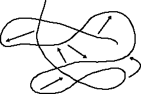
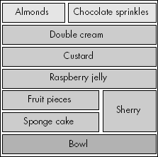
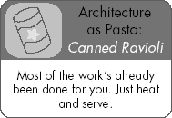

# 第三部分。代码的形状

与美酒不同，你的代码不太可能随着时间的推移而变得更好。如果它开始像狗产下的一小堆东西，那么它无疑会变成大象产下的一大堆东西。

这不是秘密，然而软件工厂不断地生产出庞大的作品，然后承受后果。他们的产品既不适应，也不可扩展，也不够灵活，以满足未来的需求，也不容易开发：他们无法按时按预算交付。作为程序员，这伤害了我们的自尊——但它伤害了管理者的钱包，更严重。

答案？一个解决方案是根本不尝试代码开发，但这几乎不切实际。另一个解决方案是以整个系统的结构为视角来开发代码。优秀的代码不是偶然出现的；它是精心制作的结果，强调前期规划和设计。但这也源于灵活的开发方法，足够敏捷以应对途中不可避免的困难和变化。

本节探讨了这一过程。我们将查看：

第十三章

代码微观设计：针对单个代码模块的低级构建技巧。

第十四章

大规模系统设计——任何软件开发的第一步构建阶段。

第十五章

查看软件随着时间的推移如何增长和扩展，以及一些将新工作整合到旧代码库中的实用建议。

这些不是可选的额外内容或美好的愿望。它们是我们工艺的必要阶段，因此对于高质量软件的生产至关重要。忽视这些内容将带来危险。

# 第十三章。宏伟设计

### *如何制作优秀的软件设计*

骆驼是委员会设计的马。

--艾略特·艾萨克尼斯爵士

有些代码只会让你叹息。

我曾经不得不为嵌入式产品编写一个设备驱动程序。该驱动程序与操作系统的接口相当复杂。我使用的硬件接口也很复杂。为了保持理智，我将代码分为两个部分。第一部分是一个内部库，它访问硬件，执行一些数据缓冲，并提供一个简单的 API 来访问这些缓冲数据。然后我编写了第二个，独立的层，它根据这个内部库实现了挑剔的操作系统的驱动程序接口。设备驱动程序的结构看起来像图 13-1。

后来，硬件制造商给我发送了同一设备驱动程序的样本实现。这段代码的作者显然没有仔细思考。代码混乱不堪，将复杂的操作系统接口与硬件逻辑以完全无法理解的方式紧密交织在一起。其结构近似如图图 13-2 所示。

**图 13-1. 皮特的理智软件设计**

**图 13-2. 如何不设计软件**

现在，我并不是在吹嘘自己（至少不是过分吹嘘）。这个例子的目的是明确的。第一个设计更好。它更容易理解，因为它非常直接，它更容易实现，因此也更容易维护。

C.A.R. Hoare 写道：“构建软件设计有两种方法：一种方法是将它做得如此简单，以至于显然没有缺陷，另一种方法是将它做得如此复杂，以至于没有明显的缺陷。第一种方法要困难得多。”（霍尔 81 页）

成熟程序员的标志之一是其代码的设计质量。在本章中，我们将探讨构成良好设计的内容，并研究如何制作高质量的软件设计。

# 编程即设计

人们普遍认为，“设计”是在编写代码之前完成的一个阶段。它的产品是某种形式的**设计规范**，这对于一个通用的代码猴子来说足够了。

事实却大相径庭。编程——编写代码的行为——是一种**设计活动**。

即使是最详细的规范也有漏洞，否则它就会**是**代码——你无法在设计文档中描述每一个微小的细节。编程行为验证了最初的设计决策，并执行剩余的设计工作。它揭示了漏洞、不一致性和错误，并允许你找到绕过它们的方法。“有些程序员在编程时认为自己没有在做设计，但无论何时你编写代码，你总是在做设计，无论是明确还是隐含。”（琼斯 96 页）

**关键概念**

*编程是一种设计活动。它是一种创造性和艺术性的行为，而不是机械的代码生成*。

一个好的开发过程会认识到这一点，并在适当的时候不会回避编写代码。极限编程的实践者主张**设计就是代码**。没有独立的设计活动；没有设计团队。是程序员通过不断优化和扩展代码来不断优化和扩展设计。这在他们的**测试驱动设计**方法中得到体现：在编写任何代码之前，编写代码测试作为设计验证工具。这是一个明智的想法。

这是否意味着在开始编写代码之前不需要思考？当然不是！在文本编辑器的深处不是规划你要写什么的地方。这就像在没有决定路线的情况下试图从柏林开车去罗马。在你确定哪个方向是北方之前，你可能会到达莫斯科。按照定义，设计是你首先做的事情。

**关键概念**

*在输入之前先思考；建立一个连贯的设计。否则，你最终会得到混乱的代码*。

# 我们要设计什么？

程序员设计代码结构，这是显而易见的。但在开发过程的各个阶段，这意味着不同的事情。在每一个阶段，设计都是一个将任务分解为其组成部分的过程，并弄清楚每个部分如何工作。

这些软件设计的级别包括：

**系统架构**

在这里，我们将系统作为一个整体来审视，识别主要子系统，并确定它们如何进行通信。架构设计对系统的整体性能和特性影响最大，对特定代码行的影响最小。这是最重要的设计活动，将在下一章中介绍。在这一章中，我们关注代码的内部设计，这涉及到后续的设计级别。

**模块/组件**

架构子系统通常太大，无法直接在代码中实现，因此下一步是将每个子系统分解成可理解的模块。在模块级别进行设计时，很容易变得模糊不清。在某种程度上，“模块”实际上并不存在。“模块”可能根据设计方法的不同而具有不同的含义；它可能是一团逻辑代码，可能是一些物理单元，如 Java 包、C++/C#命名空间或可重用库。它可能是一个类层次结构，甚至可能是一个独立的可执行文件。

这个设计阶段通常会生成已发布的接口。这些接口在以后很难更改，因为它们在代码模块和编写它们的程序员团队之间形成了严格的契约。

**类和数据类型**

接下来，我们将模块分解成小块。界面设计通常较为非正式，并且更容易在模块之后进行更改。这种在键盘上进行的微观设计趋势应该被抵制，否则你可能会写下头脑中第一个出现的代码，而不是最适合该问题的代码。

**函数**

这可能是食物链中的最低设计级别，但它的作用并不小。程序是由例程构建的：如果例程设计得不好，那么整个系统都会受到影响。在确切地确定了需要哪些函数之后，我们设计它们内部的工作方式，控制流的路由方式，以及使用的算法。1] 这通常是一种心理练习，而不是一种记录的程序，但勤奋的设计是必不可少的。

* * *

^([1]) 关键算法通常会跨越多个函数；它们将在模块设计阶段确定。

# 所有这些喧嚣都是关于什么的？

你不会找到任何人为糟糕的设计辩护，但尽管如此，仍然有很多设计糟糕的代码。在一线工作几年后，任何开发者都有证明它的疤痕。（久经沙场的老兵已经在点头，并在心理上排练他们的战争故事。）但为什么会出现这种情况？

满足的设计可能是缺乏经验的程序员的产物，但更常见的是由软件工厂的商业压力造成的，挤压出任何可能用于良好设计的时间。没有人听那些可怜的抗议的编码者。在现实世界中编程必然受到按时交付软件——任何软件——的驱使。讽刺的是，在几乎所有情况下，缺乏良好的设计最终比正确地做它所花费的时间要多。正如他们所说，“永远没有时间做对，但总有时间做两次。”

设计正确真的很**非常重要**。你的代码设计是其构建的基础。如果它错了，那么代码将是不稳定的、不安全的，并且不适合用途——危险的。糟糕的设计基础会导致软件等同于比萨斜塔。虽然它在承受实际使用的压力下设法站立起来是新颖的，但它永远不会像它应该的那样好，而且随着时间的推移，这不可避免地会显现出来。

一个良好的设计使代码：

+   更容易编写（有一个明确的攻击计划，并且很清楚它将如何组合在一起）

+   更容易理解

+   更容易修复（你可以确定问题的位置）

+   更不可能隐藏错误（程序错误不会被神秘的设计问题所隐藏）

+   更能抵御变化（设计将鼓励扩展并适应修改）

# 良好的软件设计

对于任何编程问题，都会有许多潜在的代码设计。你的任务是找到一个。最好的一个。或者至少是一个足够好的一个。这不是一项容易的任务……

+   你怎么知道你的设计会起作用？在完成一个无懈可击的攻击计划后，你自信地开始实施。后来，一个意外的问题会露出它的丑陋面目。回到画板。

+   你怎么知道你的设计何时完成？除非你真正实现了它并发现它可行，否则你无法知道。许多问题无法预先猜测；你必须走出第一步，实现设计，看看它是否完整。只有通过尝试解决方案，你才开始真正理解原始问题。有了这些新知识，你然后可以尝试再次正确地解决它。

+   你怎么知道这是针对该问题的最佳设计解决方案？除非你尝试了每一种可能性，否则你无法得知。这并不实际。那么，你怎么知道它足够好？如果性能是一个要求，你只有在系统真正运行时才会真正知道。

最佳的设计方法解决这些问题。它们是：

**迭代**

通过进行少量设计、实施它、评估其影响，并将这些反馈到下一轮设计中，可以避免太多令人不快的惊喜。这种增量构建方法非常强大。

**谨慎**

不要试图一次性设计太多。如果某件事失败了，可能是因为任何数量的设计决策。限制失败的空间，你会发现更容易进步。小而确定的设计步骤比大而笨拙的步骤更有可能成功。

**现实**

指令性的设计流程并不总是每次都有效。结果取决于建立的要求的质量、团队的经验以及流程应用的严谨性。实用方法结合了所有方法的优点，并承认它依赖于程序员的直觉——经验在很大程度上塑造了良好的设计。

**信息**

您必须完全理解所有需求和激励原则，以便清楚地了解您正在解决的问题，以及正确解决方案的重要品质。如果您不这样做，您可能会解决错误的问题。您需要这些信息来做出早期设计决策，其中一些很难逆转。

您的设计方法不可避免地会受到正在使用的整体开发方法的影响（有关这些方法的描述，请参阅第 420 页的“编程风格”）。良好的设计**过程**是创造良好设计的一步，但并非保证。这最终还是取决于你所做出的设计**决策**的质量。不同的权衡会导致不同的设计。例如，针对速度的设计将与针对可扩展性的设计不同。最终，没有**正确**或**错误**的设计。最好的情况是，有**好**的设计和**坏**的设计。

良好的设计具有许多吸引人的特征，其对立面是坏设计的明确指标。我们将在下面讨论这些。

## 简单性

这是良好设计代码最重要的特征。简单的设计易于理解，没有不必要的瑕疵，易于实现。它是连贯和一致的。

简单的代码尽可能小，但不要更小。这需要一些努力，正如数学家布莱士·帕斯卡所欣赏的：“我为信件的长度感到抱歉，但我没有时间写一封简短的信。”仔细计算出所需的代码**最少**是多少，然后只写那么多。记住，您总是可以稍后添加更多代码以实现额外功能，但您很少能移除已经紧密相连的东西。

**做出权衡**

软件设计是一个做决策的过程——将系统分解为其组成部分，但也是平衡不同方向拉扯的对抗力量。需要做出权衡，这些权衡塑造了最终的设计。

这些是此类走钢丝和拔河游戏的常见例子：

**可扩展性与简单性**

可扩展性的设计提供了足够的接口点，以便未来的代码可以插入，并确保脚手架足够通用，以支持任何后续需求。简单性避免了额外间接层次和不需要的普遍性。

**效率与安全**

性能的提升通常是通过牺牲设计的纯粹性来实现的——为某些重要操作设置特殊的后门，或者添加大量的耦合以防止过多的间接访问。高度优化的系统通常在面对变化时不太清晰且更脆弱。

虽然并非所有高效的设计都是不好的；许多好的设计自然表现良好，*正是因为*它们的简单性。

**功能与开发工作量**

在项目启动时，有一千个期望的功能和合理的想法，即它们应该在何时交付（如果不在明天，那就更早）。没有无限数量的猴子和他们无限的电脑，你永远无法全部完成。

更多的功能需要更多的时间来实现。

这些特性中哪一个最重要取决于项目需求。这就是为什么一开始就弄清楚它们如此重要的原因。

懒惰*可以*带来回报。设计你的设计，以便尽可能推迟工作，并只专注于当前的问题。

**关键概念**

少即是多。*追求简单但功能强大的代码*。

简单的设计不一定容易创建。它需要时间。对于除了最基本程序之外的所有程序，必须筛选大量信息才能达到最终解决方案。设计良好的代码*看起来*很明显，但可能需要大量的思考（以及大量的重构）才能使其如此简单。

**关键概念**

*使事物简单是一项复杂的工作。如果一个代码结构看起来很明显，不要假设它设计起来很容易*。

有很多方法可以使设计变得不必要地复杂，包括错误的组件分解、无思考地增加线程、不恰当的算法选择、复杂的命名方案以及过度或不适当的模块依赖。

## 优雅

优雅体现了设计的审美方面，通常与简单性相辅相成。这意味着你的代码不是巴洛克式的、令人困惑的聪明或过于复杂。设计良好的代码在其结构中具有美感。这些是可取的特性：

+   控制优雅地环绕系统。一个操作不会通过每个模块，在 16 种不同的表示形式之间转换其参数格式，最终忽略它。

+   每个部分都补充了其他部分，增加了独特且有价值的东西。

+   设计没有充斥着特殊情况。

+   它将类似的事物关联起来。

+   没有令人讨厌的惊喜潜伏在角落里。

+   存在一个小的变化局部性：在一个地方的单个简单改变不会导致代码在许多其他地方的修改。

好的设计与平衡和美学有很大关系。我不会走得那么远，以至于说编程是艺术，尽管有些人可能会为这一点提出有说服力的论据。优雅和简单是支撑本列表中大多数剩余特性的基础。

## 模块化

当我们解决设计问题时，我们会自然地将它分解成称为*模块*或*组件*的部分。我们将它们分解成子系统、库、包、类等等。每个部分比原始问题更简单，但组合起来，它们形成了一个完整的解决方案。这种分解的质量至关重要。

模块化的关键特性是*内聚*和*耦合*。我们追求具有以下特性的模块：

**强内聚**

*内聚*是衡量相关功能如何聚集在一起以及模块内部的各个部分如何作为一个整体工作的指标。内聚是使模块粘合在一起的胶水。

弱内聚的模块是分解不良的迹象。每个模块都必须有一个明确定义的角色，并且不能是无关功能的杂乱组合（就像可怜的`utils`命名空间那样——人们为什么要写这些？）。

**低耦合**

*耦合*是衡量模块之间相互依赖程度的指标——即与它们连接的线路数量。在最简单的设计中，模块之间的耦合很小，因此它们相互依赖性较低。显然，模块不能完全解耦，否则它们根本无法一起工作！

模块以多种方式相互连接——有些是直接的，有些是间接的。一个模块可以调用其他模块的函数或被其他模块调用。它可能使用另一个模块的数据类型或共享一些数据（可能是变量或文件）。良好的软件设计将通信线路限制在绝对必要的范围内。这些通信线路是决定代码设计的一部分。

一旦识别出来，每个模块都可以独立工作并单独测试。这是模块化的一个优点；它允许你将任务分配给程序员。不过要小心；康威定律警告说软件结构可能会遵循团队结构：“如果你有四个团队一起构建一个编译器，它将变成一个四遍编译器”（参见第 320 页的“组织和代码结构”）。确保分解是合理的，并且基于问题，而不是团队组织。

**关键概念**

*设计内部内聚且耦合度最小的模块。分解必须代表问题空间的有效划分*。

## 良好的接口

模块帮助我们分离关注点并划分问题。每个模块定义了一个*接口*，这是它隐藏内部实现的公共外观。这个可用的操作集通常被称为*应用程序编程接口（API）*。它是访问模块功能的主要途径，其质量决定了该模块的质量，至少从外部看是这样。

**关键概念**

*划出人们不需要跨越的界限：识别清晰的 API 和接口*。

要创建一个良好的接口，请遵循以下步骤。

1.  识别客户端及其*想要*做什么。

1.  识别供应商及其*能够*做什么。

    只有在正确识别了双方并理解了他们的个别需求后，才能通过接口成功地将用户和实现者分开。一旦你对此有了明确的认识，你就有机会创建一个既能满足用户需求又实际可实现的接口。

    恶劣的设计将操作放在错误的位置，使得跟踪应用程序逻辑成为噩梦，并且难以扩展设计。它导致模块耦合增加和内聚度降低。

1.  推断所需的接口类型。

    它是一个函数、一个类、一个网络协议，还是其他什么？这通常由提供功能的人决定，但也可以将接口封装起来，以不同的方式呈现。例如，将 CORBA 对象封装在库中，可以将其功能发布到一组协作计算机的网络中。

1.  确定操作的性质。

    真正需要提供的功能——这是否比这个客户端的具体需求更通用？在每一个函数中，通常都有一个更有用的操作等待被提取出来。

有几个关键原则有助于我们推理接口的性质和质量。如图图 13-3 所示，这些原则是：

**分区**

接口形成了一个接触点，但也是客户端和实现者之间的分隔线。他们只能以定义的方式沟通，而不能以任何其他临时方式。

优秀的代码清晰地定义了*角色和责任*。了解系统中的主要演员是谁以及他们应该做什么，确保接口清晰有效。

一个很好的例子是我的房子：它的主要接口是前门。门将居住者与访客分开，并确定他们相遇的地方。还有许多其他接口用于其他操作：窗户、电话、烟囱等等。

**抽象**

抽象允许观察者集中精力做出重要决策，有选择地忽略某些细节。它将现实背后的复杂性以更简单的形式组织起来，帮助我们应对复杂性。在面向对象设计中，这是一个特别重要的概念。在设计接口时，你通过仔细选择对用户重要以及对他们有用地隐藏的内容来创建一个抽象。

给你一碗水果，你可以高兴地说，“*吃*掉上面的那个东西，”然后“*吃*掉下一个，”而不必担心这具体意味着什么；葡萄柚需要剥皮，而大黄需要煮熟并裹上糖。这些细节都隐藏在抽象的“*吃*”背后；你只关心水果*已经被吃掉*了，而不是如何吃掉它.^([2])

**图 13-3. 房屋提供的界面**

抽象可以形成层次结构。你可以从不同的*抽象层次*来看我的房子，取决于你是一个建筑师、一个粒子物理学家，还是一个银行经理。它可以被视为：

+   房间集合

+   墙、地板和天花板的布局

+   砖木结构的建筑

+   分子集合，甚至原子集合

+   需要支付的抵押贷款

**压缩**

这是接口用更简单的东西来表示大型操作的能力。压缩通常是良好抽象的结果，但糟糕的抽象可能导致更冗长的代码。

**可替换性**

如果一个接口的实现满足相同的契约，你可以用另一个实现来替换它。如果你在程序中定义了一个排序接口，那么任何算法都可以放在它后面：它可以是快速排序、堆排序，或者（天哪）冒泡排序。你可以在任何时刻更改它，只要通过接口可见的行为保持不变。

在类继承层次结构中，任何对象都可以被其超类型所替代。

如果你希望我打开前门，你会按门铃。过去这是一个连接到铃铛机构的有线开关，但我刚投资了一个新式的无线门铃。这对你没有任何影响，实际上你甚至不会知道我已经更换了它；你按一个按钮，我就出现了。

**面向对象**

计算机科学的大部分内容都是围绕定义接口和组织围绕它们的复杂性来构建的。那句著名的格言是，“任何问题都可以通过添加一个额外的间接层来解决”——也就是说，通过另一个接口隐藏新的复杂性。

有许多类型的接口。它们都向客户端展示一些*公共*的面孔，并在这一面纱背后隐藏了血腥的实现细节。

你将创建的常见接口形式是：

+   库

+   类

+   函数

+   数据结构（尤其是具有额外行为的外来结构，如信号量）

+   操作系统接口

+   协议（例如网络通信）

## 可扩展性

设计良好的代码允许在必要时在适当的位置插入额外的功能。危险在于这可能导致过度设计的代码，试图应对任何潜在的未来修改。

可扩展性可以通过软件脚手架来实现：动态加载的插件、精心选择的具有顶部抽象接口的类层次结构、提供有用的回调函数，甚至是一个基本合理且可塑的代码结构。

**关键概念**

*设计以扩展性为目标，但不要过于泛化——你最终会写出一个操作系统，而不是一个程序*。

良好的设计师会仔细思考他的软件将如何扩展。随意在代码中添加扩展钩子实际上可能会降低质量。你应该平衡现在需要的功能、肯定需要添加的功能以及可能需要的功能，以确定设计应该有多大的可扩展性。

## 避免重复

设计良好的代码不包含重复；它永远不需要重复自己。重复是优雅和简单设计的敌人。不必要的冗余代码会导致程序脆弱：给定两个只有细微差别相似的代码片段，你可能会在其中一个中找到并修复一个错误，然后忘记在另一个中修复相同的错误。这显然会损害代码的安全性。

大多数重复是通过*剪切和粘贴编程*——在编辑器中复制代码——产生的。它也可能通过程序员通过重新发明轮子（不理解整个系统）而更加微妙地产生。

+   如果你看到不同的代码部分执行着惊人的相似操作，请将其概括为一个具有适当参数的函数。现在有一个地方可以修复任何错误。这有助于通过描述性的函数名使代码的意图更清晰。

+   类似度极高的类表明某些功能可能需要提升到超类中，或者可能缺少一个接口来描述共同的行为。

**关键概念**

*一次做好。避免重复*。

## 可移植性

良好的设计并不一定是可移植的；这取决于代码的需求。可以采取很多措施来防止平台依赖，但为了不必要的可移植性而牺牲代码质量是糟糕的设计。良好的设计应该是适当地可移植的，并在出现问题时管理可移植性关注点。

这个故事很熟悉：你的代码从未打算在任何其他环境中运行，因此它没有被设计成能够应对。后来的开发意外地需要一个新的运行时平台；适应旧程序比编写一个新程序要简单。代码不利于可移植性，而且没有足够的时间重构或重新设计以支持跨平台。结果呢？一个混乱的代码团，其设计已被不可修复地扭曲，充满了`#ifdef NEW_PLATFORM`结构。这不是由工程师编写的；它是由哲学家管道工编写的。

在设计早期就仔细选择你的操作系统依赖或硬件依赖代码的结构。这将在未来带来回报，并且不需要影响性能或清晰度（有时甚至可能提高清晰度）。尽早考虑这一点很重要；重新工作旧假设是昂贵的。

常见的方法是创建一个平台抽象层（这可能是几个操作系统接口函数的简单覆盖）。你可以在每个平台上以不同的方式实现这个层。

**关键概念**

*在设计代码时，管理其可移植性，而不是将其作为事后考虑的修补*。

## 惯用语

一个好的设计自然采用最佳实践，与设计方法（见第 420 页的“编程风格”（Programming Styles））和实现语言的惯用语相匹配。这允许其他程序员立即理解代码的结构。

针对实现语言（可能是固定的，也可能是设计领域的一部分），你必须理解如何**很好地**使用它。例如，C++有像*资源获取即初始化（RAII）*和操作符重载这样的惯用语，这对你设计代码的方式有很大影响。学习它们。理解它们。使用它们。

## 文档齐全

最后，但同样重要的是，一个好的设计应该有文档。不要让读者自己去推断结构。这在设计的高层次尤其重要。文档应该很小，因为设计本身很简单。

在光谱的一端，架构设计以规范的形式进行文档化。在另一端，函数使用自文档化的代码。在中间，你可能使用文献编程来编写 API 文档。

* * *

^([2]) 这种在单个逻辑抽象背后隐藏多个物理行为的能力被称为*多态性*，在“多态性”一节中描述，见第 423 页。

# 如何设计代码

总是考虑事物在其更大的上下文中进行设计——一把椅子在一个房间里，一个房间在一所房子里，一所房子在一个环境中，一个环境在一个城市规划中。

--Eliel Saarinen

你如何学会设计得很好？优秀的设计师是天生的还是后天培养的？设计可以教授或习得吗？一些程序员天生具有优秀设计的天赋；这与他们的大脑工作方式相契合。他们自然欣赏美学，并能理解足够的问题以做出平衡的判断。然而，你**可以**学会更有效地设计。

当我出生时，我并不擅长陶艺。（我从未遇到过任何人擅长。）我现在仍然很糟糕，但我曾经上过一些课程。我理解了技巧并能制作（几乎可辨认的）陶器。如果我稍微练习一下，可能会更好，但我永远不会成为大师级工匠。

同样，没有人天生就会设计代码：我们学习。我们被教导设计方法和良好的工程实践。这些旨在使设计成为一个可重复的过程，但它们不能替代**工艺**。创造性思维过程和创新设计的构建要难得多；总会有人更好地掌握这一点。

良好的软件设计是审美的；要创造这种数字艺术需要技能、经验和实践。本章无法尝试提供一个按数字描述如何设计软件的步骤。真遗憾：如果我能把好的设计装瓶，我将成为百万富翁。要成为一名优秀的设计师，你必须了解构成良好设计的东西，并学会避免不良设计的特征。然后是练习。很长时间。

除了个人能力之外，还有设计方法和工具可以为程序员带来很多帮助。我们将通过调查它们如何（或不能）帮助我们来结束讨论。

## 设计方法和过程

软件设计方法有很多。有些强调符号，有些强调过程。系统化的方法比“凭直觉”设计要好；你使用哪种方法通常由公司的实践和文化决定。我总是小心翼翼地避免陷入*特定*过程的泥潭——满足其微小的细节往往扼杀创造力。

现代设计方法分为两大类，它们基于的基本设计哲学：

**结构化设计**

这主要是关于*功能分解*，将系统的功能分解成一系列较小的操作。例程是主要的结构化工具；设计由例程的层次结构组成。结构化设计以*分而治之*的方法为特征，将问题分解成越来越小的过程，直到每个部分不能再分解。

有两条主要攻击线：*自顶向下*和*自底向上*。

+   毫不奇怪，自顶向下的方法从整个问题开始，将其分解成更小的活动。然后，这些活动被设计成自包含的单元，直到不再需要进一步分解。

+   相比之下，自下而上的设计从功能的最小单元开始，即你知道系统*必须*执行的最简单的事情。然后它将这些功能拼接在一起，直到得到一个完整的解决方案。

在实践中，这些方法通常是协同使用的，设计过程在它们交汇的地方结束，通常是在中间某个位置。

**面向对象的设计**

与结构化设计侧重于表示系统必须执行的操作相比，面向对象的设计侧重于系统中的数据。它将软件建模为一系列相互作用的单个单元，称为*对象*。

面向对象的设计确定了问题域中的主要对象，并确定了它们的特征。这些对象的行为被建立，包括它们提供的操作以及它们各自关联的其他对象。这些对象被编织到设计中，包括任何实现域所需的对象。当所有对象的行为和交互都被确定时，设计就完成了。

面向对象编程被誉为软件设计世界的救世主，一种新的范式，将引领世界和平，以至于人们常常因为不进行 OO 设计而感到尴尬。但它在很大程度上实现了炒作，使软件设计能够管理远比更大的问题的复杂性。

请参阅第 420 页的“编程风格”，以获取对设计方法和过程的更详细描述。

**设计模式**

*模式*在过去的几年中已经成为面向对象编程社区的流行词汇。由被称为“四人帮”的作者（Gamma 等人 94）所著的《设计模式：可复用软件元素》（Design Patterns: Elements of Reusable Software）一书（因此它通常被称为*GoF*书籍）普及开来，设计模式是克里斯托弗·亚历山大（Christopher Alexander）建筑作品的软件版本。（亚历山大 99）

模式建立了一套经过验证的设计解决方案的词汇表，每个模式描述了一个可识别的协作对象结构。这些不是聪明的创新设计，而是在*真实代码*中发现的重复出现的模式，并且已被证明是有效的。*模式语言*汇集了一系列设计模式，展示了它们如何相互关联和补充。语言中的每个模式都遵循一个共同的形式，描述了*上下文*、*问题*和*解决方案*。这些信息允许你适当地在你的设计中应用模式。

模式在软件系统的几个层面上出现。架构模式对系统的组织有深远的影响。设计模式是软件组件的中级协作。语言级别的模式是特定的代码技术，更常见地被称为语言的*习语*。

设计模式的名称已经进入日常用语，这是它们有用性的证明。你将听到程序员愉快地谈论*适配器*、*观察者*、*工厂*和*单例*。

设计模式远不止这个简短的描述所能做到的。它们是一个真正有用的概念，值得花些时间来了解它们。阅读 GoF 书籍及其相关材料。

## 设计工具

我们的设计最终以代码的形式表达，但经常在更抽象的层面上工作可能会有所帮助。工具帮助我们推理设计，帮助我们产生更有效的设计，并帮助我们向其他程序员传达这些设计——记录我们*打算*生产和我们已经*已经*创建的内容。

在某种意义上，方法论是工具，但还有广泛的其他设计辅助工具与之相辅相成。

**符号**

精美的图片胜过千言万语。许多图形符号存在，帮助我们以图形方式表达我们的设计。大多数只是短暂地流行，然后默默地退出了聚光灯，被一种更加吸引人的绘制框线和线条的方式所取代。*统一建模语言（UML）*目前是最流行且最规范的符号。它提供了一种标准的方式来建模和记录软件开发过程中产生的几乎所有工件。事实上，它已经变得如此全面，以至于你可以用它来可视化远不止软件；它已经被用来建模硬件、业务流程，甚至组织结构。

符号提供了一种媒介，帮助你表达、思考和讨论你的软件设计。它们有两个目的：

+   它们允许你快速绘制“信封背面”的设计，并在白板上分享想法。

+   它们允许你正式记录设计。

为了在后者中保持你的理智，图表创建必须通过一个专门的绘图工具自动化。否则，图表将难以更新，并且会随着代码的开发而与现实脱节。把时间花在做一些有用的事情上，而不是画框线和线条。

我更喜欢不被过于正式的符号使用所困扰，高兴地将其用作传达设计基本要素的方法。知道足够多的东西来能够进行沟通对我来说就足够了；我不想过于关注每种图片中的每个菱形和虚线线意味着什么。

**设计模式**

一种强大的设计工具，提供了一系列经过验证的设计技术词汇，并展示了如何在实践中应用它们。“设计模式”在第 255 页更深入地讨论了设计模式。

**流程图**

一种特定的图形符号，用于可视化算法。它们适用于提供高级概述，但不如代码精确，并且成为需要与代码更改保持同步的另一件事。因此，最好谨慎使用。

**模拟代码**

模拟代码帮助你起草函数实现。它是软件设计中最奇特的一项发明——介于自然语言和编程语言之间，一种类似皮钦英语的东西。它的优点是摆脱了任何特定语言的语法和语义。你可以专注于需要完成的事情，而不是语言机制，并且可以包含任意数量的描述性文字以提高清晰度。

与其缺点相比，这些并不是令人难以置信的好处。模拟代码需要翻译成实现语言。你本来就可以用那种语言开始编写，从而节省一些精力。如果模拟代码被用作设计文档，那么你必须将其与代码保持同步。

*程序设计语言（PDL）* 是一种更加荒谬的发明——一种形式化的伪代码。我想当时对某个人来说是有意义的。我很想看看他们的伪代码编译器。

**代码设计**

这是一种有用的非正式的代码设计方法。在初始设计阶段，你将所有 API 和底层接口以代码的形式捕捉，但并不实现它们——你只是编写返回合理值的占位符，并在每个占位符内部添加注释，描述应该做什么。当你达到足够成熟的设计时，系统已经编写了大量的代码。

这可能是一把双刃剑，因为它可能导致设计不够流畅。你改变设计的次数越多，你需要修改的代码就越冗长。

**CASE 工具**

*计算机辅助软件工程（CASE）* 工具协助设计过程中的所有或部分工作，自动化繁琐的任务并管理工作流程。大多数工具能够从你的漂亮图片中生成代码（质量可变）。一些甚至在你修改代码时更新图片；这被称为 *往返工程*（或 *往返*）。许多 CASE 工具支持协作工作，允许程序员团队为单一的大型设计做出贡献。

值得一提的一种 CASE 工具是 *快速应用开发（RAD）* 工具：快速构建应用程序的环境。它们通常在其特定领域（通常是简单 UI 聚焦的应用程序）中表现良好，但不是好的通用软件设计模型。

**关键概念**

*对设计工具和方法论采取实用主义的态度——当它们真正有用时使用它们——但不要成为它们的奴隶*。

# 简而言之

在复杂的背后，出现了简单的元素。

-- 温斯顿·丘吉尔

好的代码是精心设计的。它具有某种美学吸引力，让人感觉 *很好*。在开始编写代码之前，你必须计划设计，否则你最终会得到一个令人不快的混乱。考虑像清洁结构、可能的未来扩展、正确的接口、适当的抽象和可移植性要求等因素。追求简单和优雅。

设计涉及强烈的工艺元素。最好的设计来自经验丰富和技艺精湛的手。最终，一个好的设计师是好的设计的关键。平庸的程序员不会产生优秀的设计。

| 精通编程的人 . . . | 不擅长编程的人 . . . |
| --- | --- |

|

+   希望他们接触的任何事物都处于良好的状态

+   将编程视为一个创造性的过程，并将艺术元素融入他们的工作中

+   在开始工作之前，考虑代码的结构

+   在开始任何额外工作之前，感觉有必要整理和重构混乱的代码

+   不断学习其他软件的设计，积累成功和失败的知识

|

+   继续将越来越多的代码编织成一个紧密的球，直到他们认为已经足够，然后对结果抱怨

+   在处理密集的代码时，不会注意到糟糕的设计或感到任何厌恶

+   你是否愿意快速黑客攻击并逃离，留下别人来清理混乱

+   不欣赏或尊重他们正在工作的代码的内部设计；他们以一种不友好的方式践踏它

|

# 参见

第八章

描述了如何*为测试设计代码*—使证明你的代码正常工作更容易。

第十四章

软件设计的最高级别被称为*软件架构*。它提供了自己的特定问题，并在本章中处理。

第十九章

软件设计通常被记录在规范文档中。

第二十二章

设计融入了整个软件开发过程。

第二十三章

你正在构建的系统类型不可避免地会影响软件的内部设计。

# 开动脑筋

这些问题的详细讨论可以在第 519 页的"附录 A"部分找到。

## 深思熟虑

1.  项目大小如何影响你的软件设计和创建它的工作？

1.  一个文档齐全的糟糕设计是否比一个未文档化的优秀设计要好？

1.  你如何衡量一段代码的设计质量？你如何量化其简洁性、优雅性、模块化等等？

1.  设计是团队活动吗？团队合作技能在创造良好设计方面有多重要？

1.  不同的方法论是否更适合不同的项目？

1.  你可以通过哪些方式确定一个设计是否高度内聚或松散耦合？

1.  如果你以前解决过类似的设计问题，这对你判断*这个问题*的难度有多大的指示作用？

1.  设计中是否有实验的余地？

## 个人感悟

1.  回顾并思考你是如何学习设计代码的。你如何将你获得的知识传达给一个完全的初学者？

1.  你在使用特定的设计方法论方面有什么经验？这些是好的还是坏的经验？结果代码是什么样的？什么可能做得更好？

1.  你认为坚持你正在使用的方法论很重要吗？

1.  你见过的最佳设计代码是什么？最差的设计代码是什么？

1.  编程语言本质上是你实现设计的工具，而不是争论的宗教。真正了解语言惯用法的意义有多大？

1.  你认为编程是*工程学科*、*手艺*还是*艺术*？

# 第十四章。软件架构

### *软件设计的基础*

架构是浪费空间的艺术。

--菲利普·约翰逊

去一个城市。站在它的中间。四处看看。除非你选了一个不寻常的地方，否则你将被大量不同年龄和建筑风格的建筑所包围。有些与周围环境和谐相处。有些看起来格格不入。有些看起来美观，比例协调。有些则非常丑陋。有些可能会在未来 100 年里仍然存在。许多则不会。

设计这些大楼的建筑师在动笔之前考虑了很多因素。在设计过程中，他们小心翼翼、有条不紊地工作，以确保建筑可以制造，并平衡所有竞争力量：用户需求、建造方法、可维护性、美学等等。

软件不是由砖石和灰泥构成的，但同样需要仔细思考以确保系统满足类似的集合要求。我们在建造建筑方面比编写软件的历史要长得多，这很明显。我们仍在学习什么构成了好的软件架构。

在这次对软件架构世界的短暂探索中，我们将研究一些常见的架构模式，并探讨软件架构的真正含义，它真正不是什么，以及它的用途。

**地下运动**

我加入了一个项目，该项目产生了大量未文档化的软件，这些软件没有计划或目的，没有建筑师来指导建造过程。自然地，它变成了一颗难看的疖子。当我们需要真正理解它是如何运作的时候，系统架构图就被绘制出来了。有如此多的不同组件（许多很大程度上是冗余的），不恰当的连接，以及不同的通信方式，使得图表成为了一团混乱的紧密交织的线条，许多线条呈现出多种解释色彩——几乎就像一只蜘蛛掉进了几罐不同的油漆里，然后在办公室里织出了迷幻的网。

然后，我意识到。我们几乎绘制了一张伦敦地铁的地图。我们的系统与它如此相似，令人毛骨悚然——对于局外人来说几乎无法理解，有众多路线可以达到相同的目的，而计划仍然是对现实的粗略简化。这是一个会让旅行推销员感到烦恼的系统。

缺乏架构视野在软件上留下了明显的印记。它难以使用和理解，功能片段散布在完全随机的模块中。它已经到了这种地步，你唯一能做的有用的事情就是把它扔掉。

在软件开发中，就像在建筑建造中一样，*架构至关重要*。

# 什么是软件架构？

这只是另一个稍微拉伸了*建筑*隐喻的术语吗（参见第 177 页的"我们真的在构建软件吗？"）？可能吧，但它确实是一个真正有用的概念。软件架构有时也被称为*高级设计*；无论使用什么术语，其含义都是相同的。架构是对该概念更富有表现力的描述。

## 软件蓝图

当建筑师为建筑物准备蓝图时，软件架构师为软件系统准备蓝图。然而，尽管建筑物的蓝图是一个严格详细的计划，包含了所有重要特征，但我们的软件架构是一个顶层定义，是对系统的概述，特别避免过多细节。它是宏观的，而不是微观的。

在这个高级视图中，所有实现细节都被隐藏了；我们只看到软件的基本内部结构和其基本行为特征。架构视图执行以下操作：

+   确定关键软件模块（或组件、或库；在这个阶段，你可以随意称呼它们——*块*）

+   确定哪些组件相互通信

+   帮助识别和确定系统中所有重要接口的性质，明确各种子系统的正确*角色和责任*。

这些信息使我们能够对整个系统进行推理，而无需了解每个单独的部分将如何工作。架构提供了一个框架，后续的开发可以适应其中。它展示了工作如何在不同团队之间分配，并允许你权衡不同的实现策略。

不仅架构描绘了系统是如何组成的，它还展示了系统应该如何随着时间的推移而扩展。在大型团队中，当有一个清晰的、统一的软件应该如何适应、每个模块应该包含什么以及模块如何连接的愿景时，程序将更加优雅地发展。

**关键概念**

*架构是影响软件系统设计和未来增长的最大因素。因此，在开发的早期阶段将其做正确是至关重要的*。

作为一项前期活动，架构是我们第一次将*问题域*（我们正在解决的现实世界问题）映射到*解决方案域*的机会。两个域之间并不总是存在简单的对象和活动的一对一映射，因此架构展示了如何从另一个角度思考。

软件架构需要解决的问题将因项目而异。目标平台在这个阶段并不重要；可能可以在使用不同语言和技术的大量不同机器上实现架构。然而：

+   对于某些项目，可能需要指定特定的硬件组件，这很可能是为了嵌入式设计。

+   对于分布式系统，机器和处理器数量以及它们之间的工作分配可能是一个架构问题。应考虑最小和平均的系统配置。

+   如果特定的算法或数据结构对整体设计至关重要，架构也可能描述它们（尽管这种情况很少发生）。

总是存在权衡。在架构级别确定的信息越多，在后续的设计或实施阶段就越少有操作空间。

## 视角

在物理架构中，我们使用许多不同的图纸或同一座建筑的视图：一个用于物理结构，一个用于布线，一个用于管道，等等。同样，我们在架构过程中开发不同的软件视图。常见的四种视图如下：

**概念视图**

有时被称为*逻辑视图*，它展示了系统的主要部分及其相互连接。

**实现视图**

这种观点是从实际实施模块的角度来看的，这些模块可能需要与整洁的概念模型有所不同。

**过程视图**

设计用于展示任务、流程和通信方面的动态结构，当涉及高度并发时，此视图最为适用。

**部署视图**

使用此视图来展示在分布式系统中任务分配给物理节点的情况。例如，你可以在数据库服务器和一系列网络接口网关之间分割功能。

你不会一开始就拥有所有这些。特定的视图随着开发工作的进展而出现。初始架构阶段的主要结果是*概念视图*，这是我们在这里关注的重点。

**值此机会**

软件架构具有广泛的影响——远远超出代码的初始结构，深入到软件工厂的核心。架构将是一个持久的遗产，在技术和实践领域都是如此。架构影响代码如何增长以及团队如何协作来扩展它；软件设计影响工作流程。采用三层架构，你最终会拥有*三个*团队分别处理不同的部分。可能还会有*三*套管理团队，以及*三*条管理汇报线。某个人的早期设计决策将影响你坐在哪个办公桌前。

由于架构决定了软件的灵活性和代码库如何适应未来的需求，它最终会影响你公司的商业成功。糟糕的架构不仅仅是麻烦——它可能会让你失去生计。这是严肃的事情。

作为程序员，这直接影响我们——它将影响我们的工作有多有趣。没有人愿意辛勤劳作来添加一个微不足道的特性，而这个特性如果有一个正确的设计，只需两秒钟就能完成。在构思阶段，要检查架构是否支持你认为应该支持的内容，而不仅仅是建筑师所相信的内容。

## 何时何地进行？

架构被记录在一个高级文档中，可能被称为*架构规范*这样的富有创意的名字。这个规范解释了系统的结构，并展示了它是如何满足需求的，包括达到任何性能要求的策略以及如何实现可接受的容错性。

**关键概念**

*在已知的地方捕获系统架构；一个对所有相关人员——程序员、维护者、安装人员、经理（甚至可能是客户）——都易于访问的文档*。

架构是初始的系统设计。因此，它是需求确定后的*第一步*开发步骤。提前生成规范很重要，因为它提供了第一次审查和验证将对项目产生最大影响的决策的机会。它将暴露出弱点和潜在问题。在早期就纠正一个糟糕的决定将节省大量时间、精力和金钱。一旦在系统之上构建了大量代码，改变系统的根基就会变得非常昂贵。

架构工作是一种设计形式，但它与模块设计阶段是分开的，并且与低级代码设计不同，尽管它确实有一些重叠。详细设计的工作可能会将变化反馈到系统架构中。这是自然且健康的。

**谁的职责？**

我们已经看到，软件架构影响着项目中的每个人——而不仅仅是程序员。相比之下，架构是由一个远小得多的群体决定的。这是一个多么重大的责任。

架构设计师被称为*软件架构师*。这是一个宏伟的头衔，就像*工程师*一样，有些争议。真正的建筑师必须学习、取得资格并达到专业卓越的水平，才能被称为建筑师。在软件世界中没有这样的要求。

软件架构师是项目发起者之一，他们在开发周期的初期就开始工作。随着开发活动的增加，程序员将加入努力，实施这个既定的架构。

然而，在需要较少专业架构经验的小项目中，程序员自己将设计架构。不需要请来大炮。准备好为架构设计做出贡献。

## 它有什么用途？

架构是初始的系统设计。但它的用途甚至更广泛。我们使用系统架构来做：

**验证**

架构是我们验证将要构建的内容的第一机会。有了它，我们可以在心理上检查系统是否满足所有要求。我们可以检查它是否真的可行构建。我们可以确保设计在内部是一致的，并且没有特殊情况或无用的黑客攻击。高级设计中的瑕疵只会导致更低级别上更危险的黑客攻击。

架构有助于确保没有工作重复、浪费的努力或冗余。我们用它来检查策略中是否存在空白，是否包含了所有必要的部分。我们确保在将各个部分组合在一起时不会出现不匹配。

**沟通**

我们使用架构规范来将设计传达给所有感兴趣的各方。这些人可能是系统设计师、实施者、维护者、测试人员、客户或经理。它是理解系统的首要途径，也是一份重要的文档，应该*始终*在发生变化时保持最新。

**关键概念**

*架构规范是传达您系统形状的必要工具。确保您将其与软件保持同步*。

架构传达了您系统的愿景，将问题域映射到解决方案域。它应该清晰地标识出未来扩展如何融入其中，有助于保持系统的*概念完整性*。（布鲁克斯 95）它隐含地提供了一套约定，并包含了一定的风格元素。例如，如果整个设计使用 CORBA 基础设施，那么显然不应该引入一个具有自定义套接字通信的新组件。

该架构提供了一条自然过渡到下一级设计的路径，同时不会过于具体化。

**区分**

我们使用架构来帮助我们做出决策。例如，它确定了构建与购买决策，确定是否需要数据库，并明确了错误处理策略。它将标识问题区域，项目中的特定风险区域，并帮助我们计划以最小化这种风险。正如建筑师的主要目标是确保他的建筑在建成时能够经受住所有预期条件（以及一些不寻常的条件）——我们的软件结构也应该如此。一点风或额外的负载不应该使东西倒塌。

我们需要这种系统级的视角来做出适当的权衡，确保设计满足其所需属性。这些重要问题应该在开发初期考虑，而不是在开发末期才被添加。

**关键概念**

*在架构的背景下做出所有软件设计决策。始终检查您是否与系统愿景和策略保持一致。不要创建一个不与任何其他事物相协调的小瑕疵*。

## 组件和连接

建筑学主要关注**组件**和**连接**。它决定了每种组件的数量和类型。

### 组件

架构捕捉了关于每个组件的信息，无论在架构的上下文中“组件”意味着什么。它可能是一个对象、一个过程、一个库、一个数据库或第三方产品。系统的每个组件都被识别为一个清晰且逻辑的单位。每个组件执行一项任务，并且做得很好。除非有特定的厨房水槽模块，否则没有任何组件包含厨房水槽。

虽然架构不会过多关注组件实现问题，但它将描述所有公开的设施，也许还有重要的外部可见接口。它定义了组件的**可见性**：它能看到什么，不能看到什么，以及什么能看到它，什么不能。不同的架构风格意味着不同的可见性规则，我们稍后会看到。

**架构师与市场营销人员**

如果架构不能满足初始部署或任何未来发展的产品需求，那么它是不充分的；设计质量不仅仅是技术卓越的问题。技术问题必须与产品管理和市场营销考虑因素一起解决。

开发没有人想要的产品的意义不大；这显然是巨大的时间浪费。但是，如果你从技术考虑中省略了市场营销要求，你可能会错过重要的商业机会。市场营销部门确定核心商业目标，包括销售策略（你是收取一次性费用还是采用许可/计费模式？），产品在市场中的定位（它是一个高端、功能丰富、高成本的产品，还是一个便宜的大众化产品？），以及贯穿整个系统的独特品牌的重要性。

在某些情况下，明显的良好架构可能是一个**独特的卖点**，并可能提供强大的竞争优势。其他市场可能不太关注内部系统结构，但能够预见并处理未来客户需求的架构对于建立和维持强大的市场地位仍然是至关重要的。

技术架构师必须与市场营销决策者紧密合作，了解新软件如何融入公司的整体战略以及客户对真正卓越解决方案的需求。软件架构将解决诸如可用性、可靠性、可升级性和可扩展性等市场营销问题。这些因素都对软件设计有实际影响。仅支持不同的收费方式就可能对项目的盈利能力产生巨大影响——包含丰富的日志支持将为按交易计费铺平道路，这可能导致产品收入增加。然而，这也可能要求在架构规划中包含额外的安全和欺诈预防措施。

市场需求输入到技术架构中。技术考虑也会反馈到市场策略中。当技术和战略愿景相遇，创造出与众不同的产品时，真正的伟大架构就诞生了。

### 连接

架构确定了所有组件间的连接，并描述了连接属性。连接可能是一个简单的函数调用或通过管道的数据流。它可能是一个事件处理器或通过某些操作系统或网络机制传递的消息。连接可以是*同步的*（阻塞调用者直到实现完成请求）或*异步的*（立即将控制权返回给调用者，并安排在稍后日期回复）。这是重要的，因为它影响系统周围的控制流。

一些通信是间接的（因此相当微妙）。例如，组件可以共享某些资源并通过它们进行交流——就像在共享的白板上发布消息。共享通信渠道的例子包括：一个从属组件、共享内存区域，或者像文件内容这样基本的东西。

# 什么是好的建筑？

好的架构的关键是*简单性*。几个精心选择的模块和合理的通信路径是目标。它还需要是*可理解的*，这通常意味着视觉表示。我们都知道*一张图胜过千言万语*。

**关键概念**

*好的系统架构是*简单的。*它可以被描述在一句话中，并总结在一个优雅的图表中*。

在一个设计良好的系统中，组件既不应太少也不应太多。这个标准随着问题的大小而变化。对于一个小程序，架构可能适合（甚至可以在信封背面完成），只有几个模块和一些简单的互连。一个大型系统自然需要更多的努力和更多的信封。

*过多的*细粒度组件会导致架构变得令人困惑且难以操作。这暗示着建筑师过于深入细节。*过少的*组件意味着每个模块要做的工作太多；这使得结构不清晰，难以维护和扩展。正确的平衡在两者之间。

建筑并不规定每个模块的内部运作——这是模块设计的作用。目标是每个模块对系统的其他部分了解得非常少。我们在这个设计层面上追求低耦合和高内聚（参见第 247 页的"模块化"），就像在其他所有层面上一样。

**关键概念**

*架构*确定了系统的关键组件以及它们如何交互。它并不定义*它们如何工作*。

架构规范列出了做出的设计决策，并清楚地说明了为什么这种方法被优先考虑而不是任何其他替代策略。它不需要详细说明这些其他方法，但应该证明所选架构是合理的，并证明对其进行了认真思考。它必须正确地确定了系统的首要目标：例如，*可扩展性*与*性能*是不同的游戏，将导致不同的架构设计决策。

一个好的架构留有操作空间；它允许你改变主意。它可能指定我们用抽象接口包装第三方组件，这样我们就可以用另一个版本替换掉一个版本。它可能建议在部署期间选择不同实现的技术。随着项目的发展，正确的实现选择变得清晰——它们一开始并不总是显而易见的。一个成功的架构是灵活的，在初始的不确定性期间提供了一种敏捷设计的机制。架构是平衡相互竞争力量的第一个支点；它将展示我们如何权衡一个质量以换取另一个质量。

**关键概念**

*好的架构留有操作空间、扩展和修改的空间。但它并不是毫无希望的通用*。

架构必须清晰且无歧义。现有的、众所周知的架构风格或众所周知的框架是最好的（下一节将详细介绍这些内容）。架构必须易于理解和操作。

好的设计和好的架构都有一种美学吸引力，让人感觉*正确*。

# 架构风格

*形式永远追随功能*。

--路易斯·亨利·苏利文

正如一座宏伟的哥特式大教堂和一座古老的维多利亚式小教堂，或者一座令人敬畏的摩天大楼和 20 世纪 70 年代的公共洗手间采用了不同的建筑风格一样，有许多公认的软件架构风格可以作为系统的基础。一个风格可能出于各种原因被选择，无论是好是坏——可能是基于坚实的技术基础，可能是基于建筑师以往的经验，甚至可能是基于当前流行的风格。每种架构都有不同的特点：

+   它对数据表示、算法和所需功能变化的适应性

+   它的模块分离和连接方法

+   它的可理解性

+   它对性能要求的适应

+   对组件可重用性的考虑

在实践中，我们可能会在一个系统中看到多种架构风格的混合。一些数据处理可能通过管道和过滤器过程进行，而系统其余部分则采用基于组件的架构。

**关键概念**

*识别关键架构风格并欣赏它们的优缺点。这将帮助你同情地处理现有软件并执行适当的系统设计*。

以下几节将描述一些常见的架构风格。然后将其与意大利面进行比较。

## 没有架构

系统总是有一个架构，但就像我的伦敦地铁项目一样，它可能没有**计划**的架构。不久，这种状况就会成为你开发团队的负担。结果产生的软件将会一团糟。

如果你想要构建好的软件，定义一个架构是至关重要的。不规划架构是注定要使开发在开始之前就失败的。

## 分层架构

这可能是概念视图中最常用的架构风格。它将系统描述为一系列层级的层次结构，采用积木式方法。这是一个非常简单的模型，易于理解；即使是非技术人员也能迅速掌握它所传达的信息。

每个组件在堆栈中由一个单独的块表示。堆栈中的位置表示什么在哪里，组件如何相互关联，以及哪些组件可以看到哪些其他组件。块可以放在同一层的旁边，甚至可以高到跨越两层。

这方面的一个著名例子是 OSI 七层参考模型，用于网络通信系统。（ISO 84）一个更有趣的例子是图 14-1 中展示的 Goodliffe 七层三明治参考模型。

**图 14-1. The Goodliffe 七层三明治参考模型**

在堆栈的最低层，我们找到硬件接口，如果系统确实与物理设备交互。否则，这一层被保留用于最基本的服务，可能是操作系统或像 CORBA 这样的中间件技术。最高层很可能会被用户交互的华丽界面占据。随着你进一步向上移动堆栈，你将越来越远离硬件，中间的层为你提供了愉快的隔离，就像房子的屋顶不必担心地球核心的岩浆一样。

在任何时刻，你都可以清除所有底层，并插入该层以下的新实现——系统将像以前一样运行。这是一个关键点：这意味着你可以在支持你的 C++环境的任何计算平台上运行相同的 C++代码。你可以更换硬件平台，而不必触及你的应用程序代码——依赖于操作系统层（例如）来吞没技术差异。方便。

高层直接使用下一层的公共接口。它们是否可以使用低层的公共接口取决于你对分层定义的理解。有时图表会被调整以表示这一点，就像特丽尔蛋糕中的雪莉酒砖。同一层上的组件是否可以互连也不是严格定义的。您当然不能使用来自更高层的东西；如果您违反这一规定，您就不再拥有分层架构，而只是一个以堆叠形式绘制的无意义图表。

如您所见，大多数层图都是非正式的。方框的相对大小和位置提供了关于组件重要性的线索，这通常足以作为一个概述。组件连接是隐含的，通信方式无关紧要。（然而，这可能是系统效率的关键架构问题——您不会通过 RS232 串行端口发送数 GB 的数据。）

## 管道和过滤器架构

这种架构模拟了数据通过系统的逻辑流程。它通过一系列顺序模块实现，每个模块读取一些数据，处理它，然后再将其输出。链的起点是一个数据生成器（可能是用户界面或可能是某种硬件采集逻辑）。终点是一个数据接收器（可能是计算机显示器或日志文件）。这是数字形式的古老通过葡萄藤电话游戏。数据沿着管道流动，在途中遇到各种过滤器。转换通常是增量式的；每个过滤器执行一个简单的过程，并且通常具有非常小的内部状态。

管道和过滤器架构要求在每个过滤器之间有一个定义良好的数据结构；它隐含了重复编码输出数据以通过管道传输，并在每个后续过滤器中再次解析的额外开销。因此，数据流通常非常简单——只是一个纯文本格式。

这种架构通过只需将新的过滤器插入到管道中就可以轻松添加功能。其主要缺点是错误处理。当问题在接收器处显现时，很难确定错误在管道中的起源。将错误代码传递到输出阶段是繁琐的；它们需要额外的编码，并且在多个单独的模块中统一处理是困难的。过滤器可能使用单独的错误通道（例如，`stderr`），但错误消息很容易混淆。

## 客户端/服务器架构

一种典型的基于网络的架构，客户端/服务器模型将功能分为两个关键部分：*客户端*和*服务器*。它与较老的*主机*式网络设计在各个部分之间的工作分配上有所不同；主机“客户端”是一个哑终端——除了捕获和传输按键以及一些输出显示外，别无其他。

**接口的打击**

一个关键的软件构建原则是*模块化*，即从可替换的组件设计系统。这几乎是一种“乐高积木”式的构建方法。如果做得正确，你应该能够取出一个蓝色方块积木，并用一个稍微花哨一点的红色积木替换它。如果积木大小和形状相同，并且具有相同的连接器，它们将能够放入相同的孔中并完成相同的工作。

我们如何在软件中实现这一点？我们定义*接口*；这些是我们的连接点和组件障碍。它们定义了每个组件的大小和形状（至少从外部看是这样）并确定你提供类似替换所需做的事情。关键类型的接口包括：

**APIs**

*应用程序编程接口（APIs）*被指定为物理链接的应用程序中函数的集合。要替换实现特定 API 的组件，你只需重新实现所有函数并重新链接代码。

**类层次结构**

你可以设计一个抽象的“接口”类（在 Java 和 C#中，你实际上会定义一个`interface`）。然后提供任何数量的具体实现，这些实现从它派生并实现该接口。

**组件技术**

如 COM 和 CORBA 等技术允许你的程序在运行时确定正确的实现组件。通常，接口在抽象的*接口定义语言（IDL）*中定义。这种方法的优点是组件可以用任何语言编写。它需要中间件或操作系统支持。

**数据格式**

这些格式可以在关注数据移动而不是控制流的设计中形成连接点。你可以用与相同数据类型交互的类似物替换数据链中的任何组件。

如你所见，架构——实际上，大多数软件设计——是关于构建适当的接口。每种接口技术都映射到特定的架构风格。选择一种与架构相辅相成的接口机制。

客户端/服务器架构的客户端更加丰富、更加智能，通常能够以交互式、图形化的方式呈现数据。以下是对这两个元素角色的更详细分析：

**服务器**

服务器向客户端提供某些定义良好的服务。它通常是一台功能强大的计算机，专门用于提供特定功能或管理资源（共享文件、打印机、数据库或池化处理能力）。

服务器向客户端提供某些定义良好的服务。它通常是一台功能强大的计算机，专门用于提供特定功能或管理资源（共享文件、打印机、数据库或池化处理能力）。

**客户端**

客户端消费服务器的服务。它发送请求并处理返回的结果。一些客户端是专用终端，只履行一个角色；其他客户端提供许多功能（例如，“客户端”应用程序可能运行在标准的桌面 PC 上，该 PC 也可以浏览网页和查看电子邮件）。

可以有使用一个服务器但类型不同的许多不同类型的客户端，它们执行相同的一组请求，但方式不同。一个客户端可能是基于 Web 的，一个可能有一个 GUI 界面，而另一个可能提供命令行访问。

这种客户端/服务器方法有时被称为*两层*架构，原因很明显。它非常常见，在软件开发世界的各个方面都可以看到。客户端和服务器之间的通信方式多种多样——最简单的是使用标准网络协议，但你也可能看到使用远程过程调用（RPC）、远程 SQL 数据库查询，甚至专有的应用程序特定协议。

在两个组件之间分配工作的方法有很多种。主要的应用逻辑（也称为*业务逻辑*）可能运行在客户端或服务器上，这取决于客户端被期望有多智能和专业化。随着越来越多的应用逻辑被推送到客户端，设计变得不那么灵活——单独的客户端需要重新实现类似的功能，从而抵消了中央服务器的优势。客户端通常关注提供对已发布服务器功能的合理的人机界面。

我们有时会看到这种两层设计的扩展，它引入了另一层（*中间层*）。这个组件被明确设计用来包含业务逻辑，将其从客户端应用程序（现在是肯定只是一个界面）和后端数据存储中分离出来。这是一个*三层*架构。

客户端/服务器方法与*对等网络*架构不同，在对等网络架构中，没有网络节点比其他节点有更多的能力或重要性。对等网络架构部署起来更困难，但更能容忍故障。当服务器不可用（由于某些软件故障或常规维护）时，客户端/服务器设计就会受损：没有客户端能够操作，直到服务器恢复运行。因此，客户端/服务器安装通常需要一个指定的管理员来确保所有系统运行顺畅。

## 组件化架构

这种架构将控制权去中心化，并将其分割成多个独立的协作*组件*，而不是一个单一的整体结构。这是一个面向对象的方法，但并不一定需要用面向对象的语言实现。每个组件的公共接口通常在*接口定义语言（IDL）*中定义，并且与任何实现都分开，尽管一些组件技术（如.NET 内置的组件支持）可以从实现代码本身确定这一点。

基于组件的设计随着从预制组件快速组装应用程序的诱惑而来，据说可以实现即插即用的解决方案。关于这已经取得了多大的成功，仍然存在争议。并非所有组件都设计用于重用（这是一项艰苦的工作），而且并不总是容易找到一个能够完成你想要它完成的任务的组件。对于 UIs 来说，这是最容易的，因为存在流行的框架和成熟的市场。

基于组件的架构的核心是一个通信基础设施，或称*中间件*，它允许组件被插入、广播其存在，并宣传它们提供的服务。组件是通过中间件机制查找这些信息来使用的，而不是通过硬编码两个组件之间的直接连接。常见的中间件平台包括 CORBA、JavaBeans 和 COM；每个都有其不同的优势和劣势。

一个组件^([1])本质上是一个实现单元。它遵循一个（可能更多）特定的已发布 IDL 接口。这个接口是组件客户端与之交互的方式。没有后门。客户端关注的是处理该接口的一个实例，而不是组件的实现方式。

每个组件都是一段独立的代码。在其接口背后，它实现了一些逻辑（可能是业务逻辑或用户界面活动）并包含了一些数据，这些数据可能是局部的，也可能是公开的（例如文件存储或数据库组件）。组件不需要了解彼此太多。如果它们*紧密耦合*，那么架构就是一个被混淆的单一系统。

基于组件的架构可以在网络环境中部署，组件分布在不同的机器上，但它们也可以作为单一机器的安装存在。这可能会取决于所使用的中间件类型。

## 框架

在为特定项目开发新架构之前，使用现有的*应用程序框架*并将其添加到该框架结构中可能更为合适。框架是一组可扩展的代码库（通常是一组协作类），为特定问题域提供了一个可重用的设计解决方案。框架中的大部分工作已经为你完成，剩余的部分遵循填空法。不同的框架遵循不同的架构模型；使用框架，你承诺遵循其特定的风格。

框架与传统库在交互方式上有所不同。当使用库时，你会在自己的控制线程中明确调用库组件。框架则相反；它负责结构和控制流程。它根据需要调用你提供的代码。

与现成的框架并列的是架构 *设计模式*。虽然它们本身不是一种架构风格，但模式是小型架构模板。它们是为几个协作组件的微观架构，提炼出重复的结构通信。架构模式描述了在架构设计层面的常见组件结构，解释了它们如何满足特定上下文的要求。模式是一套设计最佳实践，在无处不在的 GoF 书中（Gamma 等，94）和许多后续出版物中描述（参见第 255 页上的"DESIGN PATTERNS"）。

* * *

^([1]) 我们已经讨论过组件作为模块、短暂的实现单元。但这是对这个词的新定义，非常具体地针对基于组件的架构世界。遗憾的是，这些术语被多重含义所淹没。

# 在一瞥

罗马建筑师维特鲁威对构成良好建筑设计的要素做出了永恒的声明：强度（*firmitas*）、实用性（*utilitas*）和美观（*venustas*）。（维特鲁威）这对我们的软件架构同样适用。如果没有一个定义良好、沟通良好的架构，软件项目将缺乏一致的内结构。它将变得脆弱、不稳定、丑陋。最终，它将达到破裂点。

所有关于意大利面的谈话让我饿了。我要去制作一个七层的参考甜点。 . . .

| 精通编程的程序员 . . . | 不擅长编程的程序员 . . . |
| --- | --- |

|

+   理解他们的软件架构，并在其中编写新代码

+   可以将适当的架构应用于每个设计场景

+   创建简单、美丽、优雅的架构——他们欣赏软件设计的审美

+   在一个持续更新的活文档中捕捉系统架构

+   将结构问题反馈给系统架构师，试图改进设计

|

+   不考虑任何整体架构愿景而编写代码——导致不和谐的瑕疵和未集成的组件

+   在投入代码编写之前未能进行任何高级设计，忽略任何架构替代方案

+   将架构信息锁在人们的头脑中或在一个危险过时的规范中无法访问

+   忍受不完善的架构，添加更多设计糟糕的代码而不是修复根本问题——他们懒得打开更大的罐头

|

# 另请参阅

第十二章

安全问题必须由系统架构来解决。

第十三章

代码 *设计* 是代码构建的下一级。

第十五章

架构是软件生命的起点，但绝不是唯一引导其发展的因素。

第二十二章

架构设计在软件开发过程中的位置。

# 开始思考

关于这些问题的详细讨论可以在第 522 页的"附录 A"部分找到。

## 仔细思考

1.  定义*架构*结束和*软件设计*开始的地方。

1.  坏的架构以何种方式影响系统？有没有部分不会受到架构缺陷的影响？

1.  一旦架构缺陷显现，修复起来有多容易？

1.  架构在多大程度上影响以下事物？

    1.  系统配置

    1.  记录

    1.  错误处理

    1.  安全性

1.  成为一名*软件架构师*需要哪些经验或资格？

1.  销售策略应该影响架构吗？如果是，如何影响？如果不是，为什么？

1.  你会如何为*可扩展性*进行架构设计？你将如何为*性能*进行架构设计？这些设计目标如何影响系统，以及它们是如何相互补充的？

## 个人化

1.  你习惯的架构风格范围有多广？你最有经验的是哪种——它如何影响你编写的软件？

1.  你在架构成功或失败的个人经验有哪些？是什么因素使它们成为成功的解决方案或障碍？

1.  让你的每个开发者为当前项目的系统架构画一张图——单独（不与任何人交谈）且不参考任何系统文档或代码。比较这些图。看看哪些地方让你印象深刻——除了相对的艺术价值之外！

1.  你当前项目是否有普遍可用的架构描述？它有多新？你使用的是哪种类型的视图？如果你需要向新来者或潜在客户解释系统，你真正需要记录下什么？

1.  你的系统架构与市场上竞争对手的架构相比如何？你的架构是如何定义的，以确定项目的成功？

# 第十五章。软件进化还是软件革命？

### *代码是如何成长的？*

我不能说如果我们改变，事情是否会变得更好；我能说的是，如果它们要变得更好，它们必须改变。

--G.C. 李希滕贝格

如果软件能像植物一样生长。你只需将一个想法的种子放入肥沃的编程土壤中，加一点水，然后等待。你会小心地照料它：施肥，保持良好的光照，并覆盖它以防止鸟儿啄食。随着时间的推移，代码幼苗会发芽，当程序植物足够大时，你就可以将它释放到世界上了。为了增加额外的功能，你会继续浇水并添加一些肥料，它就会继续发展。树干会变得更加强壮，以支撑新的分支，程序将保持完美的平衡。如果它向你不喜欢的方向发展，稍加修剪就能让它变得笔直。

不幸的是，现实世界并不像这样运作。根本不是这样。

软件确实是一个有生命的实体。它不是有感知或有生命的，但它有自己的生命形式：它是被构思出来的，稳步发展，最终达到成熟。然后它被送到广阔的世界中去谋生，并希望获得尊重和钦佩。它可能还会继续发展，也许会发展到中年期，失去年轻时的外观。随着时间的推移，它会变得疲惫和衰老，最终被退休，被安置在数字农场中，在那里它可以优雅地死去。

本章将探讨我们如何培养软件，特别是在初始开发阶段之后。程序需要深思熟虑的照料，很少得到它们真正应得的关心和注意。我们怎样才能防止缓慢蔓延的代码癌症，导致过早死亡？

为了回答这个问题，我们将从后往前看。我们将研究糟糕代码增长的症状，探讨我们如何增长我们的代码，并确定一些策略来开发更健康的软件。

**更多关于软件构建的隐喻**

我们已经探讨了“建造”的隐喻，并讨论了它告诉我们关于软件构建过程的内容（参见第 177 页的“我们真的在建造软件吗？”）。在本章中，我将介绍一些更多的隐喻。它们为我们提供了对编程方法的不同的见解：

**软件的成长**

这与我们是怎样扩展现有软件的相关的，通常是通过添加新功能。修复错误不是增长：它是照料代码中的病态部分。

当我们向代码中添加内容时，代码确实会增长，但编程并不完全等同于植物生长——我们对代码增长的控制和影响力远大于对幼苗的控制。代码的增长更像是牡蛎形成珍珠的过程：缓慢地，通过逐渐积累小的额外部分。

**软件的进化**

另一个常见的构建隐喻是软件的“进化”。我们从一个单细胞代码生物体开始，逐渐看到它发展成为一个更大、更复杂的生物。这是一个渐进的过程；软件通过多个进化阶段发展。然而，与生物进化有几个关键的区别：

+   我们是那些故意进行更改的人；软件不是自行发展的。

+   我们不使用**自然选择**来选择最佳的设计。我们既没有时间也没有意愿去开发同一程序的许多不同变体。

我们确实有机会迭代地提高我们代码的质量，某种程度上模仿进化发展。我们可以使用从前一个版本中获得的经验来适应代码的自然栖息地，确保其长期生存。

# 软件退化

当你年轻的时候，你在成长。当你成熟的时候，你在腐烂。

--Ray Kroc

好的代码也会遇到坏事。无论你开始得多好，无论你的意图多么高尚，无论你的设计多么纯粹，第一版实现多么干净，时间都会扭曲和扭曲你的杰作。永远不要低估代码在其生命周期中获得瑕疵的能力。

有一种误解认为软件只在其生命周期的初期阶段发展。软件开发中的**维护**阶段总是最长的。1 它是大部分总体努力所在的地方——即使这种努力并没有像最初的设计和开发工作那样被压缩成一个紧凑的球。B.W. Boehm，一位受人尊敬的计算机科学教授，观察到 40%到 80%的总开发时间都花在了维护上。（Boehm 76）

软件在发布后永远不会停滞不前。无论进行了多少测试，总会有些奇怪的错误需要修复。客户要求新功能。需求在开发团队脚下发生变化。在开发过程中做出的假设在现实世界中证明是错误的，需要调整。结果是：在项目被认为完成后，还会编写更多的代码。

在初始开发阶段，你可以在可用的时间限制内牢牢掌握你的代码，随心所欲地玩弄它。一旦它发布后，你的限制就更多了。这些限制可能是实际的：

+   变更必须最小化，以减少它们对经过仔细测试的代码库的影响。

+   已发布的 API 已经被客户使用，因此它们更难修改。

+   用户界面对用户来说是熟悉的，不能随意更改。

限制也可能是心理上的，基于开发者（可能错误的）先入之见：

+   代码一直是这样工作的，所以我们不能像那样更改它。

+   在这个阶段修改架构太难了。

+   现在花时间或费用来正确进行这种修改不值得；产品不会存在很长时间。

限制甚至可能是一种简单的缺乏理解——维护程序员可能不理解原始作者的代码思维模型；这导致不适当的修改。

在维护现有产品和发展下一个版本之间有一条很细的界限。它在哪里是一个无足轻重的问题。但无论你做什么，原始代码库都会被修改——有时是原始作者，通常是其他人。这就是腐烂开始的地方。这是一个“做也受罪，不做也受罪”的场景；无论你做什么，代码都会腐烂。

如果你再也不碰代码，如果你不通过修复和修改来保持其更新，程序将会退化。在最坏的情况下，当操作系统发生变化或其假设变得过时时，程序将停止工作。Y2K 错误就是这一点的光辉例子。2 或者，随着竞争解决方案开发出更多功能和获得更多人气，程序可能会腐烂。未触及的代码会慢慢腐烂。

如果你随着代码的增长进行扩展和修复，代码仍然可能会腐烂。在修复一个故障时，程序员往往会作为副作用引入更多的错误。布鲁斯发现，高达 40%的修复引入了新的错误。(布鲁斯 95) 由一位不知名的吟游诗人创作的《程序员饮酒歌》（以“墙上有 99 瓶啤酒”的曲调演唱），简洁地总结了这一点：

> 代码中有 99 个小错误，代码中有 99 个小错误，
> 
> 修复一个错误，再次编译，代码中有 101 个小错误。
> 
> (重复直到 BUGS == 0)

即使是没有任何错误的修改也可能导致代码混乱。草率且不彻底的修复层层叠加，一钉接一钉地钉进原始设计的棺材，使得未来的维护变得更加困难。植物类比在这里很有用：如果顶部生长出更多的重枝，而没有任何东西加固树干，整个代码库的稳定性就会降低。最终，不可避免地，它会摇摇欲坠。健康的植物不会这样生长；我们为什么期望我们的代码会这样呢？

**关键概念**

*注意代码在修改过程中如何容易退化。不要满足于让系统处于更糟糕状态的变化*。

所有这些听起来过于悲观了吗？如果你小心谨慎，代码不会腐烂？也许吧，但今天的软件工厂并没有采取足够的谨慎。这是一个文化问题。修复必须快速且便宜。程序有习惯于比预期更长时间地存在。许多快速修复的代码活过了它们的预期寿命。

* * *

^([1]) 即，初始交付后所做的、不被视为重大新版本的工作。

^([2]) 许多旧程序从未被期望在 2000 年运行，因此程序员认为用两位数字编码年份是安全的——`76`而不是`1976`。当数字翻转到`00`时，所有他们的日期计算都出了问题。

# 警示信号

打开你的代码雷达，并持续寻找腐烂的代码。警惕这些明显的迹象：任何导致缺乏清晰度或使系统更复杂的变更都会导致腐烂。不必要的复杂性以多种形式出现。

这里有一些，闪烁的红色灯光和警报声：

+   代码中充斥着许多大型类和复杂的函数。

+   函数名称晦涩或误导。函数有与名称不符的意外副作用。

+   没有结构：不清楚在哪里查找特定的功能。

+   存在重复：许多独立的代码片段执行相同的功能。

+   存在高耦合：复杂的模块互连和依赖关系意味着一处小的变化在整个代码中产生涟漪，甚至影响到看似无关的模块。（参见第 247 页的“模块化”）。

+   当数据在系统中流动时，它被反复转换为不同的表示形式（例如，显示数据在`std::string`、`char*`、Unicode、UTF-8 之间传输，然后再转换回来）。

+   API 变得模糊；曾经整洁的接口现在范围过于广泛，新功能被不加思考地添加。

+   代码版本之间 API 变化迅速。

+   私有实现的部分泄露到公共 API 中，以实现其他快速修补。

+   代码中充斥着权宜之计：针对症状的修复，而不是针对原因。它们隐藏了真正的问题。系统的边缘充满了这些权宜之计，让错误潜伏在核心。

+   存在着参数列表巨大的函数。许多函数没有使用这些参数，只是将它们传递给下级函数调用。

+   你会发现代码太可怕，甚至不敢考虑改进。你不知道你会改进它，还是微妙地破坏它，或者让它变得更糟。

+   新功能添加时没有相应的支持文档；现有文档已过时。

+   代码编译时噪声很大，产生了许多警告。

+   你会发现注释说，*不要碰这个*...。

这些腐烂的形式在代码中特别明显，可以通过快速检查或使用某些工具来识别。然而，还存在一类更微妙、不可见的退化，它们通常在比语法垃圾更高的层面上表现出来。那些篡改原始代码架构或微妙地规避程序约定的修改很难被发现，直到你深入沉浸在系统中。

**关键概念**

*学会检测恶臭代码。了解警示信号，并极其小心地处理烂代码*。

我们为什么把代码搞得这么乱？答案很简单：*复杂性*。一个程序是一个包含大量信息的大型集合，这些信息在多个层面上组织：架构、组件设计、接口、每个代码片段的实现，等等。在开始项目工作之前，你需要理解这些内容。在紧迫的截止日期下，没有足够的时间去弄清楚几行代码的实际工作方式，更不用说它们如何融入整体画面。我们还没有学会管理这种巨大的复杂性。

# 代码是如何增长的？

没有代码开发会遵循经典的模型：锁定所有需求，完全设计，完全编码，集成，测试，发布。意外的修改发生在现有的代码库上。以某种方式嫁接了新的部分。这是一个朝着不断变化的终点线的增量开发周期。

代码增长是通过以下机制之一发生的，按令人厌恶的程度大致排序：

**运气**

这是制作代码最令人恐惧的方式，而且过于常见。通过运气增长的代码从未有任何设计。它是未经思考就修改的。其结构完全取决于偶然，它竟然能工作真是个奇迹。

即使你的代码最初**确实**是精心设计的，维护修改也可能采取这种随遇而安的方法。击中并希望修复可能只是掩盖了立即的问题，并使后续的真正修复更加困难。

**积累**

我们需要添加一个新功能。正确地做这会涉及撕毁几个关键模块之间的接口并修改大量代码。没有时间做所有这些，即使我们做了，这可能会仍然过于复杂。我们只是再嫁接一大块代码。它将悬挂在现有的一个模块上——好吧，也许几个模块上——并使用它自己的特殊后门接口与它们通信。我们将很快就有东西可以工作了。

好吧，这是一个怪物般的混乱。哦，性能将会很糟糕。模块将不再有明确的角色和责任。将不再有整洁的设计，未来的维护将是一场噩梦。但我们将快速推出这个版本，而且我们现在没有时间正确地做这件事。

也许我们稍后会回来把它做得更好……

**重写**

当你意识到你正在工作的代码真的很糟糕——难以理解、脆弱且不可扩展时，它需要重写。根据以往的经验，重写通常比在原始混乱中修补更快、更安全。然而，重写很少进行。这需要勇气和远见。

随着你一次性攻击更多的代码，重写会变得更加危险。重写整个产品与重写一个麻烦的功能或类是不同的前景。良好的模块化和关注点分离意味着你不需要重写整个系统，只需重写你正在工作的模块，保持其原始接口。如果接口很糟糕，或者你需要重写因为系统实际上不够模块化，那么就需要做更多的工作。

**翻倍**

软件已经达到了一个重要的十字路口。现有的代码库前景并不乐观——它真的需要重写。最终管理层接受了这个事实，并制定了一个计划。开发者被分成两个团队。一些继续在现有的代码库上修改，试图让它再坚持一段时间。其余的程序员则从头开始重新构建整个应用程序。

一个任务是光鲜亮丽的：设计一个新颖的设计，具有有趣的实现挑战，以及在一个新鲜、无冗余的代码库上工作的机会。另一个任务是枯燥的：修补一艘沉船的漏洞，直到新邮轮准备好（届时所有旧工作都将被废弃）。你更愿意加入哪个团队？

毫不奇怪，这导致了怨恨和挫败感的积累，以及团队之间的竞争。许多被分配到旧应用的开发者要求更换项目或离开公司去寻找更广阔的天地。在旧代码库上的工作质量低下，因为这是一个低质量的项目。

**重构**

重写的一个正式化版本。如果你的代码大部分还可以，但其中一些部分需要一些工作，你可以*重构*这些不愉快的部分。重构是一个对代码体进行小幅度修改的过程，以改善其内部结构而不改变其外部行为。它改善了设计，以便你将来更容易与之工作。这并不是关于性能改进，而是设计增强。与完全重写相比，重构是对现有代码的一系列温和的按摩。

这是一个特定类型的代码修改的华丽名称。马丁·福勒对其进行了正式化，记录了许多小而易于理解的代码改进。（福勒 99）

**增长设计**

你通常会对你未来的代码扩展有一个想法；也许一些功能被推迟到下一个版本。你可以仔细设计系统，使其易于添加这些未来的功能。大多数时候，这不会使设计工作变得更困难。

即使你不知道未来添加的功能集，仔细的设计也能为增长留出空间。一个可扩展的系统为新功能提供插入点。不过，要小心这不要变成一种追逐风的活动，当你不知道系统如何扩展时，试图猜测未来。可扩展性是以复杂性为代价的。如果你正确地猜测了这种复杂性所在的位置，你就赢了；如果你猜错了，那么你会创建一个不必要的复杂系统。这是*过度设计*的危险，而且当设计由委员会进行时，这种情况尤其可能。

有一种思想流派，以极限编程为例，它坚持在任何特定情况下可能工作的绝对最简单的设计。这可能与增长设计思维（取决于初始简单设计的可塑性）相矛盾。确切地说，你应该采用多少增长设计可能是一个困难但重要的平衡点。

**混沌理论**

代码显然受到设计的影响，但构建它的组织及其历史也起着重要作用。多年前，我加入了一个特别糟糕的用户界面代码项目。它通常能工作，但难以理解，是一团错综复杂的逻辑，没有明显的架构和错综复杂的执行路径。而且它之所以如此，是有原因的：历史。

代码最初是为一个单一客户的简单一次性电视用户界面而创建的，规格最小化。成功构建后，它很好地完成了其任务。遗憾的是，故事并没有就此结束。

它随后被卖给第二个客户，客户希望它看起来不同。于是给它添加了一个第二层皮肤（外观）。然后它又被卖到另一个不同国家的客户手中。为了国际化，又添加了另一层皮肤。接着它又被卖给第三个客户，客户希望有一些新的用户界面功能——这些功能被强行加入。这个故事就这样继续下去。持续了很长时间。如今，用户界面已经与其前身截然不同，而且现在它也难以维护：每一次的添加都是一个快速的修补，因为整个系统始终都是一个临时系统。

如果最初的设计就包含了所有这些功能，那么代码仍然会保持简洁和逻辑性。然而，这会是一个前期工作量巨大的项目，公司可能永远不会开始这个项目。可怜那些在这些现实世界条件下工作的程序员们。

* * *

^([3]) 传道书 2:11

# 相信不可能

也许我们之所以看到这么多糟糕的代码和如此多的脏乱修补，是因为错误地认为正确完成工作需要更长的时间。当你考虑到调试所花费的时间和后期修改的便利性时，这证明是一个错误的假设。你可能能够通过快速修补来迅速关闭一个故障报告，但这并不是一个好的解决方案。真正的工匠会对他们所做的代码负责。

在企业界，管理层常常期望快速修复。向管理者展示一个五吨重的混凝土块被堆放在一个摇摇欲坠的旗杆顶部，它不会持续很长时间，这是相对容易的。让他站在那个东西下面则更难。当我们谈论软件时，要让这个信息传达出去则更加困难。管理者们根本不理解。对他们来说，程序员就像是练习黑暗神秘艺术的魔术师，拥有无限的力量。告诉他们该做什么，提供一个截止日期，事情就会发生，无论需要多少个通宵的编码。

天赋和奉献精神有时使我们能够满足这些期望。这实际上使事情变得更糟，因为管理层现在期望这种策略总是有效。更糟糕的是，当它不起作用时，他们假设这是**我们的**过错。遗憾的是，总有那么一个时刻，匆忙编写的软件再也无法扩展，它只想倒下，安静地在一个角落里找到它的最终归宿。管理层是不会高兴的.^([4])

如果公司的文化是在小步骤中逐步开发软件（参见第 245 页的“迭代”（Iterative）和第 432 页的“迭代和增量开发”（Iterative and Incremental Development）），代码增长就会更容易。这样，演变就内置到设计策略中，并且预期需要重写代码以适应变化。另一种选择，当你必须在 20 秒内用一把小镐头攻击一个庞大的代码建筑时，这是不合理的——但并不罕见。

* * *

^([4]) 当然这是一个粗略的概括，但并不太不准确。许多管理者曾经是程序员，理解这些紧张关系。一个好的管理者会倾听程序员的反对意见。一个好的程序员会让他或她的老板倾听。太经常了，这两种情况都没有发生，软件就受到了影响。

# 我们能做些什么？

上帝赐予我平静接受我不能改变的事情，勇气去改变我能改变的事情，以及智慧去知道两者的区别。

--雷因霍尔德·尼布尔

现在我们已经识别了一些代码库演变的问题，我们如何管理混乱？我们可以采用哪些策略来避免这种情况？

第一步和最重要的一步是认识到问题。太多的程序员在不考虑代码质量的情况下随意编写代码。只要他们能在最短的时间内平息用户的尖叫，他们就不在乎他们留下的代码状态。下次有人可以处理它。

**关键概念**

*有意识地编写代码。好的程序员更关心几年后他们的代码会是什么样子，而不是编写它需要多少努力*。

## 编写新代码

在我们考虑如何与*遗留*（现有）代码一起工作之前，这里有一些创建全新代码的策略，这将极大地帮助以后的维护：

+   考虑模块之间的相互连接，尽可能减少耦合。避免有一个中心模块，其他所有模块都依赖于它；那里的任何变化都会影响系统中的其他模块。

+   模块化和信息隐藏（参见第 247 页的“模块化”（Modularity））是现代软件工程的基石。将任何可能的变化隔离到系统的一个小部分，使你的系统在变化下更加粘稠，因此更加稳定。

+   扩展性和灵活性需要被设计进去——但，正如我们所看到的，不能以复杂性的代价。现代基于组件/对象的范式承诺更大的重用和可扩展性。它们在代码模块之间提供了清晰的接口点。然而，如果接口不支持后续扩展，那么代码就不能增长。在创建系统接口时，要非常仔细地考虑这些问题。

+   编写整洁、清晰、易于理解和工作的代码，并辅以良好的文档和定义明确、命名清晰的 API。考虑使用文献编程工具来记录接口。

+   *KISS*。也就是说，*保持简单，傻瓜*。不要过度复杂化；不要过度工程化。只有在你知道确实存在性能问题时，才优化算法，而不仅仅是因为你认为你知道一种让代码运行更快的好方法。简单性几乎总是比性能更可取，而且它确实使得后续维护更容易。

**关键概念**

*编写新的代码时，要考虑到其可修改性。使其可读、可扩展和简单*。

## 现有代码的维护

维护*良好*的代码需要与维护*糟糕*的代码不同的战斗计划。在前者中，你必须仔细保持设计的完整性，并确保你不引入任何不合适的东西。在后者中，你必须努力不让混乱变得更糟，并在可能的情况下，在通过的过程中改进事物。如果你不能重写有问题的代码，一点重构就能走很长的路。

在你接触任何代码之前，应该考虑以下组织问题：

+   *优先处理*任何需要的更改。权衡每个任务的重要性和复杂性，并决定哪个应该先做。哪些早期更改将对后续工作产生影响？

+   只改变必要的部分。*如果它没有坏，就不要修复它*。不要随意“改进”代码，因为你认为它们需要它——只做真正需要的更改。重构你需要与之工作的坏代码。给其他部分留出很大的空间。

+   监控一次进行的修改数量。自己进行多个并行修改要么非常聪明，要么愚蠢；很可能是后者。一次只做一件事。仔细地。

    如果有几个人同时在工作，要注意你周围的变化。过多的独立修改可能会导致奇怪的冲突。一个开发者的有序更改可以最清晰地显示代码被拉伸的地方和最需要关注的地方。几个同时进行的修改可能会使代码变得薄弱，而没有人理解或注意到。

    **关键概念**

    *谨慎管理更改。确保你知道还有谁试图修改你正在工作的代码附近的代码*。

+   正如初始代码在其开发期间应进行审查一样，后续的更改也应进行审查。组织正式的审查，并尽量包括代码的原始作者和审阅者。很容易在小的代码扩展中引入微妙的新的错误；审查将捕捉到许多这些错误。

    **关键概念**

    *审查敏感的更改，尤其是在发布前夕。即使是微小的更改也可能破坏其他代码*。

    一旦到达代码层面，我们如何处理现有的源代码？以下是一些建议：

+   要进行良好的修改，你必须了解你正在工作的代码。在修改文件或代码模块之前，理解：

    +   它在整个系统中的位置

    +   它有哪些相互依赖性（即哪些组件可能会受到你的更改的影响）

    +   在创建代码时所做的假设（希望已在代码规范中记录）

    +   已经进行的修改历史

    检查代码的质量。这出奇地容易做到，并且迅速让你对代码的可维护性有一个直观的感受。你可能发现使用可视化代码并生成质量指标的工具有帮助；这将突出隐藏的陷阱可能潜伏的地方。整理所有相关的文档。

+   采用正确的态度——避免“再简单修改一下”的心态。不要轻视代码，认为它将被丢弃或重写。它不会。

    时刻关注第 282 页上列出的警告信号 "警告信号"。如果你的修改使代码库接近这些状态之一，重构代码以减轻问题。对这些问题负责。

    准备做一些重新设计的工作。不要害怕在必要时拆解代码并进行重大手术。有时修改可能会立即付出高昂的代价（就你的时间和精力而言），但投资将带来回报：未来的代码工作将容易得多。对于遗留代码，这可能被认为是不经济的。遗憾的是，正是遗留代码创造了现金，并且不太可能被淘汰。如果你知道你将在未来大量工作于某个代码部分，确保代码结构将支持未来的扩展。

    **关键概念**

    *不要无目的地摆弄代码。退后一步，看看你在做什么*。

+   尽量不要通过新添加的代码引入额外的依赖。耦合的增加会使代码更加复杂，下次更改更困难。

+   在维护任何代码时，保留你正在工作的源文件的编程风格，即使它不是你最喜欢的风格或公司风格。包含多种格式的文件会让人困惑，难以工作。如果你不觉得过于随意，可以在进行过程中应用展示整理。但请注意，这样做的话，源代码的版本差异将会更难处理。维护你正在工作的代码周围的注释（参见第 86 页的“维护和无聊的注释”（Maintenance and the Inane Comment））。

+   使用代码的测试套件来检查你是否破坏了任何东西。彻底的回归测试是唯一真正能够让你对所做的更改有信心的方法。

    确保你有一个充分的测试套件，并且定期运行它。

    **关键概念**

    *仔细测试你做出的任何修改，无论多么简单。愚蠢的错误很容易被忽视*。

+   如果你正在修复一个故障，你是否真的理解了原因？编写一个测试框架来触发它；这证明了你的理解，并将证明你已经修复了问题。将其添加到回归测试套件中。

    一旦你成功修复了问题，在代码库中寻找类似的问题。这个被忽视的步骤可以产生很大的影响：许多问题成群结队地出现，一次性击败它们比慢慢逐个解决它们要容易得多。

+   如果你做出了一个糟糕的更改，请迅速撤销。不要在代码中留下不必要的废弃代码。

作为一名代码工匠，你应该始终避免快速修补的压力。努力做出谨慎、经过深思熟虑的更改。不幸的是，我们并不在象牙塔中工作，有时在战斗前线需要妥协；以神学正确的方式完成任务并不总是商业上可行的。

这解释了为什么如此多的代码是脆弱的、不可靠的和危险的。但它也解释了为什么有代码存在。如果没有推动软件发布的商业动力，程序员将永远调整他们的软件以使其完美，编写和重写。公司会在他们完成之前就崩溃了。

然而，不要在没有计划在以后日期修复它们的情况下引入实用（但令人不快的）修改。在开发计划中放置一个整理任务。

# 简而言之

万事万物都在变化中是美好的。

--亚里士多德

我不确定我是否同意亚里士多德的观点。变化可能真的会让人头疼。我们应该谨慎管理代码更改。然后，一个好的程序将演变成更伟大的东西，而不是退化成一个不稳定的大杂烩。

维护软件并正确扩展它非常重要，同时保留代码设计并进行同情的修改。不要期望维护工作会容易。你可能需要投入大量时间来重写、重新设计或重构。

# 参见

第十七章

我们作为一个团队构建和维护软件。团队动态不可避免地会影响代码的最终形态。

第十八章

你的代码的发展历史记录在*版本控制系统*中。

第二十二章

软件开发生命周期：我们遵循的创建和增长软件的程序。

| 好程序员…… | 坏程序员…… |
| --- | --- |

|

+   编写具有清晰结构和逻辑布局的可维护软件

+   识别并准备好处理坏代码

+   在开始工作之前，尽可能多地理解代码和作者的原始思维模型

+   重视他们正在工作的代码质量；他们拒绝笨拙地修补代码

|

+   在不考虑维护程序员需求的情况下创建复杂的代码

+   *避免*维护旧代码，宁愿忽略问题而不是修复它们

+   宁愿快速修补也不考虑一个好的解决方案

+   在代码中充斥着快速和肮脏的修复；他们使用他们能找到的每一个捷径

+   将注意力集中在错误的地方，修补实际上不需要修复的代码

|

# 努力思考

以下问题的详细讨论可以在第 527 页的"附录 A"部分找到。

## 思考

1.  软件增长的最好隐喻是什么？

1.  通过我在引言中提到的多彩的生命周期隐喻来看一个程序的发展，以下哪些现实世界的事件对应于一个程序：

    +   概念

    +   出生

    +   成长

    +   成长

    +   将其发送到广阔的世界

    +   中年

    +   感到疲倦

    +   退休

    +   死亡

1.  软件的生命有极限吗——在必须从头开始之前，你可以开发和工作多少时间？

1.  代码库的大小是否与项目的成熟度相对应？

1.  在维护代码时，*向后兼容性*有多重要？

1.  如果你修改它或让它闲置，代码是否更容易腐烂？

## 个人化

1.  你写的代码大多是全新的还是现有源代码的修改？

    1.  如果是全新的代码，你是创建全新的系统还是现有系统的扩展？

    1.  这是否影响了你的写作方式？在哪些方面？

1.  你有与现有代码库一起工作的经验吗？如果有，：

    1.  它是如何塑造你的当前技能集的？你学到了哪些教训？

    1.  它主要是好代码还是坏代码？你不得不与之比较的是什么？

1.  你是否曾经做出过降低代码质量的更改？为什么？

1.  你的当前项目经过了多少次修订？

    1.  修订之间在功能上变化了多少？代码是如何变化的？

    1.  它是靠运气、设计还是两者之间的某种东西成长起来的？现在这是如何体现的？

1.  你的团队是如何保护代码，使其不能被一个以上的程序员同时更改的？
