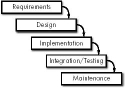
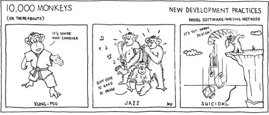
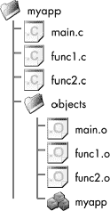

# 第 VI 部分。从高处看

空气越来越稀薄，但视野却越来越开阔。在几百页之前，我们从源代码构建的阴暗角落开始我们的旅程。在这个最后一部分，我们通过攀登软件开发之巅，审视下面的领域来完成我们的旅程。我希望你不会害怕高度。

在这里，我们将探讨拼图最后部分的组合方式。

第二十二章

代码食谱：我们如何在开发团队中实际编写软件。本章描述了软件开发方法和软件开发流程。它展示了我们如何以可预测、及时的方式（或者至少尝试这样做）产生程序。

第二十三章

查看不同的代码编写学科：应用程序编程、游戏编程、分布式编程等等。每个编程分支都有其独特的问题和重要的技能。理解这些将使你能够为每种场合编写最合适的代码。

第二十四章

结局就在眼前……这是最后的、泪眼盈盈的告别。我们来看看在继续学习代码工艺的过程中下一步该去哪里。这本书只是个开始。

# 第二十二章。程序配方

### *代码开发方法和流程*

他们总是说时间会改变一切，但实际上你必须自己去改变它们。

-- 安迪·沃霍尔

**配料**

一群程序员（最好是新手）

1-2 茶匙语言

1 个目标平台

1 名项目经理

1 撮运气

1 包脱水训练

各种行业术语

**说明**

在培训中的程序员。加入语言、目标平台，用项目经理调味。快速搅拌至混合均匀。根据口味添加术语。均匀撒上运气，放入热软件烤箱中烹饪至截止日期。取出，倒扣在铁架上，冷却后再交给客户。

我至少知道四种海绵蛋糕的配方。它们根据你想要无脂或无蛋的蛋糕以及你想要准备的方法而有所不同。编写软件就像这样。没有一种配方或魔法公式；同一个系统可以用许多不同的方式构建，没有一种方式必然比其他方式更好。你可以选择不同的配料来滋养开发过程，以及不同的方法来遵循。很可能会产生略微不同的蛋糕；在功能、结构、稳定性、可扩展性、可维护性等方面有所不同。这些配方描述了*软件生命周期*：从软件的最初概念化到其最终退役的各个发展阶段。

作为软件工程师，我们应该能够通过遵循定义的程序来可预测地（并在一定程度上可重复地）创建软件。作为软件工匠，我们应该能够利用特定的开发程序作为工具来帮助打造尽可能优秀的软件。在本章中，我们将探讨一些创建软件的配方；我们将比较、对比、批评，并看看它们如何影响我们的编码方式。

我们编程 ZX spectrum 的方式与现代掌上个人数字助理（PDA）不同，与具有高容量网络界面的主机库存控制系统也不同。我们独自编程的方式与我们在对编程的方式不同，与在由 200 人组成的全球项目团队中编程的方式也不同。目标平台和开发团队（以及他们的经验水平）的差异将塑造配方选择。编程的艺术远不止编辑、编译、链接和运行。

**关键概念**

*优秀的程序员意识到*他们是如何*编程的——塑造他们工作的方法和实践*。

这些编程配方是什么？

# 编程风格

编程风格描述了软件问题是如何被映射出来，以及其解决方案是如何被分解并通过目标语言进行建模的。我们必须*建模*一个解决方案，因为有用的系统不能完全被单个开发者的心智所容纳。编程风格塑造了我们将项目拆分成可管理部分的方式；它是用来表达代码意图的设计范式。

不同的编程语言支持不同的编程风格。有些是为特定的一种定制的；有些则满足多种。编程风格分为两大阵营：*命令式*和*声明式*。

+   命令式（或过程式）语言允许你指定明确的步骤序列以生成程序的输出。这是大多数程序员所习惯的。

+   声明式语言通过推理规则（或函数）来描述变量之间的关系，语言执行器对这些规则应用一些固定的算法以产生结果。（当我们查看函数式和逻辑编程时，这种描述可能变成可理解的英语。）

你选择的编程语言将在一定程度上决定你设计的风格。（然而，选择支持你想要使用的风格的编程语言会更好。）尽管如此，编程语言并不是最终的决定因素。在面向对象的语言中构建结构化代码是完全可能的，就像在任何语言中编写令人讨厌的代码一样。接下来的几节将描述流行的编程风格。

## 结构化编程

这种常见的命令式设计方法应用了*算法分解*——一个将系统分解成部分的过程，每个部分代表更大过程中的一个小步骤。设计决策集中在控制流程上，并创建了一个功能结构的层次。正如迪杰斯特拉观察到的那样，“分层系统似乎具有这样的特性：在较高层次上被视为一个不可分割实体的东西，在较低层次上被视为一个复合对象：因此，当我们从较高层次转向较低层次时，适用于每个层次的空间或时间自然粒度减少了一个数量级。我们用砖块来理解墙壁，用晶体来理解砖块，用分子来理解晶体，等等。”确实，是迪杰斯特拉的奠基性论文“Go To Statement Considered Harmful”使结构化编程流行起来。（迪杰斯特拉 68）

结构化编程是一个以控制为中心的模型，并遵循自顶向下的设计技术。你从整个程序的概念出发（例如，`do_shopping`）。然后将其分解成顺序子块（例如，`get_shopping_list`、`leave_house`、`walk_to_shop`、`collect_items`、`pay_at_checkout`、`return_to_house`、`put_shopping_away`）。然后，每个子块被进一步分解，直到达到可以轻松在代码中实现的水平。这些块被组装成一个整体，设计完成。

结构化方法的影响是：

+   分解的每一步都应该在程序员的智力理解范围内。（迪杰斯特拉说：“我现在建议我们将自己限制在智力可管理的程序的设计和实现上。”）

+   控制流程应谨慎管理：避免使用令人恐惧的`goto`语句（代码中向某个任意位置的未结构化跳转），而应优先考虑函数只有一个入口和一个出口点（这被称为*SESE 代码*）。

+   循环结构和条件语句在功能块中使用，以提供代码结构。从循环中间或嵌套代码块中跳出的短路跳转与`goto`一样受到鄙视。

常见的结构化编程语言有 C、Pascal、BASIC，以及更古老的 Fortran 和 COBOL。大多数其他命令式语言都可以轻松地用来编写结构化代码，尽管这不是它们的设计专长；结构化程序员通常在采用新时尚语言时不会采用新的惯用语。^[[1]

## 面向对象编程

波斯描述面向对象编程为：“一种实现方法，其中程序被组织为协作的对象集合，每个对象代表某个类的实例，并且这些类都是通过继承关系联合起来的类层次结构中的成员。”（波斯 94）这是另一种命令式风格，但它允许我们在代码设计中更自然地模拟世界；我们关注被模拟的交互实体，而不是特定的执行流程概念。

这是一个非常以数据为中心的模型（与结构化编程的过程中心视角相反）。我们思考我们的数据生活以及它的移动方式，而不是完成任务所需的步骤序列。对象（数据）具有行为（它们做事情）和状态（当它们做事情时发生变化）。这是通过在对象的**类**上实现**方法**在语言级别上实现的。我们将面向对象程序视为协作的软件组件集合，而不是作为单一的 CPU 指令列表。面向对象设计使我们能够有效地模拟更大的系统。

面向对象编程利用以下计算机科学概念：

**抽象**

选择性无知的艺术——抽象使我们能够设计代码，使控制层次可以忽略下面的血腥实现细节。谁在乎`get_next_item`是否在列表中进行二分搜索，索引数组，或者给法兰克福打电话？它返回下一个项目（无论是什么），这就是调用代码需要关心的所有内容。

迪杰斯特拉早期对层次结构的阐述——回去再读一遍——揭示了一种抽象形式。

**封装**

封装是将执行单元的紧密绑定包放置在一个只能通过定义良好的 API（代码胶囊）访问的包中：一个代码胶囊。该胶囊的用户只能调用定义好的 API，不能直接篡改内部状态。这提供了一个清晰的关注点分离，帮助我们思考形而上学问题，如**什么是对象**？，并提供了一些保证，即当您不在看的时候，没有恶意的程序员会篡改您的内部结构。

**继承**

一种创建对象类型的机制，它是父对象的专业版本。考虑一个名为`Shape`的父类型，它有继承的子类型`Square`、`Circle`和`Triangle`。继承类型提供了更多细节，专门化行为（例如，知道形状的确切边数）。像任何其他编程概念一样，继承可以被滥用以创建难以理解、令人惊讶的程序，或者被利用来创建逻辑上合理、优雅的代码。好的面向对象程序员知道如何创建适当的继承层次结构。

**多态**

这允许相同的代码根据它在运行时的上下文使用不同的底层数据类型（大多数面向对象编程语言称为*类*）。这种技术强调的是针对显式定义的接口进行编程，而不是针对隐式实现——多态在编写代码时提供了明确的关注点分离。有两种类型的多态，*动态*和*静态*。

动态多态，正如其名所示，根据操作数或目标对象的类型，在运行时确定要执行的实际操作。这通常利用继承层次结构：处理`Shape`类型的客户端可能目前正使用`Square`或`Triangle`对象——具体使用哪个对象是在运行时确定的。

静态多态在编译时确定要运行的精确代码。提供静态多态的语言特性包括：*函数重载*（具有相同名称的函数接受不同的参数列表——编译器根据提供的参数推断出要调用的正确函数）、*运算符重载*（你可以定义类型上的某些操作——包括+、!=、<和&——当操作数的类型匹配时调用这些函数），以及像 C++的*模板特化*这样的*泛型编程设施*（你可以根据模板参数类型重载模板）。

这些功能在非面向对象语言中也是可能的，使用非面向对象实践。然而，面向对象语言直接表达它们，面向对象设计利用它们来创建一个统一的系统。

面向对象编程始于 1970 年左右的 Simula，最近由于 C++和 Java 的普及而变得流行。少数纯面向对象编程语言之一是 Smalltalk。如今，面向对象很流行，有众多面向对象的语言；其中一些是结构化语言，带有流行的面向对象功能。

## 函数式编程

这是一种基于类型化*λ演算*的声明式编程风格，是一种更数学化的编程模型。你处理的是值、函数和函数形式。函数式程序通常紧凑且优雅，尽管很少被编译。因此，它们依赖于语言执行器。程序的性能由这些执行器控制——它们可能相当慢且占用内存多。^([2)]

结构化和面向对象（OO）风格在主流使用中比任何声明式语言都更受欢迎，尽管这并不减少这种编程类型的有用性。它们有不同的优点和用途。函数式程序需要与过程方法完全不同的代码设计方法。

常见的函数式编程语言包括 Lisp（尽管它包含非函数式元素）、Scheme、ML 和 Haskell。

## 逻辑编程

这是一种另一种声明式风格，其中你向执行者提供一套公理（规则）和一个目标陈述。一套内置的推理规则（程序员无法控制）被应用于确定公理是否足以确保目标陈述的真实性。程序执行本质上是对目标陈述的证明。

对人工智能的兴趣极大地推动了逻辑编程语言的发展。它们被广泛用于自动定理证明和在*专家系统*（它们模拟大型问题域并根据积累的知识库生成特定答案）中。

最著名的逻辑编程语言是 Prolog。

* * *

^([1]) 这并不一定是一件坏事，除非程序员认为他在没有改变代码设计方式的情况下已经超越了结构化编程。

^([2]) 这不是仅由声明式语言（例如 Java 有一个执行器，JVM）遇到的问题。然而，相对较少的优化工作投入到声明式语言的执行器中——它们更常由学术机构而不是富有的公司支持。

# 食谱：如何和是什么

我们将研究两个不同的方面。软件“食谱”采用*开发过程*和*编程风格*。这两个是分开的，也是相连的：

+   这个过程是更大的图景：它描述了构建软件所采取的步骤。这包括整个开发组织，而不仅仅是程序员。大多数软件构建不是一个人的工作；这个过程解释了如何让许多人构建一个连贯的整体。或者至少，它应该尝试这样做。

+   编程风格是更小的图景：它是分解、构建和粘合软件组件的基本方法。它很可能受到开发过程选择的影响，但不必如此.^([3]) 它更有可能受到目标语言或设计者的先前经验的影响。

你会看到这两个构建方面都被称为方法论，所以很容易混淆它们.^([4]) 我们将依次探讨风格和开发过程。了解不同的开发方法很重要，这可以给你一个更好的编程世界观，并帮助你选择一个过程，如果你有机会的话。

**关键概念**

*我们的软件开发努力受到我们采用的*风格*和*过程*的影响。这些不可避免地影响了我们代码的形状和质量*。

以下几节并不提供这些主题的教科书描述；它们提供了一个适当的手势性概述，以帮助我们比较和对比。如果你需要或想要更多细节，你可以轻松地找到一本核心软件工程教科书。

* * *

^([3]) 例如，面向对象风格通常在“迭代和增量”过程中被选择；这主要是一种惯例。（如果你不知道这是什么意思，*不要慌张*！所有这些都会在第 432 页的"迭代和增量开发"中解释。）

^([4]) 如果你想做出区分，那么我所说的编程风格通常被称为方法（小写 m）。开发过程通常被称为方法（大写 M）；一种高教会/低教会分类。这太微妙了。在本章中，我将坚持使用风格和过程。

# 开发过程

有多少人想发明它们，就有多少种开发过程。许多是基本开发模型的一两个轻微演变。我们将在这里查看这些基本变体。其中一些非常相关，正如你将看到的。

您选择的发展过程决定了项目如何规划，工作如何在阶段之间流动，以及项目团队如何互动。过程沿着多个轴变化：

**繁重/轻量级**

*繁重的开发过程*是重量级的，官僚主义的。它产生了大量的文件工作，规范了开发者的行为，并假设了某种团队结构。它以 ISO 9000 组织模型为特征，其中每个工作程序都详细地、盲目地记录下来，而不考虑该过程是否有缺陷或是否适当。

在过程光谱的另一端，*轻量级的开发过程*摒弃了不必要的官僚主义，更倾向于更精简、以人为本的原则。在第 433 页的"敏捷方法"中描述的敏捷过程，是围绕轻量级实践构建的。

**顺序**

一些开发过程合理地认识到世界不是一个可预测的地方，并试图通过在过程循环周围运行多个迭代来对此进行建模和规划。这为开发者提供了将一次迭代中的反馈纳入下一次工作的机会。他们可以适应软件开发过程中发生的自然变化（如变化的需求、意外遇到的问题等）。

其他过程更加规范和线性——预测从一阶段到下一阶段的正式发展进程。它们涉及大量的前期规划工作，并试图详细预见未来。这些预测使得在开发后期改变方向变得困难。

**设计方向**

*自上而下的设计*从最初的不详细概述创建系统。每个顶级包被细化并分解为子组件。这个过程迭代，直到软件被充分指定，可以开始工作。自上而下的设计强调规划和对最终系统的良好理解，并假设在途中很少有需求发生变化。

相反，*自下而上的设计*详细指定系统的各个部分，然后确定如何将它们连接起来以形成一个统一的整体。这有助于我们在新的设计中利用现有的软件组件。现代流程倾向于融合这两个截然相反的方法——需要有一个关于整个系统的概念来开始初步规划，然后通过识别和编码低级组件和对象来推进设计。

没有一种开发流程比其他任何一种更好。对于这些轴上的任何一个正确的位置，都持有极端的宗教观点。任何项目的正确方法是由许多因素决定的，包括组织的开发文化、正在开发的产品类型以及开发团队的经验。

现在，请系好安全带，准备我们的软件开发生命周期之旅。紧紧抓住。

## 临时性的

这是一个起点，但实际上是一个反流程。这里没有流程，或者流程没有文档记录。每个人都按照自己的议程工作，没有人知道别人在做什么，希望最终能产生一些有用的东西。也许你的团队工作方式就像图 22-1？

如果一个组织不知道如何构建软件，那么它处于不可饶恕的状态，即使它是一个小组织，并且它认为不需要流程。在这种状态下，没有保证软件会按时交付，因为没有问责制。谁能保证所有功能都会实现？

许多开源软件都是使用这种方法创建的.^([5]) 如果你有无穷多的猴子和无穷多的计算机，你最终可能会得到一个程序——然而等待必要的无穷长时间是不切实际的。即使是便条设计也是向更正式、可预测的开发过程迈出的一步。

**关键概念**

*没有开发流程，你的团队处于无序状态。你的软件将是由运气产生，而不是有目的地产生*。

这个案例是开发无序。个别程序员可能非常努力工作，他们的英雄行为最终可能产生有价值的东西。但这种结果并不能被严重依赖。团队可能非常低效，并且可能永远不会交付有价值的东西。


**图 22-1. 工程发布**

## 水晶球模型

**瀑布模型**是经典的软件开发生命周期模型。它因其简单性（甚至被认为是过时的）而受到很多批评。然而，实际上其他每个开发流程都以某种方式基于它。它有许多缺陷，但仍然是过程研究中的教学起点。它是根据更传统的工程生命周期模型构建的，由 W.W. Royce 在 1970 年描述。（Royce 70）它是开发流程中最可预测的。

**开发阶段**

水晶模型描述了软件开发过程生命周期中的五个阶段。

许多其他流程识别出相同的阶段，但它们的顺序不同或改变了它们的相对重点。

**需求分析**

首先，确定软件项目的需求。这确定了其目标、它将提供的服务以及它需要在其内工作的约束。这一步骤通常在启动项目之前进行可行性研究，或者可行性研究是在同一时间进行的。可行性研究提出诸如：*这个项目能行吗？我们应该开发这个软件吗？有哪些替代方案？*等问题。

**设计和规范**

从第一阶段产生的既定需求被转换为软件或硬件需求。然后，软件需求被转换成可以在计算机程序中轻松实现的形式，可能通过将其拆分为单独开发的组件。

**实施**

这就是创建程序的地方。每个程序或子组件都是一个单元，并且会进行单元测试。单元测试确保每个单元都满足在之前步骤中定义的规格。

**集成和测试**

所有单元都被组合在一起，整个系统进行测试。我们测试代码是否正确集成，整个系统是否按预期运行，以及它是否实现了所有系统需求。当成功测试后，软件被认为是完整的。

**维护**

最后，产品被交付。我们永远不应该假设软件在发货时就完成了；这样做是幼稚的。软件生命周期中最大的阶段是*维护*（参见第 288 页的“现有代码的维护”）。将会有需要修复的错误、需要满足的未注意到的需求、原始需求的演变，以及为在野外部署的软件提供的其他产品支持工作。

这是一个简单的想法；开发过程被分解为多个阶段，这些阶段依次运行。这被比作瀑布，因为从一个阶段到另一个阶段的稳定、不可逆的流动。就像水总是流向河流一样，开发总是通过每个阶段向下流动到发布。

传统的瀑布模型在图 22-2 中展示。^([6]) 你可以看到五个标准阶段；这些在"开发阶段"文本框中有描述。一旦一个阶段成功完成，就会通过某种*关卡过程*（通常是审查会议）进入下一个阶段。大多数阶段的输出是一个文档；一个需求规范，一个设计规范，或者类似的东西。如果审查发现错误或问题，它会被反馈到上游，使该阶段再次回退。

按照这个模型，你很难回溯进行更改；这就像鲑鱼花费大量时间和能量逆流而上。虽然鲑鱼在基因上被编程来做这件事，但程序员不是。这意味着在开发后期进行更改时，这个过程并不有帮助。需求必须在系统设计之前确定，并且在过程开始后很难容纳太多的变更。通常，设计阶段的问题直到系统测试时才会被发现。

然而，就其辩护而言，它易于管理——至少在概念上是这样——并且是大多数其他开发模型的基础。瀑布模型不适合非常大的项目；对于两周的项目来说效果很好。其他开发模型通过在大型项目的生命周期中运行许多较小的瀑布来利用这一点。



**图 22-2.传统的瀑布模型**

## SSADM 和 PRINCE

虽然*SSADM*听起来像是只有成年人参与的开发，但它实际上代表的是*结构化系统分析与设计方法*。它是一种遵循瀑布方法的严格和结构化的方法，可能是你遇到的最有规律的瀑布变体。

它涵盖了分析和设计，而不是实现和测试，是一个定义良好的开放标准，在英国政府机构中被广泛使用。SSADM 由五个主要步骤（每个步骤又细分为许多其他程序）组成，就我们的目的而言，这些步骤是自我描述的：

+   可行性研究

+   需求分析

+   需求规范

+   逻辑系统规范

+   物理设计

*受控环境中的项目（PRINCE）*及其富有创意命名的继任者，*PRINCE2*，分别于 1989 年和 1996 年创建，以取代 SSADM。与 SSADM 一样，它们定义了一个重量级、以文档为中心的模型。它们列出了可以遵循的正规步骤（这次分为八个单独的阶段），以生产产品，旨在满足已识别的需求和质量标准。

## V 模型

这个过程模型源于经典瀑布模型，是为了规范德国政府和军事部门内的软件开发流程而开发的。它与瀑布模型有很多共同之处（包括倾向于吸引批评），但它不是将过程建模为瀑布，而是将其可视化为一个*V*，如图图 22-3 所示。


**图 22-3. V 模型**

在左侧，我们看到软件开发阶段，直到软件构建：规划、设计和实施工作。右侧的流程控制测试和批准。7] 每个测试级别的工作都是与从相应的左侧阶段生成的规范进行衡量的。

V 模型与瀑布模型的不同之处不仅仅是图表的方向。测试阶段（在右侧分支）可以与开发工作（左侧分支）并行开始，并且被赋予同等的重要性。这是好的，因为：

+   传统上，在项目即将结束时，测试会被压缩。这是危险的。强调测试作为开发过程的关键环节，突出了这一事实，并有助于确保产品质量。

+   我们应该始终测试比最终软件更多的内容：从需求规格说明到完成的软件的所有开发阶段，都要进行审查和验证。V 模型强调了这一点。

+   在现实世界中，测试和错误修复通常占项目总时间的一半以上。瀑布模型并不能准确反映这一点。

+   这个模型可以从整个开发过程中节省时间，因为测试计划可以在每个开发阶段完成后立即制定。这种简化和并行化的工作将提前项目的结束日期，因为我们不需要等待瀑布模型的实施阶段结束才开始测试活动。

## 原型

尽管我们在软件开发流程方面有多年研究和经验，但瀑布模型仍然是一个标准的参考模型，因为它具有清晰的逻辑——显然，在需求分析或任何设计工作之前，你不能进行有用的实施。然而，瀑布模型使得在开发完成之前很难评估软件系统。同样，直到集成阶段完成并且系统准备进行 alpha 测试之前，也很难向客户展示软件。

*原型方法*试图克服这一限制。它有助于在开发过程中探索和评估实施，并细化未知或模糊的需求（用户永远不知道他们*真正*想要什么）。

原型过程的本质是创建软件系统的多个可丢弃原型。每个原型都会被评估，展示给客户，并使用客户反馈来塑造下一个原型。这个过程会一直持续到对开发并部署真实产品有足够的了解。

我们在这里看到了与其他行业的类比。如果你在开发一款新车，你会创建许多原型，直到找到完全正确的设计。我们希望我们的软件也能做到这一点。然而，有一个重要的区别必须注意。在制造汽车时，主要成本在于制造，而不是开发。软件的情况正好相反。你可以免费制作代码的多个副本；开发才是成本高昂的部分。因此，原型周期需要得到控制；它不能无限次地重复。

**原型之痛**

发布原型可能会引起严重的维护问题。

我为一家只有使用一个 GUI 库为其 Java 前端服务的公司工作过。但在实践中，它有一些系统使用了这个库，而有些则没有。每当出现错误时，维护程序员不得不跳过许多障碍来找出前端代码在做什么。他们不了解其他 GUI 库，而且他们经常引入更多的问题。这种情况发生得越多，公司的产品就越不受尊重。

并不需要进行太多的软件考古就能发现这个问题的原因：没有使用正确 GUI 库的前端已经变成了“意外”的产品。花点时间发布正确的代码，就可以节省后续数月的工作，而且不会破坏公司的声誉。

原型是用高级语言快速开发的。有时它们只是简单地绘制出来：使用自动化工具支持^([8])可以极大地加快原型生产。这些原型是概念验证，因此效率、稳定性或完整的功能集不是首要关注的问题。因此，原型设计最适合那些注重用户界面的系统。

原型帮助我们管理风险。我们可以使用它们来确保客户确实想要他们所说的东西。我们还可以使用原型来探索新技术或检查我们的设计决策是否能经得起实际使用。

原型设计的危险在于继续开发低效、快速生产、没有充分考虑的原型代码，并将其开发成真正的发布版本。当项目时间紧迫，实际开发可能不符合进度时，这种情况尤其如此。没有教育，客户会混淆原型和最终产品，并惊讶于完成软件需要更长的时间。它需要非常谨慎的管理才能工作。避免这种问题的最好方法是故意让原型边缘粗糙，并且永远不要让它们接近可发布的状态。功能过多的原型不是原型！

## 迭代与增量开发

所有关于瀑布方法最近的发展基本上都是主题的变体。主要的改进是以迭代和增量的方式进行开发。也就是说，许多次（迭代）围绕一个小型开发生命周期的连续运行（增量），每个周期都会向系统中添加更多和更多的功能，直到它完整。小型生命周期的每次运行通常遵循瀑布模型，可能持续几周或几个月（取决于项目的规模）。因此，瀑布的每个阶段都会执行多次。每个迭代的结束时都会有一个软件发布。

增量开发既不是自顶向下的方法，也不是自底向上的方法。每次代码发布都会创建一个完整的代码版本，包括所有必需的高层和底层组件。在每次迭代中，系统都会增长，后续的设计工作可以基于现有的设计和实现进行。这里与原型设计有相似之处，但我们并不专注于快速演示的快速破解。采用这种方法，每个阶段都更简单，更容易管理——并且进度更容易监控；你知道系统已经构建和集成了多少。

这种流程对于在开始时对需求理解不充分的项目来说效果很好。让我们面对现实：这包括现实世界中大多数项目。它更能适应变化，并且可以节省在瀑布方法中会遇到的长篇大论的重设计和重实现。迭代和增量开发之所以有效，是因为它符合软件开发的基本性质，因此有助于我们更好地控制固有的混乱。由于迭代周期较短，有更多的机会进行反馈和纠正；你不必等到项目结束时才知道它失败了。

## 螺旋模型

Barry Boehm 于 1988 年提出的**螺旋模型**是迭代和增量方法的良好示例。9 开发过程被模拟为一个螺旋，就像图 22-4 所示。它从中心开始，向外扩展到过程的后期阶段。我们开始对系统的非常粗略的概念进行工作，随着时间的推移变得越来越详细，当我们进入螺旋的后期阶段。螺旋的每个 360 度旋转都意味着我们经历了一次单一的水晶瀑布，并且每个迭代通常持续六个月到两年。

特性按优先级递减的顺序定义和实现；最重要的功能尽可能早地创建。这是一种管理风险的方法；它更安全，因为随着你接近交付日期，你可以确信大多数系统已经完成。实际上，这是一种非常务实的方法；程序员不会将 80%的时间花在系统那 20%的琐碎（但有趣）的部分上。


**图 22-4. 螺旋模型**

Boehm 将螺旋分为四个象限或四个不同的阶段：

**目标设定**

为此阶段确定具体目标。

**风险评估和降低**

确定并分析关键风险，并寻求信息以降低这些风险。

**开发和验证**

为下一阶段开发选择一个合适的模型。

**规划**

项目被审查，并为螺旋模型的下一轮制定计划。

## 敏捷方法论

这些方法论是在对官僚主义和重量级方法论的反动中发展起来的，这些方法论试图将软件开发过程束缚起来。敏捷实践者观察到软件开发难以被转化为一个可预测的过程；他们声称这与既定的工程程序，如建造桥梁，**非常不同**。10 过时的、宏伟的方法论只会妨碍人们编写好的软件，因此它们应该被摒弃。

**敏捷方法论**是一个总称，描述了包括备受瞩目的极限编程、Crystal Clear 和 Scrum 在内的许多开发过程。敏捷过程侧重于灵活性和风险降低，而不是长期规划或强制（假装有）可预测性。

敏捷过程共享以下核心原则：

+   通过执行许多小的迭代开发周期来最小化风险。在每个周期结束时，软件和所有过程工件都是完整、一致且可发布的质量。尽管软件很少**真正**发布，但它可以被传递给客户进行审查和评论。这给客户提供了团队进展的保证。

    敏捷过程迭代通常比迭代和增量过程循环要小得多（通常持续几周，而不是几个月）。

+   通过在开发结束时进行漫长的测试周期，而不是更加强调一套持续运行的自动化回归测试，来最小化风险。

+   减少那些困扰着重量级过程的文档。敏捷过程将代码本身视为设计和实现文档。好的代码可以自给自足，不需要被官僚主义的文档流程所拖累。

+   强调人员，并努力促进沟通，最好是面对面而不是通过文档。这样可以使客户（或客户代表）尽可能接近开发团队，以便参与实施和优先级决策。

+   将*工作软件*视为衡量进度和性能的标准，而不是规格编写或管理者对团队在虚构的开发周期中位置的看法。开发者会在开发过程中遇到问题，并通过修改代码来应对变化。

敏捷方法并不总是适用。它最适合于较小的项目，拥有不到 10 名地理上集中在一起的高质量程序员的小团队。敏捷过程在需求变化程度高的领域表现卓越。在具有重过程文化的公司中很难运行。

## 其他开发过程

存在许多其他开发过程：这些主题的变体，每个都有其独特的特点。有修改后的瀑布流程，它重叠某些阶段或包含子项目，作为迷你瀑布进行管理。*进化原型*方法从初始概念开始，设计和实现一个原型，迭代地改进原型，直到它被接受，然后发布这个原型，也许计划在过程中包括一些可丢弃的原型。

*分阶段交付*遵循一个顺序过程，直到架构设计，然后实现单独的组件，在完成每个组件时向客户展示，如果需要，返回到之前的发展步骤。*进化交付*基本上是进化原型和分阶段交付之间的结合。

快速应用开发（RAD）强调用户参与和小的开发团队，并且大量使用原型和自动化工具。与其他流程略有不同，开发时间表在前期确定，并被认为是不可移动的。然后尽可能地将尽可能多的功能纳入设计，以适应截止日期——某些功能可能需要牺牲。

*理性统一过程（RUP）* 是一种著名的商业方法论，源于 Ivar Jacobson 的 1987 年 *Objectory Process*。它是一个重量级但灵活的面向对象过程，高度依赖于 UML 图，具有 *用例驱动设计*（一个用例描述单个用户活动或与软件系统的交互）。它倾向于迭代开发、持续测试和细致的变化管理。作为一个商业过程，它由一系列商业工具支持。

* * *

^([5]) 在那里，也许这并不那么重要，因为没有付费客户和正式的需求集——许多开源软件的开发是因为程序员想要这样做。然而，将一些开发过程应用于临时性的开源工作几乎肯定会产生更好的程序。

^([6]) 这是对罗伊斯原始论文的一种常见简化。罗伊斯 *确实* 允许在瀑布中向上反馈，但并没有积极鼓励这样做。热情的管理者认为软件开发是一个严格的线性过程，很快就去掉了这些上游路径；瀑布被玷污了。

^([7]) 注意开发流程是如何向下流动的，就像瀑布一样，但测试被视为一项向上的努力——这是软件开发的一个相当准确的模型！

^([8]) 例如，具有简单 GUI 构建器的 *快速应用开发（RAD）* 工具。

^([9]) 伯姆的过程并不是第一个迭代模型，但他是最先推广并强调迭代重要性的。

^([10]) 这是一个宗教般的辩论：许多程序员认为 *确实* 可以使软件开发过程变得可重复、可预测，但行业目前还不够成熟或不够自律来实现这一点。

# 已经足够了！

如果你读到这儿还没有感到厌烦，那么你做得很好。最后，也许更重要的是，我们能从所有这些中提取哪些关键点？一个软件工匠对开发过程和编程风格有良好的工作理解，但任何人都可以从正确的书籍中获得这些知识。我们如何将这些知识有用地应用到我们的工作中？它如何提高我们的技能集？

所有这些过程都存在一些共同点。第 428 页上描述的 "开发阶段" 在每个过程中都存在。这些过程真正不同的是这些阶段的长度和相对位置。每个活动对于生产高质量的软件都是至关重要的。更好的过程确保测试不会被当作事后考虑，而是在整个开发过程中持续进行并得到监控。

比较或评估不同的流程和编程风格是件困难的事情。哪一种最好？哪一种能确保按时且在预算内交付高质量的产品？没有答案，因为这些问题本身就不正确。适合的流程取决于项目的性质和公司的文化。如果你有 20 个程序员，他们对面向对象开发一无所知，而且只使用 C 语言，那么试图构建一个面向对象的 Java 产品显然是个愚蠢的想法。

**关键概念**

*你选择软件配方的原因有很多——确保它们是好的。你对流程选择动机的说明在很大程度上反映了你组织的成熟度*。

我们可以看到两种流程的极端：临时方法的混乱与严格流程的严格制度形成对比。在后一种情况下，任何可能产生更优雅架构的实验都被禁止。用户的真实需求可能永远不会过滤到开发者那里，因为它们迷失在官僚主义的海洋中；程序员只是根据从上一个流程阶段传来的规格进行编码。

按照*金发姑娘原则*，最灵活的方法通常介于两者之间。你需要*知道*你正在遵循的流程以及它在哪定义。有效的开发需要纪律；你需要一个连贯的策略来确保按时交付产品（拥有一个现实的进度表也是另一个话题——参见第 409 页的"规划游戏"）。经验丰富的程序员知道他们开发流程的价值，以及其中的缺陷。他们知道如何与之合作，何时跳出框架。优秀的程序员不仅仅是编程。他们理解他们的方法，并知道如何根据适当的情况进行适应。这就是我们的科学仍然是一门手艺的原因。

重要的是不要对遵循的流程过于紧张和教条，但你必须有一个达成共识的软件生产框架。它必须适合你的开发团队——并不是每个组织都需要一个仪式感强、有许多圈套和障碍需要克服、以及需要填写冗长表格的高仪式流程。

**关键概念**

*你采用的流程不必是仪式感强且难以遵循的。事实上，相反的特征通常是良好流程的标志。尽管如此，你必须有一个定义明确的流程*。

新的方法论时不时地出现（或者更确切地说，是演变）。它们往往伴随着巨大的宣传和烟花般的炒作；它们被宣称为银弹，是万应良药，将使我们的后代和孙后代的发展变得更好。遗憾的是，情况并非如此。归根结底，无论遵循哪种生命周期，编程团队的质量仅取决于其程序员。如果没有直觉、没有灵感、没有经验和没有动力，那么，无论使用哪种开发过程，你都无法可靠地编写出高质量的代码。你可能会更好地跟踪进度落后多少。

# 选择一个过程

许多因素有助于选择合适的开发过程。然而，选择很少基于合理的理由；使用开发过程是因为*这是我们一贯的做法*，*它足够有效*，或者*它是我们能想到的第一件事*。

你如何知道哪种开发方法适合？最终，如果这个过程对你的团队有效——如果你能很好地协作并在规定时间内交付高质量的软件——那么你就有了一个好的开发方法。

选择合适的过程取决于项目的类型和规模。对现有代码库的小修改不需要大型的迭代开发周期；从零开始的三年工业项目可能需要。好的过程选择适合现有团队成员的经验，让开发者愿意（甚至渴望）使用它，并且是项目经理真正理解的东西。

反之，选择开发过程有许多不良的理由。仅仅因为想要改变而转向新的过程是没有意义的；新的过程必须引入以解决当前开发模型中的问题。试图做出政治声明（我知道有些人试图培养开放的开发文化，只是为了推动组织开源其内部代码库）也是没有意义的。选择特定过程的最终不良动机是时尚。更多的 buzzwords 并不一定意味着更有效的过程。

这*确实*很重要：不合适的过程真的会破坏代码的质量；你将花费更多的时间去迎合程序化紧身衣的需求，而不是交付软件。一个好的过程不会妨碍你。实际上，它使你的团队能够更快、更好地创建更多软件。

**关键概念**

*过程至关重要。大多数项目失败的原因是非技术性的。而且，不良的过程几乎总是原因列表中的首要因素*。

# 简而言之

构建软件就像犯罪：有组织的时候会更好。偶尔，一个无纪律的团队会完成一些惊人的事情，创造出软件杰作。然而，那*确实是例外*。开发过程需要被定义、理解，并由具备适当技能的团队成员执行，才有机会有效工作。否则，你最终会得到一个像犯罪一样的软件。

我们需要使用经过验证的开发过程和建立的设计风格，以便我们能够在时间表、预算和不断变化的需求背景下构建满足预期的软件。构建软件是困难的——我们刚刚看到了另一种使其更容易的方法。

| 精通编程的程序员... | 编程不好的程序员... |
| --- | --- |

|

+   理解他们预期工作的编程风格和开发过程

+   利用他们的开发过程来塑造与其他软件工厂居民的互动；当过程变得限制性时，他们会规避它

+   评估不同开发方案的优缺点，并能够为任何特定情况选择合适的方案

|

+   忽略开发过程问题，试图以自己的方式做事

+   不知道过程如何塑造他们与其他开发者的互动

+   避免思考这类事情——*这是经理们需要担心的事情*

|

# 相关内容

第八章

测试是开发过程中的关键阶段。通常，现实世界截止日期的压力试图挤压出它的空间。

第十七章

团队合作：大规模软件开发的基础。

第十九章

规范通常是开发过程各个阶段之间的门槛。



# 开始思考

关于这些问题的详细讨论可以在第 553 页的"附录 A"部分找到。

## 沉思

1.  编程风格和开发过程的选择如何相互影响？

1.  哪种编程风格是最好的？

1.  哪种开发过程是最好的？

1.  本章中列出的每个开发过程在"开发过程"第 425 页中我们看到的分类轴上处于什么位置？

1.  如果开发过程和编程风格是配方，那么软件开发食谱会是什么样的？

1.  使用合适的过程，软件构建能否变成一个可预测、可重复的任务？

## 个人化

1.  你目前使用的是哪种开发过程和编程语言风格？

    1.  是否已经由开发团队正式同意，或者你是按照惯例使用它？

    1.  它是如何被选择的？是专门为这个项目选择的，还是你总是使用的配方？

    1.  它是否被记录在某个地方？

    1.  团队是否坚持流程？当问题出现，你背靠墙壁时，你是否维持流程，还是在匆忙中忽视所有象牙塔理论，只为了生产出一些东西——任何东西？

1.  你当前的过程和风格是否合适？这是你现在开发软件的最佳方式吗？

1.  你的组织是否意识到还有其他可能值得调查的开发模型？

# 第二十三章。外延

### *不同的编程学科*

我们对他人感到的一切烦恼都可以引导我们了解自己。

--卡尔·荣格

我喜欢广泛的概括和脆弱的隐喻。起诉我吧。我还在做我的研究。我发现我居住的城市有 40 多个教堂。每个教堂都有细微的差别；不同类型的人参加，他们做不同的事情。他们有不同的关注点和工作方式。他们位于不同的地区。然而，他们都在做大致相同的事情。

*这究竟与编程有什么关系？* 你可能会问。如果你原谅这种脆弱的联系，软件开发基本上是以相同的方式进行。好吧，我们不是每个星期天早上都走进一栋大楼（嗯，我们中的大多数人不是）。但是，对于局外人来说，我们似乎在进行一些奇怪的仪式，召唤一些神秘的仪式来控制那些超出正常人类控制范围的事物。

然而，我真正得出的结论是，没有一种编程方式，没有一种解决所有问题的单一方法。没有一种编程语言。有许多不同领域的问题需要解决，涉及许多不同的领域。每个领域的工作都不仅仅取决于技术（即哪些工具和代码库可用）；它们还取决于技术。每个领域都需要不同的技能集，特定的思维方式，以及微妙不同的工作方式。这些差异可能看起来很小，但如果没有特定类型系统的编程经验，就无法替代——如果有，程序员的招聘广告将会更加模糊。了解你的领域并欣赏其独特的关注点非常重要。在特定的编程领域中，工匠知道如何运用他的技艺，如何处理他的媒介，以及如何最好地使用他的工具。

**关键概念**

*编程有多种类型，涉及不同的问题领域。每种类型都提出了其独特的问题，并需要特定的技能和经验*。

在本章中，我们将探讨这一点。我们将对计算机编程这个广阔的领域进行一次有指导性的游览，发现我们编程的一些常见问题领域，了解它们之间的差异，并学习每个领域的特定问题和挑战。

这些领域中有一些是重叠的。这是自然的。没有什么事情会像你想象的那样清晰。以下描述必然是概括性的，因为每个领域都是一个很大的领域，其中有很多变化。尽管如此，这应该能让你对那里发生的事情有一个大致的了解。

# 应用程序编程

当你提到“编程”这个词时，大多数非技术人员会想到这个。这可能是我们在本章中考虑的最广泛的类别。

这是指编程**应用程序**——独立的程序——通常用于单用户、工作站式计算机。这个世界关注的是最终用户以及他们如何使用他们的桌面机器。出于商业原因，我们通常针对主流平台——目前是 Windows 和 Mac OS。尽管现在你经常听到关于 Linux 编程的消息，但这仍然不是应用程序工作的领域（至少，在写作的时候是这样）。随着便携式设备的变得更加强大，它们的应用程序开发环境变得更加丰富，移动应用程序工作已经从嵌入式领域（参见第 447 页的“嵌入式编程”（Embedded Programming））转移到这一类更通用的应用程序编程；具体的嵌入式障碍在很大程度上已经被消除。

有许多用于这种工作的语言和环境；C 和 C++很常见。我们还看到 Visual Basic 和 Delphi、Java 和.NET 的普遍使用，以及 MFC 和 Qt 等许多库和框架。这种选择是根据开发者的便利性来决定的——一些足够为人所知并提供所有必需的功能。

自从个人计算机时代开始以来，现代应用程序编程已经迅速发展。我们现在拥有丰富的开发环境，可以工作在其中，并带有有助于自动执行大量繁琐模板代码的框架代码。我们有线程支持、标准用户界面组件库和网络透明度设施。为了使应用程序编程更容易，操作系统提供了大量的支持，但这同时也意味着在开始时有很多东西需要学习。你必须知道很多，才能真正理解你周围发生的事情。

所有这些额外的支持提高了衡量一个好的应用程序的标准。几年前可以接受的应用程序行为现在不再适用。人们期望高质量的、健壮的程序，具有标准界面和外观，良好的响应性，用户友好性（能够应对最无能的用户），以及丰富的功能（即使用户只会利用其中的一小部分）。今天市场上销售的庞大专业应用程序是大型开发团队的结果，这些团队专门关注可用性问题。

我们正在看到向基于网络的系统转变，这些系统在浏览器上运行，通过网络。我们将单独研究它们；这也多少影响了企业或分布式编程领域（参见第 450 页的 "分布式编程"）。

应用程序编程有两个主要市场：shrink-wrap 软件和定制应用程序。

## shrink-wrap 软件

shrink-wrap 软件是为大众市场开发的。它被大量的人使用，或者至少市场营销部门是这样祈祷的。这是关键：市场是投机性的，因此软件必须吸引尽可能广泛的消费者群体以赚钱。由于没有客户委托或支付 shrink-wrap 软件的开发，你必须在开始工作之前建立一个有利可图的市场，否则你就是在浪费时间和精力。软件需要在功能、性能或对问题的独特方法上与竞争产品区分开来。

shrink-wrap 软件可能被作为盒装产品在柜台上购买，这些盒子被透明纸包裹得整整齐齐（因此得名），或者可以从互联网上下载。它甚至可能是一个基于订阅的在线服务。关键点是你如何销售它以及这如何迫使你开发它。

对于 shrink-wrap 应用程序程序员来说，生活是艰难的。你无法控制代码运行的环境。它必须优雅地处理操作系统的所有版本，在不同的机器配置上，安装了不同的库和其他应用程序，并且必须可靠地应对它们。这是一场测试噩梦！Web 应用程序程序员赢得了一半的战斗（我们稍后会看到）——你可以控制服务器部署。但你仍然需要应对浏览器兼容性的头疼问题：你的网页必须在广泛的平台目标上正确渲染。

## 定制应用程序

定制应用程序是根据特定客户的具体需求定制的——为特定客户开发。因此，重点不是那么多的吸引人的用户界面，一个永无止境的功能列表，甚至是为了使其完美无瑕且无错误。没有商业上的必要性去做这些。让它工作。让它发货。让它带来现金。这是一个更确定的商业模式。

由于客户委托这项工作，他们将使用这个软件或者什么都不用。在没有真正竞争的情况下，软件只需要“足够好”。如果给程序员一半的机会，他们会不断调整和改进他们的代码，直到它达到某种神话般的完美状态。但在这个情况下，这样做从商业角度来说并不合理。程序是否运行良好并不重要，但每周崩溃一次；定期重新启动它比进行漫长的错误搜索成本低（假设它不会在崩溃时破坏任何数据）。

**总结**

应用程序工作很有趣。现代个人电脑功能强大，因此你不必太担心代码大小或性能，你可以专注于编写整洁、优雅的代码。知道你的应用程序被全世界成千上万的人使用是一种兴奋的感觉。 ——Steve（一家大公司的应用程序程序员）

**典型产品**

典型的 shrink-wrap 产品是桌面应用程序，如网络浏览器、电子表格等。定制软件可以是任何东西——例如，为大型零售商量身定制的库存管理系统。

**目标平台**

这通常是你进行开发的那种机器（大多数情况下，是一个 x86 Windows PC）。

**开发环境**

你通常会在运行程序的工作站上构建代码。现代 *集成开发环境* (*IDEs*) 提供舒适的工作环境，将编辑器、编译器、调试器和帮助系统结合在一个单一的统一点选界面中。许多第三方组件可用于简化常见任务的开发。这里使用了全系列的语言：从低级的 C/C++，通过 BASIC 和 Java，到脚本语言。

**常见问题和挑战**

用户期望高质量的程序，这些程序符合标准界面原则。比任何人都可能记住的功能要多的是日常事务；这是一个严肃的商业需求，通常也是区分一个产品与下一个产品之间的不同之处。如今，新产品修订通常引入的功能（和错误）比它们可能解决的问题要多。这就是市场需求。

* * *

^([1]) 当然，你在聚会上承认你的工作是做这份工作可能会立即结束对话。嗯，除非这是一个满是书呆子的聚会，在这种情况下，你可能正试图逃离，无论如何！

# 游戏编程

游戏编程这个激动人心且光鲜亮丽的世界是一种特定形式的应用程序工作，通常开发 shrink-wrap 软件。大部分的战斗都是在吸引人的营销和非常好的游戏玩法概念上进行的。这是区分一个伟大、成功的游戏和失败者的细微差别。

这些游戏通常涉及第一人称、大规模、沉浸式、3D 环境。为了提供吸引人的体验，硬件的图形能力被充分利用，CPU 被最大化用于管理地图、敌人和谜题，同时执行移动物体的物理建模。所有这些都必须实时协调，并使硬件达到极限。游戏编程的一个很大部分是优化代码以适应执行平台。随着更快的硬件发布，问题并没有减少；为了与其他游戏脱颖而出，需要更多的优化来从新平台上挤出更好的体验。这个领域非常注重保持前沿，并使用最新的尖端技术来做最酷的事情。

**概览**

专业游戏开发关于乐趣，但这是一个高度竞争的行业，开发者需要跟上最新的技术、紧迫的截止日期和不可协商的最后一刻变更请求。编写软件需要汗水、鲜血和泪水，只为它能在高度批判性的专业媒体面前经受住严酷的公众审视。但回报可能非常丰厚——一旦完成，你创造出的东西就能被人们看到、理解并享受。——Thaddeus（专业游戏程序员）

**典型产品**

第一人称、沉浸式、3D 游戏、策略游戏、在线谜题。

**目标平台**

桌面电脑、游戏机、移动设备（个人数字助理和移动电话）、街机。

**开发环境**

专用游戏平台（包括标准 PC 中的高端显卡）提供了定制的开发环境来帮助充分利用它们的性能。仍然需要非常才华横溢的开发者才能充分利用平台的功能。

**常见问题和挑战**

获得优秀的游戏体验；平衡功能、用户反应、美学、氛围和难度。一款好游戏的发展非常像故事一样，并能吸引玩家。

需要优化以充分利用执行平台。

现代游戏开发团队往往更像好莱坞电影制作团队，而不是标准的会计软件团队。我们看到团队包括图形艺术家、关卡设计师，以及故事板、概念艺术和概念设计的发展。

软件可能针对（经过适当升级的）PC 平台或专用游戏机。这些机器具有特定的硬件来加速每秒所需的许多图形操作，并提供了特殊的工具来帮助你利用它们的性能。游戏机制造商提供开发套件（硬件和定制软件工具的特殊版本）来帮助你创建产品，协助代码加载、测试和调试，同时帮助避免生产硬件上的安全特性，这些特性可能会阻碍开发。

多人游戏提供了更丰富的游戏体验。这引入了网络协作，并需要一些技巧才能从缓慢的互联网连接中获得可接受的真实时间性能。

最终产品的质量取决于游戏体验的感觉。一切都会调整，直到游戏感觉正确：关卡设计、物理模型、图形、内衣的颜色。没有什么是不神圣的。你可能编写了世界上最美丽的代码；程序可能永远不会崩溃；它可能完成了一切它被指定要做的事情；它可能非常高效。但如果它缺乏那种使它成为一个引人入胜、上瘾的游戏的特殊火花，它将不会成功。棘手的事情。

# 系统编程

应用程序位于丰富的系统库之上：用于网络、图形界面、多任务处理、文件访问、多媒体、外围设备控制、进程间通信等代码层。如果应用程序程序员从底层系统获得大量支持，那么就必须有人提供这个底层系统。这就是系统编程。

它通常也适用于工作站，但并不是针对最终用户的。系统软件的目标是应用开发者；面向公众的界面是一套 API，供软件链上更高层的软件层使用。系统软件关注的是与计算机在非常基本的层面上交互的低级逻辑，以及不直接与硬件接口但为系统其他部分提供重要服务的中间层支持框架。

在这个领域的工作通常包括编写设备驱动程序（控制打印机、存储媒体、输出设备等设备）、编写用于管理稀缺资源的通用共享库和实用程序、实现控制计算机的实际操作系统，以及提供文件系统和网络堆栈等组件。编译器和安装工具套件也可以归入此类，因为它们是应用程序程序员的支撑服务，并且通常与程序运行时环境紧密相连。

**概览**

我为一种专有操作系统编写了 USB 堆栈。我必须理解操作系统、USB 硬件和 USB 协议，因此有很多东西要学习。我必须保持性能，以确保系统运行良好。作为中间人，我抽象化了硬件接口，并为应用程序提供了一个整洁的 API。我必须使这个平台无关，这增加了额外的复杂性。——Dave（系统组件编写者）

**典型产品**

操作系统、设备驱动程序、窗口管理器或图形子系统。

**目标平台**

由于每个执行环境都需要某种形式的运行时支持，因此在几乎每个电子设备中都有系统级软件。即使在最小的嵌入式设备和最大的主机计算机中，也需要系统软件。

**开发环境**

编写设备驱动程序和操作系统组件往往会干扰计算机并使系统不稳定，因此通常在一个机器上开发并在第二个系统上运行代码。C 语言在这个领域是最常见的语言，尽管一些库级工作是用其他语言完成的（C++很受欢迎，因为它旨在成为具有系统能力的语言）。

**常见问题和挑战**

关键在于稳定性，因为这些是整个计算环境的基础块。虽然应用程序可能会崩溃，有机会保存工作并优雅地恢复，但设备驱动程序很少有这样的奢侈；它要求在整个运行期间始终正确工作。这可能是一个非常长的时间，所以即使是小的内存泄漏也可能成为主要问题。

代码必须在空间和速度上都足够高效，并且需要根据特定的操作环境进行适当的调整。

# 嵌入式编程

计算机技术无处不在地出现在我们的日常生活中，无论我们是否意识到。我们不断地使用各种设备和小玩意，从微波炉到手表，从收音机到恒温器。这些消费电子产品需要软件来控制和操作。通常情况下，这种软件对设备的用户来说是不可见的。不仅消费电子产品包含嵌入式软件：任何带有微控制器（例如，实验室仪器或发放停车票的机器）的东西都是软件驱动的。我们必须编写嵌入在硬件设备中的程序：嵌入式软件。

嵌入式开发者工作在严格的约束下：

+   通常资源非常有限：有限的 CPU 功率和/或严格的内存限制。内存限制既涉及 ROM（程序映像），也涉及 RAM（代码执行和存储信息的空间）。在容量不大的平台上，你必须将大量软件塞入可用的设备空间。有时这需要相当有创意（和英雄般的）解决方案，比如在运行时动态解压缩程序代码或数据。

+   用户界面的机会相当有限：你如何将所有用户交互压缩到两个按钮和一个 LED 灯中？实际上，可能根本就没有用户界面；可能没有与用户的直接交互——软件预期只是正常工作。

这些限制对您编写的代码的本质产生了深远的影响。遗憾的是，在嵌入式环境中（比其他环境更多），我们最终不得不牺牲代码的纯洁性以实现某种功能。快速且适合设备 ROM 的代码，比神学上正确但庞大且缓慢的软件更重要。

嵌入式系统被设计来执行单一任务，并且要可靠地完成。它应该看起来就像软件不存在一样；嵌入式设备应该始终正常工作。故障很少是可选项；它可能会物理损坏硬件。这与台式计算机形成对比——它是一种通用机器。它必须能够进行文字处理、播放电影、浏览网站、阅读电子邮件、管理账户等等。作为用户，我们已经习惯了接受偶尔的崩溃和一点不稳定。我们会为了性能和灵活性牺牲一点便利。嵌入式工作完全是另一个领域。

一个很好的例子是现代汽车工业。我们看到许多嵌入式系统被用于制造汽车，控制着各种功能：发动机管理、ABS 刹车、安全特性如安全气囊和座椅安全带预紧器、气候控制、里程表等等。然而，用户（在这种情况下是驾驶员和/或乘客）根本不需要意识到引擎盖下有任何微处理器在运转。他们期望汽车能正常工作。当发动机管理系统出现故障时，用户会突然意识到软件的重要性！再想想手机。它们显然是计算机驱动的设备，但很少有消费者把它们当作计算机。我们在这些小包装中放入了大量的力量，但软件仍必须在一个严格的操作限制范围内工作。

嵌入式系统通常是小型计算机、一些专用硬件以及实时操作系统或简单的控制程序的组合。它将直接控制设备上的硬件。嵌入式系统通常是按需定制的：为特定的硬件、特定的目的而开发。简单的嵌入式系统上只运行一个软件；不使用高度复杂的线程编程环境——甚至不使用操作系统。

代码通常存储在固件中，永久保存在只读存储器芯片中。它很少可以更新，所以它必须第一次就正确无误。没有机会出错并发布 1.1 版本。一个简单的错误就可以让你的奇迹产品变成失败。

最近，随着越来越多的大众市场设备被创造出来，内存和 CPU 功率变得便宜多了。嵌入式环境变得更加强大，限制也在扩大。然而，总会有对非常小型的设备的需求，这些设备只需要完成它们需要完成的事情。仅此而已。

你可能会认为为手持设备如 PDA 编写应用程序是嵌入式级别或应用级别的工作，这取决于你的立场。

**总结**

我喜欢在金属附近工作——这真的迫使你思考正在发生的事情。你需要紧凑的代码和对硬件所做事情的深入了解。调试问题可能会很棘手，但正是这些挑战使得它变得有趣。——格雷厄姆（嵌入式软件开发者）

**典型产品**

洗衣机、高保真音响、手机的控制软件。

**目标平台**

小型、定制设备，资源有限，用户界面简陋。

**开发环境**

由于你使用的是定制设备，工具链也通常是定制的。通常，与应用程序程序员的相对奢华相比，它并不非常先进。（随着市场的扩大，我们在这里看到了一些改进。）代码是在交叉编译环境中开发的，目标平台与主机编译环境不同。（显然你无法在洗衣机上编译 C 语言程序……至少目前还不能。）

我们为每个特定设备编写专门的软件。嵌入式编程几乎普遍使用 C 语言，除了真正低级的工作，这些工作会使用汇编语言。C++正在进入这个领域，ADA 语言也被使用过。

**常见问题和挑战**

你可能会遇到各种各样的问题，这很大程度上取决于你是否在使用通用、现成的嵌入式平台，或者是在构建自己的平台。有实时编程的问题（例如，及时处理硬件事件和中断），直接硬件接口，以及控制外围连接的问题，还有诸如字节序和物理内存布局等繁琐的低级问题。

为了确保系统健壮，必须非常重视产品测试.^([02])

* * *

^([02]) 当然，任何好的软件开发——不仅仅是嵌入式工作——都需要非常重视测试。在所有环境中，测试往往因为过于热情的市场营销和管理部门而受到挤压，他们并不真正了解软件的本质。然而，桌面应用程序比嵌入式设备的固件更容易更新。

# 分布式编程

分布式系统由多个计算机组成。正如我们稍后将会看到的，万维网实际上是一个巨大的分布式系统，信息存储在许多跨多个大陆的计算机上，并且通过您的网络浏览器远程提供应用程序。但这并不仅限于网络浏览器。在许多情况下都使用多机架构。与分布式系统一起工作和设计引入了一个全新的问题领域。

你可能需要出于多种原因分发一个软件系统。也许某些类型的计算机比其他类型的计算机更适合特定的任务。也许系统需求很高，你可以通过在网络上许多机器之间共享工作负载来提高性能。也许某些机器有物理位置限制，这要求系统进行分布式。也许你需要将新安装与遗留系统或某些旧硬件进行互操作。

目标是设计一个由不同机器上的多个程序组成的系统，这些程序作为一个统一的整体工作。通过网络连接连接在一起，它们可能物理上位于企业服务器室中，或者分布在全球各地，通过互联网进行通信。

不同的部分需要以某种方式粘合在一起；每个程序都需要进行通信，并且希望能够在远程机器上调用函数，就像它们是本地链接到代码一样。这被称为 *远程过程调用 (RPC)*，并且这种功能由许多可用的 *中间件技术* 提供。这些充当机器间数据传输的经纪人；它们描述了如何发现和与其他机器上的服务进行通信，以及如何发布您的服务供其他程序调用。中间件管理涉及互操作性的策略：存在安全问题（谁允许调用谁？），网络延迟问题（如果远程函数调用耗时过长或计算机崩溃会发生什么？），平衡同步远程函数调用与异步调用的考虑，等等。

一些中间件系统采用面向对象技术；一些则更多地采用过程式方法。中间件仅仅是连接软件，并允许一定程度的平台中立性。只要中间件在某个平台上运行，客户端代码就不必关心它调用的是哪个平台——甚至可能是 ZX spectrum——函数调用看起来都是一样的。当然，在设计分布式系统时，您将为每个任务选择适当的硬件。您不太可能看到 ZX spectrum 四处游荡！

常用的中间件包括 CORBA、Java RMI、微软的 DCOM 和.NET 远程通信。使用这些，我们将系统分为用户界面元素、业务逻辑（真正的代码工作马）和所需的任何存储（例如，数据库和查询引擎）。用户界面客户端可能是一个 GUI 程序或基于 Web 的前端。这是经典的 *分层架构方法*（在 271 页的"客户端/服务器架构”中描述），我们也看到了 *Web API* 的出现——使用标准 Web 协议的服务通信方法。

*网格计算* 和 *集群系统* 是特定的分布式机制，有助于数值编程工作（关于这一点稍后还会详细介绍），能够创建高性能、分布式计算算法。集群是紧密耦合的系统；通常所有机器都在同一个房间，使用相同的硬件和操作系统，通过特定的集群中间件连接。网格是松散耦合的；它们可能在地理上分散，运行异构环境。它们通过标准 Web 协议（例如，HTTP/XML）进行通信。

**概览**

天花项目，于 2003 年完成，是一个网格计算项目，旨在通过筛选大量潜在的药物分子来帮助寻找天花的治疗方法。这是一个由科学家、大学和商业机构合作的项目，确定了 44 种治疗该疾病的有力候选药物。

**典型产品**

在线购物系统，将工作分配给前端应用程序（网页界面、店内自助终端和/或电话订购系统）、业务逻辑（管理库存控制、实现订购系统和安全计费）以及共享存储。

**目标平台**

许多不同的计算机系统通过中间件连接，几乎总是位于标准网络协议之上。

**开发环境**

多样化和复杂。这取决于使用的语言、系统中每台计算机的性质以及使用的中间件类型。远程可调用的接口通常以某种形式的接口定义语言（IDL）定义，并编译成实现语言的表示形式，提供所有调用粘合剂，并为每个函数实现提供插槽。

**常见问题和挑战**

设计计算机间服务正确的分割和简化涉及的通信。这可能会严重影响分布式系统的可扩展性。对于每天只有几笔交易可能有效，但对于每分钟 100 笔交易可能就不高效了。这要求我们精心设计。你还得处理计算机的可用性，并在系统中的某台计算机不可用时优雅地应对。

# 网络应用程序编程

1990 年，蒂姆·伯纳斯-李创建了第一个 HTML 浏览器和服务器，万维网诞生。今天，它是一种无处不在的技术，服务器不仅可以提供静态信息页面，还可以根据在 web 服务器上运行的程序动态创建页面。这是一种非常具体的分布式计算形式，其中用户界面托管在远程客户端上：网络浏览器。

这种应用的例子包括：

+   在线购物

+   公告板、消息服务和基于网络的电子邮件包

+   票务可用性和预订系统

+   互联网搜索引擎

现在大多数人使用网络应用程序而不加思考；这就像使用本地文字处理器一样自然。这些程序显然具有与普通（所谓“富客户端”）桌面应用程序不同的特性。每项都能做得很好。没有英勇的 JavaScript 编码，基于浏览器的应用程序 UI 的交互性会大大受限。

**概览**

一个网络应用程序使你将网络浏览器视为操作系统。所有优秀的网络开发者都是从学习客户端浏览器技术开始的。然后你学习编写良好的服务器端代码（即快速、并发、事务性、分布式和正确）。关于网络最好的事情是它始终在发展，用户的期望总是不断提高。关于网络不好的事情是用户的期望总是不断提高，而你的代码永远不会停滞不前。 ——Alan（网络应用程序程序员）

**典型产品**

需要最新信息和反馈的交互式服务：票务预订或购物系统。

**目标平台**

后端是一个网络服务器（通常是 Apache 或 IIS）。这个选择在你手中，因为你部署了网络应用程序。客户端是网络浏览器，有众多变体。每个都有自己的怪癖，你无法控制使用什么。你必须生成与大多数这些浏览器兼容的网页。

**开发环境**

环境包括特定的网络服务器和你在该服务器上编写的系统应用程序语言。常见的语言有 Perl 和 PHP。

**常见问题和挑战**

应对不同的浏览器；可扩展性。

网络应用程序的操作模型与传统的应用程序编程不同——会话状态存储在远程机器上，该机器必须管理众多同时的客户连接，在 HTTP 交互之间存储它们的状态，并优雅地处理停止连接的客户。为此，一些信息存储在服务器上（例如，每个客户订购的项目存储在数据库中），一些存储在本地客户端上（使用网络浏览器的*cookies*——存储的会话状态的小块来记录当前用户/会话 ID）。像 ASP.NET 和 Java Servlets 这样的框架存在是为了加速网络应用程序的开发。存在许多现成的系统，如内容管理系统和购物车系统。

许多开放标准协议和编码系统被用来表示和传输信息。HTTP 是常见的数据传输机制，XML 通常用于编码数据包（例如，SOAP 是基于 XML 模式的基于 Web 的通信协议）。

网络应用程序程序员面临的问题主要围绕着与可能使用的各种浏览器的互操作性，处理它们的 HTML 特性和奇特的 JavaScript 怪癖。为了应对流行浏览器中的各种缺陷，开发出复杂的 HTML 输出并不罕见。网络程序员经常需要与遗留系统（客户数据库、现有的订单管理系统等）接口以生成信息；这可能会变得相当混乱。可扩展性是一个真正的担忧：一个系统在测试时可能由五个同时用户使用时运行良好。但是当它上线时，它必须能够承受 500 个用户同时访问。*负载测试*在这里很重要（参见第 139 页的“负载测试”）。

# 企业编程

*企业*是那些令人厌烦的流行词汇之一，它漂浮在周围，更多的是管理术语而不是任何程序员方言。企业字面上是一个商业组织。因此，企业编程为整个公司提供系统，将它们各自独立的系统粘合在一起，形成一个统一、协调的整体。企业编程几乎总是意味着大型分布式系统的开发。

它们通常会在公司内部网络（内部网络）上部署，将业务的不同部门连接起来，以提高工作流程。这些系统可能是面向客户的，也可能不是。一旦组织运行了集成的计算机系统，通常不太难实现自动化的客户互动——例如，通过基于网络的商店界面。也许企业系统还需要与其他公司的系统接口，例如跟踪正在运输的货物的交付状态。

企业编程与定制应用软件有很多共同特征。产品只需要“足够好”，因为它是在合同下为特定客户开发的，而不是为了一般市场发布而投机性开发。在这里，质量不是成功的衡量标准（至少是由一般的稳定性和比任何竞争对手都大的功能集所决定的）；满足客户的目标才是。

企业系统是为安装在公司的服务器室或锁定桌面机器上的特定机器编写的。你对执行环境有合理的控制权，因此你不需要担心代码在操作系统的每个版本和每种可能的硬件配置下都能工作。这巧妙地避开了应用程序程序员所遭受的许多头痛问题。

**概览**

我在大城市的一家银行的 IT 部门工作。我们编写软件来解决特定的商业需求。这是至关重要的任务；我们所做的工作对公司利润有真正的影响，因此我们必须认真对待。每小时有成千上万美元通过系统，没有出错的空间。——理查德（企业程序员）

**典型产品**

整个公司的商业系统，管理其商业运营。

**目标平台**

定制的分布式系统。

**开发环境**

与分布式系统相同。我们可能会处理巨大的数据存储，可能是来自以前内部系统（经理们所说的遗留系统）的各种数据库技术。在这里，XML 非常流行。

**常见问题和挑战**

与分布式系统相同。

# 数值编程

这种工作涉及科学性、高度技术性的任务，大量使用数学知识。这是一个非常专业化的领域，需要编写专门针对特定数值问题的应用程序。这些程序通常针对超级计算机，这是最快类型的计算机，能够进行大规模的数值计算操作。尽管我们生活在每年最快计算机都在变化的年代，但这些平台非常昂贵，用于需要巨大数学计算的专业应用。

例如，天气预报需要超级计算机（或者可能是一种预言的天赋！）我们还可以看到超级计算机被用于动画图形、流体动力学计算和其他需要高度复杂数学研究和计算的领域。

超级计算机不是大型机。后者是一种高性能计算机，旨在尽可能并发执行尽可能多的程序，通常在企业环境中用作集中式计算资源。超级计算机将所有力量集中在尽可能快地执行少数几个程序上。有几种不同的超级计算机架构利用不同的技术进步，每种都需要不同的算法方法来充分利用其性能。通用机器现在变得足够强大，可以进行严肃的数值工作——集群化后，它们可以相当体面地成为一个穷人的超级计算机。

数值工作需要高性能算法来快速执行计算，以利用计算平台的性能。通常，人们会使用精心设计、高度优化的数值库，并明确使用并行处理，将这种设计融入计算算法和过程中。这将涉及任务并行和数据并行：要么同时在多个 CPU 上执行许多类似任务，要么流水线化算法，在不同的 CPU 上执行其不同部分。

这个编程分支需要对目标平台的特性进行大量优化，以实现可接受的性能。

**概要**

我在一家工程公司工作，从事软件开发系统。我们模拟大型机械安装，以确定现在或未来可能存在的物理问题。我必须以数学方式表示现实世界，找出事物（应该如何）工作。一旦我这样做，就是找到合适的数学结构来以可接受、准确的方式表示系统的问题。——安迪（数值编程专家）

**典型产品**

涉及高度复杂数学研究领域的领域，如核能研究或石油勘探。

**目标平台**

超级计算机或基于网格的计算集群。

**开发环境**

虽然有人在推进 C++中的数值编程支持，并且其中一些工作是在 C 中完成的，但大量的数值编程是在 Fortran 中完成的，它具有出色的数值支持（这正是它被设计的目的：公式翻译）。

**常见问题和挑战**

设计高效的算法，真正利用超级计算机的威力。

# 那么，这又如何呢？

对答案的渴望的解脱对于理解问题至关重要。

--吉杜·克里希那穆提

这些编程细分领域如何影响我们？它们让我们做什么不同？要成为一名优秀的程序员，真正的工匠，你必须知道：

+   你的学科是什么——你正在生产的软件类型。

+   该学科如何影响你的架构。（是分层的企业系统还是紧密编织的嵌入式代码？见第十四章。）

+   在这个领域，什么样的代码设计是合适的，什么样的不合适。（例如，你是否应该为了性能而牺牲清晰和优雅，试图将可执行映像压缩到尽可能小的尺寸，或者可能为了未来的可扩展性而包含许多钩子？）

+   你使用的工具——什么可用，什么不可用。

+   哪种编程语言的选择最合适，以及你应该采用哪些编码惯例。

**关键概念**

*了解你的学科。学习其复杂性。理解如何编写满足其要求的优秀软件*。

# 简而言之

仍然在拐角处等待，一条新的道路或一扇秘密的大门。

--J.R.R. 托尔金

我们已经涉足其中，品尝了那里正在进行的不同编程风味。当然，除了我们看到的这些领域之外，还有其他领域：一些定义明确，一些则更短暂。例如，*安全关键软件*驱动着高可靠性系统，如医疗设备和飞机控制系统。在这里，失败不是一种选择，代码必须是*可证明的*正确；这深刻地影响了你的设计和编写方式。

我们学到了什么？这些领域都有一个共同点：它们的差异。每个领域都需要做出基本的设计决策，以适应软件。应用层代码通常不适合嵌入式环境。工作站应用程序设计在应用于分布式系统时可能无法扩展。

这意味着软件开发者往往会在特定领域专业化，并学会以适合他们世界的特定模式思考。理解每个环境的真实关注点将使你成为一个更灵活和成熟的程序员。最终，你必须了解你的编程教会，并熟练掌握其仪式和仪式。

| 精通编程的人... | 不擅长编程的人... |
| --- | --- |

|

+   理解他们面临的问题的本质

+   将他们的代码和设计定制到问题领域

|

+   拥有一个天真狭隘的软件世界观；他们不理解推动其他类型软件开发的力量

+   编写不适合问题领域的代码（选择不友好的架构或不适用的代码惯例）

|

# 参考以下内容

第七章

不同的细分市场有不同的质量和开发工具的范围。

第十四章

不同的问题领域需要非常不同的软件解决方案。


# 培养思考

这些问题的详细讨论可以在第 557 页的"附录 A"部分找到。

## 思考

1.  我们在这里探讨的编程细分领域中，哪些特别相似或具有共同特征？哪些特别不同？

1.  哪种编程学科最难？

1.  成为某个特定领域的专家，或者在没有特定专业的情况下对所有领域都有良好的基础，哪个更重要？

1.  应该向训练中的程序员介绍哪个编程细分领域？

## 个人感悟

1.  你现在正在哪个编程领域工作？这如何影响你编写的代码？它引导你做出了哪些具体的设计和实现决策？

1.  你在多个编程学科中工作过吗？你切换思维模式和在不同世界中应用适当技术有多容易？

1.  你工作中的人是否不了解塑造你所编写特定类型代码的力量？你是否有由只理解应用程序工作的程序员编写的嵌入式软件？你能做些什么来解决这个问题？

# 第二十四章。接下来是什么？

### *一切皆好，只要结局圆满*

我们称之为开始的东西往往是结束。而结束就是开始。结束是我们出发的地方。

--T.S. 艾略特

恭喜！你已经到达了这本书的结尾。要么是这样，要么你就是那种喜欢先读最后一页来破坏结局的人。（如果你是的话：*管家干的*。）假设你已经阅读了每一章，到现在你应该已经：

+   学到了许多实用的代码编写技巧，这些技巧已经改进了你的源代码。

+   理解了如何在现实世界中编写代码以及帮助你在软件工厂的混乱中产生有用代码的技巧。

+   制定了一些个人方法来提高你的技能集。（你尝试过这些问题吗？如果没有，现在试试它们。）

+   发现了如何作为团队的一员编写有效的代码，确立了改善你们团队目前合作方式的实际步骤。

+   对卡通猴子的了解比你所需要的要多。

但更重要的是，你现在应该认识到，一个卓越的程序员是拥有正确态度的人：在任何情况下都寻求编写最佳代码的人，与别人合作得很好，在软件工厂的热潮中能够做出实用决策的人。工匠知道如何管理技术债务，并试图在问题成为软件陷阱之前尽早解决它们。

**关键概念**

*成为一名优秀的程序员需要你采取有效的*态度*——你对待软件构建的角度。

# 但接下来怎么办？

重要的是不要停止质疑。好奇心有其存在的理由。当人们思考永恒、生命、现实奇妙结构的奥秘时，不禁会感到敬畏。如果一个人每天只是试图理解这个奥秘的一小部分，那就足够了。永远不要失去神圣的好奇心。

--阿尔伯特·爱因斯坦

作为一名代码工匠，你永远不会达到完美；你所能达到的最好的状态是持续改进。总有更多东西要学习。那么你现在应该做什么呢？你提出这个问题的行为本身至关重要——一个代码工匠最重要的特征之一就是渴望改进。

如果我想成为一名技艺高超的足球运动员，我可能会找一些关于足球的书，买一张足球训练视频，然后坐下来，一边吃爆米花，一边喝几杯啤酒来学习如何踢球。很好。两个月后问我进展如何。如果我说，“我读了很多关于它的东西，我知道顶级球员的所有顶级技巧，”那么你不会感到丝毫的印象深刻：我实际上能踢得怎么样？阅读关于这项运动的内容并研究它是件好事，但沙发土豆式的足球技巧并没有什么实际用处。

我只能通过实践来学习足球——通过在场上踢球，通过参与游戏。*熟能生巧*。我需要和技艺高超的人一起踢球，他们能很好地指导我。我需要消耗能量，感受痛苦，也许在别人面前出丑。慢慢地，逐渐地，痛苦地，我会变得更好。

我很遗憾地告诉你，这也是成为一名优秀的代码工匠的唯一途径。仅仅阅读这本书是不够的。你必须走出去，*真正地*去做。所以，我们如何将这个理念转化为实践呢？以下是一些简单的想法：

+   把这本书放在你的书架上。尽可能地将你学到的知识应用到实践中。你以后遇到问题时，可以随时查阅特定章节。

    在几个月按照这些建议工作之后，再次拿出这本书，重新阅读一遍。特别注意“个人成长”部分中的问题——找出你为了提高代码质量必须采取的下一步行动。每次你完成这个过程，你都会发现提高技能的新方法。

+   将你的职业生涯引导到伟大程序员的道路上，并尽可能从他们那里汲取所有知识。学习是什么使得他们的代码优秀，他们的态度建设性，以及你如何将这些特点应用到你自己身上。寻求他们的建议、批评、审查和意见。请他们成为你的导师。（如果你需要，可以用爆米花和酒精来贿赂他们！）

+   继续编程，拓展你的视野。编写更多的代码。尝试新的技术。解决新的问题，不同的语言，和不熟悉的技术。

+   不要害怕犯错误；你不可能一夜之间成为完美的程序员。在学习的过程中，你几乎肯定会犯许多令人尴尬的错误。不要让这些错误阻碍你的成长或定义你作为一个程序员的形象。除非你尝试新的技术，否则你永远不会学到东西，也不会有所改进。乔治·萧伯纳写道：“一生都在犯错误的生活比一生无所事事的生活更有价值。”

    以建设性的态度接受建议和代码审查意见。回顾你所做的一切，看看如何改进。

+   发展你可以在技术知识中作为参考框架的课外兴趣。如果你只研究编程，那么你将是一个非常二维的人，并且无法将代码工艺融入现实世界的背景中。

+   在你的领域找到经典书籍。（*《代码工艺》*显然是其中之一！）获取每一本书的副本，并好好消化。每个学科和每种语言都有其著名的宗师——确保你知道他们是谁以及他们写了什么。

    阅读经典的软件著作，如：

    +   *《人月神话》* (Brooks 95)

    +   *《计算机编程心理学》* (Weinberg 71)

    +   *《人件集：高效的项目和团队》* (DeMarco 99)

    +   *《程序员修炼之道》* (Hunt Davis 99)

    +   *《代码大全》* (McConnell 04)

    +   *《编程实践》* (Kernighan Pike 99)

    +   *《设计模式：可复用面向对象软件元素》* (Gamma 等人 94)

    +   *《重构：改善既有代码的设计》* (Fowler 99)

    向你的同行询问他们认为有价值的书籍。寻找相关的杂志、网站和会议。

+   教学并指导一个能力较弱的程序员。通过传授你的智慧，你会学到更多。

+   通过加入像英国计算机协会（BCS）、计算机制造协会（ACM）或 ACCU ([www.accu.org](http://www.accu.org)) 这样的专业组织来拓宽你的技能基础。然后加入其中——做出贡献。你参与的越多，你对自己投资的就越多。例如，ACCU 是一个高度贡献的组织。它运行导师开发者项目，并鼓励成员为其期刊撰写文章。这些组织举办编程竞赛，提供社交网络论坛，并且通常有本地分会，你可以在这里遇到关心编程工艺的志同道合的人。

+   享受乐趣！享受编写代码解决棘手问题。制作让你自豪的软件。孔子说：“如果你喜欢你所做的事情，你将永远不会觉得工作是一天。”

**关键概念**

*承担提高你技能的责任。永远不要失去你对编程的热情或追求卓越的愿望*。

# 附录 A. 答案和讨论

完整心智发展的原则：研究艺术科学。研究科学艺术。发展你的感官——特别是学习如何观察。认识到万物相互联系。

--莱昂纳多·达·芬奇

这一部分包含了我对每章末尾问题的思考。它不是一个直接的答案集——很少有问题是明确的*是*或*否*的回答。将你的答案与这些进行比较。

这些问题的目的是简单地让你思考，让你深入每个主题，并激励你提高你的编程技能。

如果你只是想看看“答案”而不先思考问题，我真心建议你不要这样做。花点时间思考问题并形成个人见解会真正带来回报。正如孔子所说：“听而不闻，视而不见，做而能解。”

# 第一章

## 深思熟虑

1.  **防御性编程是否过多？**

是的——正如过多的注释会降低代码可读性一样，过多的防御性检查如果做得不好，也会降低代码质量。通过仔细的编码可以避免冗余检查；例如，通过选择合适的类型。

1.  **你应该为每个找到并修复的错误在代码中添加断言吗？**

从本质上讲，这并不是一个坏习惯。但想想你会在哪里添加断言。许多错误都是由于未能正确遵守 API 契约。如果你向函数传递了垃圾数据，你会在该函数内部进行一些*前置条件*检查，而不是在调用点放置测试。如果函数返回了垃圾数据，你会修复该函数，使其不再发生（并证明其已修复），或者编写一些*后置条件*。

为每个找到并修复的错误添加一个新的单元测试会更有益。

1.  **断言是否应该在生产构建中条件编译为空？如果不是，哪些断言应该保留在发布构建中？**

人们在这个问题上持有强烈的信念。答案并非非黑即白；双方都有强有力的论据。总有一些非常挑剔的断言实际上在生产构建中并不*需要*留下。但某些断言的出现可能仍然会吸引你的注意。

现在，如果你在发布版本中留下任何约束检查，它们*必须*改变行为——程序在失败时不应终止，而应记录问题并继续运行。

记住：真正的运行时错误检查*永远*不应该被移除；它们本来就不应该在断言中编码。

1.  **异常是否是比 C 风格断言更好的防御性屏障？**

它们可以。异常的行为不同；在向上传播调用栈的过程中，异常可以被捕获并忽略——抑制其效果。这使得异常成为更灵活的工具。你不能忽略一个会终止执行的`assert`；断言是更低级的机制。

1.  **前置和后置条件的防御性检查是否应该放在每个函数内部，或者围绕每个重要的函数调用？**

在函数中，毫无疑问。这样，你只需要编写一次测试。你想要将它们移出的唯一原因是为了获得灵活性，以便选择在约束失败时会发生什么。这种复杂性激增和潜在失败的可能性并不足以带来令人信服的收益。

1.  **约束是否是一个完美的防御性工具？它们有什么缺点？**

不，它们远非完美。冗余的约束条件充其量是害虫，最坏的情况下是障碍。例如，你可以断言函数参数`i >= 0`。但将`i`设为无符号类型，这样它就不能包含无效值，会更好。

对那些可以被编译掉的约束条件持一定程度的怀疑：我们必须仔细检查任何副作用（断言可能具有微妙间接后果）以及在调试构建中改变其行为的计时问题。确保断言是逻辑约束，而不是真正的运行时检查，这些检查不应该被编译掉。在**错误防御代码**中放入错误是**可能的**！

但如果谨慎使用，限制条件仍然远比在机会的炽热煤炭上赤脚跳舞要好。

1.  **你能避免防御性编程吗？**

    1.  **如果你设计了一种更好的语言，防御性编程仍然有必要吗？你该如何做到这一点？**

    1.  **这表明 C 和 C++因为存在许多问题表现区域而存在缺陷吗？**

一些语言特性当然可以设计成避免错误。例如，C 不会检查你执行的任何数组查找的索引。结果，你可以通过访问无效的内存地址来崩溃程序。另一方面，Java 运行时在查找之前会检查**每个**数组索引，因此这种灾难永远不会发生。（坏索引仍然会导致错误，但错误类型定义得更好。）

尽管你可以对宽松的 C 规范做出很多“改进”（我敦促你尽可能多地思考），但你永远无法创建一种不需要防御性编程的语言。函数始终需要验证参数，类始终需要检查不变性，以确保其数据内部一致。

虽然 C 和 C++确实提供了很多出错的机会，但它们也提供了大量的功能和表达能力。这使语言存在缺陷取决于你的观点——这是一个容易引发圣战的议题。

1.  **你不需要担心编写哪些类型的防御性代码？**

我曾与一些人合作，他们拒绝在旧程序中添加任何防御性代码，因为程序**太糟糕**了，他们的防御措施不会有任何作用。我设法抑制了用大锤敲打他们的冲动。

你可能会争辩说，一个小型独立单文件程序或测试框架不需要这种类型的谨慎防御性代码或任何严格的约束。但即使在这些情况下，不谨慎也只是粗心大意。我们应该始终努力进行防御。

## 个人感悟

1.  **你仔细考虑过你输入的每一句话吗？即使你**确定**一个函数不会返回错误，你也会不懈地检查每个函数的返回代码吗？**

我打赌你不会检查每一件事。很容易忽略某些函数返回码，尤其是当一些被认为比其他更重要时。有多少 C 程序员检查`printf`的返回值？有多少人实际上*知道*它会返回某些内容？

1.  **当你记录一个函数时，你会声明前和后置条件吗？**

    1.  **它们在函数功能的描述中总是隐含的吗？**

    1.  **如果没有前或后置条件，你会明确记录这一点吗？**

无论你认为合同有多明显（从函数名称或其描述中），明确地陈述约束条件可以消除任何歧义——记住，总是最好消除假设的区域。明确写出*先决条件：无*将明确记录合同。

当然，你不想让每个函数都明确重申全局先决条件。这将是一项繁重而乏味的工作。如果整个 API 都期望指针值不能为空，那么在全球范围内记录这一点可能更好。

1.  **许多公司只是口头上提到防御性编程。你的团队推荐它吗？看看代码库——他们真的这样做吗？约束条件在断言中是如何编码的？每个函数中的错误检查有多彻底？**

很少有公司拥有具有适当防御级别的优秀代码文化。代码审查是提高团队代码到合理标准的好方法；众人的眼睛能看到更多潜在的错误。

1.  **你天生就足够偏执吗？过马路前你会两边都看吗？你会吃你的绿色蔬菜吗？你会检查代码中每一个可能出现的错误，无论可能性有多小吗？**

    1.  **做到彻底有多容易？你会忘记考虑错误吗？**

    1.  **有什么方法可以帮助你编写更全面的防御性代码吗？**

没有人觉得这很自然容易——认为你精心编写的代码会有问题，这与程序员的直觉相悖。相反，你应该预期任何将使用你的代码的人都会做出最坏的情况。他们远不如你那样尽责的程序员！

一个非常有用的技术是为每个函数或类编写单元测试。一些专家强烈建议在编写函数之前就做这件事，这很有道理。这有助于你考虑所有可能的错误情况，而不是愉快地相信你的代码会正常工作。

# 第二章

## 沉思

1.  **你应该改变遗留代码的布局以符合你最新的代码风格吗？这是代码格式化工具的有价值用途吗？**

通常来说，保留遗留代码的原始状态是最安全的，即使它很丑陋且难以操作。我只有在绝对确定原始作者永远不会需要返回时，才会考虑重新格式化。

通过重排，你将失去轻松比较源代码特定版本与之前版本的能力——你将被许多、许多格式更改所困扰，这些更改可能会隐藏你真正需要看到的那个重要差异。你还有在重排中引入程序错误的风险。

就代码重排工具而言，它们是很好的奇观，但我并不提倡使用它们。一些公司坚持在将任何代码检查到他们的存储库之前，通过美化器运行源文件。优点是所有代码都被同质化、消毒并统一格式化。主要缺点是没有任何工具是完美的；你将失去一些作者布局的有用细微差别。除非你团队上的所有程序员都是长臂猿，否则不要使用重排工具。

1.  **常见的布局约定是在一定数量的列中拆分源行。这种做法的优缺点是什么？它有用吗？**

就像许多展示关注点一样，没有绝对的答案；这是一个个人品味的问题。

我喜欢将我的代码拆分，以便它能在 80 列显示中显示。我一直这样做，所以这更多的是一种习惯，而不是其他任何事情。我不反对那些喜欢长行的人，但我发现长行很难处理。我将我的编辑器设置为自动换行而不是提供水平滚动条（水平滚动很笨拙）。在这种环境中，长行往往会破坏任何缩进的视觉效果。

如我看来，固定列宽的主要优势不是可打印性，正如有些人所声称的那样。它是在同一显示上并排打开几个编辑器窗口的能力。

在实践中，C++会产生非常长的行。它比 C 更冗长；你最终会在通过模板容器引用的其他对象上调用成员函数。... 有策略可以管理由此产生的许多、许多长行。例如，你可以将中间引用存储在临时变量中。

1.  **一个合理的编码标准应该有多详细？**

    1.  **偏离风格的严重程度如何？不遵守它应该截肢多少肢？**

    1.  **一个标准可以过于详细和限制性吗？如果它确实如此，会发生什么？**

对于任何编码标准的偏离，应该截肢六肢。

正确答案实际上取决于你所在环境中编码标准的详尽性和编码文化。通常有更大的软件问题需要解决，而不仅仅是括号放置不当的问题，但括号更容易抱怨。我见过许多如此规定性和令人瘫痪的编码标准，以至于可怜的程序员们只是简单地忽略了它们。为了有用和被接受，编码标准应该提供一些操作空间，也许可以通过提供作为例子的*最佳实践*方法来实现。

1.  **在定义新的展示风格时，需要多少项目或案例来布局规则？还需要提供哪些其他展示规则？列出它们**。

如果你单独写出每个布局规则，将需要考虑大量的情况。编码风格是许多力量的微妙互动：缩进，是的，但还有内部空格、命名、操作符的位置、括号的展示、文件内容、头文件的使用和排序等等，还有更多。

以下列出的展示项目 *是* 很长的，但远未完整。它是风格检查表的良好起点。在实践中，某些项目比其他项目标准化更重要。当你阅读这个列表时，确保你已经考虑了每个项目的个人偏好。同时，确保你知道你当前软件项目的正确约定。

**代码边距**

+   每个缩进级别的空格数量决定了代码左侧的边缘形状。通常可以看到两或四个空格的缩进，尽管一些程序员选择三格作为外交策略。较小的缩进意味着你不会很快遇到右边缘，但它们看起来很杂乱，并且难以区分层次。较大的缩进更明显，但你很快就会用完空间。

+   是否使用制表符或空格缩进是一个长期存在的争议，它驱使许多程序员寻求心理治疗。空格更便携；在任何编辑器中都会显示相同的宽度。当使用可变宽度字体显示代码时，^([1]), 制表符可以提供更好的对齐。

+   页面宽度决定了你如何格式化右侧代码边缘。你可以将行限制在固定数量的列中，或者让它们无限增长，需要水平窗口导航。固定页面通常宽度为 79 或 80 个字符。这是历史性的；80 个字符是常见的终端宽度，但最后一列并不总是可用于显示。

+   在对某些结构进行对齐时，有多种选择。在类声明中，你将 `public:`, `private:`, 和 `protected:` 放在哪个级别？在 `switch` 语句中，`case` 标签应该放在哪里？你如何格式化你几乎从不使用的 `goto` 语句的标签？^([2])

**空格和分隔**

+   你可以使用内部表格布局来对齐代码片段；例如，在后续行中对同一列中的操作符进行对齐。这为语句块的功能提供了视觉强调。然而，这需要额外的输入和维护工作，并且一些程序员认为这样做是不合理的。表格式水平布局可能看起来像这样：

    ```
    int   cat   = 1;
    int   dog   = 2;
    char *mouse = "small and furry";

    ```

+   空白可以几乎出现在任何地方，并且有不同方式来分隔单个代码语句。在操作符周围放置空格是个好主意，例如：`hamster = "cute"`。这就像你在写的时候单词之间有空间一样。另一种选择，`hamster="ugly"`，看起来拥挤且密集。

+   类似地，函数调用也可以以各种方式缩进。你可能采用以下格式之一：

    ```
    feedLion(mouse)
    feedLion( hamster )
    feedLion (motherInLaw)

    ```

    许多人认为后一种选择是错误的——数学方程式在函数名后面不会有空格。（然而，岳母可能真的是一种真正的可食用商品。）

    你是否应该遵循类似的约定来处理关键字？`while(lionIsAsleep)`看起来如何？拥挤。关键字不是函数；它们读起来更像单词，因此通常在它们周围会有空格。

+   如果代码太长，无法在一行中显示，就必须进行拆分，但拆分的位置又是一个选择。自然，你会在最合理的地方进行拆分，但一个人的逻辑可能是另一个人的愚蠢。通常，代码会在操作符周围进行拆分，但是在操作符之前还是之后——操作符是否出现在上一行的末尾或下一行的开头——这是一个品味问题。

**变量**

+   经典的 C/C++争论是指针声明中星号的位置（常被称为星球大战）。你可以在这三种选择之间进行选择：

    ```
    int *mole;
    int* badger;
    int * toad;

    ```

    前两种将“指针性”与变量和类型分别关联。与类型关联的问题在于它对于像`int* weasel, ferret;`这样的语句并不像预期的那样工作。第三种是一个合理的折中方案，但并不常见。

+   一些 C/C++标准规定，所有常量名称都应该使用大写字母，以便清晰。有些人认为只有预处理宏名称应该大写。

**代码行**

+   每一行上确切地放什么是一个布局问题；通常要求每个单独的语句都在自己的行上，使得每个语句都清晰且易于区分。

+   这引出了语句中的*副作用*问题；你是否允许代码如`index[count++] = 2`或允许在`if`中赋值？

+   一些展示风格会将代码放在与开括号相同的行上：

    ```
    for (...) { ostrich++;
                buryHead(ostrich);
               }

    ```

**构造**

+   你是否应该始终包含大括号，即使其中只有一个语句？你可能允许当代码在同一行上继续时省略大括号，如下所示：

    ```
    if (weAreAllDoomed) startPanicking();

    ```

+   通常可以看到`else`子句与相应的`if`在同一列对齐，但有时也会看到它们放置在从属缩进级别。

+   使特殊情况清晰有多重要？一些编码标准规定，在`switch`语句的`case`之间应该用注释标记跳过；同样，循环中的`no-ops`应该标记以避免混淆；否则，这个没有身体的循环可能会让不小心的人困惑，它寻找 C 字符串`str`的结尾：

    ```
    char *end;
    for (end = str; *end; ++end);

    ```

+   C++内联方法应该放在类声明内、外（直接之后），还是单独的源文件中？

**文件**

+   最基本的决定是如何将项目拆分成文件以及将什么信息放入每个文件中。是每个类或每个函数一个文件吗？或者可以将文件拆分成比这更小或更大的单元，比如每个库或代码部分？如果有许多非常小的相关类怎么办？你真的希望有很多非常小的相关文件吗？^([3])

+   将文件分割成部分的约定不同。一些程序员喜欢插入一些空白行作为分隔符，一些更喜欢注释块，一些喜欢大量的 ASCII 艺术品。

+   在 C/C++ 中，`#include` 文件的确切顺序可能由展示风格固定。这里有不同的观点。有些人喜欢首先整齐地排列系统包含，然后是项目包含，然后是特定文件包含。其他人认为完全相反的做法更安全；它*可以*防止一个头文件意外地依赖于通常在其之前包含的头文件。一些标准建议没有任何*头文件*应该*永远* `#include` 另一个，将其留给每个实现文件手动完成。

**杂项**

总会有许多特定于特定编码情况的其他问题。如何在执行数据库访问的代码中格式化内嵌的 SQL 命令？你是否需要在跨不同语言的项目中保持一致的格式？

1.  **哪个更重要——良好的代码展示还是良好的代码设计？为什么？**

这实际上是一个非常人为的问题。两者对良好的代码都是基本的，你不应该被要求为了另一个而牺牲其中一个。如果你被要求这样做，要小心。然而，你刚刚选择的是否能说很多关于你作为程序员的事情。

糟糕的格式化当然比糟糕的设计更容易修复，特别是如果你使用巧妙的工具来统一你的代码格式。

展示和设计之间存在有趣的联系：糟糕的展示往往表明代码是由一个糟糕的程序员编写的，这可能意味着它也遭受了糟糕的内部设计。或者它可能意味着代码是由一系列不同的程序员维护的，随之而来的是初始代码设计的丢失。

## 个人化

1.  **你是否以一致的风格编写代码？**

    1.  **当你与其他人的代码一起工作时，你会采用哪种布局风格——他们的还是你自己的？**

    1.  **你的编码风格有多少是由你的编辑器的自动格式化决定的？这是采用特定风格的一个充分理由吗？**

如果你不能改变你的编辑器为你定位光标的方式，你不应该使用它（要么你太笨拙，要么你的编辑器有问题）。

如果你不能以一致的风格编写代码，你应该被撤销程序员执照。如果你不能遵循他人的展示风格，你应该被迫在余生中维护 BASIC。

保护你的态度：典型的程序员更关心他的代码、个人实践和个人的布局迷恋，而不是项目的整体健康。过于频繁地，会出现*个人与团队*的困境。如果一个程序员反抗强加的房屋风格或无法使用现有的展示风格来维护代码，这是一个坏信号。这表明程序员看不到大局。

1.  **制表符：它们是魔鬼的杰作，还是自从切片面包以来最好的东西？请解释原因**。

    1.  **你知道你的编辑器是否自动插入制表符吗？你知道你的编辑器的制表符停止位置是多少吗？**

    1.  **一些非常流行的编辑器使用制表符和空格的混合来缩进。这会使代码的可维护性降低吗？**

    1.  **制表符应该对应多少个空格？**

由于这是一个如此宗教性的问题，我只能说**制表符很糟糕**，然后迅速退却。实际上，我会补充说，比使用制表符缩进更糟糕的是同时使用制表符和空格缩进——这是一个噩梦！

如果你的编辑器正在不让你察觉的情况下插入制表符（以及可能的空间），尝试使用其他编辑器一段时间，以体会这是多么令人沮丧。尝试将你的制表符停止位置设置为不同的值，看看它会把代码搞成什么样子。“每个人都使用相同的编辑器，所以这无关紧要”不是一种专业态度。并不是每个人都使用相同的编辑器，所以这**确实**很重要。

你会听到人们推荐他们选择的制表符长度，并仔细地为自己的观点辩护。这很好；事实上，一项受尊敬的研究声称，**三**个或**四**个空格的制表符停止位置提供最佳的可读性。（我更喜欢四个空格，因为我不喜欢奇数！）然而，制表符应该对应**不**是固定数量的空格。制表符就是制表符，它不是空格或其任何倍数。对于使用制表符布局的代码，制表符显示的确切空格数并不重要——代码应该易于阅读。不幸的是，我很少看到按照这种方式工作的制表符缩进代码。过于频繁地，制表符和空格被混合在一起，以使代码整齐对齐。当制表符停止位置设置为作者意图时，这没问题。但是，任何其他设置都会造成混乱。

1.  **你有偏好的布局风格吗？**

    1.  **用一系列简单的陈述来描述它。要完整。例如，说明你是如何格式化**`switch`**语句和拆分长行的。**

    1.  **需要多少个语句？这是你预期的吗？**

    1.  **你的公司有编码标准吗？**

    1.  **你知道它在哪吗？它被宣传了吗？你读过它吗？**

        1.  **如果答案是肯定的：它是否足够好？进行一次诚实的批判，并将你的评论反馈给文档所有者**。

        1.  **如果答案是否定的：它应该吗？（解释你的答案。）是否存在一个大家普遍遵循的未成文代码风格？你能推动标准的采用吗？**

    1.  **是否使用了不止一个标准，也许每个项目一个？如果是这样，项目之间是如何共享代码的？**

确保你了解任何你应该努力遵守的风格指南（或未记录的惯例）。

这个问题部分是由个人经验激发的：我在一个大型组织中工作，有几个孤立的部门，每个部门都遵循自己的一套指南。随着单独的产品逐渐合并，将代码库的一些部分合并起来在技术上（以及合理的财务上）是有意义的。结果是代码混乱，接口风格不同，展示方式不同，甚至语言使用也不同。它看起来杂乱无章，不够专业，而且很难工作。这很痛苦。

1.  **你跟随过多少种不同的布局风格？**

    1.  **你感觉哪一个最舒适？**

    1.  **哪一个定义得最严格？**

    1.  **有没有链接？**

几年编程之后，很容易陷入自己独特的布局风格，而不真正思考你是如何或为什么达到这种风格的。毫无疑问，这是由于你阅读和合作过的其他代码，以及你自己的个人品味混合的结果。花点时间考虑这个问题，并确保你的编码风格是合理的。也许现在是时候修改和改进它了。

改变你的风格并不简单。你仍然需要处理你的旧遗留代码——你应该将其转换为新的风格，还是让它保持原来的状态？

打开一个文本编辑器，输入这段代码；它计算第 *n* 个素数。它使用了一种特定的编码风格。以你希望看到的方式呈现它。不要尝试改变实现方式。

```
`/* Returns whether num is prime.*/`
bool
isPrime( int num ) {
    for ( int x = 2; x < num; ++x ) {
        if ( !( num % x ) ) return false;
    }
    return true;
}

`/* This function calculates the 'n'th prime number.*/`
int
prime( int pos ) {
    if ( pos ) {
        int x = prime( pos-1 ) + 1;
        while ( !isPrime( x ) ) {
            ++x;
        }
        return x;
    } else {
        return 1;
    }
}

```

这是一段典型的现实世界代码，所以不要把它当作一个愚蠢而乏味的练习来忽视。

注意，我没有在这里给出任何建议答案。我的重新格式化和你的一样有效，实际上和原始格式一样有效。这就是为什么这是一个*个人化*问题。

如果你阅读这些答案时完全没有思考过这些问题，那就继续吧——试一试这个。书可以先放一放，等你输入几行文字……

现在，看看你写下的内容。

+   你的版本有多不同？你做了多少具体的变化？

+   对于每一次改变，问问自己：这是个人审美偏好，还是你能用某种理由来证明这个改变是合理的？质疑这个理由——它真的是有效的吗？你准备好多么坚定地捍卫它？

+   你对原始格式有多舒适？阅读它让你感到困扰吗？如果你遇到类似这样的代码，你能在这种编码风格下工作吗？*你应该*能够适应它？

如果你想要重新实现代码以使其更高效，那么给你加分。如果你抵制了诱惑，那么额外加分。（过早优化是一个坏习惯——参见第 206 页的“螺丝钉和螺栓”）。

* * *

^([1]) 在已发布的代码中比在源代码编辑器中更常见。

^([2]) 因为，当然，在这样一个开明的时代，没有高质量的程序员会使用 `goto`——参见第 421 页的“结构化编程”。

^([3]) Java 通过强制类名到文件名的物理映射来回答这个问题。

# 第三章

## 仔细思考

1.  **这些变量名是否合适？请回答是（解释原因，以及适用情境），否（解释原因），还是无法判断（解释原因）。**

    1.  **`int apple_count`**

    1.  **`char foo`**

    1.  **`bool apple_count`**

    1.  **`char *string`**

    1.  **`int loop_counter`**

名称的质量取决于其上下文，我们无法诚实地判断这些名称是否好或坏。这就是为什么问题要求提供示例上下文。有些明显的上下文中，名称可能是不好的：`apple_count`对于葡萄柚计数器来说可能不是一个特别好的名称。

`foo`永远不是一个好的名称。我还没有见过有人计数`foo`s。`loop_counter`也是不好的；即使一个循环太大，不适合简短的计数器名称，你仍然可以选择一个更具描述性的名称，一个反映变量实际*用途*而不是其作为循环计数器角色的名称。

我们真的无法判断`bool apple_count`是否是一个好的名称，但它看起来好像不是——布尔值不能持有数字。也许它是在记录苹果的单独计数是否有效，但如果这是这种情况，它应该被命名为`is_apple_count_valid`。

1.  **这些名称何时是合适的函数名称？你可能会期望哪些返回类型或参数？哪些返回类型会使它们变得没有意义？**

    1.  **`doIt(...)`**

    1.  **`value(...)`**

    1.  **`sponge(...)`**

    1.  **`isApple(...)`**

这些可能意味着什么取决于你找到它们的地方。一个名称依赖于其上下文来赋予意义；这个上下文由函数的封装作用域提供。上下文信息也可以由函数参数或返回变量提供。

1.  **命名方案应该优先考虑代码的易读性还是易写性？你将如何使其中之一变得容易？**

    1.  **你写同一块代码的次数有多少？（想想看。）你阅读它的次数有多少？你的答案应该给出一些相对重要性的指示**。

    1.  **当命名约定冲突时，你会怎么做？比如说你正在处理驼峰式命名的 C++代码，需要做 STL（使用下划线）库的工作。处理这种情况的最佳方法是什么？**

我曾工作过使用这种命名约定冲突的 C++代码库。内部逻辑使用驼峰式命名法，而扩展标准库的库和组件遵循 STL 命名约定。这实际上工作得相当好，清楚地标记了项目的不同部分。

不幸的是，这并不总是那么顺利。我见过很多不一致的代码，其中没有规律或理由来改变风格。

1.  **在何时你需要给循环提供一个有意义的循环计数器名称？**

这取决于你的字符串有多长。然而，很明显，一个有 100 行且计数器名为`i`的循环不是最佳实践。⁴ 每次你在循环中插入新代码时，都要检查计数器名称，看看是否需要调整。

1.  **在 C 语言中，如果** `assert` **是一个宏，为什么它的名称是小写的？为什么我们应该给宏起名，让它们突出？**

`assert` 不大写是因为 `assert` 不大写。在理想的世界里它应该是大写的，但标准就是这样，我们不得不忍受这个二流的宏名称。唉。

火是有用的，但它也可以非常危险。宏也是一样。宏和 `#define` 定义的常量 *确实是危险的*——采用大写字母的名称约定将防止与普通名称发生恶劣的冲突。这就像当疯子拿着一根大尖棒走来走去时戴上安全眼镜一样明智。

因为宏可能会很痛苦，你应该选择非常不可能引起头痛的名称。更重要的是，尽可能避免使用预处理器。

通过将中间结果放入临时变量中，可以使长计算更易于阅读。为这些类型的变量提出良好的命名启发式方法。

恶劣的临时名称是 `tmp`、`tmp1`、`tmp2` 等等，或者 `a`、`b`、`c` 等等。不幸的是，这些都是常见的中间名称。

就像任何其他项目一样，临时名称应该是有意义的（例如，在三角计算中使用 `circle_radius` 或在树形分析例程中使用 `apple_count`）。事实上，在复杂的计算中，好的名称真的可以用来记录内部逻辑并展示正在发生的事情。

如果你找到一个确实没有可命名用途的值，如果它确实是一个难以命名的任意中间值，那么你就会开始理解为什么 `tmp` 如此受欢迎。如果可能，避免将任何东西称为 `tmp`——尝试以更有意义的方式打破计算。

1.  **遵循你语言的标准库命名约定有哪些优点和缺点？**

标准库通常是语言最佳实践的来源，因此遵循它们的约定可能很有价值。其他程序员习惯了这种命名风格，因此他们阅读你的代码时会有更少的意外，并会感到舒适。

另一方面，库可能并不总是提供最佳实践，所以首先要思考！C 语言中可怕命名的 `assert` 宏就是这样一个例子。

1.  **你能用尽一个名称吗？在许多不同的函数中重复局部变量名是否可以？使用覆盖（并隐藏）全局名称的局部名称是否可以？为什么？**

在许多不同的上下文中重复局部变量名是完全可接受的。有时，这样做是一种好的实践：为什么总是使用不同的循环索引计数器名称呢？这只会让代码更难阅读。

*不要* 用局部变量名隐藏全局名称；这真的很令人困惑。这是一个脆弱代码的指标。

1.  **描述匈牙利命名法的机制。这种命名约定的优缺点是什么？它在现代代码设计中有什么位置？**

匈牙利命名法是一种命名约定，通过在变量和函数名前加上神秘的缩写前缀来表示类型。它在 C 代码中尤为常见。有几种细微不同的方言，但最常见的匈牙利前缀在表 A-1 中展示。

**表 A-1. 常见匈牙利命名法前缀**

| 前缀 | 它代表 . . . |
| --- | --- |
| `p` | 指向 . . . 的指针（`lp`表示*长指针*，一个旧架构问题——如果你不知道，就别问） |
| `r` | . . . 的引用 |
| `k` | 常量 . . . |
| `rg` | . . . 的数组 |
| `b` | boolean (`bool` 或某些 C `typedef`) |
| `c` | `char` |
| `si` | `short int` |
| `i` | `int` |
| `li` | `long int` |
| `d` | `double` |
| `ld` | `long double` |
| `sz` | 以零结尾的`char`字符串（注意：*不是* `p`） |
| `S` | `struct` |
| `C` | `class`（你也可以定义自己的类缩写。） |

匈牙利命名法在 C 语言中相对难以忍受（更不用说一旦语言变得更加强类型化就变得不必要了），在 C++中更是迅速变得令人作呕，因为它实际上无法扩展到你可以引入的许多新类型定义。

如果你真的想混淆维护程序员，使用匈牙利命名法，然后在几个月后，改变所有变量的类型而不纠正每个变量名（因为这会花费太多时间去做*那*）。这是命名方案的一个真正弱点。

**关键概念**

*像对待瘟疫一样避免使用匈牙利命名法*。

一些命名约定已经削弱了匈牙利风格的影响。例如，本章前面提到的`foo_ptr`和`m_foo`的概念。还有其他一些类似意图的可爱约定：一些程序员将他们的全局变量称为`theFoo`，将他们的成员变量称为`myFoo`。也许这表明在原则上*一些*匈牙利命名法是一个好主意；但若过度使用，它就像一个独裁的暴君，需要引起警惕。

1.  **我们看到了许多包含成员函数的类，这些函数充当获取器和设置器；读取和写入某些属性的值。这些函数有哪些常见的命名约定，哪一个是最好的？**

虽然有些人认为 get 和 set 方法的存在表明设计薄弱，但我们仍然看到很多类是这样编写的。一些语言实际上对这些操作有内置支持。

有几种命名约定可供选择。如果你正在用 C++编写，使用 camelCase，并且有一个名为*foo*的属性，其类型为*Foo*，你可能选择：

```
Foo &getFoo();
void setFoo(const Foo &) const;

```

或者

```
Foo &foo();
void setFoo(const Foo &) const;

```

或者也许

```
Foo &foo();
void foo(const Foo &) const;

```

你的选择可能受到编码标准的约束；否则，就取决于你的审美观。这是一个我会违反“函数名应始终包含动词”的规则而选择第二个选项的情况，因为它在代码中读起来最自然。试一试，看看效果如何。

如果一个“获取器”方法在第一次运行时需要进行长时间的计算（即使它可以缓存答案以供未来的调用），那么我会谨慎行事。它不再是一个简单的检索函数，而这些命名方案并不暗示这一点。`Tree::numApples`是一个好的获取器名称，除非这个操作可能需要一分钟的时间，而图像识别系统正在检测所有的苹果。在这种情况下，我希望看到名称所暗示的行为。`Tree::countApples()`暗示了一些更复杂的活动——它是名称中的动词。

## 个人化

1.  **你在命名方面有多好？你已经遵循了多少这样的启发式方法？你是否自觉地考虑过你的命名和这些规则，或者你只是**自然地**这样做？你在哪些方面可以改进？

回顾第 44 页上的“螺丝钉”部分。将这些指南与您最后编写的代码片段进行比较。您的命名有多少是遵循现有的编码规范（正如第 50 页上所要求的），又有多少是从零开始建立的？

1.  **你的编码标准是否提到了命名？**

    1.  **它涵盖了我们在这里讨论的所有情况吗？它是足够的吗？是有用的，还是只是表面的？**

    1.  **编码标准中适当的命名细节有多少？**

有时，一个具有全面命名要求的编码标准可能会使发明名称变得更**难**——你有这么多规则要尝试满足，以至于很难记住和协调它们。小心看待比第三章中概述的指南更具有规定性的任何东西。

良好的代码工匠习惯于给出好的命名，不需要编码标准来“帮助”他们。标准的制定者经常声称他们的标准将帮助经验不足的程序员进行良好的命名。但更多的时候，这些标准并不那么有帮助——经验不足的程序员犯的编程错误不仅仅是命名不当。代码审查是确保他们的工作适当的必要手段。

1.  **最近你遇到过最糟糕的命名是什么？命名是如何误导你的？你会如何修改它们以避免未来的混淆？**

你是在对别人的工作进行正式审查时发现这个问题，还是在尝试维护一些早已被遗忘的旧代码时？^([5]) 在编写后不久（当你还知道这个事物应该叫什么时）发现并纠正糟糕的命名是最好的。这需要最少的努力。几个月后解决它有时可能会非常痛苦。

1.  **你需要在平台之间移植代码吗？这对文件名、其他名称以及整体代码结构有何影响？**

旧文件系统限制了你可以用在文件名中的字符数。这使得文件命名变得混乱（且更神秘）。除非你必须将代码移植到这样的古老系统，否则这种限制可以安全地忽略。

*基于文件的泛型*是利用文件名在构建时实现代码可替换性的巧妙方法。它通常用于在可移植代码中选择特定平台的实现。你可以设置头文件搜索路径，允许一个`#include`根据当前的构建平台引入不同的文件。

* * *

^([4]) 但一般来说，一个 100 行的循环本身并不是最佳实践。

^([5]) 显然，这绝不可能是在你自己的代码中遇到的问题！

# 第四章

## Mull It Over

1.  **将相关代码分组可以使它们之间的关系变得清晰。我们如何进行这种分组？哪些方法最能体现这些关系？**

显而易见的分组方法包括常见的名称前缀和后缀；文件系统位置；将项目放在同一类或结构中，C++/C#命名空间，Java 包，源文件或代码库。你能想到更多吗？

语言强制的关系是最强的——既易于阅读，又自动为你检查。然而，代码布局的邻近性比你想的更有影响力。顺序也暗示了很多——你会认为第一个项目比后续的项目更重要。利用这些事实来记录你的代码。

1.  **我们应该避免在代码中使用魔法数字。零是魔法数字吗？你应该如何称呼代表零的常量值？**

数字零在许多不同的上下文中都具有魔法属性；在 C 代码中，它被用作*空指针*值，以及大多数循环的初始值。你能用什么来替换 0？

+   单一共享常量`ZERO`与直接写`0`一样，只是同样具有魔法性。这个名称并不暗示任何零的实际含义——它是空指针值，还是循环初始化值？这种方法会适得其反。

+   为每个零常量取不同的名字会变得非常繁琐，因为你必须创建许多类似的主题变体，例如`for (int i = SOME_ZERO_START_VALUE; i < SOME_END_VALUE; ++i)`。但无论如何，这些零常量名称都没有提供任何新的有意义的 信息。

你必须仔细思考零常量的名称。显然的选择可能是像`NO_BANANAS`这样的名字，意味着*没有香蕉计数*。但这个`NO_`前缀可能会被误解为数字的缩写（如`NUM_`）。

1.  **自文档化的代码充分利用上下文来传达信息。展示你是如何做到这一点的，并给出一个例子，说明特定的名称在不同的函数中会导致不同的解释？**

有许多方法可以利用上下文来提高文档的优势。考虑一个`Cat`类。在其内部，成员函数不需要被命名为`setCatName`、`setCatColor`等等；*猫*的部分从类上下文中是隐含的。

许多英语单词都有双重含义。你期望在搜索函数中的`count`变量持有与在吸血鬼数据库模式中的`count`变量不同的信息。更实际的是，在我们的`Cat`类中，`name`变量显然持有猫的名字，而在`Employee`类中，它更有可能持有人的信息——包括名字、姓氏和头衔信息。相同的变量名，不同的内容。尽可能利用上下文信息，但确保你写的上下文真正明显。

1.  **期望一个新手能够完全理解一些自文档化的代码，这是现实的吗？**

是的，这就是我们的目标——*这是现实的*。然而，读者仍然需要概述和设计文档来描述整个系统、它的功能以及它的结构。如果代码注释试图解释这一点，那么它们就放在了错误的位置（或者是一个非常小的系统）。

良好的代码文档应该让新手清楚地知道特定的*代码部分*在做什么。全面的 API 文档展示了新手可能遇到的任何函数调用的含义。

1.  **如果代码确实是自文档化的，还需要多少其他文档？**

这取决于项目的规模和范围。你需要功能规范和设计文档。你可能仍然需要一个实现概述，并且肯定需要一个彻底的测试规范。

为了记录单一段代码的设计，良好的文献注释意味着你不需要任何其他文档。

1.  **为什么必须让比原作者更多的人理解任何一段代码？**

这是软件工厂的现实。作为唯一理解某些代码的人，对于不择手段的程序员来说，这是一份很好的工作保障。编写比谜语更难以理解的代码将保证你终身有工作（或者直到公司倒闭，哪个先发生），缺点是你将整天沉浸在自己的糟糕混合物中。

事实上，如果代码不能被其他人理解，那么代码就是危险的。如果你离开公司，转到另一个部门，晋升，或者不再有时间进行维护，那么其他人必须能够接管。而且如果事情没有发展到那一步，在未来的某个时候，当你忘记了你的代码是如何工作时，一个致命的错误将会出现，必须在周二之前修复。

代码审查可以帮助确保代码被充分理解并且有足够的文档。

1.  **这个简单的 C 语言冒泡排序函数可以进行一些改进。它具体有哪些问题？请写一个改进的、自文档化的版本**。

```
`void bsrt(int a[], int n) {     for (int i = 0; i < n-1; i++)         for (int j = n-1; j > i; j--)             if (a[j-1] > a[j])             {                 int tmp = a[j-1];                 a[j-1]  = a[j];                 a[j]    = tmp;             } }`

```

第一个问题是一个冒泡排序算法永远不应该使用。有足够多的更好的排序算法。可能还有一个更好的通用语言库函数可用；例如，在 C 中你可以调用`qsort`。我在这里使用冒泡排序作为一个简单的代码示例。

函数的接口完全不清晰。函数名太晦涩，参数名毫无意义。我也想看到提供的 API 文档注释，但在下面的重写中我将省略它。

内部代码一团糟。如果将交换数组值的代码拆分为一个`swap`函数，其意图将更加清晰。然后读者就能看到发生了什么。稍加整理后，结果如下：

```
void swap(int *first, int *second)
{
    int temp = *first;
    *first = *second;
    *second = temp;
}

void bubblesort(int items[], int size)
{
    for (int pos1 = 0; pos1 < size-1; pos1++)
        for (int pos2 = size-1; pos2 > pos1; pos2—)
            if (items[pos2-1] > items[pos2])
                swap(&items[pos2-1], &items[pos2]);
}

```

这是一种足够的 C 语言，尽管你可能更喜欢一些其他的变化。根据你的信仰，你可能想在循环周围添加括号。`swap`可以为了效率而成为一个宏。但这并不是一个聪明的优化；你应该真正选择一个更有效的排序算法。

在 C++中，我会考虑将`swap`函数定义为内联的，并通过引用传递其参数（记录它们将被更改的事实）。最佳选择是使用语言库中可用的`std::swap`功能。

1.  **与代码文档工具一起工作会引发一些有趣的问题。你对这些有什么看法？**

    1.  **在审查文档时，你应该进行代码审查，查看源文件中的注释，还是进行规范审查，查看生成的文档？**

    1.  **你将协议和其他非 API 问题的文档放在哪里？**

    1.  **你文档化私有/内部函数吗？在 C/C++中，你将这个文档放在哪里——头文件还是实现文件？**

    1.  **在一个大型系统中，你应该创建一个单一的、大的 API 文档，还是创建几个较小的文档，每个区域一个？每种方法的优点是什么？**

我对这些问题的看法是：

1.  检查生成的规范；不要过于纠结于源文件中注释的布局。你是在审查内容，而不是代码。

1.  不要被误导，认为文档必须放在*头文件*或*实现文件*中。即使文档工具是好事，但拥有一些独立的“传统”文档也不算邪恶。在那里写关于你的协议。

1.  记录任何需要文档的内部函数。你不必对所有私有部分都编写详尽的文档。如果这些文档相当大，应该将它们分离到实现文件中，以保持公共接口整洁简单。

1.  两者都要！使用工具的不同调用生成一个单一的大文档和每个子系统的文档。

1.  **如果你正在处理一个没有详细文档的代码库，并且需要修改或添加新的方法或函数，提供详细的文档注释是一个好主意，还是应该让它们保持未文档化？**

工匠*希望*进行文档化，并且自然而然地感觉到需要写注释块。现在，如果代码有一个单独的规范文档，那么你的文档应该放在那里，与其他所有内容并列。否则，开始添加文献注释也还不错。不过，确保原始程序员不会因此感到冒犯！

1.  **能否编写自文档化的汇编代码？**

你可以尽力而为，但这不会容易。汇编代码并不特别具有表达性；你并不是在意图层面编程，而是在*这样做，你这个愚蠢的微处理器*的层面编程。你的代码将主要是注释块（无论如何，对于汇编来说，这可能是良好的实践）。除了子程序标签外，没有太多其他内容可以用来自文档化。

## 个人观点

1.  **你认为你遇到的最佳文档化的代码是什么？是什么让它如此出色？**

    1.  **这段代码是否有大量的外部规范？你读了多少？你如何确保在没有阅读所有这些规范的情况下，你对代码的了解足够？**

    1.  **你认为这其中的多少归因于作者的编程风格，又有多少是因为他或她遵循的任何房屋风格或指南？**

代码文档化良好并不一定意味着有单独的描述文档。内部上，它采用良好的命名、逻辑模块化、简单技术、清晰的布局、文档化的假设和良好的注释。房屋风格有所帮助，但它们不能替代敏锐、敏感的编程。一个白痴可以遵循最严格的指南，仍然能产生糟糕的代码碎片。

1.  **如果你使用多种语言编写，你的文档策略在每种语言中是如何不同的？**

不同的语言表达性或多或少，因此语言语法中可以和不能文档化的内容也有所不同。这在很大程度上会影响你写多少注释。

你可能在你最熟悉的编程语言中更擅长编写自文档化的代码。

1.  **在你最后编写的代码中，你是如何使重要的内容突出显示的？你是否适当地隐藏了私有信息？**

仔细思考这个问题——自然的倾向是轻率地说，“嗯，我写得还可以。”把你自己的代码当作是别人写的，进行批评。

1.  **如果你在一个团队中工作，其他人多久会来问你某个功能是如何工作的？你能通过更好的文档化来避免这种情况吗？**

应对这一问题的良好策略是双管齐下：

1.  如果问题真正涉及到你代码中的某个不清楚的地方，在向好奇的程序员解释（并了解他真正*需要*知道的内容）之后，将信息记录在适当的文档中。之后，你也可以通过电子邮件发送给他，以确保他获得了正确的信息。

1.  如果问题已经包含在文档中，就指向它，大声喊 RTFM，^([6]) 并给他一个白眼。

* * *

^([6]) *阅读手册*（嗯，嗯，）。

# 第五章

## 仔细思考

1.  **以下类型的代码中，注释的需求和内容可能会有哪些不同**：

    1.  **低级汇编语言（机器代码**）

    1.  **Shell 脚本**

    1.  **单文件测试框架**

    1.  **大型 C/C++项目**

汇编语言的表达能力较弱，提供较少的机会来编写自文档化的代码。因此，你可能会预期汇编代码中有更多的注释，并且你可能会预期这些注释的级别比其他语言的注释低得多——汇编语言的注释通常*会*解释如何以及为什么。

剩下的三种类型之间没有巨大的差异。Shell 脚本可能很难阅读；在这方面，它们是 Perl 的原型。仔细的注释有所帮助。你更有可能在大型 C/C++代码库上使用文献编程技术。

1.  **你可以运行工具来计算你的源代码行中有多少百分比是注释。这些工具有多有用？这个度量标准对注释质量的衡量有多准确？**

这种度量标准将提供对代码的洞察，但你不必过于担心它。它并不是代码质量的准确反映。文档良好的代码可能不包含任何注释。巨大的修订历史或大型公司的版权信息可能会主导小文件，影响这个度量标准。

1.  **如果你遇到一些难以理解的代码，哪种方法更能提高可读性：添加注释来记录你认为正在发生的事情，还是用更具描述性的名称重命名变量/函数/类型？哪种方法最有可能更容易？哪种方法更安全？**

你应该根据适当的情况做两件事。重命名可以说是最好的方法，但如果你不知道函数的确切功能，它就非常危险。你可能会给它另一个同样糟糕的名字。在重命名时，你必须确保你知道你正在更改的项目性质。

使用代码的单元测试来确保你的修改不会破坏任何行为。

1.  **当你用代码注释块来文档化 C/C++ API 时，它应该放在声明函数的公共头文件中，还是放在包含实现的源文件中？每个位置都有哪些优点和缺点？**

这个问题曾在我工作过的一个地方引发了一场大争论。有些人主张描述应该放在`.c`文件中。靠近函数意味着写一个不正确的注释更难，编写与文档不匹配的代码也更难。注释也更有可能随着任何代码更改而更改。

然而，当放在头文件中时，描述与公共接口并列显示——这是一个逻辑位置。为什么有人需要查看实现才能阅读任何公共 API 文档？

一个有教养的编程文档工具应该能够从任何地方提取注释，但有时直接阅读源代码中的注释比使用工具更快——这是有教养的代码方法的一个优点。我倾向于将注释放在头文件中。

当然，在 Java 和 C#中，源文件只有一个；你通常会使用 Javadoc 或 C# XML 注释格式。

## 获取个人

1.  **仔细查看你最近工作的源文件。检查你的注释。这真的好吗？（我打赌当你阅读代码时，你会发现自己做了一些修改！）**

当你阅读和审查自己的代码时，很容易跳过注释，假设它们是正确的或者至少是足够的。花些时间仔细查看它们，并评估你写得好不好。也许你可以请一个值得信赖的同事给你提供他或她的（建设性的）意见关于你的注释风格。

1.  **你如何确保你的注释真正有价值，而不仅仅是只有你自己才能理解的个人杂谈？**

对于这一点，可以考虑以下几点：写完整的句子，避免缩写，并保持注释整洁格式化，使用通用语言（包括母语和从问题域中选用的词汇）。避免内部玩笑、无关紧要的陈述或任何你不确定的事情。

代码审查将突出你在注释策略中的弱点。

1.  **你和你的同事是否都按照相同的标准，以类似的方式注释？**

    1.  **谁在编写注释方面最擅长？你为什么这么认为？谁最差？这与这些个人的整体编码质量有多少关联？**

    1.  **你认为任何强加的编码标准能提高你团队编写的注释质量吗？**

使用代码审查来检查你同事的注释质量，并推动你的团队朝着一致的注释质量发展。

1.  **你在每个源文件中都包含历史记录日志信息吗？如果是的：**

    1.  **你是手动维护的吗？为什么，如果你的版本控制系统会自动插入这些内容？历史记录是否保持得特别准确？**

    1.  **这真的是一个合理的做法吗？这种信息需要多频繁？为什么将其放在源文件中比放在另一个单独的机制中更好？**

即使有最好的意图，人类的天性也不太可能保持历史记录准确。这需要大量的手动工作，当时间紧迫时，这些工作往往会跳过。你应该使用工具来帮助维护历史记录，并将正确的信息放在正确的位置（我相信根本不是源文件）。

1.  **你在别人的代码中添加你的首字母缩写或以其他方式标记你做出的注释吗？你曾经给注释加日期吗？何时以及为什么这样做——这是一个有用的实践吗？有人找到别人的首字母缩写和日期标记是否曾经有用过？**

对于某些注释，这是一种有用的实践。在其他地方，这仅仅是不方便——额外的注释噪音，你必须阅读过去才能到达真正有趣的内容。

这在标记临时`FIXME`或`TODO`注释，标记正在进行的工作时最有用。发布的生产代码可能不应该有这些；没有完成的代码不应该需要读者来理解作者或特定更改的日期。

# 第六章

## 沉思

1.  **返回值和异常是等价的错误报告机制吗？证明它**。

返回值等同于全局*状态变量*，因为这两种机制都可以通过相同的原因代码信息发送回来（尽管忽略状态变量更容易）。你可以编写使用这两种方法的代码，以类似的方式工作.^([7])

异常是一种非常不同的生物。它们涉及新的控制流，这与简单的理由代码非常不同。它们与语言和程序运行时紧密绑定。虽然你可以通过手动编写传播错误的代码来模拟异常，但你必须仔细考虑：

+   如何将错误表示为任意对象，而不仅仅是整数原因代码

+   支持异常类层次结构并提供通过基类捕获的能力

+   通过*任何*函数传播异常，即使是没有`try`、`catch`或`throw`语句的函数

这最后一个观点最清楚地表明了为什么两者*并不*等价。在语言级别实现，异常对你的代码并不具有侵入性。手工制作的仿制品必须在每个点上管理失败的可能性。每个函数都必须返回一个错误代码——即使它自己不能失败——只是为了传播其他错误信息。这需要对代码进行重大调整。

1.  **你能想到哪些元组返回类型的不同实现？不要限制自己于单一编程语言。使用元组作为返回值的优缺点是什么？**

在 C 中，你可以为每个返回类型创建一个`struct`，将其与错误原因代码链接。这看起来可能像：

```
`/* Declare the return type */`
struct return_float
{
    int reason_code;
    float value;
};

`/* A function using it ... */`
return_float myFunction() { ... }

```

这很混乱，编写起来很繁琐，使用起来很笨拙，阅读起来也很困难。你可以利用 C++模板或 Java/C#泛型来自动构建这个框架，或者你可以使用 C++的`std::pair`类。这两种方法都在生产 C++代码中看到。两者都使用起来很繁琐，需要额外的声明和必要的机制来返回这些类型。一些语言，如 Perl，支持任意类型的列表；这是一个更简单的实现机制。函数式语言也提供了这样的功能。

我们刚刚看到了这种技术的一些缺点：它在代码中非常侵入性，并且对读者一点也不友好。它也不是一种惯用的编码实践。当返回多个参数时可能会有性能损失，但这不是一个有说服力的论点，除非你在机器代码级别工作。一个显著的优势是，单独的理由代码不会干扰任何返回值。

1.  **不同语言中的异常实现有何不同？**

我们将要考虑的四种主要实现方式是：C++、Java、.NET 和 Win32 结构化异常。Win32 异常绑定到操作系统平台，而其他的是绑定到它们的语言。语言*可能*可以通过这样的底层平台设施来实现，也可能不行。

它们都遵循类似的方法；你可以`throw`一个异常，然后由放置在`try`块后代码中的`catch`语句来处理。它们都遵循终止模型的行为。

Java、.NET 和 Win32 也有`finally`构造。它包含无论执行是否正常或异常离开`try`块的代码。这可以是一个放置清理代码的好地方，以确保它总是被调用。在 C++中可以模拟`finally`，但这并不愉快。

原始的 Win32 异常（减去编译器提供的任何语言支持）在栈回溯时不会清理，因为操作系统没有析构函数的概念。它们必须谨慎使用——它们旨在处理类似于信号而不是代码逻辑错误的情况。

Java 异常（从`Throwable`派生）和 C#异常（从`Exception`派生）会自动提供诊断回溯——这在后续调试中非常有帮助。.NET 的 CLI 允许抛出任何东西，但 C#没有暴露出这样做的能力（尽管它暴露了捕获它们的能力）。其他.NET 语言可以抛出它们喜欢的东西。

1.  **信号是一种老式的 Unix 机制。现在我们有了像异常这样的现代技术，它们是否仍然需要？**

是的，它们仍然需要。信号是 ISO C 标准的一部分，因此它们不容易被移除。信号起源于（前）System-V Unix 实现。它们是一种异步机制，用于报告系统级问题/事件。异常解决的是不同的问题，报告的是可以渗透到处理器的代码逻辑错误。对于信号类型的事件抛出异常是没有意义的，特别是使用终止模型——它不提供异步处理。

1.  **错误处理的最佳代码结构是什么？**

对于这个问题，根本就没有答案。不同的代码策略在不同的情境下可能效果最佳。重要的是要使用清晰、可读、可维护的代码可靠地检测和处理错误。

1.  **你应该如何处理在错误处理代码中发生的错误？**

在错误处理程序中发出的错误应该像处理任何其他错误一样处理。但这会很快变得棘手——你最终会有嵌套在嵌套在嵌套中的错误处理程序。对此要非常小心，并检查是否有更整洁的方式来结构化你的代码。

一个更好的方法是只在错误处理程序中执行保证成功的操作（或遵守 nothrow 异常保证），这样你的世界就会变得更好。 

## 个人化

1.  **你当前代码库中的错误处理有多彻底？这如何有助于程序的稳定性？**

良好的错误处理与稳定的代码之间存在直接关联。要么你的程序不需要具有鲁棒性，要么它必须系统地检测和处理所有错误条件。如果这不是深深植根于程序哲学中的话，那么你将不会有一个可靠的系统。

1.  **你在编写代码时是否自然地考虑错误处理，还是觉得它是一种干扰，更愿意稍后回来处理？**

不喜欢错误处理是自然的；没有人想一直关注程序功能的负面方面。⁸。然而，请注意这条重要建议：不要推迟到以后。如果你这样做，一些潜在的错误不可避免地会被忽略，最终导致程序行为意外。

1.  **回到你最近编写或修改的最后一个（合理大小的）函数，仔细审查代码。找出每一个异常情况以及潜在的错误情况。这些中有多少在你的代码中得到了实际处理？**

    **现在让其他人来审查它。不要害羞！他们是否发现了更多？为什么？这对你正在工作的代码有什么启示？**

这是对你真正程序员程度的一个揭示性见解。确保你仔细地执行这个练习——并且真的要询问其他人。即使是经验最丰富的程序员也会错过一些错误情况。⁹。如果这些不太可能表现为错误，你可能永远不会注意到，并永远生活在可能奇怪行为阴影之下。

当使用异常时，你无法轻易忽略错误情况——无论你是否处理它们，异常都会强制自己的方式沿着调用栈向上传递。你仍然可以写出糟糕的代码，如果它不是异常安全的（它可能以不良状态退出，或者有资源泄露）或者如果它执行了过于激进的捕获（消耗了在那个级别实际上无法处理的错误——因此，不要写`catch(...)`来捕获所有异常）。

1.  **你发现使用返回值或异常来管理和推理错误条件更容易吗？你确定你知道编写异常安全代码涉及哪些内容吗？**

在一定程度上，这取决于你习惯什么。异常补充并扩展了返回值。异常用户也可以理解返回值，但反之不一定成立。返回值更明显，因此更容易正确使用。

如果你确实使用异常，了解需要注意的问题很重要。异常安全性影响*所有*你的代码，而不仅仅是引发和捕获错误的代码部分。异常安全性是一个庞大且复杂的话题，需要深入研究。不要低估它对你编程方式的影响。

* * *

^([7]) 虽然它们并不完全相同。在 C++中，你可以返回一个具有其析构函数行为的*代理*值类型。这为返回代码机制注入了额外的魔力。

^([8]) 如果你倾向于这样做，你可能会成为一个非常好的软件测试员。但不要急于改变职业——真正彻底的程序员是少数。

^([9]) 例如，有多少人经常检查 C 的`printf`中的错误？

# 第七章

## 仔细考虑

1.  **对于开发团队中的每个人来说，使用相同的 IDE 是否比每个人选择最适合他们的 IDE 更重要？不同的人使用不同的工具会有什么影响？**

所有专业程序员都应该足够负责任和有信息量，以选择最使他们高效工作的工具。没有两个程序员是相同的，不同的人自然会偏好不同的工具。只要选择是基于实际考虑的，团队的总体效率就会提高。但强迫有主见的技术人员使用特定的工具很少能激发他们高效工作的热情。

如果团队中的每个人都使用不同的开发环境，那么他们必须正确地合作。他们必须构建*相同*的代码，并且每次编辑源文件时，每个编辑器都不应该与其他人的布局规则发生冲突。

1.  **任何程序员应该拥有的最小工具集是什么？**

没有至少以下这些，你将无法生存：

+   一些基本的编辑器形式

+   所需的最小语言支持（编译器、解释器或两者兼而有之——这取决于语言）

+   用于运行它们的计算机

但这个最小集合并不能使程序员非常高效。你需要一套其他工具来完成任何严肃的工作。

+   必须有一个版本控制系统，否则工作将非常危险。

+   一个合理的库集合可以防止重复造轮子，并降低引入可避免错误的风险。

+   你还需要一个构建工具来帮助构建软件系统。

这是一个更现实的最低要求。你添加的基础工具越多，开发就越容易，产生的代码质量就越好。

1.  **命令行工具和基于 GUI 的工具哪个更强大？**

如果你甚至开始回答这个问题，我应该打断你的手臂。命令行和 GUI 工具是不同的。这就是故事的结局。

一个有趣的哲学问题是：*在这个背景下，你如何定义“强大”？* 这意味着拥有更多深奥的功能吗？这意味着工具使用起来有多容易吗？这意味着它运行得多快吗？或者这决定了工具如何融入整个工具链？确定一个定义，然后尝试用那个定义来证明你的答案。这样我可能就不会打断你的手臂。

1.  **有没有不是程序的构建工具？**

我们已经将语言和库分类为工具，所以答案是 *是的*。其他值得考虑的好例子包括：

+   正则表达式

+   图形组件（GUI "小部件"）

+   网络服务

+   常见协议和格式（如 XML）

+   UML 图

+   设计方法（如 CRC 卡）

1.  **对于工具来说，最重要的是什么？**

    1.  **互操作性**

    1.  **灵活性**

    1.  **定制**

    1.  **力量**

    1.  **易用性和学习**

这些中的每一个都很重要。平衡可能因不同类型的工具和您使用它们的情况而有所不同。

力量很重要；你的工具必须足够强大，才能完成你分配给它们的任务，否则你的生活将变得痛苦不堪。如果不是这样，程序员将使用记事本或 vi 编辑源代码。

## 个性化

1.  **你工具箱中的常用工具有哪些？你每天都用哪些？你一周用几次？你只是偶尔使用哪些？**

    1.  **你了解如何使用它们吗？**

    1.  **你是否从每个工具中获得了最大收益？**

    1.  **你是如何学会使用它们的？你是否花过时间提高使用它们的技能？**

    1.  **这些是你能使用的最佳工具吗？**

列表中的最后一个问题至关重要。诚实地评估是否有更好的工具可以使用。真的值得花些时间四处看看。如果有更好的工具，就动手尝试一下。 

1.  **你的工具有多新？如果它们不是最新的尖端版本，这有关系吗？**

过时的工具可能会引起棘手的问题，但最新的工具版本也可能如此。最棘手的问题发生在工具版本与工具链的其他部分不同步时。由于版本差异，可能会有细微的功能不匹配，导致工具链无法正常协同工作。症状很少是工具链故障，而是代码以令人惊讶的方式运行。

过时的工具可能会错过重要的错误修复。更新可能在你被它解决的错误咬到之前看起来并不重要。事后诸葛亮是件好事。如果你过时了，你可能会依赖不再受支持的工具，这些工具是由不再存在的公司编写的。这可能会在关键项目中成为一个严重问题。

当然，你不可能总是随意下载和安装新的工具版本。由于多种原因，升级可能并不实际。升级可能比你负担得起的花费还要多。升级可能迫使你升级你的操作系统或其他工具链的关键部分，而这并不实际。

1.  **你更喜欢集成工具集（如可视化开发环境）还是离散的工具链？另一种方法的优点是什么？你对这两种工作方式有多少经验？**

在这里给出一个粗心的答案可能会让你付出代价（参见第 491 页“Mull It Over”部分中关于第 3 个问题的答案）。试着列出其他工作方式的优点，以确保你避免狭隘和偏见的观点。

1.  **你是默认的丹还是调整的汤姆？你接受编辑器的默认设置，还是将其调整到极致？哪种方法是“更好”的？**

通过发现如何配置它，你学会了如何使用和最大限度地利用你的编辑器。在这种情况下，汤姆*可能*有最合理的做法。实用主义立场可能介于两者之间（*金发姑娘原则*的一个好例子；极端的行为很少是最好的）。配置你永远不会使用的功能是没有意义的。有些事情真的不重要——我对编辑器使用的颜色方案并不那么担心。但有些事情确实很重要——我不想被迫接受一个丑陋的默认代码布局风格。

代码按照你精心选择的布局风格编写比由编辑器的默认设置决定要好得多。事实上，你的家庭编码风格可能*要求*这样做。我宁愿配置我的编辑器自动格式化代码，而不是每次按下 ENTER 键时都与光标定位作斗争。

这种讨论的范围不仅限于编辑器，还包括任何可配置的软件工具。

1.  **你是如何确定你的软件工具预算的？你如何知道一个工具是否值得它的成本？**

这取决于你为哪种组织工作以及你正在做什么类型的工作。如果你的项目拥有一个小国 GDP 的工具预算，那么工具的成本就无关紧要了——买最好的工具（这不一定是最贵的）并享受它们。但一个在家工作的独立黑客无法为顶级的工具链提供同样的开销。通常，免费提供的工具对于这种家庭使用已经足够了。

事实上，免费提供的工具通常质量非常高，这使得很难确定何时为工具付费是值得的。为工具链付费通常意味着你可以*期望*良好的产品支持，并要求未来的错误修复或开发工作。然而，这并不总是如此——公司可能会倒闭，产品可能会被停止。这可能*或许*是选择最受欢迎、最广泛使用的工具的一个论据。数量上有安全。

如果所有合理的标准都失败了，一个工具越贵，它的盒子应该越大。如果它价值连城却装在一个小盒子里，那就不要买了！

# 第八章

## 沉思一下

1.  **为本章前面提到的`greatest_common_divisor`代码示例编写一个测试框架。尽可能使其全面。你包含了多少个单独的测试用例？**

    1.  **有多少通过了？**

    1.  **有多少失败了？**

    1.  **使用这些测试，找出任何错误并修复代码**。

尽管无效输入组合非常少，但你应该运行大量的测试。首先考虑无效输入：测试*零*。它可能是一个无效值，也可能不是（我们没有看到任何规范，所以无法判断），但你希望代码能够合理地处理它。

接下来，编写考虑常规输入组合（比如 1、10 和 100 的所有顺序）的测试。然后尝试没有公倍数的数字，比如 733 和 449。测试一些非常大的数字和一些负数。

你如何编写这些测试用例？编写一个简单的单元测试函数，然后将其放入自动化测试框架中。对于每个测试，不要程序性地计算正确的输出值应该是什么；^([10))，只需检查一个已知的常量值。尽量使你的测试代码尽可能简单：

```
assert(greatest_common_divisor(10,  100) == 10);
assert(greatest_common_divisor(100, 10)  == 10);
assert(greatest_common_divisor(733, 449) == 0);
... more tests ...

```

对于这个简单的函数，有令人惊讶的大量测试。你可以争辩说，对于这样一小段代码，检查、审查和证明正确性比费力地创建测试集要容易。这似乎是一个合理的论点。但是——如果以后有人进行了修改呢？没有测试，你就必须仔细重新检查和重新验证代码，这是一个容易忽视的任务。

你在`greatest_common_divisor`中找到错误了吗？线索即将揭晓。如果你不想破坏谜题，现在就请移开目光……*尝试给它一个负数参数*。这是一个更健壮（且更高效）的 C++版本：

```
int greatest_common_divisor(int a, int b)
{
    a = std::abs(a);
    b = std::abs(b);
    for (int div = std::min(a,b); div > 0; --div)
    {
        if ((a % div == 0) && (b % div == 0))
           return div;
    }
    return 0;
}

```

1.  **电子表格应用程序和自动飞机驾驶员的测试应该如何不同？**

在一个理想的世界里，两者都不会有错误。在这个乌托邦中，它们都会被彻底测试，直到完美才发布。现实世界有些不同。虽然你期望电子表格偶尔会崩溃，^([11))，但你期望自动驾驶仪完全不含错误。当人类生命处于危险之中时，软件的开发方式就非常不同——更加正式，并且更加小心。它被严格测试。这里有一些安全标准在发挥作用。

1.  **你应该测试你写的所有测试代码吗？**

如果你长时间思考这个问题，它会让你头疼。你不能一直测试测试代码——你怎么能确保你的测试代码的测试代码是正确的？诀窍是保持测试尽可能简单。这样，最可能出现的测试错误将是缺少重要的测试用例，而不是测试代码的实际行有问题。

**关键概念**

*尽量保持测试代码尽可能简单，以防止引入错误*。

1.  **程序员的测试与 QA 部门成员的测试有何不同？**

测试人员更关注黑盒测试风格，通常只进行产品测试。测试人员很少在代码级别工作，因为大多数产品是可执行软件；相对较少的代码库供应商。

程序员更关注白盒测试，确保他们精湛的创造物按计划工作。

任何编写测试的程序员的秘密目标是证明他的代码是有效的，而不是找出它不工作的情况！我可以很容易地编写一大堆测试来展示我的代码是多么完美，通过故意避开所有我知道有问题的部分。这是让除原始程序员之外的其他人创建测试框架的好论据。

1.  **是否需要为每个单独的函数编写测试框架？**

你不需要如此极端。有些函数很容易通过检查来验证。但要小心不要马虎——记得要批判性地阅读代码。简单的获取和设置函数不需要一大堆单独的测试。

在什么代码规模下测试框架变得有吸引力？通常当代码变得足够复杂需要它时。当单看一眼不能证明代码是正确的时候，就写一些测试用例。

1.  **测试驱动开发鼓励你在编写任何代码之前先编写测试。你应该编写什么样的测试？**

在没有编写任何代码的情况下，这些只能是黑盒测试。要么这样，或者测试驱动开发者需要先知的能力。

1.  **你应该编写 C/C++测试来检查对`NULL`（零）指针参数的处理吗？这种测试的价值是什么？**

如果零是一个预期的输入值，那么当然你必须测试它。

但你并不总是需要测试空指针。如果你没有为零指针值指定魔法行为，那么当传递一个坏指针时，你的函数完全有权崩溃。在这种情况下，零可能和指向已释放或无效内存的指针一样糟糕。很少有可能测试代码能够应对所有坏指针。

然而，编写面对零指针时仍然健壮的代码是有价值的，因为它们往往到处乱飞。许多分配例程在失败时返回零指针，未定义的指针通常被设置为零。如果狗可能会咬人，给它带上嘴套是个好主意。

1.  **你的早期代码测试可能不在最终平台上——你可能还没有访问权限。是推迟测试直到你有一个目标测试平台更安全，还是现在就继续前进？**

    **如果代码打算在不同的环境中运行（可能在高性能服务器上，或者某些嵌入式设备上），你如何确保你的测试是具有代表性和充分的？**

这取决于你正在测试的代码的性质——它是一个简单的执行维护工作的函数，还是一些硬件访问逻辑。你必须理解开发平台和目标环境之间的差异。内存限制或处理器速度可能会影响代码的运行。对于你写的绝大多数代码来说，这可能不是什么大问题，对于这些代码，你可以创建本地测试工具。

如果你的代码利用特定的目标平台特性（如并行处理器或特定的硬件设施），那么没有它们你无法进行全面测试。可能有模拟器来检查代码是否运行；它们是有帮助的，但不是最终答案。

将所有测试推迟到你有一个目标平台是一种危险的做法。到那时，你将有一大堆代码，你既没有时间也没有意愿进行全面测试。为了获得最大的信心，尽早进行测试。

1.  **你如何知道何时结束测试并停止？多少才算足够？**

由于测试不能证明错误的缺失，你永远无法真正知道何时结束。这项任务可能是无限的，我们正在尝试制定一个测试计划，使其成为一个现实的练习。

对于黑盒测试下的简单代码块，在 142 页的"选择单元测试用例"中成功运行所有测试用例就足够了。你的代码越大，你需要做的工作就越多。

你可以通过攻击角度来衡量你测试的充分性和彻底性。有几个关键策略：

**基于覆盖率的测试**

测试计划是以软件的*覆盖率*来指定的。例如：你可能计划至少执行每一行代码一次，执行每个条件分支的两种情况，或者确保所有系统需求至少被测试一次。

**基于错误的测试**

这基于消除一定比例的程序错误。你从一个假设的错误数量开始，通常是从以往的经验中挑选的。然后，你旨在检测和移除，比如说，95%的错误。

**基于错误的测试**

这种方法侧重于错误发生的常见点，在这些点上软件可能比较脆弱。例如，通过测试所有边界值来消除“差一”错误。

基于此，以下是一些停止测试的好理由：

+   回归测试用例完成，通过了一定比例（并且没有剩余的重大*阻止性*失败）。

+   代码、功能或需求的覆盖率达到了指定的点。

+   显示的错误率低于一定水平。

除了这些，还有一些物理障碍，很少能移动，它们将在确定终点时发挥最终决定作用：

+   击中预定截止日期（测试截止日期或发布截止日期）。开发工作有一个糟糕的习惯，就是超时并消耗预定测试时间；这需要非常仔细的管理。

+   测试预算耗尽（一个很悲伤的停止标准）。

+   测试的 beta 或 alpha 阶段结束。

在大多数组织中，停止测试并发布产品的决定是在截止日期做出的。这是基于剩余已知故障的数量、严重程度和发生频率与进入市场的需求之间的妥协。测试允许做出关于软件可接受性的明智判断。

## 个人化

1.  **你为多少代码编写了测试？你对这个满意吗？你的测试是构建过程的一部分吗？你对剩余代码进行什么样的测试？这是足够的吗？你将如何处理它？**

不要觉得有必要为每一行代码编写测试框架。但也不忘使用你的大脑。一个小函数的实现通常是显而易见的——所以你倾向于无脑地编写它——然后：愚蠢的错误。由于一个简单的函数只需要一个简单的测试，所以编写它可能是很有价值的。在我的代码店，我们有一个简单的规则：**每一**段代码都有一个单元测试，否则它就不会在代码库中。

确保你**确实**在进行你负责的适当和足够的测试，而不仅仅是跳过一个不愉快的任务。问问自己这个问题：最近咬住你的错误中有多少可以通过一组良好的测试来预防？确保你对此采取行动。

如果你的测试不是构建系统的一部分，那么你如何确保测试总是运行，并且所有代码都通过它们？

1.  **你与 QA 部门的人的关系如何？你认为你在他们心中的个人声誉如何？**

在 QA 部门和软件开发者之间建立良好的工作关系至关重要。竞争往往产生；测试部门被视为一群旨在阻碍开发者并阻碍发布进程的人，而不是作为帮助构建稳定产品的团队。通常测试和开发部门相隔很远，只听从各自部落首领的命令。

忘了这件事。

给他们泡咖啡。带他们出去吃午餐。和他们一起去酒吧。做任何能防止培养“他们和我们”的态度的事情。

发展专业的工作关系。确保你给他们提供经过良好测试的好代码——而不仅仅是任何旧匆忙的垃圾。把你的碎片扔给他们清理会给人留下你把他们看作是为你工作的仆人，而不是与你一起工作的同事的印象。

1.  **你通常对在代码中发现错误有何反应？**

有几种可能的反应：

+   恶心和失望

+   想要责怪别人的冲动

+   如果不是直接的*兴奋*

+   假装你没有发现它，忽略它，并希望它消失（就像这样很可能会发生）

其中一些错误如此明显，以至于我假设你可以超越它们。建议你可能会对发现一个故障感到高兴，这听起来是不是有点疯狂？当然，对于一个质量意识强的工程师来说，这显然是合理的反应——在开发过程中发现故障比用户在野外发现它们要好得多。

你的兴奋程度将取决于在开发生命周期中发现故障的位置。发布前一天发现一个阻止发布的错误不会让任何人笑。

1.  **你是否为每个发现的代码问题提交故障报告？**

并非每个故障都需要这样做：如果还没有人看到你的代码，它还没有集成到更广泛系统中，那么你不需要广播你的无能！如果你没有在数据库中报告故障，那么你必须做系统的笔记，以免忘记。因此，你可能会发现从一开始就使用故障跟踪系统更容易。如果交付延迟得如此之晚，以至于人们*需要*看到剩余的问题，那么你可能会被迫提出故障报告。

任何代码一经发布，你应该公开其所有故障；*必须*提交故障报告。这表明你已经识别了每个问题，并有一个计划来处理它。

无论何时你发现代码故障，你应该编写一个测试用例来测试它，并将其纳入你的自动测试套件中，作为回归检查的一部分。这作为故障的一种文档形式，并确保它不会意外地再次引入。

1.  **项目工程师预期要进行多少测试？**

了解对你有什么期望，并交付那个级别的测试是很重要的。但在此之上，不要只做*预期*要做的事情——做*需要*做的事情。

为你创建的每一块代码编写单元测试。如果你需要修改他人的工作，如果还没有测试，先为它编写一个测试。这样，你就会知道它目前的工作情况如何，需要修复什么，以及如何证明你的修改没有破坏任何东西。

* * *

^([10]) 这将打开更多的编码错误之门——想象一下测试代码中错误带来的痛苦！

^([11]) 很遗憾，我们已经习惯了接受这种情况。

# 第九章

## 仔细思考

1.  **是让编写代码的原程序员修复故障最好，还是让发现问题的程序员更适合进行修复？**

以全新的视角处理任何问题总是有帮助的。在调试时，这种方法避免了程序员阅读他*打算*写的内容，而不是代码实际说了什么——太多的错误就是这样隐藏起来的。

另一方面，原始程序员*可能*是修复错误的最佳人选。他（希望）对代码了如指掌。他知道特定的更改将产生什么影响。他将是最快定位到错误位置的人。

在现实世界的组织中，谁负责修复可能取决于个人的空闲时间和团队的其他承诺。对于自程序诞生以来就存在的错误，原始程序员可能已经不再可用。他可能已经离开了公司，转到了其他项目，或者（最糟糕的是）被提升为管理层。

1.  **你如何判断何时使用调试器，何时使用你的大脑？**

显然，即使使用调试器也应该让你的大脑保持活跃。（还记得调试的黄金法则吗？）

我的经验法则是：在你确切知道你需要从调试器中获取哪些信息之前，不要启动调试器。危险在于使用调试器在运行中的代码中随意摆弄，而不真正知道你在寻找什么。你可以浪费几个小时做这件事，却没有任何真正的回报。

1.  **在你开始尝试查找和修复代码中的错误之前，你应该先学习不熟悉的代码。但软件工厂的时间压力通常意味着你无法花太多时间研究和理解你正在修复的程序。最好的前进方式是什么？**

在你的梦中，你会责备编写日程表的人，并花尽可能多的时间去正确修复故障。醒来吧，爱丽丝……

你能做的最好的事情就是边走边学习代码。在处理它时格外小心，不要相信你*认为*正在发生的事情——总是确保代码正在做你期望它做的事情。当你认为你已经找到了错误的根源时，看看你的团队中是否有人知道关于有问题的代码部分。与他们讨论你打算做什么。通常当你描述情况时，你会向自己解释你刚刚忽略的明显问题。

1.  **描述一些避免内存泄漏错误的良好技巧**。

这些是一些好的方法：

1.  使用你不太可能被其咬到的语言，例如 Java 或 C#。（你仍然可能在这些语言中遇到内存泄漏。你知道如何吗？）

1.  使用“安全”的数据结构来为你管理内存，这样你就不必担心它。

1.  使用有助于的语言习语，例如 C++的`auto_ptr`，以避免问题。

1.  在处理内存时，要严谨和有系统。对于每个分配点，确保有一个平衡的释放点，并且它将始终被调用。

1.  将你的代码通过内存验证工具运行，以确保没有错误悄悄溜过。

1.  **在什么情况下可以合理地快速尝试查找和修复错误，而不是采用更系统的方法？**

你**总是**需要思考你在做什么。即使是快速调整也应该让你的大脑处于工作状态。不要盲目地在代码中设置断点，开始挖掘内部结构；试着思考代码是如何设计的以及它应该做什么。

直觉和你的即时反应可能在非常小的程序（比如几十行）中迅速找到错误。但在成千上万行长的程序中，你真的需要了解发生了什么。洞察力是无可替代的。在调试器中跟踪程序的执行以检查它在做什么并没有什么不妥，但选择测试点时要有条理。

## 个人化

1.  **你通常使用多少调试技术/工具？你见过哪些可能对你有用的其他工具？**

显然答案是**没有**。你总是第一次就写出完美的代码！

1.  **你选择的语言中常见的错误和陷阱有哪些？你是如何在自己的代码中防范这些类型的错误的？**

了解这类事情很重要。这是平庸程序员与专家的区别所在。如果你不知道龙在哪里居住，那么你就不知道如何避开它们。

1.  **你代码中发生的错误大多是粗心的编程错误，还是更微妙的问题？**

如果你一次又一次地被小的语言错误所困扰，这表明你应该更仔细地编写代码。花时间在你的代码上。校对它，然后重新阅读它——你总体上会节省时间。一个经典的错误是修复了一个错误，没有测试它是否工作，然后被你“修复”的不希望出现的副作用所困扰。

在你的代码中存在错误并不可耻。每个人都会遇到。只需确保它们不是你可以轻易避免的愚蠢错误。

1.  **你知道如何在你的平台上使用调试器吗？你通常多久使用一次？描述如何**：

    1.  **生成回溯**

    1.  **检查变量值**

    1.  **检查结构中字段的值**

    1.  **运行任意函数**

    1.  **交换线程上下文**

如果你总是使用调试器，那么这就是**太多**。如果你从不使用调试器，那么这就是**太少**。不要害怕你的调试器，但也不应该把它当作拐杖。智能地使用调试器将允许你在很短的时间内准确地找到错误的位置。

# 第十章

## 仔细思考

1.  **为什么拥有良好集成开发环境的人还需要担心使用命令行 make 工具，当他们只需按一个按钮就可以构建他们的项目时？**

除了学习在构建按钮背后真正发生的事情外，了解如何使用 make 是一种通往更强大、更灵活的软件构建的途径。很少有 GUI 构建工具能与 makefile 的能力和可塑性相提并论。简化通常是好事，GUI 工具可以帮助开发者快速创建软件，但这种简单性是有代价的。

图形界面构建工具在扩展性方面表现不佳，在真正的大型项目中几乎没有什么用处。Make 确实有一个晦涩难懂的语法，但它让你可以做更多的事情。例如，makefile 允许目录嵌套，创建构建层次结构。简单的图形界面工具只提供一层深度，即工作空间内项目的嵌套。

人们抱怨 make 的复杂性，以及使用它可能会搞砸事情。这是一个合理的问题，但与任何强大的工具一样——如果你不正确使用，你可能会伤害到自己。

这并不意味着你应该丢弃所有的图形界面构建工具，开始编写一系列的替换 makefile。相反：使用适合的工具来完成工作。平衡简单性和集成与强大和可扩展性；选择每次所需的工具。

1.  **为什么将源代码的提取视为与构建分开的单独步骤很重要？**

这两个步骤在逻辑上是不同的。在一个精心设计的构建系统中，你应该能够检出软件的任何版本，无论多旧，然后发出相同的 make 指令来构建它。稍后你应该能够清理树并使用相同的指令重新构建，而无需再次检出所有内容。

将这些作为两个单独的步骤并没有损失。你可以轻松地围绕它们编写一个脚本来实现单步检索/构建过程——这将对于夜间构建脚本非常有用。对于这些夜间脚本，每次都从全新的源代码树开始（以避免被从上一个树中携带的问题所困扰）至关重要。这是对源代码树的良好测试；通过删除它并执行完整的重建，你可以检查是否有文件缺失或过时（你可能忘记检查某些内容）。

将源代码提取绑定到构建步骤中存在其他问题，包括以下内容：

+   你不希望构建系统在构建过程中自动从源代码库中检出文件。你很少希望每次重新构建时，周围的环境都在发生变化。控制你正在工作的代码，而不是成为构建系统行为的奴隶，这一点很重要。

+   存在一个引导问题：如果提取是构建过程的一部分，你从哪里获得源代码树以开始构建？你无论如何都需要手动检出！或者，你需要念诵更多的咒语来部分检出树中的构建部分，以便执行真正的检出和构建。不要这么做。

1.  **构建步骤的中间文件（例如，目标文件）应该放在哪里？**

一些构建系统将目标文件丢弃在生成它们的源文件旁边。高级构建系统可以创建一个并行目录树，并将对象构建到那里，同时保持源目录不变。这使事情变得整洁，区分源文件和构建生成的文件。尽管如此，也有一些缺点：在层次结构中搜索会更困难。你可能想通过删除`.o`文件来强制重新编译源文件，但使用分割树，你必须从源文件导航得更远才能做到这一点。

对于目标文件的位置，另一种整洁的方法是将中间文件放在源树中，但放在它们自己的子目录中；远离源文件，但仍然方便。你最终会得到一个目录层次结构，看起来像图 A-1。

这是一种从单个源树构建多个目标的好方法——每个目标都有自己的构建子目录。没有这个机制，你可能会开始一个调试构建，以发布模式完成它，并且链接阶段会变得一团糟。采用这种方法会导致构建树看起来像图 A-2。



**图 A-1. 将构建的目标文件放入子目录**


**图 A-2. 更好的做法：将目标文件放入*命名*子目录**

1.  **如果你在构建系统中添加了一个自动测试套件，它应该在软件构建后自动运行，还是必须单独执行一个命令来调用测试？**

你可以轻松地提供一个单独的命令（比如一个*tests* makefile 目标；你会在`make all`之后输入`make tests`）。然而，这个额外的步骤可能不太会被执行——没有要求这样做。测试可能会被忽略。这在人类本性如此的情况下是很可能的。未经测试的代码可能会引起各种问题，使得编写测试的努力变得徒劳。确保你的单元测试是主构建过程的一部分。

自动化压力测试和负载测试可能不应该包含在这个构建步骤中。它们可能执行时间太长，只打算在夜间构建上运行。在这种情况下，创建一个自动化脚本来运行它们，但在正常构建期间不要触发它。

1.  **夜间构建应该是调试构建还是发布构建？**

两者都要。尽早测试发布构建配置非常重要。调试构建不应该发布给 QA 部门，更不用说公司外部了。

重要的是要测试发布和开发构建过程是否正常工作——不仅是在构建系统创建时，而且要持续进行。很容易在更新时破坏一个或多个构建。如果直到最后一刻才测试构建，那么当它失败且截止日期临近时，你会非常生气。

由调试和发布构建生成的可执行文件之间可能存在严重差异。一些编译器在调试和发布模式下表现出明显不同的行为。有一种流行的编译器在调试构建中乐于填充数据缓冲区，因此内存溢出无害且不会被检测到——这几乎不是一个好的调试辅助工具。如果你只测试过调试构建，那么在产品发货前切换到发布模式，你很可能会遇到问题。

1.  **编写一个 make 规则来自动从你的编译器生成依赖信息。展示如何在 makefile 中使用这些信息**。

有几种方法可以实现这一点，部分取决于你如何从编译器获取依赖信息。假设`编译器`接受一个额外的`-dep`参数，诱使它创建一个依赖文件以及目标文件。假设这个生成文件的格式已经符合 make 的依赖格式。¹²] 使用 GNU Make，你可以指定一个编译规则，该规则具有生成依赖信息的副作用：

```
%.o: %.c
    compiler -object %.o `-dep %.d` %.c

```

然后，你可以通过在`Makefile`底部添加以下内容，直接将所有生成的依赖文件合并到 makefile 中：

```
 include *.d

```

这就这么简单！当然，这是最简单的机制，可以工作。有许多改进可以使其更整洁。例如：

+   你可以将依赖文件直接指向一个单独的目录。这可以防止它们在工作目录中造成混乱并覆盖重要文件。

+   你可以编写一个包含规则，仅包含*正确的* `.d` 文件。可能存在其他你不应该包含的 `.d` 文件，这使得通配符 `include` 行变得危险：从无效文件中包含随机信息会令 make 困惑。这个问题很容易出现：如果你从 makefile 中删除了一个源文件，但未先清理构建树，那么旧的 `.o` 和 `.d` 文件将保留在工作目录中，直到你手动删除它们。

+   如果编译器允许，你可以编写一个单独的规则来创建 `.d` 文件，使它们成为构建系统的第一公民。这的缺点是会减慢构建过程——现在编译器将针对每个源文件调用*两次*。

1.  **递归 make 是创建跨越多个目录的模块化构建系统的流行方法。然而，它存在根本性的缺陷。描述其问题并建议替代方案**。

传统智慧认为，所有使用 makefile 构建的大型代码库都应该使用递归 Make 技术。然而，尽管递归 Make 很强大，但它本质上是有缺陷的。尽管如此，不要忽视它。了解递归 Make 是如何（或如何不）工作的很重要，因为它非常普遍（许多代码库都使用递归 Make），你需要了解它的问题，才能理解什么是一个更好的解决方案。

什么使得递归 Make 成为一个缺陷？它有几个陷阱：

**速度**

它是如此*慢*。如果你尝试重新构建一个已经是最新的源树，递归构建仍然必须忠实地遍历每个目录。对于一个合理大小的项目来说，这需要很长时间，这在没有必要采取行动的情况下是没有意义的。

每个目录都作为一个*独立的* make 调用进行构建.^([13]) 这绕过了许多潜在的优化；共享的包含文件会被反复检查。尽管文件系统可以缓存信息，但这仍然是不必要的开销。一个合理的构建系统只需要检查每个文件一次。

**依赖关系**

递归 Make 无法正确地跟踪依赖关系；子目录 makefile 没有方法确定所有依赖信息。你的模块 makefile 可以观察到它的本地`func1.c`源文件依赖于另一个目录中的`shared.h`头文件。它会在`shared.h`每次更改时愉快地重新构建`func1.c`。但是，如果`shared.h`是由一个基于某些模板文件`shared.tmpl`的单独模块自动生成的，你的模块就无法知道这个额外的依赖。即使它能够知道，它也不知道如何重新构建`shared.h`——这不是它的任务。所以如果`shared.tmpl`被更改，`func1.c`将不会适当地重新构建。

唯一的方法是安排`shared.h`在`func1.c`模块之前构建。程序员必须仔细定义递归的*顺序*，以确保软件能够正确地重新构建.^([14]) 存在的间接依赖越多，混乱就越严重。

面对这个问题，程序员会设计出一些狡猾的解决方案，比如在树中多次进行构建遍历，或者手动删除某些文件以强制每次都重新构建。这些黑客行为只会使构建过程变得更慢，并无谓地复杂化。

**将责任回归给开发者**

Make 工具的创建是为了管理重建代码的复杂性。递归 Make 将这个过程颠倒过来，迫使你再次参与到构建过程中。我们看到了程序员如何管理递归的顺序，以及如何通过修改每个 makefile 来绕过限制。

**微妙之处**

递归 Make 的问题并不明显。这就是为什么许多人仍然认为这是一个好主意。当事情出错时，它们以奇怪的方式出错。问题的原因很少是清晰的，所以它会被视为“那种怪异事件”之一。

这导致了一个危险脆弱的构建系统。

这些都是人们错误地归咎于 make 自身的问题，认为它是存在缺陷的。但在这个方面，make 只是一个无辜的旁观者。真正有问题的是我们对 make 的**使用**。递归引入了这些问题中的每一个；它阻碍了 make 执行其本职工作。

那么，这个混乱的解决方案是什么？显然，我们不想丢弃源树中的嵌套。我们需要一个支持嵌套但不递归分割构建过程的构建过程。这并不难；我们将这种技术称为**嵌套 make**。它仅仅涉及将所有构建信息放在一个主 makefile 中。不再需要单独的子目录 makefile。超级 makefile 内部管理所有源嵌套。

**关键概念**

**与普遍看法相反，递归 make 是一种**不好的**构建技术。为了避免它，选择更健壮的**嵌套 make**方法。

你可能会认为这是一个更复杂且灵活性更差的方案。你如何只用一个 makefile 管理一个大的构建树？

一些实用的实现技术使其变得容易：

+   使用 make 的包含文件机制。将每个目录的源文件列表放在**那个**目录中——这样更易于维护和清晰。将这些列表放在一个名为 `files.mk` 的文件中，并从主 `Makefile` 中包含它。

+   你可以通过定义更多的中间目标来保留递归 make 的模块化——进入**任何**组件子目录并输入 `make`。这些目标构建项目的特定部分。以这种方式构建模块化构建可能比递归 make 的任意基于目录的方法更有意义，并且它确保每个中间目标总是被正确构建。

嵌套 make 与递归 make 一样不复杂；实际上，它可能更简单。它产生更可靠、准确、快速的构建。

## 个人化

1.  **你知道如何使用你的构建系统执行不同类型的编译吗？你如何从相同的源代码、相同的 makefile 构建调试或发布版本的应用程序？**

在之前的回答中，我们看到了这个问题的良好解决方案：根据构建类型（一个目录用于调试文件，一个目录用于发布文件），通过构建脚本在不同的子目录中构建对象。

你可以通过对文件名进行操作在 GNU Make 中实现这一点。以下是一个示例：

```
`# Define the source files`
SRC_FILES = main.c func1.c func2.c

`# Default build type (if none specified)`
BUILD_TYPE ?= release

`# Synthesize the object filenames # (This is a magic GNU Make incantation that swaps # the .c file suffix for .o)`
OBJ_FILES = $(SRC_FILES:.c=.o)

`# Now the clever bit: add the build-type directory # prefix to object filenames (more GNU Make magic)`
OBJ_FILES = $(addprefix $(BUILD_TYPE)/, $(OBJ_FILES))

```

显然，你将使用选定的 `BUILD_TYPE` 做更多的事情，比如更改编译器标志。别忘了你需要一个规则来创建子目录，否则当编译器尝试生成输出时，它会抱怨。以下是在 Unix 上的做法：

```
$(BUILD_TYPE):
    mkdir -p $(BUILD_TYPE)

```

现在，你可以连续输入这两个命令，知道构建系统会完美应对：

```
BUILD_TYPE=release make all
BUILD_TYPE=debug make all

```

你**可以**创建一个没有这种子目录技术的更简单的系统，但它将依赖于每次更改 `BUILD_TYPE` 时进行清理。 

1.  **你的当前项目构建过程有多好？它与本章中提到的特性相比如何？你该如何改进它？改进它的难易程度如何？**

    1.  **向库中添加一个新文件？**

    1.  **添加一个新的代码目录？**

    1.  **移动或重命名一个代码文件？**

    1.  **添加不同的构建配置（比如，演示构建）？**

    1.  **在一个源树副本中构建两个配置，而不进行清理？**

这显示了你对构建过程的了解程度以及其可维护性。将你的构建机制与其他项目的构建机制进行比较是个好主意——这将显示出你的流程在哪里不足并需要改进。

考虑移动和重命名源文件。这两者在重构过程中都很常见，而且很容易被忽视。这些简单的操作*可能*会导致构建系统错误地计算依赖关系并构建有缺陷的代码。我曾经不止一次被这样的问题困扰；当这种情况发生时，要花一些时间才能注意到。

经常情况下，程序员在忙碌的日程中“没有时间”去改进构建系统；他们都在忙于试图将产品推出市场。这是一个危险的观点。构建脚本是代码的一部分，需要与其他任何源文件一样多的维护和仔细的扩展。一个安全可靠的构建系统如此重要，以至于花时间整理它并不是浪费时间。这是对代码库未来的投资。

1.  **你是否曾经从头开始创建一个构建系统？是什么驱使你选择了特定的设计？**

就像任何编程任务一样，你的解决方案的形状受到许多因素的影响：

+   你以往的经验

+   你所知道的信息

+   你对问题的理解*目前*

+   可用技术的局限性

+   你用来设置它的时间量

通常，一点时间和一点使用经验就会告诉你设计决策有多好。你一开始永远不会欣赏所有的需求，而且事情会发生变化，没有人能预料到：

+   需求会变化——如果产品真的非常成功，你可能需要构建不同的国际化版本或针对新的处理器架构。构建系统必须能够扩展。

+   当没有人预料到这应该是一个可选选项时，代码可能需要迁移到新的构建工具链。

这些修改是否容易整合是对你设计质量的证明。你会在每次更改中学习，为下一个构建系统积累宝贵的经验。

1.  **每个人在构建系统中都会时不时地遇到缺陷。当编写构建脚本时，你引入错误的可能性与编写真实代码时一样高**。

    **你遇到过哪些构建错误，你该如何修复，甚至防止它们？**

常见的构建错误包括：

+   错误地获取依赖信息

+   无法优雅地处理文件系统故障，如磁盘空间不足或文件权限不正确；构建过程可能继续进行，没有任何迹象表明某个步骤失败

+   版本控制问题：合并出错，或检出了一些源代码的错误版本

+   库配置错误，通常使用不兼容或过时的版本

+   程序员不理解如何使用构建系统，并犯下愚蠢的错误

当事情没有按预期进行时，退一步考虑构建系统是否在问题中扮演了角色。

* * *

^([12]) 这些是相当合理的假设；许多系统都是这样工作的。

^([13]) 想想启动所有这些子进程的开销吧！

^([14]) 这是 GUI 工具的一个优势——没有递归 make，它们通常能正确管理依赖关系。

# 第十一章

## 深思熟虑

1.  **优化是一个权衡的过程——为了另一个期望的质量牺牲代码的一个质量。描述导致性能提升的权衡类型**。

影响程序性能的决策类型包括：

+   功能数量与代码大小

+   程序速度与内存消耗

+   存储和缓存与按需计算

+   保守的方法与无保护的方法；乐观与悲观

+   近似计算与精确计算

+   内联与函数调用；单一与模块化

+   对数组进行索引与搜索列表

+   通过引用或地址传递参数与传递副本

+   硬件实现与软件实现

+   固定编码，直接访问与间接访问

+   预设的固定值与可变和可配置值

+   编译时工作与运行时工作

+   本地函数调用与远程调用

+   懒计算与急计算

+   "巧妙"的算法与清晰的代码

1.  **查看第 202 页上"为什么不去优化？"中列出的每个优化替代方案。描述是否做出了权衡**。

其中一些替代方案*可能*被认为是优化，具体取决于你对系统的控制程度。如果你指定了程序将运行的硬件平台，使用更快的机器*就是*一种优化。如果没有，它更多的是一种权宜之计。

许多替代方案都有隐藏的复杂性成本。例如，依赖于特定的主机平台配置（即，运行的服务或后台程序）会导致特定的环境依赖性，这些依赖性难以捕捉，在安装或后续维护中容易忽略。

1.  **解释这些术语及其确切关系**：

    +   **性能**

    +   **效率**

    +   **优化**

代码的*效率*决定了其*性能*。*优化*是指通过提高代码的效率来改善性能的行为。请注意，这些术语中没有一个直接描述*执行速度*；所需的质量可能不是速度，而是内存占用或数据吞吐量。

1.  **一个慢速程序可能存在哪些瓶颈？**

认为所有东西都在争夺 CPU，并且糟糕的代码会消耗所有处理器时间是一种常见的谬误。有时 CPU 可能几乎空闲，但性能却很糟糕。一个程序可能因为以下原因而停滞：

+   内存正在从硬盘上的交换空间中来回交换。

+   它正在等待磁盘访问。

+   它正在等待缓慢的数据库事务。

+   存在着糟糕的锁定行为。

1.  **你如何避免需要优化的需求？有哪些方法可以防止你编写低效的代码？**

我们已经看到，从一开始就将性能设计到软件系统中是多么重要。只有在你已经对所需性能特征有明确想法的情况下，你才能做到这一点。

一旦你有一个可靠的设计，就明智地编写你的代码。注意在你的语言中哪些构造最有效，并避免使用效率低下的构造。例如，在 C++中，传递`const`引用而不是昂贵的临时副本.^([15])

了解不同操作的相对成本是有用的。如果我们按比例缩放时间，使得处理器每秒执行一条指令，那么函数调用通常需要几秒钟，虚函数调用需要 10 到 30 秒，磁盘寻道需要几个月，而平均打字员的按键间隔是几年。尝试为内存分配、锁定请求、创建新线程和简单的数据结构查找等操作确定这种类型的度量。

1.  **多个线程的存在如何影响优化？**

线程可能会引起与它解决的问题一样多的问题。天真地设计的线程可能会引入额外的瓶颈，尤其是在锁使用不当的情况下，导致长时间的死锁。

多线程程序更难进行性能分析，除非分析器有良好的线程支持；你需要根据相对线程优先级来解释分析器的结果。如果线程应该协作，你必须弄清楚几个控制线程如何相互交织，以了解整体执行的进展。

1.  **为什么我们不编写高效的代码？是什么阻止我们首先使用高性能算法？**

有很多完全合理的理由，使得第一次尝试编写优化代码变得困难：

+   你不知道最终的使用模式。在没有真实世界测试数据的情况下，你如何选择最佳的代码设计？

+   让程序*工作*已经足够困难，更不用说让它*快速*工作。为了证明这是可行的，我们选择易于实现的设计，以便快速完成原型。

+   "高性能"算法可能更复杂，实施起来也更令人畏惧。程序员自然会对它们有所顾虑，因为这是一个容易引入错误的领域。

程序员常常认为运行某些代码所需的时间与编写代码所花费的努力成正比.^([16]) 你可能花了几小时编写一些文件解析代码，但它总是需要很长时间才能执行，因为磁盘很慢。你花了半周时间才正确编写复杂的代码，可能只消耗了数百个处理器周期。实际上，代码的效率以及你需要花费多少时间来优化它，与你在编写代码时花费的时间没有任何关系。

1.  **`List`** **数据类型是通过数组实现的。以下每个`List`方法的算法复杂度最坏情况是什么？**

    1.  **构造函数**

    1.  **`append`**—**将新项放置在列表的末尾**

    1.  `insert`—**在两个现有列表项之间插入一个新项，在指定位置**

    1.  `isEmpty`—**如果列表不包含任何项，则返回** `true`

    1.  `contains`—**如果列表包含指定项，则返回** `true`

    1.  `get`—**返回具有给定索引的项**

最坏的情况是：

1.  构造函数是`O(1)`，因为它只需要创建一个数组；列表最初是空的。然而，值得考虑的是，这个数组的大小将影响构造函数的复杂度——大多数语言在创建数组时都会用对象完全填充，即使你还没有计划使用它们。如果这些对象的构造函数非平凡，那么`List`构造函数将需要一些时间来执行。

    数组大小可能不是固定的——构造函数可以接受一个参数来确定这个大小（实际上设置了最大可能的列表大小）。然后，该方法变为`O(n)`。

1.  `append`操作的平均时间复杂度是`O(1)`：它只需写入一个数组条目并更新列表大小。*但是*，如果数组已满，它将不得不重新分配、复制和释放——最坏情况下的复杂度为`O(n)`，至少（这取决于你的内存管理器的性能）。

1.  `insert`的平均时间复杂度是`O(n)`。你可能被要求在列表的非常开始处插入一个元素。这需要将数组中的所有元素向下移动一个位置，然后写入第一个元素。`List`中的项目越多，这需要的时间就越长。然而，最坏的情况，再次涉及内存重新分配，可能比`O(n)`多得多。

1.  除非你有极其糟糕的实现，否则`isEmpty`是`O(1)`。列表大小将是已知的，所以返回值是基于这个数字的单个计算。

1.  `contains`的时间复杂度是`O(n)`，假设列表内容是无序的。在最坏的情况下，你将被迫寻找一个不存在的项，并将不得不遍历列表中的每一个项。

1.  `get` 是 `O(1)`，多亏了数组实现。数组索引是一个常数时间操作。如果 `List` 被实现为*链表*，那么这将是一个 `O(n)` 操作。

## 个人化

1.  **在你的当前项目中，代码性能有多重要（老实说）？这个性能要求的动机是什么？**

性能要求不应随意选择。它们应该是合理的，而不仅仅是凭空拉出的时间限制。每个性能要求都很重要；没有无关紧要的规范。特定要求引起多少关注取决于满足它的难度。无论难易程度如何，你都必须提出一个满足这些要求的设计。

1.  **在你最后的优化尝试中**：

    1.  **你使用了分析器吗？**

    1.  **如果是，你测量了多少改进？**

    1.  **如果没有，你是如何知道你做出了任何改进的吗？**

    1.  **你在优化后测试了代码是否仍然正常工作吗？**

    1.  **如果答案是肯定的，你测试得有多彻底？**

    1.  **如果没有，为什么没有？你如何确保代码在所有情况下都仍然正常工作？**

没有分析器或其他良好的计时测试，只能检测到最显著的性能改进。人的感知很容易被欺骗——当你为了加快程序而辛勤工作时，它对你来说总是会*显得*更快。

仔细测试性能改进，并丢弃那些不值得的改进。有清晰的代码比微小的速度提升和不维护的逻辑更好。

1.  **如果你还没有尝试优化你目前正在工作的代码，猜测一下哪些部分是最慢的，哪些部分消耗了最多的内存。现在运行它通过分析器——你的预测有多准确？**

你可能会对结果感到非常惊讶。你分析的程序越大，你正确判断这些瓶颈的可能性就越小。

1.  **你的程序的性能要求有多明确？你是否有具体的计划来测试你是否满足这些标准？**

没有明确的规范，没有人真的会抱怨你的程序不够快！

* * *

^([15]) 相反，这个引用可能会抑制其他性能提升。副本保证没有别名问题；如果存在潜在的变量别名，一些编译器优化无法执行。一如既往，你必须衡量并找出什么最适合。

^([16]) 当你把它写下来时，这看起来很愚蠢，但这是一个很容易陷入的简单陷阱。

# 第十二章

## 仔细思考

1.  **“安全”的程序是什么意思？**

一个安全的程序能够抵御滥用、入侵或用于其未打算使用的目的的尝试。这不仅仅是一个健壮的程序；健壮的代码满足其规范，并在施加轻微压力时不会崩溃。然而，健壮的程序可能没有考虑到安全性，并且在某些极端条件下可能会泄露敏感信息。有时，当使用不当时崩溃，而不是提供意外的输出，可能是更好的选择。因此，安全的代码*可能*会崩溃！

安全程序的定义取决于应用程序的安全要求。这些要求部分由支持服务（操作系统和其他应用程序）所能提供的内容定义。考虑到这些因素，您的应用程序的目标可以是以下任何一种：

**机密性**

系统不会向错误的人透露信息。他们将会收到一个访问拒绝的消息，或者甚至不知道信息最初存在。

**完整性**

系统不会允许未经授权的信息更改。

**可用性**

系统持续工作——即使在受到攻击的情况下。很难防御*所有*可能的攻击（如果有人切断电源怎么办？），但通过在设计时包含一定程度的冗余或攻击后提供快速重启，可以抵抗许多攻击。

**身份验证**

系统确保用户是他们所说的那个人，通常是通过登录和密码机制。

**审计**

系统记录所有重要操作的信息，以捕捉或监控攻击者的活动。

1.  **在安全程序中，必须验证哪些输入？需要什么样的验证？**

*所有*输入都必须经过验证。这包括命令行参数、环境变量、GUI 输入、Web 表单输入（即使那些带有客户端 JavaScript 检查的）、CGI 编码的 URL、cookie 内容、文件内容和文件名。

您应该检查输入的大小（如果它不是一个简单的数值变量）、其格式的有效性以及数据的实际内容（数字在范围内，并且没有嵌入的查询字符串）。

1.  **如何防御来自受信任用户池的攻击？**

并非很容易。他们被赋予了特定的权限级别，因为他们被认为不会滥用。大多数用户不会故意滥用您的软件，但一小部分人可能会试图为了自己的利益而篡改程序。

有几种技术可以管理这一点：

+   记录每一次操作，以便您知道谁做了什么更改以及何时做的更改。

+   对于所有真正重要的操作，需要两个用户进行身份验证。

+   将每个操作包裹在一个可撤销的事务中，以便可以取消操作。

+   定期备份所有数据存储，以便您可以恢复丢失的数据。

1.  **在哪里可能会发生可利用的缓冲区溢出？哪些函数特别容易发生缓冲区溢出？**

缓冲区溢出可能是最大的安全漏洞，这是一个简单的问题，攻击者很容易利用。它可能发生在任何多位置结构被寻址的地方——无论是通过将其数据复制到或从中复制出来，还是通过索引它来访问特定项。数组和字符串是最常见的罪魁祸首。

这通常出现在用户输入例程中，尽管这并不是唯一的栖息地——它可以在任何数据操作代码中存在。可利用的缓冲区可以位于栈上（函数局部变量放置的地方）或堆上（动态分配内存的池子）。

1.  **你能完全避免缓冲区溢出吗？**

是的——只要你在验证每个函数的输入上勤奋，并且可以确信每个输入（在操作系统输入例程或你的语言运行时库中实现的可能性）的软件堆栈是安全的。

这里有一些关键技术来保护你的代码：

+   使用没有固定大小缓冲区的语言——例如，具有自动扩展字符串的语言。然而，不仅仅是字符串是危险的：寻找边界检查的数组和安全的哈希映射。

+   如果你不能依赖语言支持，你**必须**对所有输入进行边界检查。

+   在 C 中，始终使用更安全的标准库函数 `strncpy`、`strncat`、`snprintf`、`fgets` 等等。不要使用 `stdio` 例程，如 `printf` 和 `scanf`——你不能保证它们的安全性。

+   永远不要使用不可证明安全的第三方库。

+   在受管理的执行环境中编写你的代码（如 Java 或 C#）。然后缓冲区溢出攻击几乎不存在——执行器会自动捕获大多数溢出。

1.  **你如何确保应用程序使用的内存安全？**

有三个时刻需要考虑内存安全性：

1.  在使用之前。当你请求一些内存时，它包含任意值。不要编写依赖于未初始化内存内容的代码。黑客可以利用这一点来攻击你的代码。为了额外的安全，在使用之前将所有分配的内存清零。

1.  在使用期间。锁定包含敏感信息的内存，使其不能被交换到磁盘。显然，你必须使用一个安全的操作系统——如果一个应用程序可以读取任何其他应用程序的内存，那么你已经输了！

1.  在使用后。应用程序程序员常常忘记的是，当你释放内存时，应该在将其交回操作系统回收之前进行清理。如果你不这样做，恶意进程可能会挖掘你留下的秘密数据。

1.  **C 和 C++是否天生比其他语言更不安全？**

C 和 C++产生了比其公平份额更多的不安全应用程序，并且**允许**你编写包含经典安全漏洞的代码。你绝对必须保持头脑清醒；即使是经验丰富的开发者，在编写 C/C++代码时也必须注意以避免缓冲区溢出。这些语言并不鼓励安全的编程。

然而，其他语言也无法避免所有安全问题，只是不像 C 和 C++那样使这些问题变得众所周知。不同的语言可能会避免潜在的缓冲区溢出，但你不应有一种虚假的安全感；许多在语言本身中无法避免的其他问题仍然存在。在使用任何语言时，你必须意识到安全问题——你不能选择一个“安全”的语言而忘记所有关于安全的事情。

事实上，缓冲区溢出是一种可以非常容易地进行审计和规避的漏洞。如果你需要编写安全的应用程序，那么你使用的语言只是所有其他问题中的一小部分。

1.  **C 语言的经验是否使 C++成为一种更好、更安全设计的语言？**

C++获得了一个内部管理其内存的抽象`string`类型。这有助于避免缓冲区溢出，尽管传统的 C 风格`char`数组仍然存在，供那些仍然想自毁前程的人使用。`vector`是另一个有用的工具：一个内存管理的数组。然而，这两种结构都有可能发生溢出——你知道如何吗？

C++可能被认为比 C 更危险，因为它在堆上存储了大量的函数指针（这是虚拟函数表存储的地方）。如果攻击者可以覆盖这些指针之一，那么他就可以将操作重定向到自己的恶意代码。

在许多方面，C++更安全，或者说，它更容易安全地使用。然而，它并不是完全为了安全而设计的，并且提供了一套开发者必须意识到的安全问题。

1.  **你如何知道你的程序已被入侵？**

没有检测措施，你将一无所知——你只能密切关注异常的系统行为或不同的活动模式。这几乎不是科学的。被黑客攻击的系统可以无限期地保持秘密。即使受害者（或他的软件供应商）确实发现了攻击，他可能也不愿意发布关于攻击的详细信息，以吸引更多的入侵者。哪家公司会公布其产品存在安全漏洞？如果它足够负责任地发布安全补丁，并不是每个人都会升级，这将导致许多运行中的系统存在一个被充分记录的安全漏洞。

## 个人观点

1.  **你当前项目的安全需求是什么？这些需求是如何建立的？谁了解它们？它们在哪里被记录？**

坦诚回答这个问题。编造一些听起来合理的东西并不难。但除非安全需求被正式记录，否则你的项目并没有真正解决安全问题。这应该是每个开发者都应意识到并知道如何满足的事情。

1.  **你发布的应用程序中最严重的安全漏洞是什么？**

了解这一点很重要，即使它现在已经成为历史。你必须知道你过去做错了什么，这样你才有可能在未来避免它。如果你不知道任何过去的安全漏洞，那么你可能没有在安全测试中做得彻底——你没有注意，或者你非常幸运，没有发现任何问题。

1.  **针对你的应用程序发布了多少安全公告？**

这些是由于愚蠢的开发者错误，比如愚蠢的代码错误，还是源于更大的设计问题？在公告中记录的最常见问题是前者。

1.  **你曾经进行过安全审计吗？它揭示了哪些缺陷？**

除非你有专业的安全专家进行这项测试，否则肯定会错过一些安全漏洞。然而，审计仍然会揭露许多明显的问题，并且*非常有价值*。

1.  **最有可能攻击你当前系统的人是什么样的？这如何受到**

    +   **你的公司**

    +   **用户的类型**

    +   **产品的类型**

    +   **产品的流行度**

    +   **竞争**

    +   **你运行的平台**

    +   **系统的连通性和公开可见性**

每个人都是某个人的目标：恶意用户、无良竞争者，甚至是恐怖组织。你信任谁？

# 第十三章

## 仔细思考

1.  **项目规模如何影响你的软件设计和创建它的工作？**

项目越大，相对于底层代码设计，它需要的架构设计就越多。需要更多的时间在前期确保设计正确，因为错误的选择将会有更严重的后果。

1.  **详尽的糟糕设计是否比未记录的良好设计更好？**

文档是使设计良好的部分原因。一个详尽的糟糕设计提供了进入代码的途径，即使它是一条通往化粪池的明亮的泥泞小道。至少，它会教会你永远不要再触碰这段代码。

一段足够简单的代码不需要大量的文档，但任何合理复杂的软件在没有适当描述的情况下都很难使用。

哪个更好？未记录的良好设计是最好的：如果它是一个真正高质量的设计，那么它*应该*是显而易见且自我说明的。

1.  **如何衡量一段代码的设计质量？如何量化其简洁性、优雅性、模块化等？**

质量难以量化；它主要是对设计的美学判断。是什么让一幅画变得美丽？这类东西你无法用手握住并计数。事后看来，代码的易读性或可修改性可能会显得很简单。但当你第一次遇到一些代码时，这并不真正有帮助。如果我有两个设计*A*和*B*，我认为*A*更优雅，但在实践中*B*证明更易于使用，并且更好地应对了重用的压力，那么很难说*A*是更好的设计。

判断设计质量的唯一方法就是*查看*代码。阅读一点代码通常可以给人留下对整体质量的良好印象；如果一小部分看起来很好，那么其余部分也很可能是合理的质量。这并不总是成立，但它是一个实用的标准。一种现实的方法是这样的：如果那小部分代码很糟糕，那么整个代码库可能都很糟糕。如果那小部分代码不错，那么只是怀疑代码库中可能隐藏着更微妙的问题。

运行检查源代码的工具，生成图表和文档，也可以帮助评估设计质量。

1.  **设计是一项团队活动吗？在创造一个好的设计中，团队合作技能有多重要？**

非常重要。编程任务很少是单独的活动。在软件工厂中，大多数大规模设计活动涉及不止一个设计师。即使工作被分成不同的区域，这些区域在某个点上也会接口——因此设计师必须接口。如果只有一个设计师，他或她仍然必须能够有效地记录和传达设计。

1.  **不同的方法是否更适合不同的项目？**

是的，某些项目的范围将使某些设计方法变得不必要。如果你正在编写一组设备驱动程序，你不会在全面的应用程序对象设计过程中找到很多用途。

如果你正在为一个非常正式的项目工作，可能是一个政府机构的项目，你可能需要使用一个非常正式的过程，该过程记录每个阶段并提供对每个设计决策的责任。这可能和软件实验室中的探索性研发项目大不相同。

1.  **你如何确定一个设计是高度内聚还是弱耦合的？**

最终，你必须查看代码并观察其如何组合在一起，但这很无聊！通过查看文件顶部的`#include`语句，你可以很好地了解 C 或 C++项目中的耦合情况。如果有很多这样的语句，那么耦合可能非常糟糕。或者，你也可以运行检查工具，这些工具可以生成你代码的漂亮图片。

1.  **如果你以前解决过类似的设计问题，这将是衡量这个问题难度的一个多好的指标？**

经验教会你如何设计，所以学习和利用你的知识。但运用智慧来运用这些知识；不要自动驾驶。不同的情况会带来不同的挑战——不要仅仅因为表面看起来一样就假设一个问题与另一个问题相同。

如果你知道如何使用锤子，不要把每个问题都变成钉子。

1.  **设计中有实验的余地吗？**

是的，任何设计在实施并被接受之前都是实验性的。考虑 Frederick Brooks 描述的“先做一个扔掉”的方法。（Brooks 95）实验有很多可说的。

设计是一个迭代的过程；在每次迭代中，你可以尝试不同的设计方案，并决定哪个最合理。你经历的迭代越多，每次迭代的范围越小，不良的设计决策带来的痛苦就越少。

## 个人化

1.  **回顾一下你是如何学会设计代码的。你如何将你获得的知识传达给一个完全的新手？**

你认为你能教多少，有多少需要来自新手的天赋和经验？你能根据你的经验设计一套练习，帮助其他人吗？

你不会一开始就给一个新手一个大的系统来设计。你会让他从一个小的自包含项目开始，然后可能让他对现有的程序进行扩展，同时始终关注他的进展。

大多数程序员在学习设计时没有得到这种帮助。他们通过试错的过程来学习。请考虑教授和指导新手——这真的有助于你在自己的能力上成长。

1.  **你使用特定设计方法的经验如何？这些经历是好的还是坏的？产生的代码是什么样的？什么可能做得更好？**

你的口味是否受到了先前经验和偏好的方法论的影响？如果你不知道如何使用特定的方法论，那将是一项艰巨且不舒服的工作。一个铁杆的 C 程序员可能不喜欢任何形式的面向对象设计，他的 OO 设计可能会令人震惊。但这并不意味着 OO 是一个有缺陷的方法。

1.  **你认为坚持使用的方法论很重要吗？**

设计方法是一种工具，一种实用工具，就像编程语言一样——你应该只用到它仍然有用为止。如果它不再有用，它就不再是实用工具了！如果团队中没有一个人知道如何执行它，那么这种方法就不会起作用；使用他们知道的东西，或者先教他们。

1.  **你见过的最佳设计的代码是什么？最差设计的呢？**

我敢打赌你会很容易记住最糟糕的设计代码。糟糕的代码就像一个明显的痛处，同样也深深地留在你的记忆中。设计良好的代码看起来简单明了，所以你可能不会退后一步说，“这是一个多么伟大的设计！”你可能甚至不会注意到其中涉及了很多设计工作。

1.  **编程语言本质上是一种实现你设计的工具，而不是一个争论的宗教。真正重要的是了解语言习惯吗？**

这非常重要，否则你最终会得到没有意义的代码。

一些架构决策可能是语言无关的，但低级代码设计受到实现语言的**严重影响**。一个明显的例子：当你用 Java 编程时，不要创建一个扁平的过程式设计——这纯粹是错误的。

1.  **你认为编程是一门工程学科、一门手艺还是一门艺术？**

简单来说，这取决于你如何做。它包含了所有三个要素。

我更喜欢将编程视为一门手艺——它需要技能、工艺、纪律和经验。其产品可以同时具有功能性和美观性。其中包含了一定的艺术性；它是一个创造性的过程。与这种艺术性相伴随的是对工具和技术的掌握。这些都是手艺的标志。

# 第十四章

## 沉思

1.  **定义架构的结束和软件设计的开始**。

事实上，这两个术语可以定义为适合你的任何定义。在它们的常见用法中，区别如下：

+   **架构**是高级结构设计。它考虑其选择的广泛影响，看它将如何影响建设和维护成本、整体系统复杂性、适应未来扩展的能力以及营销问题。架构是在项目开始时制定的。它至少对进一步软件设计有严重后果。

+   **软件设计**是下一层次的活动，更加精细和专注。它关注代码细节——数据结构、函数签名以及模块中精确的控制流。软件设计是按模块进行的。它的后果对整个系统的影响远远不如架构那么显著。

这两个领域相交的地方部分取决于项目的规模。软件构建是一个迭代和逐步的过程——尽管架构首先创建，但设计结果可以反馈到架构中。

1.  **糟糕的架构以何种方式影响系统？有没有哪些部分不会受到架构缺陷的影响？**

糟糕的架构会破坏编写好软件的任何努力。它是你代码质量的基础。如果某些代码不受有缺陷的架构的影响，那么它可能要么是一个独立的库，要么它从一开始就不应该属于该系统。

1.  **一旦建筑缺陷显现出来，修复起来有多容易？**

在项目的早期形成阶段，调整架构相对容易。但一旦开发承诺了该架构，并且有足够的投资（设计和代码）已经安排在其框架中，就非常，*非常*难以改变。你不妨尝试从头开始重写整个产品。

这就是为什么第一次做对架构如此重要的原因。你可以重构一小部分代码，但不能重构整个结构基础。

当然，与物理建筑行业相比，我们撕毁软件并重新开始要容易得多，但经济因素决定了我们无法这样做。我们通常只有一次机会做对架构，如果我们没有，我们就必须忍受整个软件系统生命周期中的后果。

1.  **架构在多大程度上影响以下事物？**

    1.  **系统配置**

    1.  **日志记录**

    1.  **错误处理**

    1.  **安全性**

架构对每一个都有深远的影响，或者更准确地说，每一个都对架构有深远的影响。在开始严肃的架构设计之前，你需要为这些领域建立要求。在以后日期将这些功能嫁接到代码中将会很困难，更不用说嫁接到主导架构中。

1.  架构决定了*什么*应该可配置（很多或很少）以及*如何*进行配置。配置机制的类型由几个因素决定：共享“配置管理器”组件的重要性、系统是否支持远程配置，以及谁有权执行配置（仅仅是开发者；软件是否应该由安装程序、维护人员或用户进行调整？）。所有这些关注点都是基本架构问题。

1.  独立的组件可能使用某些共享设施来记录信息，或者它们可能使用自己的定制机制。架构将定义哪种方法是可以接受的，如何访问日志，以及重要的日志信息类型。这需要解决软件开发人员和软件用户的需求。是否应该由发布版本生成开发日志信息？

1.  架构错误管理问题包括是否存在中央错误记录服务以及错误报告方案（错误是如何从污秽的后端组件传播到用户清洁的 GUI 界面？）。它还定义了使用哪种类型的错误机制：可能是一个跨所有组件共享的集中式错误代码表或一个通用的异常层次结构。它将解决第三方代码中的错误如何纳入系统。

1.  安全问题将取决于正在开发的软件类型。一个基于分布式互联网的店面系统与仅部署在独立计算机上的小段代码的安全需求不同。安全是一个重要的话题，不能在最后一刻仓促加入；它必须在早期架构设计中得到解决。

1.  **成为软件架构师需要哪些经验和资质？**

你可以决定自称是架构师，但你不能一夜之间获得洞察力和经验，也不能神奇地召唤出做出良好设计决策的智慧。

良好的架构设计需要丰富的先前经验——从真实软件系统中学习、设计和改进。这只能通过实际操作来学习，而不是通过观察他人。要警惕那些在仅完成一个软件版本的工作后自称架构师的人。

你可以从事软件架构工作而不被称为架构师；这个称号的使用通常取决于公司结构和文化。在声称这个称号之前不需要正式的资质——然而，在一些国家，没有专业认证就自称任何类型的架构师是非法的。

1.  **销售策略应该影响架构吗？如果是，如何？如果不是，为什么？**

是的，商业问题不可避免地会影响技术架构。否则，你会构建一个不可行的产品；你很快就会发现自己失业，你的公司陷入清算。

我们必须解决我们设计的商业影响——例如，考虑故障模式的影响以及与返回基地或现场系统支持相关的成本。如果这些问题存在，架构必须最小化这些事件（你可以提供远程访问和丰富的诊断来避免这种强烈的产品支持）。

商业问题也会影响这些架构领域：客户支持设施（包括系统管理的难易程度），安装方法（由受过培训的人员执行或由自动 CD 安装程序执行），以及维护支持和费用结构。

1.  **你将如何设计可扩展性？你将如何设计性能？这些设计目标如何影响系统，以及它们如何相互补充？**

有许多架构决策是从这两个要求中产生的。

+   **可扩展性**可以通过架构设备如插件、代码的编程访问（反射）、更多语言绑定、脚本能力以及额外的间接层次来支持。

+   **性能**是通过简化架构，保持其简洁和精炼来实现的。你必须移除所有不必要的组件，并确保提供的连接及时且充足。可能需要包含缓存层来提高数据吞吐量。

正如你所见，这两者几乎没有共同之处；每个扩展的钩子都会消耗一些，无论多小，性能。额外的间接性是有成本的——那就是间接性。如果你的目标是可扩展性，这是你愿意付出的适当代价。一个好的架构会做出正确的高级妥协，以适应感知的需求。

## 个人感悟

1.  **你对哪些架构风格最为熟悉？你最有经验的是哪一种——它如何影响你编写的软件？**

架构以多种方式影响我们。不同的架构风格导致不同的设计和编码技术。我们是习惯性的生物，这些技术将塑造我们的思维和编码方式，即使是在后来工作于不同的架构时也是如此。

接触多种不同的架构并能够与之合作是健康的。在实践中，你将专注于一种特定的风格。确保你理解你的代码是如何被这种架构塑造的，并在改变架构时确保你编写的是同情的代码。

1.  **你有什么关于成功或失败的架构的个人经验？是什么使它们成为获胜的解决方案或障碍？**

首先，我们必须定义什么是架构的*成功*。是具有技术优势的架构吗？是实现了商业盈利的系统吗？是两者兼而有之吗？请在这里写下你的答案。

那些因不适当的架构而承受重压的软件通常是因为架构不适合扩展。重要的功能无法容纳。这不可避免地意味着产品会失去市场份额给更灵活的竞争对手。历史上充满了这样的软件产品。

另一个危险是遗留问题；对架构遗留投资的巨大投入是一个巨大的障碍。需要真正的洞察力和相当大的勇气才能丢弃旧系统或架构，从头开始。重做必须总是从上一个版本中学习经验教训。

过度设计的架构和不足的架构一样危险。如果架构支持过多，它会使产品过于复杂、笨重，并且速度无法接受。通常这意味着即使是简单的更改也需要修改许多组件。

1.  **让你们当前项目上的每个开发者都画一幅系统架构图——单独地（不与任何人交谈）且不参考任何系统文档或代码。比较这些图片。看看每个开发者的努力中有哪些让你印象深刻的地方——除了相对的艺术价值！**

如果图片之间没有相似之处，那就感到害怕。如果只有细微的差别，不要担心；不同的人会错过不同的微小组件，每个人可能都专注于系统的不同部分。但如果图表包含截然不同的组件或通信路径不相似，那么团队对代码就没有相同的心理模型。这几乎肯定会导致灾难。召集开发者们一起确保他们知道系统真正的样子。

如果所有图表看起来都相似，那就给自己鼓掌。如果组件在每个纸张上位置相似，你将获得额外的分数。这是一个暗示，表明存在一个中心架构规范，更重要的是，每个人都理解它。

1.  **你有一个当前项目普遍可用的架构描述吗？它有多新？你使用哪些类型的视图？如果你需要向新来者或潜在客户解释系统，你真正需要记录什么？**

注意你的理想文档与现实之间的差距。你有哪些机会来改善这种情况？在一个繁忙的商业环境中，你很少能够安排特定的时间来记录整个架构，但你可以在设计新模块和制定规范的过程中捕捉到部分内容。这样，你可以逐步构建一个良好的架构概述。

1.  **你的系统架构与市场上竞争对手的架构相比如何？你的架构是如何定义的，以确定项目的成功？**

理解你的架构是如何设计以满足所有你的需求并确保你的成功是很重要的。（如果它没有考虑到这一点，那么你就有麻烦了。）我们已经看到架构对软件系统的形状和质量有最根本的影响——因此它确实对你的产品成功或失败有很大的影响。你很少会看到软件产品在糟糕的架构下繁荣。如果你知道一个成功的例子，它可能不会持续很长时间。

架构必须能够支持至少与竞争系统相同的核心功能，并为那些将导致有人选择你的产品而不是其他人的独特功能提供良好的支持。那些不需要架构支持的基本功能通常不如深深嵌入系统中的核心功能有吸引力。

# 第十五章

## 深思熟虑

1.  **软件增长的最好隐喻是什么？**

没有答案。用福雷斯特·冈普（Forrest Gump）不朽的话说，“软件就是软件所做。”（Groom 94）代码构建有许多相关性，但没有任何隐喻能够完全传达其微妙之处，就像你永远无法用言语完全描述日出之美。

类比可能会误导；软件与任何物理物品都大不相同，相应地，构建它的方式也不同。物理约束较少，你可以以更多的方式操纵它。

每个隐喻中都有一些真理。从它们中学到你能学到的，但不要被引入对软件的错误看法。

1.  **通过我在引言中提到的多彩的生命周期隐喻来看一个程序的发展，以下现实世界的事件与程序相对应**：

    +   **构思**

    +   **出生**

    +   **成长**

    +   **成熟**

    +   **送入广阔的世界**

    +   **中年**

    +   **变得疲惫**

    +   **退休**

    +   **死亡**

虽然我们已经看到隐喻并不完美，但研究这个隐喻确实教会了我们很多关于软件系统生命周期的知识。将一个发展阶段放在前面的步骤之前肯定是不切实际的——你不能在软件成熟之前发布它。好吧，你可以，但后果是严重的。

**构思**

公司观察到新的产品机会。市场需求得到确定。决定开始构建它。

**出生**

启动一个项目来构建软件。设计师和程序员被征召。建立了一个架构。代码开始编写。

**成长**

代码发展，程序成熟。它变得越来越功能完善。截止日期临近。

**成熟**

最后，代码完成。它通过了所有测试，让 QA 满意。它被认为是一项很好的工作，希望它没有落后太多进度。

**送出**

程序以 1.0 版本发布。它成功满足了市场需求。

**中年**

该程序被客户广泛使用，并且已经部署了一段时间。现在，经过几次修订后，它积累了额外的功能，并且出现了一定程度的膨胀。

**变得疲惫**

最终，更敏捷的竞争者超越了该程序，拥有更丰富的功能和更好的性能。没有新的客户选择我们的程序，但现有客户纷纷要求升级。软件变得难以扩展（甚至不经济）。

**退休**

最后，公司决定放弃开发并停止支持。它宣布将在*x*个月后结束支持：一个正式的*生命终结*声明。开发停止，尽管一些维护工作仍在继续。

**死亡**

我们不可避免地达到了：所有开发和维护都停止了。不再提供任何支持。世界已经前进；很快，没有人会记得这个程序的名字，更不用说如何使用它了。

1.  **软件的生命有限吗——在必须从头开始之前，你可以持续开发和维护一个程序多久？**

这更多地取决于程序的市场，而不是软件本身的质量。如果代码维护得当并谨慎扩展，它可以无限期地存在。然而，技术迅速过时，趋势在变化。操作系统快速进化，硬件平台变得过时，而最初作为最先进、市场领先的功能，几年后可能会免费提供。你必须努力保持程序的竞争优势。也许你不得不不断添加新功能，或将软件移植到新平台。

开源软件并非对这些竞争和市场相关的问题免疫；在某些情况下，问题更严重。可能涉及的资金很少或没有，但仍然有一个真实的市场，技术不断进步，进入门槛较低，转换产品的机会更大。

1.  **代码库的大小是否与项目的成熟度相对应？**

不。在许多场合，我通过*从系统中移除代码*大大改进了系统。重复可以导致代码量大幅增长，而功能性收益却很少。使用外部库提供了很多功能，而项目代码的大小却几乎没有增加。

许多人引用*代码行数*作为衡量开发进度的好指标。除非正确解释，否则此类指标毫无用处。这仅仅是对*编写代码的数量*的看法，而不是其质量或其设计的纯粹性。这当然不是其功能性的衡量标准。

1.  **在维护代码时，向后兼容性有多重要？**

这取决于具体项目和它的部署方式。通常情况下，当你更改代码时，保持向后兼容性非常重要——尤其是在文件格式、数据结构和通信协议方面。很少有应用程序可以合理地打破这条规则——只有那些部署规模小且不需要存储、检索或通信旧数据的系统。

你还应该考虑*向前兼容性*。也就是说，设计代码以便扩展，并确保未来的事件不会使其无法运行。Y2K 错误是忽视这一规则的一个很好的例子，它带来了昂贵且可能灾难性的后果。

1.  **修改代码或让它保持原样，哪种情况代码更容易腐烂？**

当你试图修改代码时，代码会最快地腐烂。确实，让一个程序慢慢停滞不前会确保你的竞争对手获得优势，最终使你的代码变得毫无价值。你的*产品*将听到它的丧钟，但*代码*本身仍然像以前一样美丽。

粗心大意地维护和草率扩展真的会削弱代码。在清理其他问题时，新错误很容易被引入。快速周转的压力导致了对代码清晰度和结构的修改，这降低了代码的可维护性。

避免这种情况需要优秀的程序员和明智的项目管理。

## 获取个人

1.  **你写的代码主要是全新的还是对现有源代码的修改？**

    1.  **如果这是全新的代码，你是创建全新的系统还是对现有系统进行新的扩展？**

    1.  **这会影响你的写作方式吗？在哪些方面？**

在这些不同场景中，不同的力量会发挥作用。在扩展现有代码或将新软件适配到旧框架中时，你必须事先进行大量的调查，以了解所有现有内容是如何工作的。如果你不这样做，你最终会写出不合适的糟糕代码，这会在未来造成头疼。

新代码必须考虑到未来的修改。它必须清晰、可扩展和可塑性，以防止以后出现此类问题。

1.  **你是否有与现有代码库一起工作的经验？如果有，**：

    1.  **这对你的当前技能组合有何影响？你学到了哪些教训？**

    1.  **代码主要是好的还是坏的？你是如何判断的？**

几年的经验有助于你判断什么是好的软件，什么是坏的。明显的迹象变得清晰，你能够快速检测出必须小心处理的代码。

虽然有些自虐，但与别人的糟糕代码一起工作可以是一种好的体验——它教会了你不要做什么，一个程序员的短视如何会在未来让其他程序员的处境变得痛苦。这有助于你欣赏对自己所写代码负责的重要性。

1.  **你是否曾经做出过降低代码质量的更改？为什么？**

常见的原因（或借口）包括：

+   我当时不知道更好的方法。

+   我当时时间紧迫，不得不快速发布代码。

+   以其他方式做会花费太多精力。

+   我只能修改我们控制的代码——问题是出在另一个团队的代码或第三方库代码上，我们只有二进制文件。

这些原因都不令人满意。

为了加分，提出针对每个这些借口的反论点，并找到避免每种情况的方法。例如，如果你被迫快速发布代码，你现在可以做出一个简单的快速修复，一旦软件发布，就可以在发布后修订工作，创建一个更工程化的解决方案。

1.  **你的当前项目经过了多少次修订？**

    1.  **在修订之间，功能上发生了多少变化？代码是如何变化的？**

    1.  **它是通过运气、设计，还是两者之间的某种东西而成长的？现在这是如何体现的？**

这里有一些重要的事情需要考虑。

1.  这两者不一定相关。即使是一些非常简单的功能更改也可能需要基本的代码重写。我见过很多项目就是这样，系统架构不支持未来的需求，不得不进行根本性的改变。

    我也见过相反的情况：与前辈功能上完全相同，但内部几乎一切都发生了变化。如果系统正在螺旋式地向死亡发展，那么进行完整的项目重写是没有意义的，但如果它有一个可行的商业未来，并且当前的代码无法满足未来的需求，那么这样的行动可能是合理的。

    如果发布的新版本没有任何新功能，可能会是商业自杀——除非它值得客户升级，否则客户会拒绝升级。因此，通常会添加一些小的功能作为诱饵，或者修订版会带有一定的宣传（即，“这次修订包括重要的错误修复”）。

1.  你必须了解你的代码库的历史，才能理解它是如何发展到当前形态的，以及能够进行有见地的修改和适当的整理。

1.  **你的团队是如何保护代码，使其不能被一个以上的程序员同时更改的？**

采用*版本控制系统*来管理代码更改。阻止文件签出可以防止多人同时修改文件。然而，这还不够。一个更改可以立即跟随一个相反的更改被检查入。你需要*仔细管理*开发过程，以便每个有权访问源代码的开发者都了解他们的同伴在做什么，以及谁负责做出哪些更改。代码审查有助于检测和纠正这种问题时发生的情况。

一个好的回归测试套件将确保你做出的任何修改都不会破坏功能。

# 第十六章

## 仔细思考

1.  **需要多少程序员才能更换一个灯泡？**

这个问题错了。这是一个硬件问题，而不是软件问题。让硬件工程师来修复它。当然，硬件工程师会想通过软件来绕过这个问题……

1.  **是热情但技术不那么熟练（不是无能）的人更好，还是天才但缺乏动力的人更好？**

    1.  **谁会编写更好的代码？**

    1.  **哪个程序员更好？（不是同一件事。）**

        **是什么塑造了你编写的代码：你的技术能力还是你的态度？**

软件系统有多种类型，每种类型的创建都需要不同的技能集。这就是程序员如何在嵌入式编程、网络服务、金融系统等领域中找到自己的位置。编码任务也会随着代码的遗产而有所不同。你可能会写：

+   简单的“玩具”程序

+   从零开始的新系统

+   现有系统的扩展

+   对旧代码库的维护工作

每项任务都需要不同水平的技能和纪律，以及非常不同的开发方法。我们将在下一个问题中看到这一点。并不是每个能够编写个人“玩具”程序的开发者都能创建一个全新的、工业级的系统。

对于所有这些，结果的代码质量不仅取决于你的技术能力，还取决于你对任务的**态度**——实际上，这两者必须相互补充。如果你缺乏某些技术技能，那么你必须有一种承认这一点并弥补它的态度。

你的态度在塑造你编写的代码方面可能比你的当前技能集更有影响力。如果你技术不够熟练但渴望做好工作，那么你更有可能做得好。你也更有可能学习和提高你的技能。

1.  **我们编写的程序类型多种多样，通过代码“遗产”来区分。编写以下类型代码有何不同？**

    1.  **一个“玩具”程序**

    1.  **全新的系统**

    1.  **对现有系统的扩展**

    1.  **对旧代码库的维护工作**

这些代码场景之间可能看起来没有太大区别，但它们需要惊人的不同方法。

**一个“玩具”程序**

这可能是一个仅供你个人使用的小巧的趣味性黑客工具，或者是一个帮助开发更大系统的实用工具。这个程序不需要是万无一失的，不需要深入的设计，也不需要详尽的功能。它只需要足够解决当前问题即可。然后就被丢弃了。

开发速度和易用性可能比设计优雅或构建过程的宗教纯洁性更重要。

**一个新系统**

从头开始创建全新的专业系统需要严肃的设计和周密的规划。你必须考虑到未来的使用和扩展，并确保整个系统得到充分的文档化。

**扩展**

很少有项目是从头开始创建一个新系统。更常见的是，我们扩展现有代码，向旧代码库添加新功能。新工作必须正确地融入现有系统。没有对原始代码的彻底理解和做出与现有工作相协调的改变的能力，这是无法正确完成的。

**维护**

最常见的软件活动是对现有代码的维护，修复任何剩余的错误，并确保它在周围世界变化时保持运行。这需要谨慎的方法论。这可能需要大量的探索性工作；它将考验你的演绎能力，因为很少有系统被充分地文档化，以便轻松维护，尤其是当它们变得陈旧并接近淘汰时。

1.  **如果编程是一门艺术，那么考虑和计划的正确平衡与直觉和直觉之间的平衡是什么？你是通过直觉还是通过计划来编程？**

正如我们所见，有效的程序员使用这两种方法。直觉和艺术家的审美感有助于编写优雅的代码。周密的规划与之并行，以确保代码是可靠的、实用的，并且按时交付。

我们无法制定一个精确的比例或公式来达到最佳平衡。有效的程序员两者兼备，并且知道如何适度地使用每种方法。

# 第十七章

## 仔细思考

1.  **为什么要在团队中编写软件？与独自编写系统相比，真正的优势是什么？**

软件开发可能更易于个人进行；你不必与其他古怪的程序员合作，你不需要协调工作或忍受无效的管理。然而，不难看到团队合作在软件开发中的许多好处。

在团队中，你可以通过将问题分解给个人成员来解决更大的问题。你还可以更快地编写代码。开发者群体结合才能，创造出大于其各部分总和的东西。在没有良好建立的设计或先例的情况下，团队的更广泛技能和知识具有明显优势；协作方法将筛选想法并产生更好的解决方案。同行评审确保工作质量。

还有个人动机：技术人员喜欢参与酷项目。在团队开发中，你可以参与远远超出你自身能力的系统。这可能是一个单个个体无法应对的、需要专业技能的软件，或者提供了一个与更有经验的程序员一起工作的机会。

在现实世界的组织中，即使是单独的开发者也是更大团队的一部分。如果你没有与其他软件开发者合作，你仍然属于一个企业团队，致力于创建一个最终精良的产品。没有这些人，你的软件永远不会发布。

1.  **描述良好和不良团队合作的明显迹象。良好团队合作的先决条件是什么，不良团队合作的特点是什么？**

为了有效的团队合作，所有这些因素都必须到位：

+   人员分布要适当，具有各种合适的技术技能。

+   团队成员具有各种经验，每个人都能从他人那里学习。一个由实习生组成的整个团队显然不太可能成功。（然而，他们比那些固执己见的半神半人更容易塑造和管理。）

+   团队成员的性格类型必须互补。为了成功，团队需要激励者和鼓舞人心的人，而不是那些会拖垮士气的人。

+   一个清晰且现实的目标（如果它是一个团队成员真正希望看到完成的项目那就更好了）。

+   动机（无论是财务的还是情感的）。

+   尽快提供合适的规范，以便所有成员都了解他们正在构建的内容，并确保各个部分的工作能够配合。

+   良好的管理。

+   尽可能小但不少于人的团队。增加人员会使团队合作变得更难：有更多的沟通线路，更多的人需要协调，以及更多的失败点。我们应尽量避免使事情变得不必要地困难。

+   一个清晰且被团队普遍理解的软件工程流程，供团队遵循。

+   来自公司的支持，而不是阻碍和不必要的官僚主义。

相反，这些都是一个无法有效工作的团队的确定指标。请注意，这个列表包括内部和外部因素的混合：

+   不切实际的进度安排，截止日期在团队确定工作范围之前就已经设定。

+   项目目标不明确和缺乏项目需求。

+   沟通失败。

+   糟糕或不合格的团队领导。

+   模糊不清的个人角色和责任——谁负责做什么？

+   个人不良态度和个人议程。

+   不称职的团队成员。

+   管理层不重视个人工程师，而是将他们视为仆人。

+   基于不符合团队目标的标准的个人评估。

+   团队成员快速更替。

+   管理程序没有变化。

+   缺乏培训或指导。

1.  **将软件团队合作与建筑隐喻进行比较（参见第 177 页的"我们真的在构建软件吗？"）。这揭示了我们对团队合作的洞察吗？**

有许多不同的隐喻可以用来描述我们的工作（例如，DeMarco 的*运动队*或*合唱团*以及我们在这里开玩笑的*工厂*）。（DeMarco 99）任何隐喻的问题在于它只能讲述部分真理。软件工程有其自身的问题和挑战。化学工程与土木工程不同，土木工程与制作电影不同，制作电影与编写软件不同。

虽然不完美，但*建筑建设*是一个有用的隐喻。毕竟，我们根据计划构建软件，从不同的组件（其中一些是我们自己构建的，其他的是我们购买的或引入的）。这些是有用的类比：

+   你需要一个团队：你不能单枪匹马建造摩天大楼或企业级高度复杂的软件超结构。

+   团队有一个目标：它致力于按时按预算完成建设。

+   有些人委托工作，出于某种目的：这项工作有一个最终目的。

+   每个团队成员都做不同的事情：不同的角色有助于完成工作。有建筑师、建造者、木匠、水管工、电工、工头、办公室工作人员、保安等等。每个人都做出了宝贵的贡献。

+   有责任感的团队成员：工头是人员管理者。

但当然，建筑与程序非常不同。建筑不能以迭代和增量方式开发。对建筑规格的任何更改都将在重建之前导致昂贵的拆除。在我们的纯粹思想领域，我们可以以极低的材料成本（但有时间成本和劳动成本）进行拆除和重建。在软件中，我们更有能力在块之间构建抽象接口。工程学科不同，但这并不意味着我们不能从与其他职业的类比中学习。

1.  **外部或内部因素哪个最有可能破坏软件开发团队的有效性？**

他们都会密谋破坏你的开发工作。内部因素如：

+   无效的团队成员

+   冲突

+   混乱

+   开发后期出现的严重错误

+   不准确的计划

与外部因素混合，如：

+   不明确或不断变化的需求

+   不切实际的截止日期

+   管理不善

+   企业官僚主义

这使得软件开发者的生活极其困难。内部和外部压力同样可能破坏你的团队合作，尽管普遍认为大多数项目失败的原因是非技术性的。

一件事是肯定的：对团队绩效产生负面影响的影响因素比成功因素要多得多。因此，你必须密切保护团队的工作，试图使自己免受内部和外部攻击。

1.  **团队规模如何影响团队动态？**

随着人数的增加，团队成员承受的压力也增加

+   协调努力

+   沟通努力（更多的人引入更多的独立沟通路径；这呈指数增长）

+   协作努力

+   依赖他人（直接和间接）

这些*都可能*使你的工作更难。然而，很明显，一个程序员团队可以比单个程序员产生更优秀的软件。这意味着团队规模与任务规模之间必须有一个适当的平衡；这会根据正在开发的系统类型而变化。

随着团队规模的扩大，程序员个人可能会放松他们的努力，因为他们可以被团队的其他成员支持。布鲁克斯的《神话般的程序员月》表明，向项目中添加人员并不一定能使项目更快完成。（布鲁克斯 95）

在更大的项目中，管理层更有可能区分成功与失败，管理层有更大的空间引发灾难性的失败。

通常，较小的开发团队更好；但它们必须足够大以完成这项任务。

1.  **你如何使团队免受缺乏经验的成员造成的问题的影响？**

总会有缺乏经验的程序员。这在任何努力领域都是如此。在许多职业中，新员工会经历某种形式的学徒期，并必须完成学术研究阶段。这确保了他们的技能已经磨练到合理的水平。尽管我们的软件行业充满了各种质量的学术编程课程，但我们的软件行业并不承认任何正式的学徒形式。指导新程序员是一种快速将新员工提升到合理标准的方法。

一些技术有助于降低缺乏经验的程序员工作的风险：

+   保持现实的期望；不要期望他们能创造奇迹。为实习生分配适当的工作。

+   监控他们的进度，并确保他们不害怕提出问题和问题。

+   不要要求太多的先前经验：使用流行的语言和工具，这将需要更少的时间来熟悉。

+   不要使用前沿技术和技术。

+   在团队间标准化工具，以便学员只需学习一次工具集。

+   培训他们。

+   审查他们的代码。

+   培养他们。

+   与他们结对编程。

## 个人化

1.  **你现在在哪个团队工作？322 至 332 页上的哪些刻板印象最像它？**

    1.  **这是否是设计上的？**

    1.  **这是一个健康的团队吗？**

    1.  **是否需要改变？**

        **你遇到了哪些因素阻碍了良好的团队合作？**

    **如果你还没有这样做，请仔细填写早期的行动清单（见第 347 页的"行动清单"）。确保你制定出如何改进团队并开始做出改变的方法**。

制定如何执行任何必需变更的计划。设定目标，并在几个月后审查团队的健康状况。

常见的团队问题包括：

+   团队构成不平衡

+   无效的团队成员

+   管理不善

+   不切实际的截止日期

+   调整需求

+   沟通失败

1.  **你是一个好的团队成员吗？你如何与你的团队成员更好地合作并构建更好的软件？**

再次查看第 333 页的"良好的团队合作所需个人技能和特点"中的个人特点。确定你与每个特点的匹配程度以及你可以如何改进。

1.  **你当前团队中软件工程师的职责是什么？**

软件开发人员有多少责任和权限？是否有几个程序员职位等级——如果是这样，这些角色有何不同？开发角色是否涉及以下任何活动？

+   制定项目范围和目标

+   分析

+   估算时间表

+   架构

+   设计

+   审查

+   项目管理

+   成为导师

+   调查和实施绩效

+   文档

+   系统集成

+   测试（到什么程度？）

+   与客户的互动

+   规划增强功能或下一个软件版本

这个细节会因公司而异，也会因项目而异。你的团队是否有明确的问责制？是否有技术和管理牧师，开发者被分配给他们？

你有工作描述吗？你有个人目标吗？如果有，你现在是否正在实现它们，或者它们实际上是不正确的？

# 第十八章

## 仔细思考

1.  **你如何可靠地向其他人发布源代码？**

对于专有源代码，最简单的方法是*不*发布它——这样你就可以避免所有问题。如果你必须发布代码，不要忘记整理许可并首先获得保密协议。了解你的受众规模和范围，如果你认为这很重要，采取措施确保代码不会进一步泄露。

对于开源项目，这并不是一个大问题；根据其本质，它们以源代码的形式发布。

在发布之前，确保每个源代码文件中都有清晰的版权和许可声明。

存源代码发布有几种机制，它们在防止你的代码落入错误之手的能力上有所不同：

+   允许外部查看者访问你的源控制系统。你可以通过授予只读访问权限的账户来限制访问，如果你的代码是公开的，可能使用一个共享的*匿名*账户。

    显然，要查看你的版本控制系统，用户必须具有一定的权限和网络访问你的开发环境，因此这必须得到严格控制——既是为了防止他们做出不当行为，也是为了防止黑客入侵查看你的代码。

+   将源树*打包成 tarball*（创建一个文件的压缩存档——这个术语是以 Unix 的`tar`命令命名的）。这个 tarball 可以通过电子邮件、FTP 发送或刻录到 CD 上。确保你的分发方式是适当安全的。

在你的代码中包含一组发布说明，并清楚地显示源树修订信息（通常是一个源控制版本号或构建号），以便日后参考。在你的源控制仓库中用标签标记已发布的代码，这样你就可以在以后检索它。

1.  **在仓库文件编辑的两个模型（锁定文件签出或并发修改）中，哪个更好？**

两种操作模型都没有比对方更好或更差。每种模型都隐藏了不同的文件编辑问题，并在修改可能冲突时迫使用户以不同的方式工作。

+   锁定模型要求你在进行任何修改之前签出一个文件以保留它。你可以确信没有其他开发者的更改会干扰你的工作，并且在你签回或发布未更改的文件之前，你有对该文件的唯一访问权。缺点是保留的文件在所有者放弃控制之前会被阻塞。你无法立即知道这需要多长时间。

    如果所有者坐在你旁边的桌子上，那么这很烦人，但并不难解决。然而，如果所有者在另一个大陆，工作时间不同，或者在度假期间意外地将文件签出，那么你就陷入了困境。你能做的最好的事情就是通过篡改所有者的电脑来撤销签出，以释放文件。这无疑会带来麻烦和混乱。

+   并发模型避免了这个问题，并确保你可以在任何时候无障碍地继续编码。隐藏的危险是可能发生冲突的文件修改。如果弗雷德修改了`foo.c`的第 10 到 20 行，而乔治修改了第 15 到 25 行，那么就会有一场竞争！第一个检查文件的开发者不会遇到任何问题，所以如果弗雷德赢了，他对第 10 到 20 行的修改将被放入仓库。但当乔治尝试检查时，SCMS 会告诉他他的源树已经过时——他必须首先将弗雷德的更改合并到他的`foo.c`副本中。需要手动合并的五条冲突行；乔治必须额外工作来理解弗雷德的更改并将其与自己的工作集成。只有在这种情况下，他才能检查自己的工作。

    这并不理想，但在现实中这种情况很少发生，而且大多数冲突根本不是有争议的。更常见的情况是，当弗雷德修改第 10 到 20 行，乔治修改第 40 到 50 行时；这两个修改不冲突，SCMS 可以自动合并更改。如果你遇到冲突的并发修改，这通常是一个迹象，表明代码需要一些重构。

两种操作模式都不完美；但每种都工作得很好。你选择哪种取决于你的源控制工具的操作、你工作的开发过程和文化。

1.  **分布式和单个站点开发团队对版本控制系统的要求有何不同？**

如果 SCMS 可以容纳远程站点，它肯定能够应对单个站点的开发团队，所以我们主要考虑的是多站点操作的一组额外要求。这些额外要求包括：

+   必须有一个可扩展的客户/服务器架构。

+   工具必须在低带宽网络链路上有效工作（这对于卫星站点来说很常见），或者你的部署必须包括一个真正高质量的低带宽网络链路。低带宽链路需要智能数据压缩和合理的通信协议（例如，工具应该发送小的文件差异，而不是整个文件）。

+   必须有一种集中化的方法来管理用户账户，以便跨站点协作无缝进行。

有两种主要设计：广域网通信和远程仓库复制。第一种在父位置托管的一个中央服务器上与所有客户端进行通信。这需要在站点之间有一个足够快且可靠的通信通道。后者通过在低负载时间将仓库复制到远程服务器来减少通信开销。然而，这给开发过程增加了很多复杂性；你必须理解这两个仓库不是始终同步的，你必须制定合理的分支策略来避免冲突的开发工作。

在评估源代码控制系统时，不要忽略这些要求，即使您只有一个开发站点。将来，您可能需要添加一个辅助站点或支持远程工作者。在规划系统时请记住这一点。

1.  **选择源代码管理系统的合理理由是什么？**

选择 SCMS 的良好标准包括：

**可靠性**

确保它是经过验证的技术，不会突然丢失您的源文件。服务器必须健壮，不会每隔几天就崩溃。

**容量**

工具必须很好地扩展，能够处理大型团队、大型项目和小型项目。在更苛刻的情况下，它是否消耗大量磁盘空间，耗尽所有网络带宽，或者运行时间过长？也许您需要多站点存储库同步，或者它是否在低带宽链路上运行良好？

**灵活性**

它是否提供了您需要的所有操作和报告？它是否处理您想要控制的文件类型？它能否管理二进制文件？它是否支持 Unicode？它是否对目录进行版本控制，允许重命名和移动文件？它是否管理原子更改集，或者每个文件都是单独版本化的？

**分支**

为了支持多个版本、产品变体、并发功能工作或帮助逻辑开发，该工具*必须*支持分支。它支持子分支吗？合并是否容易，或者是否难以承受？

**平台**

确保它在您工作的所有平台、硬件配置和操作系统上都能正常工作。

**成本和许可**

SCMS 必须满足您的预算限制（记住，有一些*非常*免费的源代码系统）。考虑是否有额外的按客户端计费的许可费用。有时这些是隐藏的额外费用；随着团队的增长，您必须支付 SCMS 税。

**审计**

存储库必须记录谁进行了每次更改：不要强迫每个人都使用一个 SCMS 用户账户。系统必须支持您的访问策略，允许您根据需要限制修改权限。您希望它提供更改的自动通知吗？

**简单性**

工具必须易于使用、配置和部署。如果您没有全职指定的 SCMS 管理员，这一点尤为重要。

1.  **如何在团队开发中区分处于活跃开发中的前沿代码和稳定代码？**

您需要一个策略在源代码存储库中分离这两者。您的选择是：

+   不要将它们分开。每个人都有前沿代码，必须学会应对它。不要提交任何明显损坏或非功能性的内容。

+   使用分支。在每个单独的分支上执行每行开发工作，并在适当的稳定点合并分支。在这种方案中，集成问题仅在合并时被发现；这把维护的负担放在了分支合并者身上（可能是分支上的开发者或单独的系统集成商）。

+   使用一个*稳定的*标签，将其应用于整个源树作为*基线*。开发者检出此标记的基线，然后将他们正在开发的组件移动到最新版本。然后他们可以工作并提交更改，而不会影响任何人的稳定源树。当新的开发工作被认为稳定（适合公开消费）时，标签会移动。其他开发者在下次同步到基线时会接收到这个更改。

你选择哪个取决于你的 SCMS 功能和你的开发文化。

## 获取个人

1.  **你们开发团队是否有效地使用了源代码控制？**

最终，你的 SCMS 是否帮助你轻松地开发软件，并且它是否比任何其他替代方案更好地促进协作？考虑以下工具设置问题：

+   你是否在使用具有正确功能集的正确工具？

+   你是否有 SCMS 管理员，或者它是基于临时管理方式？

+   每个人都知道如何使用它吗？是否有适当的培训方案？

+   存储库是否与你的缺陷管理或故障跟踪工具集成？

考虑资产管理问题，例如：

+   对于提交消息的内容和其他修订元数据的用法是否有共识？

+   你是否有用于标记重要源树修订的一致标签方案？

+   你是否有定义（并记录）的分支策略，并且有可证明的正确合并？

+   你能否从源存储库自动创建发布说明？

+   你能否重新创建旧版本构建？你是否解决了构建工具链更改的问题，这影响了代码兼容性？

+   你能否完全从存储库的内容构建产品，或者你需要提供任何额外的文件？

这些问题中的每一个对你们开发团队来说有多重要？

1.  **你的当前工作是否已备份？备份对你们开发团队来说有多重要？备份是在何时进行的？**

如果你愿意编写一些代码，那么它肯定很重要，因此它必须得到备份。备份可以在几个层面上进行：

+   个人工作站备份。这将确保不会从你的本地硬盘或源树沙盒中丢失任何工作。

+   保存源代码存储库的服务器。这确保你不会丢失中央源树文件及其修订历史。

后者是至关重要的：不备份源存储库是犯罪性的疯狂行为。如果你的工作站只包含沙盒开发区域，那么备份它就不那么关键了；在任何时候，应该很少有未提交的工作（记住要执行*少量且频繁*的提交），因此本地磁盘的丢失不是关键。

还要考虑你如何备份文档以及你产生的任何其他非源代码树项目。要么将它们检查到某个存储库中，要么确保它们存储在共享文件服务器上的逻辑位置，某个已备份的位置。如果没有版本控制，你将不得不手动进行文档版本管理——保留规格说明的历史版本与版本控制源代码一样重要。

在多用户环境中，系统管理员将决定何时进行备份。这通常是在夜间，那时计算机活动较少，被备份的文件系统上的信息变化也较少。（但多大陆项目存在巨大的时区延迟怎么办？）

1.  **你的源代码存储在哪些计算机上？**

显然，它存储在公司网络内的开发服务器和工作站上。这些设备安全地位于办公室内，背后有企业防火墙的保护。但也要考虑你的代码是否存储在笔记本电脑或远程工作人员的家用机器上。这项工作有多敏感？这些机器应该如何在数字和物理上得到保护？

# 第十九章：具体化

## 仔细思考

1.  **糟糕的规格说明是否比完全没有规格说明要好？**

事实错误或过时的规格说明肯定更糟糕。它会让读者误入歧途，浪费大量时间。其中包含的错误信息可能导致代码损坏，修复这些代码将花费大量时间、精力和金钱。

如果一个规格说明含糊不清或遗漏了重要信息，那么你希望读者经验丰富，能够识别问题并仔细解释信息。希望他们都会对缺失的信息做出相同的假设。规格说明应该真正独立，不需要读者的直觉。

如果一个规格说明过于冗长并隐藏信息，那么从长远来看，重写它可能更好。

你公司规格说明中的事实错误数量可能会让你感到震惊！根据我的经验，很少有公司有一套始终如一的优秀规格说明。

1.  **一个好的规格说明需要有多详细？**

答案是：*适当详细*，其中“适当”的价值取决于项目、团队、内容、相关文档的质量以及月相。过多的细节肯定会产生反效果：显然，如果设计规格说明过于详细，它就会变成代码本身。然而，关键领域的含糊不清是通往灾难的道路。

1.  **公司/项目中的所有文档是否需要统一的呈现风格很重要吗？**

这与统一代码风格的重要性相当。也就是说，还有更多更重要的事情需要担心，即使这是规范中最直接可见的问题。视觉一致性的重要性取决于（部分）文档是否在公司外部发布。发布风格一致、模板相同的文档看起来更专业。

最终，您文档的内容比它们的表面外观更重要。

1.  **您应该如何存储文档？是否应该提供索引（按类型或按项目）？**

您必须能够快速定位和检索已编写的文档。实际的存储方案并不重要，只要它是众所周知的并且被普遍遵循。

通常有道理将所有文档存储在单个中央文件存储中，并按工作包（这可能是由项目、客户、组件或功能）分组。维护所有存储文档的中央列表以帮助检索是有帮助的。然而，这会增加管理开销，如果不维护，它将很快被弃用。

大型公司雇佣人员来处理文档的存储和检索。尽管他们在这项任务上很专业，但他们的存在增加了工作流程的步骤和开发流程链中的更多环节。

必须保持文档在某种形式的版本控制之下，并监控哪些文档版本适用于哪些代码版本。这是配置管理策略的一部分（参见第 356 页的“配置管理”）。

1.  **您应该如何进行规范审查？**

文档审查与代码审查类似。通常在会议中进行，在这种情况下，有一些重要的前提条件：必须选择正确的审查人员，并且审查材料应在足够的时间内分发，以便审查人员有足够的时间准备。

或者，可以通过征求电子邮件反馈或给每位审查人员提供打印副本并接收其标记的副本进行审查来虚拟地进行审查。

审查将涉及许多方面；每个方面的重要性应在事先达成一致：

+   内容的质量。（是否完整、正确等？这是至关重要的。）

+   呈现风格的质量。（文档是否符合项目指南？）

+   写作风格的质量。（作者是否像莎士比亚那样写作，或者像五岁孩子那样写作？对于软件规范来说，两者都不好！）

在会议环境中，最好首先讨论关于材料的一般性评论和整体方法。（但在这里要小心：在这个阶段很容易被更具体的技术问题所分散。）然后可以讨论材料的细节。由于所有审阅者都事先审阅了材料，并且已经积累了他们的评论，因此逐节进行讨论通常是合适的。如果需要，长章节可以逐段遍历。

1.  **自文档化的代码是否使所有规范都变得无用？具体的规范？**

并非完全如此。自文档化的代码可以避免需要设计规范或其他维护文档。放置在代码注释中的文献 API 文档甚至可以在*某些*情况下替代功能规范，如果文档真的很详尽。但是要小心：如果你试图在文献注释中编写大量文档，你可能会发现直接在文字处理程序中输入相同信息更容易。文献化的代码文档永远不能替代需求规范或测试规范。

一套全面的自动化测试用例*可能*可以替代软件组件的测试规范，如果测试足够清晰且易于维护。然而，它们很少足够替代最终产品的验证测试。

1.  **如何让多个作者协作编写文档？**

有困难——很少有文档系统提供与源代码控制工具相同的协作功能。如果你能处理你的文档以 HTML 派生形式存在，可以查看 wiki-webs 进行共享文本编辑。

否则，你必须将文档分成几个部分，并将每个部分分配给一个人。每个部分将不可避免地存在写作风格、内容质量的不同，并且基于不同的假设集；在将工作拼凑在一起时要检查这一点。你可能发现将部分分成单独的文档，并在它们上面放置一个总文档更容易。必须指定一个领导者来协调多人的工作——指导写作过程，收集各部分，并鼓励人们按时完成他们的部分。

另一种方法是给一个人负责整体写作，但要有强烈的同行评审元素。在会议之前就文档的内容和结构达成一致，然后作者独自退下撰写文档，在提交给小组评审之前。

在这些方法中要小心，因为集体写作可能会产生繁琐的文档，并且可能需要非常长的时间。

## 个人化

1.  **谁决定你文档的内容？**

这是由公司的开发流程、文档模板或惯例定义的。但仅仅因为存在惯例并不意味着它实际上是一种好的实践。检查你编写的文档类型及其内容是否真正对你的软件开发过程有价值。

1.  **考虑你的当前项目。你有：**

    1.  **需求规范？**

    1.  **架构规范？**

    1.  **设计规范？**

    1.  **功能规范？**

    1.  **还有其他规范吗？**

    **它们是最新的吗？它们是完整的吗？你知道如何获取最新版本吗？你能访问历史版本吗？**

如果你没有这些或它们质量不高，为什么？你如何解决这个问题？

谁的工作是保持文档更新？文档版本控制是规范生成的重要方面——确保你有一个明确的计划来做这件事。

1.  **你控制文档的版本吗？如果是这样，你是如何做的？**

在该领域可以看到几种管理文档版本的技术：

+   将它们存储在与代码一起的 SCMS 中。

+   使用文档（甚至工作流程）管理系统。

+   使用文件系统：在文件名中编码文档版本（可能将旧版本存档到单独的旧目录中）。

+   将旧版本存储在发送给“魔法”用户的电子邮件附件中（虽然有些荒谬，但——是的，我确实见过公司这样做）。

无论你使用哪种方案，它都必须解决这些问题：

+   易用性和文档可访问性

+   如何防止两个人同时编辑同一份文档

+   区分最新发布版本和当前正在开发的副本

+   如何避免意外删除或覆盖错误的文档版本

+   如何在每次更改时维护文档历史

+   引用特定文档版本的便捷性

# 第二十章

## 仔细思考

1.  **所需的审查者数量是否取决于正在审查的代码的大小？**

未必。如果你的代码特别重要，那么你可能会考虑邀请更多的审查者，或者你可能特别努力地选择最有经验的审查者。

然而，如果代码太大，你不需要更多的审查者——你需要重写！

1.  **哪些工具对代码审查有帮助？**

常识、敏锐的双眼和警觉的大脑！

许多软件工具也非常有用。许多不同的工具可以检查你的代码，并帮助你评估其质量以及相对于整个代码库的相对风险。它们可以追踪执行流程，确定哪些代码被执行得最频繁，并为每个函数的代码复杂度计算一个值。这个最后指标在确定哪些代码片段需要尽快审查时非常有用。一个视觉设计程序可以帮助你理解代码结构和其依赖关系（尤其是在面向对象语言中审查类层次结构时特别有用）。

1.  **你应该在运行源代码检查工具之前还是之后进行代码审查？**

之后。审查者可能应该在审查准备期间自己使用这些工具，但作者必须在发布审查之前对他们的代码进行所有可能的检查。不这样做是愚蠢的。没有理由浪费审查者的时间在可以轻松改进的代码上。保留审查时间来寻找更有趣的问题。

如果在审查过程中发现了一个问题，应该考虑是否可以使用工具自动检测到相同的问题。

1.  **代码审查会议需要哪些准备？**

作者已经满意地完成了代码（否则他或她是在浪费审查者的宝贵时间）。主席已经妥善安排了会议，以确保会议顺利进行。更有趣的是，在会议之前，每位审查者必须已经：

+   阅读（并理解）了规范

+   熟悉了代码

+   列出问题清单和问题（这一步骤强制执行纪律；如果你不强迫自己这样做，很容易对代码进行表面上的浏览，而不真正了解它，从而无法进行彻底的审查）

在审查会议中，你总会发现一些在之前检查中遗漏的事情。即便如此，这种前期准备对于防止会议浪费大量人的时间是至关重要的。

1.  **你如何区分需要立即处理的审查评论和那些可以在下一个项目中积累经验的问题？**

你必须根据以下因素做出决定：

+   确定的问题的重要性

+   是个人审美问题还是违反了达成的最佳实践

+   修复涉及的工作量

+   变更对其他代码的影响程度

+   没有修复的情况下，代码的错误（或误导性）程度

+   变更工作的脆弱性或危险性

+   项目在开发周期中的位置——你只想在发布截止日期附近进行**必要**的变更。

没有简单的规则。如果审查会议中存在任何歧义，那么主席将做出最终决定。有时问题会被评为“必须修复”和“最好有”之间——作者在可用的时间内尽可能实现许多高优先级修复。其他问题可能被推迟到组件开发的下一个迭代。

1.  **你如何进行虚拟审查会议？**

虚拟审查通常通过电子邮件进行。审查由主席组织，通常是沟通的中心。当然，作者绝对不能成为沟通的中心；否则，他很容易选择哪些评论是重要的，并忽略所有他不喜欢的事情。这显然是一个坏主意。

这种方法有一个重要的问题：审查员能看到彼此的评论吗？在虚拟审查中，辩论很难促进，尤其是如果电子邮件只发送给主席。然而，将 1,000 封电子邮件的对话广播给所有审查员很快就会变得令人烦恼和分心。作为替代，您可以在虚拟聊天室会面，使用即时消息、专用新闻组或邮件列表。

一种替代的虚拟审查机制是将有问题的代码打印出来。审查员在他们自己的副本上写评论，然后将其退还给作者。您可以使用 wiki 运行类似的方案：在 wiki 上发布您的代码，并让审查员在页面上添加评论。你如何进行审查的格式不如简单地做它重要。

1.  **非正式代码审查有多有用？**

非正式审查比完全没有审查要好，但由于它们不够彻底，它们不可避免地会发现更少的错误（对于相同质量的代码审查员）。

尽管术语没有正式定义，McConnell 描述了两种非正式审查的类型：（McConnell 96）

**代码审查**

这些是非正式的聚会，程序员们一起查看代码。这可以在编辑器前进行，即时做出更改。

**代码阅读**

作者将代码副本分发给一组审查员，他们对其做出评论，并将它们退回给作者。

## **个人观点**

1.  **你的项目进行代码审查吗？它进行** *足够的* **代码审查吗？**

即使这使代码审查成为一项模糊的常规活动，可能仍然审查不足。对这个实践的价值评价太低；如果代码似乎能工作，那么人们认为没有必要浪费时间进行审查。

这种态度是粗心的。追踪遗留代码错误所需的时间通常远大于审查的努力。代码审查是控制你的开发过程和确保你的软件质量合理和实际的方法。

你能做些什么来改善你当前项目中的这种情况？

1.  **你是否与任何被认为代码无需审查的程序员合作？**

受人尊敬的大师级程序员（参见第 299 页的"The Guru"）通常令人敬畏，没有人建议他的工作应该被审查。没有人可能敢这么做。这种敬畏是错误的，也是危险的。

根据我的经验，大师级程序员写的代码中，有一些是最值得审查的：充满了深奥、难以理解、难以维护的魔法。他们从未将代码提交审查的事实说明了他们对这项任务和团队的不正确态度。没有人的代码是高于审查的；所有代码都应该仔细审查。

1.  **你的代码中有多少比例曾经接受过代码审查？**

除非你是一个非常不寻常的生物，否则这个数量无疑很小。审查有多正式？每次审查有多有用？它对代码最终质量贡献了多少？

你有多少未审查的代码是双人编程的？应该审查多少？多少未审查的代码是至关重要的商业代码？有多少错误滑进了生产软件，以及有多少错误导致了后续问题？

即使代码审查不是你项目文化的一部分，也要确保邀请对你的工作进行正式审查。如果其他人没有这样做，也不要担心——与他们的代码相比，你的代码将非常出色！

# 第二十一章

## 仔细思考

1.  **你如何才能挽救一个即将失控的项目并使其回到正轨？**

一种保护自己免受失败项目影响的技术是快速逃跑，就像一只从沉船中逃出的老鼠。这并不太专业！

一旦项目落后于进度，通常很难将其拉回正轨——除非已经分配了大量的应急资金。你可能会考虑以下策略：

+   重新安排项目；看看你是否可以与客户协商一个更晚的交付日期。

+   缩小首次发布的范围，可能同意稍后发布带有缺失功能性的版本。最好是承诺做更少的事情，但做得更好，并在规定的时间内完成，而不是实现大量不必要的功能并严重延误。

不要盲目地增加开发者数量来加快项目进度。布鲁克斯清晰地描述了这种想法是多么糟糕，尤其是在项目失败时。（布鲁克斯 95）现有开发者需要时间来让新成员熟悉情况，然后管理更大团队会有额外的开销。任何好处几乎肯定会被新人员成本所抵消。

1.  **在可行性或规划工作开始之前，对您施加截止日期的正确反应是什么？**

策略！固定的交付截止日期可能是一个有效的业务需求：如果你按时交付软件，你会赚钱；如果你不这样做，你将一无所获。你并不总是能做神学上正确的事情，比如移动截止日期或调整工作范围。

早期了解预期的项目截止日期有时有助于你的设计工作。这些信息显示了你的设计有多纯净、思考得多周全，这将帮助你确定所需的代码量以及是否可以考虑未来的灵活性。最终，它将告诉你是否需要快速修复方案，还是你一直想要的优雅工程代码。这可能有助于你做出购买还是开发的决策，并设定最终交付软件的质量期望。

明确指出这不是开发软件的理想方式。*希望*有人会倾听，管理者会学会停止承诺这样风险极高的截止日期——这是一种对项目成功和组织未来的粗心大意赌博。

1.  **你如何确保开发计划真正有用？**

高质量的发展计划是：

**准确**

它们包括构建软件所需的所有任务，并且基于稳健的时间尺度估计。

**细粒度**

没有少数几个大任务和粗略的估计，而是有许多小任务被精心排序。我们对小任务时间尺度的准确性更有信心，因此整体计划的品质会更高。

如果你认为一个任务由几个部分组成（例如，它依赖于第三方，并分为第三方发布里程碑，然后是集成和错误修复的时期），那么在计划中明确这一点。

**一致**

每个人都接受了这个计划：管理层对固有的风险水平感到满意，而程序员则认为时间尺度准确，没有遗漏的任务，所有依赖关系都正确地绘制出来。

**可见**

他们习惯于由个人开发人员和经理做出重要决策。时间尺度变化通过计划进行传达。计划有版本号，并且对计划的进度有清晰的记录。

**监控**

如果进度监控不当，时间尺度估计就变成了毫无价值的统计数据。必须将进度与计划进行核对。开发工作的进程是通过这种测量来引导的。

1.  **为什么不同的程序员工作速度不同？你如何在计划中反映这一点？**

程序员在许多方面都有所不同：

+   他们有不同的技术能力，以不同的方式推理问题。这影响了工作成果的质量。

+   不同级别的经验导致不同的设计选择。

+   人们有不同的承诺程度：对旧项目的责任、对公司或项目的热情程度、对软件构建工艺的尊重，以及外部承诺（家庭压力、社交等）。

+   有些人高度积极，愿意加班以完成项目。其他人则只想工作最少的时长然后去参加派对。

并不仅仅是工作包的持续时间在程序员之间有所不同。他们的代码质量、设计的稳健性以及程序中的错误数量也会有所不同。即使是同一位程序员尝试同一任务多次，情况也会如此——有更多经验后，程序员第二次的工作会更好。

要在项目计划中反映这一点，检查每个任务分配给哪个开发者。如果任务不在他的或她的核心能力范围内，那么增加时间尺度估计，或者添加一个应急块到末尾。考虑添加一个额外的前置任务，让开发者熟悉工作，并确保包括可能需要的任何培训。

## 个人化

1.  **你参与的项目中有多少比例是按计划进行的？**

    1.  **对于成功者：什么因素导致了规划工作的成功？**

    1.  **对于失败者：主要问题是什么？**

与成功相比，描述失败更容易；你更容易找到导致某件事出错的单个原因，而不是一个事物良好协作的微妙平衡。当项目中的每一件事都健康时，整个项目看起来就像是在正常工作。

迭代和增量开发有助于适应问题和降低计划风险。理解良好的工作包、精细的计划和良好的初始设计也是关键。早期和经常进行的高质量测试使开发更加安全。有才华的开发者也非常有用！

1.  **你的时间尺度估计有多准确？你通常偏离目标有多远？**

这是一个你可以不断改进的技能。经验是一位伟大的老师。希望你的后期估计比早期估计更准确。是这样吗？

如果你还没有被要求做出时间尺度估计，现在就开始练习吧！为你的当前开发任务制定一个迷你计划。估计这个迷你计划的小部分的时间尺度，看看你有多准确。这还有一个额外的好处，就是让你仔细思考你在做什么，把良好的初始设计放在合适的位置。它还会迫使你为测试、调试和文档留出足够的时间——这些都是好事。

# 第二十二章

## 思考

1.  **编程风格和开发过程的选择是如何相互影响的？**

它们不需要相互影响，但希望它们是你开始项目时一起考虑的事情。

迭代过程更适合支持组件化的编程方法——面向对象范式。线性过程适合所有类型的编程风格，但并不一定是最佳匹配。

开发者的先前经验和他们对编程风格的个人偏好将对这些选择产生最大的影响。

1.  **哪种编程风格是最好的？**

这是一个陷阱问题！如果你真的给出了答案，就把这本书放下，用湿面条打自己 30 下。

1.  **哪种开发过程是最好的？**

你不可能也上当了吧？用 9 伏电池的电击疗法是你唯一的选择。

1.  **本章中列出的每个开发过程在“开发过程”页面 425 上看到的分类轴上处于什么位置？**

首先，快速回顾一下：繁杂/简洁分类与一个过程中涉及的官僚主义和文件有关，*序列*描述了过程的线性和预测性，而*设计方向*决定了设计是从微小的实现细节开始还是从宏观的概述开始：

**临时**

谁知道如何分类这个混乱？一个临时过程可能在任何轴上任何位置，甚至不断移动。临时开发者通常官僚主义程度较低，但完全没有纪律，事情会不断出错或反复发生。完全没有序列，所以这种反过程评分极高，而且如果真的有任何设计，那么它可能根本与实际建造的东西无关！

**瀑布模型**

这是一个相当繁杂、非常线性的过程。它通常导致自上而下的设计，尽管它并不强制执行这一点。

**SSADM**

在繁杂程度量表上，这里得到了满分——有大量的文件和详细记录的步骤。序列轴全速向线性发展。

**V 模型**

另一个繁杂、线性的过程（尽管这个过程中的某些部分为了效率而明确地并行化）。与其他瀑布变体一样，它倾向于自上而下的设计。

**原型**

这是一个明确循环的过程（尽管通过固定预期的原型数量，我们可以在开发过程中强制执行一定程度的线性）。这往往倾向于简洁阵营，有时过于如此：原型本身不足以捕捉用户需求或设计决策，所以在原型设计时，很容易避免在规范中捕捉决策。

**迭代和增量**

设计上也是非线性的，这个过程可以像你喜欢的那么官僚，但某些变体（尤其是在敏捷运动中看到的）可以相当简洁。迭代和增量过程往往停留在设计方向轴的中间——在每个迭代中，我们都会从高级设计一直做到低级设计。这些设计决策将在下一个周期中修订，并且额外的工作会重复顶层和底层设计。

**螺旋模型**

一个迭代和增量过程的繁杂版本。

**敏捷方法**

敏捷过程是简洁且非线性的。它们不固定设计方向；你总是在不断调整设计。将设计比作开车去巴黎：在传统过程中，你会把车头指向巴黎然后驾驶；在敏捷过程中，你会开始驾驶并不断调整方向。你甚至*可能*在确定最佳路线之前，先规划出旅程中段的路线。

记住，一个组织对特定过程模型的实施不可避免地会根据其特定的工作方式进行调整。（这是完全健康的。）这些调整可以产生重大差异。例如，你可能会基于 V 模型进行开发，但目标是使接口移交程序尽可能轻量，以减少不必要的官僚主义。

1.  **如果开发流程和编程风格是食谱，那么软件开发食谱书会是什么样子呢？**

它可能看起来像一本危险的安全工程教科书。可能不会有那么多令人垂涎的图片！正如裸体厨师与拉契尔·雷的食谱不同，你可以想象出许多不同的软件开发食谱方法。

你实际上看不到很多软件开发食谱书，因为人们并不经常寻找新的食谱。这些事情只有在营销机器能够为下一个大事件积累足够的动力时才会出现。

1.  **有了合适的过程，软件构建能否成为一个可预测、可重复的任务？**

我们还没有达到软件行业能够提出这种主张的地步。无论我们多么努力地使开发过程同质化，产生的代码质量最终是由程序员的质量（例如，经验、能力、直觉和风格）以及特定的情绪（例如，集中注意力的能力、处于状态或不断被打断，见第 414 页）决定的。一个大师工匠将比一个新手学徒创造出更优雅、更稳健、更精致的样式。

在这样的差异下，即使是最严格的过程也难以可重复地创建软件。使用相同的程序员、相同的过程，并试图生产相同的软件，你永远不会得到完全相同的结果。在不同的日子里，团队会做出不同的选择，这会导致截然不同的软件，具有不同的固有缺陷和优势。（这个观点本身就是假设性的；同一个团队会在第一次尝试中从错误中学习，并在第二次尝试中创建一个不同——可能更好的——软件。）

敏捷方法利用这一点，并庆祝软件构建的不确定性。他们通过选择实用方法来尝试解决不确定性，这些方法最大限度地减少了不可预测任务固有的风险。

## 个人化

1.  **你目前使用的是哪种开发流程和编程语言风格？**

    1.  **它是被开发团队正式同意的，还是你按照惯例使用它？**

    1.  **是如何选择的？是专门为这个项目选择的，还是你总是使用的食谱？**

    1.  **它有被记录在某个地方吗？**

    1.  **团队是否坚持流程？当问题出现且背水一战时，你是否会坚持流程，还是在一股脑地赶制任何东西的过程中忽略了所有象牙塔理论？**

这个问题是在探究你的开发团队是否组织有序——以及你是故意还是偶然地开发软件。你真的*知道*你是如何产生软件的吗，还是你仍然依赖少数关键团队成员的英雄式努力来完成工作？

你能否指出你工作方式的具体参考文献？它是文档化的吗？它被理解了吗？它被所有开发者、所有流程经理以及所有在构建过程中扮演一定角色的人理解了吗？

1.  **你们当前的过程和风格是否合适？它们是目前开发软件的最佳方式吗？**

如果你不知道你是如何产生软件的，或者如果你没有使用最佳方法，什么会更好，为什么？

注意即兴方法的危险。我见过许多组织没有达成一致的方法；一个人生产完全面向对象的设计，而另一个人避免面向对象并执行结构设计。产生的代码丑陋且不一致。

1.  **你的组织是否意识到还有其他可能值得调查的开发模型？**

理解谁决定这类事情——是开发者、软件团队领导还是管理者？这些人是否充分了解软件开发流程？理解他们为什么选择以当前这种方式工作：他们已经解决了哪些问题？通常，奇怪的开发流程的原因是历史性的——组织会形成一套工作实践，他们并不是有意识地创造这些实践。

要说服你的组织采用另一种流程模型需要什么？

* * *

^([17]) 如果你认为这听起来很粗鲁，请参阅 [www.jamieoliver.com](http://www.jamieoliver.com)。

# 第二十三章

## 仔细思考

1.  **我们在这里探讨的编程细分市场中，哪些特别相似或具有共同特征？哪些特别不同？**

共同之处比你想象的要多。交叉点包括：

+   游戏和网络应用都可以被认为是特定形式的应用程序编程。

+   网络编程是一种分布式编程。

+   一些企业工作可以采取网络应用的形式。

+   一些系统实现是为嵌入式平台。

+   数值工作有时通过并行化和分布计算来优化。

1.  **这些编程学科中哪一个是最难的？**

每种编程类型都呈现不同的问题，每个程序都是以其独特的方式复杂的。否则，编程将不需要太多技能，任何傻瓜都能做到。（许多傻瓜确实编程的事实在这里不予讨论！）

可以认为“更困难”的编程领域是那些要求更多正式流程以确保达到足够质量的地方。例如，安全关键软件的世界（在第 456 页的"In a Nutshell"中提到）尤其充满挑战。在这个世界中，严密的规格说明、非常正式的开发和测试模型，以及对监管标准的认证是必不可少的，同时还需要包括可靠的保险丝。

对于没有数学头脑和设计复杂算法的人来说，数值工作尤其困难。它需要额外的统计或科学技能。

1.  **是否重要成为某一特定领域的专家，或者在没有特定专业的情况下对所有领域都有良好的基础？**

理解每个领域都有帮助。然而，要在某个特定领域真正出类拔萃，需要特定的技能和专业知识，这些只能从战场上的经验中获得。为了获得这种良好的经验，你可能必须专注于一个特定的工作领域。文森特·梵高曾说过：“如果一个人精通一件事，并且对这件事有深刻的理解，那么他同时也会对许多事物有洞察力和理解。”学习使你的学科与其他学科区分开来的特定复杂性。

1.  **应该向培训程序员介绍哪个编程细分领域？**

这一点很少被编程课程的设计者所考虑。这是一个令人遗憾的疏忽；许多课程并没有针对现实世界的编程进行定制——更多的是针对一些理论上的、中性的编程分支。当然，这使得教授编程变得更加容易，并且减少了让学员感到困惑的问题。但是，当你身处软件工厂的繁忙之中时，了解如何做出适当的编码选择是非常重要的，而且有人必须教授这一点。

与其他编程领域相比，应用程序编程相对不受特定仪式和实践的束缚，因此这可能是向程序员介绍的最容易的领域。由于学员很少欣赏软件开发更广阔的世界，这可能是他们期望学习的内容。

## 个人见解

1.  **你现在在哪个编程领域工作？这对你的代码有什么影响？它引导你做出了哪些具体的设计和实现决策？**

理解你编写的代码类型很重要，这样你才能做出正确的编程决策。如果你无法解释你的代码是如何被问题域的需求所塑造的，那么你可能没有足够深入地思考你所做的事情。软件必须在其环境中生存——因此必须由其环境来塑造。

1.  **你在多个编程领域工作过吗？你切换思维模式和在不同领域应用适当技术有多容易？**

小心忽视这些差异，毫无目的地从一个领域跳到另一个领域。这可能导致你编写出糟糕的代码。你可能直到游戏结束，当你正在处理乏味的错误或试图优化你的系统以满足原始要求（例如，代码大小或可扩展性）时，才会意识到你的代码不适合其环境。如果你那时意识到你的工作没有适应其环境，那么你将处于困境之中。

1.  **你工作中是否有人不了解塑造你所写代码特定类型的力？是否有由只理解应用程序工作的程序员编写的嵌入式软件？你能做些什么？**

没有根据问题域的要求调整其工作的程序员会危害你的项目。如果他们不理解固有的约束（可扩展性、性能、代码大小、互操作性等），他们的代码将不符合规范，并且将成为开发链中的薄弱环节。

代码和设计审查将有助于捕捉这一点，正如结对编程一样。

# BIBLIOGRAPHY

(Alexander 79) 亚历山大，克里斯托弗。 《永恒的建筑方式》。牛津大学出版社，1979. 0195024028。

(Aristotle) 亚里士多德（公元前 384-322 年）。《修辞学》。第 1 卷，第十一章，第二十部分。公元前 350 年。

(Beck 99) 贝克，肯特. 《极限编程之道》. 阿迪森-韦斯利出版社，1999. 0201616416.

(Belbin 81) 贝尔宾，梅雷迪思。 《管理团队：为什么他们成功或失败》。巴特沃斯·海尼曼出版社，1981. 0750659106。

(Bentley 82) 伯顿，乔恩·路易斯。 《编写高效程序》。普伦蒂斯·霍尔专业出版社，1982. 013970244X。

(Bersoff et al. 80) 贝尔索夫，爱德华；维尔拉斯·亨德森；斯坦利·西格尔。 《软件配置管理：产品完整性的投资》。朗曼高等教育出版社，1980. 0138217696.

(Boehm 76) 博姆，巴里。 "软件工程。" 《IEEE 计算机 Transactions on Computers》。C-25，12，1，226-1，241. 1976. http://www.computer.org/tc.

(Boehm 81) 博姆，巴里。 《软件工程经济学》。普伦蒂斯·霍尔出版社，1981. 0138221227。

(Boehm 87) 博姆，巴里。 "提高软件生产力。" 《IEEE 计算机》，20，9. 1987.

(Boehm 88) 博姆，巴里。 "软件开发与增强的螺旋模型。" 《IEEE 计算机》，21. 1988 年 5 月 5 日。

(Booch 97) 博 och，格雷迪. 《面向对象分析与设计应用》. 本杰明/坎明斯出版社，1994. 第二版. 0805353402.

(Briggs 80) 布里格斯，迈尔斯；伊莎贝尔·迈尔斯。 《不同的礼物：理解人格类型》。咨询心理学家出版社，1980. 0891060111。

(Brooks 95) 布鲁克斯，弗雷德里克·P. 小. 《人月神话》. 阿迪森-韦斯利出版社，1995. 周年纪念版. 0201835959.

(DeMarco 99) 德马克，汤姆·蒂莫西·利斯特. 《人件：高效的项目与团队》. 多塞特出版社，1999. 第二版. 0932633439.

(Dijkstra 68) 迪杰斯特拉，埃德加·W. "goto 语句有害。" 《ACM 通讯》，11，3，147-148. 1968.

(Doxygen) 范希施，迪米特里。 Doxygen。 http://www.doxygen.org.

(Economist 01) "敏捷很重要。" 《经济学人》。2001 年 9 月 20 日。

(Fagan 76) FaganMichael. "Design and code inspections to reduce errors in program development." IBM Systems Journal, 15, 3. 1976.

(Feldman 78) FeldmanStuart. "Make—A Program for Maintaining Computer Programs." Bell Laboratories Computering Science Technical Report 57. 1978.

(Fowler 99) FowlerMartin. 《重构：现有代码设计改进》。Addison-Wesley, 1999. 0201485672.

(Gamma et al. 94) GammaErichRichard HelmRalph JohnsonJohn Vlissides. 《设计模式：可重用面向对象软件元素》。Addison-Wesley, 1994. 0201633612.

(Gosling et al. 94) GoslingJamesBill JoyGuy SteeleGilad Bracha. 《Java 语言规范》。Addison-Wesley, 2000. 第二版。0201310082\. http://java.sun.com.

(Gould 75) GouldJohn. "Some Psychological Evidence on How People Debug Computer Programs." International Journal of Man-Machine Studies. 1975.

(Groom 94) GroomWinston. 《阿甘正传》。Black Swan, 1994. 0552996092.

(Hoare 81) HoareCharles. "The Emperor's Old Clothes." Communications of the ACM, 24, 2. ACM, 1981.

(Humphrey 97) HumphreyWatts S. 《个人软件过程导论》。Addison-Wesley, 1997. 0201548097.

(Humphrey 98) HumphreyWatts S. "The Software Quality Profile." Software Quality Professional. December 1998. http://www.sei.cmu.edu/publications/articles/quality-profile/.

(Hunt Davis 99) HuntAndrewDavid Thomas. 《实用程序员》。Addison-Wesley, 1999. 020161622X.

(IEEE 84) IEEE 标准软件工程术语词汇表。ANSI/IEEE, 1984. ANSI/IEEE 标准 729.

(ISO 84) ISO7498:1984(E) 信息处理系统—开放系统互联—基本参考模型。信息系统国际标准，1984. ISO 标准 ISO 7498:1984(E).

(ISO 98) ISO/IEC 14882:1998, 编程语言—C++. 信息系统国际标准，1998. ISO 标准 ISO/IEC 14882:1998.

(ISO 99) ISO/IEC 9899:1999, 编程语言—C. 信息系统国际标准，1999. ISO 标准 ISO/IEC 9899:1999.

(ISO 05) ISO/IEC 23270:2003, 信息技术—C#语言规范。信息系统国际标准，2005. ISO 标准 ISO/IEC 23270:2003.

(Jackson 75) JacksonM.A. 《程序设计原理》。Academic Press, 1975. 0123790506.

(Javadoc) Javadoc. Sun Microsystems, Inc. http://java.sun.com/products/jdk/javadoc".

(Kernighan Pike 99) KernighanBrian W.Rob Pike. 《程序实践》。Addison-Wesley, 1999. 020161586X.

(Kernighan Plaugher 76) KernighanBrian W.P.J. Plaugher. 软件工具. Addison-Wesley, 1976. 020103669X.

(Kernighan Plaugher 78) KernighanBrian W.P.J. Plaugher. 《程序设计风格》。McGraw-Hill, 1978. 0070341990.

(Kernighan Ritchie 88) KernighanBrian W.Dennis M.Ritchie. 《C 程序设计语言》。Prentice Hall, 1988. 第二版。0131103628.

(Knuth 92) KnuthDonald. 《文献编程》。CSLI Publications, 1992. 0937073806.

(Kurlansky 99) KurlanskyMark. 《巴斯克世界史》。Jonathan Cope, 1999. 0224060554.

(McConnell 96) McConnellSteve. 《快速开发》。Microsoft Press，1996. 1556159005.

(McConnell 04) McConnellSteve. 《软件构造实用手册》。Microsoft Press，2004. 第二版。0735619670.

(Meyers 97) MeyersScott. 《Effective C++》。Addison-Wesley，1997. 条目 34：最小化文件间的复杂性依赖。0201924889.

(Miller 56) MillerGeorge A. "神奇的数字七，加减二：我们处理信息能力的某些限制。" 首次发表于《心理学评论》，63, 81-97. 1956.

(Myers 86) MyersWare. "软件战略防御倡议的软件能否永远无错误?" IEEE 计算机. 19, 10, 61-67. 1986.

(Page Jones 96) Page-JonesMeilir. 《每个程序员都应该了解的面向对象设计》。Dorset House Publishing Co.，1996. 0932633315.

(Royce 70) RoyceW.W. "大型软件开发管理。" IEEE WESCON 会议论文集，1970 年 8 月。

(Simpsons 91) Simpsons, The. "Do the Bart Man." Geffen，1991. GEF87CD.

(Stroustrup 97) StroustrupBjarne. 《C++编程语言》。Addison-Wesley，1997. 第三版。0-201-88954-4.

(UML) 统一建模语言。对象管理组。http://www.uml.org.

(Vitruvius) Vitruvius PollioMarcus (约公元前 70-25 年). 《建筑十书》。第 1 卷，第三章，第二部分。

(Weinberg 71) WeinbergGerald. 《计算机编程心理学》。Van Nostrand Reinhold，1971. 0932633420.

(Wulf 72) WulfWilliam A. "反对 GOTO 语句。" 第二十五届全国 ACM 会议论文集，1972 年。
