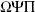

**第二章**

**真理与半真理定律**

**在晴朗无月的夜晚仰望天空，人眼可以探测到成千上万的闪烁光源。这些星星随意散布其中，形成了图案。这里有一只狮子，那里有一把勺子。发现模式的能力既可以是优点也可以是缺点。艾萨克·牛顿思考着落体运动的模式，并创立了万有引力定律。其他人注意到当他们穿着脏袜子时，他们的运动表现有所提升，因此此后他们拒绝再穿干净的袜子。在自然界的所有模式中，我们如何区分有意义的模式呢？这种区分本质上是一项实用的事业。因此，你可能会惊讶地了解到，与作为一套公理、证明和定理的集合而出现的几何学不同，随机性理论起源于专注于咒语和赌博的头脑，我们更可能想象他们手里拿着骰子或药水，而不是一本书或卷轴。

随机性理论从根本上是对常识的编码。但这也是一个充满微妙性的领域，在这个领域中，伟大的专家们出了名地犯了错误，而专业的赌徒们出了名地正确。要理解随机性并克服我们的误解，既需要经验，也需要大量的深思熟虑。因此，我们开始我们的旅程，探讨一些基本的概率定律以及揭示、理解和应用它们的挑战。对人们关于这些定律的直觉的经典探索之一是由那些极大地阐明我们误解的丹尼尔·卡尼曼和阿莫斯·特沃斯基进行的实验。¹ 欢迎您参与并了解您自己的概率直觉。

想象一个名叫琳达的女性，31 岁，单身，直言不讳，非常聪明。在大学时，她主修哲学。作为一名学生，她深深关注歧视和社会正义，并参加了反核示威活动。特沃斯基和卡尼曼向 88 名受试者展示了这个描述，并要求他们根据概率对以下陈述进行 1 到 8 的排名，其中 1 代表最可能，8 代表最不可能。以下是结果，按最可能到最不可能的顺序排列：

| *陈述* | *平均概率排名* |
| --- | --- |
| 琳达积极参与女权运动。 | 2.1 |
| 琳达是一名精神科社会工作者。 | 3.1 |
| 琳达在书店工作，并参加瑜伽课程。 | 3.3 |
| 琳达是一名银行出纳员，并且积极参与女权运动。 | 4.1 |
| 琳达是一名小学教师。 | 5.2 |
| 琳达是女性选民联盟的成员。 | 5.4 |
| 琳达是一名银行出纳员。 | 6.2 |
| 琳达是一名保险销售员。 | 6.4 |

乍一看，这些结果可能看起来没有什么异常：描述实际上是为了代表一个活跃的女权主义者，而不是银行出纳员或保险销售员。但现在让我们只关注三种可能性及其平均排名，按最有可能到最不可能的顺序列在下面。这是 85%的受访者对三种可能性进行排名的顺序：

| *陈述* | *平均概率排名* |
| --- | --- |
| 琳达积极参与女权运动。 | 2.1 |
| 琳达是银行出纳员并且积极参与女权运动。 | 4.1 |
| 琳达是银行出纳员。 | 6.2 |

如果关于这一点没有任何奇怪之处，那么卡尼曼和特沃斯基已经欺骗了你，因为如果琳达是银行出纳员并且积极参与女权运动的机会大于琳达是银行出纳员的机会，那么这将违反我们的第一条概率法则，这是所有法则中最基本的之一：*两个事件同时发生的概率永远不会大于每个事件单独发生的概率*。为什么？简单的算术：事件 A 发生的概率 = 事件 A 和事件 B 同时发生的概率 + 事件 A 发生而事件 B*不发生*的概率。

卡尼曼和特沃斯基对结果并不感到惊讶，因为他们给了他们的受试者大量的可能性，三个场景之间的联系很容易在混乱中丢失。因此，他们向另一组人展示了琳达的描述，但这次他们只展示了这些可能性：

琳达积极参与女权运动。

琳达是银行出纳员并且积极参与女权运动。

琳达是银行出纳员。

让他们惊讶的是，在这个试验中，87%的受试者也将琳达是银行出纳员并且积极参与女权运动的可能性排名高于琳达是银行出纳员的可能性。因此，研究人员进一步深入：他们明确要求一组 36 名相当复杂的硕士研究生根据我们的第一条概率法则考虑他们的答案。即使在提示之后，仍有两位受试者坚持这种不合逻辑的回答。

卡尼曼和特沃斯基注意到的关于这种顽固的误解的有趣之处在于，如果你问的问题与他们所知道的琳达无关，人们就不会犯同样的错误。例如，假设卡尼曼和特沃斯基问的是以下哪个陈述看起来最有可能：

琳达拥有一家国际煎饼屋特许经营权。

琳达进行了性别转换手术，现在被称为拉里。

琳达进行了性别转换手术，现在被称为拉里，并且拥有一家国际煎饼屋特许经营权。

在这种情况下，很少有人会选择最后一个选项比其他两个选项更有可能。

卡尼曼和特沃斯基得出结论，因为“琳达积极参与女权运动”这一细节根据她性格的初始描述听起来很真实，当他们将这一细节添加到银行出纳员的猜测中时，它增加了场景的可信度。但是，琳达的嬉皮士时代和她在地球上的第四十年之间可能发生了很多事情。她可能经历了对基要主义宗教团体的皈依，嫁给了一个光头，并在她的左臀部纹了一个纳粹十字，或者因为忙于生活的其他方面而不再积极参与政治活动。在这些情况和其他许多情况下，她可能不会积极参与女权运动。因此，尽管它似乎提高了准确性，但添加这一细节降低了场景准确性的可能性。

如果我们得到的细节符合我们对某事物的心理图景，那么一个场景中的细节越多，它看起来就越真实，因此我们认为它越有可能——即使任何将不确定的细节添加到假设中的行为都会使该假设的可能性降低。这种概率逻辑与人们对不确定事件评估之间的不一致引起了卡尼曼和特沃斯基的兴趣，因为它可能导致现实生活中不公平或错误的评估。哪种可能性更大：被告在发现尸体后离开了犯罪现场，还是被告在发现尸体后离开了犯罪现场，因为他害怕被指控犯下可怕的谋杀罪？总统更有可能增加联邦教育援助，还是他或她将利用削减州援助释放的资金增加联邦教育援助？你的公司明年更有可能增加销售额，还是因为它整体经济状况非常好而增加销售额？在每种情况下，尽管后者比前者可能性低，但它听起来可能更可能。正如卡尼曼和特沃斯基所说，“一个好的故事往往比不那么令人满意的……[解释]”可能性更低。

卡尼曼和特沃斯基发现，即使是受过高度训练的医生也会犯这个错误。²他们向一组内科医生展示了一个严重的医疗问题：肺栓塞（肺中的血凝块）。如果你有这种疾病，你可能会表现出一系列症状中的一种或多种。其中一些症状，如部分瘫痪，是不常见的；而另一些症状，如气短，则是可能的。哪种可能性更大：栓塞的受害者只会经历部分瘫痪，还是受害者会经历部分瘫痪和气短？卡尼曼和特沃斯基发现，91%的医生认为血凝块引起仅是罕见症状的可能性比引起罕见症状和常见症状的组合的可能性要小。（为了医生的辩护，患者不会走进他们的办公室说：“我肺里有血凝块。猜猜我的症状。”）

多年后，卡尼曼的一位学生和另一位研究人员发现，律师们在判断中也会受到相同的偏见的影响。³无论涉及刑事案件还是民事案件，客户通常依赖他们的律师来评估如果案件进入审判阶段可能会发生什么。获得无罪释放或和解，或者获得各种金额的金钱判决的可能性有多大？尽管律师可能不会用数字概率的术语来表达他们的观点，但他们提供的建议是基于他们对可能结果相对可能性的个人预测。在这里，研究人员也发现，律师们将更高的概率分配给描述得更详细的偶然事件。例如，在保拉·琼斯对当时的总统比尔·克林顿提起的民事诉讼中，200 名执业律师被要求预测审判不会进行完整过程的概率。对于一些受试者来说，这种可能性被分解为导致审判提前结束的具体原因，例如和解、撤回指控或法官驳回。在比较两组律师——那些仅仅被要求预测审判是否会进行完整过程的律师和那些被展示审判可能提前结束的方式的律师——的研究人员发现，那些被展示提前结束原因的律师比其他律师更有可能预测审判将提前结束。

评估我们环境中不同现象之间有意义联系的能力可能非常重要，以至于值得看看一些海市蜃楼。如果一个饥饿的穴居人看到远处岩石上模糊的绿色模糊物，当它实际上是一只丰满、美味的蜥蜴时，将其视为无趣而忽略它的代价，比冲过去扑向最终只是一片散叶的代价要高。因此，这种理论认为，我们可能已经进化到避免前者错误，而有时会犯后者错误。

在数学的故事中，古希腊人因其发明了现代数学进行的方式而脱颖而出：通过公理、证明、定理、更多的证明、更多的定理，等等。然而，在 20 世纪 30 年代，捷克裔美国数学家库尔特·哥德尔——爱因斯坦的朋友——表明这种方法存在一些不足：他证明，大多数数学要么必须是不一致的，要么必须包含无法证明的真理。尽管如此，数学的进步仍然以希腊风格，即欧几里得风格，持续不断。希腊人在几何学上是一群天才，他们创建了一组小的公理，即无需证明即可接受的说法，并从这里出发证明了众多美丽的定理，详细阐述了直线、平面、三角形和其他几何形状的性质。从这些知识中，他们认识到，例如，地球是一个球体，甚至计算出了它的半径。人们不禁要问，一个能够提出欧几里得《几何原本》第一卷命题 29——"一条直线落在两条平行直线上，使得对顶角相等，外角等于内角和与之相对的角，以及同侧的内角等于两个直角"——这样的定理的文明，为什么没有创造出一种理论来表明，如果你掷两个骰子，押注它们两个都掷出 6 是不明智的。

实际上，希腊人不仅没有雪佛兰，而且也没有骰子。然而，他们确实有赌博成瘾。他们也有大量的动物尸体，所以他们掷的是由脚跟骨制成的骰子。一个髁骨有六个面，但只有四个足够稳定，可以使骨头落在上面。现代学者指出，由于骨头的结构，落在四个面上的机会并不相等：其中两个面的机会大约是 10%，另外两个面的机会大约是 40%。一种常见的游戏是掷四个骰子。被认为最好的结果是一个罕见的结果，但不是最罕见的结果：即所有四个骰子都掷出不同的结果。这被称为维纳斯掷骰。维纳斯掷骰的概率大约是 10000 次中的 384 次，但希腊人缺乏随机性理论，不知道这一点。

希腊人在向他们的神谕提问时也使用了髌骨。从他们的神谕那里，提问者可以收到据说神的话语作为答案。许多重要的希腊人选择都是基于神谕的建议，正如历史学家希罗多德和作家如荷马、埃斯库罗斯和索福克勒斯的记载所证明。但尽管髌骨投掷在赌博和宗教中的重要性，希腊人并没有努力去理解髌骨投掷的规律性。

为什么希腊人没有发展出概率论的理论？一个答案是许多希腊人相信未来是按照神意展开的。如果一个髌骨投掷的结果意味着“娶那个在学校兵营后面的摔跤比赛中把你压倒的矮胖斯巴达女孩”，一个希腊男孩不会把投掷看作是随机过程的幸运（或不幸运）结果；他会认为这是神的旨意。在这种观点下，对随机性的理解将变得无关紧要。因此，对随机性的数学预测似乎是不可能的。另一个答案可能在于使希腊人成为伟大数学家的哲学：他们坚持绝对真理，通过逻辑和公理来证明，并反对不确定的声明。例如，在柏拉图的《斐多》中，西米阿斯告诉苏格拉底，“基于概率的论证是骗子”，并预见了卡尼曼和特沃斯基的工作，指出“除非在使用它们时非常小心，否则它们很容易具有欺骗性——在几何学和其他事物中。”在《泰阿泰德》中，苏格拉底说，任何“在几何学中从概率和可能性中进行论证的数学家都不值得一枚王牌。”⁴ 但是，即使那些认为概率论者值得一枚王牌的希腊人，在那些记录保存广泛的年代之前，也可能难以制定一个一致的理论，因为人们在估计过去发生事件的频率——因此是概率——时，名声不佳的记忆力。

哪个更大：以 *n* 为第五个字母的六字母英语单词的数量，还是以 *ing* 结尾的六字母英语单词的数量？大多数人会选择以 *ing* 结尾的单词组。⁶ 为什么？因为以 *ing* 结尾的单词比以 *n* 为第五个字母的通用六字母单词更容易想到。但你不必调查《牛津高阶英汉双解大词典》——甚至不必知道如何计数——来证明这个猜测是错误的：以 *n* 为第五个字母的六字母单词组*包括*所有以 *ing* 结尾的六字母单词。心理学家称这种错误为可用性偏差，因为在重建过去时，我们给予最生动且最易检索的记忆过多的重视。

可获得性偏差的糟糕之处在于，它通过扭曲我们对过去事件和环境的感知，潜移默化地扭曲了我们对世界的看法。例如，人们往往会高估无家可归者中精神疾病患者的比例，因为当他们遇到一个行为不奇怪的无家可归者时，他们不会注意到并告诉所有朋友他们遇到的那个不起眼的无家可归者。但是，当他们遇到一个在街道上踩踏并挥动手臂对着一个想象中的伴侣唱歌“当圣徒们行进时”的无家可归者时，他们确实倾向于记住这个事件。⁷ 在杂货店收银台前五条队伍中，你选择最长的那条队伍的可能性有多大？除非你被黑魔法师诅咒了，否则答案大约是五分之一。那么，当你回顾过去时，为什么会有一种感觉，你有一种超自然的能力去选择最长的队伍？因为当事情顺利时，你还有更重要的事情要关注，但当收银台前的女士推车里只有一个商品时，她决定争论她的鸡肉为什么定价为每磅 1.50 美元，而她确信肉类柜台的标牌上写着 1.49 美元，这时事情就会给人留下深刻印象。

可获得性偏差对我们判断和决策产生影响的鲜明例证来自一个模拟陪审团审判。⁸ 在这项研究中，陪审团被提供了关于司机撞上垃圾车时是否醉酒的指控的同等份量的免责和指控证据。问题是，一组陪审员得到了免责证据的“苍白”版本：“垃圾车的车主在交叉审问中表示，由于颜色是灰色，他的垃圾车在夜间很难看到。”另一组陪审员得到了相同证据的“生动”版本：“垃圾车的车主在交叉审问中表示，由于颜色是灰色，他的垃圾车在夜间很难看到。车主评论说，他的卡车是灰色的‘因为这样可以遮住污垢。你想要什么，我应该把它们漆成粉色吗？’”指控证据也以两种方式呈现，这一次是生动形式呈现给第一组，苍白版本呈现给第二组。当陪审团被要求提供有罪/无罪评分时，证据呈现更生动的那一方总是占上风，而且当在宣判前有 48 小时的延迟时，这种影响会增强（可能是因为回忆差距更大）。

通过扭曲我们对过去的看法，可得性偏差使得任何试图理解它的尝试都变得复杂。这一点对古希腊人来说是正确的，对我们也是如此。但还有一个重大的障碍阻碍了早期随机理论的建立，这是一个非常实际的障碍：尽管基本概率只需要了解算术，但希腊人并不知道算术，至少不是那种容易操作的形式。例如，在公元前 5 世纪的雅典，希腊文明鼎盛时期，想要写下数字的人使用了一种字母代码。⁹ 希腊字母表中的前九个字母代表我们称之为 1 到 9 的数字。接下来的九个字母代表我们称之为 10、20、30 等等的数字。最后六个字母加上三个额外的符号代表前九个百位数（100、200 等等，到 900）。如果你现在觉得算术有困难，想象一下尝试从  减去 ！更糟糕的是，个位、十位和百位的书写顺序并不重要：有时百位先写，有时后写，有时甚至完全忽略顺序。最后，希腊人没有零。

零的概念是在公元前 331 年亚历山大入侵巴比伦帝国时传入希腊的。即便如此，尽管亚历山大人开始使用零来表示数字的缺失，但它并没有作为独立的数字被使用。在现代数学中，数字 0 有两个关键属性：在加法中，它是那个加上任何其他数字都不会改变其他数字的数字；在乘法中，它是那个乘以任何其他数字都不会改变自身的数字。这个概念直到 9 世纪才由印度数学家马哈维拉引入。

即使在发展出可用的数字系统之后，还需要许多世纪的时间人们才开始认识到加法、减法、乘法和除法是基本的算术运算，并且逐渐意识到方便的符号会使它们的操作变得容易得多。因此，直到 16 世纪，西方世界才真正准备好发展概率理论。尽管如此，尽管计算系统存在不便，但正是征服了希腊的文明——罗马人——在理解随机性方面取得了第一个进步。

罗马人通常轻视数学，至少是希腊人的数学。正如生活在公元前 106 年至 43 年的罗马政治家西塞罗所说，“希腊人将几何学家尊为最高荣誉；因此，在他们中间，没有哪门学科比数学进步更辉煌。但我们将这门艺术的极限定为其在测量和计数方面的实用性。” ¹⁰ 事实上，虽然人们可能会想象一本希腊教科书专注于抽象三角形之间共性的证明，但一本典型的罗马教科书则关注诸如在敌人占领对岸时如何确定河流宽度等问题。¹¹ 在这种数学优先级下，希腊人产生了诸如阿基米德、丢番图、欧几里得、欧多克斯、毕达哥拉斯和泰勒斯等数学巨星，而罗马人甚至没有产生一位数学家。¹² 在罗马文化中，舒适和战争，而不是真理和美，占据了舞台的中心。然而，正是因为他们关注实用性，罗马人看到了理解概率的价值。所以，尽管对抽象几何学价值不大，西塞罗写道：“概率是生活的指南。” ¹³

西塞罗可能是古代最伟大的概率论捍卫者。他运用概率论来反驳赌博成功归因于神灵干预的普遍观点，写道：“经常玩牌的人总会在某个时候掷出维纳斯的牌：确实，他有时会连续掷出两次，甚至三次。我们难道会如此脆弱，以至于断言这种事情是维纳斯亲自干预的结果，而不是纯粹的运气？” ¹⁴ 西塞罗相信，即使事件的发生是盲目的机会的结果，人们也可以预测和预知事件。他甚至用统计论来嘲讽占星术的信仰。虽然占星术在罗马被禁止，但它仍然盛行，西塞罗注意到，公元前 216 年，汉尼拔率领大约 50,000 名迦太基及其盟军，在坎尼战役中击败了规模更大的罗马军队，杀死了 80,000 名士兵中的 60,000 多人。“在坎尼战役中阵亡的所有罗马人都有相同的星盘吗？”西塞罗问道。“然而，他们都有相同的结局。” ¹⁵ 西塞罗可能会因为知道两千年后，《自然》杂志上的一项关于占星术预测有效性的科学研究表明了他的结论而感到鼓舞。¹⁶ 另一方面，《纽约邮报》建议，作为一个射手座的人，我必须客观地看待批评，并做出任何似乎必要的改变。

最终，西塞罗在随机性领域的最主要遗产是他所使用的术语 *probabilis*，这是我们今天所使用的术语的起源。但它是罗马法典《法典》的一部分，由第六世纪的皇帝查士丁尼编纂，这是首次将概率作为日常术语出现的文件。¹⁷ 要欣赏罗马将数学思维应用于法律理论的应用，必须理解其背景：在黑暗时代，罗马法基于日耳曼部落的实践。那并不美好。以证词规则为例。比如，一个丈夫否认与妻子的托加制造商有外遇，其真实性不是由丈夫能否承受尖锐的反对律师的盘问来决定，而是看他是否在遭受刺痛——由红热的铁——后仍坚持自己的故事。（如果恢复 *那种* 习俗，你将看到更多在庭外解决的离婚案件。）如果被告说战车从未试图停下，但专家证人说蹄印显示刹车已被应用，日耳曼教义提供了一个简单的处方：“从每个群体中选出一个人用盾牌和长矛决斗。谁输了就是伪证者，必须失去他的右手。”¹⁸

在取代或至少补充决斗审判的做法时，罗马人寻求在数学精确性中找到治愈他们旧有、任意系统的缺陷的良方。在这个背景下，罗马的正义观念采用了先进的知识概念。认识到证据和证词常常冲突，以及解决此类冲突的最佳方式是量化不可避免的不确定性，罗马人创造了半证明的概念，适用于没有充分理由相信或怀疑证据或证词的案件。在某些情况下，罗马的证据法甚至包括更精细的证明程度，如教会法令规定：“主教在没有七十二名证人证词的情况下不应被定罪……红衣主教神父在没有四十四名证人证词的情况下不应被定罪，罗马城的红衣主教执事在没有三十六名证人证词的情况下不应被定罪，副执事、助祭、驱魔师、读经人、门卫在没有七名证人证词的情况下不应被定罪。” ¹⁹ 根据这些规则定罪，你必须不仅犯罪，还要卖票。尽管如此，认识到证词中真理的概率可能变化，以及组合此类概率的规则是必要的，这是一个开端。因此，在不太可能的古罗马，基于概率的系统规则首次出现。

很不幸，当你同时处理 VIIIs 和 XIVs 时，很难达到量化技巧。最终，尽管罗马法具有一定的法律合理性和连贯性，但它缺乏数学上的有效性。例如，在罗马法中，两个半证明构成一个完整的证明。对于一个不习惯于量化思维的人来说，这可能听起来合理，但考虑到今天我们对分数的熟悉程度，它引发了一个问题：如果两个半证明等于一个完整的确定性，那么三个半证明又意味着什么呢？根据正确的概率复合方式，两个半证明产生的确定性小于一个整体，而且任何有限数量的部分证明永远不会加起来成为一个确定性，因为要复合概率，你不是相加，而是相乘。

这就引出了我们的下一个法则，概率复合的规则：*如果两个可能的事件 A 和 B 是独立的，那么 A 和 B 同时发生的概率等于它们各自概率的乘积.* 假设一个已婚人士平均每年有 1/50 的几率离婚。另一方面，一名警察每年有大约 1/5,000 的几率在工作岗位上被杀害。一个已婚的警察在同年离婚和被杀的概率是多少？根据上述原则，如果这些事件是独立的，那么几率大约是[1]/[50] × [1]/[5,000]，等于[1]/[250,000]。当然，这些事件不是独立的；它们是相互关联的：一旦你死了，该死，你就不能再离婚了。因此，这种不幸的几率实际上略小于 1/250,000。

为什么是乘法而不是加法呢？假设你从通过互联网约会服务遇到的 100 个男人中制作了一副交易卡，这些男人在他们的网站照片中通常看起来像汤姆·克鲁斯，但现实中更常像丹尼·德维托。假设在每张卡的背面，你列出关于这些男人的某些数据，例如诚实（是或否）和吸引人（是或否）。最后，假设在所有潜在的灵魂伴侣中，有 1/10 的人在这两方面都给出了肯定的回答。在你的 100 张卡片中，有多少人会在两方面都通过测试？让我们以诚实作为第一个特征（我们同样可以很好地选择吸引人）。由于有 1/10 的卡片在诚实这一项下列出了“是”，因此 100 张卡片中有 10 张符合条件。在这 10 张中，有多少张是吸引人的？再次，1/10，所以现在你只剩下一张卡片。第一个 1/10 将可能性减少了 1/10，下一个 1/10 也是如此，使得结果变成了 1/100。这就是为什么你要乘法的原因。如果你有比诚实和吸引人更多的要求，你必须继续乘法，所以……祝你好运。

在我们继续之前，值得注意一个重要细节：即“如果两个可能的事件，A 和 B，是独立的”这一条款。假设一家航空公司航班上只剩下一个座位，还有两名乘客尚未登机。假设根据经验，航空公司知道有三分之二的可能性，预订座位的乘客会到达并领取座位。运用乘法法则，登机口服务员可以得出结论，她将有大约 44%的几率不得不处理一个不高兴的顾客。另一方面，两名乘客都不登机，飞机不得不空飞的概率是 1/3 乘以 1/3，即只有大约 11%。但这是基于乘客是独立的假设。如果，比如说，他们是一起旅行的，那么上述分析就是错误的。两人都会登机的概率是三分之二，这与一个人会登机的概率相同。重要的是要记住，只有当事件之间没有任何依赖关系时，你才能通过相乘简单概率来得到复合概率。

我们刚才应用的规则可以应用于罗马的半证明规则：两个独立半证明都错误的概率是四分之一，所以两个半证明构成四分之三的证明，而不是整个证明。罗马人在应该相乘的地方加了。

有一些情况下，概率“应该”相加，这是我们接下来要讨论的定律。它出现在我们想知道一个事件或另一个事件发生的概率时，与之前我们想知道一个事件和另一个事件同时发生的概率的情况不同。定律是这样的：*如果一个事件可以有多种不同和明确的结果，A、B、C 等等，那么 A 或 B 发生的概率等于 A 和 B 各自概率的和，以及所有可能结果（A、B、C 等等）概率的总和为 1（即 100%）*。当你想知道两个独立事件 A 和 B 同时发生的概率时，你相乘；如果你想知道两个互斥事件 A 或 B 中任何一个发生的概率时，你相加。回到我们的航空公司：登机口服务员应该在什么时候相加概率而不是相乘呢？假设她想知道两名乘客要么都登机要么都不登机的概率。在这种情况下，她应该相加个别概率，根据我们上面的计算，这将达到 55%。

这三条定律虽然简单，却是概率论的大部分基础。正确应用，它们可以让我们深入了解自然界的运作和日常世界。我们在日常决策中一直使用它们。但就像古罗马的法律制定者一样，我们并不总是正确地使用它们。

回顾过去，摇头叹息，写一些像《腐朽的罗马人》(*The Rotten Romans*)（Scholastic，1994 年）这样的书是很容易的。但为了避免我们无端地自我吹嘘，我将用探讨我讨论的基本法律如何应用于我们自己的法律体系的一些方式来结束这一章。结果证明，这足以让那些沉醉于文化优越感的人清醒过来。

好消息是，我们现在没有半真半假的证据。但我们确实有一种类似于^(999,000)/[1,000,000]的证明。例如，在刑事审判中，DNA 分析专家作证说，从犯罪现场取出的 DNA 样本与从嫌疑人那里取出的样本相匹配，这种情况并不少见。这样的匹配有多确定？当 DNA 证据首次引入时，一些专家作证称，DNA 测试中不可能出现假阳性。如今，DNA 专家经常作证说，随机人匹配犯罪样本的概率低于一百万分之一或十亿分之一。有了这样的概率，人们几乎不能责怪陪审员认为，“扔掉钥匙”。但还有一个统计数据通常不会提交给陪审团，它与实验室在收集或处理样本时犯错误的事实有关，例如，意外混合或交换样本，或者误解或错误报告结果。这些错误虽然很少见，但并不像随机匹配那样罕见。例如，费城城市犯罪实验室承认，它在一起强奸案中交换了被告和受害者的参考样本，一家名为 Cellmark Diagnostics 的测试公司也承认了类似的错误。²⁰不幸的是，法庭上关于 DNA 的统计数据的力量如此之大，以至于在俄克拉荷马州，一个名叫蒂莫西·达勒姆的男人被判超过 3100 年监禁，尽管当时有 11 个目击者证明他在犯罪时在另一个州。结果发现，在初步分析中，实验室未能完全分离他们测试的液体中强奸者和受害者的 DNA，当与达勒姆的 DNA 比较时，受害者和强奸者的 DNA 组合产生了阳性结果。后来的重新测试发现了错误，达勒姆在监狱里度过了近四年后才被释放。²¹

由于人为原因导致的错误率估计各不相同，但许多专家认为大约为 1%。然而，由于许多实验室的错误率从未被测量过，法院通常不允许就这一总体统计数据作证。即使法院允许就假阳性作证，陪审团将如何评估它？大多数陪审员认为，考虑到两种错误——十亿分之一偶然匹配和百分之一的实验室错误匹配——总体错误率必须在两者之间，比如说五亿分之一，这对大多数陪审员来说仍然超出了合理怀疑的范围。但是，运用概率法则，我们发现了一个截然不同的答案。

思考方式是这样的：由于两种错误都极不可能发生，我们可以忽略同时发生偶然匹配和实验室错误的可能性。因此，我们寻求一个错误或另一个发生的概率。这由我们的求和法则给出：它是实验室错误的概率（百分之一）加上偶然匹配的概率（十亿分之一）。由于后者比前者小一千万倍，因此，我们可以非常近似地认为两种错误的概率与更可能发生的错误的概率相同——也就是说，概率是百分之一。因此，考虑到两种可能的原因，我们应该忽略关于偶然匹配概率的复杂专家证词，而应专注于更高的实验室错误率——这正是法院通常不允许律师展示的数据！因此，关于 DNA 不可靠性的经常重复的说法被夸大了。

这不是一个孤立的问题。在现代法律体系中使用数学所面临的问题，其严重性并不亚于数百年前在罗马出现的问题。最著名的案例之一是关于法律中概率的使用和误用的案例，即 1968 年由加利福尼亚最高法院审理的*People v. Collins*案。²²以下是法院判决中呈现的该案事实：

1964 年 6 月 18 日，大约上午 11:30，Juanita Brooks 夫人在购物后正沿着洛杉矶市 San Pedro 地区的巷子回家。她身后拖着一只装有杂货的柳条篮子，手提包放在包裹上面。她使用着拐杖。当她弯腰捡起一个空纸箱时，突然被一个她既没看到也没听到接近的人推倒在地。她被摔倒惊呆了，感到有些疼痛。她设法抬头看，看到一个年轻女子从现场跑开。根据布鲁克斯夫人的说法，后者看起来体重约 145 磅，穿着“某种深色衣服”，头发“介于深浅金色之间”，但比被告 Janet Collins 在审判时头发的颜色要浅。事件发生后，布鲁克斯夫人发现她的钱包不见了，钱包里装有 35 至 40 美元。

大约在抢劫案发生的同时，住在小巷尽头的约翰·巴斯（John Bass）在他家前面浇水草坪。他被从巷子里传来的“很多哭泣和尖叫”吸引。当他朝那个方向看去时，他看到一个女人从巷子里跑出来，进入了他对面街道上停着的黄色汽车。他无法说出车的型号。汽车立即启动，绕过另一辆停着的车辆，在狭窄的街道上离巴斯只有六英尺的距离。然后巴斯看到司机是一位戴胡须和胡子的黑人男子……其他证人分别描述了这辆车是黄色的，或者是黄色带米白色顶部的，或者是黄色带蛋壳白色顶部的。这辆车也被描述为中等到大型。

事件发生后几天，洛杉矶一名警察在被告住所前发现一辆黄色林肯车，车身顶部为米白色，并与他们交谈，解释说他正在调查一起抢劫案。他注意到嫌疑人符合犯罪的那对男女的描述，尽管他承认有时会戴胡须，但他说男子没有胡须。当天晚些时候，洛杉矶警察逮捕了这两名嫌疑人，马尔科姆·里卡多·柯林斯（Malcolm Ricardo Collins）和他的妻子珍妮特（Janet）。

对这对夫妇的证据很少，案件很大程度上依赖于受害者约翰·巴斯（John Bass）的辨认。不幸的是，对控方来说，两人都没有在证人席上表现出色。受害者无法辨认珍妮特（Janet）是罪犯，而且根本没见过司机。约翰·巴斯没有见过罪犯，并在警察的排队辨认中说，他无法肯定地将马尔科姆·柯林斯（Malcolm Collins）认定为司机。因此，似乎案件正在瓦解。

进入明星证人，加利福尼亚最高法院意见中仅描述为“一所州立大学的数学讲师”。这位证人作证说，被告“一位金发马尾辫的白人女性……[以及]一位有胡须和胡子的黑人”驾驶了一辆部分黄色的汽车，这足以定罪这对夫妇。为了说明这一点，控方展示了以下表格，以下是从最高法院判决中直接引用的：

| *特征* | *个体概率* |
| --- | --- |
| 部分黄色的汽车 | ¹/[10] |
| 有胡须的男子 | ¹/[4] |
| 黑人男子有胡须 | ¹/[10] |
| 有马尾辫的女孩 | ¹/[10] |
| 金发女孩 | ¹/[3] |
| 混血情侣在车内 | ¹/[1,000] |

被起诉方召唤的数学老师表示，乘法法则适用于这些数据。通过乘以所有概率，可以得出结论，一对夫妇符合所有这些独特特征的概率是十二百万分之一。因此，他说，可以推断这对夫妇是无辜的概率是十二百万分之一。然后检察官指出，这些个别概率是估计值，并邀请陪审团提供自己的猜测，然后进行计算。他说，他自己认为这些估计是保守的，他使用分配的因子计算出的概率更像是十亿分之一。陪审团接受了这一点，并判定这对夫妇有罪。

这幅图有什么问题？首先，正如我们所看到的，为了通过乘以组成部分的概率来找到复合概率，类别必须是独立的，而在这个案例中它们显然不是。例如，表格引用了观察到一个“有胡子的黑人男子”的概率是十亿分之一，而“有胡须的男子”的概率是四分之一。但大多数有胡子的男子也有胡须，所以如果你观察到“有胡子的黑人男子”，那么你所观察到的男子有胡须的概率就不再是四分之一——它们要高得多。如果你消除“有胡子的黑人男子”这个类别，这个问题就可以得到解决。然后概率的乘积下降到大约百万分之一。

在分析中还有一个错误：相关的概率并不是上面所说的那个——随机选择的一对夫妇与嫌疑人的描述相匹配的概率。相反，相关的概率是所有这些特征都匹配的一对夫妇是罪犯夫妇的概率。前者可能是百万分之一。但对于后者，犯罪地点附近的人口有数百万，因此你合理地预期该地区可能有 2 到 3 对夫妇符合描述。在这种情况下，仅根据这一证据（这几乎是起诉方所拥有的全部证据），一对符合描述的夫妇是罪犯的概率仅为 2 或 3 分之一。这几乎不足以达到合理的怀疑程度。因此，最高法院推翻了柯林斯的定罪。

现代法庭中使用概率和统计学仍然是一个有争议的话题。在柯林斯案中，加利福尼亚最高法院贬低了其所称的“数学审判”，但它为更多“数学技术的适当应用”留下了空间。在随后的几年里，法院很少考虑数学论证，但即使律师和法官没有引用明确的概率或数学定理，他们仍然经常使用这种推理，陪审员在权衡证据时也是如此。此外，由于评估 DNA 证据的必要性，统计论证变得越来越重要。不幸的是，随着这种重要性的增加，律师、法官或陪审团的理解并没有相应增加。正如南加州大学的概率与法律教授托马斯·莱昂解释的那样，“很少有学生选修法律课程中的概率课程，也很少有律师觉得它有存在的必要。”²³ 在法律和其他领域一样，对随机性的理解可以揭示隐藏的真相层面，但只有那些拥有揭示这些真相工具的人才能做到。在下一章中，我们将考虑第一个系统地研究这些工具的人的故事。
