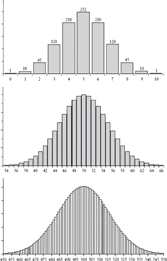
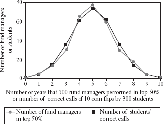

**第七章**

**测量与误差定律**

**不久前的一天**，我的儿子阿列克谢回到家，宣布了他最近英语论文的分数。他得了 93 分。在正常情况下，我会祝贺他得了 A。而且既然这是一个低 A，我知道他有能力做得更好，我会补充说这个分数是他下次能取得更高分数的证据。但这次情况并不正常，在这种情况下，我认为 93 分的评分是对论文质量的惊人低估。这时你可能会认为前面的几句话更多地是在讲我，而不是阿列克谢。如果这样想，你就完全正确了。事实上，上面的情节完全是关于我的，因为正是我写了阿列克谢的论文。

好吧，我承认我的错误。为了辩护，我应该指出，我通常不会帮阿列谢写论文，就像我不会在他功夫课上替他挨打一样。但阿列谢来找我批评他的作品，就像往常一样，在论文截止的前一天晚上才提出请求。我告诉他我会给他回复。我继续在电脑上阅读它，首先做了一些小的修改，不值得特别记录。然后，作为一个不懈的改写者，我逐渐发现自己被卷入其中，重新排列这个，改写那个，在我完成之前，他不仅已经睡着了，而且我已经把这篇论文变成了自己的。第二天早上，我羞愧地承认我忘记保存原始版本，我告诉他直接交上我的版本。

他递给我批改过的试卷，说了几句鼓励的话。“还不错，”他对我说。“93 分其实更接近 A-而不是 A，但已经很晚了，我相信如果你当时更清醒一些，你会做得更好。”我不高兴。首先，一个十五岁的孩子说出你以前对他说过的话，这本身就让人不舒服，而且你还会觉得他的话很无聊。但除此之外，我的材料——一个至少我母亲认为的职业作家的工作——怎么会在高中英语课上得不到高分呢？显然，我并不孤单。从那时起，我听说还有另一位作家有过类似的经历，只不过他的女儿得了 B。显然，这位拥有英语博士学位的作家，为《滚石》、《男士时尚》和《纽约时报》写得很不错，但英语 101 却不行。阿列克谢试图用另一个故事来安慰我：他说，他的两个朋友曾经交了完全相同的论文。他认为这是愚蠢的，他们俩都会被停课，但那位工作过度的老师不仅没有注意到，还给了其中一篇论文 90 分（A），另一篇 79 分（C）。（除非你像我一样，有过整夜熬夜批改一大堆论文，背景播放《星际迷航》重播来打破单调的经历，这听起来才会奇怪。）

数字似乎总是带有权威的重量。这种思考，至少是潜意识中的，是这样的：如果一位老师以 100 分制来评定成绩，那么这些微小的区别肯定意味着某些东西。但是，如果十个出版商都认为第一本《哈利·波特》的手稿不值得出版，那么可怜的芬南根夫人（这不是她的真名）如何能如此精细地区分论文，以至于给一篇评 92 分，另一篇评 93 分？如果我们接受论文的质量以某种方式可以定义，那么我们仍然必须认识到，成绩不是对论文质量程度的描述，而是一种*测量*，而随机性影响我们的最重要的方式之一就是它对测量的影响。在论文的例子中，测量工具是老师，而老师的评估，就像任何测量一样，容易受到随机变化和错误的影响。

投票也是一种测量方式。在这种情况下，我们测量的是不仅仅有多少人在选举日支持每个候选人，而是有多少人足够关心，愿意麻烦自己去投票。这种测量中存在许多随机误差的来源。一些合法选民可能会发现他们的名字不在注册选民名单上。其他人可能会错误地投给除他们意图外的候选人。当然，在计票过程中也会出现错误。有些选票被不当接受或拒绝；其他选票则简单地丢失了。在大多数选举中，所有这些因素的总和并不足以影响结果。但在竞争激烈的选举中，这可能会发生，然后我们通常会进行一次或多次重新计票，好像我们的第二次或第三次计票会比第一次更少受到随机误差的影响。

例如，在 2004 年华盛顿州的州长选举中，尽管最初的计票结果显示共和党以 261 票的微弱优势赢得约 300 万票，但最终民主党候选人被宣布为赢家。¹ 由于原始投票计数非常接近，州法律要求进行重新计票。在这次计票中，共和党再次获胜，但只多出 42 票。没有人知道是否有人认为第一次和第二次投票计数之间 219 票的差异是新的胜利边缘的几倍，但这最终导致第三次投票计数，这次完全是“手工”进行的。42 票的胜利相当于每 70000 票中只有 1 票的优势，因此手工计票的努力可以比作让 42 个人从 1 数到 70000，然后希望他们每个人平均错误少于 1 次。不出所料，结果再次改变。这次它使民主党多出 10 票。这个数字后来在包括 700 张新发现的“丢失选票”后改为 129 票。

投票计数过程和投票过程都不完美。例如，如果由于邮局错误，每 100 名潜在选民中有 1 人没有收到带有投票地点的信件，而这 100 人中有 1 人因此没有投票，那么在华盛顿的选举中，这相当于有 300 名本会投票但因政府错误而没有投票的选民。选举，像所有测量一样，都是不精确的，因此重新计票也是如此，所以当选举结果极为接近时，我们或许应该接受它们，或者掷硬币，而不是进行一次又一次的重新计票。

测量的不精确性在 18 世纪中叶成为了一个主要问题，当时在天体物理学和数学领域工作的主要任务是解决如何将牛顿定律与月球和行星的观测运动相协调的问题。从一组不一致的测量值中产生一个单一数字的一种方法就是取平均值或均值。似乎正是年轻的艾萨克·牛顿，在他的光学研究中，首次为了那个目的使用了它。² 但正如许多事情一样，牛顿是一个例外。牛顿时代的多数科学家，以及随后的一个世纪，他们并没有取平均值。相反，他们从他们的测量值中选择一个“黄金数字”——他们认为这个数字主要是通过直觉认为是最可靠的测量结果。那是因为他们认为测量的变化不是测量过程的必然副产品，而是失败的证据——有时甚至有道德上的后果。事实上，他们很少发表同一数量的多次测量，因为他们觉得这相当于承认了一个失败的过程，并引发信任问题。但在 18 世纪中叶，潮流开始改变。计算天体的总运动，一系列几乎圆形的椭圆，今天由早熟的高中生在耳机里播放音乐时完成，这是一个简单的任务。但要描述行星运动的细微之处，不仅要考虑太阳的引力，还要考虑其他行星的引力以及行星和月球与完美球形的偏差，即使在今天也是一个困难的问题。为了实现这个目标，复杂的近似数学必须与不完美的观察和测量相协调。

另一个原因是，18 世纪末需要一种数学测量理论：从 1780 年代开始，在法国兴起了一种新的严格实验物理学模式。³ 在那个时期之前，物理学由两个独立的传统组成。一方面，数学科学家研究了牛顿运动和引力理论的精确后果。另一方面，一组有时被称为实验哲学家的人对电、磁、光和热进行了经验研究。实验哲学家——通常是业余爱好者——对科学严格方法的关注不如数学导向的研究者，因此出现了一股改革和数学化实验物理学的运动。在这场运动中，皮埃尔-西蒙·拉普拉斯再次发挥了重要作用。

拉普拉斯是通过他的法国同胞安托万-洛朗·拉瓦锡的工作而对物理科学产生兴趣的，拉瓦锡被誉为现代化学之父。⁴ 拉普拉斯和拉瓦锡共同工作了多年，但拉瓦锡在应对动荡时期的能力并不如拉普拉斯。为了筹集资金以资助他众多的科学实验，他成为了一个受国家保护的特权私人协会的成员。可能历史上没有哪个时期拥有这样的职位会激发你的同胞邀请你进入他们的家中享用一杯热腾腾的姜汁卡布奇诺，但法国大革命爆发时，这却成了一种特别沉重的凭证。1794 年，拉瓦锡与其他协会成员一同被捕，并被迅速判处死刑。他始终是一位献身的科学家，他请求时间来完成一些研究，以便后人能够使用。对此，主审法官著名地回应道：“共和国不需要科学家。”现代化学之父随即被斩首，尸体被扔进了一个集体坟墓。据说，他指示他的助手计算他断头后头部试图张嘴的单词数量。

拉普拉斯和拉瓦锡的工作，以及少数其他人的工作，特别是法国物理学家查尔斯-奥古斯丁·德·库仑的工作，他在电和磁方面进行了实验，改变了实验物理学。他们的工作还促进了 1790 年代一种新的理性度量系统的开发，即公制系统，以取代阻碍科学发展和经常导致商人之间争端的多种不同的系统。由路易十六任命的一组人开发了这个度量系统，在路易失势后，革命政府采纳了它。讽刺的是，拉瓦锡曾是该组成员之一。

天文学和实验物理学的需求意味着在 18 世纪末和 19 世纪初，数学家的大部分任务在于理解和量化随机误差。这些努力催生了一个新的领域——数学统计学，它提供了一套工具来解释来自观察和实验的数据。统计学家有时认为现代科学的发展围绕着这一发展，即测量理论的创立。但统计学也提供了工具来解决现实世界的问题，例如药物的有效性或政治家的受欢迎程度，因此对统计推理的正确理解在日常生活中的作用与在科学中一样重要。

生活就是这样一种矛盾：尽管测量总是带有不确定性，但当引用测量结果时，测量中的不确定性却很少被讨论。如果一个挑剔的交通警察告诉法官她的雷达测速仪显示你在每小时 35 英里的区域内以 39 英里的速度行驶，尽管雷达测速仪的读数通常每小时会变化几英里，但通常情况下，罚单还是会贴上。⁵ 尽管许多学生（以及他们的父母）如果这样做能将他们的数学 SAT 成绩从 598 提高到 625，他们可能会从屋顶跳下来，但很少有教育工作者谈论那些研究表明，如果你想提高 30 分，有很大机会你只需多参加几次考试就能做到。⁶ 有时，无意义的区别甚至会成为新闻。最近的一个八月，劳工统计局报告说失业率保持在 4.7%。在七月，该局报告的失业率为 4.8%。这一变化引发了像《纽约时报》这样的头条新闻：“上个月就业和工资略有增长。”⁷ 但正如《巴伦周刊》的经济编辑 Gene Epstein 所说：“仅仅因为数字发生了变化，并不意味着事物本身发生了变化。例如，任何时间失业率变动超过十分之一个百分点……这是一个如此小的变化，以至于无法判断是否真的发生了变化。”⁸ 换句话说，如果劳工统计局在八月测量失业率，然后一小时后重复测量，仅凭随机误差，第二次测量就有很大可能至少与第一次测量相差十分之一个百分点。那么《纽约时报》会以“下午 2 点就业和工资略有增长”为标题吗？

测量中的不确定性在所测量的量是主观的时更为棘手，比如像阿列克谢的英语课论文。例如，宾夕法尼亚克拉里翁大学的一组研究人员收集了 120 篇学期论文，并对其进行了程度极高的审查，你肯定知道自己的孩子的作业永远不会得到这样的待遇：每位学期论文都由八位教师独立评分。得到的成绩，从 A 到 F 的等级，有时会相差两个或更多等级。平均下来，它们相差近一个等级。⁹ 由于学生的未来往往取决于这样的判断，这种不精确性是不幸的。然而，考虑到在任何给定学院系中，教授们在方法和哲学上往往从卡尔·马克思到格罗乔·马克思无所不包，这是可以理解的。但如果我们控制这一点——也就是说，如果评分者被给予并指示遵循某些固定的评分标准呢？爱荷华州立大学的一位研究人员向一组经过他根据这些标准大量培训的修辞学和专业沟通博士研究生展示了大约 100 篇学生的论文。¹⁰ 每篇论文由两位独立的评估者按照 1 到 4 的等级进行评分。当比较分数时，评估者只有在大约一半的情况下达成一致。德克萨斯大学在分析其大学入学论文评分时也发现了类似的结果。¹¹ 即使是备受尊敬的大学委员会也只期望，当由两位评分者评估时，“92%的所有评分论文将在 6 点 SAT 论文评分量表上彼此相差±1 分。” ¹²

另一个被赋予比其应得更多信任的主观测量是葡萄酒的评分。在 20 世纪 70 年代，葡萄酒行业是一个沉睡的企业，虽然有所增长，但主要是低档瓶装酒的销售。然后，在 1978 年，一个常被归功于该行业快速增长的事件发生了：一位律师转变成自封的葡萄酒评论家，罗伯特·M·帕克小爵士，决定除了他的评论外，他还会以 100 分为满分对葡萄酒进行评分。多年来，大多数其他葡萄酒出版物也效仿了这一做法。如今，美国每年的葡萄酒销售额超过 200 亿美元，数百万的葡萄酒爱好者在把钱放在柜台上之前，会先查看葡萄酒的评分来支持他们的选择。因此，当《葡萄酒观察家》杂志将 2004 年的瓦伦蒂尼·比安奇阿根廷赤霞珠评为 90 分而不是 89 分时，这一额外的 1 分在瓦伦蒂尼·比安奇的销售额上产生了巨大的差异。¹³ 事实上，如果你在当地酒店看看，你会发现由于它们的吸引力较小，那些评分在 80 多分的葡萄酒通常是销售和打折的葡萄酒。但假设评分过程在一个小时后重复进行，那款获得 90 分的 2004 年瓦伦蒂尼·比安奇阿根廷赤霞珠葡萄酒还有多少可能性会得到 89 分呢？

在他 1890 年的著作《心理学原理》中，威廉·詹姆斯提出，葡萄酒专业知识可以扩展到判断一瓶马德拉酒是来自瓶口还是瓶底的能力。¹⁴ 在我多年来参加的葡萄酒品鉴活动中，我注意到，如果坐在左边那位留胡子的男士低声说“鼻子很棒”（意思是酒香很好），其他人很可能会附和。但如果你独立地做笔记而不进行讨论，你常常会发现那位留胡子的男士写着“鼻子很棒”，那位剃了光头的男士写着“没有鼻子”，而那位烫了波浪发的女士写着“有趣的鼻子，有香菜和新鲜晒皮革的暗示。”

从理论角度来看，有许多理由质疑葡萄酒评分的重要性。首先，味觉感知依赖于味觉和嗅觉刺激之间的复杂相互作用。严格来说，味觉来自舌头上的五种受体细胞：咸、甜、酸、苦和鲜。最后一种对某些氨基酸化合物（例如，酱油中普遍存在）作出反应。但如果味觉感知仅限于此，那么你可以仅用食盐、糖、醋、奎宁和单钠谷氨酸来模仿你最喜欢的牛排、烤土豆和苹果派盛宴，或者一份美味的肉酱意面。¹⁵ 嗅觉感知解释了为什么，如果你将两份相同的糖水溶液混合，并在其中一份中加入（无糖）草莓精华，那么它将比另一份尝起来更甜。¹⁶ 这是个问题，因为研究表明，即使是经过风味训练的专业人士也很难在混合物中可靠地识别出三个或四个以上的成分。¹⁷

期望也会影响你对味道的感知。在 1963 年，三位研究人员秘密地在白葡萄酒中加入了一点点红色食品色素，使其呈现出桃红酒的颜色。然后他们请一组专家对比未着色的葡萄酒来评价其甜度。专家们根据他们的期望，认为假桃红酒比白葡萄酒更甜。另一组研究人员给一群酿酒学学生提供了两个葡萄酒样品。这两个样品都含有相同的白葡萄酒，但其中一个样品添加了一种无味的葡萄花青素染料，使其看起来像是红酒。学生们也根据他们的期望感知到了红葡萄酒和白葡萄酒之间的差异。¹⁸ 在 2008 年的一项研究中，一组志愿者被要求对五瓶葡萄酒进行评分，其中一瓶标价为 90 美元，另一瓶标价为 10 美元，尽管狡猾的研究人员已经在这两瓶瓶子里都装了相同的葡萄酒。更重要的是，这项测试是在受试者在磁共振扫描仪中扫描大脑时进行的。扫描显示，当受试者饮用他们认为更贵的葡萄酒时，大脑中编码我们愉悦体验的区域确实更加活跃。¹⁹ 但在评判品酒师之前，考虑这一点：当一位研究人员询问 30 位可乐饮用者他们更喜欢可口可乐还是百事可乐，然后让他们通过品尝两种品牌的可乐来测试他们的偏好时，30 人中有 21 人报告说，味道测试证实了他们的选择，尽管这位狡猾的研究人员将可口可乐放在百事可乐瓶子里，反之亦然。²⁰ 当我们进行评估或测量时，我们的大脑并不完全依赖于直接的感知输入。它们还整合了其他信息来源——比如我们的期望。

品酒师也常常被期望偏差的另一方面所欺骗：缺乏上下文。将一块芥末放在你的鼻孔下，你不太可能把它误认为是丁香，也不会把丁香误认为是，比如说，你鞋子里的东西。但如果你闻到的是清澈的液体气味，所有的赌注都取消了。在没有上下文的情况下，你很可能把气味搞混。至少这是当两位研究人员向专家展示一系列 16 种随机气味时发生的情况：专家们大约每 4 种气味中就有 1 种被误认。²¹

考虑到所有这些怀疑的理由，科学家们设计了直接测量葡萄酒专家味觉辨别能力的方法。一种方法是使用葡萄酒三角形。它不是一个物理三角形，而是一种隐喻：每位专家都会被提供三种葡萄酒，其中两种是相同的。任务是选择出不同的样本。在一项 1990 年的研究中，专家们只有三分之二的时间能识别出不同的样本，这意味着在三分之一的味觉挑战中，这些葡萄酒大师无法区分出带有“充满野草莓、丰盈的黑莓和树莓的浓郁香气”的黑皮诺与带有“独特的干梅子、黄色樱桃和丝滑的加斯酒”气味的黑皮诺。²² 在同一项研究中，一组专家被要求根据 12 个成分（如酒精含量、单宁的存在、甜度和果味）对一系列葡萄酒进行排名。专家们在 12 个成分中的 9 个上存在显著分歧。最后，当被要求根据其他专家提供的描述来匹配葡萄酒时，受试者只有 70%的时间是正确的。

葡萄酒评论家们对所有的这些困难都心知肚明。“在许多层面上……[评分系统]是毫无意义的，”*《葡萄酒与烈酒杂志》*的编辑说。²³ 根据一位前*《葡萄酒爱好者》*的编辑的说法，“你越深入其中，就越意识到这一切是多么的误入歧途和误导。”²⁴ 尽管如此，评分系统仍然盛行。为什么？评论家们发现，当他们试图用星级系统或诸如*好、坏*以及可能还有*丑*这样的简单文字描述来概括葡萄酒的品质时，他们的观点缺乏说服力。但是，当他们使用数字时，消费者们就会崇拜他们的评价。尽管数字评分存在疑虑，但它们让消费者们确信，他们可以从众多葡萄酒品种、制造商和年份中挑选出那根金针（或者根据他们的预算挑选银针）。

如果一种葡萄酒——或者一篇文章——确实存在某种可以通过数字来概括的质量，那么测量理论必须解决两个关键问题：我们如何从一系列不同的测量中确定这个数字？在有限的测量范围内，我们如何评估我们的判断是正确的概率？我们现在转向这些问题，因为无论数据来源是客观的还是主观的，它们的答案都是测量理论的目标。

理解测量的**关键**在于理解由随机误差引起的数据变化的本质。假设我们向十五位评论家提供多种葡萄酒，或者我们向一位评论家在不同日子重复提供相同的葡萄酒，或者我们两者都做。我们可以通过平均分或平均数来整洁地总结这些意见。但不仅仅是平均值重要：如果十五位评论家都认为这款酒是 90 分，这传达了一个信息；如果评论家给出的评分是 80、81、82、87、89、89、90、90、90、91、91、94、97、99 和 100，这传达了另一个信息。这两组数据具有相同的平均值，但它们在偏离平均值的大小上有所不同。由于数据点的分布方式是如此重要的信息，数学家创造了一个数值度量来描述它。这个数字被称为样本标准差。数学家还通过其平方来衡量变化，这被称为样本方差。

样本标准差描述了一组数据与平均值之间的接近程度，或者从实际的角度来说，数据的不确定性。当它较低时，数据会接近平均值。例如，对于所有酒评家都给出了 90 分的葡萄酒数据，样本标准差为 0，这告诉你所有数据都与平均值完全相同。然而，当样本标准差较高时，数据就不会围绕平均值聚集。对于上述从 80 到 100 分的葡萄酒评分集合，样本标准差为 6，这意味着大多数评分都在平均值上下 6 分之内。在这种情况下，你真正能说的关于这瓶酒的就是它可能介于 84 分和 96 分之间。

在判断他们测量的意义时，18 世纪和 19 世纪的科学家面临着与怀疑的酒鬼相同的问题。因为如果一组研究人员进行了一系列观察，结果几乎总是会有所不同。一位天文学家可能遭受了不利的气象条件；另一位可能被微风打扰；第三位可能刚刚从威廉·詹姆斯的梅多酒品尝中回来。1838 年，数学家和天文学家 F. W. Bessel 将每项天文观测中发生的十一类随机误差进行了分类。即使是一位天文学家进行重复测量，不可靠的视力或温度对仪器的影响等变量也会导致观察结果的变化。因此，天文学家必须了解，在一系列不一致的测量中，他们如何确定一个物体的真实位置。但仅仅因为酒鬼和科学家面临相同的问题，并不意味着他们可以共享其解决方案。我们能否识别随机误差的一般特征，或者随机误差的特征是否取决于上下文？

最早暗示不同测量集具有共同特征的是雅各布·伯努利的外甥丹尼尔。1777 年，他将天文观测中的随机误差比作弓箭飞行中的偏差。在两种情况下，他认为，目标——测量量的真实值或靶心——应该位于中心附近，观测结果应该围绕它聚集，更多的结果接近内圈，而较少的结果偏离目标更远。他提出的描述分布的定律并未证明是正确的，但重要的是，弓箭手误差的分布可能反映了天文观测误差的分布。

误差分布遵循某种普遍规律，有时称为误差定律，这是测量理论的基础。其神奇之处在于，在满足某些非常常见的条件的情况下，任何基于测量值确定真实值的确定都可以通过单一数学分析来解决。当采用这种普遍规律时，基于一组天文学家测量值确定天体真实位置的问题等同于仅根据箭孔确定靶心位置的问题，或者根据一系列评分确定酒的质量。这就是为什么数学统计学是一个连贯的学科，而不仅仅是技巧的集合：无论你的重复测量是旨在确定圣诞节早晨 4 点的木星位置，还是从装配线下来的葡萄干面包的重量，误差的分布都是相同的。

这并不意味着随机误差是唯一可能影响测量的误差类型。如果一半的葡萄酒评论家只喜欢红葡萄酒，另一半只喜欢白葡萄酒，但他们其他方面都完全一致（并且完全一致），那么特定葡萄酒获得的评分就不会遵循误差定律，而是由两个尖锐的峰值组成，一个是由于红葡萄酒爱好者，另一个是由于白葡萄酒爱好者。但即使在可能不适用该定律的情况下，从职业橄榄球比赛的点差²⁵到智商评分，误差定律通常仍然适用。许多年前，我得到了一些朋友为八岁和九岁的孩子设计的消费者软件程序的注册卡。软件的销量没有达到预期。谁在购买它？经过一些统计后，我发现最多用户出现在七岁，这表明一个不受欢迎但并非意外的不匹配。但真正引人注目的是，当我制作了一个条形图，显示了买家年龄偏离七岁的平均值时买家数量的减少，我发现图表呈现出一个非常熟悉的形状——误差定律的形状。

猜测弓箭手和天文学家、化学家和营销人员会遇到相同的错误定律是一回事；而发现这个定律的具体形式则是另一回事。由于分析天文数据的需要，像丹尼尔·伯努利和拉普拉斯这样的科学家在 18 世纪末提出了一系列有缺陷的候选方案。结果证明，描述错误定律的正确数学函数——正态分布——一直就在他们鼻子底下。在几十年前，这个函数已经在伦敦的另一个背景下被发现了。

在揭开正态分布重要性过程中的三个人中，其发现者是最少得到认可的人。亚伯拉罕·德·莫弗的突破发生在 1733 年，当时他已年近六十，直到五年后他的书《概率论》第二版出版才公之于众。德·莫弗是在寻找一个近似值，以描述帕斯卡三角形的底部区域，即我截断的地方下方数百或数千行中的数字时，发现了这个曲线。为了证明他版本的大数定律，雅各布·伯努利不得不处理那些行中出现的某些数字的性质。这些数字可以非常大——例如，帕斯卡三角形的第 200 行中的一个系数有五十九位数字！在伯努利的时代，以及在计算机出现之前的那些日子里，这样的数字显然很难计算。这就是为什么，正如我所说的，伯努利通过使用各种近似值来证明他的大数定律，这降低了他的结果的实用价值。有了他的曲线，德·莫弗能够对系数做出更好的近似，从而大大改进了伯努利的估计。

如果你像我处理登记卡那样，用条形图上的柱高来表示三角形的某一行中的数字，那么德·莫弗得出的近似值就会很明显。例如，三角形的第三行中的三个数字是 1、2、1。在它们的条形图中，第一根柱子上升一个单位；第二根是那个高度的两倍；第三根又是一个单位。现在看看第五行中的五个数字：1、4、6、4、1。那个图将会有五个柱子，再次从低处开始，在中间达到峰值，然后对称地下降。三角形中非常低的系数会导致具有许多柱子的条形图，但它们的行为方式相同。帕斯卡三角形的第 10 行、第 100 行和第 1,000 行的条形图在第七章中展示。

如果你绘制一条连接每个条形图上所有条形顶部的曲线，它将呈现出一个特征形状，一个接近钟形的形状。如果你稍微平滑一下曲线，你可以为它写出一个数学表达式。这个平滑的钟形曲线不仅仅是帕斯卡三角形中数字的视觉表示；它是一种获取三角形下线中数字准确且易于使用的估计的方法。这是德莫弗的发现。

今天，正态分布通常被称为正态分布，有时也称为高斯分布（我们稍后会看到这个术语的起源）。正态分布实际上不是一个固定的曲线，而是一系列曲线，其中每一条曲线都依赖于两个参数来设置其特定的位置和形状。第一个参数决定了其峰值的位置，在第七章的图表中分别是 5、50 和 500。第二个参数决定了曲线的扩散程度。尽管它直到 1894 年才得到现代名称，但这种度量被称为标准差，它是我在前面提到的概念的理论对应物，即样本标准差。粗略地说，它是曲线在曲线大约是其最大高度 60%的点处的宽度的一半。今天，正态分布的重要性远远超出了作为帕斯卡三角形中数字近似的使用。事实上，它是数据分布最普遍的方式。

当用来描述数据的分布时，正态分布描述了当你进行许多观察时，大多数观察值会围绕均值分布，这个均值由曲线的峰值表示。此外，由于曲线在两侧对称地向下倾斜，它描述了观察值数量在均值上方和下方如何相等减少，最初相当急剧，然后逐渐减少。在遵循正态分布的数据中，大约 68%（大约三分之二）的观察值将落在均值 1 个标准差范围内，大约 95%在 2 个标准差范围内，99.7%在 3 个标准差范围内。

上图中柱状图表示帕斯卡三角形的第 10 行、第 100 行和第 1000 行的条目相对大小（参见第四章）。水平轴上的数字表示柱状图中的哪个条目。按照惯例，这种标记从 0 开始，而不是从 1 开始（中间和底部的图表已被截断，以便不显示条形高度可忽略不计的条目）。

为了可视化这一点，请查看第七章中的图表。在这个表格中，用方块标记的数据是 300 名学生做出的猜测，每位学生观察了一系列 10 次硬币翻转。²⁶水平轴上绘制的是正确猜测的数量，从 0 到 10。垂直轴上绘制的是达到该数量正确猜测的学生数量。曲线呈钟形，以 5 次正确猜测为中心，此时其高度对应大约 75 名学生。曲线下降到其最大高度的三分之二左右，对应大约 51 名学生，大约位于左侧 3 和 4 次正确猜测之间以及右侧 6 和 7 次之间。这种标准偏差大小的钟形曲线是随机过程（如猜测硬币翻转结果）的典型特征。

同一张图表还显示了另一组数据，用圆圈标记。这组数据描述了 300 位共同基金经理的表现。在这种情况下，水平轴代表的不是正确猜测硬币翻转的结果，而是基金经理在 10 年中（超过组平均水平的年数）。注意这种相似性！我们将在第九章中回到这个问题。

要了解正态分布如何与随机误差相关联，一个好的方法是考虑民意调查或抽样的过程。你可能还记得我在第五章中描述的关于巴塞尔市市长受欢迎程度的民意调查。在那个城市，一定比例的选民支持市长，而另一部分选民反对。为了简化，我们假设两者都是 50%。正如我们所见，参与民意调查的人可能不会完全反映这个 50/50 的分裂。事实上，如果询问了*N*名选民，那么任何给定数量的选民支持市长的可能性与帕斯卡三角形的第*N*行的数字成正比。因此，根据德莫弗的工作，如果民意调查员对大量选民进行民意调查，不同民意调查结果的概率可以用正态分布来描述。换句话说，大约 95%的时间里，他们在民意调查中观察到的支持率将落在真实支持率的 2 个标准差范围内，即 50%。民意调查员使用“误差范围”这个术语来描述这种不确定性。当民意调查员告诉媒体一个民意调查的误差范围是正负 5%时，他们的意思是，如果他们多次重复进行民意调查，那么在 20 次中有 19 次（95%）的结果将在大约 5%的正确答案范围内。（尽管民意调查员很少指出这一点，但这也意味着，当然，大约有 1 次在 20 次中结果将非常不准确。）一般来说，100 个样本的误差范围对于大多数目的来说太大。另一方面，1000 个样本通常会产生大约 3%的误差范围，这对于大多数目的来说已经足够了。

抛硬币猜测与股票挑选成功率比较

在评估任何类型的调查或民意测验时，重要的是要意识到，当它们被重复进行时，我们应该预期结果会有所变化。例如，如果现实中 40%的登记选民赞同总统处理工作的方式，那么六次独立的调查报告出 37、39、39、40、42 和 42 这样的数字的可能性，远大于所有六次调查都一致认为总统的支持率是 40%。（这六个数字实际上是 2006 年 9 月前两周对总统工作满意度进行的六次独立民调的结果。)²⁷ 这也是为什么，作为另一个经验法则，误差范围内的任何变化都应该被忽略。但尽管《纽约时报》不会刊登“下午 2 点就业和工资略有增加”的标题，类似的标题在政治民调报道中却很常见。例如，2004 年共和党全国代表大会之后，CNN 报道了标题“布什似乎获得适度反弹”。²⁸ CNN 的专家接着解释说，“布什的代表大会反弹似乎为 2 个百分点……说他是总统人选的潜在选民比例从大会前的 50%上升到大会后的 52%。”只有后来记者才提到，这次民调的误差范围是±3.5 个百分点，这意味着新闻快讯基本上是没有意义的。显然，在 CNN 的用语中，“似乎”意味着“实际上不是”。

对于许多民意调查来说，误差率超过 5%被认为是不可接受的，然而在我们的日常生活中，我们基于比这少得多的数据点做出判断。人们无法玩上 100 年的职业篮球，投资 100 栋公寓楼，或者创办 100 家巧克力曲奇饼公司。因此，当我们评价他们在这些企业中的成功时，我们只是基于几个数据点来评价。一支足球队是否应该花费 5000 万美元来吸引一个刚刚打破记录的球员？那位想要你的钱来确保成功的股票经纪人再次取得早期成功的可能性有多大？那位富有的海猴子发明家成功意味着他有很大的机会在新想法上取得成功，比如隐形金鱼和即时青蛙？(记录在案，他没有。)²⁹ 当我们观察到一个成功或失败时，我们是在观察一个数据点，这是从代表之前存在的潜在性的正态分布中抽取的一个样本。我们无法知道我们的单个观察结果代表的是平均值还是异常值，是一个值得下注的事件还是一种不太可能重现的罕见事件。但至少我们应该意识到，样本点只是一个样本点，而不仅仅将其简单地视为现实，我们应该将其置于产生它的标准差或可能性分布的背景下进行观察。这瓶酒可能被评为 91 分，但如果我们没有关于如果相同的酒被反复评分或由其他人评分时可能发生的变化的估计，这个数字就没有意义。例如，几年前，当《企鹅澳大利亚葡萄酒指南》和《葡萄酒》的《澳大利亚葡萄酒年鉴》都回顾了 1999 年的 Mitchelton Blackwood Park Riesling 时，*企鹅*指南给了这瓶酒五星级，并称其为“企鹅年度最佳葡萄酒”，而《葡萄酒》杂志则将其评为所有它所评酒中的最低分，认为这是十年中生产的最差的年份。³⁰ 正态分布不仅帮助我们理解这种差异，而且还使无数统计应用成为可能，这些应用今天在科学和商业中得到了广泛应用——例如，当制药公司评估临床试验结果是否显著时，制造商评估样本零件是否准确反映了缺陷零件的比例，或者营销人员决定是否根据研究调查的结果采取行动。

正态分布描述测量误差分布的认识是在德莫瓦弗的工作几十年后才出现的，这位名字有时与钟形曲线联系在一起的人，是德国数学家卡尔·弗里德里希·高斯。正是在研究行星运动问题时，高斯得出了那个认识，至少就天文学测量而言。然而，高斯的“证明”，根据他后来的自我承认，是无效的。³¹ 此外，它的深远后果也逃过了他。因此，他将这个定律不引人注目地放入了一本名为《关于太阳周围圆锥截面运动的恒星运动的运动理论》的书的结尾部分。在那里，它可能已经死去，只是堆积在废弃的误差定律提案中的一项。

是拉普拉斯从默默无闻中提炼出了正态分布。他在 1810 年遇到了高斯的工作，那时他刚刚阅读了一篇提交给科学院的论文，这篇论文证明了被称为中心极限定理的一个定理，该定理指出，大量独立随机因素之和取任何给定值的概率是按照正态分布分布的。例如，假设你烤了 100 个面包，每次都按照一个旨在生产重 1000 克的面包的食谱来做。由于偶然，你有时会多加或少加一点面粉或牛奶，或者在烤箱中多蒸发或少蒸发一点水分。如果在最后，无数可能的原因中每一个都增加或减少了几克，中心极限定理表明，你面包的重量将按照正态分布变化。在阅读高斯的工作后，拉普拉斯立刻意识到他可以利用它来改进自己的工作，并且他的工作可以提供一个比高斯更好的论据来支持正态分布确实是误差定律的观点。拉普拉斯急忙出版了他关于该定理的短续篇。如今，中心极限定理和大数定律是随机理论中最著名的两个结果。

为了说明中心极限定理如何解释为什么正态分布是正确的误差定律，让我们重新考虑丹尼尔·伯努利关于射箭者的例子。在一个愉快的酒宴和成年人的陪伴之后，我扮演了射箭者的角色。那天晚上，我的小儿子尼古拉递给我一把弓和一支箭，并挑战我射掉他头上的苹果。箭头有一个软泡沫尖端，但仍然有理由分析我可能出现的误差及其可能性。出于明显的原因，我主要关注垂直误差。误差的简单模型是这样的：每个随机因素——比如瞄准误差、空气流的影响等等——都会使我的射击在垂直方向上偏离目标，要么偏高要么偏低，概率相等。我的瞄准总误差将是这些误差的总和。如果我很幸运，大约一半的误差成分会使箭向上偏移，另一半向下偏移，我的射击最终会正中靶心。如果我不幸（或者更确切地说，如果我的儿子不幸），所有的误差都会向一个方向累积，我的瞄准将偏离很远，要么偏高要么偏低。相关的问题是，误差相互抵消的可能性有多大，或者它们累积到最大值的可能性有多大，或者它们在两者之间取任何其他值的可能性有多大？但这只是一个伯努利过程——就像抛硬币并询问抛掷结果出现特定数量正面的可能性。答案可以用帕斯卡三角形来描述，或者如果涉及许多试验，则可以用正态分布来描述。在这种情况下，这正是中心极限定理告诉我们的。（结果，我既没有射中苹果也没有射中儿子，但撞倒了一杯非常好的卡本内红酒。）

到 19 世纪 30 年代，大多数科学家已经相信每一次测量都是一个复合体，受到大量偏差来源的影响，因此受到误差定律的影响。因此，误差定律和中心极限定理使得对数据及其与物理现实的关系有了新的、更深入的理解。在接下来的一个世纪里，对人类社会感兴趣的学者们也掌握了这些思想，并惊讶地发现人类特征和行为的变化往往显示出与测量误差相同的模式。因此，他们试图将误差定律的应用从物理学扩展到一门新的关于人类事务的科学。
