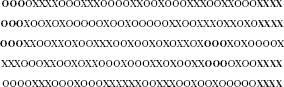

**第九章**

**模式和幻觉的幻觉**

**在 1848 年，两位少女，玛格丽特和凯特·福克斯，听到了无法解释的噪音，比如敲击声或家具移动的声音。碰巧的是，她们的房子以闹鬼而闻名。据传说，¹ 凯特挑战噪音的来源重复她的手指弹响声，并敲击出她的年龄。它接受了这两个挑战。在接下来的几天里，在她们的母亲和一些邻居的帮助下，姐妹俩制定了一个代码，通过这个代码她们可以与敲击者（无意中开玩笑）进行交流。她们得出结论，敲击声来自一个多年前在他们现在居住的房屋中被谋杀的商贩的灵魂。就这样，现代灵性主义——相信死者可以与生者交流——诞生了。到 19 世纪 50 年代初，一种特定的灵性接触方式，称为桌摇，及其表亲桌移动和桌转，在美国和欧洲变得流行起来。这项活动包括一群人围坐在桌子周围，把手放在桌子上，等待。在桌摇中，经过一段时间后，会听到敲击声。在桌移动和桌转中，经过一段时间后，桌子会开始倾斜或移动，有时甚至把坐着的人也拖动起来。人们可以想象到严肃的留胡须的男子，穿着到膝盖的夹克，以及穿着裙子的热情女性，眼睛充满惊奇，他们的手随着桌子这样或那样地移动。

桌子移动变得如此流行，以至于在 1853 年夏天，科学家们开始研究它。一组医生注意到，在无声静坐期间，似乎形成了一种关于桌子将朝哪个方向移动的无意识共识。² 他们发现，当他们的注意力被分散，以至于不能形成共同期望时，桌子就不会移动。在另一个试验中，他们设法创造了一种条件，其中一半的坐者预期桌子会向左移动，另一半预期桌子会向右移动，但桌子仍然没有移动。他们得出结论，这种“运动是由于肌肉动作，主要是无意识进行的。”但最终的调查是由物理学家迈克尔·法拉第进行的，他是电磁理论的创始人之一，电动机的发明者，也是历史上最伟大的实验科学家之一。³ 法拉第首先发现，即使只有一位坐者坐在桌子旁，这种现象也会发生。然后，他招募了那些“非常值得尊敬”且擅长桌子移动的坐者，进行了一系列巧妙而复杂的实验，证明坐者的手的移动先于桌子的移动。此外，他设计了一种指示器，在实时提醒坐者这种移动何时发生。他发现，“一旦将……[指示器]放在最认真的[坐者]面前……[错觉]的力量就消失了；这仅仅是因为参与者意识到了他们真正在做什么。”⁴

法拉第得出结论，正如医生们所做的那样，坐者无意识地拉动和推动桌子。这种运动可能最初是从随意的烦躁不安开始的。然后在某个时刻，坐者从这种随机性中感知到了一种模式。这种模式导致了一种自我实现的预期，因为坐者的手跟随桌子的想象中的领导。法拉第写道，他的指示器的价值在于“它对桌子转盘者心智的纠正能力。”⁵ 法拉第认识到，人类的感知并不是现实的直接后果，而是一种想象的行为。⁶

感知需要想象力，因为人们在生活中遇到的数据从不完整且总是模棱两可。例如，大多数人认为，一个人能够获得的最重要的证据是亲眼目睹事件，而在法庭上，目击证词比其他任何证据都受到更高的尊重。然而，如果你要求向法庭展示与人类眼睛视网膜上捕获的未经处理的数据相同质量的视频，法官可能会质疑你试图传达什么。首先，视图将有一个盲点，即视神经连接到视网膜的地方。此外，我们视野中具有良好分辨率的唯一部分是视网膜中心周围大约 1 度视角的狭窄区域，这个区域相当于我们伸直手臂时大拇指的宽度。在这个区域之外，分辨率急剧下降。为了补偿这一点，我们不断移动我们的眼睛，将更清晰的区域对准我们希望观察的场景的不同部分。因此，发送到大脑的原始数据模式是一个摇摇晃晃、严重像素化的图像，其中有一个洞。幸运的是，大脑处理这些数据，结合双眼的输入，根据相邻位置的视觉属性相似性来填补空白，并进行插值。⁷ 结果——至少直到年龄、伤害、疾病或过多的迈泰酒（一种鸡尾酒）开始对其造成影响——是一个快乐的人，他或她深受一种令人信服的幻觉的影响，即他的或她的视力是锐利和清晰的。

我们还利用想象力和捷径来填补非视觉数据模式中的空白。与视觉输入一样，我们根据不确定和不完整的信息得出结论和做出判断，并在分析完模式后得出结论，认为我们的“图像”是清晰和准确的。但是，它真的是这样吗？

科学家们通过开发统计分析方法来决定一组观察结果是否为假设提供了良好的支持，或者相反，这种明显的支持可能是由于偶然性造成的，从而采取措施保护自己免于识别错误模式。例如，当物理学家试图确定超导器的数据是否具有显著性时，他们不会仅仅通过观察图表，寻找高于噪声的峰值；他们应用数学技术。其中一种技术，即显著性检验，是在 20 世纪 20 年代由 20 世纪最伟大的统计学家之一 R.A.费希尔（R.A. Fisher）开发的（这位先生也因他无法控制的脾气以及与他的同僚统计学家先驱卡尔·皮尔逊（Karl Pearson）之间的激烈争执而闻名，这场争执如此激烈，以至于皮尔逊在 1936 年去世后，他仍然继续攻击他的对手）。

为了说明费舍尔的思想，假设一个在研究超感官知觉的研究生预测了一些抛硬币的结果。如果我们观察到她几乎总是正确，我们可能会假设她在这方面有某种技能，例如，通过心灵感应。另一方面，如果她一半的时间是正确的，数据支持她只是猜测的假设。但是，如果数据介于两者之间，或者数据不多，怎么办？我们在接受和拒绝竞争假设之间划线的标准是什么？这正是显著性检验所做的事情：它是一种正式的程序，用于计算在假设我们正在测试的假设为真的情况下，我们观察到我们所观察到的概率。如果概率低，我们拒绝假设。如果概率高，我们接受它。

例如，假设我们是怀疑论者，并假设学生无法准确预测抛硬币的结果。并且假设在实验试验中，她在一定数量的情况下正确预测了抛硬币的结果。那么我们在第四章中分析的方法使我们能够计算出她仅凭偶然就能完成预测的概率。如果她正确猜测硬币抛掷结果如此频繁，以至于，比如说，她仅凭偶然成功的概率仅为 3%，那么我们就应该拒绝她是在猜测的假设。在显著性检验的术语中，我们会说我们拒绝假设的显著性水平是 3%，这意味着数据偶然误导我们的可能性最多只有 3%。3%的显著性水平相当令人印象深刻，因此媒体可能会将这一壮举报道为心灵感应存在的新证据。然而，那些不相信心灵感应的人可能仍然持怀疑态度。

这个例子说明了一个重要的观点：即使数据在 3%的显著性水平上是显著的，如果你测试 100 个非心灵感应者以测试他们的心灵感应能力——或者 100 个无效药物以测试其有效性——你应该预期会有少数人表现出心灵感应能力，或者少数无效药物表现出有效性。这就是为什么政治民意调查或医学研究，尤其是小规模的研究，有时会与早期的民意调查或研究相矛盾。然而，显著性检验和其他统计方法为科学家们提供了良好的服务，尤其是在他们可以进行大规模的对照研究时。但在日常生活中，我们并不进行这样的研究，我们也没有直觉地应用统计分析。相反，我们依赖直觉。当我的维京炉灶变成了一堆废铁，并且偶然间一个熟人告诉我她也有过同样的经历时，我开始告诉我的朋友们避免这个品牌。当我在最近乘坐的其他几家航空公司的航班上遇到的乘务员似乎比那些航空公司的乘务员更无精打采时，我开始避免乘坐联合航空的航班。那里的数据不多，但我的直觉识别出了模式。

有时这些模式是有意义的，有时则不然。在两种情况下，我们对于生命模式的认识既非常令人信服又非常主观，这具有深远的影响。它暗示了一种相对性，正如法拉第发现的那样，现实存在于观察者的眼中。例如，2006 年，《新英格兰医学杂志》发表了一项对患有记录在案的膝关节骨关节炎患者进行的 1250 万美元的研究。该研究显示，营养补充剂葡萄糖胺和软骨素组合在缓解关节炎疼痛方面并不比安慰剂更有效。然而，一位杰出的医生很难放弃他对补充剂有效的感觉，并在全国广播节目中结束了对该研究的分析，重申了治疗可能的益处，并评论说：“我妻子的医生养了一只猫，她说这只猫如果没有一点葡萄糖胺和硫酸软骨素就无法在早上起床。”⁸

当我们仔细观察时，我们发现现代社会中的许多假设，就像桌子移动一样，都是基于共享的错觉。而第八章关注的是随机事件所展现的令人惊讶的规律性，在接下来的内容中，我将从相反的方向来探讨这个问题，并检查那些看似有明确原因的事件实际上可能是偶然性的产物。

寻找模式并赋予它们意义是人类的天性。卡尼曼和特沃斯基分析了我们在评估数据中的模式以及在不确定性面前做出判断时使用的许多捷径。他们将那些捷径称为启发式方法。一般来说，启发式方法是有效的，但正如我们处理视觉信息的方式有时会导致视觉错觉一样，启发式方法有时会导致系统性的错误。卡尼曼和特沃斯基将这些错误称为偏差。我们所有人都在使用启发式方法，我们所有人都在遭受偏差的困扰。但是，尽管视觉错觉在我们的日常生活中很少具有相关性，认知偏差在人类决策中起着重要的作用。因此，在 20 世纪末，一场研究人类心灵如何感知随机性的运动应运而生。研究人员得出结论：“人们对随机性的认识非常差；当他们看到它时，他们不认识它，当他们尝试时，他们无法产生它，”⁹而且更糟糕的是，我们通常错误地判断了机会在我们生活中的作用，并做出了明显不符合我们自身最佳利益的决策。¹⁰

想象一系列事件。这些事件可能是季度收益或者通过互联网约会服务设定的连续的好或坏日期。在每种情况下，序列越长，或者你查看的序列越多，你发现所有可想象模式的概率就越大——这完全是偶然的。因此，一连串的好或坏季度，或者日期，根本不需要有任何“原因”。数学家乔治·斯宾塞-布朗（George Spencer-Brown）以非常鲜明的方式说明了这一点，他写道，在一个由 10^(1,000,007)个零和一组成的随机序列中，你应该至少期望有 10 个不重叠的连续一百万个零的子序列。¹¹ 想象一下，当一个人试图用这些随机数进行某种科学目的时，无意中遇到了这样的字符串。他的软件生成了 5 个连续的零，然后是 10 个，然后是 20 个，1,000 个，10,000 个，100,000 个，500,000 个。他是否应该退回程序并要求退款？当一位科学家打开一本新购买的随机数字书，却发现所有的数字都是零时，他会如何反应？斯宾塞-布朗的观点是，一个过程是随机的和该过程的产物看起来是随机的之间存在差异。苹果公司在其 iPod 音乐播放器最初采用的随机洗牌方法上遇到了这个问题：真正的随机性有时会产生重复，但当用户听到连续播放同一首歌或同一艺术家的歌曲时，他们认为洗牌不是随机的。因此，苹果公司的创始人史蒂夫·乔布斯（Steve Jobs）说，公司使这个功能“不那么随机，以使其感觉更随机”。¹²

关于随机模式感知的最早推测之一来自哲学家汉斯·赖因哈特，他在 1934 年表示，未经概率训练的人很难识别随机事件序列。¹³ 考虑以下打印结果，它代表了一系列 200 次抛硬币的结果，其中 X 代表反面，O 代表正面：ooooxxxxoooxxxooooxxooxoooxxxooxxoooxxxxoooxooxoxoooooxooxoooooxxooxxxoxxoxoxxxxoooxxooxxoxooxxxooxooxoxoxxoxoooxoxooooxxxxoooxxooxoxxoooxoooxxoxooxxooooxooxxxxooooxxxoooxoooxxxxxxooxxxooxooxoooooxxxx. 在数据中找到模式很容易——例如，开头连续四个 O 后面跟着四个 X，以及结尾处连续六个 X。根据随机性的数学原理，在 200 次随机抛掷中，这样的连续出现是可以预料的。然而，它们却让大多数人感到惊讶。因此，当用 X 和 O 的字符串来代表影响我们生活的事件时，人们会寻求对这种模式的合理解释。当一串 X 代表股市的下跌日时，人们相信那些解释市场波动的专家。当一串 O 代表你最喜欢的体育明星的一系列成就时，解说员在喋喋不休地谈论球员的“连续性”时听起来很有说服力。而当，正如我们之前看到的，X 或 O 代表派拉蒙和哥伦比亚电影公司制作的连续失败电影时，当行业杂志宣称谁真正掌握了全球电影观众的脉搏时，每个人都点头表示同意。

学术界和作家们投入了大量精力研究金融市场随机成功模式。例如，有大量证据表明，股票的表现是随机的——或者说是如此接近随机，以至于在没有内部信息的情况下，以及在交易或管理投资组合的成本存在的情况下，你无法从任何偏离随机性的行为中获利。¹⁴ 然而，华尔街有着悠久的分析师大师传统，1990 年代末，分析师的平均年薪约为 300 万美元。¹⁵ 这些分析师是如何做到的？根据 1995 年的一项研究，由《巴伦周刊》邀请的八到十二位最高薪的“华尔街超级明星”在年度圆桌会议上做出的市场预测仅仅与平均市场回报率相当。¹⁶ 1987 年和 1997 年的研究发现，电视节目《华尔街周报》中预言家推荐的股票表现不佳，远远落后于市场。¹⁷ 在对 153 份通讯的研究中，哈佛经济研究所的研究员发现“没有显著的股票选择能力证据。”¹⁸

仅凭运气，一些分析师和共同基金总会展现出令人印象深刻的成功模式。尽管许多研究表明，这些过去的股市成功并不能很好地预示未来的成功——也就是说，这些成功很大程度上只是运气——但大多数人仍然觉得他们的股票经纪人或共同基金管理者的专业知识是值得付费的。因此，许多人，甚至聪明的投资者，也会购买那些收取高额管理费的基金。事实上，当一群来自沃顿商学院的精明学生被给予一个假设的 10,000 美元和描述四个指数基金的说明书时，这些基金都是为了模仿标准普尔 500 指数而组成的，学生们绝大多数没有选择费用最低的基金。¹⁹ 事实上，即使每年多支付 1%的费用，在多年后也可能使你的退休基金减少多达三分之一甚至一半，因此这些精明的学生并没有表现出非常精明的行为。

当然，正如斯宾塞-布朗的例子所说明的那样，如果你观察得足够久，你一定会找到一些人，他们仅仅通过运气，真的做出了令人震惊的成功预测。对于那些更喜欢现实世界的例子而不是涉及 10^(1,000,007)个随机数字的数学场景的人来说，可以考虑专栏作家伦纳德·科普特的案例。²⁰ 1978 年，科普特揭示了一个系统，他声称该系统能够在每年的 1 月底确定该日历年度的股市是上涨还是下跌。他说，他的系统在过去十一年中正确地预测了市场。²¹ 当然，在事后很容易识别股票选择系统；真正的考验是它们是否会在未来发挥作用。科普特的系统也通过了这一考验：通过道琼斯工业平均指数来判断市场，它在 1979 年至 1989 年的十一年中连续正确，1990 年出错，然后在 1998 年之前每年都正确。但尽管科普特的预测在十九年中十八次正确，我自信地断言，他的这一连串成功并不涉及任何技能。为什么？因为伦纳德·科普特是《体育新闻》的专栏作家，他的系统基于超级碗的结果，这是职业足球的冠军赛。每当（原始）国家橄榄球联盟的球队获胜时，他预测股市将会上涨。每当（原始）美国橄榄球联盟的球队获胜时，他预测市场将会下跌。考虑到这些信息，很少有人会争论科普特不是运气好。然而，如果他拥有不同的资历——并且没有透露他的方法——他可能会被誉为自查尔斯·H·道以来最聪明的分析师。

作为对科普特故事的反面，现在考虑一下一个确实有资历的人的故事，这个人名叫比尔·米勒。多年来，米勒保持了一种连胜纪录，与科普特的连胜不同，这种连胜被比作乔·迪马乔的五十六场比赛连击和《危险边缘》智力竞赛冠军肯·詹宁斯的七十四场连胜。但至少在一点上，这些比较并不十分恰当：米勒的连胜每年为他赢得的收益，比那些其他先生的终身连胜所赢得的收益还要多。因为比尔·米勒是莱格·梅森价值信托基金的唯一基金经理，在他的十五年连胜期间，他的基金每年都击败了构成标准普尔 500 指数的股票证券组合。

由于他的成就，米勒被《金钱》杂志誉为“20 世纪 90 年代最伟大的基金经理”，被晨星公司评为“十年最佳基金经理”，并被《智能财富》杂志评为 2001 年、2003 年、2004 年、2005 年和 2006 年投资领域最具影响力的三十人之一。²² 在米勒连胜的第十四年，一位分析师在 CNNMoney 网站上引用，称仅凭运气连续十四年的概率为 372,529 比 1（关于这一点稍后还会提到）。²³

学术界将认为随机连击是由于非凡表现而产生的错误印象称为“热手谬误”。关于“热手谬误”的大部分工作都是在体育背景下完成的，因为在体育中，表现容易定义和衡量。此外，游戏规则清晰明确，数据丰富且公开，感兴趣的情况被反复复制。更不用说，这个主题为学者们提供了一个参加比赛并假装他们正在工作的方式。

对“热手谬误”的兴趣始于 1985 年左右，特别是 Tversky 及其同事在《认知心理学》杂志上发表的一篇论文。²⁴ 在那篇论文《篮球中的热手：关于随机序列的误判》中，Tversky 及其同事调查了大量篮球统计数据。当然，球员们的才能各不相同。有些人命中率有一半，有些人更高，有些人更低。每位球员也都有偶尔的冷热波动。论文的作者提出了一个问题：连击的数量和长度与如果每个投篮的结果由随机过程决定时你会观察到的结果相比如何？也就是说，如果球员们不是投篮，而是抛掷反映他们观察到的投篮百分比的硬币，事情会怎样呢？研究人员发现，尽管存在连击，费城 76 人的场地投篮、波士顿凯尔特人的罚球以及康奈尔大学男女篮球队实验控制的场地投篮都没有显示出非随机行为的证据。

尤其是以下指标是“连续性”的直接表现：在先前的尝试中取得成功（即投中篮筐）的条件概率（也就是说，如果玩家在先前的尝试中已经取得成功）。对于有连续性的玩家，在先前的成功之后取得成功的概率应该高于他或她的整体成功概率。但作者发现，对于每个玩家来说，成功之后紧接着的成功与成功之后紧接着的失败（即未投中篮筐）的可能性是一样的。

在 Tversky 的论文发表几年后，诺贝尔物理学奖获得者 E. M. Purcell 决定调查棒球运动中连续性的本质。²⁵ 正如我在第一章中提到的，他发现，用他的哈佛同事斯蒂芬·杰·古尔德的话说，“除了乔·迪马乔的五十六场连续击球外，棒球中从未发生过超过抛硬币模型预测频率的事情。”甚至 1988 赛季开始时，美国职业棒球大联盟巴尔的摩金莺队经历的二十一场连败也不例外。差劲的球员和球队比优秀的球员和球队有更长、更频繁的失败连续性，而优秀的球员和球队比较差的球员和球队有更长、更频繁的成功连续性。但这仅仅是因为他们的平均失败或成功率更高，平均率越高，随机性产生的连续性就越长、越频繁。要理解这些事件，你只需要理解抛硬币的过程。

那么，比尔·米勒的连续性又是怎么回事呢？在考虑到一些其他统计数据的情况下，像米勒这样的连续性可能是由随机过程产生的，这似乎不那么令人震惊。例如，在 2004 年，米勒的基金仅增长了不到 12%，而标准普尔 500 指数的平均股票增长了超过 15%。²⁶ 听起来好像那一年标准普尔打败了米勒，但实际上他在“胜利”栏中计算了 2004 年。这是因为标准普尔 500 指数并不是其所包含的股票价格的简单平均；它是一个加权平均，其中股票的影响力与每家公司的市值成比例。米勒的基金的表现不如标准普尔股票的简单平均，但好于加权平均。实际上，在他连续性的期间，有三十多个十二个月的周期，他的表现不如加权平均，但这些并不是日历年份，连续性是基于 1 月 1 日至 12 月 31 日期间的间隔。²⁷ 因此，从某种意义上说，这个连续性一开始就是人为的，偶然以一种对米勒有利的方式定义。

但我们如何才能调和这些揭示与对他不利的那 372,529 比 1 的概率呢？在讨论米勒的连赢情况时，*《一致观察者》*通讯（由瑞士信贷第一波士顿出版）的撰稿人说：“在过去 40 年中，没有任何其他基金连续十二年超越市场。”他们提出了一个关于基金偶然完成这一壮举的概率问题，并继续给出了三个概率估计（由于是 2003 年，他们提到了基金连续十二年击败市场的概率）：1/4,096，1/477,000 和 1/22 亿。²⁸ 用爱因斯坦的话来说，如果他们的估计是正确的，他们只需要一个。那么实际的概率是多少呢？大约是四分之三，即 75%。这相当大的差异，所以我最好解释一下。

那些引用低概率的人在一个意义上是正确的：如果你在 1991 年初特别指出比尔·米勒，并计算纯粹偶然地选中这个人会在接下来的十五年内击败市场的概率，那么这些概率确实会非常低。如果你每年掷一次硬币，目标是每次都掷出正面，那么你面临的概率也会一样低。但正如在罗杰·马里斯本垒打分析中一样，这些并不是相关的概率，因为现在有数千位共同基金经理（目前超过 6,000 位），并且有多个十五年的时期可以完成这一壮举。所以相关的问题是，如果成千上万的人每年掷一次硬币，并且已经这样做了几十年，那么在某个十五年的时期内，其中一个人连续掷出正面的概率是多少？这个概率远远高于连续掷出十五次正面的概率。

为了使这个解释更具体，假设有 1,000 名基金经理——这显然是一个低估——从 1991 年开始每年掷一次硬币（米勒开始连续获胜的那一年）。第一年后，大约一半的人会掷出正面；两年后，大约四分之一的人会掷出两个正面；第三年后，八分之一的人会掷出三个正面；以此类推。那时，一些掷出反面的人可能会开始退出游戏，但这不会影响分析，因为他们已经失败了。在 15 年后，一个“特定的掷硬币者”连续掷出所有正面的概率是 32,768 分之一。但是，在 1991 年开始掷硬币的 1,000 人中有一个人连续掷出所有正面的概率要高得多，大约是 3%。最后，我们没有理由只考虑那些从 1991 年开始掷硬币的人——基金经理们可以在 1990 年、1970 年或现代共同基金时代的任何一年开始。由于《一致观察者》的作者们在讨论中使用了 40 年，我计算了在过去四十年中，通过偶然机会“某些经理”在某个 15 年期间每年击败市场的概率。这种灵活性再次增加了概率，达到了我之前引用的概率，几乎四分之三。所以，与其对米勒的连续获胜感到惊讶，我可以说，如果没有人达到像米勒那样的连续获胜，你完全可以有理由抱怨那些高薪经理的表现不如他们通过盲目机会的表现！

我在体育和金融世界的背景下引用了一些关于“热手谬误”的例子。但在我们生活的各个方面，我们都会遇到一系列的成功和失败的特殊模式。有时成功占主导地位，有时是失败。无论如何，在我们自己的生活中，采取长远观点并理解那些看似非随机发生的一系列成功或失败确实可能纯粹是偶然发生的，这一点很重要。在评估他人时，也要认识到，在大量的人群中，如果其中一个人没有经历过一段长时间的连续成功或失败，那将会非常奇怪。

没有人将伦纳德·科普特的片面成功归功于他，也没有人会将成功归功于抛硬币的人。许多人确实将功劳归于比尔·米勒。尽管我所进行的分析类型似乎逃过了媒体引用的大多数观察者，但对于从学术角度研究华尔街的人来说，这并不是什么新闻。例如，诺贝尔经济学奖获得者默顿·米勒（与比尔·米勒无亲无故）写道：“如果有 10,000 人在看股票并试图挑选赢家，那么其中只有一个人会偶然得分，这就是全部。这是一个游戏，是一个随机操作，人们认为他们在做有意义的事情，但实际上他们并没有。”²⁹ 我们必须根据具体情况自己得出结论，但至少在理解了随机性如何运作之后，我们的结论不需要是幼稚的。

在前面，我讨论了我们可以如何被随着时间的推移而发展出来的随机序列中的模式所欺骗。但空间中的随机模式也可能同样具有误导性。科学家知道，揭示数据意义的最明显方式之一是将它们以某种图片或图表的形式展示出来。当我们以这种方式看到数据时，我们可能会错过的有意义的关系往往变得明显。代价是我们有时也会感知到现实中没有意义的模式。我们的思维方式就是这样——为了同化数据，填补空白，并寻找模式。例如，看看下面图中的灰色方块排列。

图片来自弗兰克·H·达金，《丁丁效应》，《意识研究杂志》第 9 卷第 5-6 期（2002 年 5 月至 6 月）

这张图片并不字面地看起来像一个人。但你足以理解这个模式，如果你亲自看到这个婴儿的照片，你可能会认出它。而且，如果你将这本书拿在手臂长度处并眯着眼睛看，你可能甚至不会察觉到图像中的不完美。现在看看下面的 X 和 O 的模式：

在这里，我们看到矩形簇，尤其是在角落处。我将它们加粗了。如果 X 和 O 代表感兴趣的事件，我们可能会想探究这些簇是否意味着什么。但我们对它们赋予的任何意义都会是误解，因为这些数据与之前的那组 200 个随机的 X 和 O 完全相同，只是几何上的 5 乘以 40 的排列和选择哪些字母加粗而已。

这个问题在第二次世界大战即将结束时引起了广泛关注，当时 V2 火箭开始如雨点般降落在伦敦。这些火箭令人恐惧，速度超过音速的五倍，以至于人们在它们击中后才听到它们的接近。报纸很快发布了影响地点的地图，这些地图似乎揭示了并非随机的模式，而是有目的的聚集。对一些观察者来说，这些聚集表明了火箭飞行路径控制的精确性，考虑到火箭必须飞行的距离，这表明德国的技术比任何人梦寐以求的都要先进。平民猜测那些未被击中的地区是德国间谍的藏身之处。军事领导人担心德国人可能会针对关键军事设施，造成毁灭性的后果。

1946 年，一篇关于轰炸数据的数学分析发表在《精算师学会杂志》上。其作者 R. D. Clarke 将感兴趣的区域划分为 576 个半公里见方的地块。在这些地块中，有 229 个地块没有受到任何打击，尽管它们的尺寸微小，但有 8 个地块受到了四到五次打击。然而，Clarke 的分析表明，与上面的硬币投掷数据一样，整体模式与随机分布一致。³⁰

类似的问题在癌症聚集现象的报道中经常出现。如果你将任何城市或县划分为地块，并随机分配癌症病例，一些地块将低于平均水平，而另一些则更高。实际上，根据加利福尼亚州卫生部门环境与职业疾病控制处负责人雷蒙德·理查德·内特的说法，对于一个典型的癌症登记——一个关于数十种不同癌症的本地率的数据库——针对加利福尼亚州的 5,000 个普查区，你可能会发现 2,750 个地块存在某种形式的癌症的统计学上显著但随机的增加。³¹ 如果你观察足够多的这类地块，你会在某些地区发现癌症的发生率是正常率的许多倍。

如果你是在癌症分布之后绘制包裹边界，那么情况看起来会更糟。你得到的结果被称为神枪手效应，这个名字来源于一个传说中的人，他因为射击空白纸张并在之后画靶子而射得很好。不幸的是，实践中通常就是这样发生的：首先是一些市民注意到邻居中有癌症患者；然后他们定义了有争议地区的边界。多亏了互联网上数据的可用性，如今美国正在被搜寻这样的集群。不出所料，它们确实被发现了。然而，癌症的发展需要连续的突变。这意味着非常长的暴露时间和/或高度集中的致癌物质。这样的癌症集群要由环境原因发展起来，并在受害者离开受影响地区之前同时显现，几乎是不可能的。根据 Neutra 的说法，为了产生流行病学家通常被要求调查的那种癌症集群，一个群体必须暴露于通常只有在接受化疗的患者或某些工作环境中才可信的致癌物质浓度——比人们在受污染的社区和学校中接收到的浓度要高得多。尽管如此，人们仍然拒绝接受集群是随机波动的解释，因此每年州卫生部门都会收到数千份住宅癌症集群报告，这些报告导致发表了数百篇详尽的分析，但没有一项分析能够令人信服地确定潜在的环境原因。明尼苏达州卫生部的流行病学家 Alan Bender 表示，这些研究“是绝对的、完全的、彻底的浪费纳税人的钱。”³²

到目前为止，在本章中，我们已经考虑了一些随机模式如何欺骗我们的方式。但心理学家并没有满足于仅仅研究和分类这些错误认知。他们还研究了我们为什么会成为这些错误认知的受害者。现在，让我们将注意力转向这些因素中的几个。

人们喜欢控制自己的环境，这就是为什么许多在喝下半瓶威士忌后开车的人，如果他们乘坐的飞机遇到轻微的颠簸，就会感到恐慌。我们想要控制事件并非没有目的，因为个人控制感是我们自我概念和自尊感的重要组成部分。事实上，我们能为自己做的最有益的事情之一就是寻找控制我们生活的途径——或者至少寻找让我们感觉自己能够做到的途径。心理学家布鲁诺·贝特尔海姆（Bruno Bettelheim）观察到，在纳粹集中营中生存“取决于一个人安排保留一些独立行动区域的能力，即使在看似压倒性的环境中，也要保持对自己生活中一些重要方面的控制。” ³³ 后续研究表明，先前的无助感和缺乏控制感与压力和疾病的发作有关。在一项研究中，研究人员突然剥夺了野生老鼠对环境的所有控制权。它们很快停止了生存的挣扎，并死亡。³⁴ 在另一项研究中，在一个被告知将要参加一系列重要测试的受试者群体中，即使是无意义的权力来控制测试的顺序，也被发现可以降低焦虑水平。³⁵

控制心理学的先驱之一是心理学家和业余画家艾伦·兰格（Ellen Langer），她现在是哈佛大学的教授。多年前，当她还在耶鲁大学时，兰格和一位合作者研究了控制感对老年养老院患者的影响。³⁶ 一组患者被告知他们可以决定自己的房间如何布置，并被允许选择一株植物来照料。另一组患者的房间则由他人布置，并为他们选择了一株植物进行照料。几周后，那些对环境有控制权的患者在预先设计的幸福感测量中取得了更高的分数。令人不安的是，18 个月后，一项后续研究让研究人员震惊：没有给予控制权的组死亡率为 30%，而给予控制权的组死亡率为仅 15%。³⁷

为什么人类需要掌控与随机模式讨论相关？因为如果事件是随机的，我们就不是在掌控之中；如果我们掌控事件，它们就不是随机的。因此，我们感到需要掌控与我们的随机识别能力之间存在根本性的冲突。这种冲突是我们误解随机事件的主要原因之一。事实上，诱导人们将运气误认为是技能，或将无意义的行为误认为是掌控，是研究心理学家可以从事的最容易的企业之一。让人们通过按下假按钮来控制闪烁的灯光，即使灯光是随机闪烁的，他们也会相信自己正在成功。³⁸ 向人们展示一个随机闪烁的灯光圈，并告诉他们通过集中注意力，他们可以导致闪烁向顺时针方向移动，他们会惊讶于自己能够实现这一点。或者让两组同时进行类似的竞争——一组努力使灯光沿顺时针方向移动，另一组则试图使灯光逆时针移动——两组将同时感知灯光沿他们意图的方向绕圈移动。³⁹

兰格一次又一次地展示了需要感到掌控一切是如何干扰对随机事件的准确感知。在她的一个研究中，参与者发现，在与一个紧张、笨拙的对手竞争时比与一个自信的对手竞争时更有信心成功，尽管他们竞争的纸牌游戏以及他们成功的概率完全由机会决定。⁴⁰ 在另一个研究中，她要求一群聪明且受过良好教育的耶鲁大学本科生预测三十次随机抛硬币的结果。⁴¹ 实验者秘密操纵结果，使得每个学生正确地预测了一半的时间。他们还安排了一些学生早期就取得了成功。抛硬币后，研究人员对学生们进行了测验，以了解他们如何评估自己的猜测能力。许多人回答说，猜测抛硬币似乎是一种可以培养的技能。四分之一的人报告说，他们的表现会受到干扰的影响。40%的人认为，通过练习他们的表现会提高。当直接要求他们对预测抛硬币的能力进行评分时，那些早期取得成功的学生认为自己在这个任务上的表现比其他人更好，尽管所有受试者的成功次数都是相同的。

在另一个巧妙的实验中，兰格设立了一个彩票，每位志愿者都得到了一张带有球员照片的体育交易卡。⁴² 一张与分发卡片相同的卡片被放在一个袋子里，假设与参与者卡片相匹配的人将被宣布为赢家。参与者被分为两组。一组人被允许选择他们的卡片；另一组则随机得到了一张卡片。在抽奖之前，每个参与者都有机会出售他们的卡片。显然，参与者选择他们的卡片或被随机分配卡片对他们的中奖机会没有影响。然而，那些选择自己卡片的人要求的价格是那些出售随机分配卡片的人的四倍以上。

兰格实验中的受试者“知道”，至少在智力上，他们参与的企业是随机的。例如，当被问及时，交易卡彩票的任何参与者都没有说他们相信被允许选择卡片影响了他们中奖的概率。然而，他们的行为就像它确实影响了他们一样。或者，正如兰格所写，“尽管人们可能口头上承认偶然性的概念，但他们的行为却像偶然事件是可以控制的。” ⁴³

在现实生活中，随机性的作用远不如兰格实验中那么明显，我们对结果和影响它们的能力投入得更多。因此，在现实生活中，抵制控制错觉甚至更加困难。

这种错觉的一种表现是，当一个组织经历一段改善或失败的时期后，它很容易将这种情况归因于构成整个组织状态的无数情况以及运气，而不是归因于最高层的人物。这在体育中尤其明显，正如我在序言中提到的，如果球员们有一年或两年表现不佳，那么被解雇的将是教练。在那些运营规模庞大且复杂，在很大程度上受不可预测的市场力量影响的跨国公司中，最高层的卓越与公司业绩之间的因果关系甚至更不直接，反应性解雇的效果并不比体育中更大。例如，哥伦比亚大学和哈佛大学的研究人员最近研究了许多公司，这些公司的章程使他们容易受到股东要求他们通过更换管理层来应对困难时期的压力。⁴⁴ 他们发现，在解雇后的三年里，平均运营绩效（收益的衡量标准）并没有改善。无论首席执行官的能力有何不同，他们都被系统不可控元素的影响所淹没，就像音乐家在足够噪音和静电的广播中，他们的差异可能变得不明显。然而，在确定薪酬时，公司董事会往往表现得好像首席执行官是**唯一**重要的人。

研究表明，在金融、体育，尤其是商业场合，当随机任务的结果在一段策略规划（那些无休止的会议）之后出现，当完成任务需要积极参与（那些在办公室的漫长小时）或者当存在竞争时（这种情况很少发生，对吧？），对随机事件的控制错觉会得到增强。对抗控制错觉的第一步是意识到它。但即使如此，也很困难，因为正如我们在接下来的几页中将要看到的，一旦我们认为我们看到了一个模式，我们就不容易放弃我们的看法。

假设我告诉你，我制定了一套用于构建三个数字序列的规则，并且序列 2, 4, 6 满足我的规则。你能猜出这个规则吗？单个的三个数字序列并不足以推断出规则，所以让我们假设，如果你给我提供其他三个数字的序列，我会告诉你它们是否满足我的规则。请花点时间想一些三个数字的序列来测试——阅读书籍比面对面交流的优势在于，在书中作者可以表现出无限的耐心。

现在你已经思考过你的策略，我可以告诉你，如果你像大多数人一样，你呈现的序列可能看起来像 4, 6, 8 或者 8, 10, 12 或者 20, 24, 30。是的，那些序列遵循我的规则。那么规则是什么呢？大多数人，在提出了一打这样的测试案例之后，会变得自信，并得出结论，认为规则是序列必须由递增的偶数组成。但实际上我的规则仅仅是序列必须由递增的数字组成。例如，序列 1, 2, 3 就会符合；没有必要要求数字是偶数。你想到的序列是否揭示了这一点？

当我们陷入幻觉的掌握之中——或者，更确切地说，无论何时我们有一个新想法——我们通常不是寻找证明我们的想法错误的方法，而是试图证明它们是正确的。心理学家称这种现象为确认偏误，它阻碍了我们摆脱对随机性的错误解释的能力。在上面的例子中，大多数人立即认识到这个序列是由递增的偶数组成的。然后，为了证实他们的猜测，他们尝试了许多更多类型的序列。但很少有人能快速找到答案——通过测试包含奇数的序列来试图通过证伪他们的想法。⁴⁵ 如哲学家弗朗西斯·培根在 1620 年所说：“人类理解力一旦采纳了一种观点，就会收集任何证实它的实例，尽管相反的实例可能更多、更重要，但它要么没有注意到它们，要么拒绝它们，以便这种观点不会动摇。”⁴⁶

情况更糟的是，我们不仅倾向于寻找证据来证实我们的先入之见，而且还会将模糊的证据解释为我们观点的有利证据。这可能会成为一个大问题，因为数据往往是模糊的，因此通过忽略某些模式并强调其他模式，我们聪明的大脑甚至在没有令人信服的数据的情况下也能加强他们的信念。例如，如果我们根据薄弱的证据得出结论，认为新邻居不友好，那么任何可能被解释为这种观点的未来行为都会在我们的脑海中突出，而那些不符合这种观点的行为则容易被遗忘。或者如果我们相信某个政治家，那么当她取得好成绩时，我们会归功于她，当她失败时，我们会责怪环境或另一方，无论如何都在加强我们最初的看法。

在一项生动地说明了这一效果的研究中，研究人员聚集了一群大学生，其中一些支持死刑，而另一些则反对。⁴⁷ 研究人员随后向所有学生提供了关于死刑有效性的相同一套学术研究。一半的研究支持死刑具有威慑作用的观点；另一半则反驳这一观点。研究人员还向受试者提供了暗示每个研究弱点的小提示。之后，大学生们被要求单独评价研究的质量，以及他们的死刑态度是否以及如何受到阅读的影响。参与者对证实他们最初观点的研究给出了更高的评价，即使双方的研究都声称是采用相同的方法进行的。最后，尽管每个人都阅读了相同的研究，但最初支持死刑和最初反对死刑的人报告说，阅读研究加强了他们的信念。数据并没有说服任何人，反而使群体两极分化。因此，即使随机模式，如果与我们的先入之见相关，也可以被解释为有说服力的证据。

确认偏误在现实世界中带来了许多不幸的后果。当一位教师最初认为某个学生比另一个学生聪明时，他会选择性地关注那些倾向于证实这一假设的证据。⁴⁸ 当雇主面试一位潜在候选人时，雇主通常会形成快速的第一印象，并在剩余的面试中寻找支持这一印象的信息。⁴⁹ 当临床环境中的咨询师事先被告知面试者具有攻击性时，他们往往会得出结论，即使面试者的攻击性并不比普通人更严重。⁵⁰ 而当人们解释少数族裔成员的行为时，他们会在先入为主的刻板印象的背景下进行解释。⁵¹

人类大脑已经进化得非常擅长模式识别，但正如确认偏误所显示的，我们专注于寻找和证实模式，而不是最小化我们的错误结论。然而，我们不必悲观，因为克服我们的偏见是可能的。仅仅意识到偶然事件也会产生模式，就是一个很好的开始。如果我们学会质疑我们的感知和理论，那就是另一个巨大的进步。最后，我们应该学会花同样多的时间去寻找我们错误的证据，就像我们寻找我们正确的原因一样。

我们对随机性的探索之旅现在几乎接近尾声。我们始于简单的规则，并继续学习它们如何在复杂的系统中自我反映。在所有最重要的复杂系统中——我们的个人命运中，机会扮演了多么重要的角色？这是一个困难的问题，它贯穿了我们迄今为止考虑的大部分内容。尽管我无法完全回答它，但我确实希望为它带来一些启示。我的结论可以从以下章节的标题中看出，它与本书的标题相同：“醉汉的漫步”。
