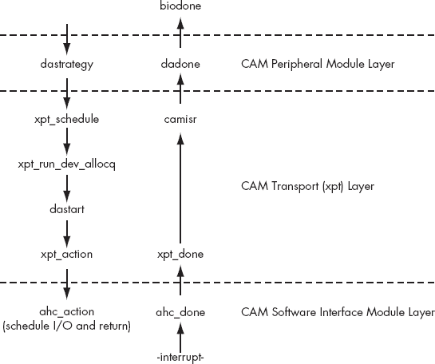

# 第十四章。通用访问方法


*通用访问方法 (CAM)* 是一个 ANSI 标准。尽管主要用于 SCSI，但 CAM 是一种将主机总线适配器 (HBA) 驱动程序与存储驱动程序分离的方法。HBA 是连接主机与其他设备的设备（即一张卡或集成电路）。例如，USB HBA 允许主机与 USB 设备通信。

通过将 HBA 驱动程序与存储驱动程序分离，CAM 减少了单个驱动程序的复杂性。此外，这种分离使得存储驱动程序（如 CD-ROM 和磁带驱动程序）可以在任何 I/O 总线（如 IDE、SCSI 等）上控制它们的设备，只要有一个合适的 HBA 驱动程序可用。换句话说，CAM 将 HBA 和存储驱动程序模块化。

在 CAM 术语中，HBA 驱动程序被称为软件接口模块 (SIMs)，而存储驱动程序被称为外围模块。顺便提一下，第十三章（ch13.html "第十三章。存储驱动程序"）中讨论的存储驱动程序不在 CAM 下。为了避免混淆，从现在起我将把 CAM 下的存储驱动程序称为外围模块。

FreeBSD CAM 实现包含用于 SCSI 并行接口 (SPI)、光纤通道 (FC)、USB 大容量存储 (UMASS)、火线 (IEEE 1394) 和高级技术附件包接口 (ATAPI) 的 SIMs。它具有磁盘（`da`）、CD-ROM（`cd`）、磁带（`sa`）、磁带更换器（`ch`）、处理器类型设备（`pt`）和机箱服务（`ses`）的外围模块。此外，它还提供了一个“直通”接口，允许用户应用程序直接将 I/O 请求发送到任何 CAM 控制的设备（McKusick 和 Neville-Neil，2005）。这个接口本质上是一个 SIM（你很快就会看到）。

在本章中，你将学习如何使用 CAM 管理 HBA。当然，在你能够做到这一点之前，你需要了解 CAM 如何将外围模块与 SIMs 接口。因为外围模块只是带有一些 CAM 相关代码的存储驱动程序，所以本章只是简要地讨论了它们。

# 如何使用 CAM 工作

通过追踪一个 I/O 请求通过 CAM，可以最简单地理解 CAM。

在图 14-1 中，内核将一个以块为中心的 I/O 请求传递给 `da(4)` 外围模块。正如你所期望的，这会导致 `da(4)` 的策略例程（`dastrategy`）执行。



图 14-1. I/O 请求通过 CAM 子系统的路径

`dastrategy` 函数获取以块为中心的 I/O 请求，并通过 `bioq_disksort` 将其插入到适当的块 I/O 队列中。它通过调用 `xpt_schedule` 函数结束。(`da(4)` 外围模块支持每个 SCSI 硬盘。因此，它管理多个块 I/O 队列。)

`xpt_schedule`函数主要安排一个外围模块接收一个*CAM 控制块（CCB）*。CCB 描述了目标设备的位置（或路径）（即 I/O 请求的预期接收者）。`xpt_schedule`函数通过调用`xpt_run_dev_allocq`函数结束。（请注意，我对 CCB 的定义并不完整。我将在本章中扩展这个定义。）

`xpt_run_dev_allocq`函数分配并构建一个 CCB。之后，它调用外围模块的启动例程（在这个例子中是`dastart`）。

`dastart`函数从适当的块 I/O 队列中取出第一个块中心的 I/O 请求，并将其转换为 SCSI 命令。这个命令存储在由`xpt_run_dev_allocq`构建的 CCB 中。`dastart`函数通过调用`xpt_action`函数结束。

`xpt_action`函数使用存储在 CCB 中的路径信息来确定应该将 SCSI 命令发送到哪个 SIM。然后它调用该 SIM 的动作例程（在这种情况下是`ahc_action`）。

### 注意

这个示例中的 SIM 是伪随机选择的，所以它是`ahc(4)`的事实并不重要。

`ahc_action`函数获取 CCB，并将 SCSI 命令转换为特定的硬件命令。然后，这个特定的硬件命令被传递给设备执行。之后，`ahc_action`返回到`dastrategy`的调用者。

一旦设备完成特定的硬件命令（可能涉及 DMA），它就会发送一个中断，这会导致`ahc(4)`的完成例程（`ahc_done`）执行。

`ahc_done`函数将完成状态（即成功或失败）追加到与完成的特定硬件命令相关的 CCB。然后它调用`xpt_done`函数。

`xpt_done`函数获取完成的 CCB，并将其设置好以供`camisr`（CAM 中断服务例程）处理。然后它安排`camisr`运行。

大体上讲，`camisr`函数对 CCB 执行一些“家务”工作。它通过调用 CCB 指定的完成函数（在这个例子中是`dadone`）结束。

`dadone`函数，或多或少地，通过调用`biodone`来告诉内核块中心的 I/O 请求已经被服务。

* * *

^([9]) 图 14-1 是改编自 Marshall Kirk McKusick 和 George V. Neville-Neil 所著的《FreeBSD 操作系统的设计与实现》（Addison-Wesley，2005）。

# （一个）简单示例

现在你已经熟悉了 CAM 子系统，让我们通过一些代码来操作。之后，我将详细说明不同的 CAM 相关函数。

示例 14-1 是一个伪 HBA 的 SIM（从`mfi(4)`代码库中提取）。

### 注意

快速看一下这段代码，并尝试辨别其结构。如果你不理解其中的所有内容，不要担心；解释随后到来。

示例 14-1. mfi_cam.c

```
#include <sys/param.h>
  #include <sys/module.h>
  #include <sys/kernel.h>
  #include <sys/systm.h>

  #include <sys/selinfo.h>
  #include <sys/bus.h>
  #include <sys/conf.h>
  #include <sys/bio.h>
  #include <sys/malloc.h>
  #include <sys/uio.h>

  #include <cam/cam.h>
  #include <cam/cam_ccb.h>
  #include <cam/cam_debug.h>
  #include <cam/cam_sim.h>
  #include <cam/cam_xpt_sim.h>
  #include <cam/scsi/scsi_all.h>

  #include <machine/md_var.h>
  #include <machine/bus.h>
  #include <sys/rman.h>

  #include <dev/mfi/mfireg.h>
  #include <dev/mfi/mfi_ioctl.h>
  #include <dev/mfi/mfivar.h>

  #define ccb_mfip_ptr            sim_priv.entries[0].ptr

  struct mfip {
          device_t                dev;
          struct mfi_softc        *mfi;
          struct cam_devq         *devq;
          struct cam_sim          *sim;
          struct cam_path         *path;
  };

  static devclass_t               mfip_devclass;

  static void                     mfip_action(struct cam_sim *, union ccb *);
  static void                     mfip_poll(struct cam_sim *);
  static struct mfi_command *     mfip_start(void *);
  static void                     mfip_done(struct mfi_command *);

  static int
 mfip_probe(device_t dev)
  {
          device_set_desc(dev, "SCSI pass-through bus");
          return (BUS_PROBE_SPECIFIC);
  }

  static int
  mfip_attach(device_t dev)
  {
          struct mfip *sc;
          struct mfi_softc *mfi;

          sc = device_get_softc(dev);
          if (sc == NULL)
                  return (EINVAL);

          mfi = device_get_softc(device_get_parent(dev));
          sc->dev = dev;
          sc->mfi = mfi;
          mfi->mfi_cam_start = mfip_start;

          if ((sc->devq = cam_simq_alloc(MFI_SCSI_MAX_CMDS)) == NULL)
                  return (ENOMEM);

          sc->sim = cam_sim_alloc(mfip_action, mfip_poll, "mfi", sc,
              device_get_unit(dev), &mfi->mfi_io_lock, 1, MFI_SCSI_MAX_CMDS,
              sc->devq);
          if (sc->sim == NULL) {
                  cam_simq_free(sc->devq);
                  device_printf(dev, "cannot allocate CAM SIM\n");
                  return (EINVAL);
          }

          mtx_lock(&mfi->mfi_io_lock);
          if (xpt_bus_register(sc->sim, dev, 0) != 0) {
                  device_printf(dev,
                      "cannot register SCSI pass-through bus\n");
                  cam_sim_free(sc->sim, FALSE);
                  cam_simq_free(sc->devq);
                  mtx_unlock(&mfi->mfi_io_lock);
                  return (EINVAL);
          }
          mtx_unlock(&mfi->mfi_io_lock);

          return (0);
  }

  static int
  mfip_detach(device_t dev)
  {
          struct mfip *sc;

          sc = device_get_softc(dev);
          if (sc == NULL)
                  return (EINVAL);

          if (sc->sim != NULL) {
                  mtx_lock(&sc->mfi->mfi_io_lock);
                  xpt_bus_deregister(cam_sim_path(sc->sim));
                  cam_sim_free(sc->sim, FALSE);
                  mtx_unlock(&sc->mfi->mfi_io_lock);
          }

          if (sc->devq != NULL)
                  cam_simq_free(sc->devq);

          return (0);
  }

  static void
  mfip_action(struct cam_sim *sim, union ccb *ccb)
  {
          struct mfip *sc;
          struct mfi_softc *mfi;

          sc = cam_sim_softc(sim);
          mfi = sc->mfi;
          mtx_assert(&mfi->mfi_io_lock, MA_OWNED);

          switch (ccb->ccb_h.func_code) {
          case XPT_PATH_INQ:
          {
                  struct ccb_pathinq *cpi;

                  cpi = &ccb->cpi;
                  cpi->version_num = 1;
                  cpi->hba_inquiry = PI_SDTR_ABLE | PI_TAG_ABLE | PI_WIDE_16;
                  cpi->target_sprt = 0;
                  cpi->hba_misc = PIM_NOBUSRESET | PIM_SEQSCAN;
                  cpi->hba_eng_cnt = 0;
                  cpi->max_target = MFI_SCSI_MAX_TARGETS;
                  cpi->max_lun = MFI_SCSI_MAX_LUNS;
                  cpi->initiator_id = MFI_SCSI_INITIATOR_ID;
                  strncpy(cpi->sim_vid, "FreeBSD", SIM_IDLEN);
                  strncpy(cpi->hba_vid, "LSI", HBA_IDLEN);
                  strncpy(cpi->dev_name, cam_sim_name(sim), DEV_IDLEN);
                  cpi->unit_number = cam_sim_unit(sim);
                  cpi->bus_id = cam_sim_bus(sim);
                  cpi->base_transfer_speed = 150000;
                  cpi->protocol = PROTO_SCSI;
                  cpi->protocol_version = SCSI_REV_2;
                  cpi->transport = XPORT_SAS;
                  cpi->transport_version = 0;

                  cpi->ccb_h.status = CAM_REQ_CMP;
                  break;
          }
          case XPT_RESET_BUS:
                  ccb->ccb_h.status = CAM_REQ_CMP;
                  break;
          case XPT_RESET_DEV:
                  ccb->ccb_h.status = CAM_REQ_CMP;
                  break;
          case XPT_GET_TRAN_SETTINGS:
          {
                  struct ccb_trans_settings_sas *sas;

                  ccb->cts.protocol = PROTO_SCSI;
                  ccb->cts.protocol_version = SCSI_REV_2;
                  ccb->cts.transport = XPORT_SAS;
                  ccb->cts.transport_version = 0;
                  sas = &ccb->cts.xport_specific.sas;
                  sas->valid &= ˜CTS_SAS_VALID_SPEED;
                  sas->bitrate = 150000;

                  ccb->ccb_h.status = CAM_REQ_CMP;
                  break;
          }
          case XPT_SET_TRAN_SETTINGS:
                  ccb->ccb_h.status = CAM_FUNC_NOTAVAIL;
                  break;
          case XPT_SCSI_IO:
          {
                  struct ccb_hdr *ccb_h = &ccb->ccb_h;
                  struct ccb_scsiio *csio = &ccb->csio;

                  ccb_h->status = CAM_REQ_INPROG;
                  if (csio->cdb_len > MFI_SCSI_MAX_CDB_LEN) {
                          ccb_h->status = CAM_REQ_INVALID;
                          break;
                  }
                  if ((ccb_h->flags & CAM_DIR_MASK) != CAM_DIR_NONE) {
                          if (ccb_h->flags & CAM_DATA_PHYS) {
                                  ccb_h->status = CAM_REQ_INVALID;
                                  break;
                          }
                          if (ccb_h->flags & CAM_SCATTER_VALID) {
                                  ccb_h->status = CAM_REQ_INVALID;
                                  break;
                          }
                  }

                  ccb_h->ccb_mfip_ptr = sc;
                  TAILQ_INSERT_TAIL(&mfi->mfi_cam_ccbq, ccb_h, sim_links.tqe);
                  mfi_startio(mfi);

                  return;
          }
          default:
                  ccb->ccb_h.status = CAM_REQ_INVALID;
                  break;
          }

          xpt_done(ccb);
          return;
  }

  static void
  mfip_poll(struct cam_sim *sim)
  {
          return;
  }

  static struct mfi_command *
  mfip_start(void *data)
  {
          union ccb *ccb = data;
          struct ccb_hdr *ccb_h = &ccb->ccb_h;
          struct ccb_scsiio *csio = &ccb->csio;
          struct mfip *sc;
          struct mfi_command *cm;
          struct mfi_pass_frame *pt;

          sc = ccb_h->ccb_mfip_ptr;

          if ((cm = mfi_dequeue_free(sc->mfi)) == NULL)
                  return (NULL);

          pt = &cm->cm_frame->pass;
          pt->header.cmd = MFI_CMD_PD_SCSI_IO;
          pt->header.cmd_status = 0;
          pt->header.scsi_status = 0;
          pt->header.target_id = ccb_h->target_id;
          pt->header.lun_id = ccb_h->target_lun;
          pt->header.flags = 0;
          pt->header.timeout = 0;
          pt->header.data_len = csio->dxfer_len;
          pt->header.sense_len = MFI_SENSE_LEN;
          pt->header.cdb_len = csio->cdb_len;
          pt->sense_addr_lo = cm->cm_sense_busaddr;
          pt->sense_addr_hi = 0;
          if (ccb_h->flags & CAM_CDB_POINTER)
                  bcopy(csio->cdb_io.cdb_ptr, &pt->cdb[0], csio->cdb_len);
          else
                  bcopy(csio->cdb_io.cdb_bytes, &pt->cdb[0], csio->cdb_len);

          cm->cm_complete = mfip_done;
          cm->cm_private = ccb;
          cm->cm_sg = &pt->sgl;
          cm->cm_total_frame_size = MFI_PASS_FRAME_SIZE;
          cm->cm_data = csio->data_ptr;
          cm->cm_len = csio->dxfer_len;
          switch (ccb_h->flags & CAM_DIR_MASK) {
          case CAM_DIR_IN:
                  cm->cm_flags = MFI_CMD_DATAIN;
                  break;
          case CAM_DIR_OUT:
                  cm->cm_flags = MFI_CMD_DATAOUT;
                  break;
          case CAM_DIR_NONE:
          default:
                  cm->cm_data = NULL;
                  cm->cm_len = 0;
                  cm->cm_flags = 0;
                  break;
          }

          TAILQ_REMOVE(&sc->mfi->mfi_cam_ccbq, ccb_h, sim_links.tqe);
          return (cm);
  }

  static void
  mfip_done(struct mfi_command *cm)
  {
          union ccb *ccb = cm->cm_private;
          struct ccb_hdr *ccb_h = &ccb->ccb_h;
          struct ccb_scsiio *csio = &ccb->csio;
          struct mfip *sc;
          struct mfi_pass_frame *pt;

          sc = ccb_h->ccb_mfip_ptr;
          pt = &cm->cm_frame->pass;

          switch (pt->header.cmd_status) {
          case MFI_STAT_OK:
          {
                  uint8_t command, device;

                  ccb_h->status = CAM_REQ_CMP;
                  csio->scsi_status = pt->header.scsi_status;

                  if (ccb_h->flags & CAM_CDB_POINTER)
                          command = ccb->csio.cdb_io.cdb_ptr[0];
                  else
                          command = ccb->csio.cdb_io.cdb_bytes[0];

                  if (command == INQUIRY) {
                          device = ccb->csio.data_ptr[0] & 0x1f;
                          if ((device == T_DIRECT) || (device == T_PROCESSOR))
                                  csio->data_ptr[0] =
                                      (device & 0xe0) | T_NODEVICE;
                  }

                  break;
          }
          case MFI_STAT_SCSI_DONE_WITH_ERROR:
          {
                  int sense_len;

                  ccb_h->status = CAM_SCSI_STATUS_ERROR | CAM_AUTOSNS_VALID;
                  csio->scsi_status = pt->header.scsi_status;

                  sense_len = min(pt->header.sense_len,
                      sizeof(struct scsi_sense_data));
                  bzero(&csio->sense_data, sizeof(struct scsi_sense_data));
                  bcopy(&cm->cm_sense->data[0], &csio->sense_data, sense_len);
                  break;
          }
          case MFI_STAT_DEVICE_NOT_FOUND:
                  ccb_h->status = CAM_SEL_TIMEOUT;
                  break;
          case MFI_STAT_SCSI_IO_FAILED:
                  ccb_h->status = CAM_REQ_CMP_ERR;
                  csio->scsi_status = pt->header.scsi_status;
                  break;
          default:
                  ccb_h->status = CAM_REQ_CMP_ERR;
                  csio->scsi_status = pt->header.scsi_status;
                  break;
          }

          mfi_release_command(cm);
          xpt_done(ccb);
  }

  static device_method_t mfip_methods[] = {
          /* Device interface. */
          DEVMETHOD(device_probe,         mfip_probe),
          DEVMETHOD(device_attach,        mfip_attach),
          DEVMETHOD(device_detach,        mfip_detach),
          { 0, 0 }
  };

  static driver_t mfip_driver = {
          "mfip",
          mfip_methods,
          sizeof(struct mfip)
  };

  DRIVER_MODULE(mfip, mfi, mfip_driver, mfip_devclass, 0, 0);
  MODULE_DEPEND(mfip, cam, 1, 1, 1);
  MODULE_DEPEND(mfip, mfi, 1, 1, 1);
```

以下章节将按执行顺序大致描述 示例 14-1 中定义的函数。

作为旁白，因为  `mfip_probe` 非常基础，并且因为我们已经在其他地方检查了类似的代码，所以我会省略对其的讨论。

## mfip_attach 函数

`mfip_attach` 函数是此驱动程序的 `device_attach` 实现。以下是其函数定义（再次）：

```
static int
mfip_attach(device_t dev)
{
        struct mfip *sc;
        struct mfi_softc *mfi;

        sc = device_get_softc(dev);
        if (sc == NULL)
                return (EINVAL);

        mfi = device_get_softc(device_get_parent(dev));
        sc->dev = dev;
        sc->mfi = mfi;
        mfi->mfi_cam_start = mfip_start;

        if ((sc->devq = cam_simq_alloc(MFI_SCSI_MAX_CMDS)) == NULL)
                return (ENOMEM);

        sc->sim = cam_sim_alloc(mfip_action, mfip_poll, "mfi", sc,
            device_get_unit(dev), &mfi->mfi_io_lock, 1, MFI_SCSI_MAX_CMDS,
            sc->devq);
        if (sc->sim == NULL) {
                cam_simq_free(sc->devq);
                device_printf(dev, "cannot allocate CAM SIM\n");
                return (EINVAL);
        }

        mtx_lock(&mfi->mfi_io_lock);
        if (xpt_bus_register(sc->sim, dev, 0) != 0) {
                device_printf(dev,
                    "cannot register SCSI pass-through bus\n");
                cam_sim_free(sc->sim, FALSE);
                cam_simq_free(sc->devq);
                mtx_unlock(&mfi->mfi_io_lock);
                return (EINVAL);
        }
        mtx_unlock(&mfi->mfi_io_lock);

        return (0);
}
```

此函数首先调用  `cam_simq_alloc` 以分配一个 SIM 队列。简单来说，*SIM 队列* 确保 HBAs 不会被 I/O 请求淹没。请看，来自外围模块的 I/O 请求位于 SIM 队列中，等待服务。当一个队列满时，任何额外的请求都会被拒绝。

接下来， 调用 `cam_sim_alloc` 以分配一个 SIM（或总线）描述符。请注意，如果 HBA 实现了多个总线（或通道），则每个总线都需要自己的描述符。

最后， `xpt_bus_register` 接收 `cam_sim_alloc` 返回的描述符并将其注册到 CAM 子系统。

## mfip_detach 函数

`mfip_detach` 函数是此驱动程序的 `device_detach` 实现。以下是其函数定义（再次）：

```
static int
mfip_detach(device_t dev)
{
        struct mfip *sc;

        sc = device_get_softc(dev);
        if (sc == NULL)
                return (EINVAL);

        if (sc->sim != NULL) {
                mtx_lock(&sc->mfi->mfi_io_lock);
              xpt_bus_deregister(cam_sim_path(sc->sim));
              cam_sim_free(sc->sim, FALSE);
                mtx_unlock(&sc->mfi->mfi_io_lock);
        }

        if (sc->devq != NULL)
              cam_simq_free(sc->devq);

        return (0);
}
```

此函数首先通过  注销并  释放其 SIM 描述符。之后，其 SIM 队列被  释放。

## mfip_action 函数

`mfip_action` 函数在 `mfip_attach` 中定义为动作例程（验证见 `cam_sim_alloc` 的第一个参数）。*动作例程* 在每次 SIM 收到 CCB 时执行。

### 注意

回想一下，CCB 包含一个要执行 I/O 请求（或命令）以及目标设备的标识（即 I/O 请求的预期接收者）。

基本上，`mfip_action` 与 图 14-1 中显示的 `ahc_action` 函数类似。以下是其函数定义（再次）：

```
static void
mfip_action(struct cam_sim *sim, union ccb *ccb)
{
        struct mfip *sc;
        struct mfi_softc *mfi;

        sc = cam_sim_softc(sim);
        mfi = sc->mfi;
        mtx_assert(&mfi->mfi_io_lock, MA_OWNED);

      switch (ccb->ccb_h.func_code) {
      case XPT_PATH_INQ:
        {
                struct ccb_pathinq *cpi;

                cpi = &ccb->cpi;
                cpi->version_num = 1;
                cpi->hba_inquiry = PI_SDTR_ABLE | PI_TAG_ABLE | PI_WIDE_16;
                cpi->target_sprt = 0;
                cpi->hba_misc = PIM_NOBUSRESET | PIM_SEQSCAN;
                cpi->hba_eng_cnt = 0;
                cpi->max_target = MFI_SCSI_MAX_TARGETS;
                cpi->max_lun = MFI_SCSI_MAX_LUNS;
                cpi->initiator_id = MFI_SCSI_INITIATOR_ID;
                strncpy(cpi->sim_vid, "FreeBSD", SIM_IDLEN);
                strncpy(cpi->hba_vid, "LSI", HBA_IDLEN);
                strncpy(cpi->dev_name, cam_sim_name(sim), DEV_IDLEN);
                cpi->unit_number = cam_sim_unit(sim);
                cpi->bus_id = cam_sim_bus(sim);
                cpi->base_transfer_speed = 150000;
                cpi->protocol = PROTO_SCSI;
                cpi->protocol_version = SCSI_REV_2;
                cpi->transport = XPORT_SAS;
                cpi->transport_version = 0;

                cpi->ccb_h.status = CAM_REQ_CMP;
                break;
        }
      case XPT_RESET_BUS:
                ccb->ccb_h.status = CAM_REQ_CMP;
                break;
      case XPT_RESET_DEV:
                ccb->ccb_h.status = CAM_REQ_CMP;
                break;
      case XPT_GET_TRAN_SETTINGS:
        {
                struct ccb_trans_settings_sas *sas;

                ccb->cts.protocol = PROTO_SCSI;
                ccb->cts.protocol_version = SCSI_REV_2;
                ccb->cts.transport = XPORT_SAS;
                ccb->cts.transport_version = 0;
                sas = &ccb->cts.xport_specific.sas;
                sas->valid &= ˜CTS_SAS_VALID_SPEED;
                sas->bitrate = 150000;

                ccb->ccb_h.status = CAM_REQ_CMP;
                break;
        }
      case XPT_SET_TRAN_SETTINGS:
                ccb->ccb_h.status = CAM_FUNC_NOTAVAIL;
                break;
      case XPT_SCSI_IO:
        {
                struct ccb_hdr *ccb_h = &ccb->ccb_h;
                struct ccb_scsiio *csio = &ccb->csio;

                ccb_h->status = CAM_REQ_INPROG;
                if (csio->cdb_len > MFI_SCSI_MAX_CDB_LEN) {
                        ccb_h->status = CAM_REQ_INVALID;
                        break;
                }
                if ((ccb_h->flags & CAM_DIR_MASK) != CAM_DIR_NONE) {
                        if (ccb_h->flags & CAM_DATA_PHYS) {
                                ccb_h->status = CAM_REQ_INVALID;
                                break;
                        }
                        if (ccb_h->flags & CAM_SCATTER_VALID) {
                                ccb_h->status = CAM_REQ_INVALID;
                                break;
                        }
                }

                ccb_h->ccb_mfip_ptr = sc;
                TAILQ_INSERT_TAIL(&mfi->mfi_cam_ccbq, ccb_h, sim_links.tqe);
                mfi_startio(mfi);

                return;
        }
        default:
                ccb->ccb_h.status = CAM_REQ_INVALID;
                break;
        }

        xpt_done(ccb);
        return;
}
```

大多数动作例程只是接受一个  CCB 并  根据 `ccb_h.func_code` 变量分支，该变量表示要执行的 I/O 操作。

目前，我将专注于 `mfip_action` 的结构，避免其具体细节。`mfip_action` 的深入解释可以在 动作例程 中找到，位于 xpt_bus_register 函数。

如您所见，这个函数可以执行六种 I/O 操作之一：它可以  返回 SIM 和 HBA 属性，重置  总线或  设备， 获取或  设置传输设置，或者  向设备发出 SCSI 命令。

## `mfip_poll` 函数

`mfip_poll` 函数定义在 `mfip_attach` 中作为轮询例程（验证见 `cam_sim_alloc` 的第二个参数）。通常，*轮询例程* 包装 SIM 的中断处理程序。例如，当中断不可用（例如，在内核恐慌之后）时，CAM 子系统将使用轮询例程来运行其中断处理程序。

以下是 `mfip_poll` 函数的定义（再次）：

```
static void
mfip_poll(struct cam_sim *sim)
{
        return;
}
```

由于这个 SIM 没有实现中断处理程序，`mfip_poll` 只是  返回。

## `mfip_start` 函数

`mfip_start` 函数将 SCSI 命令转换为硬件特定命令。这个函数仅由 `mfi_startio` 调用。

### 注意

`mfi_startio` 函数定义在 *mfi.c* 中（本书未对其进行描述）。`mfi_startio` 由 `mfip_action` 调用（在 mfip_action 函数 中描述，见 mfip_action 函数）以向设备发出 SCSI 命令。

这里是 `mfip_start` 函数的定义（再次）：

```
static struct mfi_command *
mfip_start(void *data)
{
        union ccb *ccb = data;
        struct ccb_hdr *ccb_h = &ccb->ccb_h;
        struct ccb_scsiio *csio = &ccb->csio;
        struct mfip *sc;
        struct mfi_command *cm;
        struct mfi_pass_frame *pt;

        sc = ccb_h->ccb_mfip_ptr;

        if ((cm = mfi_dequeue_free(sc->mfi)) == NULL)
                return (NULL);

        pt = &cm->cm_frame->pass;
        pt->header.cmd = MFI_CMD_PD_SCSI_IO;
        pt->header.cmd_status = 0;
        pt->header.scsi_status = 0;
        pt->header.target_id = ccb_h->target_id;
        pt->header.lun_id = ccb_h->target_lun;
        pt->header.flags = 0;
        pt->header.timeout = 0;
        pt->header.data_len = csio->dxfer_len;
        pt->header.sense_len = MFI_SENSE_LEN;
        pt->header.cdb_len = csio->cdb_len;
        pt->sense_addr_lo = cm->cm_sense_busaddr;
        pt->sense_addr_hi = 0;
        if (ccb_h->flags & CAM_CDB_POINTER)
                bcopy(csio->cdb_io.cdb_ptr, &pt->cdb[0], csio->cdb_len);
        else
                bcopy(csio->cdb_io.cdb_bytes, &pt->cdb[0], csio->cdb_len);

        cm->cm_complete = mfip_done;
        cm->cm_private = ccb;
        cm->cm_sg = &pt->sgl;
        cm->cm_total_frame_size = MFI_PASS_FRAME_SIZE;
        cm->cm_data = csio->data_ptr;
        cm->cm_len = csio->dxfer_len;
        switch (ccb_h->flags & CAM_DIR_MASK) {
        case CAM_DIR_IN:
                cm->cm_flags = MFI_CMD_DATAIN;
                break;
        case CAM_DIR_OUT:
                cm->cm_flags = MFI_CMD_DATAOUT;
                break;
        case CAM_DIR_NONE:
        default:
                cm->cm_data = NULL;
                cm->cm_len = 0;
                cm->cm_flags = 0;
                break;
        }

        TAILQ_REMOVE(&sc->mfi->mfi_cam_ccbq, ccb_h, sim_links.tqe);
        return (cm);
}
```

如您所见，这个函数相当直接——它只是一系列赋值操作。在我们检查完 `struct ccb_scsiio` 和 `struct ccb_hdr` 之前，这些内容出现在 XPT_SCSI_IO 的 XPT_SCSI_IO 中，我将推迟对这个函数的详细分析。

注意到  `mfip_done` 被设置为硬件特定命令的完成例程。

## `mfip_done` 函数

如前所述，`mfip_done` 函数是这个 SIM 的完成例程。它在设备完成硬件特定命令后立即由 `mfi_intr` 执行。

### 注意

`mfi_intr` 函数是 `mfi(4)` 的中断处理程序。它在 *mfi.c* 中定义。

基本上，`mfip_done` 与 图 14-1 中显示的 `ahc_done` 函数类似。这是它的函数定义（再次）：

```
static void
mfip_done(struct mfi_command *cm)
{
        union ccb *ccb = cm->cm_private;
        struct ccb_hdr *ccb_h = &ccb->ccb_h;
        struct ccb_scsiio *csio = &ccb->csio;
        struct mfip *sc;
        struct mfi_pass_frame *pt;

        sc = ccb_h->ccb_mfip_ptr;
        pt = &cm->cm_frame->pass;

        switch (pt->header.cmd_status) {
        case MFI_STAT_OK:
        {
                uint8_t command, device;

              ccb_h->status = CAM_REQ_CMP;
                csio->scsi_status = pt->header.scsi_status;

                if (ccb_h->flags & CAM_CDB_POINTER)
                        command = ccb->csio.cdb_io.cdb_ptr[0];
                else
                        command = ccb->csio.cdb_io.cdb_bytes[0];

                if (command == INQUIRY) {
                        device = ccb->csio.data_ptr[0] & 0x1f;
                        if ((device == T_DIRECT) || (device == T_PROCESSOR))
                                csio->data_ptr[0] =
                                    (device & 0xe0) | T_NODEVICE;
                }

                break;
        }
        case MFI_STAT_SCSI_DONE_WITH_ERROR:
        {
                int sense_len;

              ccb_h->status = CAM_SCSI_STATUS_ERROR | CAM_AUTOSNS_VALID;
                csio->scsi_status = pt->header.scsi_status;

                sense_len = min(pt->header.sense_len,
                    sizeof(struct scsi_sense_data));
                bzero(&csio->sense_data, sizeof(struct scsi_sense_data));
                bcopy(&cm->cm_sense->data[0], &csio->sense_data, sense_len);
                break;
        }
        case MFI_STAT_DEVICE_NOT_FOUND:
              ccb_h->status = CAM_SEL_TIMEOUT;
                break;
        case MFI_STAT_SCSI_IO_FAILED:
              ccb_h->status = CAM_REQ_CMP_ERR;
                csio->scsi_status = pt->header.scsi_status;
                break;
        default:
              ccb_h->status = CAM_REQ_CMP_ERR;
                csio->scsi_status = pt->header.scsi_status;
                break;
        }

        mfi_release_command(cm);
      xpt_done(ccb);
}
```

通常，执行例程会接受一个硬件特定的命令，并将其完成状态（即成功或失败）附加到其关联的     CCB。完成此操作后， `xpt_done` 被调用以处理完成的 CCB。

### 注意

`mfi(4)` 代码库使用 DMA 从设备获取完成状态。

现在你已经熟悉了示例 14-1，我将详细说明它所使用的不同函数、结构和构造。

# SIM 注册例程

如前所述，使用 CAM 子系统注册 SIM 涉及三个功能：

+   `cam_simq_alloc`

+   `cam_sim_alloc`

+   `xpt_bus_register`

## cam_simq_alloc 函数

`cam_simq_alloc` 函数分配一个 SIM 队列。

```
#include <cam/cam_sim.h>
#include <cam/cam_queue.h>

struct cam_devq *
cam_simq_alloc(u_int32_t max_sim_transactions);
```

在这里，`max_sim_transactions` 表示 SIM 队列的大小。通常，它计算如下：

```
max_sim_transactions = number_of_supported_devices *
    number_of_commands_that_can_be_concurrently_processed_per_device;
```

## cam_sim_alloc 函数

`cam_sim_alloc` 函数分配一个 SIM（或总线）描述符。

### 注意

如果 HBA 实现了多个总线（或通道），则每个总线都需要其自己的描述符。

```
#include <sys/param.h>
#include <sys/lock.h>
#include <sys/mutex.h>

#include <cam/cam_sim.h>
#include <cam/cam_queue.h>

struct cam_sim *
cam_sim_alloc(sim_action_func sim_action, sim_poll_func sim_poll,
    const char *sim_name, void *softc, u_int32_t unit, struct mtx *mtx,
    int max_dev_transactions, int max_tagged_dev_transactions,
    struct cam_devq *queue);
```

因为 `cam_sim_alloc` 的前六个参数相当明显——它们正是其名称所暗示的——所以我将省略对它们的讨论。

`max_dev_transactions` 参数指定每个设备并发事务的最大数量。此参数仅适用于不支持 SCSI 标记命令队列（SCSI TCQ）的设备。通常，`max_dev_transactions` 总是设置为 `1`。

`max_tagged_dev_transactions` 参数与 `max_dev_transactions` 相同，但它仅适用于支持 SCSI TCQ 的设备。

`queue` 参数期望一个指向 SIM 队列的指针（即 `cam_simq_alloc` 的返回值）。

## xpt_bus_register 函数

`xpt_bus_register` 函数将 SIM 注册到 CAM 子系统。

```
#include <cam/cam_sim.h>
#include <cam/cam_xpt_sim.h>

int32_t
xpt_bus_register(struct cam_sim *sim, device_t parent, u_int32_t bus)
```

在这里，`sim` 指定要注册的 SIM（即 `cam_sim_alloc` 的返回值），而 `bus` 表示其总线号。`parent` 参数目前未使用。

### 注意

如果 HBA 实现了多个总线（或通道），则每个总线都需要其唯一的总线号。

# 动作例程

如前所述，动作例程在 SIM 收到 CCB 时执行。你可以将动作例程视为 SIM 的“主函数”。

这里是动作例程的函数原型（来自 `<cam/cam_sim.h>` 头文件）：

```
typedef void (*sim_action_func)(struct cam_sim *sim, union ccb *ccb);
```

回想一下，动作例程根据 `ccb->ccb_h.func_code` 变量进行 `switch`，该变量包含表示要执行 I/O 操作的常量。在本章的其余部分，我将详细介绍最常见的常量/操作。

### 注意

对于常量/操作的完整列表，请参阅 `<cam/cam_ccb.h>` 头文件中定义的 `xpt_opcode` 枚举。

## XPT_PATH_INQ

`XPT_PATH_INQ` 常量指定了一个路径查询操作，它返回 SIM 和 HBA 属性。传递给 `XPT_PATH_INQ` 的操作例程简单地填充一个 `ccb_pathinq` 结构体然后返回。

`struct ccb_pathinq` 在 `<cam/cam_ccb.h>` 头文件中定义如下：

```
struct ccb_pathinq {
        struct ccb_hdr ccb_h;           /* Header information fields.   */
        u_int8_t    version_num;        /* Version number.              */
        u_int8_t    hba_inquiry;        /* Imitate INQ byte 7\.          */
        u_int8_t    target_sprt;        /* Target mode support flags.   */
        u_int8_t    hba_misc;           /* Miscellaneous HBA features.  */
        u_int16_t   hba_eng_cnt;        /* HBA engine count.            */

        u_int8_t vuhba_flags[VUHBALEN]; /* Vendor unique capabilities.  */
        u_int32_t   max_target;         /* Maximum supported targets.   */
        u_int32_t   max_lun;            /* Maximum supported LUN.       */
        u_int32_t   async_flags;        /* Asynchronous handler flags.  */
        path_id_t   hpath_id;      /* Highest path ID in the subsystem. */
        target_id_t initiator_id;       /* HBA ID on the bus.           */

        char sim_vid[SIM_IDLEN];        /* SIM vendor ID.               */
        char hba_vid[HBA_IDLEN];        /* HBA vendor ID.               */
        char dev_name[DEV_IDLEN];       /* SIM device name.             */

        u_int32_t   unit_number;        /* SIM unit number.             */
        u_int32_t   bus_id;             /* SIM bus ID.                  */
        u_int32_t base_transfer_speed;  /* Base bus speed in KB/sec.    */

        cam_proto   protocol;           /* CAM protocol.                */
        u_int       protocol_version;   /* CAM protocol version.        */
        cam_xport   transport;          /* Transport (e.g., FC, USB).   */
        u_int       transport_version;  /* Transport version.           */
        union {
                struct ccb_pathinq_settings_spi spi;
                struct ccb_pathinq_settings_fc fc;
                struct ccb_pathinq_settings_sas sas;
                char ccb_pathinq_settings_opaque[PATHINQ_SETTINGS_SIZE];
        } xport_specific;

        u_int maxio;    /* Maximum supported I/O size (in bytes).       */
};
```

这里是一个 `XPT_PATH_INQ` 操作的示例（摘自 示例 14-1)：

```
static void
mfip_action(struct cam_sim *sim, union ccb *ccb)
{
        struct mfip *sc;
        struct mfi_softc *mfi;

        sc = cam_sim_softc(sim);
        mfi = sc->mfi;
        mtx_assert(&mfi->mfi_io_lock, MA_OWNED);

        switch (ccb->ccb_h.func_code) {
        case XPT_PATH_INQ:
        {
                struct ccb_pathinq *cpi;

                cpi = &ccb->cpi;
                cpi->version_num = 1;
                cpi->hba_inquiry = PI_SDTR_ABLE | PI_TAG_ABLE | PI_WIDE_16;
                cpi->target_sprt = 0;
                cpi->hba_misc = PIM_NOBUSRESET | PIM_SEQSCAN;
                cpi->hba_eng_cnt = 0;
                cpi->max_target = MFI_SCSI_MAX_TARGETS;
                cpi->max_lun = MFI_SCSI_MAX_LUNS;
                cpi->initiator_id = MFI_SCSI_INITIATOR_ID;
                strncpy(cpi->sim_vid, "FreeBSD", SIM_IDLEN);
                strncpy(cpi->hba_vid, "LSI", HBA_IDLEN);
                strncpy(cpi->dev_name, cam_sim_name(sim), DEV_IDLEN);
                cpi->unit_number = cam_sim_unit(sim);
                cpi->bus_id = cam_sim_bus(sim);
                cpi->base_transfer_speed = 150000;
                cpi->protocol = PROTO_SCSI;
                cpi->protocol_version = SCSI_REV_2;
                cpi->transport = XPORT_SAS;
                cpi->transport_version = 0;

              cpi->ccb_h.status = CAM_REQ_CMP;
                break;
        }
...
        default:
              ccb->ccb_h.status = CAM_REQ_INVALID;
                break;
        }

        xpt_done(ccb);
        return;
}
```

注意到 `ccb_pathinq` 结构体是由  CCB 提供的。此外，注意到任何操作的  成功或  失败都返回在   `ccb_h.status` 中。

## XPT_RESET_BUS

`XPT_RESET_BUS` 常量指定了一个总线重置操作。正如你所预期的那样，`XPT_RESET_BUS` 非常特定于硬件。以下是一个最小化实现（摘自 示例 14-1)：

```
static void
mfip_action(struct cam_sim *sim, union ccb *ccb)
{
        struct mfip *sc;
        struct mfi_softc *mfi;

        sc = cam_sim_softc(sim);
        mfi = sc->mfi;
        mtx_assert(&mfi->mfi_io_lock, MA_OWNED);

        switch (ccb->ccb_h.func_code) {
...
        case XPT_RESET_BUS:
                ccb->ccb_h.status = CAM_REQ_CMP;
                break;
...
        default:
                ccb->ccb_h.status = CAM_REQ_INVALID;
                break;
        }

        xpt_done(ccb);
        return;
}
```

在这里， `sim` 是要重置的总线。不出所料，最小化实现放弃了任何“真实”的工作，并简单地返回  成功。

许多 SIM 使用最小化实现。一个“正确”的实现超出了本书的范围。

## XPT_GET_TRAN_SETTINGS

`XPT_GET_TRAN_SETTINGS` 常量表示一个返回当前传输设置或用户定义的上限的 I/O 操作。传递给 `XPT_GET_TRAN_SETTINGS` 的操作例程简单地填充一个 `ccb_trans_settings` 结构体然后返回。

`struct ccb_trans_settings` 定义在 `<cam/cam_ccb.h>` 中，如下所示：

```
typedef enum {
        CTS_TYPE_CURRENT_SETTINGS,      /* Current transfer settings.   */
        CTS_TYPE_USER_SETTINGS          /* User-defined upper limits.   */
} cts_type;

struct ccb_trans_settings {
        struct ccb_hdr ccb_h;           /* Header information fields.   */
        cts_type  type;                 /* Current or user settings?    */
        cam_proto protocol;             /* CAM protocol.                */
        u_int     protocol_version;     /* CAM protocol version.        */
        cam_xport transport;            /* Transport (e.g., FC, USB).   */
        u_int     transport_version;    /* Transport version.           */

      union {
                u_int valid;            /* Which field(s) to honor.     */
                struct ccb_trans_settings_scsi scsi;
        } proto_specific;

      union {
                u_int valid;            /* Which field(s) to honor.     */
                struct ccb_trans_settings_spi spi;
                struct ccb_trans_settings_fc fc;
                struct ccb_trans_settings_sas sas;
                struct ccb_trans_settings_ata ata;
                struct ccb_trans_settings_sata sata;
        } xport_specific;
};
```

如你所见，`ccb_trans_settings` 将一个  协议结构体和五个  传输特定结构体打包。这些结构体在 `<cam/cam_ccb.h>` 中定义如下：

```
struct ccb_trans_settings_scsi {
        u_int           valid;          /* Which field(s) to honor.     */
#define CTS_SCSI_VALID_TQ               0x01
        u_int           flags;
#define CTS_SCSI_FLAGS_TAG_ENB          0x01
};

struct ccb_trans_settings_spi {
        u_int           valid;          /* Which field(s) to honor.     */
#define CTS_SPI_VALID_SYNC_RATE         0x01
#define CTS_SPI_VALID_SYNC_OFFSET       0x02
#define CTS_SPI_VALID_BUS_WIDTH         0x04
#define CTS_SPI_VALID_DISC              0x08
#define CTS_SPI_VALID_PPR_OPTIONS       0x10
        u_int           flags;
#define CTS_SPI_FLAGS_DISC_ENB          0x01
        u_int           sync_period;    /* Sync period.                 */
        u_int           sync_offset;    /* Sync offset.                 */
        u_int           bus_width;      /* Bus width.                   */
        u_int           ppr_options;    /* Parallel protocol request.   */
};

struct ccb_trans_settings_fc {
        u_int           valid;          /* Which field(s) to honor.     */
#define CTS_FC_VALID_WWNN               0x8000
#define CTS_FC_VALID_WWPN               0x4000
#define CTS_FC_VALID_PORT               0x2000
#define CTS_FC_VALID_SPEED              0x1000
        u_int64_t       wwnn;           /* World wide node name.        */
        u_int64_t       wwpn;           /* World wide port name.        */
        u_int32_t       port;           /* 24-bit port ID (if known).   */
        u_int32_t       bitrate;        /* Mbps.                        */
};

struct ccb_trans_settings_sas {
        u_int           valid;          /* Which field(s) to honor.     */
#define CTS_SAS_VALID_SPEED             0x1000
        u_int32_t       bitrate;        /* Mbps.                        */
};

struct ccb_trans_settings_ata {
        u_int           valid;          /* Which field(s) to honor.     */
#define CTS_ATA_VALID_MODE              0x01
#define CTS_ATA_VALID_BYTECOUNT         0x02
#define CTS_ATA_VALID_ATAPI             0x20
        int             mode;           /* Mode.                        */
        u_int           bytecount;      /* PIO transaction length.      */
        u_int           atapi;          /* ATAPI CDB length.            */
};

struct ccb_trans_settings_sata {
        u_int           valid;          /* Which field(s) to honor.     */
#define CTS_SATA_VALID_MODE             0x01
#define CTS_SATA_VALID_BYTECOUNT        0x02
#define CTS_SATA_VALID_REVISION         0x04
#define CTS_SATA_VALID_PM               0x08
#define CTS_SATA_VALID_TAGS             0x10
#define CTS_SATA_VALID_ATAPI            0x20
#define CTS_SATA_VALID_CAPS             0x40
        int             mode;           /* Legacy PATA mode.            */
        u_int           bytecount;      /* PIO transaction length.      */
        int             revision;       /* SATA revision.               */
        u_int           pm_present;     /* PM is present (XPT->SIM).    */
        u_int           tags;           /* Number of allowed tags.      */
        u_int           atapi;          /* ATAPI CDB length.            */
        u_int           caps;           /* Host and device SATA caps.   */
#define CTS_SATA_CAPS_H                 0x0000ffff
#define CTS_SATA_CAPS_H_PMREQ           0x00000001
#define CTS_SATA_CAPS_H_APST            0x00000002
#define CTS_SATA_CAPS_H_DMAAA           0x00000010
#define CTS_SATA_CAPS_D                 0xffff0000
#define CTS_SATA_CAPS_D_PMREQ           0x00010000
#define CTS_SATA_CAPS_D_APST            0x00020000
};
```

这里是一个 `XPT_GET_TRAN_SETTINGS` 操作的示例（摘自 示例 14-1)：

```
static void
mfip_action(struct cam_sim *sim, union ccb *ccb)
{
        struct mfip *sc;
        struct mfi_softc *mfi;

        sc = cam_sim_softc(sim);
        mfi = sc->mfi;
        mtx_assert(&mfi->mfi_io_lock, MA_OWNED);

        switch (ccb->ccb_h.func_code) {
...
        case XPT_GET_TRAN_SETTINGS:
        {
                struct ccb_trans_settings_sas *sas;

              ccb->cts.protocol = PROTO_SCSI;
                ccb->cts.protocol_version = SCSI_REV_2;
                ccb->cts.transport = XPORT_SAS;
                ccb->cts.transport_version = 0;
                sas = &ccb->cts.xport_specific.sas;
                sas->valid &= ˜CTS_SAS_VALID_SPEED;
                sas->bitrate = 150000;

                ccb->ccb_h.status = CAM_REQ_CMP;
                break;
        }
...
        default:
                ccb->ccb_h.status = CAM_REQ_INVALID;
                break;
        }

        xpt_done(ccb);
        return;
}
```

注意到  `ccb_trans_settings` 结构体是由  CCB 提供的。自然地，只有适用于 HBA 的字段被填充。

## XPT_SET_TRAN_SETTINGS

正如你所预期的那样，`XPT_SET_TRAN_SETTINGS` 是 `XPT_GET_TRAN_SETTINGS` 的反义。也就是说，`XPT_SET_TRAN_SETTINGS` 根据一个 `ccb_trans_settings` 结构体更改当前的传输设置。不出所料，并非所有 SIM 都支持此操作。例如：

```
static void
mfip_action(struct cam_sim *sim, union ccb *ccb)
{
        struct mfip *sc;
        struct mfi_softc *mfi;

        sc = cam_sim_softc(sim);
        mfi = sc->mfi;
        mtx_assert(&mfi->mfi_io_lock, MA_OWNED);

        switch (ccb->ccb_h.func_code) {
...
        case XPT_SET_TRAN_SETTINGS:
                ccb->ccb_h.status = CAM_FUNC_NOTAVAIL;
                break;
...
        default:
                ccb->ccb_h.status = CAM_REQ_INVALID;
                break;
        }

        xpt_done(ccb);
        return;
}
```

此函数声明 `XPT_SET_TRAN_SETTINGS`  不可用。请注意，“正确”的实现是特定于硬件的，且本书未涉及。

## XPT_SCSI_IO

`XPT_SCSI_IO` 常量表示向设备发出 SCSI 命令的 I/O 操作。这个 SCSI 命令的详细信息存储在两个结构中：`ccb_scsiio` 和 `ccb_hdr`。

`struct ccb_scsiio` 在 `<cam/cam_ccb.h>` 中定义如下：

```
struct ccb_scsiio {
        struct ccb_hdr ccb_h;           /* Header information fields.   */
        union ccb *next_ccb;            /* Next CCB to process.         */
        u_int8_t  *req_map;             /* Mapping information.         */
        u_int8_t  *data_ptr;            /* Data buffer or S/G list.     */
        u_int32_t  dxfer_len;           /* Length of data to transfer.  */

        /* Sense information (used if the command returns an error).    */
        struct scsi_sense_data sense_data;

        u_int8_t   sense_len;           /* Sense information length.    */
        u_int8_t   cdb_len;             /* SCSI command length.         */
        u_int16_t  sglist_cnt;          /* Number of S/G segments.      */
        u_int8_t   scsi_status; /* SCSI status (returned by device).    */
        u_int8_t   sense_resid; /* Residual sense information length.   */
        u_int32_t  resid;               /* Residual data length.        */
        cdb_t      cdb_io;              /* SCSI command.                */
        u_int8_t  *msg_ptr;             /* Message.                     */
        u_int16_t  msg_len;             /* Message length.              */
        u_int8_t   tag_action;          /* Tag action?                  */
        /*
         * tag_action should be the constant below to send a non-tagged
         * transaction or one of the constants in scsi_message.h.
         */
#define CAM_TAG_ACTION_NONE             0x00
        u_int      tag_id;              /* Tag ID (from initiator).     */
        u_int      init_id;             /* Initiator ID.                */
};
```

`struct ccb_hdr` 也在 `<cam/cam_ccb.h>` 中定义，如下所示：

```
struct ccb_hdr {
        cam_pinfo       pinfo;          /* Priority scheduling.         */
        camq_entry      xpt_links;      /* Transport layer links.       */
        camq_entry      sim_links;      /* SIM layer links.             */
        camq_entry      periph_links;   /* Peripheral layer links.      */
        u_int32_t       retry_count;    /* Retry count.                 */

        /* Pointer to peripheral module done routine.                   */
        void (*cbfcnp)(struct cam_periph *, union ccb *);

        xpt_opcode      func_code;      /* I/O operation to perform.    */
        u_int32_t     status;         /* Completion status.           */
        struct cam_path *path;          /* Path for this CCB.           */
        path_id_t       path_id;        /* Path ID for the request.     */
        target_id_t     target_id;      /* Target device ID.            */
        lun_id_t        target_lun;     /* Target logical unit number.  */
        u_int32_t       flags;          /* CCB flags.                   */
        ccb_ppriv_area  periph_priv;    /* Private use by peripheral.   */
        ccb_spriv_area  sim_priv;       /* Private use by SIM.          */
        u_int32_t       timeout;        /* Timeout value.               */

        /* Deprecated. Don't use!                                       */
        struct callout_handle timeout_ch;
};
```

`struct ccb_hdr` 应该看起来很熟悉——它用于在每次 I/O 操作中返回  完成状态。

以下是一个示例 `XPT_SCSI_IO` 操作（取自 示例 14-1)：

```
#define ccb_mfip_ptr            sim_priv.entries[0].ptr
...
static void
mfip_action(struct cam_sim *sim, union ccb *ccb)
{
        struct mfip *sc;
        struct mfi_softc *mfi;

        sc = cam_sim_softc(sim);
        mfi = sc->mfi;
        mtx_assert(&mfi->mfi_io_lock, MA_OWNED);

        switch (ccb->ccb_h.func_code) {
...
        case XPT_SCSI_IO:
        {
                struct ccb_hdr *ccb_h = &ccb->ccb_h;
                struct ccb_scsiio *csio = &ccb->csio;

                ccb_h->status = CAM_REQ_INPROG;
              if (csio->cdb_len > MFI_SCSI_MAX_CDB_LEN) {
                        ccb_h->status = CAM_REQ_INVALID;
                        break;
                }
              if ((ccb_h->flags & CAM_DIR_MASK) != CAM_DIR_NONE) {
                      if (ccb_h->flags & CAM_DATA_PHYS) {
                                ccb_h->status = CAM_REQ_INVALID;
                              break;
                        }
                      if (ccb_h->flags & CAM_SCATTER_VALID) {
                                ccb_h->status = CAM_REQ_INVALID;
                              break;
                        }
                }

              ccb_h->ccb_mfip_ptr = sc;
                TAILQ_INSERT_TAIL(&mfi->mfi_cam_ccbq, ccb_h, sim_links.tqe);
              mfi_startio(mfi);

                return;
        }
        default:
                ccb->ccb_h.status = CAM_REQ_INVALID;
                break;
        }

        xpt_done(ccb);
        return;
}
```

此操作首先  检查 SCSI 命令长度是否可接受。然后确定 SCSI 命令是否使用  物理地址或  散列/聚集段来  传输数据。如果使用任一，此操作   将退出（因为它接收了无效的参数）。然后 `ccb_h->ccb_mfip_ptr` 被设置为软件上下文，并调用 `mfi_startio`。

### 注意

`mfi_startio` 函数实际上是发出 SCSI 命令的函数。

从 mfip_start 函数 和 mfip_poll 函数 中回忆起，`mfi_startio` 调用 `mfip_start` 将 SCSI 命令转换为特定于硬件的命令。

```
static struct mfi_command *
mfip_start(void *data)
{
        union ccb *ccb = data;
        struct ccb_hdr *ccb_h = &ccb->ccb_h;
        struct ccb_scsiio *csio = &ccb->csio;
        struct mfip *sc;
        struct mfi_command *cm;
        struct mfi_pass_frame *pt;

        sc = ccb_h->ccb_mfip_ptr;

        if ((cm = mfi_dequeue_free(sc->mfi)) == NULL)
                return (NULL);

        pt = &cm->cm_frame->pass;
        pt->header.cmd = MFI_CMD_PD_SCSI_IO;
        pt->header.cmd_status = 0;
        pt->header.scsi_status = 0;
        pt->header.target_id = ccb_h->target_id;
        pt->header.lun_id = ccb_h->target_lun;
        pt->header.flags = 0;
        pt->header.timeout = 0;
        pt->header.data_len = csio->dxfer_len;
        pt->header.sense_len = MFI_SENSE_LEN;
        pt->header.cdb_len = csio->cdb_len;
        pt->sense_addr_lo = cm->cm_sense_busaddr;
        pt->sense_addr_hi = 0;
        if (ccb_h->flags & CAM_CDB_POINTER)
                bcopy(csio->cdb_io.cdb_ptr, &pt->cdb[0],
 csio->cdb_len);
        else
                bcopy(csio->cdb_io.cdb_bytes, &pt->cdb[0], csio->cdb_len);

        cm->cm_complete = mfip_done;
        cm->cm_private = ccb;
        cm->cm_sg = &pt->sgl;
        cm->cm_total_frame_size = MFI_PASS_FRAME_SIZE;
        cm->cm_data = csio->data_ptr;
        cm->cm_len = csio->dxfer_len;
        switch (ccb_h->flags & CAM_DIR_MASK) {
      case CAM_DIR_IN:
                cm->cm_flags = MFI_CMD_DATAIN;
                break;
      case CAM_DIR_OUT:
                cm->cm_flags = MFI_CMD_DATAOUT;
                break;
      case CAM_DIR_NONE:
        default:
                cm->cm_data = NULL;
                cm->cm_len = 0;
                cm->cm_flags = 0;
                break;
        }

        TAILQ_REMOVE(&sc->mfi->mfi_cam_ccbq, ccb_h, sim_links.tqe);
        return (cm);
}
```

注意到 `struct ccb_hdr` 列出了目标设备的  设备 ID 和  逻辑单元号。它还列出了 SCSI 命令是否在  输入、 输出或  无操作中传输数据。请注意，`XPT_SCSI_IO` 操作是从 SIM 的角度看到的。因此，“输入”意味着来自设备，“输出”意味着到设备。

`ccb_scsiio`结构维护要传输的数据及其长度。它还维护 SCSI 命令（通过一个指针或一个缓冲区）以及命令的长度。

### 注意

再次强调，上面构建的针对特定硬件的命令是通过`mfi_startio`向目标设备发出的。

回想一下，一旦设备完成针对特定硬件的命令，它会发送一个中断，这会导致完成例程（在这种情况下是`mfip_done`）执行。

```
static void
mfip_done(struct mfi_command *cm)
{
        union ccb *ccb = cm->cm_private;
        struct ccb_hdr *ccb_h = &ccb->ccb_h;
        struct ccb_scsiio *csio = &ccb->csio;
        struct mfip *sc;
        struct mfi_pass_frame *pt;

        sc = ccb_h->ccb_mfip_ptr;
        pt = &cm->cm_frame->pass;

        switch (pt->header.cmd_status) {
        case MFI_STAT_OK:
        {
                uint8_t command, device;

                ccb_h->status = CAM_REQ_CMP;
                csio->scsi_status = pt->header.scsi_status;

                if (ccb_h->flags & CAM_CDB_POINTER)
                        command = ccb->csio.cdb_io.cdb_ptr[0];
                else
                        command = ccb->csio.cdb_io.cdb_bytes[0];

                if (command == INQUIRY) {
                        device = ccb->csio.data_ptr[0] & 0x1f;
                        if ((device == T_DIRECT) || (device == T_PROCESSOR))
                                csio->data_ptr[0] =
                                    (device & 0xe0) | T_NODEVICE;
                }

                break;
        }
      case MFI_STAT_SCSI_DONE_WITH_ERROR:
        {
                int sense_len;

                ccb_h->status = CAM_SCSI_STATUS_ERROR | CAM_AUTOSNS_VALID;
                csio->scsi_status = pt->header.scsi_status;

                sense_len = min(pt->header.sense_len,
                    sizeof(struct scsi_sense_data));
                bzero(&csio->sense_data, sizeof(struct scsi_sense_data));
              bcopy(&cm->cm_sense->data[0], &csio->sense_data,
                    sense_len);
                break;
        }
        case MFI_STAT_DEVICE_NOT_FOUND:
                ccb_h->status = CAM_SEL_TIMEOUT;
                break;
        case MFI_STAT_SCSI_IO_FAILED:
                ccb_h->status = CAM_REQ_CMP_ERR;
                csio->scsi_status = pt->header.scsi_status;
                break;
        default:
                ccb_h->status = CAM_REQ_CMP_ERR;
                csio->scsi_status = pt->header.scsi_status;
                break;
        }

        mfi_release_command(cm);
        xpt_done(ccb);
}
```

注意，如果针对特定硬件的命令返回错误，错误信息（或感应数据）会被复制到`ccb_scsiio`结构的`sense_data`字段。

在游戏进行到这一点时，这个函数中未解释的部分应该是显而易见的。

## XPT_RESET_DEV

`XPT_RESET_DEV`常量指定了一个设备重置操作。不出所料，`XPT_RESET_DEV`相当特定于硬件。以下是一个简单的`XPT_RESET_DEV`操作（来自*bt.c*）：

### 注意

`bt.c`源文件是`bt(4)`代码库的一部分。

```
static void
btaction(struct cam_sim *sim, union ccb *ccb)
{
        struct bt_softc *bt;

        bt = (struct bt_softc *)cam_sim_softc(sim);

        switch (ccb->ccb_h.func_code) {
        case XPT_RESET_DEV:
                /* FALLTHROUGH */
        case XPT_SCSI_IO:
        {
...
```

由于必须发出一个针对特定硬件的命令来重置此设备，`XPT_RESET_DEV`简单地通过级联到`XPT_SCSI_IO`。

虽然这里没有展示，但应强调所有操作都是通过将它们的完成状态附加到它们的 CCB（Completion Command Block）然后调用`xpt_done(ccb)`来结束的。

# 结论

本章重点介绍了 HBA 驱动程序，或 SIMs，因为它们是最常见的 CAM 相关驱动程序。当然，CAM 的内容远不止这里所展示的。你甚至可以写一本关于 CAM 的整本书！
