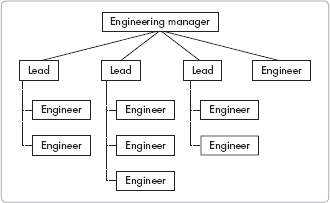

# 第一部分 开发团队

第一章

第二章

第三章

第四章

开发经理通常只关注公司的技术。虽然技术很有趣，但好的管理者必须首先了解他们所工作的人。专注于技术而不是人是像指导一支棒球队，却把所有时间都花在测试最新的、最好的球棒上。

本节涵盖开始新工作、与开发组织合作以及成功扩大你的团队。无需担心；我们稍后会谈到技术。

# 第一章 开始

想象你正在森林中徒步旅行，沿着一些新的小径。天气完美，你很放松。当你行走时，你注意到随着你进入未知的崎岖荒野，风景开始发生变化。最终，你停下来坐在一块大石头上吃零食。

当你吃饭时，你意识到你不知道自己在哪里。你忘记带地图，也忽略了规划路线或标记路径。现在你突然感到一阵紧张和恐惧。*你迷路了*。你想要走得更快——要么继续你原来的方向，要么转身寻找返回的路。但你明白，当你迷路在森林中时，慌张和盲目奔跑是一个大错误。

你记得一些关键的野外生存建议：当你迷路时，停下来，评估，然后行动。你已经停止了移动。你评估你的情况，并问自己几个问题：*我知道我在哪里吗？我的背包里有没有可能对我有帮助的工具、地图或补给？我从出发到现在已经过去了多少时间？我还有多少时间安全返回*？接下来，你制定一个计划，然后行动。

现在，场景转换：你是一家快速成长中的小型公司的工程副总裁，正进入一个不熟悉的领域。尽管你自公司成立之初就一直在那里，但它已不再是那个你所熟知的初创公司。你感觉像是在森林中迷路，没有地图。就像登山者一样，任何快速而慌乱的行动都会使你的处境变得更糟，所以与其慌张，你不如停下来，评估情况，收集你能得到的信息，制定一个策略，然后行动。

另一方面，如果你在一家成长中的公司开始新工作，你可能觉得自己被扔进了森林中间——你错过了最初徒步旅行的乐趣。然而，对于这种情况，同样的方法适用：在你行动之前，停下来观察地形并收集你能得到的信息。通过遵循这些步骤，无论你是新来的还是刚刚迷路，你都能找到你的方向。

# 在新工作中找到你的方向

随着科技公司波动性的增加，对公司高级职员的忠诚度下降。当公司倒闭或改变焦点时，开发经理常常发现自己正在寻找新的工作。当然，找新工作从面试开始。

面试官在面试中描绘了他们公司的完美画面，就像一个柔和聚焦的莫奈。但一旦开始工作，画面开始变得扭曲，有点像毕加索的作品。在面试过程中描述给你的小问题和微妙问题，一旦开始工作，就会变成你必须立即解决的巨大危机。表 1-1 展示了面试陈述与现实之间的讽刺性比较。

加入公司并踏上那条艰难的道路后，你需要充分利用现实。

**表 1-1. 面试与现实的对比**

| 面试陈述 | 现实 |
| --- | --- |
| 我们只有一些小的质量问题。 | 产品是个灾难。一旦你加入，*你*将因所有曾经发生的问题而受到责备。 |
| 我们需要提高我们对承诺的履行。 | 没有什么事情能按时完成。公司在整个开发过程中需要不断对其最新产品特性进行修改，因为市场和其它高管无法下定决心。然而，他们仍然期望按时交付。 |
| 我们拥有一支优秀的工程师团队，但需要一点指导。 | 团队成员在走廊里大声争吵。至少有一位工程师因为表现不佳需要被解雇。 |
| 我们是一家充满激情的公司，员工积极性很高。 | 你的“懒惰”开发团队被期望在午餐时间、每个晚上以及大多数周末工作——否则你将不得不解雇他们。 |

## 应对眼前的问题

在你作为开发经理的第一天，紧急问题将要求你立即关注。一些问题自从上一任经理离开职位以来就已经积累，留下了几个月的悬而未决的决定在你的办公桌上。*跋涉在沼泽中*最能描述处理这些积压工作的任务。

你可能会感到压力，必须专注于这些问题，但这样做可能会对你的长期成功造成危害。只关注紧迫的问题，你可能会错过了解公司、其产品、同事和团队的机会。所以深呼吸，看到更大的图景。

如果你将时间分配在解决未决问题和处理日常危机之间，你最终会减少一些重复出现的问题，从而提高团队的有效性。每天花一部分时间了解你的公司会比花所有时间清理问题积压更有效。此外，你将更好地理解团队面临的更大问题，这将使你能够更早地开始解决它们。在一天中，许多问题会不断出现，迫使你不断转移注意力。你可以通过创建一个处理时间众多需求的系统来避免这个过程变得过于混乱。

### 维护问题与努力清单

仔细的任务管理和良好的记录保存从一开始就有帮助。维护一个关于你的决策和努力的清单，以及重大问题，特别是那些被当作紧急问题呈现在你面前的问题。将清单按优先级部分组织，并附上关于所需完成日期的备注。管理这个清单将有助于降低你遗漏任何问题的焦虑，而且一个整理好的清单将让你能够与上司回顾你的优先事项和努力。

每天审查你的任务清单并针对优先级问题。对于大型任务，针对可以在短时间内完成的子集。每周集中精力在大型、高优先级任务上；否则，它们将继续被短期紧迫需求所推迟。假设你每天只有有限的时间来处理这些问题：避免过度安排时间，阻碍你的进步。

在完成任务以解决问题时，用日期标记为已解决，并将任务存档。这个存档在以后当你被问及是否以及如何处理特定问题时可能很有帮助。完成勾选也有助于你的士气。

### 尽可能地委派任务

对于一些紧急问题，适当地委派责任而不是试图自己解决所有问题。适当的委派使你和你的团队更有效率，而且处理新任务的机会对团队成员的士气也是好的。在委派时，确保受委托者理解任务，它相对于其他工作的优先级，任何状态检查日期，以及截止日期。还要确保团队成员知道他们可以来找你了解更多信息。

如果委派整个任务不合适，你可以将任务的一部分分配给团队成员。例如，你可以将信息收集任务分配给其他人，而将评估保留给自己。或者，你可以要求团队成员对一个问题进行背景研究，然后指导该人员分析数据的方法。如果你给团队成员机会承担重要工作的一部分，你们所有人都会受益。

在处理即时问题时，记得向你的上司汇报你的进度。这有助于防止对你努力的误解。

## 进行初步培训

在你的初始培训期间取得成功需要集中努力和时间。每天为学习你公司的员工、技术、产品、市场和流程预留固定的时间。找到你最能保持警觉和集中注意力的一个或两个小时。提前到达，并在每天的开始进行培训，并在之后继续保留这段时间来处理难题。

作为一名新任开发经理，你可能会经历一个三到六周的短暂“蜜月期”，在这段时间里，你的上司会给你一些自由去了解你的工作和公司文化。你应该预计在这段时间内会加班，但这些额外的时间为你提供了学习和采取重要行动的机会。如果你的上司认可你的额外努力，她会对其最初雇佣你的决定感到满意。在你展示了你的能力之后，你可以将工作时间调整回合理且可持续的水平，这对你是合适的。

了解你是否被雇佣来专门担任变革推动者，或者你是否预期对已经有效的组织进行渐进式变革。这些期望将决定你如何向团队和上司呈现问题。例如，如果你发现了重大问题，但期望是维持现状，你可能会浪费大量时间和精力试图说服上司和团队某些问题的重大性。

你处理长期问题的时机同样至关重要。例如，如果你等待六个月或更长时间来讨论大局问题，你的挑战可能会更大：你可能会失去提出新观点或甚至识别问题的机会，因为一旦你沉浸于其中，识别系统中的缺陷可能会变得困难。随后，你可能会发现开发团队对变革更加抵触，因为人们可能只愿意听取新经理的新观点。

如果你提出了重大变革，要诚实地讨论变革对公司的好处和成本。“推销”你的变革可以帮助你避免树敌或面对可能抵制变革的其他人的不适当行为。

## 收集信息

收集有关公司产品、人员和流程的信息，以决定你在职前三个月到六个月的工作策略。与你的上司交谈，并与直接下属和同事共度时光，以获得对公司的一个全面视角。你的目标是获得公司问题和成功的整体看法，并了解开发如何最好地服务于公司。从提出以下开放式问题开始，以识别和隔离主要问题：

+   哪些方面正在顺利进行？

+   你认为主要问题是什么？

+   你提出了哪些解决方案？

然后将你所学的内容总结起来，寻找规律。

### 创建讨论总结

当你与同事、经理和其他员工会面时，请做笔记；然后将笔记整理成要点陈述，以保持思路清晰并使记忆保持新鲜。对评论进行释义和总结，使你的陈述简短而精炼。

接下来，按类别组织总结文档。每个类别可以包括问题区域以及成功之处。在每个问题区域之后，列出你在对话中确定的一个解决方案。以下是一些收集信息的潜在类别（当然，你的列表可能不同）：

| 技术 | 质量问题 |
| --- | --- |
| 人员 | 内部文档 |
| 组织结构 | 风险 |
| 目标清晰度 | 客户服务 |
| 政策 | 市场和销售 |
| 流程 | 财务问题 |
| 规划 | 其他 |

问题与解决方案将分为三类：你可以直接解决你和你的团队的问题，你可以与其他部门和组织的员工合作解决的问题，以及你可以影响但无法直接解决的问题。在你的总结中相应地标记每个问题。

最终文档的一个片段可能看起来像这样：

4. 技术

+   正面：我们的技术比竞争对手更快、更可靠。

+   正面：使用的语言和库都是最新的。

+   问题：系统在 A-15 子部分缺少冗余，这将导致“核心熔毁”。这需要与运营部门合作。

+   问题：API 的错误检查不佳。两个有缺陷的数据请求将导致系统删除数据库。

    解决方案：我可以通过与开发人员的讨论直接解决。

### 将总结付诸实践

接下来，为确定的成功和问题设定优先级。对成功的方法以及问题进行排名将使你思考如何保持最重要的积极因素。简单的*A, B, C*优先级排序在初始分类中效果良好，并且在每个级别上遵循这个系统是个好主意。给你的老板的陈述打高分，但不要最小化他人的反馈。最终，你必须决定要解决哪些领域以及如何解决它们。从你的最高优先级事项创建一个行动计划。例如，估计你接下来三个月到六个月内可以完成的事情。一个现实的计划将帮助你避免同时处理太多任务而取得很少的成果。

在制定计划之前，确保你理解可接受的项目工作与改进工作的混合比例。对于一家小型公司，至少花费 10%到 20%的时间，以及 5%到 10%的团队时间来解决与完成当前项目无直接关系的问题。这类非项目问题包括提高生产力、进行培训、推进技术、规划未来、改善工作关系和解决人员问题。

行动计划因缺乏公司支持而失败，所以请确保在改进工作中争取老板的支持。你需要老板的热心支持——或者至少是接受——如果你希望成功。如果你的老板对你的建议反应负面，你需要试图理解他的担忧——或者，如果你仍然相信你的提议，做更多的研究和推销。在你提出的方法成功之前，老板需要知道你正在以合理的方式解决公司问题。

你还应该与其他部门经理进行交流，特别是在营销和销售部门。他们需要了解为什么需要时间和资源来完成与他们的短期目标无关的工作。解释你的变化可以为公司带来的长期利益。由于你确定的问题可能不仅与你的部门有关，与其他人的反馈和讨论将提高你对问题范围的理解，并帮助你找到最佳解决方案。

将每个努力作为有时间和资源的项目来建立。鼓励改进项目的持续进行，否则它们会失去动力；不改进会导致随着公司的发展而降低生产力。

**在我公司获得概览**

当我加入上一家公司时，我抽出时间与不同部门的十几个人交谈。我将听到的事情综合成一份几页的总结文档。这个过程让我对正在发生的事情有了宝贵的洞察。与每个人交谈是一次启发性的练习，它指引我首先解决最大的问题。

—新经理

# 了解人们

了解你的同事会使你的工作更加高效和有趣。相反，不了解他们将会令人沮丧，并可能导致摩擦。幸运的是，通过与人交谈，尤其是与你的团队中的开发者交谈，你可以了解很多。

请问以下问题：

+   你喜欢做什么？

+   你不喜欢哪些工作分配？

+   你最擅长做什么？

+   你需要帮助什么？

+   你还在哪里工作过？

+   你为什么加入这家公司？

+   你想改变什么？

这些问题的答案将提供关于如何与每个人最好合作的线索。了解开发者如何完成他们的工作和如何与他人互动，可以提供对行为的有益评估。阅读你团队过去的工作绩效评估可以提供一些洞察，只要前任经理写下了可用的评论。如果不是这样，这也告诉你关于在你加入之前团队是如何管理的。

也要和团队外的工人交谈。和公司里的人交谈，以了解公司文化和确定哪些方法有效，哪些无效。与公司其他人建立关系的益处巨大——此外，了解人们也可以是一件愉快的事情。

第第二章和第三章提供了与团队合作的详细讨论。第第九章和第十章提供了如何在公司内部与其他人合作的建议。

## 不愿透露信息

你可能会遇到不愿意透露信息的工程师或其他人员。他们可以通过以下方式表达：

+   声称太忙无法回答你的问题

+   只提供最少的信息，而重要的细节被省略

+   声称不知道答案，即使你认为他们确实知道

+   提供大量低级细节，但没有提供信息的背景。

+   故意省略技术细节

这些说法似乎关闭了获取所需信息的途径。为了克服这一点，你需要了解背后的真实原因。以下是一些人们不愿意提供信息的一些常见原因：

+   这个人的自尊心要求他知道比任何人都多。

+   他担心工作安全，希望保留关键信息。

+   她为自己的知识不足感到尴尬。

+   他忙于工作，认为教育你没什么价值。

+   她不喜欢也不信任一般的管理层。

有礼貌地坚持要求信息通常有效。在所有情况下，解释你对信息的兴趣以建立信任，但坚持要求工程师在不延迟的情况下提供信息。以下是一些要点：

+   你需要了解技术和选择，以便有效地与工程师和其他人合作。

+   在某些领域，你需要完整的信息，而不是一个粗略的概述。如果工程师以缺乏时间为由，讨论他的时间承诺。你可以要求一些加班工作。

+   如果工程师的回答似乎不完整或表述不清，要求工程师研究这个主题并向你汇报。这表明你对该人的信心以及你的请求的重要性。

+   如果这个人真的不知道答案，要求她直接告诉你。询问谁知道答案。如果你无法从那个人那里得到信息，指派另一位工程师为你获取。

+   告诉工程师，你将做出影响他工作的决定，这些决定应该是有充分信息的。

敌对的工程师需要赢得他们的信任——或者在最坏的情况下，需要淘汰他们。在采取行动之前，花时间了解这个人及其动机。第第二章和第三章更详细地讨论了管理开发团队。

### 识别公司文化

*公司文化*涉及人们相互交往的方式以及管理层奖励的行为类型。为了确定公司文化，观察管理者说什么与做什么相比。阅读公司价值观和使命宣言也有助于此。通过与同级管理者讨论这些内容，你可以确定使命和价值观如何影响公司方向；你应该了解管理层如何将这些资源应用于员工和工作决策中。

### 注意

*如果你的老板在关于工作的初始对话中没有讨论公司价值观，那么这些价值观可能只是基本的模板性声明*。

小型成长型企业需要仔细思考他们的价值观和使命宣言。这些宣言为公司文化提供了基础。管理层必须在入职培训中培训员工关于使命和价值观，并且管理层应该审查与这些宣言不符的重大决策。由于小型成长型公司的快速变化，使命和价值观宣言甚至比在大型和成熟公司中更重要。

在一家管理良好的公司中，价值观和使命宣言定义了公司。人们根据定义的价值观做出决策，这些价值观也被用来设定公司方向和定义组织。例如，一个关键价值观是*质量*，这将指导 CEO 在组织中突出质量保证团队的位置，并强调质量培训。作为开发经理，考虑你公司的使命和价值观，并尽你所能将它们应用到你的管理风格中。

第九章更详细地介绍了公司文化。

# 学习技术、流程和产品

在你工作的前两个月内，了解公司的技术、流程和产品。了解所使用的技术、产品的运作方式、开发流程以及开发团队成员如何协作。评估你所知道的内容，并确定你不完全理解的部分。然后通过系统地收集缺失的信息来填补这些空白。

对你的产品了如指掌。至少要审查展示产品主要组件块及其数据流的高级架构。你团队的开发人员应该能够描述这些元素并提供现有的概述文档。

### 警告

*在许多小型企业中，概述和流程文档往往过时或缺乏细节*。

记录信息并绘制您所学内容的图表，以帮助您吸收信息。（例如，Microsoft Visio 这样的绘图工具非常适合创建这些图表。）您的图表将有助于公司的知识产权（IP）。以这种方式增加公司的 IP 会产生多重积极影响：新员工将有一个培训参考，其他团队和潜在合作伙伴公司将拥有参考信息，如果公司被出售，IP 将对它的估值产生积极影响。

考虑将您的图表发送给开发团队以获取反馈。他们可以发现问题并提供改进建议。纠正和细化流程图通常需要几轮修改。在这个过程中，团队将就产品和流程的实际工作细节达成共识。此外，这项工作还可以导致现有流程的改进。

对您所学内容进行系统性的思考可以帮助您避免在培训过程中以及后来在管理能力上的盲点。图 1-1 展示了技术审查主题的样本清单。

要正确了解您公司的产品，从多个来源收集信息。请销售或营销经理培训您使用产品，这样您就可以了解他们如何向客户展示产品。

在自己身上尝试产品，以使培训细节更容易记住。使用现实但假设的数据设置您的实验——不要使用实际客户或生产数据。使用安全的数据集可以让您在不用担心损坏或泄露数据的情况下进行实验。尝试每个功能、每个按钮和每个数据输入模型——并尝试破坏它们。您需要对产品及其限制有良好的理解。

**图 1-1. 技术审查清单**

您可以在第第五章和第六章中找到有关产品的更多信息。第第七章和第八章涵盖了技术和工具，而第十五章则更详细地介绍了流程。

# 理解客户

了解您公司的客户也应该是您初步评估的一部分。与销售和营销团队交谈，了解公司的典型客户。与销售团队合作安排访问并监听销售电话。

与销售和营销团队讨论以下内容：

+   客户满意度

+   客户对产品品质和功能的认知

+   客户购买关注点和价值主张

与关键客户花些时间，了解他们如何使用产品。沟通将提供关于客户如何看待您的产品的见解。了解您的产品服务的行业。销售和营销团队的信息可以帮助。

第十二章更详细地介绍了理解客户。

# 理解企业业务流程

要了解不同的团队如何协作提供产品、支持和客户服务，了解公司的业务流程。许多公司采用独特的整体工作流程，这对于您理解非常重要。绘制您收集的信息，以阐明业务流程并为他人创建一个有用的参考。

创建整体企业工作流程图将阐明哪些团队负责软件产品或服务的哪个部分。请记住包括客户如何与公司互动。

企业工作流程图可以造福新公司：它帮助高管团队发现问题，了解如何最好地支持新服务和产品。工作流程图可以用作新员工的培训材料，帮助他们了解自己的努力如何支持公司。团队成员通过了解自己的工作如何贡献于整体，将感到更有力量。

尽管有工作流程软件和复杂的绘图方法可以用来捕捉企业工作流程，但对于大多数小型公司来说，一个简单的图表效果很好。附录 C 描述了一种直接的绘图方法，包括一个基本示例。即使您在公司已经工作了一段时间，您可能也会发现绘制工作流程以了解公司运作和识别潜在改进区域是值得的。

**映射企业工作流程**

我以前的公司大约有 12 种不同的产品，每种都需要不同类型的报价。我制定了企业工作流程，并详细说明了工程成本如何与每种产品相关联。明确产品并提供如何估算它们的决策是一个巨大的好处，使我们能够提供更快、更准确的估算。

图形化的公司工作流程使经理们能够轻松地识别改进流程的方法。我们还利用这些材料作为新员工培训的一部分。

——高级经理

# 回到大局

本章为您提供了大量需要考虑的信息。这里有一个大局的总结——一个方向清单，将帮助您找到走出森林的方法。

+   认识人。了解您公司的人，特别是其他经理、您的老板和您的团队。

+   处理问题。处理立即的问题，但在可能的情况下进行委派。不要让立即的需求压倒您的学习努力。

+   跟踪问题。保持一个*优先级*列表的问题。将问题分为立即和长期的问题。

+   收集信息并总结。至少与十几位同事交谈，了解他们做什么，哪些做得好，哪些有问题。从这些讨论中创建一个总结。从这些讨论中选择一些项目添加到你的长期问题清单中。

+   学习。花大量时间了解你公司的产品、客户、文化、行业、技术和组织。

+   评估工作流程。绘制重要的企业工作流程图，并寻找改进的机会。

在你工作的前几个月里，至少每周回顾一次这个清单。如果你在关键领域缺少信息，考虑如何调整你的努力以关注这些领域。在最初几个月里，没有最好的单一方法或公式来规划你的时间，但如果你一直处于高度压力模式，一个接一个地处理危机，找到一个你不会被打扰的安静空间，制定一个计划，让你能够专注于关键领域。如果你不主动规划你的努力，你可能会继续对不良情况做出**反应**——而当你自己设定方向并推动工作向前发展时，这份工作会更有趣。

# 第二章 管理开发团队

作为一家小型公司的开发经理，你拥有在大多数大型公司中找不到的独特角色。无论你的头衔是**首席技术官、工程副总裁**还是**总监**，你必须直接将首席执行官和执行团队成员与你的开发团队联系起来。在小型公司中，你必须能够以与大型公司开发经理不同的方式来扩展自己的能力。

# 理解你的核心管理价值观

在深入研究管理团队的技术细节之前，让我们先反思一下成为一名有效管理者需要具备哪些素质。问问自己你希望如何与你的开发团队合作，以及你的核心价值观如何影响你与他人的互动。你对别人的尊重、道德观、指导与倾听技巧、提供反馈的能力以及对他人成功的关心都会影响你的决策。

作为一名管理者，你需要一套“工具箱”，当与团队一起工作时可以随时使用。你的工具箱应包括激励人们、让自己可用、选择团队工具、组织团队、设置工作空间、管理项目、解决冲突和与团队沟通的方法。有了多种工具和方法在手，你可以选择最适合工作的工具。

相反，一个僵化的管理者可能只有一种工具——他在上一家公司最后一次工作时使用的工具。但正如俗话所说，**如果你的唯一工具是锯子，那么解决问题的方法就是切割**。

以下章节将探讨一组核心价值观的关键工具和组成部分：信任、灵活性、真诚、保密、尊重和赋权。

## 信任

具有信任环境的公司是最有生产力的，因为员工不会在政治、指出他人的错误或保护自己的后背上浪费精力。这些公司鼓励直接沟通——员工相信管理层和彼此能够传递正确的信息并获得对工作的支持。这促进了高员工士气，因为员工将精力集中在提高生产力上，而不是保持警惕。

在小型公司工作的员工必须能够相信他们从高级管理层那里听到的话，因为在小公司工作可能比在大公司工作更具风险。由于小型和成长中的公司通常缺乏重要的资源，高度信任的环境推动了成功所必需的效率。

在低信任文化公司工作的员工会浪费精力关注他人的错误并保护自己的位置。员工认为他们需要双重检查管理层所有声明的真实性。在这样的公司中，管理层通过奖励低信任行为，如政治操纵、公开对他人进行口头投诉、谣言、通过权力游戏强迫其他团队做出决定以及背后捅刀子，来维持低信任文化。低信任文化往往在人们担心失去工作的公司中滋生。管理层通常是权威和政治性的。高级管理者将精力用于拉下其他人以提升自己。在没有高层管理专注的积极努力的情况下，表现出低信任行为的个人在短期内会获得优势。

为什么更多的公司不创造高度信任的环境呢？建立信任需要管理层每天专注于讨论公司价值观和核心信念，而不仅仅是年度审查时。高度信任的文化要求管理者雇佣合适的人，培训他们公司文化，并展现出他们期望的行为。

**最后一人站立**

我们的 QA 团队由六名工程师组成，我们做得很好。当我们的 QA 经理离开公司去另一份工作时，负责的副总裁任命了一位没有 QA 经验和没有管理经验的经理。我们的团队愿意给他一个机会。然而，在接下来的四个月里，他通过不关注质量，成功地疏远了我们所有人。渐渐地，其他团队成员找到了其他工作，而经理没有替换他们。

我是这家公司最后一位雇佣的 QA 工程师。我给经理写了一封电子邮件，要求他更多地关注 QA。我表达了对其他团队成员如何离开公司以及他没有替换他们的担忧。他那天以不服从命令为由解雇了我，并让我当天被护送出大楼。即使是在私人通信中，我也不应该信任他会公平对待。

我后来得知，在我被解雇两周后，这位 QA 经理辞职去另一家公司担任管理职位。他摧毁了 QA 团队，然后离开了公司。

—QA 工程师

作为一名管理者，你可以通过展现公平、保密、尊重、真诚和冲突解决的高标准来建立信任。你有效地处理那些背叛你信任的开发团队成员。例如，如果团队成员向你报告她已经完成任务，你期望任务被正确完成。如果你后来发现她没有完成任务，你将不再信任她。这个人将成为你时间的负担，因为你必须仔细检查她的工作以确保它被正确完成。

在高信任度环境中，开发经理会关心她的团队。她不把团队看作是完成工作的机器；她也不认为自己的角色仅仅是作为上级管理层需求和问题的传递者。相反，她从团队和公司的利益出发行事。

信任可能看起来是一个抽象的概念。以下例子有助于说明对不同情况的高信任度和低信任度回应：

+   你正在参加一个高管会议，一位同事提到你的高级开发者未能按时交付项目。尽管市场营销在最后一刻更改了要求导致延迟，但你和开发者同意进行更改。

    +   低信任度回应 在高管会议上指出，市场营销经理让开发者无法按时完成项目。他多次更改定义，在没有你同意的情况下增加了成本。

    +   高信任度回应 表明你同意结果是不可接受的。你计划审查项目，目标是提高未来的表现。你邀请市场营销经理加入讨论。

+   一位开发者告诉你他对获得硕士学位感兴趣。你知道另一位工程师如果有机会加入团队会很乐意。

    +   低信任度回应 找一个借口解雇与你交谈的工程师，因为你知道他很可能无论如何都会离开。

    +   高信任度回应 尝试确定工程师是否可以在为贵公司工作的同时参加课程。如果他决定离开公司去追求教育，请他尽可能提前通知。

+   你的商业服务器在高峰时段宕机了四分钟。你的初步分析指向运营团队的一个错误，加上一个软件缺陷阻止了系统的正确自动恢复。你并不管理运营团队。

    +   低信任度回应 立即向首席执行官报告运营团队的错误，同时指出运营总监需要提高员工培训的必要性。

    +   高信任度回应 与运营总监花些时间调查这个问题。然后，你们两人与首席执行官会面，描述事件的顺序以及你们计划共同采取哪些步骤来防止再次发生这种情况。

## 灵活性

一支相信被信任的团队将表现出值得信赖的行为；在对待团队成员的方式上保持灵活性将帮助你建立一个高度信任的环境。以你希望你的老板对待你的方式来对待团队成员。关注个人和团队的成功。开发者不仅仅是被雇佣的手，他们还有工作之外的事业和生活。如果你在与他们打交道时公平和诚实，他们通常会以公平和诚实的方式回报你。

当团队成员遇到问题或生活状况使她难以以通常的方式工作的时候，你可以表现出灵活性。在这种情况下，灵活性可能意味着允许她在家工作一段时间或允许她休假。灵活性也可能意味着调整一个人的工作时间或短期将工作日的工作转移到周末。

你还可以在分配工作任务时表现出灵活性，调整以使所需的工作与团队成员的愿望相一致。这样，每个开发者就能专注于对他或她感兴趣的具体任务；这提高了团队成员的士气，通常还提供了如果个人反复关注同一领域就不会发生的宝贵交叉培训。

灵活性并不意味着为所有团队成员提供相同的解决方案，无论他们是否有问题。例如，如果一名员工有一周的家庭问题需要他在家工作，那么不应该允许团队中的每个人都允许在家工作。当员工将远程工作或工作时间与团队不同时，告诉你的团队关于这种安排，以帮助他们理解你的决定。当然，在某些情况下，你应该对得到照顾的员工的细节进行模糊处理，因为告诉其他人细节是不适当的。

管理者的灵活性会影响所有其他核心管理领域。当员工遇到使完成日常工作变得困难的情况时，他们更有可能信任表现出灵活性的管理者。

一些员工可能会利用你灵活的方法，但偶尔有员工利用你总比完全僵化要好。虽然有些人可能会对自己的情况说谎，但大多数人都是诚实的。

## 真诚

你的团队成员会感激你对他们的成功的真诚关心。你可以通过言语和行为来表达你的关心，但最终你的行动才是最重要的。如果你的员工相信你是真诚和值得信赖的，那么当你尝试新的解决问题的方法而不是一路上抵制时，他们更有可能跟随你的指导。

**真诚不是管理时尚**

我的经理公开谈论我们现在的工作可能不是我们一直想要的工作。她鼓励人们探索他们的兴趣，即使这意味着他们可能最终会离开团队。即使公司没有填补空缺的职位，她也会继续这样做。她始终把我们的个人最大利益放在首位，并致力于解决由此产生的任何人员配置问题。这使得我们都想继续为她工作！

——高级技术作家

**为什么没有人相信**

管理团队举行了一次公司会议，宣布裁员和预算削减。首席执行官指出，我们被迫冻结招聘，我们必须谨慎花钱，直到业务好转。一周后，所有公司经理都收到了公司租赁的奔驰车。在下次公司会议上被问及为什么发生这种情况时，首席执行官解释说，高级管理人员之前有一个“汽车补贴”，会计师说这是不可抵扣税的。因此，管理层决定租赁汽车，而这些汽车恰好是在预算削减之后到达的。当被问及为什么他没有削减这笔费用时，他的回答是，这种激励措施对于留住高级管理人才是必要的。

——硬件工程师

如果你的行为显示出你不真诚，那么你在与人交谈时**看起来**多么诚恳都无关紧要；你将不会得到信任，并且作为管理者，你的效果会大打折扣，这可能导致团队成员对你产生不信任。你的团队将失去关注为公司取得最佳成果的焦点。例如，考虑一下一家不盈利的公司进行预算削减的情况。在经理要求他的团队节省开支，只购买必需品后，他为自己的办公桌购买了一套新的电脑系统，尽管他现在的系统相当新；这位经理可能会失去团队的尊重并破坏他的信誉。

## 保密性

信任也建立在信心之上。如果员工向经理透露信息，她期望这些信息不会被与他人分享或不当使用。除非透露信息的员工犯下严重的道德违规，违反法律，或者使公司处于风险之中，否则你不应该分享这些信息或将其用于对付这个人。通过鼓励一个人们可以向你透露信息的环境，你可以帮助解决问题，而不是让它们恶化。

例如，考虑一位告诉你她想要从事不同类型项目的员工。她已经与其他公司讨论了潜在的工作机会。在听到这个信息后，一些经理会立即解雇员工或将她重新分配到不重要的任务上——因为她无论如何都要离开。然而，由于员工自愿透露了这些信息，这表明她信任你，实际上，她可能并不真的想离开——她可能是在给你一个改变项目分配的机会。如果她决定离开公司，她可能会给你时间将她的责任转移到其他人身上，因为她信任并尊重你。

## 尊重

团队中的个人必须受到尊重，包括你和其他开发人员以及同事。缺乏尊重可能表现为明显的方式——例如，当有人面对面或背后贬低他人时。它也可以以微妙的方式表现出来，例如当有人通过贬低他人的资格、技能或能力来轻视他人。

如果你的团队中有成员贬低他人，请将施虐者拉到一边与他交谈。不要等待情况“自行解决”。根据问题的严重程度，你可能需要涉及人力资源部门。

通过创建一个专注于解决问题而不是指出他人问题的团队环境来建立尊重。鼓励员工独立解决问题，并且只有在他们证明自己不愿意或无法自行解决时才提供帮助。

## 赋权

成功的开发人员享受他们的工作并期待下一个挑战。他们自我驱动并赋权，因为你已经定义了目标，退后一步，让他们成功。赋权的员工会成功。

相反，感到被微观管理的员工会按部就班地工作，将工作视为换取报酬的可接受任务。他们知道管理层要求执行的任务有时效率低下或无益，但他们认为他们无法改变做事的方式。管理层将他们视为被雇佣来清理排水管的管道工，然后回家。

为了赋权团队成员，确保他们理解开发目标和边界。边界定义了合理的限制，但它们永远不会是如此神圣的牛，以至于不能讨论或改变。明确的边界和选择解决方案的灵活性将防止员工感到被微观管理。

以下是一些边界类型的例子：

项目限制：时间表、功能、预算和资源

公司政策：要求管理层批准使用公司资金

技术边界：强制在解决方案上使用特定技术的合作伙伴关系

商业边界：由于持续过高的运营成本，可能需要管理层同意的特定软件组件的选择

一旦你设定了明确的界限，让团队成员选择他们如何一起工作以解决问题。让团队自由行动，监控进度，并指导他们成功。

# 与团队沟通

成功的沟通需要你在开始说话之前考虑你想说什么以及你想如何表达。你的沟通应该根据每种情况量身定制：意识到在一种环境中可能有效的东西在另一种环境中可能不起作用。

与团队沟通时，计划涵盖项目工作和人员话题。项目工作包括创造收入的开发努力、降低风险的项目以及提高生产力的策略。人员话题包括指导、培训、纠正、回答问题、解决担忧、讨论长期问题、讨论新想法、协助工作需求以及帮助职业规划。

过去，管理层往往只关注项目工作，解决推动公司短期成功的当前实际问题。然而，在沟通时未能解决其他问题可能导致长期失败，从而降低生产力、增加员工流动率、质量问题、错失机会和士气问题。至少将你沟通时间的一分之一用于与当前项目无关的努力。考虑为项目话题采取不同于人员话题的沟通方法；每个话题都需要自己的平台以确保得到妥善处理。以下各节讨论了与团队沟通的方法，包括一对一会议、项目沟通、团队会议和非正式交谈。

## 一对一会议

与个人开发者每周进行一次一对一会议为管理者提供了涵盖大多数人员话题的最佳机会。（相比之下，团队建设需要团队会议来建立关系和改善互动。）如果你的团队人数超过六人，你可能需要因为涉及的时间限制而将一对一会议限制为每隔一周一次。

一对一会议可以提供建立信任和倾听每个个人担忧的机会。让员工引导初始讨论。尽量在谈话开始时避免讨论当前任务和状态问题。有时开发者可能不会主动提供信息，因此你可以通过提出这些问题来帮助他们开始： 

+   你对你的工作有什么担忧吗？

+   你最近是否经历过或注意到了任何问题？

+   你有什么改进的想法吗？

+   你需要额外的设备或软件吗？

+   你的长期职业规划是什么？

+   你有什么想法要分享吗？

一对一会议非常适合讨论问题、提供建议、就问题解决方案达成一致，有时还会分配任务或请求解决问题的方案。明确分配任务，但避免详细说明解决方案的具体细节。相反，要就成功的样子达成一致：赋予员工解决问题的权力，并提供建议。一般来说，不要立即将问题解决的职责分配给提出问题的人。如果你养成这样的习惯，你的员工就会把更少的问题带到你的注意下。

**不倾听**

在我的职业生涯早期，我有一个不善倾听的老板。当我提出问题让他了解情况时，他会打断讨论并开始给我下指令。在我完全描述我试图解决的问题之前，他就开始发布命令。我停止与他讨论问题。

——软件经理

如果您想用一对一会议来更新项目状态，等到讨论其他话题之后再讨论状态。如果您一开始就讨论项目状态，更新可能会占用您会议的全部时间，其他问题将不会得到关注。

## 项目沟通

你如何处理项目沟通取决于项目的大小和发布周期。对于短期发布周期，**每日站立会议**——所有参与者站立进行的 15 至 20 分钟会议——可能是合适的。经理每天在相同的时间安排会议，要求参与者提供简短的陈述，描述他们前一天做了什么，今天计划做什么，以及他们需要立即帮助的任何事项。站立会议不是作为问题解决会议或主题讨论的意图。相反，任何确定的问题都可以分配给个人解决和跟进。

对于具有长期发布周期的项目，与在办公桌旁的人进行访问和交谈的**每周项目状态会议**可能会有所帮助。这种每周会议通常持续 30 分钟到 1 小时。状态和进度会议通常涉及一些详细讨论，以及未来几周的计划。团队识别风险，项目经理指派个人努力减轻这些风险。

您可以通过内部网络/维基帖子、电子邮件、白板消息或在常规状态会议期间进行审查，将项目状态传达给团队。一些团队成员可能不知道完整的项目状态，或者可能不了解项目或进度中的最近变化。不向团队传达整体状态可能导致混乱，而清楚地传达这些信息可以提高士气并增加项目成功的可能性。如果您定期向团队提供状态更新，他们更有可能在早期指出问题和差异，他们也将更有可能按时向您提交状态报告。

当向团队传达项目状态时，应根据所做工作的规模调整报告的内容和频率。状态描述应包括关于最近完成的项目、即将处理的项目、任何产品功能的变化、今天的预期完成日期、遇到的问题以及当前识别的风险等信息。

按时完成项目取决于准确的状态信息，这允许团队有时间进行中途调整。

## 团队会议

定期安排团队会议将增强团队凝聚力和团队绩效。团队会议可以每周或每两周举行一次，具体取决于团队规模。会议可以作为讨论一般性问题的论坛，或者作为提供新流程和政策培训的机会。团队会议还允许团队成员讨论关注点或提问。

然而，会议不应是即兴事件，因此你应该提前准备议程或主题列表。在桌面上打开一个文件并保持打开状态，随着问题的出现添加项目；这个文件将成为下次会议议程的基础。一个既定的议程将有助于使会议简短并避免漫无目的的讨论。提前分发议程，以使会议更加有效。

过长的团队会议会消耗团队的精力并影响你的底线，因此尽量使它们尽可能短。长时间的团队会议也很昂贵——例如，对于一个 12 人的团队来说，持续 2 小时的会议相当于 3 个工程日（24 小时）的时间。

允许工程师就政策和高管决策等关注点发表意见。跟踪这些问题和疑问，并每周与团队一起审查，即使你还没有答案。确保你提供之前团队会议中提出的开放项目的持续状态，并努力解决问题和疑问。

有时，一个不满的工程师可能会利用团队会议作为投诉环节。如果工程师从建设性建议跨越到破坏性的抱怨，请打断对话并要求他与你单独会面，讨论他的关注点。

定期的开发团队会议不是详细技术讨论的好场所。设立单独的技术会议，在这些会议中你可以专注于特定主题，并使大多数这些会议成为可选择的，这样不需要参加的人可以选择不参加。否则，那些不受特定技术主题影响的工程师最终会花费时间听对他们无益的讨论。

# 冲突解决

在某个时候，团队成员之间会出现分歧。作为他们的经理，你应该鼓励他们直接解决分歧，而不是让分歧阻碍合作。典型的分歧涉及技术选择、资源共享或无礼行为等问题。团队成员通常可以直接解决技术或资源分歧，有时通过调解讨论，但无礼行为需要不同的方法。

同事之间的问题可能会积累到人们无法一起工作的程度。如果一个人对另一个人感到愤怒，建议受伤害的一方要求对方在会议室会面讨论问题，以便提出解决方案。如果他们无法解决他们的分歧，你可以安排一个联合会议来讨论问题。然而，如果冲突涉及不专业行为，首先介入可能效果最好：在开始时将个人拉到一边，并与他们讨论情况细节，以解决问题为目标。

有时，你的团队成员和其他小组的人之间会发生冲突。这些冲突通常涉及未完成的交付成果，但通常沟通不良是核心问题。鼓励个人首先讨论问题。如果他们无法解决问题或情绪高涨，提供协助。

在协助解决困难冲突时，首先与每个相关人员交谈，了解问题的双方。按时间顺序重建事件。然后，根据需要，召集参与者及其经理召开审查会议。不做出判断，呈现导致冲突的事实事件。要求各方考虑他们下次遇到类似情况时可以如何不同地行事以改善情况。如有必要，提出你的建议。

**采取行动解决冲突**

一个项目经理和她的老板告诉我，他们对我的一个工程师不满意。项目应在午夜前上线，工作一直持续到下午 5 点之后。经理告诉我，工程师应该在完成工作后打电话。工程师没有打电话，所以项目经理在午夜前叫了另一个工程师来完成工作。

结果表明，项目经理在工程完成时给了工程师一张纸条，上面写着要联系的人的电话号码。不幸的是，工程师丢失了这个号码。相反，他在工作完成后发送了一封电子邮件。项目经理没有寻找电子邮件，以为工程师忘记了。

在讨论完项目的所有细节后，我安排了一个与个人和其他经理的联合会议。我客观地走过了时间线，描述了失误。我们作为一个团队讨论了如何避免未来出现这些问题：对于未来的加班工作，项目经理将编写一份一页的计划。计划将列出谁在做什么，完成步骤如何沟通，以及参与者的电话号码。如果未来发生失误，人们同意他们将当晚打电话给经理。

会议结束后，参与者表示他们对结果感到满意。

—网络工程经理

不要忽视冲突，希望它们会自行消失，尽管有时确实如此。相反，关注冲突，鼓励人们直接解决它们，并在必要时介入。此外，不要询问受委屈的工程师是否希望调解，而应该指导那位工程师如何解决冲突。

# 培训

公司赞助的培训表明公司足够关心其员工，愿意投资他们的未来；大多数工程师会以增加的公司忠诚度作为回报。当然，培训也可以提高工程师的表现，因为她会学习到新技术、自我管理和工作习惯的新方法。

通常，工程师们基于技术知识建立自己的职业生涯，并对技术培训持积极态度。技术变化如此之快，以至于今天使用的许多原始技术细节将在几年内变得过时。因此，大多数工程师试图跟上前沿技术知识，这使得培训成为工作生活的一个重要方面。虽然技术培训在短期内对工程师有益，但一般工作技能培训可以对其职业生涯产生长期积极影响。例如，学习时间管理技能将使工程师无论使用什么技术都更加高效。大多数工程师将从以下各种主题的培训中受益，例如：

| 时间管理 | 分工 |
| --- | --- |
| 项目管理 | 管理基础 |
| 演示制作 | 冲突解决 |
| 会议管理 | 员工激励 |
| 系统分析 | 指导 |
| 谈判 | 面试 |
| 营销基础 | 项目预算管理 |
| 投资回报基础 | 客户沟通 |
| 流程改进 | 理解情绪智力 |
| 定义需求 | 理解个性风格 |
| 质量提升 |   |

不幸的是，小型公司的培训通常受预算限制。由于培训用短期成本换取长期利益，当预算紧张时，这些成本很难证明其合理性。此外，许多高级管理人员认为为开发工程师提供培训的价值很小。这意味着当首席执行官收紧银根时，培训预算往往是首先被削减的项目。

当预算紧张时，抵制忽视培训的诱惑。相反，考虑以下各种培训替代方案：

+   提供批准任何合理书籍购买费用的承诺。

+   选择一个主题的书籍，并与工程师们讨论；这可以是一种提供低成本培训的极好方式。

+   请一位团队成员花一个小时与团队分享一个主题的信息。

+   通过设置迷你课程自行提供培训。

+   调查在线培训选项。

+   调查可能提供比大型培训机构更低成本培训的小型本地培训机构。

+   调查大型培训机构为多家公司员工提供课程的可能性，以降低每人成本。

不幸的是，管理层通常只考虑培训的短期成本，而忽略了不提供培训的成本以及它可能带来的长期利益。即使是低成本培训的削减，对于一家小型成长型企业来说，也是一种战略错误。培训可以提高员工稳定性和生产力，而小型公司依赖于员工，并依赖于低员工流动率来取得成功。

# 指导

提高团队绩效最直接和令人满意的方式之一是通过个人指导。好的指导能引导人们自我提升，这对公司和个人都有益。

**培训态度的连续性**

当公司有培训预算时，我专注于制作培训课程机会清单，并对开发团队进行了调查，以确定最高兴趣的项目。我雇佣了一家本地培训机构，我们及时收到了关于时间管理、会议管理和项目管理方面的优秀课程。

第二年，预算紧张，因此高管团队取消了培训费用。然而，培训的需求并没有消失。我为团队成员购买了关于培训主题的书籍供他们阅读。我再次回顾了这些书籍，并创建了一个课程大纲，将主题组织成流程。在管理者阅读了这些书籍之后，我为每个主题进行了两小时的培训，包括一个展示以及根据我准备的提纲进行的双向讨论。

我发现，作为管理者，提供培训课程对我有益。这些课程迫使我回顾材料，从而刷新了我对这些主题的知识。

—产品开发总监

成功的指导需要教练了解个人的目标。以下是一些在指导开发团队成员时应提出的好问题：

+   什么激励着你？

+   你的长期和短期目标是什么？

+   你对哪些技术感兴趣？

+   你想接受哪种培训？

+   你在工作中最喜欢做什么任务？

+   你最不喜欢你工作中的哪一点？

有些人发现很难表达他们的职业目标。因此，一位发展工程师可能会寻找新的工作来提升自己的职业生涯，而不是向当前雇主寻求更多选择。当工程师收到另一家公司的就业 offer 时，让她留下是很困难的。通过指导他们并尽可能给予他们想要的任务，让员工保持快乐要远远好于让他们感到不快。

**倾听需要对话**

在我的职业生涯早期，一位优秀的工程师离开了我的公司，因为她想从事其他技术方面的工作。如果我知道的话，我可以安排她的工作任务，为她提供她所寻找的技术挑战。

她认为她当前的任务就是所有可用的任务，而且没有必要要求不同的任务。她接受了另一家公司的 offer。尽管我告诉她我可以改变她的工作任务，但她不想违背自己的承诺。根据所有迹象，如果我知道得早一些并改变她的任务，她可能会留下。

——工程总监

有效的指导需要经理的时间和倾听能力。指导应该是每周一对一会议的重要部分。你可以以非威胁的方式指导个人如何提高他们的表现，同时鼓励他们改进。

指导不仅仅是加油打气——它是将团队成员与他们的最佳表现对齐，为需要改进的人提供额外的培训和练习，并倾听他们的担忧，确定如何解决它们。此外，指导还意味着在人们以错误的方式处理任务时将他们拉到一边进行纠正。

# 激励团队成员

开发团队的动力方式与其他团队不同——工程师通常对“加油打气”的鼓舞、情感呼吁或竞赛反应不佳。什么激励个人开发工程师各不相同，但如果你问他们，他们通常会告诉你他们需要什么。以下是工程师的一些常见动机：

+   技术挑战

+   职业成功和晋升的机会

+   参与外部组织、论坛或技术小组的机会

+   财务机会，如股票奖励或加薪

+   机会参加会议或研讨会

+   灵活的工作时间表，让他们能够安排自己的日程，不必早上 8 点到达或被标记为迟到

+   来自同行的认可

+   来自受尊敬的经理的认可

+   承担高级任务的能力，如代码审查和新项目估算

+   机会成为一支高效团队的成员——由优秀的管理者和精英工程师组成的团队

+   参与旗舰产品的机会

+   在公司“现实世界”之外的项目上工作的机会

**通过改变激发动力**

我团队中的一个工程师对他的任务不满意。他的表现很差。他经常争论并且交付延迟。他要求调到另一个技术领域。虽然我的老板建议我让他走，但我给了他尝试他想要的技术的机会。在接下来的几个月里，他工作的质量和及时性有了很大的提高。他对学习感到兴奋，态度也有所改善。给他机会做他想要的事情的赌注得到了回报。

——工程经理

就像大多数工人一样，工程师在他们喜欢自己的工作时通常表现最好。为了实现合理的目标而施加一点压力会增加他们的整体成功。如果工程师参与建立和承诺项目内容和交付，他们将会感到有动力并享受努力的过程。

如果工程师们被鼓励并享受他们的工作，许多人会愿意付出额外的努力。你可以通过确定他们最喜欢哪种工作类型，并创造那些具有现实、可达成目标的任务机会来鼓励他们。通过让他们参与估算工作努力程度和交付日期，赋予团队成员权力。倾听并解决团队的问题。确保团队拥有完成工作的适当工具。然后观察他们的成功。

相反，不断推动人们承诺过度加班会降低团队的动力和士气，可能导致人们寻找新的工作。工程师和其他人一样，需要在工作和生活中保持平衡。如果你期望员工放弃平衡的生活，你就无法建立一个高度信任的环境或公司忠诚度。

最后，公开认可成功。你对一个人工作的直接赞赏可以增强他们的动力。你可以通过直接与这个人交谈来表达感激。或者，你可以通过个性化奖励来表示感激。奖励传统在公司之间差异很大，所以在决定奖励时考虑这些传统。如果你的公司没有奖励传统，你可以开始一个。例如，你可以预留一部分预算来购买小奖励以庆祝成功——比如与按摩师共度时光、额外的休假时间、幽默的奖牌、奖金或加薪、礼品卡和咖啡卡等。

# 指导问题员工

每个经理最终都会遇到一个行为不当或难以共事的员工——一个“问题员工”。也许你是从你之前的经理那里继承了这个人，他可能是重组的一部分，或者你可能雇佣了他。尽管小型公司负担不起不好的员工，但你应该并且可以诚心诚意地努力改善员工的问题行为。

你可能会因为有很多重要任务要做而推迟处理问题员工。然而，拖延只会让问题有更多时间增长并影响其他员工。相反，一旦出现不良表现的模式，你应该立即处理员工的问题。

常见的问题分为两类：表现不佳的员工和态度恶劣、破坏团队氛围的员工。表现不佳的员工不能按时交付工作，或者不能准确传达他们的工作量。态度恶劣的员工与其他员工有负面或贬低性的互动，或者不断诋毁公司。像酸一样，这个人最终会腐蚀团队凝聚力以及你管理团队的能力。

通过与员工讨论你所观察到的，并试图确定问题的根源来开始纠正过程。员工的行为可能有多种原因，包括以下情况：员工可能需要额外的培训但害怕询问；员工可能有一个短期个人问题，需要时间灵活性来解决；员工可能需要一些关于如何有效的辅导；或者员工可能对自己的工作分配不满意。

根据问题，你可以直接与员工合作提供辅导。然而，如果员工坚持认为不存在问题或行为解释不足，他们可能不会对你的辅导做出反应。在这种情况下，你需要更快地转向正式化的绩效改进计划。

当辅导员工时，首先就具体改善其工作的行动达成一致；这将提供目标和改进的动力。然后监控进度并提供定期的进度报告。为了保持辅导积极而非惩罚性，鼓励员工表现良好，而不仅仅是指出错误。如果你描述了你眼中的成功，并强调员工对公司的努力的重要性，他们更有可能将辅导视为一个积极的机会。

如果员工在未来一个月内表现没有改善，或者你注意到他们没有做出合理的努力来改善，你应该考虑采取额外措施，例如制定正式的改进计划。何时正式化改进计划取决于具体情况。让员工“注意”到他们的行为可能导致解雇。尽管一些经理在没有计划的情况下解雇工人，但你应该制定一个计划，为员工提供一个公平的机会来改变，并为你的公司提供一些法律行动的保护。

绩效计划的要求各不相同。与您公司的人力资源团队交谈，了解其要求。绩效改进计划应定义具体问题，明确问题行为以及成功的样子，并描述失败的结果。一般来说，计划不超过 60 天的评估期。

不要假设绩效计划会自动导致解雇。尽管一些员工可能会失败或自行离开公司，但有些人会诚心努力改进并取得成功。对待员工，就像你期待他们成功一样。

# 评论和评估

员工评估必须是一年中的持续努力——不要等到正式的员工评估时才表达对结果的感激或讨论问题。事实上，年度评估不是提出问题行为的合适场所。等到年度评估时才提供员工的负面反馈是一种较差但常见的管理做法，这通常源于管理者不希望面对问题直到被迫这样做；然而，这却导致了一个缺乏信任的环境。尽管年度评估过程通常会导致对抗，但大多数员工如果第一次听到问题是在年度评估中，会感到措手不及。年度评估不应有任何惊喜。

公司以各种方式处理年度评估。许多小型公司不提供评估，为所有人同时提供年度评估，或根据周年入职日期提供年度评估。从公司角度来看，评估是由人力资源部门（HR）推动的，以支持企业需求——可能是为了确保有评估记录以避免潜在的法律诉讼，特别是如果该人被解雇，或者为了奖励出色的工作，以便他们留下。

## 创建评估

不要等到评估时间才收集信息或向团队成员提供反馈。相反，在您的单独会议中全年提供反馈。您还应该通过在文件中为每位员工的绩效写笔记的方式，在全年收集数据，而不是试图在年底记住这些信息。手头有笔记将使您撰写评估更容易，对员工也更公平。

一种流行的做法被称为*360 度评估*。在这种情况下，人力资源部门或经理会从与被评估员工一起工作的人那里收集评估信息。来自其他团队或同事的人通常可以提供关于员工绩效的有用见解。作为 360 度评估的一部分，您还应该要求员工进行自我评估。自我评估是员工列出年度成就并评估自己绩效的绝佳机会。通常，自我评估会提醒您几个月前员工承担的任务，而您已经忘记了。

准时的论文评估是最好的评估类型，因为它涵盖了多个绩效领域。要撰写论文评估，首先收集信息。要求员工完成他们自己的评估版本，并在您的会议之前提交。如果公司要求员工自我评估，请先阅读。如果不要求自我评估，您仍然可以要求他们提供。用描述员工的成功和需要改进的领域来撰写论文评估。保持语言直接，文本相对简短。完成后，检查每一句话，确保它符合您想为员工提供的整体画面。

评估的一般格式包括结果、成功、改进和总结。在评估开始时，详细描述工程师的项目。年初的早期笔记和文件将使这项任务变得容易。对每个项目提供简短的书面讨论，并描述员工的表现和主要努力。接下来，描述优势和劣势的领域。建议可能有助于提高其绩效的技术。提出员工可能从更多培训中受益的领域。您还应该提出下一年的目标。最后，提供总结，描述员工的总体表现。

您可能需要填写标准的评估表格。但这并不妨碍您撰写论文并将其附加到表格上。

## 提交评估

在提交评估时，讨论每个被评估的不同领域。避免在会议开始时就把书面评估交给员工的诱惑，因为他们会很快阅读它，但不会吸收您试图传达的内容。相反，明确指出主要观点，并通过提问来确定员工是否同意或不同意您的评估。给员工时间，并鼓励他们提问。在合理的情况下，使评估会议成为一个积极、鼓舞人心的讨论。

在会议结束时，向员工提供评估的书面副本。如果适当，您可以考虑在评估后的第二天安排一次后续会议。这给了员工一个思考评估并第二天传达任何想法的机会。

## 提供晚点和不足的评估

评估对于员工来说，出于职业和财务原因非常重要。按时提供定期评估是一种尊重的表现。对于被要求等待的员工来说，晚期的评估可能会让他们感到士气低落。提供晚期的评估会增加员工的焦虑，并可能使员工认为他们既不重要也不受尊重。

如果评估与年度加薪挂钩，焦虑水平通常会更高。一些公司有令人厌恶的做法，即如果管理者延迟提交评估报告，则不追溯调整加薪。在这些公司中，管理者的延迟会导致员工收入损失，因此评估不再是一个积极的体验；它变成了一个消极的体验，增加了员工的愤世嫉俗，并破坏了他们对公司的信任。

延迟提交评估报告也可能导致其他问题。开发工程师可能会向他人透露他们对公司和管理层的担忧。他们可能会认为管理层延迟评估是为了公司节省开支，因此可能会推测公司存在财务问题。

所以为什么管理者会延迟提交评估报告呢？对于大多数管理者来说，撰写评估报告是一个痛苦的过程，他们会通过无限期地推迟任务、不写任何内容或在评估期间不提供建议来避免这个过程。许多管理者忽视了评估对持续员工好感的重视。

写得糟糕的评估也会对员工产生负面影响。这样的评估可能只列出几个要点，以及人力资源部门规定的几个不同类别的评估框。比写得糟糕的评估更糟糕的是，管理者根本就没有写。如果人力资源部门要求进行评估会议，但没有其他要求，评估可以变成一个*握手年度评估*，其中管理者向员工提供一些口头评论，以及加薪数额和握手。

**《握手年度评估》**

在我的职业生涯中，我收到了六次握手年度评估。我通常觉得它们令人失望，因为它们没有为未来提供指导。它们还表明我的管理者不愿意花时间思考我真正做得如何。所有的评估都是积极的，所以我希望有一个书面记录。这个记录对我来说很有价值，尤其是在我有新管理者的时候。

我最喜欢的评估是充满活力、详细且包含改进想法的讨论，我可以真正采取行动。

—工程师

人力资源部门可以通过几种方式让管理者更容易写出糟糕的评估。首先，评估表格可以使用评分复选框，允许管理者为每个领域分配一个数值。在一些公司中，表格上数字的总和或平均值构成了员工的评分。这种方法错误地假设所有评分项具有同等价值，并可能导致员工评估结果偏差。

一些表格在包含员工关键属性信息方面空间有限。当你只能用两行评论来指导员工时，提供指导就变得困难。一个合理的评估需要完整的描述。

评估或反馈的质量通常缺乏最低标准。如果管理者只需勾选框并写下“工作出色”就能完成一个可接受的评估，那么标准就太低了。表格评估可能很容易，但它既不能为公司也不能为员工服务。

回顾应该是持续反馈和辅导的仪式性总结。年度回顾可以通过一年辅导系统的输出轻松撰写。员工们花了一年的时间为你的公司开发软件。将一个人的努力压缩成“工作出色”的简短总结和清单是不够的。

| ☑不可接受 |
| --- |
| ☐可接受 |

在管理者的部分，而应该利用回顾来强化你全年提供的辅导。

# 额外阅读

这里是本章所讨论主题的一些额外阅读材料：

| *《1001 种奖励员工的方法》*，作者：鲍勃·尼尔森（Workman Publishing Company，2005 年） |
| --- |
| *《成为辅导型领导者：建立自己冠军团队的策略》*，作者：丹尼尔·S·哈卡维（Thomas Nelson，2007 年） |
| *《爱他们还是失去他们》*，作者：贝弗利·凯和莎伦·乔丹-埃文斯（Berrett-Koehler Publishing，1999 年） |
| *《管理软件狂热者：寻找、管理和奖励获胜的开发团队》*，作者：肯·惠特克（Wiley，1994 年） |
| *《管理技术人才：创新、团队合作和软件开发过程》*，作者：沃茨·S·汉弗莱（Addison-Wesley Professional，1996 年） |
| *《人件：高效的项目和团队》*，作者：汤姆·德马克罗和蒂莫西·利斯特（Dorsett House Publishing Company，1999 年） |
| *《摆脱倦怠、忙碌工作和效率神话》*，作者：汤姆·德马克罗（Broadway，2002 年） |
| *《每位管理者都应该了解的培训知识：从培训中获得价值的内部指南》*，作者：罗伯特·F·梅杰（CEP Press，1999 年） |

# 第三章。创建一个有效的开发团队

一个有效的开发团队能够用更少的浪费资源建立一个强大的公司基础。一个无效的团队会建立一个脆弱的基础，当受到压力时将会崩溃。

公司管理层必须全面支持开发团队的努力，以保持团队的有效性。术语“有效性”可以有多种解释。例如，在一家公司，高级管理人员关注工程成本。但这种心态导致了诸如“每美元代码量”这样的指标——以及遍布全球的低薪开发者团队。开发工程师并不一定在以最短的时间内产生最多的代码行时才是有效的。基于最小代码量的良好解决方案是有效工程师的交付成果。

让我们继续这个讨论，用一个好的定义来开始：*一个有效的团队能够以公司每美元提供最佳的客户解决方案*。客户满意度、质量、项目交付的进度和预算都可以随着时间的推移进行衡量，而最佳的客户解决方案能够满足客户的需求，并按时、按预算提供高质量的产品。为了说服 CEO 关于需要立即支出或改变的有效解决方案，你需要关注长期的企业目标——一个高质量的产品，按时交付——并且实现这些目标需要一个有效的开发团队。

管理应考虑四个方面：团队效率、团队成员效率、管理效率以及团队在公司内部的整合效率。*团队效率*需要一个支持团队努力并提供稳固沟通路径的组织。*团队成员效率*需要一个允许团队成员贡献想法并确保团队内部适当沟通的工作环境。*有效的团队管理*需要一个关心团队并愿意在工作之余鼓励一些乐趣的经理。最后，*高效的团队-公司整合*需要一个合作和沟通的框架。尽管这些方面对于成功是必要的组成部分，但它们往往被忽视和最小化。

# 有效的团队组织

无论是在开始新工作还是扩大开发团队时，开发经理应该根据计划规模来构建团队组织，而不是让团队“自然”增长。理想情况下，三到八人应直接向一位经理汇报——如果人数超过这个范围，你可能就没有足够的时间来指导每位开发者。在一些公司，超过 20 人直接向一位经理汇报。拥有 20 位汇报者的经理没有足够的时间来正确指导每位个体。

图 3-1 展示了简单的工程团队结构，显示了一位经理有五位直接汇报者。每位工程师在其工作的所有方面都直接向经理汇报。

随着公司的成长，开发团队也会随之增长。你可以通过增加项目或技术领导或经理以及新的开发人员来支持有组织的团队增长。

*技术领导*负责日常的技术决策；他们为团队提供技术领导和指导，通常是在一个产品或相关产品线。技术领导不负责项目管理或一般人员管理。*项目领导*^([1])负责项目管理决策：谁参与项目、如何规划项目以及如何在项目过程中处理变化。有时项目领导会处理技术领导，但他们不承担人员管理，如进行审查、招聘、解雇和指导。

**图 3-1. 简单的工程团队结构**

即使你的团队包括技术或项目领导，也不要让直接汇报者的数量（包括领导）增长过多超过 12 人。尽管领导负责项目日常沟通并提供帮助，但你作为开发经理，仍然负责进行审查、职业培训、招聘和解雇、确保定期沟通和指导。

图 3-2 展示了使用多个领导的样本团队。实线代表正常的管理关系，而虚线代表仅代表技术领导。

**图 3-2. 示例团队使用技术领导**

当工程团队人数超过 12 人时，通过确定向您汇报的管理者来保持直接汇报人数的低。这些管理者可以负责他们汇报的所有人员管理的方面。拥有技术领导和经理的混合组织可以非常有效，如图图 3-3 所示。

**图 3-3. 示例团队组织结构图**

随着你的开发团队规模扩大，考虑采用不同的组织人员方法。一些拥有众多项目的公司采用*矩阵*管理方法，其中项目经理推动项目，职能经理识别和指导员工。附录 A 更详细地讨论了矩阵管理，并涵盖了公司组织方法如何随着公司的发展而变化。一般来说，每次公司增长 50%，你应该评估是否需要组织变革，而当增长达到 100%时，你应该已经做出了适应增长的改变。

对于拥有众多项目的组织，灵活的项目负责人方法可以非常有效。*项目负责人*通过重叠团队而不是固定的人员分配来协调项目。项目负责人通常除了项目领导权外，还拥有技术领导权，并且他们可以很*灵活*，因为每个负责人通常只负责一个项目。负责人角色不是一个职位。随着项目的开始和结束，负责人可以被重新分配到其他项目作为开发者或项目负责人。随着项目规模的允许，一些负责人可能在两个项目之间共享不同角色的职责。这需要一个拥有多个工程师且也担任项目负责人的团队。

灵活的方法赋予团队实现个人目标的能力，而不是成为单一职能等级的一部分。它有一个很大的优势，即项目团队分配可以根据需要重新配置。这种方法还要求有专门的*人事经理*来处理与项目工作无关的问题，包括人员配备、职业发展、流程定义和指导。人事经理是一个永久性分配的职位，不会随着项目变化而变动。

灵活的项目领导方法与矩阵管理不同，如表 3-1 所示。

**表 3-1. 灵活项目领导与矩阵管理的比较**

| 灵活的项目领导 | 矩阵管理 |
| --- | --- |
| 项目领导是一个角色，而不是一个永久性的职位。 | 项目经理将项目领导作为一个职位。 |
| 项目领导是从工程人员中选出的，并具有工程技能。 | 项目经理具有项目管理技能，可能不具备工程技能。 |
| 部门经理被分配到开发人员，但并不一定管理一个特定的功能区域。 | 功能经理管理一个功能区域，例如数据库、中间件或图形。 |
| 如果项目成功，项目领导就成功了。 | 如果他的大多数项目都成功了——至少是重要的项目，项目经理就成功了。 |

图 3-4 展示了灵活的项目领导方法。虚线代表为项目所做的临时分配，领导关系仅限于项目。

**图 3-4. 灵活项目领导组织**

当你在一家成长中的公司管理一个开发团队时，考虑你对团队未来两年的愿景。考虑你将如何组建团队以符合你的愿景。在你制定了团队管理策略之后，决定你如何最好地利用团队的时间。

* * *

^([1]) 这里使用“项目领导”一词而不是“项目经理”，因为后者已经成为一个具有特定技能和培训的独立职业，专注于管理任何类型的项目。

# 程序员效率

软件开发者需要长时间的连续专注时间。工程师在工作的过程中必须解决复杂问题，并记住许多细节。从中断中恢复可能需要额外的时间来“重新进入代码”，然后开发者才能再次认真地进行编码。一个有效的开发团队需要平衡思考时间和沟通时间，这样不会挫伤工作积极性。

**思考时间**

在我的公司，噪音和中断正在成为开发人员的一个大生产力问题。由于我们都在格子间工作，我们没有门可以关闭，人们会整天来打扰。

我为团队成员购买了几个版本的黄色“警察线：禁止穿越”胶带。根据协议，一个忙碌的开发者最多只能将胶带放在他的或她的格子间入口处不超过两小时，以表示在专注于代码时不受欢迎的中断。我们要求不同小组的人尊重这段时间，只有在真正的紧急情况下才进行中断。

—工程经理

虽然良好的团队间发展和团队内合作需要一些沟通，但良好的沟通并不包括随意打扰。对于其他员工，如销售和市场营销人员，他们整天都在不断调整努力，打扰可能是正常的。实际上，在某些编程任务中，打扰可能甚至不是问题，但对于大多数开发工作来说，即使是短暂的打扰也可能导致问题——需要回答“现在是好时间吗？”或“我能问个问题吗？”这些问题会打断开发者的注意力。大多数问题都会导致即时的讨论和解决，因为开发者不希望有第二次打扰。

在一些公司，人们整天不断打扰工程师。试图在干扰之间工作的工程师发现，这样做效率低下且容易出错。代码中的错误会导致更多的时间用于调试和修复，从而增加开发成本。尽管团队在测试和调试方面做出了最大努力，但编写不良的代码最终会导致向客户发布质量低下的产品——当然，这无疑会对公司的底线产生重大影响。

为了满足所有需求，你和你的团队可以在团队内部以及与其他团队积极协商工作习惯和沟通安排。考虑一些系统性的方法来最小化干扰，作为你效率策略的一部分。

+   使用工程师可以用来表示“不要打扰”的明显标志。在办公室，关上门；在隔间里，使用标志或横幅。开放式布局鼓励干扰和即兴对话。通过协议，工程师可以在她的桌子上放置一个标志，要求不受打扰的时间，但在开放式办公环境中这效果较差。

+   通过提供其他工作场所来最小化干扰。如果你无法提供无干扰的工作环境，允许工程师在办公桌外工作。工作场所可以包括一个安静的会议室、咖啡馆，或者在家中花部分时间设计和编写代码。他们可以用办公时间进行沟通、会议、小组讨论或简单的任务，例如阅读电子邮件。

+   制定公司协议，在非干扰时间限制干扰到特定时间段。例如，会议和工程团队讨论可以仅在下午时段进行；这允许团队在早上有一段时间进行高效编码。如果公司文化支持这种做法，这种方法效果相当不错。

+   允许工程师偶尔远程工作，如果他们更喜欢这种方式而不是在办公室工作。然而，请记住，尽管这不需要公司层面的协议，具有优势，但也可能带来问题。通过远程工作，工程师可能会更多地成为个人贡献者，而不是团队的一部分。当工程师远离他们的办公桌时，团队讨论会减少，这可能会对整体设计的质量产生负面影响。它还限制了团队互动、解释、即兴设计决策和指导的机会。

# 办公空间

办公室布局方案可以对开发工作的努力和效率产生巨大影响。在开放式布局或隔间布局中，鼓励协作和对话，这可能会让忙碌的员工感到满意，也可能让他们感到烦恼。然而，团队对话可以带来更好的设计和更紧密的工作关系。日常的非正式设计讨论可以通过鼓励协作提供重大优势。其他方法，例如所有团队成员都远程工作并通过电子邮件和电话协作，效果并不那么好。

### 警告

*大多数工程团队不喜欢完全开放的布局，因为噪音和人们移动时的视觉干扰*。

在规划办公室空间时，努力保持与团队的紧密联系；靠近团队将有助于您了解进度和问题，并有助于与团队建立信任。靠近团队的办公室意味着您可以随时私下指导他人并进行机密对话。如果您被迫在远程办公室和隔间之间做出选择，只有当您能够安排在附近设置会议室以便进行私人对话时，才选择隔间。您需要在指导和管理团队成员时能够关闭门。

在隔间或开放式环境中，应在开发区域附近设置多个会议室，为团队协作提供空间。在审查空间计划时，坚持要求拥有超过两个会议室。公司所有员工共享的会议室数量不足，很快就会被站立会议和客户访问填满。

安排办公室空间，使质量保证（QA）、市场营销、技术写作和工程团队位于相邻的位置。这鼓励团队之间的沟通，因为大多数非正式对话都发生在员工办公桌附近短距离内。开发人员与其他团队之间的非正式对话通常是有益和协作的。如果开发人员与市场营销人员唯一的联系是通过正式会议，那么两个团队成员之间的关系质量将受到影响，产品也会受到影响。

然而，请注意，开发人员需要从嘈杂的邻居那里获得声音隔离。由于市场营销和销售团队成员经常使用电话并可能产生相当大的噪音，请确保工程空间被设置成减少噪音。考虑以下几种保持工作区域安静的方法：

+   重新布置办公空间以最大限度地减少声音传播。您可以通过在嘈杂的办公室和工程空间之间安装隔断来减少噪音。

+   在人流量较少的区域设置开发人员的工作空间。然而，在将团队移至隔离区域之前，请与其他经理交谈，因为目的是鼓励安静思考时间，而不是隔离和减少沟通。沟通渠道必须清晰，任何空间决策都应受到合作态度的驱动。

+   在开发空间旁边创建一个临时交谈区域。这个区域可以包括一个大白板和舒适的座位。如果空间有良好的照明（例如大窗户）和欢迎的氛围，团队会使用并欣赏它。

+   当在走廊、隔间或其他工作区域交谈时，请要求人们尊重他人并降低噪音水平。

# 其他团队如何与工程团队沟通

成长中的公司的开发团队在与公司内部其他部门成功沟通时，能够创造出最佳产品。良好的部门间沟通确保了客户和组织的需求与正在进行的工作保持一致。创建成功公司和产品的最有效方法是让整个产品团队（开发、销售、市场营销、QA 和运营）能够讨论目标、问题和解决方案，然后一起记录下来，以创建工作描述和共享对这些描述的理解。^([2)]

公司团队之间的联系改善了产品定义，并允许开发人员和其他人理解**整个产品**的需求。^([3)]适当的讨论有助于开发人员在编码开始前完善解决方案，节省时间。开发、QA、销售、市场营销、支持、技术作家、培训师和客户需要协作来高效定义产品，并避免后期出现重大返工。

开发工程师和 QA 工程师之间的开放沟通允许 QA 询问代码的意图，以创建更好的测试，并为系统提供更好的覆盖，从而提高产品质量。这也提升了 QA 团队的士气，因为他们将参与开发工作。相比之下，一些公司限制 QA 对工程的访问，以便程序员能更有效率地工作，但 QA 工程师会感到阻碍，发现由于他们角色的重要性降低，工作变得更加困难。

**与手交谈**

我目前的公司完全将 QA 与软件工程师隔离开来。工程管理告诉 QA 我们无法直接与工程师交谈以提问，我们有时必须等待多周才能获得我们完成工作所需的信息。我们的 QA 团队普遍士气低落，我们的工作质量也因此受到影响。这就是我为什么在寻找新职位的原因。

——不快乐的 QA 工程师

QA 团队的联系对工程师也有好处。例如，QA 可以对用户界面的设计提供有价值的反馈。在测试期间，两组之间的密切接触将使开发者能够理解在跟踪工具中记录的个别缺陷。缺陷的清晰度减少了修复缺陷时的错误，而改进的缺陷修复则提高了产品进度，如第十七章理解质量保证中所述。

考虑和安排通常可以提高协作效率。在与工程师的沟通中处理访问和过剩的需求冲突需要管理者制定策略并让团队接受该策略。例如，为了避免与开发工程师的过度中断，QA 工程师可以在下午的会议上捆绑问题提出，而不是整天用新问题打扰开发者。

一些管理者试图通过将团队置于一个“黑箱”中来将开发团队与其他公司团队隔离开来。这迫使工程箱外的人“把请求扔过墙”，而工程师则通过地板上的一个槽口（或者可能是通过网络电缆）将软件推回去。

开发经理可能出于最好的意图在团队周围建立一个黑箱。通常，他采取这项政策是因为工程师抱怨由于其他部门的干扰而无法完成工作。当工程师在关键项目中落后于进度时，他们的抱怨最为激烈。作为回应，开发经理告诉公司其他人不要与工程师交谈。

表面上看，隔离开发团队似乎解决了几个管理问题——例如，管理者不再担心其他人要求工程师完成他没有分配的任务。然而，这种方法会导致长期失败，因为工程师无法与其他人协作，这表明管理者对其他管理者管理团队缺乏信任。缺乏协作会导致长期的时间表、产品定义不佳和质量低下。

* * *

^([2]) 关于在产品定义上协作的更多讨论，请参阅第五章定义产品。

^([3]) 你可以在第五章定义产品中了解更多关于“整体产品”概念的信息。

# 新经理，旧习惯

一家小型公司可能会因为工程师的技术和产品知识而提升她为开发经理。然而，这位新晋经理并不本能地理解她的管理角色，而是将自己视为一个必须现在忍受更多干扰和更多文书工作的工程师。实际上，这位新经理可能更愿意继续全职编写代码，尽管管理岗位看起来有好处。没有培训和指导，她不会接受她不那么侧重代码的角色，并认为她唯一的管理责任就是回答团队的问题。团队几乎肯定会对这个经理感到失望。

交付压力加剧了新经理的问题。因为她看到另一位受过培训的工程师可以帮助她的团队完成工作目标，她可能会被诱惑摘下经理的帽子，暂时“成为那个工程师”。她可能会承担起构建代码部分的责任，并以此作为不管理团队的借口。面对困难和陌生的挑战时，新经理通常会退回到他们擅长的领域——软件开发。

这个问题比应有的情况更为普遍。一位有效的开发经理需要将她的精力集中在管理上，而不是编写代码。她的经理应该了解她的需求，并安排管理培训和指导，以帮助她适应新的角色。即使经过广泛的管理培训和指导，如果她不适合管理岗位，也许应该让她回到全职编程或其他技术领导角色。

然而，“不要编写代码”规则的例外情况可能发生在新经理能够将她的技术专长应用于紧急日程上的微小努力时。这样的努力应该只持续几天。在经理编写了所需的代码后，她应该立即培训一位工程师掌握相关技术，这样短期内的技术问题需求就不会再次出现。

如果一位管理着一个或两个开发者的开发经理在管理和代码开发方面都有效，她也许也能同时做好这两份工作。这对经验丰富的经理来说效果最好，他们知道如何平衡管理时间和开发努力。然而，在大多数情况下，同时担任工程师的新经理可能会让她的老板感到困惑。

最后，喜欢编写代码的新开发经理可以在个人时间中工作于个人项目。开源项目提供了与新技术保持同步和合作的机会。在新语言或平台上利用个人时间进行小型项目开发也有助于新经理跟上新技术。

# 娱乐一下

在小型公司工作的一大优点是更容易发泄压力，而不会触怒“古板警察”。确保团队氛围允许一些乐趣，尤其是在一天结束时。偶尔的 Nerf 枪战可以激发整个团队的活力。

在工作中开玩笑是保持工作场所融洽的另一种极好方式。在困难情况下看到幽默可以使当天的问题看起来不那么有压力。此外，这样工作更有趣。

# 额外阅读

这里有一些关于本章所讨论主题的额外阅读材料：

| *管理软件狂热者：寻找、管理和奖励获胜的开发团队*，作者：肯·惠特克（Wiley，1994 年） |
| --- |
| *管理技术人才：创新、团队合作和软件开发过程*，作者：沃茨·S·汉弗莱（Addison-Wesley Professional，1996 年） |
| *人件：高效的项目和团队*，作者：汤姆·德马克和蒂莫西·利斯特（Dorsett House Publishing Company，1999 年） |
| *摆脱疲劳、忙碌和效率神话：Slack 的力量*，作者：汤姆·德马克（Broadway，2002 年） |

# 第四章. 培养软件团队

人力资源部门可能定义了你们公司的招聘流程，但你作为开发经理，必须负责候选人选择流程，以确保你的开发团队和公司能够成功成长。公司的招聘流程通常包括定义的步骤，如开放职位、识别候选人、填写表格和获得批准、安排面试、检查候选人的资历以及发出和批准录用通知。然而，这个过程并没有定义候选人选择流程，即你决定要选择谁。创建并遵循候选人选择流程对于找到适合工作的正确开发者至关重要。

由于优秀的开发团队能够帮助小型公司成功和成长，因此你的候选人选择流程必须是一个优先事项。你通过选择新员工来定义你团队的性格。在正确的时间雇佣正确的人对生产力有积极影响。雇佣错误的人是痛苦且代价高昂的。在招聘最佳候选人上投入适度的努力将产生显著的结果。

没有候选人选择流程，面试官可能会关注错误的主题。工程面试官可能会根据以下几个问题来评判候选人：公司当前使用的技术的知识、候选人在简历上列出的项目，以及候选人的个性。但只关注几个特质会忽略其他关键特质的重要性，包括候选人的成功历史、工作习惯、行业经验、人际交往能力以及其他一般（而非具体）的技术能力。狭窄的面试焦点会导致拥有一些技术技能但整体能力较弱的候选人，而且尽管你可能从个人层面喜欢某个候选人，但他在工作中的表现可能并不出色。

一种有组织的候选人选拔方法要求你定义期望的候选人特质、预筛选的处理方式、整个面试的方法以及决策过程。在系统地考虑以下领域时，要牢记大局。

# 设计选拔流程

任何工程招聘活动的开始都是设计一个选拔流程，概述你打算遵循的步骤以及你的选拔方法。对于小型公司来说，合理的选拔步骤可能从从你收集的简历中识别潜在候选人开始，理想情况下是通过你的网络。接着对候选人进行电话筛选，选择最有希望的申请者进行办公室面试。接下来，你将与面试团队一起面试候选人，并召开面试后的会议以收集信息。完成这些步骤后，你应该准备好做出招聘决定。

在每个这些阶段，选择明确的评估标准来判断候选人是否适合，并将选拔的努力程度调整到合理。在简历审查和电话面试期间使用有效的筛选方法，以确保你在设施中面试的候选人都是值得花费面试时间的。最重要的是，提前决定你相对于该职位在潜在候选人中寻找什么。为了鼓励这一点，下一节将专门介绍*面试特质*，这应该有助于你选择理想的人。

# 面试特质

首先思考一下什么使一个优秀的开发工程师。利用这些信息，你的面试团队能够在面试期间通过为不同特质分配不同的面试官来评估候选人的这些特质。对于每个领域，创建一个你将提供给面试团队成员的样本问题列表。如果你在所有以下领域评估候选人，你可以更全面地了解候选人和他们的潜力：

|   |   |
| --- | --- |
| 技术技能 | 沟通技能 |
| 成功历史 | 个性 |
| 文化契合度 | 热情 |
| 工作习惯和偏好 | 问题解决能力 |
| 行业经验 | 幽默感 |
| 人际交往能力 |   |

每个特质都需要一个评估方法。直接问题对于询问候选人对工作的了解非常有效。知识和行为问题的混合可能很有用。知识问题的答案当然告诉你候选人的知识范围，而行为问题的答案告诉你候选人如何应用这些知识。

知识问题可以重新表述为行为问题，这可以揭示候选人的经验。例如，知识问题“你是如何优先处理任务的？”可以重新表述为行为问题：“描述一个证明难以优先处理的项目任务以及你采取的方法，”或者“你在项目 *X* 上是如何优先处理任务的？”（其中项目 *X* 是候选人在简历上的一个具体项目）。

## 技术技能

技术技能包括基础技能和特定技能。*基础*技能包括候选人的编程能力和他对计算机科学基础的理解，而*特定*技术技能包括新工程师将立即需要使用的语言、程序和库。

任何合法的候选人必须具备完成这项工作所需的技能，一套基于技能的问题可以在评估候选人时很有用。不幸的是，面试官在评估潜在员工时往往过于重视特定的技术知识。相反，应关注工程师所需的主要技术知识，不要过分强调次要技术。大多数优秀的工程师都能快速学习新技术，因此只寻找与一系列技术专长相匹配的候选人将无谓地排除一些强有力的竞争者。

## 成功历史

工程师的*成功历史*描述了工程师在其他工作岗位上过去作业的成功。与过去曾与候选人共事的可信人士交谈，提出以下问题：

+   候选人在项目中做了什么来确保他的工作质量高？

+   候选人是否按时完成了他的项目工作？

+   他的项目是否达到了他们的功能目标？

+   候选人是否付出了足够的努力以确保项目成功？

+   当需要时，他是否寻求了帮助？

+   候选人是否在问题出现时很好地解决了问题？

如果你找不到可靠的来源，或者即使你已经与人交谈过，你应在面试期间向候选人提出以下问题：

+   你是如何确保你的工作高质量的？

+   你的项目工作多久能按时完成？描述一些情况。

+   你过去三个项目是否达到了最初计划的功能目标？

+   你是如何组织你在项目 *X* 上的工作的？

+   在什么情况下在项目上寻求帮助是合适的？

+   描述一个在项目期间发生的问题。你是如何解决的？

听到候选人在以前的工作情况下的表现可以作为确定他将在贵公司如何表现的良好指南。

## 文化契合度

由于每个公司都有独特的文化和企业价值观，寻找与你的公司风格和价值观相匹配的候选人。例如，寻找低调工作环境的求职者可能不会在那些全天候工作的勤奋工程师的公司中表现良好。一种高度侵略性的文化可能会挑战一个安静和随和的员工。与公司文化相匹配的候选人会更快乐、更高效，并且更有可能留下来。不匹配的候选人一旦意识到不匹配，更有可能为了其他机会而离开公司。

评估文化契合度可能是一项具有挑战性的任务。大多数候选人想要这份工作，所以即使你直接询问他们的工作文化和风格，他们可能会告诉你你想听到的——也就是说，他们对你公司文化的了解。提出这样的行为问题通常更有效：

+   描述公司 *X* 和公司 *Y* 的文化（这些公司在候选人的简历中出现过）。

+   它们有什么不同？

+   你喜欢每家公司的哪些方面？

+   你不喜欢每家公司的哪些方面？

+   在你工作过的所有公司中，哪一家公司的文化最适合你？

在创建文化契合度问题列表后，考虑并审查你公司的文化和这些问题，与你的经理和其他部门经理一起讨论。他们会有有价值的见解，并可以提供其他好的问题来询问。与其他人一起审查文化也有助于确保公司文化的一致性。第九章更详细地讨论了企业文化。

## 工作习惯和偏好

*工作习惯* 描述工程师在工作环境中影响其工作效率的习惯。请回答以下问题：

+   你对工作的态度是什么？

+   你在哪里、什么时候工作效果最好？

+   你最喜欢和最不喜欢的这份工作的哪些部分？

+   在你寻求帮助之前，你会在一个问题上工作多久？

+   你喜欢怎样与其他团队一起工作——包括其他工程团队、市场和 QA？

+   你如何跟进你向他人提出的请求？

+   什么激励着你？

+   你对工作时间和加班有什么期望？

+   你最喜欢和最不喜欢哪种类型的项目？

+   你更喜欢哪种工作环境？

+   你喜欢怎样被管理？

这里有一些关于项目 *X* 的行为问题，这些你在候选人的简历上已经注意到了：

+   你是如何组织项目 *X* 的工作的？

+   你是如何为项目 *X* 设置优先级的？

+   你是如何跟踪项目 *X* 的细节的？

## 行业经验

*行业经验* 描述的是对行业的背景知识（而不是技术和编程知识）。例如，如果公司提供医疗软件，候选人是否了解医疗软件领域和具体法规？你可以通过询问与职位相关的行业信息来评估候选人。

## 人际交往能力

*人际交往能力* 描述了工程师如何与他人互动，尤其是在发生冲突时。在考察候选人的人际交往能力时，考虑候选人的倾听意愿、她分享信息的开放性、她解决冲突的能力、她接受建设性批评的能力以及她在分配任务时的灵活性。你可能问到的人际交往能力问题包括以下内容：

+   描述一次与同事的冲突以及你如何处理它。

+   应与同事分享多少信息是合适的？

+   在什么情况下以及为什么你会保留信息？

+   描述一次你在工作中收到的批评，这次批评促使你改进了你的表现。

+   描述一个需要你在其中表现出灵活性的工作情况。

## 沟通技巧

*沟通技巧* 描述了候选人交谈、倾听、写作和展示信息的能力。你可以在面试中评估她的交谈和倾听技巧。为了评估她的写作技巧，要求候选人提交她的技术写作示例，例如会议论文（但避免涉及专有信息）。为了展示她的演讲技巧，要求她就一个技术主题进行“粉笔演讲”。要求候选人绘制并描述一个软件系统；这将帮助你更好地了解她对其过往工作的理解程度以及她传达理解的能力。

## 性格

在判断候选人是否会与团队中的其他人良好合作时，考虑候选人的 *性格*。最容易识别的红旗区域如下：

+   在面试中，候选人是不是没有让你有机会发表意见？

+   他看起来是不是太亲近了，或者不够友好？

+   他看起来是不是太急于取悦和给人留下深刻印象？

+   他对过去的情况有太多负面评论吗？

## 热情

人们经常用候选人的 *热情* 来决定从几个合格的候选人中雇佣哪一个。这通常是一件好事。虽然工程师通常比销售人员更为保守，例如，对工作和公司的热情展示是重要的。成功的员工通常对他们的工作充满热情。

对于初创公司来说，员工的热情可能尤为重要。初创公司需要那些对业务成功充满热情的人，而不仅仅是关注个人。在成长阶段后期，你可以雇佣那些对技术和可能性充满热情但还不完全符合公司“忠实信徒”标准的候选人。

## 问题解决能力

*问题解决能力* 定义了工程师解决任意困境的能力。尽管一些问题可能与实际的软件技术关系不大，但你仍然可以，并且应该评估候选人在处理问题时思考过程。当工程师遇到超出她当前技术知识的新问题时，她思考新问题方法的能力展示了她的创造性和灵活性。

询问工程师关于团队目前面临的一个真实和当前的问题。你可以扩展这个问题，让候选人逐步展示一个解决方案，可能包括一些解决方案的示例代码。

包括微软在内的几家公司，在面试过程中有长期专注于解决问题的测试的历史，正如威廉·庞德斯顿在他的书中所描述的《如何移动富士山》？（见“附加阅读”中的附加阅读）。正如书名所暗示的，询问一个人如何移动山可以让他思考如何将一个大问题分解成更简单的步骤。这本书提供了一套很好的通用问题和互联网链接，以寻找更多。

在面试中给工程师一个机会来解决一个一般性问题，这将揭示他解决问题的几个方面。首先，这将显示他询问面试官问题的意愿。这同样适用于他愿意在困难问题上寻求帮助的意愿。其次，这将告诉你他如何处理大问题以及他使用哪些技能来解决复杂问题。第三，这将告诉你他如何应对没有教科书答案的困难问题。

## 幽默感

在工程师被要求完成的众多任务中，你是否甚至需要询问幽默感的重要性？

# 综合考虑

在心中有一份面试话题列表后，你应该会发现根据最重要的主题设计选拔过程更容易。在面试的各个阶段——电话筛选、面试、审查会议以及决定谁将被雇佣时，考虑一个好的候选人的最重要的特质。

## 电话筛选

如下文所述，一天的面试给面试团队提供了一个全面评估候选人的机会。然而，如果考虑到准备和审查，面试通常需要超过一天的工程时间。通常，如果你在设施中面试超过五个候选人，那么你早期的筛选是不充分的。进行初步的电话筛选（甚至面对面午餐筛选）可以消除全日面试的过度预订。

在电话筛选过程中，你的任务是判断候选人是否能够通过最低标准。一种方法是列出每个类别，并根据候选人对问题的回答质量，在每个类别旁边添加一个加号、零（中性）或减号符号。最后，邀请那些正面评价最多、负面评价最少的候选人进行面对面面试。这是一个简单但有效的衡量方法，你可以在面试过程中将负面点作为后续话题。

在电话筛选过程中需要讨论的问题可能如下所示：

> 询问候选人对贵公司的了解。对贵公司一无所知的候选人会得到一个减分。
> 
> 讨论相关的行业经验。丰富的经验是一个加分项，而经验很少则是一个减分项。
> 
> 询问与工作相关的工作努力。关注他特别成功或对结果感到自豪的努力。自我激励的候选人通常会对他们所做的工作感到自豪。如果候选人无法指出任何内容，那应该是一个警告信号。
> 
> 询问一个冲突情况和解决方案。无法描述冲突的工程师不是一个好的招聘对象——减分。一个描述了合理的冲突和积极解决方案的人是一个*大*加分项。
> 
> 询问技术经验的深度。特别关注对你重要的问题。根据候选人的经验是否符合贵公司的需求来评判。与贵公司许多技术合作过的工程师通常可以快速学会其他技术。
> 
> 评估候选人的沟通能力。筛选会议期间清晰、简洁的回答是一个大加分项。如果回答太短或太长且杂乱无章，那将是一个减分项。
> 
> 询问候选人的薪资期望。试图确定候选人是否与您的预算和他的背景严重不符。许多候选人可能会对提出一个数字有所保留，但您通常可以得到一个范围。如果一个工程师寻找的薪资远远高于他的经验水平，那将是一个减分项。
> 
> 询问候选人是否有任何问题。任何合理的问题都是加分项，而没有任何问题则是减分项，表明缺乏兴趣或准备不足。

## 办公室面试

办公室面试为你提供了评估候选人的最佳机会。提前计划你想要了解的信息，以及你将如何获取这些信息。与面试团队讨论这些信息，以确保每位面试官都做好了准备，并且不会重复相同的内容。

至少应该有五个人，包括你，来面试候选人，以提供对其适合度的广泛视角。在选择面试团队时，选择经验广泛的人，而不仅仅是深度。面试官应代表不同的面试关注点，拥有良好的面试技巧，给候选人留下积极印象，并理解选拔标准。面试官应包括来自其他团队的人——例如销售和市场营销的代表。面试官背景和风格的多样性将有助于使面试过程更加全面。

在规划面试日程时，从候选人的角度考虑一天的时间。确保面试过程不会变成一个超过八小时的令人筋疲力尽的马拉松。通过保持对话轻松且不那么探究性，让候选人在午餐期间休息一下。毕竟，她需要机会享受她的餐点。此外，确保每次面试大约持续一个小时。半小时的面试比没有效果还糟糕，可能会导致印象浅薄和糟糕的招聘选择。

## 指导你的面试团队

面试团队在面试前需要接受指导。这有助于确保团队成员收集到做出招聘决策所需的信息。你也可以利用这个机会向候选人推荐推销你们公司的方法。如果没有指导或鼓励，面试官可能会将面试视为仅仅是完成另一项外围任务，以便他们可以回到“真正的工作”。

在你们的面试指导会议上，首先描述面试的目标和公司试图填补的职位。确保团队成员了解期望该职位所需的技能水平和经验，以及你对理想候选人的看法。如果没有这种清晰的认识，面试团队可能会面试到错误的一组技能。

分配具体责任给每位面试官，以确保他们对候选人有一个全面的了解。每位面试官应该评估前面讨论过的一到三个不同的候选人特质。因此，他们需要准备好找到所需的信息，要求面试官在面试前仔细审查候选人的简历并准备问题清单。为了协助，你可以推荐问题和方法。你还可以要求面试官在面试期间做笔记并捕捉引言，这在面试后的回顾中特别有用。

最重要的可能就是，面试团队成员需要计划如何确定候选人的技术能力。讨论寻找这些信息的潜在方法，例如：

+   要求候选人使用他选择的编程语言解决一个特定的代码问题

+   讨论你们团队使用的编程语言的细节

+   要求候选人解释你提供的代码的一部分

+   要求候选人识别你提供的代码片段中的缺陷

+   要求候选人对预定义的代码块提出改进建议

提醒你们的团队，目标不是“难倒”面试者，而是了解他们的能力和方法。候选人在技术面试中提出的问题以及他没有提出的问题，都能非常清楚地揭示候选人作为你们团队一员的有效性。

面试环节为你们和你们的团队提供了一个评估候选人的机会，但同时也是候选人决定是否想要这个职位的机会。更重要的是，这是你们推销公司的一个机会。即使你们不想雇佣候选人，推销公司也是至关重要的，因为无论面试结果如何，候选人很可能会向她的同事传达她对你们公司的看法。因此，你们应该始终保持面试的积极和专业。

最后，抓住机会从候选人那里收集一些反馈。询问她对贵公司和面试过程的看法。

## 避免的面试环节

安排面试过程不仅仅是安排会议。在安排面试时，许多经理更关注对面试官的影响，而不是对面试者的影响。暂时考虑一下候选人的观点，并反思这些尴尬且紧张的面试日程。

如果您的公司在以下任何一种负面方法——或者说是“压力面试”——上有所专长，那么请改变您的策略，专注于更多积极的策略，鼓励工程师愿意在您的公司工作。不良面试策略的影响不仅限于被面试的候选人，因为他会将这些信息传达给朋友和其他人。谁知道呢——他的故事甚至可能写成一本书！

### 马拉松式或压力面试

**马拉松式面试**通常非常长，通常持续超过八小时。马拉松式面试是一种旨在通过观察候选人的反应来对其施加压力的**压力面试**。对于软件开发工作来说，压力面试尤其不受欢迎，因为程序员在不过度紧张的情况下才能发挥最佳水平。他们对压力的反应不会产生有用的信息或有用的工作；压力只会降低候选人的表现。对候选人施加压力也是将您的公司列入“我不会为你们工作，也不会让我的朋友为你们工作”名单的好方法。

保持面试的合理长度，最长不超过八小时。最好是安排六小时的流程，或者将较长的面试分成两天进行，因为大多数候选人在六小时后会感到疲惫不堪，无法充分展示自己。

**非常漫长的一天**

我最长的一次面试是为一项本地工作，向另一个城市的经理汇报。公司为我预订了与招聘经理的航班，所以我们整个飞行过程中都在交谈。面试是在第二天，从早上 7 点的早餐开始。一直持续到晚餐，结束于晚上 8 点——13 个小时。在一天快要结束时，我非常疲惫，很难集中精力进行面试。

——软件工程师

### 一次性面试

在**一次性面试**中，招聘经理让候选人乘坐五小时或更长时间的航班到达公司所在地，对候选人进行简短面试，然后立即将她送回家，没有任何延误。通常，这种紧张的旅行安排是为了节省公司的钱，却牺牲了面试者的利益。这些面试在大型组织中最为常见，在这些组织中，人力资源（HR）组织面试，但面临限制性的旅行政策和预算。这种面试具有马拉松式面试的所有耗尽特质，但它也表明对候选人的时间几乎没有关心，强调了削减成本政策的最糟糕方面，并给候选人留下了糟糕的整体印象。

**无果而终的飞行**

我的远程面试是在与当地团队成功面试之后进行的。下一步是与远程老板面试。公司给了我一个间接航班以节省成本，但这增加了往返各四小时的额外时间。此外，他们将其安排为一天的行程，以避免支付酒店费用。这次旅行在目的地城市为面试留下了两小时的窗口时间。

这次旅行要求我凌晨 4 点起床，赶早上 6 点的航班。中途停留后，我下午当地时间到达，招聘经理将会议推迟了 40 分钟。他面试了我 20 分钟，然后让我打电话给另一个人进行电话面试。我到达后两个小时就离开了。我乘坐同样的双程航班回家，午夜后到家。

这次旅行让我了解了公司的情况，而且情况并不好。

—工程师

### 午餐委员会面试

**午餐委员会面试**将看似正常的午餐面试转变为对候选人的压力和优雅的测试。与其他例子不同，这种方法设置起来并不费力。四人或更多人将在午餐时间与候选人进行他们当天唯一的面试，充满具体目标和短暂的时间限制。每位面试官依次向候选人提问，要求他们给出长答案，确保候选人无法进食。（如果在下一个问题之前面试者试图吃东西，将获得额外加分。）

带着正确的意图，午餐面试可以是有用和积极的。一次积极的午餐面试可以揭示候选人的兴趣和激情，并帮助你更多地了解她的个性和文化适应性。它可以给候选人提供心理上的休息，这样她就不会在下午感到疲惫。最好的是，友好的午餐面试表明你尊重候选人，而不是专注于你公司希望尽可能多地在一整天内完成的事情。

## 审查会议

在你整合了面试团队的反馈后，选拔流程需要包括一种方式，以便将信息反馈给你，即招聘经理。应在面试结束后尽快进行一次**审查会议**，以确保信息在每个人的脑海中都是新鲜的。如果团队成员无法参加会议，你可以在审查会议之前直接与他们交谈。

为了防止少数人主导对话，请在讨论开始之前要求人们写下他们对每个重点领域的评估。一些公司会先进行快速的“点赞/点踩”评估，以便在讨论细节之前快速了解团队的评估。

给每位面试官一个机会来描述他们对候选人的印象。每个人都有一个基于特定面试焦点的独特视角。招聘经理应该最后发言，因为你的意见可能会不当地影响其他面试官充分表达他们的意见，尤其是如果他们对候选人有所保留的话。

请每位面试官描述他的结果，自上而下：从结论开始，逐步细化。每位面试官至少应给出两个支持其结论的理由；这些理由应比“我认为她不适合”更具体。然后面试官可以详细说明他的决定，理想情况下，可以引用候选人的几句话作为支持。

请面试官在表达他们的想法后回答这些问题：

+   你对候选人的哪些方面感到惊讶？

+   其他面试官的反馈到目前为止与你的评估有何不同？

+   候选人在回答中有多具体？

当你完成会议桌上的讨论后，如果你发现面试官提供的信息存在矛盾，继续讨论，并要求在感兴趣的区域提供更多支持信息。在离开会议之前，你应该感到你已经拥有了做出招聘决定所需的所有信息。如果你喜欢候选人，但在某些方面信息不足，请务必安排另一次时间与候选人再次交谈，以解决任何未决问题。如果不可能安排另一次会议，不要招聘该候选人。

## 做出选择

作为招聘经理，你决定招聘谁；不要基于面试团队的投票来做出决定。面试过程应该为你提供了缩小候选人范围并做出良好决定所需的信息。向那些你没有任何严重顾虑、符合你的选拔标准，并且你真的相信将成为你团队一大补充的候选人发出录用通知。

即使有良好的面试流程，你也可能难以决定招聘谁。如果你在完成流程后仍然不确定，继续寻找你真正想要的工程师可能是个明智的选择。不要招聘一个只能解决短期问题的全职员工。招聘边缘候选人很少是个好主意，所以在你做出那个录用通知之前，确保你对这个人充满热情。

**急速招聘，闲暇后悔**

在我的管理生涯早期，我为一家公司工作，其盈利能力季度间变化很大。管理策略是在不好的季度冻结招聘，在好的季度开放招聘。在两年时间里，每个季度似乎都在好与坏之间交替。

我试图招聘一名工程师。每个季度，我必须开始审批和论证过程，这需要几周时间。当高层管理批准招聘时，我寻找候选人的过程需要几周。我会带来几名候选人进行面试，并最终选择其中一人。连续两次，整个过程比一个季度还长，等到面试结束时，新的招聘冻结已经开始。对这个过程感到沮丧，我犯了一个错误，那就是快速招聘了一名工程师。这名工程师持续的表现不佳，让我不得不忍受这个糟糕的选择。

—新任工程经理

# 额外阅读

本章中提到的主题的一些额外阅读材料如下：

| *101 个对最艰难面试问题的最佳回答*，罗恩·弗莱著（CENGAGE Delmar Learning, 2006） |
| --- |
| *软件开发动态*，吉姆·麦克卡锡著（Microsoft Press, 2006） |
| *如何移动富士山？微软的谜题崇拜：世界上最聪明的公司如何选择最具创意的思考者*，威廉·庞德斯顿著（Little, Brown and Company, 2003） |
| *聪明且能完成任务：乔尔·斯波尔斯基寻找最佳技术人才的简洁指南*，乔尔·斯波尔斯基著（Apress, 2007） |
