# 第四部分. 使工作流程化：项目、流程和质量

第十二章

第十三章

第十四章

第十五章

第十六章

第十七章

除了与人和技术合作，项目经理必须努力实现高效的流程。项目管理、开发流程和质量是重要的话题——关于每个话题都有许多书籍被撰写。本节不能提供每个话题的完整讨论，但它确实为每个话题提供了一个介绍，并侧重于小型软件公司的应用。如果你想要了解更多，你可以在每一章的末尾找到提供的参考文献列表。

# 第十二章. 项目估算

当有人问“项目需要多长时间完成，需要多少员工工时？”时，你的项目经理声誉就处于危险之中。你可以提供一个快速的估算，以便将任务从你的待办事项列表中移除，或者你可以花时间创建一个深思熟虑的项目估算，并确信你能够真正实现它。

通过提供快速估算来“随机应变”可能是提供答案最快的方式，但这也是一种容易“陷入困境”的方法。在几次因估算不准确而“被烹饪”之后，大多数项目经理开始寻找更好的估算方法。

对于新经理来说，最好的估算方法并不总是显而易见的。在光谱的极端端，你必须等到提出了完整的努力定义并进行分析后才能做出估算。不幸的是，这对小型公司来说并不总是实用的，因为它们的方法必须是系统性的、简单的，并且相对直接。

本章涵盖了估算单个项目并创建一个模型以帮助你改进未来估算的过程。估算模型可能需要一些设置工作，但它们在帮助你提高估算的速度和质量方面可以非常有效。

# 构建估算

构建一个好的估算既是一种技能也是一种艺术，需要遵循合理的流程并利用你的经验——甚至直觉——来做出调整。你很少能获得创建高度准确项目估算所需的确切信息。提高你的估算技能的一部分是意识到你将做出许多假设和猜测，其中一些可能是错误的。当你做出的假设和猜测大部分正确，并且你能够成功地将较大的流程分解成较小的部分进行估算时，你将取得成功。

在制定估算时，要以系统的方式进行。首先，定义你需要收集哪些数据以及如何将这些数据组装成估算。然后收集你的估算所需的数据：这需要你挖掘过去的估算和数据，并与他人讨论项目和其需求。最后，通过将数据片段组装成一个连贯的图像来构建估算，这个图像让你能够确定完成工作所需的时间和努力。

当你完成你的估算后，你需要交付它。你的交付方式可能会对项目的成功产生重大影响。首先，让我们更详细地考虑估算和交付。

## 创建任务列表

你构建估算的方式取决于项目的复杂性。一个简单的项目估算可能由一系列简短的步骤组成，包括估算*努力成本*和*日历日成本*。*努力成本*指的是完成一个任务所需的时间，假设工作者将所有时间都投入到该任务中。这通常以工作小时或天数来衡量。*日历日成本*指的是完成一个任务所需的时间，假设员工由于管理任务、公司会议、假期以及有时其他项目，无法将所有时间都投入到该任务中。这通常以日历天数来记录。例如，一个每天工作 8 小时且 60%时间可以从事该任务的人，其 20 小时的努力成本将产生 1.5 个日历日（20 小时 × 0.6 ÷ 8 小时 = 1.5 个日历日）。

理想情况下，项目已经被足够地分解成任务，每个任务不超过项目持续时间的 5%到 10%，并且持续时间少于两周。要估算一个有数十个任务需要跟踪的项目，你需要将项目分解成更小的任务，理解假设，识别风险，然后汇总结果。将项目分解成一系列更小的任务可以提高估算的准确性，因为对较小任务的所需时间估算更有可能准确，因为这些部分更容易理解，并且通常与已知努力的先前工作相关。如果较小的估算被正确创建并且没有*估算偏差*（本章后面讨论），那么平均而言，它们将更加准确。如果单个估算组件在高低端上偏离目标，那么如果没有单个估算组件明显大于其他组件，这些偏差在统计上会平均到整个项目上。如果单个估算组件明显大于其他组件，那么将其分解成更小的任务并估算这些任务。

在构建估算时，首先从开发团队成员那里收集将影响项目创建和交付的问题信息。考虑每个开发者的独特生产力水平：如果由一个工程师而不是另一个具有不同技能、态度和经验的人执行相同的任务，可能需要更多的时间。估算还需要考虑团队成员分配的其他项目所需的工作时间。

接下来，创建一个完成任务所需的任务列表（*方案*）。你可以回顾其他最近项目所需的任务列表进行比较。常见的估算错误是省略重要的步骤，包括那些不在“关键路径”上的步骤或看似不有趣的步骤。由于你可能不会记住每个任务，在编制估算时，请考虑以下容易忽视的任务列表：

| 测试 | 客户请求的变更 |
| --- | --- |
| 系统集成 | 员工休假 |
| 构建和包装时间 | 缓冲时间 |
| 文档 | Alpha/beta 发布客户支持 |
| 市场支持 | 项目风险预留 |
| 训练 | 技术风险与发现 |
| 同行评审 | 技术集成 |
| 客户评审 |   |

你的估算方法将根据业务类型和它创造的产品类型而有所不同。如果业务提供许多小型且类似类型的任务，一个包含选择列表和快速总结的估算模型可以很好地工作。如果业务在几个月内构建大型项目，为每个估算创建一个自定义电子表格可能是必要的。对于具有许多依赖关系的项目，另一种选择是使用 *甘特图程序*，例如 Microsoft Project，来准备你的估算。甘特图程序允许你测试样本进度表并基于这些进度表计算成本。

在创建任务列表和方案后，你可以开始创建任务估算。

## 创建任务估算

要收集任务长度估算，你可以采取几种方法。你可以回顾过去的项目，并使用完成每个项目步骤所需的时间作为当前项目所需时间的粗略指南。这种方法要求你保存过去估算的信息以及每个任务实际实施所需的时间。仅按需调整这些值以将任务扩展到当前的估算需求。此外，考虑历史项目数据对于识别在原始估算中没有考虑到的任务是有价值的。

获取任务估算的第二种方法是与开发者单独交谈并征求他们的意见。这种方法要求你参与多个对话，在这些对话中，你解释任务并请求帮助创建估算。确保你询问工程师正在做出的假设（例如，估算是在日历时间还是工程师依赖于任何特定的工具或方法？）以确保这些假设与你对所需努力的了解相匹配。

第三种方法是选择两位到五位资深工程师组成你的“精英”估算团队。这个团队将开会为新项目创建估算并评估项目变更请求。在工作过程中，每位工程师可以成为特定领域的专家，并就该领域任务预期的成本提供见解。

第四种方法是安排一个估算会议，以小组形式估算任务。使用这种方法，你可以向每个人描述每个任务，并要求每个参与者独立创建估算。在桌子周围走动并征求建议可以提供估算，但人们可能会表现出第一发言者偏差，即每个人都调整他们的数字，使其更接近第一个发言者的数字。因此，你可以要求每个人都写下自己的数字，并同时展示估算。另一种选择是使用专门制作的估算卡牌，团队成员可以使用这些卡牌同时展示他们的估算。

在小组估算会议中，当所有人都提供了意见后，询问高估者和低估者他们的数字。通常，他们可能已经意识到其他估算者忘记的任务的关键点。关于这个点的讨论在你确定最可靠的估算时可能很有用。

如果在创建任务估算时信息有限，你和其他开发者可能更愿意提出*粗略估算*。合理的比例大约基于 2:1 小时、2 小时、4 小时；1 天、2 天；1 周、2 周、超过 2 周。将超过 2 周的任务分解为子任务，并为这些子任务提供估算。如果你在白板上画一个大小线，你可以标记估算，并在完成后查看总数，如图图 12-1 所示。

**图 12-1. 样本估算大小线**

## 考虑估算偏差

在你能够创建估算之前，你需要调整数字以考虑*估算偏差*。估算偏差有多种原因。例如，工程师通常很乐观，尤其是关于他们*想要*完成的任务。另一方面，他们可能会忘记一些琐碎的细节。由于估算变成了工程师被评判的日程，一些工程师可能会在时间估算上夸大其词——这是人类本性的问题。另一种常见的偏差是，对于工程师不想要的任务，估算所需的时间更多，特别是如果他们认为解决方案在技术上劣质。最后，一些工程师可能对估算不感兴趣，并且会花费太少的时间思考涉及的内容。

一旦团队估算完成，你可以根据他们的历史记录修订团队成员的估算，特别是如果你只从一两个工程师那里获取信息。了解每个人的过去预测将帮助你了解如何调整他们的当前估算。你可能需要乘以一个系数来考虑过去的偏差。对于一些工程师的估算，这个系数高达 2 到 3 倍，这意味着一个 20 小时的估算实际上需要 40 或 60 小时来完成。

工程师对执行任务的渴望也会影响他的估算。如果他期待做这项工作，他的估算可能会偏低。如果他对此任务没有兴趣，估算可能会高于应有的水平。你需要运用你的管理智慧来检测估算中存在多少偏差。

在收集完估算数据后，你需要一个简单的方法来汇总最终的估算。

## 建立估算

拿到所有估算后，你将开始将这些部分组装成一个统一的画面。这幅画面应该显示所有涉及元素的估算以及总计，这样你就可以审查你的假设并对估算进行修改。

一旦你完成了估算草案，就会产生“如果...怎么办？”的问题：

+   如果我们实现一些功能而不实现其他功能呢？

+   如果我们增加或减少人员呢？

+   如果我们提前或推迟开始呢？

建立你的估算，使其容易回答此类问题。使用电子表格估算方法是一种探索不同选项的绝佳方式，因为它可以设置来尝试不同的选项。如果构建得当，它应该会使你更容易看到不同功能集、项目人员数量和不同开始日期的影响。一个精心制作的电子表格将设计得使单个单元格条目允许调整功能集、人员规模和开始日期。

图 12-2 展示了具有关键构建功能突出的估算电子表格。任务输入在 B 列（项目）。A 列（使用）中的*x*控制任务是否包含在总数中。C 列包含以所需单位（本例中为小时）表示的工程估算，这些估算乘以 D 列（估算乘数）中的系数，以获得 E 列中的调整后总计（以天为单位）。D 列允许您根据对个别工程师估算的经验添加额外时间。类似地，任务的 QA 估算输入到 F 列，QA 乘数在 G 列，H 列包含该任务的日总成本。

在图 12-2 中，一些估算乘以 1（无变化），而其他估算乘以其他系数，最高可达 2。这些系数允许您查看原始数据并将信息按比例缩放，以考虑估算偏差。

**图 12-2. 成本和进度估算电子表格**

单元格 C26 中的数字，此处设置为 75%，是分配给整体工程和 QA 团队估算的*可用性百分比*。所有 E 列和 H 列中的日历日估算都通过除以（*可用性常数*）进行调整，以表示完成项目所需增加的时间，因为工程师不能将 100%的时间用于努力。（然而，如果他们可以，那么您可以设置可用性百分比为 100%。）

在电子表格的底部附近，还添加了日历日，并通过将工程和 QA 的总日历日数除以团队规模来估算完成日期（完成日期）。请注意，除以完整团队规模是一种粗略的方法，仅适用于具有少量依赖关系的较小团队。（有关这些估算的更多信息，请参阅 Frederick P. Brooks, Jr.的《人月神话》）

此示例*不是*作为一般目的估算的“工作电子表格”，而是一个教学工具。如果您想将其作为示例进行操作，请将数据元素复制到您的电子表格中，然后输入公式。重新阅读涵盖本书中使用的电子表格构建方法的介绍。此外，请注意在此示例中使用的*小写 x*字符。此外，请记住 OpenOffice.org Calc（分号）和 Microsoft Excel（逗号）中使用的分隔符之间的差异。

您可以从这个示例电子表格开始，并根据您的特定估算需求以多种方式对其进行修改，例如添加行以对应功能或任务。您还可以扩展此电子表格以涵盖其他团队，包括技术文档和产品营销团队。

这个例子说明了如何构建估算工作表来解决一个常见的估算问题：预测项目的结束日期和所需的总工时，同时基于不同的特性提供快速的“如果...会怎样？”估算。你可以使用类似的公式和方法来创建适合你项目和估算风格的模板。

## 编写和交付估算

在你完成收集数据和创建估算的艰苦工作之后，你可以撰写估算报告并将信息交付给请求报价的人。

估算应包括高级描述、假设、你创建的估算类型（粗略或精确）、所需资源、交付日期以及包括人工、费用和材料在内的总成本。尽可能将信息保持简短、简洁并以列表形式呈现，理想情况下将估算限制在一页内。描述你的估算基于的确切参数，并清楚地陈述每个假设，特别是任何决定性的假设。明确总成本和交付所需的时间，并附上建议的完成日期和所需开始日期。如果需要，可以附加附录以更详细地描述特定技术。估算可以提供可能的成本范围和时间线（粗略估算）而不是确切的工时（精确估算）。在估算的最后添加交付日期和成本，因为通常接收估算的人只会阅读那些关键信息，如果成本和交付日期在开头。

即使你的估算考虑了项目的每一个细节，并且写得清晰简洁，事情也可能出错。例如，当工作最终到达工程部门时，你可能会发现销售人员销售的东西与你预期的完全不同，客户想要的解决方案与提出的方案不同，而且你必须立即开始工作，尽管你的两个团队成员刚刚去度假三周。当你全速前进试图清理这个混乱时，你意识到在你完成估算和工程部门接手工作之间出了问题。为了防止未来再次出现痛苦，你决定改变你在提供估算方面的做法。

这里有一些针对那些因新工作与估计描述不符而受到伤害的人的一般建议：*提供书面估计并亲自交付*。其他任何做法都可能对你的健康产生不利影响。书面估计给你提供了识别客户需求与提供的估计之间的不匹配的机会。如果你亲自交付所有估计并与接收者讨论细节，这些不匹配可以被突出显示。书面估计作为参考和互动讨论的结合，为估计以及请求者和估计者做出的假设提供了相当大的清晰度。

亲自交付估计是最好的情况，但也可以通过电子邮件在电话中与接收估计的人交谈时进行。如果你在与人交谈之前就交付了书面估计，那么估计可能会在你能完全解释你的假设和估计意图之前就送到客户那里，甚至可能被客户批准。通常，开发团队会被要求承担由误解或其他沟通不畅造成的任何问题的费用。

没有书面文档的口头估计通常会导致项目进行中出现混淆和误解。常见的误解发生在项目开始日期的沟通不畅，因为工程假设没有被考虑在内，客户的假设没有传递给工程部门，粗略的估计被当作精确估计用于合同，以及客户的需求没有被完全理解。

话虽如此，除非你口头强调并附带书面描述，否则不要指望估计假设会被认真对待。接受估计的人可能只会关注成本和交付时间，而忽略其他因素。

对于对公司有重大影响的假设，确保你的首席执行官接受它们——例如，考虑一个需要推迟另一个业务关键项目以专注于新项目的新项目。一般来说，确保所有利益相关者都了解执行你估计的项目可能产生的所有影响。如果你的公司有营销团队或产品经理，也要将他们纳入你的估计交付流程中。

# 收集原始项目数据

制定和创建估计需要你了解人们如何花费他们的时间。效率和流程改进也受益于时间分解。任何可能考虑购买你公司的公司都希望看到有关项目和团队努力的信息。你通常不需要在公司启动阶段或立足阶段收集这些数据，但在成长阶段这变得很重要。

收集时间-努力信息的一种常见方法是为每个项目和每个人购买一个跟踪时间的软件包。这些软件包会生成报告以显示不同方式的人员构成。软件咨询公司、机构和大型公司通常使用这些软件包。

然而，对于小型公司来说，“时间卡跟踪”软件包有一些缺点：一些开发者对个人时间记录系统表示反感，并可能因此离开公司，而且这些软件包的设置和维护成本很高。

在电子表格中收集粗粒度时间数据可以是一个跟踪成长型公司项目时间的有效解决方案。要设置这样的系统，你需要定义项目努力以及你想要如何报告数据，然后以特定格式收集信息。电子表格可以内置简单的报告功能。你可以要求工程师每周通过电子邮件总结他们的工时。如果你使用不那么正式的方法来收集数据，你可以简化这个过程。

非正式的电子表格方法提供的信息并不*严格*正确，因此不要将其用于会计或计费目的。然而，这些数据*大部分*是正确的，因此你可以将其用于估算目的。创建一个高级视图将揭示开发者时间花费在哪里以及如何与应该花费的地方和方式相比，以获得最大回报。

使用这种方法时有一个注意事项：不要将数据收集过程作为微观管理团队的机会。如果你开始挑剔为什么一周的加班时间比下一周多出 10%，团队成员可能会产生怨恨，并可能开始提供错误的信息。

为了避免这种情况，确保团队了解你如何使用这些数据。你可以向团队展示收集到的信息，以展示你将如何在一个估算模型中使用这些数据。向团队解释这些信息如何对他们有益，他们会对这个过程更加热情。这些信息的潜在好处包括改进规划、不过载的日程安排（避免强制大家周末工作）、为增加更多员工以处理更多工作提供理由，以及向管理层清晰说明每个请求的真实成本。在向团队展示信息时，也要描述你使整体数据收集简单和轻量化的努力。对于工程师来说，对不必要的复杂数据收集工作感到热情是很困难的。

## 使用电子表格汇总数据

图 12-3 展示了一个开发团队的项目与周数对比的电子表格。这个例子显示了开发团队收集的七周数据。使用这种方法，你可以为每个团队分配一个工作表。每周，在图表中添加一个额外的列，并插入该周的数据。

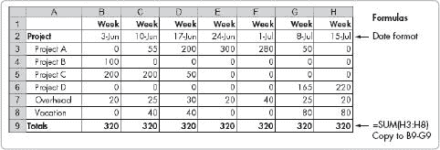

**图 12-3. 工作表跟踪工程时间**

您可以使用工时跟踪工作表方法收集多个团队的信息，并在单个工作表上总结它们。要存储其他团队的信息，复制工程工作表并重命名和修改底层数据。要创建总结工作表，首先复制工程工作表并将其重命名为 *Summary*。参见图 12-4。

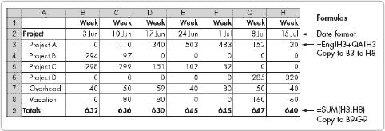

**图 12-4. 工时跟踪工作表中的总结工作表示例**

图 12-4 展示了一个总结工作表的简单示例，它是更大工作表的一部分，包含两个工作表——一个用于工程（称为 *Eng*）和一个用于质量保证（称为 *QA*）。每个工作表都收集了每个团队的数据。在这个例子中，总结工作表将两组的内容相加，以显示总小时数。

## 工程维护和间接费用

项目估算还需要您了解工程在维护和间接费用上花费的时间，这不同于实际项目工作。您必须知道这些信息来规划未来的项目工作并创建估算，因为它有助于将项目天数转换为日历天数。

您可以使用收集到的原始时间数据来创建 *平均可用百分比*。考虑以下示例：假设您的开发团队在 8 周内平均花费 67%的时间在项目工作上（33%为间接费用），没有显著加班。您可以将项目小时数转换为日历小时数，如下所示：100 ÷ 67 = 1.49。使用这些信息，您可以确定一个需要 12 个工程小时才能完成的任务将需要 12 × 1.49 = 17.91 个日历小时，或大约 2.4 天（17.91 ÷ 8 = 2.24）来完成。

可以将自动计算间接费用百分比的途径纳入数据收集过程。图 12-5 展示了这种方法，使用总时间和总项目时间来计算间接费用。

**简单时间总结**

我曾为一家快速成长的小公司工作。我们没有一种方法来估算团队在每个项目上花费的时间。当时，跟踪包太贵了，因为业务状况不佳。个人抵制时间报告。

管理摘要方法在提供对时间去向的鸟瞰图方面效果相当不错。事实证明，这个估计是相当合理的，以至于管理层将其提供给最终收购我们公司的公司。这些数据满足了购买公司的需求。

—规划总监

**图 12-5. 计算间接成本**

对于包含大量加班时间的资料要谨慎，尤其是如果它是基于每周 40 小时工作制而非总小时数来计算的。即使使用了总小时数，大量的加班时间也可能扭曲计算结果——除非，你的团队的标准做法是进行大量的加班工作。（如果是这种情况，你的计算将是正确的，但你应该重新阅读这本书的第一部分，因为你和你的团队可能没有健康的工作与生活平衡。）

另一个注意事项是考虑如何将休假时间平均到你的数据中。休假通常在 5 月到 8 月以及 12 月进行，而不是全年分散进行。因此，在收集数据时应将休假时间单独列出。此外，寻找休假模式，如夏季和 12 月下半年的休假较多，并据此规划你的项目。

不要惊讶地发现，你的团队的非项目时间占正常每年工作时间的 25%到 50%。典型的科技公司有 3 周的休假，7 天的节假日，加上病假。这些因素本身就构成了每年工作日的 10.4%。会议、维护任务和其他常规职责可能会占用你团队大量时间——从 10%到 40%，具体取决于公司和文化。由于项目时间是总日历时间的百分比，因此使用倒数（1 ÷ 百分比可用性）将估算小时数转换为日历日。例如，60%的可用性计算如下：1 ÷ 0.6 = 1.67（1.67 是乘数）；因此，3 个工作日是 3 × 1.67 = 5 个日历日。

# 额外阅读

这里有一些关于本章所讨论主题的额外阅读材料：

| *控制软件项目：管理、测量和估算，作者：Tom DeMarco（Prentice Hall PTR，1986 年） |
| --- |
| *在半数时间内开发产品：新规则，新工具，作者：Preston G. Smith 和 Donald G. Reinertsen（Wiley，1997 年） |
| *软件成本估算，作者：T. Capers Jones（McGraw-Hill Osborne，2007 年） |
| *管理它！现代实用项目管理指南，作者：Johanna Rothman（Pragmatic Bookshelf，2007 年） |
| *《软件工程的神话：纪念版》，作者：Frederick P. Brooks, Jr.（Addison-Wesley Professional，1995 年） |

# 第十三章。开始一个项目

开始一个新的项目可以类似于规划一次旅行。你需要选择目的地，决定谁会与你同行，弄清楚成本，确定如何到达那里，为意外情况做好准备，最后迈出第一步。在项目中，你定义目标，组建团队，设定优先级，制定计划，准备风险，定义执行项目的框架，并通过启动会议迈出第一步。在这两种情况下，在你起飞前规划你的起点将使剩余的旅程更加愉快。

在许多小型软件公司中，工程师们通常会直接跳到项目的中间阶段，通过立即编写代码并查看其是否工作来开始。然而，跳过适当的规划起点将保证最终产品在交付、客户满意度、质量和成本方面会遇到困难。想象一下，有一天你起床，开车去机场，随机选择一架飞机登机。一开始可能会很兴奋，但一旦到达那里，可能就不会那么有趣了。

对于任何项目或旅行，你应该首先专注于理解目标。

# 理解目标

在项目开始时，目标可能看起来很明显：构建软件。客户希望解决特定问题，并希望购买软件来解决这个问题。

创建一个通用软件程序不仅仅是关于一个客户的目标。客户可能要求一个非常具体的软件解决方案，但直到软件交付并在生产系统中使用后，他们才可能确定这个解决方案是否真正提供了对核心问题的答案。

随着你开始全面理解客户的问题和解决方案需求，你将开始理解你**公司**的项目目标。如果你是为单个客户构建产品，你可以直接要求客户指定所需内容。然而，如果你正在向许多客户销售产品，而这些客户与你没有直接联系，那么你的产品营销团队负责理解市场，并作为开发团队客户的代表。在考虑你需要如何理解你的软件客户或用户，以及你的公司和开发团队如何融入这幅画面时，请记住这个信息。

一旦你理解了客户的困难和需求，并看到了你在提供解决方案中的公司角色，你的下一步就是就**共同**目标达成一致。例如，考虑以下问题：客户是否在寻找软件以降低运营成本？客户是否需要改进的功能以提供更好的客户服务？你的产品是否是客户在固定时间框架内进行的大宗交易的一部分？客户是否试图向其客户提供全新的产品或服务？客户是否希望生产一个高度可扩展的系统，其中你的产品是其组成部分之一？

项目越大、越重要，你就越需要*直接*与客户交谈。如果不直接与客户交谈以了解他们试图通过解决方案实现的目标，你可能会在交付的软件上偏离目标。当你与个别客户交谈时，用自己的话复述你所听到的，以确保你理解。询问他们的当前需求，并了解他们在产品推出后的使用计划。

客户会议结束后，创建一份总结信息和要求的备忘录，按照你的理解发送给客户进行审查。这种方法有助于避免未来可能出现的误解。

一旦项目的目标和要求明确，你就可以通过选择项目开发团队来开始规划过程。

# 组建项目团队

如果贵公司正在从事一个大型项目，组建团队不是一个项目问题，而是一个一般的人员配置问题。遵循良好的招聘实践，组建尽可能优秀的团队（如第四章第四章. 增长软件团队所述）。许多小型公司同时从事多个项目，这些项目都从共同的工程师团队中抽取资源。在这种环境中，为每个项目选择合适的团队对项目的成功至关重要。

许多经理通过关注项目开始时每个开发者的可用性来选择团队成员。然而，可用性不应是你的唯一标准：考虑候选人对工作的兴趣和热情；项目在公司工作量中的优先级；候选人对技术的熟悉程度，与客户和利益相关者的合作能力，任务的多样化；以及项目是否有助于或损害开发者的职业生涯。

对工作的兴趣和热情是团队成员对项目成功做出贡献的重要标准。一个对项目充满热情的工程师更有可能以积极的方式做出贡献，尤其是如果他或她曾向你请求参与项目的机会。

对于贵公司来说，项目的重要性越高，分配最强工程师参与项目的必要性就越大，只要他们对这项工作充满热情。此外，考虑工程师是否有与项目所需技术合作的经验，或者他们是否需要花时间学习。如果候选人需要学习，你能否将其纳入项目成本和时间表，并在规定时间内交付成功的项目？边做边培训会增加整体项目风险，这对于高优先级项目必须考虑。

此外，如果从事项目需要与客户进行大量互动，工程师是否对建立客户关系和与客户合作持积极态度？如果不是，你最好分配一个喜欢与客户合作并倾听客户意见的工程师。

接下来，考虑你是否一次又一次地将相同的任务分配给相同的工程师。这种不良的管理实践并不能帮助工程师建立他们的技能集，这对于帮助团队成员在处理各种任务时获得灵活性非常重要。如果团队成员生病、休假或离职，你需要这样的灵活性。此外，请注意，工程师会对执行重复性任务感到厌烦，因此分配给他们新的挑战可以帮助他们留在你的公司。

最后，考虑参与项目是否会对开发者的职业生涯有所帮助或有害。为资深工程师提供常规或低级任务可能会降低他们对未来雇主的吸引力。许多工程师意识到这一点，如果他们看到自己的任务导致他们的职业生涯停滞不前，他们可能会开始寻找新的工作。

花时间考虑最适合这项工作的人员是一种宝贵的时间利用方式。正确地将人员与工作匹配不仅能够提高生产力，还能降低风险并提升员工士气。

## 替换

项目并不总是按部就班地展开——在团队成员可用性变化的过程中可能会出现问题：也许项目在不同的发展阶段需要不同数量的工程师，或者团队成员在项目周期的一部分时间内不可用。在这种情况下，你需要考虑的不仅仅是普通的人员配置问题。

用一名开发工程师替换另一名短期工程师效果不佳，尤其是如果替代工程师的时间少于三周，并且他的工作没有产生一个*明确的可交付成果*（一个在完成工作后可以单独评估的代码的明确部分）。首先，替代工程师的项目认同感不如全职团队成员，这可能导致工作质量低下。其次，替代工程师没有全面的产品视角。他或她可能会做出导致后来才发现问题的假设。最后，许多工程师发现重写他人的工作比花时间理解它更容易，这导致浪费了努力——如果原始工程师返回项目并恢复原始代码，这种情况有时会重复发生。

替换在以下情况下效果最佳：明确将可交付成果定义为工程师的目标，工程师有足够的时间和专长来理解代码，尤其是当工程师对与其他工程师的代码合作持积极态度时。如果满足这些要求，花时间详细向新工程师描述项目要求，并与工程师一起审查具体的可交付成果。与整个团队举行另一次启动会议可能非常有效——它允许团队描述项目状态、开放的问题以及与原始要求的变化。最后，确保新工程师在开始工作之前同意可交付成果的合理性。

来自外部工程的压力可能会试图迫使你更换新工程师，以显示“为了完成关键项目，一切可能的努力都在进行中”。作为开发经理，你必须向其他人解释这种方法的成本。如果替换是合理的，考虑让替代工程师在项目上长期工作，而不是在原团队成员返回后将其释放。

## 游戏延迟

一些项目在开始时由于团队不可用而延迟。在这样的项目上，你可能会倾向于增加工程师以弥补失去的时间，尤其是如果你有一个固定的完成日期。如果你有这样的冲动，请休息一天，阅读弗雷德里克·P·布鲁克斯（Jr.）的《人月神话》（见“附加阅读”中的附加阅读更详细地描述了不同类型的流程。

*标准* 定义了项目上使用的专业技术实践和语言，包括编码语言、最小编码规范和文件交换格式。你选择的标准可以极大地影响你团队提供的代码的质量和可维护性。通常，在小公司中，一般技术标准并没有明确设定，因此你可以利用新项目作为定义稳固标准的机会。

*工具* 描述了项目上要使用的软件工具、软件库和硬件系统。一些项目被设置为“自由选择”，只要它能让编写代码的工程师满意，任何工具或系统都可以使用。虽然给予工程师在工具选择上一定的灵活性可能是个好主意，但未考虑某些工具选择对业务的影响是疏忽的。要么定义要使用的工具，要么在项目开始前审查团队的选择，以了解选择可能带来的潜在影响。参见第第七章和第八章了解更多关于工具、方法和技术的信息。

# 制定时间表

项目时间表通过规划初始任务顺序来改进产品和流程。首先创建一个任务和依赖关系的列表，然后考虑如人员可用性等约束条件，将它们按合理的顺序排列。接下来，估计每一步的成本，包括努力的小时数和预计所需时间。在计算日历时间表时，考虑到由于会议、休假、节假日和疾病等干扰，你的员工并非每周都能全职参与项目。你可以使用电子表格来建立你的估计并跟踪项目进展的时间。所有这些技术都在第第十二章和第十四章中更详细地介绍。

现在让我们将这些部分组合成一个项目计划。

# 创建项目计划

与项目利益相关者明确、书面地达成一致，详细说明项目的方向和目标，将大大提高你提供符合这些目标稳固产品的机会。此协议应描述项目的可交付成果、预期时间、项目的成本以及详细描述努力的文件。同样重要的是关于项目风险、约束和开放项目（未决问题）的协议。

一种简单的方法是在一页项目计划中定义所有这些信息。图 13-1 展示了可以产生一到两页计划的项目计划模板。

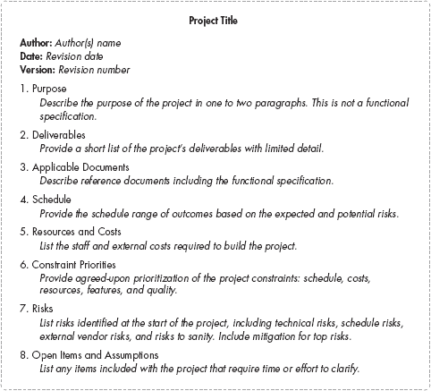

**图 13-1. 样本项目计划模板**

一个简短的项目计划在小公司中可能看起来是一种不必要的正式程序。然而，该计划可以作为有用的沟通工具，因为它为所有利益相关者框定了项目，帮助他们理解你对项目的愿景和它将面临的问题。创建项目计划的练习也将帮助你理解项目的范围。

制定计划需要你收集有关项目风险和优先级的信息。就项目计划达成一致需要就不同的项目变量进行一些协商。在项目开始时处理好这一点，以消除由于对项目期望不同而可能产生的某些不满。

在项目这个阶段，一个页面的图形，如甘特图或其他工具，代表开发努力也可能有所帮助。一个清晰的单页插图可以帮助项目利益相关者轻松理解即将开始的努力。

在计划定义完成后，你就可以启动项目了。

# 启动会议

最好的项目启动方式是什么？即使是简短的非正式*启动会议*也能提高项目成功率并减少浪费的时间，但确保你安排好时间，让所有团队成员都能参加。

在启动会议上，回顾以下领域：

+   项目团队成员和角色

+   项目的目标和需求

+   客户、团队和公司对该项目的视角

+   时间表和其他资源

+   潜在风险

+   成功的结果

启动会议也是你建立团队对项目及其成功热情的机会。设定积极基调，留出时间回答问题，并保持讨论在较高层次。你可以在单独的讨论中稍后填补较低层次的细节。

启动会议还充当一个仪式，定义了新旅程的开始。如果没有启动会议，团队成员可能会感觉他们是在向着项目漫无目的地前进，而不是沿着一条通往积极最终目标的欢迎之路前进。

成功的启动使你的项目为成功定位。现在你准备好开始跟踪和管理项目了。

# 额外阅读

这里有一些关于本章所讨论主题的额外阅读材料：

| *《控制软件项目：管理、测量和估算*》，作者：Tom DeMarco (Prentice Hall PTR, 1986) |
| --- |
| *《在半数时间内开发产品：新规则、新工具，第二版*》，作者：Preston G. Smith 和 Donald G. Reinertsen (Wiley, 1997) |
| *《管理它！现代实用项目管理指南*》，作者：Johanna Rothman (Pragmatic Bookshelf, 2007) |
| *《人月神话：软件工程论文，纪念版*》，作者：Frederick P. Brooks, Jr. (Addison-Wesley Professional, 1995) |
| *《与熊共舞：管理软件项目风险*》，作者：Tom DeMarco 和 Timothy Lister (Dorset House, 2003) |

# 第十四章。项目执行和跟踪

结果很重要。作为一家小型成长型公司的开发经理，你的工作成果和结果将受到评判。你的团队必须按时交付高质量的软件项目，并且该软件必须让客户满意。

当你推动你的开发团队走向成功时，你应该预料到在途中会遇到一些弯路和危险。很少有计划能够按照最初的设想执行，因此你需要在项目整个开发周期中跟踪和指导项目。

好消息是，你不需要使用复杂的项目管理技能来管理小型公司中的大多数项目。本章讨论的一般实践将帮助你找到并使用适当的工具来推动项目执行。

### 备注

*在你可以管理项目执行之前，你应该以适当的方式启动项目。如果你还没有阅读第十三章，现在就去读，并提前建立你的项目目标、计划和优先级。然后组建一个获胜的开发团队*。

# 管理项目执行

成功的项目管理始于对当前项目状态的准确了解和对要完成的任务及目标的现实估计。你的主要目标是明确的：你必须推动项目走向成功的结局。研究项目的最终目标和与当前开发状态相关的目标。至少每周根据仍需完成的任务和出现的新挑战修订你的计划。

仅根据原始时间表中的估计来衡量你团队的工作进度，作为完成任务百分比的依据是不够的。当项目或其组成部分发生变化时，坚持原始时间表可能导致你用“我们落后于进度又怎样？我们还有很多时间赶上。”这样的想法来合理化为什么开发可能会落后于进度。相反，你需要保持现实，随着项目的进展调整你的计划；不要等到你的团队失败。对项目延误做出快速反应，进行项目再评估，并实施适当的变更以改善进度和结果。你可以通过重新安排任务、应用更多开发资源、更改功能交付成果，有时优化流程中的某个步骤来提前进行调整。

## 项目管理的五条规则

要理解和传达你项目的实际状态，你需要的不只是正确的策略和正确的工具。你需要正确的态度。以下五条规则可以作为你管理项目现实和成功的指南。

不要欺骗自己。

这种常见的发展经理错误可能导致一些不太建设性的行为。例如，如果你无法处理关于开发延误或问题的真相，你可能会因为特定的截止日期尚未到来而忽略交付预测。你可能会说服自己认为你仍然可以按时完成。或者，你可能决定一项任务只需要正常所需时间的一半，只是为了让计划在纸上看起来更好（以及让自己感觉更好）。如果你还没有制定出减少努力时间的现实计划，不要自欺欺人。在你被迫这样做之前，抓住机会认识到这样的严重问题。

不要欺骗他人。

保持你的项目进度诚实。不要让项目预测重复原始计划，因为高层管理不希望听到坏消息。一些发展经理在描述开发团队的状态时反映了他们最初的交付时间表——在最坏的情况下，这种欺骗一直持续到软件交付日。这导致了由于延误而产生巨大影响，几乎没有机会解决严重问题。相反，随着项目的进展，你必须向那些对你的项目结果有利益关系的人提供事实信息，包括管理层和开发团队。

早期处理坏消息，并让每个人都知道细节。

在许多工作场所，人们在交付日期即将到来之前倾向于透露坏消息。在缺乏信任的环境中，这种行为实际上是被鼓励的。一些高级管理人员不想知道潜在的问题：别告诉我，只管解决它！这种态度导致在调查或承认问题上的延误，直到事件迫使讨论并引发危机。相反，应尽快通知相关人员问题，并包括解决这些问题的计划。尽早处理和揭露问题将导致更好的整体解决方案。

如果你预测到无论你做什么，项目都会延迟，那么你就是延迟了。

在流程早期发现问题是理想的，因为你显然有更多的时间和选项来解决这些问题。游戏后期发现的问题更难解决，因为时间和选项都很少。不承认未来的交付延迟，就像在 10 分钟内约定但需要 50 分钟才能到达时问“我会迟到吗？”一样。*你迟到了，就是这样*。立即打电话并让人们知道。

大型、最后一刻的时间表惊喜是不可接受的。

人们可能不愿意承认他们负责的项目遇到了严重问题，并且无法按时交付。当一个项目即将错过一个关键日期，比如交付日期时，推迟告诉管理层和客户坏消息是人之常情，直到你不得不这么做。然而，记住，客户根据你告诉他们的信息制定战略商业计划；他们的成功可能取决于你是否能履行你的发布承诺。等到最后一刻才通知客户项目无法按时交付，将毁掉你的信誉，甚至可能毁掉你的业务。同样，也可能毁掉客户的业务。

现在有一些基本的规则可以帮助指导你的步骤，让我们看看在执行过程中跟踪项目的方法。

**最后一刻的惊喜**

我的公司有多个工程经理向同一个总经理（GM）汇报。一位经理负责一个六个月的项目。该小组的总经理每周举行员工会议，审查每个人的项目进度。这位经理每周都会报告项目按计划进行。在交付前六周，他说项目会按时完成。在交付前五周，他表明项目会按时完成。在交付前四周，他说项目会按时完成。营销告诉客户软件将在四周内发货。在交付前三周，经理表示项目会按时完成。在交付前两周，他说项目需要额外三个月的时间。

这是一个令人震惊的时刻。要么这位经理对项目的洞察力如此之少，以至于直到交付前两周才知道项目会延迟，要么他一直误导大家，直到被迫承认存在问题。

——同行工程经理

# 项目跟踪方法

两种项目跟踪方法对小软件公司来说效果很好。一种方法是使用*甘特图*，它允许你通过图形方式跟踪项目进度与原始计划的对比，并预测进度结果。如图图 14-1 所示，甘特图使用水平条形来表示左侧显示的任务所需的时间长度。连接条形的箭头被称为*依赖关系*。一个依赖任务在开始之前需要完成一个较早的任务。在这个例子中，比萨饼必须送达，桌子必须摆好，晚餐才能开始。菱形用于标记里程碑——在这个例子中，菱形标记晚餐已经结束。

**图 14-1. 简单甘特图**

第二种方法是*跟踪表格*，它通过原始估计来衡量进度，并使用预定的公式预测可能的成果。你可以扩展跟踪表格以显示每个步骤的最小值、期望值和最大值，从而显示一系列最终交付日期。

当项目有许多*任务依赖关系*并且需要适度的并行任务来完成项目时，甘特图效果最佳。由于甘特图通常只允许进行简单的计算，因此如果需要更复杂的数值分析，如跟踪多个结果范围或基于公式的活动基时间，则不适用。

相比之下，跟踪表格最适合项目具有较少的任务相互依赖性、更多并行步骤、更多任务数量和复杂计算。表 14-1 提供了基于项目特征的两种方法的比较。对于大型项目，复杂的工具可能提供最佳结果，但在小型软件公司中很少需要。

**表 14-1. 甘特图与跟踪表格比较**

| 特征 | 甘特图 | 跟踪表格 |
| --- | --- | --- |
| 任务之间的相互依赖数量 | 许多 | 很少 |
| 并行任务数量 | 很少 | 许多 |
| 进行最佳、典型和最坏情况交付估计 | 困难 | 相对容易 |
| 计算 | 一些 | 许多 |
| 可视化——快速评估 | 容易 | 可能更困难 |

你可以使用这两种方法来跟踪对单个发布有贡献的多步骤努力。此外，你可以调整任一方法以适应不同的流程工作流程和里程碑。考虑以下简单的项目案例和选择方法。

情况 1：你被要求为你的在线应用程序实现一个新的数据接口功能。数据接口需要与客户协商数据格式并定义用户界面。你需要包括一个认证审查步骤，并且几个中间代码开发步骤需要遵循一定的顺序。在您的团队完成初始接口定义后，项目需要更改数据方案。对于这种情况，甘特图应该可以合理地工作：项目涉及多个相互依赖关系，团队成员数量相对较少，并且有并行任务。

情况 2：营销部门要求开发部门在两个月内创建 44 份新的客户报告。你决定将任务分配给你的五名工程师团队，以完成报告。在估算报告所需时间后，他们的估计差异很大。你需要为工程、QA 和文档团队分别安排每个报告。在这种情况下，跟踪电子表格是合适的，因为任务相对独立，且分配了大量的任务。电子表格将允许你轻松地在个人之间转移任务。

既然你已经有了整体情况，让我们来看看使用甘特图和电子表格作为项目管理工具的细节。

## 甘特图

大多数项目管理软件工具都可以用来创建甘特图风格的图表。商业项目管理工具，如 Microsoft Project，在配置和标记图表的方式上提供了相当大的灵活性。图表的优点包括易于查看依赖关系和项目进度，以及能够打印图表供他人审阅。然而，如果你的图表设计得不好或使用不当，你就不会享受到这些优势。

一个常见的错误是只提供行和列格式的底层数据，而不是使用甘特图，如图表 14-2 所示。这里的“前置”列显示了必须完成的前置任务。

**表 14-2. 表格格式的数据**

| 任务名称 | 持续时间 | 开始 | 结束 | 前置 | 资源名称 |
| --- | --- | --- | --- | --- | --- |
| 任务 1 | 2 天 | 9/15 | 9/16 |   | 詹姆斯 |
| 任务 2 | 1 天 | 9/16 | 9/16 |   | 约翰 |
| 任务 3 | 4 天 | 9/17 | 9/22 | 1,2 | 梅根 |
| 任务 4 | 3 天 | 9/23 | 9/25 | 2,3 | 亚当 |
| 任务 5 | 2 天 | 9/23 | 9/24 | 3 | 约翰 |
| 任务 6 | 1 天 | 9/25 | 9/25 | 5 | 詹姆斯 |

这种信息在图 14-2 所示的甘特图中更容易可视化。

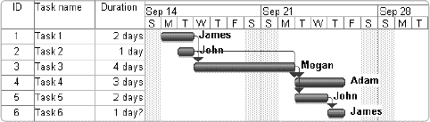

**图 14-2. Gantt 图中的信息更容易理解。**

一旦 Gantt 图设置正确，您的团队应该能够一目了然地看到以下内容：

+   任务状态

+   预测最可能的项目交付日期

+   基于流程的里程碑

+   每个步骤分配的员工

+   每一步的任务相互依赖关系

图 14-3 展示了**Gantt 图布局**方法。每个任务都有自己的行。左侧有两列使图表易于阅读。使用两列效果很好，但您可以在不分散主要信息的情况下添加第三列或第四列。例如，您可以为这个示例添加一个第三列来表示任务开始日期。

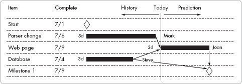

**图 14-3. Gantt 图布局示例**

在这个布局中，行显示的是菱形里程碑标记或表示任务时间线的实心条。条右侧的文字显示分配给每个任务的个人。每条左侧的文字显示总任务时间，单位一致（在这种情况下，为天数）；任务时间信息应保持一致单位——也就是说，在时间尺度上不应在周、天和小时之间切换，因为这会使快速计算复杂化并导致错误。箭头表示任务之间的依赖关系。在这个简单示例中，网页任务在解析更改任务和数据库任务完成后开始。

Gantt 图的价值随着任务数量的增加而增加。包含 30 到 50 个不同任务且具有依赖关系的项目可以直接在 Gantt 图中演示和可视化。

在构建 Gantt 图时，请考虑以下指南：

+   设置时间尺度，以便尽可能在单个屏幕或页面上查看 Gantt 图。查看跨越许多页面的图表限制了读者全面理解所有任务及其相互依赖关系的细节，并使规划所需更改变得困难。

+   在进行时间线分配时，使用相同的单位输入所有数字，理想情况下使用天数或周数。

+   确保代表今天的线足够粗，以便容易看到。

任何管理跟踪工具一样，Gantt 图是一个**活计划**。至少每周更新 Gantt 图以反映实际的项目时间线和任务。定期更新使图表成为项目历史的准确和完整记录。在更新时，保存旧版本的副本。使用版本控制软件保存文件的副本，或者根据日期或其他相关信息保存不同文件名的文件。不要覆盖这些文件，否则会丢失历史数据。

甘特图软件的一个有用功能是表示今天的垂直线。随着项目的进展，定期审查周期将每天、每隔一天或每周发生。在每次审查中，您可以调整今天线左侧条形的长度和起始点，以反映项目历史。如果任务开始得晚，将任务开始时间移动以反映实际情况。如果某个步骤花费的时间多或少，更改条形长度以反映这一点。如果人员分配发生变化，请在图表中反映这一点。

今天线右侧的时间反映了您对未来最佳估计——需要完成的任务及其所需时间。如果过去任务花费时间过长，避免缩短未来任务长度以维持最终目标。除非有变化来证明缩短即将到来的任务所需时间的估计是合理的，否则未来任务长度应保持不变。

此外，根据过去任务维护未来里程碑的依赖关系，除非依赖关系不再存在。例如，如果步骤 B 跟随步骤 A，并且步骤 A 晚了三天，那么步骤 B 将比最初预期的晚三天结束。保持诚实。

按照这种方法，您会欣赏甘特图的功能。首先，您可以使用图表来沟通状态。此外，甘特图在开发过程中持续预测项目的未来结束日期，基于已经过去的时间和截止日期以及您的当前最佳估计。良好的预测有助于您规划未来（或改变潜在的结果，在它发生之前），通过增加人员、删除功能或有时重新排列任务。最后，甘特图存储项目历史，这在项目完成后，在改进审查期间特别有用。此外，您可以使用这些信息来为新项目创建估计，并比较工程师在估计与实际交付时间上的表现。

这种基本图表的一个有用变体是*双柱跟踪甘特图*，您可以使用它来比较原始计划与当前状态。如图图 14-3 所示，甘特图在双柱显示中也同样有效，如图图 14-4 所示。在此图中，黑色条形表示原始计划，灰色条形表示更新的数字。Microsoft Project 允许您创建双柱跟踪甘特图；在此产品中，原始计划被称为*基线*。

**图 14-4. 双柱跟踪甘特图**

项目管理工具，如 Microsoft Project，提供了相当多的功能，随着您在甘特图经验中的进步，值得调查，包括以下内容：

+   在任务之间建立复杂的依赖关系，例如添加不同的延迟或任务之间的开始/结束关系

+   在设置甘特图后一次性计算资源使用和成本视图

+   将一系列任务分组

+   按个人查看工作量

现在您已经掌握了甘特图设置的基本知识，让我们回顾基于电子表格的方法。

## 项目跟踪表格

当任务之间的相互依赖性较少、任务数量较多以及并行任务数量较多时，请使用跟踪表格。您可以使用常见的电子表格工具，如 Microsoft Excel 或 OpenOffice.org Calc 来创建跟踪表格。与甘特图一样，跟踪表格允许您将结果与原始计划进行比较，以及预测可能的完成日期。然而，电子表格还允许您在做出预测时使用复杂的计算。

图 14-5 显示了简单的跟踪表格。您可以相当容易地添加任务和子任务。任务时间应分解为几天的小增量。

**图 14-5. 跟踪表格**

本例使用日历日估算所有数据，而不是工作小时或连续时间估算。如第十二章中所述，*日历日估算*包含了为执行工作的人员预期的任何非项目时间。在做出估算时，工程师除了考虑手头任务外，还要考虑一周内所需的其它任务和间接任务。因此，如果估算为五天，工程师不仅要考虑直接在任务上工作的时间，还要考虑间接任务和其他项目的工作时间。

使用日历日的替代方法是跟踪每个任务的预期工作时间。工作时间是如果工程师全职从事该任务所需的实际小时数。为了创建这个估算，使用一个乘数将工作时间转换为日历日。这个乘数考虑了间接任务和其他任务，这些任务阻止工人将 100%的时间仅用于分配的任务。软件公司的间接费用百分比可能有所不同，但一个常见的数字是 30%，这导致乘数为 1 ÷ (1 - 0.30) = 1.42。有关这个主题的更详细讨论，请参阅第十二章。

电子表格直接计算日历日期结果。图 14-5，例如，说明了计算结束日期的两种不同方法。计算可以基于今天的日期，并按需添加时间估计以完成项目（从左侧列），如项目日期 1 所示。或者，你可以根据项目开始日期、已花费的时间以及剩余时间的估计（从左侧列或列 D）来计算结束日期，直到项目完成，如项目日期 2 所示。项目日期 1 的方法会在你每天检查工作表时改变结束日期，除非你不断更新左侧列的值或输入今天的日期作为数字而不是使用`today()`函数。项目日期 2 的方法不会每天改变，但会在“已花费”列中积累小错误，这可能导致项目接近结束时出现天数错误。两种方法都需要保持警惕以确保准确性。

你可以将跟踪电子表格用作项目管理工具。如果需要，你可以随着进度修改工作分配。如果你需要添加一个步骤，你可以添加一整行，但将计划列的值设置为*零（0）*并添加注释，就像你添加了一个未计划的项目一样。要删除一个步骤，请保留该行，但将左侧列的值设置为*零*并添加注释。与双跟踪甘特图一样，电子表格将允许你在项目完成后比较你的原始计划与工作历史。

正如提到的，良好的项目管理要求你在整个项目过程中准确跟踪项目状态。如果你构建了一个模型，它可以与项目状态信息结合来预测未来的结果。如果你不喜欢结果，你可以通过模型提出“如果”问题来对你的项目进行更改。变化发生在大多数项目中——人员变动、需求变化，以及新的机会和问题出现。一个好的模型让你能够应对变化，而不是被变化所冲击。

因为这个规划工具预测了每天的预期结果，它允许你进行更改以改善结果。你可以通过“如果”计算来识别改进——如果我删除一个任务会怎样？如果我添加一个功能会怎样？如果我增加人员会怎样？尝试这种方法，查看修改后的结果，并判断这种改变是否合理，是否使计划更接近预期的目标。

在了解了跟踪电子表格的基本知识后，让我们考虑许多并行任务的项目可能面临的一个常见问题：随着工作的进行，在开发者之间平衡工作负载。以下几节将向您展示如何使用电子表格进行这些更改。

### 人员分配和工作负载平衡

随着项目的进展，计划会随着实际时间和新任务进入计划而改变。仅仅调整任务的长度通常会留下一个不平衡的任务集——也就是说，一些工程师已经完成了他们的任务，而其他人仍在努力工作。一些工作量的重新平衡可能会有所帮助，你可以使用一种简单的方法来查看哪些调整最有意义。当然，在分配任务时，你必须考虑到工程师的技能和背景知识。

你可以在项目期间更改团队分配以平衡工作量并减少完成任务所需的总时间。这种方法最适合灵活分配工程项目的项目。图 14-6 显示了图 14-5 中显示的样本工作表的修改版本。

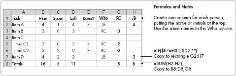

**图 14-6. 平衡团队工作量**

此工作表允许基于项目剩余时间进行快速的“如果”计算。在这个简单的例子中，在“谁”列（列 F）中添加首字母影响了每个工程师剩余的工作天数（列 G 和 H）。这允许你通过调整分配直到 RC 和 JB 有大约相同的工作量来做，来快速分配并基于项目剩余时间平衡工作量。涉及数十个任务时，手动进行负载平衡可能是一项复杂的任务。当然，这个工作表可以很容易地扩展以覆盖更大的团队。

让我们来看看跟踪工作表的另一种变体，即最小-典型-最大工作表。

### 最小-典型-最大跟踪

跟踪工作表可以设置来预测一系列结果。通过为每个任务添加*最小-典型-最大*值数据列，可以同时检查最佳情况、可能情况和最坏情况。当风险已知时，“最小-典型-最大”跟踪方法在处理风险管理问题时非常有用。它可以帮助你早期可视化并解决潜在的进度风险。

图 14-7 展示了一个示例的 min-typ-max 跟踪表格。您可以从原始工程估算中输入任务时间范围。随着工作的进行，将实际花费时间输入到实际列（G 列）。花费加剩余列应提供总项目努力的估算范围，在最终估算中。此表格使用与图图 14-5 和图 14-6 中相同的公式；这里的关键区别是增加了计划及剩余时间的最小值、典型值和最大值列。另外增加了一行（第 9 行）来汇总花费时间和剩余时间的估算。

在这个例子中，原始计划的最小-典型-最大结果范围是 15-19-31 天。随着任务 A 和 C 的完成，预期的结果现在变为 21-23-28 天。结果仍然在预测范围内，但更接近原始计划中预测的最坏情况。

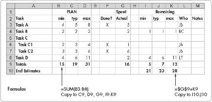

**图 14-7. Min-typ-max 跟踪表格**

# 变更控制流程

每个软件项目都会从原始计划中经历变更，并且需要一个变更控制流程来防止变更变成混乱。变更控制流程是一份关于如何处理变更请求的协议，包括决策、沟通、支付和文档。对于小型产品公司，指定决策者、沟通方式以及就记录机制达成一致的一种简单方法应该足够。对于销售产品的同时提供可计费服务的公司，可能需要一个更正式化的流程，这将导致需要客户批准的书面变更订单。

如果没有建立变更控制流程，可能会出现以下几种不良结果：

+   项目成本增加。

+   项目被延误。

+   小型、不太重要的请求可能会超过整体项目目标。

+   客户不会为其请求的工作付费。这是一个错失的收入机会，并鼓励客户在最后一刻提出更多请求，因为他们可以免费这样做。

变更控制流程应区分客户请求的变更和内部请求的变更。对于内部变更，应要求市场和工程就项目功能、成本和交付变更达成一致。此外，您应迅速通知团队任何变更。

变更控制流程应考虑审批和实施：

批准

+   如何提出请求

+   谁负责估算变更的成本以及估算所采用的方法

+   谁需要批准变更

+   应咨询谁

+   如果是客户请求，如何将决策通知客户

+   客户如何以及是否会被收取特定请求的费用

+   相对于其他任务，变更的优先级是什么

实施

+   如何向团队传达变更

+   是否流程与文档团队沟通变更，并留有充足的时间确保在发布前变更到位

+   如何通过 QA 跟踪变更以确保其完成；由于变更不是原始计划的一部分，因此在开发过程中很容易被忽略

对于客户请求的变更，流程必须涉及贵公司的销售团队以及工程和市场营销团队。较大的变更可能需要与贵公司的高管团队进行讨论。

在公司增长阶段之前实施变更控制流程是合适的。最初审查的量和响应的延迟应较小，随着公司的发展而增大，因为每个变更都会影响更多客户。在早期创业阶段，为了满足客户需求而进行临时和快速的改变可能是可取的。在增长阶段，没有变更控制流程处理客户请求将大大增加您向所有客户提供满意度的整体能力成本。

# 风险管理

除了跟踪项目和应对变更外，开发经理还需要管理项目风险。每个软件项目都会面临风险，例如外部依赖导致延迟、意外的开发问题、团队成员不可用以及需求变更的滞后。尽早发现风险并努力最小化这些风险会导致成功的项目交付。等到风险成为现实会导致不必要的延迟。简单风险管理方法可以显著提高您的交付成功率。

小型公司的风险管理不必要复杂。跟踪和缓解风险的投入应与问题规模相匹配。通常，持续数月的中型项目是风险管理的良好候选者。对于持续不到一个月的项目，风险跟踪通常效用较低，除非项目位于关键路径上，或者它将直接影响发布日期或更大的项目。

简单的风险管理方法是在项目努力期间创建风险列表，并定期与团队一起审查。风险经理应考虑跟踪以下每个可识别的风险：

+   风险 ID：用于跟踪该风险的标识

+   项目标题：如果有多个项目在发布中跟踪，则为可选

+   风险标题

+   风险类别：时间表、质量或其他

+   风险发生的概率：可以使用不同的尺度，但三个、四个或五个值效果最佳（例如，低、中、高，或百分比）

+   风险实现的影响：如果它导致延迟，可以表示为添加到时间表中的周数

+   被分配监控风险的个人

+   备注：可以包括触发因素、缓解措施和应急计划

电子表格或表格可以是一种跟踪风险的实用方法。表 14-3 显示了样本表格。

**表 14-3. 风险跟踪示例**

| # | 风险标题 | 类别 | 概率 | 影响 | 分配 | 备注 |
| --- | --- | --- | --- | --- | --- |
| 1 | 第三方软件不符合宣传 | 时间表 | 中等 | 中等 | 史密斯 | 让其工作，购买替代包，或内部编写 |
| 2 | 可能的供应商交货延迟 | 时间表 | 低 | 高 | 琼斯 | 探索其他供应商 |

一个合理的风险管理流程要求你在团队会议上定期审查跟踪表。对于复杂项目，合理的时间框架是每周，但对于较小的项目则不那么频繁。在团队会议上，任何出席者都可以识别新的风险。项目团队确定风险价值和分配给谁以减轻风险影响。对于现有项目，分配人每周报告状态。分配人可以努力降低风险的概率和影响。在某些情况下，项目经理将监控低风险和中风险，并将它们视为项目可接受的风险。团队会议也可以是头脑风暴任何已识别风险缓解措施的时间。

对于大多数小型公司项目，你的主动努力应专注于减轻高影响和中影响的风险。当风险消失或降低到低影响或低概率风险时，风险就被*缓解*了。对于低影响或低概率风险，在整个项目过程中监控它们的变化通常就足够了。

应鼓励团队成员在团队会议上指出风险。告诉你的团队，早期发现风险使它们更容易修复或预防，并有助于确保项目成功。请注意，在风险发生之前指出潜在风险总是更好的，而不是处理其后果。在一些公司，企业文化不鼓励风险识别，因为指出风险的人被认为过于消极。开发经理可以通过列出自己观察到的风险来树立积极的榜样。

早期识别风险，就有更多的时间-风险杠杆来以最低的成本进行调整。*时间-风险杠杆*描述了当风险实现前的时间较长而不是较短时，今天的努力更加有效（具有更大的杠杆作用）。风险成为现实前的周数越多，你需要的减轻风险和获得理想结果的工作量就越少。等到问题成为关键现实的前几天再等待，意味着如果可以改变结果，可能需要大量的努力来改变结果。

考虑一个假设的场景：一个承包商无法保证在 10 周后，即你需要的时候，对关键模块进行安全审查。团队成员发现了这个风险，并向指定的风险缓解者报告，该缓解者开始联系其他承包商以寻找替代方案。如果团队成员在关键帮助所需的前一周发现这个风险，那么找到替代承包商将会更加困难，因为在这种情况下，可能几乎没有承包商能够及时提供帮助。你可以计算预期风险对进度的影响。如果你为每个风险输入百分比概率以及以天为单位的风险影响，可以通过将这两个数字相乘来确定有效影响。例如，20%的概率和 10 天的影响给出 0.2 × 10 = 2 天的风险影响。汇总所有进度风险将显示所有风险的预期未缓解影响。知道这个数字可以告诉你项目当前的总进度风险。

这个例子专注于进度影响，同时保持项目的其他方面，如功能。如果风险成为现实，你将使用 10 天，如果它们对于项目的成功是必需的。对于许多项目来说，不同特性的优先级差异很大。如果工作涉及的是低优先级特性，而进度是最重要的，客户可能会决定放弃一个特性以满足进度要求。当你考虑如何确定不同风险的影响时，要关注项目的核心可交付成果，并降低不那么重要的任务的优先级。

图 14-8 展示了未解决加权风险对项目的累积进度影响。根据你在更新图表时所知道的信息，风险调整后的进度可能将导致 12.5 天的延误。如果在这个案例中，风险在项目开始时就被识别出来，你就可以检查你快速缓解这些风险的能力。否则，将 12.5 天添加到你的项目进度表上将是谨慎的。

**图 14-8. 未解决加权风险**

总结来说，风险管理允许你尽早看到潜在问题的 影响，并在更容易处理的时候采取行动。如果使用成功的风险管理流程，那么影响你项目的危机将会减少——项目将运行得更顺畅，成功的可能性也会更大。

# 附加阅读

这里有一些关于本章所讨论主题的附加阅读材料：

| *《软件构造实用手册：代码完成》*，作者：Steve McConnell（微软出版社，2004 年） |
| --- |
| *《软件项目管理：管理、测量和估算》*，作者：Tom DeMarco（普伦蒂斯·霍尔，1986 年） |
| *《最后期限：关于项目管理的小说》*，作者：Tom DeMarco（多塞特出版社，1997 年） |
| *《产品开发时间减半：新规则，新工具》*，作者：Preston G. Smith 和 Donald G. Reinertsen (Wiley, 1997) |
| *《管理之道！现代实用项目管理指南》*，作者：Johanna Rothman (Pragmatic Bookshelf, 2007) |
| *《软件工程的神话：软件工程论文集，纪念版》*，作者：Frederick P. Brooks, Jr. (Addison-Wesley, 1995) |
| *《与熊共舞：软件项目风险管理》*，作者：Tom DeMarco 和 Timothy Listner (Dorset House Publishing Co., 2003) |

# 第十五章. 设计软件开发流程

流程可以是所有参与增长中的软件公司的朋友。一个有用的开发流程代表了公司关于创建和开发成功软件产品的所有学习。它为高效和成功未来的项目提供了一个基础，并使公司获得竞争优势。选择适当流程、根据该流程培训团队并维护该流程实践的开发经理可能会拥有一个高效且士气高昂的团队。

不幸的是，一些公司中存在问题的流程已经获得了不良声誉，在这些公司中，流程可能过于庞大、过时、难以更改、使用不便、毫无意义地强制执行，并且通常导致所有人进度缓慢。这些公司不是将流程视为改善成果的工具，而是将其视为目的本身。承受错误应用流程重负的员工会感到怨恨，尤其是对软件开发流程这一概念感到不满。

许多初创公司在没有创建开发流程的情况下开始。在最初的几版发布后出现问题时，很明显，需要从混乱中制定某种秩序。这些公司需要开发流程，但他们可能不知道如何选择、创建或实施一个。

本章向您介绍了软件开发流程，包括流程类型和流程选择。

# 软件开发流程包含什么？

软件开发流程定义了一种系统化、可重复的构建软件的方法，通常涉及一系列步骤或显示活动和决策点的图表。开发流程将定义、开发、测试和发布软件所涉及的步骤正式化。

尽管存在许多正式的软件开发流程，但它们的目标都是相同的：使软件开发可预测，同时支持企业目标。流程通过一个可重复的食谱来实现这一点，其中包含可测量的步骤。流程的输入包括产品定义、期望的时间表、工作人员、资源和预算的资金。可测量的流程输出包括交付时间表、质量、交付的功能和花费的资金。

不同的开发流程在定义上使用不同的策略。例如，有些流程试图尽早确定功能定义，并允许进度变化，而其他流程则固定每个发布的开发时间，并根据需要减少功能。流程在主要任务迭代次数、步骤之间的反馈量、里程碑的性质以及开发周期长度方面也存在差异。由于这些差异，不同的流程可以强调不同的结果，例如以下内容：

+   最短完成时间

+   预测进度的准确性

+   最终产品质量

+   活动成本

+   风险降低

+   最准确地满足客户需求

通过了解软件开发中使用的某些更常见的流程，可以让你了解不同的变体以及它们所优化的内容。下一节将介绍最常用的流程。

# 开发流程类型

每种流程都有其适用场景，没有一种流程是适用于所有情况的最佳解决方案。在某些情况下，合理地定制流程将提供最佳结果。

以下章节简要概述了各种流程。您可以咨询经验丰富的流程用户或阅读关于特定流程的书籍以了解更多细节。（参见“附加阅读”中的附加阅读。）每种流程都有其优点和缺点。在决定使用哪种流程时，请考虑您公司的环境。请记住，在某些情况下，公司政治问题可能会使一个很好的流程变得无法使用。

### 警告

*对于那些相信存在一个统治所有其他过程的权力环路的流程倡导者……好吧……放松一下。毕竟，工程师们需要了解其他流程才能理解整个故事，不是吗？*

*对于流程学习者，这些章节提供了开发流程的概述，但这里提供的信息不足以让你了解任何单一流程的每一个细节。你可以阅读书籍或接受培训以了解更多关于特定流程的信息。（现在你可以忽略那些“只有一个流程”的倡导者了！）*

通常，小型公司可以使用*轻量级流程*，因为它们需要有限的管理费用和最大速度。轻量级流程有几个基本步骤，几个关键里程碑，明确的要求，有限的报告，少数批准，以及几个替代路径。轻量级流程必须简单——简单到流程图可以轻松地放在一页纸上，并附上简短描述。

以下章节讨论了几种流程替代方案，从最常见的小型开发项目起点——临时性方法开始。

## 临时性的

创业公司通常在没有正式流程的情况下设计他们的第一个代码——也就是说，以*临时*的方式。这样的努力通常是这样的：开发者得到一个想法，编写代码，并不断调整，直到他喜欢结果。这种方法在小项目中可能有效（并且有趣）。

然而，在需要一个或两个以上开发者的项目中，临时方法在质量、交付和功能方面会产生不可预测的结果。结果通常不如使用可重复流程所实现的结果好。临时工作难以准确安排，随着项目规模的增加，整体开发成本呈指数增长。

临时方法最适合以下工作：

+   一到两个开发者

+   微小到小型努力

+   原型化一个想法

+   技术实验

## 瀑布流程

在其最简单的形式中，*瀑布流程*包括四个主要步骤：定义、设计、实施和测试。每个步骤都必须在开始下一个步骤之前完成。大多数实施瀑布流程的公司提供反馈路径，但它们需要特殊的审查，这可能很慢或很困难，尤其是在一些较大的公司中。图图 15-1 显示了该流程如何得名。

流程支持者经常指出瀑布流程的缺陷。一个问题是在项目开始时，许多项目缺乏明确的定义，因此在大项目上首先完成定义步骤可能非常困难。如果没有明确的定义，团队在开发周期后期发现开发问题时，通常会引发许多长的反馈循环。此外，如果团队在完成步骤并推进项目之后发现早期步骤存在问题，更改早期步骤的过程可能很繁琐。因为每个步骤都必须完成并获得批准，然后才能开始下一个步骤，因此开发速度可能比其他方法慢。

**图 15-1. 瀑布甘特图**

然而，瀑布流程也有其支持者。当满足以下标准时，此流程可以很好地工作：

+   项目客户的需求相对明确——例如，他们需要一个现有程序的变体。

+   一个分散的团队正在共同努力。

+   项目规模中等或较大。

+   项目不能分解成更小的可交付部分。

+   项目需要不同功能团队之间的大量交互。

## 修改后的瀑布流程

许多公司使用一种*修改后的瀑布*变体。修改后的瀑布允许在团队完成早期步骤之前开始一些后续步骤。大多数修改后的瀑布提供监控反馈循环，以便当人们在处理某个步骤时发现问题，他们可以重新工作早期步骤以帮助解决问题。例如，如果团队在设计步骤中检测到定义问题，团队将重新打开定义步骤来处理它。修改后的瀑布通常在反馈循环中定义要做什么，以防止努力变成混乱。图 15-2 展示了修改后瀑布的一个版本。

**瀑布工作得更好**

我曾为一家制造复杂、半定制软件产品的公司工作，我们公司将其销售给几十家客户。大多数工程师通常需要大约一年的时间来完成每个产品。在我的第一次尝试中，我的经理告诉我，在创建程序框架之后，迭代地添加功能。当我到达后期功能时，工作速度减慢——从客户那里获得清晰度、重新设计系统以及在整个系统中添加支持。

我在下一个程序中转向了瀑布方法。我花了很多时间从客户那里获得清晰的定义。然后我仔细设计并审查了系统，然后再进行编码。编码快速且成功。包括测试在内，项目完成时间缩短了一半。我的后续项目达到了或超过了这个结果。

—软件工程师

**图 15-2. 简单修改后的瀑布流程**

公司使用许多修改后的瀑布变体，例如在步骤之间添加测试、使用不同的步骤以及根据需求和公司政策使用不同的检查点。通过限制交接步骤的额外开销，同时满足公司和项目的需求，可以创建一个轻量级瀑布流程。

如果以下条件适用，修改后的瀑布流程可以很好地工作：

+   项目定义部分已知或可以早期发现，并且可以清楚地陈述。

+   在开发过程中，营销或客户可能会对产品定义进行一些修改。

+   您的公司需要一些非常具体的结构和控制。

+   项目不会分解成更小的可交付成果。

+   项目具有中等复杂性。

## 迭代过程

*迭代过程*将项目分成几个部分，每个部分都有“迷你瀑布”。开发团队可以使用迭代过程在功能部分开发可用的代码。营销可以在每个开发部分或迭代之前开发需求。团队在所有迭代结束时执行代码集成和系统测试。图 15-3 展示了迭代过程工作流程。

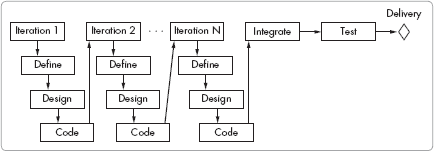

**图 15-3. 迭代过程工作流程**

迭代过程适用于以下情况：

+   需要高风险降低要求的项目

+   可以分解成更小、可用的段的项目

+   组件远比整个项目简单的项目

+   前期没有明确定义的项目

+   从多次小功能发布中受益的项目

+   需要中等到大努力的项目

## 螺旋过程

*螺旋过程*结合了原型设计和一系列瀑布模型，当绘制时，每个序列形成螺旋的一个循环。标准的螺旋有三个迭代，与迭代过程相比，迭代次数是未定义的。标准过程的第一个螺旋包括原型创建。在随后的每个螺旋中，开发者向项目中添加功能增量。每个螺旋结束时，管理层评估风险并决定是否继续前进。这种形式化的风险评估是螺旋过程中的一个独特特征。

螺旋过程的步骤如下：

1.  定义需求或目标（通常通过访谈用户和客户）。

1.  创建初步设计。

1.  创建系统原型（第一个循环）或迭代（第二个及以后的循环）。

1.  评估风险并决定是否继续。

1.  规划下一个迭代。

螺旋模型为大型项目提供了优势。首先，随着工作通过不同的螺旋，规划和估算变得更加现实。其次，它通过分阶段构建项目和评估每个阶段提供了一种有用的风险缓解方式。第三，它提供了一种评估随着工作进展的系统可行性的方法。最后，该模型可以应对用户需求的变化。

螺旋模型的一个缺点是强调风险降低，这可能会增加与其它流程相比的整体成本。

螺旋过程适用于以下情况：

+   前期没有明确定义的项目，因此项目努力可能会在发现过程中改变

+   对于最小化项目风险非常重要的项目

+   中等到大型规模的项目

+   复杂的项目

+   具有实验性或研究型子项目的项目

## 敏捷流程

敏捷流程不是一个单一的过程，而是一系列具有相似特征的过程。*敏捷流程*被认为是轻量级流程，它解决了软件开发中的核心问题，包括项目开始时的定义不明确、有限的进度指标、缓慢的开发以及不可接受的产品被创建。

敏捷流程具有许多共同特征：

+   在整个开发过程中，客户关注和参与，而不仅仅是定义阶段

+   项目早期有限的正式文档

+   强调在整个开发阶段中客户的参与定义

+   以工作软件作为关键成功指标

+   团队成员之间的每日沟通

+   自组织团队

+   以周为单位的非常短的交付周期，通常范围在两周到六周之间

### 备注

*备注 一些敏捷团队使用短集成周期而不是短交付周期*。

敏捷流程有许多支持者，他们欣赏短的开发周期、持续客户反馈的价值、随时准备交付的能力以及持续进步的感觉。许多人认为敏捷流程总体上节省了时间，因为产品定义不必完整就可以取得进展，而且最终结果很可能得到客户的接受。

### 警告

*有可能使敏捷流程变得复杂，以至于它不再是轻量级的*。

敏捷流程也有反对者。有些人认为，每日状态会议、短时间线和极限编程（XP）的配对编程效率低下。此外，一些敏捷流程没有明确定义质量保证（QA）在努力中的角色。在短开发周期内获得良好的软件测试覆盖率是一个巨大的问题，尤其是在大型项目中。没有清晰的文档会大大降低 QA 团队的工作效率。此外，短开发周期使得创建复杂的代码或系统变得困难，开发者难以将其拆分为短而完整的部分。

### 警告

*一些公司声称他们的开发流程是敏捷的，这没有意义，因为敏捷不是一种流程，而是一组流程。这样的公司往往专注于短交付周期和不断变化的需求。它用敏捷术语装饰其临时行为*。

几种流行的敏捷流程是 XP、Scrum、特性驱动开发、动态系统开发方法、适应性软件开发、Crystal Clear 和演化开发（Evo）。接下来的两个部分将讨论 XP 和 Scrum 流程。

### 极限编程

早期流行的敏捷流程通常被称为*XP*。Kent Beck 和 Cynthia Andres 的书籍《极限编程解释》（见“附加阅读”中的附加阅读展示了产生可交付产品的 Scrum 流程。

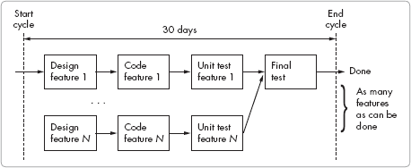

**图 15-4. Scrum 流程工作流**

当满足以下标准时，Scrum 效果最佳：

+   由 3 到 12 名成员组成的团队

+   可以分阶段构建的项目

+   对于交付日期比确保特定功能更重要的项目

+   对于完整产品定义不明确的项目

+   基于合作的组织文化

+   市场营销希望留下选择余地并允许后期更改的项目

+   可以准确且快速完成测试的项目

## 其他流程和方法

另外两种不是完整流程但常被包含在流程讨论中的方法是测试驱动开发和模型驱动开发。

*测试驱动开发*描述了首先为每个模块创建测试，然后编写模块代码的实践。这更多的是一种开发实践，而不是一个完整的过程。提前创建测试有助于代码的创建，因为它明确了功能定义。

*模型驱动开发*描述了创建一个软件模型来定义软件，然后编写代码以匹配该模型的实践。当模型可以在高层次编程以形成有用的定义但不提供可用的软件产品时，这种方法是有效的。

# 自定义流程

开发经理可以通过修改本章讨论的其中一个流程来创建一个自定义流程。流程的定制可以使开发更好地与公司的需求以及服务行业的需求相一致。熟悉多个流程使开发经理在设计时拥有多种不同的选项和功能可供考虑。

在自定义标准流程时，以下是一些需要考虑的指南：

+   在里程碑处通知相关人员，但尽量减少签字。

+   适应需求的变化。

+   保持定义简短且直接。

+   允许反馈循环和迭代。

+   计划尽早创建原型或创建早期工作版本。

+   考虑为每个里程碑设定少量中间里程碑和可交付成果。

+   在所有约束条件下，使用最小的周期时间进行发布。

+   确保里程碑支持效率，而不是控制。

+   考虑质量保证如何融入整个流程。

+   确定如何在过程中处理系统集成。

自定义流程可以为您的公司提供优势，因为它可以支持特定的公司目标，允许开发效率，满足其他团队的需求，并处理监管要求。然而，自定义流程绝不应仅出于政治原因而创建：它会导致团队怨恨，并且无法解决核心问题。

**等待完成工作**

我曾在一个公司工作，我是我项目上唯一的工程师，实际上也是项目经理。这家公司使用了一个广泛的过程，需要在里程碑处进行许多审批。大多数里程碑需要多个签名才能获得继续前进的批准。有些甚至需要八个不同的签名审批。

处理这一问题的方法之一是将带有文件的表格发送给八位不同的人。如果一个人动作缓慢或不在办公室，这个过程可能需要一周或两周。预约又是一种缓慢且耗时的方法。我的解决方案是亲自将文件和签字表格带给每个人，并在他们的办公室外等待，直到他们有空。我通常可以在一两天内完成这项工作。

我了解到许多签署文件的人实际上并不关心审查提供的文件，他们只是想确保他们有可以审查的副本。其他人只有少量问题。我早期的结论是在流程中尽量减少所需的签名审批，因为它们通常不会增加价值，而且会浪费时间。

—工程师

# 选择流程

小公司需要正确选择和引入流程，以便团队成员了解其工作方式和好处。根据开发组织的规模调整流程引入的努力。与拥有多个不同角色和观点的大型团队相比，小型公司中的小型团队通常需要最少的培训、审查和文档。

选择或改进最佳流程并不容易。不同的流程满足不同的公司需求，产生不同的结果。

要计划流程改进，首先检查你公司的内在需求和约束。然后审查正在使用的常见流程和技术。接下来，绘制流程图并创建培训材料。最后，培训所有将使用该流程的员工。

选择新流程需要收集有关当前流程和实践的信息。一种好的方法是，将收集到的信息与标准实践进行比较，并根据需要做出调整。在选择或设计新流程时，请考虑以下因素：

+   发布周期长度

+   开发任务性质

+   测试和审批限制

+   业务需求

+   公司文化

+   团队规模和分布

另一个想法：不要单独做出流程选择。向你的同事、上司、团队以及有流程经验的人寻求建议和反馈。这将帮助你建立强大的流程，并从公司获得支持。

# 引入流程

向公司引入新流程永远不像告诉团队使用你选择的流程那样简单。流程引入通常需要相当多的准备和培训。引入流程的步骤通常如下：

1.  选择并分析流程。

1.  记录流程。

1.  对团队进行流程培训。

1.  启动流程。

一旦流程实施，维护流程需要以下步骤：

+   推进流程

+   监控和执行流程

+   培训新团队成员

让我们回顾一下之前没有涵盖的一些领域。

要记录一个流程，首先从一个一页的流程图和一到三页的总结开始。当你有一个更复杂的流程时，使用该流程的人在进行培训时将更难理解流程，并且不会有一个简单或有用的参考。然而，你可以提供补充信息或参考书籍，这些书籍更详细地描述了流程。

你可以通过谈论它、展示其好处和突出潜在的成功来推广一个记录的流程。新流程的好处并不总是对团队来说都很明显。在某些情况下，人们会抱怨不得不改变他们工作的方式。如果你继续推广流程，获得团队的接受将更容易。推广流程可能是确保其接受的最重要行动。

对软件开发流程进行培训对于其成功至关重要。最佳方法是进行在岗研讨会培训，而不是发送阅读材料。在研讨会上，你可以详细地走流程并回答问题。未能对团队进行流程培训表明你并不认真对待实施它。

在你的团队接受培训后，让每个人都知道切换到新流程的起始日期。对于许多小型公司来说，切换可以立即开始。然而，在其他情况下，等待下一个发布工作开始将最大限度地减少对当前产品开发周期的干扰。

**在互联网上找到的**

我们小组的经理担心一位工程经理没有遵循开发流程，这影响了质量。这位工程经理不想实施流程，所以他继续回避问题。小组经理对软件流程不熟悉，因此他在互联网上找到了一个，并告诉工程经理使用它。然而，小组经理从未跟进，因此工程经理和团队忽略了新的流程。

结果是工程团队继续在没有流程的情况下进行开发。这也降低了团队对小组经理的尊重，因为他的选择不当和缺乏执行。此后，他的工作变得更加困难。

——软件工程师

只有在监控并执行它的情况下，流程才能成功。你必须设定定义、可衡量的进度和质量目标。当你发现问题时，花时间理解核心问题。流程通常需要执行，这可能意味着在流程未遵循时与人交谈，以了解发生了什么。（如果你发现了问题，可能需要修改流程。）如果没有执行，有些人可能会跳过步骤，等待看看是否会有任何后果。确保团队遵循流程是确保其成功的关键。

项目结束后的“事后分析”讨论的一个好主题是对流程的回顾，尤其是如果它是首次在这个项目中使用。请团队成员检查流程，看它是否满足公司和团队的需求。逐个积极审查流程步骤，以征求改进建议。

建立一个新的软件开发流程可能需要六个月到一年时间，具体取决于情况。通常需要这么长时间人们才能理解它，认识到它的好处，并在开发过程中熟悉使用它。在困难时期坚持下去，并在团队更高效时享受后续的回报。

# 附加阅读

在本章中介绍的主题的附加阅读如下：

| 《软件项目控制：管理、测量和估算》，作者：Tom DeMarco（Yourdon 出版社，1986 年） |
| --- |
| 《缩短产品开发时间：新规则、新工具》，作者：Preston G. Smith 和 Donald G. Reinertsen（Wiley，1997 年） |
| 《团队软件过程导论》，作者：Watts S. Humphrey（Addison-Wesley Professional，2008 年） |
| 《管理它！现代实用项目管理指南》，作者：Johanna Rothman（实用书架，2007 年） |
| 《人月神话：软件工程论文集，纪念版》，作者：Frederick P. Brooks, Jr.（Addison-Wesley Professional，1995 年） |
| 《软件过程管理》，作者：Watts S. Humphrey（Addison-Wesley Professional，1989 年） |
| “软件开发过程”，来自维基百科，[`en.wikipedia.org/wiki/Software_development_process`](http://en.wikipedia.org/wiki/Software_development_process) |

在敏捷流程方面的附加阅读如下：

| 敏捷联盟组织主页，[`www.agilealliance.org/`](http://www.agilealliance.org/) |
| --- |
| 《敏捷与迭代开发：经理指南（敏捷软件开发系列）》，作者：Craig Larman（Addison-Wesley Professional，2003 年） |
| 《敏捷项目管理：Scrum 实践》，作者：Ken Schwaber（微软出版社，2004 年） |
| 《极限编程：拥抱变化，第 2 版》，作者：Kent Beck 和 Cynthia Andres（Addison-Wesley Professional，2004 年） |
| “敏捷软件开发”，来自维基百科，[`en.wikipedia.org/wiki/Agile_software_development`](http://en.wikipedia.org/wiki/Agile_software_development) |
| "敏捷软件开发宣言"，[`agilemanifesto.org/`](http://agilemanifesto.org/) |
| Scrum 联盟主页，[`www.scrumalliance.org/`](http://www.scrumalliance.org/) |
| “Scrum 开发”，来自维基百科，[`en.wikipedia.org/wiki/Scrum_development`](http://en.wikipedia.org/wiki/Scrum_development) |

# 第十六章 流程改进

流程不是一个一旦设计就放在那里的静态项目。你需要维护它，并且需要定期审查它，以寻找改进的机会。任何流程，无论是开发流程还是其他类型的流程，都可以从分析和改进中受益。

对于开发经理来说，改进流程可以是一件既令人兴奋又有趣的事情；它可以对团队和公司的生产力和士气产生重大影响。改进的开发流程可以帮助开发团队提高生产力。当然，当与短期开发周期和固定的交付日期一起工作时，重大的流程变更可能是有风险的。然而，如果流程严重损坏或需要简单的改进，立即修复它可以帮助你实现一度看似不可能的即将到来的交付日期。

大型公司通常使用诸如六西格玛分析^([6])之类的重型工具来对其流程进行彻底的分析和修订。然而，一些经理在为大型公司工作时可能会感到沮丧，因为繁重的流程改进计划花费了太多时间，却带来了很少的结果。一些大型公司使用僵化的流程，其中包含不必要的步骤。在这些公司中，经理试图改进流程可能会导致政治操纵、不必要的研究和长时间的延误。更糟糕的是，六西格玛改进方法往往被应用于更适合简单分析的问题。结果可能是，一提到“流程改进”，就会在工人中普遍产生怀疑情绪。

流程改进不必令人畏惧，但重型六西格玛类型的分析通常对小型公司来说太耗时了。相反，小型公司可以从本章中描述的简单建模中受益。

# 创建流程模型

小型公司的开发经理很少对流程进行建模。许多开发经理不专注于流程建模，因为他们的主要重点是按时交付所需的软件。他们也可能没有进行简单流程建模所需的工具或经验。

然而，跳过这一步，你将错过在您的公司迅速增长之前进行重要时间节省调整的机会。

创建流程模型涉及的步骤很简单：

1.  定义流程边界。

1.  列出流程步骤。

1.  创建一个流程图。

1.  估计一个时间范围。

1.  创建一个电子表格模型。

1.  验证模型。

## 定义流程边界

在定义流程边界时，您将确定流程的开始和结束点：哪个步骤启动流程，哪个步骤在流程结束时发生？这看起来可能是一个微不足道的问题，但它很重要，应该仔细考虑。如果选择了错误的边界，改进方案可能会变得困难。对于流程的输入，如果可能，定义一个单一的项目来启动流程。这可能是对所需内容的详细描述，也可能是一组要求。对于流程的输出，可以接受多个可交付成果，但应清楚地定义它们应该是什么。例如，一个估算流程可能从一个描述估算要求的表格开始，而输出可能是一个高级定义以及单独的成本或交付估算。

## 列出流程步骤

列出步骤列表并编号。保持简洁：每个步骤一个句子即可。如果某个步骤需要做出影响后续两个或更多步骤的决定，将该步骤标记为*决策步骤*。如果某个步骤导致*并行步骤*，将后续步骤标记为并行。流程通常包括*递归*（重复多次的步骤，通常输入条件会变化）或*迭代*（回到早期步骤的步骤）；在列出步骤时，应描述导致递归或迭代的决策。

## 创建流程图

对于简单的分析，使用方框表示步骤、菱形表示决策点的流程图即可。每个方框应对应一个流程步骤，并使用与流程步骤相同的编号方案。在方框中添加一个两到三个字的标题来表示步骤，并在底部括号中添加负责完成该步骤的团队、团队或个人的名称。对于决策步骤，使用菱形方框并添加决策关键词。决策步骤方框应显示两个或更多离开它们的箭头，显示由决策产生的步骤选择。

## 估算时间范围

在流程图上写下每个步骤的最小、典型和最大（min-typ-max）时间。在分支点，以百分比形式表示每个选项的可能性，以及其 min-typ-max 值。务必指出并行工作流程路径。

## 创建电子表格模型

创建电子表格模型，使电子表格中的每个步骤对应流程图中的步骤。尽管可以使用各种商业建模程序，但简单的电子表格模型在小公司中跟踪流程非常有效。

一种简单的方法是使用流程中的每个步骤一行。每行将使用适当的步骤编号、步骤名称和预期的 min-typ-max 时间。每个步骤的总时间可以在底部汇总。

当决策导致多个后续步骤选项时，流程中会出现*决策分支点*。在电子表格中，可以通过将它们的计算从主路径中移出处理决策分支点。你可以将基于分支选择的多个计算放在旁边，并列出所有计算以及每个计算的时间发生百分比和最小-典型-最大时间。对于两个或更多的分支决策，不同分支的最小值应该是选择中最短的一个。同样，最大时间将是选择中最大值。典型时间将是不同选择的典型时间的百分比加权。

流程通常需要*并行任务*，在这些任务中，一个任务会触发多个并行子步骤，这些子步骤在步骤完成之前同时发生。例如，一个估算步骤可能需要你向两位开发者询问估算，尽管每个估算可以独立创建，但两个估算都必须在步骤完成之前完成。并行任务也可以计算在电子表格的主列旁边。为了简化计算，将所有并行项视为单个流程步骤。对于整个流程步骤，最小总时间将是并行任务最小值中的最大值。典型总时间将是典型并行任务中的最大值。最大时间将是最大并行任务中的最大值。

迭代或反馈路径很难纳入简单模型。然而，可以通过将迭代路径转换为自身的流程路径来模拟这种情况。例如，如果流程中的步骤是 A 然后是 B，而 B 是一个决定是返回 A 还是继续到 C 的决策，那么你可以将“返回 A”路径转换为步骤 D。

下一个部分将展示一个示例电子表格，这应该有助于阐明电子表格布局的潜力。

## 验证模型

通过“气味测试”来检验模型。它“闻起来”对吗？合理的输入是否提供了合理的输出？如果你更改了一个元素，它是否会产生合理的结果？你是否已经与利益相关者（任何参与流程步骤的人）审查了模型？如果是这样，那么模型就准备好进行详细分析了。

* * *

^([6]) *六西格玛分析*涉及一套由摩托罗拉发明的方法，用于分析和改进复杂流程。对于对统计学有了解的读者，"Additional Reading"部分包含了关于 Getting It Going 的六西格玛书籍。

# 分析流程模型

一旦构建了模型，你应该分析它并寻找改进结果的机会。使用流程模型，调查“如果”情景。其他人可能要求特定的改进目标，你将需要找到满足它们的方法。以下是一些常见的例子：

+   在整个流程中减少最大时间。

+   减少典型时间。

+   对于特殊情况，减少整个过程中的最小时间。

+   允许在某个步骤中增加时间，同时在整个过程中保持相同的时间。

+   在决策点上，减少更昂贵决策的时间百分比。

+   对于并行任务，关注时间减少的最昂贵的任务。

让我们看看一个简单的流程示例，它通过分析步骤进行。

## 实际操作中的流程分析

本例中建模的过程将用于响应销售团队对报价的请求进行工程估算。这个例子说明了建模流程和进行改进的简单方法。

让我们先定义一下这个过程的范围。在这种情况下，入口点是销售经理将请求提交给您指定的负责报价过程的**引用工程师**。出口点发生在开发经理将报价交付给请求报价的销售经理时。

在定义了过程边界后，您可以逐步进行步骤并分配谁来完成步骤。这些是过程中的高级步骤：

1.  [入口点] 销售经理发送估算请求。

1.  报价工程师审查销售信息。

1.  [决策] 报价工程师确定是否有足够的信息来完成报价。

    +   如果信息充足，继续下一步。

    +   如果信息不足，工程师会从销售经理那里请求更多信息，报价将暂停，直到收到完整的回复。

1.  收到回复后，引用工程师将请求的描述写下来，以便开发团队能够清楚地了解。这个描述将用于估算，并随报价一起返回。描述将包括任何做出的假设。

1.  引用工程师向 Java 程序员和数据库程序员请求估算。

    +   [并行] (A) Java 工程师做出估算并将其返回给报价工程师。

    +   [并行] (B) 数据库工程师做出估算并将其返回给报价工程师。

1.  当两个估算都返回后，报价工程师编写报价并发送给开发经理进行审查。

1.  开发经理审查并编辑报价。

1.  [输出] 开发经理将估算交付给销售经理。

如果您将过程步骤写成顺序列表，它们可能看起来像表 16-1 中的那些。这个例子显示了每个步骤，包括交付步骤。这个简单的流程还说明了步骤 6a 和 6b 中的并行任务。注意步骤 3 中的决策点。

**表 16-1. 引用过程示例步骤**

| 什么是 | 谁负责 |
| --- | --- |
| 1\. 向工程部门发送报价请求 | 销售 |
| 2\. 查看报价请求 | 报价工程师 |
| 3\. [决策] 报价需要更多信息 | 报价工程师 -> 销售 |
| 4\. 报价编写 | 报价工程师 |
| 5. 向数据库和 Java 工程师请求估算 | 报价工程师 |
| 6a. [并行步骤] 数据库工程师估算 | 数据库工程师 |
| 6b. [并行步骤] Java 工程师估算 | Java 工程师 |
| 7. 准备报价文档 | 报价工程师 |
| 8. 报价工程师审核 | 开发管理 |
| 9. 报价交付 | 开发管理 |

将这个表格转换为工作流程对视觉分析和讨论很有用。图 16-1 说明了工作流程。

您的下一步是写下工作流程图中每个步骤所需的时间。如果您写最小-典型-最大时间估算，可以使用缩写格式，例如 10-13-20。对于决策点，显示不同选择典型时间要求的近似百分比权重。

完成绘图后，你会发现更容易可视化流程工作流程并将其转换为电子表格。图 16-2 显示了直接转换为电子表格的工作流程图。它还显示了简单报价流程的最小-典型-最大总时间。令人惊讶的是，尽管典型时间是漫长的 3.8 天，但流程的最坏情况时间是 10 天以上！逐步构建这个估算可以展示建模是如何工作的。

第 3 步的决策点有两个不同的选项：一半的时间，需要更多信息。对于这个决策点，最小值是两个选项中较小的一个，即需要更多信息——是或否。典型值是对每个选项的典型值进行加权——每个选项的典型值都是 50%。最大值是两种情况的最大值。销售最坏情况需要 2 天来响应请求，这可能导致显著的过程延迟。

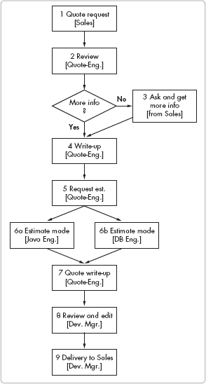

**图 16-1. 报价流程工作流程**

6a 和 6b 中的并行任务是由 Java 工程师和数据库工程师提供的估算。考虑到典型任务及其时间表，这些数字表明数据库估算的时间短于 Java 估算。由于流程显示了并行任务步骤，因此计算使用两者中较大的一个。请注意，提高数据库工程师的最小-典型-最大值对流程结果没有影响，因为它们都小于 Java 工程师的值。Java 工程师的时间值对于大多数报价的流程是关键路径。

**图 16-2. 报价流程工作流程电子表格**

在您创建模型后，应仔细检查它：结果看起来合理吗？为了验证，记录您收到的报价并测量每一步的延误。个别数字看起来对吗？典型时间接近吗？如果是这样，您就知道模型是合理的。如果不是，您需要做出修订。

## 使用模型来改进流程

您可以将电子表格模型作为一个工具来帮助您优化进度计划。通过调整时间，您可以确定对整个进度计划的影响。一般来说，对数字进行精细调整不会带来显著的减少，但该模型将帮助您识别瓶颈并实验减少的影响。

以下是一些减少案例，目标是减少最大处理时间和典型时间。

### 情况 1：减少最大时间

销售部门对一些需要一周或更长时间才能产生的工程报价表示不满。您的首要目标是将报价的最大时间从 7 天减少到 5 天。首先检查最大列中的最大数字：销售延误和管理审查。如果您能将每个这些减少到最多 8 小时，那么最大时间将减少到 5.1 天。下一个潜在减少的是 Java 工程师的最大时间或报价工程师的撰写时间，每个最多 8 小时。将 Java 工程师的时间调整为最多 7 小时，将总最大时间调整到不到 5 天。

如果可能，进一步降低最大值，以留出意外事件的时间缓冲。一个常见的不计划事件是关键人员的缺席，这需要备用人员来完成每个步骤。为主要负责工作的人员提供第二人或甚至第三人作为备用，当最坏情况的时间至关重要时，这可以大大帮助。图 16-3 展示了步骤 3、8 和 6 中的这些减少。

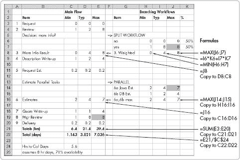

**图 16-3. 情况 1：最大时间的减少**

### 情况 2：减少典型时间

销售团队很高兴，最坏情况下的新报价将不到一周。然而，销售经理现在表示，他们需要大多数报价在 2.5 天内完成。您的目标是查看典型情况并确定您可以做出哪些减少。对于典型情况，查看决策点并确定您是否可以减少较慢决策的百分比。在这种情况下，您能否将报价工程师需要向销售部门请求更多信息的时间百分比从 50%减少到 10%？

一种实现这一目标的方法可能是创建一个标准表格，销售请求者必须填写，以确保所有必要的信息都齐全。将销售使用的时间定为 10%，可以将典型时间缩短至 3.25 天。如果你要求销售平均在 4 小时内给出回应，时间将缩短至 3.2 天。其他昂贵的典型时间是经理的审查，需要 8 小时。你可以要求经理在 4 小时内完成审查，或者完全删除这一步骤。将经理的审查时间缩短至 4 小时，可以使典型时间降至 2.5 天，这符合目标。图 16-4 展示了这个例子。

**图 16-4. 典型改进的报价流程**

你也可以考虑是否可以完全删除某些步骤，或者用其他东西来替换。删除经理的审查提供了一个有趣的结果。如果这一步被删除，总天数降至最低 0.96 天，相当于 1.75 天的典型值，最高为 5.61 天。如果大部分延误是由于经理的可用性而不是审查所需的总时间造成的，那么删除审查可能是一个可能的选择。如果 4 小时是由于可用性，而审查又很短，你可以与经理合作，如果经理不在，允许其他人回应审查请求。了解审查的原因也可以提供一些见解。如果这一步是由于报价工程师经验不足，不足以信任，那么随着时间的推移，情况可能会得到改善。如果延误是由于经理的审查，而经理是公司唯一一位对某些特别复杂问题了解很多的专业人士，那么删除审查可能不是一个好的方法。

你还可以寻找减少步骤所需典型时间的方法。方法包括为任务添加更多资源、以不同的方式分配工作、为完成步骤的人提供改进的工具、重新定义步骤以减少其工作量，以及为完成步骤的人提供培训。

虽然这些例子很简单，但它们说明了分析流程的有效方法。使用电子表格可以实验性地提出“如果...会怎样”的问题，以追求特定的目标时间。对于一家小公司来说，直接有效的方法效果最好。

## 与其他团队合作

当流程工作流程涉及多个团队时，改进流程的挑战可能会更大。如果改进整体流程需要工程师之外的人进行工作转移或减少，开发经理可能会失去对工作流程中其他团队成员需求的关注。而不仅仅是提出请求，应将团队外的人纳入讨论流程改进及其对工作的影响。为他人希望做出的改变进行谈判，并对提出的请求保持灵活。你可能会发现，你团队步骤的改变可以极大地减轻其他团队的负担。

# 开始行动

在你对流程改进设计变更做出后，花些时间规划如何将其推广到团队中。你可以在第十五章中找到更多建议，该章节讨论了流程推广的问题。

# 额外阅读

本章中提到的主题的一些额外阅读材料如下：

| *《产品开发时间减半：新规则、新工具，第 2 版》*，作者：普雷斯顿·G·史密斯和唐纳德·G·雷因特森（威利，1998 年） |
| --- |
| *《人月神话：软件工程论文集，纪念版》*，作者：弗雷德里克·P·布鲁克斯（阿迪森-韦斯利，1995 年） |
| *《六西格玛之路：通用电气、摩托罗拉和其他顶级公司如何提升其绩效》*，作者：彼得·S·潘德、罗伯特·P·纽曼、罗纳德·R·卡瓦纳夫（麦格劳-希尔，2000 年） |
| *《新产品成功之道：从创意到上市加速流程，第 3 版》*，作者：罗伯特·G·库珀（基础书籍，2001 年） |

# 第十七章。理解质量保证

随着公司的成熟和变化，质量要求也会随之增长和变化。从早期创业阶段，到立足阶段，再到成长阶段，都需要基本的质量实践来防止公司停滞不前或无法发展到下一个层次。

质量保证（QA）团队致力于评估和提升公司软件产品的质量。有效的 QA 不仅仅是简单地测试新产品。正如前面章节所讨论的，QA 团队还应参与产品的定义、开发过程和客户反馈。

在小型公司中，一位经理通常负责 QA 和开发团队。在这个角色中，经理需要协调两个团队以定位和解决核心质量问题。良好的 QA 实践基础可以提供如何提高 QA 和开发团队的生产力和产品质量的见解。本章涵盖了小型公司开发经理在有限 QA 经验下的质量保证基础。

# 质量的重要性

小型成长型企业必须专注于快速满足客户的需求。随着客户继续将更多要求注入开发组合，以及公司的发展，开发经理面临的挑战不仅仅是确保团队实施新功能。事实上，专注于实施新功能是可能导致管理者忽视重要核心问题的陷阱。不断添加新功能而忽视核心问题，就像给一个基础薄弱的建筑不断添加楼层一样。

如果管理者只关注短期开发目标而忽视了大局，结果将是一个低质量的产品。工程师可能会快速生产出更多功能，但这些功能的质量并不如应有的质量，产品和客户都会受到影响。缺乏质量对小型公司和开发部门具有决定性的影响，因为旧问题占据了本应用于持续开发的时间。质量问题会消耗开发和 QA 团队的大量时间。

当公司只有一个客户并且正在开发一个突破性的新产品时，工程团队可能会将低质量“扫到地毯下”，但随着客户名单的增长，过去的质量问题会回来困扰你。它们也可能导致公司陷入一种*危机心态*，每个新的客户危机都会导致团队匆忙拼凑出一个解决方案。低质量的产品会导致销售损失，并驱使现有客户转向其他公司的产品。一旦客户将你的公司和其产品的质量标签为低劣，你会发现很难改变他们的印象。

**质量至关重要**

尽管我们拥有众多大中型客户，但我的公司从未离开过质量实践初创阶段。低质量导致我们失去了部分早期客户。质量问题持续影响我们开发新功能的能力；我们在发布的软件中发现了需要工程和 QA 团队付出巨大努力才能解决的严重缺陷。有一段时间，开发团队将其一半的时间用于修复已发布软件中的缺陷。

我们现在正在建立合理的质量实践，以帮助我们摆脱这个困境，并取得了一些进展。团队在大约四个月的努力后注意到了改进。

——新 QA 经理

# 质量的定义

什么是质量？问十个人，你通常会得到十个不同的答案。有些人会回答说，质量意味着在产品中包含最新的功能。其他人会谈论平均故障时间或缺陷的缺乏。其他人会描述一个给客户留下积极印象的产品。

定义质量最终归结于客户的感知。对于大多数客户来说，一个高质量的产品符合以下标准：

+   达到或超过客户的期望（包括所有方面，如能力、性能和安全性）

+   如预期那样运行

+   以优雅的方式处理意外情况

+   易于使用且直观

+   容易升级

+   在其功能集中保持一致，因此客户不会因为产品不同部分的操作而感到惊讶或困惑

在衡量软件质量时，许多开发者专注于已知的*缺陷*，即软件中阻止其按预期或期望使用的错误。然而，这种方法有几个问题：首先，谁定义了产品的*预期用途*？谁决定一个问题是否是*缺陷*还是仅仅是一个*功能变更*？从开发的角度来看，一个问题可能看起来像是一个功能变更，而客户则将同一个问题视为一个明显的缺陷。

通过只关注缺陷，开发者可能会错过质量的其它方面。尽管跟踪预发布和发布后的缺陷非常重要，但还应该检查其他质量方面，例如准确的需求、优雅的设计、实用性和长期的客户满意度。最后，缺陷只能通过有针对性的努力来定位。如果没有有针对性的 QA 努力来揭示隐藏的问题，一个光鲜亮丽的新产品的质量可能看起来比实际情况要好。

此外，质量并不等同于在发布中修复的缺陷数量。工程和 QA 团队可以在产品中识别和修复大量缺陷，但产品仍然可能因为许多未发现的缺陷或因为产品不符合客户期望而质量低下。事实上，发现和修复了大量缺陷的产品通常仍然存在更多尚未发现的缺陷。对高质量产品进行广泛的测试通常会导致更少的缺陷，因为它们是由一个注重质量的开发团队构建的，该团队采用了良好的设计、最佳的开发实践、仔细的代码构建和对质量的关注。一个优秀的 QA 团队能够通过鼓励积极的做法、提供有价值的反馈、帮助培养质量意识以及通过彻底的测试来衡量结果来提供帮助。

高质量的产品超出客户的期望并满足客户的核心需求。对于软件质量来说，设定了如此高的标准，如何才能创建一个真正高质量的产品？这归结于从重视质量的文化开始。

# 重视质量

具有重视质量文化的公司能够生产出高质量的产品。缺乏这种文化的公司不会生产出高质量的产品，因为质量不是其重点。如果你的公司具有重视质量的文化，你的质量改进工作将会容易得多。如果没有，与你的 CEO 谈谈低质量业务的影响，并寻求他的支持来全面提升质量。

要开始培养重视质量的氛围，培训开发人员和 QA 人员将质量视为一种**态度**，而不仅仅是产品目标或状态。在开发团队成员中建立“质量态度”比最好的 QA 实践更能提高质量。为什么？因为从一开始就重视质量的姿态将鼓励开发团队通过明确的需求和花费时间理解这些需求——通过深思熟虑的设计和细致的编码与审查——来构建高质量的产品。相比之下，仅通过有限的测试和修复来抛光快速编写的解决方案将导致内置低质量的产品。

此外，一个优秀的质量保证（QA）团队能够成为开发团队的有效合作伙伴；尽管两个团队都关注质量，但 QA 人员对产品需求的理解与开发者对产品的思考方式不同。工程师通常专注于使产品正常工作，而 QA 则专注于找到破坏产品的方法。

你可以通过多种方式来促进质量态度。鼓励开发者发送代码到 QA 之前检查他们的代码。在单元测试期间将 QA 工程师与开发工程师配对可以证明是提高代码质量的有效方法。表现出对编码过程中产生的缺陷的关注；这将鼓励团队减少问题。建立鼓励质量的发展流程和方法论，强调其重要性。

你可以通过鼓励人们将整个产品视为结果，而不是每个团队成员所编写的代码块，来改善团队对质量的看法。为了鼓励团队合作并帮助开发者从质量的角度欣赏产品，为每个产品（或适当的项目）分配个人作为架构师或负责人。架构师将协调产品编码并鼓励团队成员像团队一样行动，而不是独立的行为者。

如果问题积压严重，提高质量可能是一个漫长而痛苦的过程。过去因质量问题而受苦的项目可能成为许多小型公司成功道路上的障碍。如果一个开发团队的产品持续存在缺陷，它就无法保持对质量的关注。专注于修复产品中固有的现有问题。根据问题的严重程度，你可能会在较长的发布周期中留出时间进行广泛的错误修复。如果问题过于严重，无法在单个发布中修复，则安排在接下来的几个发布中进行主要缺陷修复（有时称为“错误清理”）。

产品质量的关键控制点是团队修复缺陷的能力。通过提高开发团队修复缺陷的成功率，将对生产力和质量产生重大影响。工程态度驱动着修复成功率。这将在“缺陷对质量和生产力的影响”中详细说明，见缺陷对质量和生产力的影响。

随着团队对质量的关注提高，产品和工作的质量也会提高。您的团队可以在每次发布时进行改进；然而，请注意，重大改进可能需要数月或更长时间。保持对质量的长期关注。

# 质量评估

在成功鼓励开发团队和 QA 团队成员重视质量的文化之后，您可以评估为此付出的努力。质量保证评估要求您检查您的团队以及他们用于执行工作的工具、流程、实践和措施。注意以下具体事项：

QA 团队

评估 QA 团队成员的背景、技能和组织。

QA 工具和环境

评估用于衡量和跟踪软件质量的工具，特别是缺陷和增强跟踪程序。额外的工具可以帮助进行测试自动化。

QA 活动和流程

评估描述团队确保质量努力的活动和流程。

QA 指标

评估质量工作的成功。质量指标允许您判断产品的质量和用于创建产品的过程。

在这些定义的基础上，让我们更详细地审视每个领域，从 QA 团队开始。

## 质量保证团队

您的 QA 团队可以推动公司向质量文化转变。组建一支由经验丰富的 QA 工程师组成的团队，他们共享这种文化。最好的 QA 人员对质量充满热情，将其视为工作中最重要的方面。当问题超出他们的能力范围时，最好的 QA 工程师会将其视为个人责任。因为他们不断寻找提高质量的方法，所以优秀的 QA 工程师希望为关心质量的公司工作。这些工程师会努力学习和应用最佳的 QA 技术和方法。

相比之下，一些 QA 工程师认为他们的工作就是测试。他们关心它，但不足以走得更远。这些工程师不会寻找巧妙的方法来破坏产品或改进它。一个强大的 QA 团队将支持您提高质量的努力。一个薄弱的团队只想专注于测试。

### 团队技能水平

组建一支与公司及其产品需求最匹配的技能水平和态度的 QA 团队。QA 工程师的技能水平各不相同——从“按按钮”的网站测试人员到编写代码以测试其他代码的大师。不要期望技能较低的 QA 人员在测试复杂系统方面表现出色。

将你的 QA 团队的能力与需要完成的工作的复杂性进行比较，看看是否存在不匹配。审查他们创建的工件，并观察哪些问题能够绕过他们；这可以帮助你评估他们的整体 QA 技能。QA 工件包括任何旨在帮助测试的物品，包括文档、测试计划、测试套件、测试流程、测试基础设施和测试软件。在与 QA 团队成员交谈时，评估他们的沟通技巧，因为这些对于工作至关重要。

要评估你的 QA 团队的能力，向他们提出以下问题：

+   你有多少年的 QA 经验？

+   你认为自己是一名高级 QA 工程师吗？

+   你如何看待公司在 QA 中的作用？

+   你能和我一起审查你创建的测试计划吗？

+   你推荐哪些质量度量？

+   当前流程是如何促进质量的？

+   在解决 QA 问题时，你更喜欢与开发工程师如何合作？

要了解你的 QA 团队的有效性，观察团队的工作习惯。一些工程师努力不断改进产品，并且很好地融入了开发过程的各个阶段。其他人则工作在狂热状态：当产品达到 QA 阶段时，这些团队成员会长时间测试产品，但产品一旦出厂，他们就会投入很少的努力，直到下一次狂热。然而，这种行为并不是好的质量保证，而是一种纯粹在生产线末端发生的测试功能。

### 人员配置水平

在每个公司成长阶段，都需要不同的 QA 人员配置，并且应该提前预料到。在创业阶段，QA 人员可以由一个人组成；这位 QA 工程师应该是一位精通品质实践的资深工程师。为了降低成本而雇佣初级 QA 工程师是一个错误，因为他们不会随着公司的发展而将部门定位为高质量。

当你的公司在市场上开始站稳脚跟——即“立足点”阶段——聘请一位经验丰富的 QA 经理来指导团队。处于成长阶段的公司应该聘请一个由经理领导的小型 QA 团队，并应采用成熟的品质实践。一个成功的团队需要一套强大的工具和适当的 QA 计算环境。低质量的产品将消耗你太多的开发时间，并最终将初出茅庐的客户赶走。

## QA 工具和环境

QA 软件工具和计算环境为质量努力提供了基础。不要在为团队提供适当的设备和足够的许可证以完成他们的工作方面节省开支。这样做是不明智的——而且是愚蠢的。

有许多以质量为重点的软件工具可用。对于一家小型公司，工具和环境应主要关注三个方面：缺陷跟踪工具、QA 测试环境和测试自动化软件。

### 缺陷跟踪工具和流程

缺陷跟踪过程定义了处理缺陷的工作流程。缺陷跟踪工具是跟踪 QA 和开发团队发现的缺陷和问题的状态的主要方法。这些因素必须保持一致，共同工作以提供公司及其产品所需的质量。因为缺陷跟踪工具强制并启用流程，所以本节将它们一起讨论。

缺陷流程应遵循简单的流程，例如以下内容：

1.  缺陷已报告。

1.  缺陷被审查和排序。它可能被挂起（未来）或直到提供更多信息。如果不挂起，则进行下一步。

1.  缺陷已分配用于调查。

1.  缺陷已修复。

1.  缺陷修复已验证。

1.  缺陷已关闭。

图 17-1 以流程图的形式展示了此工作流程，决策点在步骤 2。

您的缺陷跟踪工具必须满足组织的需要，而不应是一个通用的任务录入工具。任务跟踪与缺陷跟踪在本质上是有区别的。将两者合并到一个系统中会导致一个信息量过大且难以正确使用的系统。

**图 17-1. 简单的缺陷工作流程图**

您的缺陷跟踪工具应仅用于跟踪缺陷或输入增强，而不应用于其他目的。一个专门的缺陷跟踪工具可以提高收集数据的质量，并确保重要信息易于查看，因为工具管理员可以创建最适合缺陷跟踪的数据录入屏幕。一个专门的缺陷跟踪系统使得审查和报告数据变得容易。此外，一个专门的跟踪系统允许缺陷工作流程与缺陷跟踪工具中定义的阶段相匹配。

### 注意

*有多种缺陷跟踪工具可供选择。第七章 讨论了不同的工具和考虑因素。资源列表出现在“附加阅读”中的附加阅读*。

为了使缺陷跟踪工具与缺陷流程保持一致，要系统地思考。将您的流程工作流程作为蓝图，并使缺陷工具符合它。然后，遵循以下建议：

+   将每个流程步骤（图中的块）映射到工具状态。这样，工具在流程中进行时将保留缺陷状态信息和步骤转换信息。有了清晰的流程步骤到工具状态的映射，工具工作流程将鼓励并强制执行流程工作流程。如果没有这样做，工具工作流程将损害流程工作流程。

+   选择能够清楚地识别活动的状态和流程步骤。

+   定义工作流程中的当前后续状态，并设置工具以强制执行转换。这可以消除人们跳过状态或将项目放入错误状态的情况。

+   查看决策和分支点，并检查是否涵盖了适当的决策路径。

+   考虑在每一步骤需要哪些信息，并将信息保持在最低限度。限制每个输入屏幕所需字段的数量。请求和需要的数据越多，提交者就越不可能完整填写它们，缺陷提交的可能性就越小。

+   考虑谁可以访问缺陷跟踪工具。“提交者”可能是客户或组织中的任何人，如果指定了明确的门卫来清理入口。或者，入口可以限制为开发和 QA 团队成员，以确保输入高质量的数据，让开发人员和 QA 团队之外的人将问题提交给指定的开发或 QA 团队成员。

+   在构建系统之前，决定您感兴趣的报告和质量指标以及产品所需的指标。如果您不确定，请首先审查指标（见“QA 指标”在 QA 指标）。将系统改造为捕获指标可能很困难且不自然。

### 警告

*如果您的产品具有安全、医疗或公共风险，可能需要在公司外部收集指标。在这些情况下，报告指标的标凈由外部公司或机构定义*。

您的缺陷跟踪流程应包括评估缺陷的步骤。在这一步骤中，提供一个简单的评级机制，可以用于比较一个缺陷的优先级与其他缺陷。

一些缺陷系统被设置为要求提交者负责关闭缺陷。然而，这会增加流程的负担，因为提交者承担了重新验证缺陷修复的次要角色。这种方法通常会导致缺陷积压，等待提交者关闭；由于所需时间，提交者通常不愿意验证许多缺陷关闭，而且这项任务通常不是他们的主要任务。避免这种方法，因为它会导致许多缺陷未得到解决。

避免另一种系统方法，即在产品发布后使用单独的状态来验证缺陷，因为这会增加流程的复杂性。相反，要求 QA 工程师将缺陷测试添加到测试计划中，以便 QA 将在未来的版本中自动测试每个缺陷修复。

一旦设置了系统，请让 QA 团队的一名成员监控每个状态中的缺陷。监控者可以审查系统任何部分的“停滞”缺陷。系统也可以被监控以避免在发布周期结束时出现让你惊讶的缺陷积压。

保持系统简单，并使用它来跟踪状态信息。使用清晰映射的定义可以轻松获取统计数据，并识别质量流程问题。

### 建立测试环境

小型成长型公司投资于 QA 测试的资金有限。大多数初始技术投资都用于创建和部署软件所需的工作站和服务器。预算紧张时，管理层往往忽视设置复制客户系统的环境，这使得 QA 测试和评估问题的任务非常具有挑战性。

如果公司只有少数客户，缺乏正确配置的测试环境在短期内可能不会导致灾难。在客户数量较少的情况下，团队可能会在发布后直接了解到一些问题，修复错误的花费可能不会造成毁灭性的影响。然而，随着公司的发展，由于不充分的 QA 测试环境而未检测到的发布后问题的成本将显著增加，并影响公司的底线。

当客户在发布后遇到产品问题时，该问题必须立即成为 QA 和开发团队的关注焦点。调查和解决生产问题会产生巨大的即时成本，尤其是如果客户的问题无法在内部复制。快速设置与相同设备、内存、操作系统、应用程序和设置以及程序版本相同的测试环境可能并不总是可能的。然而，如果没有适当的设备，无法正确配置且无法立即用于 QA，发布后的问题可能会对生产力和客户对您产品和公司的认知造成毁灭性的影响。

小型公司从一开始就建立适当的测试环境中受益更多。等到公司成长后再建立这个环境将会拖慢生产力和客户满意度。作为开发经理，应努力确保从一开始就建立适当的 QA 测试系统。

**同步您的系统**

我的公司有一个主要问题，在我加入之前已经存在了多年。基础设施在工程、QA 或预生产阶段与生产不匹配。我们经常在生产中遇到测试环境中看不到的代码行为，这让我们感到惊讶。

我制定了一个分阶段建立适当测试环境的计划。第一阶段是正确配置的 QA 环境。第二阶段是速度测试环境。我们立即开始 QA 环境的工作。由于速度测试的成本昂贵，我们提供了几个可扩展的选项，以允许最初进行部分系统测试，然后逐步过渡到全面系统测试。

—开发经理

### 测试自动化工具

小公司对测试自动化工具的要求差异很大。当产品足够稳定，重复测试具有成本效益时，测试自动化才有意义。对于产品快速变化的初创公司，由于维护快速变化产品的成本，测试自动化可能并不有效。随着公司进入稳固和增长阶段，测试自动化可以更加实用，其价值也显著增加。自动化可以提高测试的准确性，同时显著减少测试时间。

QA 使用自动化工具快速输入一组条件到软件中，并将产生的输出与过去的结果进行比较。结果的不同并不一定表明代码中存在错误；差异可能是由于自上次回归结果存储以来代码中预期的变化引起的，例如。当 QA 审查了所有结果以确保准确性后，输出将被保存为后续比较的正确值。

测试自动化工具对于相对稳定且可在多个平台上使用的图形用户界面（GUI）是有效的。有专注于 GUI 测试的商业工具，例如 Borland SilkTest ([`www.borland.com`](http://www.borland.com))。

测试自动化对于测试文件和数据是有效的。无论是商业工具还是手动创建的脚本，都可以快速循环标准测试并识别发布之间的差异。为了评估自动化对您的产品将有多有效，请比较每次发布中自动化输出的变化率与维护脚本的成本。如果每次发布的自动化输出变化超过 20%，则该产品可能不适合脚本自动化。

另一种测试自动化方法是 *白盒测试*，其中使用 *测试框架*（一个用于简化单元测试创建、运行和评估的软件框架）来测试代码的内部部分。通常，工程团队创建单元测试并继续维护它们。即使 GUI 和代码中的功能在变化，测试框架也是值得的，因为维护它们的花费并不像维护外部测试工作那样昂贵。测试框架隔离代码部分，其中许多部分在每次发布中都不会改变。JUnit ([`www.junit.org`](http://www.junit.org)) 和 NUnit ([`www.nunit.org`](http://www.nunit.org)) 是单元测试自动化的示例框架。

当产品相对稳定但测试耗时较多时，测试自动化具有巨大的优势。否则，在投资测试自动化之前请三思。

## QA 活动

QA 团队执行的关键活动与 QA 流程无关。在定义阶段，QA 应审查由产品营销创建的需求、规范和用例。QA 管理还应审查任何未解决的缺陷，并确定那些需要在下一个版本中修复的缺陷。在设计编码阶段，QA 应根据需要准备测试计划并从事测试自动化工作。在测试阶段，QA 应执行测试计划，识别缺陷，并复查所做的修复。此外，QA 应在所有阶段测量代码的质量。

图 17-2 展示了这些活动与软件生命周期主要步骤的关系。以下各节将详细讨论这些活动。

**图 17-2. 软件生命周期中的 QA 活动**

### 需求和功能审查

强调质量的组织将在整个软件开发生命周期中推广 QA 团队的努力。QA 团队成员可以提供关于产品实用性和易用性的见解，因此允许他们在工程开始构建代码之前发表意见，将有助于确保产品质量更高。QA 团队成员还需要确切了解工程正在构建的内容，以确定如何最好地测试产品。在测试之前，QA 将制定测试计划以优化测试过程并创建可重复的测试集。

QA 应参与审查每个产品的需求和功能规范，并应有机会审查原型设计。开发和 QA 团队应会面，听取反馈，并对产品定义进行适当的调整。

不允许 QA 在需求和功能方面发表意见，比不听从和重视 QA 的意见更糟糕。

### 测试计划

测试计划有助于创建测试产品的可重复方法。如果没有可重复的方法，测试将是临时的——测试过程中会出现漏洞，可能导致发布后的问题。因此，QA 团队应为所有产品创建测试计划。

每个测试计划都应基于标准模板（见下一节），以确保团队和产品之间的连贯性。这将允许每个团队成员使用可靠的测试计划来确保构建的一致性。

确定要进行的测试范围并不总是容易；例如，在小公司中，系统的一些部分可能被忽视且未进行测试。QA 经常忽视测试用于维护产品的内部工具。内部工具可能需要比面向客户的产品的测试不那么严格——特别是在错误消息方面。然而，如果维护工具会影响客户结果，则仍然需要进行测试。考虑以下关于内部项目的问题：

+   代码是否对管理员正常工作？

+   任何使用副作用是否会影响到客户？

+   内部项目的输入错误检查是否可接受？

列出你使用的所有产品和模块，并与工程和 QA 团队一起审查。随着产品线的变更，维护此列表。列表中的每一项都应该有自己的测试计划。

### 测试计划模板

使用模板标准化测试计划格式，使得任何 QA 团队成员都能轻松运行适当的测试。测试计划模板为所有测试计划提供了一个通用的布局和格式。使用模板可以轻松地一致性地审查和执行测试计划。

基于电子表格的模板允许通过摘要工作表轻松输入数据、状态总结和进度跟踪。布局应包括对应于要测试的不同组件的多个工作表。摘要工作表可以提供整个测试计划的概述。

摘要工作表

通过收集组件工作表中的信息，总结此工作表上的测试计划数据：

+   电子表格中所有工作表的完成百分比

+   正在测试的程序或模块的名称

+   正在测试的代码的构建号

+   测试日期

+   通过/失败总结显示测试和失败的测试数量

组件工作表

为产品测试的每个区域创建一个工作表。理想情况下，每个工作表每行显示一个测试，以便于工作表的处理和扫描。每个测试工作表应涵盖以下区域：

+   针对预期用例的功能测试

+   针对边缘情况的功能测试（测试推到允许的边缘）

+   错误情况的功能测试

组件工作表中的每个测试都将使用一个唯一的编号。工作表名称和编号的组合创建了一个唯一的标识符，这对于报告和讨论问题很有用。例如，安全工作表，测试 44，可以写成这样：*security-44*。

每个工作表将每行展示一个测试，并具有多个字段列。字段的选择基于需求，但以下是计划中典型的字段列表：

+   测试编号

+   描述（提供足够的细节以清楚地描述测试）

+   预期行为（详细说明产品行为）

+   预期结果（简短描述——例如，“第一行应该是 53”）

一行可以包含在每次使用测试计划时设置的附加字段：

+   此测试运行的实际结果（例如，通过或失败；有时使用电子表格“选择列表”仅允许从列表中选择特定的一组选项很有用）

+   缺陷跟踪编号（来自缺陷跟踪系统，您在其中发现问题并记录）

+   可追溯性矩阵信息（关于此测试如何对应于需求或功能定义的信息；这种性质在每个项目中都有很大差异，但可以简化测试完整性的评估）

+   备注（关于之前未涵盖的测试用例的说明）

### 创建自动化测试

自动化测试通常需要一个与手动测试不同的测试计划策略。QA 可以使用更高级的描述进行测试计划，定义哪些类型的测试适合自动化测试方法。单个测试指令被编码到自动化系统中，而测试结果通常列在输出文件中。仍然可以创建一个总结工作表，涵盖自动化和手动测试。

提高自动化百分比可以提高测试的速度和准确性，因为自动化测试运行更快，工具可以快速识别正确的结果。当存在多个交付平台或完成完整手动测试的时间有限时，自动化可以提高质量。

测试自动化的工作流程应涵盖以下步骤：

1.  收集有关测试的信息。

1.  编写测试脚本。

1.  编辑和构建测试数据。

1.  运行自动化测试。

1.  以三种方式纠正问题：修复脚本、修复正确的结果数据或让工程师修复脚本识别的问题。

请记住，您可能会在自动化上投入过多，而忽视产品线某些部分的测试。在测试阶段节省的时间与创建自动化所需成本进行对比。如果每个版本中超过 20%的应用程序发生变化，评估自动化的利益和成本。

## QA 流程

基本的质量保证（QA）流程对任何公司都至关重要，尤其是对小型初创公司。如果没有明确的过程定义，工作将无法重复，也无法随着时间的推移而改进。良好的 QA 流程允许您控制、衡量和改进产品质量。

在您获得 QA 团队的职责后，尽快建立核心 QA 流程。建立开发流程、缺陷处理流程、缺陷排序流程和缺陷选择流程。前两个流程已在早期章节和本章早期介绍。以下部分将介绍缺陷排序和缺陷选择流程。

## 缺陷排序流程

缺陷排名需要确定处理缺陷的顺序的方法。可以使用许多不同的方法对缺陷进行排名，包括使用几个不同的类别（如严重性、优先级和业务影响）对每个缺陷进行排名。排名尺度在公司之间差异很大，有的选择字母排名，有的选择文本（如非常严重），有的使用数字排名。使用多个尺度的技术的问题是它会产生关于先处理哪个缺陷的争论：如何比较 7 级严重性、B 级优先级、6 级业务与 2 级严重性、A 级优先级、8 级业务？

一个解决方案是使用一个数字来封装所有信息。这个数字是缺陷（或功能）的*整体优先级*。由于许多公司已经将*优先级*一词用于特定目的，本讨论使用了一个新术语，称为*排名数字*或*排名*，以区分这个过程。排名数字是相对于其他缺陷的一个缺陷的整体排名。

排名数字使用简单的数字范围。五个类别效果良好，其中 1 表示最低，5 表示最高。将较大的数字分配给最严重的问题可以简化后续描述的*缺陷影响*的计算。您可以使用更多的数字类别，但您可能会浪费时间去尝试将缺陷放入范围（例如，使用 10 个等级的量表，可能很难选择缺陷是 3 还是 4，等等）。

您可以使用表格将所有信息封装成一个排名数字。表格的列将列出要排名的项目类别，而行将代表每个排名数字。您可以通过添加列来按需增加类别的数量。以下是一些潜在的类别：

+   安全性

+   商业需求

+   功能损坏

    损坏的功能相对于该功能的使用频率有多重要？

+   面向客户的 GUI

    主页上的拼写错误可能不会破坏产品，但看起来不好。独立对 GUI 错误进行排名强调了它们的重要性。

+   数据完整性

    内部或客户数据的风险可能需要单独的类别。

+   安全性

+   法律责任

## 按指定和构建的功能和实用性

表 17-1 展示了一个包含样本类别的示例表。该示例表没有显示需要用描述每个等级条件的文字填充的框中的值。这些值是*决策驱动因素*——它们帮助您为每个待考虑的缺陷选择适当的排名值。当您创建您的表格时，为每个框定义适当的驱动因素。

**表 17-1. 企业质量价值排名表**

| 排名 | 安全性 | 商业需求 | 多么严重地损坏？ | 面向客户的 GUI |
| --- | --- | --- | --- | --- |
| 5 |   |   |   |   |
| 4 |   |   |   |   |
| 3 |   |   |   |   |
| 2 |   |   |   |   |
| 1 |   |   |   |   |

要创建决策驱动因素，在每个空字段中放置一个描述，该描述将代表该类别中的排名。例如，业务需求排名为 4 可能代表一个重要的 10 万美元或以上的收入机会；安全排名为 5 可能是一个严重的会影响许多客户数据暴露的安全风险。

你可以留空字段以表示无法对类别和值进行排序。例如，如果没有低优先级的网络安全问题，则可以省略安全排名为 1 的情况。

在填写完与公司价值观相对应的表格后，你可以用它来评估缺陷。你可以考虑多个类别中的缺陷。例如，一个缺陷可以是业务需求，也可以是面向客户的 GUI。要对缺陷进行排名，阅读每个相关类别列，直到找到与实际情况相匹配的描述。最高的排名成为缺陷的排名数字。因此，例如，如果一个缺陷在安全方面排名为 4，在业务需求方面排名为 3，其排名数字就是 4。

一旦缺陷被排序，这些信息将被存储在你的缺陷跟踪系统中。大多数系统可以显示未解决问题表，这使得你可以按其排名对未解决的缺陷进行排序，从而让你首先关注排名最高的缺陷。

排名数字提供了时间上的连贯性。这种方法允许你比较一年前发现的缺陷排名与新缺陷的排名，这样你就可以避免每次发布时都要审查数百个历史缺陷的长会。排名数字只有在相关信息发生变化时才应更改。通常，质量保证是排名的最佳仲裁者。不要因为有人坚持缺陷需要更快修复而更改排名。

你可以通过创建一个增强排名表来扩展这种方法，以涵盖增强和缺陷。由于增强的成本更大，缺陷的质量影响也更大，因此将增强和缺陷视为独立的决策类别更好。

### 缺陷选择流程

如果你有一长串的缺陷列表，你可能发现很难选择先解决哪一个。你可以使用一种系统化的方法来排序缺陷修复。当明显没有足够的时间在发布周期内移除所有缺陷时，以下系统会对缺陷进行分类。这个系统对于中等长度的缺陷列表效果很好，可能有 200 项或更少。

投资回报率（ROI）项目概念是这种方法的基础模型。努力的成本回报率（RPC）允许您对不同缺陷进行排序。RPC 是一种计算收益的方法，需要您为排序数字分配收益值。在这个例子中，排名 5 的缺陷比排名 4 的缺陷重要两倍。排名 4 的缺陷比排名 3 的缺陷重要两倍。排名 3 的缺陷比排名 2 的缺陷重要两倍。而排名 2 的缺陷比排名 1 的缺陷重要 1.5 倍。这个例子将排名 1 的缺陷的值设为 10，以便您可以建立缺陷与修复收益之间的关系。（使用 10 作为最小值具有计算优势，这将在稍后变得明显。）表 17-2 显示了排名数字与权重因子的示例映射。

**表 17-2. 每个排名的权重**

| 排名 | 权重 |
| --- | --- |
| 1 | 10 |
| 2 | 15 |
| 3 | 30 |
| 4 | 60 |
| 5 | 120 |

要实现排名工具，创建一个具有列的电子表格表，如图表 17-3 所示。确保所有缺陷都有一个排名数字。接下来，快速估算项目的成本。许多经验丰富的开发者可以通过阅读问题的描述来提供成本的大致估算。估算不需要非常精确，因为错误应该在整个缺陷列表中平均分布。

**表 17-3. 表格列设置示例**

| 缺陷编号 | 描述 | 排名 | 加权值 | 成本 | RPC |
| --- | --- | --- | --- | --- | --- |
| 432 | 错误时的“继续”按钮页面损坏 | 4 | 60 | 4 | 15 |

您可以直接使用**查找表**从排名计算加权值。表管理员可以根据描述覆盖并增加或减少加权值。对于成本，使用估算的小时数。将 RPC 计算为加权值除以成本。图 17-3 显示了一个简单的电子表格示例，其中包含排序后的缺陷和 RPC，行按 RPC 排序。请注意，缺陷 124 是首先要解决的问题，因为它显示了最佳的时间回报。偶尔，如果成本足够低，简单的 1 级和 2 级缺陷也是首先实施的好选择。然而，排名 4 和 5 的缺陷的加权值通常接近列表顶部，除非解决它们的成本非常高。

**图 17-3. 缺陷 RPC 计算**

如果你知道有多少工程师可以执行这项工作，你可以扩展表格来执行日期计算。一种简单的方法是将小时数总计，然后除以可工作的工程师人数，从而计算出团队每天将花多少小时来修复缺陷。从那里，计算出团队每天将花多少小时来修复缺陷，以将天数转换为修复时间。如第十二章中所述，将任务上的努力小时数转换为日历天数需要考虑工程师可以用于项目的百分比时间以及正常的工作周是什么样子。排序后的列表可以显示估计的完成日期。你可以估计在可用时间内可能修复的缺陷数量。

图 17-4 展示了一个示例计算：从 5 月 4 日早上开始努力，有一位工程师在修复缺陷，让我们制定一个缺陷修复的时间表。假设这位工程师每天只能工作 6 小时来修复缺陷。延迟的天数变为以每天 6 小时计算的成本。使用 Excel 函数 `=WORKDAY`(*`开始日期，天数增量`*) 计算完成日期，其中开始日期是最后一天，天数增量是你计算出的缺陷工作天数。如果缺陷工作的截止日期是 5 月 16 日，那么你可以估计一个长长的缺陷列表中可能完成的部分。

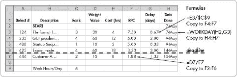

**图 17-4。带有数据计算和截止日期的 RPC 排序**

如果你的质量政策要求先完成排名较高的缺陷，然后再完成排名较低的缺陷，你仍然可以使用表格方法。然而，你不需要计算 RPC。实际上，这项政策意味着排名 5 的缺陷比排名 4 的缺陷无限重要，排名 4 的缺陷比排名 3 的缺陷无限重要，依此类推。在这种情况下，按两个字段排序：首先按排名排序，然后按成本排序，并先处理成本较低的缺陷。

# QA 指标

*QA 指标* 是 QA 团队用来“计分”产品或开发过程质量的工具。适当的指标可以更好地预测测试、开发和发布的时间表。指标还可以帮助管理团队决定产品是否准备发布。指标可以提供团队面临的问题以及如何改进性能和流程的见解。一个运行良好的 QA 团队将收集过去发布中许多方面的质量指标。在一个强大、以质量为导向的团队中，这些指标将被创建并*使用*。

公司根据需求、使用的流程和团队偏好收集指标。一般来说，小型公司只需要一小套针对其特定需求的指标。这个套件应该设计得易于在合理的时间内收集和审查。

以下部分介绍了一些可以收集的常见指标，以及收集数据的简单方法。将这些方法作为你质量指标的开始点。并非所有都是必要的，也并非所有都适用于每种情况。不要止步于此列表；寻找其他机会来一致地创建指标并采取行动。你团队的质量意识将很快得到提高。

## 发布后每周发现的缺陷

*发布后每周发现的缺陷* 是在产品发布后直到下一个非补丁发布之间的缺陷的简单计数。为了计算，从产品发布开始计数缺陷，并在下一个非补丁发布时停止计数。将缺陷分组为每周总数，并每周报告总数。你可以将此信息组织成表格格式并绘制出来，如图图 17-4 所示。这些数据将帮助你预测未来发布的预期情况。

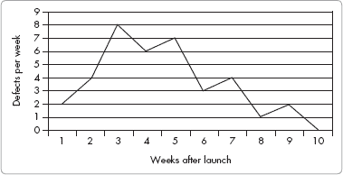

**图 17-5. 发布后发现的缺陷**

如果在几周后缺陷数量继续增加，产品可能会遇到麻烦。有时，在最初的三个或四个星期内，可能不会报告任何缺陷。这可以表明是一个优秀的发布，或者也可能意味着客户尚未完全使用该产品。一旦你收集了一个发布的有关数据，你就可以用它来为下一个发布的缺陷修复时间进行规划。

## 每周加权缺陷计数

*每周加权缺陷计数* 是一个持续计数，累计每个缺陷在发布之间的加权值。*加权值* 代表每个缺陷相对于其他缺陷的影响。最高评级的缺陷（5）可能比中等排名的缺陷（3）重要得多。提前设置一个显示排名缺陷相对于你公司相对影响的表格，将允许你权衡发布后发现的缺陷的影响。

表 17-4 展示了一个示例权重表。在这个例子中，最高排名的缺陷（5）的影响是最低级别缺陷（1）的 25 倍，比下一个较低级别的缺陷（4）高 2.5 倍。你的权重表可能会有所不同，但大多数影响将与排名数字不同。

**表 17-4. 排名与影响权重表**

| 排名 | 影响 |
| --- | --- |
| 1 | 1 |
| 2 | 3 |
| 3 | 5 |
| 4 | 10 |
| 5 | 25 |

要计算加权值，将所有发布后缺陷的加权值相加。例如，如果发布后缺陷在一周内的排名为 3、2、4、4、2、1 和 5，则总和为：5 + 3 + 10 + 10 + 3 + 1 + 25 = 57。每周跟踪这些信息并检查总和。您可以将数据与过去发布进行比较，以了解发布后几周可以期待的情况。

您还可以使用电子表格来计算每周加权缺陷。图 17-6 展示了使用正确公式的示例电子表格。

发布后加权缺陷跟踪对于跟踪*发布后趋势*也很宝贵——跟踪发布和每周报告问题峰值之间的时间长度。这可能会根据产品和客户而变化。对于设置简单且客户非常渴望使用的产品，峰值可能会较早出现。

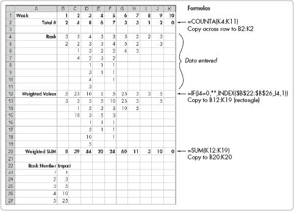

**图 17-6. 计算加权缺陷**

了解何时预期问题数量达到峰值对于规划很有用。您可以使用这些信息确保有适当的工作人员支持客户问题，并预测何时需要额外的工作人员。您还可以将数据绘制在图表中，以比较当前发布版本的质量和缺陷数量与过去发布版本的情况。这些比较记录了团队为提高产品质量所取得的进展。

图 17-7 显示了数据样本的图表。在这个例子中，请注意，发布后六周的加权客户报告缺陷高于发布初期三周时的峰值。这可能是一个严重质量问题的迹象，在非加权图表中可能不容易被发现。

每周加权缺陷也可以在测试期间作为预发布度量。它可以在代码发布之前告诉您代码的质量，并帮助您预测总测试时间以降低缺陷数量到可接受的范围。对于具有大量新功能的发布以及较老的产品，质量度量也很有用。然而，初始缺陷数量很可能会与代码更改量成比例。对于具有持续较长的发布周期和一致更改量的产品线，这可能影响较小。但对于变化量很大的发布，这可能非常显著，并且您可以应用归一化因子来比较发布或设定标准。通过一致的测试方法和考虑更改范围的归一化因子，您可以使用这些数据作为指南，帮助确定何时产品准备发布。

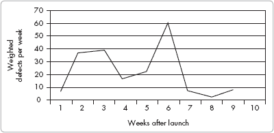

**图 17-7. 发布后每周加权缺陷**

设置归一化系数可能很棘手，因为在一个版本中考虑变化的相对量不能仅仅基于编写的代码行数。有时变化需要相当大的努力，而这种努力包括重构现有代码。一种实用的归一化方法是使用为该版本计划的开发工作小时数的近似计算。例如，如果一个版本的工程小时数是上一个版本的两倍，那么使用 2 作为归一化系数——将缺陷计数除以 2，以便与上一个版本的数据进行比较。

## 加权客户发现的缺陷

在前一种方法的基础上，可以只计算*客户发现的缺陷*。这将反映客户对产品的看法。有时内部检测到的缺陷可能会相对于客户已识别的情况，好或坏地扭曲画面。记住，客户不会报告大多数缺陷；他们倾向于只关注令他们烦恼或影响他们工作的问题。即便如此，客户报告的缺陷可以让你了解客户对质量的看法。

## 测试通过期间运行的测试百分比

QA 团队可以执行*测试通过*——这包括一系列测试以评估产品、发现的缺陷记录、修复缺陷和验证修复。发布通常包括多个测试通过；了解 QA 完成的总测试百分比将很有用，因为百分比是一个进度指标。预测测试通过剩余的时间长度对于时间表结果来说很有用。

在图 17-8 中，随着 QA 团队发现缺陷越来越少，测试通过的时间会缩短。对于这个产品，三次测试总共使用了 19 个工作日，第一次测试持续了 6 天。在第一次和第二次测试之间有一个间隔，以便有时间修复缺陷。

**图 17-8. 从测试开始每周的缺陷**

## 测试通过中发现的缺陷

每次测试中发现的缺陷数量对绘图很有用。第一次测试可以预测发布后的质量和测试周期时间。如果在发布前使用前面描述的相同技术，你可以预测 QA 将发现的缺陷。

## 测试期间每周修复的缺陷

一张显示测试期间每周修复的缺陷数量的图表是另一个有用的工具。如果你将修复的缺陷与发现的缺陷并排绘制，曲线将遵循发现的缺陷曲线，但会延迟。两条曲线之间的时间差代表了修复的平均延迟。图 17-9 显示从缺陷识别到修复大约有一周的延迟。这可以预测下一轮测试中可以期待的情况。

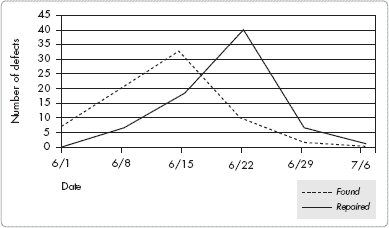

**图 17-9. 每周发现的和修复的缺陷**

这里展示的测量结果可以帮助你为缺陷识别和修复做好准备。最终，你需要选择适合你产品要求的正确指标集。

# 缺陷对质量和生产率的影响

质量保证和工程团队的质量文化可以成为小型公司整体质量和质量保证生产力的关键驱动因素。测试开始时离开工程部门的代码质量和缺陷修复的质量推动了团队和公司的文化。不幸的是，许多工程师并没有足够重视这些问题。

产品在测试阶段出现的缺陷数量定义了出货产品的质量和进度。产品的质量与进入测试阶段的产品质量成正比，因为测试发现的是问题的百分比，而不是无论存在多少缺陷的固定数量。测试开始时的缺陷数量通过增加测试团队的总体周期时间来影响进度。缺陷需要识别和修复时间，大量的缺陷需要更多的测试次数以确保代码质量。

你可以观察到测试开始时缺陷数量对总测试进度的 影响。表 17-5 展示了一个例子，比较了进入测试阶段的初始缺陷数量为 300、40 和 10 的情况与测试次数。在所有情况下，假设工程师将正确修复 85% 的缺陷，但将错误地修复 15%，这些缺陷需要更多的工作。注意，从 300 个缺陷开始需要四次测试才能达到零缺陷。从 40 个缺陷开始需要三次测试。从 10 个缺陷开始需要两次测试。这说明了初始缺陷数量对进度的影响有多大。

**表 17-5. 缺陷减少与测试次数对比，误差率为 15%**

| 测试阶段 | 300 开始 # | 40 开始 # | 10 开始 # |
| --- | --- | --- | --- |
| 第一次测试结束计数 | 45 | 6 | 2 |
| 第二次测试结束计数 | 7 | 1 | 0 |
| 第三次测试结束计数 | 1 | 0 | 0 |
| 第四次测试结束计数 | 0 | 0 | 0 |

也很重要的是维修的质量。维修质量可以通过*测试通过率降低率*来衡量——即未正确修复的已识别缺陷和新故障的比例，这些新故障直接由维修引起。一个组织可以通过其正确的维修率或相反，即维修故障率来描述。例如，25%的故障率表明一个组织管理混乱，工程师们没有检查他们的工作或与质量保证部门沟通。一个运行良好的组织应该有 10%或更低的故障率。5%（20 个缺陷中有一个）的组织表现非常好：开发工程师在实施维修前与质量保证工程师紧密合作，以确保他们理解问题。工程师们也会检查他们的工作，以避免引入新的问题。

让我们再来看一个例子。假设工程在项目中构建了 100 个缺陷，质量保证在第一次测试通过时发现。每次通过都需要一周时间，因为每次通过都要进行完整的回归测试，以捕捉缺陷修复的副作用。考虑表 17-6 中显示的简单场景，有三个不同的维修率，25%，10%和 5%，从 100 个缺陷开始。

**表 17-6. 维修故障率与测试通过次数对比**

| 阶段 | 25% 维修故障率 | 10% 维修故障率 | 5% 维修故障率 |
| --- | --- | --- | --- |
| 开始计数 | 100 | 100 | 100 |
| 通过 1 结束计数 | 25 | 10 | 5 |
| 通过 2 结束计数 | 6 | 1 | 0 |
| 通过 3 结束计数 | 2 | 0 | 0 |
| 通过 4 结束计数 | 0 | 0 | 0 |

三种方法的成果差异很大。25%的团队需要四次测试通过才能使产品准备发货。10%的团队需要三次通过。5%的团队通过两次代码通过。如果每次通过需要 5 天，那么 5%的团队比 25%的团队少用 10 天来完成相同的初始缺陷数量。在实践中，时间差异甚至更大，因为此示例不包括工程进行维修所需的时间。如果你假设每天有 20%的时间用于发现缺陷，并且每个测试通过需要 5 天，那么你得到的数据如表 17-7 所示。

**表 17-7. 总时间与不同维修故障率对比**

|   | 25% 维修故障率 | 10% 维修故障率 | 5% 维修故障率 |
| --- | --- | --- | --- |
| 阶段 | 缺陷数量 | 时间（天） | 缺陷数量 | 时间（天） | 缺陷数量 | 时间（天） |
| --- | --- | --- | --- | --- | --- | --- |
| 开始计数 | 100 |   | 100 |   | 100 |   |
| 通过 1 | 25 | 5.0 | 10 | 5.0 | 5 | 5.0 |
| 通过 1 维修 |   | 5.0 |   | 2.0 |   | 1.0 |
| 通过 2 | 6 | 5.0 | 1 | 5.0 | 0 | 5.0 |
| 通过 2 维修 |   | 1.3 |   | 0.2 |   |   |
| 第 3 次 | 2 | 5.0 | 0 | 5.0 |   |   |
| 第 3 次修复 |   | 0.3 |   |   |   |   |
| 第 4 次 | 0 | 5.0 |   |   |   |   |
| 总天数 |   | 26.6 |   | 17.2 |   | 11.0 |

哇！一个 5%的修复失败率的团队比 25%修复失败率的团队提前 15 天完成发布。随着项目规模的增加，节省的时间会更大。你可以清楚地看到，推动积极工程态度，防止缺陷进入测试阶段，确实可以缩短时间表并减少发布后的缺陷。

# Additional Reading

这里是本章所讨论主题的一些额外阅读材料：

| *《代码大全：软件构造实用手册》，作者史蒂夫·麦克康奈尔（Microsoft Press，2004 年）* |
| --- |
| *《控制软件项目：管理、测量和估算》，作者汤姆·德马克罗（Yourdon Press，1986 年）* |
| *《有效的软件测试自动化：开发自动化软件测试工具》，作者康林·李和孟奇·吴（Sybex，2004 年）* |
| *《高质量低成本软件审查》，作者罗纳德·A·拉迪斯（Paradoxicon Publishing，2004 年）* |
| *《个人软件过程导论》，作者沃茨·S·汉弗莱（Addison-Wesley Professional，1996 年）* |
| *《软件审查》，作者汤姆·吉尔布和多萝西·格雷厄姆（Addison-Wesley Professional，1993 年）* |
| *《软件发布方法论》，作者迈克尔·E·贝斯（Prentice Hall，1999 年）* |
