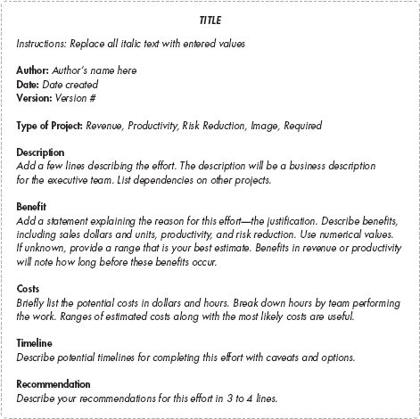
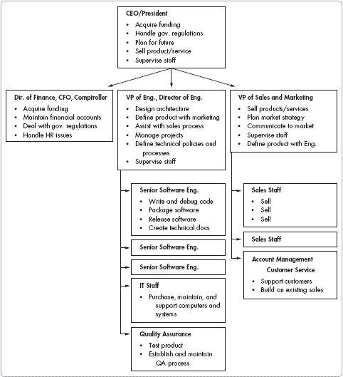
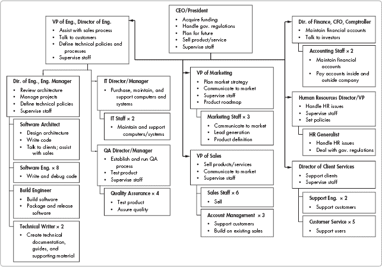
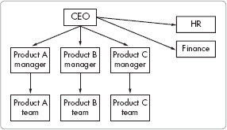
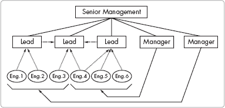
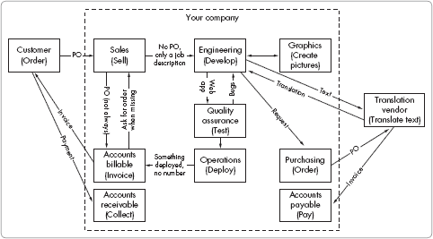

# 第五部分。规划未来

第十八章

第十九章

第二十章

附录 A

附录 B

附录 C

开发经理的一个关键角色是规划公司产品和公司技术的未来。在许多小型公司中，由于缺乏承担这项任务的时间，规划受到限制。尽管日常活动可能令人难以承受，但你应该定期留出一些时间来规划未来。

本节讨论了帮助您使前瞻性规划更加系统化的方法和途径。它包括选择项目、项目估算和规划以及一般技术规划的技术。

# 第十八章。设定方向

开发经理必须监督开发团队的产品和技术方向；他还与市场营销团队合作，为公司设定产品方向。制定方向应该是协作努力，涉及销售、市场营销和开发团队的技术领导者。设定产品方向时的重要考虑因素包括市场需求、客户需求、行业技术方向和公司需求。

如果你未能设定方向，方向将默认为你设定。没有具体方向，工程师可能会受到非特别商业因素的影响和激励，例如使用新技术或方法的刺激或重写代码而不是重用代码。工程师对特定软件和系统也有强烈的偏好，他们可能会根据短期效用选择第三方包，而未考虑长期成本、对质量的影响和商业风险。

如果你是公司的新人，在为未来设定方向之前，先看看过去开发团队是如何做出技术决定的。尽量理解过去决策背后的推理。考虑语言、操作系统、计算机、第三方软件和数据格式的选择。考虑过去的“创建与购买”决策。了解过去是如何做出决定的，可以帮助你理解团队的任何偏见，并为你改进未来的技术决策提供思路。在某些情况下，过去决策的原因可能并不明确——但这不应阻止你现在或未来记录决策。

您不能在真空中设定技术方向。在考虑策略时，与执行团队进行审查，并鼓励他们提供反馈和支持。决策受到高优先级和低优先级问题的影响，权衡和妥协是常见的。与执行团队的适当沟通确保每个人都了解大局，包括其优缺点。

作为技术领导者，您在设定未来技术方向时的决策需要您考虑五个要素：倾听市场、创建完整产品、解除隐藏的技术时间炸弹、规划所需的技术改造，以及优化客户设置。

# 倾听市场

在规划产品和科技方向时，考虑现有客户和当前及未来市场的需求。

销售团队、营销团队和客户服务团队可以帮助您更多地了解客户的兴趣。与客户会面。花时间观察用户如何使用您的产品；这可以为您提供关于如何改进产品的深刻见解。询问客户他们的担忧、他们对产品未来使用计划的规划以及他们对新功能的想法。为了理解大局，您可以汇总从多个客户收集到的数据。

当前客户可以就您的产品提供宝贵的进化建议，而潜在的新客户可以帮助识别缺失的关键功能。由于大多数小型公司通过获取新客户并向现有客户销售更多产品来增长，因此预见新客户的需求应该是您规划努力的重要部分。如果您只关注现有客户的需求，您可能会面临过度定制产品以适应更小潜在市场的风险。产品营销团队应定期检查公司的市场，与现有和潜在客户进行交流。这些信息使团队能够识别具有相似问题的不同客户群体。对于每个群体，营销团队能够评估潜在解决方案带来的价值，而开发团队能够确定解决方案的可行性和潜在成本。在确定了不同的选项后，营销可以设定产品方向。

这听起来可能是一个直接的过程，但它通常涉及多次迭代和不同想法的审查，以隔离那些对下一个产品发布最有潜力的想法。在营销和工程的合作下，这个过程可以以系统的方式进行。

在审查潜在市场时，从不同维度扩展您的当前产品，以考虑新的机会。一些新的机会需要简化您的产品并以更低的价格提供打包服务。其他机会需要新的专业功能。还有其他机会包括不同的行业“垂直领域”——这意味着您的产品可以用于解决不同行业类似的一组问题。

不可轻率地对待开拓新市场细分领域。要做好更大努力的准备。进入一个新市场细分领域通常比在现有垂直领域内扩展产品线需要做更多的工作——不仅是在客户销售努力上，还包括学习新行业的各种问题和关注点。在设计和构建新产品之前，开发团队需要掌握新行业的技术要求。你的计划中应该包括为攻击新细分领域所需的工程培训时间。

调查产品的未来是开发经理和其他人的一项持续任务，对未来规划不应仅限于年度战略规划会议。这些讨论提供了有价值的信息，至少应该每季度考虑一次。未能定期讨论产品未来可能会给规划过程带来巨大的时间滞后，并使产品（和公司）的未来变得不那么动态和成功。

# 创建完整产品

如前几章所述，*完整产品*的概念^([7])不仅描述了提供客户想要购买的软件产品，还提供了针对客户问题和需求的完整解决方案。一个完整产品包括软件、客户服务、技术支持、适当的技术接口、与其他工具的集成便利性、安装便利性以及前瞻性计划。开发经理不能仅仅关注产品软件。相反，要考虑将软件扩展为完整产品所需的因素，重点关注接口、与其他工具的集成以及客户实施的便利性。

如果协助客户实施你的产品所需的成本和努力很高，你应该仔细且经常地审视这个领域。小型公司的销售会受到客户实施困难和成本的影响。客户普遍发现企业系统难以实施，因此一个简化的系统将吸引销售。公司管理层可能会在公司成长周期早期忽视攻击产品实施改进。高实施成本将阻碍小型公司的增长。

一些软件类别需要与不同系统的大量接口才能被市场接受。下一个新的接口可能不像新产品功能那样有趣，但它们可以带来高销售额。与市场营销一起尽早审视接口需求，并规划增长。

对于某些软件产品，与其他工具的直接接口对于成功至关重要。与接口一样，这并不是软件工程的魅力领域，但对于最大化产品对客户的价值和整体成功至关重要。

向前看往往需要营销双筒望远镜来识别未来的方向。然而，有时需要穿上防弹衣来寻找隐藏的问题。

* * *

^([7]) 整个产品概念是 Geoffrey A. Moore 所著的《跨越鸿沟》一书的主题，也包含在营销文本中。

# 消除技术定时炸弹

一些过去的技术决策可能像定时炸弹一样，在你最不期待的时候爆炸。这些*技术定时炸弹*是由产品开发初期做出的技术选择引起的，这些选择最终会导致问题爆发。工程师可能会通过专注于快速的产品构建而忽略他们选择的长远影响来创造这样的问题。此外，做出技术选择的工程师可能会有个人偏见，这些偏见可能并不代表当前情况下最佳的长远商业选择。

技术定时炸弹在爆炸时具有不同的延迟时间和不同的影响。作为开发经理，了解要寻找什么可以帮助你尽早发现这些问题，以便问题不会使你的公司无法支持客户。在审查你的技术和寻找潜在问题时，请考虑以下领域：

与客户通信所选用的数据格式有多标准化？当客户与你的系统集成时，它是否会增加客户的成本？

有时在项目开始时没有指定数据格式，因此工程团队会使用最方便的格式，这可能会证明对未来的客户来说非常不方便。

团队是否为软件组件编写了代码，尽管有合理的商业组件可用？

这被称为“非发明者综合症”。一些工程师想要重新创建组件以供自己学习，或者为了完全控制代码。

在您产品的构建过程中是否使用了不常见的语言？

这可能导致难以找到和雇佣合适的替代工程师。作为一家小型成长中的公司，应积极避免这个问题，因为使用通用语言应该是常态。但是，当技术专家对它们有个人兴趣或偏好时，可能会使用不常见的语言。

关键技术选择背后的原因是什么？

有时选择技术是因为熟悉或为了学习，而不是因为它是最优的选择。

质量保证（QA）对 API 输入错误检查的彻底程度如何？覆盖范围是否稳固？

工程和质量保证（QA）通常对应用程序编程接口（API）进行不足的错误检查。由于大多数 API 的复杂性，进行完整的测试和检查可能很困难。

产品是否有当前客户不使用的重大功能？

如果情况如此，并且如果功能最终被使用，你应该预期客户会发现新的问题。

数据层、前端和中间层的可扩展性如何？

随着客户基础的扩大，基于服务器的软件中经常会出现速度问题。

是否有人审查过系统硬件选择的可扩展性？

对于在服务器上使用的软件，开发通常首先关注正确实现功能，然后才考虑可扩展性。对软件可扩展性和推荐硬件进行早期测试是个好主意。

第三方代码的性能如何随着系统容量的增加而扩展？是否有其他客户在您期望的系统容量上使用过第三方代码？

有时，可扩展性问题与纳入您系统的第三方软件包有关。不要假设这些包已经为更高的速度和客户负载进行了适当的测试。

当容量高时，第三方代码的许可成本是多少？

一些组件的许可可能包括随着上线客户数量的增加而痛苦的价格上涨。了解任何第三方软件包的按客户计费和扩展成本。

第三方代码的可靠性和质量如何？

由于商业软件代码的质量差异很大，在测试过程中应仔细审查第三方代码；不要假设它是可以接受的。

在技术时间炸弹爆炸之前找到并解除它们需要一些侦探工作。您必须检查您产品构建的所有方面，包括兼容性、可扩展性、质量、供应商可靠性以及长期成本。虽然避免爆炸可能并不总是可能的，但通常可以最小化其影响。

一些技术选择可能会带来严重的、不易修复的技术缺陷。当这种情况发生时，您可能需要对代码库进行重大修改。可能是时候进行技术改造了。

# 计划进行技术改造

*技术改造*涉及替换当前代码的主要部分或重新设计产品的架构，同时保持代码功能的大致相同。可能需要新的技术来解决系统性的设计缺陷。对于无法逐步与新开发一起修复的重大问题，考虑进行改造。

需要进行改造的情况通常出现在您继承的遗留系统中。另一方面，对于最初监督构建系统的开发经理来说，改造可能是一场噩梦。在任何情况下，都要向您的老板和同事解释最初为什么做出这些选择，以及为什么现在需要进行重大改变。

在小型公司中，时间和资源总是稀缺的，因此对这些资源的竞争可能非常激烈。如果您得不到同事和管理层的支持，处理那些不易被发现且不产生短期可见结果的高昂问题可能会导致误解和不信任。

还要考虑翻新对客户的影响。这些更改可能会（并且通常确实会）迫使客户在运营或技术方面进行更改。例如，你的更改可能要求客户购买新的第三方应用程序，例如数据库软件。在开始工作之前，你必须考虑客户的影响，并提前通知你的客户即将到来的更改。

如何处理翻新取决于预期的成本和业务需求。如果翻新是“轻微”的，并且开发可以在三到六个月的单个集中发布期内完成，那么一次性实施这些更改是最有意义的。这将需要市场营销和销售的支援，因为一个不改进产品特性的发布可能会对销售增长造成问题。进行技术翻新需要强有力的商业案例，因为这样做将会取代其他重要的产品工作。

如果更改不是轻微的，并且无法适应单个短期周期，那么你的选择会更加困难。对于一家小型公司来说，一至两年的翻新项目很少具有商业意义。它会使公司的产品特性长期保持静态。翻新的时间延迟会吸引来自竞争和现有及未来客户动量损失的大量风险。

翻新的一个方法是为每个发布版按主要部分规划工作量。这可能与正常发布难以协调，如果没有额外的员工，这将会使工作量拖得更长。另一种方法是并行构建新的系统，同时支持现有系统的工作。这可能在逻辑上更简单，但需要额外的员工和基础设施，你可能在项目结束时需要缩减这些规模。

总结来说，当你认为需要技术翻新时，你必须创建并展示一个清晰的商业案例，并继续推动问题得到解决。不要等到系统崩溃并损害你的产品和客户时才采取行动。

# 优化客户设置

尽管捆绑包装、大批量生产的软件是“按原样”销售的，但许多产品和服务的客户在使用软件之前需要额外的设置程序才能实现其全部潜力。销售需要或从设置工作中受益的产品和服务的公司往往忽视了这些操作的成本。如果忽略这些成本，通常也会忽略优化客户设置。

创建一个对每个客户来说部署成本高昂的优质产品，如果客户群较小，可能不会出现问题，因为在这种情况下成本也可能很小。但随着客户群的扩大，这些额外努力的成本也会增加——随着定制化程度的提高、推广时间和推广成本的增加。大多数小型公司无法承担每个新客户带来的大量时间延误或高昂的开发成本，实施和设置问题可能导致销售损失，因为更多潜在客户会听到与您的产品相关的问题。

如果客户愿意为您的产品定制付费，那么具有更多定制选项的销售可能是可行的。然而，每个客户都需要大量定制的产物意味着随着销售的增加，您的开发人员团队也必须扩大。这种做法定义了一种咨询业务模式，它需要与适用于所有软件包的成本、销售和费用考虑不同。

将咨询业务模式与软件产品业务模式结合对于一个单一软件公司来说是一项艰巨的任务。客户总是会试图压低定制编码的价格，或者期望在昂贵的产品中免费获得它。这将使定制对您的公司来说更像是一种成本而不是销售。因此，您必须在公司成长阶段之前尽早最小化定制努力和成本。

如果定制是公司业务计划的一部分，为定制努力创建一个单独的团队或业务单元，并为业务的产品和服务部分确定不同的价格要求。关于如何做出让步的高级协议将简化销售流程，当客户对销售的产品或服务部分施加压力时。

无论是否付费，从销售到推广的延迟都会在新的客户成为付费客户之前增加时间。在成长阶段的大规模延迟会损害公司的现金流和增长能力，即使公司拥有所有想要的客户也是如此。增长会拉紧现金流，因为您的公司必须提前用现金支付，而当前的资金流入将少于资金流出。

成长率越高，从成本到收入的延迟时间越长，为了在没有外部投资的情况下维持公司运营，所需的过往销售利润就越高。对于软件即服务（SaaS）模式来说，这种情况更为严重，在这种模式下，客户会随着时间的推移向您的公司支付费用，而不是一次性支付。

推广和定制要求不仅影响开发团队，还影响运营、支持、文档和项目管理团队。如果开发人员专注于最重要的问题，开发团队通常可以找到帮助减少其他团队面临成本和延误的方法。

如果您的商业模式需要定制以让用户快速上手，在订单如潮水般涌来之前，寻找优化这一过程的方法。为了减少时间和成本，首先确定每个新客户的当前推广时间和成本。计算成本的过程需要您检查步骤和流程，以确定多种减少时间或最小化错误的方法。

其他解决方案因分析的不同而有所不同，以减少时间和成本。以下是一些例子：

+   改变产品的捆绑和范围，以减少推广时间和成本。

+   不要针对那些本质上需要最多定制的客户。⁸] 这可能意味着追求中等规模的公司而不是大型公司，因为大型公司在购买大型软件时期望得到更多的关注和定制。大型公司有财务影响力，可以要求免费定制，同时压低价格。您可以通过创建同时增强产品对一般市场的功能的新特性来减轻这种影响，但如果情况并非如此，请避免进行此类合理化。从商业风险的角度来看，CEO 通常更倾向于几笔小销售而不是一笔大销售。如果交易出现问题，更多的销售可以降低风险。然而，如果公司的信誉将从大型账户参考中受益，CEO 的战略可能更倾向于大销售而不是小销售。

+   通过编写一个自动化过程的软件程序来简化客户的集成工作。如果客户必须操作旧数据才能使用您的系统，请尽可能使该过程自动化，并将其作为您的标准产品的一部分。

+   标准化您的定制化产品以减少部署时间。不要允许完全定制，而是包含一些标准定制，并尽可能简化它们。这一原则同样适用于专业服务组织。创建框架、方法和标准定制，以加快部署速度，可以大大提高公司的利润。基本规则可以归结为“一次创建，多次销售。”

+   创建一个专注于通过降低成本和缩短部署时间来改善客户实施的定制或集成小组。随着公司的发展，该小组将随着销售额的增加而扩大。

* * *

^([8]) 例外情况是，当您的公司业务战略专注于针对大型客户的混合产品/服务市场时。确保您的公司有足够的资金，因为在这种情况下，销售和交付周期可能很长。

# 第十九章。产品路线图和战略

战略规划需要不仅仅是销售预测和财务计划——它还需要基于对公司起点、未来发展方向以及如何到达那里的深思熟虑分析的产品策略和产品路线图。开发经理在这个过程中发挥着关键作用，通过制定现实的产品路线图来设定方向，并协调业务需求与开发、营销、销售和其他团队策略。

高级管理层必须持续关注前方的道路，同时记住公司已经走过的路径。作为一名高级管理者，你必须小心行事以避免陷阱，同时专注于引领公司走向未来的地平线。

在你确定目的地、规划路线并侦察出直接路径之后，你可以完成短期（不到一年）、中期（一到三年）和长期（三到六年）的战略计划。

**忽略中间期**

在我的公司，我明显观察到短期和长期规划的分裂。管理者们对将两者对齐没有兴趣。政治决定了短期策略；投资者希望看到选定领域的进展。管理层将长期计划推销给投资者，因为它展现了一个光明的未来。中间计划未能对齐的部分原因可能在于管理层的怀疑主义。如果他们制定了中间期计划并发现长期承诺与他们的前进方向之间存在巨大差距，他们就不能告诉投资者他们相信长期财务模型。

在接下来的九个月里，开发部门达到了短期目标，但公司未能成功迈向其长期目标，因为管理层没有制定达到那里的计划。

—项目管理总监

如果你看不见眼前的短期道路，你可能会陷入困境，而缺乏长期愿景会让你迷失方向；然而，在小公司中一个常见且危险的问题是缺乏中间期：没有确定并定期更新从这里到那里（目的地）的计划。如果没有包括中间期的完整战略计划，你可能会抓住短期机会，而这些机会会导致你偏离长期目标。非战略性的短期选择不会相互建立以增加企业价值。相反，这些选择以牺牲未来潜力为代价带来短期收入。

制定包括中期计划的全面战略计划需要执行团队的共同努力。团队需要考虑许多方面，以提供满足公司目标的解决方案，包括产品路线图、公司财务、预期销售额和公司人员计划。

评估计划甚至比创建计划更重要，需要每季度审查并根据需要做出调整。许多公司每年创建一次战略计划，然后将其存档而不是定期更新。重新规划的过程提供了战略规划的实际价值，而不是计划本身。

从开发领导的角度来看，坚持高标准的道路而不是随波逐流可能会感到挑战。需要一定的政治技巧来说服他人，某些短期选择可能会对长期产生不利影响。然而，不要简单地、默默地接受那些不会使公司达到预期目标的短期产品选择；在大问题上表达你的观点。

带着这些信息，让我们看看对发展影响最大、也最令人关注的规划区域——*产品路线图*。

# 创建产品路线图

产品路线图通常与市场营销部门一起制定，以定义产品线随时间的变化，并关注影响产品和其市场的主要转变。路线图不能是营销幻想；它必须基于对产品路线的合理发展假设，这个路线是可实现的，并且能够生产出公司和客户期望的产品。创建产品路线图需要你对当前的产品目标有深刻的理解，以及可能影响路线的缺陷和限制。

从市场营销策略开始，考虑几个主要的产品选项。还要考虑公司期望开发部门承担的其他主要工作，例如开发提高生产力的项目、修复故障系统、关闭客户交易和改善企业形象。在创建产品路线图时，应考虑所有公司的项目努力。

让我们看看比较不同选项的直接方法。

# 评估选择

*成本效益分析（CB 分析）* 是一个经典的工具，既有正式的定义也有非正式的定义。在本节中，讨论不是从财务角度正式的，而是使用计算方法的变体来考虑看到效益的概率。CB 分析用于确定哪些项目将创造最多的收入。由于估计任何投资的潜在效益的复杂性以及准确预测模糊目标成本的能力，CB 分析在软件市场中利用率不高。然而，CB 分析可以成为小型软件公司的有效排序工具。

对未来产品提案进行成本效益计算可以了解哪些项目最有可能成功。更重要的是，这些计算可以识别出*将失败*的项目。成本效益计算可以反映整体管理团队对每个产品周期将发生什么的判断，并且它们还允许你比较多个项目的潜在成功。当考虑未来产品规划时，这些信息非常有价值。

成本效益计算可能会出错，但项目提出的相对价值可能接近实际相对价值。你可以使用这些计算来对新项目提案进行比较选择。一些项目可以改善客户体验或简化内部任务，但它们需要在与其他所有项目进行比较并比较回报之前进行评估。

项目有多种类型：*收入*项目带来资金。*效率*项目可以提高团队的有效性，从而降低成本并改善服务。*必需*项目描述了具有外部命令的项目——例如基于联邦法规的医疗软件公司项目和 2000 年软件升级项目。*风险降低*项目降低业务中断的可能性。*形象*项目改善公司的形象，但不会直接增加收入。通常，小型成长型企业会避免形象项目，因为收入要么为零，要么非常难以定义，但在某些情况下，正确的形象项目可能是公司成功的关键。

在小型公司中，收入通常被强调。一些公司只关注收入，而忽略效率和风险降低，直到问题变得严重。收入是否应该总是优于生产力和风险预测？简短的答案是：不——收入可以占主导地位，但它不应总是获胜。未能考虑风险降低或生产力问题可能对小型成长型企业是致命的，因为随着公司的发展，风险和生产力问题都会增加。

许多小型公司不使用成本效益分析来调查未来项目，而是依赖高管直觉或投票选择流程。然而，当适当的信息没有收集到时，直觉和投票很容易产生次优结果。它们还受到可能不符合公司最佳利益的个人偏见的影响。

通常，成本效益分析不是万能的解决方案，但它可以就组织未来规划时什么是有意义的提供良好建议。

**销售项目选择**

在我的公司，为期一年的项目由大约 12 名销售人员投票决定。公司需要卖出三个产品才能在开发成本上实现盈亏平衡。大多数销售人员只知道他们地区项目的一个潜在销售，因此他们有强烈的动机将他们的投票投给下一个销售发生的地方，即使他们知道公司只能卖出一种产品。

我的公司需要更强大的市场部门来调查销售人员并与客户交谈。这将使他们能够确定每个客户的整体市场，然后选择在三年内销售潜力最高的产品。相反，我们做出了很大的选择，但缺乏远见，也没有回顾发生了什么。

——工程总监

## 成本效益计算

在估计项目的 CB 时，将其放在所有项目的背景下考虑，以确保一致性。所有项目分析应就关键因素进行类似加权。

一个关键因素是分析的时间框架——考虑收益、风险和成本的时间长度。时间框架的选择可以根据业务类型和公司项目的大小而变化，较大的项目需要更长的时间框架。对于大多数小型软件公司来说，使用两到三年进行分析效果良好。对所有分析的项目使用一致的时间框架。

下一步是评估在标准时间框架内项目的时间和费用。这个估计将取决于之前定义的努力类型：收入、生产力、需求、风险和形象项目。然后，对于不同类型的项目，考虑财务收益与实现这些收益的概率（几率）之间的对比。对于收入项目，你可以估计预期的总销售额。对于风险降低项目，计算风险发生的概率和风险发生的财务惩罚（负收益）。对于生产力项目，查看节省的时间和金钱的收益与未实现这一收益的概率。对于需求项目，不计算收益，但估计成本；然后为列表顶部添加一个 CB 值。对于形象项目，计算收益可能非常困难，但将最佳猜测写在纸上是有用的。

拥有所有这些信息，你可以使用以下公式计算项目的 CB：

| *CB = 收益美元价值* x *收益概率* ÷ *收益美元成本* |
| --- |

例如，如果一个收入项目预计在三年内（收益）有 100 万美元的销售（收益）预计销售成功的概率为 70%，成本为 20 万美元，那么 CB 为 3.5（$1,000,000 x 0.70 ÷ $200,000）。或者，一个风险降低项目，成本为 1000 美元解决一个可能造成 50000 美元损失的问题，概率为 5%，其 CB 为 2.5（$50,000 x 0.05 ÷ $1,000）。

### 注意

*CB 是一个无单位值，因为它将金钱除以金钱。严格来说，财务计算使用“现值”，这是通过将未来金钱的价值折现并与现在的金钱进行比较来找到的。然而，对于大多数一到三年的工程项目，估计非常粗略，因此添加现值计算是不必要的*。

## 成本效益比较

您可以使用 CB 方法比较几种不同类型的项目。对于所有项目类型，估计成本并不像计算项目的收益和获得这些收益的可能性那么困难。如果您系统地创建估计并记录它们，您可以在几个月后对项目估计进行比较。随着新信息的出现，您可以更新 CB 信息。尽管必需项目与可选项目不同（您必须完成必需项目），但它们通常具有零或低收益。输入此信息并将 CB 设置为一个大数，如 100，以确保这些项目出现在 CB 列表的顶部。添加一个说明强制任务完成日期的注释。

您可以将所有项目信息添加到电子表格或图表中。表 19-1 展示了如何并列比较不同项目的一个简单例子。表格顶部是一个必需的项目，它通过一个人为的 CB 值将其置于列表顶部（当然，这并不意味着它的真实 CB 值是 100）。

**表 19-1. CB 表示例**

| 描述 | CB 3 年 | 总成本 $K | 概率 | 收益 $K | 加权收益 $K | 类型 | 备注 |
| --- | --- | --- | --- | --- | --- | --- | --- |
| HIPAA 要求 | 100^([a]) | $40 | 100% | $0 | $0 | 必需 | 1 月前 |
| 发布流程时间缩短 | 8.6 | $23 | 100% | $200 | $200 | 流程 |   |
| 添加 Web 界面 | 5.0 | $50 | 50% | $500 | $250 | 收入 |   |
| 多系统备份 | 5.0 | $100 | 10% | $5,000 | $500 | 风险 |   |

|

^([a]) 设置为 100 —未计算

|

一个有序的 CB 表可以提供对任务相对重要性的洞察，但不应该直接用作任务规划或排序机制。一旦团队审查了表格并做出了项目选择，就可以开始任务调度。在某些情况下，必需任务将在具有大收益成本比的项目之后进行调度。

### 警告

*CB 很容易被操纵以使项目看起来更好。对所有数字持怀疑态度并测试其基本假设*。

当审查计算出的成本效益比（CB）时，进行一次“嗅觉测试”：如果一个产品的 CB 值非常高（大于 10），则重新测试假设。如果一个产品的 CB 值为 2 或更低，对利益和成本持怀疑态度。因为这些是粗略估计，如果成本上升而利益降低，这样的项目很容易变成亏损项目。一般来说，寻找 CB 值为 3 或更高的项目。在所有情况下，即使项目看起来像亏损项目，也要将假设和 CB 值保存在表格中。由于潜在项目通常会在 6 到 12 个月内再次出现，你可以回顾早期的假设，看看可能发生了什么变化。

# 创建一页评估

成本效益比的一个有用补充是*一页评估*，它从高层次描述了基础项目，并包括许多假设。一页评估是补充成本效益分析的有用工具。每个评估都提供了对提议项目、其成本和其利益的快速概述。执行团队在确定哪些项目可以授权时，可以审查评估以及 CB 项目摘要表。一页评估是团队是否应进一步调查项目的初步指南。几个月后，如果执行团队成员要求了解特定项目的评估信息，它也非常方便。

执行团队中的任何成员都可以收集一页评估的信息；然而，大多数评估将需要从几个不同的执行成员那里收集信息。所有评估都应咨询市场和工程部门。

典型的一页评估描述以下这些内容：

+   标题（在顶部）

+   作者

+   日期

+   版本

+   项目类型（关键词）

+   描述（包括依赖关系）

+   项目利益（项目实施原因的陈述）

+   成本（以美元和劳动力计算）

+   时间表

+   建议

图 19-1 显示了用于一页评估的样本模板。

**图 19-1. 一页评估模板**

## 项目组成部分

当你准备一页评估时，一些项目将包含多个较小的项目。如果你确定这些较小的项目可以分解为独立的项目，在执行最终分析之前考虑将它们拆分。

有时项目可以被划分为更小的部分，这些部分可以轻松分析。例如，对于跨越一年的大型项目，可以考虑将它们分解为具有不同客户价值的特定功能块。对于每个组件，进行一次专门针对仅具有该功能的产品对客户的感知价值的成本效益计算。这种分析方法比项目成本效益计算更困难，因为计算功能块的经济回报可能是一个抽象概念。然而，与市场营销讨论功能块的相对价值与成本，可以提供相当大的效用，因为它迫使市场营销优先考虑并记录不同功能集的有效价值。允许市场营销或管理层在产品具有任何价值之前就指出所有功能都必须按无特定顺序包含在内，这会降低项目成功的可能性。

收集子组件的有效价值将涉及与多个客户的讨论，以了解他们如何看待产品的价值。在这些讨论之后，写下子组件的相对价值；这些信息在将来可能非常有用。管理层和新客户常常会将新的功能请求驱动到产品中，而不考虑这些可能对其他计划中的功能产生的影响。更广阔的视角可以让团队选择对贵公司最有利的实施顺序。

# 额外阅读

在本章中介绍的主题，以下是一些额外的阅读材料：

| *企业家手册：商业初创企业、分拆和创新能力管理*，作者：Richard M. White（Chilton Book Co.，1997） |
| --- |
| *最大化软件开发投资回报率*，作者：Vijay Sikka（Auerbach Publications，2004） |
| *按数字开发软件：低风险、高回报的开发*，作者：Mark Denne 和 Jane Cleland-Huang（Prentice Hall PTR，2003） |
| *策略纯粹与简单 II：获胜公司如何主导竞争对手*，作者：Michel Robert（McGraw-Hill，1997） |

# 第二十章。前进之路

如果你已经通读这本书，你已经覆盖了很多内容。考虑到如此多的信息需要考虑，前进的道路可能会显得令人畏惧。幸运的是，你手头有一本指南书，可以帮助你找到自己的方向。

如果你是一名新经理，不要担心你仍然感到迷失在森林中。在地面层面，树木看起来很相似，它们都挡住了你的视线，但不要在森林的地面上徘徊，希望找到你想要去的地方。相反，经常改变你的视角——爬上一棵树，超越森林，这样你就可以看到整个景观。经理需要能够看到大局，并理解自己的辛勤工作如何与之相关。因此，定期努力回顾你公司的整体视图和你的发展努力。如果你不喜欢你所看到的，就做出改变。总结一下：停下来，评估，然后行动。

一点回顾性的思考也能有所帮助。想想你过去在哪里，现在在哪里。如果你喜欢人、软件、技术和管理，你的工作总体上应该是令人兴奋和有趣的。如果你已经有一段时间没有这种感觉了，就摇醒自己，问问为什么工作不再充满活力。这可能会引导你改变你花费时间的地方、你优先考虑的事情，或者你领导的方式。它也可能引导你离开你当前的公司。

记住，作为开发经理，这并不是关于自我，工作福利，掌权，或其他直接对你有利的利益。这是关于你引导你的团队走向成功。良好的管理意味着支持你的团队，帮助开发人员成长，公平对待团队成员，并帮助业务发展。善待他人并不总是能推进你的职业生涯，但它会让你成为一个赢得团队、老板、同事和最终自己尊重的好经理。这将使你的旅程变得值得。

# 附录 A. 软件公司结构

结构化成长中的软件公司的组织方面需要你了解公司需要执行的任务。当公司刚开始时，领导层通常会将任务分配给员工。随着公司的发展，这些任务的大小和数量也会增长，需要雇佣新员工。随着新员工的雇佣，公司的组织结构将发生变化，角色将变得更加专业化。

本附录说明了随着公司的发展，公司结构是如何变化的。为了说明这些变化，考察了一些关键的小公司规模及其相关的组织结构。描述的公司是按照小型软件产品公司而不是软件承包公司来建模的。尽管描述很详细，但它们并不是旨在定义唯一的小公司结构方式——在实践中，其他组织结构也可以成功使用。

这里讨论的公司规模如下：

+   单人软件公司

+   双人软件公司

+   十二人软件公司

+   五十人软件公司

+   百人以上软件公司

前四个例子说明了功能/层级^([9])型组织，因为这是小型公司最常见的结构。拥有一百多人规模的软件公司通常会使用其他组织结构。尽管你不需要等到公司员工超过 100 人后再进行重组，但在这个阶段产生的压力变得足够大，以至于有效组织的问题变得尤为紧迫。

# 公司任务

要了解不同规模的公司，你必须首先考虑创建一个可行的软件公司所需的业务和软件开发任务。这些任务分为两大类：业务任务和软件生命周期任务。*软件生命周期任务*包括开发可行的软件产品及其开发后的维护所需的工作。*业务任务*使软件开发成为可能，并保持业务财务上的可行性——从获得资金到支付账单、雇佣员工和管理工作。

以下列出的业务和软件生命周期任务列表并非旨在包罗万象，但它们确实涵盖了不同规模软件公司常见的任务。

| 业务任务 | 软件生命周期任务 |
| --- | --- |

|

+   获取资金

+   维护财务账户

+   处理政府法规

+   处理人力资源问题

+   监督员工

+   销售产品或服务

+   规划未来

+   购买、维护和支持计算机和系统

+   管理、估算和跟踪项目

+   定义技术政策和流程

|

+   定义产品

+   设计架构

+   编写和调试代码

+   测试产品和保证质量

+   软件打包

+   发布软件

+   支持客户

+   创建技术文档

|

在我们考察不同规模的公司时，记住这些工作任务的类型，从单人公司开始。

* * *

^([9]) 在前面的章节中描述，功能型组织通过职能（例如，市场营销、销售、工程、会计）来划分工作，而层级型组织则采用自上而下的授权委托。

# 典型的单人公司

在单人公司中，所有者/操作者做所有事情，从业务任务到开发任务。为了成功，这个人必须要么是技术熟练且具备商业技能的人，要么是外包技术开发的商人。有些人可以成功地维持这种类型的公司一段时间，但大多数人发现同时戴两顶帽子非常困难，需要太多的技能。

一些技术人员经营着成功的单人、单产品公司，对扩张没有兴趣。这种结构对于具有非常有限增长潜力的利基产品来说可以接受地很好地工作。但如果产品具有重大潜力，其他公司最终会进入市场，竞争可能会对单人公司构成挑战。

# 典型的两人公司

商人和技术人员可以通过适当的劳动分工有效地运营一个两人软件公司。技术人员（通常是首席技术官，或 CTO）处理所有运营和工程，商人（通常是总裁）处理业务运营。两者必须广泛合作。

任务要求与单人公司的大致相同，但软件开发任务和一些非严格面向开发的技术任务（例如保持硬件处于良好工作状态）由 CTO 处理。其他所有事情都归总裁负责。任务分配如下：

| 总裁——商人 | CTO——技术人员 |
| --- | --- |

|

+   获取资金

+   维护财务账户

+   处理政府法规

+   处理人力资源问题

+   销售产品或服务

+   支持客户关系

+   规划未来

|

+   购买、维护和支持计算机和系统

+   管理、估算和跟踪项目

+   定义技术政策和流程

+   创建技术文档

+   定义产品

+   设计架构

+   编写和调试代码

+   测试产品并确保质量

+   打包软件

+   发布软件

+   技术上支持客户

+   规划未来

|

随着公司的成功和规模的扩大，任务量增加，直到需要雇佣更多员工来处理工作量。随着销售额的增长，哪些任务增长最快取决于产品和行业。随着收入的增长，经历快速员工增长的常见职能领域是销售、客户支持和工程。随着公司的发展，工程努力可以迅速增加，因为客户通常希望销售的一部分是定制功能。

**图 A-1. 12 人软件公司的示例**

# 十二人软件公司

在 12 名员工的层面，软件公司是一个小型团队。员工根据职能被分配一些专业任务，这增加了整体的组织效率。行政和支持任务通常首先分配，但在小型公司中，每个人的角色和任务通常会有一些重叠。

由于公司规模较小，所有员工都经常互相交流。每个人都对其他团队成员正在做什么有很好的了解，可能唯一的例外是软件工程师，他们专注于构建软件。

图 A-1 展示了按照职能线组织的 12 人公司的例子。图中显示了每个员工的职位。每个职能的常见员工任务在职能的第一次出现时以项目符号显示。12 人公司可能有多种不同的责任安排；一种常见的变体是产品定义是由工程还是销售和市场营销人员主导。另一种变体是在两个人之间分割销售和市场营销的角色。

# 24 至 50 人软件公司

当软件公司规模超过 12 人时，通常会添加员工来填补职能。一个 24 人的公司可能会使用与 12 人公司相同的关键职能领域。在这个层面上，首席执行官或总裁可能会将市场营销与销售以及人力资源与财务分开。对于软件即服务模式，公司可能需要一个运营部门。以下部门在这个规模的公司中是合适的：

|   |   |
| --- | --- |

|

+   CEO

+   财务

+   销售

+   市场营销

|

+   HR

+   开发（包括 QA 和文档）

+   运营

|

当公司员工人数接近 50 人时，首席执行官将用单独的员工和管理团队来填补所有职能领域。职能领域更有可能区分开来，并向首席执行官汇报。在 50 人公司中，工程师有更多的专业化（例如构建和发布工程师），因为某些职能可以在较低的成本下提高效率。

与 12 人公司相比，50 人公司不会享受到小团队所经历的持续沟通。在 50 人中有太多的沟通路径，以至于每个人每天都能保持联系（这是 1,275 个潜在的双向对话）。

图 A-2 展示了按照职能线组织的 50 人公司的样本。这个例子并不描绘一个“完美”的公司组织结构，而是展示了一个常见的例子。在这个例子中，特定职位的人数通过 x *N* 符号表示。例如，x 8 表示有八个人担任这个职位。

**图 A-2. 50 人公司的示例**

注意在这个例子中，客户服务和账户管理是分开的。客户服务将支持产品的用户，而账户管理将支持软件的购买者。对于许多产品来说，用户和购买者是不同的实体，即使同一个人处理这两个任务，也需要不同的支持技能。

在 50 人规模的公司中，每个团队和公司结构的人员数量差异很大，通常取决于提供的产品、行业、公司的整体目标、CEO 的背景以及公司的具体短期需求。例如，对于更注重质量的 产品公司，质量团队与工程人员之间的比例将更接近 1:1。在某些公司，这个比例可以达到工程师与 QA 的 10:1，但这绝对不推荐。

# 百人以上的软件公司

在 100 多人规模的公司中，公司需要大型职能团队，这些团队由于职能划分而经历沟通碎片化。员工不知道公司里的其他人。职能领域内的沟通很强，但职能团队之间的沟通较弱。

当公司员工数达到一百人或更多时，管理层通常会考虑不同的组织重构方法。CEO 可以选择多种组织方法，但通常会选择直线型层级结构、矩阵结构或按小型产品团队进行划分。

随着公司的成长，那些在员工较少时有效的沟通方式就不再适用了。在小公司中，即时通讯（IM）、大量快速发送的电子邮件、在隔断墙后大声喊叫，或者每次有问题就走到某人的办公桌前，这些方式都很有效。然而，在更大的公司中，这样的方法可能会因为过多的噪音和来自多个来源的沟通而使员工感到不知所措。

经理们有时会试图保护他们的员工，要求所有沟通都向上级汇报然后再向下传达，以便管理层可以进行分类处理。这可能会让人感到孤立，因为它会形成工作组“孤岛”。这种方法并不是完成工作的有效方式。

让我们考虑几种组织较大软件公司的不同方法。结构化方法包括层级结构、矩阵结构、多个小型产品团队和灵活的产品团队。对于所有这些方法，请记住管理的主要职能：组织销售工作（如项目工作）、支持个人员工（辅导和指导）以及改进整体组织（流程改进和招聘）。

## 层级结构

公司的*层级结构*意味着每个人只向一个经理汇报。在层级结构中，存在明确的命令链。层级结构通过职能领域划分任务。在每个领域，经理控制该职能。

图 A-3 展示了一个简化的公司层级结构。

**图 A-3. 公司层级示例**

与其他结构相比，层级结构有一些优势。首先，层级提供了一个清晰的指挥链。最高管理层制定指令并将其传达给管理链。其次，通过创建单独的功能团队，管理层可以减少沟通路径，从而减少沟通噪音。不同的功能团队主要在较小的范围内进行内部沟通，而跨团队沟通则减少。此外，功能区域可以优化内部工作流程。

另一方面，在层级结构中可能存在许多问题。首先，每位经理都可能为了损害整体公司利益而优化自己的部门。这是因为每个功能团队是生产链的一部分，需要交付产品或服务，但每个团队都是独立管理的。由于每个功能经理专注于其团队的效率，经理可能不会关注整个组织的效率。例如，一个功能团队可以通过减少交付范围、以低质量完成工作或完成 80%的工作并承诺稍后完成剩余部分，将部分工作推给下一个团队。这些策略使团队看起来按时完成了里程碑，统计数据看起来很好，但这种方法降低了公司的整体效率。

此外，由于人员限制、非项目焦点和不同团队的不同优先级，工作往往会在功能区域积压。例如，如果有五个项目正在活跃，但只有两名 QA 工程师在岗，可能会出现所有五个项目同时需要两名 QA 工程师全职关注的情况。这导致三个或更多项目延迟。

最后，如果发生的话，不同功能区域之间的项目沟通会更慢、更不可靠。根据公司文化，许多跨团队讨论会上升到管理层级，然后再回到另一个功能区域。

在功能性和层级组织中的这些关键缺陷下，公司通常会使用其他组织结构。这在拥有大量项目的公司中尤其如此。

## 矩阵组织

*矩阵结构*解决了层级结构的一些问题。它支持项目管理以及功能管理。项目经理和功能经理在其各自的角色中都有权限：项目经理负责项目开发，功能经理负责提供人员、指导团队以及制定流程和政策。

公司根据许多因素选择矩阵结构，包括公司规模、公司文化和业务需求。具有不那么僵化的文化、众多项目和需要速度的公司通常使用矩阵结构。在项目经理推动个别项目的情况下，努力不太可能停滞不前或陷入“信息黑洞”。

考虑不同层级的权力分配，即相对于项目管理，对层级管理的权力分配。一种解决方案是将职能管理和项目管理之间的权力平分。然而，高级管理层给予项目经理与职能经理的权力大小在公司之间差异很大。在一些公司中，项目经理占主导地位，而在其他公司中，高管给予项目经理很少的权力但全部的责任。在合作文化的公司中，权力可以分割，这证明是一种有效的组合。

经典的矩阵组织结构图通过项目经理的虚线显示了权力的分割。当绘制时，组织结构图看起来像是一个网格或矩阵，因此得名。图 A-4 展示了样本矩阵组织。

**图 A-4. 矩阵组织结构示例**

许多有效的方法可以用来将职能经理的权力与项目经理的权力分开。一种方法是将制定标准和选择员工的权力赋予职能经理。职能经理定义了项目一般如何完成，设定了成功的标准，并确保项目达到高标准。项目经理则负责用员工推动项目，并专注于项目成功。

然而，矩阵组织确实存在一些问题。员工可能会从直接经理和项目经理那里收到相互矛盾的指示。实际上“老板”是谁并不总是清楚，如果公司文化是推诿的，这可能导致项目经理和职能经理之间的政治和内斗。

此外，矩阵组织可能导致重大的士气问题。如果职能经理拥有大部分权力，项目经理可能会认为他们承担了所有责任但没有控制权，从而感到士气低落。在拥有强大项目管理但职能管理薄弱的公司中，也可能出现相反的情况。

最后，项目往往在功能组中发生冲突——多个项目需要相同的工作人员来满足他们的时间表，迫使每个项目经理要求特定项目的最高优先级。通常，职能经理必须决定竞争项目的优先级。由于权力分散，项目冲突可能需要花费大量时间来解决和避免。在矩阵公司中，优先级讨论可能比在层级公司中更加困难。

矩阵管理和层级结构都不是理想的。找到功能性和项目控制的最佳组合可以相对有效地工作。然而，将开发组织保持尽可能小，然后给予它们独立性，通常是最佳方法。

## 小型产品团队

大型层级或功能性组织的一个替代方案是 *小型产品团队*。公司围绕每个产品组织每个产品团队，并为每个团队提供功能性支持。管理层授权团队对产品的所有决策。在一个 100 人的公司中，产品团队将相对较小，这是它的优势：它将公司的一部分缩小到了小型公司结构。

产品团队擅长创造革命性的产品——这些产品打破了现有产品的构建和使用模式。在现有组织中开发升级现有产品的产品效果良好；试图在同一产品组内构建革命性产品会遇到阻碍，这将极大地阻碍进步，包括限制流程、使用过时的使用模式、被迫在整体损益结构中运作、改变团队对风险的态度，以及产生与变革相关的问题。将革命性产品团队独立成自己的产品组，使新团队能够推动新产品领域走向成功。

图 A-5 展示了小型产品团队的一个示例结构。请注意，首席执行官将一些职能分离出来，直接向他或她汇报。通常，人力资源和财务仍直接向首席执行官汇报。有时首席执行官也会选择销售作为一项企业活动。

**图 A-5. 小型产品团队**

产品团队的结构将会有所不同：它可以基于产品经理的意愿是功能性的、矩阵式的或灵活的。然而，团队将包括销售、开发、运营、营销和其他与产品相关的职能角色。每个产品团队都由足够的团队成员组成，以处理产品所需的所有职能。这并不意味着团队由每个职能领域的团队成员组成。一个团队成员可以处理多个职能领域，例如编程和 QA。在这个结构中，高层管理负责制定整体战略，并为每个产品团队提供所需的支持。这种方法适用于小型到中型团队可以创建和支持的软件产品。团队可以有效地创建产品，并且更有热情，因为他们对自己的特定任务有更多的控制权。这种方法避免了职能或矩阵组织在优先级和沟通方面的不利因素，并且受到许多团队成员的青睐。

小型产品团队方法也可能存在缺点。例如，通常需要“超员”一些领域来创建产品团队。一个产品线可能只需要营销人员时间的三分之一，但分配了一个全职人员。小型产品团队也可能在协调与其他产品领域的努力方面存在问题；这是有道理的，因为每个领域都是为了优化产品而设立的。此外，通过企业采购设备和软件可能错失成本节约的机会，尽管与有效性优势相比，这是一个相对较小的问题。最后，一旦团队建立，这种方法在追求新产品领域时提供的灵活性较少。要这样做，通常需要组建一个新的团队，通常是通过从现有的成功产品团队中抽调人员。

总体而言，与一个能够快速生产高质量软件的更有效组织的优势相比，小型产品团队的缺点是微不足道的。小型产品团队最适合那些计划在多年时间内相对稳定的产品公司。

## 灵活的项目团队

*灵活的项目团队*方法可以使团队更加敏捷。随着项目的到来，管理层根据项目的需求选择项目团队领导者。项目领导者随后根据项目需求和团队成员的可用性选择团队。项目团队成员通常重叠，随着每个项目的进展，一个团队成员可能属于其他团队。这种方法需要比其他组织结构更高比例的项目领导能力。

灵活的项目团队方法在拥有许多不同项目且寻求速度和灵活性的公司中非常有效。灵活的团队被赋予了权力，因为它们提供了快速组建团队的机会，并允许团队成员直接做出项目决策。

灵活的项目结构需要将非项目管理职能与项目领导职能分开。这可以通过几种方式实现，图 A-6 展示了分离管理职能（如指导、辅导和评估团队中的员工）的一种方法。虽然项目团队根据项目需求是灵活的，但管理结构在项目变化时保持不变。这允许员工与他们的经理保持一致的关系，共同解决长期问题。

管理层还需要处理这个组织的流程改进。一种方法是将其分配给直接与员工一起工作的经理。一个很好的替代方案是管理层分配灵活的项目团队来处理特定的改进任务。

**图 A-6. 灵活的项目领导**

与其他方法一样，这种方法也有缺点。每年项目很少的公司可能会出现过多的管理开销。此外，可能很难找到足够的工程师愿意担任项目团队领导，尽管中年和资深工程师通常喜欢有机会兼职领导。与职能层级组织相比，分散的权力可能会使员工纠正措施更加困难。

# 结论

在审查了一些小型公司的基本组织结构之后，你可能会被诱惑从最好到最差对它们进行整体评级。在实践中，然而，每种结构都可能有效，这取决于你的公司文化和它试图做的事情。在每种情况下，都要意识到每种结构的缺点，并努力减轻这些问题区域。

# 附录 B. 国际化

网站或应用的国际化比最初看起来要复杂得多。当考虑国际化时，一个工程团队的第一反应可能是专注于将程序的英文文本翻译成另一种语言——这能有多难？然而，然而，团队会遇到复杂的问题，有许多细节需要调查，其中一些问题可能直到公司实际发布产品后才会变得清晰。

国际化不仅仅是语言翻译，它还需要了解货币、法律、格式、图像、数据结构、时间表和成本。通过了解调查哪些领域和提出哪些问题可以澄清工作的深度。在你得到明确的答案之前，不要提供具体的估计。对于你的第一个国际化项目，保守的假设是合理的。

此附录提供了国际化问题和问题的介绍。它分为三个部分：定义、问题要问和一些最佳实践。在您规划和计划项目之前，请仔细阅读它们。更好的做法是找到一个参与过国际化的工程师，并将其纳入团队。

这里是一些在此附录中使用到的术语的定义：

> 国际化这是将您的美国英语程序适应在其他国家使用的过程。一般来说，这意味着处理其他语言、法律、货币、惯例和图形等其他考虑因素。
> 
> 区域设置这是语言和国家的组合，唯一标识应用程序显示的信息。

# 国际化问题要问

以下问题涉及规划、翻译公司、成本、数据库问题、货币/日期/尺寸以及国家和语言问题：

+   产品在国际上的长期分销计划是什么？

+   考虑到的国家有哪些限制？

+   公司未来希望支持哪些语言？

+   对于需要支持的国家，其中一些是否使用多种语言？

+   语言和国家如何互动？同一个国家使用的是单一语言还是多种语言？

+   公司将为所有讲英语的国家使用美国英语，还是将为不同国家选择不同的版本（例如，英国英语与美国英语）？

+   谁将与开发团队合作，以协助定义和支持部署后的工作？

## 翻译人员和成本

翻译是一个持续的努力。随着每个新版本的发布，都需要额外的翻译。提前明确谁将为这项额外工作付费可以避免以后的麻烦。此外，您还应确定谁将验证翻译是否正确实施。

+   谁将执行翻译质量保证？

+   对于未来的版本，维护翻译的策略是什么？

+   谁将为未来的翻译和维护付费？

虽然不必要使用外部翻译公司，但这样做通常是比让员工进行翻译更实际的解决方案。

+   我们将如何与翻译公司互动？

+   翻译公司会接受哪种文件格式？一些公司只接受以 Microsoft Word 或 Excel 格式提交的稿件，不接受 XML 或其他文件格式。

+   翻译的预期完成时间是多少？

+   我们能否对最终产品进行审查？

+   我们将如何为翻译者提供上下文以便进行翻译？上下文可以决定某些单词和短语如何翻译。

## 数据库考虑事项

国际化通常迫使您对程序的数据库结构进行更改。通常需要新的字段或不同的数据类型。

+   您将如何存储程序中的语言数据，以便于更新？

+   数据格式问题是否值得关注？软件团队使用多种不同的数据存储格式，包括 ASCII、Latin-1、UTF-8 等。这些格式有不同的位需求，因此切换数据格式可能会影响速度和数据存储能力。

+   工程师将如何导出数据以供翻译使用？

+   翻译后的数据将如何从数据库中导入？

+   是否需要多语言报告？

## 国家和语言要求

语言要求可能涉及细微差别。例如，方言可能很重要，而惯例和布局可能成为重要问题。

+   语言对屏幕布局的影响将是什么？不同的语言需要不同的长度和形式因素来表达相同的内容——例如，德语单词比英语单词占用 30%更多的空间。中文则完全不同。

+   与软件提供相关的特定国家法律是什么？

+   谁在审查与您程序或网站与不同国家互动相关的法律问题？请考虑隐私、安全和合同要求。

+   您针对每个国家的图形和图像更改计划是什么？不同的文化可能需要使用不同的图形和图像。不同的国家可能希望使用不同的图像作为其营销活动的一部分。谁将选择图像？

## 货币问题

大多数国际化项目都涉及不同货币的购买或跟踪。在定义工作内容时，请考虑以下问题：

+   购买或报告将使用哪种货币？

+   程序将如何显示货币格式？（例如，法国加拿大将美元的句号和逗号颠倒：$2.333,44。）

+   货币符号和布局是什么？

+   货币将如何存储在数据库中？

+   我们如何在数据报告中报告货币？

+   产品将如何更新与美元的货币关系？

## 日期、公制和尺寸问题

在国际化产品时，通常不会考虑日期惯例，但它们在不同国家之间是不同的。例如，在一些国家，格里高利历不是标准。美国程序员可能不会考虑公制单位与英制单位之间的差异，但这种翻译也可能需要。

+   支持的国家需要哪种日期格式？

+   您的程序是否使用可能需要转换为公制系统的单位？

+   当前用户界面字段是否需要调整大小以适应不同的日期、货币或文本？

+   将使用哪种日历？

+   需要考虑哪些时区？

+   是否存在多个用户在不同国家之间通信时的时间区域考虑？

+   应用程序是否支持目标国家所需的税费？

# 国际化的最佳实践方法

根据所有上述问题，针对不同需求存在不同的解决方案。以下是一些在国际化过程中可以采用的良好通用方法。

## 地区设置

围绕一个 *locale* 设计系统。每个 locale 是一个国家与语言的配对，以创建一个唯一的标识符。这可能会提供语言数据的重复，但它提供了最大的灵活性，并避免了以后需要更改代码。例如，加拿大会有两个 locale：加拿大英语和加拿大法语。美国将有一个 locale：美国英语。

## 翻译流程

提前设计整个翻译流程并编写说明。该流程应描述如何导出、导入和翻译数据。考虑翻译人员的成本和周转时间。这将有助于确定您产品的未来交付时间表。当工程完成发布版本的代码时，翻译、验证和修复可能需要额外几周的时间。翻译错误和文本更改很常见，因此请假设需要迭代时间。

## 质量保证

制定一个策略，以确定 QA 如何验证除美国英语之外的语言。QA 策略将要求有人审查网站或程序，并指出问题。

## 数据库和导入/导出

提前设计数据格式和数据库接口。在设计数据库更改和数据交换格式时，应考虑以下要素。

选择用于存储语言信息的格式。避免根据历史选择多个格式。理想情况下，如果可能使用日语，则使用 UTF-8 或 UTF-16 编码。然而，在某些情况下，没有单一的编码适用于所有考虑的国家。

在程序中使用独特的关键词来识别不同的文本元素。代码中的切换将选择语言，该关键词将参考数据库中的表。

提前设计数据导入和导出系统。不仅要存储和导出关键词及其英文值，还要存储和导出阐明翻译意图的上下文短语。例如：“Go”可能意味着“按按钮”或“退出”。

## 翻译公司

如果翻译员不支持您理想的格式，设计一种自动将其转换为首选格式的方法。例如，假设客户选择了翻译员，但翻译员只支持 Microsoft Word 和 Excel 文件。为这些公司创建特殊接口或实践可能是必要的，因为翻译不是一次性的任务。

对于只想使用 Excel 的翻译员，一个潜在的解决方案是定制程序。Excel 2003 及以后的版本支持 XML 导出/导入，前提是在事先构建了适当的模板。您可以设置一个模板，使得 XML 导出/导入变得容易执行。然后，过程如下：

1.  您的程序可以导出 XML 格式。

1.  翻译员可以使用您设置的标准化 XML 模板将 XML 读入 Excel 程序。

1.  翻译员会在 Excel 程序中的特定框中进行修改，并将其返回给您。

1.  您将 Excel 中的 XML 导出，并将其读回到您的程序中。

在 Excel 中布局翻译表的便捷方式如图 B-1 所示，展示了英文到 Wingdings 的(

)翻译模板。上下文列提供了如果英文短语模糊不清时翻译者的上下文。

**表 B-1. 英文到 Wingdings 的上下文转换**

| 唯一名称 | 英文 |  | 上下文 |
| --- | --- | --- | --- |
| 标题 AP | 应付账款 |  |   |
|   |   |  |   |
| EnterAP | Go |  | 提交页面上的信息（不是物理上到某个地方去） |
| ClearAP | Clear |  | 从页面中删除数据（这并不是关于理解或透明度） |

## 用户界面

以灵活性规划屏幕和页面的布局，以便允许更大的文本以及照片和图形的变化。图形团队不能只考虑美国办公室和英语布局考虑因素。

将图形和照片视为本地化代码的一部分。存储多个图像，并允许不同本地引用所需的图像。多个本地可以指向同一图像。

最后，务必确保在翻译策略中包含错误信息。开发人员经常忽略错误信息，因为它们并不总是可见的。

# 摘要

不要轻视国际化工作，尽管表面上可能看起来很简单。与客户一起审查本附录中提出的所有因素。客户可能会根据你的问题提出新的要求，让你感到惊讶。这种方法还会与客户就任何长期国际化计划提出问题。例如，在拉丁语系语言中运行良好的实现可能不适合亚洲。提前提问比后来惊讶和陷入困境要好得多。

# 附录 C. 公司工作流程图

本附录描述了绘制公司工作流程图的简单方法，这对于理解公司如何运作以及培训他人关于该流程非常有用。它们还可以在识别问题和找出解决方案方面提供极大的帮助。

特定公司问题可能导致对该特定问题相关的流程进行调查。然而，在你对整体公司流程有一个清晰的理解之前，你不应该等到出现问题才行动。

对于小型公司来说，创建一个简单的流程图通常就足够了。一个简单的流程图可以帮助您了解公司是如何运作的，从创建报价到发货产品。尽管存在创建和分析这些图复杂的方法，但复杂性的好处主要是由大公司实现的。

一个好的做法是在您最初的入职培训中分析几个常见的流程：

+   报价和估算流程

+   订单-开票流程

+   内部定义的产品开发流程

+   客户变更订单流程

# 创建简单的流程图

要创建一个简单的流程图，首先与组织内的人交谈，了解公司是如何运作的。确保您包括销售、营销、运营和财务团队以及客户和供应商的反馈。这些对话应该阐明工作流程中的步骤和参与个人的期望。然后拿起铅笔和纸，按照以下步骤进行：

1.  创建一个大的虚线方框来代表您的公司。

1.  在工作流程中为每个团队创建一个方框，每个方框上标注团队名称和括号内执行的功能。

1.  为外部客户、用户和供应商创建方框。

1.  用带箭头的线表示工作请求和工作交付路径。在箭头上添加注释，以表明为清晰起见所需交付的项目。

图 C-1 展示了在流程图中使用的构建模块。尽管这是一组相当简单的构建模块，但它显示了您如何轻松地将大多数工作流程映射出来。

# 工作流程示例

让我们来看一个可以用来调查缓慢开票问题的示例图。在这个例子中，假设您刚刚加入了一家为美国和国际市场创建半定制网络应用的公司。您负责工程、质量保证和运营团队。该公司提供基于软件即服务（SaaS）模式的定制应用，并在公司的服务器上托管这些应用。国际客户希望应用被翻译成适当的语言，并希望使用吸引东道国人民的图形。

**图 C-1. 工作流程图的构建模块**

您的老板告诉您，公司一直难以及时向客户开具发票，并要求您进行调查。她还告诉您，销售、运营和应付账款部门之间正在互相指责，争论谁应该为这个问题负责。

你首先绘制你公司的高级示意图，显示功能区域之间的主要交互。你的草图看起来像图 C-2。有了这张图作为你的初始参考点，你可以标记出你正在调查的具体工作流程。在某些情况下，你可以放大特定小组的详细信息，并删除与你的问题无关的功能。

为了继续你的调查，你采访了参与完整订单-构建-发票工作流程的人员。在你与个人交谈时，你将工作流程分解成步骤，并询问他们你是否正确地捕捉到了每个步骤。

**图 C-2. 您公司主要工作流程的高级视图**

首先，你与销售团队交谈；他们告诉你，他们从客户那里接收订单，并将订单副本发送给财务部门、应收账款团队、工程部门和运营部门。

接下来，你与工程团队交谈，了解到他们接收订单后创建网络应用，并与其他团队协作。为了完成一个订单，工程团队需要使用翻译供应商和图形团队的服务。工程团队还需要与质量保证团队（QA）合作来完成网站。工程团队必须向采购部门请求翻译供应商的支持。翻译供应商直接从财务部门的采购组接收请求，而财务部门的应付账款团队则寻找付款。

接下来，你与质量保证团队（QA）交谈。QA 测试网站，并要求工程团队进行更正。当 QA 确定网站可以接受时，他们将信息发送给运营部门进行部署。

接下来，你与运营团队成员交谈，他们的工作似乎很简单。运营部门从 QA 那里接收网站并进行部署。运营部门还会通知应收账款团队网站何时上线，但由于在过程中没有使用特定的订单号，运营部门发送了网站的通用描述和部署日期。当你离开运营区域时，运营经理还告诉你，他没有提前收到订单通知，实际上必须匆忙安排部署工作。

最后，你与财务部门的应收账款和应付账款团队交谈。他们讲述了一个不同的故事。应收账款团队经常在订单到来时不得不向销售部门请求订单。当运营部门发布网站时，他们也很难理解应该向谁收费，因为他们没有运营部门的采购订单号。因此，他们不得不打电话给销售部门、运营部门，有时甚至工程部门来解决问题。

所有这些信息在抽象层面上都过于复杂，因此您修订了您的高级图，以关注此工作流程的具体细节。您修订了草图，移除了未涉及的组，并在适当的时候添加了特定的子组。然后，您为每个组添加了动作，以说明它们在工作流程中的操作。您的图看起来像图 C-3。

**图 C-3. 例子：订单-构建-发票工作流程图**

从图中，您可以跟随采购订单的工作流程。有了这张图，更容易看出销售、应收账款和运营之间存在差距。这张图也使得尝试潜在解决方案变得更加容易。

一种方法是在销售部门达成一致，始终将订单信息发送给应收账款和运营部门。运营部门现在有了参考订单号，以及工程完成订单的一些通知。运营部门随后需要将订单号附加到支付给账单的部署通知上。如果运营部门发现网络部署但没有相应的销售订单——运营部门可以直接与销售部门联系，请求订单，并拥有足够的信息来识别适当的订单。图 C-4 说明了销售向运营部门提供客户订单的添加，这在图 C-3 中没有显示。

**图 C-4. 修订后的订单-构建-发票工作流程**

虽然这是一个简单的例子，但工作流程图也可以用来解决更复杂的工作流程问题。在培训新员工时，它们也非常有用。

简单的工作流程图易于构建，并提供了一种可视化并改进公司工作流程的方法。
