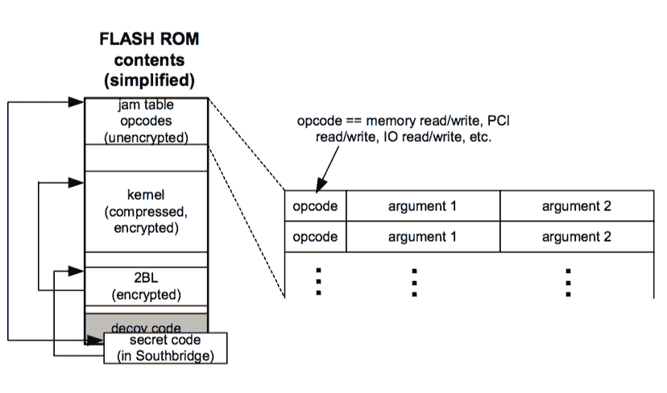
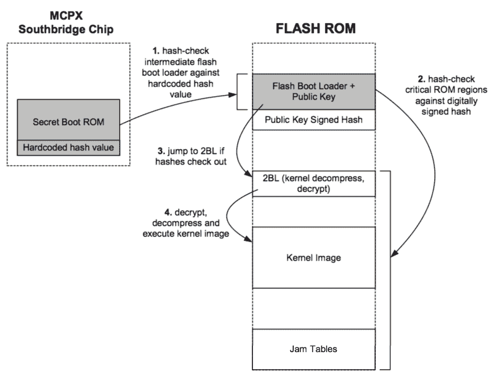

# 第九章：-

悄悄进入后门

在这本书中描述 Xbox 可行的攻击范围太多，无法一一列举。Xbox 基于 PC 架构，这是一个复杂、演化的架构，最初设计时没有考虑到安全性。据我所知，许多被智能卡黑客利用的经典硬件安全漏洞，如电源调制、旁路攻击和时钟故障，在 Xbox 上甚至都没有触及。关于这些安全弱点，你可以在密码学硬件在嵌入式系统（CHES）会议的论文集、计算机科学系列讲座笔记（Springer-Verlag）中找到更多信息。

很不幸，控制台和安全的 PC 制造商并不关心硬件安全弱点，因为硬件攻击“对普通消费者来说太难执行”因此威胁很小。虽然研究攻击确实需要一位熟练的黑客和正确的工具，但实施攻击可能非常便宜且容易。我想起了这样一个寓言：一位机械师被叫来修理一台重要的损坏机器，他花了一个小时观察情况，然后只通过在正确的位置敲击一下就修复了机器。当收到 1000 美元的账单时，机器的所有者要求知道为什么敲击一下要花这么多钱。机械师回答说：“敲击一下只需要一角钱。知道在哪里敲击需要 999.90 美元。”这个寓言的推论是，如果给出具体的指示，任何人都可以执行敲击来修复机器。

安全攻击通常是相同的：难以弄清楚；容易分享和实施。安全的硬件制造商也应该关注采用主要针对黑客入侵的被动政策。许多黑客在秘密中进行工作，并保持他们的方法和结果低调，以便供应商不能开发出适当的对策。这些黑客还维护一个已知攻击和后门的库，一次只公开一个，这样具有被动硬件安全政策的供应商总是处于追赶状态。

## **命名约定**的评论

黑客社区经常为重要概念发明自己的术语，这些术语可能因社区而异，也可能与行业标准术语不同。以下是由 Xbox-Linux 社区接受的术语列表。本书中使用的术语与我使用的任何偏差都将被注明。

+   **X-code**：跳转表操作码；秘密南桥（MCPX）引导 ROM 用于初始化 Xbox 硬件的操作码

+   **2BL**：第二个引导加载程序。这是由秘密引导 ROM 解密的代码。它被称为第二个引导加载程序，因为该代码的主要责任是解密和解压缩内核映像。

+   **Flash Boot Loader**：在版本 1.1 安全性中，这是在秘密启动 ROM 和 2BL 之间的一个中间启动加载程序。FBL 通过对秘密启动 ROM 内部的一个硬编码值进行轻量级哈希验证。因此，如果不更改 MCPX 硅片，则无法更改 FBL。FBL 负责验证 FLASH ROM 所有关键部分的数字签名。

+   **内核**：Xbox 内核代码。它以压缩和加密的形式存储在 FLASH ROM 中。

+   **版本 1.0 安全性**：原始 Xbox 安全系统使用 RC-4 加密在 2BL 上。

+   **版本 1.1 安全性**：第二个使用 TEA 哈希验证 FLASH ROM 区域的 Xbox 安全系统。带有版本 1.1 安全性的盒子最早的生产日期大约在 2002 年 8 月。

上一章描述了我对 Xbox 安全机制的监听攻击，最终得到了隐藏在一段秘密代码块中的 RC-4 密钥。本章描述了由我的同事设计的其他一些 Xbox 攻击，以及针对修订后的 Xbox 安全方案（在此称为安全版本 1.1）发起的攻击。

## **后门和安全漏洞**

一类针对 Xbox 的后门攻击利用了秘密启动代码初始化硬件的基本弱点。这种弱点源于硬件初始化是通过一个强大的干扰表指令解释器完成的，该解释器以未经验证的明文形式存储其命令。

### **Visor 干扰表攻击**

对 Xbox 的一种攻击涉及修改硬件初始化序列。回想一下，Xbox 的硬件初始化是通过一个指令解释器完成的，该解释器从未加密的 FLASH ROM 的一部分（称为“干扰表”）检索其命令。干扰表条目与 FLASH ROM 其余部分的关系如图 9-1 所示。干扰表条目以 <opcode, arg1, arg2> 元组的形式存储在最低 FLASH ROM 地址附近。可用的指令包括对 x86 架构中所有地址空间的内存读和写函数。由于干扰表以未加密的形式存储，并且从未检查过修改，因此可以在干扰表中插入指令，这些指令可以在 FLASH ROM 2BL 的 RC-4 解密之前“播种” Xbox 内存中的恶意指令或修改后的硬件状态。

干扰表修改的一个应用是恢复内核的明文，而不需要知道 RC-4 密钥。一位名叫 Visor 的黑客首先向我描述了这种方法。以下是 Visor 方法的总结：

1.  正常启动 Xbox。正常启动过程中的一部分会将解密后的内核映像放入主内存。

1.  在保持 Xbox 电源供电的情况下，将 FLASH ROM 的干扰表内容切换到另一个表，该表将主内存的区域复制到易于监控的位置，例如 FLASH ROM 的总线。

1.  对 Xbox CPU 执行软重置。这会强制硬件重新初始化，但不会擦除主内存。

1.  在修改后的 jam 表程序执行时记录主内存的内容。



**图 9-1**：与 FLASH ROM 其余部分的 jam 表操作码。

在步骤 2 中，动态切换 FLASH ROM 内容可以通过 ROM 模拟器或使用带有额外地址位连接到开关组的超大规模 ROM 来完成。

Visor 还描述了如何将 jam 表用作复杂破解的一部分，以控制 Xbox 的指令指针（IP）。为了更好地理解这个破解，我们将进一步调查秘密引导代码如何处理无效 FLASH ROM 镜像的情况。

在解密 FLASH ROM 镜像中的 2BL 之后，秘密引导代码会在 2BL 末尾附近的位置检查一个魔数。对于无效的 FLASH ROM 镜像，这个数字不匹配，会导致 CPU 跳转到位于 0xFFFF.FFFA 的短指令序列。这组指令一直持续到物理内存中的最后一个可寻址位置，即位置 0xFFFF.FFFF。一旦 CPU 执行了无效 ROM 镜像的最后一个指令，它应该因为代码段边界错误而崩溃并停止执行，当 IP 从 0xFFFF.FFFF 翻转到 0x0000.0000 时。然而，这并没有发生；相反，CPU 愉快地尝试执行位于位置 0x0000.0000 的任何指令，无论有效还是无效。理论上，这个指令是无效的，CPU 仍然会因为指令故障而停止。然而，可以在 Xbox jam 表初始化序列中使用 jam 表内存写入操作码将有效指令放置在那里。因此，通过破坏或擦除加密的 FLASH ROM 镜像，并修改 jam 表以插入跳转到您自己的未加密 FLASH ROM 代码中的跳转指令，您可以在不接触任何加密或类似技术措施的情况下控制 Xbox CPU 的 IP。因此，这种破解可能符合 DMCA 的规定。我说“可能”，因为 DMCA 是一部经常含糊不清的法律，而且很少有法院先例来澄清这些含糊之处。这种方法的合法性论据在于，从未解密或执行过任何重要的微软版权代码。唯一的例外是必须执行的秘密引导 ROM 的部分，因为它们是硬连接到南桥的硅芯片上的。参见第十二章“警告黑客”，以更深入地讨论当今黑客社区面临的合法问题。

### **MIST 提前取消映射攻击¹**

为了防止黑客控制 Xbox 时泄露秘密引导代码，南桥芯片中的秘密引导代码在退出前会自行解映射。换句话说，它在执行完毕后永久隐藏自己。因此，尝试访问内存中任何顶部 512 个字节的用户程序将看到 FLASH 内存中的诱饵块而不是秘密引导代码。Xbox-Linux 项目的负责人迈克尔·斯蒂尔发现了一种利用这一功能的方法。

解映射过程是通过写入 0x8000.8008 完成的，这是 PCI 配置空间中的一个硬件寄存器。基本策略是包含一个写入 0x8000.8008 并解映射秘密引导代码的干扰表操作码，在初始化序列完成之前。由于此时缓存已关闭，处理器将开始从诱饵块中获取和执行指令。幸运的是，由于诱饵块是 FLASH ROM 的一部分，因此可以自由修改。然而，干扰表解释器阻止了对位置 0x8000.8008 的写入，所以这不应该起作用。然而，南桥芯片组中 PCI 配置空间解码中的一个错误使得解映射指令对多个别名地址做出响应。特别是，“功能”位字段被忽略。因此，写入 0x8000.8X08（其中 X 不等于 0）也有效，并且这些写入不会被干扰表解释器阻止。因此，要使用 MIST 黑客技术控制 CPU IP，你必须修改 FLASH 中的诱饵块以包含你的代码，然后添加适当的干扰表操作码，在硬件初始化期间解映射秘密引导 ROM。

## **微软反击**

安全漏洞的发现促使许多人猜测微软会迅速更换其安全方案。2002 年 8 月，配备了新主板的 Xbox 在澳大利亚悄然出现。关于新安全系统的第一条官方消息来自一个不太可能的消息来源：Xbox 所使用的芯片组的生产商 nVidia。在 2002 年第二季度表现平平之后，nVidia 的一位发言人将此作为季度表现不佳的几个原因之一：

> “我们关于 Xbox 的说法是，我们已经达到了批量折扣的里程碑，进一步降低了利润率。并且我们将在第二季度进行库存减记，这与 MSFT 过渡到新的安全代码（通过 MIT 黑客）时变得过时的 Xbox MCP 数量以及我们为满足基于 Athlon 的 PC 更高需求而构建的 nForce 芯片组过剩有关。” —— 德雷克·佩雷斯，nVidia 公关总监²

## **逆向工程 v1.1 安全³**

安全代码变更的具体细节直到 2002 年 10 月才被揭露，当时一名叫 Andy Green 的黑客开始调查在英国可用的第一版 1.1 Xbox。Xbox 1.1 和 1.0 版本在主板上的外观物理差异细微：GPU 将其风扇换成了更大的散热片，USB 子卡被合并到主板上，并且缺少了一个 PLL 时钟合成芯片。此外，还缺少了这里的滤波电容器，但似乎没有发生任何重大的变化。进一步的探测发现，MIST 攻击所利用的漏洞已被修补，但中断表操作码没有改变。LPC 总线，获取 Xbox 访问权限的关键向量，也存在且没有改变。

Andy 使用一名名叫 Asterisk 的同行黑客想出的程序，在一天内提取了 MCPX ROM。该程序利用了之前已识别的安全漏洞和后门的未公开组合。对 ROM 内容的初步分析显示，安全措施是以一种截然不同的方式实施的。对版本 1.1 Xbox 的初步概述表明，旧的通过隐蔽实现的安全方案已被抛弃，取而代之的是一种名义上从公钥密码的强度中获得安全性的方案。



**图 9-2：Xbox 安全版本 1.1。不能不更换 MCPX 硅片而更改的区域被阴影灰色覆盖**。

微软对新的安全方案的实施有点反直觉。因为 MCPX 内部的秘密引导 ROM 大小保持不变，为 512 字节，所以他们无法在秘密引导 ROM 中容纳完整的公钥数字签名算法。相反，他们选择在秘密引导 ROM 中使用轻量级的散列值来验证一个被称为 Flash Boot Loader（FBL）的 FLASH ROM 区域。FBL 包含用于数字签名验证 FLASH ROM 的代码（RSA 密码、SHA-1 散列、微软的公钥和驱动程序）。只有当 FBL 的散列值可以与存储在秘密引导 ROM 中的常数进行验证时，FBL 才会执行。因此，从理论上讲，FBL 与秘密引导 ROM 一样不可变，尽管它存储在可变的 FLASH ROM 中。

尽管这个方案听起来相当坚不可摧，但黑客社区并没有轻易放弃。他们详细检查了秘密引导 ROM 的散列值，并发现它基于 David Wheeler 和 Roger Needham 在剑桥大学计算机实验室开发的 Tiny Encryption Algorithm（TEA）。努力中的合作者 Franz Lehner 向新闻组 sci.crypt 发送了一个关于 TEA 散列弱点的查询。

在 10 月 11 日星期五下午，他们的查询得到了回答。John Kelsey、Bruce Schneier 和 David Wagner 在 CRYPTO 1996 上发表的一篇论文指出，TEA 加密算法在其密钥调度器中存在弱点，每个密钥都有三个相关密钥，可以通过反转某些比特对来生成（这个弱点以及 TEA 加密算法在第七章中进行了更详细的讨论）。在周六，Andy Green 将此信息发布到了 XboxHacker.net：

```
Aw, I'm a mere mortal, my feet are definitely made of
clay.

OK, I don't think its giving too much away to say the
first 5 bytes of the region.

ffffd400: E9 83 01 00 00

This is a relative longbranch to 0xffffd588

If I flip b31 of that as a DWORD (and flip its friend at
DWORD address +1 the same way) I branch instead to
0x7fd588.... Hmmmm that's, what, 8M up, where...

where
there's
RAM

Xcodes.. visor ram push method... (looks at MCPX for RAM
Write X-Code)

X-Code opcode 3 ... unrestricted

Hold on to your hat, boys! Its testing time!

(mviz, a marvelous and well-timed revelation, I feel
mysterious and invisble forces helping me along, for which
I am grateful!)4
```

换句话说，TEA 加密算法的相关键弱点意味着 FBL 中每对相邻的双字都可以通过改变一个比特，即最重要的比特，来修改，而不影响生成的哈希值。这种弱点给了 Andy 和他的团队足够的空间来修改单个跳转指令的目标，使其指向主内存中的某个位置。

## **个人简介：Andy Green**

**你能告诉我们更多关于你自己的信息，以及你是如何开始黑客生涯的吗？**

我现在 37 岁，住在英格兰，东米德兰地区的凯特林附近，和我的妻子、我们的四个孩子和两只猫一起生活。

我从大约 12 岁开始对计算机产生兴趣，那时我的哥哥买了一台 Commodore Pet。这台 1MHz 的 6502 让我忙了好几个月，试图从杂志上输入 BASIC 代码，然后为它编写游戏；最终我用机器码编写了一个非常棒的字符单元格太空侵略者游戏。机器码就是你在直接用十六进制编程 CPU；我现在还能记得常见的 6502 操作码的十六进制表示。这是一项如此困难的努力，以至于我决定我的下一个项目将是一个用机器码编写的汇编器。1978 年是在互联网出现之前：我买不起商业汇编器，因为我只是个孩子，我们周围也没有人知道从哪里盗版一个副本。

这在汇编器中相当可怜，但它确实工作得很好。我从中学到了正确工具的价值，我可以用汇编器写得更快，而且整个种类的错误，比如手动计算相对分支的错误，都完全消失了。接下来我有了 BBC Model B 电脑，我又对制作工具和游戏产生了兴趣。我得到了一所公立学校的奖学金，但我拒绝了，并在 16 岁时辍学，没有接受进一步的教育。我对自学任何感兴趣的东西感到非常满足。

我为这个和另一个名为 Oric 的 6502 平台出售了一些游戏，并用那些钱成立了一家制作汇编器和其它开发工具的公司。在这个过程中，我学习了 C 和 C++，每次我都能解决一大堆的 bug 和浪费时间的问题。

这就像“人类简史”中的那张图片，从 Nethanderal 的相对分支计算到直立人及其虚拟函数。

在此同时，我开始探索数字硬件设计，再次通过经验自学。我发现硬件和软件是同一枚硬币的两面，尽管在教育中它们被完全分开对待。你选择在软件中还是硬件中实现你的逻辑功能，或者两者的混合，这实际上是一个实现细节。在两个领域都有立足点，能更深入地了解设计的本质：例如，可以说 C++在接口的重要性方面借鉴了许多电子学的概念。

在对 Xbox 产生兴趣之前，我曾在一家美国公司工作，该公司在牛津设有办公室，做过很多工作，但最后一个是设计智能卡硅片。尽管设计很有趣，那里也有一些出色的人在工作，但我对政治和管理问题越来越感到沮丧。而且，尽管我参与了几个项目，但由于我基于英国，我的薪水只有圣何塞员工的 2/3。更别提他们从我这里获得的专利，而我却没有任何回报。2001 年 12 月，我发现诚信比金钱更重要，于是辞职，决定重新开始自己工作。

离开这家公司时，我经历了一些不愉快的经历，这使得我感到有些脆弱。在消化这些经历的过程中，我发现自己在丑陋、贪婪、控制的本能与涉及知识产权的普通公司的观点之间，以及 GPL 项目的性质和参与鼓励减少专利和版权法严厉程度的人之间存在着巨大的差异。随着时间的推移，我越来越看到微软和我在前一家公司工作的公司是同样的光景。

之后，我在 Slashdot 上读到了 bunnie 的破解文章。我带着一些尖锐的情感阅读了 bunnie 的方法。我主要的想法是，这本来是我可以做的事情，因为我从 1989 年开始就使用 bunnie 使用的 FPGA，对攻击的简洁性表示钦佩，对自己没有做同样酷和有趣的事情——并且与我哲学上的偏好相匹配——感到沮丧。相反，我坐在那里阅读 Slashdot，喝咖啡，没有做出任何贡献。（顺便说一句，我认为这是许多 Slashdot 读者的常见经历，当他们读到别人的酷破解时，会感到一丝嫉妒和挑战。我认为这解释了那里持续的背景噪音，嘲笑和质疑为什么有人会想这样做。）

在接下来的几周里，我尽可能地收集了有关 Xbox 内部的信息；Xboxhacker.net 对这一点至关重要。这也是我遇到 Michael Steil 的地方，因为 Xbox Linux 项目刚开始。很快，我就能够确定我可以贡献的有趣项目，例如 Milksop 项目。再次通过这个，在 Surferdude 的帮助下，我能够组装出第一个能够启动并保持 Xbox 运行而不需要重置的干净 ROM。这后来成为了 crom 1MB Linux 和 cromwell，Xbox Linux 干净 ROM 的基础。在最初的破解和设计之后，我决定几乎完全致力于 Xbox Linux 的目标。

**你能告诉我们你为什么破解 Xbox 吗？**

为什么？每个人都有不同的理由，但对我来说，是我对微软无理取闹的反垄断行为的理解——否认一切，上诉一切，拖延一切，同时，在市场上创造和倾销（因为它们以低于成本的价格出售）数百万台仅适用于微软的 PC——Xbox。由于我们这里的欧洲和美国代表似乎并不关心（也许，就像最近在欧盟发生的那样，因为他们计划去微软工作并拿走他们的银色股份），能够成为揭露这个庞大垄断的邪恶计划的一部分，使用 GPL 和 Linux 的武器，将是一种荣誉。我知道人们闭上眼睛，想着他们的股票期权，但这对正派的人来说——当然，那里的大部分人都是这样——为这样一个怪物工作肯定很难。

我很幸运，在 2002 年得到了几个合同，让我能够全年专注于将第一个 Linux 内核放入 crom，并将 Cromwell 提升到能够控制盒子的主要外围设备，并从 HDD 或 CD 启动 Linux。从那时起，我的 Project A 奖金份额（多亏了捐赠者 Michael Robertson）将允许我继续全职工作，至少在接下来的几个月里。

**你有什么建议想要分享吗？**

我的最后想法是鼓励人们，尤其是年轻人，在遇到自己感兴趣的事情时，要听从自己的大脑。不要害怕去挖掘和尝试了解那些吸引你注意的事物。当你渴望理解某件事时，那种渴望，是你大脑告诉你，它认为这些知识将来可能有用。如果你足够听从它，你就有很大机会在正确的时间知道正确的事情，从而产生一些小的影响。

那个单一位置可以预先加载一个后续跳转指令，回到任何使用之前讨论的 jam 表代码的用户代码。Xbox 破解社区团结起来，进行了英勇的努力，三天内破解了 Xbox 安全版本 1.1。Xecuter 的另一个同样英勇的努力也在相同的时间内破解了安全系统。

这个故事的第一条道德准则是，安全性的强弱取决于其最薄弱的环节。虽然对于 RSA 密码和 SHA-1 散列在数字签名方面的鲁棒性几乎没有疑问，但这些并不是安全系统的唯一元素。用于扩展安全引导 ROM 信任域到 FLASH ROM 的 TEA 密码存在缺陷，这允许黑客绕过强大的数字签名算法。这引出了我们的第二条道德准则：复杂性滋生弱点。复杂的系统难以设计、测试和分析。Xbox 的 1.1 版本安全可能是在时间紧迫的情况下实施的，因此没有足够的时间分析系统中的弱点。要么是这样，要么是微软知道 TEA 的弱点，并故意将这个后门设计进系统中以减轻将 FBL 锁定在硅中的风险。微软故意包含这个后门似乎相当可疑，因为修改 MCPX 硅片是一个非常昂贵的提议（尽管最终费用落在了英伟达的账上）。另一方面，复杂性难以避免。我在麻省理工学院的导师汤姆·奈特曾告诉我：“在这个世界上有两种设计：那些有用的，以及那些你可以形式化证明是正确的。”在某种程度上，确保现实世界系统安全性的唯一方法就是使其细节公开（不要通过神秘来保证安全！）并从所有角度对系统进行分析。从某种意义上说，由于黑客社区的帮助，对 Xbox 安全性的彻底分析正在进行，而微软无需承担任何费用。

即使微软在秘密引导 ROM 中使用了更强的散列函数，仍然有许多针对 Xbox 的有效攻击尚未尝试。可以通过对 HyperTransport 总线进行中间人攻击（见第八章），通过精心定时脉冲过载信号来实现。这种攻击的实现相当简单，因为每个 HyperTransport 总线轨迹都有从主板组件侧可见的测试点。一个完整的硬件解决方案将涉及一个带有“弹跳针”床钉式测试连接器的板上的 FPGA。这个板可以压在这些测试点上而无需焊接。另一种攻击，由 Adi Shamir 在 CHES 会议上建议，是在 CPU 时钟或电源供应中引入定时故障，以干扰跳转目标地址的计算。这种攻击已经在加密智能卡的处理器上成功应用。同样，这种攻击可以相当容易且便宜地作为用户可安装的模块实现。（记住，如果目标是一次性破坏安全以恢复，例如，一个秘密密钥或一段关键代码，黑客有更广泛的攻击范围。）

## **后门威胁**

正如本章所证明的，寻找后门是一种攻击加密保护硬件的实际方法。在 Xbox 中找到后门的高成功率部分是因为 Xbox 是第一个尝试对 PC 进行加密保护的重要尝试。尽管从 Xbox 的经验中吸取了教训，但未来的安全 PC 实现仍然面临硬件安全弱点的风险，因为 PC 的传统是一个开放且未受保护的硬件架构。

## **个人简介：Franz Lehner**

Franz Lehner，29 岁，住在奥地利，与他的女朋友一起生活。他学习了 5 年的电气工程。现在，他在运营 ISP 的同时编写“自动化解决方案”。在他的业余时间，他寻找有趣且具有教育意义的工程项目。

在找到 bunnie 的 Xbox 破解文档后，他在 sourceforge.net 上遇到了 Xbox-Linux 团队。他加入了 Xbox-Linux 项目，以学习团队编程、Linux 内核破解和调试以及加密系统。他还加入了 Xbox-Linux 项目，以更好地理解相关系统，例如 Palladium。

PC 硬件复杂且脆弱，由于这种脆弱性，从其中构建信任链是困难的。从根本上讲，PC 中的每个组件都是设计为对其物理环境“信任”的。任何商业集成电路组件的规格都明确指出，该 IC 保证在一定的温度、电压、频率和其他条件下运行。如果违反了这些最大额定值，则设备的行为将是“未定义的”，所有赌注都无效。大多数芯片工程师甚至不考虑尝试使他们的电路从超出范围的条件下优雅地恢复，因为这已经足够困难，要使芯片在指定的操作条件下工作。此外，大多数消费类应用对成本非常敏感，构建健壮的容错措施的开销导致产品不具备价格竞争力。

因此，芯片通常没有内部错误检查。如果由于某种原因，算术逻辑单元（ALU，CPU 的计算“大脑”）错误地加上了两个数字，问题将只会以症状的形式表现出来；你只能观察到这种错误的效应，有时是在错误事件发生很长时间之后。人们可以将利用超出范围条件引起的故障的攻击视为软件世界中缓冲区溢出的类比。

PC 架构的另一个问题是处理器对其代码环境过于信任。奔腾处理器架构在硬件上没有提供区分不安全或安全代码的机制。如果指令指针偶然通过一个错误或诱导的故障进入了一个不安全的代码段，处理器将愉快地执行这段代码。

### 注意


**基于硬件安全级别的代码隔离** **是一种不同于沙箱的技术。沙箱技术无法为需要从或与秘密或受保护代码或数据进行方向指引或交互的用户程序提供充分的解决方案。最近，** **一些新的处理器架构被提出，可以通过使用嵌入某种安全审计日志的数据标签来解决这一问题。⁵**

另一个后门来源是每个复杂芯片中存在的设计缺陷。将带有大量已知缺陷的芯片发货是一种常见做法，这些缺陷也被称为错误。例如，1991 年首次发布的 Intel i860 XP 处理器（不要与最近发布的用于 Pentium4 处理器的 i860 芯片组混淆）附带的错误列表与处理器数据表的大小相当。另一个更贴近的例子是 nVidia MCPX 地址空间解码器中的错误，这使得 MIST 提前取消映射攻击成为可能。大多数这些错误都有简单的解决方案，或者在正常条件下对芯片的功能影响很小。然而，一些错误，如涉及缓存一致性、地址解码和内存管理的错误，可能导致重大的*软件*安全漏洞。

在 Xbox 的情况下，硬件后门的商业影响可能很小。也许微软会损失一些游戏销售收入的微小部分，但与微软在硬件销售上的损失相比，盗版造成的损失微不足道。此外，Xbox 只是一个游戏机——奶奶的银行账户并没有因为 Xbox 的安全漏洞而被耗尽，或者信用卡号码被盗。然而，对于受信任的 PC 来说，风险将不仅仅是游戏收入。除非受信任的 PC 架构与旧 PC 有根本性的改变，否则人们将盲目地将财务秘密和个人数据安全托付给不可信的硬件。

就像生活中的大多数事情一样，第一步是教育。我们了解的硬件安全越多，即使这涉及到在游戏机上摸索，我们的安全系统明天就会越好。现在，继续上课吧……

* * *

¹ 来自 Andy Green 在第 19 届混沌通信大会关于 Xbox 安全黑客攻击的演讲。

² 来自《询问者》杂志的文章，http://www.theinquirer.net/?article=4735

³ 来自 Andy Green 在第 19 届混沌通信大会关于 Xbox 安全黑客攻击的演讲。

⁴ 来自 www.xboxhacker.net 的帖子，在 Xbox Hacker BBS 下的 Xbox Hacking (TECHNICAL) -> BIOS/Flash ROM/Firmware -> Xbox Linux Team 的新闻，MS“搞砸了”，内部结构暴露。

⁵ http://www.ai.mit.edu/projects/aries/Documents/Memos/ARIES-15.pdf. “通过动态确保安全信息流的最低可信计算基础，”由 Tom Knight 和 Jeremy Brown 撰写。
